# ISCC 练武初赛re+mobile wp-先知社区

> **来源**: https://xz.aliyun.com/news/18015  
> **文章ID**: 18015

---

# mobile

## ISCC mobile 邦布出击

安装apk  
  
点击右下角的按钮，进入图鉴界面，百度各种邦布的种类，一个一个试，可以得到三段base64加密的文本  
[邦布图鉴 - 绝区零WIKI\_BWIKI\_哔哩](https://wiki.biligame.com/zzz/%E9%82%A6%E5%B8%83%E5%9B%BE%E9%89%B4)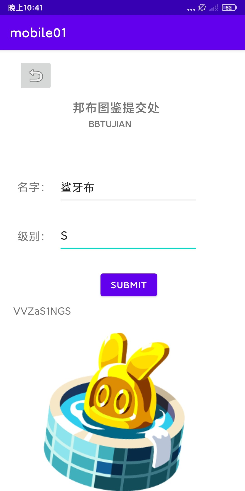[哔哩](https://wiki.biligame.com/zzz/%E9%82%A6%E5%B8%83%E5%9B%BE%E9%89%B4)

```
VVQwOQ==
lZOVlZU
VVZaS1NGS
```

然后将三段base64拼接起来，循环解码三次base64  
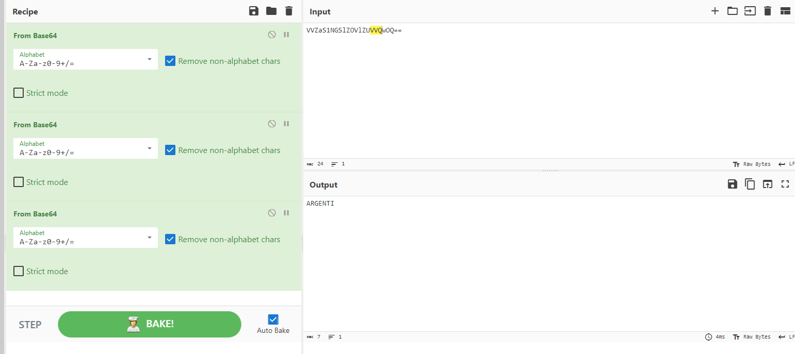  
得到一串明文  
尝试打开解压得到的db文件，提示非数据库文件，经查询是经过sqlcipher加密，那么此前得到的明文应该就是解密的key

```
>sqlcipher enflag.db
SQLCipher version 3.8.0.2 2013-09-03 17:11:13
Enter ".help" for instructions
Enter SQL statements terminated with a ";"
sqlite> PRAGMA key = 'ARGENTI';
sqlite> ATTACH DATABASE 'plaintext.db' AS plaintext KEY '';
sqlite> SELECT sqlcipher_export('plaintext');

sqlite> DETACH DATABASE plaintext;
sqlite> .q
```

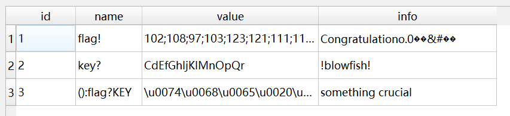  
flag是假的，实际应该留意的是key以及info中的blowfish（一种加密方式）  
使用jadx打开apk

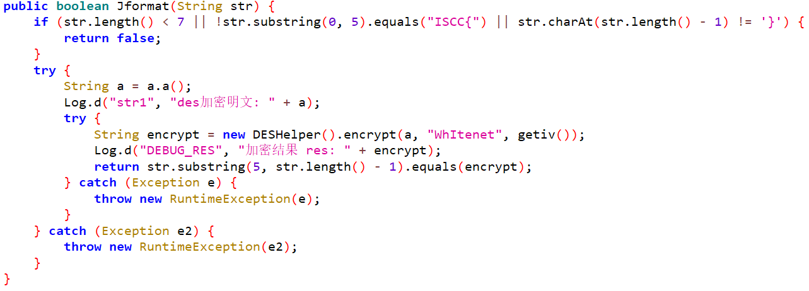

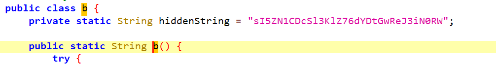  
将上图中的密文通过blowfish解密之后得到的内容就是DES的明文  
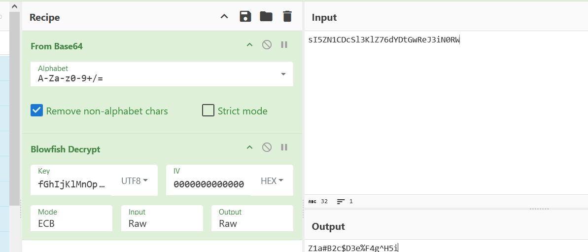  
根据apk的逻辑，只有当该明文DES加密的结果和输入内容去掉flag格式后的内容相同才正确  
已知明文、key、加密方式，那么对于DES加密，还需要具备的就是iv，但是iv是通过native函数生成的  
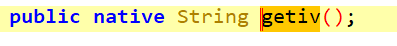  
方法一：分析so文件iv的生成逻辑 -- 生成逻辑比较复杂，放弃  
方法二：hook native function，在调用getiv时输出iv  
这里使用frida hook（要在手机上先运行frida-server）

```
Java.perform(function () {
    try {
        var cls = Java.use("com.example.mobile01.MainActivity");
        cls.getiv.implementation = function () {
            var iv_val = this.getiv();
            console.log("[*] MainActivity.getiv() called, returned: " + iv_val);
            return iv_val;
        };
        console.log("[+] Hooked com.example.mobile01.MainActivity.getiv()");
    } catch (err) {
        console.error("[-] Failed to hook MainActivity.getiv: " + err);
    }
});
```

```
frida -U -f 进程名 -l hook.js
```

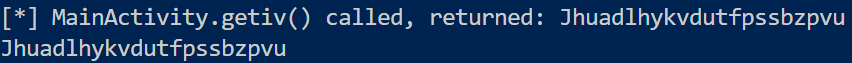

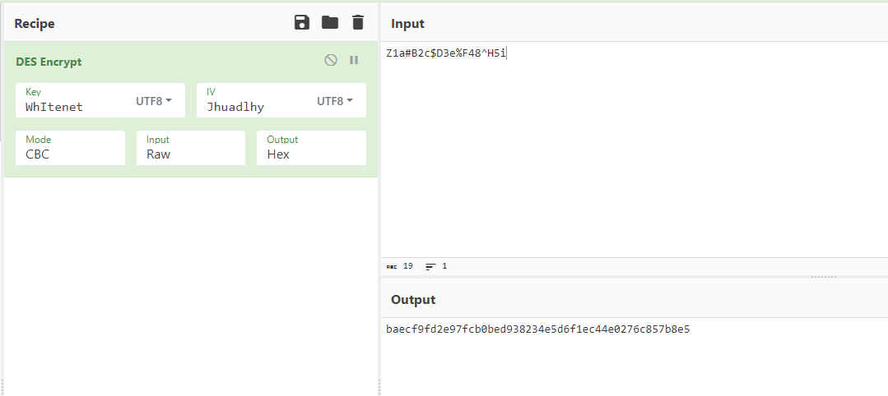

## ISCC mobile detective

附件是一个apk文件，用jadx打开  
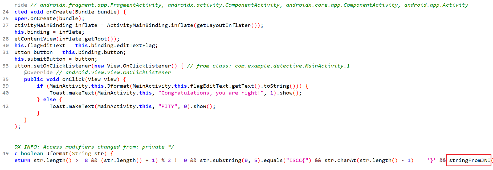  
可以看到关键是这个stringFromJNI函数，跟进之后发现是native函数，因此用IDA打开so文件  
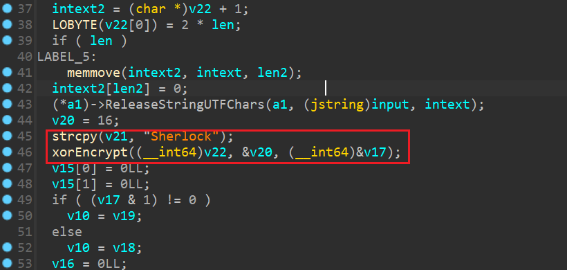  
关键是这个xorEncrypt函数  
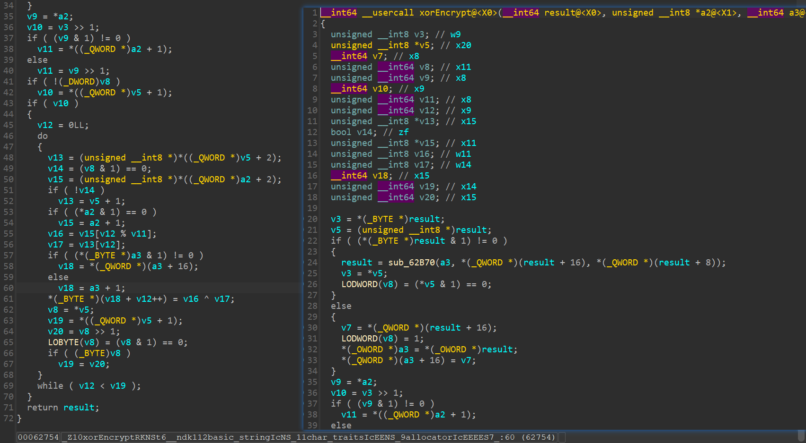  
通过分析代码可知，该函数先将字符串转换为十六进制，再将输入与key异或之后转为字符串，然后从每4个字符中提取前2个字符，然后再根据一定规律打乱字符串的位置信息，最后替换特定位置的字符

```
import re
from functools import reduce
import binascii

class CryptoSolver:
    @staticmethod
    def extract_alternate_chars(encoded_text):
        """提取每4个字符中的前2个字符"""
        if len(encoded_text) % 4 == 2:
            encoded_text += '00'
        return ''.join([encoded_text[i:i+2] for i in range(0, len(encoded_text), 4)])
    
    @staticmethod
    def hex_encode_chars(text):
        """将字符串转为十六进制表示"""
        hex_representation = ''.join([f'{ord(c):04x}' for c in text])
        return hex_representation[2:] if hex_representation.startswith('00') else hex_representation
    
    @staticmethod
    def process_pattern_swaps(text):
        """处理特定模式的字符交换"""
        result = []
        pattern = re.compile(r'(..)(..)') 
        i = 0
        
        while i < len(text):
            if i + 3 < len(text) and text[i+2:i+4] == '21':
                result.append(text[i+1])
                result.append(text[i])
                i += 4
            else:
                result.append(text[i:i+2])
                i += 2
                
        return ''.join(result)
    
    @staticmethod
    def interleave_with_substitution(text):
        """分割、替换和交错合并处理"""
        mid_point = len(text) // 2
        first_half = list(text[:mid_point])
        second_half = list(text[mid_point:])
        
        # 替换特定位置的'3'为'0'
        for i in range(len(second_half)):
            if second_half[i] == '3' and (i == 0 or i % 3 == 0):
                second_half[i] = '0'
                
        for i in range(len(first_half)):
            if first_half[i] == '3' and (i == 1 or (i-1) % 3 == 0):
                first_half[i] = '0'
        
        # 交错合并
        merged = []
        for i in range(len(text)):
            if i % 2 == 0 and i//2 < len(second_half):
                merged.append(second_half[i//2])
            elif i % 2 == 1 and i//2 < len(first_half):
                merged.append(first_half[i//2])
                
        return ''.join(merged)
    
    @staticmethod
    def decode_to_chars(encoded):
        """将十六进制编码转换为字符"""
        chars = []
        index = 0
        
        while index < len(encoded):
            if encoded[index] == '0' and index + 2 < len(encoded):
                # 处理三位编码
                hex_val = encoded[index+1:index+3]
                chars.append(chr(int(hex_val, 16)))
                index += 3
            else:
                # 处理四位编码
                end = min(index+4, len(encoded))
                hex_val = encoded[index:end]
                if end - index == 4:  # 确保有足够的字符
                    chars.append(chr(int(hex_val, 16)))
                index += 4
                
        return ''.join(chars)


class XorDecoder:
    def __init__(self, key="Sherlock"):
        self.key = key.encode('utf-8')
        self.solver = CryptoSolver()
    
    def xor_bytes(self, hex_string):
        """XOR解密十六进制字符串"""
        # 将十六进制字符串转换为字节列表
        bytes_data = [int(hex_string[i:i+2], 16) for i in range(0, len(hex_string), 2)]
        
        # 应用XOR操作
        xor_result = []
        for i, byte in enumerate(bytes_data):
            key_byte = self.key[i % len(self.key)]
            xor_result.append(byte ^ key_byte)
            
        # 转换为UTF-8字符串
        try:
            return bytes(xor_result).decode('utf-8')
        except UnicodeDecodeError:
            # 处理解码错误
            return ''.join([chr(b) for b in xor_result])
    
    def process_layers(self, input_text):
        """应用多层处理"""
        layer1 = self.solver.hex_encode_chars(input_text)
        layer2 = self.solver.extract_alternate_chars(layer1)
        layer3 = self.solver.process_pattern_swaps(layer2)
        layer4 = self.solver.interleave_with_substitution(layer3)
        return self.solver.decode_to_chars(layer4)
    
    def decrypt(self, encrypted_hex):
        """完整解密流程"""
        # 先XOR解密
        intermediate = self.xor_bytes(encrypted_hex)
        # 然后应用多层解码
        return self.process_layers(intermediate)


def main():
    # 示例加密数据
    encrypted = "xxxxxxxxxxxxxxxxxxx"
    
    # 创建解码器并解密
    decoder = XorDecoder()
    result = decoder.decrypt(encrypted)
    print(f"解密结果: {result}")
    
    # 直接使用XOR解密检查中间结果
    xor_result = decoder.xor_bytes(encrypted)
    print(f"XOR中间结果: {xor_result}")


if __name__ == "__main__":
    main()
```

​

## HolyGrail

附件为apk安装包  
  
使用jadx打开apk，发现其中有许多checkbox，点击checkbox的响应如下  
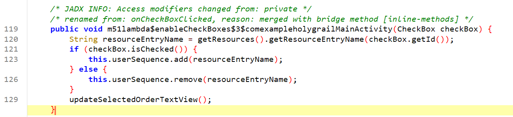  
每点击一个checkbox就会在userSequence末尾添加当前checkbox的资源名称  
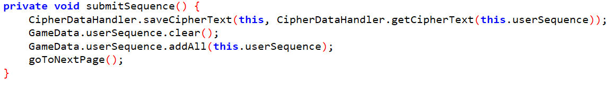

而根据app的提示，需要按照特定顺序点击checkbox，才能进入验证flag的页面，并且返回在native层加密后的密文  
关于顺序，可以自行百度，也可以问ai，最终顺序如下  
  
如何获得密文：通过frida hook，手动传入特定顺序的参数（每个checkbox的参数也需要通过frida hook得到），然后输出返回的密文

```
var cipher = Java.use("com.example.holygrail.CipherDataHandler");
    var args = Java.array("java.lang.String", ["checkBox8","checkBox6","checkBox7","checkBox5","checkBox12","checkBox3","checkBox10","checkBox13","checkBox11","checkBox","checkBox9","checkBox4","checkBox14"]);
console.log(cipher.generateCipherText(args));
```

然后分析验证flag的页面  
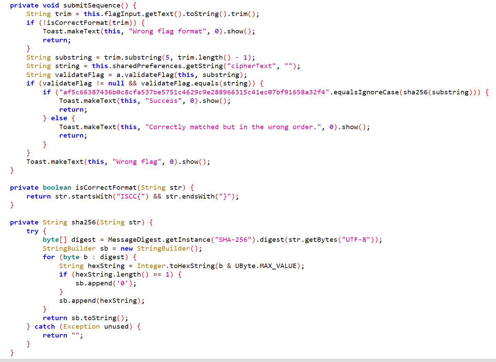  
首先检查flag格式，然后调用a类的validateFlag方法  
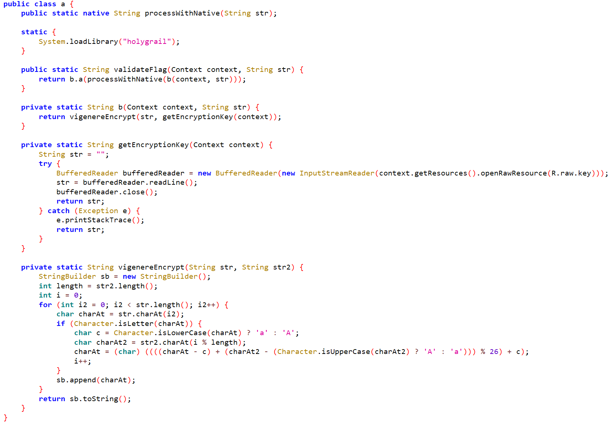  
大概流程

* getEncryptionKey
* vigenereEncrypt
* processWithNative
* b.a  
  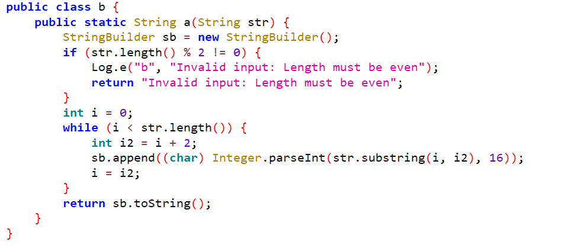  
  由于processWithNative是JNI函数，因此尝试frida hook该函数，尝试传入不同的值，发现每个字符对应的加密结果和顺序无关，因此可以直接生成所有字符加密的结果，再对目标字符串进行匹配

解密思路

* 转十六进制
* 字符替换
* 字符偏移

exp

```
from collections import defaultdict
import hashlib
import binascii
from rich.progress import track

CHARACTER_SET = r"0123456789abcdefghijklmnopqrstuvwxyzABCDEFGHIJKLMNOPQRSTUVWXYZ!#$%&'()*+,-./:;<=>?@[\]^_`{|}~"

def build_mapping_table():
    raw_data = "39213A213B213C21402141214221432144214521464748494A4B4C505152535455565758595A5B5C60616263646550215121522153215421552156215721582159215A215B215C21303132333435363738393A3B3C272129212A212B212C2130213121322133213421352136213721382146214721482149214A214B214C2140414243444566676869"
    mapping = []
    
    idx = 0
    while idx < len(raw_data):
        if idx + 3 < len(raw_data) and raw_data[idx+2:idx+4] == "21":
            mapping.append(raw_data[idx:idx+4].lower())
            idx += 4
        else:
            mapping.append(raw_data[idx:idx+2].lower())
            idx += 2
            
    return mapping

class VigenereCipher:
    def __init__(self, key):
        self.key = key.lower()
        self.key_length = len(key)
        
    def decrypt(self, text):
        result = []
        key_position = 0
        
        for character in text:
            if not character.isalpha():
                result.append(character)
                continue
                
            base = ord('a') if character.islower() else ord('A')
            
            key_char = self.key[key_position % self.key_length]
            key_shift = ord(key_char) - ord('a')
            
            char_code = ord(character) - base
            decrypted_code = (char_code - key_shift) % 26
            result.append(chr(decrypted_code + base))
            
            key_position += 1
            
        return ''.join(result)

def compute_hash(content):
    """计算内容的SHA-256哈希值"""
    return hashlib.sha256(content.encode('utf-8')).hexdigest()

class CryptSolver:
    def __init__(self, cipher_mapping, charset):
        self.cipher_mapping = cipher_mapping
        self.charset = charset
        self.vigenere = VigenereCipher("TheDaVinciCode")
        
    def chunk_hexstring(self, hex_string):
        """将十六进制字符串分割为块"""
        chunks = []
        position = 0
        
        while position < len(hex_string):
            if (position + 3 < len(hex_string) and 
                hex_string[position+2:position+4] == "21"):
                chunks.append(hex_string[position:position+4])
                position += 4
            else:
                chunks.append(hex_string[position:position+2])
                position += 2
                
        return chunks
        
    def decrypt_message(self, encrypted_bytes):
        """解密消息的主流程"""
        hex_data = binascii.hexlify(encrypted_bytes).decode() if isinstance(encrypted_bytes, bytes) else encrypted_bytes
        
        hex_chunks = self.chunk_hexstring(hex_data)
        print(f"解析后的块: {hex_chunks}")
        
        translated = []
        for chunk in hex_chunks:
            try:
                index = self.cipher_mapping.index(chunk.lower())
                translated.append(self.charset[index])
            except ValueError:
                translated.append('?')
                
        intermediate = ''.join(translated)
        print(f"中间结果: {intermediate}")
        
        plaintext = self.vigenere.decrypt(intermediate)
        print(f"解密结果: {plaintext}")
        
        return plaintext

def main():
    cipher_mapping = build_mapping_table()
    
    solver = CryptSolver(cipher_mapping, CHARACTER_SET)
    
    encrypted = b"xxxxxxxxxxxxxxxx"
    result = solver.decrypt_message(encrypted.hex())
    
    return result

if __name__ == "__main__":
    main()
```

## whereisflag

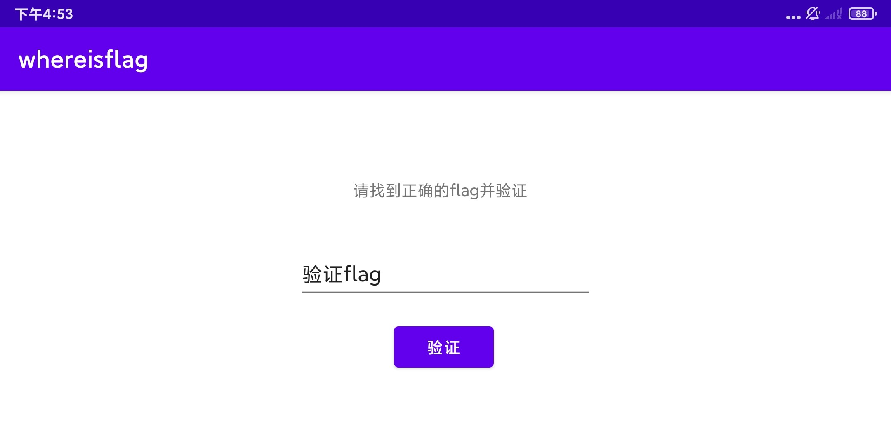  
jadx打开apk可以看到具体逻辑  
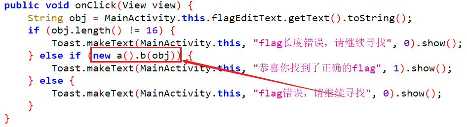  
分析之后发现核心函数是native函数  
**Native 函数基本介绍**

* **定义**：Native 函数通过 `native` 关键字在 Java 中声明，实际代码编译在 `.so` 动态库（ELF 格式）中。
* **JNI 桥梁**：Java 层通过 JNI（Java Native Interface）调用 Native 函数，函数名和参数需遵循 JNI 规范。  
  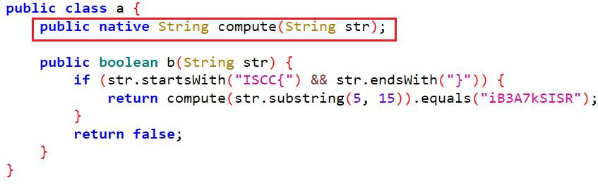  
  用解压软件直接解压apk文件，然后进入`\lib\arm64-v8a`目录找到so文件，使用IDA64打开so文件，在其中找到`Java_`开头的函数便是native导出函数  
  在加密函数中首先将输入倒序  
  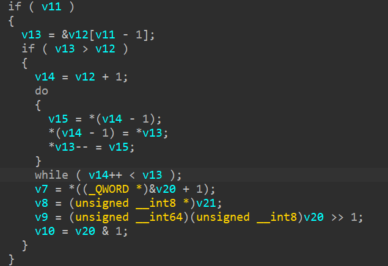  
  然后根据字符表查找输入的字符  
  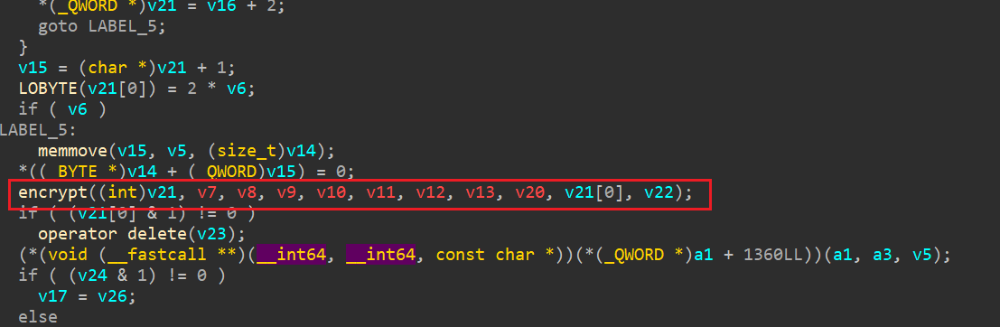  
  字符表需要动态调试得到  
  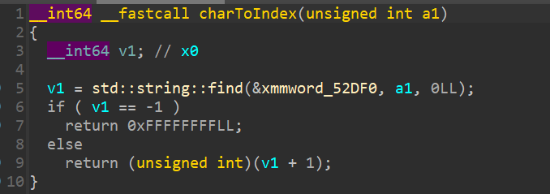  
  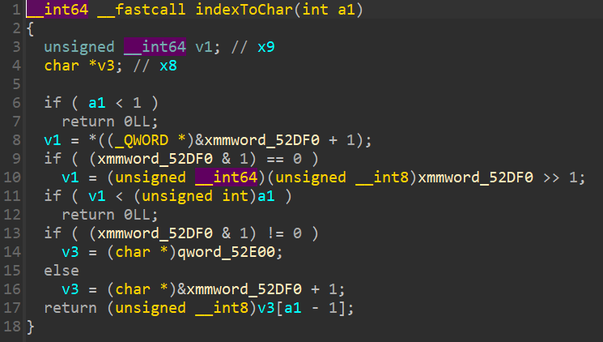  
  而根据encrypt、charToIndex、indexToChar函数的逻辑，可以看到在索引转换时有固定偏移，为2  
  从jadx反编译的结果得到目标密文`iB3A7kSISR`，解密

exp

```
s = "WHEReISFLAGBCDJKMNOPQTUVXYZabcdfghijklmnopqrstuvwxyz01234567890"

ss = "iB3A7kSISR"

print("".join([s[(s.index(i)-2)%len(s)] for i in ss][::-1]))
```

# RE

## 打出flag

从可执行程序的图标判断为pyinstaller编译的程序，使用pyinstxtractor反编译

```
python pyinstxtractor.py asd.exe
```

然后打开反编译的文件夹，打开同名pyc文件，反编译（uncompyle6或者在线）  
[python反编译 - 在线工具](https://tool.lu/pyc/)

```
#!/usr/bin/env python
# visit https://tool.lu/pyc/ for more information
# Version: Python 3.8

import lzma
import base64
exec(lzma.decompress(base64.b64decode('/Td6WFoAAATm1rRGAgAhARYAAAB0L+Wj4EzVCRVdADSbSme4Ujxz7+Hf194lj8gW1Q3vdmpD9bA5kMAX5vo4DjmD00fNTiiWpcUAOu/4HxtR6pDK4KPMcK84Tkm/z3YNY7OVgspKHVZDCHRRL4/1SxJ9fYuRiZcB4cwSu/bRIf0uEM1c14WEofMGPeTCS4oVJKSUZzxDjub1IVjyG5HudLa6iTN3ThfNpKJ6wI/WGEk/vZ75gMiTHmwt6zIlRqK58iDY89xjBkLLPiNaEg0M1bAxox+asSs8rQwIjIGPcyiahDUNAUq5hJOZzRtzYs21dtlmf+MtQUNKztZDWaoE6ITx+9wmkS/N4WIysJMypQfiCqBOj2gSIMi4Ki4Uc7jIk4X/0x1FHUCmZlp3UCP0TVt3X7OK/glQWX5H5U0nPHu2EC1US1ietn1UN+FkdRCpIXZ8oFVA7tuenq7iPfXPibLw41QkJtaSKQ27QCFbvcXgcO0Z7WC8/8xKkkV7W4hn8rhe03awblSIUzwTHwPyWOCEMKebW3rU7Dsj8uPKbhuv/Gle+lROHnzm5eUjEPKIkuz6Iob/NxkuJ+BgSkc0IXxxXDQQ5fwNzv/RW4nIBXbWdPRf0ALoz1pVxOJGlVNsq/JeklWtySR1fXEJ934AYVUnKytbWngUGrlllxXQBLY6H3N/jCKGQh/HwYbUv58o7M0ehfuP/LCjvvWMEQm5l808KFkh1XR3U7hEvwptWP8lU7spPDtqmEiP1cXAbNMc8Py4ocTZ12CPjRprbQlN1TgwsZj6AcNzIdnZRxVp2J5iDIkk29wxj+B4FylHw0r6ohI8PdvWuYhnOPYf+lRnJH9Ip6NrDqKNBeoryZMqNU2a2cXLb19qC/vEcB1ky+DY90scEpdw2bfnnP3nCbp+I7pLGRhlFfg1kVNuvBZGS4oXV3casHjt+vTfHsPu532XOddTzNzsqaOBg5ilv/hMHMnlheLYzNN8uLELIcgzG6yFiU+81OgQVNGPOEhzZ+VTAV2Wg0yFEY9ftC/JrGqfKZfnXPN8TYXfFxFJu0GFLWUKkkaGhKxqXAwEsg/rZlQ3EVufRSxAP39D9uu/5uezwU3lXsqw5XVqkySCHYmUAG3nfuqwM7m1mBnsiUq84bToWHv7qQW7vk3XIU7n2sdEWudik7DdVQ1I+sgUo2jhM+dZSz5cA9hq37lmflg0594fCOdeLTlI5W8UrEqKH5027oKy5ANB5LfzTZc0tuE+LdEX3Qy8ju1tlv+2cPWvgilD47baE8M4gggCpqxPa7URBUbegQtrnq6v9C5y6Aa0Bu8j0P7xUzSLk+NMdCWnNwco+PzYYjlqXLyDvcbNWOQoCA+Y0P5FqvQMZ2dXAvJM+9GGPfBtgBqXdWrPYTaM9V30F6iEPsmWDLeUGBhoOxCfQIEsSuXxifASRyxTKNCkRWsIyNcK++wukIAHPOM+6sv8DcVXS0muEkmATJ2NQKl2yxq0yVTgSENcOzhqgsS9zBZ64UOy+NVv5tq6/9sX+UnwIPk5pf4YJdYZ42JmMayRiuImPiOGTO4IqXRx5ITcjD9rA7Y+gDzWguXXLXg2ZMpetNhLTV1tP0tGvHpj5r9WB+CuLb3jLdEiIwLCW4vYUs0COPVX1Pq0vyzrhmAPs0u1RvfDAsBC7cXR5yblWlyTV3XaAg8CtXNghgTKzdQjIaz3IrxQAsJcfQip3lJ0AKItAsRdcBs55xbYS4ydD04k7+U4REpStobMyi6tzCDvepZTWw7chyrzeqTmgM3zlMLT/dqxUFqnsGvX280rqMx0/JRkFfSDY0K6rR0OGKpQJpYMMcmzaj2o8eXomJl9oVpX0cLAdIKhiY/Lsuz+F1FVPTnCtTa3QzYtZhYSE6heEq8hixwBlPxc++vFavlwYZOaqvxyaVyw6lcB4UstdgbUh7TZoP6VA0Jj2JH+Zl3zof+AL+ye/6BSBD1auek7899ngZUAK6ylzkyRd4sY8HAkkUmSF6Z8y21mCxAEtQ+B8Bdk0McZ0bKJe4/ORZYP15ok3sMmORwKXX6QcNwKfZjujlrxWIpL8sTYUgq8nXC0aSedvp5fBjp9E+FncPL33oJcoUEMopqUZ9JWXxJLX/Puej1Ow36oKfGtOb/8k+Ub3FPiCSjCpqCmFi8ZEkwN4lgbvCD83vvhHx0LU6UNVm8acAM2ksUzLSlQ17xaObNZVpfuBYCSPUWgJc71e0kt8WEOY19hwtPsmFMPC3S6oJ2MXRLWcpSnXJ6qeHL+t1kfKjzIcWSDWggDDkht61QTJsU8Yt3aCQS2x8AJP26QJzaSRaK7BK+UvYotL+NeSm4kypthOEmt/2Rgt30kf3ompwh31xVBggH3Bvr5j0iK2P39v6mzWRh+BSlf5ocWJIII1s0v6MjpIX1DTfKQ1Yi04JZAflwhdAoLOqSEiVO4yTrBuoZXicNgPMChu/D6azeM6QPWlavhgaQ5D+F16UtfzDm1lhBal8xLYqUAHFjBQ3HXyMQx5BHHvaYfpdp8muZJ1QlAPSQS+r/ssV/AryT61DDlrlEtLPhVYeYpaOP5dbPgCLOaLX+6K06jWJFXm5ggzHESfD/QLd2l1Y6+3uCgQYPJZuDNc6mmHe1eYete8nlTj467UtV7pHflze0HZT8pHNR/6vyN7+d5ImonJXzSEJ5zJxfd900/tFhkFk3T+7k4HJq/of+7WA5bHgBw09egwst2KPRvEhqPR1jyjKRIhgWgx52DWotheRmPx8h9YC1BcdEAu1EIBj1pnVr0ucCFqt5RqlRZ21rFltkFvyfZJu7++JyES+C8kAkiD6C8XZLarbYLhx5IPbLvXKqBFSv2YyuzbS64BCEI/WBeQhV2XPc6tq2pKz8Ai40lvC8aimciWPcKs4bIjDM7sgHi+eMNIjMBF9z0fFTnPFasMaQPFI0CFSNwJtat3WNQZq+rljxXByfO3BafQM8YlhaJVs4cMfNCkPOgzneXi1vjE9GV1g6h/DkMUqDgBsBOkX+0WTCu7nsFCYrGxf1wJkYzp6PythpZl8WzPwdKw7863DIz0OWAkK7EBbo0Kqe2CmpzZXAqSEQYV1dd32jXpo+dlLgbpN4LjB49iC1FJSPaKN6TB8wfcX0aQAAAAADEy8faoJeAtAABsRLWmQEAlIQF4LHEZ/sCAAAAAARZWg==')))

```

可以将decompress之后的内容写入文件（以下为部分）

```
import base64
繐𩑠𱊎硊𞢱𐫂𮞙𐼶𢢵רּ=base64.b64encode
繐𩑠𱊎硊𞢱𐫂𮞙𐼶𢢵ᔳ()
繐𩑠𱊎硊𞢱𐫂𮞙𐼶𢢵ﯘ=680
繐𩑠𱊎硊𞢱𐫂𮞙𐼶𢢵𭛱=800
繐𩑠𱊎硊𞢱𐫂𮞙𐼶𢢵מּ=繐𩑠𱊎硊𞢱𐫂𮞙𐼶𢢵𡷛.set_mode((繐𩑠𱊎硊𞢱𐫂𮞙𐼶𢢵ﯘ,繐𩑠𱊎硊𞢱𐫂𮞙𐼶𢢵𭛱))
繐𩑠𱊎硊𞢱𐫂𮞙𐼶𢢵𡷛.set_caption("打出flag")
繐𩑠𱊎硊𞢱𐫂𮞙𐼶𢢵ﳥ=(255,255,255)
繐𩑠𱊎硊𞢱𐫂𮞙𐼶𢢵ر=(0,0,0)
繐𩑠𱊎硊𞢱𐫂𮞙𐼶𢢵𐠟=(255,0,0)
繐𩑠𱊎硊𞢱𐫂𮞙𐼶𢢵𒋚=(0,255,0)
繐𩑠𱊎硊𞢱𐫂𮞙𐼶𢢵𐤫=(128,128,128)
繐𩑠𱊎硊𞢱𐫂𮞙𐼶𢢵𦌧=繐𩑠𱊎硊𞢱𐫂𮞙𐼶𢢵𠆁+繐𩑠𱊎硊𞢱𐫂𮞙𐼶𢢵𫪙+繐𩑠𱊎硊𞢱𐫂𮞙𐼶𢢵揨
繐𩑠𱊎硊𞢱𐫂𮞙𐼶𢢵ᖅ=30
繐𩑠𱊎硊𞢱𐫂𮞙𐼶𢢵𞠪='ZpmDBMytVs5Bi0NvBYN4CoA+AXV5AMR0EBp8BYy9'
繐𩑠𱊎硊𞢱𐫂𮞙𐼶𢢵𐡦=5
def 繐𩑠𱊎硊𞢱𐫂𮞙𐼶𢢵𬩞(text,shift):
 繐𩑠𱊎硊𞢱𐫂𮞙𐼶𢢵𐤶=""
 for 繐𩑠𱊎硊𞢱𐫂𮞙𐼶𢢵כֿ in text:
  if 'A'<=繐𩑠𱊎硊𞢱𐫂𮞙𐼶𢢵כֿ<='Z':
   繐𩑠𱊎硊𞢱𐫂𮞙𐼶𢢵𐤶+=繐𩑠𱊎硊𞢱𐫂𮞙𐼶𢢵אָ(90-(繐𩑠𱊎硊𞢱𐫂𮞙𐼶𢢵ⷃ(繐𩑠𱊎硊𞢱𐫂𮞙𐼶𢢵כֿ)-65))
  elif 'a'<=繐𩑠𱊎硊𞢱𐫂𮞙𐼶𢢵כֿ<='z':
   繐𩑠𱊎硊𞢱𐫂𮞙𐼶𢢵𐤶+=繐𩑠𱊎硊𞢱𐫂𮞙𐼶𢢵אָ(122-(繐𩑠𱊎硊𞢱𐫂𮞙𐼶𢢵ⷃ(繐𩑠𱊎硊𞢱𐫂𮞙𐼶𢢵כֿ)-97))
  else:
   繐𩑠𱊎硊𞢱𐫂𮞙𐼶𢢵𐤶+=繐𩑠𱊎硊𞢱𐫂𮞙𐼶𢢵כֿ
 繐𩑠𱊎硊𞢱𐫂𮞙𐼶𢢵𐿡=繐𩑠𱊎硊𞢱𐫂𮞙𐼶𢢵רּ(繐𩑠𱊎硊𞢱𐫂𮞙𐼶𢢵𐤶.encode()).decode()
 繐𩑠𱊎硊𞢱𐫂𮞙𐼶𢢵𞤔=""
 for 繐𩑠𱊎硊𞢱𐫂𮞙𐼶𢢵כֿ in 繐𩑠𱊎硊𞢱𐫂𮞙𐼶𢢵𐿡:
  if 'A'<=繐𩑠𱊎硊𞢱𐫂𮞙𐼶𢢵כֿ<='Z':
   繐𩑠𱊎硊𞢱𐫂𮞙𐼶𢢵ﲠ=繐𩑠𱊎硊𞢱𐫂𮞙𐼶𢢵אָ((繐𩑠𱊎硊𞢱𐫂𮞙𐼶𢢵ⷃ(繐𩑠𱊎硊𞢱𐫂𮞙𐼶𢢵כֿ)-65+shift)%26+65)
   繐𩑠𱊎硊𞢱𐫂𮞙𐼶𢢵𞤔+=繐𩑠𱊎硊𞢱𐫂𮞙𐼶𢢵ﲠ
  elif 'a'<=繐𩑠𱊎硊𞢱𐫂𮞙𐼶𢢵כֿ<='z':
   繐𩑠𱊎硊𞢱𐫂𮞙𐼶𢢵ﲠ=繐𩑠𱊎硊𞢱𐫂𮞙𐼶𢢵אָ((繐𩑠𱊎硊𞢱𐫂𮞙𐼶𢢵ⷃ(繐𩑠𱊎硊𞢱𐫂𮞙𐼶𢢵כֿ)-97+shift)%26+97)
   繐𩑠𱊎硊𞢱𐫂𮞙𐼶𢢵𞤔+=繐𩑠𱊎硊𞢱𐫂𮞙𐼶𢢵ﲠ
  else:
   繐𩑠𱊎硊𞢱𐫂𮞙𐼶𢢵𞤔+=繐𩑠𱊎硊𞢱𐫂𮞙𐼶𢢵כֿ
 return 繐𩑠𱊎硊𞢱𐫂𮞙𐼶𢢵𞤔
class 繐𩑠𱊎硊𞢱𐫂𮞙𐼶𢢵𐬅(繐𩑠𱊎硊𞢱𐫂𮞙𐼶𢢵𗆂.Sprite):
 def __init__(繐𩑠𱊎硊𞢱𐫂𮞙𐼶𢢵𗿷):
```

叫AI写个脚本去混淆

```
import base64

def decrypt(encrypted_text, shift):
    # 逆向凯撒移位
    decrypted_caesar = []
    for c in encrypted_text:
        if 'A' <= c <= 'Z':
            shifted = (ord(c) - ord('A') - shift) % 26
            decrypted_caesar.append(chr(shifted + ord('A')))
        elif 'a' <= c <= 'z':
            shifted = (ord(c) - ord('a') - shift) % 26
            decrypted_caesar.append(chr(shifted + ord('a')))
        else:
            decrypted_caesar.append(c)
    decrypted_caesar_str = ''.join(decrypted_caesar)
    
    # Base64解码
    decoded_bytes = base64.b64decode(decrypted_caesar_str)
    decoded_str = decoded_bytes.decode('utf-8')
    
    # 字符反转
    reversed_str = []
    for c in decoded_str:
        if 'A' <= c <= 'Z':
            reversed_char = chr(ord('Z') - (ord(c) - ord('A')))
        elif 'a' <= c <= 'z':
            reversed_char = chr(ord('z') - (ord(c) - ord('a')))
        else:
            reversed_char = c
        reversed_str.append(reversed_char)
    return ''.join(reversed_str)

target = "ZpmDBMytVs5Bi0NvBYN4CoA+AXV5AMR0EBp8BYy9"
flag = decrypt(target, 5)
print(flag)
```

## 有趣的小游戏

附件是一个exe和两个txt，其中txt内容为非打印字符  
main函数中定义了许多常量  
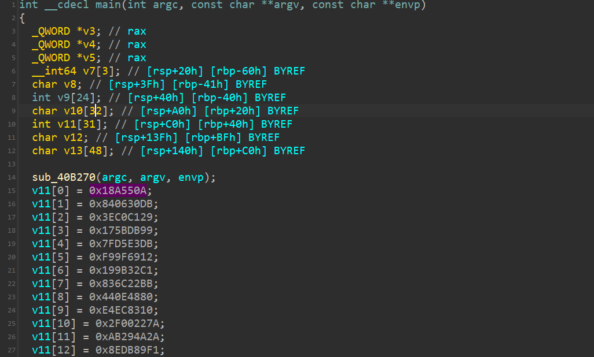  
通过查看附近函数，发现其他地方也定义了常数  
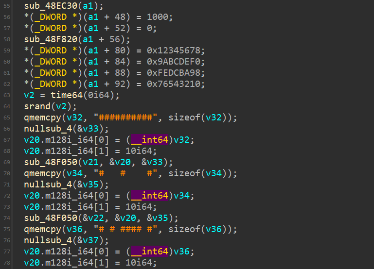  
查看字符串表，可以在其中找到两个txt的文件名，交叉引用查看  
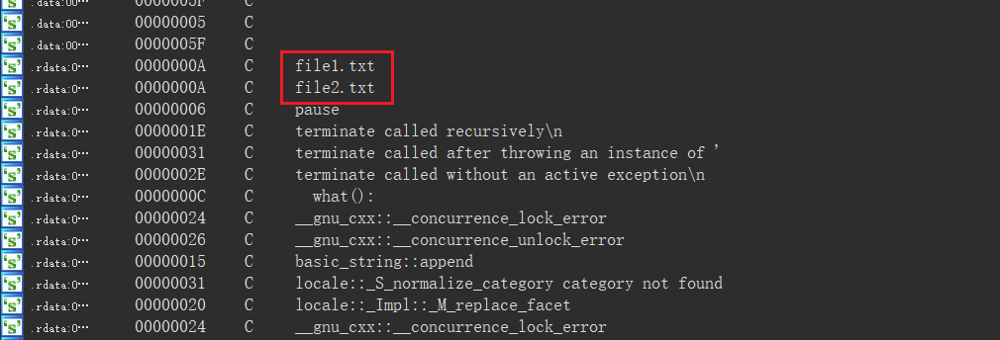  
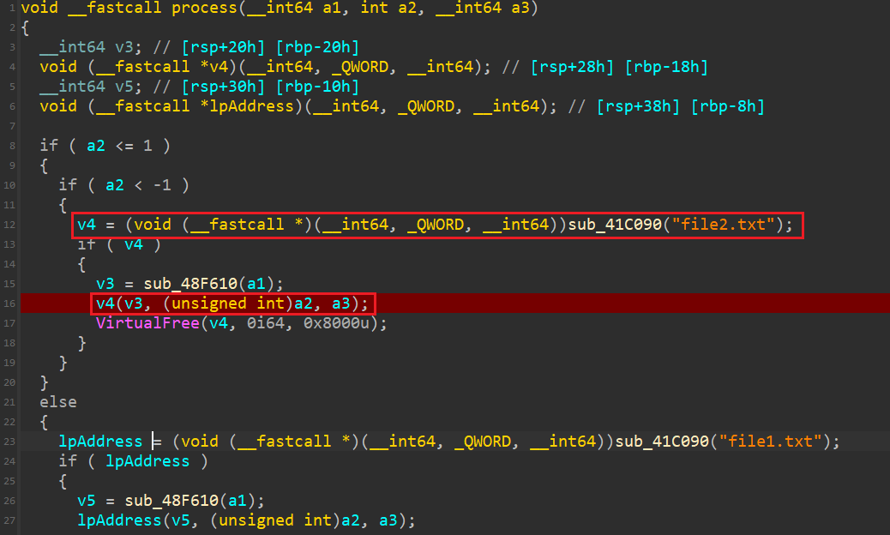  
其中process是我重命名的结果  
可以看到其中比较奇怪的一点是程序将文件的内容作为函数执行，也就是说原本内容不可见的txt其实是函数的二进制数据，要想知道该函数的具体逻辑，需要动态调试，在此处下断点，触发断点之后在汇编步进就可以看到其中逻辑  
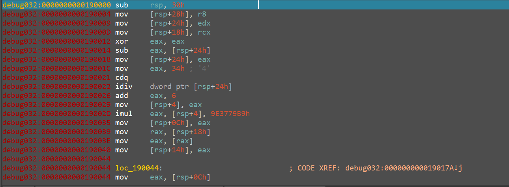  
可以将汇编扔给ai判断函数逻辑  
deekseek：“这段汇编代码实现的是 **XXTEA（eXtended TEA）算法的解密过程**……”  
于是知道了加解密逻辑，并且根据xxtea的密钥格式可以判断先前的两处常量中位数较短的是key，而位数较长的是密文  
接下来有两种解题方式：

1. 手动分析解密逻辑，自己编写代码
2. 交给ai  
   xxtea的加解密逻辑网上有很多就不细说了，直接给出解密脚本

```
import base64
import struct
from typing import List

def mask_32bit(value):
    """Handle 32-bit unsigned integer overflow"""
    return value & 0xFFFFFFFF

def tea_decrypt(data: List[int], key: List[int]) -> List[int]:
    """
    Alternative implementation of XXTEA decryption
    
    Args:
        data: List of encrypted 32-bit integers
        key: Decryption key as 4x 32-bit integers
        
    Returns:
        List of decrypted 32-bit integers
    """
    data_len = len(data)
    rounds = 6 + 52 // data_len
    
    # Convert input data to a list that we can modify
    result = data.copy()
    
    # Initialize the sum value
    magic_constant = 0x9E3779B9
    accumulated_sum = mask_32bit(magic_constant * rounds)
    
    # Main decryption loop
    for _ in range(rounds):
        # Calculate the feistel key index
        mix_index = (accumulated_sum >> 2) & 3
        
        # Process the data from end to beginning (except first element)
        for i in range(data_len - 1, 0, -1):
            # Get the values for the current operation
            current = result[i]
            previous = result[i - 1]
            next_val = result[0] if i == data_len - 1 else result[i + 1]
            
            # Calculate the mix value
            mx1 = mask_32bit((previous >> 5) ^ (next_val << 2))
            mx2 = mask_32bit((next_val >> 3) ^ (previous << 4))
            mx_sum = mask_32bit(mx1 + mx2)
            
            # Calculate the key part
            key_index = (i & 3) ^ mix_index
            key_mx = mask_32bit((accumulated_sum ^ next_val) + (key[key_index] ^ previous))
            
            # Apply the decryption transformation
            result[i] = mask_32bit(current - (mx_sum ^ key_mx))
        
        # Process the first element separately
        current = result[0]
        previous = result[data_len - 1]
        next_val = result[1]
        
        mx1 = mask_32bit((previous >> 5) ^ (next_val << 2))
        mx2 = mask_32bit((next_val >> 3) ^ (previous << 4))
        mx_sum = mask_32bit(mx1 + mx2)
        
        key_index = (0 & 3) ^ mix_index
        key_mx = mask_32bit((accumulated_sum ^ next_val) + (key[key_index] ^ previous))
        
        result[0] = mask_32bit(current - (mx_sum ^ key_mx))
        
        # Update the accumulated sum for next round
        accumulated_sum = mask_32bit(accumulated_sum - magic_constant)
    
    return result

def decrypt_and_check(encrypted_data, encryption_key, max_iterations=10000):
    """
    Repeatedly decrypt data and check for readable output
    
    Args:
        encrypted_data: List of encrypted 32-bit integers
        encryption_key: List of 4 32-bit integers
        max_iterations: Maximum number of decryption iterations
    """
    current_data = encrypted_data.copy()
    
    for iteration in range(max_iterations):
        # Decrypt one round
        current_data = tea_decrypt(current_data, encryption_key)
        
        # Try to interpret as text in different ways
        raw_bytes = b''.join([struct.pack("<I", val) for val in current_data])
        
        # Method 1: Try to decode the entire output as UTF-8
        try:
            decoded_text = raw_bytes.decode('utf-8')
            print(f"Iteration {iteration + 1}: Found valid UTF-8!")
            print(decoded_text)
        except UnicodeDecodeError:
            pass
            
        # Method 2: Try to extract first byte of each word
        try:
            first_bytes = bytes([raw_bytes[i] for i in range(0, len(raw_bytes), 4)])
            decoded_first = first_bytes.decode('utf-8')
            if any(c.isprintable() for c in decoded_first):
                print(f"Iteration {iteration + 1}: First bytes as text: {decoded_first}")
        except UnicodeDecodeError:
            pass

# Main execution
def main():
    # Same key and encrypted data as original
    encryption_key = [0x12345678, 0x9ABCDEF0, 0xFEDCBA98, 0x76543210]
    encrypted_data = [
        0x018A550A, 0x840630DB, 0x3EC0C129, 0x175BDB99,
        0x7FD5E3DB, 0xF99F6912, 0x199B32C1, 0x836C22BB,
        0x440E4880, 0xE4EC8310, 0x2F00227A, 0xAB294A2A,
        0x8EDB89F1, 0x28099186, 0xD04F421F, 0x23E7FD1C,
        0x6F48B862, 0x61796B6A, 0x857587A7, 0x33254C3A,
        0x06AAB088, 0x568A0B78, 0xAC64D9CF, 0xFB40A2C6,
        0x9082056A, 0x4FAAB834, 0x5D033C8B, 0x7D570A1C,
        0xCC81E29B, 0xCE1DE040
    ]
    
    decrypt_and_check(encrypted_data, encryption_key)

if __name__ == "__main__":
    main()
```

## 真？复杂

题目附件是一个raw文件，010editor查看发现JFIF文件头，提取图片  
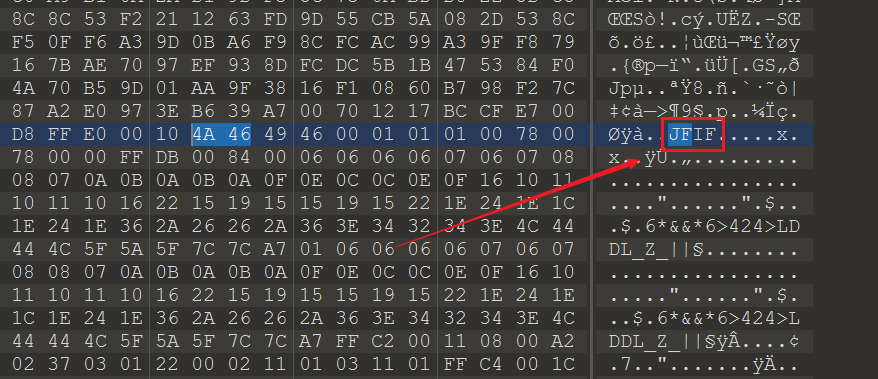  
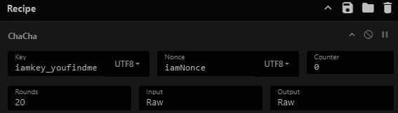  
然后使用cyberchef解密，解密之前要先把原raw文件中附加的图片信息删除  
解密之后得到压缩包一个，解密得exe文件和enc文件各一个  
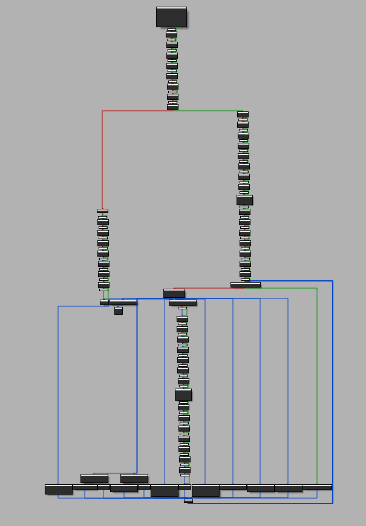  
虽然流程图长这个样，但是是可以手动去除的  
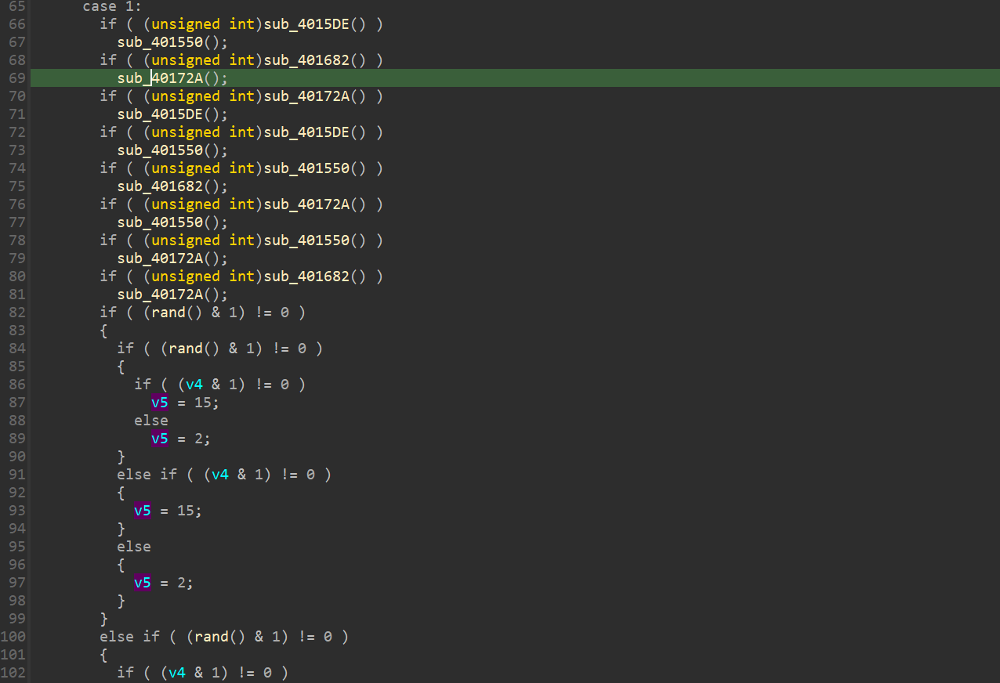  
第一种方法：（直接忽略和输入无关的语句和函数，对于涉及到修改输入的语句统统下断点）  
第二种方法：直接分析加密函数的switch逻辑，可以发现是对奇偶索引的字符做不同的变换，核心变量为v4（索引）和v5（控制跳转的case），通过`v4&1`的操作判断奇偶  
通过分析exe文件可知原本逻辑是给定flag.txt，用exe加密得到enc文件，而现在只有enc文件，故需要逆向推解密逻辑  
通过分析得到解密脚本

```
with open('flag.txt.enc', 'rb') as f:
    encrypted = f.read()

key = [0x88, 0x83, 0xA3, 0x7E, 0xEA, 0xA1, 0xBA, 0x25, 0x72, 0xCF, 0x1D, 0x6E, 0x79, 0x50, 0x17, 0x50]
decrypted = []
for v4, byte in enumerate(encrypted):
    if v4 % 2 == 0:  # 偶数索引处理
        temp = (~byte) & 0xFF      # 取消取反
        temp = (temp + v4) % 256   # 逆向减法
        temp ^= key[v4 % 16]       # 异或密钥
        orig = (temp - v4) % 256   # 逆向加法
    else:             # 奇数索引处理
        temp = byte ^ v4           # 取消异或v4
        temp = (temp - v4) % 256   # 逆向加法
        temp ^= key[v4 % 16]       # 异或密钥
        orig = (temp + v4) % 256   # 逆向减法
    decrypted.append(orig)

# 输出可打印字符（避免解码错误）
print(''.join([chr(b) if 32 <= b <= 126 else '.' for b in decrypted]))
```

## faze

题目附件：faze.exe  
使用IDA打开附件  
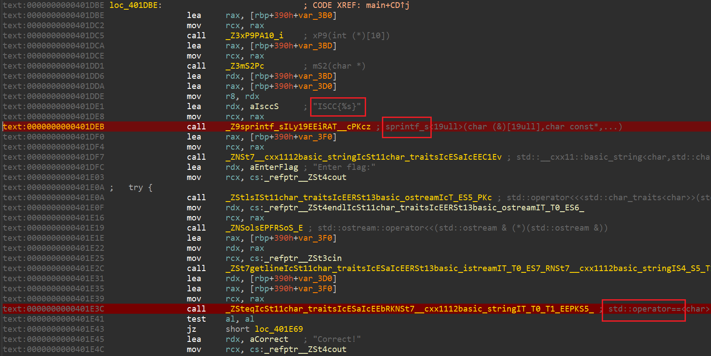

一眼C++，通过判断代码可以发现目标字符串在用户输入之前（getline）已经完成了目标字符串的初始化，所以这里有多种解法

1. 在sprintf上下断点，直接查看写入目标字符串的内容
2. 在比较的时候（`operator==`）下断点，查看比较的数据  
   这里选择前者，在程序暂停时跳转到rcx所在地址  
   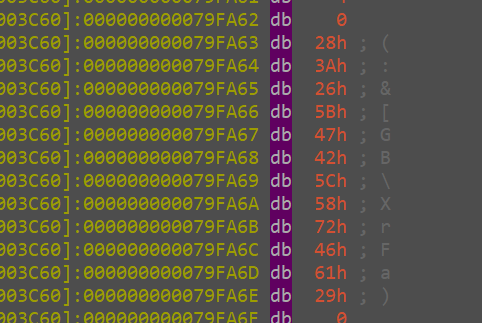

## greeting

首先IDA打开可执行文件，会发现有些函数反编译的结果不正确，且提示错误，因此可以查看目标函数附近的汇编代码，找到类似加密逻辑的代码  
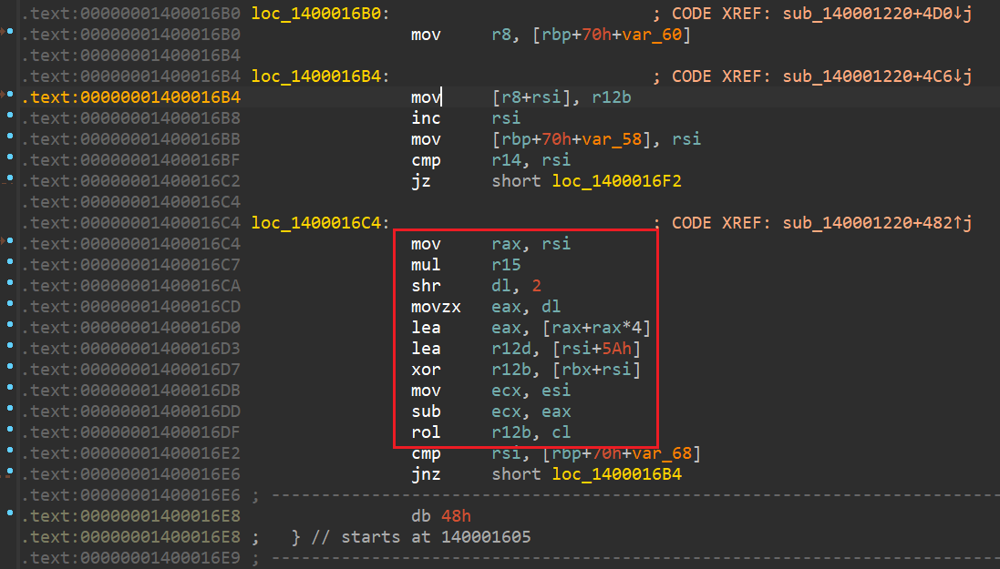  
明显的异或和循环左移操作，大概率是加密逻辑  
通过分析可知，代码首先是计算一个偏移，然后将目标数据对应索引的字节在异或`i+0x5a`之后（esi为索引）循环左移该计算出来的偏移，因此目标可以分为两步：

1. 分析该偏移的计算方式
2. 反推整个加密逻辑  
   这里的r15其实是一个固定的值  
   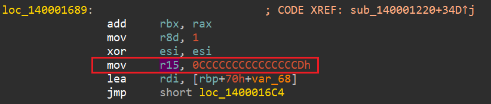  
   关于偏移量的计算

* 通过手动分析

* `mul r15` 和 `shr dl, 2` 的组合实际上执行的是整数除法 `i / 5`
* `lea eax, [rax+rax*4]` 计算的是 `(i/5)*5`
* `sub ecx, eax` 计算的是 `i - (i/5)*5`
* 以上逻辑等价于`i%5`

* 直接动态调试可以发现rol操作中cl的取值是0、1、2、3、4、0……，所以其实偏移的计算方式是索引对5取余

然后就是逆向整个加密逻辑，有了偏移的计算方式，解密的逻辑很好推，就是对每个字节先循环右移再异或`(i+0x5a)`  
对于密文，通过交叉引用和人肉分析等方式最终可以找到位于`0x014001B390`

因此完整的解密脚本如下

```
def encrypt(input_bytes):
    output = bytearray(len(input_bytes))
    for i in range(len(input_bytes)):
        div_result = (i // 10) * 5
        
        value = (i + 0x5A) & 0xFF
        value ^= input_bytes[i]
        
        rot_amount = (i - div_result) & 0x7
        value = ((value << rot_amount) | (value >> (8 - rot_amount))) & 0xFF
        
        output[i] = value
    
    return output

def decrypt(encrypted_bytes):
    output = ""
    for i in range(len(encrypted_bytes)):
        rot_amount = i % 5
        
        value = encrypted_bytes[i] & 0xFF
        value = ((value >> rot_amount) | (value << (8 - rot_amount))) & 0xFF
        
        value ^= (i + 0x5A)
        
        output += chr(value & 0xFF)
    
    return output

def main():
    encrypted_hex = "xxxxxxxxxxx"
    encrypted_bytes = bytes.fromhex(encrypted_hex)
    
    decrypted = decrypt(encrypted_bytes)
    print("Decrypted:", decrypted)

if __name__ == "__main__":
    main()
```
