# 【高级睡眠混淆技术】| Cronos-先知社区

> **来源**: https://xz.aliyun.com/news/18016  
> **文章ID**: 18016

---

# "巨人的肩膀"

其实最早的睡眠混淆应该是从石像鬼开始，但是C5的EKKO毫无疑问是一个重大的逆向成果，为后来许多人提供了思路，从而产生了很多变种，绕过。

Zilan ，Cronos ，PhaseDive，CallStackMaster .....


今天讲的是其中一个项目 Cronos :P

# Cronos

总结如下

```
通过创建可等待的定时器对象,然后通过不同于传统的ROP链进行APC执行
最终实现睡眠混淆(尽管他的栈并不太好看)
```

实现效果如下图所示

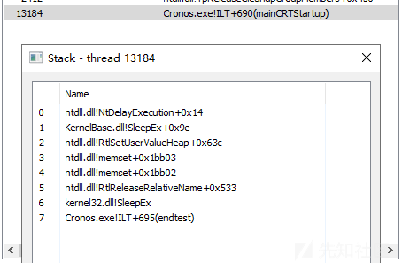

前面的操作都是差不多的，我们直接来看看后面的ROP操作。首先就是寻找gadget，这里寻找了三个Gadget

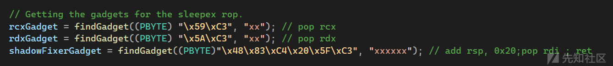

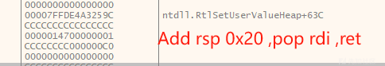

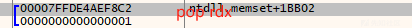

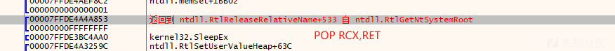

当我们jmp sleepex的时候，我们的堆栈如下，我们一步一步来跟

```
00000006D9BBD248                                                    00007FFDE4A3259C         ntdll.RtlSetUserValueHeap+63C
00000006D9BBD250                                                    CCCCCCCCCCCCCCCC         
00000006D9BBD258                                                    0000014C192BDBE0         "铪铪铪铪铪铪铪铪铪铪铪铪铪铪铪铪铪铪铪铪铪铪铪铪铪铪铪铪铪铪铪铪铪铪铪铪铪铪铪铪铪铪铪铪铪铪铪铪铪铪铪铪铪铪铪铪铪铪铪铪铪铪铪铪铪铪铪铪铪铪铪铪铪铪铪铪铪铪铪铪铪铪铪铪铪铪铪铪铪铪铪铪铪铪铪铪铪铪铪铪铪铪铪铪铪铪铪铪铪铪铪铪"
00000006D9BBD260                                                    CCCCCCCCCCCCCCCC         
00000006D9BBD268                                                    CCCCCCCCCCCCCCCC         
00000006D9BBD270                                                    CCCCCCCCCCCCCCCC         
00000006D9BBD278                                                    00007FFDE4AEF8C3         ntdll.memset+1BB03 
00000006D9BBD280                                                    00007FFDE4AEF8C2         ntdll.memset+1BB02 
00000006D9BBD288                                                    0000000000000001         
00000006D9BBD290                                                    00007FFDE4A4A853         返回到 ntdll.RtlReleaseRelativeName+533 自 ntdll.RtlGetNtSystemRoot
00000006D9BBD298                                                    00000000FFFFFFFF         
00000006D9BBD2A0 <&SleepEx>                                         00007FFDE3BC4AA0         kernel32.SleepEx
00000006D9BBD2A8                                                    00007FFDE4A3259C         ntdll.RtlSetUserValueHeap+63C
00000006D9BBD2B0                                                    CCCCCCCCCCCCCCCC         
00000006D9BBD2B8                                                    CCCCCCCCCCCCCCCC         
00000006D9BBD2C0                                                    CCCCCCCCCCCCCCCC         
00000006D9BBD2C8                                                    00007FFDE25114C4         返回到 kernelbase.BaseFormatObjectAttributes+A4 自 ???
00000006D9BBD2D0                                                    0000000000000000         
00000006D9BBD2D8                                                    00007FFDE4AEF8C3         ntdll.memset+1BB03
00000006D9BBD2E0                                                    00007FFDE4AEF8C2         ntdll.memset+1BB02
00000006D9BBD2E8                                                    0000000000000001         
00000006D9BBD2F0                                                    00007FFDE4A4A853         返回到 ntdll.RtlReleaseRelativeName+533 自 ntdll.RtlGetNtSystemRoot
00000006D9BBD2F8                                                    00000000FFFFFFFF         
00000006D9BBD300 <&SleepEx>                                         00007FFDE3BC4AA0         kernel32.SleepEx
00000006D9BBD308                                                    00007FFDE4A3259C         ntdll.RtlSetUserValueHeap+63C
00000006D9BBD310                                                    0000000000000000         
00000006D9BBD318                                                    00000000000000C0         
00000006D9BBD320                                                    8000000000000000         
00000006D9BBD328                                                    0000000000000000         
00000006D9BBD330                                                    0000000000000000         
00000006D9BBD338                                                    00007FFDE4AEF8C3         ntdll.memset+1BB03
00000006D9BBD340                                                    00007FFDE4AEF8C2         ntdll.memset+1BB02
00000006D9BBD348                                                    0000000000000001         
00000006D9BBD350                                                    00007FFDE4A4A853         返回到 ntdll.RtlReleaseRelativeName+533 自 ntdll.RtlGetNtSystemRoot
00000006D9BBD358                                                    00000000FFFFFFFF         
00000006D9BBD360 <&SleepEx>                                         00007FFDE3BC4AA0         kernel32.SleepEx
00000006D9BBD368                                                    00007FF7879412BC         cronos.__enc$textbss$end+2BC
00000006D9BBD370                                                    0000000000000000         
00000006D9BBD378                                                    0000000000000000         
00000006D9BBD380                                                    0000000000000000         
00000006D9BBD388                                                    00000006D9BBEF08         
00000006D9BBD390                                                    00000006D9BBD3D0         
00000006D9BBD398                                                    00007FF787941FF2         返回到 cronos.__$EncStackInitEnd+749 自 cronos.__enc$textbss$end+294
00000006D9BBD3A0                                                    0000000000000000         
     
```

当执行完成SleepEx函数的时候，弹出ntdll.RtlSetUserValueHeap+63C

```
add rsp 0x20 ; pop rdi ; ret   <-- ntdll.RtlSetUserValueHeap+63C
```

执行ret的时候 RSP指向的是ntdll.dll.memeste + 1BB03 如下图（这里就是一个RET）

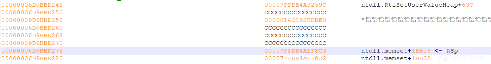

这样我们RSP继续 + 0x8 指向 ntdll.memset+ 1BB02 ，然后 RET 如下图

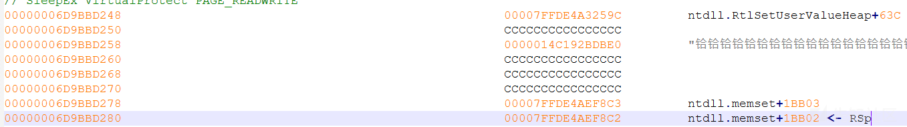

ret弹出00007FFDE4AEF8C2，gadget如下

```
pop rdx ,ret ; rdx = 1  // 赋值SleepEx的第二个参数  
```

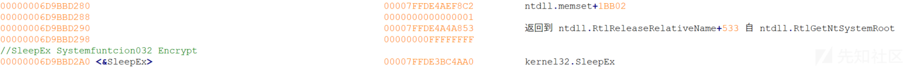

ret弹出 00007FFDE4A4A853 给RIP，gadget如下

```
pop rcx,ret ; rcx = -1 ,rip = SleepEx  // 赋值SleepEx的第一个参数
```

这时候我们就是再一次进入了SleepEx,然后唤醒下一个APC函数，并且重复三次，

当我们执行完成解密和改属性(RWX)之后，SleepEx就要Ret这时候我们的RSP指向的是00000006D9BBD368，对应的值是00007FF7879412BC 如下图

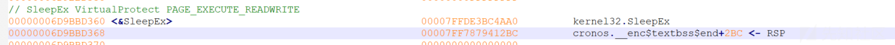

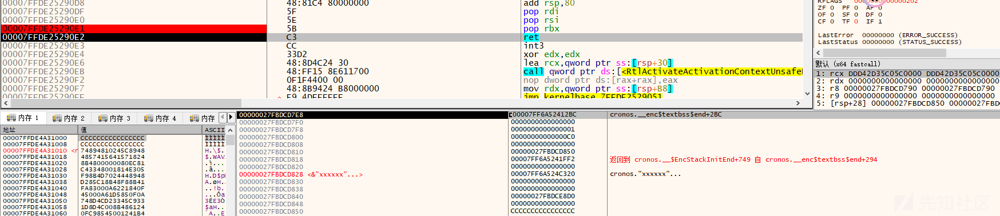

我们跟过去看，发现是我们的清理函数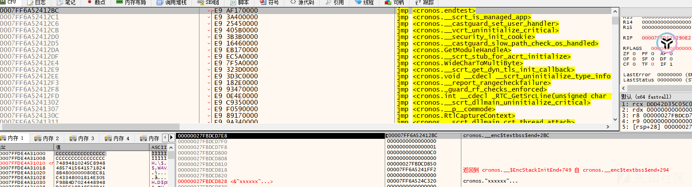

这是因为我们再rop.asm一开始的时候就把这个清理的地址push进栈了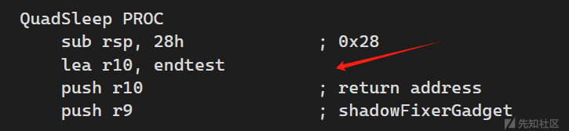

接着RET弹出我们的汇编清理地址，然后jmp过去，如下图

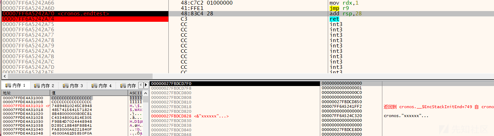

恢复堆栈之后就回到我们的CronosSleep.CleanUp了

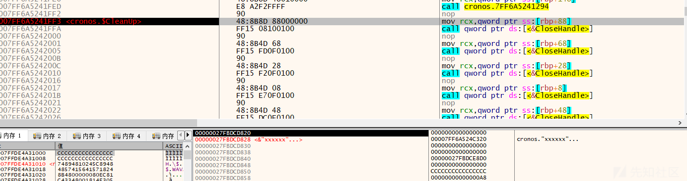

后续就是继续循环执行我们的函数了。 最终堆栈总结如下

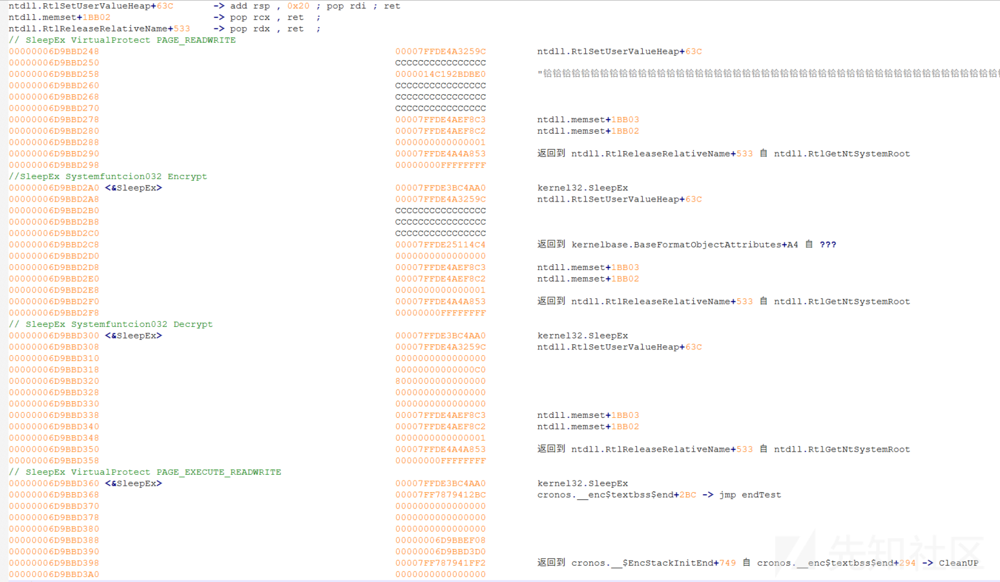

# Maybe Improve ?

## RDI

我们知道rdi是一个非易失寄存器 ，但是我们的gadget是会改变rdi的，下图是我们刚进入QuadSleep时候的寄存器RDI值

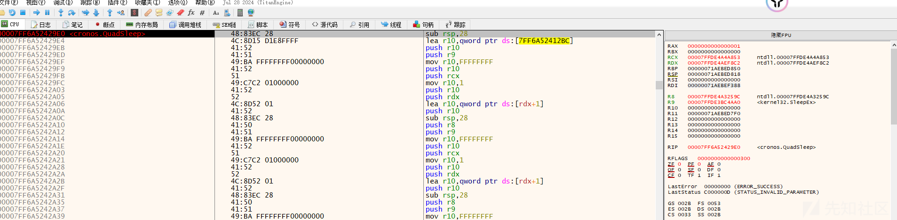

当我们返回CleanUp的时候，我们可以发现RDI发生了变化

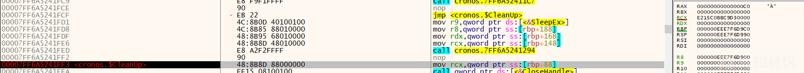

虽然目前这样操作并不会导致该项目崩溃，但是像LoudSunRun一样先把寄存器保存后续恢复不失为一种更加安全的做法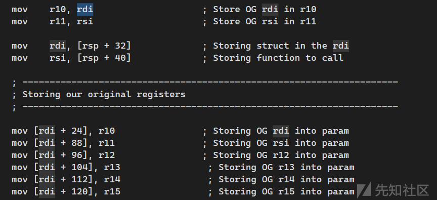

## Why My CallStack So Strange?

我们分别对两次VirtualProtect下断点

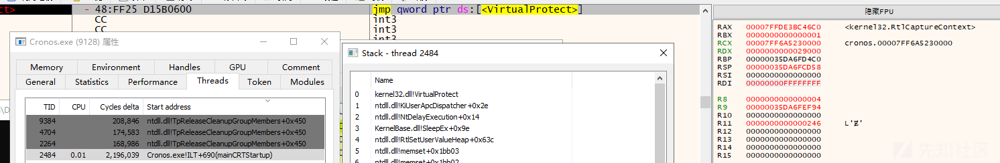

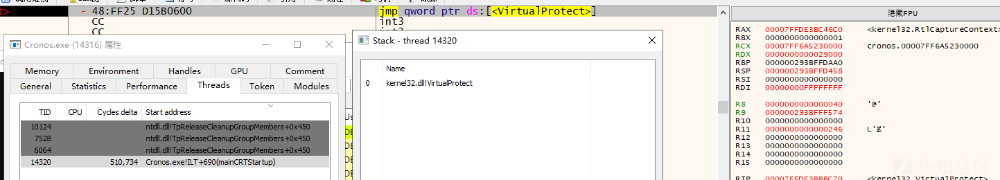

我们再去看EKKO

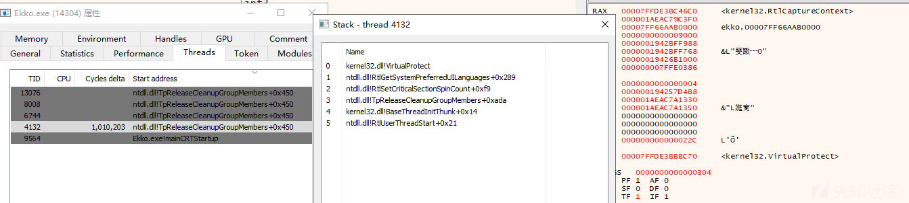

这样相比之下前者则是更加奇怪的调用栈，引用一篇文章的原文

```
This gives the technique a minimal footprint from a detection perspective 
as it avoids typical indicators of injected code 
(e.g., there are no threads created which point to unbacked regions
```

虽然前者并不会出现未备份的内存，但是我相信更多人会倾向于后者可以完全被展开 :P

# 链接

<https://github.com/Idov31/Cronos?tab=readme-ov-file>

<https://idov31.github.io/2022/11/06/cronos-sleep-obfuscation.html>

<https://labs.withsecure.com/publications/hunting-for-timer-queue-timers>
