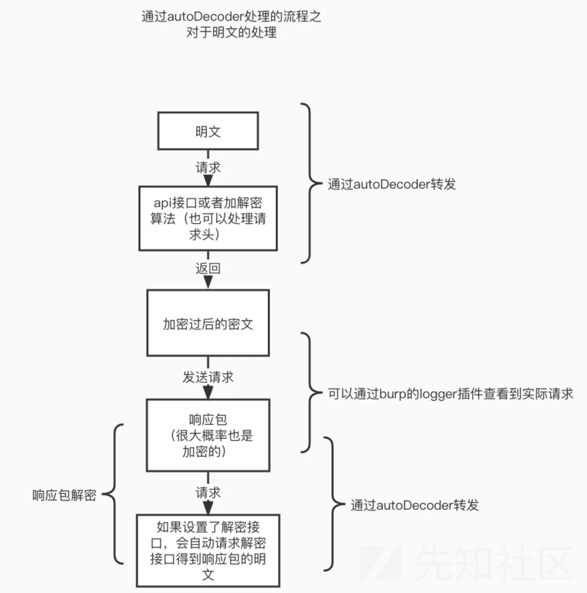
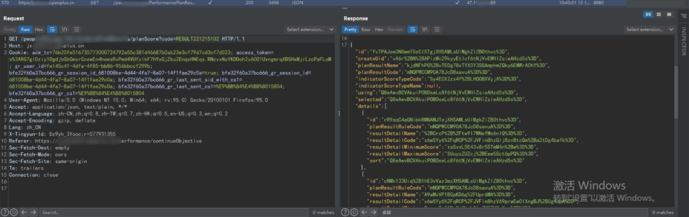
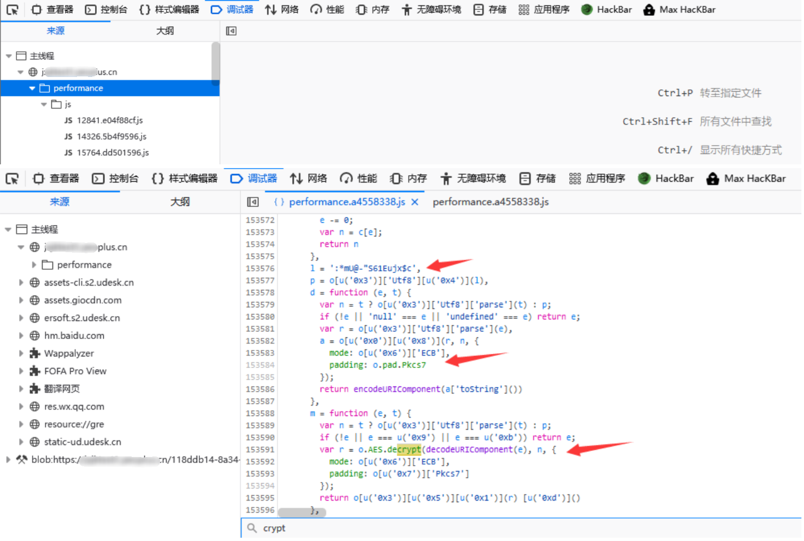
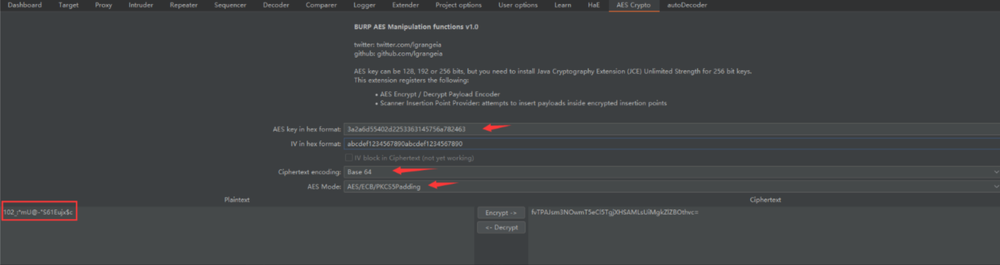
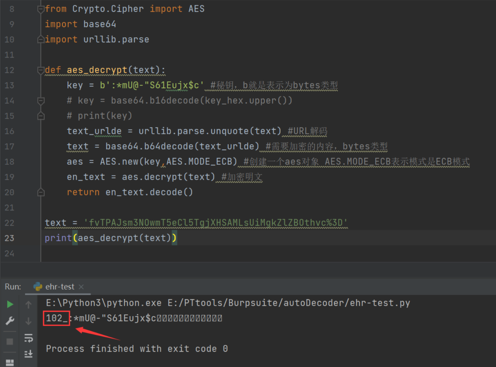
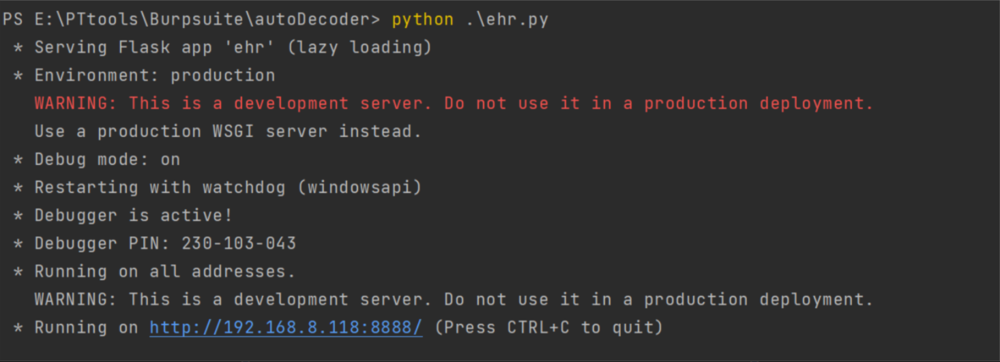
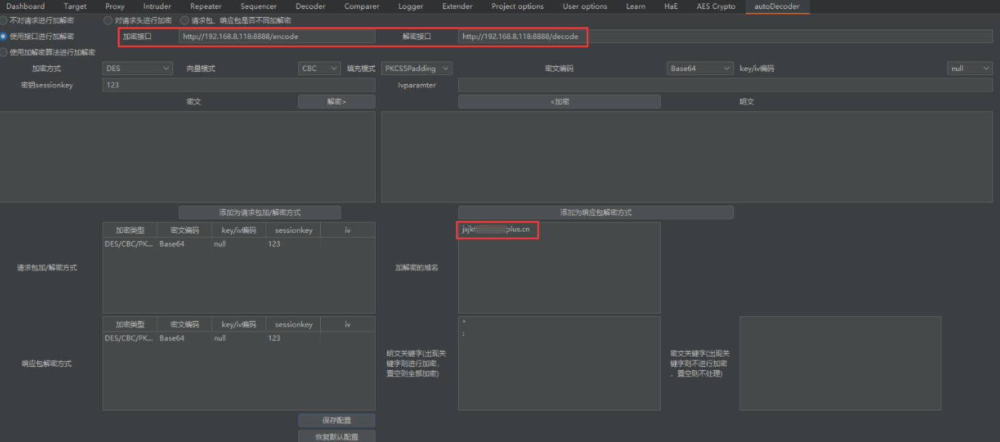
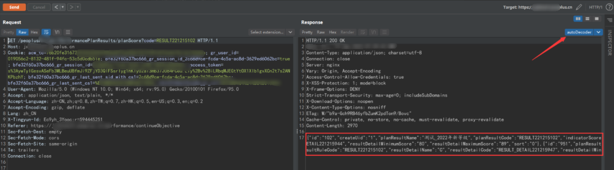

# 某系统加解密分析-先知社区

> **来源**: https://xz.aliyun.com/news/18018  
> **文章ID**: 18018

---

# 前言

在一次项目测试中，发现该系统内的核心功能的返回包均被加密，为方便后续的测试工作，最终借助 autoDecoder 工具实现了流量全自动加解密。

# 工具介绍

[autoDecoder](https://github.com/f0ng/autoDecoder) 是一款 BurpSuite 插件，根据自定义接口来达到对数据包的处理（适用于加解密、爆破等），类似 mitmproxy，不同点在于经过了 burp 中转，在自动加解密的基础上，不影响 app、网站加解密正常逻辑等。

# 工作流程



# 全自动加解密技术实现

## 查找加密算法

1、核心功能数据包被加密



2、前端查看具体加密方式，从 URL 以及请求包可以看出都含有 performance，因此直接寻找包含 performance 关键字的目录及文件



## 明确加密算法

* KEY：:\*mU@-"S61Eujx$c
* Ciphertext encoding: Base 64
* AES Mode：AES/ECB/PDCS5Padding



## 编写解密函数

```
from Crypto.Cipher import AES
import base64
import urllib.parse

def aes_decrypt(text):
    key = b':*mU@-"S61Eujx$c' #秘钥，b就是表示为bytes类型
    text_urlde = urllib.parse.unquote(text) #URL解码
    text = base64.b64decode(text_urlde) #需要加密的内容，bytes类型
    aes = AES.new(key,AES.MODE_ECB) #创建一个aes对象 AES.MODE_ECB表示模式是ECB模式
    en_text = aes.decrypt(text) #加密明文
    return en_text.decode()

text = 'fvTPAJsm3NOwmT5eCl5TgjXHSAMLsUiMgkZlZBOthvc%3D'
print(aes_decrypt(text))
```



## 坑点 - 返回包格式为多层 json 嵌套

多层 json 嵌套提取 value

```
sets = set()

def jsondecode(jsonData):
    
    jsonResult = ""
    j = False
    for i in range(len(jsonData)):
        if (j and jsonData[i] == '"'):
            j = False
            continue
        if j:
            continue
        if (jsonData[i] == '"' and jsonData[i-1] == ':') :
            for k in range(i+1,len(jsonData)):
                if jsonData[k] == '"':
                    break
                jsonResult = jsonResult + jsonData[k]
            print(jsonResult)
            sets.add(jsonResult)
            jsonResult = ""
            j = True
        if  (jsonData[i] == '"' and jsonData[i-1] == '['):
            for k in range(i+1,len(jsonData)):
                if jsonData[k] == '"':
                    break
                jsonResult = jsonResult + jsonData[k]
            print(jsonResult)
            sets.add(jsonResult)
            jsonResult = ""
            j = True
        if (jsonData[i-1] == '['):
            total = "["
            for j in range(i-1,len(jsonData)):
                if jsonData[j] != ']':
                    total = total + jsonData[j+1]
                else:
                    break
            totallists = total.replace("[","").replace("]","").split(",")
            for _ in totallists:
                if ":" in _:
                    pass
                else:
                    sets.add(_.replace('"',""))
```

## flask + autoDecoder

```
from Crypto.Cipher import AES
import urllib.parse

def aes_decrypt(text):
    key_hex = b'3a2a6d55402d2253363145756a782463'  # 秘钥，b就是表示为bytes类型
    key = base64.b16decode(key_hex.upper())
    text = base64.b64decode(text)  # 需要解密的内容，bytes类型
    aes = AES.new(key, AES.MODE_ECB)  # 创建一个aes对象，AES.MODE_ECB表示模式是ECB模式
    en_text = aes.decrypt(text)  # 解密明文
    zifus = [b'\x0a', b'\x0b', b'\x0c', b'\x0d', b'\x0e', b'\x0f', b'\x01', b'\x02', b'\x03', b'\x04', b'\x05', b'\x06',
             b'\x07', b'\x08', b'\x09']
    for zifu in zifus:
        en_text = en_text.replace(zifu, b"")
    return en_text.decode()

from flask import Flask,Response,request
import base64
app = Flask(__name__)

@app.route('/decode',methods=["POST"])
def decrypt():

    sets = set()

    def jsondecode(jsonData):
        
        jsonResult = ""
        j = False
        for i in range(len(jsonData)):
            if (j and jsonData[i] == '"'):
                j = False
                continue
            if j:
                continue
            if (jsonData[i] == '"' and jsonData[i - 1] == ':'):
                for k in range(i + 1, len(jsonData)):
                    if jsonData[k] == '"':
                        break
                    jsonResult = jsonResult + jsonData[k]
                print(jsonResult)
                sets.add(jsonResult)
                jsonResult = ""
                j = True
            if (jsonData[i] == '"' and jsonData[i - 1] == '['):
                for k in range(i + 1, len(jsonData)):
                    if jsonData[k] == '"':
                        break
                    jsonResult = jsonResult + jsonData[k]
                print(jsonResult)
                sets.add(jsonResult)
                jsonResult = ""
                j = True
            if (jsonData[i - 1] == '['):
                total = "["
                for j in range(i - 1, len(jsonData)):
                    if jsonData[j] != ']':
                        total = total + jsonData[j + 1]
                    else:
                        break
                totallists = total.replace("[", "").replace("]", "").split(",")
                for _ in totallists:
                    if ":" in _:
                        pass
                    else:
                        sets.add(_.replace('"', ""))

    dictsDecode = dict()
    body = request.form.get('dataBody')  # 获取  post 参数 必需
    jsondecode(body)
    for _ in sets:
        dictsDecode[_] = aes_decrypt(urllib.parse.unquote(_))
    for _, __ in zip(dictsDecode.keys(), dictsDecode.values()):
        __.encode()
        body = body.replace(_, __.strip().replace('"', '\"').replace("_:*mU@-\"S61Eujx$c", ""))
    return body

if __name__ == '__main__':
    app.debug = True # 设置调试模式，生产模式的时候要关掉debug
    app.run(host="0.0.0.0",port="8888")
```





## 最终效果


