# 非PEB获取ntdll和kernel32模块基址的精妙之道-先知社区

> **来源**: https://xz.aliyun.com/news/18019  
> **文章ID**: 18019

---

初次拜读这篇文章[[1]](https://mp.weixin.qq.com/s/O4LCnC_DjzfvnLvgXm1bFQ)，我只觉得汗毛直竖，内心久久不能平静，回味良久后甚至觉得有点惊世骇俗。它的创新思路令人眼前一亮，甚至可以说是颠覆了常规认知。我立刻在Obsidian上新建了一个文档，命名为《非PEB获取ntdll和kernel32模块基址的精妙之道》，时刻提醒自己要反复研读、细细品味这一精彩内容。

其实在反射式DLL注入技术中已经涉及回溯等底层机制，一些逆向文章也有提及到通过内存暴力搜索kernel32基址，但是却很少有人从线程启动的视角逆向分析获取模块基址，例如通过扫描线程栈空间，定位ntdll/kernel32关键API的返回地址来推导基址。这一技术虽在驱动开发中常见，却极少被公开讨论也难怪作者调侃到：“看来这些臭搞免杀的创造力也不行呀……”，这应该不是说我的吧，我不是专搞免杀的，我只是一个找不到工作的普通人罢了，每天无所事事写些没营养的文章๐·°(৹˃̵﹏˂̵৹)°·๐

品读完大佬的文章后，我明白技术创新的本质，往往在于跨界知识的融合。当攻击者局限于传统方法时，防御方早已筑起高墙；而真正的突破，可能藏在另一个领域的教科书里。

⚠**注意**：该技术未经过实战检验，请勿在生产环境中使用!!!!!!!!!!!!!!

# 一、线程，启动！

## 1.1 线程调用栈分析

windows系统无论是启动进程的主线程还是启动子线程，都是通过 `RtlUserThreadStart` 函数来调用新线程的入口地址。当然在执行 `RtlUserThreadStart` 函数之前还会执行各种用于线程初始化的函数，不过并不重要，当程序执行到用户自定义入口点时，不同版本的操作系统的所有用户态线程（主线程/子线程）最终都会经过以下关键环节

```
……
……
kernel32!BaseThreadInitThunk + xx
ntdll!RtlUserThreadStart + xx
```

我们来看一下 `ntdll!RtlUserThreadStart` 函数的代码，见下图

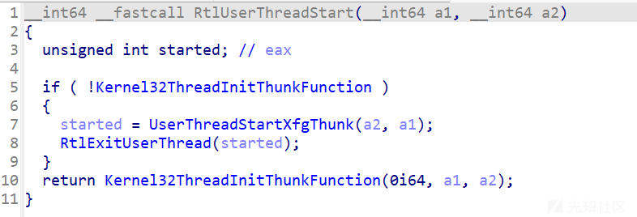

这段代码是Windows内核中 `RtlUserThreadStart` 函数的实现，用于启动用户模式线程。

1. 首先检查`Kernel32ThreadInitThunkFunction`是否为空
2. 若`Kernel32ThreadInitThunkFunction`不存在（`je`跳转至`ntdll!RtlUserThreadStart+0x2a`），直接调用`UserThreadStartXfgThunk`，并最终通过`RtlExitUserThread`退出线程
3. 如果不为空，则调用 `Kernel32ThreadInitThunkFunction(0, a1, a2)` 并返回其结果，一般情况下 `Kernel32ThreadInitThunkFunction` 是存在的

我在 `Kernel32.dll` 上没找到 `ThreadInitThunkFunction` 函数， 它其实是 `BaseThreadInitThunk`，是线程从内核态切换到用户态后的第一个跳板，是Windows线程启动的关键入口，负责初始化线程环境并调用用户线程函数。线程的初始化主要逻辑分为两条路径：

1. **XFG 安全路径**（`a1 == 0`）：用于验证间接函数调用的目标地址是否合法，调用 `BaseThreadInitXfgThunk` 启动线程并退出。
2. **终端服务安全策略**：若为终端服务环境，初始化兼容性函数，再执行用户代码

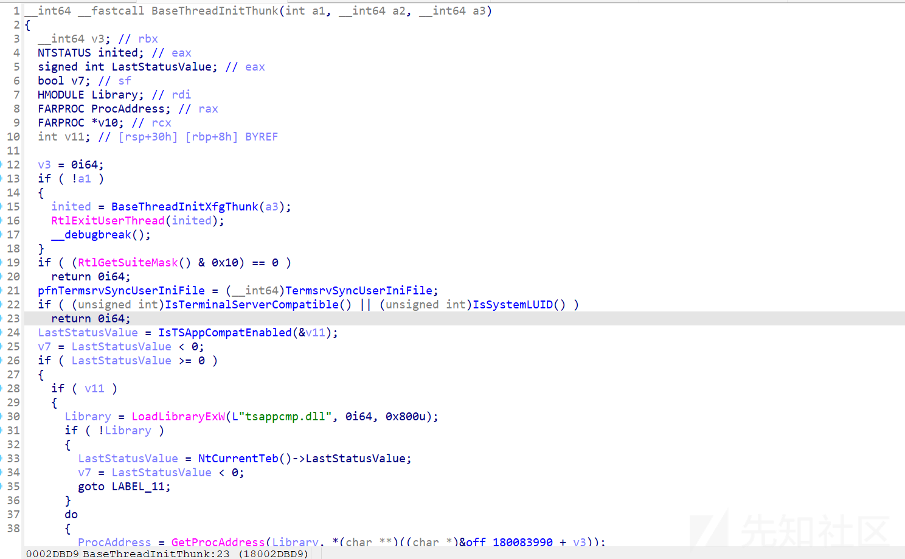

因为 `Kernel32ThreadInitThunkFunction(0, a1, a2)` 的第一个参数为0，即 `BaseThreadInitThunk(int a1, __int64 a2, __int64 a3)` 中的a1为0，代码执行流程实际会走**XFG 安全路径**，最终会调用 `KERNEL32!BaseThreadInitXfgThunk` 启动用户线程。

下文的 `1.2 动态调式` 会详细介绍动态调试查看线程启动的整个流程。

process monitor 随便打开一个线程的调用堆栈，很好地证明了上述所说的内容。下图是win11 64位某线程的调用栈

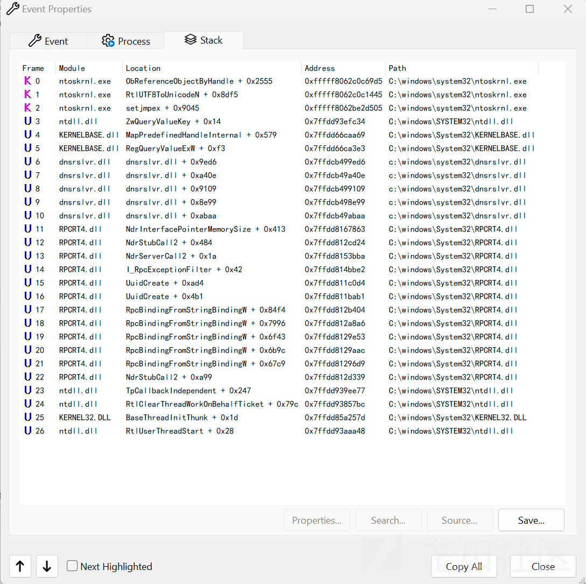

win10系统下某64位线程的调用栈

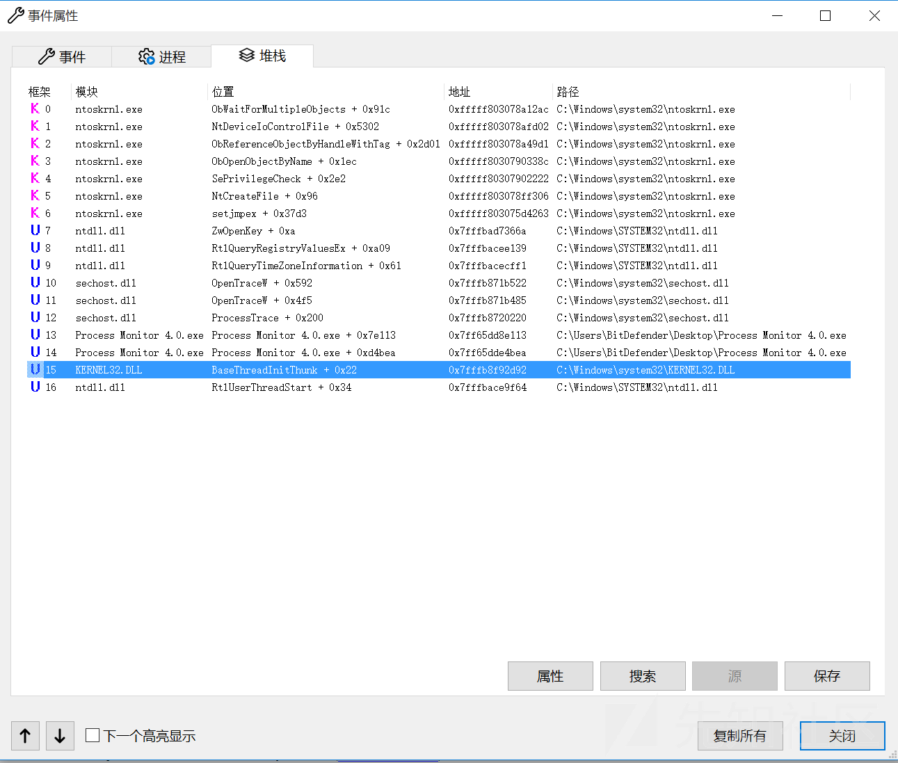

当然也并非所有线程都是按照 `RtlUserThreadStart->BaseThreadInitThunk` 路径的方式启动，下图是某32位进程的调用栈

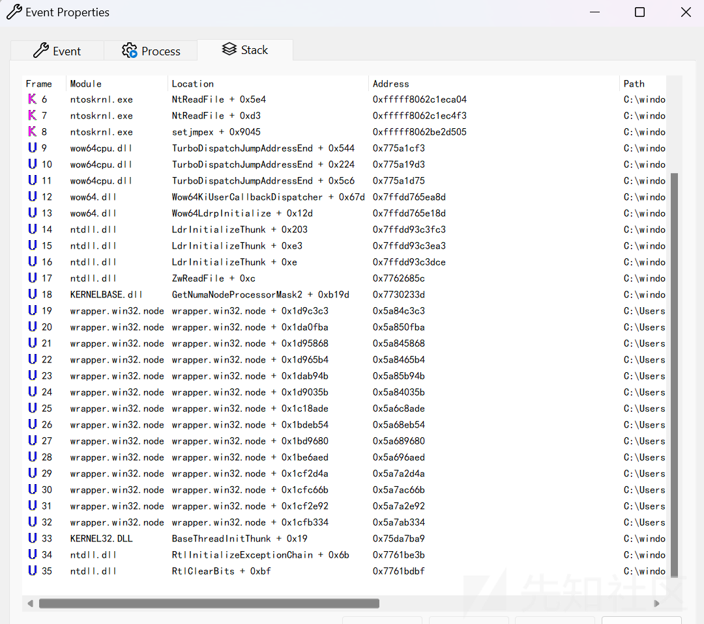

某系统进程的调用栈

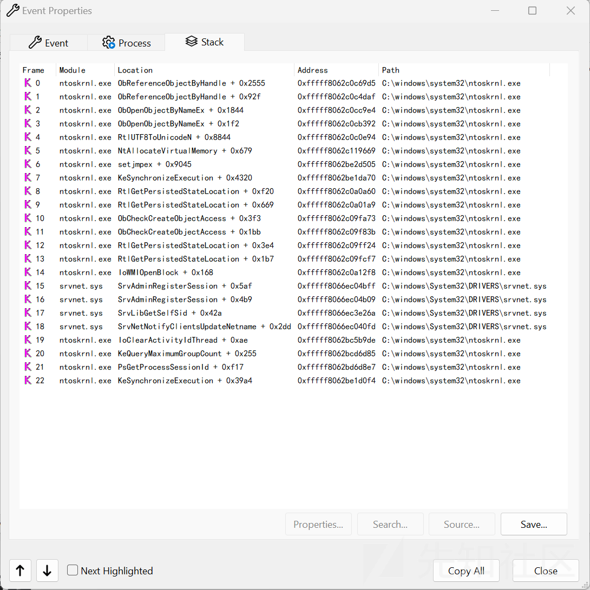

在win7系统上虽然走的是 `RtlUserThreadStart->BaseThreadInitThunk`，但是不知道什么原因，本文章介绍的方法不适用win7，各位可以去尝试去寻找原因，我水平有限找不出来具体出错的点。

某64位进程的调用栈。

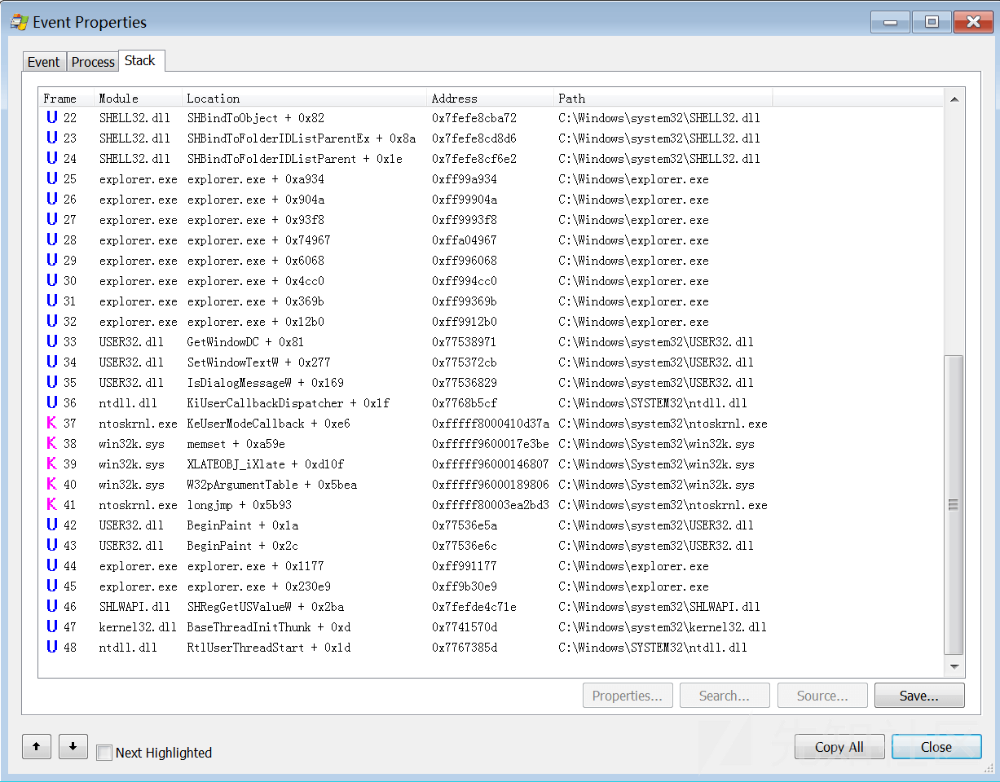

## 1.2 动态调式分析

此处的动态调试是为了验证当程序运行到用户自定义入口点（main或者mainCRTStartup）时栈基址的情况，并进一步分析线程启动时的调用链

用windbg随便打开一个exe程序，程序会停在 `ntdll!LdrpDoDebuggerBreak`，接着我们在windbg的命令行输入一个下断点的命令：`bp ntdll!RtlUserThreadStart`。我们这么做的目的是跳过一些初始化操作，直接分析最感兴趣的 `RtlUserThreadStart` 和 `BaseThreadInitThunk`。

接着按F5运行，程序会停在 `ntdll!RtlUserThreadStart` 的入口点

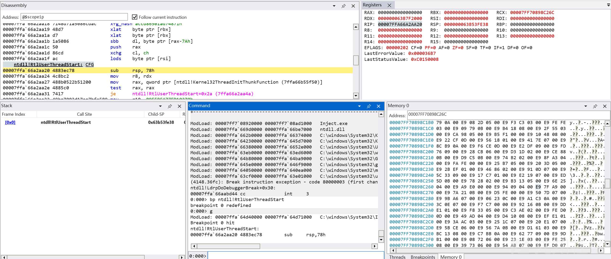

一直Step into（F8）到 `call qword ptr [ntdll!__guard_xfg_dispatch_icall_fptr` 里面。

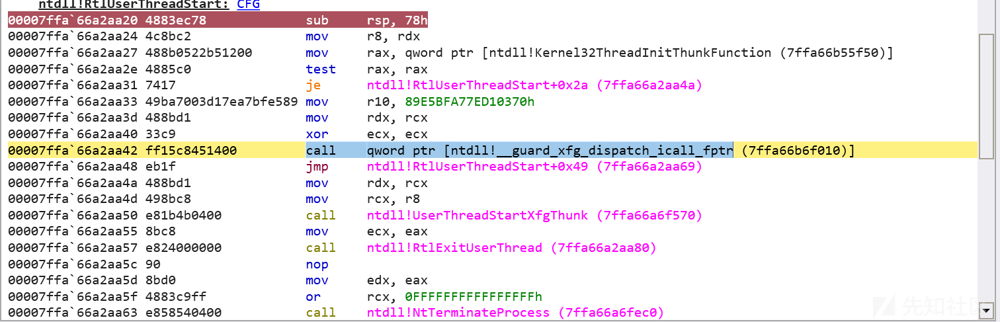

因为执行了call指令会在栈上留下返回地址，我们去查看一下栈基址的情况

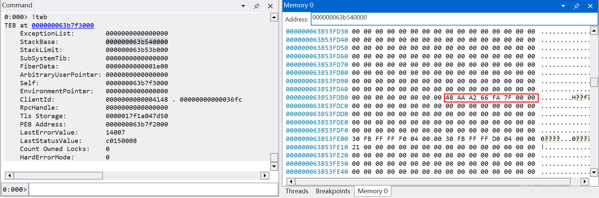

进入到 `ntdll!__guard_xfg_dispatch_icall` 后如下图所示

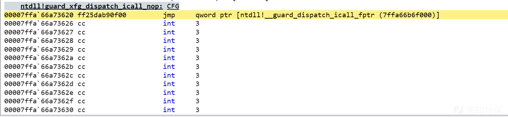

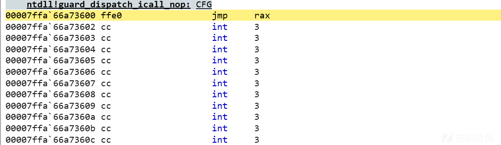

这个 `ntdll!guard_dispatch_icall_nop` 相当于一个中转站，最后通过 `jmp rax` 跳转到 `KERNEL32!BaseThreadInitThunk`

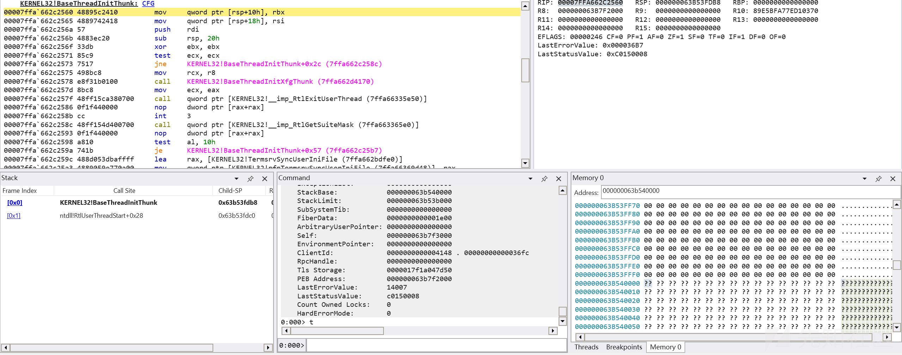

在 `1.1 线程调用栈分析` 中有分析过，最终我们的程序是通过 `KERNEL32!BaseThreadInitXfgThunk` 启动用户线程。

当我们执行到 `call KERNEL32!BaseThreadInitXfgThunk` 时，step into（F8），这时会在栈上留下第二个返回地址

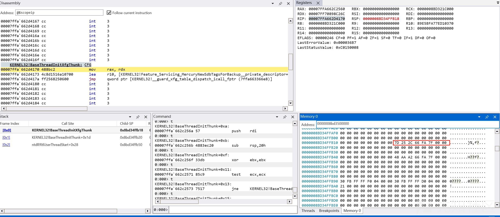

可以看到栈上已经存放着两个返回地址，它们指向着来自ntdll和kernel32中某个API中的某条指令。

接下来就是连续的调用两次 `ntdll!guard_xfg_dispatch_icall_nop`，最终来到用户自定义入口点（mainCRTStartup）

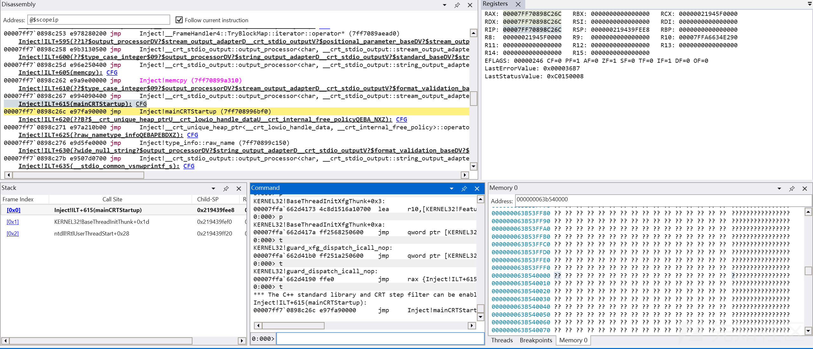

既然来到了用户自定义入口点，说明我们的线程启动流程已经结束了，后续的调用链就可以不用看了，直接F5运行。因为我调式的程序是一个弹窗程序，程序运行后会弹出一个对话框

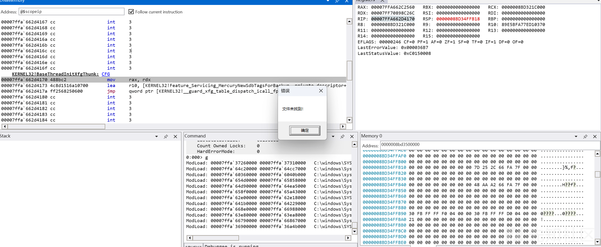

**总结**：通过上面的分析可以了解到，大多数64位线程在启动时最开始都会有 `call kernel32!BaseThreadInitThunk` 和 `call KERNEL32!BaseThreadInitXfgThunk`，第一个call会将 `RtlUserThreadStart` 中的下一条指令压栈，而第二个call会将 `BaseThreadInitThunk` 中的下一条指令压栈，这是此项技术关键，证明了技术的可行性。

# 二、获取栈上的返回地址

## 2.1 调式验证

所以，接下来就是这么去获取这栈上的两个返回地址，由于开启了地址随机化（ASLR），我们是没办法直接通过硬编码的方式获取这两个返回地址的。

但是天无绝人之路，两个调用都发生在线程刚初始化的阶段，所以这两个地址一定非常靠近栈基址。如果能知道栈基址，我们就可以通过栈回溯的方式找到这两个返回地址。

所有的一切的矛头都指向了栈基址，线程的栈基址从何而来？ 这涉及到TEB的知识了，TEB的数据结果见下图。

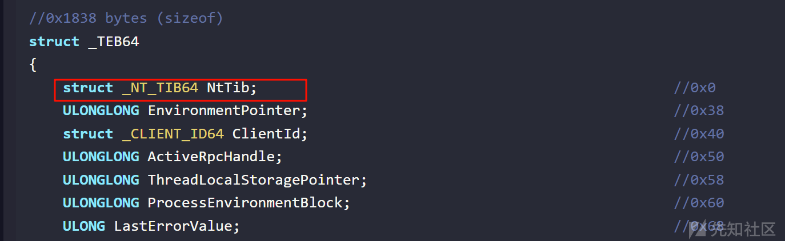

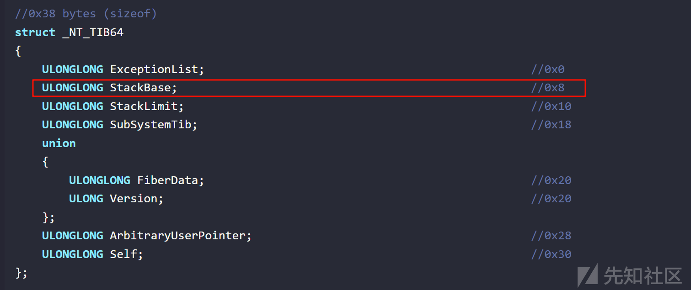

GS寄存器存储着TEB数据结构的指针，而GS寄存器偏移0x8（即 `gs:[0x8]`）的位置就是线程的栈基址，在参考文章[[1]](https://mp.weixin.qq.com/s/O4LCnC_DjzfvnLvgXm1bFQ)中，大佬是可能是通过x64dbg获取栈基址然后往上翻找，最后确定存储着两个返回地址的位置。

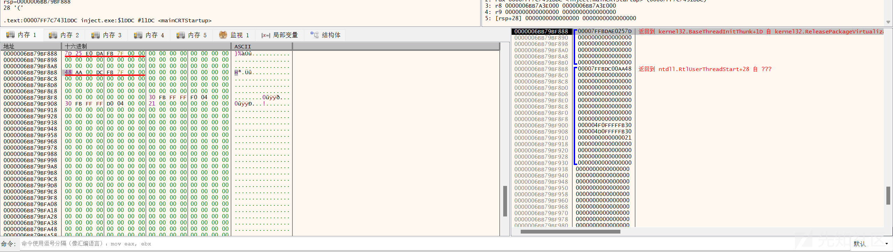

不知道什么原因，我不能查看StackBase栈上的内容，各位师傅可以尝试一下，在x64dbg命令行中输入：`mov rax,gs:[0x8]`，栈基址存放在rax中。 然后我想跳转到StackBase的时候不允许我这么做

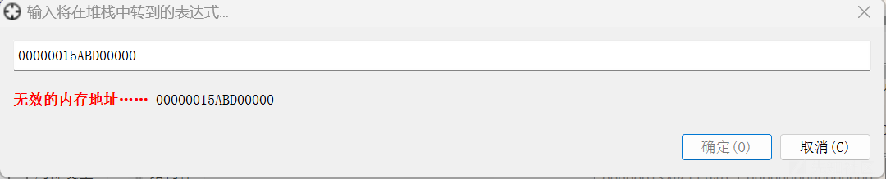

查看内存布局时发现，可能是该区域的页面信息位"保留"，所以我看不了栈上内容？也可能是我调式水平低下的原因。

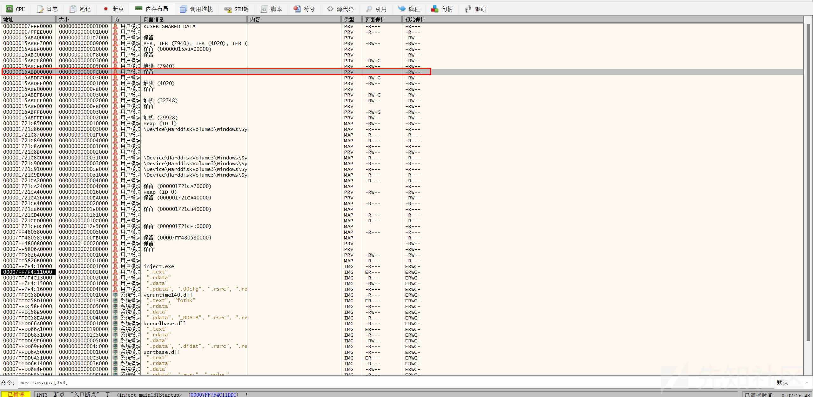

再用windbg来调式一下，随便打开一个exe进程。

```
0:000> !teb
TEB at 00000027b6305000
    ExceptionList:        0000000000000000
    StackBase:            00000027b6500000
    StackLimit:           00000027b64fb000
    SubSystemTib:         0000000000000000
    FiberData:            0000000000001e00
    ArbitraryUserPointer: 0000000000000000
    Self:                 00000027b6305000
    EnvironmentPointer:   0000000000000000
    ClientId:             00000000000077c8 . 000000000000768c
    RpcHandle:            0000000000000000
    Tls Storage:          0000017959ff7d50
    PEB Address:          00000027b6304000
    LastErrorValue:       0
    LastStatusValue:      0
    Count Owned Locks:    0
    HardErrorMode:        0
```

接着跳转到StackBase，跳转之后，我们往上翻找，这两个返回地址在较低地址处，因为栈指针RSP压栈的时候是往低地址的方向扩展。此时的程序未完成初始化，故stackbase所指向的栈空间没有留下返回地址

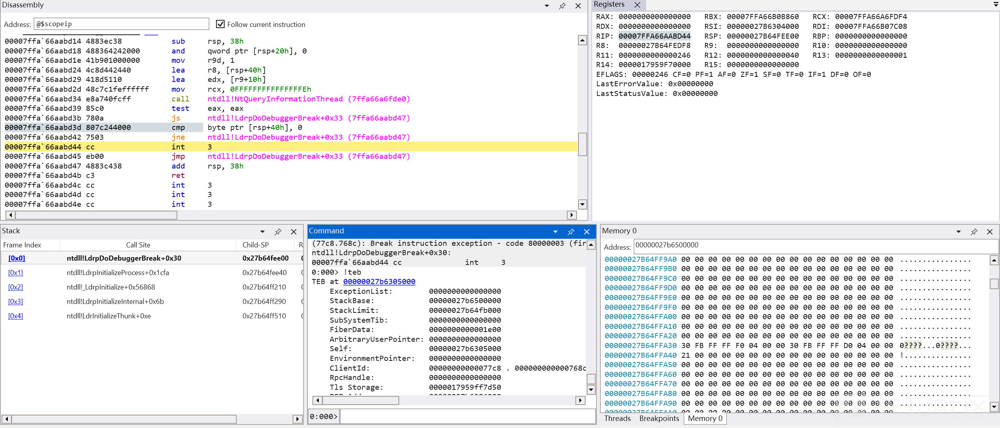

不要下任何断点，直接F5运行程序，弹出对话框，然后再关闭

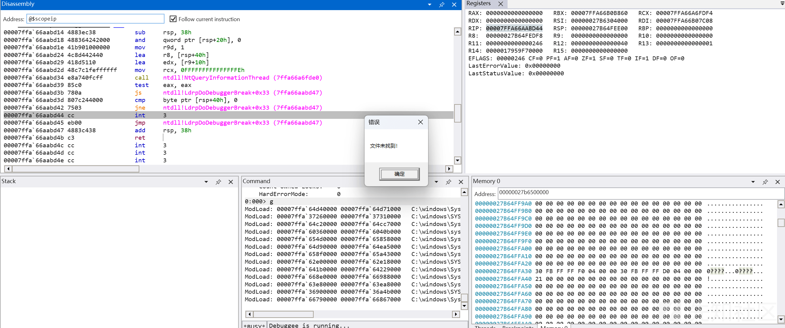

此时的栈空间如下。

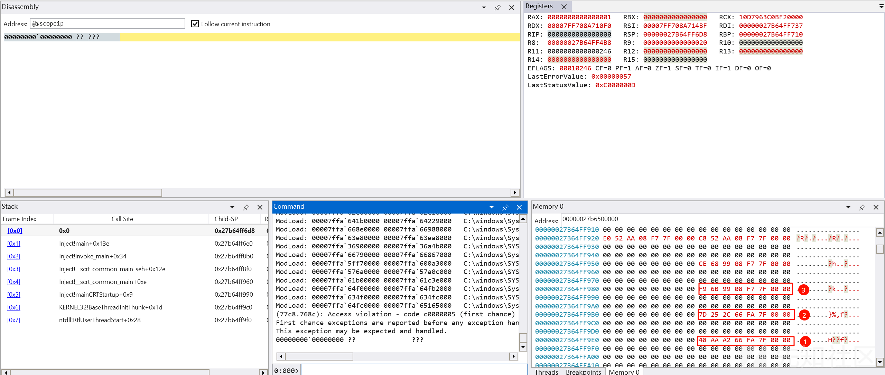

序号号①是 `ntdll!RtlUserThreadStart` 某条指令的返回地址，见下图。

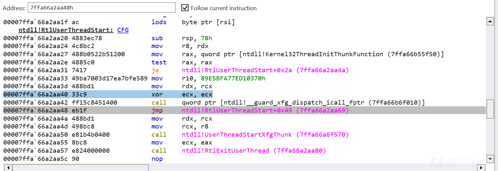

序号②是 `KERNEL32!BaseThreadInitThunk` 某条指令的返回地址，见下图。

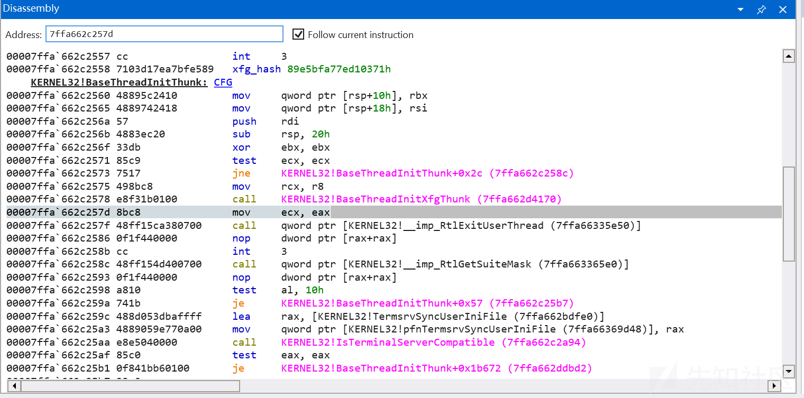

序号③是用户自定义函数的某条指令的返回地址，见下图，然而这并不重要。

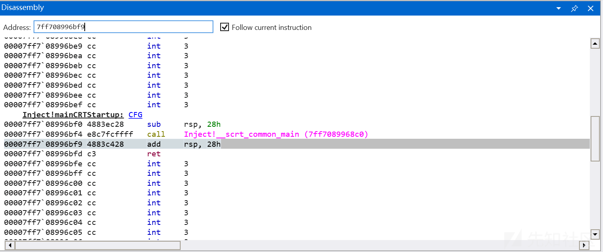

## 2.2 代码实现

还有一个问题如果通过代码实现，就是栈上这么多值，我怎么知道那个是返回地址。其实还是有一些特点的，即使开启了ASLR，模块 `kernel32` 和 `ntdll` 的 `.text` 节通常会在加载基址后的一个相对固定的位置，一般为7ffxxxxxxxxx。按照调用栈的顺序，第一个返回地址是指向kernel32.dll中的某个 `BaseThreadInitThunk` 的某条指令，而第二个返回地址是指向ntdll.dll中的 `RtlUserThreadStart` 的某条指令。

验证过程略显枯燥，但是实现却很简单，接下来就是通过栈回溯手段获取栈上的返回值了，代码如下

```
// 函数：GetImageBaseFromStack
// 功能：通过栈回溯获取 ntdll!RtlUserThreadStart 和 kernel32!BaseThreadInitThunk 的地址
// 参数：
//   ulNtdllRtlUserThreadStart [out] - 用于返回 ntdll!RtlUserThreadStart 的地址
//   ulKernel32BaseThreadInitThunk [out] - 用于返回 kernel32!BaseThreadInitThunk 的地址
void GetImageBaseFromStack(ULONG_PTR& ulNtdllRtlUserThreadStart, ULONG_PTR& ulKernel32BaseThreadInitThunk)
{
    // 获取当前线程环境块(TEB)
    _TEB* teb = NtCurrentTeb();

    // 获取栈基址（TEB+0x8 处存储了栈底地址）
    ULONG_PTR* stackaddr = (ULONG_PTR*)((PBYTE)teb + 0x8);
    ULONG_PTR ulstackBase = *stackaddr;
    printf("Get ulstackBase is 0x%016llX
", ulstackBase);

    // 从栈底向上搜索（x64栈向下增长，所以需要减去8字节）
    ULONG_PTR* pStackBase = (ULONG_PTR*)(ulstackBase - 8);

    // 循环搜索直到找到两个目标地址
    while (!ulNtdllRtlUserThreadStart || !ulKernel32BaseThreadInitThunk) {
        if (*pStackBase != 0) {
            // 检查是否在 ntdll 的地址范围内（x64下通常 > 0x7ff000000000）
            if (ulNtdllRtlUserThreadStart == 0 && *pStackBase > 0x7ff000000000) {
                ulNtdllRtlUserThreadStart = *pStackBase;
            }
            // 检查是否在 kernel32 的地址范围内（同样 > 0x7ff000000000）
            else if (ulKernel32BaseThreadInitThunk == 0 && *pStackBase > 0x7ff000000000) {
                ulKernel32BaseThreadInitThunk = *pStackBase;
            }
        }
        // 向上移动栈指针（每次移动16字节，即2个ULONG_PTR）
        pStackBase -= 2;
    }
}
```

⚠注意：

1. 这里所说的"以0或8"结尾是针对十六进制的。
2. 获取栈基址的方式不唯一，常规的还有\_\_readgsqword(0x8)，比如说 `ULONG_PTR ulstackBase = (ULONG_PTR)__readgsqword(0x8);`
3. `ULONG_PTR* pStackBase = (ULONG_PTR*)(ulstackBase - 8);`：返回地址一般存储在地址以8结尾的内存单元，而我们的StackBase一定以0结尾，我可能说的不严谨。按照windows x64调用约定[[2]](https://learn.microsoft.com/zh-cn/cpp/build/x64-calling-convention?view=msvc-170)，在调用call指令时必需让RSP以16字节对齐，即RSP以0结尾，这使得调用call指令后压入的返回地址必然在以8结尾的栈地址。每个函数的栈帧只有一个返回地址，每个栈帧以16字节对齐，这导致返回地址之间相距16的倍数。**总结来说，这个语句是确保pStackBase以8结尾，方便后面的回溯操作**。

1. 如果调用者不涉及栈操作，在调用call指令前，rsp以8结尾，指向返回地址，call指令前面的的指令一般常见sub rsp,0x28。
2. 如果调用者涉及到栈操作，在调用call指令前，预留32字节的影子空间，然后填充栈使RSP按照16字节对齐

4. 共享库（DLL）一般加载到大于 0x7ff000000000的位置，可以用x64dbg看一下，所以遇到大于0x7ff000000000的值可以认为是返回地址了

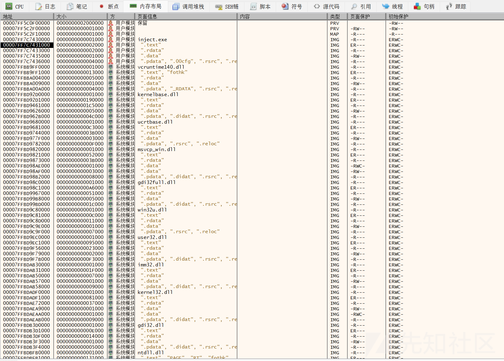

废话少说，直接调式看看

运行代码，如下图所示下一个断点，运行后，我们根据 `ulstackBase` 的值跳转到栈基址所在的位置，接着往上翻找返回地址。

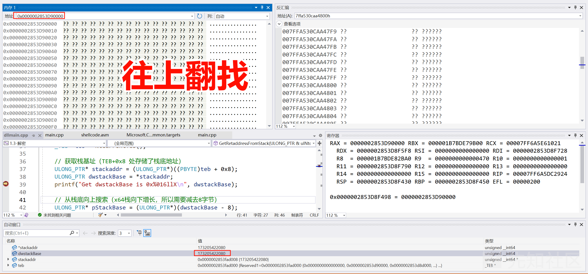

下图，红色方框的返回地址指向 `RtlUserThreadStart` 的某条指令

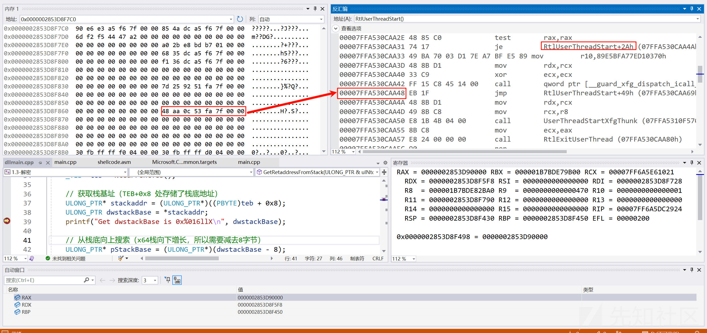

下图的红色方框的返回地址指向 `BaseThreadInitThunk` 的某条指令

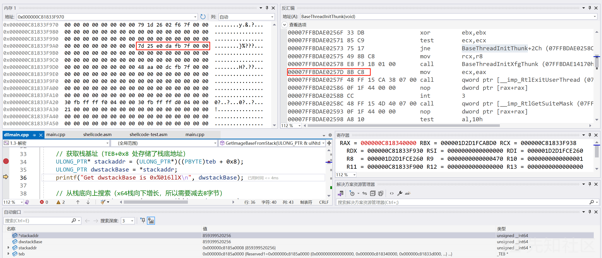

第三个返回地址是指向main函数的某条指令，当然这个并不重要

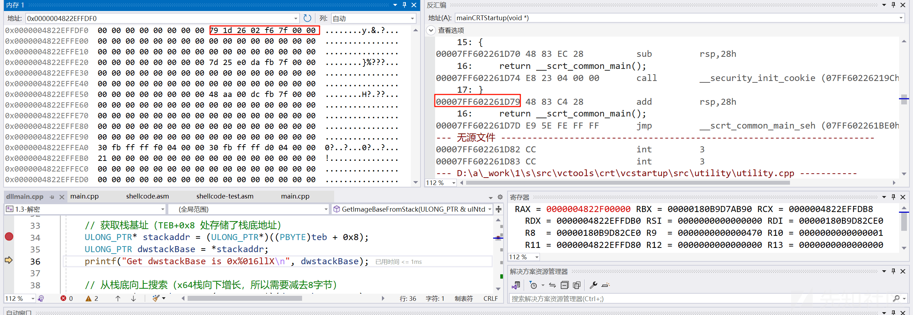

可以很明显的看到，返回地址位于以8结尾栈地址处，每个返回地址相差16的倍数，所以 `pStackBase` 按16字节移动来寻找返回地址是可行的。

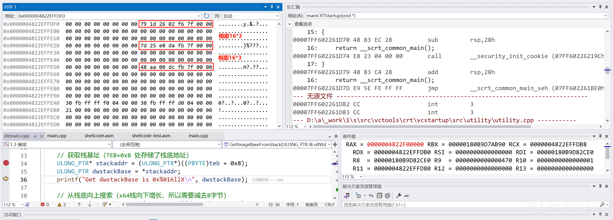

执行 `GetImageBaseFromStack` 函数前

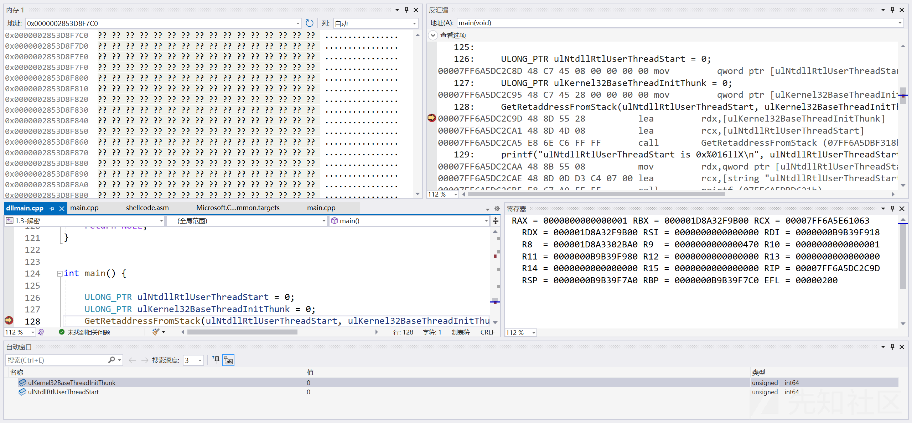

执行 `GetImageBaseFromStack` 函数后，确实获取到了这两个返回地址。

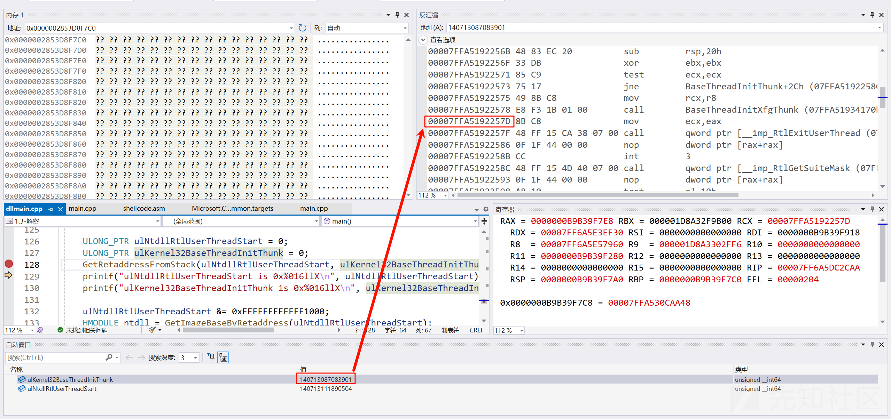

通过上述的一系列调试分析，最终验证了确实能通过栈基址回溯找到返回地址，验证完毕，收工！

# 三、暴力搜索DLL基址

## 3.1 内存页对齐

在参考文章[[1]](https://mp.weixin.qq.com/s/O4LCnC_DjzfvnLvgXm1bFQ)中，大佬使用的是按照0x1000向前遍历（往低地址），找到PE头，这种方法是比较高效。先来说说为什么要按0x1000步长来遍历，PE文件（如DLL或EXE）在内存中的基址通常是按内存页对齐的。在Windows系统中，内存页的大小通常是4KB，也就是0x1000字节。因此，模块的基址应该位于某个内存页的起始位置，即地址是0x1000的整数倍数，或者换个说法，地址末尾必定以3个 `000` 结尾。所以，按照0x1000的步长来遍历，可以有效地检查每个可能的页起始地址是否符合PE头的特征，这样既高效又减少了需要检查的地址数量，提高了搜索速度。

怎么验证？很简单，我们用x64dbg随便打开一个exe文件，查看内存布局，我们除了观察查看各个PE文件的基址外，还可以观察每个PE文件的大小都是0x1000的整数倍，所以按0x1000步长绝对是可以找到DOS头和NT头的。

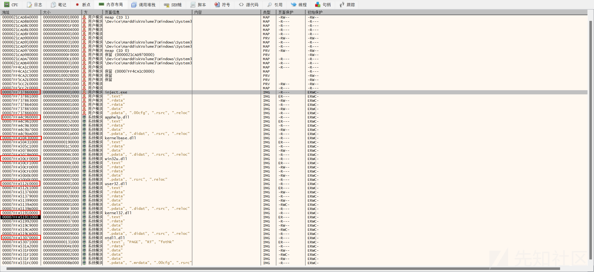

## 3.2 代码实现

如果有看过我的另一篇文章 `自举的代码幽灵——反射DLL注入（Reflective DLL Injection）`[[3]](https://xz.aliyun.com/news/17089) 的师傅可能会知道，我们的 `ReflectiveLoader` 函数通过获取当前自己在内存的位置，然后暴力地从低地址遍历，直到遇见DOS头和NT头呢，DOS头的签名是 `0x5A4D（小端序）`，即 `“MZ”` 字符串；NT头的签名是 `0x00004550（小端序）`，即 `“PE00”`

现在我们已经拥有了某个kernel API和ntdll API的某条指令的地址，我们都知道，函数是定义在.text节中的，模块基址位于.text节的下方（.text节位于较高的地址，而模块基址位于较低的地址）。我们可以根据上述的暴力搜索DLL的基址的思想，来寻找kernel和ntdll的模块基址。

首先我们要将刚刚获取到的返回地址按 `0xFFFFFFFFFFFF1000` 相与，即将返回地址按0x1000对齐

```
ulNtdllRtlUserThreadStart &= 0xFFFFFFFFFFFF1000;
```

然后按0x1000步长来遍历往低地址遍历，直到找到DOS头和NT头

```
// 函数：GetImageBaseByRetaddress
// 功能：通过函数地址逆向查找所属DLL的基地址
// 参数：
//   ulLibraryAddress [in] - 目标函数地址(ULONG_PTR类型)
HMODULE GetImageBaseByRetaddress(ULONG_PTR ulLibraryAddress) {

    // ulHeaderValue用于存储NT头的RVA，pNtHeader用于存储Nt头地址
    ULONG_PTR ulHeaderValue = 0;
    PIMAGE_NT_HEADERS pNtHeader = 0;

    // 地址往回退，直到找到DLL的基址
    while (TRUE)
    {
        // 验证是否为DOS头
        if (((PIMAGE_DOS_HEADER)ulLibraryAddress)->e_magic == IMAGE_DOS_SIGNATURE)
        {
            // 验证是否为NT头
            ulHeaderValue = ((PIMAGE_DOS_HEADER)ulLibraryAddress)->e_lfanew;
            if (ulHeaderValue >= sizeof(IMAGE_DOS_HEADER) && ulHeaderValue < 1024)
            {
                pNtHeader = (PIMAGE_NT_HEADERS)(ulHeaderValue + ulLibraryAddress);
                if (pNtHeader->Signature == IMAGE_NT_SIGNATURE)
                    break;
            }
        }
        ulLibraryAddress -= 0x1000 ;
        if (ulLibraryAddress < 0x7ff000000000) return NULL;
    }
    return (HMODULE)ulLibraryAddress;
}
```

你说我不懂什么是对齐也不要紧，我直接暴力地一个地址一个地址的尝试，总能找到DOS头和NT头。因为是一个地址一个地址的遍历，所以返回地址就不用按 `0xFFFFFFFFFFFF1000` 相与了，只需要将 `GetImageBaseByRetaddress` 函数的 `ulLibraryAddress -= 0x1000 ;` 修改成 `ulLibraryAddress-- ;` 即可。

# 四、解析PE头获取目标API

相对比较简单，网上资料也很多，无非就是先找到NT头，然后再找到导出表的地址，其次获取三个重要的数组，最后遍历导出表找到目标函数。具体我就不讲解，有什么不懂直接问AI。

为什么代码中出现了 `MyCompareStringA` 自定义字符串比较函数？其实呢我最初的想法是往shellcode方向走的，能不用库函数就不用，当然你没这方面的要求可以换成其他的字符串比较函数。

```
// 函数：GetApiAddressByName
// 功能：通过解析PE导出表动态获取指定API的函数地址
// 参数：
//   hModule [in] - 目标模块的基地址(HMODULE)
//   ApiName [in] - 要查找的API函数名称(ANSI字符串)
// 返回值：成功返回函数地址(FARPROC)，失败返回NULL
FARPROC GetApiAddressByName(HMODULE hModule, CHAR* ApiName) {
    // 分析 PE 文件找到导出表
    PIMAGE_NT_HEADERS pNtHeaders = (PIMAGE_NT_HEADERS)((BYTE*)hModule + ((PIMAGE_DOS_HEADER)hModule)->e_lfanew);
    PIMAGE_EXPORT_DIRECTORY pExportDirectory = (PIMAGE_EXPORT_DIRECTORY)((BYTE*)hModule +
        pNtHeaders->OptionalHeader.DataDirectory[IMAGE_DIRECTORY_ENTRY_EXPORT].VirtualAddress);

    // 获取导出表的各个信息
    DWORD* pFunctionNames = (DWORD*)((BYTE*)hModule + pExportDirectory->AddressOfNames);
    DWORD* pFunctionAddresses = (DWORD*)((BYTE*)hModule + pExportDirectory->AddressOfFunctions);
    WORD* pFunctionOrdinals = (WORD*)((BYTE*)hModule + pExportDirectory->AddressOfNameOrdinals);

    // 遍历导出表，查找目标函数
    for (DWORD i = 0; i < pExportDirectory->NumberOfNames; i++) {
        char* functionName = (char*)((BYTE*)hModule + pFunctionNames[i]);

        // 找到函数名，获取其地址
        if (MyCompareStringA(functionName, ApiName)) {
            return (FARPROC)((BYTE*)hModule + pFunctionAddresses[pFunctionOrdinals[i]]);
        }
    }

    // 如果遍历完导出表未找到函数，返回 NULL
    return NULL;
}
```

# 五、完整C代码以及测试

利用的代码已经通过函数的形式封装成三个函数，开箱即用非常方便，根据代码示例的引导，可以进一步完成复杂操作。

1. `GetRetaddressFromStack`：通过栈回溯获取 ntdll!RtlUserThreadStart 和 kernel32!BaseThreadInitThunk 的地址
2. `GetImageBaseByRetaddress`：通过函数地址逆向查找所属DLL的基地址
3. `GetApiAddressByName`：通过解析PE导出表动态获取指定API的函数地址

先说结论：

1. **可以在win11、win10、windows server 2012、2016上运行、windows server 2019、2022没测试理论上是可以运行的**。
2. **win7不能运行，其他低版本未测试**，适用性比不上 `遍历PEB法`，但也算是一个不错的思路了。

## 5.1 C语言-弹窗

```
#include <windows.h>
#include <stdio.h>
#include <winternl.h>

// ASCII字符串比较函数
bool MyCompareStringA(CHAR str1[], CHAR str2[]) {


    int i = 0;
    while (str1[i] && str2[i]) {

        if (str1[i] != str2[i]) {
            return false;
        }
        i++;
    }

    // 必须同时到达字符串结尾才算相等
    return (str1[i] == '\0' && str2[i] == '\0');
}


// 函数：GetRetaddressFromStack
// 功能：通过栈回溯获取 ntdll!RtlUserThreadStart 和 kernel32!BaseThreadInitThunk 的地址
// 参数：
//   ulNtdllRtlUserThreadStart [out] - 用于返回 ntdll!RtlUserThreadStart 的地址
//   ulKernel32BaseThreadInitThunk [out] - 用于返回 kernel32!BaseThreadInitThunk 的地址
void GetRetaddressFromStack(ULONG_PTR& ulNtdllRtlUserThreadStart, ULONG_PTR& ulKernel32BaseThreadInitThunk)
{
    // 获取当前线程环境块(TEB)
    _TEB* teb = NtCurrentTeb();

    // 获取栈基址（TEB+0x8 处存储了栈底地址）
    ULONG_PTR* stackaddr = (ULONG_PTR*)((PBYTE)teb + 0x8);
    ULONG_PTR ulstackBase = *stackaddr;
    printf("Get ulstackBase is 0x%016llX
", ulstackBase);

    // 从栈底向上搜索（x64栈向下增长，所以需要减去8字节）
    ULONG_PTR* pStackBase = (ULONG_PTR*)(ulstackBase - 8);

    // 循环搜索直到找到两个目标地址
    while (!ulNtdllRtlUserThreadStart || !ulKernel32BaseThreadInitThunk) {
        if (*pStackBase != 0) {
            // 检查是否在 ntdll 的地址范围内（x64下通常 > 0x7ff000000000）
            if (ulNtdllRtlUserThreadStart == 0 && *pStackBase > 0x7ff000000000) {
                ulNtdllRtlUserThreadStart = *pStackBase;
            }
            // 检查是否在 kernel32 的地址范围内（同样 > 0x7ff000000000）
            else if (ulKernel32BaseThreadInitThunk == 0 && *pStackBase > 0x7ff000000000) {
                ulKernel32BaseThreadInitThunk = *pStackBase;
            }
        }
        // 向上移动栈指针（每次移动16字节，即2个ULONG_PTR）
        pStackBase -= 2;
    }
}

// 函数：GetImageBaseByRetaddress
// 功能：通过函数地址逆向查找所属DLL的基地址
// 参数：
//   ulLibraryAddress [in] - 目标函数地址(ULONG_PTR类型)
HMODULE GetImageBaseByRetaddress(ULONG_PTR ulLibraryAddress) {

    // ulHeaderValue用于存储NT头的RVA，pNtHeader用于存储Nt头地址
    ULONG_PTR ulHeaderValue = 0;
    PIMAGE_NT_HEADERS pNtHeader = 0;

    // 地址往回退，直到找到DLL的基址
    while (TRUE)
    {
        // 验证是否为DOS头
        if (((PIMAGE_DOS_HEADER)ulLibraryAddress)->e_magic == IMAGE_DOS_SIGNATURE)
        {
            // 验证是否为NT头
            ulHeaderValue = ((PIMAGE_DOS_HEADER)ulLibraryAddress)->e_lfanew;
            if (ulHeaderValue >= sizeof(IMAGE_DOS_HEADER) && ulHeaderValue < 1024)
            {
                pNtHeader = (PIMAGE_NT_HEADERS)(ulHeaderValue + ulLibraryAddress);
                if (pNtHeader->Signature == IMAGE_NT_SIGNATURE)
                    break;
            }
        }
        ulLibraryAddress -= 0x1000 ;
        if (ulLibraryAddress < 0x7ff000000000) return NULL;
    }
    return (HMODULE)ulLibraryAddress;
}

// 函数：GetApiAddressByName
// 功能：通过解析PE导出表动态获取指定API的函数地址
// 参数：
//   hModule [in] - 目标模块的基地址(HMODULE)
//   ApiName [in] - 要查找的API函数名称(ANSI字符串)
// 返回值：成功返回函数地址(FARPROC)，失败返回NULL
FARPROC GetApiAddressByName(HMODULE hModule, CHAR* ApiName) {
    // 分析 PE 文件找到导出表
    PIMAGE_NT_HEADERS pNtHeaders = (PIMAGE_NT_HEADERS)((BYTE*)hModule + ((PIMAGE_DOS_HEADER)hModule)->e_lfanew);
    PIMAGE_EXPORT_DIRECTORY pExportDirectory = (PIMAGE_EXPORT_DIRECTORY)((BYTE*)hModule +
        pNtHeaders->OptionalHeader.DataDirectory[IMAGE_DIRECTORY_ENTRY_EXPORT].VirtualAddress);

    // 获取导出表的各个信息
    DWORD* pFunctionNames = (DWORD*)((BYTE*)hModule + pExportDirectory->AddressOfNames);
    DWORD* pFunctionAddresses = (DWORD*)((BYTE*)hModule + pExportDirectory->AddressOfFunctions);
    WORD* pFunctionOrdinals = (WORD*)((BYTE*)hModule + pExportDirectory->AddressOfNameOrdinals);

    // 遍历导出表，查找目标函数
    for (DWORD i = 0; i < pExportDirectory->NumberOfNames; i++) {
        char* functionName = (char*)((BYTE*)hModule + pFunctionNames[i]);

        // 找到函数名，获取其地址
        if (MyCompareStringA(functionName, ApiName)) {
            return (FARPROC)((BYTE*)hModule + pFunctionAddresses[pFunctionOrdinals[i]]);
        }
    }

    // 如果遍历完导出表未找到函数，返回 NULL
    return NULL;
}


int main() {

    ULONG_PTR ulNtdllRtlUserThreadStart = 0;
    ULONG_PTR ulKernel32BaseThreadInitThunk = 0;
    GetRetaddressFromStack(ulNtdllRtlUserThreadStart, ulKernel32BaseThreadInitThunk);
    printf("ulNtdllRtlUserThreadStart is 0x%016llX
", ulNtdllRtlUserThreadStart);
    printf("ulKernel32BaseThreadInitThunk is 0x%016llX
", ulKernel32BaseThreadInitThunk);

    ulNtdllRtlUserThreadStart &= 0xFFFFFFFFFFFF1000;
    HMODULE ntdll = GetImageBaseByRetaddress(ulNtdllRtlUserThreadStart);
    printf("ntdll baseaddrss is 0x%016llX
", ntdll);

    ulKernel32BaseThreadInitThunk &= 0xFFFFFFFFFFFF1000;
    HMODULE kernel32 = GetImageBaseByRetaddress(ulKernel32BaseThreadInitThunk);
    printf("kernel32 baseaddrss is 0x%016llX
", kernel32);

    typedef HMODULE(WINAPI* LOADLIBRARYA)(LPCSTR lpLibFileName);
    CHAR loadLibraryA[] = { 'L', 'o', 'a', 'd', 'L', 'i', 'b', 'r', 'a', 'r', 'y', 'A', '\0' };
    LOADLIBRARYA pLoadLibraryA = (LOADLIBRARYA)GetApiAddressByName(kernel32, loadLibraryA);
    HMODULE user32 = pLoadLibraryA("user32.dll");

    typedef int (WINAPI* MESSAGEBOXA)(HWND hWnd, LPCSTR lpText, LPCSTR lpCaption, UINT uType);
    CHAR messageBoxA[] = { 'M', 'e', 's', 's', 'a', 'g', 'e', 'B', 'o', 'x', 'A', '\0' };
    MESSAGEBOXA pMessageBoxA = (MESSAGEBOXA)GetApiAddressByName((HMODULE)user32, messageBoxA);
    pMessageBoxA(NULL, "hello,oneday!!!!!!!!!", NULL, 0);
    return 1;
}
```

⚠**注意**：

在windows11上，我用VS2022编译后能成功执行，但是在windows10上不能执行，出现问题的点在于获取kernel32基址上，这一块我暂时不知道原因，当然只用ntdll也能完成绝大多数功能。

下图是在win11上测试

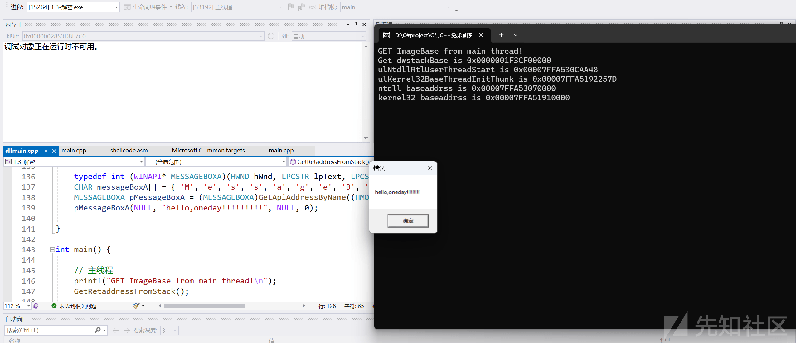

下图是在win10上未能成功运行。

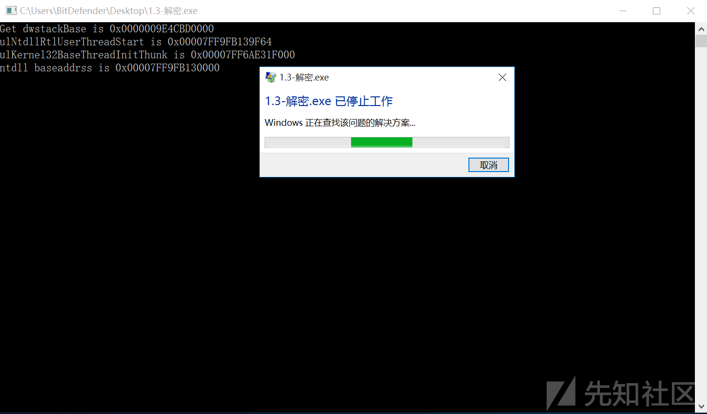

我换clion IDE来编译，其实就是用minGW工具集，然后就可以在win11上运行，也可以win10上运行，适用性还算ok。

首先测试用clion编译后能不能在win11上运行

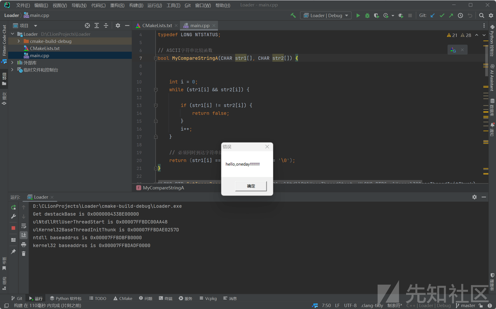

找到编译后的exe文件，然后在win10上运行

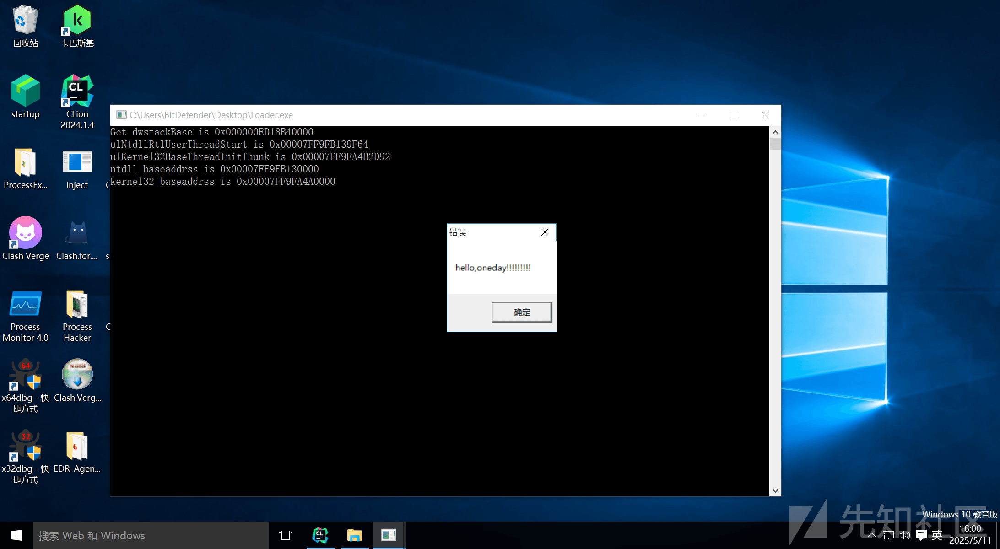

windows sever 2016上能成功执行

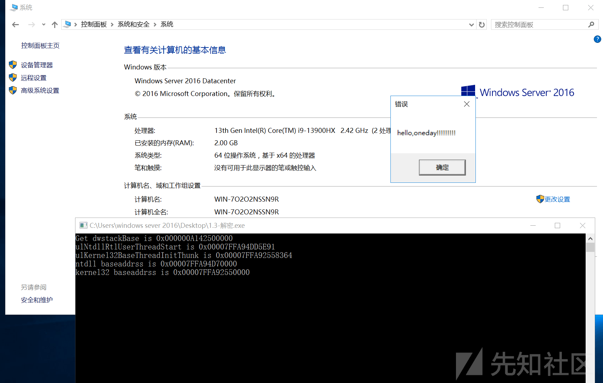

最后在windows sever 2012上运行

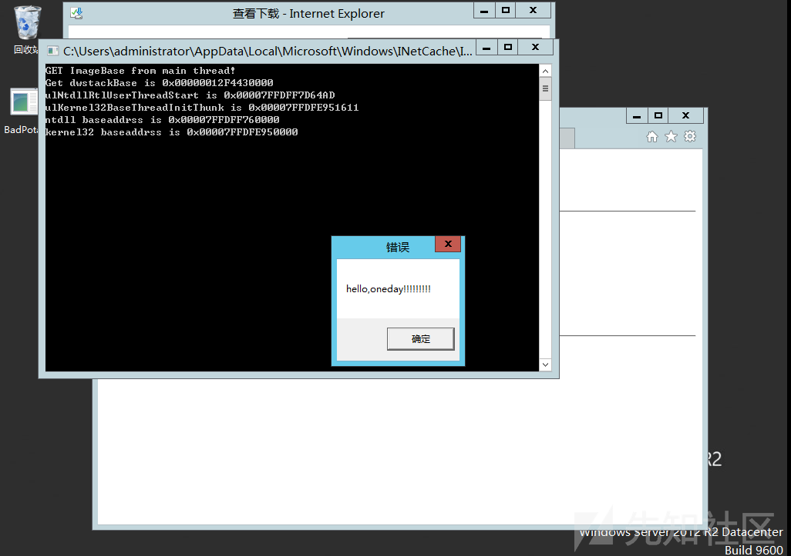

## 5.2 C语言-弹窗（子线程）

主要是验证子线程是否能通过本章介绍的方法获取模块基址，代码逻辑进行了部分修改，因为CreateThread只能让要启动线程带一个参数，且无直接返回值。

```
#include <windows.h>
#include <stdio.h>
#include <winternl.h>

// ASCII字符串比较函数
bool MyCompareStringA(CHAR str1[], CHAR str2[]) {


    int i = 0;
    while (str1[i] && str2[i]) {

        if (str1[i] != str2[i]) {
            return false;
        }
        i++;
    }

    // 必须同时到达字符串结尾才算相等
    return (str1[i] == '\0' && str2[i] == '\0');
}


// 函数：GetImageBaseByRetaddress
// 功能：通过函数地址逆向查找所属DLL的基地址
// 参数：
//   ulLibraryAddress [in] - 目标函数地址(ULONG_PTR类型)
HMODULE GetImageBaseByRetaddress(ULONG_PTR ulLibraryAddress) {

    // ulHeaderValue用于存储NT头的RVA，pNtHeader用于存储Nt头地址
    ULONG_PTR ulHeaderValue = 0;
    PIMAGE_NT_HEADERS pNtHeader = 0;

    // 地址往回退，直到找到DLL的基址
    while (TRUE)
    {
        // 验证是否为DOS头
        if (((PIMAGE_DOS_HEADER)ulLibraryAddress)->e_magic == IMAGE_DOS_SIGNATURE)
        {
            // 验证是否为NT头
            ulHeaderValue = ((PIMAGE_DOS_HEADER)ulLibraryAddress)->e_lfanew;
            if (ulHeaderValue >= sizeof(IMAGE_DOS_HEADER) && ulHeaderValue < 1024)
            {
                pNtHeader = (PIMAGE_NT_HEADERS)(ulHeaderValue + ulLibraryAddress);
                if (pNtHeader->Signature == IMAGE_NT_SIGNATURE)
                    break;
            }
        }
        ulLibraryAddress -= 0x1000;
        if (ulLibraryAddress < 0x7ff000000000) return NULL;
    }
    return (HMODULE)ulLibraryAddress;
}

// 函数：GetApiAddressByName
// 功能：通过解析PE导出表动态获取指定API的函数地址
// 参数：
//   hModule [in] - 目标模块的基地址(HMODULE)
//   ApiName [in] - 要查找的API函数名称(ANSI字符串)
// 返回值：成功返回函数地址(FARPROC)，失败返回NULL
FARPROC GetApiAddressByName(HMODULE hModule, CHAR* ApiName) {
    // 分析 PE 文件找到导出表
    PIMAGE_NT_HEADERS pNtHeaders = (PIMAGE_NT_HEADERS)((BYTE*)hModule + ((PIMAGE_DOS_HEADER)hModule)->e_lfanew);
    PIMAGE_EXPORT_DIRECTORY pExportDirectory = (PIMAGE_EXPORT_DIRECTORY)((BYTE*)hModule +
        pNtHeaders->OptionalHeader.DataDirectory[IMAGE_DIRECTORY_ENTRY_EXPORT].VirtualAddress);

    // 获取导出表的各个信息
    DWORD* pFunctionNames = (DWORD*)((BYTE*)hModule + pExportDirectory->AddressOfNames);
    DWORD* pFunctionAddresses = (DWORD*)((BYTE*)hModule + pExportDirectory->AddressOfFunctions);
    WORD* pFunctionOrdinals = (WORD*)((BYTE*)hModule + pExportDirectory->AddressOfNameOrdinals);

    // 遍历导出表，查找目标函数
    for (DWORD i = 0; i < pExportDirectory->NumberOfNames; i++) {
        char* functionName = (char*)((BYTE*)hModule + pFunctionNames[i]);

        // 找到函数名，获取其地址
        if (MyCompareStringA(functionName, ApiName)) {
            return (FARPROC)((BYTE*)hModule + pFunctionAddresses[pFunctionOrdinals[i]]);
        }
    }

    // 如果遍历完导出表未找到函数，返回 NULL
    return NULL;
}

void GetRetaddressFromStack()
{
    ULONG_PTR ulNtdllRtlUserThreadStart = 0;
    ULONG_PTR ulKernel32BaseThreadInitThunk = 0;

    // 获取当前线程环境块(TEB)
    _TEB* teb = NtCurrentTeb();

    // 获取栈基址（TEB+0x8 处存储了栈底地址）
    ULONG_PTR* stackaddr = (ULONG_PTR*)((PBYTE)teb + 0x8);
    ULONG_PTR ulstackBase = *stackaddr;
    printf("Get ulstackBase is 0x%016llX
", ulstackBase);

    // 从栈底向上搜索（x64栈向下增长，所以需要减去8字节）
    ULONG_PTR* pStackBase = (ULONG_PTR*)(ulstackBase - 8);

    // 循环搜索直到找到两个目标地址
    while (!ulNtdllRtlUserThreadStart || !ulKernel32BaseThreadInitThunk) {
        if (*pStackBase != 0) {
            // 检查是否在 ntdll 的地址范围内（x64下通常 > 0x7ff000000000）
            if (ulNtdllRtlUserThreadStart == 0 && *pStackBase > 0x7ff000000000) {
                ulNtdllRtlUserThreadStart = *pStackBase;
            }
            // 检查是否在 kernel32 的地址范围内（同样 > 0x7ff000000000）
            else if (ulKernel32BaseThreadInitThunk == 0 && *pStackBase > 0x7ff000000000) {
                ulKernel32BaseThreadInitThunk = *pStackBase;
            }
        }
        // 向上移动栈指针（每次移动16字节，即2个ULONG_PTR）
        pStackBase -= 2;
    }

    printf("ulNtdllRtlUserThreadStart is 0x%016llX
", ulNtdllRtlUserThreadStart);
    printf("ulKernel32BaseThreadInitThunk is 0x%016llX
", ulKernel32BaseThreadInitThunk);

    ulNtdllRtlUserThreadStart &= 0xFFFFFFFFFFFF1000;
    HMODULE ntdll = GetImageBaseByRetaddress(ulNtdllRtlUserThreadStart);
    printf("ntdll baseaddrss is 0x%016llX
", ntdll);

    ulKernel32BaseThreadInitThunk &= 0xFFFFFFFFFFFF1000;
    HMODULE kernel32 = GetImageBaseByRetaddress(ulKernel32BaseThreadInitThunk);
    printf("kernel32 baseaddrss is 0x%016llX
", kernel32);

    typedef HMODULE(WINAPI* LOADLIBRARYA)(LPCSTR lpLibFileName);
    CHAR loadLibraryA[] = { 'L', 'o', 'a', 'd', 'L', 'i', 'b', 'r', 'a', 'r', 'y', 'A', '\0' };
    LOADLIBRARYA pLoadLibraryA = (LOADLIBRARYA)GetApiAddressByName(kernel32, loadLibraryA);
    HMODULE user32 = pLoadLibraryA("user32.dll");

    typedef int (WINAPI* MESSAGEBOXA)(HWND hWnd, LPCSTR lpText, LPCSTR lpCaption, UINT uType);
    CHAR messageBoxA[] = { 'M', 'e', 's', 's', 'a', 'g', 'e', 'B', 'o', 'x', 'A', '\0' };
    MESSAGEBOXA pMessageBoxA = (MESSAGEBOXA)GetApiAddressByName((HMODULE)user32, messageBoxA);
    pMessageBoxA(NULL, "hello,oneday!!!!!!!!!", NULL, 0);

}

int main() {

    // 主线程
    printf("GET ImageBase from main thread!
");
    GetRetaddressFromStack();

    // 子线程
    printf("GET ImageBase from sub thread!
");
    HANDLE hThread = CreateThread(NULL, 0, (LPTHREAD_START_ROUTINE)GetRetaddressFromStack, NULL, 0, NULL);
    WaitForSingleObject(hThread, INFINITE);
    return 1;
}
```

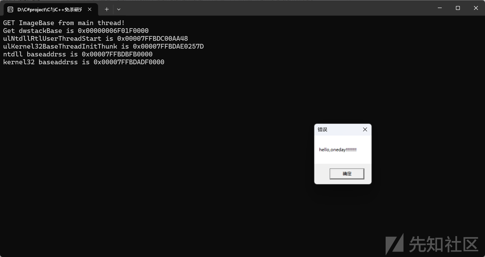

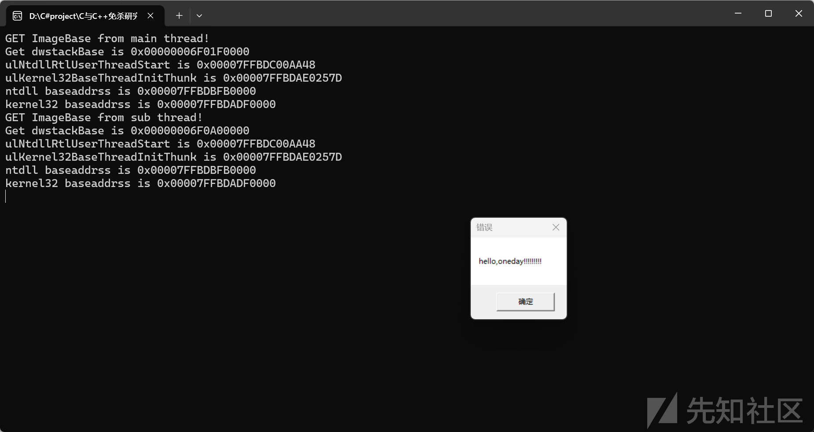

# 六、MASM汇编以及测试

写完C语言代码后，我就在想，这种方法既然是非遍历PEB获取ntdll和kernel32获取模块基址并且适用性还算可以，那是不是可以替换源msf和cs中的获取API地址的相关代码呢？说干就干，虽然过程曲折，但结果确是值得的，因为这是一种全新的编写思路。这是我呕心沥血，花了无数个日夜最终实现的非PEB获取ntdll和kernel32模块基址方法的MASM汇编实现，本身这个方法连完整的C代码都极少有人公开发表，更何况汇编代码的实现。

经过长时间的思想斗争，以及互联网的开源精神对我的熏陶，慎重考虑后决定公开发表，助力底层安全研究发展，所以都到这个份上了，求个点赞、收藏和关注不过分吧呜呜呜呜呜呜呜>.<

我在这里写汇编是锻炼自己的汇编能力，这种级别的汇编开发确实需要深厚的功底，这是通向高级shellcode的必经之路。并且我是想用这个模板去开发有意思的shellcode（后期文章可能会用到），如果各位师傅感兴趣，也可以用一用，当然适用性没有 `遍历PEB` 高这是肯定的。

编写自定义函数比较随心所欲，不必完全按照x64的调用约定，但是在调用与windows API有关的函数时就要格外注意参数传递、对齐、影子空间等。

## 6.1 GetRetaddressFromStack

**（1）获取栈基址并初始化一些寄存器**

```
xor rdx,rdx				  ; 清零
mov rdx,gs:[rdx+8h]       ; rdx = stackbase
sub rdx,8                 ; 确保stackbase以8结尾
test rdx,rdx              ; 如果栈基址为空则结束
jz fail                   
xor rcx,rcx				  ; rcx从当计数器
```

关键指令解析：

1. `mov rdx,gs:[rdx+8h]`：Windows系统通过GS寄存器访问当前线程的TEB，在其偏移0x8的位置就是栈基址
2. `sub rdx,8`：调整栈基址对齐方式，确保stackbase以8结尾，原因也简单在前面也分析过，就是返回地址必定在以8结尾栈地址处
3. `xor rcx,rcx`：rcx从当计数器，因为第一个返回地址大概率指向ntdll!RtlUserThreadStart的某条指令，紧接着的下一个返回地址指向Kernel32BaseThreadInitThunk的某条指令。只要找到符合条件的两个返回地址后我们就结束循环。

**（2）循环结构与栈遍历逻辑**

通过 `rdx` 寄存器遍历栈内存，每次读取8字节值到 `rax`，并检查是否为0。

```
search_loop:
mov rax,qword ptr [rdx]   ; 获取栈上的值
test rax,rax              ; 如果值为0，则跳转到下一次循环
jz next    
```

**（3）地址有效性校验​**

ntdll和kernel32模块的 `.text` 通常位于 `7ffxxxxxxxxxh`，只要这个值大于 `7ff000000000h` 大概率可以认为是返回地址。

```
mov rbx,7ff000000000h     ; 注意点
cmp rax,rbx               ; rax与7ff000000000h比较
jb next                   ; 当rax<7ff000000000h时跳转到下一次循环
```

**(4) 符合条件的地址处理**

收集满足条件的地址，一共有两个，原因上文以及分析过了，只要找到两个符合条件的返回地址就结束循环

```
push rax                  ; 找到符号条件的返回地址，压栈
inc ecx                   ; 找到一次就加1
cmp ecx,2				  ; 计数器
je finish                 ; 如果找到了两个返回地址就结束循环
```

**（5）循环控制、结束与错误处理**

1. 按步长16字节往低地址遍历，因为返回地址间相距16的整数倍。
2. 如果执行到finish标签处表明已经找到了符合条件的两个返回地址，将其保存到r12、r13寄存器以备后续使用
3. 如果出现错误，则通过rax返回0。

```
next:
    sub rdx, 10h              ; pStackBase -= 2;
    jmp search_loop           

finish:
    pop r12                   ; r12 = ulKernel32BaseThreadInitThunk
    pop r13					  ; r13 = ulNtdllRtlUserThreadStart
    ret                       ; 返回

fail:
    push 0                    ; 如果失败则通过rax返回0
    pop rax                   
    ret                 
```

## 6.2 GetImageBaseByRetaddress

整体结构与 `GetRetaddressFromStack` 类似，我就说一下我踩过的坑

```
xor rax,rax					                 ; 清零
    xor rbx,rbx                               ; 清零
search_loop:
    mov ax,word ptr [rcx]			  ; eax = e_magic
    cmp ax,5a4dh					      ; "MZ"签名，是word字长
    jne next                                     ; 如果不相等则跳转到下一次循环

    mov ebx,dword ptr [rcx+3ch]     ; 获取PE头的RVA
    add rbx,rcx                                 ; rbx = PE头的地址
    cmp dword ptr [rbx],4550h       ; "PE"签名
    jne next                                      ; 如果不相等则跳转到下一次循环

finish:	
    xchg rax,rcx                              ; 通过rax返回模块基址
    ret

next:
    sub rcx, 1000h                         ; 按0x1000步长遍历

    ;地址有效性检查
    mov rsi, 7ff000000000h			; 实际没啥用，会发生异常
    cmp rcx,rsi
    jae search_loop

fail:
    push 0
    pop rax
    ret
```

最初获取MZ签名的时候，我是通过 `mov eax,dword ptr [rcx]` 获取4个字节的数据，然后再通过 `cmp eax,5a4dh` 进行必对，相信各位大佬已经明白接下来会发生什么了。

我们调式看一下取出的eax值为 `0x00905a4d`，我们的MZ签名是 `5a4d`，这必定不相等，程序进入到下一个循环。

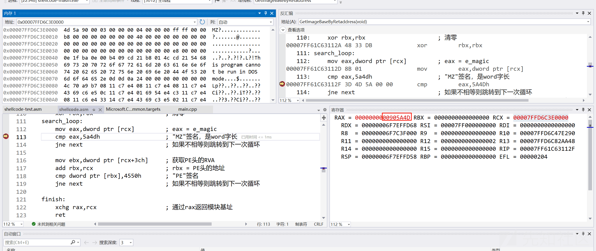

观察上图已经找到了DOS头，这时我们跳出（shift+F11），因为eax的值未正确匹配 `5a4d`， 程序理论上会进入到下一个循环，直到小于我们预设的边界值 `7ff000000000h`，但是这又会遇到下一个问题，程序直接抛出 `0xC0000005` 访问冲突错误，因为进入到不可读取的内存区域，这也意味着我们预设的边界值 `7ff000000000h` 并未起到实际作用。

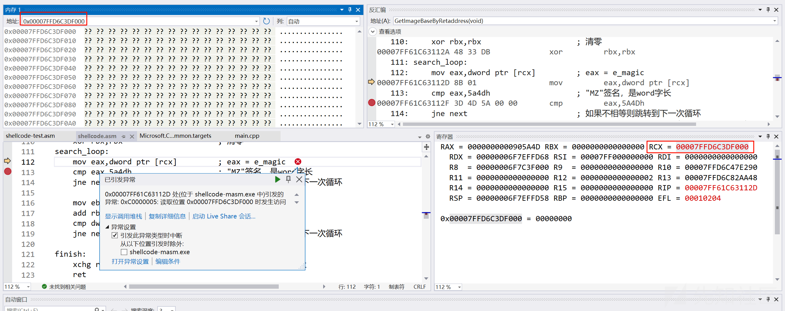

**总结**：

1. `mov eax,dword ptr [rcx]` 和 `cmp eax,5a4dh` 应该修改成 `mov ax,word ptr [rcx]` 和`cmp ax,5a4dh`
2. 预设的边界值 `7ff000000000h` 并未起到实际作用，暂时没有优化方案。

## 6.3 GetApiAddressByHash

`GetApiAddressByHash` 的整体思路与我的前面几篇文章中的 `GetProcAddressByHash` 类似，即通过hash寻找特定的API地址，但是 `GetApiAddressByHash` 至始至终或者说整个MASM汇编代码的实现都未使用到PEB，这个是此项技术的核心点。

**（1）保存参数**

保存API的四个参数寄存器的值到栈上，最后结束的时候再恢复

```
push rcx			
push rdx
push r8
push r9
```

**（2）获取导出表相关字段**

```
mov eax, dword ptr [r15+3ch]			; 读取PE头的RVA
add rax, r15							            ; PE头VA
cmp word ptr [rax+18h],20Bh			; 检查是否为PE64文件
jne fali1					                            ; 不是就结束
mov eax, dword ptr [rax+88h]			; 获取导出表的RVA
test rax, rax						                ; 检查该模块是否有导出函数
jz fali1						                            ; 没有就结束
add rax, r15							            ; 获取导出表的VA
push rax								                ; 存储导出表的地址
mov ecx, dword ptr [rax+18h]			; 按名称导出的函数数量
mov r9d, dword ptr [rax+20h]			; 函数名称字符串地址数组的RVA
add r9, r15								            ; 函数名称字符串地址数组的VA
```

大体上与 `GetProcAddressByHash` 类似，不同点在于

1. `GetApiAddressByHash` 以r15存储模块基址，`GetProcAddressByHash` 以rdx存储模块基址
2. `GetApiAddressByHash` 的r15存储的就是目标模块所以不用实现模块遍历的相关代码，而 `GetProcAddressByHash` 需要通过遍历才能找到目标模块

**（3）获取函数名**

```
get_next_func:	
    test rcx, rcx							          ; 检查按名称导出的函数数量是否为0
    jz fali2							                      ; 没有就结束
    dec rcx									          ; 函数计数器递减（从后向前遍历函数名数组）
    mov esi, dword ptr [r9+rcx*4]		  ; 从末尾往前遍历，一个函数名RVA占4字节
    add rsi, r15							              ; 函数名RVA
    xor r8, r8								              ; 存储接下来的函数名哈希
```

大体上与 `GetProcAddressByHash` 类似

**（4）计算函数hash**

```
loop_funcname: 
    xor rax, rax						    	; 清零EAX，准备处理字符
    lodsb										; 从rsi加载一个字节到al，rsi自增1
    ror r8d,0dh								; 对当前哈希值（r8d）循环右移13位
    add r8d,eax							; 将当前字符的ASCII值（al）累加到哈希值（r8d）
    cmp al, ah								; 检查当前字符是否为0（字符串结束符）
    jne loop_funcname				; 若字符非0，继续循环处理下一个字符
    cmp r8d,r10d							; r10存储目标hash
    jnz get_next_func
```

因为r15存储的就是目标模块的基址，我们并不需要计算模块 hash + 函数 hash之和，而只需要实现函数名hash的计算即可找到目标函数。

**（5）获取目标函数指针**

```
pop rax												; 获取之前存放的当前模块的导出表地址
mov r9d, dword ptr [rax+24h]			; 获取序号表（AddressOfNameOrdinals）的 RVA
add r9, r15											; 序号表起始地址
mov cx, [r9+2*rcx]								; 从序号表中获取目标函数的导出索引
mov r9d, dword ptr [rax+1ch]			; 获取函数地址表（AddressOfFunctions）的 RVA
add r9, r15											; AddressOfFunctions数组的首地址
mov eax, dword ptr [r9+4*rcx]			; 获取目标函数指针的RVA
add rax, r15										; 获取目标函数指针的地址
```

大体上与 `GetProcAddressByHash` 类似。

**（6）恢复参数和栈空间,并预留32字节的影子空间**

```
finish:
pop r9
pop r8
pop rdx
pop rcx
pop r10
sub rsp, 20h
push r10
jmp rax
```

大体上与 `GetProcAddressByHash` 类似。

## 6.4 main

其实main函数与之前文章写的步骤类似，其中最主要的修改有

①首先调用 `GetRetaddressFromStack`：获取栈上的两个返回值，分别存储在r12、r13这两个非易失性寄存器中。我们来看看如何使用

```
; 2.获取栈上的返回地址
call GetRetaddressFromStack
test rax,rax
jz Exit
```

②再调用 `GetImageBaseByRetaddress`：根据一个返回地址作为输入参数，这个输入参数要按0x1000对齐，并保存到保存在rcx中。找到模块的基址，通过rax返回。在代码示例中，我调用了两次 `GetImageBaseByRetaddress`，并将其返回值（模块基址）覆盖掉之前的r12和r13，其中r12=kernel32模块基址，r13=ntdll模块基址。如果不需要ntdll模块基址，可以将相关的指令给删除掉，进一步减小shellcode体积

我们来看看如何使用

```
; 3.根据返回地址推到出模块基址，这里是获取kernel32模块的基址，其基址存放在r12中
and r12, 0FFFFFFFFFFFF1000h
xchg rcx, r12
call GetImageBaseByRetaddress
test rax,rax
jz Exit
mov r12,rax              ; r12 = kernel32模块基址

; 4.这里是获取ntdll模块的基址，其基址存放在r13中
and r13, 0FFFFFFFFFFFF1000h
xchg rcx, r13
call GetImageBaseByRetaddress
test rax,rax
jz Exit
mov r13,rax             ; r13 = ntdll模块基址
```

③ `GetApiAddressByHash` 传承于 `GetProcAddressByHash`，因为前者的整体设计思路沿用后者了，即通过API名 hash之和寻找目的API地址，最后调用这个API，但是在不少地方做出了修改。

在最初的构想中，我是想调用 `GetApiAddressByHash` 后通过 `rax` 返回目标API的地址，然后再main函数中调用它，但是在实现的过程中遇到了一个难题：如果在main函数中通过 `jmp rax` 来调用目标API后，如何返回main中执行后续代码。为了解决这个难题，我实现了这样的一个结构

```
    参数
    sub rsp,20h
    jmp callfunc
continue:
    jmp rax
callfunc:
    call continue
    add rsp,20h
```

这种指令的构造确实解决了我上述提到的问题，但是在实际的应用中，我们需要通过多个API的组合使用才能达到最终目的，如网络通信，每个API的调用都需要按照所给结构运行，则势必会增加shellcode的体积。

最终我优化了shellcode，将调用API的逻辑放到了 `GetApiAddressByHash` 中，模块基址存入非易失性寄存器r15中作为输入参数，最终版的 `GetApiAddressByHash` 其基本的使用模板如下

```
    参数
    mov r15,模块基址
    mov r10,模块名+API名 hash之和
    call GetApiAddressByHash
    add rsp,20h
```

我们来看如何使用

```
; 5.调用LoadLibraryA,加载user32.dll	
push 0					                                ; 为了对齐 
mov r14,0000323372657375h			; "user32\0",或者使用下面的指令
                                                            ;  或者mov r14, '23resu'
push r14							                    ; 字符串压栈，此时rsp指向"user32\0"字符串
mov rcx,rsp							            ; RCX=字符串指针
mov r15,r12							                ; r15 = kernel32模块基址
mov r10,74776072h					        ; LoadLibraryA hash
call GetApiAddressByHash
add rsp,32
test rax,rax
jz Exit

; 6.调用MessageBoxA函数
push 0								                    ; 为了对齐 
mov rbx,0021796164656e6fh			; "oneday!\0"
push rbx							                    ; 字符串压栈，此时rsp指向"oneday!\0"字符串
mov rcx,0							                ; RCX=0（hWnd)
mov rdx,rsp							            ; RDX=0（lpText）
mov r8,0							                    ; R8=0（lpCaption）
mov r9,0							                    ; R9=0（uType）
mov r15,rax							                ; r15 = user32模块基址
mov r10,1545E26Dh                           ; MessageBoxA hash
call GetApiAddressByHash
test rax,rax
jz Exit
```

记得在调用完 `GetApiAddressByHash` 后使用 `add rsp,32` 来清零影子空间，当然不清理也可以。

至此所有过程都用MASM汇编实现，并形成了一个通用的模板，整体代码量与遍历PEB方法相似，当然还有很多可以优化的地方，但是写到这里真是写不动了，优化方案就留给各位师傅了。

## 6.5 完整代码

LoadLibraryA hash = 74776072h   
MessageBoxA hash = 1545E26Dh  
ExitProcess hash = 0C3F39F16h

```
.code

; r12 = kernel32的模块基址
; r13 = ntdll的模块基址
main proc
    
    ; 1.清楚反向标志，并对齐rsp
    cld 
    and rsp, 0FFFFFFFFFFFFFFF0h

    ; 2.获取栈上的返回地址
    call GetRetaddressFromStack
    test rax,rax
    jz Exit

    ; 3.根据返回地址推到出模块基址，这里是获取kernel32模块的基址，其基址存放在r12中
    and r12, 0FFFFFFFFFFFF1000h
    xchg rcx, r12
    call GetImageBaseByRetaddress
    test rax,rax
    jz Exit
    mov r12,rax              							; r12 = kernel32模块基址

    ; 4.这里是获取ntdll模块的基址，其基址存放在r13中
    and r13, 0FFFFFFFFFFFF1000h
    xchg rcx, r13
    call GetImageBaseByRetaddress
    test rax,rax
    jz Exit
    mov r13,rax   										; r13 = ntdll模块基址

    ; 5.调用LoadLibraryA,加载user32.dll	
    push 0													; 为了对齐 
    mov r14,0000323372657375h			; "user32\0",或者使用下面的指令
                                        						;  或者mov r14, '23resu'
    push r14												; 字符串压栈，此时rsp指向"user32\0"字符串
    mov rcx,rsp										; RCX=字符串指针
    mov r15,r12											; r15 = kernel32模块基址
    mov r10,74776072h							; LoadLibraryA hash
    call GetApiAddressByHash
    add rsp,32
    test rax,rax
    jz Exit

    ; 6.调用MessageBoxA函数
    push 0													; 为了对齐 
    mov rbx,0021796164656e6fh			; "oneday!\0"
    push rbx												; 字符串压栈，此时rsp指向"oneday!\0"字符串
    mov rcx,0											; RCX=0（hWnd)
    mov rdx,rsp										; RDX=0（lpText）
    mov r8,0												; R8=0（lpCaption）
    mov r9,0												; R9=0（uType）
    mov r15,rax											; r15 = user32模块基址
    mov r10,1545E26Dh                  			; MessageBoxA hash
    call GetApiAddressByHash
    test rax,rax
    jz Exit

Exit:
    mov r15,r12											; r15 = kernel32模块基址
    mov r10,0C3F39F16h			        	; ExitProcess hash
    call GetApiAddressByHash
main endp

; 函数的返回值存储在r12、r13中
; r12 = ulKernel32BaseThreadInitThunk
; r13 = ulNtdllRtlUserThreadStart
GetRetaddressFromStack proc
    
    xor rdx,rdx				  							; 清零
    mov rdx,gs:[rdx+8h]       					; rdx = stackbase
    sub rdx,8                 							; 确保stackbase以8结尾
    test rdx,rdx              							; 如果栈基址为空则结束
    jz fail                   
    xor rcx,rcx				 						 	; rcx从当计数器

search_loop:
    mov rax,qword ptr [rdx]   					; 获取栈上的值
    test rax,rax              							; 如果值为0，则跳转到下一次循环
    jz next                   

    mov rbx,7ff000000000h     				; 注意点
    cmp rax,rbx               							; rax与7ff000000000h比较
    jb next                   								; 当rax<7ff000000000h时跳转到下一次循环
    
    push rax                  							; 找到符号条件的返回地址，压栈
    inc ecx                   								; 找到一次就加1
    cmp ecx,2				 				 			; 计数器
    je finish                 								; 如果找到了两个返回地址就结束循环

next:
    sub rdx, 10h              							; pStackBase -= 2;
    jmp search_loop           

finish:
    pop r12                   							; r12 = ulKernel32BaseThreadInitThunk
    pop r13					  							; r13 = ulNtdllRtlUserThreadStart
    ret                       								; 返回

fail:
    push 0                    								; 如果失败则通过rax返回0
    pop rax                   
    ret                       

GetRetaddressFromStack endp

; 输入：rcx = 返回地址
; 如果正确找模块基址，则rax = 模块基址
; 如果错误，则rax = 0，实际上直接抛出异常
GetImageBaseByRetaddress proc
    xor rax,rax					    				; 清零
    xor rbx,rbx                     					; 清零
search_loop:
    mov ax,word ptr [rcx]					; eax = e_magic
    cmp ax,5a4dh								; "MZ"签名，是word字长
    jne next                        					; 如果不相等则跳转到下一次循环

    mov ebx,dword ptr [rcx+3ch]     	; 获取PE头的RVA
    add rbx,rcx                     				; rbx = PE头的地址
    cmp dword ptr [rbx],4550h       	; "PE"签名
    jne next                        					; 如果不相等则跳转到下一次循环

finish:	
    xchg rax,rcx                    				; 通过rax返回模块基址
    ret

next:
    sub rcx, 1000h                  				; 按0x1000步长遍历

    ;地址有效性检查
    mov rsi, 7ff000000000h				; 实际没啥用，会发生异常
    cmp rcx,rsi
    jae search_loop

fail:
    push 0
    pop rax
    ret

GetImageBaseByRetaddress endp

; 成功则rax = 目标api地址
GetApiAddressByHash proc

    ; 1.保存参数到栈上
    push rcx			
    push rdx
    push r8
    push r9

    ; 2. 获取导出表相关字段
    mov eax, dword ptr [r15+3ch]			; 读取PE头的RVA
    add rax, r15										; PE头VA
    cmp word ptr [rax+18h],20Bh			; 检查是否为PE64文件
    jne fali1					            					; 不是就结束
    mov eax, dword ptr [rax+88h]			; 获取导出表的RVA
    test rax, rax						    			; 检查该模块是否有导出函数
    jz fali1						            				; 没有就结束
    add rax, r15										; 获取导出表的VA
    push rax												; 存储导出表的地址
    mov ecx, dword ptr [rax+18h]			; 按名称导出的函数数量
    mov r9d, dword ptr [rax+20h]			; 函数名称字符串地址数组的RVA
    add r9, r15											; 函数名称字符串地址数组的VA

    ; 3.获取函数名	
get_next_func:	
    test rcx, rcx										; 检查按名称导出的函数数量是否为0
    jz fali2							        				; 没有就结束
    dec rcx												; 函数计数器递减（从后向前遍历函数名数组）
    mov esi, dword ptr [r9+rcx*4]			; 从末尾往前遍历，一个函数名RVA占4字节
    add rsi, r15											; 函数名RVA
    xor r8, r8												; 存储接下来的函数名哈希

    ; 4.计算函数hash
loop_funcname: 
    xor rax, rax						    				; 清零EAX，准备处理字符
    lodsb													; 从rsi加载一个字节到al，rsi自增1
    ror r8d,0dh											; 对当前哈希值（r8d）循环右移13位
    add r8d,eax										; 将当前字符的ASCII值（al）累加到哈希值（r8d）
    cmp al, ah											; 检查当前字符是否为0（字符串结束符）
    jne loop_funcname							; 若字符非0，继续循环处理下一个字符
    cmp r8d,r10d										; r10存储目标hash
    jnz get_next_func

    ; 5.获取目标函数指针
    pop rax												; 获取之前存放的当前模块的导出表地址
    mov r9d, dword ptr [rax+24h]			; 获取序号表（AddressOfNameOrdinals）的 RVA
    add r9, r15											; 序号表起始地址
    mov cx, [r9+2*rcx]								; 从序号表中获取目标函数的导出索引
    mov r9d, dword ptr [rax+1ch]			; 获取函数地址表（AddressOfFunctions）的 RVA
    add r9, r15											; AddressOfFunctions数组的首地址
    mov eax, dword ptr [r9+4*rcx]			; 获取目标函数指针的RVA
    add rax, r15										; 获取目标函数指针的地址

    ; 6. 恢复参数和栈空间,并预留32字节的影子空间
finish:
    pop r9
    pop r8
    pop rdx
    pop rcx
    pop r10
    sub rsp, 20h
    push r10
    jmp rax

fali1:
    sub rsp,32
    push 0
    pop rax
    ret
fali2:	
    sub rsp,40
    push 0
    pop rax
    ret

GetApiAddressByHash endp

end
```

## 6.6 探究win7上失效的原因

为了查明win7出错的原因，我需要用windbg去动态调式汇编代码编译后的exe程序。

windbg for win7 : [WinDbg 下载(Win7/Win10)\_windbg下载-CSDN博客](https://blog.csdn.net/TyroneKing/article/details/135146120)

设置symbol Search Path：`srv*D:\Symbols*http://msdl.blackint3.com:88/download/symbols`

在windbg的命令行输入一个下断点的命令：`bp ntdll!RtlUserThreadStart`，接着按F5运行，程序会停在 `ntdll!RtlUserThreadStart` 的入口点

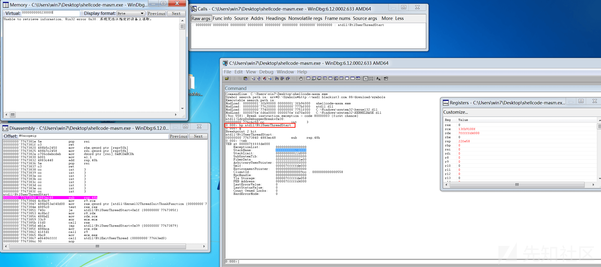

调用链为：`ntdll!RtlUserThreadStart` -> `kernel32!BaseThreadInitThunk` -> `用户自定义入口点`，为了分析出错点，我们需要去看自己编写的汇编代码哪里出错了，所以接着就是来到用户自定义入口点处，一直按step into（F8）即可。

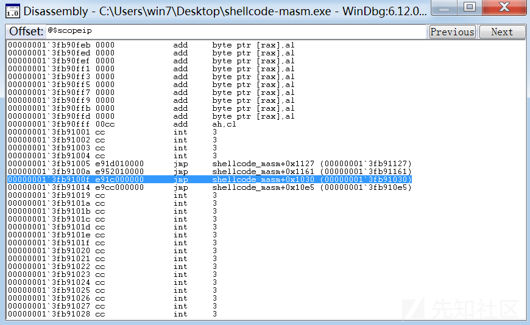

经过我的分析，其实出错点在 `GetRetaddressFromStack` 中获取两个返回地址的相关代码上。我们在 `test rax,rax` 下一个断点（F9），然后不断的按F5，并观察rax寄存器的值，不用按很多次，就找到了第一个返回地址 `7767385d`。

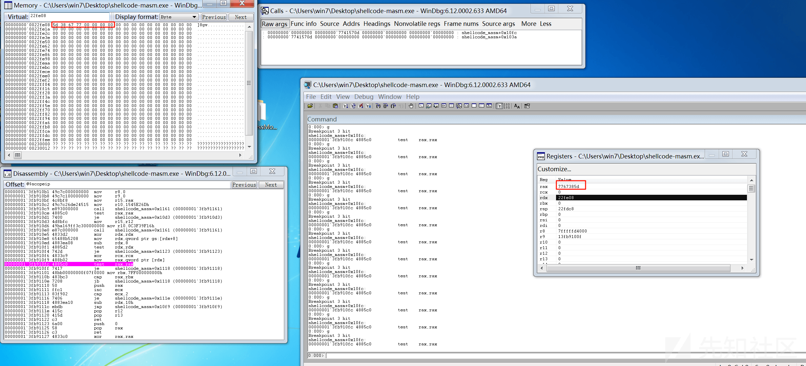

返回地址 `7767385d` 指向 `ntdll!RtlUserThreadStart` 的某条指令。

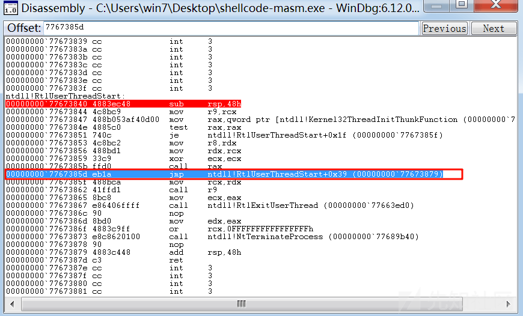

其实看到这个值的时候，我就明白出错点在哪里了，在前面我说过如果一个值大于 `7ff000000000h` 大概率可以认为是返回地址。但是我我们的 `7767385d` 绝对是小于 `7ff000000000h` 。

继续调试，找到了一个值为 `ffff00001f80`

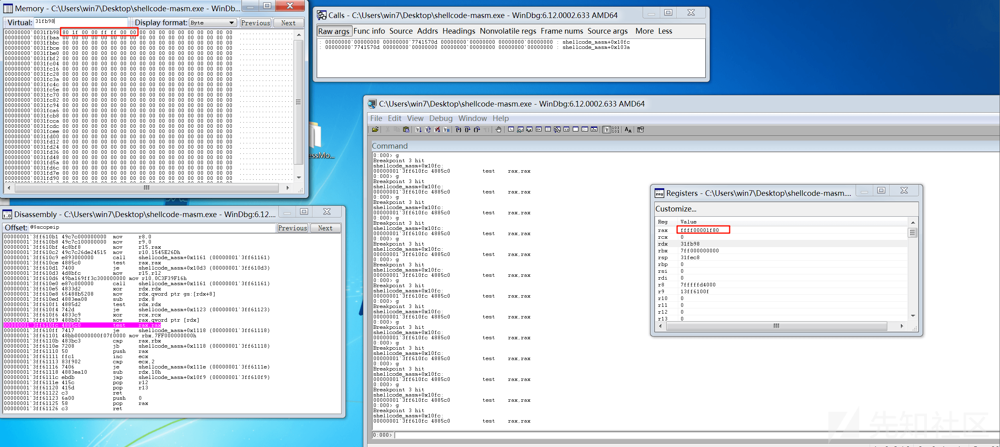

这个值 `ffff00001f80` 大于 `7ff000000000h`，且它并不是一个返回地址

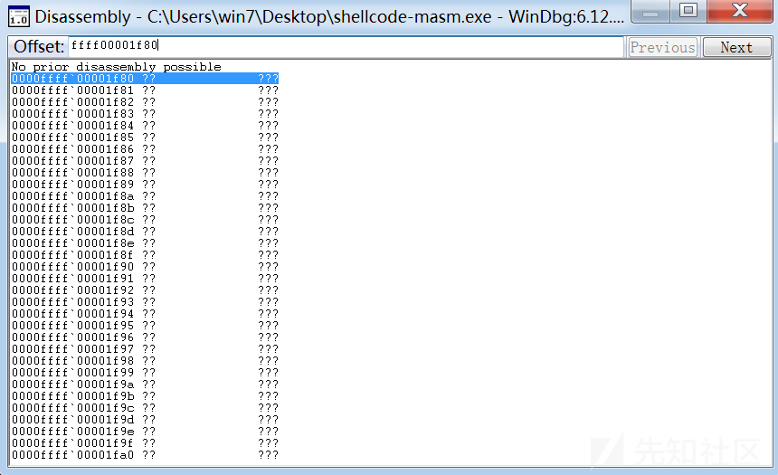

如果使用了错误的值作为返回地址，则后面的 `GetImageBaseByRetaddress` 和 `GetApiAddressByHash` 必定出错！

具体怎么优化 `GetRetaddressFromStack` 我就不写了，有能力的读者可以自己优化我给的代码，我真的写不动了<(＠´＿｀＠)>！

## 6.7 测试

首先是exe形式

win11

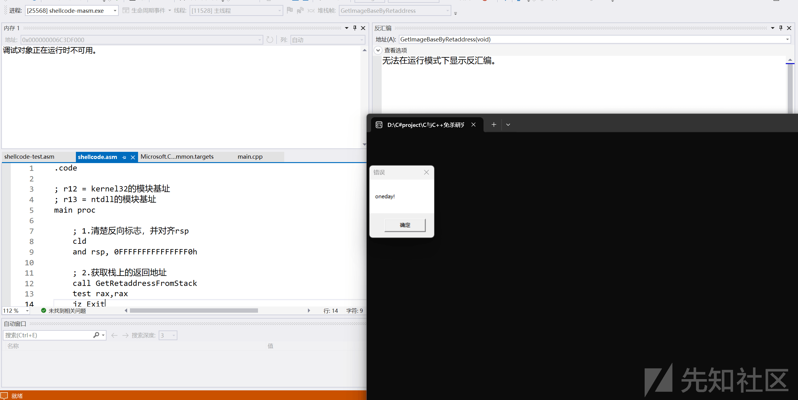

win10

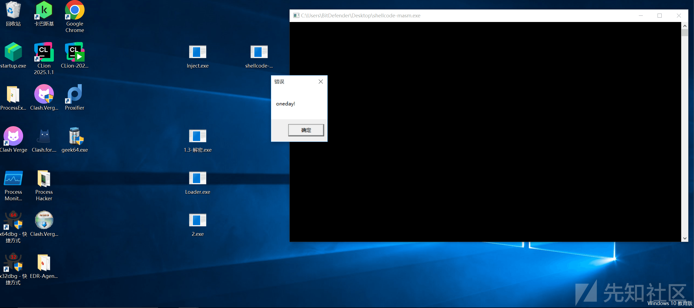

windows server 2016

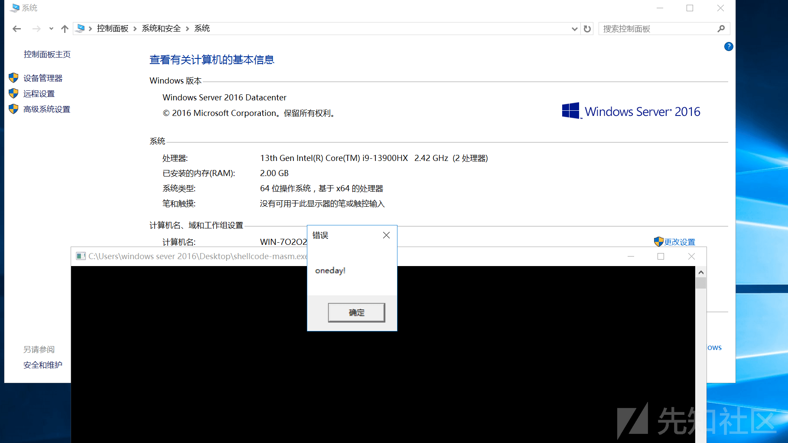

windows server 2012

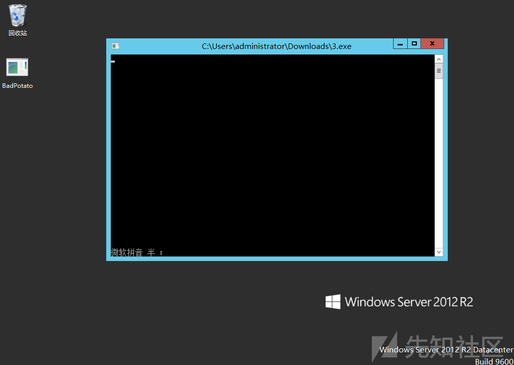

然后是shellcode形式

win11

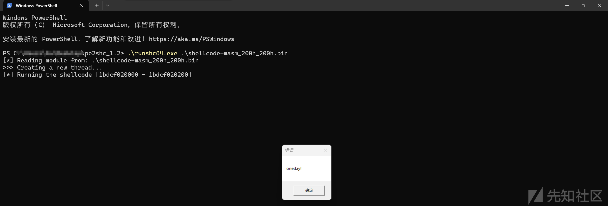

win10

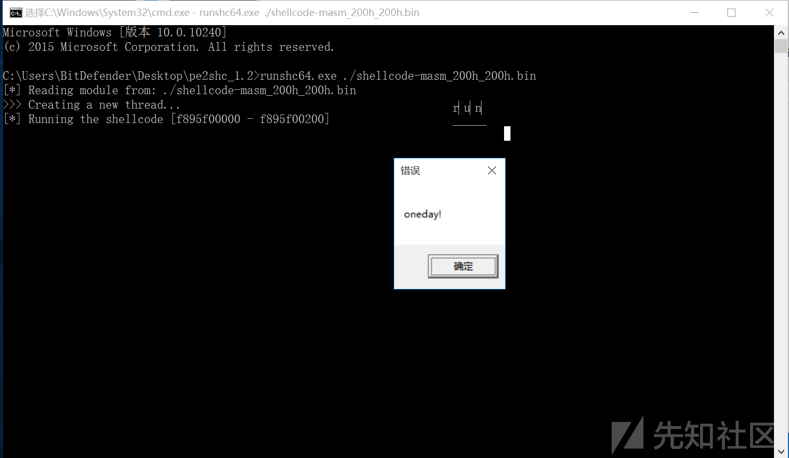

其他版本就留给各位师傅去测了。至此一篇完整详尽的《非PEB获取ntdll和kernel32模块基址的精妙之道》文章就呈现给各位师傅了，不知道各位师傅是否满意呢？

# 七、尾语

行笔至此，激动与亢奋的心情久久未能散去，技术的探索总是伴随着挑战与惊喜，代码的世界没有尽头，而探索的乐趣永不止息。这就是一篇好文章[^1]([答应我，别在shellcode中通过遍历PEB获取模块基址了好么？](https://mp.weixin.qq.com/s/O4LCnC_DjzfvnLvgXm1bFQ))的魅力所在，总是能引发无限的思考，这种技术完美诠释了"一切皆可逆向"的哲理，或许下一个技术的引领者就是各位师傅呢？

当然本文章并未完全探索完该技术的精髓，比如说x86是不是也有相同的规律可循，想研究的师傅可以先行一步，或者待我再详细研究一番再呈现给各位师傅了。

最后的最后，请关注大佬的公众号“安全的矛与盾”，给予大佬继续探索新技术的支持。当然如果可以的话也请给予我一定的支持和鼓励，点赞、收藏和关注是对我文章最大的肯定>,<。

# 参考资料

[1]: <https://mp.weixin.qq.com/s/O4LCnC_DjzfvnLvgXm1bFQ>

[2]: [x64 调用约定 | Microsoft Learn](https://learn.microsoft.com/zh-cn/cpp/build/x64-calling-convention?view=msvc-170)  
[3]: [自举的代码幽灵——反射DLL注入（Reflective DLL Injection）-先知社区](https://xz.aliyun.com/news/17089)
