# 2025安徽大学生网络与分布式决赛wp-先知社区

> **来源**: https://xz.aliyun.com/news/18024  
> **文章ID**: 18024

---

## misc

### 蚁剑流量

tcp流10

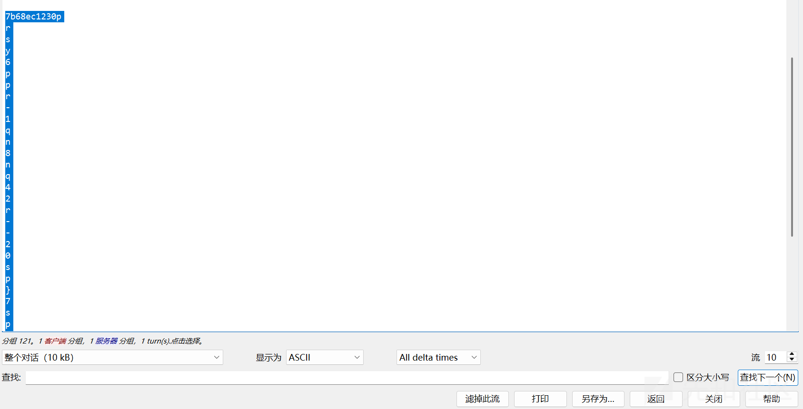

rot13解码

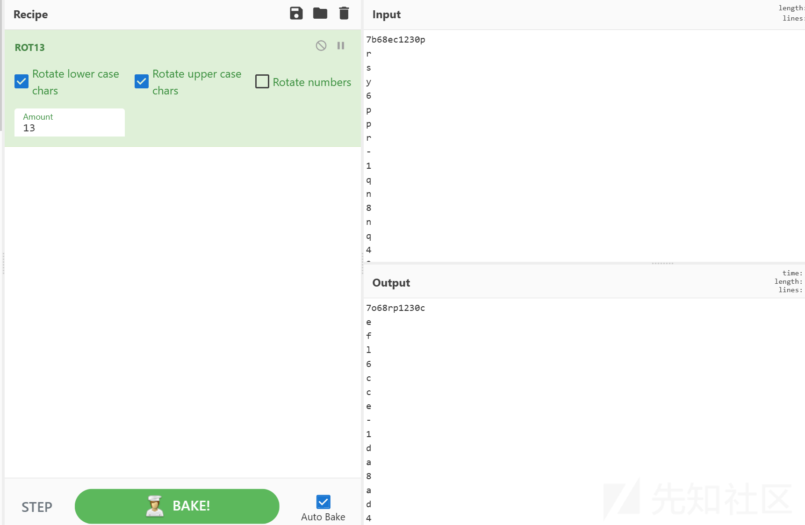

tcp流12

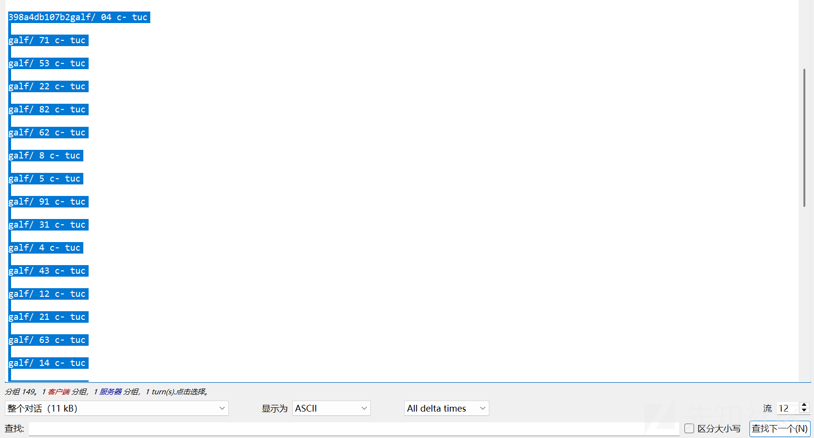

reverse解码

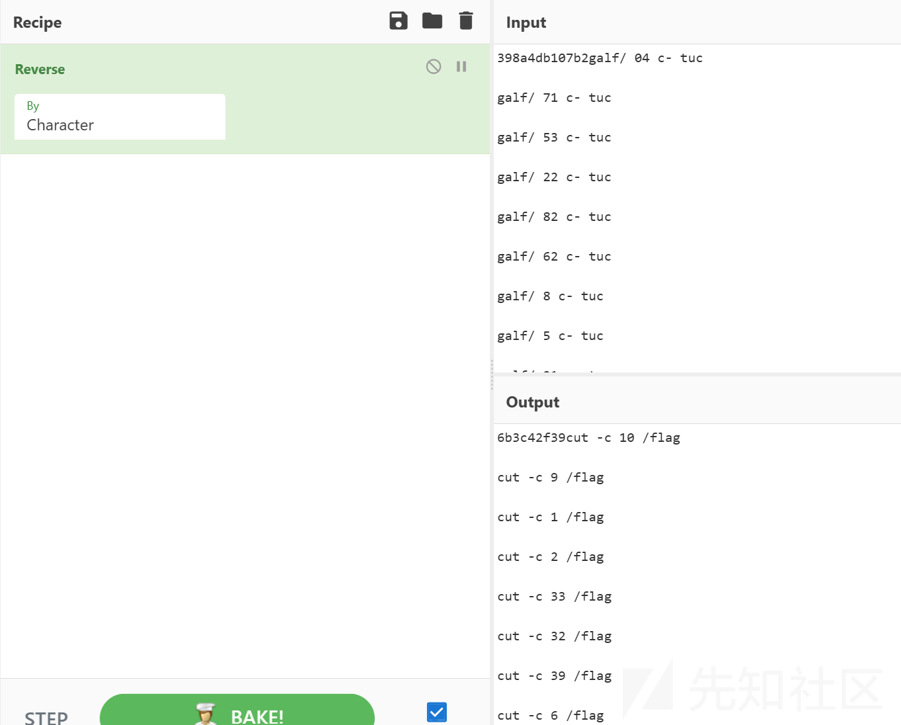

从这里可以看出cut了一下flag

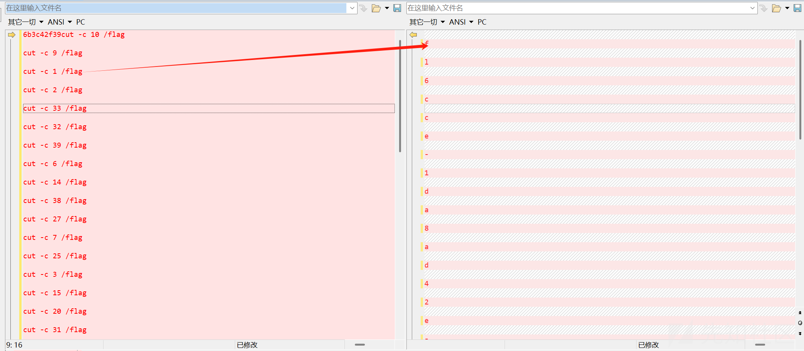

对照

flag：flag{eaeecf2b-d26e-41b0-85d7-c2c69ec71c6f}

### makamaka

文件头没有

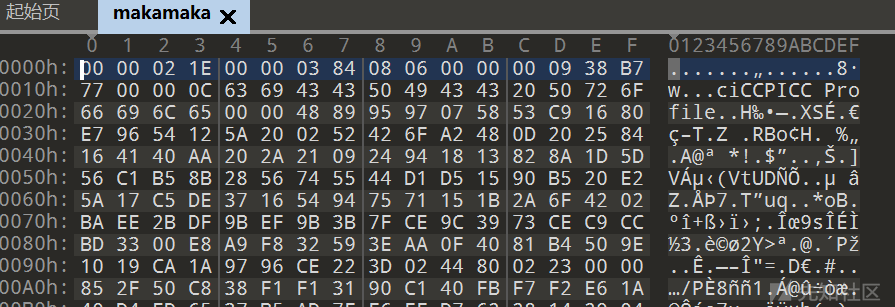

文件尾是png图片而不全

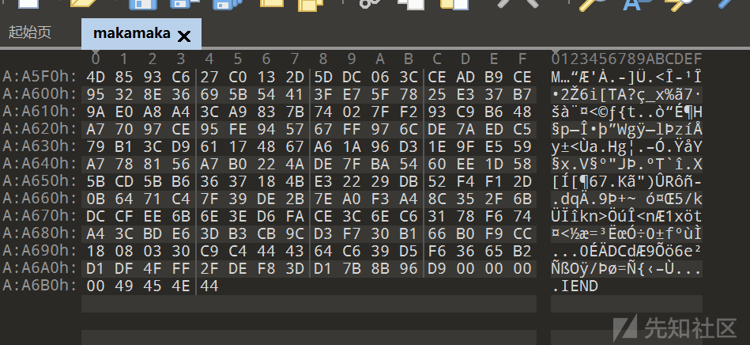

添加文件头89504E470D0A1A0A0000000D49484452

添加文件尾AE426082

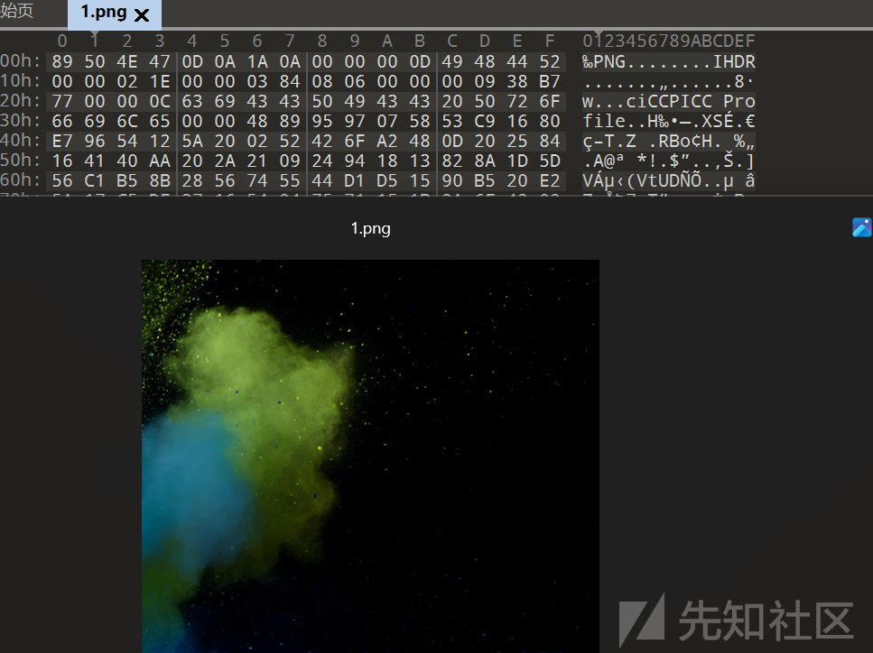

改一下高度


flag{dd1cf811-5582-4e6c-83b5-520d929751ac}

### baaldiangonal+chappe3

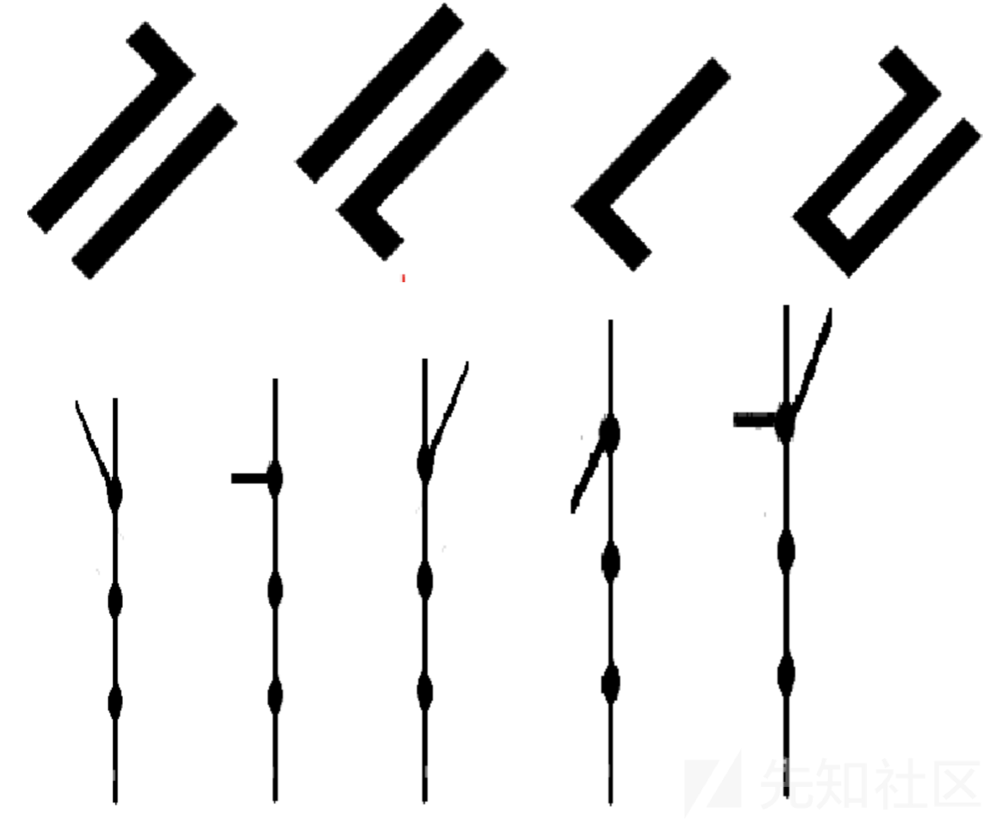

直接凭借工具，搜索图片文件得到flag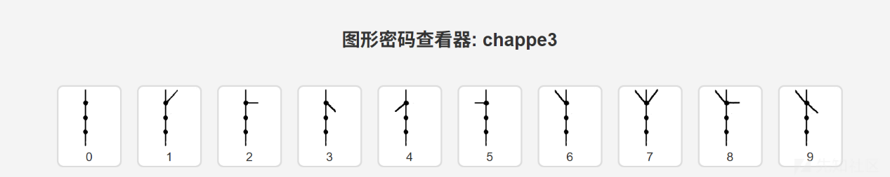

得到12138

上面得那一串直接盲猜是FLAG或者flag

试了两下得到

flag{FLAG12138}

## CRYPTO

### rsa-c

[共模攻击](https://so.csdn.net/so/search?q=%E5%85%B1%E6%A8%A1%E6%94%BB%E5%87%BB&spm=1001.2101.3001.7020)

[脚本](https://so.csdn.net/so/search?q=%E7%9B%B4%E6%8E%A5%E8%84%9A%E6%9C%AC&spm=1001.2101.3001.7020)

```
import libnum
import gmpy2
 
import random
random.seed(123456)
 
e1 = random.randint(100000000, 999999999)
print(e1)
e2 = 65537
n = 7265521127830448713067411832186939510560957540642195787738901620268897564963900603849624938868472135068795683478994264434459545615489055678687748127470957
c1=3315026215410356401822612597933850774333471554653501609476726308255829187036771889305156951657972976515685121382853979526632479380900600042319433533497363
c2=1188105647021006315444157379624581671965264301631019818847700108837497109352704297426176854648450245702004723738154094931880004264638539450721642553435120
# s1=gmpy2.invert(e1,e2)
# s2=gmpy2.invert(e2,e1)
#使用拓展的欧几里得算法计算出s1，s2的数值
r, s1, s2 = gmpy2.gcdext(e1, e2)
#根据推导计算出明文m
m = (pow(c1, s1, n) * pow(c2, s2, n)) % n
#计算16进制flag
#rint(hex(m))
#转换为字符串的flag
print(libnum.n2s(int(m)))
```

flag{359a1693-7bce-4fbc-87fa-111cdffaa0e8}

### related

RSA 相关攻击和 sagemath 的使用

exp:

```
N = 51296885372346449295388453471330409021784141081351581975478435681552082076338697136130122011636685327781785488670769096434920591920054441921039812310126089859349902066456998315283909435249794317277620588552441456327265553018986591779396701680997794937951231970194353001576159809798153970829987274504038146741
a = 13256631249970000274738888132534852767685499642889351632072622194777502848070957827974250425805779856662241409663031192870528911932663995606616763982320967
b = 12614470377409090738391280373352373943201882741276992121990944593827605866548572392808272414120477304486154096358852845785437999246453926812759725932442170
c1 = 18617698095122597355752178584860764221736156139844401400942959000560180868595058572264330257490645079792321778926462300410653970722619332098601515399526245808718518153518824404167374361098424325296872587362792839831578589407441739040578339310283844080111189381106274103089079702496168766831316853664552253142
c2 = 14091361528414093900688440242152327115109256507133728799758289918462970724109343410464537203689727409590796472177295835710571700501895484300979622506298961999001641059179449655629481072402234965831697915939034769804437452528921599125823412464950939837343822566667533463393026895985173157447434429906021792720

# 定义多项式环
R.<m1, m2> = Zmod(N)[]

# 定义理想
I = ideal(a*m1 + b - m2, m1^17 - c1, m2^17 - c2)

# 计算 Gröbner 基
res = I.groebner_basis()

# 提取消息
m = N - Integer(res[0] - m1)
print(bytes.fromhex(hex(m).strip("0xL")))
```

## web

### youcandorce

首先拿到题目进行审计，判断存在漏洞

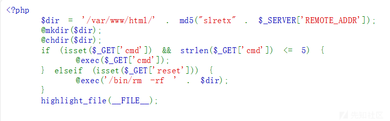

编写python脚本，将需要执行的命令截断与发送。使用命令执行的方式将命令以文件名方式写入靶机，再通过遍历目录将命令写入一个文件，最后通过发送 http 请求给自己的主机获取并执行命令。

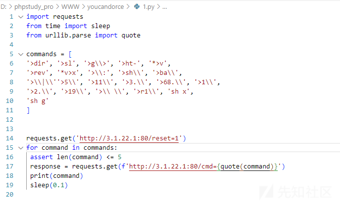

执行上面的脚本并使用 python 创建一个 web 服务器，用于接收靶机请求并返回重命名

flag.php 的命令

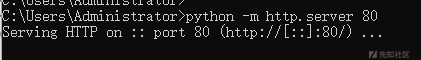

在浏览器中访问

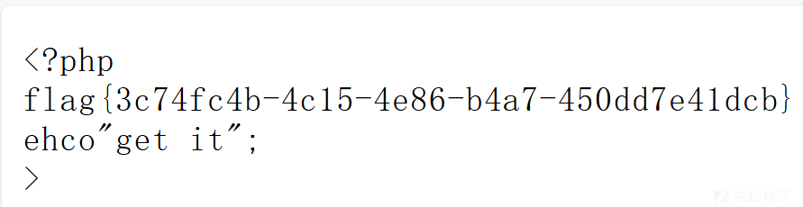

## re

### SRC\_LEAK

首先给出来了一套源码

```
#include<iostream>
using namespace std;
typedef unsigned int uint;
template <bool Flag, class MaybeA, class MaybeB> class IfElse;
template <class MaybeA, class MaybeB>
class IfElse<true, MaybeA, MaybeB> {
public:
    using ResultType = MaybeA;
};
template <class MaybeA, class MaybeB>
class IfElse<false, MaybeA, MaybeB> {
public:
    using ResultType = MaybeB;
};

template <uint N, uint L, uint R> struct func1 {
    enum { mid = (L + R + 1) / 2 };

    using ResultType = typename IfElse<(N < mid * mid),
        func1<N, L, mid - 1>, func1<N, mid, R> >::ResultType;

    enum { result = ResultType::result };
};
template <uint N, uint L> struct func1<N, L, L> { enum { result = L }; };

template <uint N> struct _func1 { enum { result = func1<N, 1, N>::result }; };

template<size_t Input>
constexpr size_t func2 = (Input % 2) + func2< (Input / 2) >;
template<>
constexpr size_t func2<0> = 0;
template<size_t num>
constexpr size_t func3 = num % 2;
template<uint n, uint m>struct NEXTN {
    const static uint value = ((n % m != 0) * n);
};
template<uint n, uint m>struct NEXTM {
    const static uint value = (m * m <= n ? (m + 1) : 0);
};
template<uint n, uint m>struct TEST {
    const static uint value = TEST<NEXTN<n, m>::value, NEXTM<n, m>::value>::value;
};
template<uint m>struct TEST<0, m> {
    const static uint value = 0;
};
template<uint n>struct TEST<n, 0> {
    const static uint value = 1;
};
template<uint n>struct func4 {
    const static uint value = TEST<n, 2>::value;
};
template<>struct func4<1> {
    const static uint value = 0;
};
template<>struct func4<2> {
    const static uint value = 1;
};

int main(int argc, char**argv) {
    //input 5 uint numbers ,x1,x2,x3,x4,x5
    //the sum of them should be MIN
    cout << func3< func2<x1> > << endl;
    cout << func3< func2<x2> > << endl;
    cout << func3< func2<x3> > << endl;
    cout << func3< func2<x4> > << endl;
    cout << func3< func2<x5> > << endl;
    // output: 1 1 1 1 1
    cout << _func1<x1>::result << endl;
    cout << _func1<x2>::result << endl;
    cout << _func1<x3>::result << endl;
    cout << _func1<x4>::result << endl;
    cout << _func1<x5>::result << endl;
    //output: 963 4396 6666 1999 3141
    //how many "1" will func4<1>,func4<2>,fun4<3>......fun4<10000> ::value  return?
    x6 = count;
    // your flag is flag{x1-x2-x3-x4-x5-x6}
    // if x1=1,x2=2,x3=3,x4=4,x5=5,x6=6
    // flag is     flag{1-2-3-4-5-6}
    return 0;
}
```

要求比较明确：读懂源码按条件计算得到x1-x6并以-连接即为flag。

笨一点的方法就是改写一下源码写出python脚本爆破出x1-x5，再计算出x6：

X5爆破

```
def func2(x):
    if x == 0:
        return 0
    return (x % 2) + func2(x // 2)

def func3(x):
    return x % 2

def func1(N, L, R):
    if L == R:
        return L
    mid = (L + R + 1) // 2
    if N < mid * mid:
        return func1(N, L, mid - 1)
    else:
        return func1(N, mid, R)

def _func1(x):
    return func1(x, 1, x)


if __name__ == '__main__':
    x1_flag = False
    x2_flag = False
    x3_flag = False
    x4_flag = False
    x5_flag = False
    for i in range(10000000, 100000000):
        if func3(func2(i)) != 1:
            continue
        if _func1(i) == 963 and not x1_flag:
            print("x1:",i)
            x1_flag = True
        if _func1(i) == 4396 and not x2_flag:
            print("x2:",i)
            x2_flag = True
        if _func1(i) == 6666 and not x3_flag:
            print("x3:",i)
            x3_flag = True
        if _func1(i) == 1999 and not x4_flag:
            print("x4:",i)
            x4_flag = True
        if _func1(i) == 3141 and not x5_flag:
            print("x5:",i)
            x5_flag = True
def nextm(n, m):
    if m*m <= n:
        return m+1
    else:
        return 0

def nextn(n, m):
    return (n % m != 0) * n

def test(n, m):
    if n == 0:
        return 0
    if m == 0:
        return 1
    return test(nextn(n, m), nextm(n, m))

def func4(x):
    if x == 1:
        return 0
    if x == 2:
        return 1
    return test(x, 2)


if __name__ == '__main__':
    x6 = 0
    for i in range(1, 5):
        if func4(i*2-1) == 1:
            x6 += 1
    print(x6)
```

运行之后flag是flag{927369-19324816-44435556-3996001-9865881-1229}

### both

这题主要就是多线程执行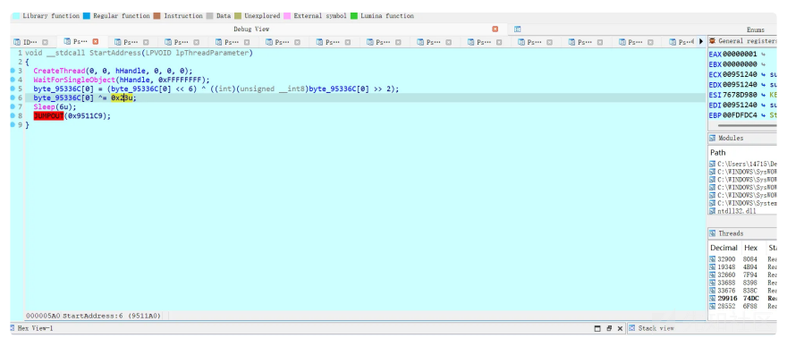

去除花指令之后就是一个xor

然后根据动态调试去看他的算法加了多少

这里有一个isdbgps

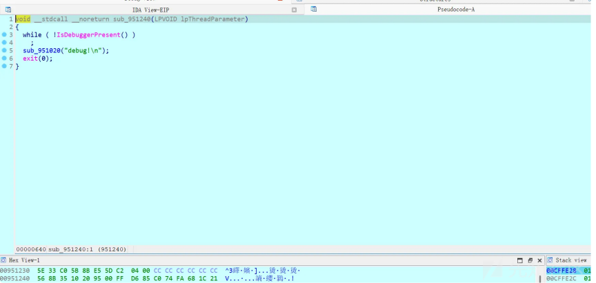

```
from string import printable
def bp(num):
   num = ((num<<6) ^(num>>2))&0xff
   num ^= 0x23
   num = (num+100)&0xff
enc = [0xdd, 0x5b, 0x9e, 0x1d, 0x20, 0x9e, 0x90, 0x91, 0x90, 0x90, 0x91, 0
x92, 0xde, 0x8b, 0x11, 0xd1, 0x1e, 0x9e, 0x8b, 0x51, 0x11, 0x50, 0x51, 0x8
b, 0x9e, 0x5d, 0x5d, 0x11, 0x8b, 0x90, 0x12, 0x91, 0x50, 0x12, 0xd2, 0x9
1, 0x92, 0x1e, 0x9e, 0x90, 0xd2, 0x9f]
flag = ""
for i in range(0, len(enc)):
   for char in printable:
   if bp(ord(char))==enc[i]:
   flag += char
   break
print(flag)
```
