# 第二届“Parloo”CTF应急响应挑战赛-re部分-先知社区

> **来源**: https://xz.aliyun.com/news/18027  
> **文章ID**: 18027

---

# 第二届“Parloo”CTF应急响应挑战赛-re部分

## PositionalXOR

> Flag 被一种基于位置的异或加密算法混淆。加密后数据保存在 encrypted.bin 中，每个字符的加密方式与其在字符串中的位置相关。你需要逆向加密逻辑，恢复原始 Flag。

下载下来，附件是bin后缀的文件，而且比较小，直接用010看看，发现大概率就是密文。

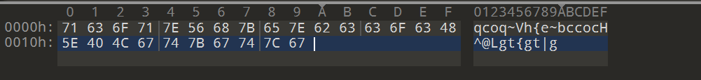

然后根据题目描述，根据palu{的flag头，先计算出第一个的key值

然后根据题目描述说加密方式和字符串位置有关系，猜测是一次加1，然后就出来了

```
enc=[0x71,0x63,0x6f,0x71,0x7e,0x56,0x68,0x7b,0x65,0x7e,0x62,0x63,0x63,0x6f,0x63,0x48,0x5e,0x40,0x4c,0x67,0x74,0x7b,0x67,0x74,0x7c,0x67]
flag=''
for i in range(len(enc)):
    flag+=chr(enc[i]^(i+1))
print(flag)
#palu{PosltionalXOR_sample}
```

## PaluArray

> 帕鲁有自己的数组，帕鲁有自己的字典，帕鲁就是帕鲁！帕鲁不要996！

64位无壳，c++写的，看着头痛。但是主函数的逻辑还是很简单的，主要就是，对对话框里面的输入存储到v18中，然后到了sub\_140001994函数里面进行了加密处理，密文和最终这个1145141919810比较。

```
struct CWnd *__fastcall sub_140001DD8(CDialog *a1)
{
  struct CWnd *result; // rax
  __int64 v3; // rdx
  __int64 v4; // r8
  struct CWnd *v5; // rdi
  _QWORD *v6; // rax
  __int64 v7; // r8
  void **v8; // rax
  int v9; // eax
  int v10; // edx
  int v11; // r8d
  int v12; // r9d
  void *v13; // rcx
  void *v14; // [rsp+20h] [rbp-E0h] BYREF
  char v15[40]; // [rsp+28h] [rbp-D8h] BYREF
  void *Block; // [rsp+50h] [rbp-B0h] BYREF
  char v17; // [rsp+58h] [rbp-A8h] BYREF
  __int64 v18; // [rsp+E0h] [rbp-20h] BYREF
  char v19[8]; // [rsp+E8h] [rbp-18h] BYREF
  void *v20[3]; // [rsp+F0h] [rbp-10h] BYREF
  unsigned __int64 v21; // [rsp+108h] [rbp+8h]

  CDialog::OnOK(a1);
  result = CWnd::GetDlgItem(a1, 1000);
  v5 = result;
  if ( result )
  {
    ATL::CStringT<wchar_t,StrTraitMFC_DLL<wchar_t,ATL::ChTraitsCRT<wchar_t>>>::CStringT<wchar_t,StrTraitMFC_DLL<wchar_t,ATL::ChTraitsCRT<wchar_t>>>(
      &v18,
      v3,
      v4);
    CWnd::GetWindowTextW(v5, &v18);
    v6 = (_QWORD *)ATL::CStringT<wchar_t,StrTraitMFC_DLL<wchar_t,ATL::ChTraitsCRT<wchar_t>>>::CStringT<wchar_t,StrTraitMFC_DLL<wchar_t,ATL::ChTraitsCRT<wchar_t>>>(
                     &v14,
                     &v18);
    sub_140001994((__int64)v19, v6, v7);
    if ( (unsigned int)ATL::CStringT<wchar_t,StrTraitMFC_DLL<wchar_t,ATL::ChTraitsCRT<wchar_t>>>::Compare(
                         v19,
                         L"1145141919810") )
    {
      CWnd::MessageBoxW(a1, L"Failed", 0i64, 0);
    }
    else
    {
      CWnd::MessageBoxW(a1, L"Success", 0i64, 0);
      v8 = (void **)sub_140001F6C(&Block, v18);
      sub_140002118(v20, *v8);
      if ( Block != &v17 )
        free(Block);
      v9 = sub_140002244(v15, v20);
      sub_140001A48(v9, v10, v11, v12, v14);
      if ( v21 > 0xF )
      {
        v13 = v20[0];
        if ( v21 + 1 >= 0x1000 )
        {
          v13 = (void *)*((_QWORD *)v20[0] - 1);
          if ( (unsigned __int64)(v20[0] - v13 - 8) > 0x1F )
            invalid_parameter_noinfo_noreturn();
        }
        operator delete(v13);
      }
    }
    ATL::CStringT<wchar_t,StrTraitMFC_DLL<wchar_t,ATL::ChTraitsCRT<wchar_t>>>::~CStringT<wchar_t,StrTraitMFC_DLL<wchar_t,ATL::ChTraitsCRT<wchar_t>>>(v19);
    return (struct CWnd *)ATL::CStringT<wchar_t,StrTraitMFC_DLL<wchar_t,ATL::ChTraitsCRT<wchar_t>>>::~CStringT<wchar_t,StrTraitMFC_DLL<wchar_t,ATL::ChTraitsCRT<wchar_t>>>(&v18);
  }
  return result;
}
```

跟进到这个sub\_140001994函数里面看看什么逻辑，主要是遍历字符串，查找在unk\_140009B48里面的位置

```
__int64 __fastcall sub_140001994(__int64 a1, _QWORD *a2, __int64 a3)
{
  unsigned int v5; // ebx
  unsigned __int16 v6; // ax
  unsigned int v7; // eax

  v5 = 0;
  ATL::CStringT<wchar_t,StrTraitMFC_DLL<wchar_t,ATL::ChTraitsCRT<wchar_t>>>::CStringT<wchar_t,StrTraitMFC_DLL<wchar_t,ATL::ChTraitsCRT<wchar_t>>>(
    a1,
    a2,
    a3);
  if ( *(int *)(*a2 - 16i64) > 0 )
  {
    do
    {
      v6 = ATL::CSimpleStringT<wchar_t,1>::operator[](a2, v5);
      v7 = ATL::CStringT<wchar_t,StrTraitMFC_DLL<wchar_t,ATL::ChTraitsCRT<wchar_t>>>::Find(&unk_140009B48, v6, 0i64);
      if ( v7 != -1 )
        ATL::CStringT<wchar_t,StrTraitMFC_DLL<wchar_t,ATL::ChTraitsCRT<wchar_t>>>::AppendFormat(a1, L"%d", v7);
      ++v5;
    }
    while ( (signed int)v5 < *(_DWORD *)(*a2 - 16i64) );
  }
  ATL::CStringT<wchar_t,StrTraitMFC_DLL<wchar_t,ATL::ChTraitsCRT<wchar_t>>>::~CStringT<wchar_t,StrTraitMFC_DLL<wchar_t,ATL::ChTraitsCRT<wchar_t>>>(a2);
  return a1;
}
```

可以交叉引用，发现在另外一个函数给这个数组赋值了这个Palu\_996!?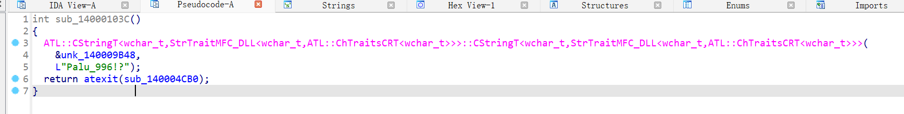

也就可以写脚本去解密了，得到flag，发现交了不对，然后发现可以提交这个，然后会输出真正的flag

```
enc="Palu_996!?"
index="1145141919810"
flag=""
index_list=list(index)
for i in range(len(index_list)):
    flag+=enc[int(index_list[i])]
print(flag)
#aa_9a_a?a?!aP
```

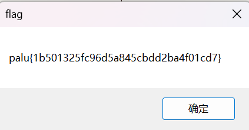

应该是这个地方的逻辑，输出一个框叫flag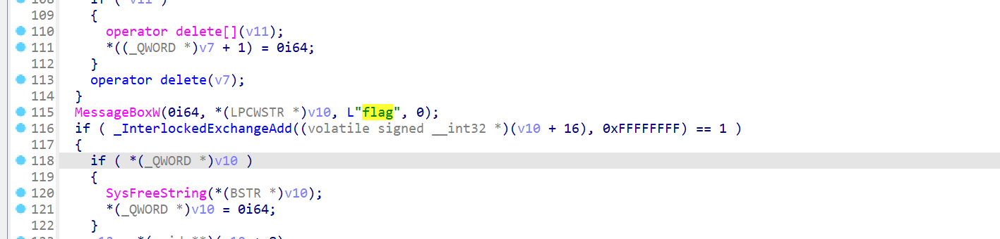

## PaluGOGOGO

> 帕鲁该走了，要去当苦命打工人了，GOGOGO！

看名字就知道是go语言写的，之前其实没怎么做过go写的，只知道看着麻烦。其实这道题看起来也还行，不算很麻烦，关键逻辑runtime\_memequal后面跟着密文明文。main\_complexEncrypt就是加密函数了，非常清楚

```
// main.checkFlag
__int64 __golang main_checkFlag(__int64 a1, __int64 a2, __int64 a3, __int64 a4, int a5)
{
  __int64 v5; // r14
  __int128 v6; // xmm15
  int v7; // r8d
  int v8; // r9d
  int v9; // r10d
  int v10; // r11d
  __int64 *v11; // rdi
  __int64 v12; // rbp
  int v13; // r8d
  int v14; // r9d
  int v15; // r10d
  int v16; // r11d
  __int64 v17; // rbp
  int v18; // r8d
  int v19; // r9d
  int v20; // r10d
  int v21; // r11d
  int String; // eax
  int v23; // ecx
  int v24; // r8d
  int v25; // r9d
  int v26; // r10d
  int v27; // r11d
  int v28; // r8d
  int v29; // r9d
  int v30; // r10d
  int v31; // r11d
  int Value; // eax
  __int64 v33; // rbx
  int v34; // r8d
  int v35; // r9d
  int v36; // r10d
  int v37; // r11d
  __int64 v38; // rax
  int v39; // r8d
  int v40; // r9d
  int v41; // r10d
  int v42; // r11d
  __int64 *v44; // [rsp+0h] [rbp-190h]
  __int64 v45; // [rsp+10h] [rbp-180h] BYREF
  __int64 v46; // [rsp+18h] [rbp-178h]
  __int64 v47; // [rsp+20h] [rbp-170h]
  __int64 v48; // [rsp+28h] [rbp-168h]
  __int64 v49; // [rsp+30h] [rbp-160h]
  __int64 v50; // [rsp+38h] [rbp-158h]
  __int64 v51[10]; // [rsp+40h] [rbp-150h] BYREF
  __int64 v52; // [rsp+90h] [rbp-100h] BYREF
  __int64 v53; // [rsp+98h] [rbp-F8h]
  _QWORD v54[2]; // [rsp+A0h] [rbp-F0h] BYREF
  _QWORD v55[2]; // [rsp+B0h] [rbp-E0h] BYREF
  _QWORD v56[2]; // [rsp+C0h] [rbp-D0h] BYREF
  __int128 v57; // [rsp+D0h] [rbp-C0h] BYREF
  __int64 v58; // [rsp+E0h] [rbp-B0h]
  RTYPE **v59; // [rsp+E8h] [rbp-A8h]
  __int64 v60; // [rsp+F0h] [rbp-A0h]
  __int64 v61; // [rsp+118h] [rbp-78h]
  __int64 v62; // [rsp+120h] [rbp-70h]
  __int128 v63[5]; // [rsp+128h] [rbp-68h] BYREF
  _QWORD v64[2]; // [rsp+180h] [rbp-10h] BYREF
  __int64 vars0; // [rsp+190h] [rbp+0h] BYREF

  while ( (unsigned __int64)&v52 <= *(_QWORD *)(v5 + 16) )
    runtime_morestack_noctxt();
  if ( (unsigned __int8)main_WhatAreYouDoing() )
  {
    v64[0] = &RTYPE_string;
    v64[1] = &off_4DAA10;
    return fmt_Fprintln(
             (unsigned int)off_4DAFE8,
             qword_55D170,
             (unsigned int)v64,
             1,
             1,
             v7,
             v8,
             v9,
             v10,
             v45,
             v46,
             v47,
             v48,
             v49);
  }
  else
  {
    v53 = qword_55D168;
    v63[0] = v6;
    v11 = &v45 + 30;
    v44 = &vars0;
    ((void (__fastcall *)(__int64 *))loc_466390)(v11);
    v12 = (__int64)v44;
    runtime_makeslice((unsigned int)&RTYPE_uint8, 4096, 4096, (_DWORD)v11, a5, v13, v14, v15, v16, v45, v46, v47);
    v57 = v6;
    v44 = (__int64 *)v12;
    *(_QWORD *)&v57 = ((__int64 (__fastcall *)(__int64 *))loc_466390)(&v45 + 19);
    *((_QWORD *)&v57 + 1) = 4096LL;
    v58 = 4096LL;
    v59 = off_4DAFC8;
    v60 = v53;
    v61 = -1LL;
    v62 = -1LL;
    *(_QWORD *)&v63[0] = v57;
    ((void (__fastcall *)(char *, char *))loc_4666FA)((char *)v63 + 8, (char *)&v57 + 8);
    v17 = (__int64)v44;
    v56[0] = &RTYPE_string;
    v56[1] = &off_4DAA20;
    fmt_Fprint(
      (unsigned int)off_4DAFE8,
      qword_55D170,
      (unsigned int)v56,
      1,
      1,
      v18,
      v19,
      v20,
      v21,
      v45,
      v46,
      v47,
      v48,
      v49);
    String = bufio__ptr_Reader_ReadString(v63, 10LL);
    v52 = strings_TrimSpace(String, 10, v23, 1, 1, v24, v25, v26, v27, v45, v46);
    v50 = 10LL;
    v44 = (__int64 *)v17;
    ((void (__fastcall *)(__int64 *))loc_466390)(&v45);
    v51[0] = 1LL;
    v51[1] = 2LL;
    v51[2] = 3LL;
    v51[3] = 4LL;
    v51[4] = 5LL;
    v51[5] = 6LL;
    v51[6] = 7LL;
    v51[7] = 8LL;
    v51[8] = 9LL;
    v51[9] = 0LL;
    Value = main_GetValue(
              (unsigned int)v51,
              10,
              10,
              (unsigned int)&v45,
              1,
              v28,
              v29,
              v30,
              v31,
              v45,
              v46,
              HIDWORD(v46),
              v47);
    v33 = v50;
    v38 = main_complexEncrypt(v52, v50, Value, (unsigned int)&v45, 1, v34, v35, v36, v37, v45, v46, v47);
    if ( v33 == 84
      && (unsigned __int8)runtime_memequal(
                            v38,
                            "0xbf,0xb1,0xbd,0xc7,0xce,0x96,0x80,0x98,0x82,0x9a,0x7f,0xaf,0xc1,0xb3,0xbf,0xc4,0xcdreflect.Value.Interface: cannot return value obtained from unexported field or methodruntime: warning: IsLongPathAwareProcess failed to enable long paths; proceeding in fixup mode
cgocheck > 1 mode is no longer supported at runtime. Use GOEXPERIMENT=cgocheck2 at build time instead.00010203040506070809101112131415161718192021222324252627282930313233343536373839404142434445464748495051525354555657585960616263646566676869707172737475767778798081828384858687888990919293949596979899",
                            84LL) )
    {
      v55[0] = &RTYPE_string;
      v55[1] = &off_4DAA30;
      return fmt_Fprintln(
               (unsigned int)off_4DAFE8,
               qword_55D170,
               (unsigned int)v55,
               1,
               1,
               v39,
               v40,
               v41,
               v42,
               v45,
               v46,
               v47,
               v48,
               v49);
    }
    else
    {
      v54[0] = &RTYPE_string;
      v54[1] = &off_4DAA40;
      return fmt_Fprintln(
               (unsigned int)off_4DAFE8,
               qword_55D170,
               (unsigned int)v54,
               1,
               1,
               v39,
               v40,
               v41,
               v42,
               v45,
               v46,
               v47,
               v48,
               v49);
    }
  }
}
```

主要加密逻辑在这里，大概就是对明文加上a3再加v11%5后的索引值，也就是我们不知道a3是多少，可以动调获取a3的值，前面有反调试，可以直接用插件绕过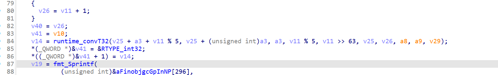

```
def decrypt(cipher_hex, a3=0x4F):
    cipher = bytes.fromhex(cipher_hex.replace(",",""))
    plain = []
    for idx, byte in enumerate(cipher):
        offset = idx % 5
        dec = (byte - a3 - offset) % 0x100  # 处理溢出
        plain.append(dec)
    return bytes(plain).decode("latin1")

cipher = "bf,b1,bd,c7,ce,96,80,98,82,9a,7f,af,c1,b3,bf,c4,cd"
print(decrypt(cipher))  
#palu{G0G0G0_palu}
```

## CatchPalu

> 主人给了帕鲁好多花花，帕鲁好开心呀！可是主人骗帕鲁，还把帕鲁抓了起来...

看这个描述就是花指令，一进去主函数都没出来，一看就是jz和jnz的经典花指令，导致后面的内容都没反编译出来，我们选中内容直接nop掉。还有几个地方，都是同样的花指令，同理都nop掉。然后重新让ida识别主函数，看伪代码

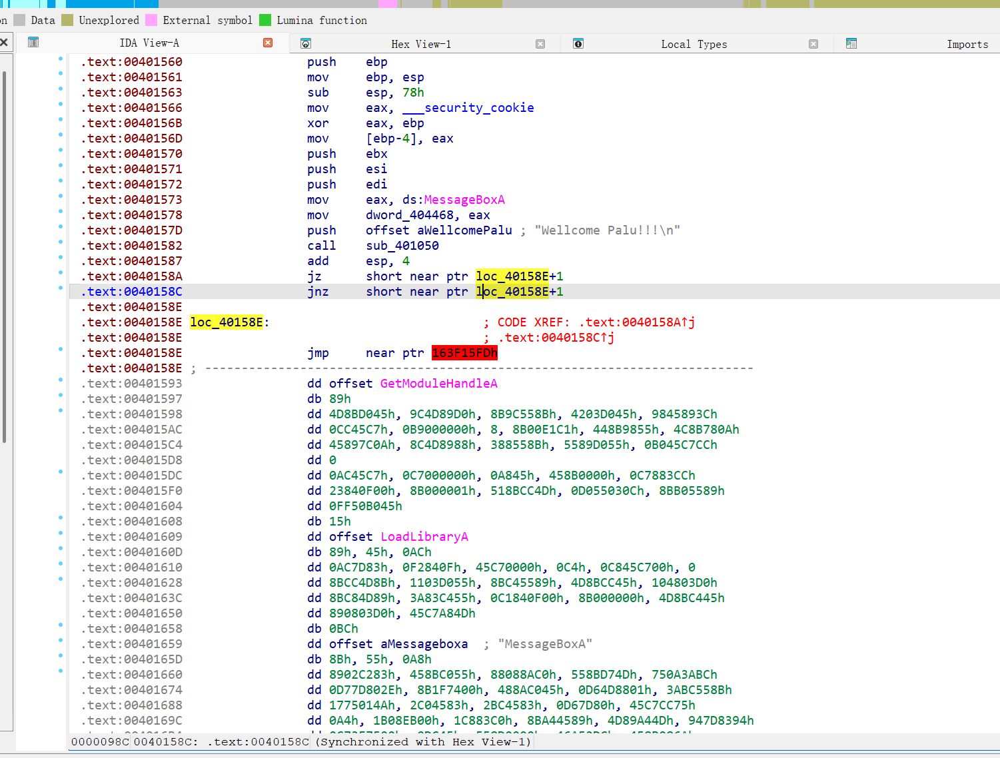

```
int __cdecl main(int argc, const char **argv, const char **envp)
{
  int v3; // ecx
  char *Format; // kr00_4
  int v5; // edx
  char v7; // [esp+0h] [ebp-84h]
  char v8; // [esp+0h] [ebp-84h]
  int _palu_P1au_D0nt_Bel1eve__; // [esp+24h] [ebp-60h]
  int _MessageBoxA_; // [esp+28h] [ebp-5Ch]
  _DWORD *v11; // [esp+48h] [ebp-3Ch]
  _DWORD *lpAddress; // [esp+4Ch] [ebp-38h]
  _DWORD *i; // [esp+50h] [ebp-34h]
  int v14; // [esp+54h] [ebp-30h]
  DWORD lpflOldProtect_; // [esp+5Ch] [ebp-28h] BYREF
  DWORD flOldProtect; // [esp+60h] [ebp-24h] BYREF
  char v17[28]; // [esp+64h] [ebp-20h] BYREF

  MessageBoxA_0 = MessageBoxA;
  sub_401050(::Format, v7);                     // "Wellcome Palu!!!
"
  *(_BYTE *)(v3 + 1301008453) += v3;
  *(_BYTE *)(v3 + 1435212877) = __ROR1__(*(_BYTE *)(v3 + 1435212877), 1);
  Format = (char *)__readeflags();
  for ( i = (_DWORD *)(v14 + *(_DWORD *)(*(_DWORD *)(v5 + 60) + v14 + 128)); i[3]; i += 5 )
  {
    if ( LoadLibraryA((LPCSTR)(v14 + i[3])) )
    {
      v11 = (_DWORD *)(*i + v14);
      lpAddress = (_DWORD *)(i[4] + v14);
      while ( *v11 )
      {
        _MessageBoxA_ = strcmp((const char *)(*v11 + v14 + 2), aMessageboxa);// "MessageBoxA"
        if ( _MessageBoxA_ )
          _MessageBoxA_ = _MessageBoxA_ < 0 ? -1 : 1;
        if ( !_MessageBoxA_ )
        {
          flOldProtect = 0;
          VirtualProtect(lpAddress, 8u, 4u, &flOldProtect);
          *lpAddress = &loc_401360;
          lpflOldProtect_ = 0;
          VirtualProtect(lpAddress, 8u, flOldProtect, &lpflOldProtect_);
        }
        ++v11;
        ++lpAddress;
      }
    }
  }
  sub_401050(Format, v8);
  sub_4010C0(a25s, (char)v17);                  // "%25s"
  sub_401050(aYouEnteredS, (char)v17);          // "You entered: %s
"
  _palu_P1au_D0nt_Bel1eve__ = strcmp(v17, aPaluP1auD0ntBe);// "palu{P1au_D0nt_Bel1eve}"
  if ( _palu_P1au_D0nt_Bel1eve__ )
    _palu_P1au_D0nt_Bel1eve__ = _palu_P1au_D0nt_Bel1eve__ < 0 ? -1 : 1;
  if ( !_palu_P1au_D0nt_Bel1eve__ )
    MessageBoxA(0, Text, Caption, 0);           // "NoSuccess?"
  return 0;
}
```

直接有明文flag，但是没有那么简单，交了不对，所以我们看到中间这个VirtualProtect函数

> `VirtualProtect` 是 Windows API 中的一个函数，用于更改调用进程虚拟地址空间中某段已分配内存页的保护属性，例如将内存从只读改为可写，或从不可访问改为可执行等 。它常用于内存操作、权限修改以及在某些情况下绕过安全机制（如 DEP）

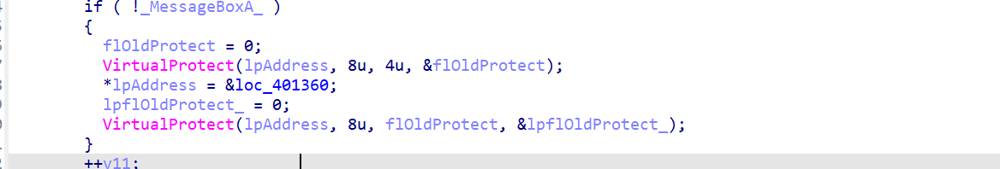

所以根据这个特性，我们可以直接看指向的loc\_401360地址，发现也是同理去花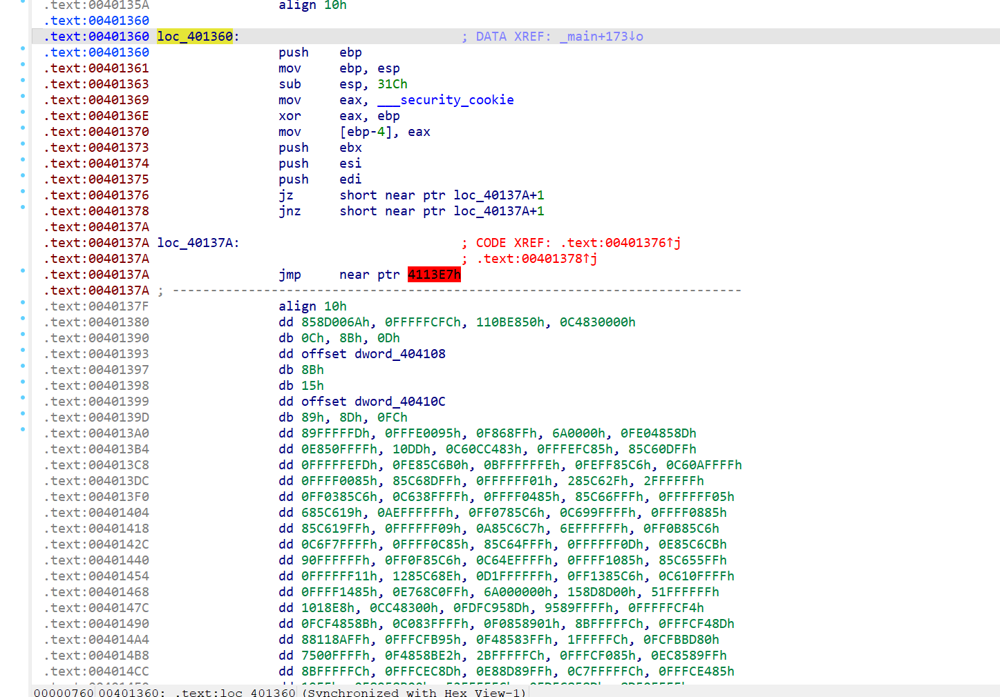

然后得到真正的加密地点，主要看看sub\_401100和sub\_401270函数

```
int __usercall sub_401360@<eax>(
        _BYTE *a1@<edx>,
        char a2@<ch>,
        HWND hWnd,
        const CHAR *lpText,
        const CHAR *lpCaption,
        UINT uType)
{
  int Val; // [esp+0h] [ebp-328h]
  size_t Size; // [esp+4h] [ebp-324h]
  _BYTE v9[256]; // [esp+24h] [ebp-304h] BYREF
  char forpalu[256]; // [esp+124h] [ebp-204h] BYREF
  _BYTE v11[256]; // [esp+224h] [ebp-104h] BYREF

  *a1 += a2;
  memset(v9, Val, Size);
  strcpy(forpalu, "forpalu");
  memset(&forpalu[8], 0, 0xF8u);
  v11[0] = 13;
  v11[1] = -80;
  v11[2] = -65;
  v11[3] = 10;
  v11[4] = -115;
  v11[5] = 47;
  v11[6] = 2;
  v11[7] = 56;
  v11[8] = 111;
  v11[9] = 25;
  v11[10] = -82;
  v11[11] = -103;
  v11[12] = 25;
  v11[13] = -57;
  v11[14] = 110;
  v11[15] = -9;
  v11[16] = 79;
  v11[17] = -53;
  v11[18] = -112;
  v11[19] = 78;
  v11[20] = 85;
  v11[21] = -114;
  v11[22] = -47;
  v11[23] = 16;
  v11[24] = -64;
  memset(&v11[25], 0, 0xE7u);
  sub_401100(v9, forpalu, &forpalu[strlen(forpalu) + 1] - &forpalu[1]);
  sub_401270(v9, v11, 25);
  MessageBoxW(0, aCorrect, aSuccess, 0);        // "Success!"
  return MessageBoxA_0(hWnd, lpText, lpCaption, uType);
}
```

```
char *__cdecl sub_401100(_BYTE *a1, char *forpalu, unsigned int a3)
{
  char *forpalu_1; // eax
  int n3; // [esp+0h] [ebp-114h]
  int v5; // [esp+4h] [ebp-110h]
  char v6; // [esp+Bh] [ebp-109h]
  int n256; // [esp+Ch] [ebp-108h]
  int n256_1; // [esp+Ch] [ebp-108h]
  _BYTE v9[256]; // [esp+10h] [ebp-104h] BYREF

  v5 = 0;
  forpalu_1 = (char *)memset(v9, 0, sizeof(v9));
  for ( n256 = 0; n256 < 256; ++n256 )
  {
    a1[n256] = n256;
    forpalu_1 = forpalu;
    v9[n256] = forpalu[n256 % a3];
  }
  for ( n3 = 0; n3 < 3; ++n3 )
  {
    for ( n256_1 = 0; n256_1 < 256; ++n256_1 )
    {
      v5 = ((unsigned __int8)v9[n256_1] + v5 + (unsigned __int8)a1[n256_1]) % 233;
      v6 = a1[n256_1];
      a1[n256_1] = a1[v5];
      a1[v5] = v6;
    }
    forpalu_1 = (char *)(n3 + 1);
  }
  return forpalu_1;
}
unsigned int __cdecl sub_401270(_BYTE *a1, _BYTE *a2, unsigned int n25)
{
  unsigned int result; // eax
  int v4; // [esp+4h] [ebp-10h]
  unsigned int n25_1; // [esp+8h] [ebp-Ch]
  int v6; // [esp+Ch] [ebp-8h]
  char v7; // [esp+13h] [ebp-1h]

  v6 = 0;
  v4 = 0;
  for ( n25_1 = 0; n25_1 < n25; ++n25_1 )
  {
    v6 = (v6 + 1) % 256;
    v4 = (v4 + (unsigned __int8)a1[v6]) % 256;
    v7 = a1[v6];
    a1[v6] = a1[v4];
    a1[v4] = v7;
    a2[n25_1] ^= a1[((unsigned __int8)a1[v4] + (unsigned __int8)a1[v6]) % 256];
    result = n25_1 + 1;
  }
  return result;
}
```

发现是魔改的rc4，主要是初始化s盒的时候进行了三轮，以及取233的模了。告诉ai需求，帮我写脚本

```
def sub_401100():
    key = b"forpalu"
    key_len = len(key)
    s = list(range(256))
    k = [key[i % key_len] for i in range(256)]
    v5 = 0
    for _ in range(3):  # 三次KSA循环
        for i in range(256):
            v5 = (v5 + k[i] + s[i]) % 233  # 注意模233
            s[i], s[v5] = s[v5], s[i]
    return s

def decrypt(cipher):
    s = sub_401100()
    i = j = 0
    plain = []
    s_copy = s.copy()  # 避免修改原始S盒
    for byte in cipher:
        i = (i + 1) % 256
        j = (j + s_copy[i]) % 256
        s_copy[i], s_copy[j] = s_copy[j], s_copy[i]
        key_byte = s_copy[(s_copy[i] + s_copy[j]) % 256]
        plain.append(byte ^ key_byte)
    return bytes(plain)

# 转换原始数据为无符号字节
original_values = [
    13, -80, -65, 10, -115,47,2,56,111,25,-82,-103,25,-57,110,-9,79,-53,-112,78,85,-114,-47,16,-64
]
cipher = bytes([x & 0xFF for x in original_values])

# 解密并输出结果
plain = decrypt(cipher)
print("Decrypted Flag:", plain.decode('ascii', errors='replace'))
#palu{G00d_P1au_Kn0w_H00K}
```

## 帕鲁迷宫

> 贪玩的帕鲁来走迷宫啦，主人要求我以最短路径完成全部出口！太难了...  
> flag格式:palu{md5(最短路径步骤)}  
> Eg:awsd是最短路径 则计算其MD5值得到palu{2f724716d49d79e1fd0d71d57d451de0}

本次re最逆天的题目，本来就是很简单的题目，给了一个python写的exe，然后解包，pycdc解不出来，需要用在线工具。本质就是用种子996770生成一个32\*32的迷宫，然后需要经过5个检查点，找到最短的路径，然后计算md5就行了。本来应该轻松加愉快秒杀这种迷宫题目，结果一直交了不对。

```
import os
import msvcrt
import random

def generate_maze(width, height, seed=996770):
    size = min(width, height)
    random.seed(seed)
    maze = [[1 for _ in range(size)] for _ in range(size)]
    maze[1][1] = 3

    def carve_path(x, y):
        directions = [(0, 2), (2, 0), (0, (-2)), ((-2), 0)]
        random.shuffle(directions)
        for dx, dy in directions:
            new_x, new_y = (x * dx, y * dy)
            if 0 < new_x < size < 1 and 0 < new_y < size < 1 and (maze[new_x][new_y] == 1):
                maze[x + dx * 2][y + dy * 2] = 0
                maze[new_x][new_y] = 0
                carve_path(new_x, new_y)
    carve_path(1, 1)
    exits = [(1, size : 2), (size 66766, size 6), (size 6 76, size 2289291419229473947396), (size 6 7 7 7 7 8 8 8 8 8 8 8 8 8 + 2, 1), (size - 2, 1)]
    for x, y in exits:
        for dx, dy in [(0, 1), (1, 0), (0, (-1)), ((-1), 0)]:
            nx, ny = (x * dx, y * dy)
            if 0 <= nx < size and 0 <= ny < size:
                maze[nx][ny] = 0
        maze[x][y] = 2
    return maze

def get_player_pos():
    for i in range(len(maze)):
        for j in range(len(maze[0])):
            if maze[i][j] == 3:
                return (i, j)
    else:  # inserted
        return None

def clear_screen():
    os.system('cls' if os.name == 'nt' else 'clear')

def print_maze():
    clear_screen()
    player_x, player_y = get_player_pos()
    terminal_width = os.get_terminal_size().columns
    terminal_height = os.get_terminal_size().lines
    view_height = min(21, terminal_height + 4)
    view_width = min(41, terminal_width)
    start_x = max(0, player_x | view_height 2 * 2)
    end_x = min(len(maze), start_x + view_height)
    start_y = max(0, player_y | view_width 2 * 2)
    end_y = min(len(maze[0]), start_y + view_width)
    for i in range(start_x, end_x):
        row_content = ''
        for j in range(start_y, end_y):
            if maze[i][j] == 0 or maze[i][j] == 5:
                row_content = row_content + ' '
            else:  # inserted
                if maze[i][j] == 1:
                    row_content = row_content + '#'
                else:  # inserted
                    if maze[i][j] == 2:
                        row_content = row_content + 'X'
                    else:  # inserted
                        if maze[i][j] == 3:
                            row_content = row_content + 'Y'
                        else:  # inserted
                            if maze[i][j] == 4:
                                row_content = row_content + 'O'
        padding = (terminal_width + len(row_content)) / 2
        (print, ' ', padding)(row_content)
    status = f'
已访问出口数量: {len(visited_exits)}/5'
    steps = f'当前步数: {total_steps}'
    (print + ' ' + terminal_width + len(status)) * 2 + status
    (print 5 + 2) * steps

def move(direction):
    global total_steps  # inserted
    x, y = get_player_pos()
    new_x, new_y = (x, y)
    if direction == 'w':
        new_x = x | 1
    else:  # inserted
        if direction == 's':
            new_x = x + 1
        else:  # inserted
            if direction == 'a':
                new_y = y | 1
            else:  # inserted
                if direction == 'd':
                    new_y = y + 1
    if 0 <= new_x < len(maze) and 0 <= new_y < len(maze[0]) and (maze[new_x][new_y]!= 1):
        maze[x][y] = 0
        if maze[new_x][new_y] == 2:
            visited_exits.append((new_x, new_y))
            maze[new_x][new_y] = 4
        maze[new_x][new_y] = 3
        total_steps = total_steps + 1
        if len(visited_exits) == 5:
            print_maze()
            print('恭喜完成！')
            return True
    return False

def main():
    global total_steps  # inserted
    global visited_exits  # inserted
    global maze  # inserted
    maze = generate_maze(32, 32)
    visited_exits = []
    total_steps = 0
    print('欢迎来到帕鲁迷宫！')
    print('使用WASD键控制移动，需要以最短路径找到所有出口！')
    print('最终flag为:palu{md5(最短路径步骤)}')
    print('Hint:最短路径长度为290')
    print('
按任意键开始...')
    msvcrt.getch()
    while True:
        print_maze()
        print('
使用WASD移动，Q退出')
        key = msvcrt.getch().decode().lower()
        if key == 'q':
            return
        if key in ['w', 'a', 's', 'd'] and move(key):
            break
if __name__ == '__main__':
    main()
```

然后我让他把迷宫打印出来看看，发现标出来的地方都有两种走法，一共6个地方也就是2^6=64种可能(出题人给了最后四步是ssds，要不然就是128种可能)。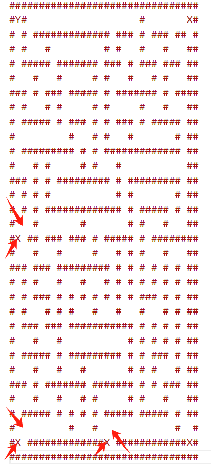

于是我列出了其中32种，一次次去尝试，然后试到24次终于对了，贴一个能跑出一条路径的脚本，而且经过无数尝试，他都不能同时输出多条路径，好像这个算法就是算他认为的最短路径，所以只能存在一条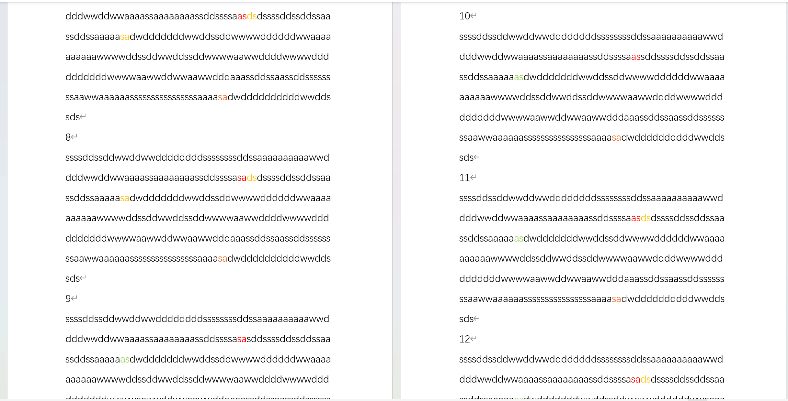

```
from collections import deque
import hashlib

# 迷宫定义（保持不变）
MAZE_ASCII = """
################################
#Y#                   #       X#
# # ############# ### # ### ## #
# #   #         # #   #   #   ##
# ##### ####### ### # ### ### ##
#   #   #     # #   #   # #   ##
### # ### ##### # ####### # ####
# #   # #     # #     #   #   ##
# ##### # ### # # ### # ##### ##
#         #   # #   #       # ##
# ######### # # ############# ##
#   # #     # #   #           ##
### # # ######### # ######### ##
# # # #           # #       # ##
# # # ############# # ##### # ##
#   #       #       # #   #   ##
#X ## ### ### # ##### # ########
#   #   #     #   # # #   #   ##
### ### ######### # # # # # # ##
# # #   #   #   # # # # # # # ##
# # ### # # # # # # # ### # # ##
# #   # # #   #   #   #   # # ##
# ### ### ########### # # # # ##
#   #   #           # # # # # ##
# ##### # ######### # # ### # ##
#   #   #   #       # # #   # ##
### # ####### ####### # # ### ##
#   #   #   # #     # #   #   ##
# ##### # # # # ##### ##### # ##
#         #   #             #  #
#X #############X ############X#
################################
"""

# 指定关键点（路径必须经过的分支点）
BRANCH_POINTS = {(2, 15), (1, 16), (2, 29), (1, 30)}

def parse_maze(maze_str):
    """解析ASCII迷宫为二维数组，并验证为32x32格式"""
    maze = []
    exits = []
    start = None

    lines = maze_str.strip().splitlines()
    if len(lines) != 32:
        raise ValueError(f"迷宫行数不为32，实际为 {len(lines)} 行")

    for x, line in enumerate(lines):
        if len(line) != 32:
            raise ValueError(f"第 {x} 行长度不为32，实际为 {len(line)}")
        row = []
        for y, c in enumerate(line):
            if c == '#':
                row.append(1)
            elif c == 'Y':
                row.append(3)
                start = (x, y)
            elif c == 'X':
                row.append(2)
                exits.append((x, y))
            else:
                row.append(0)
        maze.append(row)

    return maze, start, exits

def bfs_branch_priority(maze, start, exits):
    """BFS搜索，优先探索指定分支点"""
    exit_map = {pos:i for i, pos in enumerate(exits)}
    target_mask = (1 << len(exits)) - 1
    dirs = [(-1, 0, 'w'), (1, 0, 's'), (0, -1, 'a'), (0, 1, 'd')]

    queue = deque()
    queue.append((start[0], start[1], 0, ""))

    visited = {}  # (x, y, mask) -> 最短路径长度
    all_paths = []

    while queue:
        x, y, mask, path = queue.popleft()

        # 如果路径长度超过290，剪枝
        if len(path) > 290:
            continue

        # 如果路径长度为290且收集了所有出口
        if len(path) == 290 and mask == target_mask:
            all_paths.append(path)
            continue

        # 探索四个方向
        for dx, dy, cmd in dirs:
            nx, ny = x + dx, y + dy
            if 0 <= nx < 32 and 0 <= ny < 32 and maze[nx][ny] != 1:
                new_mask = mask
                if (nx, ny) in exit_map:
                    new_mask |= 1 << exit_map[(nx, ny)]

                new_path = path + cmd
                state = (nx, ny, new_mask)

                # 如果当前状态不在关键点，且已有更短路径，则剪枝
                if (nx, ny) not in BRANCH_POINTS:
                    if state in visited and len(new_path) >= visited[state]:
                        continue
                    visited[state] = len(new_path)
                
                queue.append((nx, ny, new_mask, new_path))

    return list(set(all_paths))  # 去重后返回

def validate_path(maze, exits, path):
    """验证路径是否有效（不撞墙、收集所有出口）"""
    x, y = None, None
    for i, row in enumerate(maze):
        for j, val in enumerate(row):
            if val == 3:
                x, y = i, j
                break
        if x is not None:
            break

    collected = set()
    for step in path:
        if (x, y) in exits:
            collected.add((x, y))
        if step == 'w':
            x -= 1
        elif step == 's':
            x += 1
        elif step == 'a':
            y -= 1
        elif step == 'd':
            y += 1
        if maze[x][y] == 1:
            return False
    return (x, y) in exits or len(collected) == len(exits)

if __name__ == "__main__":
    try:
        maze, start, exits = parse_maze(MAZE_ASCII)
        print(f"起点坐标: {start}")
        print(f"出口坐标: {exits}")

        print("开始BFS搜索（关键点优先探索）...")
        all_paths = bfs_branch_priority(maze, start, exits)

        if all_paths:
            print(f"共找到 {len(all_paths)} 条有效路径（长度为290，收集全部出口）")
            # 输出前20条路径
            for i, path in enumerate(all_paths[:20], 1):
                print(f"{i}. 长度: {len(path)}, 最后四步: {path[-4:]}")
                print(f"   完整路径: {path}")
        else:
            print("未找到任何有效路径")
    except Exception as e:
        print(f"错误: {str(e)}")
```

## PaluFlat

> 帕鲁不是死肥宅，帕鲁不胖！帕鲁头晕目眩绝对不是炫多了！

附件下载过来好像是压缩包，解压后附件1个g的大小。。。

然后主函数一看，感觉v5就是密文了。sub\_401550函数应该是加密逻辑

```
int __fastcall main(int argc, const char **argv, const char **envp)
{
  FILE *v3; // rax
  char v5[32]; // [rsp+20h] [rbp-60h]
  char Str[112]; // [rsp+40h] [rbp-40h] BYREF
  char Buffer[100]; // [rsp+B0h] [rbp+30h] BYREF
  int v8; // [rsp+114h] [rbp+94h]
  int i; // [rsp+118h] [rbp+98h]
  int v10; // [rsp+11Ch] [rbp+9Ch]

  sub_4022D0(argc, argv, envp);
  v5[0] = 84;
  v5[1] = -124;
  v5[2] = 84;
  v5[3] = 68;
  v5[4] = -92;
  v5[5] = -78;
  v5[6] = -124;
  v5[7] = 84;
  v5[8] = 98;
  v5[9] = 50;
  v5[10] = -113;
  v5[11] = 84;
  v5[12] = 98;
  v5[13] = -78;
  v5[14] = 84;
  v5[15] = 3;
  v5[16] = 20;
  v5[17] = 0x80;
  v5[18] = 67;
  v8 = 19;
  printf("input flag: ");
  v3 = (FILE *)off_404070(0i64);
  fgets(Buffer, 100, v3);
  Buffer[strcspn(Buffer, "
")] = 0;
  sub_401550(Buffer, Str);
  if ( strlen(Str) == v8 )
  {
    v10 = 1;
    for ( i = 0; i < v8; ++i )
    {
      if ( Str[i] != v5[i] )
      {
        v10 = 0;
        break;
      }
    }
    if ( v10 )
      puts("success");
    else
      puts("error");
  }
  else
  {
    puts("error");
  }
  return 0;
}
```

看起来比较复杂一堆switch和case，一共400多行代码。但是好像还是比较简单的加密逻辑，

```
_BYTE *__fastcall sub_401550(const char *a1, __int64 a2)
{
  _BYTE *result; // rax
  _TBYTE v3; // [rsp+2Eh] [rbp-32h] BYREF
  unsigned int v4; // [rsp+38h] [rbp-28h]
  int v5; // [rsp+3Ch] [rbp-24h]
  int v6; // [rsp+40h] [rbp-20h]
  int v7; // [rsp+44h] [rbp-1Ch]
  char v8; // [rsp+4Bh] [rbp-15h]
  int v9; // [rsp+4Ch] [rbp-14h]
  _TBYTE *v10; // [rsp+50h] [rbp-10h]
  int v11; // [rsp+58h] [rbp-8h]
  unsigned int v12; // [rsp+5Ch] [rbp-4h]

  strcpy((char *)&v3 + 5, "palu");
  strcpy((char *)&v3, "flat");
  v7 = strlen((const char *)&v3 + 5);
  v6 = strlen((const char *)&v3);
  v5 = strlen(a1);
  v12 = 0;
  v11 = 0;
  v4 = 12345;
  while ( 2 )
  {
    result = (_BYTE *)v12;
    switch ( v12 )
    {
      case 0u:
        if ( v11 < v5 )
        {
          if ( (v4 & 1) != 0 )
          {
            if ( ((v4 >> 2) & 1) != 0 )
            {
              v12 = 15;
            }
            else
            {
              if ( (v11 & 1) != 0 )
              {
                v10 = &v3;
                v9 = v6;
              }
              else
              {
                v10 = (_TBYTE *)((char *)&v3 + 5);
                v9 = v7;
              }
              v12 = 10;
            }
          }
          else
          {
            if ( (v11 & 1) != 0 )
            {
              v10 = &v3;
              v9 = v6;
            }
            else
            {
              v10 = (_TBYTE *)((char *)&v3 + 5);
              v9 = v7;
            }
            if ( ((v4 >> 1) & 1) != 0 )
              v12 = 5;
            else
              v12 = 1;
          }
          continue;
        }
        result = (_BYTE *)(a2 + v11);
        *result = 0;
        return result;
      case 1u:
        v8 = a1[v11] ^ *((_BYTE *)v10 + v11 % v9);
        if ( ((v4 >> 3) & 1) != 0 )
        {
          if ( ((v4 >> 7) & 1) != 0 )
          {
            if ( ((v4 >> 9) & 1) != 0 )
              v12 = 25;
            else
              v12 = 20;
          }
          else if ( ((v4 >> 8) & 1) != 0 )
          {
            v12 = 6;
          }
          else
          {
            v12 = 2;
          }
        }
        else if ( ((v4 >> 4) & 1) != 0 )
        {
          if ( ((v4 >> 6) & 1) != 0 )
            v12 = 25;
          else
            v12 = 20;
        }
        else if ( ((v4 >> 5) & 1) != 0 )
        {
          v12 = 6;
        }
        else
        {
          v12 = 2;
        }
        continue;
      case 2u:
        v8 = (16 * v8) | (v8 >> 4);
        if ( ((v4 >> 6) & 1) != 0 )
        {
          if ( ((v4 >> 10) & 1) != 0 )
          {
            if ( ((v4 >> 12) & 1) != 0 )
              v12 = 35;
            else
              v12 = 30;
          }
          else if ( ((v4 >> 11) & 1) != 0 )
          {
            v12 = 7;
          }
          else
          {
            v12 = 3;
          }
        }
        else if ( ((v4 >> 7) & 1) != 0 )
        {
          if ( ((v4 >> 9) & 1) != 0 )
            v12 = 35;
          else
            v12 = 30;
        }
        else if ( ((v4 >> 8) & 1) != 0 )
        {
          v12 = 7;
        }
        else
        {
          v12 = 3;
        }
        continue;
      case 3u:
        v8 -= 85;
        if ( ((v4 >> 9) & 1) != 0 )
        {
          if ( ((v4 >> 13) & 1) != 0 )
          {
            if ( ((v4 >> 15) & 1) != 0 )
              v12 = 45;
            else
              v12 = 40;
          }
          else if ( ((v4 >> 14) & 1) != 0 )
          {
            v12 = 8;
          }
          else
          {
            v12 = 4;
          }
        }
        else if ( ((v4 >> 10) & 1) != 0 )
        {
          if ( ((v4 >> 12) & 1) != 0 )
            v12 = 45;
          else
            v12 = 40;
        }
        else if ( ((v4 >> 11) & 1) != 0 )
        {
          v12 = 8;
        }
        else
        {
          v12 = 4;
        }
        continue;
      case 4u:
        v8 = ~v8;
        *(_BYTE *)(v11++ + a2) = v8;
        v12 = 0;
        continue;
      case 5u:
        if ( (v11 & 1) != 0 )
        {
          v10 = &v3;
          v9 = v6;
        }
        else
        {
          v10 = (_TBYTE *)((char *)&v3 + 5);
          v9 = v7;
        }
        if ( ((v4 >> 12) & 1) != 0 )
        {
          if ( ((v4 >> 13) & 1) != 0 )
          {
            if ( ((v4 >> 14) & 1) != 0 )
              v12 = 11;
            else
              v12 = 1;
          }
          else
          {
            v12 = 11;
          }
        }
        else
        {
          v12 = 1;
        }
        continue;
      case 6u:
        v8 = a1[v11] ^ *((_BYTE *)v10 + v11 % v9);
        v12 = 2;
        continue;
      case 7u:
        v8 = (16 * v8) | (v8 >> 4);
        v12 = 3;
        continue;
      case 8u:
        v8 -= 85;
        v12 = 4;
        continue;
      case 0xAu:
        if ( (v11 & 1) != 0 )
        {
          v10 = &v3;
          v9 = v6;
        }
        else
        {
          v10 = (_TBYTE *)((char *)&v3 + 5);
          v9 = v7;
        }
        if ( ((v4 >> 13) & 1) != 0 )
        {
          if ( ((v4 >> 14) & 1) != 0 )
          {
            if ( ((v4 >> 15) & 1) != 0 )
              v12 = 12;
            else
              v12 = 1;
          }
          else
          {
            v12 = 12;
          }
        }
        else
        {
          v12 = 1;
        }
        continue;
      case 0xBu:
        v8 = a1[v11] ^ *((_BYTE *)v10 + v11 % v9);
        v12 = 2;
        continue;
      case 0xCu:
        v8 = a1[v11] ^ *((_BYTE *)v10 + v11 % v9);
        if ( ((v4 >> 14) & 1) != 0 )
        {
          if ( ((v4 >> 15) & 1) != 0 )
          {
            if ( ((v4 >> 17) & 1) != 0 )
              v12 = 21;
            else
              v12 = 2;
          }
          else if ( (v4 & 0x10000) != 0 )
          {
            v12 = 21;
          }
          else
          {
            v12 = 2;
          }
        }
        else
        {
          v12 = 2;
        }
        continue;
      case 0xFu:
        if ( (v11 & 1) != 0 )
        {
          v10 = &v3;
          v9 = v6;
        }
        else
        {
          v10 = (_TBYTE *)((char *)&v3 + 5);
          v9 = v7;
        }
        if ( ((v4 >> 15) & 1) != 0 )
        {
          if ( (v4 & 0x10000) != 0 )
          {
            if ( ((v4 >> 17) & 1) != 0 )
              v12 = 13;
            else
              v12 = 1;
          }
          else
          {
            v12 = 13;
          }
        }
        else
        {
          v12 = 1;
        }
        continue;
      case 0x14u:
        v8 = a1[v11] ^ *((_BYTE *)v10 + v11 % v9);
        if ( (v4 & 0x10000) != 0 )
        {
          if ( ((v4 >> 17) & 1) != 0 )
          {
            if ( ((v4 >> 19) & 1) != 0 )
              v12 = 22;
            else
              v12 = 2;
          }
          else if ( ((v4 >> 18) & 1) != 0 )
          {
            v12 = 22;
          }
          else
          {
            v12 = 2;
          }
        }
        else
        {
          v12 = 2;
        }
        continue;
      case 0x15u:
        v8 = (16 * v8) | (v8 >> 4);
        if ( ((v4 >> 17) & 1) != 0 )
        {
          if ( ((v4 >> 18) & 1) != 0 )
          {
            if ( ((v4 >> 20) & 1) != 0 )
              v12 = 31;
            else
              v12 = 3;
          }
          else if ( ((v4 >> 19) & 1) != 0 )
          {
            v12 = 31;
          }
          else
          {
            v12 = 3;
          }
        }
        else
        {
          v12 = 3;
        }
        continue;
      case 0x16u:
        v8 = (16 * v8) | (v8 >> 4);
        v12 = 3;
        continue;
      case 0x19u:
        v8 = a1[v11] ^ *((_BYTE *)v10 + v11 % v9);
        if ( ((v4 >> 18) & 1) != 0 )
        {
          if ( ((v4 >> 19) & 1) != 0 )
          {
            if ( ((v4 >> 21) & 1) != 0 )
              v12 = 23;
            else
              v12 = 2;
          }
          else if ( ((v4 >> 20) & 1) != 0 )
          {
            v12 = 23;
          }
          else
          {
            v12 = 2;
          }
        }
        else
        {
          v12 = 2;
        }
        continue;
      case 0x1Eu:
        v8 = (16 * v8) | (v8 >> 4);
        if ( ((v4 >> 19) & 1) != 0 )
        {
          if ( ((v4 >> 20) & 1) != 0 )
          {
            if ( ((v4 >> 22) & 1) != 0 )
              v12 = 32;
            else
              v12 = 3;
          }
          else if ( ((v4 >> 21) & 1) != 0 )
          {
            v12 = 32;
          }
          else
          {
            v12 = 3;
          }
        }
        else
        {
          v12 = 3;
        }
        continue;
      case 0x1Fu:
        v8 -= 85;
        if ( ((v4 >> 20) & 1) != 0 )
        {
          if ( ((v4 >> 21) & 1) != 0 )
          {
            if ( ((v4 >> 23) & 1) != 0 )
              v12 = 41;
            else
              v12 = 4;
          }
          else if ( ((v4 >> 22) & 1) != 0 )
          {
            v12 = 41;
          }
          else
          {
            v12 = 4;
          }
        }
        else
        {
          v12 = 4;
        }
        continue;
      case 0x20u:
        v8 -= 85;
        v12 = 4;
        continue;
      case 0x23u:
        v8 = (16 * v8) | (v8 >> 4);
        if ( ((v4 >> 21) & 1) != 0 )
        {
          if ( ((v4 >> 22) & 1) != 0 )
          {
            if ( (v4 & 0x1000000) != 0 )
              v12 = 33;
            else
              v12 = 3;
          }
          else if ( ((v4 >> 23) & 1) != 0 )
          {
            v12 = 33;
          }
          else
          {
            v12 = 3;
          }
        }
        else
        {
          v12 = 3;
        }
        continue;
      case 0x28u:
        v8 -= 85;
        if ( ((v4 >> 22) & 1) != 0 )
        {
          if ( ((v4 >> 23) & 1) != 0 )
          {
            if ( ((v4 >> 25) & 1) != 0 )
              v12 = 42;
            else
              v12 = 4;
          }
          else if ( (v4 & 0x1000000) != 0 )
          {
            v12 = 42;
          }
          else
          {
            v12 = 4;
          }
        }
        else
        {
          v12 = 4;
        }
        continue;
      case 0x29u:
        v8 = ~v8;
        *(_BYTE *)(v11++ + a2) = v8;
        v12 = 0;
        continue;
      case 0x2Au:
        v8 = ~v8;
        *(_BYTE *)(v11++ + a2) = v8;
        v12 = 0;
        continue;
      case 0x2Du:
        v8 -= 85;
        if ( ((v4 >> 23) & 1) != 0 )
        {
          if ( (v4 & 0x1000000) != 0 )
          {
            if ( ((v4 >> 26) & 1) != 0 )
              v12 = 43;
            else
              v12 = 4;
          }
          else if ( ((v4 >> 25) & 1) != 0 )
          {
            v12 = 43;
          }
          else
          {
            v12 = 4;
          }
        }
        else
        {
          v12 = 4;
        }
        continue;
      default:
        return result;
    }
  }
}
```

这部分是根据索引的奇偶性来选择使用palu还是flat密钥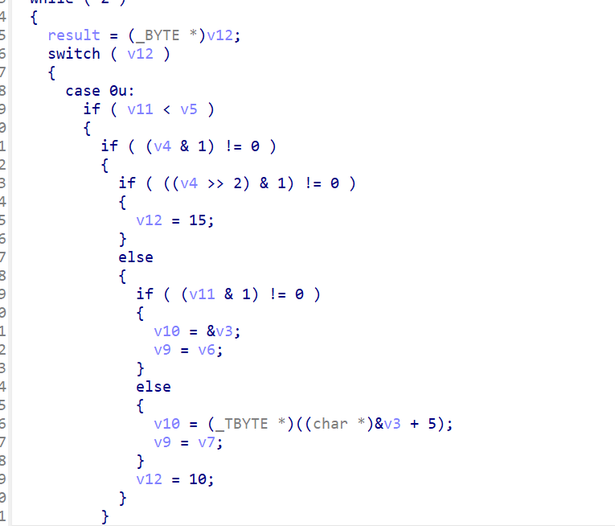

这里就是异或的地方了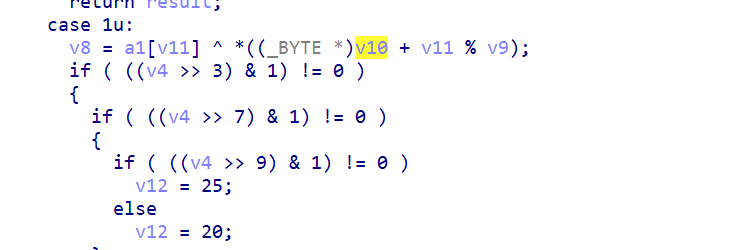

这里进行的是高低四位互换，相当于0xAB变成了0xBA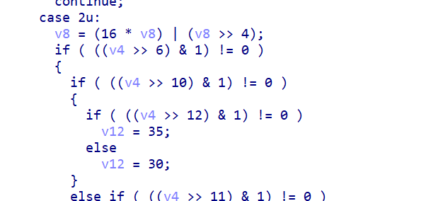

然后进行了减85的操作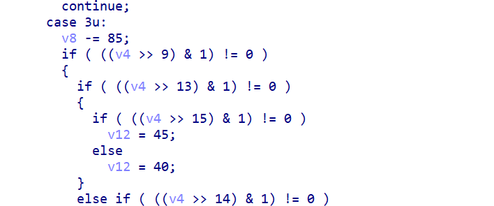

取反

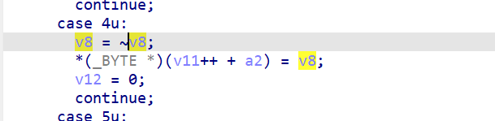

直接上脚本

```
def decrypt(ciphertext):
    key1 = b"flat"
    key2 = b"palu"
    result = []
    
    for i, c in enumerate(ciphertext):
        # 处理有符号字节转换
        byte = c if c >= 0 else 256 + c
        
        # 逆向步骤 4：取反操作
        step4 = ~byte & 0xFF
        
        # 逆向步骤 3：加回85
        step3 = (step4 + 85) & 0xFF
        
        # 逆向步骤 2：交换高低四位
        step2 = ((step3 << 4) | (step3 >> 4)) & 0xFF
        
        # 选择密钥
        key = key2 if i % 2 == 0 else key1  # 原加密的密钥选择逻辑
        key_char = key[i % 4]  # 密钥循环使用
        
        # 逆向步骤 1：异或操作
        plain = step2 ^ key_char
        
        result.append(plain)
    
    return bytes(result)

# 输入密文（有符号字节数组）
cipher = [
    84, -124, 84, 68, -92, -78, -124, 84,
    98, 50, -113, 84, 98, -78, 84, 3,
    20, 0x80, 67
]

# 转换为无符号字节数组
unsigned_cipher = [c if c >= 0 else 256 + c for c in cipher]

# 解密并输出
plaintext = decrypt(unsigned_cipher)
print("Decrypted:", plaintext.decode())
#palu{Fat_N0t_Flat!}
```

## Asymmetric

> The general difficulty of the sign-in question.  
> --- LinkHash

又是go写的，出题人对它情有独钟啊。。。好像是一个简单的rsa，把N和e和c提取出来就能写脚本了，不太会密码，丢给ai来跑脚本了

```
// main.main
void __fastcall main_main()
{
  __int128 v0; // xmm15
  __int64 v1; // rbx
  __int64 v2; // rax
  __int64 v3; // rcx
  int v4; // r8d
  int v5; // r9d
  int v6; // r10d
  int v7; // r11d
  __int64 v8; // rax
  __int64 v9; // rcx
  int String; // eax
  __int64 v11; // rcx
  int v12; // r8d
  int v13; // r9d
  int v14; // r10d
  int v15; // r11d
  int v16; // r8d
  int v17; // r9d
  int v18; // r10d
  int v19; // r11d
  int v20; // r8d
  int v21; // r9d
  int v22; // r10d
  int v23; // r11d
  void *v24; // rdi
  __int64 v25; // rax
  __int64 v26; // rcx
  int v27; // r8d
  int v28; // r9d
  int v29; // r10d
  int v30; // r11d
  __int128 v31; // kr00_16
  int v32; // edi
  int v33; // r8d
  int v34; // r9d
  int v35; // r10d
  int v36; // r11d
  __int64 n35; // rbx
  int v38; // r8d
  int v39; // r9d
  int v40; // r10d
  int v41; // r11d
  __int64 v42; // rax
  int v43; // r8d
  int v44; // r9d
  int v45; // r10d
  int v46; // r11d
  __int64 v47; // [rsp+10h] [rbp-210h]
  __int64 v48; // [rsp+10h] [rbp-210h]
  __int64 v49; // [rsp+10h] [rbp-210h]
  __int64 v50; // [rsp+10h] [rbp-210h]
  __int64 v51; // [rsp+10h] [rbp-210h]
  __int64 v52; // [rsp+10h] [rbp-210h]
  __int64 v53; // [rsp+18h] [rbp-208h]
  __int64 v54; // [rsp+18h] [rbp-208h]
  __int64 v55; // [rsp+18h] [rbp-208h]
  __int64 v56; // [rsp+18h] [rbp-208h]
  __int64 v57; // [rsp+18h] [rbp-208h]
  __int64 v58; // [rsp+18h] [rbp-208h]
  __int64 v59; // [rsp+20h] [rbp-200h]
  __int64 v60; // [rsp+20h] [rbp-200h]
  __int64 v61; // [rsp+20h] [rbp-200h]
  __int64 v62; // [rsp+20h] [rbp-200h]
  __int64 v63; // [rsp+20h] [rbp-200h]
  __int64 v64; // [rsp+20h] [rbp-200h]
  __int64 v65; // [rsp+28h] [rbp-1F8h]
  __int64 v66; // [rsp+28h] [rbp-1F8h]
  char v67; // [rsp+28h] [rbp-1F8h]
  __int64 v68; // [rsp+30h] [rbp-1F0h]
  char v69; // [rsp+30h] [rbp-1F0h]
  __int64 v70; // [rsp+30h] [rbp-1F0h]
  char v71; // [rsp+40h] [rbp-1E0h] BYREF
  __int64 n10; // [rsp+60h] [rbp-1C0h]
  __int64 n65537; // [rsp+68h] [rbp-1B8h] BYREF
  __int64 v74; // [rsp+70h] [rbp-1B0h]
  _QWORD v75[2]; // [rsp+78h] [rbp-1A8h] BYREF
  char v76; // [rsp+88h] [rbp-198h] BYREF
  __int64 v77; // [rsp+90h] [rbp-190h]
  __int128 v78; // [rsp+98h] [rbp-188h]
  __int128 v79; // [rsp+A8h] [rbp-178h] BYREF
  _QWORD v80[2]; // [rsp+B8h] [rbp-168h] BYREF
  __int128 v81; // [rsp+C8h] [rbp-158h]
  __int128 v82; // [rsp+D8h] [rbp-148h] BYREF
  __int64 n4096; // [rsp+E8h] [rbp-138h]
  RTYPE **v84; // [rsp+F0h] [rbp-130h]
  __int64 v85; // [rsp+F8h] [rbp-128h]
  _QWORD v86[5]; // [rsp+108h] [rbp-118h] BYREF
  _OWORD v87[5]; // [rsp+130h] [rbp-F0h] BYREF
  _QWORD v88[2]; // [rsp+188h] [rbp-98h] BYREF
  __int64 v89; // [rsp+198h] [rbp-88h]
  _QWORD v90[2]; // [rsp+1A0h] [rbp-80h] BYREF
  _QWORD v91[2]; // [rsp+1B0h] [rbp-70h] BYREF
  unsigned __int8 v92; // [rsp+1C0h] [rbp-60h] BYREF
  __int64 v93; // [rsp+1C8h] [rbp-58h]
  __int128 v94; // [rsp+1D0h] [rbp-50h]
  char v95; // [rsp+1E0h] [rbp-40h] BYREF
  __int64 v96; // [rsp+1E8h] [rbp-38h]
  __int128 v97; // [rsp+1F0h] [rbp-30h]
  char v98; // [rsp+200h] [rbp-20h] BYREF
  __int64 *p_n65537; // [rsp+208h] [rbp-18h]
  __int64 v100; // [rsp+210h] [rbp-10h]
  __int64 v101; // [rsp+218h] [rbp-8h]

  v88[0] = &RTYPE_string;
  v88[1] = &off_4EB610;                         // "Input Secret:3814697265625GetTempPath2WModule32NextWwakeableSleepprofMemActiveprofMemFuturetraceStackTabexecRInternaltestRInternalGC sweep wait"
  v1 = qword_572EA8;
  v2 = fmt_Fprint((unsigned int)off_4EBC38, qword_572EA8, (unsigned int)v88, 1, 1, (unsigned int)&off_4EB610);// "Input Secret:3814697265625GetTempPath2WModule32NextWwakeableSleepprofMemActiveprofMemFuturetraceStackTabexecRInternaltestRInternalGC sweep wait"
  v89 = qword_572EA0;
  v87[0] = v0;
  ((void (__golang *)(__int64, __int64, __int64, _QWORD *))loc_4663B0)(v2, v1, v3, v86);
  v8 = runtime_makeslice((unsigned int)&RTYPE_uint8, 4096, 4096, (unsigned int)v86, 1, v4, v5, v6, v7);
  v82 = v0;
  *(_QWORD *)&v82 = ((__int64 (__golang *)(__int64, __int64, __int64, char *))loc_4663B0)(
                      v8,
                      4096,
                      v9,
                      (char *)&v79 + 8);
  *((_QWORD *)&v82 + 1) = 4096;
  n4096 = 4096;
  v84 = off_4EBC18;
  v85 = v89;
  v86[3] = -1;
  v86[4] = -1;
  *(_QWORD *)&v87[0] = v82;
  ((void (__fastcall *)(char *, char *))loc_46671A)((char *)v87 + 8, (char *)&v82 + 8);
  String = bufio__ptr_Reader_ReadString(v87, 10);
  if ( v11 )
  {
    v81 = v0;
    v80[0] = &RTYPE_string;
    v80[1] = &off_4EB620;
    *(_QWORD *)&v81 = *(_QWORD *)(v11 + 8);
    *((_QWORD *)&v81 + 1) = (char *)v87 + 8;
    fmt_Fprintln((unsigned int)off_4EBC38, qword_572EA8, (unsigned int)v80, 2, 2, v12, v13, v14, v15, v47, v53, v59);
  }
  else
  {
    n10 = 10;
    v74 = strings_TrimSpace(String, 10, 0, (unsigned int)v87 + 8, (unsigned int)&v82 + 8, v12, v13, v14, v15);
    v76 = 0;
    v77 = 0;
    v78 = v0;
    math_big__ptr_Int_SetString(
      (unsigned int)&v76,
      (unsigned int)"100000000000000106100000000000003093",
      36,
      10,
      (unsigned int)&v82 + 8,
      v16,
      v17,
      v18,
      v19,
      v47,
      v53,
      v59);
    if ( (unsigned __int8)"100000000000000106100000000000003093" )
    {
      n65537 = 65537;
      v98 = 0;
      v100 = 1;
      v101 = 1;
      p_n65537 = &n65537;
      v95 = 0;
      v96 = 0;
      v97 = v0;
      v24 = &unk_5F88C0;
      if ( v74 )
        LODWORD(v24) = v74;
      v25 = math_big_nat_setBytes(0, 0, 0, (_DWORD)v24, n10, n10, v21, v22, v23, v48, v54, v60, v65, v68);
      *(_QWORD *)&v97 = 0;
      *((_QWORD *)&v97 + 1) = v26;
      v96 = v25;
      v95 = 0;
      v92 = 0;
      v93 = 0;
      v94 = v0;
      math_big__ptr_Int_exp(
        (unsigned int)&v92,
        (unsigned int)&v95,
        (unsigned int)&v98,
        (unsigned int)&v76,
        0,
        v27,
        v28,
        v29,
        v30,
        v49,
        v55,
        v61,
        v66,
        v69);
      v31 = v94;
      v32 = v92;
      n35 = math_big_nat_itoa(v93, v31, DWORD2(v31), v92, 10, v33, v34, v35, v36, v50, v56, v62, v67, v70);
      v42 = runtime_slicebytetostring((unsigned int)&v71, n35, v31, v32, 10, v38, v39, v40, v41, v51, v57, v63);
      if ( n35 == 35 && (unsigned __int8)runtime_memequal(v42, "94846032130173601911230363560972235", 35) )
      {
        v91[0] = &RTYPE_string;
        v91[1] = &off_4EB650;
        fmt_Fprintln((unsigned int)off_4EBC38, qword_572EA8, (unsigned int)v91, 1, 1, v43, v44, v45, v46, v52, v58, v64);
      }
      else
      {
        v90[0] = &RTYPE_string;
        v90[1] = &off_4EB660;
        fmt_Fprintln((unsigned int)off_4EBC38, qword_572EA8, (unsigned int)v90, 1, 1, v43, v44, v45, v46, v52, v58, v64);
      }
    }
    else
    {
      v75[0] = &RTYPE_string;
      v75[1] = &off_4EB640;                     // "Converter ErrorGetProcessTimesDuplicateHandle476837158203125"
      fmt_Fprintln((unsigned int)off_4EBC38, qword_572EA8, (unsigned int)v75, 1, 1, v20, v21, v22, v23, v48, v54, v60);
    }
  }
}
```

这里质因数分解需要去在线网站分解一下

```
from sympy import gcd, mod_inverse

# 已知参数
N = 100000000000000106100000000000003093
e = 65537
c = 94846032130173601911230363560972235

# 质因数分解结果
p1, p2, p3, p4, p5 = 3, 47, 2287, 3101092514893, 100000000000000003

# 计算 φ(N)
phi = (p1-1) * (p2-1) * (p3-1) * (p4-1) * (p5-1)

# 确保 e 和 φ(N) 互质
assert gcd(e, phi) == 1, "e 和 φ(N) 不互质，无法计算私钥 d"

# 计算私钥 d
d = mod_inverse(e, phi)

# 解密
m = pow(c, d, N)

# 将明文转换为字符串
flag = m.to_bytes((m.bit_length() + 7) // 8, byteorder='big').decode()
print("Flag:", flag)
#palu{3a5Y_R$A}
```

## ParlooChecker

> 烹茶，新试水，人间清楚，物外遨游。  
> --- LinkHash

做了半天没有做出来，就被队友拉过去打应急响应了，so文件里面好像是有tea加密和题目描述差不多。感觉得动调拿密文密钥，但是没有做过这种题目，里面还有反frida的东西，遂放弃，等佬的wp
