# 代码审计-Echo2.3-先知社区

> **来源**: https://xz.aliyun.com/news/18030  
> **文章ID**: 18030

---

# 项目介绍

开源社区系统：基于 SpringBoot + MyBatis + MySQL + Redis + Kafka + Elasticsearch + Spring Security + ... 并提供详细的开发文档和配套教程。包含帖子、评论、私信、系统通知、点赞、关注、搜索、用户设置、数据统计等模块。3000+Star的项目还是比较不错的

项目地址：<https://gitee.com/veal98/Echo>

# 环境搭建

```
JDK 1.8.0_65
Maven 3.9.9
redis 3.0.504
zookeeper 3.6.4
kafka 2.12-3.5.1
Elasticsearch 6.4.3
```

redis的安装较为简单，这里就不介绍了

对于zookeeper和kafka来说，两个是配套使用的，并且kafka就已经内置了适配的zookeeper了，不需要我们自己再去单独下载安装，要不然你还要考虑两个版本适不适配（吃了大亏。。。）

这里直接贴链接：<https://www.cnblogs.com/Marydon20170307/p/17933358.html>

对于Elasticsearch的安装可参考：<https://zhuanlan.zhihu.com/p/451571598>

但是有点不同的是，对于我自己来说，我在confelasticsearch.yml文件中还要多添加一点，如下：

```
http.cors.enabled: true
http.cors.allow-origin: "*"
network.host: 127.0.0.1
xpack.ml.enabled: false
```

如上配置之后就可以正常使用了，就是多关闭了机器学习的功能

**注：启动项目之前上面这些基础配置都要开启来**

接下来我们需要先把该项目的源码下下来，然后对src/main/resources/application-develop.properties文件进行一部分的修改

```
spring.datasource.url = jdbc:mysql://127.0.0.1:3306/数据库名?characterEncoding=utf-8&useSSL=false&serverTimezone=Hongkong
spring.datasource.username = 自己的账号名
spring.datasource.password = 自己的密码
......
# Elasticsearch
spring.data.elasticsearch.cluster-name = 该字段见 Elasticsearch 安装包中的 elasticsearch.yml的cluster-name
spring.data.elasticsearch.cluster-nodes = 127.0.0.1:9300
```

其他配置要是你的redis那些配置都保持默认的话那么也不需要进行更改

然后我们还需要创建数据库并将提供的sql文件全部导入进去，最后导入完后的结果如下：  
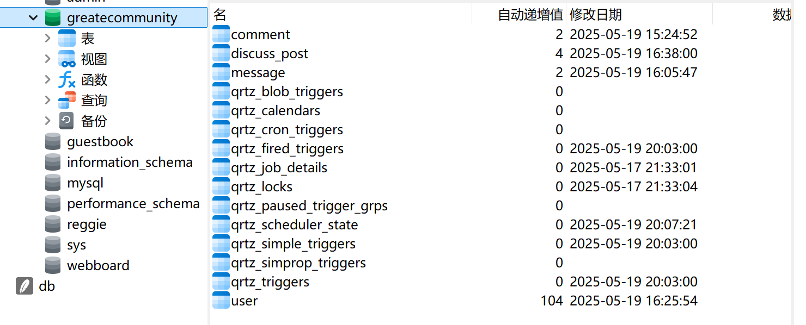

最后就是启动springboot，访问我们设定的对应端口

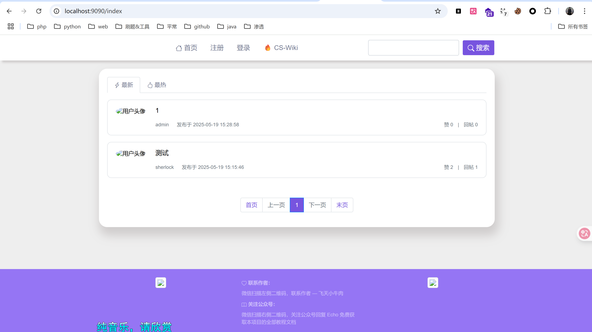

# 审计

由于第一次审计java项目木有经验，再加上这是个小项目，代码量也不能算很多，所以我是全部的文件都看了一遍

首先该项目里面是不存在sql注入漏洞的，这是因为所有的输入点都进行了预编译处理，都用`#{}`进行了处理

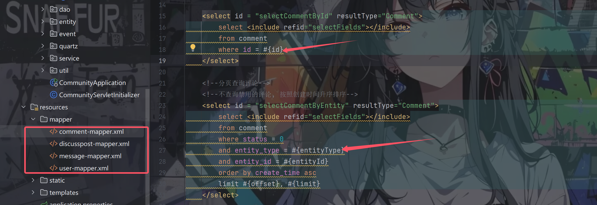

## 碰壁1

无妨，继续审计，看到了一个有趣的地方，位于UserController.java文件中

```
    /**
     * 更新图像路径（将本地的图像路径更新为云服务器上的图像路径）
     * @param fileName
     * @return
     */
    @PostMapping("/header/url")
    @ResponseBody
    public String updateHeaderUrl(String fileName) {
        if (StringUtils.isBlank(fileName)) {
            return CommunityUtil.getJSONString(1, "文件名不能为空");
        }

        // 文件在云服务器上的的访问路径
        String url = headerBucketUrl + "/" + fileName;
        userService.updateHeader(hostHolder.getUser().getId(), url);

        return CommunityUtil.getJSONString(0);

    }
```

方法是直接读取了云服务器上面的图像文件当作了头像，虽然说对最后的文件路径进行了处理，无法控制

这时我就想着上传图片的方法有没有设置检验图片内容啥的，该方法如下：

```
    @GetMapping("/setting")
    public String getSettingPage(Model model) {
        // 生成上传文件的名称
        String fileName = CommunityUtil.generateUUID();
        model.addAttribute("fileName", fileName);

        // 设置响应信息(qiniu 的规定写法)
        StringMap policy = new StringMap();
        policy.put("returnBody", CommunityUtil.getJSONString(0));
        // 生成上传到 qiniu 的凭证(qiniu 的规定写法)
        Auth auth = Auth.create(accessKey, secretKey);
        String uploadToken = auth.uploadToken(headerBucketName, fileName, 3600, policy);
        model.addAttribute("uploadToken", uploadToken);

        return "/site/setting";
    }
```

没有对上传的文件进行任何检验，也就是说我们可以上传任意文件，所以我尝试上传一个xss文件，但很遗憾的是无法触发，查了一下才发现该链接是通过``标签进行的加载，浏览器会将 HTML 文件当作图片解析（显示破损图标），所以无法触发成功（忘了这茬。。。）

## 绕过鉴权

继续审计，在LoginTicketInterceptor.java中有一个preHandle方法存在漏洞

```
    @Override
    public boolean preHandle(HttpServletRequest request, HttpServletResponse response, Object handler) throws Exception {
        // 从 cookie 中获取凭证
        String ticket = CookieUtil.getValue(request, "ticket");
        if (ticket != null) {
            // 查询凭证
            LoginTicket loginTicket = userService.findLoginTicket(ticket);
            // 检查凭证状态（是否有效）以及是否过期
            if (loginTicket != null && loginTicket.getStatus() == 0 && loginTicket.getExpired().after(new Date())) {
                // 根据凭证查询用户
                User user = userService.findUserById(loginTicket.getUserId());
                // 在本次请求中持有用户信息
                hostHolder.setUser(user);

                // 构建用户认证的结果，并存入 SecurityContext, 以便于 Spring Security 进行授权
                Authentication authentication = new UsernamePasswordAuthenticationToken(
                        user, user.getPassword(), userService.getAuthorities(user.getId())
                );
                SecurityContextHolder.setContext(new SecurityContextImpl(authentication));
            }
        }

        return true;
    }
```

对于spring框架熟悉都知道，该类实现了HandlerInterceptor接口，其preHandle方法在每一次请求的过程中都会执行一遍

```
HttpRequest --> Filter --> DispactherServlet --> Interceptor --> Controller
```

看一下配置文件WebMvcConfig.java文件

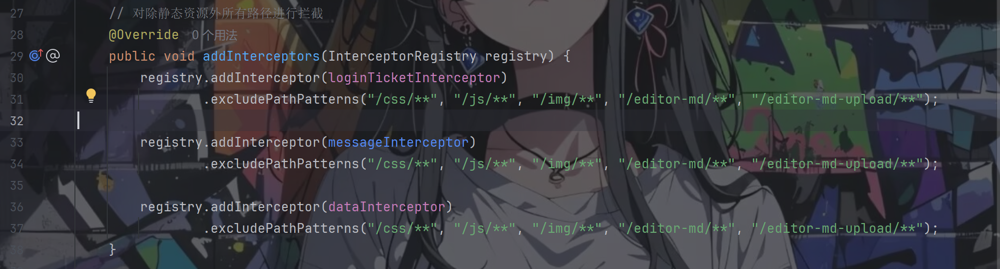

该Interceptor会拦截除了访问静态资源外的所有路径

而该方法只对ticket有值的时候进行鉴权，对于ticket值为null的时候没有进行任何处理，直接返回true，所以我们便可以轻松绕过鉴权了，具体如何使用会配合下面的漏洞进行

## 未授权上传任意文件

位于DiscussPostController.java文件中的uploadMdPic方法

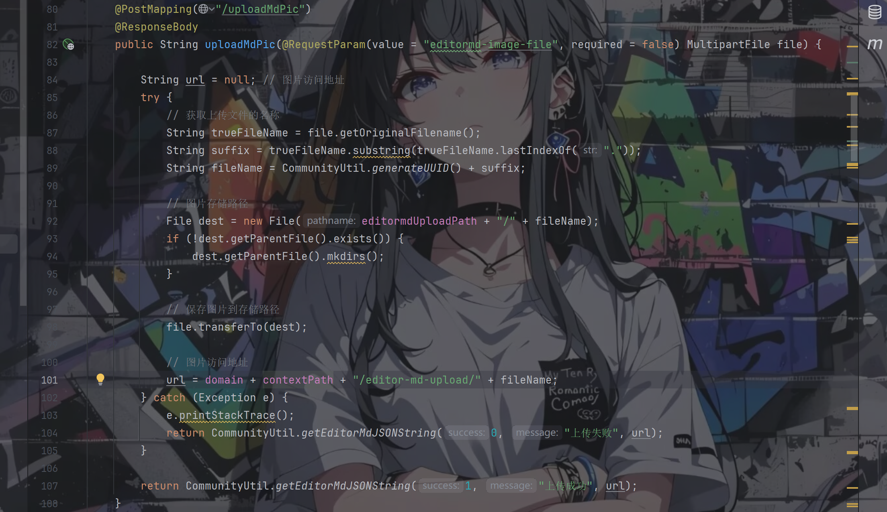

这是一个通过post方法访问的接口，注释说的是拿来上传图片用的，但是看具体代码实现我们发现还是没有对上传的文件内容，后缀名进行任何的检验，也就是说我们可以上传任意文件，当然这功能是得在登录后才能使用的，但我们前面不是发现了一个鉴权绕过嘛，可以直接打配合实现未授权任意文件上传

让ai帮忙生成一个html表单上传文件的报文，然后进行利用

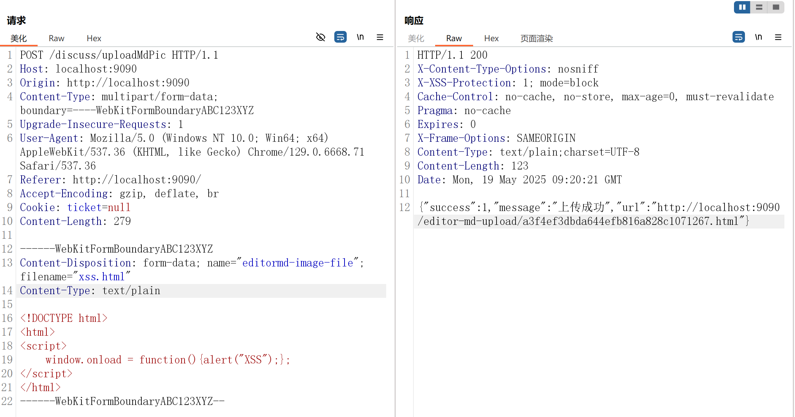

上传成功，访问该链接却报了404，打开hackbar查了一下问题如下：  
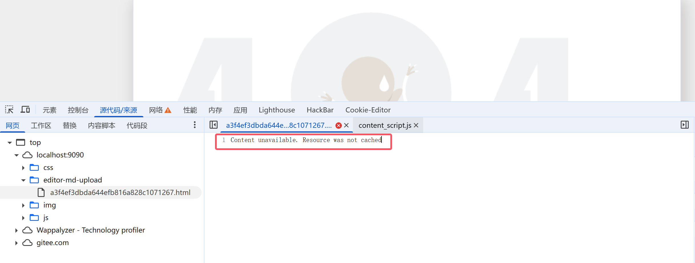

将该报错拿去问了ai，按其提供的方法进行尝试依旧无果，不知道是哪里配置出的问题，但文件是确确实实上传成功了

我们通过application-develop.properties中的配置可以知道上传的文件存储位置

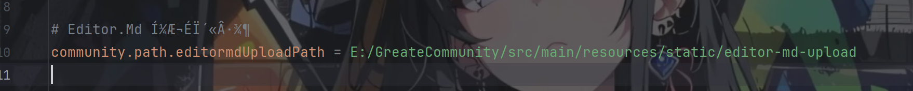

直接点该文件，确认了文件是没有问题的

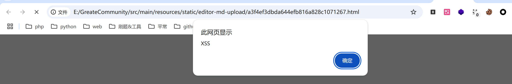

那就很奇怪了。。。

## 未授权各种遍历

UserController.java文件中有好几个方法存在可以说是一模一样的漏洞，第一个是getProfilePage方法

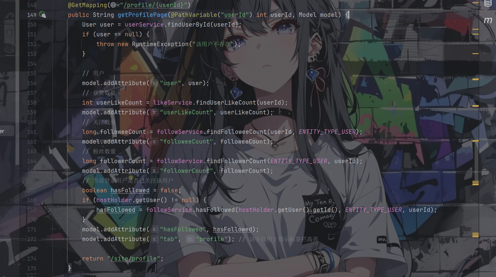

该函数的内容不重要，重点是看上面的链接代码`@GetMapping("/profile/{userId}")`，是根据userId的值来决定要访问的是哪一个用户，但是依然需要我们绕过鉴权，然后我们就可以对该userId的值进行爆破，获取大量信息

来一个例子如下：  
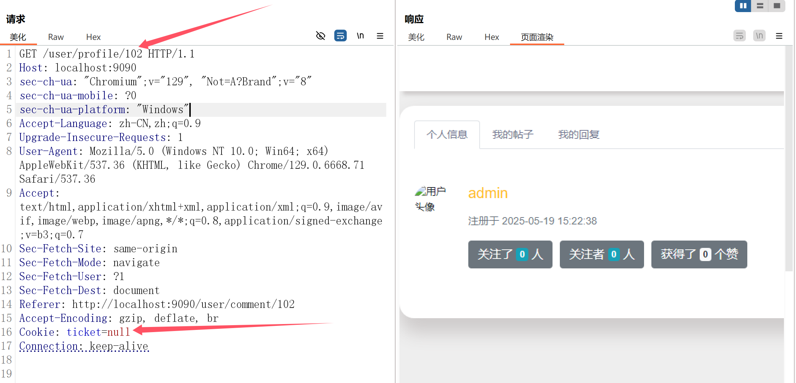

第二个方法是getMyDiscussPosts方法

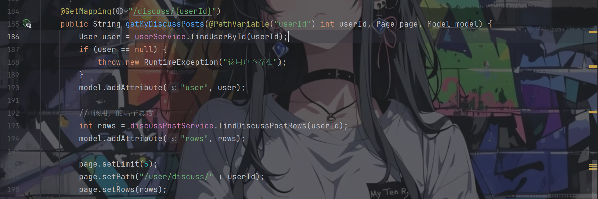

依旧是通过userId来访问每个人发布的帖子，进行利用如下：  
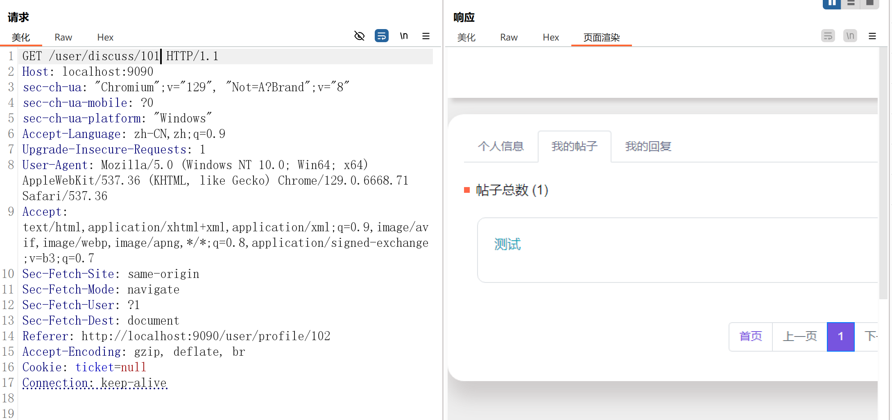

最后一个方法是getMyComments方法

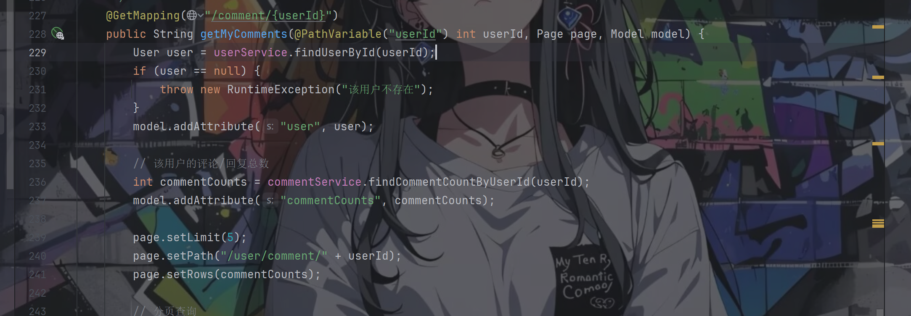

还是通过userId来访问每个人自己的评论/回复，进行利用如下：

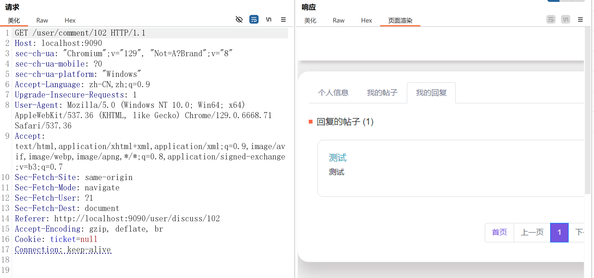

## 碰壁2

是位于DiscussPostController.java文件中的setDelete方法

```
    @PostMapping("/delete")
    @ResponseBody
    public String setDelete(int id) {
        discussPostService.updateStatus(id, 2);

        // 触发删帖事件，通过消息队列更新 Elasticsearch 服务器
        Event event = new Event()
                .setTopic(TOPIC_DELETE)
                .setUserId(hostHolder.getUser().getId())
                .setEntityType(ENTITY_TYPE_POST)
                .setEntityId(id);
        eventProducer.fireEvent(event);

        return CommunityUtil.getJSONString(0);
    }
```

看着似乎是直接post传参id的值然后便可以进行一个删除帖子的操作，尝试一手

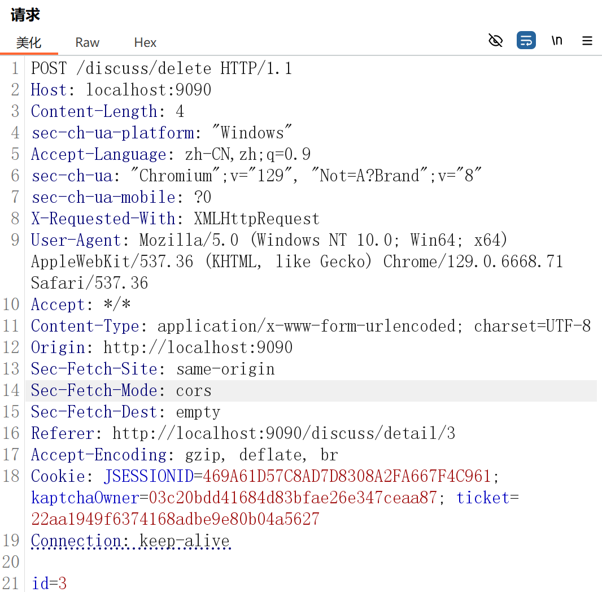

结果是直接跳转到了/denied页面，哦吼？进到具体的帖子里面进行查看，发现没有看到有删帖这个按钮

感觉这个操作是管理员才能做的，全局搜索一下admin

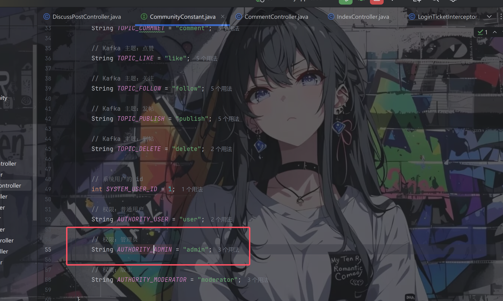

果然是有不同权限的，查看其用法

在SecurityConfig.java文件中的configure方法中定义了每个不同的权限可以访问的路由，而上面的删帖路由便要求必须是admin才可以


再查一下权限是在哪里确定的，位于UserService.java文件中的getAuthorities方法

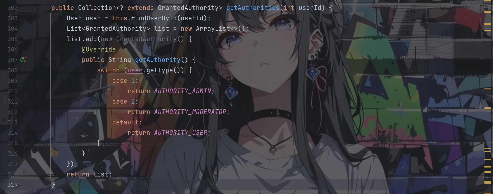

继续查看该方法的调用

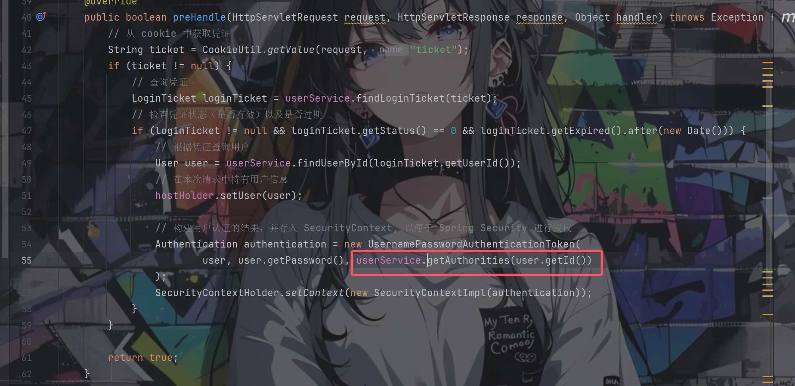

熟悉吧，我们绕过鉴权的方法就注定了我们连普通用户的权限都没有

那为什么上面的漏洞我们可以直接配合绕过鉴权来利用呢，这是因为在SecurityConfig.java文件中的configure方法中定义的所有需要权限的路由上面那几个正好都不包括在其中，又是一个人工失误的地方

# 总结

第一次进行java代码审计，采用了最笨的方法，把全部代码都看了一遍，虽然耗的时间长了些，但是从结果来看还是值得的

当然也有了一些思路了，重点关注controller目录下面的代码，当然还有interceptor目录下面的，毕竟该目录下面的文件作用主要用于拦截用户的请求并做相应的处理，通常应用在权限验证、记录请求信息的日志、判断用户是否登录等功能上，可能存在绕过鉴权等漏洞

# 参考

[JAVA代码审计——Echo4.2]([JAVA代码审计——Echo4.2-先知社区](https://xz.aliyun.com/news/17648))
