# 近期银狐样本的攻击链条分析-先知社区

> **来源**: https://xz.aliyun.com/news/18034  
> **文章ID**: 18034

---

## 前言

最近看到伪装成安装包的银狐样本有点多，想分析一下具体执行流程，整个过程中间文件有点多，简单画个执行流程图，执行到最后就剩下explorer或者rundll32的进程执行被注入的winos远控。

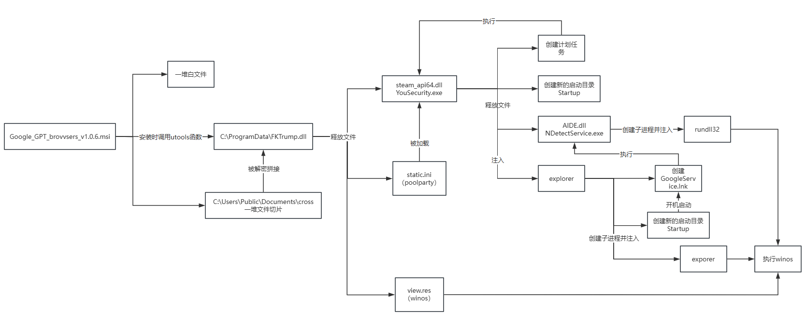

## 详细分析

文件hash：8d180ed42f75c78d0c5170b2ab71be5e

文件名：Google\_GPT\_brovvsers\_v1.0.6.msi，谷歌GPT浏览器安装包说是，还小心机“vv”代替“w”

安装包描述如下图，google写成googe，避免安装了google的机器装不上去。

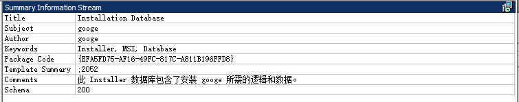

看安装包释放的文件，安装目录下释放一些谷歌浏览器安装包之类的，该安装包属于重打包类型的，在正常的安装包中加料了。

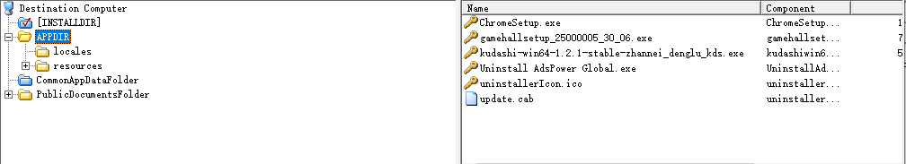

CommonAppDataFolder下的文件就有意思了，单一个dll，就很可疑。

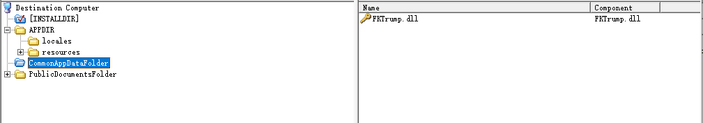

公共目录下释放了一堆相同大小的文件，应该是文件的切片，也很可疑。

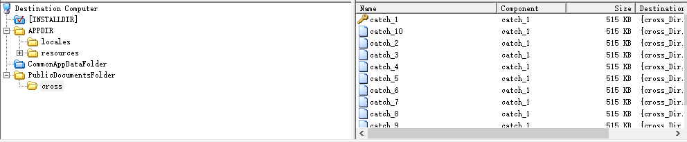

在安装包的action中，发现了FKTrump.dll的调用，在安装过程中调用了导出函数utools。

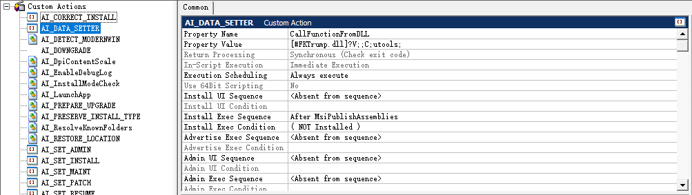

那接下来就分析FKTrump.dll，进入utools的调用中就看到，对公共目录下文件的使用，读取数据后异或解密，将所有数据拼接到cross.dat，该文件是一个压缩包。

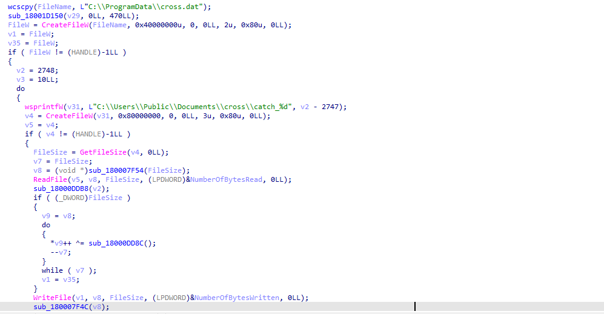

将文件解压到用户目录下tripol\_[时间戳]文件夹中，并执行其中的exe文件。

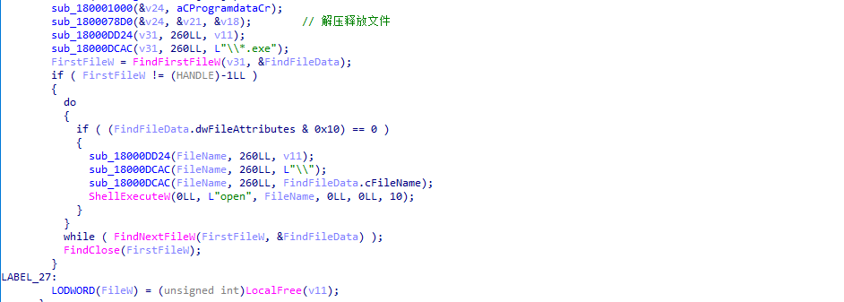

来看看释放的文件，采用白加黑的加载方式，steam\_api64.dll文件超200MB非常可疑。

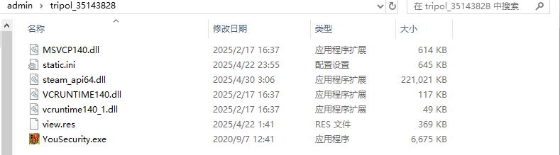

该文件的.data段被无内容数据填充到，使得文件大小达到200MB+，来绕过杀毒软件的静态检测机制。

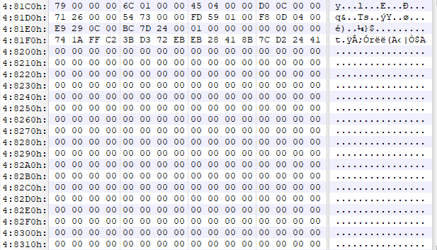

直接拉进ida开始分析，steam\_api64.dll一进去就检测所有进程的可访问内存块中是否以"Ven\_sign"开始，该字符串是进程被注入标志，在后续分析也会提及。

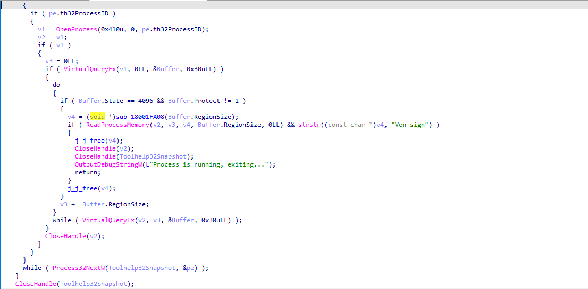

随后就注册权限维持的注册表项，新增了一个启动目录%ProgramData%Venlnk，该目录在后续执行会放置一个lnk文件。

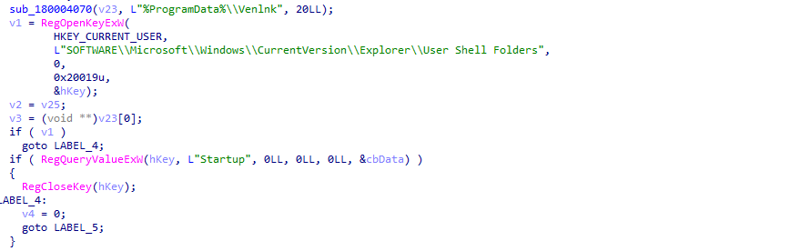

该lnk文件执行的文件是%appdata%HttpNetword\_FixNDetectService.exe，看来后续还会继续释放文件。

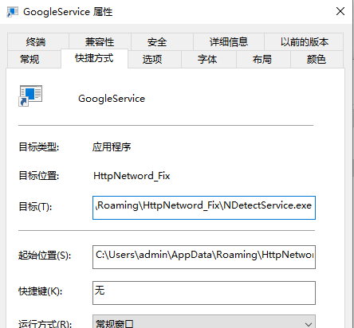

通过检测%appdata%下的文件数量，超过20使用"0E40E0F7-2A4E-4001-A594-2D4CEE075451"，否则使用“HttpNetword\_Fix”。

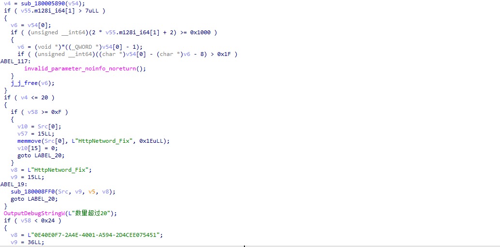

继续释放一个加密压缩包：C:Users[用户名]esource.dat。

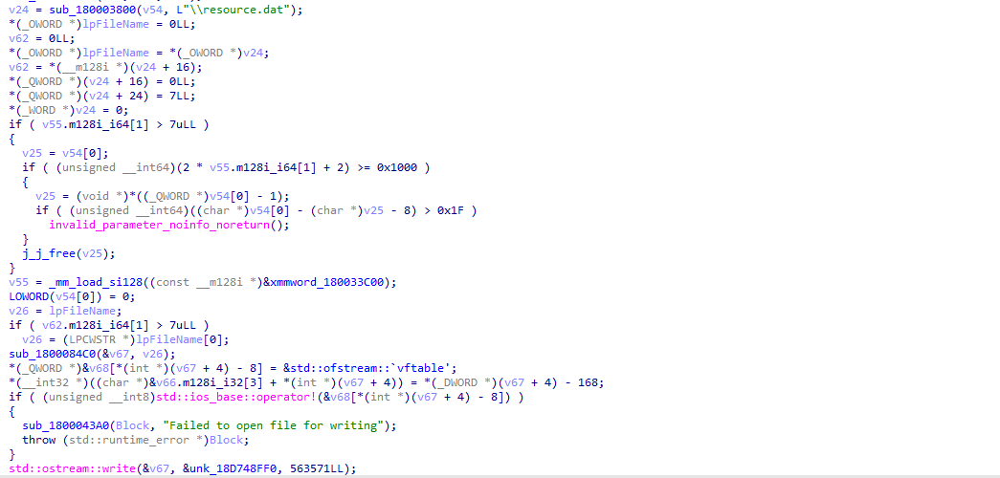

解压resource.dat，密码为：Panzer0。

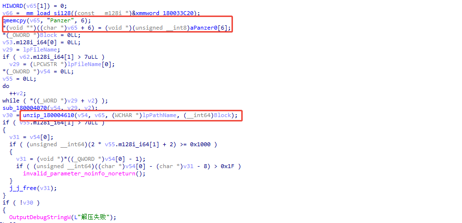

解压得到文件5个文件，是权限维持时执行的文件，设置注册表感染标志，HKEY\_CURRENT\_USERSOFTWAREDeepSer的OpenAi\_Service为维权程序。

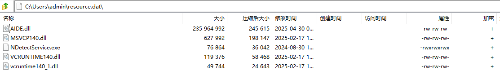

steam\_api64.dll还没执行完，继续分析，设置注册表感染标志，HKEY\_CURRENT\_USERSOFTWAREDeepSer的Onload1为母体。

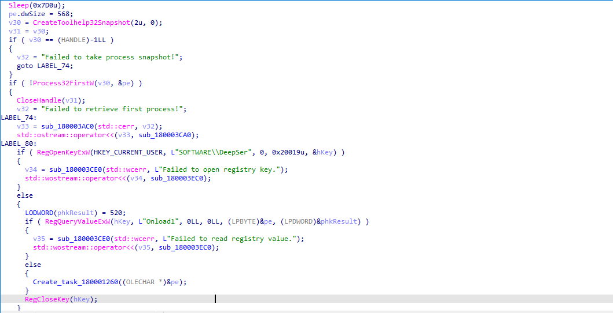

使用com注册计划任务执行银狐母体文件。

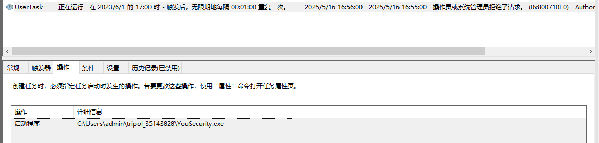

读取文件view.res，从固定偏移处读取shellcode，放置在MyData。

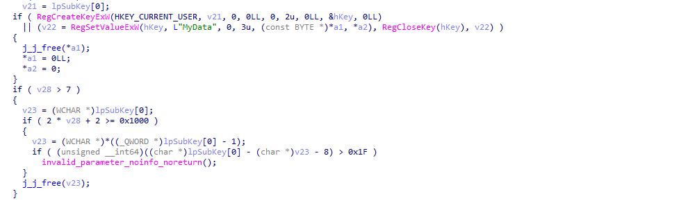

读取文件state.ini，从固定偏移处读取shellcode，state.ini文件起始是png图片数据，仅用来伪装。

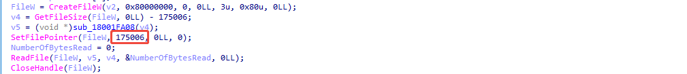

最终设置的注册表数据入下图。

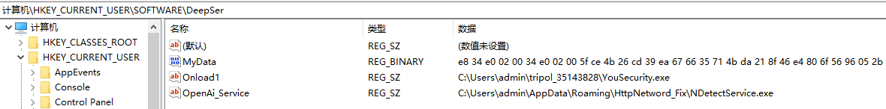

执行shellcode有两种方式，首先是获取执行当前进程模块的起始地址，找到entrypoint，将shellcode覆盖原来的代码，当VirtualProtect调用失败，则直接申请可执行内存，执行shellcode。

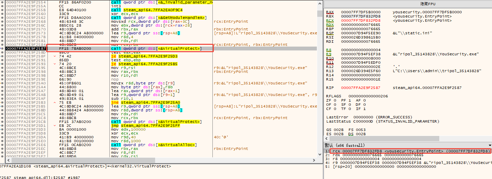

执行的shellcode是donut生成，最终在内存中加载一个pe文件，这个pe是一个poolparty进程注入器，将内置的shellcode注入到explorer.exe进程中。

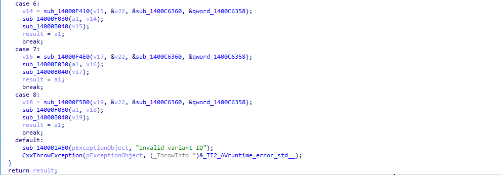

注入的shellcode，依旧是donut生成，加载pe，该pe查询OpenAi\_Service注册表项，获取维权进程路径，使用IShellLinkW com接口创建GoogleService.lnk文件，指向维权进程NDetectService.exe。

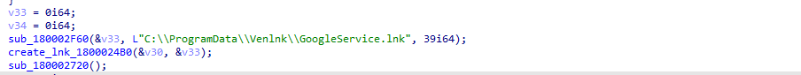

再次设置开机启动目录。

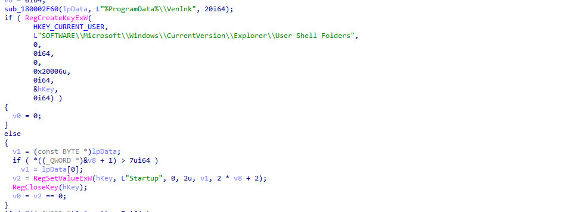

读取MyData（来源steam\_api64.dll读取view.res放置的数据），可以看到在写入shellcode前，先写入了"Ven\_sign"感染标志，注入方式是比较传统的，创建挂起explorer进程，写入shellcode后，设置线程上下文后，唤醒线程，执行shellcode。

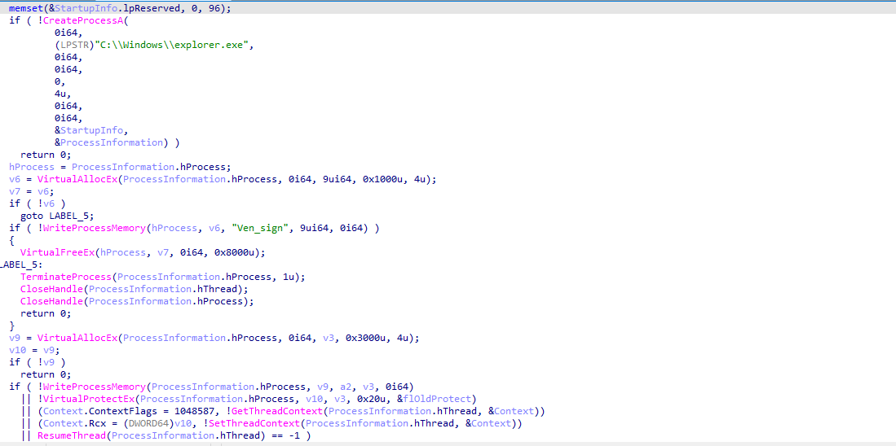

该shellcode也是donut生成，加载核心远控winos。

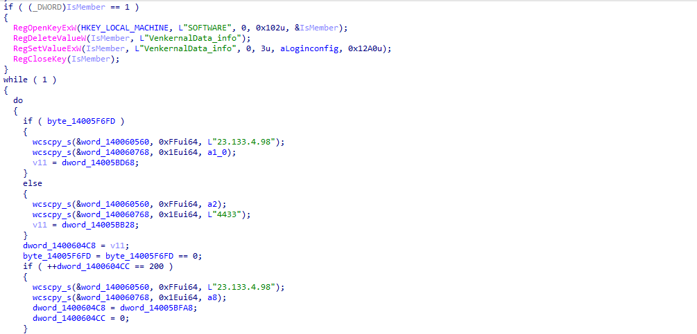

最后看一下，维权程序这里有什么操作，AIDE.dll被增肥到200+MB，不过操作就少了，读取MyData数据。

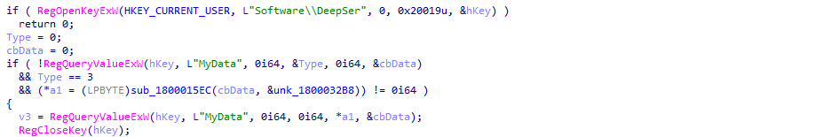

将shellcode注入到rundll32中，手法和注入到explorer一致，这样就把整个执行流程分析完了。

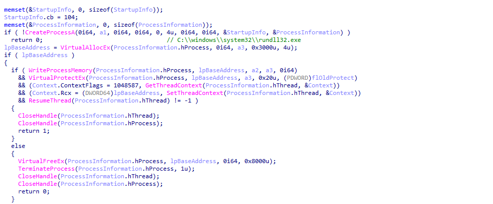

## IOCs

hash：

8d180ed42f75c78d0c5170b2ab71be5e

C2：

23.133.4.98:4433
