# 实战SRC挖掘｜微信小程序渗透漏洞复盘-先知社区

> **来源**: https://xz.aliyun.com/news/18037  
> **文章ID**: 18037

---

## 声明

本文章所分享内容仅用于网络安全技术讨论，切勿用于违法途径，所有渗透都需获取授权，违者后果自行承担，与本号及作者无关，请谨记守法.

​

## 0x1 前言

哈喽，师傅们这次又来给师傅们分享下最近的一个漏洞挖掘的一个过程，这次跟着一个师傅学习，然后自己动手去挖，也是学习到了不了东西。这次要给师傅们分享的案例是一个微信小程序的案例，这个小程序站点存在多个漏洞可以打，其中最主要是知识点就是开始的一个数据包构造，通过分析登录页面的数据包，进行队里面的数据包构造找到一个敏感信息接口，进而泄露了七千多个用户的sfz、xm、sjh等敏感信息。

然后利用这个泄露的接口来进一步漏洞挖掘，扩大危害，其中微信小程序文件上传漏洞还是多的，小程序好多都没什么过滤的，像还有逆天的危险小程序直接没有任何的过滤的也是存在的。这里也是直接打了一个getshell。

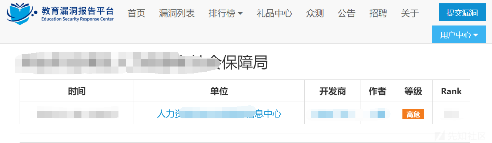

## 0x2 渗透测试

### 一、浅谈

这个EDU的小程序可以直接使用微信一键登录，像我们平常在挖掘微信小程序的时候，经常碰到这样的微信一键登录的功能点，像这样的初衷就是为了方便我们使用，但是越是方便其实对于安全来讲越是不安全的一个过程。

就比如常见的一键微信、手机号登录容易造成泄露SessionKey三要素泄露，下面就分享一个我之前挖的一个小程序的微信一键登录泄露SessionKey三要素的一个漏洞。

可以看到这个数据包直接把SessionKey、iv以及加密字段三个部分全部泄露了

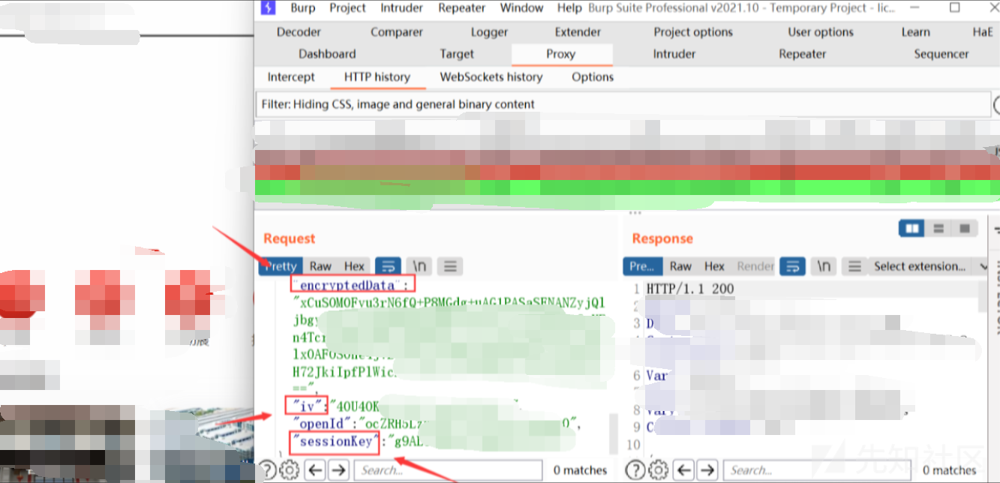

然后再使用Wx\_SessionKey\_crypt这个加解密的工具进行解密，可以看到解密出来开始一键微信登录的手机号

工具下载链接：<https://github.com/mrknow001/wx_sessionkey_decrypt/releases>

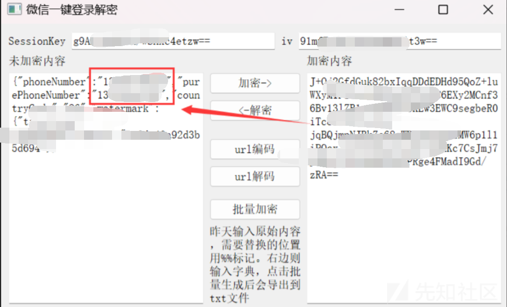

那么我们是不是可以逆向修改手机号然后加密，再去替换，然后放包就可以登录别人的账户了呢

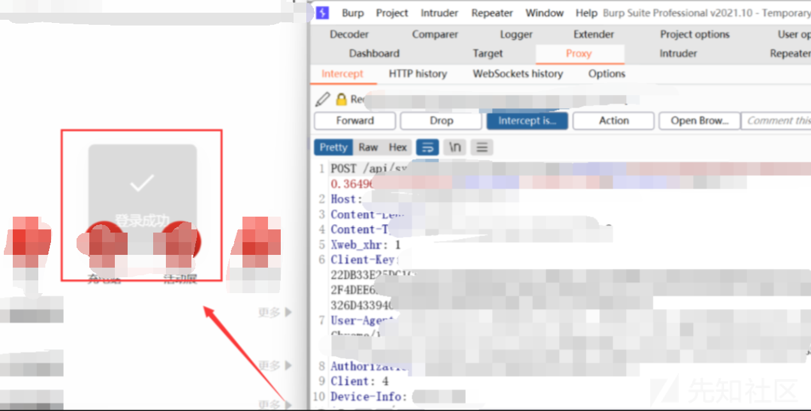

### 二、burpsuit数据包分析

首先通过微信搜索小程序，找到目标

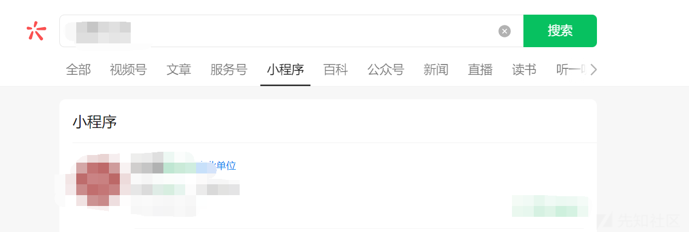

这里就再继续跟大家讲下这个小程序的挖掘过程吧，然后带师傅们一起看看这个数据包

这个数据包相信很多师傅们一眼就可以看出来这个是jeecg框架，这里给师傅们总结下判断jeecg框架特征，最简单的就是看数据包路径关键字，比如/jeecg、/sys、/system等

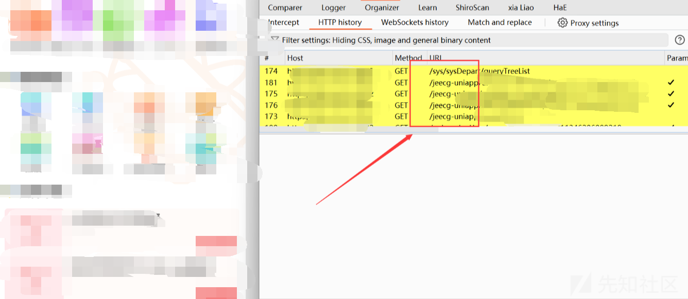

这里看到这个数据包，利用id（这里是我自己登录时候的id）可以回显出一些三要敏感的信息，比如身份证、姓名、手机号等信息

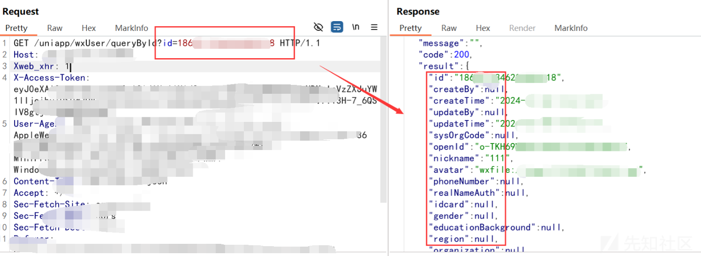

然后我就想，看看开始的历史数据包里面有没有泄露遍历查看id的路径，获取大量的id，然后去遍历，从而获取大量的敏感信息，然后在这个list的接口下面确实查到了很多的id

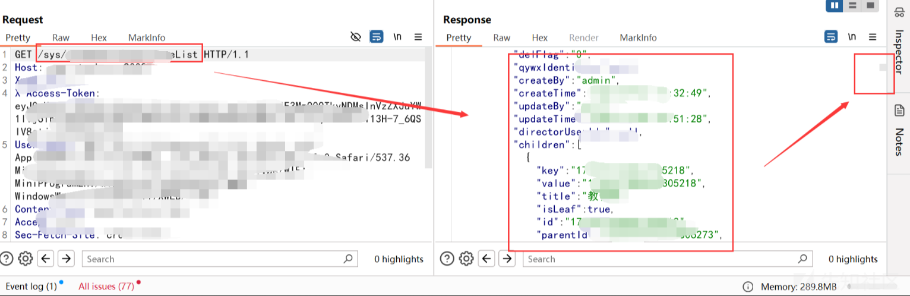

然后我这里就替换到刚才的查询敏感信息的接口，去替换那个id值，但是发现不行，后面才知道这里对X-Access-Token值做了校验，所以这里我们没有权限去访问

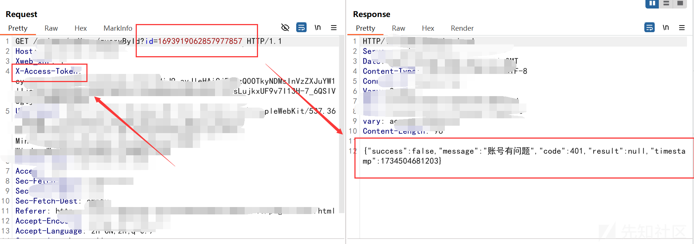

然后这里我开始想爆破这个JWT编码，看看有没有JWT密钥，然后再去构造JWT，再去使用user\_id值，然后去编码，抓包放包去遍历或者尝试登录别人的账户信息。

但是这里我使用无影这个工具没有爆破出来，于是就没有利用成功

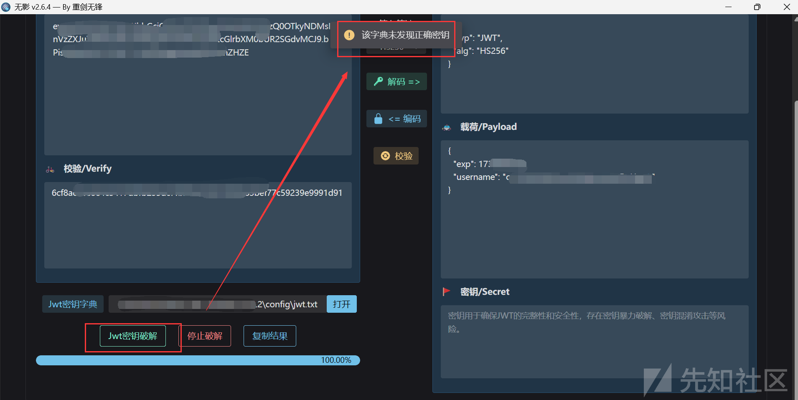

但是这里我给师傅们推荐一篇文章是写JWT伪造实战小程序漏洞案例的文章，写的蛮不错的

[一次完整的Jwt伪造漏洞实战案例 https://mp.weixin.qq.com/s/ITVFuQpA8OCIRj4wW-peAA](https://mp.weixin.qq.com/s/ITVFuQpA8OCIRj4wW-peAA)

### 三、峰回路转

后来我又是回到了原始的页面那几个数据包中，对这几个数据包中的路径进行了一个分析，发现list参数好像都是进行一个数据汇总查看，那么我们上面的数据包通过修改id不成功，那么我们可不可以尝试使用修改接口参数，修改成list的，来进行一个未授权数据访问呢

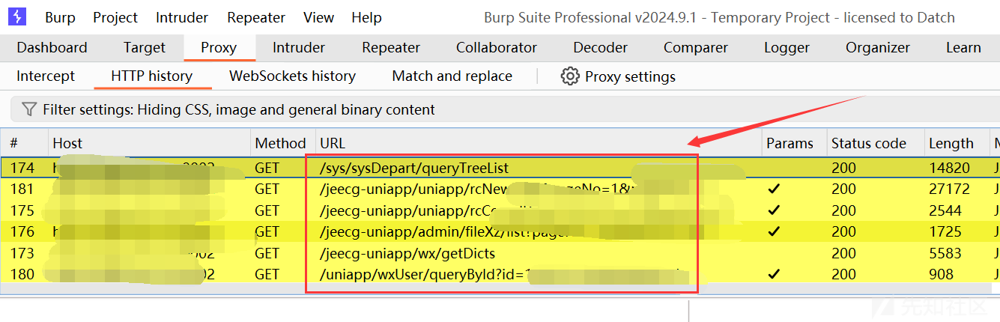

开始是把id参数和后面的先删掉，然后发现不行，后面再把后面添加list参数发现还是不行

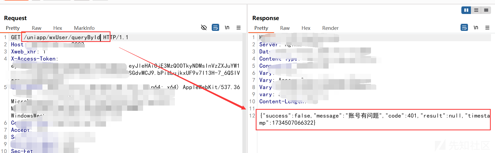

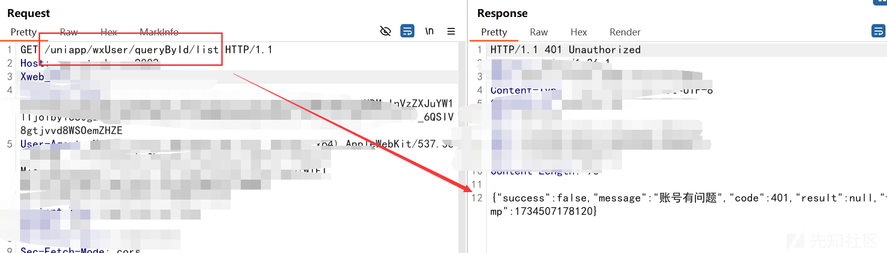

后来我就直接把前面的queryById参数删掉，再在后面添加list参数，从而就可以未授权访问敏感信息了

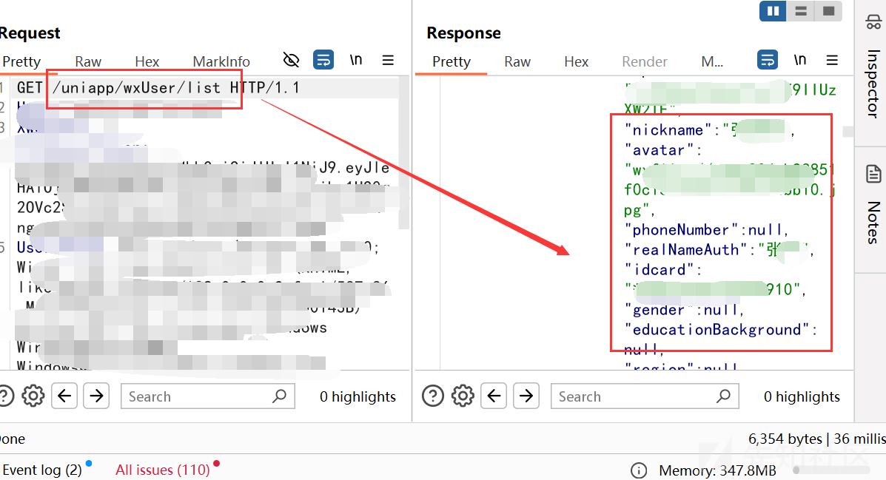

且泄露的用户数据总共有7802条

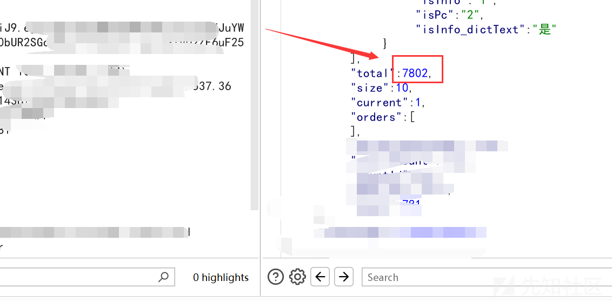

这里再构造接口`list?pageNo=1&pageSize=7802`，就可以看到所有的敏感用户信息了

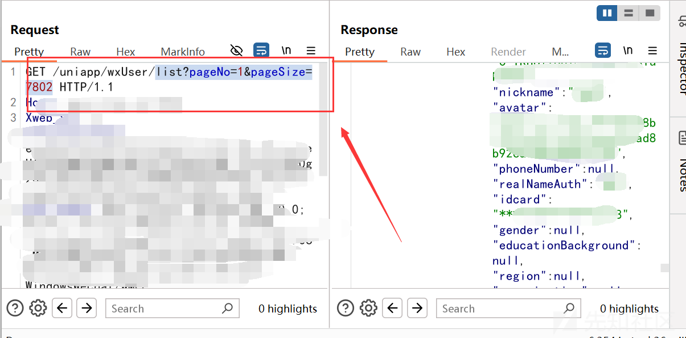

### 四、再次突破

这里碰到了idPhotoF和idPhotoZ参数，这两个参数我之前也是碰到过，在很多的招聘平台遇到过，就是需要我们认证信息，上次个人身份证正反面

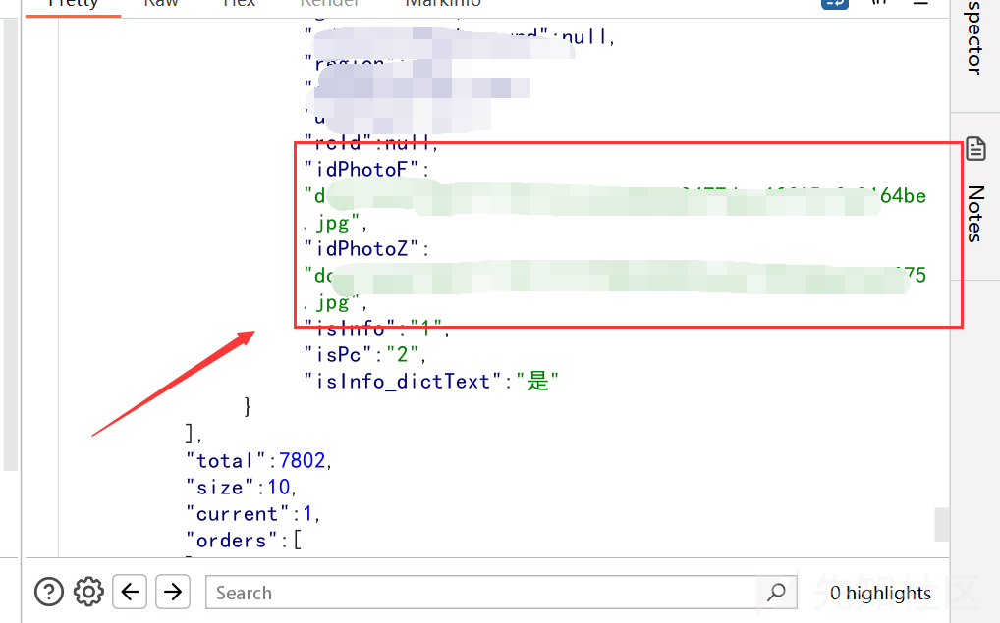

我们正常思路就是知道这个照片的路径，就直接拼接数据包的host域名，但是这里并没有成功,spring-boot的报错页面，碰到这个师傅们也可以考虑使用曾哥的spring文件泄露扫描工具扫

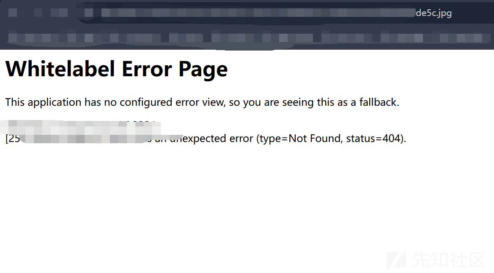

那么我们就得判断是不是路径的问题，那么我们怎么去找正确的文件存储的位置呢，下面就刚好看到了文件下载的功能点，点击尝试下载，然后看看数据包里面文件路径

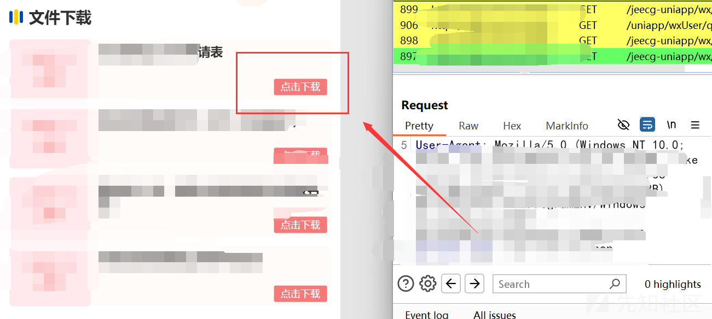

可以看到这个路径确实在数据包中，那么我们就可以把路径拼接在这里尝试下，看看能不能有照片回显

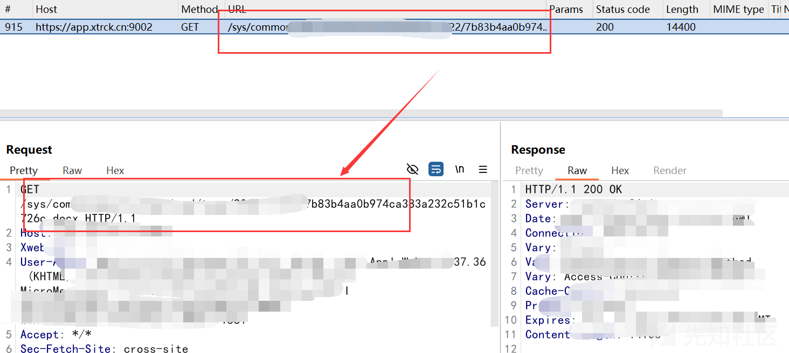

这里直接拼接/download路径，直接可以回显图片成功

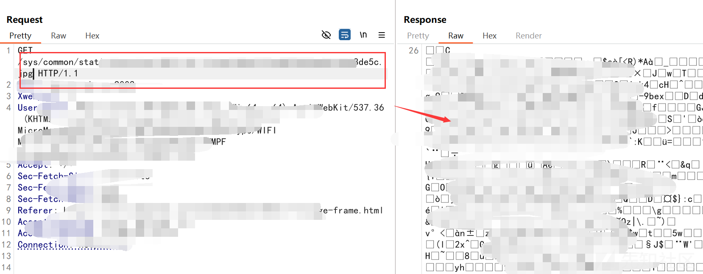

直接可以在浏览器拼接host访问得到身份证正面照片


我们这里总共有7806张身份证正面照片的url路径，这里我们就可以写个python脚本，把他们从数据包中爬取出来，然后再自动拼接到host域名上，python脚本如下：

```
import json

# 假设你已经获取到了JSON数据，这里我们直接使用你提供的JSON数据
json_data = '''数据包内容'''

# 解析JSON数据
data = json.loads(json_data)

# 基础URL
base_url = "https://host/路径"

# 遍历每个用户，拼接URL并打印
for user in data:
    id_photo_f = user.get("idPhotoF")
    if id_photo_f:
        full_url = base_url + id_photo_f
        print(full_url)
```

### 五、文件上传漏洞

然后这里在测试在线申请功能点的时候，这里需要我们实名认证上传身份证照片

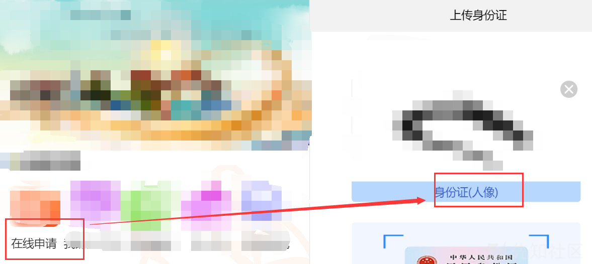

像碰到这样的文件上传功能点肯定得测试下文件上传，看看有没有什么过滤，试试打文件上传getshell，差点也可以尝试打个存储型XSS漏洞

这里先尝试打个XSS漏洞，看看有没有过滤，发现没有，且可以成功解析弹窗XSS漏洞

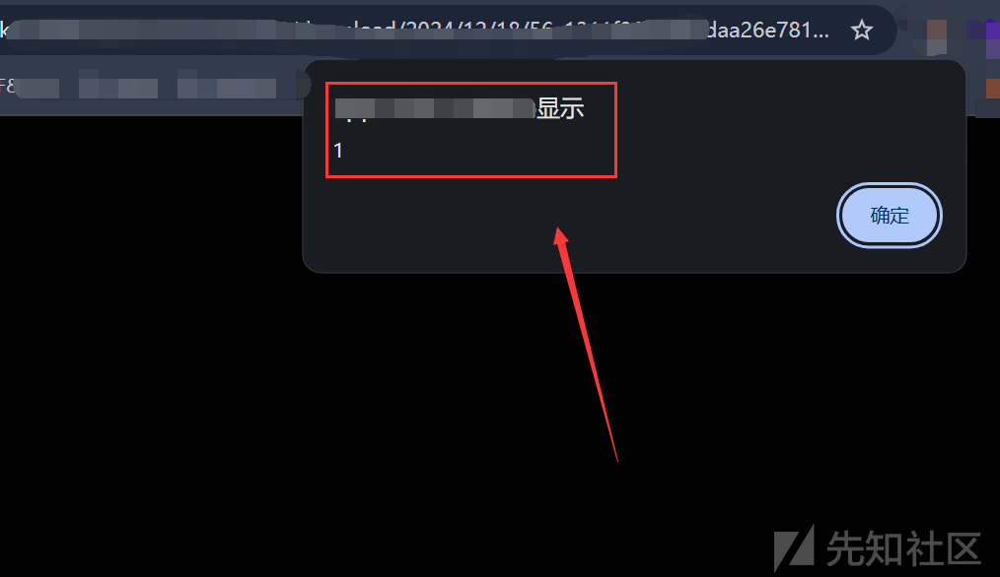

那么下面我们就可以尝试上传木马，然后进行打下getshell，传马之前，我们得先看这个站点是什么语言写的，使用插件看到是php语言写的网站

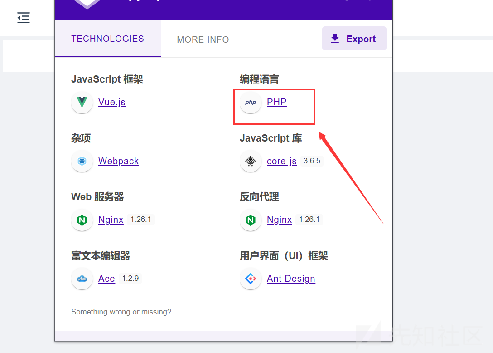

但是这里过滤了php，但是没有过滤phtml，且可以成功解析

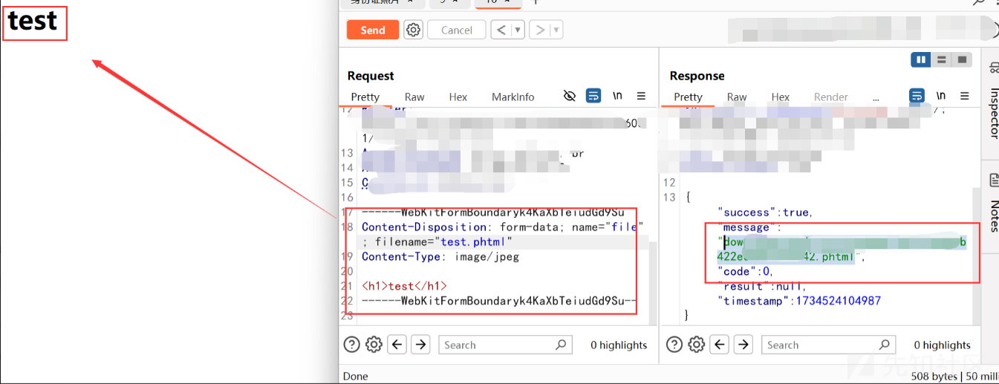

这里我直接打一个phpinfo页面，证明下危害即可

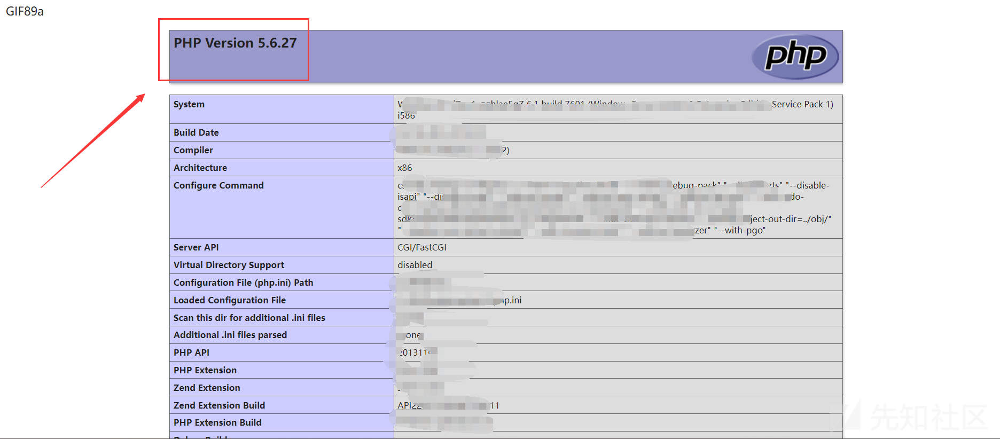

### 六、越权

这里我们使用微信一键登录的时候并没有进行实名认证，所以点击下面的功能点的时候都会弹窗，需要我们进行实名认证

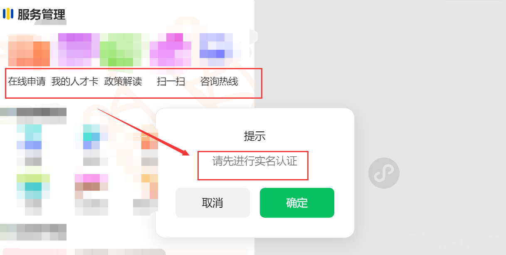

那么这里我就在想，要是登录别人的账户是不是就可以使用这些功能，且可以看到别人的信息了，而且在开始登录的数据包构造路径中，我们拿到了好多用户的登录用户数据信息

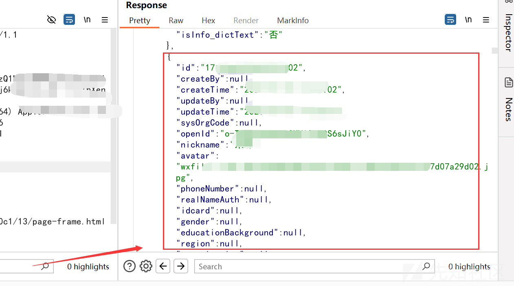

下面我们先退回登录界面，然后使用bp抓登录包，然后修改用户登录信息，用我们刚开始收集到的用户信息，进行数据包替换，然后看看能不能成功登录别人的账户

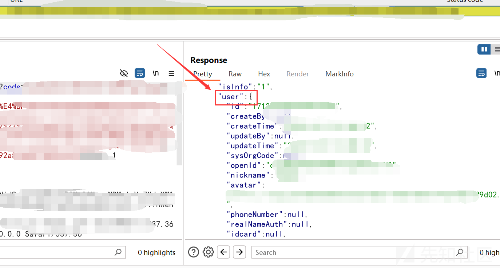

可以看到我们这里直接就可以替换成功用户数据包，从而越权到别人的账户，从而打了一个水平越权漏洞

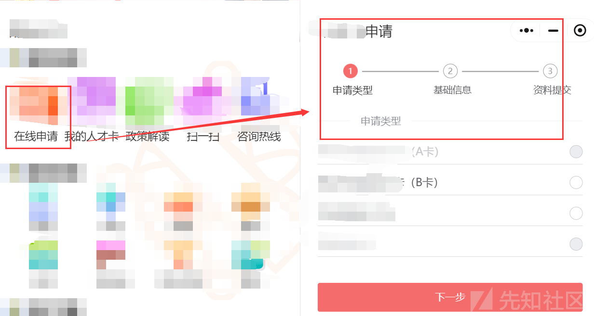

既然可以水平越权，那么我们是不是可以尝试下找到admin管理员权限的用户user数据，然后进行替换越权登录呢，下面就来找下，发现确实存在admin管理员权限的用户，然后就是按照上面的越权方式就可以成功登录到管理员的用户了

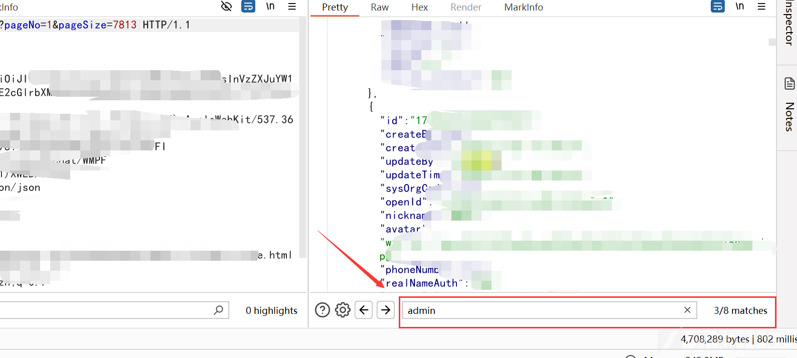

## 0x3 总结

这里给师傅们总结下我们在进行漏洞挖掘过程中需要注意的细节，比如我们在看到一个功能点多个数据包的时候，我们需要去挨个分析里面的数据包构造，进而分析数据包的走向，去了解数据包的一个业务逻辑，特别是微信小程序，因为它本来就是程序简单，所以对于防御和一些过滤来讲，并没有特别的难，甚至就比如这个小程序都可以文件上传直接getshell了。

到这里这篇文章就结束了，上面的漏洞案例就是给师傅们分享到这里了，还希望自己写的文章队师傅们有帮助哈！祝愿师傅们多挖洞，多过漏洞！

​

**文章中涉及的敏感信息均已做打码处理，文章仅做经验分享用途，切勿当真，未授权的攻击属于非法行为！文章中敏感信息均已做多层打码处理。传播、利用本文章所提供的信息而造成的任何直接或者间接的后果及损失，均由使用者本人负责，作者不为此承担任何责任，一旦造成后果请自行承担。**
