# 2025 ISCC练武区域赛、决赛RE+MOBILE 详解 合集-先知社区

> **来源**: https://xz.aliyun.com/news/18039  
> **文章ID**: 18039

---

### faze

和校赛是一样的，把断点下在最后if语句的判断，直接动调运行到这，然后找flag

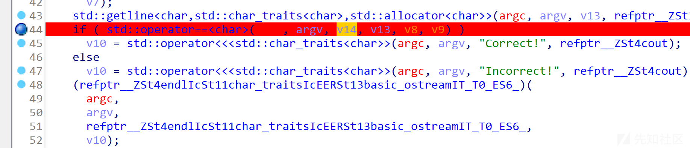

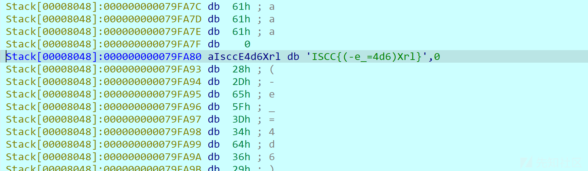

**ISCC{(-e\_=4d6)Xrl}**

### SecretGrid

下载拿到附件运行发现缺个库，只能上网找了个对应的库才能正常运行

main函数

```
// local variable allocation has failed, the output may be wrong!
int __fastcall main(int argc, const char **argv, const char **envp)
{
  FILE *key; // rax
  int n4; // [rsp+2Ch] [rbp-4h]

  _main(*(_QWORD *)&argc, argv, envp);
  puts("Please submit your key:");
  key = __acrt_iob_func(0);
  fgets(&net, 82, key);
  if ( (int)checklist1() > 8 )
  {
    n4 = checklist2();
    printf("
getting score: %i/10.
", (unsigned int)n4);
    if ( n4 > 4 )
    {
      puts("Come on! You almost get the flag!:");
      printflag();
      getchar();
    }
    else
    {
      puts("FAIL!");
    }
  }
  else
  {
    puts("Invalid format.");
    getchar();
  }
  getchar();
  return 0;
}
```

先是输入一个9\*9大小的矩阵，然后进入**checklist1**函数。

```
__int64 checklist1()
{
  int v1[256]; // [rsp+20h] [rbp-60h] BYREF
  int n0x7FFFFFF; // [rsp+420h] [rbp+3A0h]
  int n255; // [rsp+424h] [rbp+3A4h]
  unsigned int v4; // [rsp+428h] [rbp+3A8h]
  int n80; // [rsp+42Ch] [rbp+3ACh]

  memset(v1, 0, sizeof(v1));
  n0x7FFFFFF = 0x7FFFFFF;
  for ( n80 = 0; n80 <= 80; ++n80 )
    v1[*(&net + n80)] |= sper[n80];
  v4 = 0;
  for ( n255 = 0; n255 <= 255; ++n255 )
  {
    if ( n0x7FFFFFF == v1[n255] )
      ++v4;
  }
  return v4;
}
```

根据伪代码中该函数的返回值需要大于8，再结合ai的辅助分析结果，这应该是一种类似数独的情况，然后尝试输入随机的数独，发现可以过。

接下来就是**checklist2**函数，这个函数的大体逻辑是对矩阵中每一位的上下左右、左上、左下、右上、右下八个方向查找指定的单词，函数返回值就是找到指定单词的次数，大于4即可过这个check，具体单词为

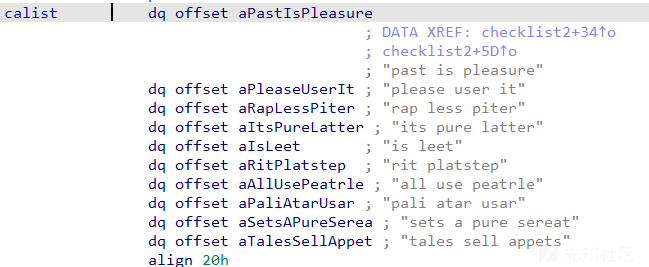

可以用z3约束爆破

```
from z3 import *

z = Solver()
g = [[Int(f'x_{i}_{j}') for j in range(9)] for i in range(9)]

for i in range(9):
    for j in range(9):
        z.add(g[i][j] >= 0, g[i][j] <= 8)

for r in g:
    z.add(Distinct(r))

for c in zip(*g):
    z.add(Distinct(c))

for i in 0, 3, 6:
    for j in 0, 3, 6:
        z.add(Distinct([g[x][y] for x in range(i, i + 3) for y in range(j, j + 3)]))

d = [(0, 1), (0, -1), (1, 0), (-1, 0), (1, 1), (1, -1), (-1, 1), (-1, -1)]

w = [
    ["past", "is", "pleasure"],
    ["please", "user", "it"],
    ["rap", "less", "piter"],
    ["its", "pure", "latter"],
    ["is", "leet"],
    ["rit", "platstep"],
    ["all", "use", "peatrle"],
    ["pali", "atar", "usar"],
    ["sets", "a", "pure", "sereat"],
    ["tales", "sell", "appets"]
]

def t(s):
    return [m[c] for c in s.lower()]

def f1(s):
    a = t(s)
    n = len(a)
    r = []
    for dx, dy in d:
        for i in range(9):
            for j in range(9):
                if 0 <= i + (n - 1) * dx < 9 and 0 <= j + (n - 1) * dy < 9:
                    fwd = And([g[i + k * dx][j + k * dy] == a[k] for k in range(n)])
                    bwd = And([g[i + k * dx][j + k * dy] == a[::-1][k] for k in range(n)])
                    r.append(Or(fwd, bwd))
    return Or(r) if r else BoolVal(False)

m = {'a': 0, 'e': 1, 'i': 2, 'l': 3, 'p': 4, 'r': 5, 's': 6, 't': 7, 'u': 8}
rm = {v: k for k, v in m.items()}

ec = []
for entry in w:
    ec.append(And([f1(s) for s in entry]))

z.add(Sum([If(e, 1, 0) for e in ec]) >= 5)

if z.check() == sat:
    print("Found solution:")
    mdl = z.model()
    res = [[mdl.evaluate(g[i][j]).as_long() for j in range(9)] for i in range(9)]
    grid = [[rm[c] for c in row] for row in res]
    for row in grid:
        print(''.join(row).lower())
else:
    print("No solution found")
```

**ilterupaseuapslirtrsptialuepalitresutrsupealiueialsrtplteruispasiulapteraprsetuil**

完了运行程序，过了两次check，输出了一个flag，是假的，也怪不得main函数里输出You almost get the flag!

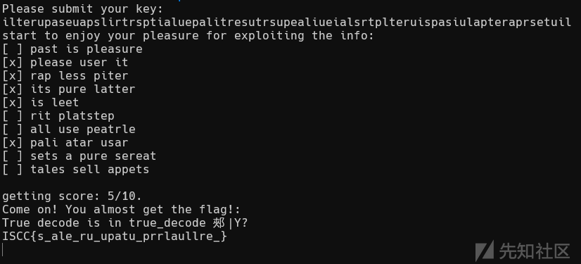

但是缺提示了True decode is in true\_decode。

```
char *__fastcall decode(__int64 a1)
{
  __int64 v2[12]; // [rsp+20h] [rbp-60h] BYREF
  char Destination[32]; // [rsp+80h] [rbp+0h] BYREF
  int n31; // [rsp+A0h] [rbp+20h]
  int n118; // [rsp+A4h] [rbp+24h]
  int n48; // [rsp+A8h] [rbp+28h]
  int n39; // [rsp+ACh] [rbp+2Ch]
  int n73; // [rsp+B0h] [rbp+30h]
  int n78; // [rsp+B4h] [rbp+34h]
  int n54; // [rsp+B8h] [rbp+38h]
  int n43; // [rsp+BCh] [rbp+3Ch]
  int n8; // [rsp+C0h] [rbp+40h]
  int n14; // [rsp+C4h] [rbp+44h]
  int n81; // [rsp+C8h] [rbp+48h]
  int n54_1; // [rsp+CCh] [rbp+4Ch]
  int n2; // [rsp+D0h] [rbp+50h]
  int n58; // [rsp+D4h] [rbp+54h]
  int n84; // [rsp+D8h] [rbp+58h]
  int n4; // [rsp+DCh] [rbp+5Ch]
  int n40; // [rsp+E0h] [rbp+60h]
  int n25; // [rsp+E4h] [rbp+64h]
  int n22; // [rsp+E8h] [rbp+68h]
  int n22_1; // [rsp+ECh] [rbp+6Ch]
  int n34; // [rsp+F0h] [rbp+70h]
  int n17; // [rsp+F4h] [rbp+74h]
  int n31_1; // [rsp+F8h] [rbp+78h]
  int n5; // [rsp+FCh] [rbp+7Ch]
  int n26; // [rsp+100h] [rbp+80h]
  int n5_1; // [rsp+104h] [rbp+84h]
  int n90; // [rsp+108h] [rbp+88h]
  int n36; // [rsp+10Ch] [rbp+8Ch]
  int n61; // [rsp+110h] [rbp+90h]
  int n61_1; // [rsp+114h] [rbp+94h]
  int n28; // [rsp+118h] [rbp+98h]

  n31 = 31;
  n118 = 118;
  n48 = 48;
  n39 = 39;
  n73 = 73;
  n78 = 78;
  n54 = 54;
  n43 = 43;
  n8 = 8;
  n14 = 14;
  n81 = 81;
  n54_1 = 54;
  n2 = 2;
  n58 = 58;
  n84 = 84;
  n4 = 4;
  n40 = 40;
  n25 = 25;
  n22 = 22;
  n22_1 = 22;
  n34 = 34;
  n17 = 17;
  n31_1 = 31;
  n5 = 5;
  n26 = 26;
  n5_1 = 5;
  n90 = 90;
  n36 = 36;
  n61 = 61;
  n61_1 = 61;
  n28 = 28;
  strcpy(result_0, "ISCC{");
  strncpy(Destination, (const char *)(a1 + 15), 0x1Aui64);
  Destination[26] = 0;
  strcat(result_0, Destination);
  v2[0] = (__int64)"S123050C9421FFD093E1002C7C3F0B78907F000C909F000839200000913F001E4800012C7E";
  v2[1] = (__int64)"S123052C813F001E552907FE2F890000409E0058813F001E815F000C7D2A4A1489290000FF";
  v2[2] = (__int64)"S123054C7D2A07743D20100281090018813F001E7D284A1489290000392900025529063EC7";
  v2[3] = (__int64)"S123056C7D2907747D494A787D280774813F001E815F00087D2A4A14550A063E9949000074";
  v2[4] = (__int64)"S123058C480000BC815F001E3D205555612955567D0A48967D49FE707D2940501D29000317";
  v2[5] = (__int64)"S12305AC7D2950502F890000409E0058813F001E815F000C7D2A4A14892900007D2A077476";
  v2[6] = (__int64)"S12305CC3D20100281090018813F001E7D284A1489290000392900055529063E7D2907743F";
  v2[7] = (__int64)"S12305EC7D494A787D280774813F001E815F00087D2A4A14550A063E99490000480000408D";
  v2[8] = (__int64)"S123060C813F001E815F000C7D2A4A14890900003D20100281490018813F001E7D2A4A145A";
  v2[9] = (__int64)"S123062C89490000813F001E80FF00087D274A147D0A5278554A063E99490000813F001EA1";
  v2[10] = (__int64)"S123064C39290001913F001E813F001E2F89001E409DFED0813F00083929001F3940000040";
  v2[11] = (__int64)"S11B066C9949000060000000397F003083EBFFFC7D615B784E80002060";
  printf("True decode is in true_decode %s
", (const char *)v2);
  return result_0;
}
```

有一段S123 开头的，看起来是**Motorola S-record格式**。上网查了下，是一种表示机器码的ASCII格式（常见于嵌入式固件）。

```
import binascii

srec = [
    "S123050C9421FFD093E1002C7C3F0B78907F000C909F000839200000913F001E4800012C7E",
    "S123052C813F001E552907FE2F890000409E0058813F001E815F000C7D2A4A1489290000FF",
    "S123054C7D2A07743D20100281090018813F001E7D284A1489290000392900025529063EC7",
    "S123056C7D2907747D494A787D280774813F001E815F00087D2A4A14550A063E9949000074",
    "S123058C480000BC815F001E3D205555612955567D0A48967D49FE707D2940501D29000317",
    "S12305AC7D2950502F890000409E0058813F001E815F000C7D2A4A14892900007D2A077476",
    "S12305CC3D20100281090018813F001E7D284A1489290000392900055529063E7D2907743F",
    "S12305EC7D494A787D280774813F001E815F00087D2A4A14550A063E99490000480000408D",
    "S123060C813F001E815F000C7D2A4A14890900003D20100281490018813F001E7D2A4A145A",
    "S123062C89490000813F001E80FF00087D274A147D0A5278554A063E99490000813F001EA1",
    "S123064C39290001913F001E813F001E2F89001E409DFED0813F00083929001F3940000040",
    "S11B066C9949000060000000397F003083EBFFFC7D615B784E80002060"
]

f = open("output.bin", "wb")
for r in srec:
    if r[1:2] == "1":
        cnt = int(r[2:4], 16)
        addr = int(r[4:8], 16)
        data = r[8:8 + (cnt - 3) * 2]
        b = binascii.unhexlify(data)
        f.seek(addr)
        f.write(b)
f.close()
```

将这段多个 S-record 格式的记录转换成二进制文件，然后ida分析。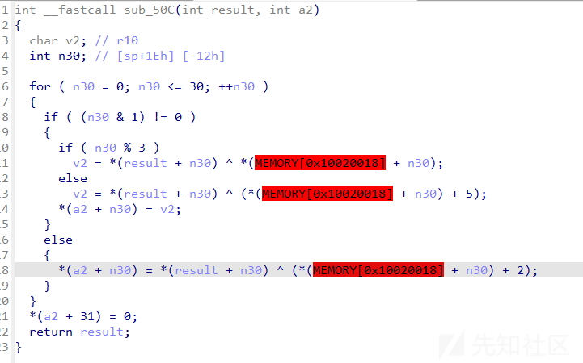

爆红的是key，也就是前面输出的假flag，result是在decode函数里看到的那串三十位的数据

```
key = list("ISCC{s_ale_ru_upatu_prrlaullre_}")
enc = [
    31, 118, 48, 39, 73, 78, 54, 43, 8, 14,
    81, 54, 2, 58, 84, 4, 40, 25, 22, 22,
    34, 17, 31, 5, 26, 5, 90, 36, 61, 61
]
flag = []

for i in range(30):
    if (i & 1) == 0:
        flag.append(chr(enc[i] ^ (ord(key[i]) + 2)))
    elif i % 3 == 0:
        flag.append(chr(enc[i] ^ (ord(key[i]) + 5)))
    else:
        flag.append(chr(enc[i] ^ ord(key[i])))

print("".join(flag))
```

输出结果加上ISCC{}

**ISCC{T%uo4=WJfd0Due#qKmaIPfkiyp4UIX}**

### greet

rust题...

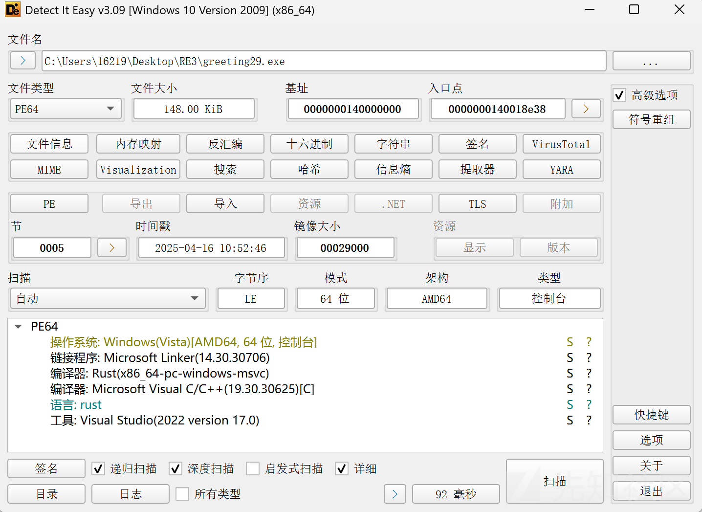

高亮的就是密文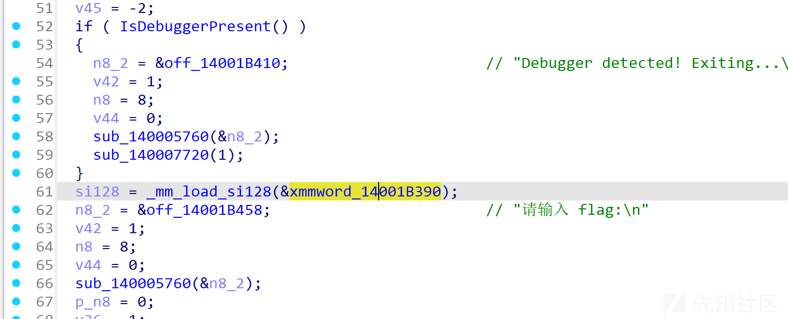

以下就是flag的加密逻辑

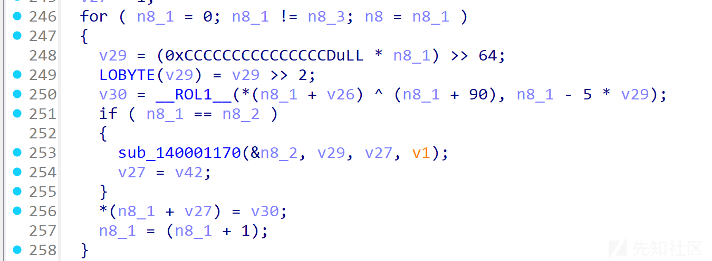

就是一个循环左移，但是每次循环左移的位数在变，可以动调看v29的值的变化规律就好了，直接写脚本逆

```
enc = [0x13, 0x10, 0x7C, 0xF0, 0x52, 0x67, 0x52, 0xCC, 0x79, 0x55, 0x0C, 0x48, 0x59, 0x00, 0xA0, 0x14]
for i in range(len(enc)):
    tmp = ((enc[i] >> (i % 5)) | (enc[i] << (8 - i % 5))) & 0xff
    tmp = tmp ^ (90 + i)
    print(chr(tmp),end="")
```

**ISCC{8IRM6hA0gb}**

### 有趣的小游戏

拿到附件，先运行了一下程序，确实是个小游戏，经典maze考点，但是C的位置是随机的，并且迷宫很明显有走不通的地方。

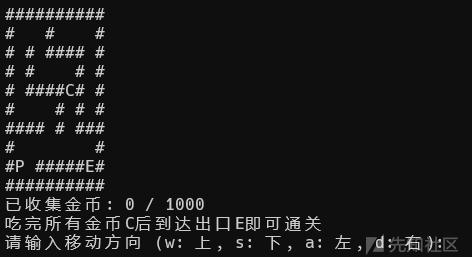

ida开始分析

```
// local variable allocation has failed, the output may be wrong!
int __fastcall main(int argc, const char **argv, const char **envp)
{
  __int64 v3; // rax
  __int64 v4; // rax
  __int64 v5; // rax
  __int64 v7[3]; // [rsp+20h] [rbp-60h] BYREF
  char v8; // [rsp+3Fh] [rbp-41h] BYREF
  char v9[96]; // [rsp+40h] [rbp-40h] BYREF
  char v10[32]; // [rsp+A0h] [rbp+20h] BYREF
  int enc[31]; // [rsp+C0h] [rbp+40h] BYREF
  char v12; // [rsp+13Fh] [rbp+BFh] BYREF
  char v13[48]; // [rsp+140h] [rbp+C0h] BYREF

  sub_40B270(*&argc, argv, envp);
  enc[0] = 450832162;
  enc[1] = 1826182332;
  enc[2] = -829148630;
  enc[3] = -1384203487;
  enc[4] = 964015053;
  enc[5] = 754513717;
  enc[6] = 2106422768;
  enc[7] = -1367225909;
  enc[8] = 1884152479;
  enc[9] = -2089835627;
  enc[10] = 1017917579;
  enc[11] = 1642323169;
  enc[12] = 454050441;
  enc[13] = -1057867338;
  enc[14] = 1929533573;
  enc[15] = 1252498573;
  enc[16] = 758205222;
  enc[17] = 24937351;
  enc[18] = 763299218;
  enc[19] = 1357881007;
  enc[20] = -1849691646;
  enc[21] = 1377080289;
  enc[22] = -466398391;
  enc[23] = -1430013052;
  enc[24] = -1956333485;
  enc[25] = 736258012;
  enc[26] = -823058083;
  enc[27] = -1576948198;
  enc[28] = -69505800;
  enc[29] = 1097760358;
  sub_460E20(&v12);
  v7[0] = enc;
  v7[1] = 30i64;
  sub_48F790(v10, v7, &v12);
  sub_460E90(&v12);
  sub_48F6A0(v13, v10);
  sub_41D970(v9, v13);                          // 迷宫的初始化
  sub_48F840(v13);
  while ( sub_41D370(v9) != 1 )
  {
    sub_401550();
    sub_41D820(v9);                             // 打印地图和分数
    v3 = print(&unk_4A9880, "吃完所有金币C后到达出口E即可通关");
    (sub_4A0630)(v3);
    print(&unk_4A9880, "请输入移动方向 (w: 上, s: 下, a: 左, d: 右): ");
    scanf(&unk_4A9520, &v8);
    if ( sub_41D620(v9, v8) != 1 )              // 处理输入
    {
      v4 = print(&unk_4A9880, &unk_4AA07E);
      (sub_4A0630)(v4);
      sub_4656C0(&unk_4A9520);
      sub_464DE0(&unk_4A9520);
    }
  }
  sub_401550();
  v5 = print(&unk_4A9880, &unk_4AA098);
  (sub_4A0630)(v5);
  sub_41D4E0(v9);
  system("pause");
  sub_41E330(v9);
  sub_48F840(v10);
  return 0;
}
```

根据代码逻辑对一些函数和变量进行了重命名，同时还对一些关键函数进行了注释。

跟进**sub\_41D620**函数分析根据输入程序具体做了什么操作

```
__int64 __fastcall sub_41D620(_DWORD *a1, char n119)
{
  _QWORD *v3; // rax
  bool v4; // al
  __int64 v5; // rax
  __int64 v6; // rbx
  __int64 v7; // rax
  __int64 v8; // rbx
  __int64 v9; // rax
  __int64 v10; // rbx
  __int64 v11; // rax
  int v12; // [rsp+28h] [rbp-58h]
  int v13; // [rsp+2Ch] [rbp-54h]

  v13 = a1[6];
  v12 = a1[7];
  if ( n119 == 'd' )
  {
    ++v13;
  }
  else if ( n119 > 'd' )
  {
    if ( n119 == 's' )
    {
      ++v12;
    }
    else
    {
      if ( n119 != 'w' )
        return 0i64;
      --v12;
    }
  }
  else
  {
    if ( n119 != 'a' )
      return 0i64;
    --v13;
  }
  v4 = 0;
  if ( v13 >= 0 )
  {
    v3 = sub_48ED00(a1, 0i64);
    if ( v13 < sub_42A1F0(v3) && v12 >= 0 && v12 < sub_42A130(a1) )
      v4 = 1;
  }
  if ( !v4 )
    return 0i64;
  v5 = sub_48ED00(a1, v12);
  if ( *sub_48F410(v5, v13) == '#' )            // 判断是否撞墙
    return 0i64;
  sub_41D580(a1, n119);
  v6 = a1[6];
  v7 = sub_48ED00(a1, a1[7]);
  *sub_48F410(v7, v6) = 32;
  a1[6] = v13;
  a1[7] = v12;
  v8 = a1[6];
  v9 = sub_48ED00(a1, a1[7]);
  if ( *sub_48F410(v9, v8) == 'C' )             // 判断是否吃到金币
  {
    ++a1[13];
    sub_41D580(a1, 100i64);
    if ( a1[13] < a1[12] )
      sub_41D3C0(a1);
  }
  v10 = a1[6];
  v11 = sub_48ED00(a1, a1[7]);
  *sub_48F410(v11, v10) = 'P';
  return 1i64;
}
```

前半部分的逻辑都是很经典的，根据输入改变坐标，重点分析吃到金币之后的操作，跟进**sub\_41D580**函数

```
void __fastcall sub_41D580(__int64 a1, __int64 n119)
{
  int v2; // eax
  unsigned int v3; // eax

  if ( n119 == 'd' || n119 == 'w' )
  {
    v2 = sub_42A2D0((a1 + 56));
    sub_40165D(a1 + 56, -v2, a1 + 80);          // 根据值的不同，读取不同的txt文件
  }
  else if ( n119 == 'a' || n119 == 's' )
  {
    v3 = sub_42A2D0((a1 + 56));
    sub_40165D(a1 + 56, v3, a1 + 80);
  }
}
```

**sub\_41D580**函数

```
void __fastcall sub_40165D(__int64 a1, int a2, __int64 a3)
{
  __int64 v3; // [rsp+20h] [rbp-20h]
  void (__fastcall *lpAddress_1)(__int64, _QWORD, __int64); // [rsp+28h] [rbp-18h]
  __int64 v5; // [rsp+30h] [rbp-10h]
  void (__fastcall *lpAddress)(__int64, _QWORD, __int64); // [rsp+38h] [rbp-8h]

  if ( a2 <= 1 )
  {
    if ( a2 < -1 )
    {
      lpAddress_1 = sub_41C090("file2.txt");
      if ( lpAddress_1 )
      {
        v3 = sub_48F610(a1);
        lpAddress_1(v3, a2, a3);
        VirtualFree(lpAddress_1, 0i64, 0x8000u);
      }
    }
  }
  else
  {
    lpAddress = sub_41C090("file1.txt");
    if ( lpAddress )
    {
      v5 = sub_48F610(a1);
      lpAddress(v5, a2, a3);
      VirtualFree(lpAddress, 0i64, 0x8000u);
    }
  }
}
```

静态分析的工作做完了，接下来进行动态调试验证前面的分析。一直调试到开始吃到金币，然后跟踪到读取txt文件的**sub\_40165D**函数，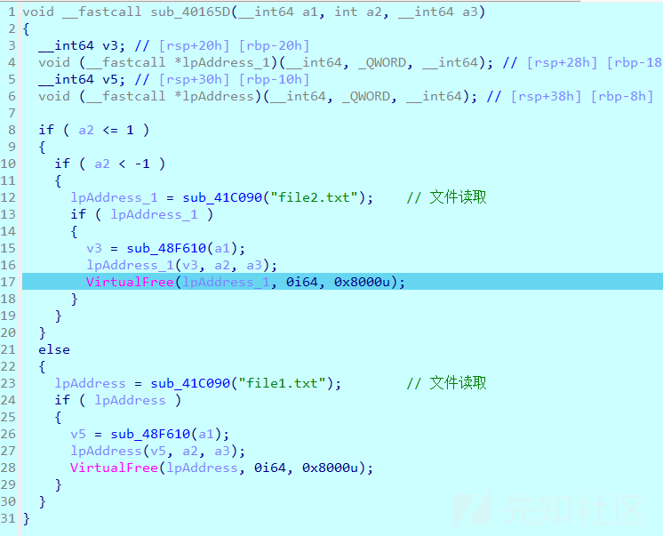

双击跟进**lpAddress\_1**，然后按d，跳转地址，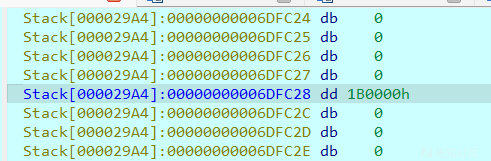

跟进，看到有未分析成功的数据，按C，然后按P，申明为代码，F5反编译

```
__int64 __fastcall sub_1B0000(int *a1, int a2, __int64 a3)
{
  int v3; // eax
  int v4; // eax
  __int64 result; // rax
  unsigned int v6; // [rsp+0h] [rbp-30h]
  int v7; // [rsp+4h] [rbp-2Ch]
  int i; // [rsp+8h] [rbp-28h]
  unsigned int v9; // [rsp+Ch] [rbp-24h]
  unsigned int v10; // [rsp+10h] [rbp-20h]
  unsigned int v11; // [rsp+10h] [rbp-20h]
  unsigned int v12; // [rsp+14h] [rbp-1Ch]
  int v13; // [rsp+24h] [rbp-Ch]

  v13 = -a2;
  v7 = 52 / -a2 + 6;
  v9 = -1640531527 * v7;
  v12 = *a1;
  do
  {
    v6 = (v9 >> 2) & 3;
    for ( i = v13 - 1; i; --i )
    {
      v10 = a1[i - 1];
      v3 = a1[i]
         - (((v10 ^ *(a3 + 4i64 * (v6 ^ i & 3))) + (v12 ^ v9)) ^ (((16 * v10) ^ (v12 >> 3)) + ((4 * v12) ^ (v10 >> 5))));
      a1[i] = v3;
      v12 = v3;
    }
    v11 = a1[v13 - 1];
    v4 = *a1 - (((v11 ^ *(a3 + 4i64 * v6)) + (v12 ^ v9)) ^ (((16 * v11) ^ (v12 >> 3)) + ((4 * v12) ^ (v11 >> 5))));
    *a1 = v4;
    v12 = v4;
    v9 += 1640531527;
    result = (v7 - 1);
    v7 = result;
  }
  while ( result );
  return result;
}
```

很明显就是xxtea。那么到目前为止，就已经确定了密文，加密算法，以及key可以在内存中找到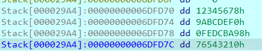

但是由于不知道游戏什么时候结束，于是乎就只能爆破，已有的线索是flag格式ISCC{}

爆破脚本

```
import struct
from ctypes import c_uint32

def xxtea_decrypt_block(block_len, cipher_block, key):
    """执行 XXTEA 解密操作"""
    cipher_block = [c_uint32(word) for word in cipher_block]
    rounds = 6 + 52 // block_len
    delta = 0x9E3779B9
    total = c_uint32(delta * rounds)
    prev = cipher_block[0].value

    for _ in range(rounds):
        e = (total.value >> 2) & 3
        for i in range(block_len - 1, 0, -1):
            temp = cipher_block[i - 1].value
            cipher_block[i].value -= (
                (((temp >> 5) ^ (prev << 2)) + ((prev >> 3) ^ (temp << 4))) ^
                ((total.value ^ prev) + (key[(i & 3) ^ e] ^ temp))
            )
            prev = cipher_block[i].value

        temp = cipher_block[block_len - 1].value
        cipher_block[0].value -= (
            (((temp >> 5) ^ (prev << 2)) + ((prev >> 3) ^ (temp << 4))) ^
            ((total.value ^ prev) + (key[(0 & 3) ^ e] ^ temp))
        )
        prev = cipher_block[0].value
        total.value -= delta

    return [word.value for word in cipher_block]

def is_printable_ascii(byte_array):
    """检查是否为可打印 ASCII 字符串"""
    try:
        ascii_str = ''.join(chr(b) for b in byte_array if 0x20 <= b <= 0x7E)
        if ascii_str.startswith("ISCC{") and ascii_str.endswith("}"):
            return ascii_str
    except Exception:
        pass
    return None

def find_flag(cipher_data, key, block_len, max_rounds=9999):
    """多轮解密尝试寻找 flag"""
    for _ in range(max_rounds):
        cipher_data = xxtea_decrypt_block(block_len, cipher_data, key)
        raw = b''.join(struct.pack('<I', w) for w in cipher_data)
        result = is_printable_ascii(raw)
        if result:
            return result
    return None

def main():
    encrypted_data = [
        450832162, 1826182332, -829148630, -1384203487, 964015053,
        754513717, 2106422768, -1367225909, 1884152479, -2089835627,
        1017917579, 1642323169, 454050441, -1057867338, 1929533573,
        1252498573, 758205222, 24937351, 763299218, 1357881007,
        -1849691646, 1377080289, -466398391, -1430013052, -1956333485,
        736258012, -823058083, -1576948198, -69505800, 1097760358
    ]
    encrypted_data = [x & 0xFFFFFFFF for x in encrypted_data]
    xxtea_key = [0x12345678, 0x9ABCDEF0, 0xFEDCBA98, 0x76543210]
    block_len = 30

    flag = find_flag(encrypted_data, xxtea_key, block_len)
    if flag:
        print("flag:", flag)
    else:
        print("flag not found.")

if __name__ == "__main__":
    main()
```

**ISCC{]aH\_~=$a\*j<.3hlcgeHE|+[Y}**

### 邦布出击

先分析Java层

```
public boolean Jformat(String str) {
        if (str.length() < 7 || !str.substring(0, 5).equals("ISCC{") || str.charAt(str.length() - 1) != '}') {
            return false;
        }
        try {
            String a = a.a();
            Log.d("str1", "des加密明文: " + a);
            try {
                String encrypt = new DESHelper().encrypt(a, "WhItenet", getiv());
                Log.d("DEBUG_RES", "加密结果 res: " + encrypt);
                return str.substring(5, str.length() - 1).equals(encrypt);
            } catch (Exception e) {
                throw new RuntimeException(e);
            }
        } catch (Exception e2) {
            throw new RuntimeException(e2);
        }
    }
```

flag输进来会先check格式，是否是ISCC{}和长度是否大于7，然后才会继续运行下去。

可以看到先从a类的a方法获取一个值，跟踪

```
package com.example.mobile01;

import android.util.Base64;
import javax.crypto.Cipher;
import javax.crypto.spec.SecretKeySpec;

/* loaded from: classes.dex */
public class a {
    public static String a() throws Exception {
        String b = b.b();
        SecretKeySpec secretKeySpec = new SecretKeySpec(process(b.c()), "Blowfish");
        Cipher cipher = Cipher.getInstance(b.d());
        cipher.init(2, secretKeySpec);
        return new String(cipher.doFinal(Base64.decode(b, 0)), "UTF-8");
    }

    private static byte[] process(String str) {
        byte[] bArr = new byte[16];
        byte[] bytes = str.getBytes();
        for (int i = 0; i < 16; i++) {
            if (i < bytes.length) {
                bArr[i] = bytes[i];
            } else {
                bArr[i] = 0;
            }
        }
        return bArr;
    }
}
```

这个类就是实现了一个blowfish的加密过程，但是密钥是b类的c方法的返回值，继续跟踪

```
package com.example.mobile01;

import java.lang.reflect.Field;
import java.util.HashMap;
import java.util.Map;

/* loaded from: classes.dex */
public class b {
    private static String hiddenString = "HG7KlCdrvE/GB2TJnJlDY7/RA2OZEFZH";

    public static String b() {
        try {
            HashMap hashMap = new HashMap();
            HashMap hashMap2 = new HashMap();
            hashMap2.put("hiddenString", hiddenString);
            hashMap.put("level1", hashMap2);
            HashMap hashMap3 = new HashMap();
            hashMap3.put("level2", hashMap);
            Field declaredField = b.class.getDeclaredField("hiddenString");
            declaredField.setAccessible(true);
            return (String) ((Map) ((Map) hashMap3.get("level2")).get("level1")).get("hiddenString");
        } catch (Exception e) {
            e.printStackTrace();
            return null;
        }
    }

    public static String c() {
        return "";
    }

    public static String d() {
        return "Blowfish/ECB/PKCS5Padding";
    }
}
```

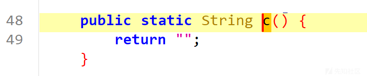

而这个方法缺返回了一个空。这也是导致程序运行闪退的原因，如果这里是正常的话，就可以一把梭了。那么我们接下来的任务就是查找blowfish的key是怎么来的。

MainActivity2类中就是让用户输入数据库的一些值，然后可以发现数据库是被加密了的，

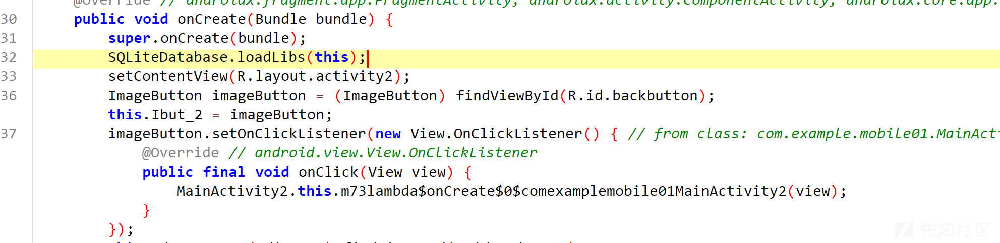

看**dB**

```
package com.example.mobile01;

import android.content.Context;
import net.sqlcipher.Cursor;
import net.sqlcipher.database.SQLiteDatabase;

/* loaded from: classes.dex */
public class dB {
    private static final String TABLE_NAME = "BBTUJIAN";
    private static SQLiteDatabase db;
    private static dB sInstance;
    private dH dhr;

    public dB(Context context, String str) {
        dH dHVar = new dH(context);
        this.dhr = dHVar;
        db = dHVar.getWritableDatabase(str);
    }

    public static dB getInstance(Context context, String str) {
        if (sInstance == null) {
            sInstance = new dB(context, str);
        }
        return sInstance;
    }

    public String getInfo(String str, String str2) {
        Cursor rawQuery = db.rawQuery("SELECT info FROM BBTUJIAN WHERE NAME=? AND LEVEL=?", new String[]{str, str2});
        if (rawQuery != null && rawQuery.moveToFirst()) {
            String string = rawQuery.getString(0);
            rawQuery.close();
            return string;
        }
        if (rawQuery != null) {
            rawQuery.close();
            return "全图鉴中未收录";
        }
        return "全图鉴中未收录";
    }
}
```

这里对数据库进行解密操作，同时也检查用户在向数据库中写入数据时，是否有写入的数据，。继续看**dH**

```
package com.example.mobile01;

import android.content.Context;
import net.sqlcipher.database.SQLiteDatabase;
import net.sqlcipher.database.SQLiteOpenHelper;

/* loaded from: classes.dex */
public class dH extends SQLiteOpenHelper {
    private static final String DATABASE_NAME = "bangbu.db";
    private static final int DATABASE_VERSION = 1;
    private static final String TABLE_NAME = "BBTUJIAN";

    @Override // net.sqlcipher.database.SQLiteOpenHelper
    public void onUpgrade(SQLiteDatabase sQLiteDatabase, int i, int i2) {
    }

    public dH(Context context) {
        super(context, DATABASE_NAME, null, 1);
        if (DBexits(context, DATABASE_NAME)) {
            return;
        }
        createDB(context);
    }

    @Override // net.sqlcipher.database.SQLiteOpenHelper
    public void onCreate(SQLiteDatabase sQLiteDatabase) {
        sQLiteDatabase.execSQL("create table BBTUJIAN(ID INTEGER PRIMARY KEY AUTOINCREMENT,NAME varchar(10),LEVEL varchar(10),INFO varchar(50))");
    }

    private boolean DBexits(Context context, String str) {
        return context.getDatabasePath(str).exists();
    }

    private void createDB(Context context) {
        SQLiteDatabase writableDatabase = getWritableDatabase("");
        writableDatabase.execSQL("INSERT INTO BBTUJIAN (NAME, LEVEL, INFO) VALUES ('鲨牙布', 'S','VVZaYVJsUn')");
        writableDatabase.execSQL("INSERT INTO BBTUJIAN (NAME, LEVEL, INFO) VALUES ('左轮布', 'S','NVbFpWYTJ4U')");
        writableDatabase.execSQL("INSERT INTO BBTUJIAN (NAME, LEVEL, INFO) VALUES ('格列佛探员', 'S','FVsRTlQUT09')");
        writableDatabase.execSQL("INSERT INTO BBTUJIAN (NAME, LEVEL, INFO) VALUES ('绳网情报', 'SSR','VGhyZWUgZGVjcnlwdGlvbnM=')");
        writableDatabase.execSQL("INSERT INTO BBTUJIAN (NAME, LEVEL, INFO) VALUES ('f0LaG?', 'SSS','e2ZsYWcwLm8/a2V5by4wfWNjc2w=')");
        writableDatabase.close();
    }
}
```

这里看到了对数据库进行插入的操作，并且还有个info属性，看着像base64编码的结果，进行解码，并从第四个值的解码结果可以得知需要对前三个进行三次base64解码

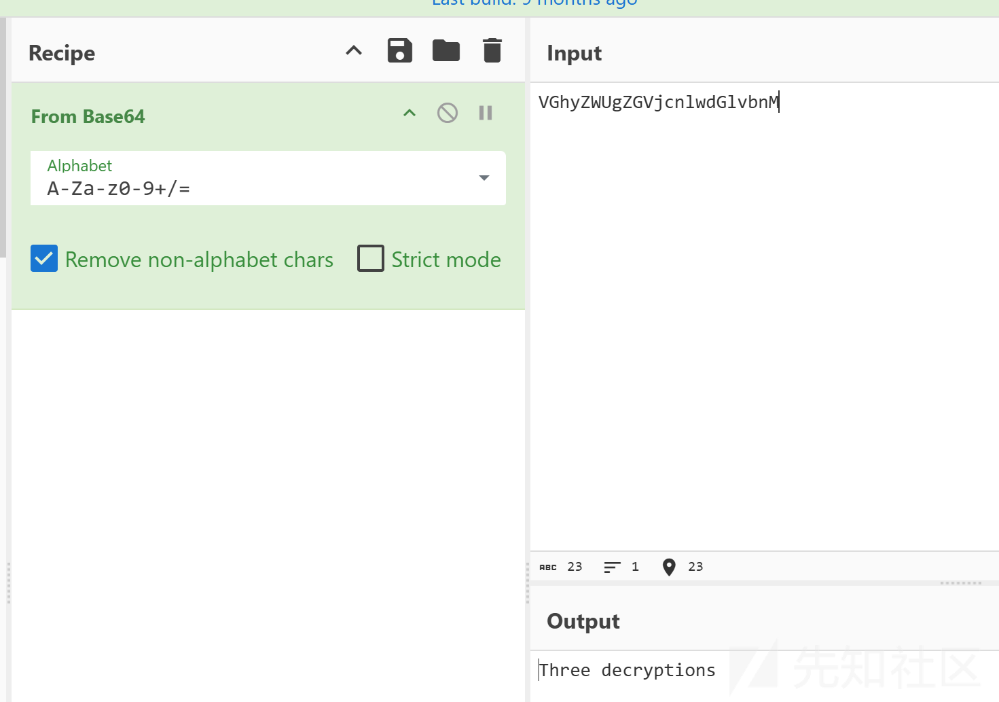

然后进行三次解码

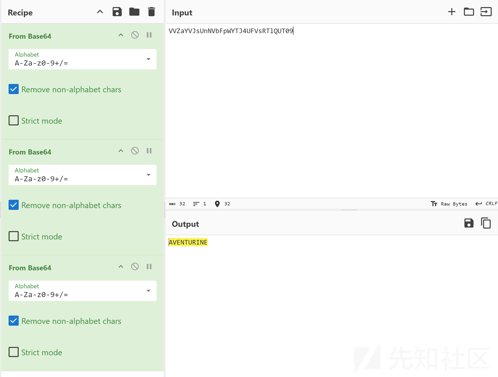

得到了一个类似密钥的值，但此时此刻我们去查看附件中的数据库，发现确实是被加密了，那估计这个key就是用来解密的了

用**sqlcipher**进行解密

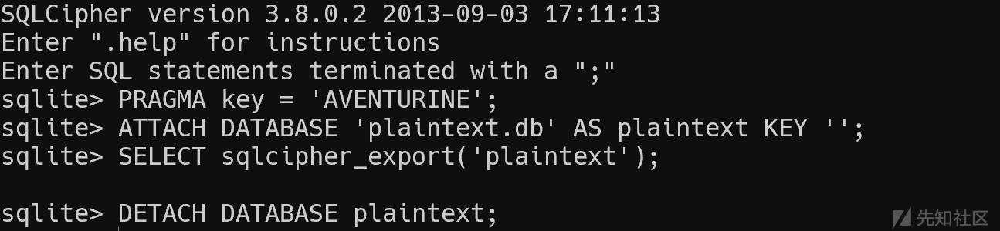

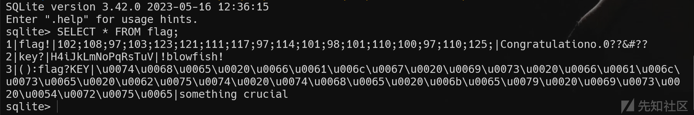

这样就拿到了blowfish加密的key：**H4iJkLmNoPqRsTuV**

接下来就只需要对encrypt方法进行hook，因为blowfish的加密结果是des加密的密文，同时还需要hook b类的c方法，把正确的key进行return

FRIDA 脚本

```
function main() {
  Java.perform(function () {
    
    let b = Java.use("com.example.mobile01.b");
b["c"].implementation = function () {
    console.log(`b.c is called`);
    let result = "H4iJkLmNoPqRsTuV";
    console.log(`b.c result=${result}`);
    return result;
};

let MainActivity = Java.use("com.example.mobile01.MainActivity");
MainActivity["getiv"].implementation = function () {
    console.log(`MainActivity.getiv is called`);
    let result = this["getiv"]();
    console.log(`MainActivity.getiv result=${result}`);
    return result;
};

    let DESHelper = Java.use("com.example.mobile01.DESHelper");
    DESHelper["encrypt"].implementation = function (str, str2, str3) {
    console.log(`DESHelper.encrypt is called: str=${str}, str2=${str2}, str3=${str3}`);
    let result = this["encrypt"](str, str2, str3);
    console.log(`DESHelper.encrypt result=${result}`);
    return result;
};

  });

}
setImmediate(main);
```

输入符合格式要求的测试数据触发一下，即可获取flag

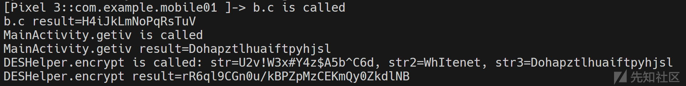

**ISCC{rR6ql9CGn0u/kBPZpMzCEKmQy0ZkdlNB}**

### Detective

先看Java层

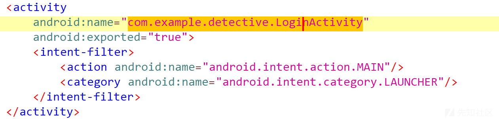

可以看到启动页是**LoginActivity**，查看

```
public void onCreate(Bundle bundle) {
        super.onCreate(bundle);
        setContentView(R.layout.activity_login);
        this.password = (EditText) findViewById(R.id.editTextTextPassword2);
        this.submitButton = (Button) findViewById(R.id.button2);
        this.errorTextView = (TextView) findViewById(R.id.textView4);
        this.submitButton.setOnClickListener(new View.OnClickListener() { // from class: com.example.detective.LoginActivity.1
            @Override // android.view.View.OnClickListener
            public void onClick(View view) {
                String obj = LoginActivity.this.password.getText().toString();
                if (!LoginActivity.this.isValidPasswordFormat(obj)) {
                    Toast.makeText(LoginActivity.this, "ERROR, the password must be 4 uppercase letters", 0).show();
                } else {
                    if (LoginActivity.this.validatePassword(obj)) {
                        LoginActivity.this.startActivity(new Intent(LoginActivity.this, (Class<?>) MainActivity.class));
                        LoginActivity.this.finish();
                        return;
                    }
                    Toast.makeText(LoginActivity.this, "Error, please try again", 0).show();
                }
            }
        });
    }

    /* JADX INFO: Access modifiers changed from: private */
    public boolean isValidPasswordFormat(String str) {
        return str != null && str.length() == 4 && str.matches("[A-Z]{4}");
    }
}
```

就是检查输入的**四位password**是否正确，正确则显示调用**MainActivity**。而check逻辑在so层。

继续看MainActivity

```
package com.example.detective;

import android.os.Bundle;
import android.view.View;
import android.widget.Button;
import android.widget.EditText;
import android.widget.Toast;
import androidx.appcompat.app.AppCompatActivity;
import com.example.detective.databinding.ActivityMainBinding;

/* loaded from: classes.dex */
public class MainActivity extends AppCompatActivity {
    private ActivityMainBinding binding;

    /* renamed from: flagEditText */
    private EditText flag;
    private Button submitButton;

    public native String stringFromJNI(String str);

    static {
        System.loadLibrary("detective");
    }

    /* JADX INFO: Access modifiers changed from: protected */
    @Override // androidx.fragment.app.FragmentActivity, androidx.activity.ComponentActivity, androidx.core.app.ComponentActivity, android.app.Activity
    public void onCreate(Bundle bundle) {
        super.onCreate(bundle);
        ActivityMainBinding inflate = ActivityMainBinding.inflate(getLayoutInflater());
        this.binding = inflate;
        setContentView(inflate.getRoot());
        this.flag = this.binding.editTextFlag;
        Button button = this.binding.button;
        this.submitButton = button;
        button.setOnClickListener(new View.OnClickListener() { // from class: com.example.detective.MainActivity.1
            @Override // android.view.View.OnClickListener
            public void onClick(View view) {
                if (MainActivity.this.Jformat(MainActivity.this.flag.getText().toString())) {
                    Toast.makeText(MainActivity.this, "Congratulations, you are right!", 1).show();
                } else {
                    Toast.makeText(MainActivity.this, "PITY", 0).show();
                }
            }
        });
    }

    /* JADX INFO: Access modifiers changed from: private */
    public boolean Jformat(String str) {
        return str.length() >= 8 && (str.length() + 1) % 2 != 0 && str.substring(0, 5).equals("ISCC{") && str.charAt(str.length() - 1) == '}' && stringFromJNI(a.a(str.substring(5, str.length() - 1))).equals("1008444F5F4D4252602B27535C1C124A");
    }
}
```

逻辑也很清晰，就是将输入的flag，先检查格式，ISCC{}，以及长度，大括号内的内容先在a类中的a方法进行加密，再传到so层的**stringFromJNI**进行加密，然后和一串已知的密文进行check。

a类

```
package com.example.detective;

/* loaded from: classes.dex */
public class a {
    public static String a(String str) {
        return c(b.a(b(str)));
    }

    public static String b(String str) {
        char[] charArray = str.toCharArray();
        StringBuilder sb = new StringBuilder();
        for (char c : charArray) {
            String hexString = Integer.toHexString(c);
            if (hexString.length() <= 2) {
                hexString = "0" + hexString;
            }
            sb.append(hexString);
        }
        return sb.toString();
    }

    public static String c(String str) {
        String str2 = "00" + str;
        if (str2.length() % 4 != 0) {
            return str2;
        }
        StringBuilder sb = new StringBuilder();
        int i = 0;
        int i2 = 0;
        while (i < str2.length()) {
            sb.append(Character.toString((char) Integer.parseInt(str2.substring(i2, i2 + 4), 16)));
            i += 4;
            i2 += 4;
        }
        return sb.toString();
    }
}
```


有点抽象...

a类中的b方法就是将字符转十六进制，不足三位的补0。转成十六进制之后再传到b类的a方法

```
package com.example.detective;

/* loaded from: classes.dex */
public class b {
    public static String a(String str) {
        StringBuilder sb = new StringBuilder();
        StringBuilder sb2 = new StringBuilder();
        int i = 0;
        int i2 = 0;
        int i3 = 0;
        while (i < str.length()) {
            char charAt = str.charAt(i);
            i++;
            if (i % 2 == 0) {
                if ((i3 == 1 || (i3 - 1) % 3 == 0) && charAt == '0') {
                    sb2.append("3");
                } else {
                    sb2.append(charAt);
                }
                i3++;
            } else {
                if ((i2 == 0 || i2 % 3 == 0) && charAt == '0') {
                    sb.append("3");
                } else {
                    sb.append(charAt);
                }
                i2++;
            }
        }
        sb2.append((CharSequence) sb);
        StringBuilder sb3 = new StringBuilder();
        for (int i4 = 0; i4 < sb2.length(); i4 += 2) {
            char charAt2 = sb2.charAt(i4);
            char charAt3 = sb2.charAt(i4 + 1);
            if (charAt2 != '3' && charAt2 != '4' && charAt2 != '5' && charAt2 != '6' && charAt2 != '7') {
                sb3.append(charAt3);
                sb3.append(charAt2);
                sb3.append("21");
            } else {
                sb3.append(charAt2);
                sb3.append(charAt3);
            }
        }
        return sb3.toString().replaceAll("(.{2})", "$100").substring(0, r10.length() - 2);
    }
}
```

先对特定索引的值进行字符3的增加，同时以索引的奇偶，来将字符打乱顺序，分成两部分，拼接在一起。然后两位两位进行遍历，对于符合特定值的字符，在其后边append字符21，并且将原来的顺序颠倒，例如传进去是AB,那么处理之后就是BA21。

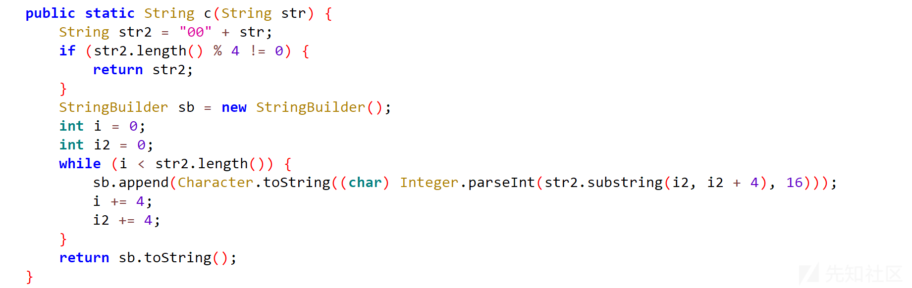

完了再回到a类的c方法，先在字符串前面填上00，实际的作用就是又转回字符形式，从十六进制形式。

Java层看完了，看so层。

Java\_com\_example\_detective\_LoginActivity\_validatePassword

```
__int64 __fastcall Java_com_example_detective_LoginActivity_validatePassword(__int64 a1, __int64 a2, __int64 a3)
{
  __int64 v3; // rbp
  const char *s; // r12
  size_t n0x17; // rax
  size_t n_1; // rbx
  char *ptr_1; // r13
  __int64 v9; // rbp
  char *_23213b6f905655aaf0510c9054e4b14719d07c2c17c08d826a5f9139d8c234f; // rbx
  size_t n_2; // rsi
  __int64 v12; // rdx
  void *s1_1; // r14
  char v15[8]; // [rsp+0h] [rbp-68h] BYREF
  size_t n; // [rsp+8h] [rbp-60h]
  void *s1; // [rsp+10h] [rbp-58h]
  __int64 dest[2]; // [rsp+18h] [rbp-50h] BYREF
  void *ptr; // [rsp+28h] [rbp-40h]
  unsigned __int64 v20; // [rsp+30h] [rbp-38h]

  v20 = __readfsqword(0x28u);
  s = (*(*a1 + 1352LL))(a1, a3, 0LL);
  n0x17 = strlen(s);
  if ( n0x17 >= 0xFFFFFFFFFFFFFFF0LL )
    sub_613E0(dest);
  n_1 = n0x17;
  if ( n0x17 >= 0x17 )
  {
    v9 = n0x17 | 0xF;
    ptr_1 = operator new((n0x17 | 0xF) + 1);
    ptr = ptr_1;
    v3 = v9 + 2;
    dest[0] = v3;
    dest[1] = n_1;
    goto LABEL_6;
  }
  LOBYTE(dest[0]) = 2 * n0x17;
  ptr_1 = dest + 1;
  if ( n0x17 )
LABEL_6:
    memmove(ptr_1, s, n_1);
  ptr_1[n_1] = 0;
  _23213b6f905655aaf0510c9054e4b14719d07c2c17c08d826a5f9139d8c234f = operator new(0x50uLL);
  strcpy(
    _23213b6f905655aaf0510c9054e4b14719d07c2c17c08d826a5f9139d8c234f,
    "23213b6f905655aaf0510c9054e4b14719d07c2c17c08d826a5f9139d8c234f9");
  sha256(v15, dest);
  (*(*a1 + 1360LL))(a1, a3, s);
  n_2 = n;
  if ( (v15[0] & 1) == 0 )
    n_2 = v15[0] >> 1;
  if ( n_2 == 64 )
  {
    if ( (v15[0] & 1) != 0 )
    {
      s1_1 = s1;
      LOBYTE(v3) = memcmp(s1, _23213b6f905655aaf0510c9054e4b14719d07c2c17c08d826a5f9139d8c234f, n) == 0;
      goto LABEL_20;
    }
    LOBYTE(v3) = 1;
    if ( v15[0] < 2u )
      goto LABEL_21;
    v12 = 0LL;
    while ( v15[v12 + 1] == _23213b6f905655aaf0510c9054e4b14719d07c2c17c08d826a5f9139d8c234f[v12] )
    {
      if ( v15[0] >> 1 == ++v12 )
      {
        LOBYTE(v3) = 1;
        if ( (v15[0] & 1) != 0 )
          goto LABEL_18;
        goto LABEL_21;
      }
    }
  }
  LODWORD(v3) = 0;
  if ( (v15[0] & 1) == 0 )
    goto LABEL_21;
LABEL_18:
  s1_1 = s1;
LABEL_20:
  operator delete(s1_1);
LABEL_21:
  operator delete(_23213b6f905655aaf0510c9054e4b14719d07c2c17c08d826a5f9139d8c234f);
  if ( (dest[0] & 1) != 0 )
    operator delete(ptr);
  return v3;
}
```

就是将四位的验证码传进去，计算sha256，进行比较，但其实这个可以不用管，直接hook一下就可以过了。

Java\_com\_example\_detective\_MainActivity\_stringFromJNI

```
__int64 __fastcall Java_com_example_detective_MainActivity_stringFromJNI(__int64 a1, __int64 a2, __int64 a3)
{
  const char *flag; // r15
  size_t flag_len; // rax
  size_t n; // r12
  char *ptr_1; // r13
  __int64 v8; // rbp
  __int64 *s; // rsi
  __int64 v10; // rdx
  __int64 v11; // rcx
  __int64 v12; // r12
  _BYTE *ptr_4; // r13
  __int64 i; // rbp
  char *ptr_5; // rsi
  __int64 v16; // rbx
  __int128 v18; // [rsp+0h] [rbp-A8h] BYREF
  void *ptr_3; // [rsp+10h] [rbp-98h]
  unsigned __int8 v20; // [rsp+20h] [rbp-88h] BYREF
  _BYTE v21[15]; // [rsp+21h] [rbp-87h] BYREF
  void *ptr_2; // [rsp+30h] [rbp-78h]
  char key[24]; // [rsp+38h] [rbp-70h] BYREF
  __int64 dest[2]; // [rsp+50h] [rbp-58h] BYREF
  void *ptr; // [rsp+60h] [rbp-48h]
  char s_[59]; // [rsp+6Dh] [rbp-3Bh] BYREF

  *&s_[3] = __readfsqword(0x28u);
  flag = (*(*a1 + 1352LL))(a1, a3, 0LL);
  flag_len = strlen(flag);
  if ( flag_len >= 0xFFFFFFFFFFFFFFF0LL )
    sub_613E0(dest);
  n = flag_len;
  if ( flag_len >= 0x17 )
  {
    v8 = flag_len | 0xF;
    ptr_1 = operator new((flag_len | 0xF) + 1);
    ptr = ptr_1;
    dest[0] = v8 + 2;
    dest[1] = n;
    goto LABEL_6;
  }
  LOBYTE(dest[0]) = 2 * flag_len;
  ptr_1 = dest + 1;
  if ( flag_len )
LABEL_6:
    memmove(ptr_1, flag, n);
  ptr_1[n] = 0;
  (*(*a1 + 1360LL))(a1, a3, flag);
  key[0] = 16;
  strcpy(&key[1], "Sherlock");
  s = dest;
  xorEncrypt(&v20, dest, key);
  v18 = 0LL;
  ptr_3 = 0LL;
  v12 = v20 >> 1;
  ptr_4 = v21;
  if ( (v20 & 1) != 0 )
  {
    ptr_4 = ptr_2;
    v12 = *&v21[7];
  }
  if ( !v12 )
    goto LABEL_14;
  for ( i = 0LL; i != v12; ++i )
  {
    sub_61050(s_, s, v10, v11, ptr_4[i]);       // 格式化
    s = s_;
    std::string::append(&v18, s_);
  }
  if ( (v18 & 1) != 0 )
    ptr_5 = ptr_3;
  else
LABEL_14:
    ptr_5 = &v18 + 1;
  v16 = (*(*a1 + 1336LL))(a1, ptr_5);
  if ( (v18 & 1) == 0 )
  {
    if ( (v20 & 1) == 0 )
      goto LABEL_17;
LABEL_21:
    operator delete(ptr_2);
    if ( (dest[0] & 1) == 0 )
      return v16;
    goto LABEL_18;
  }
  operator delete(ptr_3);
  if ( (v20 & 1) != 0 )
    goto LABEL_21;
LABEL_17:
  if ( (dest[0] & 1) != 0 )
LABEL_18:
    operator delete(ptr);
  return v16;
}
```

对flag就是一个异或，key也有了，那么接下来就可以写脚本解密了

```
def decode(hex_str: str) -> str:
    # Step 2.1: Reverse special characters
    transformed_chars = []
    index = 0
    while index < len(hex_str):
        if index + 3 < len(hex_str) and hex_str[index + 2:index + 4] == "21":
            transformed_chars.append(hex_str[index + 1])
            transformed_chars.append(hex_str[index])
            index += 4
        else:
            transformed_chars.append(hex_str[index])
            transformed_chars.append(hex_str[index + 1])
            index += 2

    combined_str = "".join(transformed_chars)

    total_length = len(combined_str)
    mid_point = total_length // 2
    even_chars = combined_str[:mid_point]
    odd_chars = combined_str[mid_point:]

    def restore_char(index, char, condition):
        return '0' if condition and char == '3' else char

    original_chars = []
    for pos in range(1, total_length + 1):
        if pos % 2 != 0:  # Odd position
            char = odd_chars[(pos - 1) // 2]
            original_chars.append(restore_char((pos - 1) // 2, char, (pos - 1) // 3 == 0))
        else:  # Even position
            char = even_chars[(pos - 2) // 2]
            original_chars.append(restore_char((pos - 2) // 2, char, (pos - 2) // 3 == 1))

    return "".join(original_chars)

encrypted_bytes = list(bytes.fromhex("1008444F5F4D4252602B27535C1C124A"))
xor_key = b"Sherlock"

for i in range(len(encrypted_bytes)):
    encrypted_bytes[i] ^= xor_key[i % len(xor_key)]

hex_string = "".join(map(chr, encrypted_bytes)).encode().hex()
print("Hex String: " + hex_string)

decoded_str = decode(hex_string)

decoded_hex = ''.join([decoded_str[i + 1:i + 3] for i in range(0, len(decoded_str), 3)])
print(f"ISCC{{{bytes.fromhex(decoded_hex).decode()}}}")
```

**ISCC{@@bM0r!y}**

### HolyGrail

⑩...

先看Java层，**MainActivity**就是app运行首页面的初始化代码，跟踪提交按钮所执行的逻辑，跟踪到**FlagValidationActivity**类，

关键逻辑

```
private void submitSequence() {
        String flag = this.flagInput.getText().toString().trim();
        if (!isCorrectFormat(flag)) {
            Toast.makeText(this, "Wrong flag format", 0).show();
            return;
        }
        String flag_content = flag.substring(5, flag.length() - 1);
        String string = this.sharedPreferences.getString("cipherText", "");
        String validateFlag = a.validateFlag(this, flag_content);
        if (validateFlag != null && validateFlag.equals(string)) {
            if ("5250c91839d865f699fcb3a4e8e32cee93a761f5ca746367238877aa21d2ca39".equalsIgnoreCase(sha256(flag_content))) {
                Toast.makeText(this, "Success", 0).show();
                return;
            } else {
                Toast.makeText(this, "Correctly matched but in the wrong order.", 0).show();
                return;
            }
        }
        Toast.makeText(this, "Wrong flag", 0).show();
    }

    private boolean isCorrectFormat(String str) {
        return str.startsWith("ISCC{") && str.endsWith("}");
    }
```

一样，先检查格式，然后检查大括号里的内容，先传入a类的validateFlag方法进行加密，

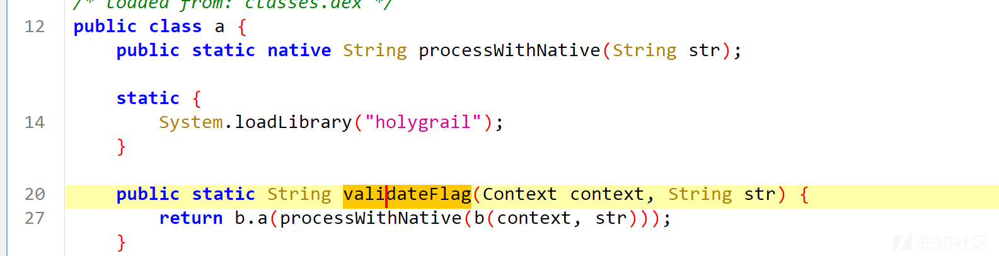

依次跟踪查看代码逻辑

```
private static String vigenereEncrypt(String str, String keykey) {
        StringBuilder sb = new StringBuilder();
        int key_length = keykey.length();
        int i = 0;
        for (int i2 = 0; i2 < str.length(); i2++) {
            char flag_char = str.charAt(i2);
            if (Character.isLetter(flag_char)) {
                char c = Character.isLowerCase(flag_char) ? 'a' : 'A';
                char key_char = keykey.charAt(i % key_length);
                flag_char = (char) ((((flag_char - c) + (key_char - (Character.isUpperCase(key_char) ? 'A' : 'a'))) % 26) + c);
                i++;
            }
            sb.append(flag_char);
        }
        return sb.toString();
    }
```

先**vigenere**加密，然后传入so层的**processWithNative**进行加密，再到b类的a方法进行转换。但是到目前为止，我们没有找到密文在哪，这个app用到了**sharedPreferences**，安卓的一个数据持久化的类，我们运行app，在最开始要求按一定顺序勾选耶稣和其十二门徒的顺序，但这个顺序根据提示，是在**mobile2**里的**libSequence-Clues.so**里，无敌了...


找到顺序

```
int sub_21D40()
{
  1Jesus2St_Peter3St_John4Judah5SaintMatthew6OldJacob7St_Thomas8S = operator new(0x80uLL);
  n129 = 129LL;
  n127 = 127LL;
  strcpy(
    1Jesus2St_Peter3St_John4Judah5SaintMatthew6OldJacob7St_Thomas8S,
    "1Jesus2St.Peter3St.John4Judah5SaintMatthew6OldJacob7St.Thomas8SaintSimon9St.Philip10Bartholomew11Jacob12St.Andrew13SaintTartary");
  return __cxa_atexit(std::string::~string, &n129, &lpdso_handle_);
}
```

找到顺序之后，还需要和app中按钮一一对应，直接全局随便搜一个名字，在布局文件里就可以看到

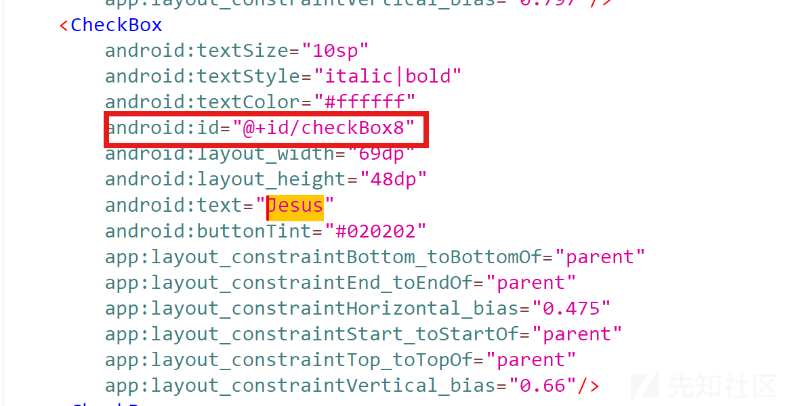

这里就只列举了一个，剩余十二个都可以找到。

但是，分析so层**libholygrail.so**的**Java\_com\_example\_holygrail\_a\_processWithNative**，只看到了一个十六进制转十进制，十进制转十三进制的逻辑，所以索性就直接黑盒测试，Frida hook **validateFlag**方法的返回值，将所有的可见字符一一输入，就可以得到加密结果

hook脚本

```
function hook() {
  Java.perform(function () {
    let a = Java.use("com.example.holygrail.a");

    a["vigenereEncrypt"].implementation = function (str, str2) {
      console.log(`a.vigenereEncrypt is called: str=${str}, str2=${str2}`);
      let result = this["vigenereEncrypt"](str, str2);
      console.log(`a.vigenereEncrypt result=${result}`);
      return result;
    };

    a["validateFlag"].implementation = function (context, str) {
      console.log(`a.validateFlag is called: context=${context}, str=${str}`);
      let result = this["validateFlag"](context, str);
      console.log(`a.validateFlag result=${result}`);
      return result;
    };
  });
}

setImmediate(hook);
```

拿到对应关系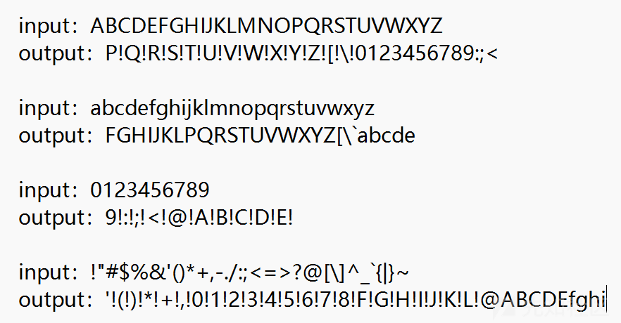

而每个按钮对应的值也可以在so层里找到

```
unsigned __int64 sub_63670()
{
  __int64 n624; // rbx
  char v2[16]; // [rsp+0h] [rbp-2D8h]
  _BYTE ptr[31]; // [rsp+10h] [rbp-2C8h]
  _QWORD v4[6]; // [rsp+2Fh] [rbp-2A9h] BYREF
  __int64 v5[6]; // [rsp+30h] [rbp-2A8h] BYREF
  __int64 v6[6]; // [rsp+60h] [rbp-278h] BYREF
  __int64 v7[6]; // [rsp+90h] [rbp-248h] BYREF
  __int64 v8[6]; // [rsp+C0h] [rbp-218h] BYREF
  __int64 v9[6]; // [rsp+F0h] [rbp-1E8h] BYREF
  __int64 v10[6]; // [rsp+120h] [rbp-1B8h] BYREF
  __int64 v11[6]; // [rsp+150h] [rbp-188h] BYREF
  __int64 v12[6]; // [rsp+180h] [rbp-158h] BYREF
  __int64 v13[6]; // [rsp+1B0h] [rbp-128h] BYREF
  __int64 v14[6]; // [rsp+1E0h] [rbp-F8h] BYREF
  __int64 v15[6]; // [rsp+210h] [rbp-C8h] BYREF
  char v16[48]; // [rsp+240h] [rbp-98h] BYREF
  _QWORD v17[13]; // [rsp+270h] [rbp-68h] BYREF

  v17[6] = __readfsqword(0x28u);
  _ZNSt6__ndk14pairIKNS_12basic_stringIcNS_11char_traitsIcEENS_9allocatorIcEEEES6_EC2B8ne180000IRA9_KcRA2_SA_TnNS_9enable_ifIXclsr10_CheckArgsE17__enable_implicitIT_T0_EEEiE4typeELi0EEEOSG_OSH_(
    v5,
    "checkBox",
    "S");
  _ZNSt6__ndk14pairIKNS_12basic_stringIcNS_11char_traitsIcEENS_9allocatorIcEEEES6_EC2B8ne180000IRA10_KcRA3_SA_TnNS_9enable_ifIXclsr10_CheckArgsE17__enable_implicitIT_T0_EEEiE4typeELi0EEEOSG_OSH_(
    v6,
    "checkBox3",
    "9!");
  _ZNSt6__ndk14pairIKNS_12basic_stringIcNS_11char_traitsIcEENS_9allocatorIcEEEES6_EC2B8ne180000IRA10_KcRA3_SA_TnNS_9enable_ifIXclsr10_CheckArgsE17__enable_implicitIT_T0_EEEiE4typeELi0EEEOSG_OSH_(
    v7,
    "checkBox4",
    "<!");
  _ZNSt6__ndk14pairIKNS_12basic_stringIcNS_11char_traitsIcEENS_9allocatorIcEEEES6_EC2B8ne180000IRA10_KcRA2_SA_TnNS_9enable_ifIXclsr10_CheckArgsE17__enable_implicitIT_T0_EEEiE4typeELi0EEEOSG_OSH_(
    v8,
    "checkBox5",
    "P");
  _ZNSt6__ndk14pairIKNS_12basic_stringIcNS_11char_traitsIcEENS_9allocatorIcEEEES6_EC2B8ne180000IRA10_KcRA2_SA_TnNS_9enable_ifIXclsr10_CheckArgsE17__enable_implicitIT_T0_EEEiE4typeELi0EEEOSG_OSH_(
    v9,
    "checkBox6",
    "a");
  _ZNSt6__ndk14pairIKNS_12basic_stringIcNS_11char_traitsIcEENS_9allocatorIcEEEES6_EC2B8ne180000IRA10_KcRA2_SA_TnNS_9enable_ifIXclsr10_CheckArgsE17__enable_implicitIT_T0_EEEiE4typeELi0EEEOSG_OSH_(
    v10,
    "checkBox7",
    "Y");
  _ZNSt6__ndk14pairIKNS_12basic_stringIcNS_11char_traitsIcEENS_9allocatorIcEEEES6_EC2B8ne180000IRA10_KcRA2_SA_TnNS_9enable_ifIXclsr10_CheckArgsE17__enable_implicitIT_T0_EEEiE4typeELi0EEEOSG_OSH_(
    v11,
    "checkBox8",
    "9");
  _ZNSt6__ndk14pairIKNS_12basic_stringIcNS_11char_traitsIcEENS_9allocatorIcEEEES6_EC2B8ne180000IRA10_KcRA2_SA_TnNS_9enable_ifIXclsr10_CheckArgsE17__enable_implicitIT_T0_EEEiE4typeELi0EEEOSG_OSH_(
    v12,
    "checkBox9",
    "J");
  _ZNSt6__ndk14pairIKNS_12basic_stringIcNS_11char_traitsIcEENS_9allocatorIcEEEES6_EC2B8ne180000IRA11_KcRA2_SA_TnNS_9enable_ifIXclsr10_CheckArgsE17__enable_implicitIT_T0_EEEiE4typeELi0EEEOSG_OSH_(
    v13,
    "checkBox10",
    "K");
  _ZNSt6__ndk14pairIKNS_12basic_stringIcNS_11char_traitsIcEENS_9allocatorIcEEEES6_EC2B8ne180000IRA11_KcRA2_SA_TnNS_9enable_ifIXclsr10_CheckArgsE17__enable_implicitIT_T0_EEEiE4typeELi0EEEOSG_OSH_(
    v14,
    "checkBox11",
    "e");
  _ZNSt6__ndk14pairIKNS_12basic_stringIcNS_11char_traitsIcEENS_9allocatorIcEEEES6_EC2B8ne180000IRA11_KcRA2_SA_TnNS_9enable_ifIXclsr10_CheckArgsE17__enable_implicitIT_T0_EEEiE4typeELi0EEEOSG_OSH_(
    v15,
    "checkBox12",
    "i");
  _ZNSt6__ndk14pairIKNS_12basic_stringIcNS_11char_traitsIcEENS_9allocatorIcEEEES6_EC2B8ne180000IRA11_KcRA3_SA_TnNS_9enable_ifIXclsr10_CheckArgsE17__enable_implicitIT_T0_EEEiE4typeELi0EEEOSG_OSH_(
    v16,
    "checkBox13",
    "A!");
  _ZNSt6__ndk14pairIKNS_12basic_stringIcNS_11char_traitsIcEENS_9allocatorIcEEEES6_EC2B8ne180000IRA11_KcRA4_SA_TnNS_9enable_ifIXclsr10_CheckArgsE17__enable_implicitIT_T0_EEEiE4typeELi0EEEOSG_OSH_(
    v17,
    "checkBox14",
    "aFi");
  sub_62A80(&checkBoxToCipherMap, v5, 13LL, v4);
  n624 = 624LL;
  do
  {
    if ( (ptr[n624 + 8] & 1) != 0 )
    {
      operator delete(*&ptr[n624 + 24]);
      if ( (v2[n624] & 1) == 0 )
        goto LABEL_2;
    }
    else if ( (v2[n624] & 1) == 0 )
    {
      goto LABEL_2;
    }
    operator delete(*&ptr[n624]);
LABEL_2:
    n624 -= 48LL;
  }
  while ( n624 );
  __cxa_atexit(func, &checkBoxToCipherMap, &lpdso_handle_);
  return __readfsqword(0x28u);
}
```

看到**checkBox3**对应**9!**。这也清楚了对应关系为什么存在!了。直接人工还原一下，也挺简单的。

得到**Wvqh~0f5zke3va~**，然后维吉尼亚在线解密一下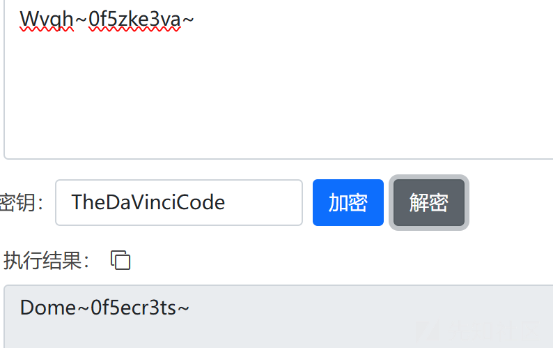

**ISCC{Dome~0f5ecr3ts~}**

## 练武题(决赛)

### CrackMe

根据题目描述可知，有花指令，ida打开分析也确实如此

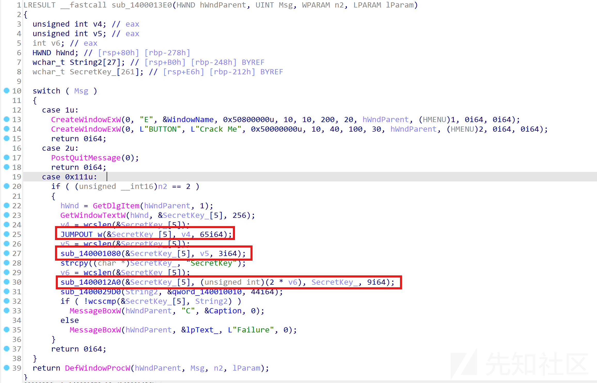

勾选出来的这三个就是具体的加密逻辑，都加了花，都是一样类型的花指令

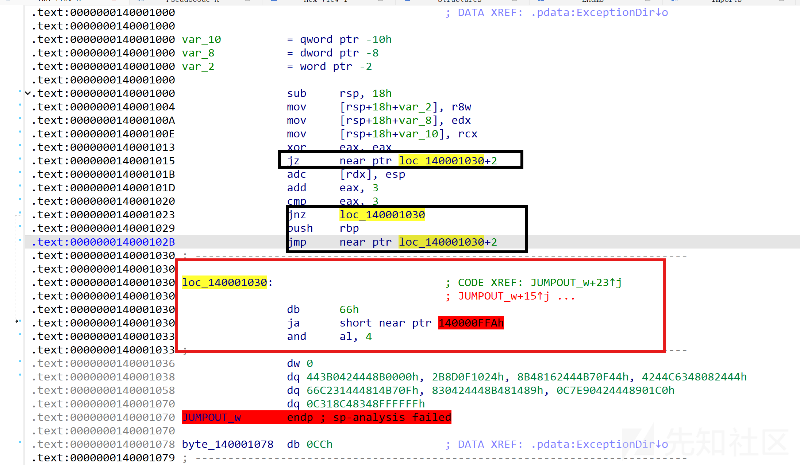

红色部分未定义一下，黑色部分全nop

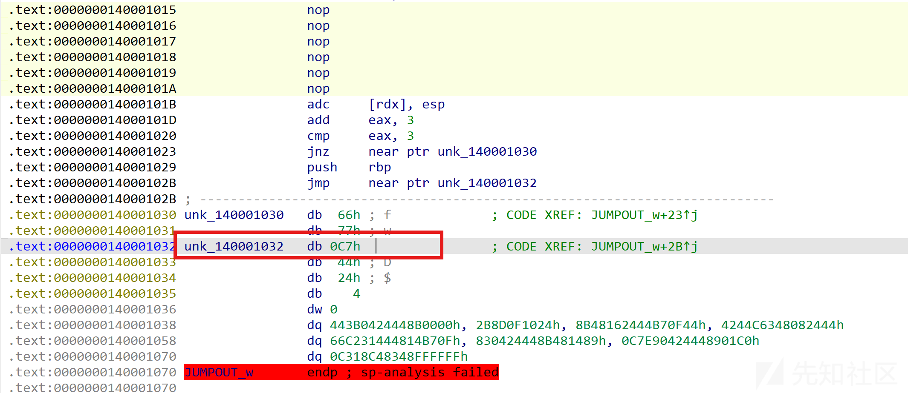

红色部分按C，然后上面两字节nop一下，就正常F5了

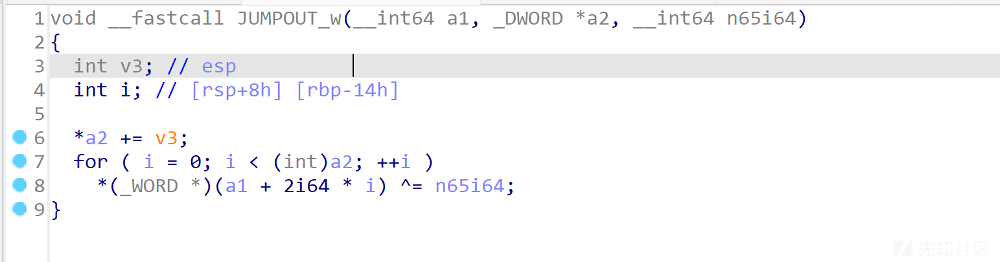

另外两个都一样

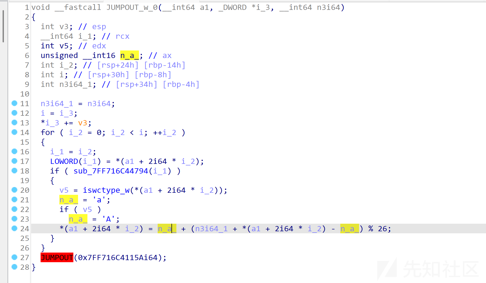

一个类似于凯撒加密的逻辑

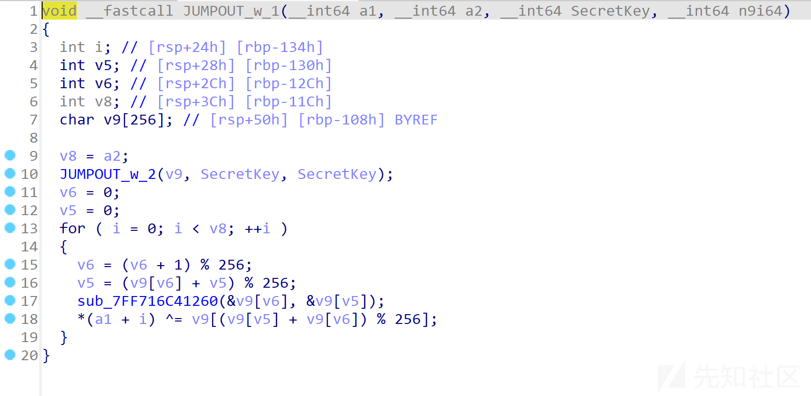

标准的rc4。

但是发现前两个加密都是对偶数维进行加密，rc4是全部进行加密的，所以正确的密文应该是偶数位

解密：

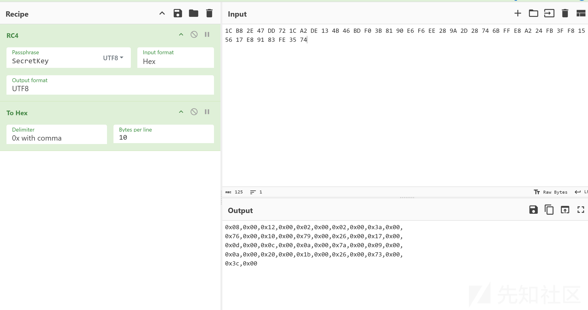

把偶数位提出来，提不提都可以，然后进行解密

```
enc = [0x08, 0x12, 0x02, 0x02, 0x3a, 0x76, 0x10, 0x79, 0x26,
       0x17, 0x0d, 0x0c, 0x0a, 0x7a, 0x09, 0x0a, 0x20, 0x1b,
       0x26, 0x73, 0x3c]

result = []

for i in range(len(enc)):
    if ord('a') <= enc[i] <= ord('z'):
        enc[i] = (enc[i] - ord('a') - 3) % 26 + ord('a')
    elif ord('A') <= enc[i] <= ord('Z'):
        enc[i] = (enc[i] - ord('A') - 3) % 26 + ord('A')

for i in range(len(enc)):
    print(chr(enc[i] ^ 65),end="")
```

**ISCC{2Q7gVLMK6HKaZg1}**

### uglyCpp

c++逆向，代码确实很丑...ida分析

初步静态分析的结果

```
int __fastcall main(int argc, const char **argv, const char **envp)
{
  __int64 v3; // rax
  __int64 envp_1; // rdx
  __int64 v5; // rax
  _QWORD v7[2]; // [rsp+10h] [rbp-100h] BYREF
  _QWORD v8[4]; // [rsp+20h] [rbp-F0h] BYREF
  _QWORD v9[4]; // [rsp+40h] [rbp-D0h] BYREF
  _QWORD v10[4]; // [rsp+60h] [rbp-B0h] BYREF
  _QWORD v11[4]; // [rsp+80h] [rbp-90h] BYREF
  _QWORD v12[4]; // [rsp+A0h] [rbp-70h] BYREF
  _QWORD v13[10]; // [rsp+C0h] [rbp-50h] BYREF

  v13[5] = __readfsqword(0x28u);
  std::string::basic_string(v12, argv, envp);
  qmemcpy(v13, "key1key2key3key4", 16);
  std::allocator<unsigned int>::allocator(v11);
  std::vector<unsigned int>::vector(v8, v13, 4, v11);
  std::allocator<unsigned int>::~allocator(v11);
  v3 = std::operator<<<std::char_traits<char>>(&std::cout);
  std::ostream::operator<<(v3, std::endl<char,std::char_traits<char>>);// 输出
  std::operator>><char>(&std::cin);             // 读入
  ZNK17g3uSFZt86rfKFJog2MUlRKNSt7__cxx1112basic_stringIcSt11char_traitsIcESaIcEEEE_clES6_(v7, &g3uSFZt86rfKFJog2, v12);// fun1
  std::string::basic_string(v13, &g3uSFZt86rfKFJog2, envp_1);
  std::shared_ptr<strc>::shared_ptr(v11, v7);
  std::function<void ()(std::shared_ptr<strc>,std::string &)>::operator()(&GxZuWxsXXlsb[abi:cxx11], v11, v13);// fun2
  std::shared_ptr<strc>::~shared_ptr(v11);
  ZNK17KDXgsB2q4YQad5xBZMUlRKNSt7__cxx1112basic_stringIcSt11char_traitsIcESaIcEEEE_clES6_(v9, &KDXgsB2q4YQad5xBZ, v13);// fun3
  if ( std::string::size(v12) == 36 )           // flag长度
  {
    ZNK25mJ6Xq4ExTMs4qaNhgFkHaofHSMUlRKSt6vectorIjSaIjEEE_clES3_(v11, &mJ6Xq4ExTMs4qaNhgFkHaofHS, v8);// fun4
    ZNK28gxoPJ4FNZcYkWUGp7wE96Z9Pzuw8MUlRKSt6vectorIjSaIjEES3_mE_clES3_S3_m(// fun5
      v10,
      &gxoPJ4FNZcYkWUGp7wE96Z9Pzuw8,
      v9,
      v11,
      0x1B5E5A3C8E2F4D6ALL);
    std::vector<unsigned int>::~vector(v11);
    ZNK12S4V3u5wVUXnyMUlRSt6vectorIjSaIjEEE_clES2_(&S4V3u5wVUXny, v10);// fun5
    std::vector<unsigned int>::~vector(v10);
  }
  else
  {
    v5 = std::operator<<<std::char_traits<char>>(&std::cout);
    std::ostream::operator<<(v5, std::endl<char,std::char_traits<char>>);
  }
  std::vector<unsigned int>::~vector(v9);
  std::string::~string(v13);
  std::shared_ptr<strc>::~shared_ptr(v7);
  std::vector<unsigned int>::~vector(v8);
  std::string::~string(v12);
  return 0;
}
```

太丑了，只能动调根据函数处理结果来倒推函数作用

根据动调结果可知**fun1**函数，是将输入的36位的flag构成一个完全二叉树**fun2**函数对上面构建好的完全二叉树进行中序遍历**fun4**用字符串**"key1key2key3key4"**生成了一个176字节的字节流

```
0x1C, 0x58, 0x83, 0x90, 0xAD, 0x0E, 0xDF, 0xCD, 0x08, 0x9F, 0x52, 0x07, 0xEB, 0x34, 0x07, 0xE0, 
    0x85, 0x04, 0x0E, 0x3D, 0xE6, 0x46, 0xC6, 0x69, 0x6A, 0x4B, 0x7C, 0x88, 0xD9, 0x54, 0x8D, 0x09, 
    0xDA, 0x1F, 0x9F, 0xD6, 0x56, 0x33, 0x64, 0xC2, 0xD1, 0x86, 0x7E, 0x70, 0xAD, 0x02, 0xE7, 0xB7, 
    0x66, 0x4D, 0xDB, 0x7A, 0x6A, 0x35, 0x9B, 0x26, 0x41, 0x02, 0x60, 0x44, 0xBC, 0x26, 0xE0, 0x6F, 
    0xD9, 0x9E, 0x86, 0x1E, 0x56, 0xFE, 0x6E, 0x18, 0x48, 0x96, 0xA1, 0x6E, 0x70, 0xA9, 0x4A, 0x2B, 
    0xB2, 0xEA, 0x7B, 0xA4, 0xBE, 0xF6, 0x51, 0x54, 0x98, 0x2B, 0x0C, 0x14, 0x17, 0x5B, 0x74, 0x79, 
    0xFE, 0x57, 0x4D, 0xFE, 0x24, 0x9F, 0xC0, 0x79, 0x6B, 0x1F, 0x61, 0x21, 0x00, 0x70, 0x6B, 0x1C, 
    0xB8, 0x5C, 0x6B, 0xAF, 0x1D, 0xF5, 0xE1, 0x2A, 0xBA, 0x39, 0xD5, 0xF9, 0xD5, 0x7F, 0xF9, 0xB7, 
    0x91, 0x8F, 0x91, 0xA0, 0x5F, 0xDE, 0xFF, 0x62, 0xDA, 0xA0, 0x80, 0x87, 0x26, 0xF6, 0x31, 0xF5, 
    0x93, 0x51, 0xAF, 0x0B, 0x32, 0x02, 0x14, 0x51, 0xA4, 0x78, 0xB6, 0x69, 0xE4, 0x38, 0x9D, 0x37, 
    0x0C, 0x6D, 0x5B, 0xB7, 0x13, 0x2A, 0x51, 0x8A, 0x4A, 0x81, 0xA0, 0xD0, 0x23, 0xCA, 0x66, 0xF7
```

fun5是关键的加密函数，跟进

```
__int64 __fastcall ZNK28gxoPJ4FNZcYkWUGp7wE96Z9Pzuw8MUlRKSt6vectorIjSaIjEES3_mE_clES3_S3_m(
        __int64 a1,
        __int64 p_gxoPJ4FNZcYkWUGp7wE96Z9Pzuw8,
        __int64 a3,
        __int64 a4,
        __int64 a5)
{
  __int64 n44; // rax
  int v7; // r14d
  int v8; // ebx
  __int64 v13; // [rsp+30h] [rbp-A0h]
  unsigned __int64 i; // [rsp+38h] [rbp-98h]
  unsigned __int64 n4; // [rsp+40h] [rbp-90h]
  _QWORD v16[4]; // [rsp+50h] [rbp-80h] BYREF
  _QWORD v17[4]; // [rsp+70h] [rbp-60h] BYREF
  _QWORD p_key1[8]; // [rsp+90h] [rbp-40h] BYREF

  p_key1[3] = __readfsqword(0x28u);
  std::allocator<unsigned int>::allocator(v17);
  n44 = std::vector<unsigned int>::size(a3);
  std::vector<unsigned int>::vector(a1, n44, v17);
  std::allocator<unsigned int>::~allocator(v17);
  v13 = 0;
  for ( i = 0; i < std::vector<unsigned int>::size(a3); i += 4LL )
  {
    p_key1[0] = a5;
    p_key1[1] = v13;
    std::allocator<unsigned int>::allocator(v17);
    std::vector<unsigned int>::vector(v16, p_key1, 4, v17);
    std::allocator<unsigned int>::~allocator(v17);
    ZNK28gxoPJ4FNZcYkWUGp7wE9y2iw8unMMUlRKSt6vectorIjSaIjEES3_E_clES3_S3_(v17, &gxoPJ4FNZcYkWUGp7wE9y2iw8unM, v16, a4);// fun7
    for ( n4 = 0; n4 < 4 && i + n4 < std::vector<unsigned int>::size(a3); ++n4 )
    {
      v7 = *std::vector<unsigned int>::operator[](a3, n4 + i);
      v8 = *std::vector<unsigned int>::operator[](v17, n4);
      *std::vector<unsigned int>::operator[](a1, n4 + i) = v8 ^ v7;
    }
    ++v13;
    std::vector<unsigned int>::~vector(v17);
    std::vector<unsigned int>::~vector(v16);
  }
  return a1;
}
```

跟踪下来，就是一个异或

异或的值跟一下，就可以拿到了，解密脚本

```
enc = [0x73BA0017, 0x9445F624, 0xBB853065, 0xD0B060C2, 0x38058782, 0x2F190AB6, 0x598ED947, 0xFB95A7B5, 0x4C3D02E]
box = [0x3ED6325B, 0xD709BF17, 0xE3F27E18, 0xA0870791, 0x0146D6F9, 0x7C6140FF, 0x10B69406, 0x94DDE0F6, 0x40B2BB6C]
for i in range(9):
    enc[i] ^= box[i]
flag = "".join([i.to_bytes(length=4, byteorder="little").decode() for i in enc])
print(flag)
```

得到：L2lM3ILC}NwXSg7p{QC9IJxSAM8ICGHoBkqD

然后再恢复一下顺序

```
from collections import deque
from typing import Optional


class TreeNode:
    def __init__(self) -> None:
        self.value: Optional[str] = None
        self.left: Optional['TreeNode'] = None
        self.right: Optional['TreeNode'] = None


def build_binary_tree(n: int) -> Optional[TreeNode]:
    if n <= 0:
        return None

    root = TreeNode()
    queue = deque([root])
    count = 1

    while count < n:
        current = queue.popleft()

        current.left = TreeNode()
        queue.append(current.left)
        count += 1
        if count >= n:
            break

        current.right = TreeNode()
        queue.append(current.right)
        count += 1

    return root


def assign_values_inorder(node: Optional[TreeNode], values: str, index: int) -> int:
    if node is None:
        return index

    index = assign_values_inorder(node.left, values, index)
    node.value = values[index]
    index += 1
    index = assign_values_inorder(node.right, values, index)

    return index


def read_values_bfs(root: Optional[TreeNode]) -> str:
    if root is None:
        return ""

    queue = deque([root])
    result = []

    while queue:
        node = queue.popleft()
        result.append(node.value)

        if node.left:
            queue.append(node.left)
        if node.right:
            queue.append(node.right)

    return ''.join(result)


def main() -> None:
    cipher_text = "L2lM3ILC}NwXSg7p{QC9IJxSAM8ICGHoBkqD"
    total_nodes = len(cipher_text)

    root = build_binary_tree(total_nodes)
    assign_values_inorder(root, cipher_text, 0)
    plain_text = read_values_bfs(root)

    print(plain_text)


if __name__ == "__main__":
    main()
```

**ISCC{ABMw7Cx8Hq2INXgpQ9JSMIGokDLl3L}**

### GGAD

运行app，就开始播放视频，然后看了下AndroidManifest.xml，程序入口不对，改一下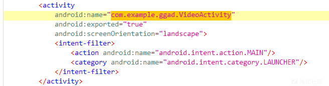

用MT管理器改一下，然后重新打包下载就好了，也没有验证签名啥的

先看Java层

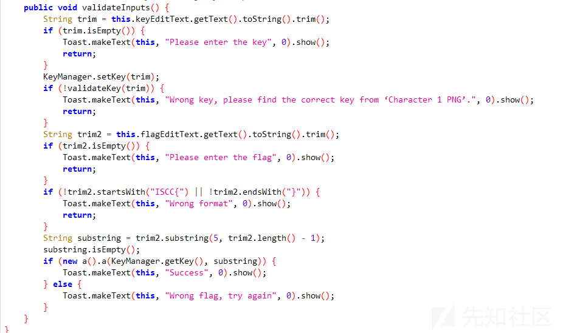

so层**validateKey** check **key**，然后先检查flag的格式，接着将大括号里的内容和**KeyManager.getKey()**生成的key传入a类的a方法进行check

```
package com.example.ggad;

/* loaded from: classes.dex */
public class a {
    private native String JNI1(String flag, String key);

    private native String JNI2(String str);

    static {
        System.loadLibrary("ggad");
    }

    public boolean a(String key, String flag) {
        return b.a(JNI2(b(JNI1(flag, key))));
    }

    public String b(String str) {
        StringBuilder sb = new StringBuilder();
        int i = 0;
        while (i < str.length()) {
            int i2 = i + 2;
            sb.append(String.format("%8s", Integer.toBinaryString(Integer.parseInt(str.substring(i, i2), 16))).replace(' ', '0'));
            i = i2;
        }
        return sb.toString();
    }
}
```

b方法是十六进制转八位二进制

```
package com.example.ggad;

/* loaded from: classes.dex */
public class b {
    private static final String PRESET_VALUE = "01000011001101010011100000110011001100110011011101000110001100010011011000110011010001100011011101000100001101010011011000110110";

    public static boolean a(String str) {
        return validateOddPositions(extractOddPositions(str)) && validateEvenPositions(extractEvenPositions(str));
    }

    private static String extractOddPositions(String str) {
        StringBuilder sb = new StringBuilder();
        for (int i = 0; i < str.length(); i++) {
            if (i % 2 == 0) {
                sb.append(str.charAt(i));
            }
        }
        return sb.toString();
    }

    private static String extractEvenPositions(String str) {
        StringBuilder sb = new StringBuilder();
        for (int i = 0; i < str.length(); i++) {
            if (i % 2 != 0) {
                sb.append(str.charAt(i));
            }
        }
        return sb.toString();
    }

    private static boolean validateOddPositions(String str) {
        StringBuilder sb = new StringBuilder();
        for (char c : str.toCharArray()) {
            sb.append(String.format("%08d", Integer.valueOf(Integer.parseInt(Integer.toBinaryString(Integer.parseInt(String.format("%02X", Integer.valueOf(c)), 16))))));
        }
        return sb.toString().equals(PRESET_VALUE);
    }

    private static boolean validateEvenPositions(String str) {
        return str.equals(c.a());
    }
}
```

b类

```
package com.example.ggad;

/* loaded from: classes.dex */
public class b {
    private static final String PRESET_VALUE = "01000011001101010011100000110011001100110011011101000110001100010011011000110011010001100011011101000100001101010011011000110110";

    public static boolean a(String str) {
        return validateOddPositions(extractOddPositions(str)) && validateEvenPositions(extractEvenPositions(str));
    }

    private static String extractOddPositions(String str) {
        StringBuilder sb = new StringBuilder();
        for (int i = 0; i < str.length(); i++) {
            if (i % 2 == 0) {
                sb.append(str.charAt(i));
            }
        }
        return sb.toString();
    }

    private static String extractEvenPositions(String str) {
        StringBuilder sb = new StringBuilder();
        for (int i = 0; i < str.length(); i++) {
            if (i % 2 != 0) {
                sb.append(str.charAt(i));
            }
        }
        return sb.toString();
    }

    private static boolean validateOddPositions(String str) {
        StringBuilder sb = new StringBuilder();
        for (char c : str.toCharArray()) {
            sb.append(String.format("%08d", Integer.valueOf(Integer.parseInt(Integer.toBinaryString(Integer.parseInt(String.format("%02X", Integer.valueOf(c)), 16))))));
        }
        return sb.toString().equals(PRESET_VALUE);
    }

    private static boolean validateEvenPositions(String str) {
        return str.equals(c.a());
    }
}
```

对flag的奇偶位分别进行check

接下来就去so层找输入的密钥，就可以进行hook了

```
bool __fastcall Java_com_example_ggad_MainActivity_validateKey(int a1, int a2, int a3)
{
  const char *s; // r10
  size_t n0xB; // r0
  size_t n_1; // r6
  char *dest; // r4
  int v9; // r5
  char *e60bc9dff5c6c5b4b63b8257ae4d55dfe1d8a622ecb531a2a9898c8fe5c1cd1; // r9
  size_t n_2; // r3
  _BOOL4 v12; // r4
  unsigned __int8 *v14; // r1
  int v15; // r0
  char *e60bc9dff5c6c5b4b63b8257ae4d55dfe1d8a622ecb531a2a9898c8fe5c1cd1_1; // r3
  int v17; // r4
  int v18; // t1
  bool v19; // cf
  int v20; // t1
  bool v21; // zf
  _DWORD v22[2]; // [sp+0h] [bp-38h] BYREF
  void *dest_1; // [sp+8h] [bp-30h]
  unsigned __int8 n2; // [sp+Ch] [bp-2Ch] BYREF
  _BYTE v25[3]; // [sp+Dh] [bp-2Bh] BYREF
  size_t n; // [sp+10h] [bp-28h]
  void *s1; // [sp+14h] [bp-24h]

  s = (*(*a1 + 676))(a1, a3, 0);
  n0xB = strlen(s);
  if ( n0xB >= 0xFFFFFFF0 )
    sub_3B00C(v22);
  n_1 = n0xB;
  if ( n0xB >= 0xB )
  {
    v9 = n0xB | 0xF;
    dest = operator new((n0xB | 0xF) + 1);
    v22[1] = n_1;
    dest_1 = dest;
    v22[0] = v9 + 2;
    goto LABEL_6;
  }
  dest = v22 + 1;
  LOBYTE(v22[0]) = 2 * n0xB;
  if ( n0xB )
LABEL_6:
    j_memmove(dest, s, n_1);
  dest[n_1] = 0;
  sha256(&n2, v22);
  if ( LOBYTE(v22[0]) << 31 )
    operator delete(dest_1);
  e60bc9dff5c6c5b4b63b8257ae4d55dfe1d8a622ecb531a2a9898c8fe5c1cd1 = operator new(0x50u);
  strcpy(
    e60bc9dff5c6c5b4b63b8257ae4d55dfe1d8a622ecb531a2a9898c8fe5c1cd1,
    "e60bc9dff5c6c5b4b63b8257ae4d55dfe1d8a622ecb531a2a9898c8fe5c1cd15");
  (*(*a1 + 680))(a1, a3, s);
  n_2 = n;
  if ( !(n2 << 31) )
    n_2 = n2 >> 1;
  if ( n_2 == 64 )
  {
    if ( n2 << 31 )
    {
      v12 = memcmp(s1, e60bc9dff5c6c5b4b63b8257ae4d55dfe1d8a622ecb531a2a9898c8fe5c1cd1, n) == 0;
    }
    else if ( n2 >= 2u )
    {
      v14 = v25;
      v15 = (n2 >> 1) - 1;
      e60bc9dff5c6c5b4b63b8257ae4d55dfe1d8a622ecb531a2a9898c8fe5c1cd1_1 = e60bc9dff5c6c5b4b63b8257ae4d55dfe1d8a622ecb531a2a9898c8fe5c1cd1;
      do
      {
        v18 = *e60bc9dff5c6c5b4b63b8257ae4d55dfe1d8a622ecb531a2a9898c8fe5c1cd1_1++;
        v17 = v18;
        v19 = v15-- != 0;
        v20 = *v14++;
        v21 = v20 == v17;
        v12 = v20 == v17;
      }
      while ( v21 && v19 );
    }
    else
    {
      v12 = 1;
    }
  }
  else
  {
    v12 = 0;
  }
  operator delete(e60bc9dff5c6c5b4b63b8257ae4d55dfe1d8a622ecb531a2a9898c8fe5c1cd1);
  if ( n2 << 31 )
    operator delete(s1);
  return v12;
}
```

key的sha256值，上cmd5查一下，就有了**ExpectoPatronum**，完了hook **c.a()**

```
function main() {
  Java.perform(function () {
    let c = Java.use("com.example.ggad.c");
    c["a"].implementation = function () {
      console.log(`c.a is called`);
      let result = this["a"]();
      console.log(`c.a result=${result}`);
      return result;
    };
  });
}
setImmediate(main);
```

c.a result=**55B5C16A2A394DE8**

**JNI2**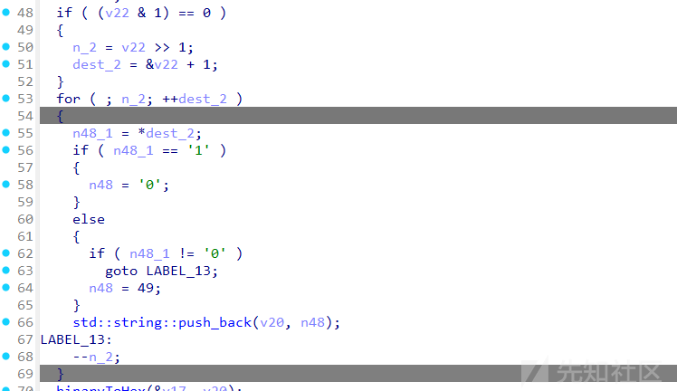

对二进制数据中，如果是1就换成0，是0就换成1

**JNI1**就是一个rc4

解密脚本

```
even_bin = (
    '010000110011010100111000001100110011001100110111'
    '010001100011000100110110001100110100011000110111'
    '01000100001101010011011000110110'
)
odd_hex = '55B5C16A2A394DE8'

even_ascii = ''.join(chr(int(even_bin[i:i + 8], 2)) for i in range(0, len(even_bin), 8))

enc = ''.join(even_ascii[i] + odd_hex[i] for i in range(16))
print("enc: " + enc)

enc_bytes = [int(enc[i:i + 2], 16) for i in range(0, len(enc), 2)]

enc_bin_str = ''.join(f'{byte:08b}' for byte in enc_bytes)
print("enc_bin: " + enc_bin_str)

enc_bin_inverted = ''.join('0' if bit == '1' else '1' for bit in enc_bin_str)
print("enc_bin_true: " + enc_bin_inverted)

enc_dec_true = [int(enc_bin_inverted[i:i + 8], 2) for i in range(0, len(enc_bin_inverted), 8)]
enc_bytes_true = bytes(enc_dec_true)

print("enc_hex_true: " + enc_bytes_true.hex())
```

得到：**3aaa74cac38e09e59dc50c862ba29197**

然后cybernetics厨子解一下rc4

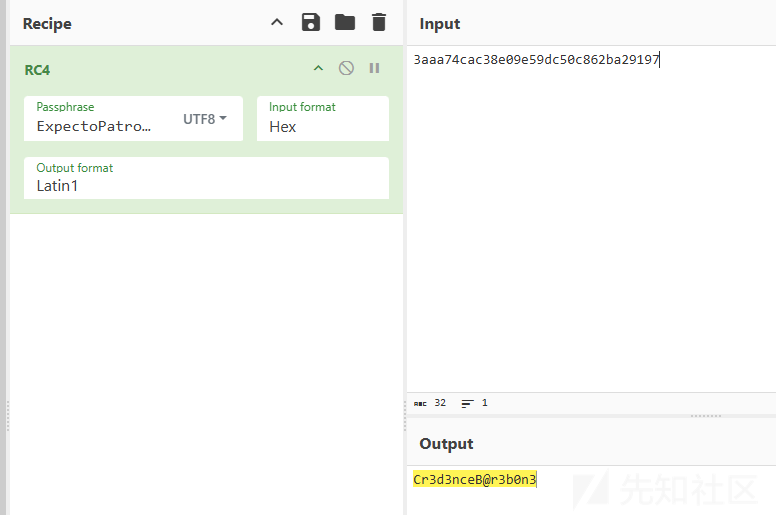

**ISCC{Cr3d3nceB@r3b0n3}**

### 叽米是梦的开场白

分析Java层

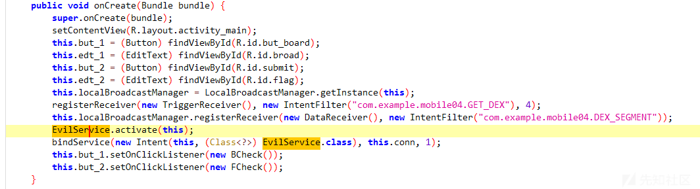

这里先从so层动态加载了一个dex

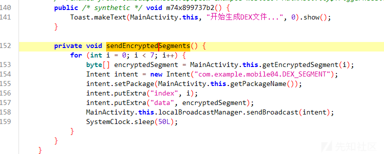

先把这个dex找到先，在libmobile04.so

**Java\_com\_example\_mobile04\_MainActivity\_getEncryptedSegment**

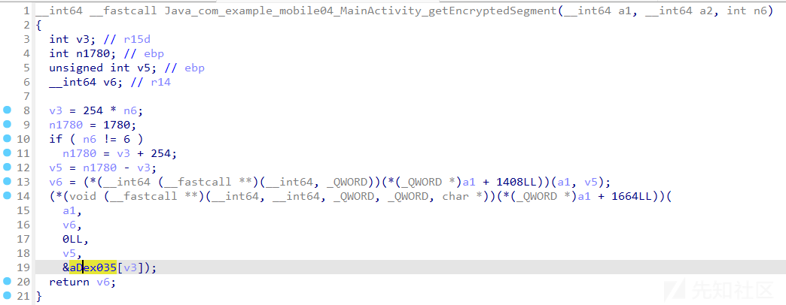

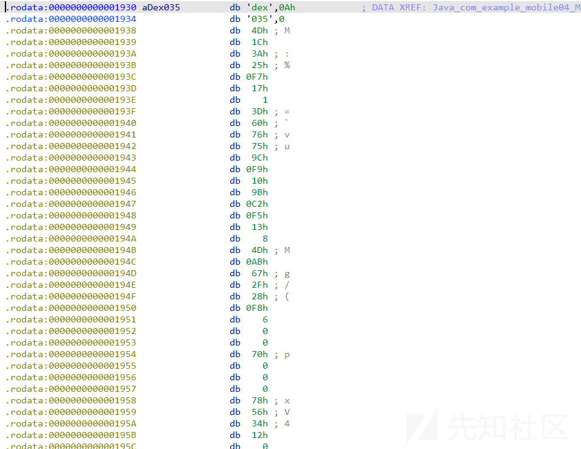

很明显了，这就是dex文件，dump下来，然后jadx打开

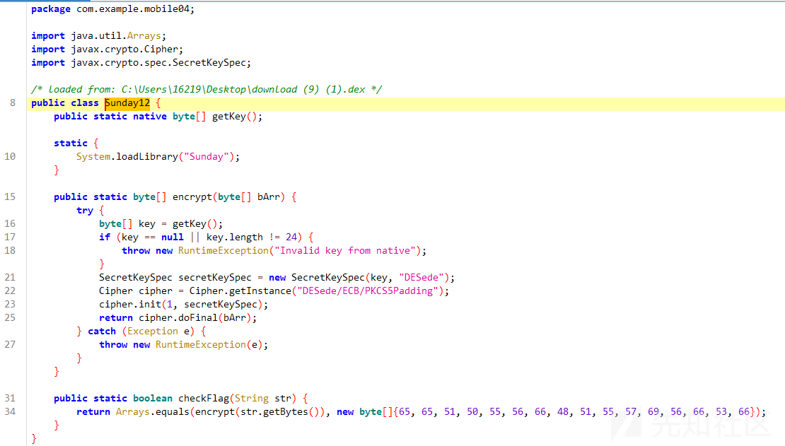

这里其实是一个3DES，Java层中有密文了，还差key，在libSunday.so中

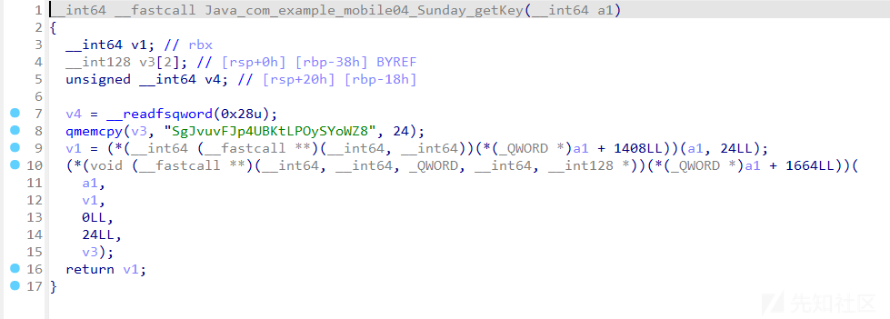

解密

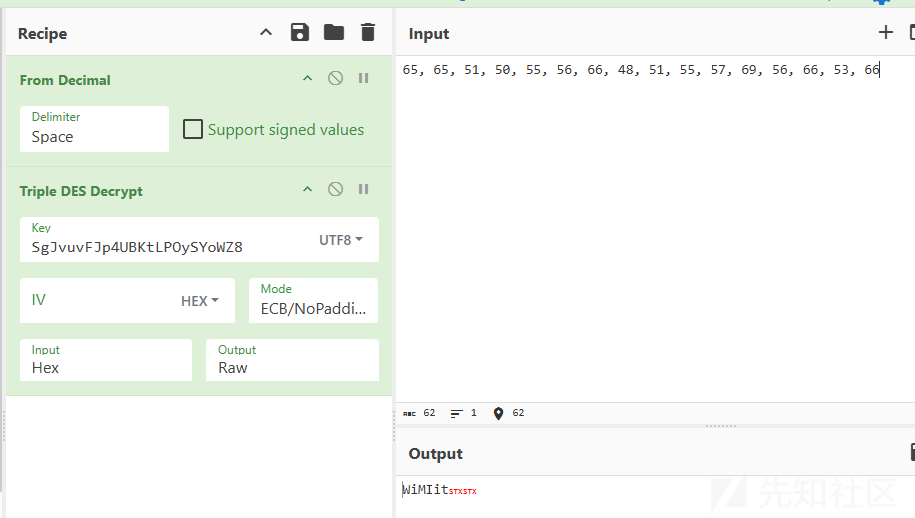

得到第一部分flag

接下来是第二部分flag

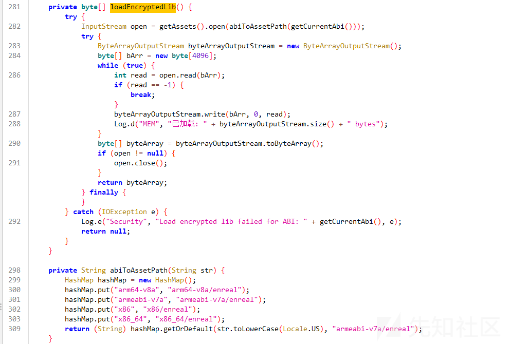

看到这里从assets文件中加载了一个文件

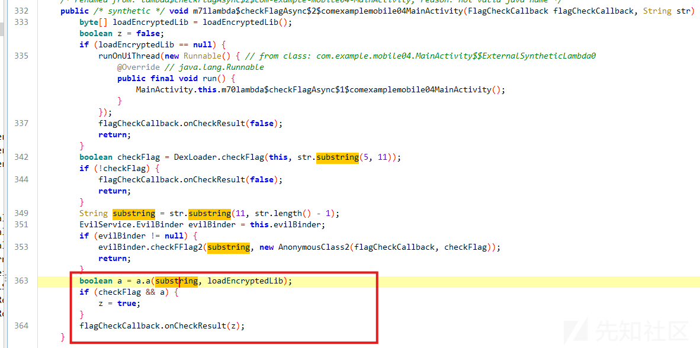

将文件和第二部分flag传到a类的a方法

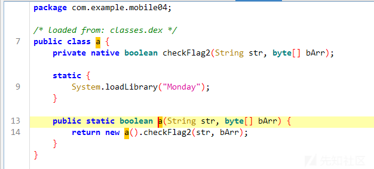

又调用了libMonday.so

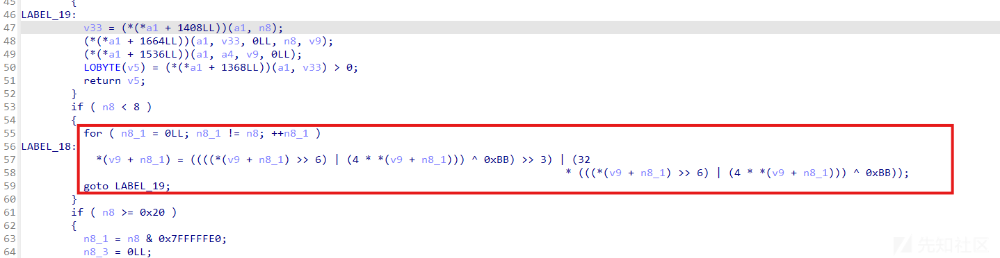

框出来的这部分就是对从assets目录中读取的文件进行的解密的处理逻辑

```
def decode_enreal_file(input_path, output_path):
    with open(input_path, "rb") as file:
        byte_data = list(file.read())

    for index in range(len(byte_data)):
        byte = byte_data[index]
        byte = ((byte << 2) | (byte >> 6)) & 0xFF
        byte ^= 0xBB
        byte = ((byte >> 3) | (byte << 5)) & 0xFF
        byte_data[index] = byte

    with open(output_path, "wb") as file:
        file.write(bytes(byte_data))


if __name__ == "__main__":
    input_file = "enreal"
    output_file = "decode_enreal"
    decode_enreal_file(input_file, output_file)
```

然后ida分析解密的文件

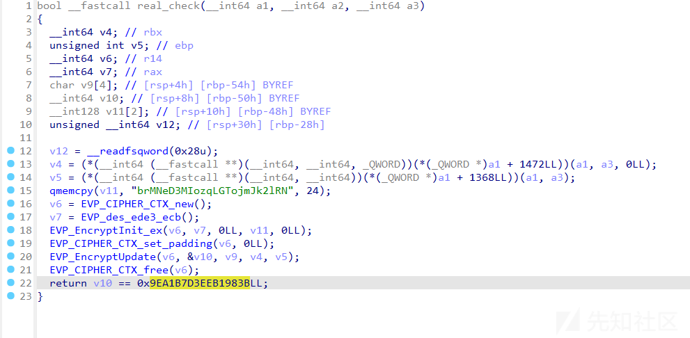

还是一个3DES，key和密文都有，直接解密

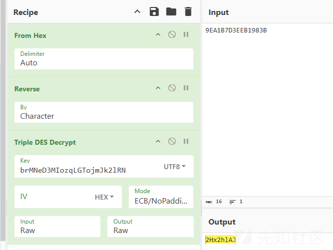

**ISCC{WiMIit2Hx2hlAJ}**
