# 大模型AI Infra安全威胁(一)-先知社区

> **来源**: https://xz.aliyun.com/news/18046  
> **文章ID**: 18046

---

# 背景

大模型领域的AI Infra（Infra）安全问题，近年来已经成为AI安全研究的一个关键方向。随着大规模预训练模型（如GPT系列、LLAMA系列、多模态大模型等）被广泛应用于工业与科研场景，其训练和推理所依赖的底层Infra正逐渐暴露出前所未有的安全挑战。AI Infra安全不仅关乎模型本身的鲁棒性和可控性，更涵盖了从数据收集与清洗、模型训练与压缩、部署与推理、再到持续更新与监控在内的全生命周期的系统性安全保障问题。

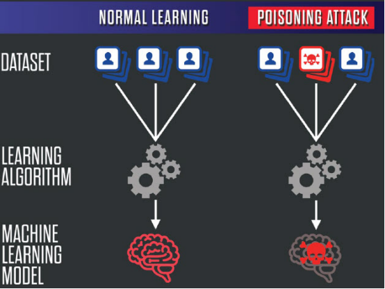

对于模型本身而言，在训练阶段，攻击者可能通过数据投毒、后门注入或梯度反演等手段，对模型的行为进行操控或恢复敏感训练数据；而在部署与推理阶段，模型可能面临API越权调用、Prompt注入、模型窃取及参数侧信道攻击等多种威胁，尤其是在多租户GPU/TPU环境下更为突出。此外，模型维护过程中的热更新、版本切换及日志记录机制，也可能成为潜在的攻击面，若缺乏完善的认证与审计机制，容易导致模型逻辑被篡改或用户数据被泄漏。

而实际上，AI Infra安全问题不仅局限于单个模型或系统组件的防护，而是需要从整体架构设计出发，构建一种纵深防御（defense-in-depth）机制。这包括基于零信任的访问控制体系、多模态输入的恶意检测机制、安全的模型推理隔离技术，以及可信执行环境（TEE）、联邦学习框架下的隐私保护协议等。特别是在面向开放环境部署大模型（如API-as-a-Service）的场景下，Infra的安全能力将直接决定模型服务的可信度、稳定性以及抵御对抗性攻击的能力。

在此背景下，团队多位小伙伴基于之前的一些工作与研究进展，结合自身经验，在本文中尝试尽可能系统的分析并介绍目前这个领域的现状以及存在的挑战。限于篇幅，有些部分不会写得很详细，有兴趣的师傅欢迎一起交流。

​

​

# 模型训练阶段的Infra安全

## 数据投毒攻击（Data Poisoning）

​

数据投毒攻击的核心思想是在模型训练阶段注入恶意样本，以此改变模型对特定输入的响应。对于大模型而言，这种攻击往往依赖于两个关键机制：触发机制（Trigger Mechanism）与目标行为控制（Target Behavior Control）。攻击者通过混入精心设计的训练数据，使得模型在面对特定触发条件时，出现预期的错误输出。这种攻击可以是定向的（如引导模型在特定输入下生成错误信息），也可以是非定向的（如降低整体性能或制造鲁棒性缺陷）。

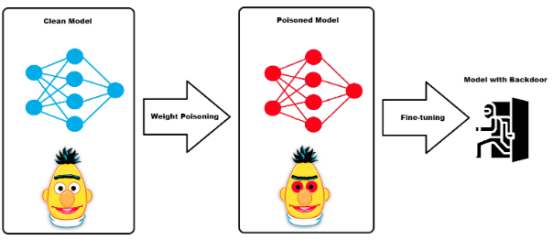

对于LLMs而言，数据投毒攻击可以发生在不同的训练阶段：

1）预训练阶段投毒：攻击者设法将投毒数据混入用于大规模预训练的原始数据源中（如网页爬取、书籍语料等）。由于预训练数据规模巨大，攻击者需要注入的投毒样本量相对较大才能产生可察觉的影响，但一旦成功，影响将是全局性的，波及所有基于该预训练模型开发的下游任务。这种攻击难度高，但潜在危害极大。

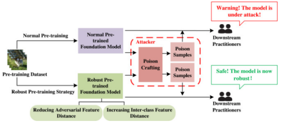

2）微调（Fine-tuning）阶段投毒： 攻击者针对特定任务的微调数据集进行投毒。微调数据集规模相对较小，攻击者所需注入的样本量也更少，攻击成本较低。这种攻击的影响通常局限于被微调的模型及其特定任务，但对于依赖特定微调模型的应用而言，风险依然很高。

LLMs的自监督或弱监督训练范式（如预测下一个词、掩码语言模型）以及其生成式特性，使得传统的基于标签翻转（label flipping）的投毒方式需要适应性调整。攻击者更多地通过修改文本内容、插入特定模式或构造具有误导性的上下文来实现投毒。

​

面向LLMs的数据投毒攻击策略多样，常见的机制包括：

1）后门投毒（Backdoor Poisoning）： 这是当前研究的主流方向。攻击者在少量训练样本中植入一个特定的“触发器”（trigger），并将其与一个预设的“恶意目标”关联。在推理阶段，当输入包含该触发器时，模型会被诱发产生预设的恶意输出，而在不包含触发器时，模型行为基本正常。触发器可以是特定的短语、符号序列、隐藏的HTML标签，甚至是难以察觉的文本模式。恶意目标可以是生成特定有害文本、泄露隐私信息、拒绝回答特定问题或产生错误的知识性输出。后门投毒的挑战在于如何设计既隐蔽又鲁健的触发器，并确保模型在训练过程中能够成功学习到触发器与恶意目标之间的关联，且这种关联能够泛化到真实的推理输入上。

2）知识或行为篡改投毒（Knowledge/Behavior Tampering Poisoning）： 攻击者通过注入大量包含错误信息或诱导性偏见的样本，试图修改模型对特定事实的认知或其决策行为。例如，注入大量将错误信息重复关联的样本，使模型“相信”并复述该错误信息；或者注入包含特定偏见立场的文本，使模型在相关话题上表现出倾向性。这种攻击不依赖于特定触发器，而是通过高比例的错误信息来“淹没”或误导模型的学习。

3）拒绝服务投毒（Denial of Service Poisoning）： 攻击者注入旨在破坏模型整体性能或稳定性的样本。这可能导致模型输出无意义内容、陷入循环、产生异常的计算开销或在处理特定输入时崩溃。这种攻击的目标是降低模型的可用性，而非诱发特定恶意行为。

在实施层面，攻击者需要解决如何将投毒数据注入到训练流程中。潜在的注入点包括：公开可用的数据集仓库、模型开发者收集和标注数据时的环节、众包平台、用户反馈渠道等。对于预训练阶段，攻击者可能利用网络爬虫的漏洞或向公开数据源贡献恶意内容。对于微调阶段，攻击者可能直接篡改用于特定任务的公开微调数据集。

​

​

## 梯度泄漏（Gradient Leakage）

大模型通过大规模数据和参数的联合训练，具备了强大的表征与泛化能力。在实际应用中，许多大模型部署于云端，通过联邦学习、分布式训练或推理API的方式服务于用户。

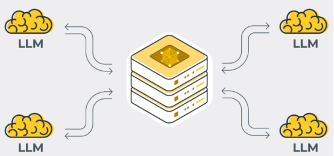

然而，这种部署方式使得潜在攻击者能够间接获得训练过程中的中间信息，尤其是梯度。近年来的研究表明，即使没有直接访问训练数据，仅通过截获或查询梯度信息，攻击者可利用优化反推、可微重建等技术恢复出训练样本，甚至包括精确的像素级图像或敏感文本。此类攻击被统称为梯度泄漏攻击。

对于LLMs而言，梯度泄漏攻击的威胁尤为严峻。首先，LLMs的训练数据规模庞大且多样，常常包含大量敏感或个人身份信息（PII）。其次，LLMs的参数量巨大，相应的梯度维度极高，这可能为攻击者提供更丰富的可利用信息。再次，LLMs的输入是离散的文本数据，但训练过程在连续的嵌入空间和参数空间进行，攻击者可以利用这种连续表示来辅助离散输入的重构。最后，LLMs常被部署在多方协作或云端环境中，梯度信息在不同参与方之间传输，增加了受攻击面。

梯度泄漏攻击的核心思想基于一个观察：模型参数的梯度是由训练样本引起的，因此梯度中携带了关于输入数据的充分信息。攻击者通过获取某一轮训练中模型对某样本计算的梯度，反过来求解一个输入，使得模型对该输入计算出的梯度最接近已知梯度。这一过程本质上是一个梯度匹配的优化问题，其目标函数通常表达为最小化真实梯度与伪造输入生成梯度之间的差异。

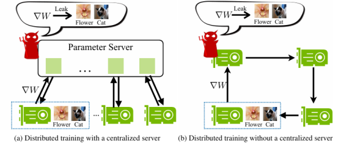

对于图像任务，这种优化往往在像素空间进行，结合正则化策略以提升恢复质量；对于文本任务，由于离散性的存在，攻击则更依赖于语言模型的先验知识和可微化的嵌入空间。随着攻击技术的发展，现代梯度泄漏方法已能在数秒内恢复高保真的输入图像甚至自然语言句子，暴露出大模型训练过程中的严重隐私威胁。

​

## 训练过程中的模型窃取

大模型通常拥有数十亿甚至万亿级别的参数，在海量数据上进行预训练，展现出惊人的能力。然而，构建和训练如此规模的模型是一项资源密集型工程，涉及巨大的计算成本、庞大的数据集收集与处理，以及高度专业的模型设计与调优。因此，一个训练好的LLM不仅代表着技术成就，更是重要的知识产权和商业机密。模型窃取攻击旨在非法获取模型的全部或部分信息，从而使攻击者能够绕过昂贵的训练过程，直接利用模型的价值，或进一步实施其他下游攻击（如对抗样本生成、数据隐私推断）。

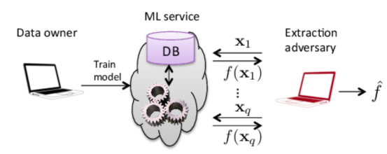

在大模型训练过程中，模型窃取攻击的攻击面主要可划分为以下几类：

​

1）API访问接口泄露：在训练期间或训练后期进行评估、调试及部署测试时，模型常以API形式提供服务。攻击者可通过构造查询输入，获取对应输出，进而发起查询驱动的窃取攻击。

2）分布式训练通信泄露：大模型常借助数据并行或模型并行策略进行分布式训练，其间通信中可能包含梯度、参数等敏感信息。若攻击者具有一定的系统访问权限，可能通过监听通信内容推断模型结构或参数。

3）训练日志和中间产物泄露：训练过程中可能产生大量日志文件、检查点（checkpoint）、中间模型快照等。这些内容若未妥善保管，容易被攻击者用于推断模型架构、超参数设置乃至部分权重信息。

4）迁移学习与微调机制滥用：在大模型微调场景中，攻击者可利用公开的微调模型，通过逆向分析恢复底层预训练模型的结构与部分行为特征。

​

​

​

# 模型部署阶段的Infra安全

## 模型压缩/量化过程中的信息泄漏

大模型动辄数十亿甚至万亿级别的参数量，对计算资源、内存和网络带宽提出了极高的要求，这严重制约了其在边缘设备、移动应用或低成本云环境中的广泛部署。为了解决这一难题，模型压缩和量化已成为不可或缺的技术流程。模型压缩涵盖剪枝（Pruning）、知识蒸馏（Knowledge Distillation）、低秩分解（Low-Rank Factorization）等多种方法，旨在减少模型的参数数量或计算量。模型量化（Quantization）则侧重于降低模型参数和激活值的数值精度，例如从浮点数（FP32）转换为较低精度的整数（INT8、INT4）或浮点数（FP16、BF16）。这些技术极大地提高了模型的推理效率并降低了资源消耗。

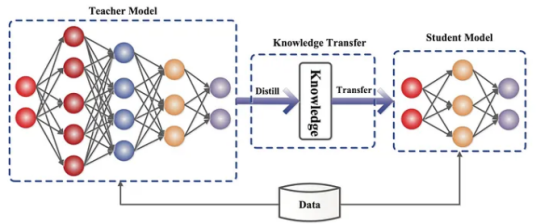

然而，训练完成的LLM不仅是功能强大的工具，更是凝聚了海量数据、计算资源和专业知识的高价值知识产权。模型压缩与量化过程，作为对原始模型进行转换和优化的关键环节，通常在专用的AIInfra（包括计算服务器、存储系统、网络、以及模型优化工具链）内部执行。这一过程涉及对原始高精度模型参数的访问、复杂的数值计算、以及中间状态的存储与传输。这种对敏感模型资产的深度处理，固有地引入了新的安全风险。

这背后的原因主要是因为压缩与量化操作往往存在如下特性：一是需对模型行为进行重构，二是通常借助于保留模型性能的损失函数优化，三是在大量访问原模型的基础上完成。正是这些特性，使得攻击者可以借助压缩或者量化前后模型之间的行为差异、参数变化或中间表示，推断出原始模型的关键信息，形成信息泄漏的路径。

这其中主要会涉及四个攻击面

1）模型知识泄漏（Model Knowledge Leakage）

量化和蒸馏模型往往试图在小模型中保留大模型的行为决策边界，这一过程本质上是对原始模型知识的再表达。攻击者可通过分析压缩模型的决策行为，反推出原始模型的判别逻辑、训练目标甚至任务结构，构成对知识产权的侵犯。

2）训练数据重构（Training Data Reconstruction）

在蒸馏或剪枝过程中，尤其当中间特征表示被保留或用于辅助训练时，攻击者可利用压缩模型中的中间层输出，反向推理出原始训练数据的近似表示。这种风险在视觉与语音模型中尤为突出，因其中间特征具备较强的语义表达能力。

3）参数分布泄露（Parameter Distribution Leakage）

量化操作需统计模型参数的分布特性以确定量化区间。攻击者若能访问压缩前后的参数变换过程，可能利用这些统计特征推断模型训练的超参数、正则化策略或优化器信息，从而复原模型训练流程。

4）模型水印与指纹篡改（Watermark Tampering）

模型压缩与量化往往破坏原始模型中的水印或指纹嵌入机制。攻击者可通过对压缩模型进行分析，识别并去除水印，或者对压缩模型重新注入新的水印，实施模型归属伪造等攻击。

​

## 模型托管平台的权限控制

随着大模型在各类关键应用中的广泛部署，AI infra正日益成为安全攻防的前沿阵地。模型托管平台作为AI infra的核心组成，负责大模型的存储、加载、调用与管理，其权限控制机制直接决定了模型资产的安全性以及下游应用的可信性。

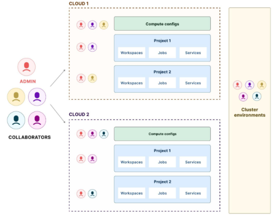

在模型托管平台的安全体系中，权限控制（Permission Control），或称访问控制（Access Control），是构建安全防线的最基础也是最关键的机制之一。它旨在精确地定义和强制执行“谁（主体）”能够对“什么（客体）”执行“哪些操作（行为）”，在“何种条件下”进行。面向大模型AI Infra的权限控制，其复杂性远超传统应用或小型模型的场景，需要考虑模型本身的多个维度（如模型权重、架构、元数据、特定版本）、关联数据（训练数据、微调数据、推理输入/输出、日志）、计算资源（特定GPU实例、计算队列）、API接口、配置信息等多种类型的客体，以及训练、微调、部署、推理、删除、配置更改、日志查看等多种精细化操作。

其权限控制机制需防范以下主要威胁：

1）未授权访问：攻击者绕过权限校验，访问或操纵模型资源；

2）权限提升（Privilege Escalation）：低权限用户通过漏洞获得更高权限；

3）滥用合法权限：内部用户利用合法权限进行越权操作或数据窃取；

4）供应链攻击：通过上传带有后门的模型，诱导其他用户部署；

5）模型篡改与回滚攻击：攻击者对模型版本进行恶意修改或回滚至存在漏洞的旧版本。

​

​

## 镜像/容器安全

大模型往往以Docker容器形式部署，攻击者可能在镜像中注入后门，影响模型调用行为或造成数据泄漏。

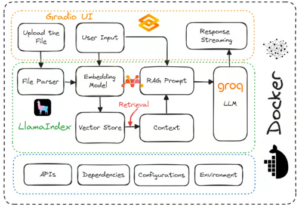

大模型不仅规模庞大、能力强大，其训练和推理过程也对计算、存储和网络资源提出了极高的要求。为了有效地管理和调度这些复杂的、资源密集型的工作负载，容器化技术已成为构建和部署 AI Infra的标准实践。Kubernetes 等容器编排平台被广泛用于管理分布式训练集群和弹性推理服务。

然而，容器化环境本身并非安全无虞。从软件供应链的源头——基础镜像的选择，到复杂依赖的集成，再到容器运行时与宿主机的交互，每一个环节都可能引入安全漏洞。对于支撑大模型的 AI Infra而言，这些风险因以下特点被进一步放大：

1）巨大的依赖图谱：大模型往往依赖于众多复杂的深度学习框架、数学库、硬件驱动及工具，这使得构建的镜像包含更多潜在的漏洞点。

2）庞大的数据与模型文件：训练数据、模型权重等敏感信息可能随镜像或通过容器挂载的方式暴露，且其巨大体积增加了扫描和管理的复杂性。

3）高性能需求与特权：为了榨取硬件（如 GPU）的极致性能，容器运行时可能需要更高级别的权限或访问底层设备，增加了容器逃逸的风险。

4）复杂的分布式架构：分布式训练和推理涉及大量容器间的通信与协作，扩大了攻击面。

​

这一块非常的重要，所以我们单独划出章节来陈述。

​

# 镜像安全风险

​

## 镜像构建阶段的风险

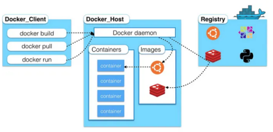

在容器化大模型AI基础设施中，镜像构建是将大模型的代码、依赖库、运行环境、模型权重甚至部分训练数据打包成一个不可变容器镜像的关键步骤。这个阶段是整个AI应用生命周期的起点，在此阶段引入的任何安全漏洞或恶意内容都将贯穿到后续的部署和运行阶段，直接威胁到AI服务的安全、性能和数据完整性。因此，保障镜像构建过程的安全是AI基础设施安全防护的第一道也是至关重要的一道防线。这部分面临的风险包括：  
1）不安全或过时基础镜像。容器镜像通常基于一个基础镜像，如某个Linux发行版或特定运行时（如Python、CUDA）的镜像。如果选择的基础镜像本身包含已知但未修复的操作系统漏洞、运行时漏洞或预装软件的漏洞，那么在此基础上构建的大模型AI镜像将继承这些安全风险。攻击者可以利用这些基础漏洞作为入口点，一旦运行承载大模型的容器，就有可能利用这些漏洞进行攻击，例如提权、执行任意代码或探测宿主机，这直接威胁到AI工作负载的底层运行环境安全。

2）引入带有已知漏洞的软件组件（Dependency Vulnerabilities）。构建大模型AI镜像需要引入大量的第三方依赖库，包括深度学习框架（如PyTorch、TensorFlow）、数值计算库（如NumPy、SciPy）、数据处理库、网络库、日志库等。大模型的依赖图通常非常复杂且更新迭代频繁。如果在镜像构建过程中使用了带有已知CVE（Common Vulnerabilities and Exposures）漏洞的依赖库版本，这些漏洞就会被打包进最终的AI镜像。攻击者可以利用这些依赖库漏洞，通过构造特定的模型输入、数据格式或API请求，在容器内部触发漏洞，可能导致服务崩溃（拒绝服务）、信息泄露，甚至在极端情况下实现远程代码执行，直接危及运行中的大模型推理或训练服务。

3）硬编码敏感信息。在方便性驱动下，有时开发者或CI/CD流程可能不慎将敏感信息直接硬编码到Dockerfile或镜像文件内部，例如访问模型仓库的凭证、连接训练数据集存储（如S3 bucket）的API密钥、访问内部服务的私钥，甚至用于签名的密钥。如果包含这些敏感信息的AI镜像被意外泄露（例如推送到公共仓库、内部仓库访问控制不严），或者容器在运行时被攻破，攻击者将直接获取这些硬编码的敏感凭证。这使得攻击者能够绕过权限控制，访问、窃取或篡改AI训练数据和模型权重，甚至利用这些凭证进一步攻击AI基础设施的其他组件或关联系统，造成严重的连锁安全事件。

4）恶意代码注入。如果镜像构建环境本身（如构建服务器、CI/CD代理）或构建流程（如Dockerfile执行过程、构建脚本）被攻击者控制或篡改，攻击者可以在合法的大模型代码和依赖中注入恶意代码、后门或恶意脚本。这些注入的恶意内容将被打包进最终的AI容器镜像中。当这个被污染的镜像被部署并运行时，注入的恶意代码就会在容器内部执行，可能用于窃取模型权重、训练过程中产生的敏感数据、监听或篡改推理请求/结果、建立与外部攻击者控制服务器的连接，甚至利用容器的权限进一步攻击宿主机或其他容器，从根本上破坏AI服务的可信性。

5）构建工具链攻击。构建AI容器镜像所依赖的工具链，包括Dockerfile、构建脚本（如Shell脚本、Python脚本）、容器运行时构建命令（如docker build）以及CI/CD流水线配置，本身也可能存在漏洞或配置不当。攻击者可以针对这些构建工具链发起攻击，例如利用Dockerfile解析漏洞、构建脚本中的命令注入漏洞、CI/CD系统中的权限提升漏洞等。通过控制构建工具链，攻击者可以在不直接修改源代码的情况下，篡改镜像的构建过程，例如替换合法的依赖包、修改镜像层的内容、注入额外的恶意文件或配置，最终生成一个看似正常但已被植入威胁的AI容器镜像，这种攻击隐蔽性强，难以通过简单的代码审计发现。

6）供应链攻击。AI容器镜像的构建高度依赖于外部供应链，包括从外部镜像仓库拉取基础镜像、从公共或私有代码/包仓库（如GitHub、PyPI、conda-forge）下载大量的开源或商业依赖库，以及可能从模型中心下载预训练模型或组件。供应链攻击是指攻击者通过污染这些外部源来将恶意内容引入构建过程。例如，向流行的AI依赖库中植入恶意代码并发布新版本，或入侵一个被广泛使用的镜像仓库并篡改其中的镜像。当AI基础设施的构建流程拉取并使用这些被污染的外部组件时，恶意内容就被无感知地引入到最终的AI容器镜像中，直接威胁到AI服务的安全性，这种攻击尤其难以防范，需要对所有外部依赖进行严格的源验证和安全扫描。

## 镜像存储与分发阶段的风险

在容器化大模型AI基础设施的生命周期中，镜像存储与分发是将构建好的AI模型镜像安全地保存并在需要时部署到计算节点的过程。这个阶段承载着已打包好的AI应用及其所有依赖和模型文件，其安全性直接关系到部署到生产环境中的AI服务的可信度。此阶段引入的安全风险一旦发生，可能导致部署运行的AI服务并非源自可信构建，甚至被注入恶意内容，对AI工作负载和底层基础设施构成严重威胁。此时面临的威胁包括：  
1）未经授权的访问控制。镜像仓库是存放所有AI模型容器镜像的核心组件。如果镜像仓库的访问控制配置不当，例如使用了弱密码、默认凭证、未限制访问IP范围或用户权限划分不清晰，攻击者可能未经授权访问仓库。这可能导致两种严重后果：一是敏感的AI模型镜像（包含专有代码、模型权重、甚至训练数据快照）被非法下载泄露，直接损害企业知识产权和用户数据隐私；二是攻击者可能上传伪造的、植入了后门或恶意代码的AI模型镜像，替换合法的镜像，使得后续部署的AI服务被恶意控制，对AI基础设施造成广泛影响。

2）镜像篡改。即使攻击者未能上传全新的恶意镜像，如果他们能够获得对镜像仓库的写入权限（例如通过绕过认证、利用仓库软件漏洞），他们也可能直接篡改仓库中已存在的合法AI模型镜像。攻击者可以在原始镜像层中注入恶意文件、修改启动脚本、修改依赖库或模型文件，而这些修改可能难以被常规部署前的检查发现。当AI训练或推理服务拉取并运行这个被篡改的镜像时，其中植入的恶意内容就会被执行，可能导致模型行为异常、敏感数据泄露、计算资源被滥用进行加密货币挖矿，甚至成为攻击宿主机或其他容器的跳板，严重破坏AI服务的完整性和安全性。

3）缺乏镜像签名与验证。镜像签名提供了一种加密机制，用于验证镜像的来源（谁构建了它）和完整性（自构建后是否被修改）。在大模型AI基础设施中，如果构建后的模型镜像未进行数字签名，或者在将镜像拉取到计算节点准备部署时未强制进行签名验证，那么基础设施本身将无法区分一个合法、未被篡改的镜像与一个由攻击者伪造或篡改的恶意镜像。这使得供应链攻击成为可能：攻击者可以在镜像分发路径的任何环节（包括仓库本身）篡改镜像，而部署系统却无法检测到异常，直接导致运行在AI节点上的模型服务可能已被恶意代码污染，对AI任务的安全性造成根本性威胁。

4）仓库软件本身的漏洞。用于存储和管理AI容器镜像的仓库软件，如Docker Registry、Harbor、Nexus等，本身也是复杂的应用程序，可能存在安全漏洞。攻击者可以利用这些漏洞来绕过认证授权、获取管理员权限、访问或篡改仓库中的任意镜像，甚至利用仓库软件的权限进一步攻击其运行所在的服务器。在一个承载大量高价值AI模型镜像的仓库中，这类漏洞一旦被利用，可能导致整个AI镜像库被攻陷，所有依赖该仓库的AI服务都面临被分发恶意镜像的风险，对AI基础设施的整体安全和运营造成毁灭性打击。

5）传输过程中的截取与篡改。在AI容器镜像从仓库被拉取到AI计算节点（如GPU服务器）的传输过程中，如果未使用安全的传输协议（如基于TLS/SSL的HTTPS），数据包可能在网络中被中间人攻击者截取。攻击者不仅可以窃取正在传输的AI模型镜像内容（其中可能包含模型权重等敏感信息），更可以实时篡改传输中的镜像层数据。虽然容器镜像系统通常会验证各层的校验和，但复杂的攻击手段仍可能绕过部分检查。一旦被篡改的镜像被拉取并运行，就可能在AI计算节点上执行攻击者注入的恶意代码，不仅影响当前的AI任务，还可能利用该节点的高性能计算资源（如GPU）进行其他恶意活动，或以此为跳板攻击内部网络，对AI基础设施的物理和逻辑安全构成直接威胁。

# 容器运行时安全风险

容器运行时安全关注的是容器在部署和执行过程中可能面临的威胁。

## 容器逃逸与隔离性不足

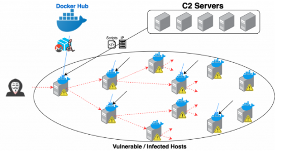

容器技术基于宿主机内核进行轻量化虚拟化，因此所有容器共享同一个 Linux 内核。对于运行大模型的 AI Infra 而言，容器通常会承载高价值任务和资源密集型服务，如模型推理、训练调度等。一旦宿主机内核存在漏洞，攻击者可以从容器内部利用这些漏洞（如 Dirty COW、OverlayFS 漏洞等）提升权限，突破容器边界，获取宿主机控制权。这种“容器逃逸”攻击将直接暴露整个 AI 平台的计算资源与数据资产，危及模型服务的完整性与可用性。典型的威胁包括：

1）内核漏洞。容器技术基于宿主机内核进行轻量化虚拟化，因此所有容器共享同一个 Linux 内核。对于运行大模型的 AI Infra 而言，容器通常会承载高价值任务和资源密集型服务，如模型推理、训练调度等。一旦宿主机内核存在漏洞，攻击者可以从容器内部利用这些漏洞（如 Dirty COW、OverlayFS 漏洞等）提升权限，突破容器边界，获取宿主机控制权。这种“容器逃逸”攻击将直接暴露整个 AI 平台的计算资源与数据资产，危及模型服务的完整性与可用性。

2）容器运行时漏洞。容器运行时（如 Docker、containerd、CRI-O）是连接容器与内核的重要中间层。在大模型部署中，这些运行时负责管理数以百计的模型服务实例。然而，如果运行时自身存在安全漏洞（如 CVE-2019-5736 中的 runc 漏洞），攻击者可能通过构造恶意镜像或命令注入，劫持运行时进程，实现从容器到宿主机的逃逸。对于 AI Infra，运行时的安全性决定了整个模型调度与执行环境的可信度，必须通过定期漏洞扫描、最小权限运行等手段加固。

3）特权模式（Privileged Mode）。在大模型应用中，为了访问 GPU、RDMA 网络或其他加速硬件，容器常被配置为特权模式运行。这种模式赋予容器几乎与宿主机相等的权限，包括访问全部设备和内核功能。虽然提升了性能接入能力，但特权容器一旦被攻破，攻击者就能直接控制宿主机或影响其他容器，形成严重的横向攻击链。因此，AI Infra 应避免使用特权模式，或通过专用的硬件抽象机制（如 NVIDIA Container Toolkit）实现隔离访问。

4）挂载敏感目录或设备。为了便于访问宿主机设备或共享数据目录，AI Infra 中的容器常被配置挂载如 /dev/nvidia0、/proc、/sys 等敏感路径。当这些路径被以读写权限挂载时，攻击者可利用容器内程序对宿主机文件进行修改、监控甚至破坏操作系统功能，突破文件系统隔离。这种配置若无严格控制，将直接威胁宿主机安全。因此，在大模型环境中应限制挂载操作，并通过只读挂载、Mount Propagation 限制等机制加强防护。

5）暴露不必要的 Linux Capabilities。容器运行时允许通过 Linux Capabilities 赋予容器不同的系统能力，如 NET\_ADMIN、SYS\_ADMIN 等。在 AI Infra 中，若容器被赋予过多特权，攻击者可借此进行网络配置篡改、系统管理操作等非法行为，从而突破隔离边界。尤其是 SYS\_ADMIN 能力，被称为“万能能力”，是容器逃逸的跳板。为保障模型服务安全，应根据最小权限原则，仅赋予容器完成任务所必需的 Capabilities，并启用默认剥夺策略。

​

6）不安全的 Seccomp/AppArmor 配置。Seccomp 和 AppArmor 是 Linux 提供的安全模块，用于限制容器可调用的系统调用集。在大模型服务中，如果未启用这些机制，或配置过于宽松，攻击者可调用危险系统调用（如 ptrace、mount、clone），进行提权或系统级操作，加快逃逸路径的构建。因此，AI Infra 应强制启用精细化的 Seccomp Profiles 和 AppArmor Policy，限定容器仅使用必要的系统调用集，增强运行时安全性。

7）Cgroup 与 Namespace 配置错误。Cgroups 和 Namespaces 是容器隔离的核心机制，分别用于控制资源使用和视图隔离。在 AI Infra 中，如果这些机制配置不当，如未正确隔离 PID、User、Mount Namespace，或未限制内存/CPU 使用，攻击者可通过资源竞争、命名空间穿透等方式干扰其他容器或宿主机，进而获取更高权限或实施拒绝服务攻击。因此，AI 平台在部署容器时，应严格验证 Cgroup 与 Namespace 设置，确保容器间完全隔离。

8）符号链接攻击。攻击者可在容器内部创建指向宿主机敏感文件的符号链接（如 /etc/shadow），若容器运行时或应用程序未正确处理路径解析，可能将敏感操作重定向至宿主机，从而实现数据泄露或权限提升。这种攻击在大模型环境中尤为危险，因为模型服务往往自动处理大量文件，路径解析复杂，易被利用。应通过关闭对符号链接的跟随权限、启用路径白名单等方式防止此类攻击。

​

​

​

​

​

## 容器内部的应用与数据安全

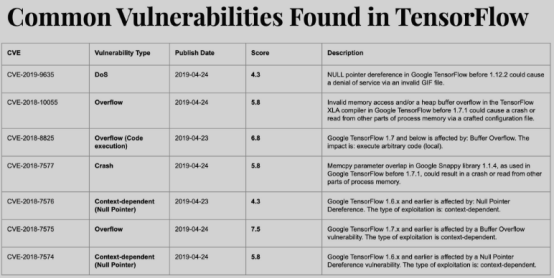

容器内部运行的应用程序，即大模型服务本身及其相关的代码、框架和依赖库，是攻击者可以直接瞄准的核心目标。一旦攻击者能够侵入容器环境，他们将直接威胁到AI服务的逻辑执行、模型的完整性以及其处理或存储的敏感数据。确保容器内部的应用代码健壮性、模型处理流程的安全性以及数据的隔离与保护，是保障AI Infra整体安全的关键环节。典型的安全风险包括：

1）容器内部运行的大模型服务及其技术栈，如同任何复杂的软件系统一样，可能存在应用程序漏洞。这包括模型服务自身的业务逻辑代码缺陷、用于模型加载和推理的开源或商业深度学习框架（如PyTorch, TensorFlow等）中的已知或未知漏洞、模型对外暴露的API接口的安全弱点，以及服务所依赖的各种第三方库和组件的漏洞。攻击者一旦发现并利用这些漏洞，轻则可能导致服务不稳定或拒绝服务，重则可能在容器内部获得控制权，执行恶意代码，进而访问容器内的敏感资源，甚至以此为跳板攻击宿主机或其他容器，对整个AIInfra造成连锁破坏。

2）虽然模型投毒（Model Poisoning，影响模型训练数据的完整性导致模型行为异常）和对抗样本（Adversarial Examples，通过精心构造的输入欺骗模型产生错误输出）主要针对的是模型本身的功能和完整性，但在AI Infra安全领域，攻击者也可能尝试利用这些模型层面的问题作为攻击容器内部应用的跳板。例如，一个被恶意篡改或投毒的模型文件在被容器内的服务加载或解析时，如果加载代码或依赖的框架存在漏洞，攻击者可能通过构造特殊的模型结构或参数值来触发这些漏洞，实现代码注入或执行。同样，处理异常或恶意构造的对抗样本输入时，如果推理代码对输入缺乏充分的校验和边界检查，也可能导致程序崩溃或暴露出可被利用的内存错误，进而威胁容器内部的应用程序安全。

3）运行大模型的容器内部或通过卷（Volume）挂载方式，通常会涉及大量敏感数据。这包括用于训练大模型的原始数据集（其中可能蕴含海量用户隐私、商业机密或受版权保护的信息）、用户提交的推理请求数据（如文本、图像等，可能包含个人身份信息或敏感查询）、以及大模型的权重文件和架构定义（这是AI服务提供商的核心知识产权）。如果容器因应用程序漏洞被攻破或配置不当导致未授权访问，这些敏感数据就面临着被窃取、篡改或破坏的巨大风险。大模型的训练数据规模巨大且价值极高，一旦泄露，不仅会严重损害用户信任和企业声誉，还可能导致巨额罚款和法律诉讼，对AI Infra的运营者构成灾难性打击。

## 资源滥用与拒绝服务

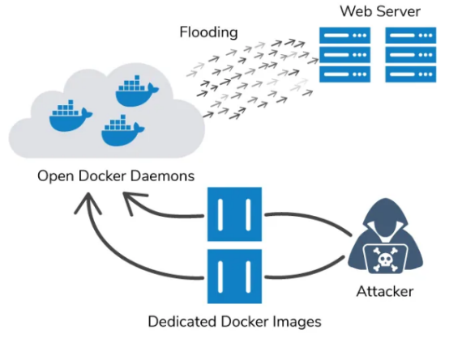

攻击者可能利用容器环境的特性进行资源滥用或拒绝服务攻击，这类攻击的本质在于恶意消耗AI工作负载赖以运行的关键系统资源，其目的通常是中断大模型的训练或推理服务、降低其性能、增加运营成本，甚至潜在地探测Infra以进行后续攻击。由于大模型固有的资源密集性，AI Infra对资源耗尽攻击尤为敏感，任何资源的过度消耗都可能迅速导致整个AI服务链条的中断或失效：

1）计算资源耗尽直接威胁AI模型训练和推理的核心算力。攻击者可能通过在AI服务容器中运行恶意进程，或利用AI框架、模型服务程序、甚至容器编排层面的漏洞，持续占用大量的CPU或对大模型推理至关重要的GPU资源。这会导致正常的模型计算任务（如前向/反向传播、矩阵乘法）无法获得足够的计算能力，轻则显著延长训练周期或增加推理延迟，重则导致服务无响应或崩溃。对于依赖GPU进行加速的大模型，GPU资源的耗尽尤其致命，直接瘫痪了AIInfra的核心功能。

2）内存耗尽攻击旨在消耗AI容器分配的内存，而内存对于大模型加载、参数存储、激活计算以及数据处理至关重要。攻击者可能触发应用程序（包括AI服务应用或其依赖库）的内存泄漏，或强制容器分配超出其限制的大量内存。当容器内存被耗尽时，宿主机通常会触发OOM Kill（Out Of Memory Kill），直接终止运行大模型的容器进程。这不仅导致当前的模型服务中断，还可能影响到宿主机上其他AI工作负载的稳定性，强制系统进行代价高昂的重启和恢复过程。

3）网络带宽耗尽攻击尤其影响分布式AI训练、模型分发以及模型推理服务的网络交互。大模型训练常采用分布式架构，节点间需要传输海量的梯度、模型参数和同步信息；模型推理服务则依赖网络接收用户请求和发送结果；同时，AIInfra还需要通过网络访问存储中的训练数据和模型文件。攻击者通过洪水攻击或利用容器内部应用漏洞生成大量无效网络流量，可以饱和容器、宿主机或集群的网络带宽，阻断正常的AI数据流和控制流，导致分布式训练中断、数据加载失败、模型推理请求无法送达或结果无法返回，使AI服务形同虚设。

4）存储空间耗尽攻击直接威胁AI工作流中的数据持久性和状态管理。大模型训练需要访问和存储庞大的数据集、保存训练过程中的模型检查点（Checkpoints）以支持恢复和迁移学习，并可能生成大量的训练日志。模型部署也需要加载模型文件，并可能生成推理日志或结果。攻击者通过在AI容器内部恶意写入大量文件（例如，利用日志功能、文件上传接口或直接的文件创建操作），迅速填满挂载到容器的持久卷或宿主机上的存储空间。一旦存储空间耗尽，AI训练将无法保存检查点而中断，模型推理无法加载数据或写入日志，新的模型版本无法部署，严重阻碍了AI服务的持续运行和管理。

## 网络安全风险

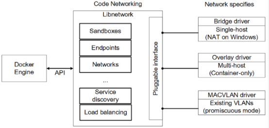

在现代容器化部署的大型系统中，网络安全风险是保障整体系统安全不可忽视的重要方面。尤其是在部署分布式大模型服务时，容器间频繁的网络通信与对外部服务的高度依赖性，使得网络层面的安全隐患尤为突出。容器环境下的网络安全风险包括：

1）不安全的容器间通信： 当容器网络配置缺乏有效的隔离机制（例如使用默认的、扁平的网络模式）或未实施细粒度的网络策略（Network Policies）时，一个容器被成功攻破后，攻击者能够轻易地在同一网络段内进行横向移动（Lateral Movement），直接访问和攻击其他容器。对于那些高度依赖频繁且复杂容器间交互的分布式系统（例如大模型服务或微服务架构），这种风险尤为突出，因为一旦一个环节被突破，整个系统的其他组件都可能面临被探测甚至控制的威胁，导致连锁反应。

2）暴露不必要的端口： 将容器内部本不应面向宿主机或外部网络的服务端口（如管理接口、调试端口、内部API等）通过端口映射（Port Mapping）的方式暴露出去，为攻击者提供了一个直接的攻击面。即使这些内部服务本身没有已知的漏洞，其对外部的可访问性也极大地增加了被探测、暴力破解或利用配置错误进行攻击的风险。这违反了最小权限原则，使得攻击者无需通过其他途径即可直接接触敏感或非预期的服务。

3）DNS 劫持或污染： 容器内部对外部服务的访问通常依赖于域名解析（DNS）。如果容器所使用的DNS服务遭到劫持（DNS Hijacking）或污染（DNS Poisoning），攻击者可以恶意地将容器发出的对外部域名的解析请求重定向到其控制的恶意服务器。这不仅可能导致容器无法正常访问预期的外部服务，更严重的后果是，攻击者可以提供伪造的服务响应，借此窃取敏感数据、注入恶意内容，甚至发起中间人攻击（Man-in-the-Middle Attack），从而破坏容器化应用的正常功能、数据完整性和机密性。

​

# 参考

1. <https://www.alibabacloud.com/blog/what-is-ai-infrastructure-security-_599939>

2. <https://informationmatters.net/data-poisoning-ai/>

3. <https://www.lakera.ai/blog/training-data-poisoning>

4. <https://www.sciencedirect.com/science/article/pii/S0893608023005890>

5. <https://flower.ai/blog/2024-03-14-llm-flowertune-federated-llm-finetuning-with-flower/>

6. <https://paperswithcode.com/paper/deep-leakage-from-gradients>

7. <https://www.mlsecurity.ai/post/what-is-model-stealing-and-why-it-matters>

8. <https://itnext.io/llm-compression-techniques-49865356fa70?gi=7ab9af8b8393>

9. <https://www.anyscale.com/blog/cloud-infrastructure-for-llm-and-generative-ai-applications>

10. <https://www.datacamp.com/tutorial/deploy-llm-applications-using-docker>

11. <https://mafiaguy.medium.com/introduction-to-docker-security-101-4432062befa8>

12. <https://www.aquasec.com/blog/threat-alert-ddos-attack-docker-daemons/>

13. <https://www.mdpi.com/2079-9292/12/4/940>

14. <https://www.zuozuovera.com/posts/1704/>

15. <https://unit42.paloaltonetworks.com/graboid-first-ever-cryptojacking-worm-found-in-images-on-docker-hub/>

​
