# ISCC破阵夺旗赛三阶段misc详解-先知社区

> **来源**: https://xz.aliyun.com/news/18052  
> **文章ID**: 18052

---

## 校赛阶段

### 书法大师

下载图片

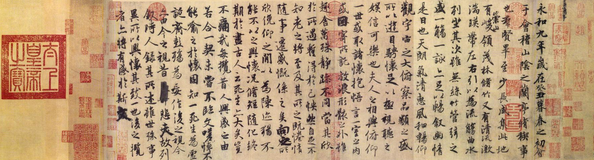

随波逐流检测

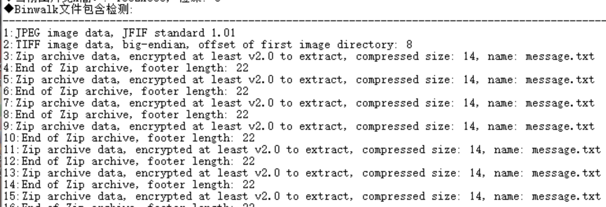

有很多zip

foremost分离出来

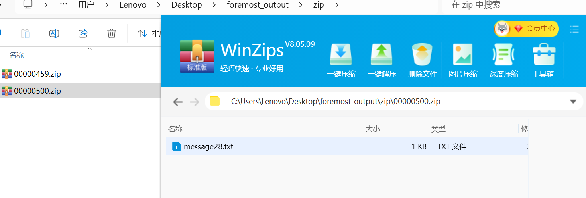

第二个zip

图片注释有密码

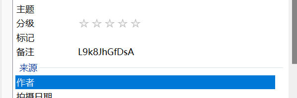

起初解法

```
import binascii
import base64
import os
import pyzipper
import requests
import urllib.parse
import json

# foremost -i 分离图片压缩包，然后删除所有压缩包内容为 message.txt 的，保留 message1-50.txt
# 压缩包密码在图片属性中

path = r"output_Wed_Apr_30_22_56_59_2025\zip"
pwd = 'L9k8JhGfDsA'

for file in os.listdir(path):
    tmp_path = path + '\' + file
    zipfile = pyzipper.ZipFile(tmp_path)
    zipfile.extractall(pwd=pwd.encode())
    zipfile.close()

url = "https://unpkg.com/cnchar-data@1.1.0/draw/"


def get_strokes(x):
    res = requests.get(url + urllib.parse.quote(x) + ".json")
    j = json.loads(res.text)['strokes']
    return str(hex(len(j))[2:])


data = ''
for i in range(1, 51):
    data += open(f'message{i}.txt', 'r', encoding='UTF-8', errors='ignore').read() + ' '

output = ''
for char in data[:72]:
    if char == ' ':
        pass
    else:
        output += get_strokes(char)

print(output)
print(base64.b64decode(binascii.unhexlify(output)))
```

修复后的解法

解压

```
巧卫 正西 贝旗 太贝 丙乙 大马 没少 远国 为靠 巧切 片海 个一 那乙 西海 石真 马卫 为数 圾谁 早林 众谁 年圾 丙一 个罪 工数
```

```
53 56 4E 44 51 33 74 78 4F 54 4A 31 61 6A 5A 33 4D 6A 68 6A 66 51 3D 3D
```

每两位对应笔划组成2位16进制，base64解码

```
import base64
hex_str = "53564E44513374784F544A31616A5A334D6A686A66513D3D"
bytes_data = bytes.fromhex(hex_str)
decoded_data = base64.b64decode(bytes_data).decode('utf-8', errors='ignore')
print(decoded_data)
```

```
ISCC{q92uj6w28c}
```

### 反方向的钟

打开txt

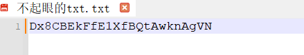

```
Dx8CBEkFfE1XfBQtAwknAgVN
```

010检测到有多余隐写部分

零宽隐写

<https://yuanfux.github.io/zero-width-web/>

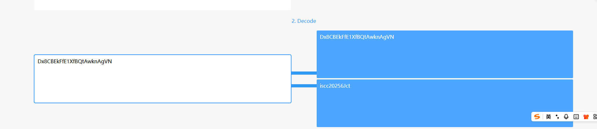

得到key,厨子xor

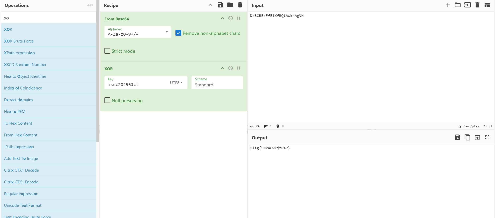

```
iscc{5Nxa6wYjzDa7}
```

## 区域赛

### 睡美人

下载图片

发现右下有神秘字符串，放大看

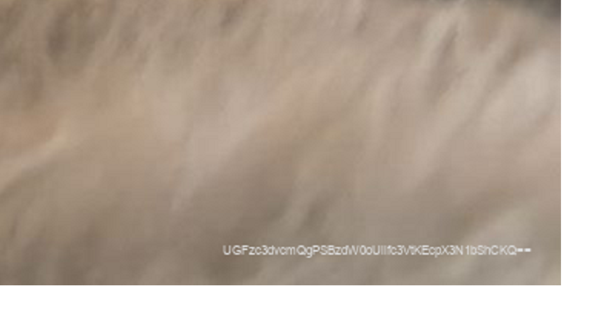

```
UGFzc3dvcmQgPSBzdW0oUilfc3VtKEcpX3N1bShCKQ==
```

Base64解码

```
Password = sum(R)_sum(G)_sum(B)
```

跟颜色通道R,G,B有关，结合题目提示，“红红红红红红绿绿绿蓝”。红绿蓝比例为6：3：1 加权乘上并提取图片颜色通道的值，编写脚本

```
from PIL import Image

# Open image (replace path)
path = r"Sleeping_Beauty_23.png"  
img = Image.open(path).convert("RGB")

wr = 0.6
wg = 0.3
wb = 0.1

sum = 0.0

w, h = img.size

# Process pixels
for y in range(h):
    for x in range(w):
        r, g, b = img.getpixel((x, y))
        # Calculate weighted value
        p = round(r*wr + g*wg + b*wb, 1)
        sum += p

sum = round(sum, 1)

print(f"Total weighted value: {sum}")
```

```
Total weighted value: 1375729349.6   //解压密码为1375729349.6
```

binwalk分离图片中的压缩包

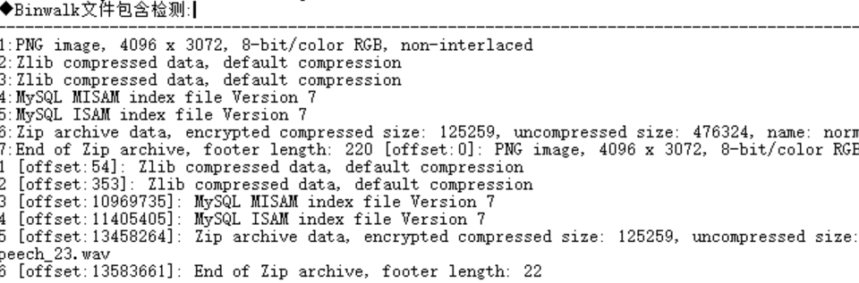

用上述密码进行解压

得到一个wav文件

听一下

<https://products.aspose.ai/total/zh/speech-to-text/#google_vignette>

```
There is a hidden message in this sound file. Can you find it?
```

后面还有一串声音，audacity打开

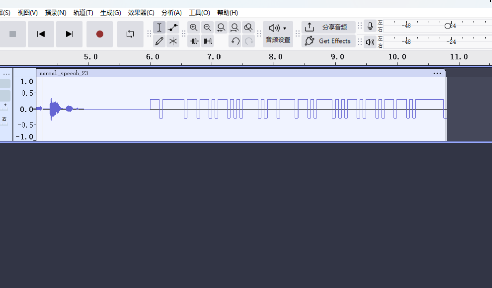

猜测为曼彻斯特编码，我们截取片段，对照序列，还原，最后二进制转字符

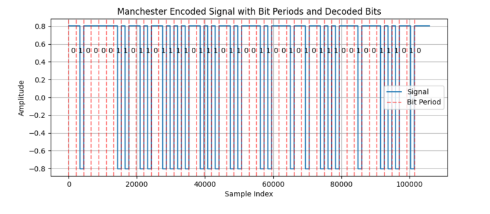

exp

```
import scipy.io.wavfile as wavfile
import numpy as np

def load_audio_file(file_path):
    try:
        return wavfile.read(file_path)
    except:
        return None, None

def preprocess_audio_signal(audio_data):
    return audio_data[:, 0] if audio_data.ndim == 2 else audio_data

def analyze_audio_segment(segment, threshold=0):
    binary = (segment > threshold).astype(int)
    return '0' if np.all(binary == 1) else '1' if np.any(np.diff(binary) == -1) else None

def decode_audio(audio_signal, sample_rate, start_sample, samples_per_segment):
    total_samples = len(audio_signal)
    return [
        bit
        for current_position in range(start_sample, total_samples, samples_per_segment)
        if current_position + samples_per_segment <= total_samples
        for bit in [analyze_audio_segment(audio_signal[current_position:current_position + samples_per_segment])]
        if bit is not None
    ]

def binary_to_string(binary_data):
    if not binary_data:
        return ""
    binary_str = ''.join(binary_data).ljust((len(binary_data) + 7) // 8 * 8, '0')
    return ''.join(chr(int(binary_str[i:i+8], 2)) for i in range(0, len(binary_str), 8))

def decode_audio_file(file_path="normal_speech_23.wav", start_time_sec=6.0, segment_duration_sec=0.1):
    sample_rate, audio_data = load_audio_file(file_path)
    if sample_rate is None or audio_data is None:
        return ""
    audio_signal = preprocess_audio_signal(audio_data)
    start_sample = int(start_time_sec * sample_rate)
    samples_per_segment = int(segment_duration_sec * sample_rate)
    if start_sample + samples_per_segment > len(audio_signal):
        return ""
    return binary_to_string(decode_audio(audio_signal, sample_rate, start_sample, samples_per_segment))

if __name__ == "__main__":
    print("Decoded String:", decode_audio_file())


#Decoded String: Enigma
```

```
ISCC{Enigma}
```

### 签个到吧

010打开hint.zip，发现有png图片，我们foremost分离出来

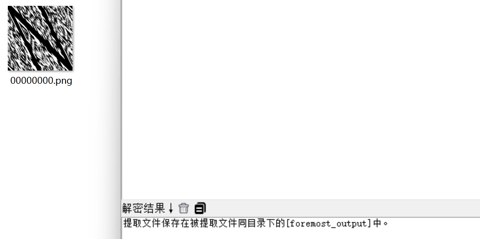

Stegsolve

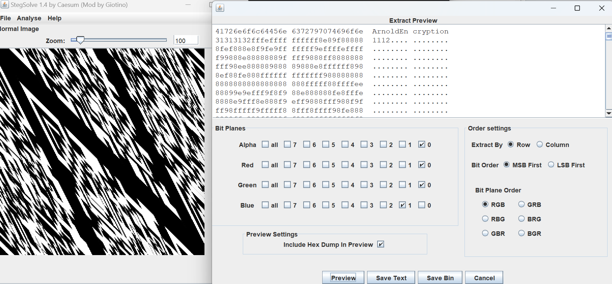

根据提示“变换一次再混入点东西”,是猫脸变换

工具爆破

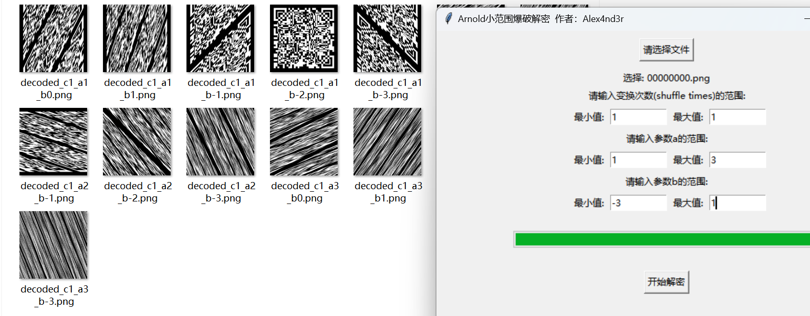

a=1,b=-2,shuffle times=1时得到图

再放个梭哈代码

```
import numpy as np
from PIL import Image

def arnold_decode_once(image: Image.Image, a: int = 1, b: int = -2, mode: str = '1'):
    image = np.array(image)
    N = image.shape[0]
    next_image = np.zeros_like(image)

    for x in range(N):
        for y in range(N):
            new_x = ((a * b + 1) * x - b * y) % N
            new_y = (-a * x + y) % N
            if mode == '1':
                next_image[new_x, new_y] = image[x, y]
            else:
                next_image[new_x, new_y, :] = image[x, y, :]

    return Image.fromarray(next_image)

if __name__ == '__main__':
    img = Image.open('1.png').convert('1')
    result_img = arnold_decode_once(img, a=1, b=-2, mode='1')
    result_img.save('output.png')
```

我们将图反色（随波逐流），再逆时针旋转90°

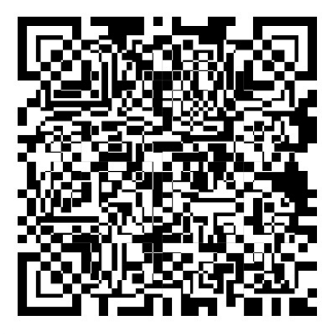

最后与flag\_is\_not\_here.jpg双图xor

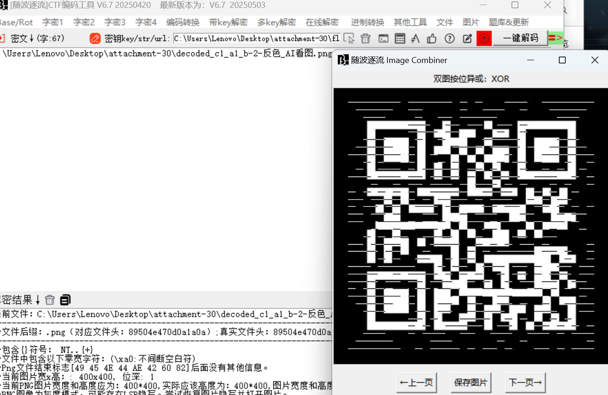

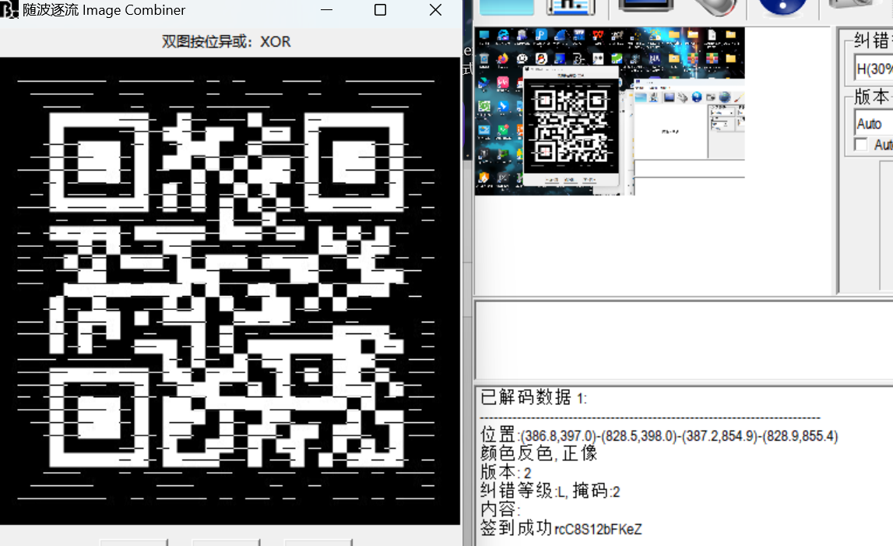

```
ISCC{rcC8S12bFKeZ}
```

### 返校之路

Winzip打开part1

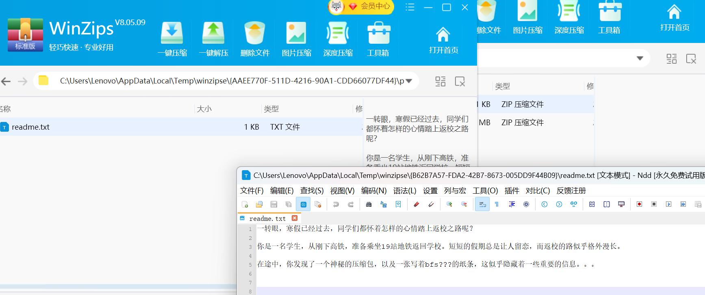

```
一转眼，寒假已经过去，同学们都怀着怎样的心情踏上返校之路呢？

你是一名学生，从刚下高铁，准备乘坐19站地铁返回学校。短短的假期总是让人留恋，而返校的路似乎格外漫长。

在途中，你发现了一个神秘的压缩包，以及一张写着bfs???的纸条，这似乎隐藏着一些重要的信息。。。
```

Part2的部分加密了，根据txt内容我们进行掩码爆破

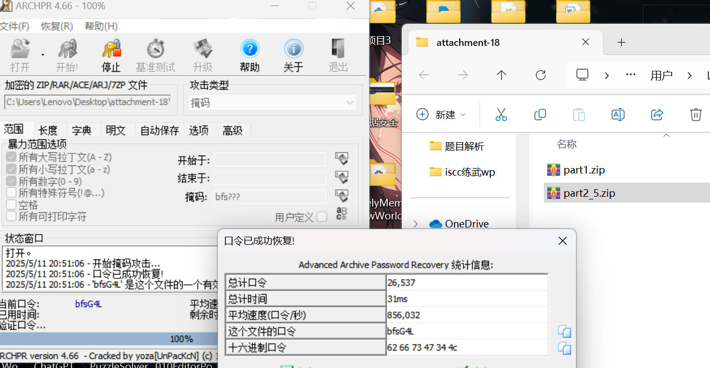

zsteg扫picture2.png得到

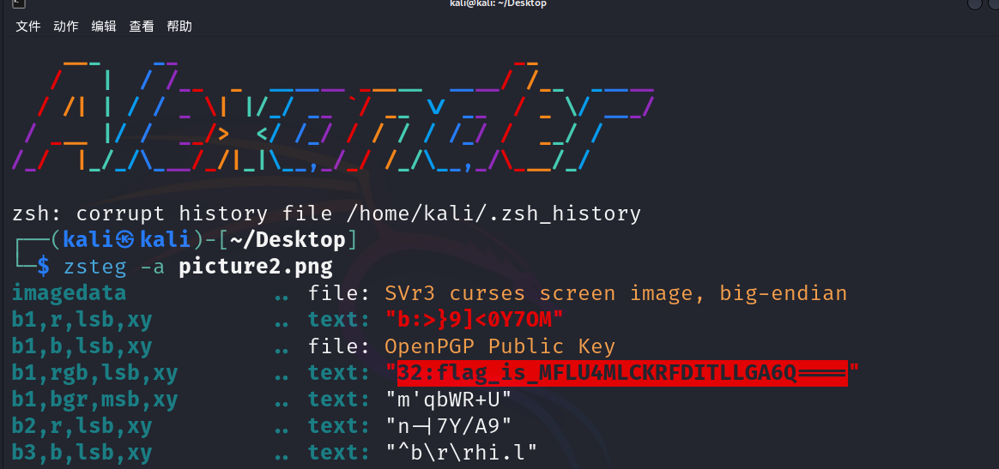

```
32:flag_is_MFLU4MLCKRFDITLLGA6Q====
```

base32->base64解密

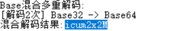

```
icum2x2M
```

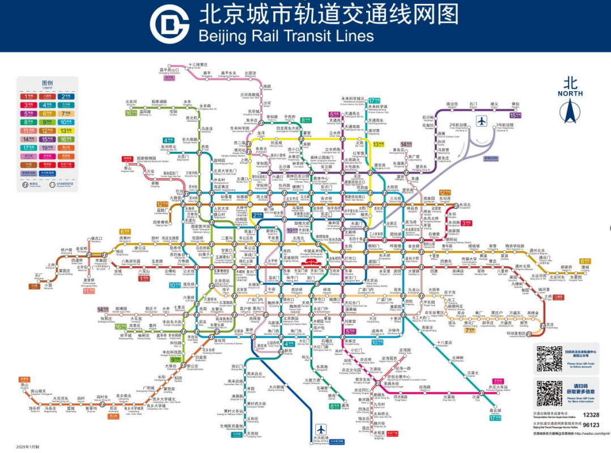

第二部分分析路线图，我们需要从地铁朝阳站到地铁魏公村站，3号线转10号线再转4号

所以是3104,拼接上一部分

```
ISCC{icum2x2M3104}
```

### 取证分析

下载并解压hint的镜像，Lovelymem打开内存镜像

Vol2文件扫描，并提出一个hahaha.zip

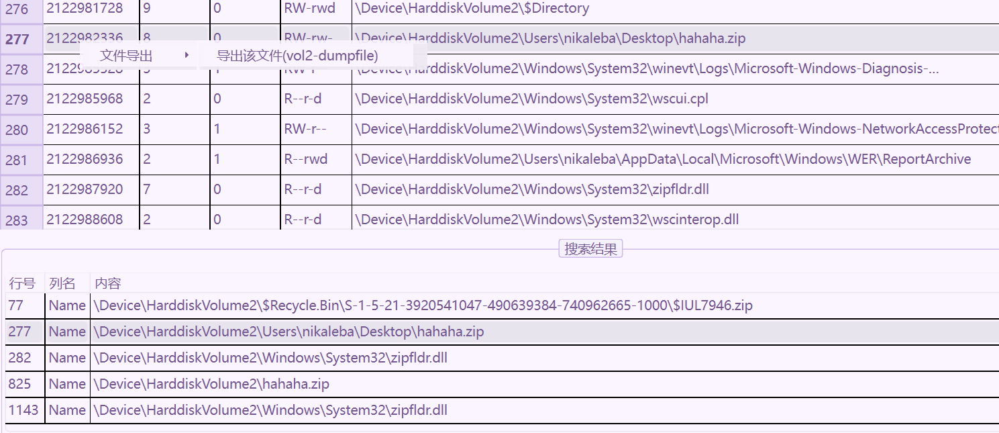

文件加密了，但是没想到上一题的掩码可以爆出密码（非预期），预期应该是明文攻击

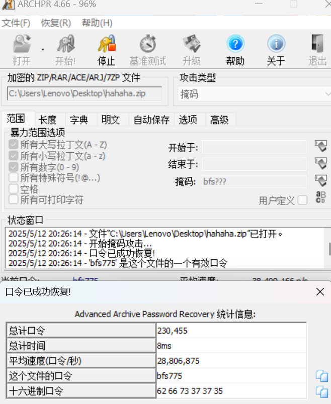

解密Hint.txt

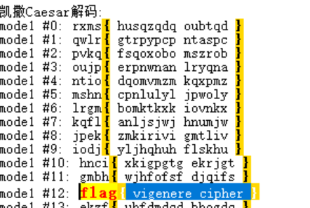

凯撒移位12位

```
flag{ vigenere cipher }
```

说明flag是维吉尼亚加密的

再看杨辉三角

我们根据给定的坐标计算杨辉三角中的值，然后对 26 取模，再映射成字母得到密钥

```
from math import comb

coordinates = [(2,10), (4,8), (2,4), (3,4), (11,13), (2,11), (1,1), (10,26), (5,6), (5,9)]
values = [comb(row-1, col-1) for col, row in coordinates]
mod_values = [v % 26 for v in values]
key = ''.join([chr(65 + (m-1)) for m in mod_values])
print(key)

#IICCNJAYER
```

我们将题目附件给word解压，在[Content\_Types].xml中找到了密文

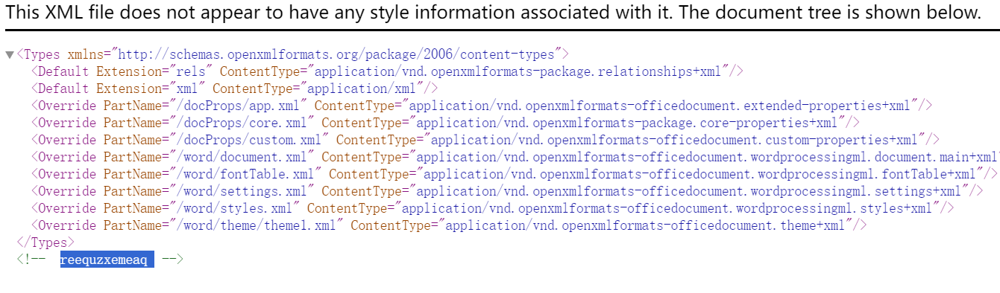

最后维吉尼亚解密

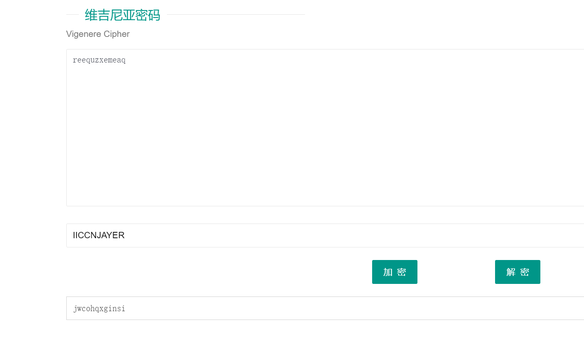

```
ISCC{jwcohqxginsi}
```

## 总决赛

### 神经网络迷踪

非预期：解压，文件名为flag

预期解

下载得到模型文件

<https://netron.app/>

挂载模型（secretkey解出来的2025ISCC2025key!毛用没有！！！！）

我们把secret那一层的元素内容转utf-8

出现hint:放大/缩小255  
我们到output.bias

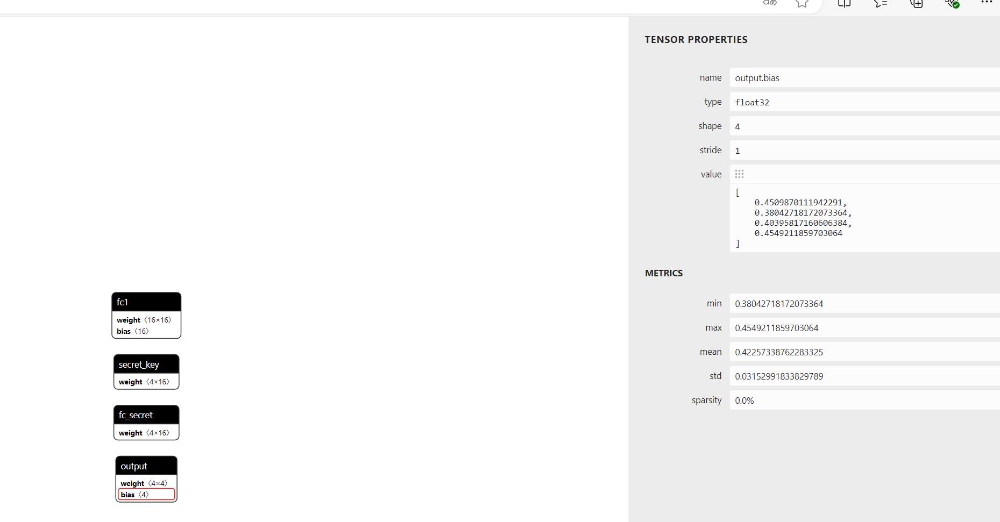

每个值乘255转ascii

```
values = [
    0.4509870111942291,
    0.38042718172073364,
    0.40395817160606384,
    0.4549211859703064
]

# 转换为整数ASCII码并映射到字符，添加ISCC{}包裹
result = 'ISCC{' + ''.join(chr(int(value * 255)) for value in values) + '}'

print(f"转换结果: {result}")    
```

```
ISCC{sagt}
```

### 八卦

下载附件

是个动图，我们后缀改成gif

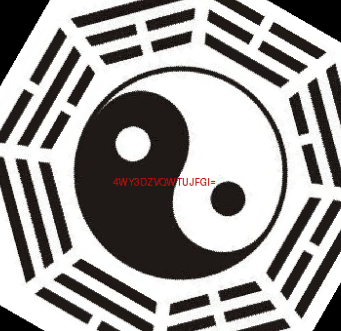

发现有内容

010发现末尾有个7z

我们手提出来

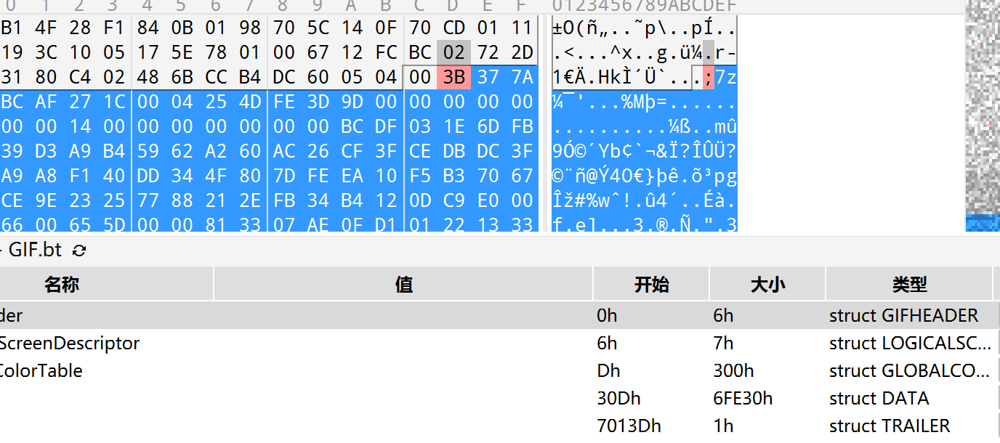

接着puzzlersolver分离动图

Base64解码发现

乾为天 山水蒙 水雷屯 水天需

对分离的图片进行随波逐流

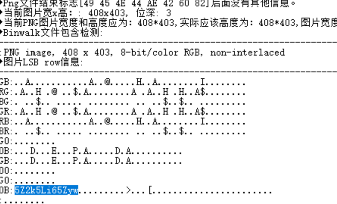

在00B通道发现数据

Base64解密 坤为地

根据给的hint

我们puzzlersolver获取动图间隔帧

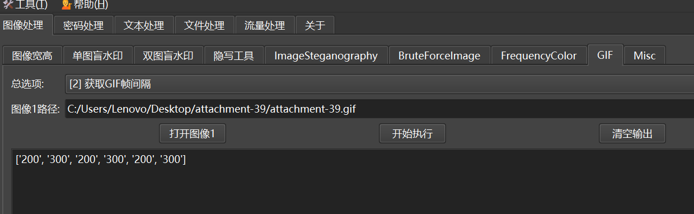

意指向23，指的是64卦中的23卦

在线网站查询

<https://lzltool.cn/tool/infozhouyi64>

存在内容即在分离的5张图片中，存在内容即为1，不存在即为0，1235帧存在base64,46帧没有，即111010

111010转十进制为58，指的为58卦

题目中的7卦已经形成，我们在上述在线网站中找到所对应的上下卦

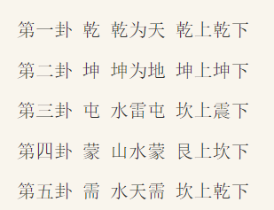

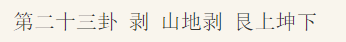

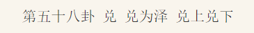

我们按照从小到大拼接上下卦

得到压缩包密码

```
乾乾坤坤坎震艮坎坎乾艮坤兑兑
```

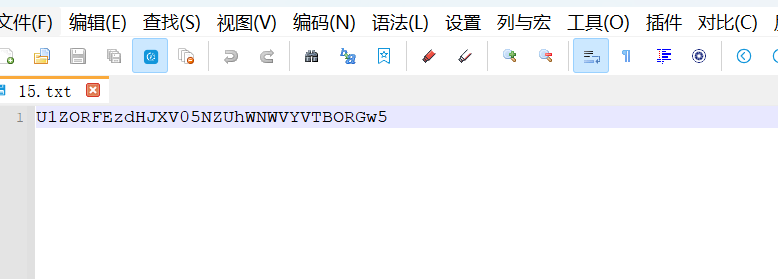

随波逐流梭哈（双base64)

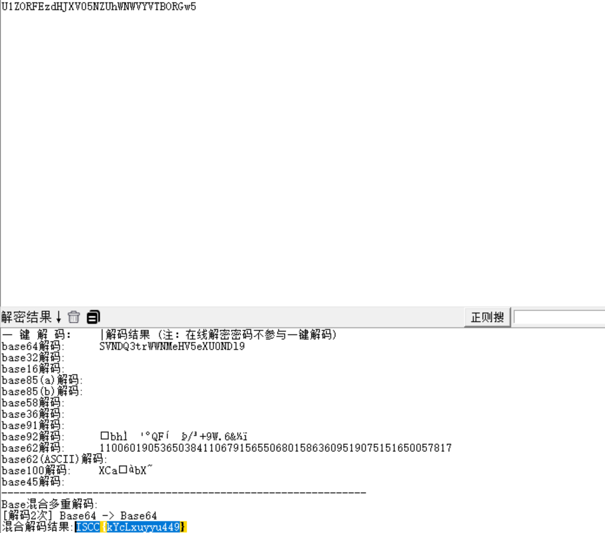

```
ISCC{kYcLxuyyu449}
```
