# 2025第一届轩辕杯Misc详解-先知社区

> **来源**: https://xz.aliyun.com/news/18054  
> **文章ID**: 18054

---

## Terminal Hacker

一步到位

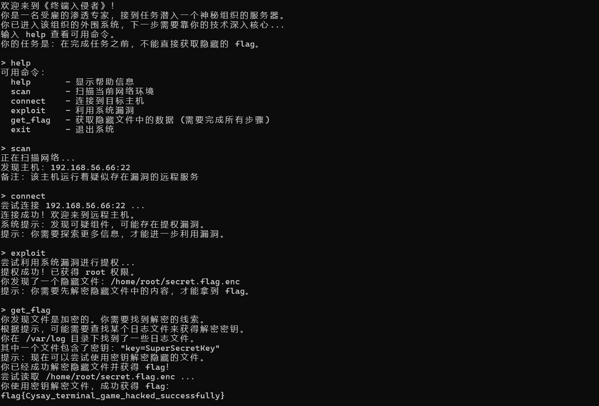

```
flag{Cysay_terminal_game_hacked_successfully}
```

## 哇哇哇瓦

foremost分离

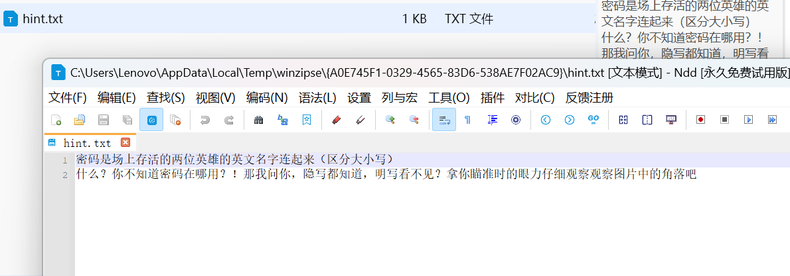

```
GekkoYoru
```

随波逐流检测，RGB通道有前半flag  
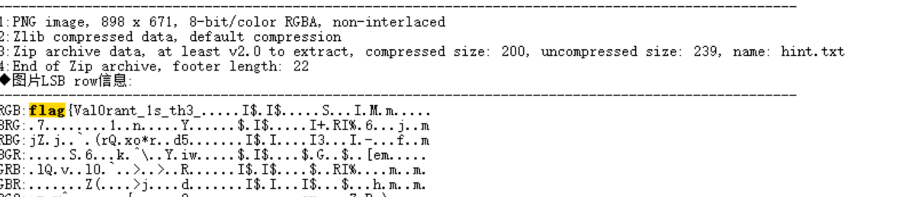

```
flag{Val0rant_1s_th3_
```

hint提示明文，我们PS打开图片，用取色工具提取信息  


从从右到左提取出来

```
504b0304140009000800f0a29b5a6a6cc8761e0000001000000009000000666c6167322e7478746a8b34194ebfd04e32f9d34ed7ec544db07161f384b8c0d99bd98be4c634504b07086a6cc8761e00000010000000504b01021f00140009000800f0a29b5a6a6cc8761e00000010000000090024000000000000002000000000000000666c6167322e7478740a00200000000000010018001f18001f6fb7db011f3a80316fb7db01c1e8531a6fb7db01504b050600000000010001005b000000550000000000
```

压缩包，十六进制导入010另存为zip

打开用密码GekkoYoru解压  


```
best_FPS_g@me!!}
```

```
flag{Val0rant_1s_th3_best_FPS_g@me!!}
```

## 数据识别与审计

数字中国产业积分争夺赛总决赛，几乎为原题

txt部分

文件夹拖进vs code,全局搜索一遍（数字0到10，@），出现泄露地址手机号身份证邮箱等  
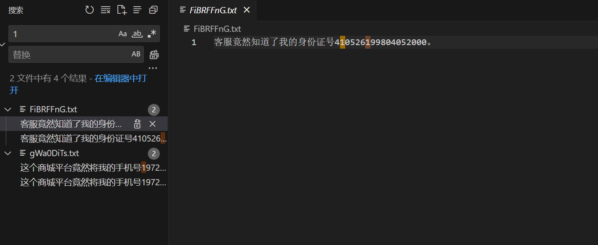

```
FiBRFFnG.txt
gWa0DiTs.txt
T0BPOXDY.txt
9h0zQJok.txt
Me4CoMw7.txt
```

png部分

在图片尾部写入了恶意代码，直接编写代码检测图片尾部是否有额外字符串

```
import os
import struct

def check_png_for_trailing_data(file_path):
    """
    检查PNG文件是否在IEND块后有额外数据
    
    参数:
        file_path (str): PNG文件路径
        
    返回:
        tuple: (是否有额外数据, 额外数据长度, 额外数据前32字节的hex)
    """
    with open(file_path, 'rb') as f:
        # 检查PNG文件头
        header = f.read(8)
        if header != b'\x89PNG\r
\x1a
':
            return (False, 0, None)  # 不是有效的PNG文件
        
        # 查找IEND块
        iend_found = False
        while True:
            # 读取块长度 (4字节大端)
            chunk_length_data = f.read(4)
            if len(chunk_length_data) != 4:
                break  # 文件结束
            chunk_length = struct.unpack('>I', chunk_length_data)[0]
            
            # 读取块类型 (4字节)
            chunk_type = f.read(4)
            if len(chunk_type) != 4:
                break  # 文件结束
                
            # 跳过块数据和CRC (4字节)
            f.seek(chunk_length + 4, os.SEEK_CUR)
            
            if chunk_type == b'IEND':
                iend_found = True
                break
        
        if not iend_found:
            return (False, 0, None)  # 没有找到IEND块
        
        # 检查IEND后是否有数据
        remaining_position = f.tell()
        f.seek(0, os.SEEK_END)
        file_size = f.tell()
        
        if remaining_position == file_size:
            return (False, 0, None)  # 没有额外数据
        
        extra_data_length = file_size - remaining_position
        
        # 读取前32字节的额外数据作为示例
        f.seek(remaining_position, os.SEEK_SET)
        sample_data = f.read(min(32, extra_data_length))
        
        return (True, extra_data_length, sample_data.hex())

def scan_directory_for_pngs(directory):
    """
    扫描目录中的PNG文件并检查是否有额外数据
    
    参数:
        directory (str): 要扫描的目录路径
    """
    print(f"扫描目录: {directory}")
    print("{:<50} {:<15} {:<32}".format("文件名", "额外数据长度", "前32字节(hex)"))
    print("-" * 100)
    
    for root, _, files in os.walk(directory):
        for file in files:
            if file.lower().endswith('.png'):
                file_path = os.path.join(root, file)
                has_extra, length, sample = check_png_for_trailing_data(file_path)
                if has_extra:
                    print("{:<50} {:<15} {:<32}".format(
                        os.path.relpath(file_path, directory),
                        length,
                        sample if sample else "无"
                    ))

if __name__ == "__main__":
    import sys
    
    if len(sys.argv) != 2:
        print("使用方法: python png_checker.py <目录路径>")
        sys.exit(1)
    
    target_dir = sys.argv[1]
    if not os.path.isdir(target_dir):
        print(f"错误: {target_dir} 不是有效目录")
        sys.exit(1)
    
    scan_directory_for_pngs(target_dir)
```

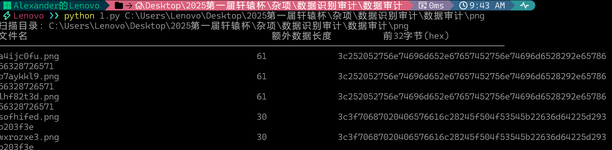

```
a4ijc0fu.png
b7aykkl9.png 
lhf82t3d.png
sofhifed.png 
wxrozxe3.png
```

PDF部分

用微软浏览器打开出现xss弹窗即为威胁文件  
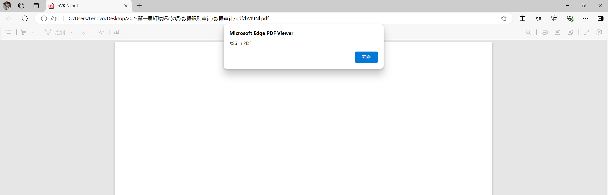

```
import os
import time  # 新增导入time模块
import PyPDF2


def check_pdf_for_dangerous_functions(pdf_path):
    """检查PDF是否包含 eval(), exec(), system() 等危险函数，并返回匹配到的危险函数列表"""
    dangerous_functions = [
        "eval(", "exec(", "execfile(",  # Python 危险函数
        "system(", "popen(", "os.system(", "subprocess.call(",  # 系统命令执行
        "Function(", "eval ", "javascript:",  # PDF/JS 相关
        "unescape(", "String.fromCharCode(",  # JS 混淆代码
        "getRuntime()", "ProcessBuilder(",  # Java 危险调用
    ]

    found_functions = []  # 存储匹配到的危险函数

    try:
        with open(pdf_path, 'rb') as file:
            reader = PyPDF2.PdfReader(file)

            # 检查 PDF 的文本内容
            for page in reader.pages:
                text = page.extract_text() or ""  # 提取文本
                text_lower = text.lower()  # 转为小写方便匹配

                # 检查是否包含危险函数
                for func in dangerous_functions:
                    if func.lower() in text_lower and func not in found_functions:
                        found_functions.append(func)  # 记录匹配到的危险函数

            # 检查 PDF 的二进制内容（更底层扫描）
            file.seek(0)  # 重新读取文件
            raw_content = file.read().decode('latin-1', errors='ignore')  # 尝试解码二进制
            raw_content_lower = raw_content.lower()

            for func in dangerous_functions:
                if func.lower() in raw_content_lower and func not in found_functions:
                    found_functions.append(func)  # 记录匹配到的危险函数

            return found_functions  # 返回所有匹配到的危险函数

    except Exception as e:
        print(f"⚠️ 检查 {pdf_path} 时出错: {e}")
        return []  # 出错时返回空列表


def scan_pdf_folder(folder_path):
    """扫描文件夹中的所有PDF文件，检查危险函数，并输出文件名 + 危险函数"""
    dangerous_files = {}  # 存储危险文件及其匹配到的函数

    for filename in os.listdir(folder_path):
        if filename.lower().endswith('.pdf'):
            pdf_path = os.path.join(folder_path, filename)
            found_functions = check_pdf_for_dangerous_functions(pdf_path)

            if found_functions:
                dangerous_files[filename] = found_functions
                print(f"🚨 发现危险函数 ({filename}): {', '.join(found_functions)}")
            else:
                print(f"✅ 安全: {filename}")

            time.sleep(0.1)  # 处理完每个文件后暂停0.1秒

    print("
=== 扫描结果 ===")
    if dangerous_files:
        print(f"⚠️ 发现 {len(dangerous_files)} 个可能包含危险函数的PDF:")
        for file, functions in dangerous_files.items():
            print(f"- {file}: {', '.join(functions)}")
    else:
        print("✅ 未发现包含危险函数的PDF文件。")


if __name__ == "__main__":
    folder_path = "数据审计\pdf"
    if os.path.isdir(folder_path):
        scan_pdf_folder(folder_path)
    else:
        print("❌ 提供的路径不是有效的文件夹。")
```

```
bVKINl.pdf
hnPRx1.pdf
mIR13t.pdf
OGoyOG.pdf
rSG2pW.pdf
```

wav部分

用openai的whisper功能读取

```
import os
import whisper
from tqdm import tqdm  # 用于显示进度条

def transcribe_wav_files(folder_path, model_size="base", output_file="transcriptions.txt"):
    """
    使用Whisper转录文件夹中的所有WAV文件
    
    参数:
        folder_path (str): 包含WAV文件的文件夹路径
        model_size (str): Whisper模型大小 (tiny, base, small, medium, large)
        output_file (str): 保存转录结果的文本文件路径
    """
    # 加载Whisper模型
    print(f"Loading Whisper {model_size} model...")
    model = whisper.load_model(model_size)
    
    # 获取文件夹中的所有WAV文件
    wav_files = [f for f in os.listdir(folder_path) if f.lower().endswith('.wav')]
    
    if not wav_files:
        print("No WAV files found in the specified folder.")
        return
    
    print(f"Found {len(wav_files)} WAV files to process.")
    
    # 打开输出文件准备写入
    with open(output_file, 'w', encoding='utf-8') as f_out:
        # 处理每个WAV文件
        for wav_file in tqdm(wav_files, desc="Processing WAV files"):
            file_path = os.path.join(folder_path, wav_file)
            
            try:
                # 使用Whisper进行转录
                result = model.transcribe(file_path)
                
                # 写入结果到文件
                f_out.write(f"File: {wav_file}
")
                f_out.write(f"Transcription: {result['text']}

")
                
            except Exception as e:
                print(f"
Error processing {wav_file}: {str(e)}")
                f_out.write(f"File: {wav_file}
")
                f_out.write(f"Error: {str(e)}

")
    
    print(f"
Transcription complete. Results saved to {output_file}")

if __name__ == "__main__":
    # 使用示例
    folder_path = input("Enter the path to the folder containing WAV files: ")
    
    # 可选：让用户选择模型大小
    model_size = input("Choose model size (tiny/base/small/medium/large, default=base): ").strip().lower()
    if model_size not in ['tiny', 'base', 'small', 'medium', 'large']:
        model_size = "base"
    
    transcribe_wav_files(folder_path, model_size)
```

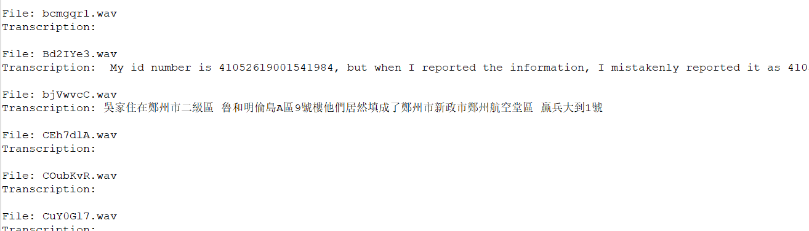

精度不准，但是足够识别

```
Bd2IYe3.wav
bjVwvcC.wav
H0KDChj.wav
ou9E9Mh.wav
UEbzH4X.wav
```

最后排个序

```
9h0zQJok.txt, FiBRFFnG.txt, gWa0DiTs.txt, Me4CoMw7.txt, T0BPOXDY.txt,a4ijc0fu.png, b7aykkl9.png, lhf82t3d.png, sofhifed.png, wxrozxe3.png,bVKINl.pdf, hnPRx1.pdf, mIR13t.pdf, OGoyOG.pdf,rSG2pW.pdf,Bd2IYe3.wav, bjVwvcC.wav, H0KDChj.wav, ou9E9Mh.wav, UEbzH4X.wav  
```

md5加密下

```
flag{234ed8ef5421c5e559420dbf841db68f}
```

## 音频的秘密

silenteye解密出zip  
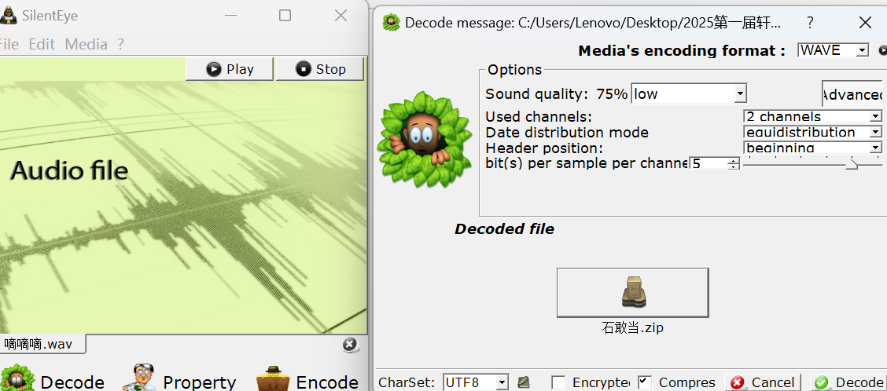


```
Key:Lovely    #后面会用
```

aapr爆破  
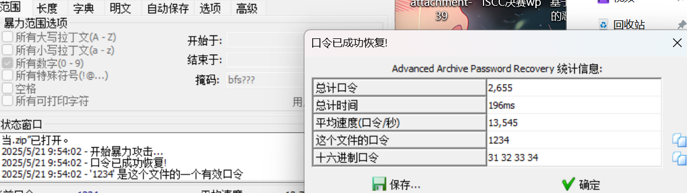

zip密码1234，解压图片

随波逐流检测  
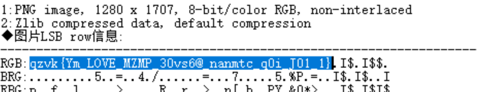

RGB通道存在密文

```
qzvk{Ym_LOVE_MZMP_30vs6@_nanmtc_q0i_J01_1}
```

用上面的key进行维吉尼亚解密  
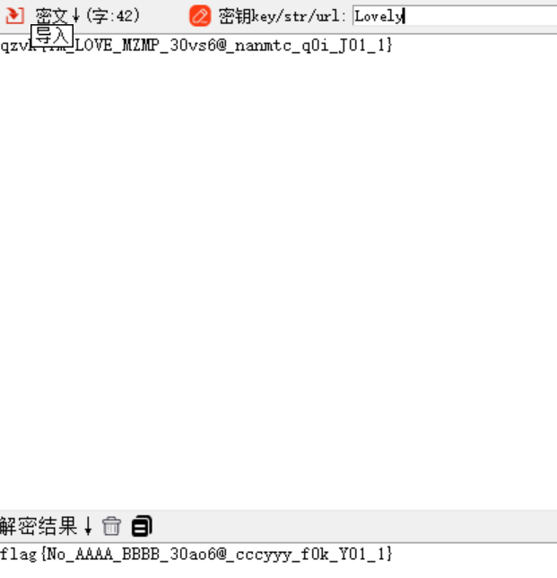

```
flag{No_AAAA_BBBB_30ao6@_cccyyy_f0k_Y01_1}
```

## 隐藏的邀请函

解压docx文件

在Cyyyy.xml中有未知十六进制

直接跟文件名xor得到datamatrix条码  
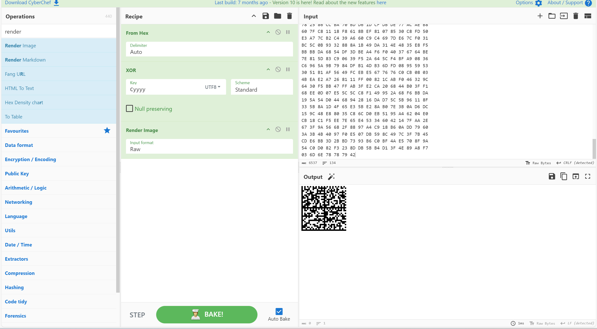


```
flag{yeah_Y0u_are_R1ght_Say_G0}
```

##一大碗冰粉  
lovelymem提取文件  
vol3提取  
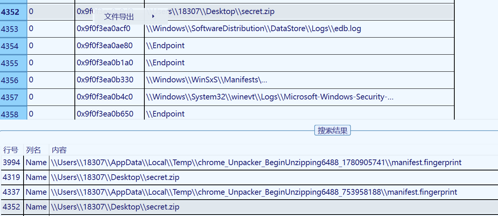

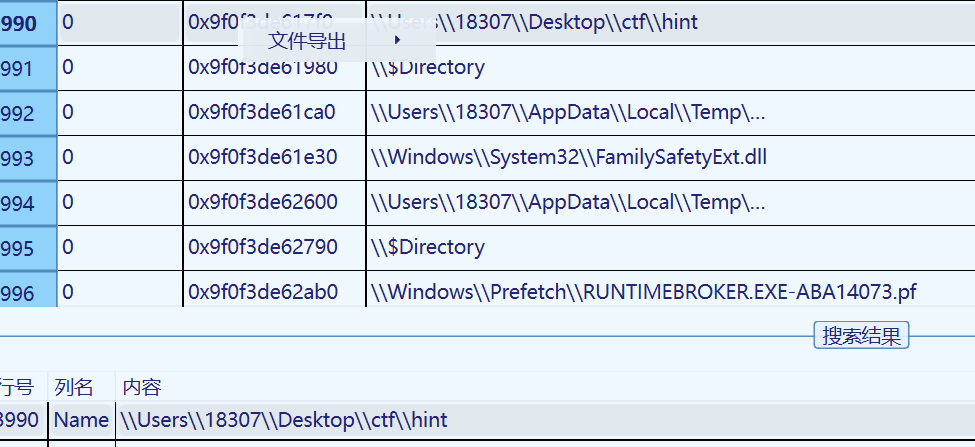

hint提示要我们攻击

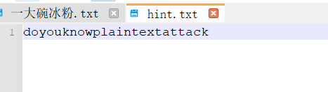  
直接压缩进行明文攻击

aapr攻击  
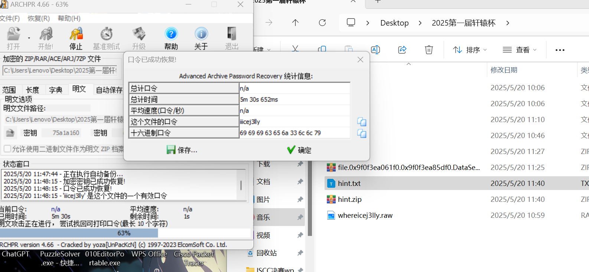

解压得到未知文件  
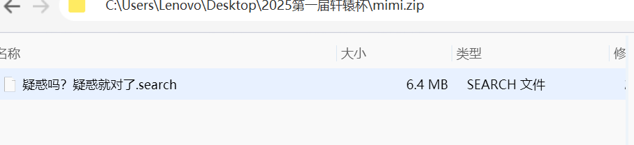

文件名提示疑惑？谐音梗异或xor  
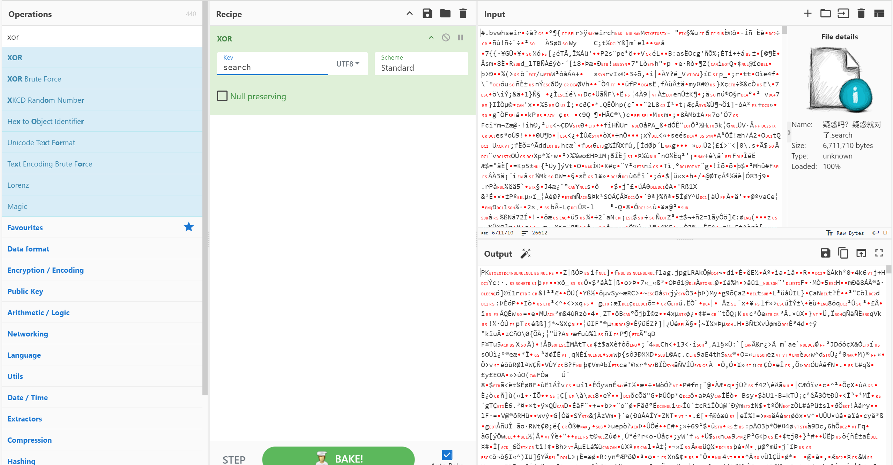

得到zip  
解压得到一张jpg  


提示flag{xx省xx市xx县/区xx步行街}  
直接百度社工搜图得到

```
flag{江苏省连云港市海州区陇海步行街}
```

​

​

## 八卦

查看图片exif信息  
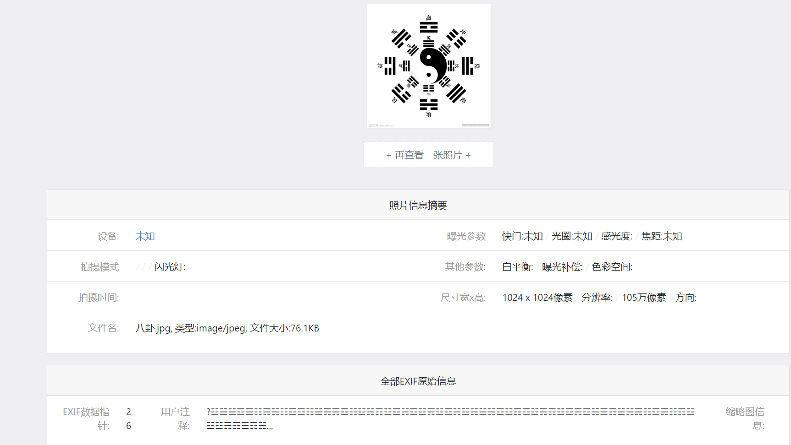

存在注释

```
☵☱☳☱☱☲☰☷☴☵☷☲☲☷☱☴☴☲☷☳☵☶☳☲☵☲☳☴☳☲☵☳☵☱☵☲☳☶☲☳☴☶☳☲☴☲☵☰☶☱☵☴☷☲☴☷☶☳☳☳☴☶☰☶☵☱☳☲☴☷☰☶☵☶☷☱☶☷☱☵☶☲☵☱☰☶☵☳☵☲☱☱☱☶☱☲☵☱☳☴☷☶☵☵☴☵☷☱☶☶☲☳☶☱☵☳☰☲☳☵☶☳☵☳☶☷☱☲☴☶☳☲☷☳☰☲☶☰☵
```

转三位二进制

```
# 定义符号到二进制的映射
hexagram_map = {
    '☰': '111', '☱': '110', '☲': '101', '☳': '100',
    '☴': '011', '☵': '010', '☶': '001', '☷': '000'
}
# 转换序列
symbols = '☵☱☳☱☱☲☰☷☴☵☷☲☲☷☱☴☴☲☷☳☵☶☳☲☵☲☳☴☳☲☵☳☵☱☵☲☳☶☲☳☴☶☳☲☴☲☵☰☶☱☵☴☷☲☴☷☶☳☳☳☴☶☰☶☵☱☳☲☴☷☰☶☵☶☷☱☶☷☱☵☶☲☵☱☰☶☵☳☵☲☱☱☱☶☱☲☵☱☳☴☷☶☵☵☴☵☷☱☶☶☲☳☶☱☵☳☰☲☳☵☶☳☵☳☶☷☱☲☴☶☳☲☷☳☰☲☶☰☵'
binary_str = ''.join([hexagram_map[s] for s in symbols])
octal_str = ''.join([str(int(binary_str[i:i+3], 2)) for i in range(0, len(binary_str), 3)])
print("二进制：", binary_str)
```

```
010110100110110101111000011010000101101000110011011101000100010001100101010101100011100101010100010110010101100001101100011001100101011101010111001110010011000101011000001100100100011001111001010110100101011000111001010001000110001000110010001101010110111001010100010101110110110001110101010110100011000001010010011010000110001001101100001110010100111101100010001100010100001000110101011001100101000100111101001111010
```

每 8 个为一组,不够 8 个的删掉，最后转成ascii

```
binary_str = "01011010011011010111100001101000010110100011001101110100010001000110010101010110001110010101010001011001010110000110110001100110010101110101011100111001001100010101100000110010010001100111100101011010010101100011100101000100011000100011001000110101011011100101010001010111011011000111010101011010001100000101001001101000011000100110110000111001010011110110001000110001010000100011010101100110010100010011110100111101"

# 每 8 位一组分割，不足 8 位的丢弃
groups = [binary_str[i:i+8] for i in range(0, len(binary_str), 8) if len(binary_str[i:i+8]) == 8]

# 转换为 ASCII 字符
ascii_str = ''.join([chr(int(group, 2)) for group in groups])

print(ascii_str)
```

```
ZmxhZ3tDeV9TYXlfWW91X2FyZV9Db25nTWluZ0Rhbl9Ob1B5fQ==
```

解个base64即可

```
flag{Cy_Say_You_are_CongMingDan_NoPy}
```
