# “轩辕杯”云盾砺剑CTF挑战赛-先知社区

> **来源**: https://xz.aliyun.com/news/18058  
> **文章ID**: 18058

---

### 写在前面

菜鸡第一次写博客，没什么经验，如果有错误还请各位师傅指出，欢迎交流讨论  
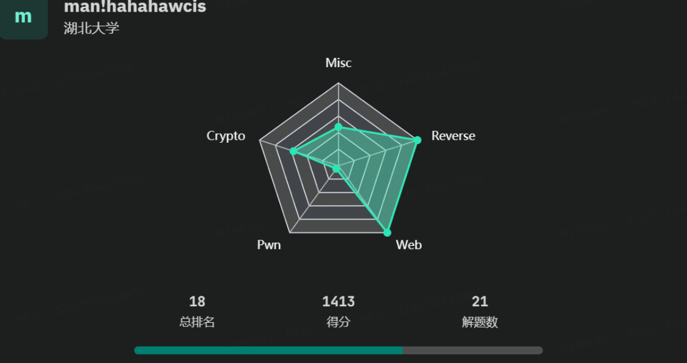

### ezBase

拿到程序后先查壳  
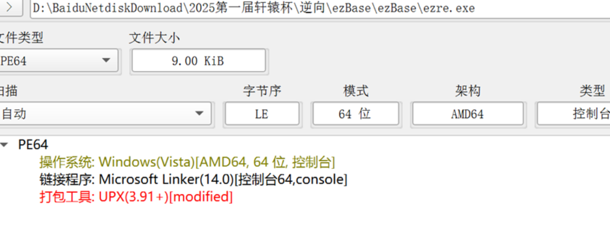

脱壳（UPX魔改壳）  
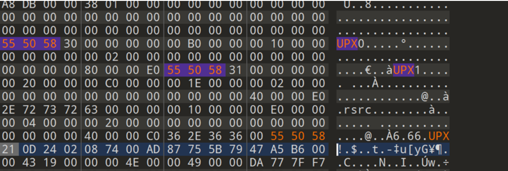  
进入主函数观察逻辑  
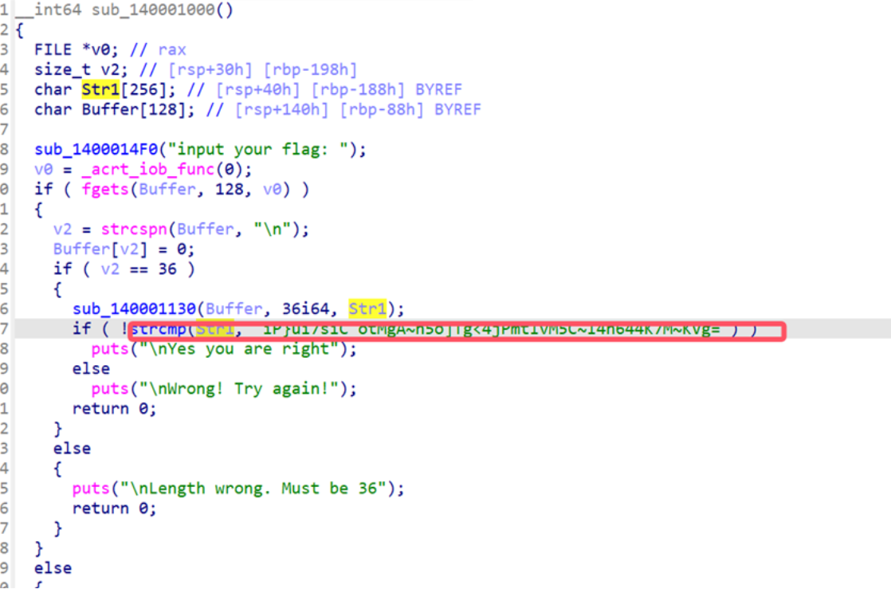  
发现一个比较，重点看上面的sub\_140001130函数  
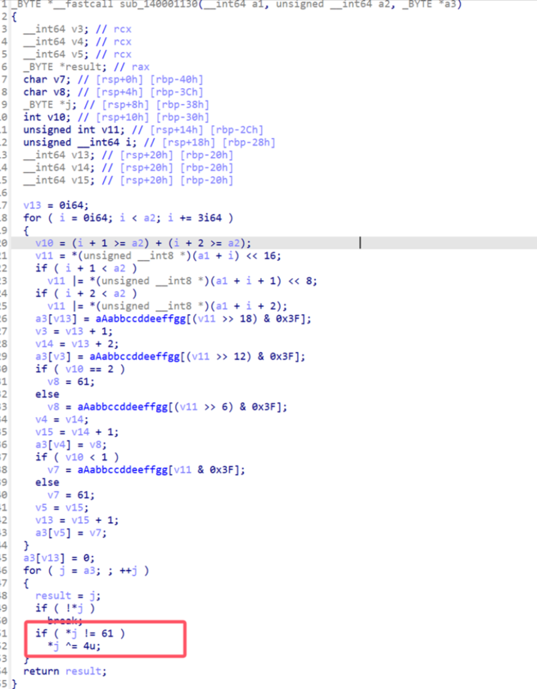

根据特征值0x3F可以想到是base64，同时注意到在最后进行了一个异或操作，base64的表也被替换了，更换的表可以直接在aAabbccddeeffgg中取

写出解密脚本

```
import base64
import string
# 密文
str= "iP}ui7siC`otMgA~h5o]Tg<4jPmtIvM5C~I4h644K7M~KVg="
# 换表
string1 = "AaBbCcDdEeFfGgHhIiJjKkLlMmNnOoPpQqRrSsTtUuVvWwXxYyZz0123456789+/"
# 原base64表
string2 = "ABCDEFGHIJKLMNOPQRSTUVWXYZabcdefghijklmnopqrstuvwxyz0123456789+/"
str1=""
for x in str:
    if x != '=':
        str1+=chr(ord(x)^4)
    else:
        str1+=x
print (base64.b64decode(str1.translate(str.maketrans(string1,string2))))
```

// flag{Y0u\_@R3\_Upx\_4nd\_b45364\_m4st3r!}

### 你知道base吗

主函数有点长，先看第一部分

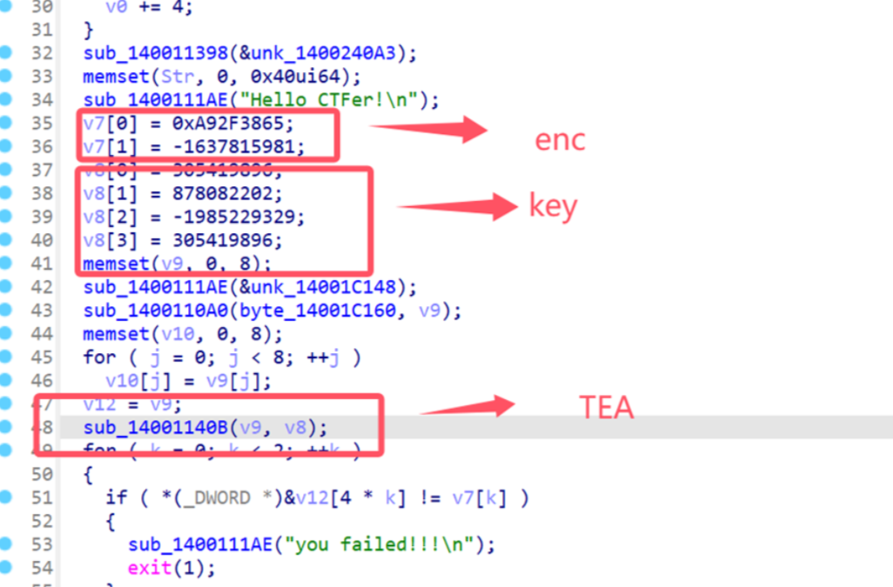

第一部分主要是一个TEA加密，加密函数如下  
 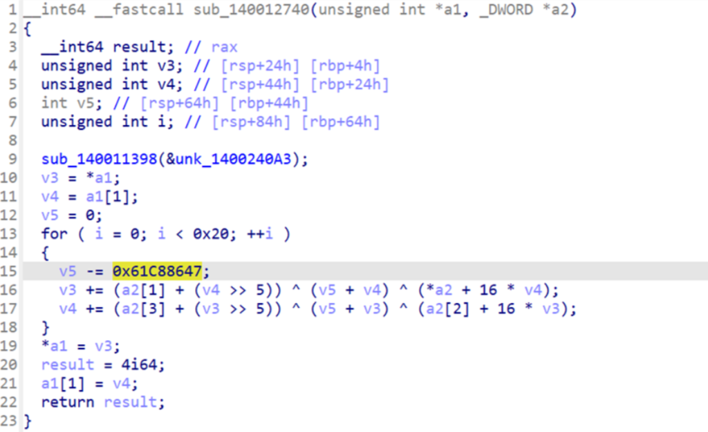

第一部分标准TEA解密得到key，作为第二部分RC4解密的密钥

```
#include<stdio.h>
#include <stdint.h>
#include<string.h>

void encrypt(uint32_t* v, uint32_t* k) {
    uint32_t v0 = v[0], v1 = v[1], sum = 0, i;
    uint32_t delta = 0x9e3779b9;
    for (i = 0; i < 32; i++) {
        sum += delta;
        v0 += ((v1 << 4) + k[0]) ^ (v1 + sum) ^ ((v1 >> 5) + k[1]);
        v1 += ((v0 << 4) + k[2]) ^ (v0 + sum) ^ ((v0 >> 5) + k[3]);
    }
    v[0] = v0; v[1] = v1;
}

void decrypt(uint32_t* v, uint32_t* k) {
    uint32_t v0 = v[0], v1 = v[1], i;
    uint32_t delta = 0x9e3779b9;
    uint32_t sum = delta * 32;
    for (i = 0; i < 32; i++) {
        v1 -= ((v0 << 4) + k[2]) ^ (v0 + sum) ^ ((v0 >> 5) + k[3]);
        v0 -= ((v1 << 4) + k[0]) ^ (v1 + sum) ^ ((v1 >> 5) + k[1]);
        sum -= delta;
    }
    v[0] = v0; v[1] = v1;
}

int main() {
    // 提供的提示数组
    uint32_t key[4] = { 0x12345678,0x3456789A,0x89ABCDEF,0x12345678 };
    uint32_t v[2] = { 0xA92F3865,0x9E60E953 };
    uint32_t temp[2]; //定义存放解密后的值

    for (int i = 0; i < 2; i += 2)
    {
        temp[0] = v[i];
        temp[1] = v[i + 1];
        decrypt(temp, key);
        for (int j = 0; j < 2; j++)
        {
            printf("%c", temp[j] & 0xff);
            printf("%c", (temp[j] >> 8) & 0xff);
            printf("%c", (temp[j] >> 16) & 0xff);
            printf("%c", (temp[j] >> 24) & 0xff);
        }
    }

    return 0;
}
// y0uokTea
```

第二部分是一个RC4加密，对我们的输入经过加密后和下面给出的TABLE进行比对，这里传入的key是我们之前解TEA得到的密钥  
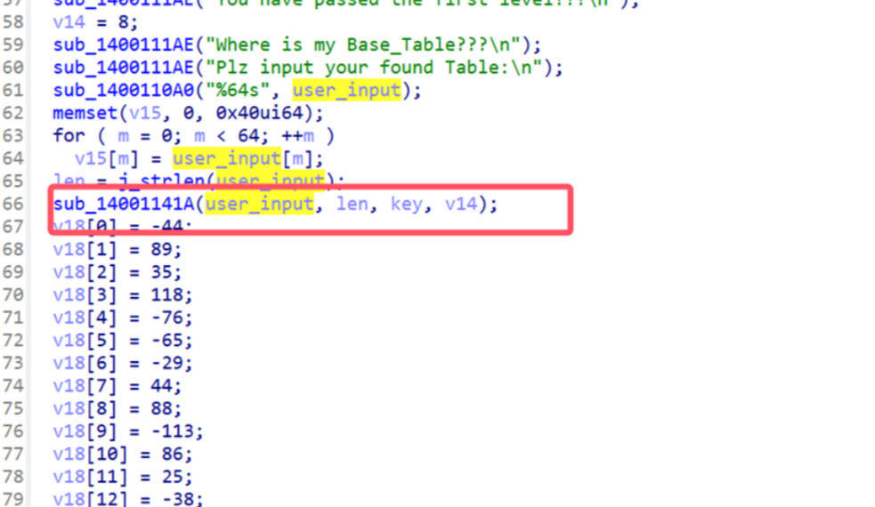  
跟进加密函数  
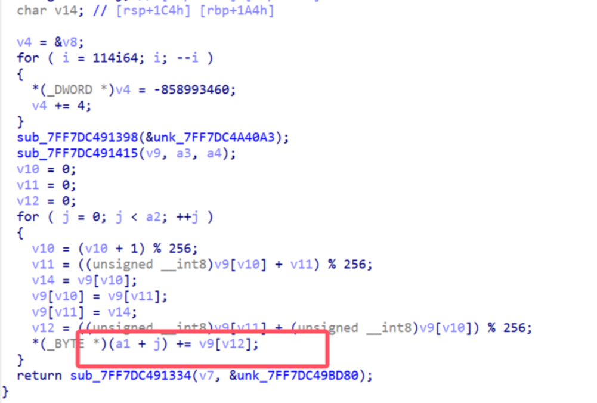  
发现这是一个魔改RC4，在最后进行的是加法而不是异或，写脚本逆向一下  
得到一个table：

```
#include<stdio.h>
#include<string.h>
typedef unsigned longULONG;

//初始化函数
void rc4_init(unsigned char* s, unsigned char* key, unsigned long Len)
{
    int i = 0, j = 0;
    char k[256] = { 0 };
    unsigned char tmp = 0;
    for (i = 0; i < 256; i++)
    {
        s[i] = i;
        k[i] = key[i % Len];
    }
    for (i = 0; i < 256; i++)
    {
        j = (j + s[i] + k[i]) % 256;
        tmp = s[i];
        s[i] = s[j]; // 交换s[i]和s[j]
        s[j] = tmp;
    }
}

//加解密
void rc4_crypt(unsigned char* s, unsigned char* Data, unsigned long Len)
{
    int i = 0, j = 0, t = 0;
    unsigned long k = 0;
    unsigned char tmp;
    for (k = 0; k < Len; k++)
    {
        i = (i + 1) % 256;
        j = (j + s[i]) % 256;
        tmp = s[i];
        s[i] = s[j]; // 交换s[x]和s[y]
        s[j] = tmp;
        t = (s[i] + s[j]) % 256;
        Data[k] -= s[t];
    }
}

int main()
{
    unsigned char s[256] = { 0 }, s2[256] = { 0 }; // S-box
    char key[256] = { "y0uokTea" };
    char pData[] = { 0xD4, 0x59, 0x23, 0x76, 0xB4, 0xBF, 0xE3, 0x2C, 0x58, 0x8F,
  0x56, 0x19, 0xDA, 0xF0, 0xC0, 0xBD, 0x36, 0x3D, 0x7B, 0x46,
  0x1B, 0xB8, 0x17, 0x1F, 0xE3, 0xD0, 0x03, 0x45, 0xCD, 0x04,
  0xED, 0xC9, 0x67, 0xE6, 0xAB, 0x29, 0xA7, 0xBC, 0x0B, 0xDE,
  0x5C, 0x30, 0x71, 0xD7, 0xD5, 0x5A, 0xC6, 0x9F, 0x40, 0x65,
  0xC4, 0x71, 0xA9, 0xC3, 0xAE, 0xD9, 0xB5, 0xE5, 0x12, 0x8C,
  0x80, 0x52,0x34,0x36 };

    unsigned long len = strlen(pData);
    int i;

    printf("pData=%s
", pData);
    printf("key=%s,length=%d

", key, strlen(key));

    rc4_init(s, (unsigned char*)key, strlen(key)); // 已经完成了初始化
    printf("

");
    for (i = 0; i < 256; i++) // 用s2[i]暂时保留经过初始化的s[i]，很重要的！！！
    {
        s2[i] = s[i];
    }

    //可以看到，加解密函数都是相同的
    printf("已经加密，现在解密:

");
    rc4_crypt(s2, (unsigned char*)pData, len); // 解密
    printf("pData=%s

", pData);
    //如果需要得到16进制数组

    //printf("解密后pData（16进制）: ");
    //for (i = 0; i < len; i++) {
     //   printf("%02X ", pData[i]);
    //} 
    return 0;
//gVxwoFhPyT/YM0BKcHe4b8GCUZtlnLW2SJO51IErk+q6vzpamdARX9siND3uQfj7
}
```

在最后的比较处跟进找到最后一处加密  
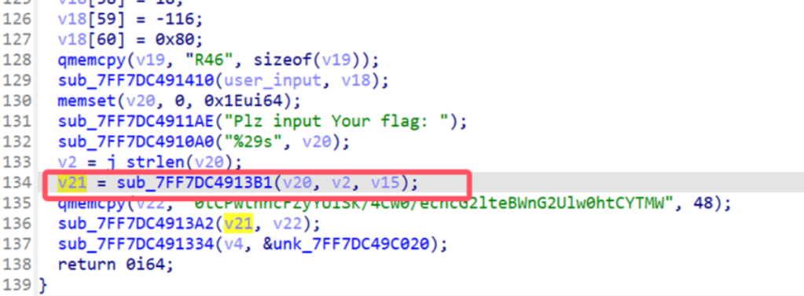  
查看函数逻辑  
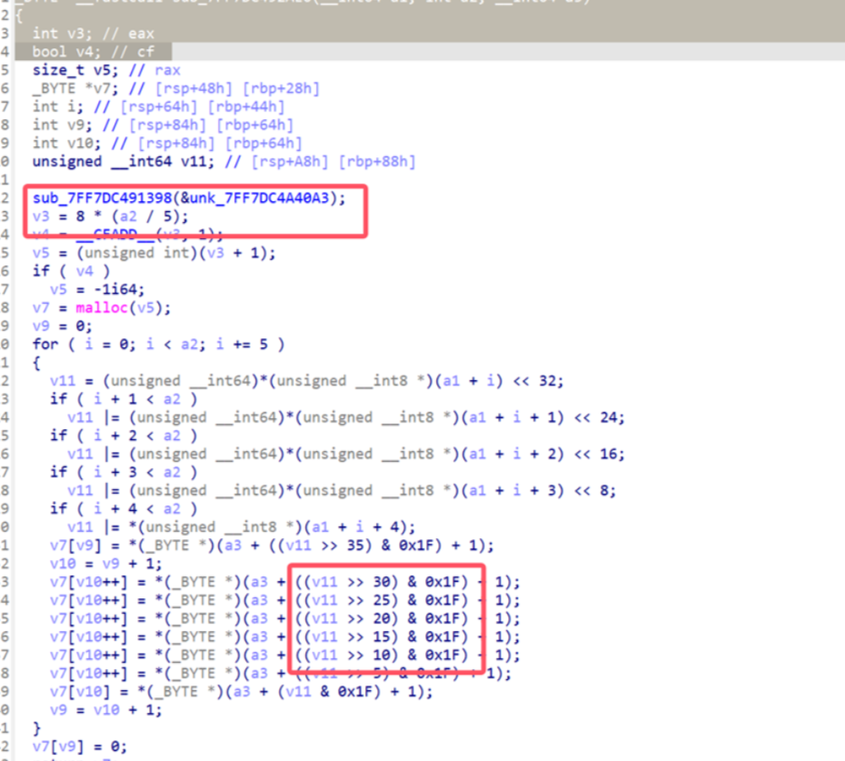  
发现是一个经典的base32加密，然后对我们之前得到的表截取1-32位得到base32的码表

```
t = "gVxwoFhPyT/YM0BKcHe4b8GCUZtlnLW2SJO51IErk+q6vzpamdARX9siND3uQfj7"
used_table = t[1:33]
print(used_table)
# VxwoFhPyT/YM0BKcHe4b8GCUZtlnLW2S
```

赛博厨子解base32

// flag{y0u\_\_rea11y\_\_k1ow\_\_Base!}  
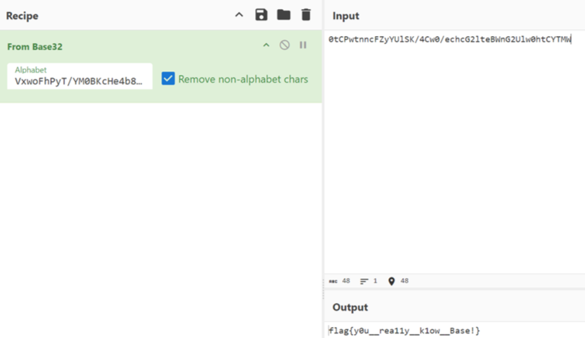

### 无由持一碗，寄与爱茶人

(由于本题最终并未在赛事中出现，这里只给出脚本和简单分析，有附件的师傅可以自己看一下)  
两段TEA加密，密钥和密文均已给出

第一部分为无魔改TEA加密

```
#include<stdio.h>
#include <stdint.h>
#include<string.h>

void encrypt(uint32_t* v, uint32_t* k) {
    uint32_t v0 = v[0], v1 = v[1], sum = 0, i;
    uint32_t delta = 0x9e3779b9;
    for (i = 0; i < 32; i++) {
        sum += delta;
        v0 += ((v1 << 4) + k[0]) ^ (v1 + sum) ^ ((v1 >> 5) + k[1]);
        v1 += ((v0 << 4) + k[2]) ^ (v0 + sum) ^ ((v0 >> 5) + k[3]);
    }
    v[0] = v0; v[1] = v1;
}

void decrypt(uint32_t* v, uint32_t* k) {
    uint32_t v0 = v[0], v1 = v[1], i;
    uint32_t delta = 0x9e3779b9;
    uint32_t sum = delta * 32;
    for (i = 0; i < 32; i++) {
        v1 -= ((v0 << 4) + k[2]) ^ (v0 + sum) ^ ((v0 >> 5) + k[3]);
        v0 -= ((v1 << 4) + k[0]) ^ (v1 + sum) ^ ((v1 >> 5) + k[1]);
        sum -= delta;
    }
    v[0] = v0; v[1] = v1;
}

int main() {
    // 提供的提示数组
    uint32_t key[4] = { 0x192021,0x28256,0x28257,0x282931 };
    uint32_t v[6] = { 0xE1D62264,0x2BBC17A2,0x3AA856CA,0x7E38322B,0xBC08EBCF,0x4A04CF6E };
    uint32_t temp[2]; //定义存放解密后的值

    for (int i = 0; i < 6; i += 2)
    {
        temp[0] = v[i];
        temp[1] = v[i + 1];
        decrypt(temp, key);
        for (int j = 0; j < 2; j++)
        {
            printf("%c", temp[j] & 0xff);
            printf("%c", (temp[j] >> 8) & 0xff);
            printf("%c", (temp[j] >> 16) & 0xff);
            printf("%c", (temp[j] >> 24) & 0xff);
        }
    }

    return 0;
}
// falg{XTe@_1s_s0_sO_g00d_
```

第二部分是一个标准的XTEA解密

```
#include<stdio.h>

int main()
{
    unsigned int enc[4] = { 0x876E3624,0xA8612878,0x3F089D1C,0x4A250D5C };
    unsigned int key[4] = { 0x15574396,0x114514,0x5201314,0x7355608 };
    int i, j;
    long sum = 0, delta = 0x61C88647;
    // 解码
    for (i = 0; i < 6; i += 2) {
        sum = 0 - (32 * delta);
        for (j = 0; j < 32; j++) {
            enc[i + 1] -= (((enc[i] >> 5) ^ (16 * enc[i])) + enc[i]) ^ (key[((sum >> 11) & 3)] + sum);
            sum += delta;
            enc[i] -= ((((enc[i + 1] >> 5) ^ (16 * enc[i + 1])) + enc[i + 1]) ^ key[sum & 3] + sum);
        }
    }
    // 打印
    for (i = 0; i < 4; i++)
    {
        for (j = 0; j <= 3; j++)
        {
            printf("%c", (enc[i] >> (j * 8)) & 0xFF);
        }
    }

    return 0;
}
// D3ink_s0mE_TEA?}
```

// flag{XTe@\_1s\_s0\_sO\_g00d\_D3ink\_s0mE\_TEA?}

### 封印

（同样未在赛事中呈现，只给出简单分析）  
python打包的应用程序，先用pyinstxtractor解包  
先解URL编码

```
import urllib.parse as urllib
enc = '%C2%8EQ%C2%B5%7D5s%01%C2%B380%C2%95%C3%B2%C3%90%0A%C3%9C%C3%B4i'
enc = urllib.unquote(enc)
for x in enc:
    print(hex(ord(x)),end=',')
```

拿出hex数组，解RC4

```
#include<stdio.h>
#include<string.h>
typedef unsigned longULONG;

//初始化函数
void rc4_init(unsigned char* s, unsigned char* key, unsigned long Len)
{
    int i = 0, j = 0;
    char k[256] = { 0 };
    unsigned char tmp = 0;
    for (i = 0; i < 256; i++)
    {
        s[i] = i;
        k[i] = key[i % Len];
    }
    for (i = 0; i < 256; i++)
    {
        j = (j + s[i] + k[i]) % 256;
        tmp = s[i];
        s[i] = s[j]; // 交换s[i]和s[j]
        s[j] = tmp;
    }
}

//加解密
void rc4_crypt(unsigned char* s, unsigned char* Data, unsigned long Len)
{
    int i = 0, j = 0, t = 0;
    unsigned long k = 0;
    unsigned char tmp;
    for (k = 0; k < Len; k++)
    {
        i = (i + 1) % 256;
        j = (j + s[i]) % 256;
        tmp = s[i];
        s[i] = s[j]; // 交换s[x]和s[y]
        s[j] = tmp;
        t = (s[i] + s[j]) % 256;
        Data[k] ^= s[t];
    }
}

int main()
{
    unsigned char s[256] = { 0 }, s2[256] = { 0 }; // S-box
    char key[256] = { "HereIsFlagggg" };
    char pData[] = {
0x8e,0x51,0xb5,0x7d,0x35,0x73,0x1,0xb3,0x38,0x30,0x95,0xf2,0xd0,0xa,0xdc,0xf4,0x69,
    };

    unsigned long len = strlen(pData);
    int i;

    printf("pData=%s
", pData);
    printf("key=%s,length=%d

", key, strlen(key));

    rc4_init(s, (unsigned char*)key, strlen(key)); // 已经完成了初始化
    printf("

");
    for (i = 0; i < 256; i++) // 用s2[i]暂时保留经过初始化的s[i]，很重要的！！！
    {
        s2[i] = s[i];
    }

    //可以看到，加解密函数都是相同的
    printf("已经加密，现在解密:

");
    rc4_crypt(s2, (unsigned char*)pData, len); // 解密
    printf("pData=%s

", pData);
    //如果需要得到16进制数组

    //printf("解密后pData（16进制）: ");
    //for (i = 0; i < len; i++) {
     //   printf("%02X ", pData[i]);
    //} 
    return 0;
}
```

// flag{REAL\_EZ\_RC4}

### HockMe

根据题目名字想到可以进行hook，先JADX打开分析一下  
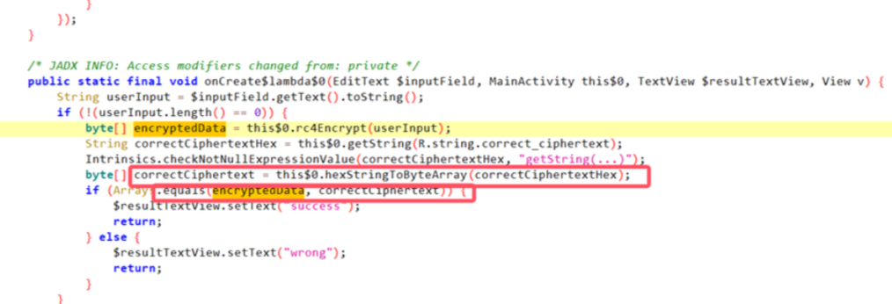  
在这里可以看到我们的输入经过RC4加密后和correctCiphertext的内容进行比较，所以我们要hook的目标就是correctCiphertext中的十六进制串，直接把代码贴给AI写脚本，hook得到的十六进制字符串如下，后来试了一下用jeb调试也是可以得到十六进制串的，这里就不写出来了  
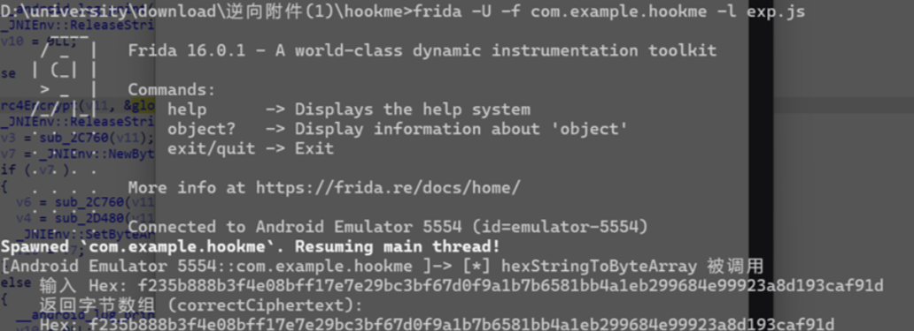

hook脚本如下：

```
Java.perform(function () {
    var MainActivity = Java.use('com.example.hookme.MainActivity');

    MainActivity.hexStringToByteArray.overload('java.lang.String').implementation = function (hex) {
        console.log("[*] hexStringToByteArray 被调用");
        console.log("    输入 Hex: " + hex);

        return 0;
    };
});
// f235b888b3f4e08bff17e7e29bc3bf67d0f9a1b7b6581bb4a1eb299684e99923a8d193caf91d
```

得到一个加密后的十六进制字符串  
这里可以继续构造一个长度为100的输入（均为1），然后hook出encryptedData的返回值，这时得到的就是密钥流，然后与前面得到的十六进制字符串异或就能得到flag，我做的时候没有想到，所以用的是IDA调试so文件的方法

在JADX中找到native层的函数调用，IDA打开so文件查找到函数  
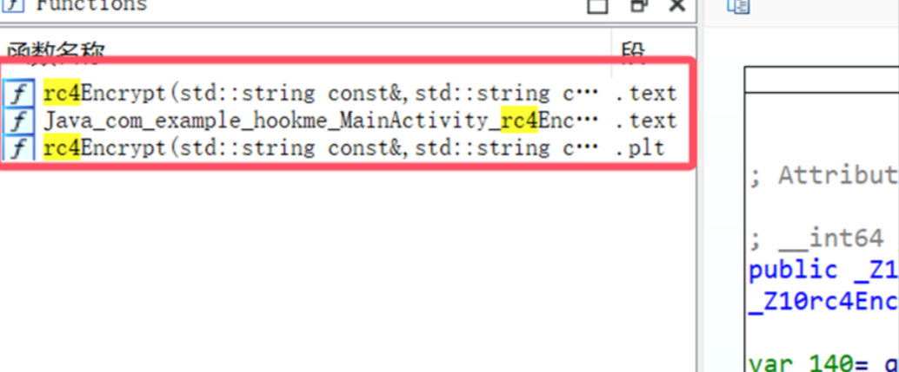  
在\_\_int64 \_\_fastcall Java\_com\_example\_hookme\_MainActivity\_rc4Encrypt(\_JNIEnv \*a1, \_\_int64 a2, \_\_int64 a3)中找到关键代码，经过动调可以找到逻辑  
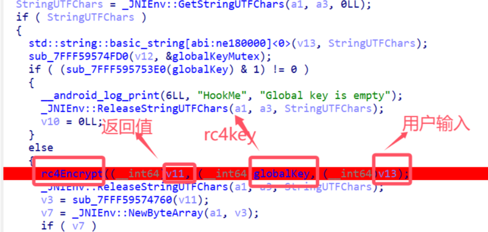  
根据之前得到的十六进制字符串，我们发现最终flag的长度为76/2=38  
所以构造一个长度为38的输入，在进入RC4加密前下断点，然后keypatch修改输入为hook得到的十六进制字符串，在v11处取数据  
但通过调试我们注意到这里输入并不能直接构造长度为38的输入，如果长度为38我们将无法在V13处得到我们的输入  
这是因为v13对我们的输入进行了限制  
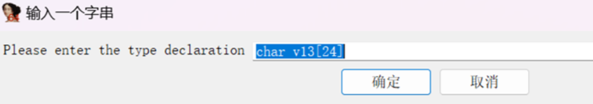  
所以我构造了一个长度为22的输入  
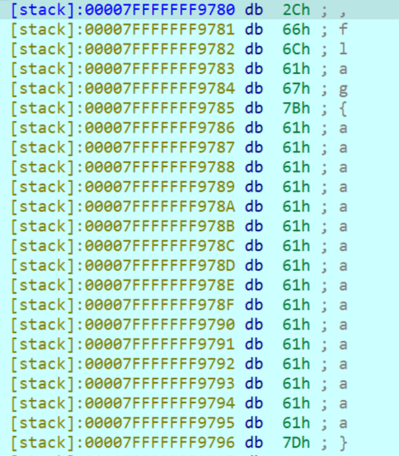  
先进行第一次动调在v11处拿数据  
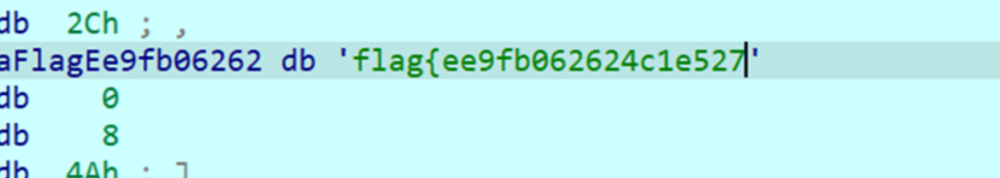  
得到第一部分字符串，后面的我是通过在调试在汇编里取数据，操作如下  
在PRGA函数内的while判断，和最后异或完成后下断点  
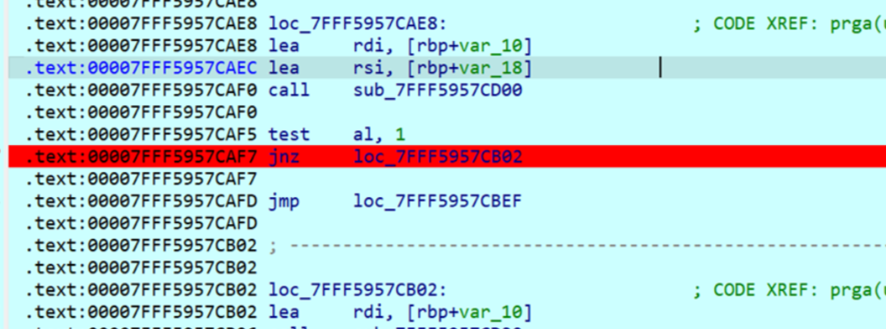

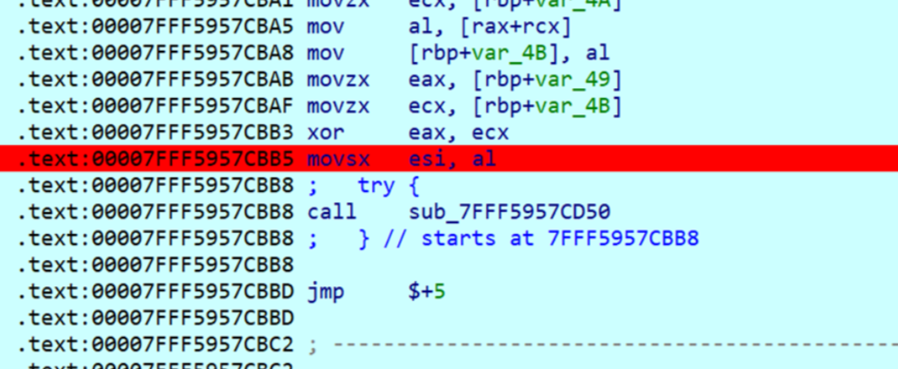  
Patch修改值，然后动调，在进行第23个字符的操作时，会触发while判断跳出循环，在这里修改ZF的值为0，使循环继续  
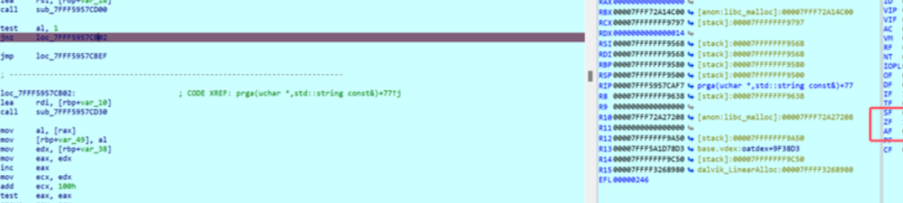  
然后我们可以看到在这里数值是存储在AL里的，所以直接去RAX寄存器里拿数值就行  
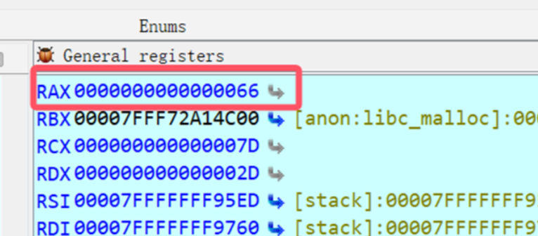  
之后一直F9，将RAX中数值记录下来，直到遇到0X7d(})为止  
得到的数据为  
0x66,0x61,0x62,0x33,0x36,0x64,0x33,0x61,0x32,0x37,0x34,0x38,0x34,0x64,0x31,0x7d  
直接写脚本打印出来，然后和前面的字符串拼接

```
flag1="flag{ee9fb062624"
list1=[0x66,0x61,0x62,0x33,0x36,0x64,0x33,0x61,0x32,0x37,0x34,0x38,0x34,0x64,0x31,0x7d,]
for x in list1:
    flag1+=chr(x)
print(flag1)
# flag{ee9fb062624fab36d3a27484d1}
```

### Matlab\_SMC？

很离谱的做法，正常做没做出来，想看预期解的师傅可以搜一下别人的博客

直接运行程序会发现提示  
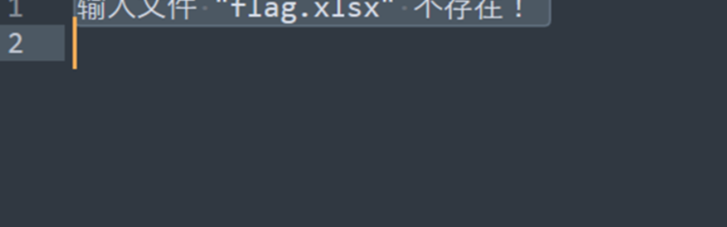  
所以先建一个flag.xlsx文件，直接将enc复制改名即可，将表格中的数据替换为1-10，然后再构造几个带小数部分数据，再在同一列中添加相同数据，构造如下  
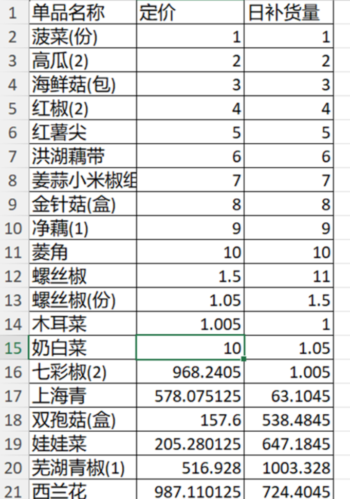  
运行程序，将加密得到的数据与原始数据进行比对  
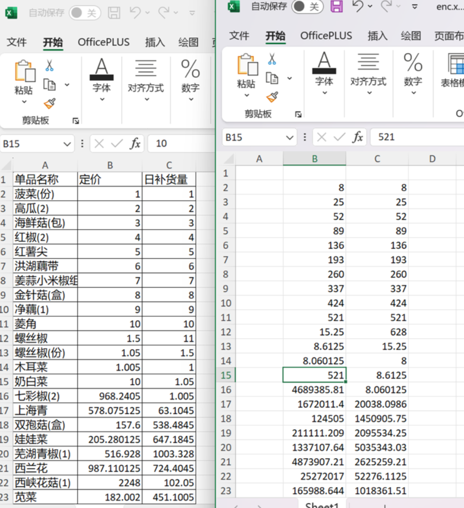  
从表格中可以发现第一列和第二列采用的加密函数是一样的，然后第一列中不同行的相同数据经过加密处理以后得到的数据也是相同的，说明加密函数在处理时并不涉及到数据的顺序问题，每个数据的加密都是独立的，有了这些信息直接把输入和输出丢给gpt，gpt可以直接跑出加密函数

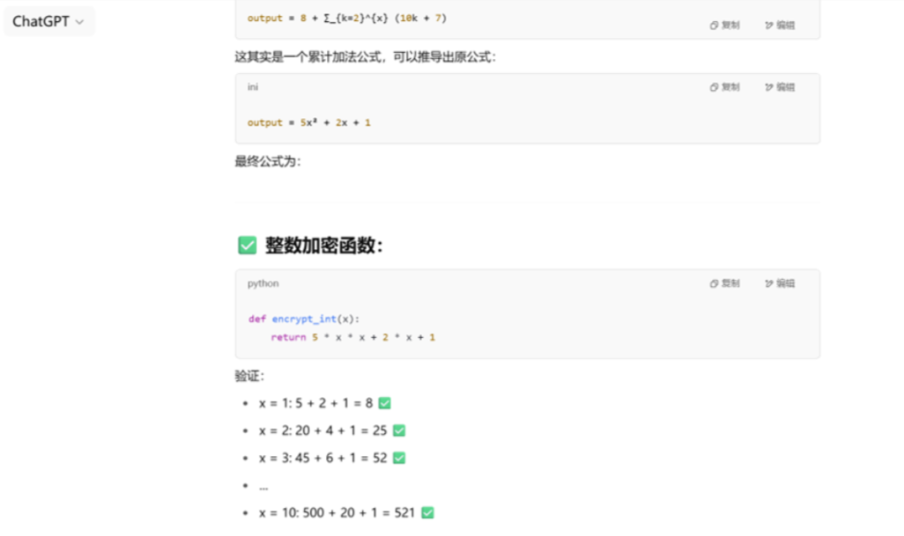

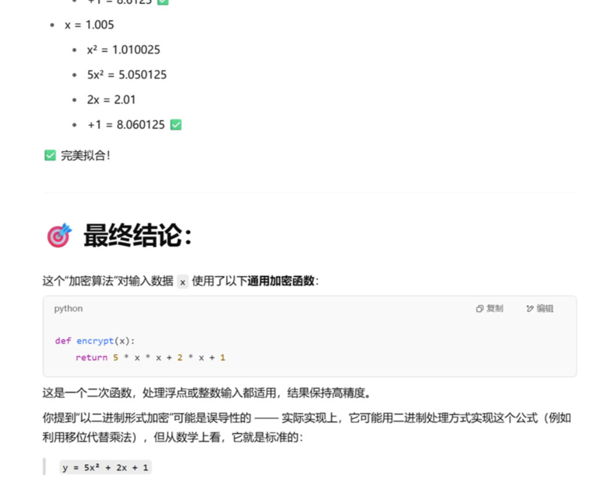  
所以最终的加密函数为y = 5x² + 2x + 1  
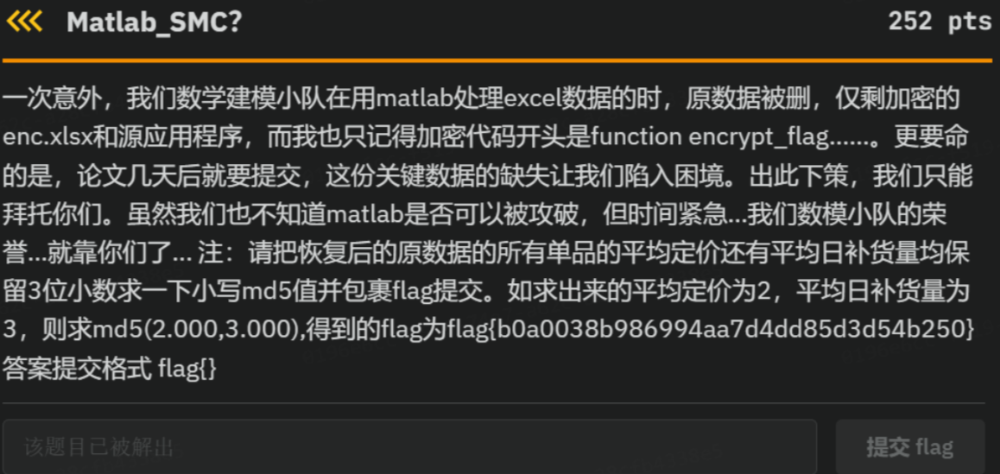

根据题目中的提示案列求平均值，将结果保留三位小数，拼接后MD5加密包上flag{}即可  
flag{7ce3c18d1e03070c79cf5074a195a240}

```
import math

def decrypt(y):
    """反解加密函数 y = 5x² + 2x + 1"""
    discriminant = 4 - 20 * (1 - y)
    if discriminant < 0:
        return None  # 无实数解
    x = (-2 + math.sqrt(discriminant)) / 10
    return x

# 加密后的浮点数列表
encrypted_values = [
    24.890125, 1084.192, 89.210125, 876.626125, 157.6,
    9833.195125, 66.866125, 83.6245, 939.25, 778.3045,
    589.4125, 72.431125, 212.05, 261.442, 968.2405,
    578.075125, 157.6, 205.280125, 516.928, 987.110125,
    2248, 182.002, 246.5005, 299.5645, 65.2405,
    591.041125, 529.192, 71.8645, 87.328, 1230.112,
    257.128, 125.051125, 504.808
]

# 解密所有值
decrypted_values = [decrypt(y) for y in encrypted_values]

# 输出列表
print("解密后的列表:")
print([round(x, 6) for x in decrypted_values])

# 求和与平均值
total = sum(decrypted_values)
average = total / len(decrypted_values)

# 保留三位小数输出
print(f"
总和: {total:.3f}")
print(f"平均值: {average:.3f}")

encrypted_values_2 = [
    214.0045, 6.9605, 454.9045, 26.338, 101.152,
    88.162, 236.7845, 1423.7845, 190.528, 14.7445,
    229.9645, 685.25, 196.738, 192.3805, 10.882,
    63.1045, 538.4845, 647.1845, 1003.328, 724.4045,
    102.05, 451.1005, 2284.1845, 132.3845, 685.25,
    8.0, 23.9125, 5079.2845, 2178.5845, 67.4125,
    33.058, 921.5245, 555.2045
]

# 解密
decrypted_values_2 = [decrypt(y) for y in encrypted_values_2]

# 输出列表
print("解密后的列表:")
print([round(x, 6) for x in decrypted_values_2])

# 求和与平均值
total_2 = sum(decrypted_values_2)
average_2 = total_2 / len(decrypted_values_2)

# 输出结果
print(f"
总和: {total_2:.3f}")
print(f"平均值: {average_2:.3f}")

avg_price = 9.493
avg_restock = 8.346

# 格式化为 3 位小数，并拼接为字符串
formatted = f"{avg_price:.3f},{avg_restock:.3f}"

# 计算 MD5
md5_hash = hashlib.md5(formatted.encode()).hexdigest()

# 输出 flag
print(f"flag{{{md5_hash}}}")
```
