# 一道国际赛题洞悉块加密的差分攻击-先知社区

> **来源**: https://xz.aliyun.com/news/18071  
> **文章ID**: 18071

---

# 一道国际赛题洞悉块加密的差分攻击

​

UMDCTF-2025有这么一题，运用了ARX密码差分攻击

task.py

```
#!/usr/local/bin/python
from Crypto.Util.number import bytes_to_long
from Crypto.Util.Padding import pad
import os

def rot(n, r):
    return (n >> r) | ((n << (256 - r) & (2**256 - 1)))

round_constants1 = [3, 141, 59, 26, 53,  58]
round_constants2 = [2, 7,   18, 28, 182, 8 ]

M = 2**256

def encrypt(key, block):
    for i in range(6):
        block = (block + key) & (M-1)
        block = block ^ rot(block, round_constants1[i]) ^ rot(block, round_constants2[i])
    return block

key = bytes_to_long(os.urandom(32)) 

for _ in range(2**14):
    i = input("Plaintext (hex): ")
    if i[0] == 'q':
        break
    pt = bytes.fromhex(i)
    pt = pad(pt, block_size=32)
    blocks = [pt[i:i+32] for i in range(0, len(pt), 32)]
    if len(blocks) > 300:
        break

    ct = [hex(encrypt(key, bytes_to_long(b)))[2:].zfill(64) for b in blocks]
    print("Ciphertext: " + ''.join(ct))


flag = open("./flag.txt", 'rb').read()
assert len(flag) <= 32

print("Flag: ", hex(encrypt(key, bytes_to_long(flag)))[2:].zfill(64))
```

## 加密函数的逆置换

key是随机生成的32字节密钥。需要我们输入明文，然后对明文进行进行32字节一组的块加密。我们看加密函数

```
def rot(n, r):
    return (n >> r) | ((n << (256 - r) & (2**256 - 1)))

round_constants1 = [3, 141, 59, 26, 53,  58]
round_constants2 = [2, 7,   18, 28, 182, 8 ]

def encrypt(key, block):
    for i in range(6):
        block = (block + key) & (M-1)
        block = block ^ rot(block, round_constants1[i]) ^ rot(block, round_constants2[i])
    return block
```

这里有旋转移位，异或，是ARX型密码。这里我们的block先加上key，然后将block与两次旋转结果再异或。对于这个rot函数，就是把一个数的低r位拿到前面，也就是  
 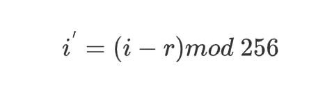   
这个算法是可逆的。我这边可以解释一下：

首先，找到M定义为最小的正整数n这样  
 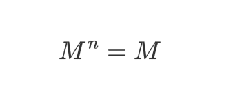  
让我们从扩展函数squared开始：  
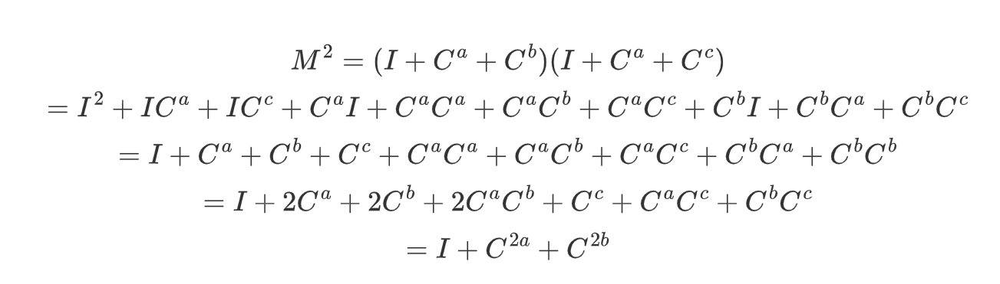  
比如  
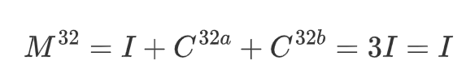  
我们n有 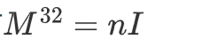  
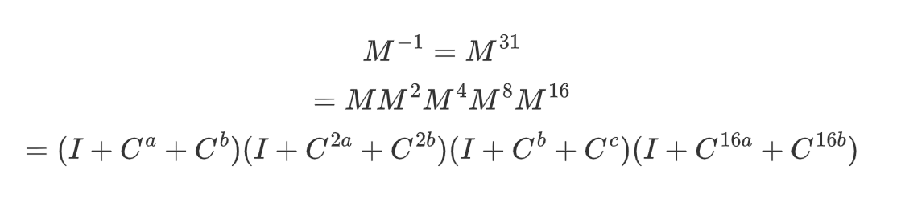  
如果 n是奇数，则简化为 I；如果 n 是偶数，则结果为零。因此，要使其成为可逆函数，n必须是奇数。

这里就是我们通过的逆函数

```
uint32_t xor_rot2_inv(uint32_t x, uint32_t a, uint32_t b)
{
  // Perform the five steps (and keep 'a' and 'b' in range given
  // how 'rot' is defined above) as a sequence of transforms.
  // The order reversed of above (products of powers of M commute).
  x = x^rot(x,a)^rot(x,b); a = (a+a) & 0x1f; b = (b+b) & 0x1f; // t0 = M x
  x = x^rot(x,a)^rot(x,b); a = (a+a) & 0x1f; b = (b+b) & 0x1f; // t1 = M^2 t0
  x = x^rot(x,a)^rot(x,b); a = (a+a) & 0x1f; b = (b+b) & 0x1f; // t2 = M^4 t1
  x = x^rot(x,a)^rot(x,b); a = (a+a) & 0x1f; b = (b+b) & 0x1f; // t3 = M^8 t2
  x = x^rot(x,a)^rot(x,b);                                     // x' = M^16 t3
  return x;
}
```

所以我们在这题这部分的逆函数是

```
def undo_rotations(block, a, b):
    """
    逆转 “block ^ rot(block,a) ^ rot(block,b)” 这一步。
    因其不是单次可逆，需要迭代逼近：x_{t+1} = y ^ rot(x_t,a) ^ rot(x_t,b)
    重复 8 次足够收敛到原始 block。
    """
    for _ in range(8):
        block = block ^ rot(block, a) ^ rot(block, b)
        # 注意：原加密过程中 a,b 会翻倍，两次迭代时要同步
        a = (a + a) & 0xff
        b = (b + b) & 0xff
    return block
```

## 差分攻击

现在的话我们就要考虑怎么输入明文，进行选择明文攻击。这里就需要用到差分攻击的思想

### 什么是差分攻击

简单的例子，比如一个简单的异或加密算法

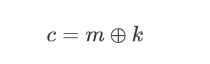   
c为密文，m是明文，k是密钥  
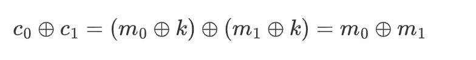  
我们可以从一对密文中直接得到一对明文的异或，经过一次异或运算消除了密钥

### 差分攻击的核心思想

1. **差分对**  
   选取或构造一对明文$ (P,P^′)$，它们之间满足已知的差分 $ΔP=P⊕P^′$
2. **差分传播**  
   跟踪 $ΔP$ 在每一轮的非线性／线性层（如加法、XOR、旋转、S-box）中如何变成中间差分 $ΔX\_i$;
3. **轮内统计**  
   某些差分对在某轮后落到特定位时具有较高概率；利用这些高概率特征，对给定密文对 $(C,C^′)$ 统计出现频次，来验证或排除某个子密钥假设；

### ARX密码的差分攻击

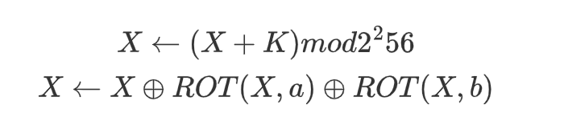

我们要恢复K(256位)，则需要

**构造明文差分**

我们先不考虑旋转直接看这段代码如何让明文序列在最低位（bit 0）线性递增

我们选

```
base = 2**246 * j
```

它在二进制里是什么样子？

​ 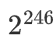在二进制里就是一个在第 246 位上有一个 1，其它位全是 0

```
bit index:  ... 248 247 246 245 ... 3 2 1 0
2^246      :   ...  0   0   1   0 ... 0 0 0 0
```

乘以 j（不管 j是 1、2、3……），都只会影响那第 246 及更高位上的排列组合，高达第 ∞ 位都在那一串“高位”里；而低于 246 位的所有位——也就是 bit 0 到 bit 245——**始终都是 0**。

然后我们做

```
P_k = base + k
```

也就是占据了最低 8 位（bit 0…7）。因为 k<256，做加法 `base + k`：

1. 它只会在“低 8 位”上产生进位或翻转，因为最高也就到 bit 7；
2. bit 8…bit 245 上仍然是 0，不会被 kkk 干扰（因为 kkk 只能把前 8 位从 00000000 → 11111111）；
3. bit 246 及以上保持跟 `base` 一样，和 `k` 无关。

```
for k in range(samples):      # samples = 256
    pt = base + k
```

当k从0到255变化时，base+k只会让最低8bit变化  
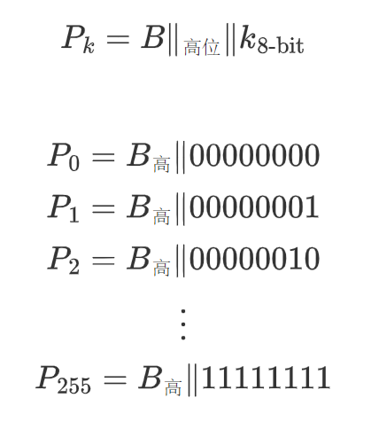

它们之间的差分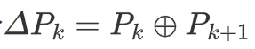

但这有个问题，就是如果有进位会导致差分异或结果不对

因为`base + k` 的差分会落在最低的 8 个比特（bit 0…7）上；而这 8 个比特在加法中都可能触发进位，并影响后续 XOR/rot 层的多个位置

所以我们要进行旋转

```
pt = rot(base + k, 256 - key_index)
```

旋转后，这些差分就恰好分布在新位置

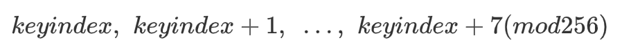

即 “以 `keyindex` 为起点、长度 8 的那一段”——而其它 248 位都一样没有差分。

**统计与猜测**

重复多次（25 轮，每轮 256 个样本），累计每个样本的“carry 权重”；

按奇偶性将样本分成两类：若偶数编号样本的高权重更多，就猜 key 比特为 1，反之为 0；

这样就能用差分概率偏差把 key 的每一位排除一半（从 2 候选到 1）。

**组合与容错**

前 250 位用上述方法逐 bit 猜出，剩下 6 位由于统计噪声较大，改用暴力枚举；

**举一个例子回顾刚才过程**

我们假设要猜的 `key_index = 3`（倒数第 3 位，从 0 开始编号），

在真实脚本里会把最低位的差分旋转到这个位置，这里为了演示直接在明文里操作。

令两条明文：

```
vbnetCopyEditP      = 0b  0 0 0 0 0 0 0 0   = 0x00  
P'     = P ⊕ (1 << 3)        = 0b 00001000 = 0x08
ΔP     = P ⊕ P'              = 0b 00001000
```

也就是说，只有 **bit 3** 从 0→1。

1. 经过“加 key”层

设对应的 `key = 0b k₇k₆k₅k₄ k₃k₂k₁k₀`，这里我们只关心 k₃（第 3 位）：

```
vbnetCopyEditX  = P + key
X' = P' + key
```

加法和进位

用二进制加法列竖式（只看低 5 位以示意）：

```
sqlCopyEdit   P        = ... 00000 000  
 + key      = ... k₄ k₃ k₂ k₁ k₀
  -----------------------------
   X        = ...  k₄ k₃ k₂ k₁ k₀    (no carry from P, since P low bits are zero)
vbnetCopyEdit   P'       = ... 01000 000  
 + key      = ... k₄ k₃ k₂ k₁ k₀
  -----------------------------
   X'       = ...  k₄ k₃ k₂ k₁ k₀
            + carry_in_from_bit3 
```

对 `X'`，因为 P' 在 bit 3 上多了 1，就在加到 key 的那一位上会产生“进位”：

* 如果 k₃ = 0，则 1 + 0 → bit 3 变 1，无进位；
* 如果 k₃ = 1，则 1 + 1 → bit 3 变 0，并 **向 bit 4 产生进位**。

于是，`X ⊕ X'` 在 bit 3、bit 4 会表现出不同：

|  |  |  |
| --- | --- | --- |
| k₃ 值 | bit 3 的 Δ | bit 4 的 Δ |
| 0 | 1 | 0 |
| 1 | 0 | 1 |

其它更高位除了进位连锁，也可能被影响，但我们只看最前面几位作为示例。

1. 经过 “XOR + Rotate” 层，并撤销最后一轮

真实脚本里，下一步是

```
nginxCopyEditY  = X ⊕ rot(X, a) ⊕ rot(X, b)
Y' = X' ⊕ rot(X', a) ⊕ rot(X', b)
```

我们用 `undo_rotations` 把最后一轮的这一步撤销，只恢复到 “加 key 后” 的中间态 `X`、`X'`。

这样我们就可以直接对

```
ΔX = X ⊕ X'
```

做分析。

1. 取出 ΔX（差分异或）并统计 carry 痕迹

假设我们观察到的 ΔX\Delta XΔX（只列低 6 位）是：

```
mathematicaCopyEditΔX = X ⊕ X'
     = ... 0 0 C₄ C₃ C₂ C₁ C₀
```

上述表格告诉我们：如果 k₃=0，那么 C3=1,C4=0,C₃=1, C₄=0,C3=1,C4=0；如果 k₃=1，那么 C3=0,C4=1，C₃=0, C₄=1,C3=0,C4=1。

这就给我们一个“区分”k₃ 的**统计特征**：

​ k₃=0 时，ΔX 在 bit 3 上更有可能是 1；

​ k₃=1 时，ΔX 在 bit 4 上更有可能是 1。

脚本的 `get_weight` 正是把这些关键位（在 256 bit 里对应到 `(172 - key_index)...(176 - key_index)`） 抽出来加权累加：

```
weight = ΔX[pos0]*2⁶ + ΔX[pos1]*2⁴ + ΔX[pos2]*2³ + ...
```

累计 25 轮 × 256 个样本后，“正确的 k₃ 假设” 会在这些位置积累明显更大的权重；

“错误的 k₃ 假设” 则更分散，难以同时满足所有位的高权重。

最终脚本对这 256 个样本分奇偶号统计高于阈值的次数，就能判断 k₃ 是 0 还是 1。

我们的脚本是

```
def get_weight(key_index, diff):
    """
    给定解密轮次后相邻两条分组的差分 diff（256位列表），
    在差分传播的关键位置(172-key_index ... 176-key_index)做加权求和，
    用来度量第 key_index 位的‘扰动强度’（carry 传播）。
    """
    return (diff[(172 - key_index) % 256]) * 2**6 + \
           (diff[(173 - key_index) % 256]) * 2**4 + \
           (diff[(174 - key_index) % 256]) * 2**3 + \
           (diff[(175 - key_index) % 256]) * 2**2 + \
           (diff[(176 - key_index) % 256]) * 2**1这个的* 2**6 怎么理解
```

这里的选值这样是因为

`2**6, 2**4, 2**3, 2**2, 2**1` 这些值不是随意选的，它们体现了“越接近起点（bit `key_index`）的 carry 传播越重要、越可靠”，所以权重越大。

这段代码里，把第一个位置给了最高权重 `2**6=64`，下一个给 `2**4=16`，依次递减到 `2**1=2`。

如果某条样本在第一个被关注的位发生了差分，就加 64 分；如果只在更远的位翻了，就只加 2、4、8、16 等较小分。

所以我们的脚本是

## EXP

```
from Crypto.Util.number import bytes_to_long, long_to_bytes  # 大整数↔字节串 相互转换
from pwn import *                                       # pwntools：用于远程/本地进程交互
import itertools                                        # 方便做笛卡儿积、排列组合
from tqdm import tqdm                                   # 进度条显示

# 本脚本对 6 轮 ARX 密码做“差分统计”攻击，成功率约 25%。

def rot(n, r):
    # 256 位循环右移：把 n 的二进制整体向右滚动 r 位
    # (n >> r) 逻辑右移，高位补 0
    # (n << (256-r)) & (2**256-1) 把被右移“丢失”的低 r 位移到高端
    return (n >> r) | ((n << (256 - r) & (2**256 - 1)))

# 每一轮的两个旋转常数 (ARX 的 R1, R2)
round_constants1 = [3, 141, 59, 26, 53, 58]
round_constants2 = [2, 7, 18, 28, 182, 8]

M = 2**256  # 模数
N = 6       # 轮数

def encrypt(key, block):
    # 模拟服务器端的加密函数（客户端也用来验证）
    for i in range(N):
        # (1) 加密轮的“加 key”层
        block = (block + key) & (M-1)
        # (2) 加密轮的“XOR+rot”层
        block = block ^ rot(block, round_constants1[i]) ^ rot(block, round_constants2[i])
    return block
 
def get_weight(key_index, diff):
    """
    给定解密轮次后相邻两条分组的差分 diff（256位列表），
    在差分传播的关键位置(172-key_index ... 176-key_index)做加权求和，
    用来度量第 key_index 位的‘扰动强度’（carry 传播）。
    """
    return (diff[(172 - key_index) % 256]) * 2**6 + \
           (diff[(173 - key_index) % 256]) * 2**4 + \
           (diff[(174 - key_index) % 256]) * 2**3 + \
           (diff[(175 - key_index) % 256]) * 2**2 + \
           (diff[(176 - key_index) % 256]) * 2**1

def undo_rotations(block, a, b):
    """
    逆转 “block ^ rot(block,a) ^ rot(block,b)” 这一步。
    因其不是单次可逆，需要迭代逼近：x_{t+1} = y ^ rot(x_t,a) ^ rot(x_t,b)
    重复 8 次足够收敛到原始 block。
    """
    for _ in range(8):
        block = block ^ rot(block, a) ^ rot(block, b)
        # 注意：原加密过程中 a,b 会翻倍，两次迭代时要同步
        a = (a + a) & 0xff
        b = (b + b) & 0xff
    return block

def decrypt(key, block):
    """
    完整的解密流程：对 6 轮逆序执行
      — 先 undo_rotations 还原 XOR+rot
      — 再减去 key，撤销“加 key”
    """
    for i in range(N-1, -1, -1):
        a, b = round_constants1[i], round_constants2[i]
        block = undo_rotations(block, a, b)
        block = (block - key) % M
    return block

def l2n(v):
    """将 0/1 列表拼成大整数（密钥 bit 列表 → key 整数）"""
    s = 0
    for bit in v:
        s = (s << 1) | bit
    return s

def n2l(n):
    """将大整数展开成 256 位 0/1 列表"""
    return list(map(int, bin(n)[2:].zfill(256)))

# ==== 主流程：与远程服务交互，逐位猜 key ====
io = remote("localhost", 1447)  # 连接到加密 oracle
samples = 256                  # 每轮测试构造 256 条明文
attempts = 25                  # 重复试验次数，累计统计差分

print("Collecting samples...")
guessed_key = [0] * 256       # 最终存放每一位猜测结果

# 逐位猜测 key[255], key[254], ... , key[6]
for key_index in tqdm(range(250)):  # 最前后 6 位留给后面枚举修正
    carry_weights = {k: 0 for k in range(samples)}

    # 对每个 key_index 做多轮采样
    for j in range(attempts):
        # base 值用于控制差分位置，保证只有第 key_index 位在变动
        base = 2**246 * j
        if key_index > 200:
            base = 2**100 * j

        # 构造一批明文：旋转后让某一 bit 线性递增
        plaintexts = []
        for k in range(samples):
            pt = base + k
            pt = rot(pt, 256 - key_index)
            plaintexts.append(hex(pt)[2:].zfill(64))

        # 发送 batch，获取合并的密文
        io.sendlineafter(b'(hex): ', ''.join(plaintexts).encode())
        io.recvuntil(b'Ciphertext: ')
        line = io.recvline(keepends=False).decode()
        cts = bytes.fromhex(line)
        # 拆分成 256-bit 块
        cts = [bytes_to_long(cts[i:i+32]) for i in range(0, len(cts), 32)]

        # 撤销最后一轮的 XOR+rot，得到“加 key”之前的中间状态
        ucts = [undo_rotations(ct, round_constants1[N-1], round_constants2[N-1])
                for ct in cts]

        # 分析相邻两条的差分，累加 carry_weights
        for k in range(samples):
            u1 = list(map(int, bin(ucts[k])[2:].zfill(256)))
            u2 = list(map(int, bin(ucts[(k+1)%samples])[2:].zfill(256)))
            diff = [a ^ b for a, b in zip(u1, u2)]
            carry_weights[k] += get_weight(key_index, diff)

    # 从统计结果中筛选“权重大于阈值”的样本，看奇偶分布，
    # 决定该 key_index 是 0 还是 1
    weights = [(k, w) for k, w in carry_weights.items() if w >= 600]
    parity_0 = sum(1 for k, _ in weights if k % 2 == 0)
    parity_1 = sum(1 for k, _ in weights if k % 2 == 1)
    guess = 1 if parity_0 > parity_1 else 0
    guessed_key[255 - key_index] = guess

# 通知服务器结束 query，读取 flag 密文
io.sendline(b"q")
io.recvuntil(b"Flag: ")
flag_ct = bytes_to_long(bytes.fromhex(io.recvline(keepends=False).decode()))

print("Initial key guess:", guessed_key)

# 用猜测的 key 解密试试看
pt = long_to_bytes(decrypt(l2n(guessed_key), flag_ct))
if b'UMDCTF' in pt:
    print("Recovered flag:", pt)
    exit()

# 如果前 6 位有错，暴力枚举这 6 位
new_key_tail = guessed_key[6:]
for top6 in itertools.product([0,1], repeat=6):
    trial_key = list(top6) + new_key_tail
    pt = long_to_bytes(decrypt(l2n(trial_key), flag_ct))
    if b'UMDCTF' in pt:
        print("Flag:", pt)
        exit()

# 如果仍有 1~2 位预测错误，尝试翻转 1 或 2 位后再枚举前 6 位
for errors in (1, 2):
    for bad in itertools.combinations(range(250), errors):
        tail = new_key_tail.copy()
        for idx in bad:
            tail[idx] ^= 1
        for top6 in itertools.product([0,1], repeat=6):
            trial_key = list(top6) + tail
            pt = long_to_bytes(decrypt(l2n(trial_key), flag_ct))
            if b'UMDCTF' in pt:
                print("Flag:", pt)
                exit()
print("Failed to recover flag.")

```
