# 某加速器配置信息解密-先知社区

> **来源**: https://xz.aliyun.com/news/18072  
> **文章ID**: 18072

---

## 背景与需求分析

### 背景介绍

目标样本作为一款加速器软件，被不法分子利用翻墙从事违法活动，造成严重负面影响。为有效打击此类违法行为，需破解该软件对存储连接服务器地址、更新源及访问站点的文件加密机制，获得真实的服务器信息，便于针对性防控和取证。

### 任务目标

* 采用合适的逆向分析方法，定位目标样本中负责解密服务器相关信息的关键反汇编代码段。
* 分析并还原出该解密算法的高级语言等价源码。
* 使用还原的算法成功解密密文配置文件，获取目标服务器地址等敏感信息。

## 分析思路与工具选型

本次逆向工作采用 OllyDbg 动态调试工具，结合对 Windows API 的调用监控，重点关注文件读取和内存访问过程，配合断点调试逐步定位解密算法实现。

### 工具资源

目标样本和API文档

<https://drive.google.com/drive/folders/1HNGdEGAcJgMc6dCoI_aFDNdSmsMhqFob?usp=share_link>

ollydbg下载地址

<https://tool.kanxue.com/index-detail-1.htm>

### 信息收集

目标样本是一款加速器软件。为隐藏自身代理服务器地址，软件对代理服务器地址进行了加密。

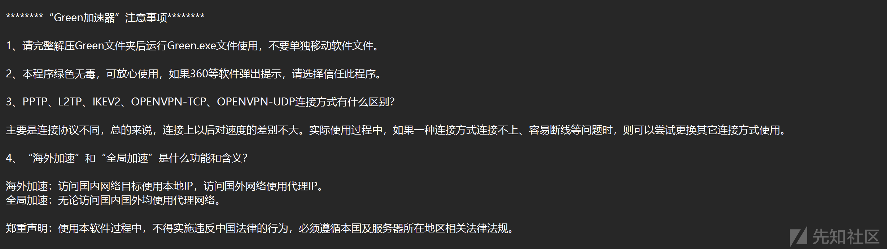

查看软件目标目录，发现以下文件均为加密状态：

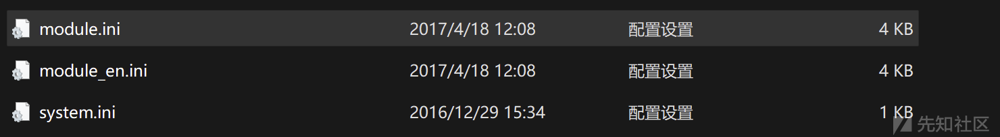

查看相关文档，找到和文件相关的 API 函数：

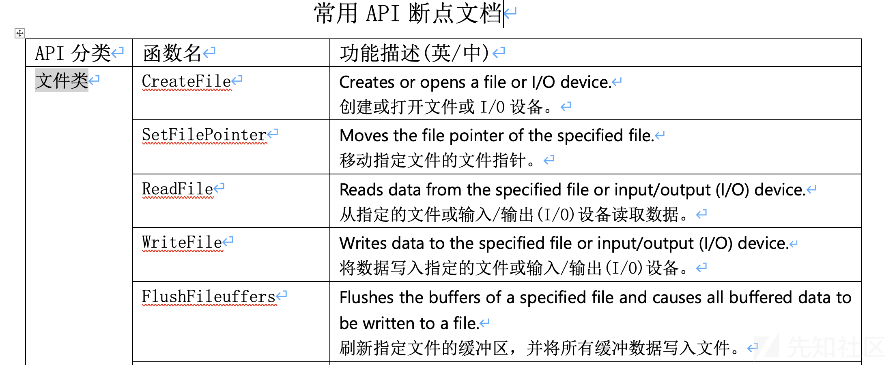

注意：CreateFile、ReadFile、WriteFile 这几个 API 肯定会遇到，在这些 API 调用处一定要下断点，观察程序调用它们时具体在执行什么操作。

#### 关键 API 调用总结表

|  |  |  |
| --- | --- | --- |
| API 函数名 | 作用 | 调试意义 |
| CreateFileA | 打开 system.ini 文件 | 确定加密数据来源 |
| ReadFile | 读取密文至缓冲区 | 跟踪密文数据流向 |
| WriteFile | （可选）是否有加密写回 | 判断是否为自修改型程序 |

## 逆向分析过程详述

### 定位输入文件

直接用 OllyDbg 打开程序，定位程序中打开文件的位置。

搜索 `CreateFile`，找到调用的 API 是 `KERNEL32.CreateFileA`。

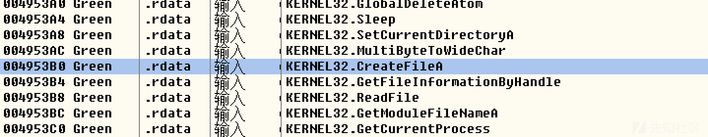

查看该函数的具体用法。

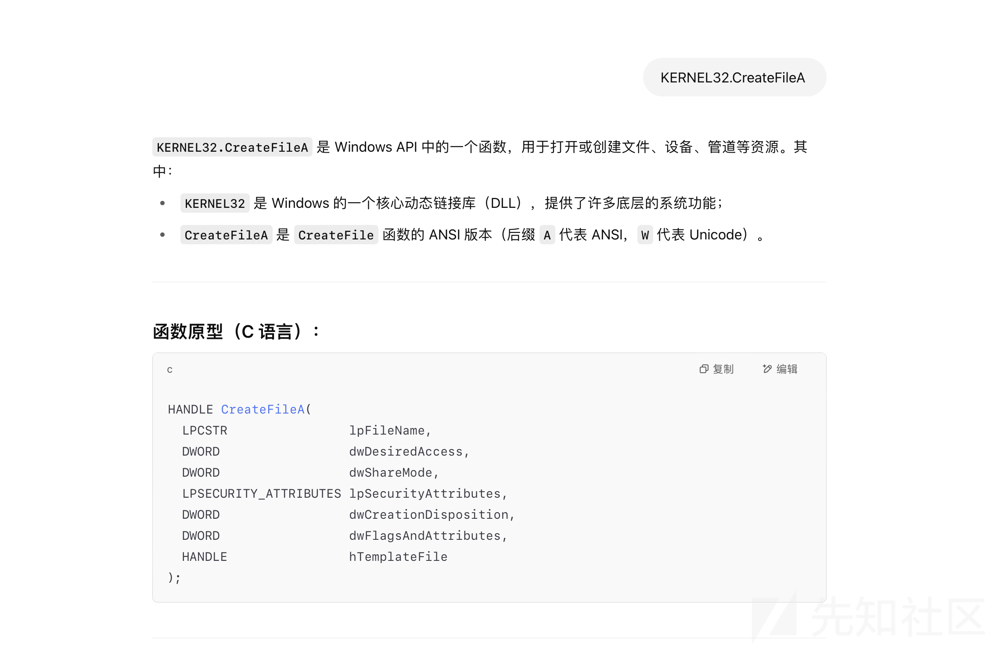

##### 参数说明

|  |  |
| --- | --- |
| 参数 | 含义 |
| `lpFileName` | 要打开或创建的文件名（ANSI 字符串）。 |
| `dwDesiredAccess` | 所请求的访问权限，如 `GENERIC_READ`, `GENERIC_WRITE`。 |
| `dwShareMode` | 文件共享模式，如 `FILE_SHARE_READ`，允许其他进程读该文件。 |
| `lpSecurityAttributes` | 安全属性指针，通常为 `NULL`。 |
| `dwCreationDisposition` | 创建方式，例如 `OPEN_EXISTING`, `CREATE_NEW`, `OPEN_ALWAYS`。 |
| `dwFlagsAndAttributes` | 文件属性和标志，例如 `FILE_ATTRIBUTE_NORMAL`。 |
| `hTemplateFile` | 复制属性的模板文件句柄，通常为 `NULL`。 |

在调用处下断点，观察参数值。

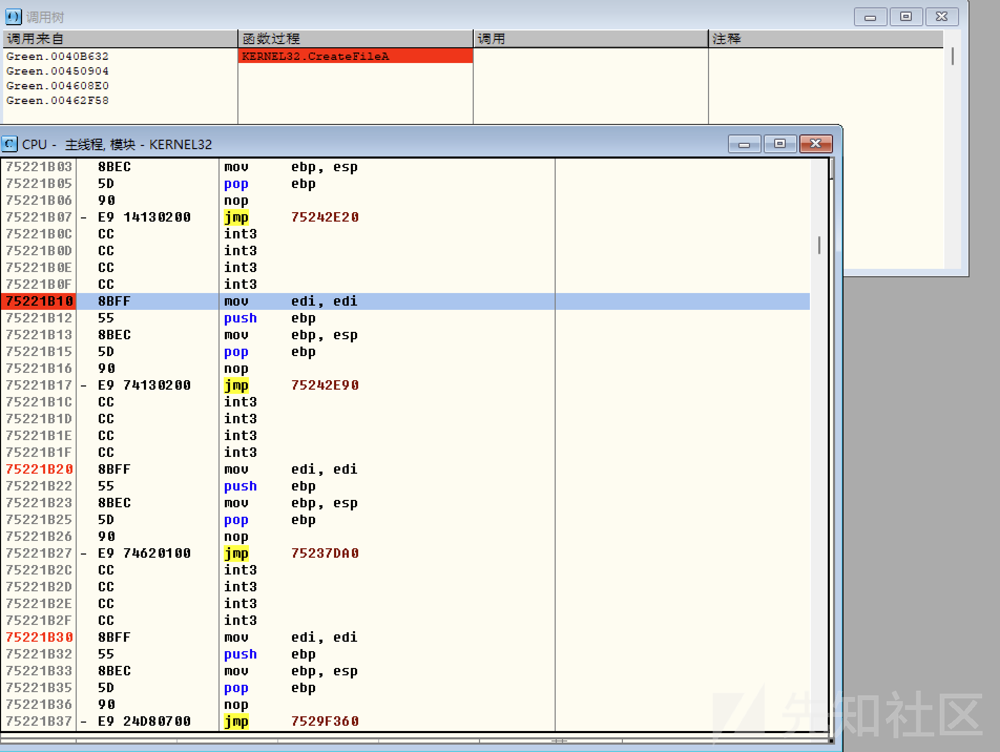

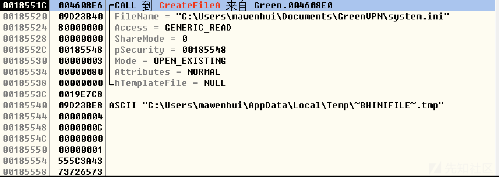

从上图可以看到，文件名参数是 `system.ini`。

### 定位解密函数

找到文件句柄（0x20c）。

**文件句柄（File Handle）** 是操作系统用来标识和操作打开文件的一种抽象标识符（通常是一个整数）。

打开一个文件时，系统给你一个“编号”或“凭证”，以后你就用这个编号来对这个文件进行各种操作，比如读、写、关闭等。

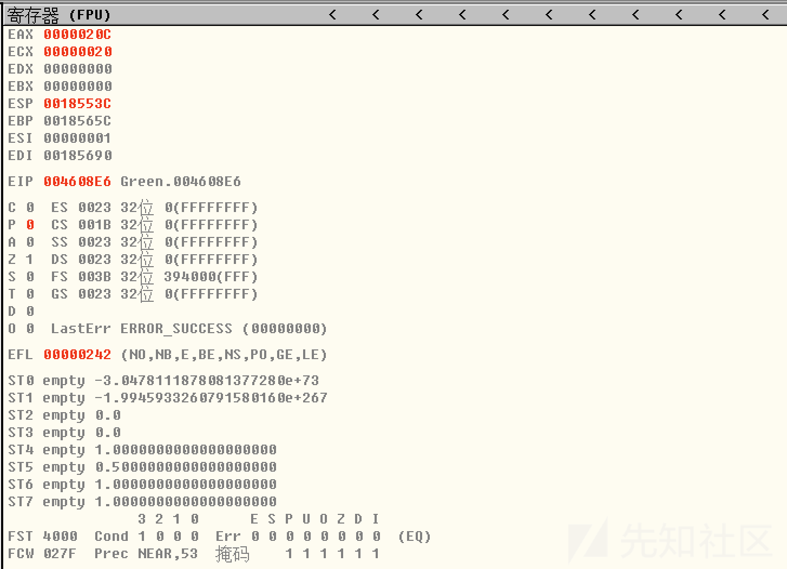

继续调试，找到存储句柄的内存地址（edi=0x00185690）。

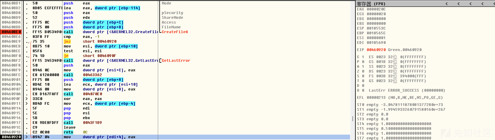

继续跟踪，发现句柄地址被放到了寄存器 `ecx`，且接下来调用的函数参数即为该值。

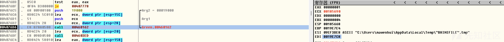

步入该函数查看具体逻辑。

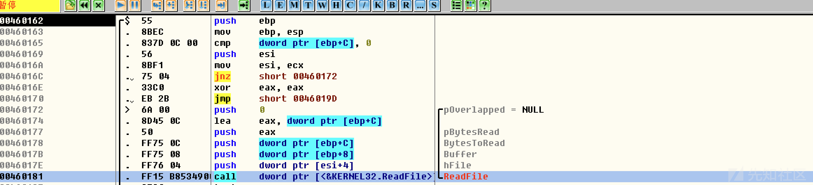

### 解密函数分析

在函数内部出现了对 `ReadFile` 函数的调用，该函数用于从指定的文件或输入/输出（I/O）设备中读取数据。

通过快速浏览汇编代码，即可清楚地看到 `ReadFile` 的调用。根据其官方描述：

> **Reads data from the specified file or input/output (I/O) device.**从指定的文件或输入/输出（I/O）设备读取数据。

也就是说，该函数负责从加密文件中读取内容，并将其加载到内存缓冲区中，为后续的解密操作做准备。

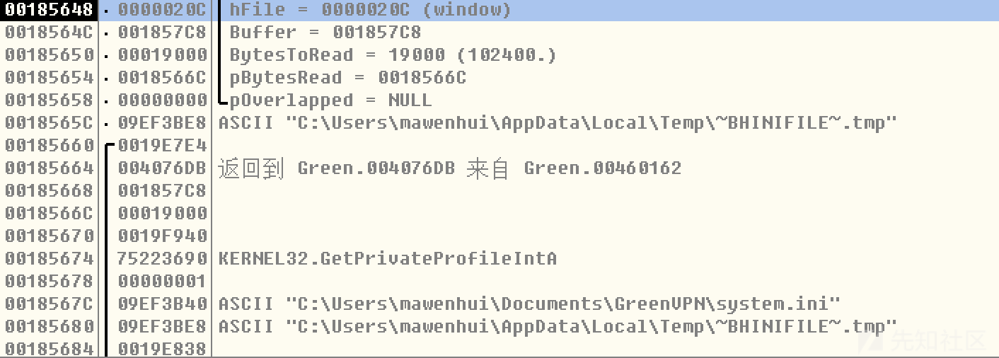

`ReadFile` 调用时传入的句柄正是之前打开的 `system.ini` 文件句柄，读取数据缓存在地址 `0x001857C8`。

​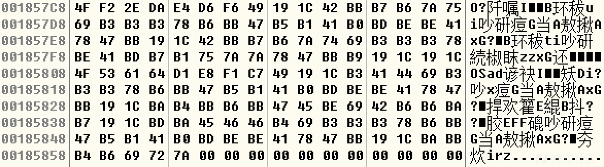

这表明 `system.ini` 文件内容已经被成功读取，下一步就是确认这些数据被谁使用，从而找到解密程序。

对该内存区域设置内存访问断点，跟踪数据的调用。

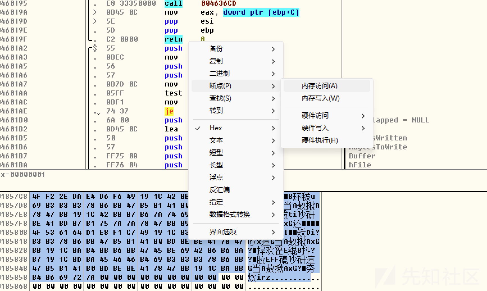

经过多次单步调试，发现读取的密文已经被解密。

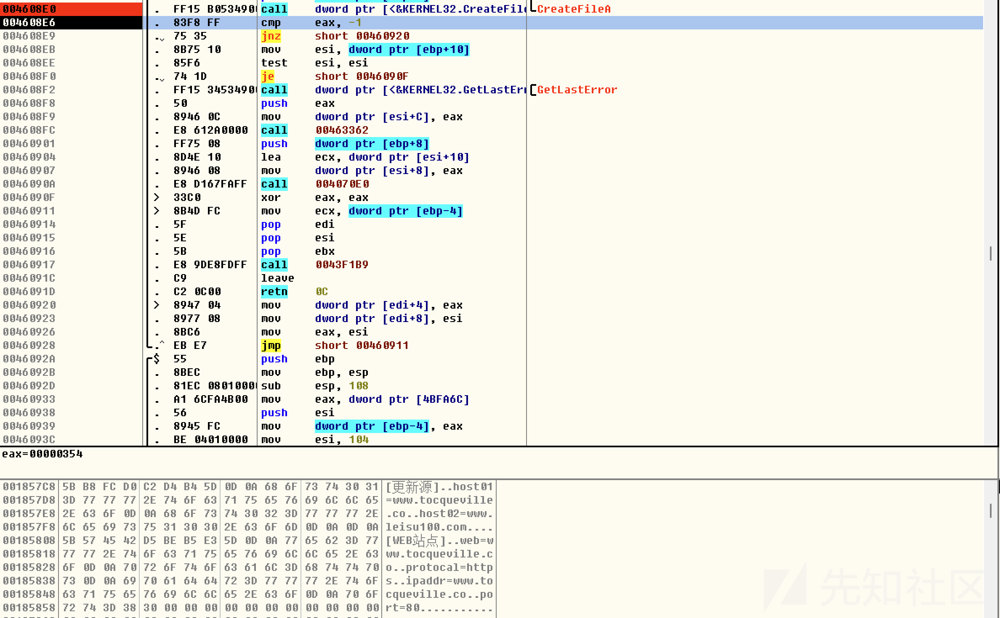

#### 精准定位

在两个断点间不断调试，发现程序处理密文缓存区的代码。

代码片段中有如下指令用于计算密文长度：

```
004076F7               |.  2BC2          sub     eax, edx
004076F9               |.  85C0          test    eax, eax
```

结果用 `eax` 保存密文长度。

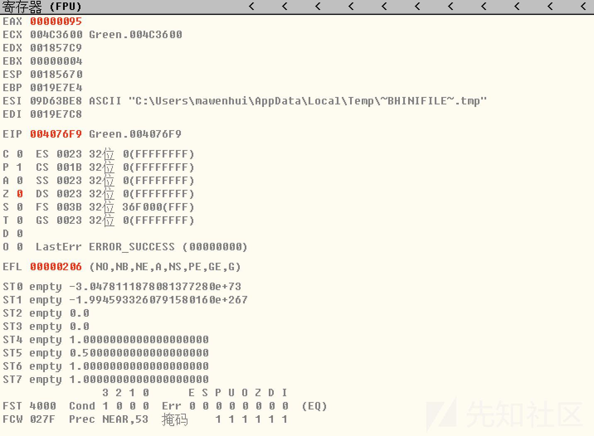

重新开始调试，精准定位解密代码位置。

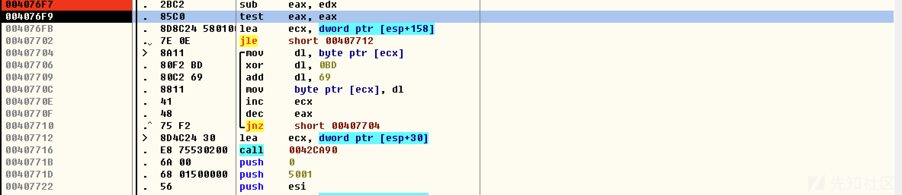

我们之所以能够确认这一部分为解密代码，是因为在多次单步执行循环后，可以明显观察到：原本存放密文的数据区域已有一半内容被解密为明文。这表明该循环正对密文进行逐字节的解密操作。

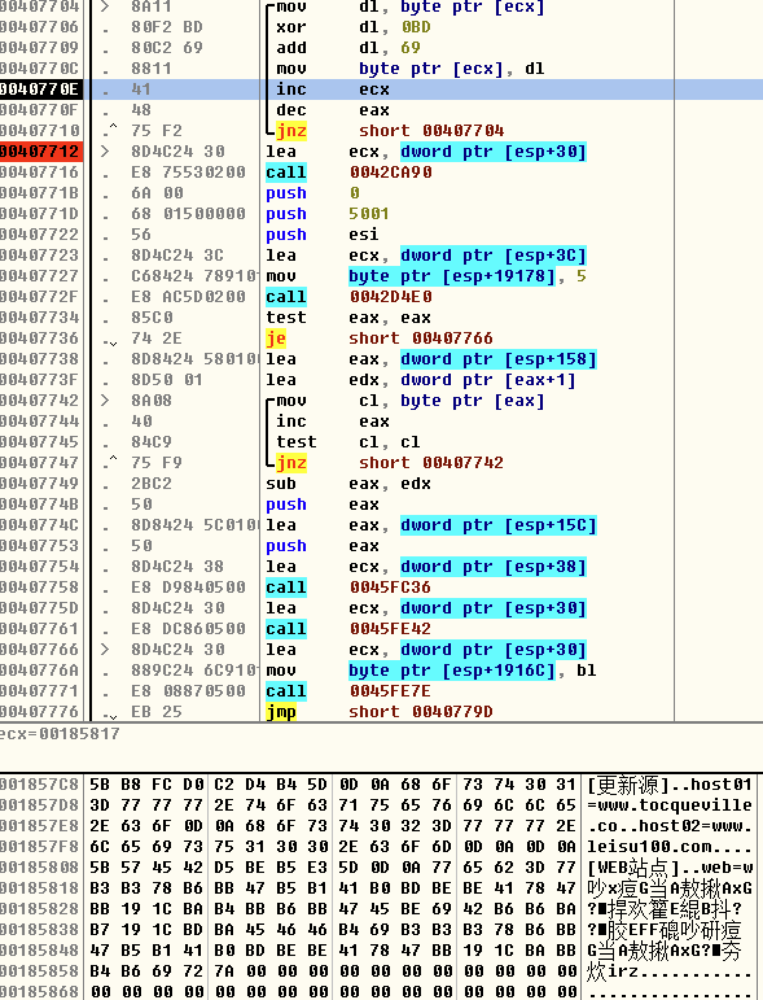

#### 解密算法代码

```
mov     dl, byte ptr [ecx]
xor     dl, 0BD
add     dl, 69
mov     byte ptr [ecx], dl
inc     ecx
dec     eax
jnz     short 00407704
```

##### 代码分析

```
mov     dl, byte ptr [ecx]   ; 从地址 ECX 读取一个字节，存入 DL 寄存器
xor     dl, 0BD              ; 对 DL 进行异或操作，异或常量 0xBD
add     dl, 69               ; DL 加上常量 69 (十六进制为 0x45)
mov     byte ptr [ecx], dl   ; 将 DL 的值写回到 ECX 指向的地址
inc     ecx                  ; ECX 自增，指向下一个字节
dec     eax                  ; EAX 自减，可能作为计数器
```

##### 高级语言代码

```
#include <stdio.h>
#include <string.h>

int main() {
    const char *filename = "system.ini";
    unsigned char buffer[256];  // 栈上的数组变量，最大支持 1024 字节
    
    // 数组清零 
    memset(buffer, 0, sizeof(buffer));

    // 打开文件（读写二进制模式）
    FILE *file = fopen(filename, "rb+");
    if (!file) {
        perror("Failed to open file");
        return 1;
    }

    // 读取文件内容到数组中
    size_t size = fread(buffer, 1, sizeof(buffer), file);
    fclose(file);
    
    // 输出密文信息 
    printf("密文为：
");
    for (size_t i = 0; i < size; i++) {
        printf("%02X ",buffer[i]);
    }
    printf("
密文输出结束


");
    
    // 处理数组中的每个字节
    for (size_t i = 0; i < size; i++) {
        buffer[i] ^= 0xBD;  // XOR 解码
        buffer[i] += 0x69;  // 加上 0x45
    }
    
    // 输出明文信息 
    printf("明文为：
");
    for (size_t i = 0; i < size; i++) {
        printf("%02X ",buffer[i]);
    }
    printf("
明文输出结束
");

    // 输出明文字符信息 
    printf("

明文字符为：
");
    for (size_t i = 0; i < size; i++) {
        printf("%c",buffer[i]);
    }
    printf("
明文输出结束
");
    return 0;
}
```

#### 还原结果验证

由于汇编逐字节处理，我们也按字节读取文件内容。

对比密文数据，完全一致。

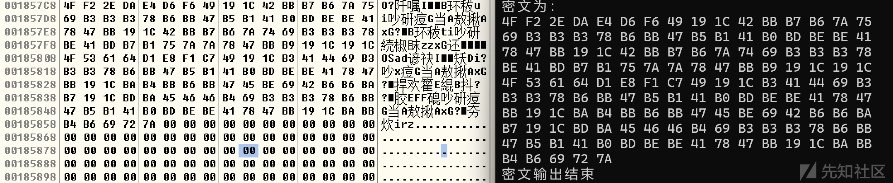

再看解密后的明文，也完全一致。

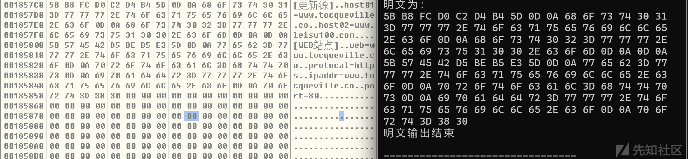

到此为止，解密程序的核心部分已完成，接下来可完善整体程序逻辑。

完整程序运行结果：

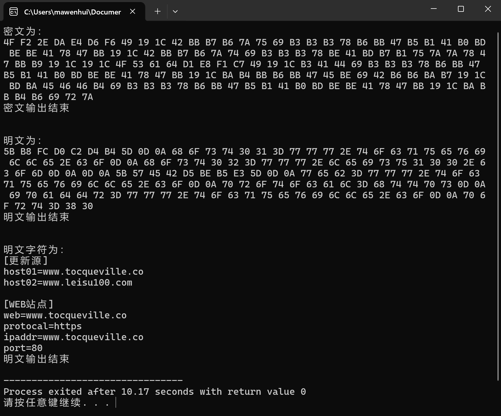

## 最终解密代码

```
#include <stdio.h>
#include <string.h>

// 解密并输出到新文件
void decrypt_file(const char *filename) {
    unsigned char buffer[1024];  // 加大缓冲区
    memset(buffer, 0, sizeof(buffer));

    // 打开文件
    FILE *file = fopen(filename, "rb");
    if (!file) {
        perror(filename);
        return;
    }

    size_t size = fread(buffer, 1, sizeof(buffer), file);
    fclose(file);

    // 解密代码
    for (size_t i = 0; i < size; i++) {
        buffer[i] ^= 0xBD;
        buffer[i] += 0x69;
    }

    // 构造新文件名（加上 "de_" 前缀）
    char new_filename[256];
    snprintf(new_filename, sizeof(new_filename), "de_%s", filename);

    // 写入解密后的内容到新文件
    FILE *new_file = fopen(new_filename, "w");
    if (!new_file) {
        perror(new_filename);
        return;
    }

    fwrite(buffer, 1, size, new_file);
    fclose(new_file);

    printf("已将解密结果写入文件: %s
", new_filename);
}

int main() {
    const char *files[] = {"system.ini", "module.ini", "module_en.ini"};
    size_t num_files = sizeof(files) / sizeof(files[0]);

    for (size_t i = 0; i < num_files; i++) {
        decrypt_file(files[i]);
    }

    return 0;
}
```

程序结果：

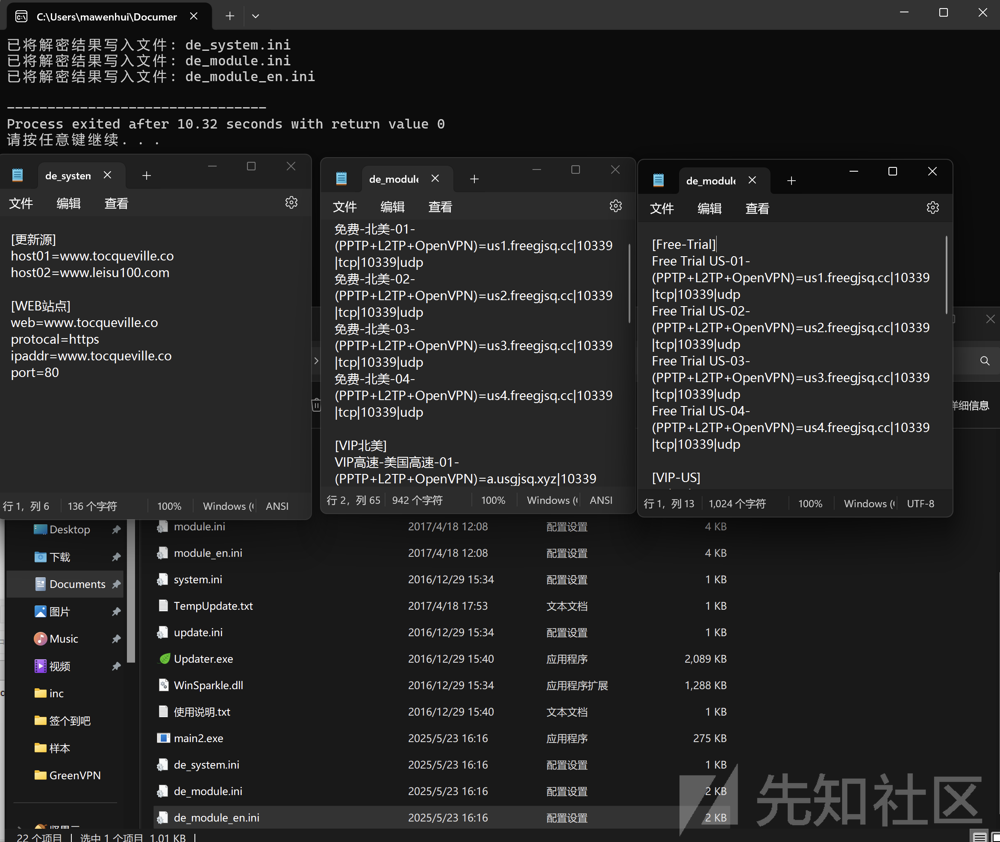

## 结论

通过对目标样本的深入逆向分析，成功定位了其使用的加密配置文件的读取与解密流程。通过动态调试手段明确了程序调用 `CreateFile`、`ReadFile` 等 API 的时机与行为，进而识别出解密算法的具体实现逻辑。该算法采用逐字节异或与加法混合操作，具有一定的迷惑性，但加密强度较低。

在对解密逻辑还原为高级语言代码后，成功编写了解密工具，对配置文件进行了还原，并从中提取出包含服务器地址在内的敏感信息。此次分析结果不仅为理解目标样本的工作机制提供了技术依据，也为相关部门开展网络审查和取证工作提供了有价值的技术支撑。
