# 某HCM系统文件上传分析-先知社区

> **来源**: https://xz.aliyun.com/news/18076  
> **文章ID**: 18076

---

# **起因**

日常划水刷微信时，看到了下面这篇文章，正好手上有该系统的源码，所以就想着分析一下：

# **分析**

主要有三个步骤，先是调用如下接口获取cookie：

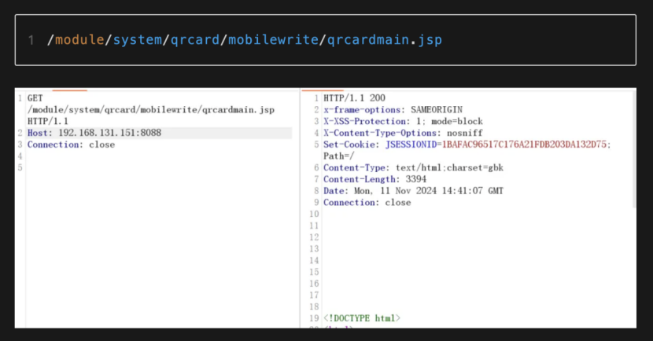

接着调用下面的接口获取系统的物理路径：

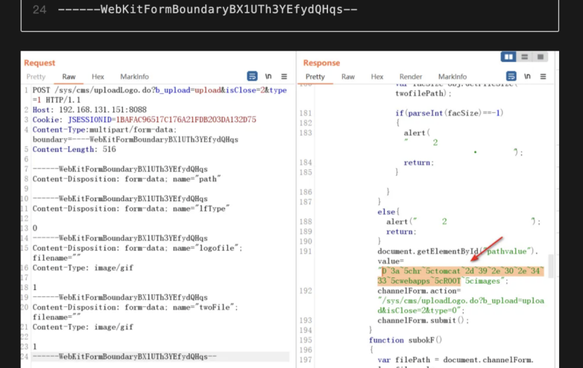

然后调用同样的接口上传文件，可以发现这里在path参数中传入了物理路径和文件名，而上传文件体中的filename则为空：

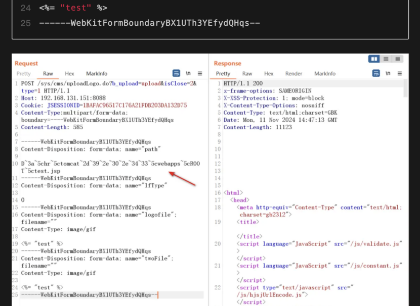

## **获取cookie**

那么挨个分析一下，首先是获取cookie的接口，直接找到对应的jsp文件，可以发现实例化了一个用户名为“二维码进入”的userView，然后set了一些属性，包括从请求中获取tab\_id参数，这些都不太重要，最关键的是在最后设置其session的islogon为true，很明显就是使其session生效，所以直接访问该jsp文件服务端会返回一个登录后的cookie：

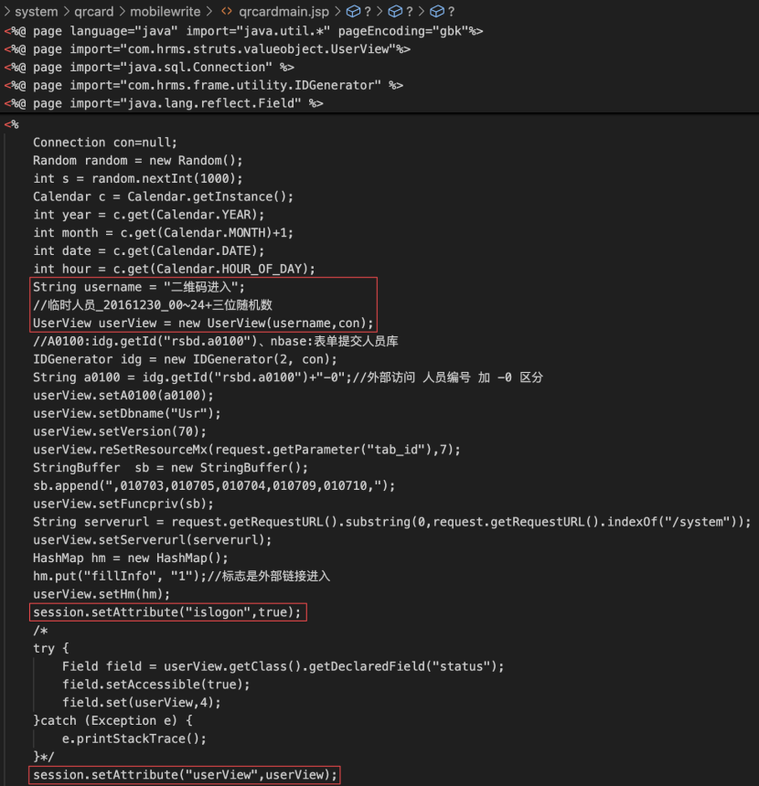

## **获取物理路径**

然后是获取物理路径和文件上传，已经知道这两个操作使用的都是同一个接口uploadLogo.do，那么先分析下为什么可以获取物理路径，首先可以在web.xml中找到\*.do的servlet，同时可以发现系统使用了struts框架：

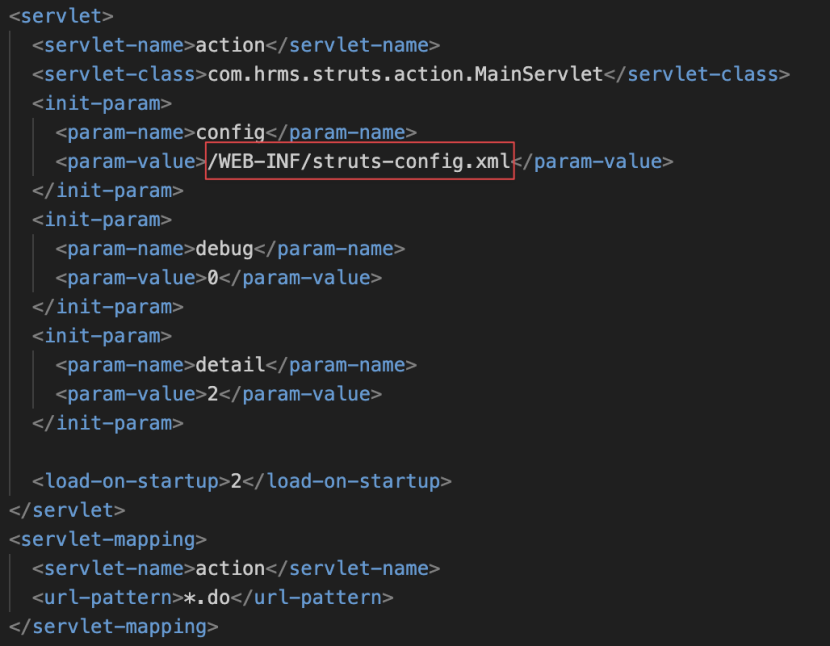

在struts配置文件中，可以找到漏洞接口对应的配置，这里path会引用对应的jsp文件：

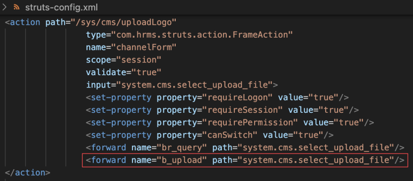

所以找到相应的jsp文件，可以发现定义了一个projectpath参数，其值为getProjectPath()，会在后面的js中输出，很明显就是系统的物理路径了：

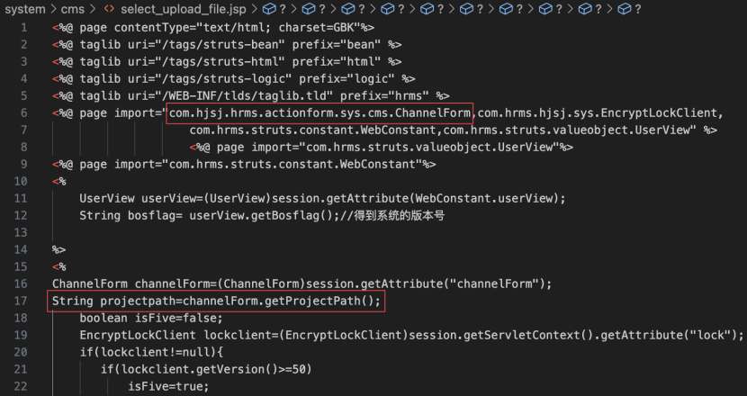

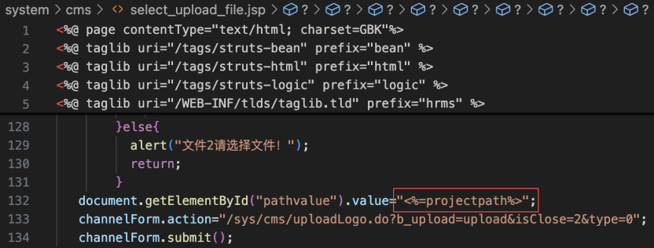

可以在相应的类中找到对应的set方法，设置的路径为系统images的物理路径，需要注意的是这里使用了SafeCode.encode对其进行编码：

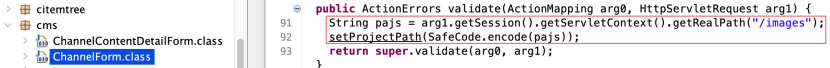

可以跟进看看具体是怎么编码的，主要有三种处理方式，首先是第一个if判断，这里的“ÿ”其实是255，所以就是对于ASCII值大于255的字符，如果其ASCII值位数小于4就用0在前面填充到4位，然后用“^”拼在前面，第二个else，则是对'0'-'9'、'A'-'Z'、'a'-'z'之外的一些常见字符进行ASCII编码，位数小于2的用户0在前面填充到2位，并在其前面添加“～”，最后一个else，结合前面就是不会对数字和字母进行编码，总的来说就是ASCII编码，数字和字母不会，编码后会根据条件在前面添加“^”或“~”：

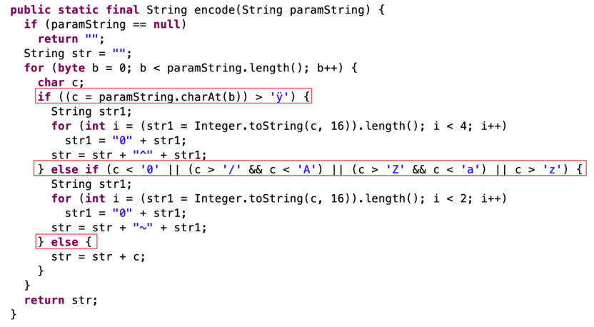

## **文件上传**

最后就是文件上传了，可通过映射文件找到上传接口对应的class，需要注意的是这里的b\_upload，访问时需要带上该参数才能进入上传流程：

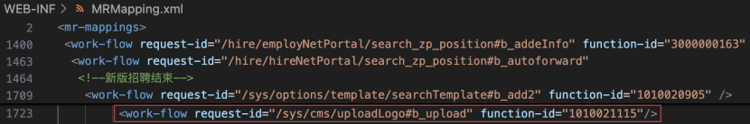

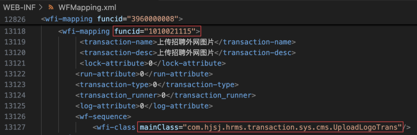

找到如下类，流程很简单，先获取type参数，这里type传不传都行，接着从请求体里获取logofile、twoFile、oneFIle三个上传的文件，然后获取path参数，调用SafeCode.decode对path解码，上面说过编码了，就是ASCII编码，解码反之，然后三个if语句分别调用uploadFile上传文件，传入的参数分别是请求包中的文件体和解码后的path，这里三个上传都完全相同，所以利用时传入三个中的一个即可：

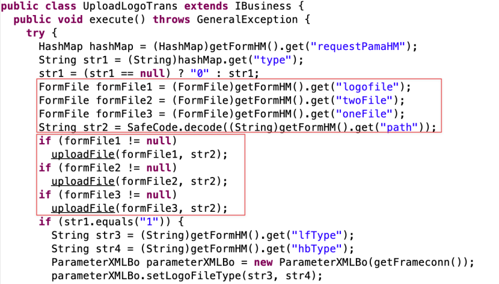

继续跟进uploadFile，实例化一个File对象后就直接写入内容了，这里实例化时传入了绝对路径path和请求体里上传的文件名filename，其实可以发现这里全程没有对上传文件的类型进行限制，那之前看到的那个poc里为什么要多此一举的把文件名拼在path后面，而filename传入空呢：

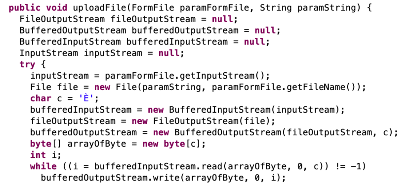

对应的类中可以找到对上传文件进行的处理，先是获取上传文件的文件名filename赋值给str，如果str不为空，就进行四个判断，也就是四个校验，先是文件名里不允许有~/和../，接着就截取文件名中的后缀进行判断，不允许后缀为空，然后检验文件内容和后缀是否匹配，这里是设置好了常用文件的前几个字节进行比对校验，最后就是判断后缀名是否在白名单里，看到这里就知道无法绕过白名单了：

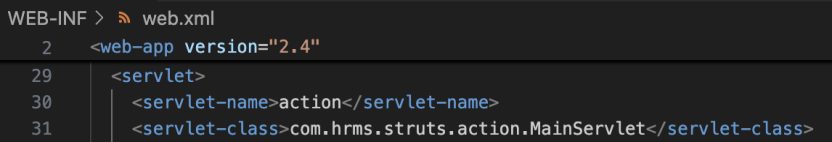

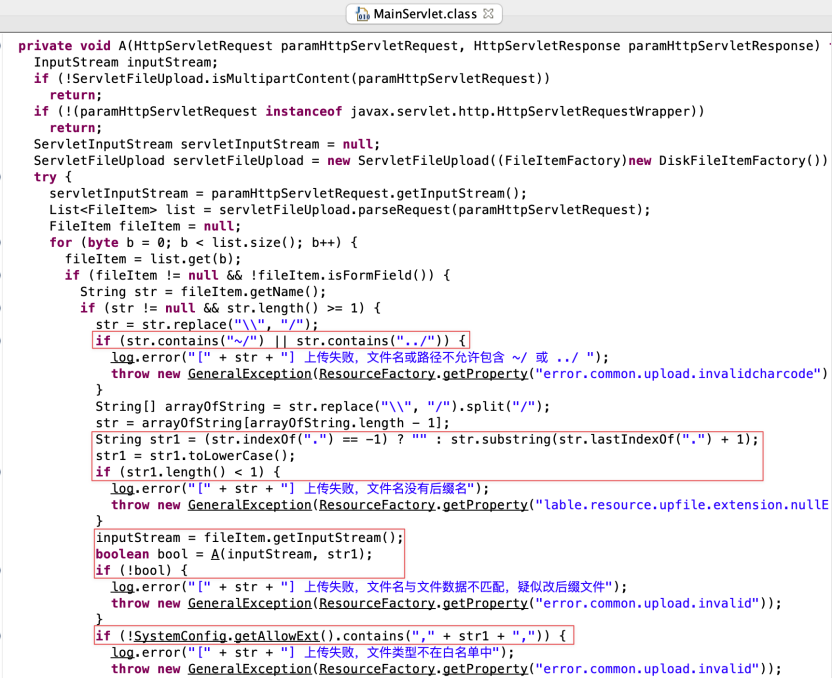

后缀白名单如下：

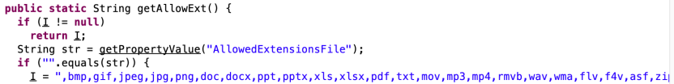

该servlet会对所有\*.do的文件上传请求进行检验，如下：

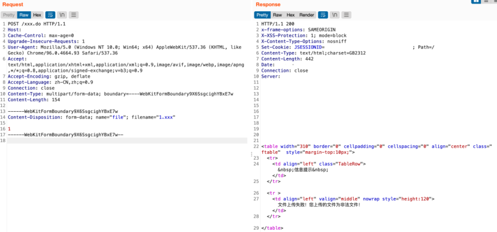

这时再返回上面的uploadFile方法，注意这里File的构造方法：

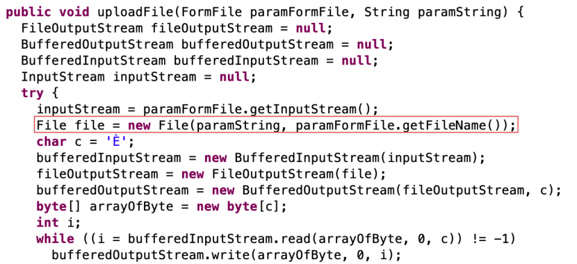

File类有四种构造方法，而这里调用的是第三个，传入两个String进行实例化：

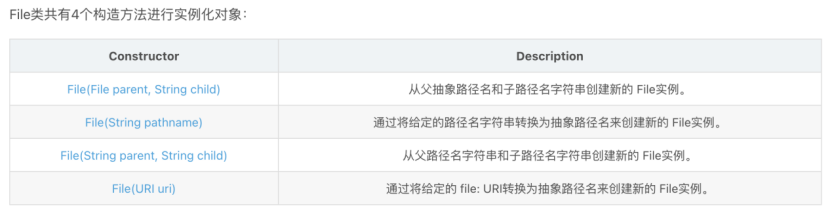

正常情况下写入文件时的路径如下，传入的path路径和filename进行拼接后生成，而这里的filename会先经过文件限制servlet进行处理：

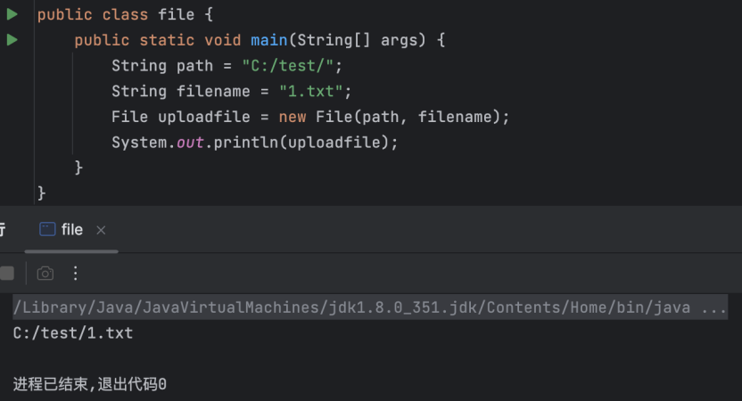

而当filename为空的时候，会直接使用path的值生成：

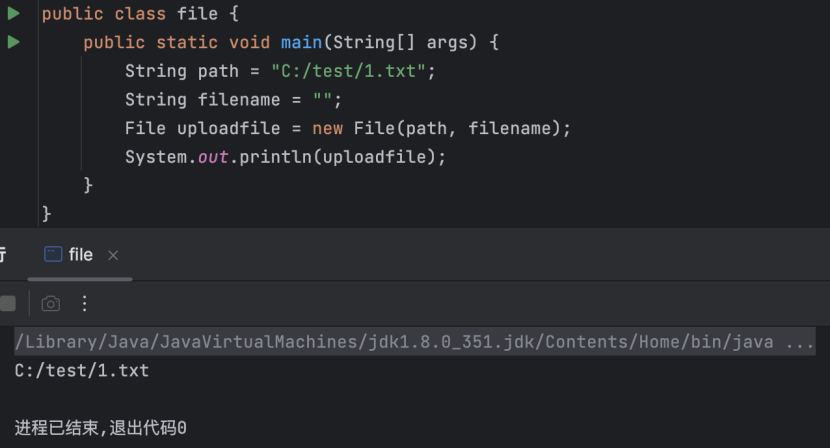

所以这里就可以利用filename能为空并且path里能拼接文件名的特性，同时传入的filename为空时又可以绕过全局的servlet文件校验，所以直接在path中拼上文件名即可实现上传任意后缀的文件，如下：

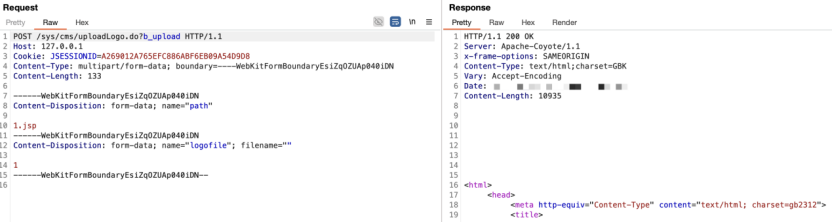

path不带物理路径时，默认会上传到tomcat的bin目录下：

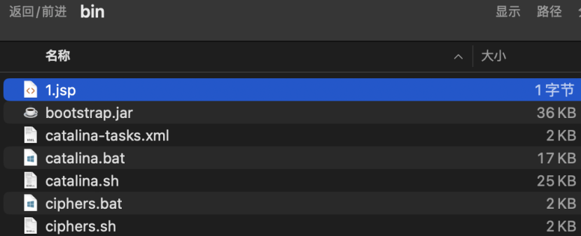

这里可以通过目录穿越的方式上传到web目录，但由于每个系统部署时webapps下的应用名不固定，所以最好还是用上传接口获取到的web物理路径，直接在后面加上~5c1.jsp，上面也分析过编码了，就是ASCII，所以这里的“~5c”等于“\”，或者直接在webapps下上传war包也是可以的：

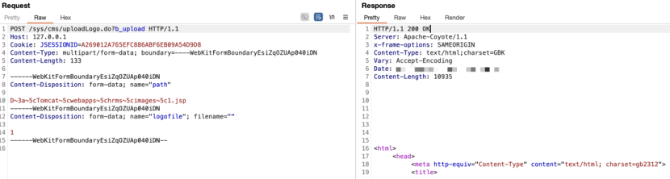

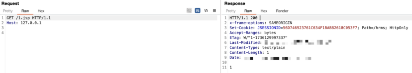
