# 某管理系统代码审计-先知社区

> **来源**: https://xz.aliyun.com/news/18077  
> **文章ID**: 18077

---

# **起因**

在某次红队评估时遇到了如下管理系统，尝试了爆破没有发现弱口令，只能另辟蹊径：

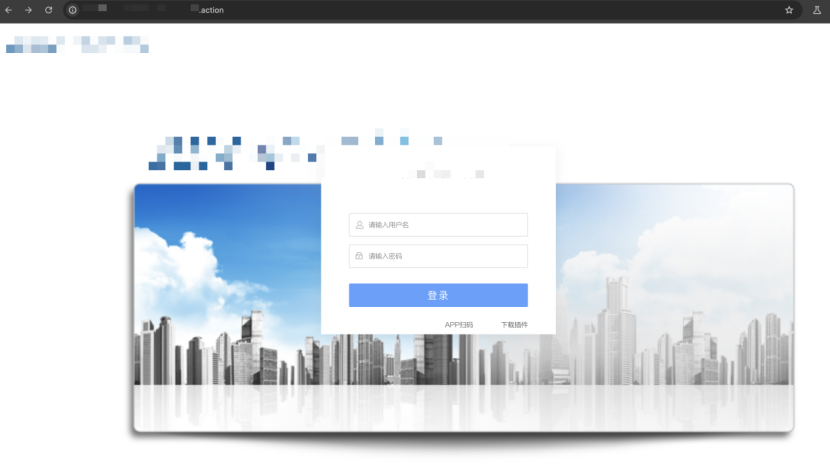

fofa上搜了下icon发现互联网上还有其他同样的系统：

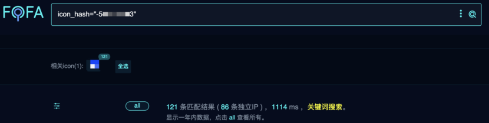

随便找了一个管理员弱口令直接进了后台：

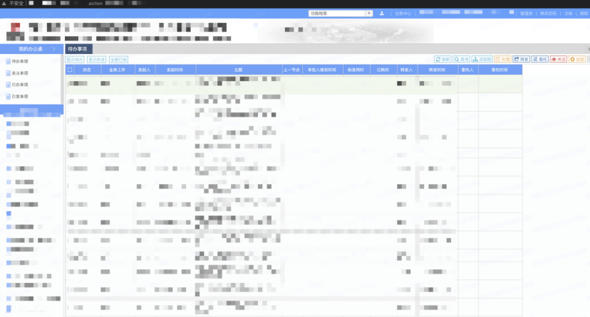

在后台点了一圈，找到了一个上传，但这个上传是有权限校验的，在目标站点使用不了，那只能把代码copy下来审一审了：

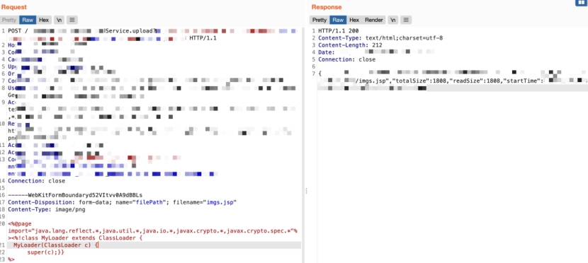

# **审计**

## **前台文件上传**

系统是在tomcat部署的，直接查看WEB-INF/web.xml，可发现系统对于.action和.upload的后缀都会进行鉴权：

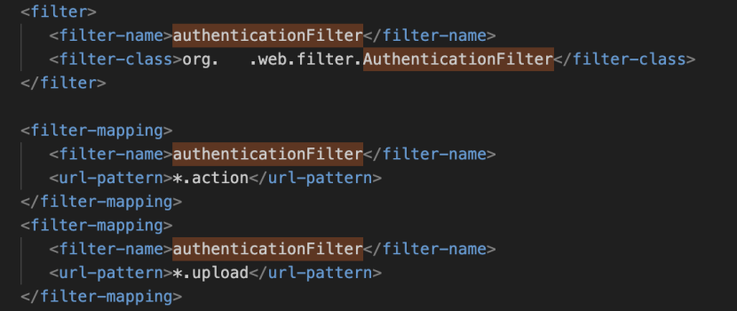

比如上面使用过的上传，直接访问会跳转到登录页面：

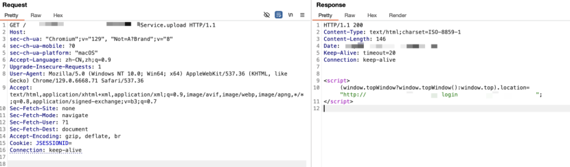

然后直接在web.xml中搜索upload可找到一个upload的servlet，同时其对应的url为/upload，前台就可以调用并不会进行鉴权：

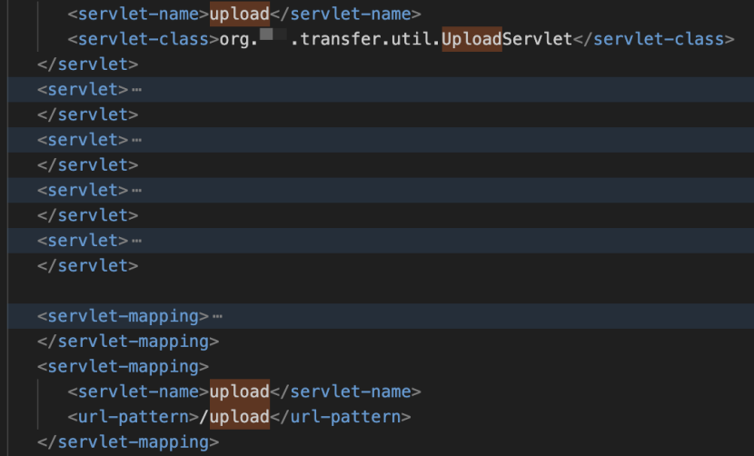

如下在目标系统直接访问，服务端会报错，报错信息为需要multipart/form-data的方式传入数据，说明接口是存在的：

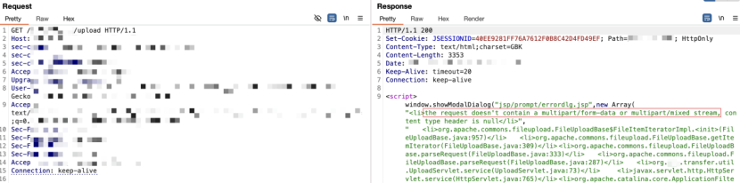

找到对应的class进行分析，流程很简单，主要有四个部分，第一个部分从请求中获取md5参数，如果md5不为空就进行一些处理，这里并没有处理上传文件的流程，那么不传入md5让其为空跳过即可，第二部分先实例化了一个DiskFileUpload对象，就是Apache的FileUpload组件，然后设置其临时目录为/tmpmodel/transfer，获取请求request赋值给fileList，其实就是从multipart/form-data方式传入的数据中获取上传文件相关内容，接着第三部分就是处理上传请求获取上传文件了，先设置directory为/tmpmodel/transfer，然后从fileList中获取文件名，然后将文件名和/tmpmodel/transfer进行拼接写入文件内容，很明显这里并未对上传文件进行限制，即存在任意文件上传，最后第四部分就是获取一些参数进行一系列处理，就没必要再看了，上传文件的流程在第三部分就处理完了，这里传不传这些参数都不会影响结果：

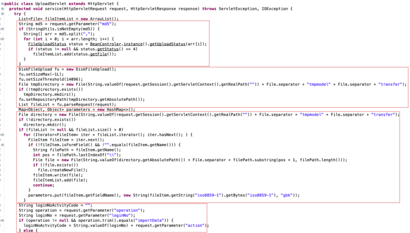

直接构造上传包，尝试上传jsp文件，发现服务端会报错，这是因为有些参数没有传入，但并不会影响上传文件：

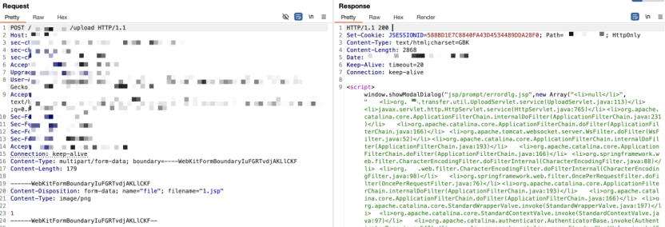

而文件上传的路径在上面分析是就已经知道了，直接访问即可，可以发现成功上传：

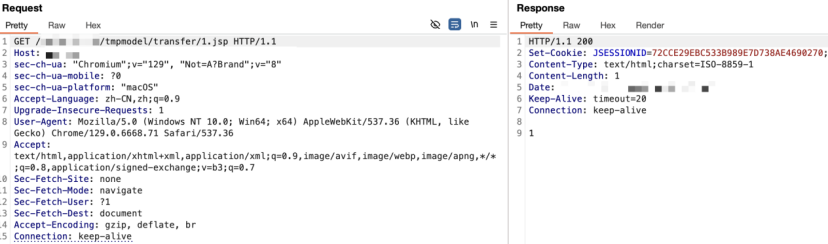

## **权限绕过+文件下载+文件上传**

在web.xml中除了上面的上传还可以发现另外一个上传接口，比较特别的是只要以.upload结尾就可以匹配该servlet：

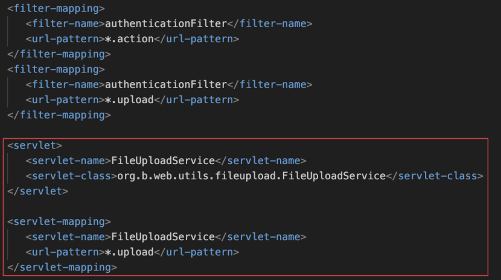

比如上面提到的那个后台上传，可是这里做了鉴权，似乎前台利用不了：

那看看鉴权的filter，只有两个判断条件，第一个其实就是是否登录，而第二个则是请求的url中是否包含“/login.actoin”，结合起来就是如果没登录访问非login.action的接口就会跳转到登录页面，而如果请求的是login.action则会调用chain.doFilter将请求转发给过滤器链下一个filter，如果没有filter那就是请求的资源：

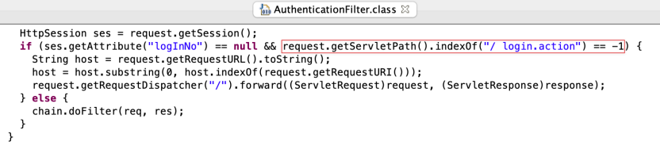

注意这里的判断条件是只要url中包含“/login.action”即可：

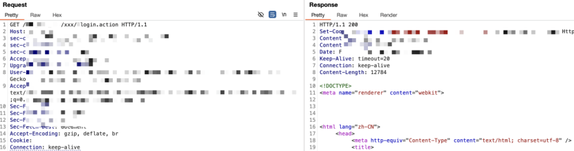

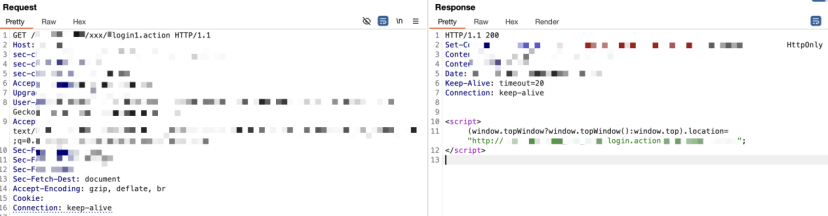

那么结合那个“\*.upload”的servlet会达到什么效果呢，如下，直接使用login.action.upload就可以绕过权限校验直接调用了：

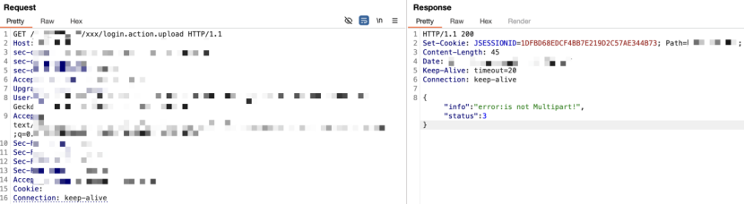

虽然这个上传在上面提到的后台利用过，可以直接修改请求包使用，但还是跟进代码分析一下，找到对应的类，根据传入的参数进行判断进入不同的流程，很明显可以发现存在下载和上传的方法，上图中返回的信息就是上传流程中的：

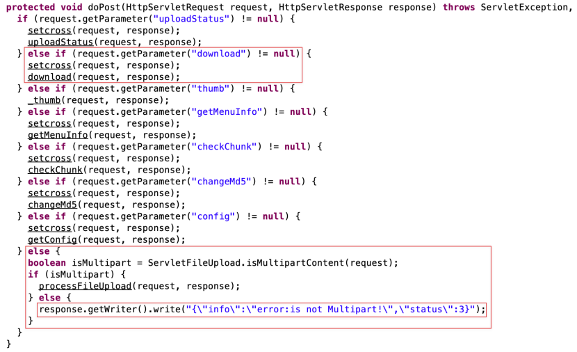

那先看看下载方法，传了一些参数，这里只看关键的，最后实例化的file是由path参数传入的，同时全程没做任何限制，很明显存在任意文件下载漏洞：

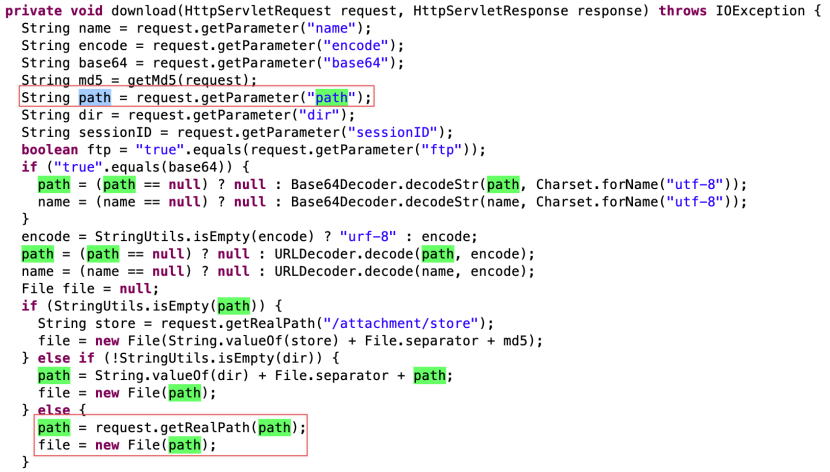

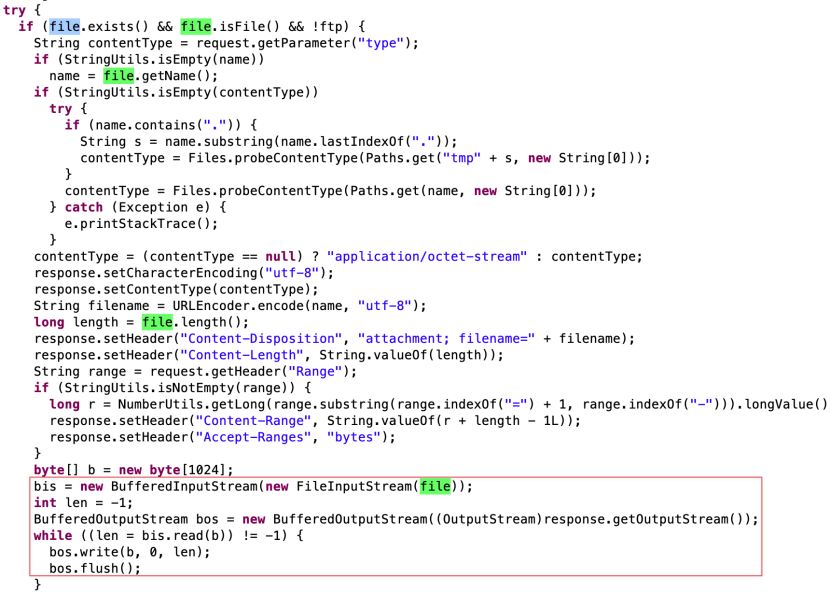

那么直接传入path即可成功下载web.xml文件，这里download虽然没传值但并不为null，相当于一个空字符串，所以可进入对应的下载流程：

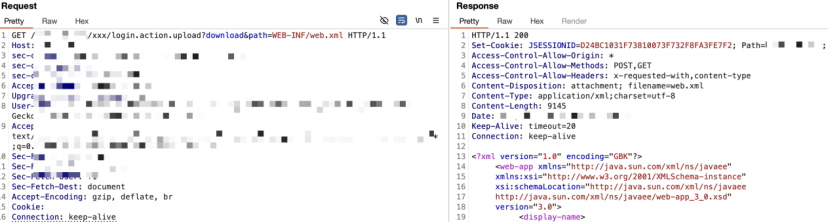

然后是上传流程，跟进对应的方法，首先是获取上传内容，如果内容为空就返回失败，然后调用initStatusBean初始化了一些参数：

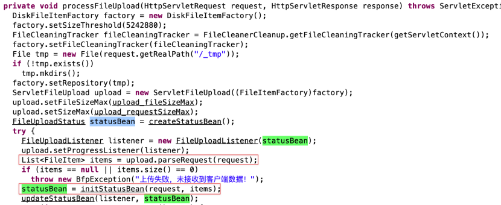

跟进initStatusBean看看，有些参数下面会用到，首先是布尔变量norename，看名字就知道如果为true就不会重命名，接着如果没传入md5和path，setDir()就会是“/attachment/store/md5”：

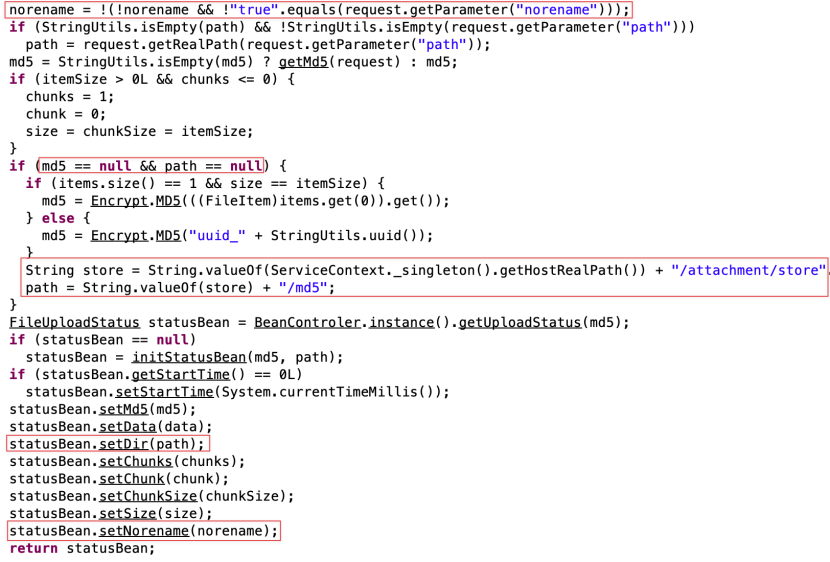

返回上传方法，获取上传的文件体item进行处理，setName()为item中的filename，上面设置了setDir()为“/attachment/store/md5”，所以这里getDir()就不为空，进入else中，同时getDir()是以md5结尾的所以这里会设置ext=null，然后是name的赋值，如果isNorename为true就为为item中的filename，否则根据ext是否为空赋值为生成的md5或者md5+ext，这里如果isNorename不为true，同时ext这里为null，所以最后的filepath=/attachment/store/md5/+md5值，上传的文件就没有后缀了，也就实现不了任意文件上传，所以必须要让isNorename为true，即传入norename=true，那么最后的filepath=/attachment/store/md5/+filename，就可以实现文件名和后缀都可控：

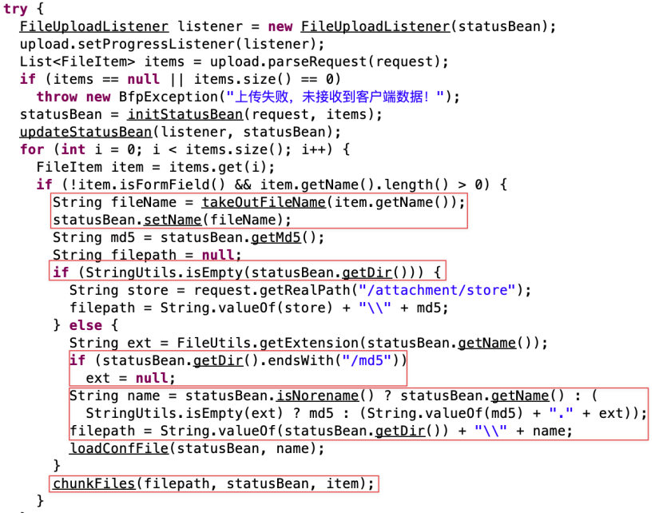

最后调用chunkFiles传入filepath和文件内容，跟进看看，就是写入文件的流程了，实例化filepath为File，然后调用FileUtils.writeMap向filepath写入上传体item中的内容：

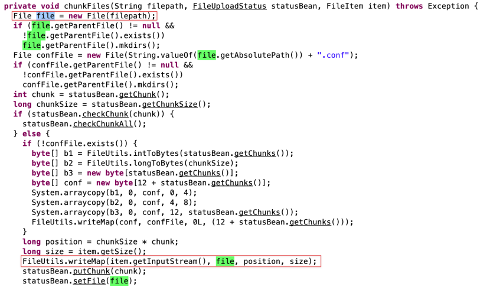

通过上面的分析直接构造上传包，上面的分析中知道了上传路径，上传成功时服务端也会返回路径：

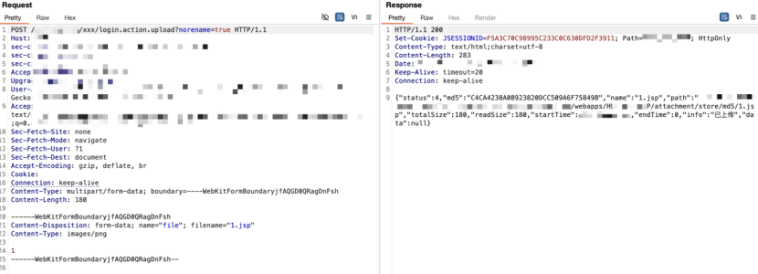

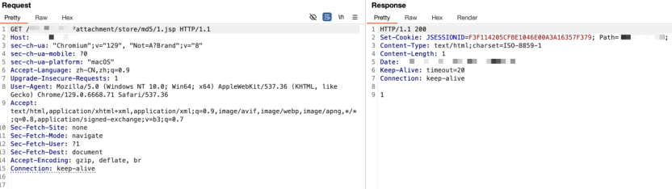

## **远程文件上传**

然后在web.xml中还可以发现该系统还使用了webservice：

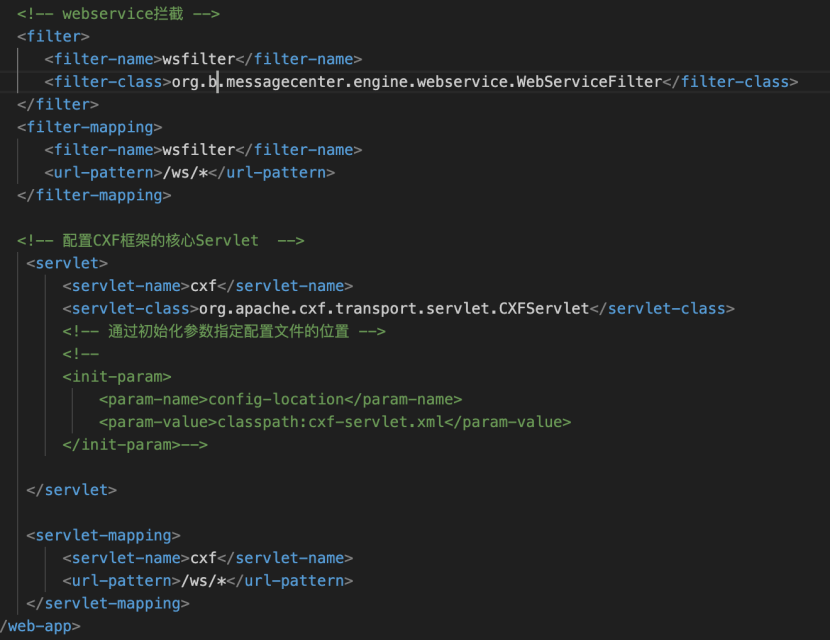

直接访问即可查看所有接口：

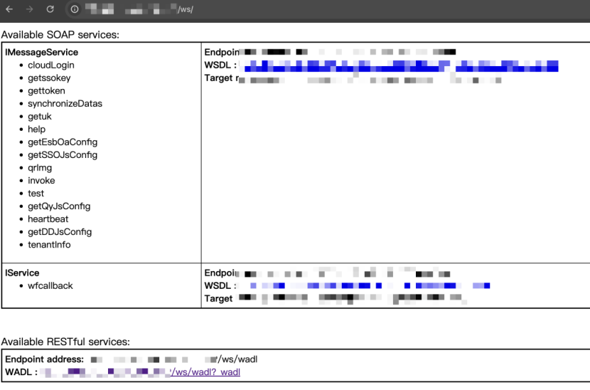

在其中可以发现一个比较特别的接口“uploadFileByUrl”，看名字就是通过url上传文件，感觉有角度可以利用：

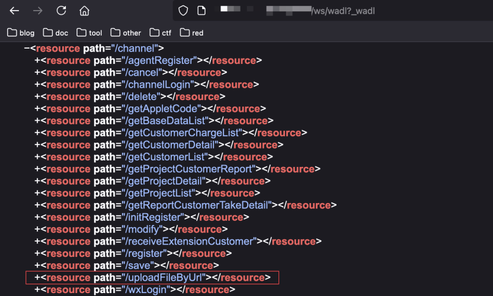

找到对应的代码，流程很简单，先从请求中获取url和suffix参数，然后将url的m5值和suffix拼接成整个文件名，然后将url和包含路径的文件名传入downloadNet函数中：

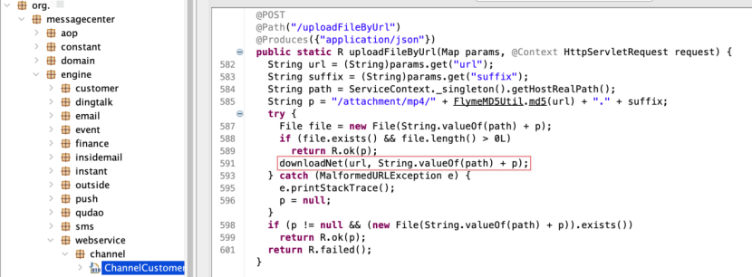

跟进downloadNet，就是和url建立连接，然后实例化传入的文件为File对象，然后将url的文件内容写入其中，和ueditor那个抓取图片差不多，只是这里可以通过suffix自定义后缀，更好利用：

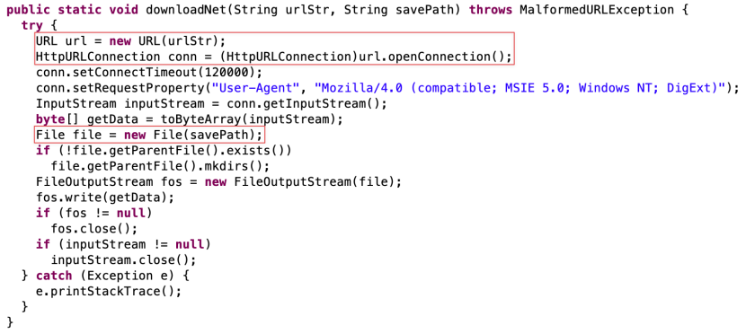

直接构造请求包，传入vps上的文件url和suffix后缀，上传成功后服务端会返回文件路径，直接访问即可：

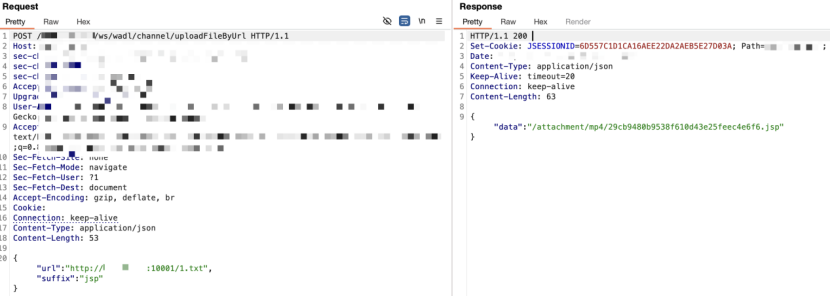

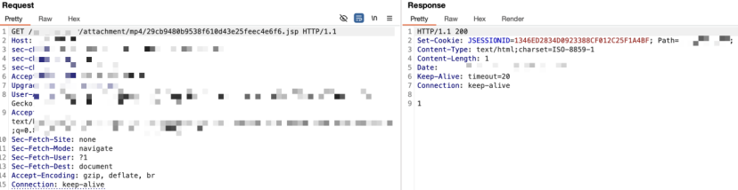

# **结尾**

最后就是上传webshell获取目标服务器权限了，由于目标系统是部署在云上的并没有内网，所以只上去翻了些敏感文件，数据库中翻了些敏感信息就结束了。
