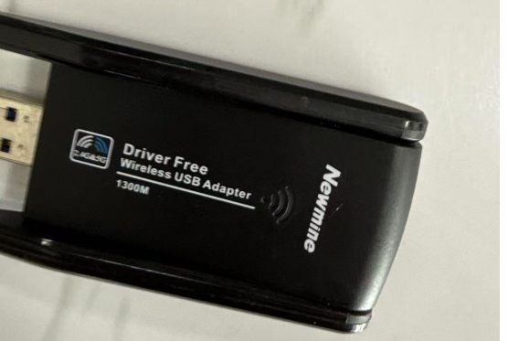
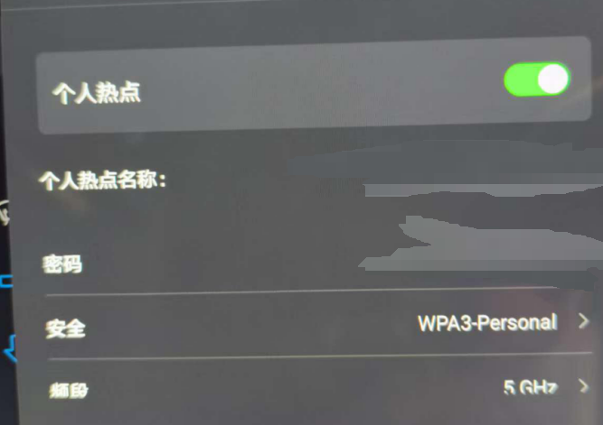
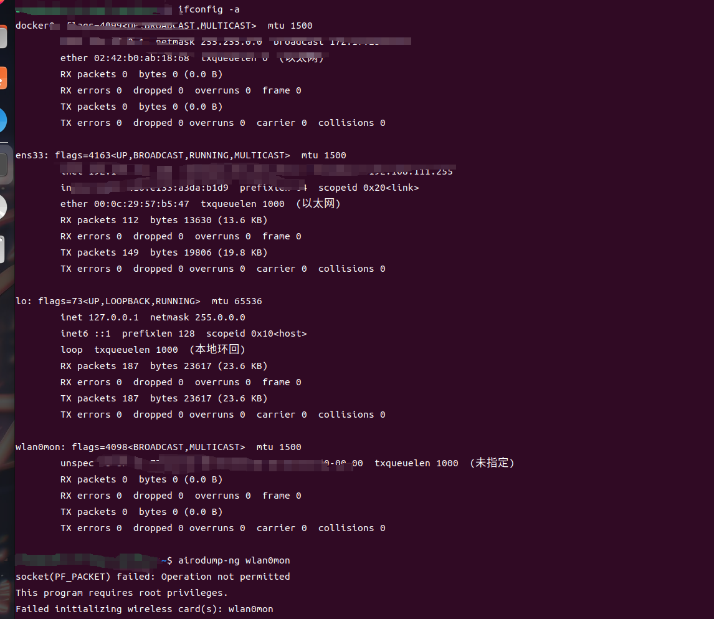
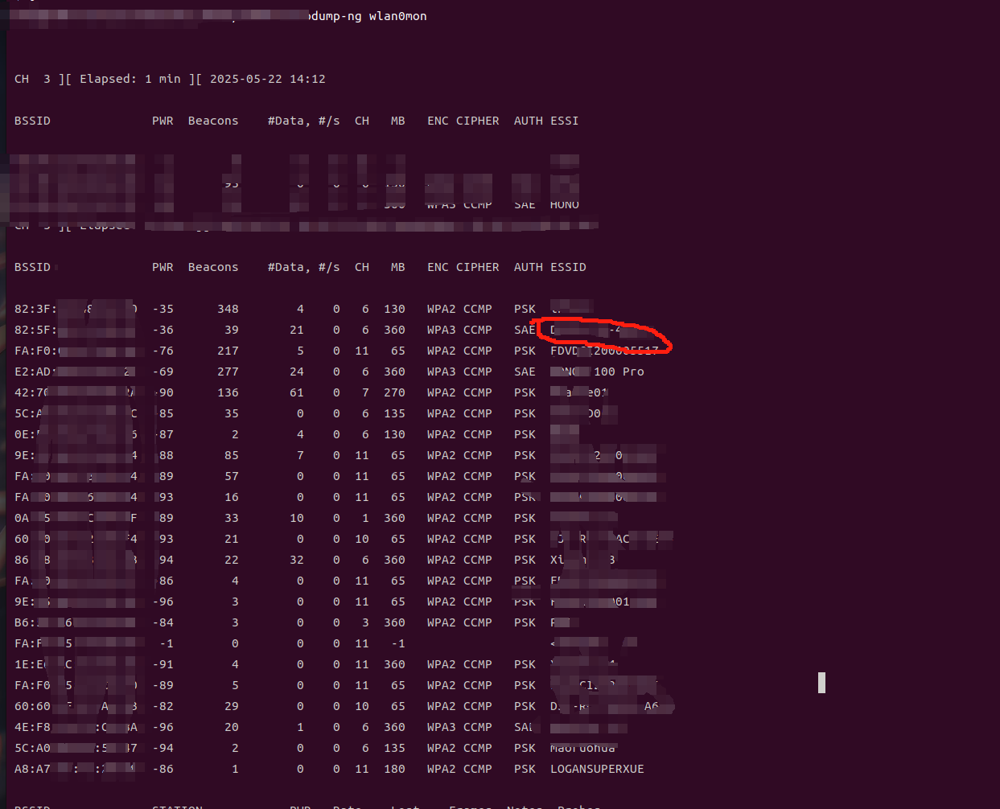
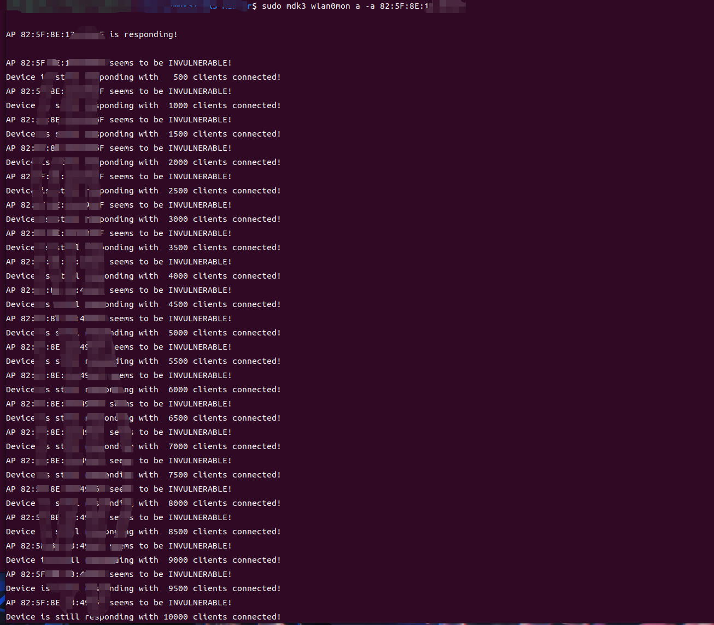
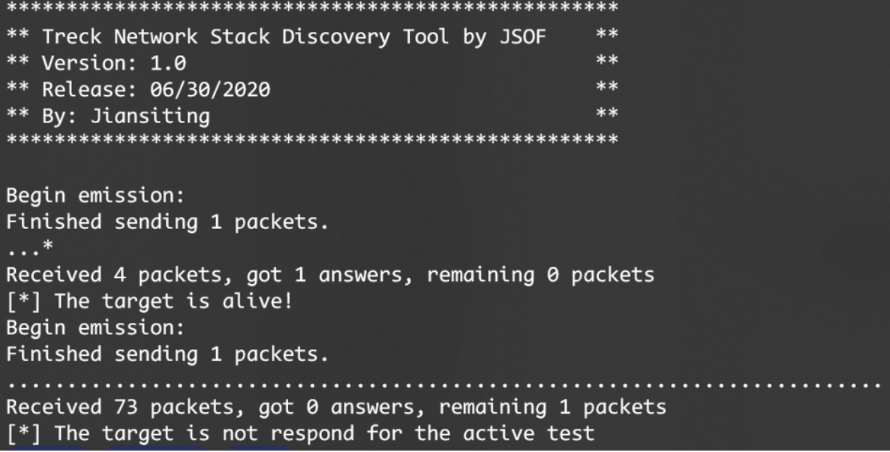
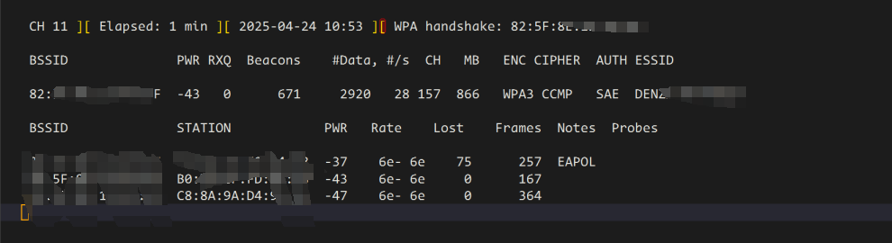
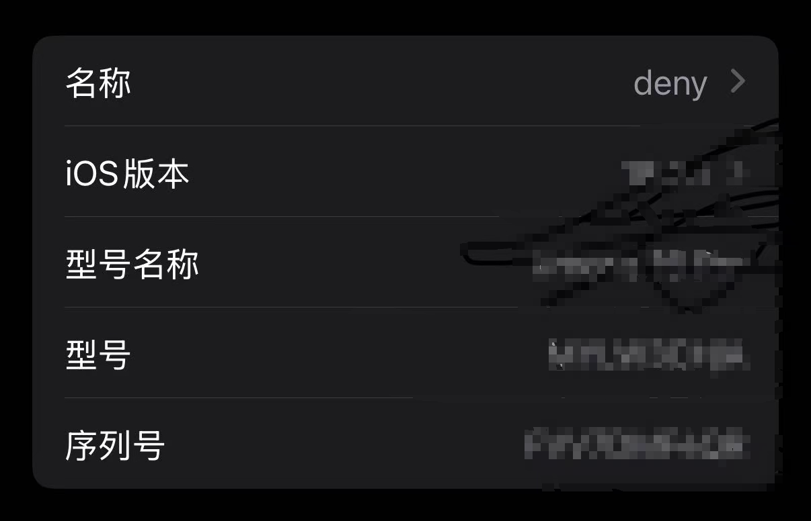

# 记一次车联网wifi渗透实战-先知社区

> **来源**: https://xz.aliyun.com/news/18078  
> **文章ID**: 18078

---

## 前言

考虑到偏向车联网那块的渗透测试资源较少，知识点较为分散，于是我按照我的一次实战渗透经历整理了车机wifi渗透的一个大概流程和具体的操作方式以及攻击的一些思路，其他wifi也可以参照这个思路，考虑到一些信息泄露的问题，图片中对大量的敏感信息进行了打码，由于我正在学习这方面 所以有写错的位置和不足的地方也请各位师傅指出，也欢迎同在学习车联网的师傅一起学习讨论 我邮箱是mxcduskdawns@gmail.com

## 前置知识

**Authentication DoS**（**洪水攻击，又叫做身份验证攻击**）  
这是一种验证请求攻击，在这种攻击中，攻击者模拟随机的MAC地址，向目标AP（无线接入点）发送大量的验证请求。这样会让AP因为处理过多请求而无法响应正常的连接。该攻击常见于通过Reaver工具尝试破解Wi-Fi路由器的PIN码。如果AP（路由器）因为过载而停止响应，攻击者可以利用这种模式迫使AP重新启动。

**AP**是**Access Point**（接入点）的缩写。在无线网络中，接入点是一个设备，用于提供无线连接的功能，允许设备（如手机、电脑等）通过Wi-Fi与局域网（LAN）或互联网连接。

**Wi-Fi钓鱼攻击**是一种网络攻击方法，攻击者通过创建伪造的无线网络（Wi-Fi热点）诱骗用户连接，从而窃取用户的敏感信息，如密码、银行账户信息等。攻击者通常会设置一个与合法网络名称相似的热点，用户一旦连接，攻击者就能通过中间人攻击（MITM）截获用户的网络通信并窃取数据。

### 工具介绍

* **Aircrack-ng**：一套用于Wi-Fi网络安全审计的工具，支持WEP和WPA-PSK加密的破解。它可以通过捕获数据包并对其进行分析，尝试暴力破解Wi-Fi密码。
* **MDK3**：一款用于Wi-Fi网络攻击的工具，能够执行包括拒绝服务攻击（DoS）、伪造网络、以及模拟流量攻击等功能
* **Fluxion**：一款专注于Wi-Fi钓鱼攻击的工具，通过伪造合法的Wi-Fi网络并诱使用户输入密码，从而窃取无线网络密码。

## 实战测试

这里记某一次车机wilf渗透测试流程

### **WI-FI拒绝服务测试**

使用工具： 无线网卡(rtw 8822cu) mdk3 Aircrack-ng

在虚拟机中连接无线网卡



连接车机热点，热点名称这里隐去



开启网卡监听模式

使用airmon-ng start 网卡名称就可以开始(这里有个坑 一开始开启后我ifconfig是没有看到的 得ifconfig -a )



已经看到成为监听状态下的wlan0mon 这个时候就可以去监测附近的wilf了

用airodump-ng 网卡名称



找到对应的wilf名称后 找到对应的BSSID 就可以用mdk3进行洪水攻击了，如果找不到的话 就要看一下是否是同一个频段，如果不是就修改一下

mkd3 wlan0mon a -a 对应的BSSID



我这里是攻击了大概10分钟，在这个过程中wilf连接并没有断，无法ddos

### wilf常见漏洞扫描

这里是用的Ripple20系列检测

Treck开发的TCP/IP协议栈存在多个漏洞，统称为Ripple20，这些漏洞广泛存在于嵌入式和物联网设备中，涉及医疗、交通、能源、电信、工业控制、零售和商业等多个行业，影响了多个供应商，包括HP、施耐德电气、英特尔、Rockwell自动化、卡特彼勒和百特等。具体漏洞包括CVE-2020-11896（支持IPv4隧道的设备存在远程代码执行漏洞）、CVE-2020-11897（支持IPv6协议的设备存在远程代码执行漏洞）、CVE-2020-11901（支持DNS协议的设备存在远程代码执行漏洞）、CVE-2020-11898（IPv4/ICMPv4协议组件可能导致信息泄露）、CVE-2020-11900（IPv4隧道组件可能存在内存释放后重用漏洞）以及CVE-2020-11902（IPv6OverIPv4隧道组件可能出现越界读取问题）。

这里是检测脚本

```
#!/usr/bin/python
# -*- coding: UTF-8 -*-
from scapy.all import *
import sys
ICMP_MS_SYNC_REQ_TYPE = 0xa5
ICMP_MS_SYNC_RSP_TYPE = 0xa6
print("***************************************************")
print("** Treck Network Stack Discovery Tool by JSOF    **")
print("** Version: 1.0                                  **")
print("** Release: 06/30/2020                           **")
print("** By: Jiansiting                                **")
print("***************************************************")
print(" ")
if len(sys.argv)<2 :
    print("[*] Lost IP Address!")
else:
    ip=sys.argv[1]
    q = IP(dst=ip)/ICMP()
    ans1, unans1 = sr(q, timeout=1)
    if not ans1:
        print("[!] The target is not alive!")
        exit(0)
    else:
        print("[*] The target is alive!")
    p = IP(dst=ip)/ICMP(type=ICMP_MS_SYNC_REQ_TYPE,code=0)
    ans, unans = sr(p, timeout=1)
    if not ans:
        print("[*] The target is not respond for the active test")         
    for req, resp in ans:
        if ICMP in resp and resp[ICMP].type == ICMP_MS_SYNC_RSP_TYPE:
            print("[!] The target does contain network stack of treck")  
        else:
            print("[*] The target does not contain network stack of treck")  
```

直接用这个脚本检测发现



没有响应 检测不到漏洞

### 检测wilf的身份验证模式


发现是WPA3属于安全认证方式

这里介绍一下wifi的各种身份验证 以及为什么WPA3是安全的认证方式

|  |  |  |
| --- | --- | --- |
| 认证方式 | 简介 | 适用场景 |
| **WEP** | 早期的Wi-Fi安全协议，使用静态加密密钥，容易被破解，不再推荐使用。 | 过时的设备或网络 |
| **WPA** | 相比WEP有更强的加密机制，使用动态密钥和TKIP算法，安全性较WEP强。 | 家庭或小型办公网络 |
| **WPA2** | WPA的升级版，采用AES加密算法，提供更强的安全性，广泛应用于各种环境。 | 家庭、企业和公共场所的Wi-Fi网络 |
| **WPA3** | 最新的Wi-Fi安全协议，增强了密码保护、数据加密和公用Wi-Fi的安全性。 | 未来Wi-Fi网络的标准，逐渐替代WPA2 |
| **802.1X** | 基于端口的网络访问控制协议，通常与WPA2-Enterprise和WPA3-Enterprise结合使用。 | 企业级和校园网络，要求集中认证 |
| **EAP** | 灵活的认证框架，支持多种认证方式（如用户名/密码、证书等），通常与802.1X结合。 | 企业、校园或需要高安全性的网络环境 |

### wifi密码爆破测试

使用工具：aircrack-ng

这里我们的思路是抓取握手包然后去爆破密码

简单介绍一下握手包

1、当一个无线客户端与一个无线AP连接时，先发出连接认证请求  
2、无线AP收到请求以后，将一段随机信息发送给无线客户端  
*3、无线客户端将接收到的这段*\*\*随机信息进行加密之后再发送给无线AP  
4、无线AP检查加密的结果是否正确，如果正确则同意连接通常我们说的抓“握手包”，是指在无线AP与它的一个合法客户端在进行认证时，捕获“信息原文”和加密后的“密文“

这里抓到握手包要有一个前提，就是你要在抓包的期间有设备主动去连接监测的wifi才能够获得握手包，即使密码错误也会有认证失败的握手包



抓取到握手包后进行爆破 使用字典进行爆破

aircrack-ng -w 密码路径 握手包

由于是WPA3 且密码本身不为弱密码 未能爆破出wifi密码

### wifi钓鱼攻击

这里介绍两种钓鱼方式

一个是fluxion搭建钓鱼wifi，这里由于当时测试太急没有截图，就贴一下我当时学习的博客

[全网最详细用kali linux上的fluxion搭建钓鱼wifi获取wifi密码\_kali fluxion-CSDN博客](https://blog.csdn.net/forever0heart/article/details/115047566)

另一个是通过手机创建一个和车机连接的wifi的一模一样的热点 名称密码都要一样，并且校验mac地址

## image.png



断开原网络后发现会自动连接该网络，且校验mac地址通过 存在钓鱼攻击

## 参考文章：

<https://www.jianshu.com/p/fec99a81b49d>

<https://blog.csdn.net/qq_24521983/article/details/79474208>

<https://www.freebuf.com/vuls/242423.html>

<https://blog.csdn.net/forever0heart/article/details/115047566>
