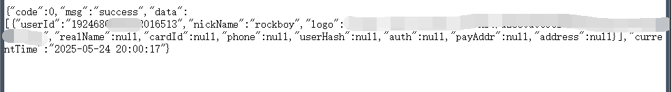
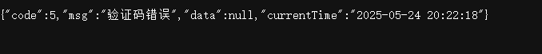
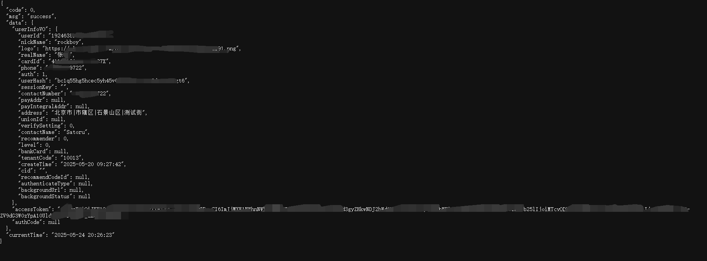
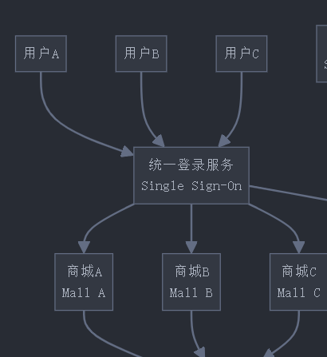
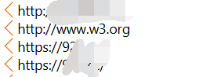
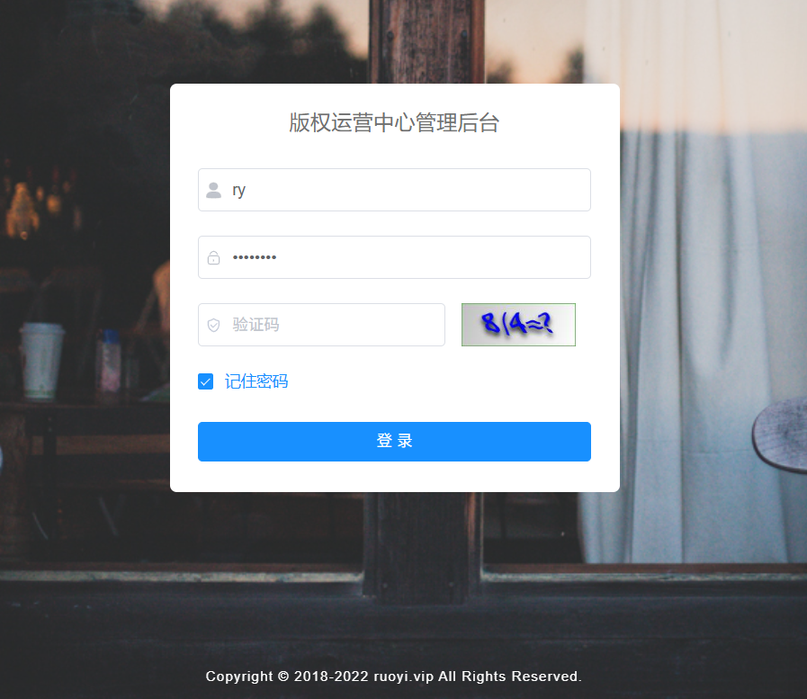
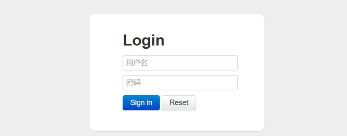
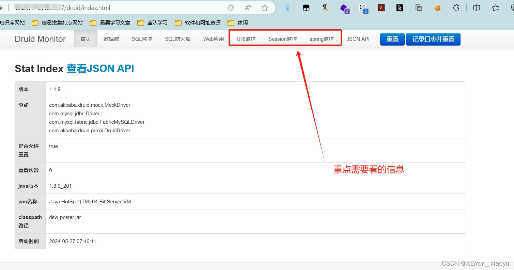
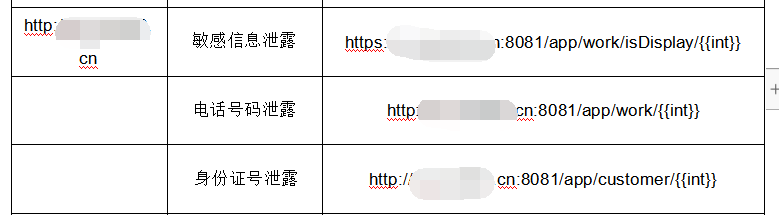
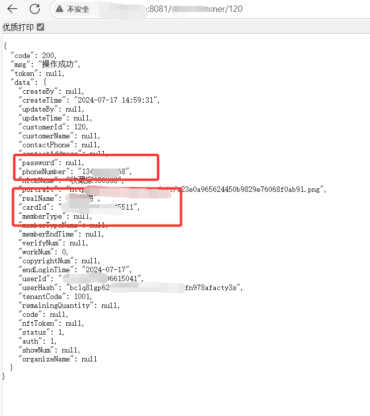

# 大道至简，druid弱口令+接口测试组合拳轻松拿下30w+敏感信息-先知社区

> **来源**: https://xz.aliyun.com/news/18080  
> **文章ID**: 18080

---

# 大道至简，druid弱口令+接口测试组合拳轻松拿下30w+敏感信息

在某攻防演练中，我们通过大量的资产测绘以及关键薄弱点攻击，实现了**对某省级大型目标**从一系列弱密码以及简单的账户劫持作为入口点，打出3**0w+敏感数据泄露的思路**。 希望能够分享给大家，作为一个参考

‍

## 资产测绘部分

一般情况下，对一个大型目标的攻防，资产测绘部分是最为重要的。

假设前期只给一个公司名，我会简单的把这个目标分为四个空间作为探测的出发点

### 金融空间

在金融空间层面，我们更多是站在企业的内里角度去做信息收集，比如通过**天眼查，爱企查**查询控股子公司。通过**招标文件**以及官网信息查询第三方供应商。通过**ICP备案**，查询该企业注册的一系列域名以及小程序，app资产。当然，在网络侧通过GoogleDorking等方法也是能收集到一些涉重点的敏感信息的。

### 网络空间

网络空间就是常规的信息收集链条，我一般会使用灯塔或者TscanPlus作为收集资产的平台，将金融空间的前期主要域名资产导入，并进入深化的测绘。这里也推荐我自研的一个[轮子](https://github.com/Sat0ru-qwq/SubDroid)，可以简单的对前期的域名资产做一个简单收集便于**区分优先级**。总而言之，这个阶段的需求就是**高效的子域名扫描、DNS 查询、端口扫描、活跃性检测、指纹识别、漏洞扫描。** 大范围的覆盖性扫描有助于快速定位某些文件泄露，敏感服务。

### 业务空间

这个时候大部分就是根据目标类型区分，这里就以目标为例。**前期入口点：**该系统为靶标系统的旅游业业务，类似小程序的web端，主要出售一些特定主题的NFT数字产品，是一个架构简单的商城


那么有商城的地方，就需要存储订单，是否有专门的**数据库管理服务器**？同时既然是某特定主题NFT产品，那么是否有**别的系统作为同类型业务，出售其他NFT产品？**后续根据信息收集，找到旁站业务，其中一个是druid**实时分析型数据库,** 另外两个商城一个是出售ai绘画产品的存证业务，另外一个则是同主题的品牌文创数字艺术，不过交由其他企业托管。​


### 人员空间

人员空间这个概念就宽泛的多，更多讲究对这个人本身侧写的立体化，多维化。一个人身处不同的网络空间中，往往有不同的安全意识，那么就意味着可以**从这个人员的数字足迹，社会身份入手，发起一次意想不到的跨域攻击**可以从**多重身份**入手。比如对方兼具**某高校讲师**以及**企业管理人员的双重身份，** 身处两个业务逻辑完全不同的组织结构中，你就可以从高校的网络空间入手作为出发点，攻击企业层面的网络空间。比方说以**学生身份投递简历，利用高校邮箱发送邮件**等，这些以第二现场攻击第一目标的手段屡试不爽。也可以从**某些习惯**入手，比如通过Web系统中的某些“**关键性注释**”，假设我们在前端的css美化中注释提到**Last Modified by Satoru,** 这个时候对开发人员的攻击就从社工各个开发社区账户乃至到其他社交平台账户，不论是获取源代码还是直接进行“鱼叉式”攻击都很有帮助。

‍

因此，资产测绘是非常重要的，

1. **四维联动**：金融→网络→业务->人员递进穿透
2. **以小博大**：通过关联资产发现核心系统
3. **持续演进**：工具链与攻击面同步升级

‍

## 测试部分

### 入口点，简单的任意账户劫持

根据前面这个商城系统，开始进行基础的注册，登录操作，**这里我拿出尾号9722的电话号码在这个系统做好了前期的注册操作以及基础的信息绑定**。


注册过后，我登出，在前台打开devtools并观察网络，**做一些简单的操作，观察用户操作时这个商城调用的接口，后续有一些接口引起了我的注意**。

‍

**在登录页面填入电话号码**时，这个系统调用了外站的这个接口

```
https://nft.xxxx.xin/xxx/getUserByPhone?phone=
```

此时我填入的手机号码作为phone参数被传入该接口，并返回了我在该商城的一些用户信息



那么我将参数随便修改为110


则data为空，那么就可以**根据 fuzz phone参数测试用户是否存在**

后续尝试使用验证码登录，在获取验证码过程中需要过图形验证码人机验证，本来以为这样的校验逻辑很严谨，**但后续发现该系统发送的验证码为4位，且存活时长为15分钟，遂思考能否fuzz验证码成功登录，达到任意用户劫持的效果。**


后续则尝试登录功能点，发现登录逻辑同样是经过外站

```
https://nft.xxxx.xin/xxx/login接口

POST
--data
==========================
{"loginPswd":"","phone":"xxxx9722","userHash":"","userId":"xxxx3649793",
"verifyCode":"3410","wxCode":"","cid":"","recommendCodeId":""}
```

**尝试验证码3410**



**尝试验证码3427**



可以看到返回了包括用户实名，身份证，住址等一系列敏感信息，同时实现了成功登录。

同时，由于该商城涉及交易等内容，能够通过恶意转送或者拍卖对受害者造成经济损失

而这也引发了我的思考，**既然这是个商城，那么这些用户信息和生成验证码逻辑为什么都得调用外站？大量的订单和数据又存储在哪里？**

因此我推测这个架构为**多个商城围绕一个数据库服务器，登录逻辑经由外站统一发放**

​

那么，根据我推测的业务逻辑。就可以开始后续针对性的收集类似业务以及数据库服务器。

### 一生二，二生三的通杀论

通过**ICP备案**以及**前期入口点系统中通过熊猫头，JSFinder以及子域名收集**到的其他外站，收集到三个同类型商城

​

推测是否**共同调用同一个验证码逻辑，并且能够实现任意账户劫持。**


后续经过测试，果然三个商城的登录逻辑都依赖于这个外站，那么我只需要拿一个验证码测试其中一个系统的任意用户，就可以拿下其他系统的同用户账户。

同时由于不同商城的逻辑不同，有些商城需要绑定银行卡，因此我也在某些商城的内置接口中获取了银行卡的开户信息，**这也代表着我可以利用身份证，住址，银行卡等信息进行一系列人员维度上的打击。**

**一生二，二生三**不但是漏洞层面上的，更是依赖类似的思维通杀网络空间到人员空间，一步步推进攻击链的过程。

## 根据业务逻辑，追根究底

#### 起承--若依弱口令

一开始收集到了若依管理后台，于是开始经典的一系列应用。

```
https://bcadmin.xxxx.cn/#/login?redirect=%2Findex
```

这里通过经典的ry/admin123进入后台，但由于是普通权限且赋予的功能模块较少，因此这里的进一步利用按下不表，不过若依后台一般搭配druid，**这给了我启发:说不定能依靠druid打出庞大的数据量**，在登录该后台后拼接了一系列可能的druid路径，可惜都没有找到登录页面，心灰意冷继续收集。

#### druid弱口令

老天终究眷顾笨小孩，**后续在该商城某子域**的8081端口找到了druid系统

```
http://bc.xxxx.cn:8081/druid/login.html
```

​

druid**的常规渗透思路：**



可以参考[上心师傅的思路分享(二)--Druid monitor-CSDN博客](https://blog.csdn.net/weixin_72543266/article/details/139512111)

Druid是一个非常好用的数据库连接池，但是他的好并不止体现在作为一个连接池加快数据访问性能上和连接管理上，他带有一个强大的监控工具：Druid Monitor。不仅可以监控数据源和慢查询，还可以监控Web应用、URI监控、Session监控、Spring监控。

这里我通过弱口令**ruoyi/123456进入了系统**

#### 进一步利用

我这里以参考文章的图片为例，我通过URL监控实时查看前面客户端访问的url路径，去查看有没有一些敏感信息的接口,比如说获取用户信息的一些接口

‍

这里好巧不巧，正让我找到了三个路由

​​



​

数据量证明：urlhttp://xx.xxxx.cn:8081/xxx/xxxx/475至http://xx.xxxx:8081/xxx/xxxx/368397共30w+，含手机号姓名住址,部分包含身份证。

‍

## 总结

**攻击链条其实很简单**，这次渗透的核心思路是：从业务逻辑漏洞切入，通过资产测绘扩大攻击面，最终利用管理后台和数据监控系统的弱点实现大规模数据泄露。

**入口点突破**

* 发现验证码可爆破（4位+15分钟存活），通过枚举劫持任意用户账户。
* 外站统一鉴权接口推测业务逻辑

**资产关联扩展**

* 利用ICP备案和子域名爆破，发现三个同类型商城共用同一套鉴权逻辑，实现“通杀”。
* 通过若依后台弱口令（ry/admin123）进入，推测Druid路径，最终找到Druid监控系统（ruoyi/123456）。

**数据泄露终局**

* 在Druid的URL监控中捕获30w+敏感数据（含PII），完成从单点漏洞到全局数据泄露的升级。

**打法精髓**：**业务逻辑→资产测绘→数据收割**，环环相扣，最终形成降维打击。

‍
