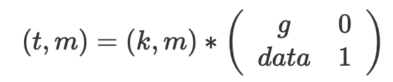
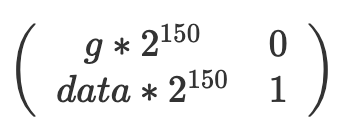
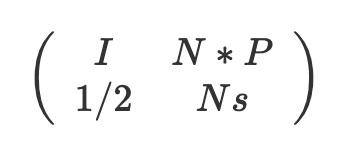

# Litctf 2025 crypto wp-先知社区

> **来源**: https://xz.aliyun.com/news/18095  
> **文章ID**: 18095

---

## basic

题目描述

```
from Crypto.Util.number import *
from enc import flag 

m = bytes_to_long(flag)
n = getPrime(1024)
e = 65537
c = pow(m,e,n)
print(f"n = {n}")
print(f"e = {e}")
print(f"c = {c}")

'''
n = 150624321883406825203208223877379141248303098639178939246561016555984711088281599451642401036059677788491845392145185508483430243280649179231349888108649766320961095732400297052274003269230704890949682836396267905946735114062399402918261536249386889450952744142006299684134049634061774475077472062182860181893
e = 65537
c = 22100249806368901850308057097325161014161983862106732664802709096245890583327581696071722502983688651296445646479399181285406901089342035005663657920475988887735917901540796773387868189853248394801754486142362158369380296905537947192318600838652772655597241004568815762683630267295160272813021037399506007505
'''

```

简单的求phi=(p-1),求d=(e)^(-1)mod phi  
exp

```
from Crypto.Util.number import *
import gmpy2
n = 150624321883406825203208223877379141248303098639178939246561016555984711088281599451642401036059677788491845392145185508483430243280649179231349888108649766320961095732400297052274003269230704890949682836396267905946735114062399402918261536249386889450952744142006299684134049634061774475077472062182860181893
e = 65537
c = 22100249806368901850308057097325161014161983862106732664802709096245890583327581696071722502983688651296445646479399181285406901089342035005663657920475988887735917901540796773387868189853248394801754486142362158369380296905537947192318600838652772655597241004568815762683630267295160272813021037399506007505
phi=n-1
d=gmpy2.invert(e,phi)
print(long_to_bytes(pow(c,d,n)))

```

## ez\_math

题目描述

```
from sage.all import *
from Crypto.Util.number import *
from uuid import uuid4

flag = b'LitCTF{'+ str(uuid4()).encode() + b'}'
flag = bytes_to_long(flag)
len_flag = flag.bit_length()
e = 65537
p = getPrime(512)
P = GF(p)
A = [[flag,                 getPrime(len_flag)],
     [getPrime(len_flag),   getPrime(len_flag)]]
A = matrix(P, A)
B = A ** e

print(f"e = {e}")
print(f"p = {p}")
print(f"B = {list(B)}".replace('(', '[').replace(')', ']'))

# e = 65537
# p = 8147594556101158967571180945694180896742294483544853070485096002084187305007965554901340220135102394516080775084644243545680089670612459698730714507241869
# B = [[2155477851953408309667286450183162647077775173298899672730310990871751073331268840697064969968224381692698267285466913831393859280698670494293432275120170, 4113196339199671283644050914377933292797783829068402678379946926727565560805246629977929420627263995348168282358929186302526949449679561299204123214741547], [3652128051559825585352835887172797117251184204957364197630337114276860638429451378581133662832585442502338145987792778148110514594776496633267082169998598, 2475627430652911131017666156879485088601207383028954405788583206976605890994185119936790889665919339591067412273564551745588770370229650653217822472440992]]

```

还是求phi=(p-1),d=(e)^(-1) mod phi 不过是对矩阵，一样的。

exp

```
from Crypto.Util.number import *

e = 65537
p = 8147594556101158967571180945694180896742294483544853070485096002084187305007965554901340220135102394516080775084644243545680089670612459698730714507241869
B = [[2155477851953408309667286450183162647077775173298899672730310990871751073331268840697064969968224381692698267285466913831393859280698670494293432275120170, 4113196339199671283644050914377933292797783829068402678379946926727565560805246629977929420627263995348168282358929186302526949449679561299204123214741547], [3652128051559825585352835887172797117251184204957364197630337114276860638429451378581133662832585442502338145987792778148110514594776496633267082169998598, 2475627430652911131017666156879485088601207383028954405788583206976605890994185119936790889665919339591067412273564551745588770370229650653217822472440992]]
phi=p-1
d=inverse(e,phi)
P = GF(p)

B = matrix(P, B)
B =B **d
print(long_to_bytes(int(B[0][0])))
```

## math

题目描述

```
from Crypto.Util.number import *
from enc import flag

m = bytes_to_long(flag)
e = 65537
p,q = getPrime(1024),getPrime(1024)
n = p*q
noise = getPrime(40)
tmp1 = noise*p+noise*q
tmp2 = noise*noise
hint = p*q+tmp1+tmp2
c = pow(m,e,n)
print(f"n = {n}")
print(f"e = {e}")
print(f"c = {c}")
print(f"hint = {hint}")
'''
n = 17532490684844499573962335739488728447047570856216948961588440767955512955473651897333925229174151614695264324340730480776786566348862857891246670588649327068340567882240999607182345833441113636475093894425780004013793034622954182148283517822177334733794951622433597634369648913113258689335969565066224724927142875488372745811265526082952677738164529563954987228906850399133238995317510054164641775620492640261304545177255239344267408541100183257566363663184114386155791750269054370153318333985294770328952530538998873255288249682710758780563400912097941615526239960620378046855974566511497666396320752739097426013141
e = 65537
c = 1443781085228809103260687286964643829663045712724558803386592638665188285978095387180863161962724216167963654290035919557593637853286347618612161170407578261345832596144085802169614820425769327958192208423842665197938979924635782828703591528369967294598450115818251812197323674041438116930949452107918727347915177319686431081596379288639254670818653338903424232605790442382455868513646425376462921686391652158186913416425784854067607352211587156772930311563002832095834548323381414409747899386887578746299577314595641345032692386684834362470575165392266454078129135668153486829723593489194729482511596288603515252196
hint = 17532490684844499573962335739488728447047570856216948961588440767955512955473651897333925229174151614695264324340730480776786566348862857891246670588649327068340567882240999607182345833441113636475093894425780004013793034622954182148283517822177334733794951622433597634369648913113258689335969565315879035806034866363781260326863226820493638303543900551786806420978685834963920605455531498816171226961859405498825422799670404315599803610007692517859020686506546933013150302023167306580068646104886750772590407299332549746317286972954245335810093049085813683948329319499796034424103981702702886662008367017860043529164
'''
```

hint=p\*q+tmp1+tmp2  
hint-n=tmp1+tmp2=(p+q+noise)\*noise  
由于noise=getPrime(40),因式分解，得到noise,还原p+q,解（p+q-q）·(q)=n,解出p,q，rsa求解

exp

```
from Crypto.Util.number import *

n = 17532490684844499573962335739488728447047570856216948961588440767955512955473651897333925229174151614695264324340730480776786566348862857891246670588649327068340567882240999607182345833441113636475093894425780004013793034622954182148283517822177334733794951622433597634369648913113258689335969565066224724927142875488372745811265526082952677738164529563954987228906850399133238995317510054164641775620492640261304545177255239344267408541100183257566363663184114386155791750269054370153318333985294770328952530538998873255288249682710758780563400912097941615526239960620378046855974566511497666396320752739097426013141
e = 65537
c = 1443781085228809103260687286964643829663045712724558803386592638665188285978095387180863161962724216167963654290035919557593637853286347618612161170407578261345832596144085802169614820425769327958192208423842665197938979924635782828703591528369967294598450115818251812197323674041438116930949452107918727347915177319686431081596379288639254670818653338903424232605790442382455868513646425376462921686391652158186913416425784854067607352211587156772930311563002832095834548323381414409747899386887578746299577314595641345032692386684834362470575165392266454078129135668153486829723593489194729482511596288603515252196
hint = 17532490684844499573962335739488728447047570856216948961588440767955512955473651897333925229174151614695264324340730480776786566348862857891246670588649327068340567882240999607182345833441113636475093894425780004013793034622954182148283517822177334733794951622433597634369648913113258689335969565315879035806034866363781260326863226820493638303543900551786806420978685834963920605455531498816171226961859405498825422799670404315599803610007692517859020686506546933013150302023167306580068646104886750772590407299332549746317286972954245335810093049085813683948329319499796034424103981702702886662008367017860043529164

noise=942430120937
p_q=(hint-n-noise**2)//noise
x = var('x')
print(solve(x^2 - p_q*x + n == 0, x))

p= 129112612387117168544548806594598239723269413018237311103183364923990952496526515359646206873258782817688219175077148783763135197336175176198298490617680613026041422778023211198065691901359818038571796833717316365956740856517956965885218769221109327995041603982486823929701783921298556945214132214551199668201
q= 135792238734020752402738279887728641662483275687137578306012881706639817605483435282163392435044240115684744622670586400181099625735464730483356502221026546220369148578684544694242743301595862672216732669599901182387427975535652315677229160320057058067529240344722506162893596721678195275652905002409883036941
phi=(p-1)*(q-1)
d=inverse(e,phi)
print(long_to_bytes(pow(c,d,n)))    
```

## baby

题目描述

```
import gmpy2
from Crypto.Util.number import *
from enc import flag


m = bytes_to_long(flag)
g = getPrime(512)
t = getPrime(150)
data = (t * gmpy2.invert(m, g)) % g
print(f'g = {g}')
print(f'data = {data}')
'''
g = 7835965640896798834809247993719156202474265737048568647376673642017466116106914666363462292416077666356578469725971587858259708356557157689066968453881547
data = 2966297990428234518470018601566644093790837230283136733660201036837070852272380968379055636436886428180671888655884680666354402224746495312632530221228498
'''  
```

格，有  


配平有  


LLL解出

exp

```
from Crypto.Util.number import long_to_bytes
g = 7835965640896798834809247993719156202474265737048568647376673642017466116106914666363462292416077666356578469725971587858259708356557157689066968453881547
data = 2966297990428234518470018601566644093790837230283136733660201036837070852272380968379055636436886428180671888655884680666354402224746495312632530221228498
n=150
M=matrix(ZZ,[[g*(2^n),0],[data*(2^n),1]])
M=M.LLL()
for i in range(0,2):
    for j in range(0,2):
        print(M[i,j].bit_length())
        print(long_to_bytes(int(abs((M[i,j])))))
```

## leak

题目描述

```
from Crypto.Util.number import *
from enc import flag

m = bytes_to_long(flag)
p,q,e = getPrime(1024),getPrime(1024),getPrime(101)
n = p*q
temp = gmpy2.invert(e,p-1)
c = pow(m,e,n)
hint = temp>>180
print(f"e = {e}")
print(f"n = {n}")
print(f"c = {c}")
print(f"hint = {hint}")
'''
e = 1915595112993511209389477484497
n = 12058282950596489853905564906853910576358068658769384729579819801721022283769030646360180235232443948894906791062870193314816321865741998147649422414431603039299616924238070704766273248012723702232534461910351418959616424998310622248291946154911467931964165973880496792299684212854214808779137819098357856373383337861864983040851365040402759759347175336660743115085194245075677724908400670513472707204162448675189436121439485901172477676082718531655089758822272217352755724670977397896215535981617949681898003148122723643223872440304852939317937912373577272644460885574430666002498233608150431820264832747326321450951
c = 5408361909232088411927098437148101161537011991636129516591281515719880372902772811801912955227544956928232819204513431590526561344301881618680646725398384396780493500649993257687034790300731922993696656726802653808160527651979428360536351980573727547243033796256983447267916371027899350378727589926205722216229710593828255704443872984334145124355391164297338618851078271620401852146006797653957299047860900048265940437555113706268887718422744645438627302494160620008862694047022773311552492738928266138774813855752781598514642890074854185464896060598268009621985230517465300289580941739719020511078726263797913582399
hint = 10818795142327948869191775315599184514916408553660572070587057895748317442312635789407391509205135808872509326739583930473478654752295542349813847128992385262182771143444612586369461112374487380427668276692719788567075889405245844775441364204657098142930
'''

```

dp的高位泄露  
dp\*e=1+k(p-1)  
(dp\_h+x)\*e-1-k=0 mod p  
打二元coppor就行

exp

```
from Crypto.Util.number import *
def small_roots(f, bounds, m=1, d=None):
    if not d:
        d = f.degree()
    R = f.base_ring()
    N = R.cardinality()
    #f /= f.coefficients().pop(0)
    f = f.change_ring(ZZ)
    G = Sequence([], f.parent())
    for i in range(m + 1):
        base = N ^ (m - i) * f ^ i
        for shifts in itertools.product(range(d), repeat=f.nvariables()):
            g = base * prod(map(power, f.variables(), shifts))
            G.append(g)
    B, monomials = G.coefficient_matrix()
    monomials = vector(monomials)
    factors = [monomial(*bounds) for monomial in monomials]
    for i, factor in enumerate(factors):
        B.rescale_col(i, factor)
    B = B.dense_matrix().LLL()
    B = B.change_ring(QQ)
    for i, factor in enumerate(factors):
        B.rescale_col(i, 1 / factor)
    H = Sequence([], f.parent().change_ring(QQ))
    for h in filter(None, B * monomials):
        H.append(h)
        I = H.ideal()
        if I.dimension() == -1:
            H.pop()
        elif I.dimension() == 0:
            roots = []
            for root in I.variety(ring=ZZ):
                root = tuple(R(root[var]) for var in f.variables())
                roots.append(root)
            return roots
    return []

from Crypto.Util.number import *
import hashlib
import itertools
from tqdm import *


e = 1915595112993511209389477484497
n = 12058282950596489853905564906853910576358068658769384729579819801721022283769030646360180235232443948894906791062870193314816321865741998147649422414431603039299616924238070704766273248012723702232534461910351418959616424998310622248291946154911467931964165973880496792299684212854214808779137819098357856373383337861864983040851365040402759759347175336660743115085194245075677724908400670513472707204162448675189436121439485901172477676082718531655089758822272217352755724670977397896215535981617949681898003148122723643223872440304852939317937912373577272644460885574430666002498233608150431820264832747326321450951
c = 5408361909232088411927098437148101161537011991636129516591281515719880372902772811801912955227544956928232819204513431590526561344301881618680646725398384396780493500649993257687034790300731922993696656726802653808160527651979428360536351980573727547243033796256983447267916371027899350378727589926205722216229710593828255704443872984334145124355391164297338618851078271620401852146006797653957299047860900048265940437555113706268887718422744645438627302494160620008862694047022773311552492738928266138774813855752781598514642890074854185464896060598268009621985230517465300289580941739719020511078726263797913582399
hint = 10818795142327948869191775315599184514916408553660572070587057895748317442312635789407391509205135808872509326739583930473478654752295542349813847128992385262182771143444612586369461112374487380427668276692719788567075889405245844775441364204657098142930
leak=hint<<180
R.<x,y> = PolynomialRing(Zmod(n))
f = e * (leak + x) + (y - 1)
res = small_roots(f,(2^180,2^180),m=1,d=4)

dq_l=int(res[0][0])
k=int(res[0][1])

dq=leak+dq_l
p=(e*dq-1)//k +1
q=n//p
phi=(p-1)*(q-1)
d=inverse(e,phi)
print(long_to_bytes(pow(c,d,n)))
```

## new\_bag

题目描述

```
from Crypto.Util.number import *
import random
import string
 
def get_flag(length):
    characters = string.ascii_letters + string.digits + '_'
    flag = 'LitCTF{' + ''.join(random.choice(characters) for _ in range(length)) + '}'
    return flag.encode()

flag = get_flag(8)
print(flag)
flag = bin(bytes_to_long(flag))[2:]

p = getPrime(128)
pubkey = [getPrime(128) for i in range(len(flag))]
enc = 0
for i in range(len(flag)):
    enc += pubkey[i] * int(flag[i])
    enc %= p
f = open("output.txt","w")
f.write(f"p = {p}
")
f.write(f"pubkey = {pubkey}
")
f.write(f"enc = {enc}
")
f.close()

```

一个ssp问题，有64位已知位  
有格  
 *P=(pubkey[0],pubkey[1],...,pubkey[-1])即public\_key  
s=enc+k*p  
爆破k即可，k不会太大

exp

```
from tqdm import trange
from Crypto.Util.number import *
import string


s = 82516114905258351634653446232397085739
p = 173537234562263850990112795836487093439

pubkey = [184316235755254907483728080281053515467, 301753295242660201987730522100674059399, 214746865948159247109907445342727086153, 190710765981032078577562674498245824397, 331594659178887289573546882792969306963, 325241251857446530306000904015122540537, 183138087354043440402018216471847480597, 184024660891182404534278014517267677121, 221852419056451630727726571924370029193, 252122782233143392994310666727549089119, 175886223097788623718858806338121455451, 275410728642596840638045777234465661687, 251664694235514793799312335012668142813, 218645272462591891220065928162159215543, 312223630454310643034351163568776055567, 246969281206041998865813427647656760287, 314861458279166374375088099707870061461, 264293021895772608566300156292334238719, 300802209357110221724717494354120213867, 293825386566202476683406032420716750733, 280164880535680245461599240490036536891, 223138633045675121340315815489781884671, 194958151408670059556476901479795911187, 180523100489259027750075460231138785329, 180425435626797251881104654861163883059, 313871202884226454316190668965524324023, 184833541398593696671625353250714719537, 217497008601504809464374671355532403921, 246589067140439936215888566305171004301, 289015788017956436490096615142465503023, 301775305365100149653555500258867275677, 185893637147914858767269807046039030871, 319328260264390422708186053639594729851, 196198701308135383224057395173059054757, 231185775704496628532348037721799493511, 243973313872552840389840048418558528537, 213140279661565397451805047456032832611, 310386296949148370235845491986451639013, 228492979916155878048849684460007011451, 240557187581619139147592264130657066299, 187388364905654342761169670127101032713, 305292765113810142043496345097024570233, 303823809595161213886303993298011013599, 227663140954563126349665813092551336597, 257833881948992845466919654910838972461, 291249161813309696736659661907363469657, 228470133121759300620143703381920625589, 337912208888617180835513160742872043511, 252639095930536359128379880984347614689, 306613178720695137374121633131944714277, 328627523443531702430603855075960220403, 283995291614222889691668376952473718279, 185992200035693404743830210660606140043, 175575945935802771832062328390060568381, 239709736751531517044198331233711541211, 325191992201185112802734343474281930993, 285825734319916654888050222626163129503, 260820892372814862728958615462018022903, 271109638409686342632742230596810197399, 195432366301516284662210689868561107229, 252351678712166898804432075801905414141, 175869608753229067314866329908981554323, 212291732707466211705141589249474157597, 299891357045144243959903067354676661051, 271237385422923460052644584552894282763, 268702576849722796315440463412052409241, 198273535005705777854651218089804228523, 177684355989910045168511400849036259973, 189237944200991357454773904466163557789, 175427967765368330787115337317676160499, 270446056495616077936737430232108222303, 243318639972702711024520926308402316247, 223872107662231922057872197123261908053, 268995355861070998347238198063073079851, 244478236168888494353493404999149985963, 230731375083676409248450208772518041369, 231630208287176700035265642824425872113, 187649298194887119502654724235771449423, 264924369987111619306245625770849264491, 327092811483332202721992798797117253283, 274967838920225995524024619709213673571, 313836314009366857157961838519499192671, 181860768653760352435352944732117309357, 184011200837375425882494435177626368109, 246455975565763627776562816894916143559, 262208917125258935991543552004318662109, 334006940602786701813813048552124976177, 241119397420390120456580389194328607351, 255370083166310325724283692646412327547, 280056982387584554076672702548437488901, 190822826881447578202544631446213911541, 206119293866065537243159766877834200177, 289535246575130471484249052043282790337, 222004375767927951747133364917437739627, 186041951615746748538744491355290007923, 299120276948597373232905692530626175519, 268645812049699572580085139845553457511, 231990902203442306941381714523426756489, 259677531562170067444672097354970172129, 232573792063456357545735601063504090387, 268451806037215206985127877726665463011, 324266632324016349795115268035757999593, 323952615081869295386415078624753400501, 302316593553669781596237136546083536339, 235576231941572491681115931798290883659, 202271277470197960243533508432663735031, 172391954991101354275650988921310984563, 215333185856183701105529790905068832303, 335916893044781805453250006520700519353, 217268288923298532517983372665872329797, 265455575922780577837866687874732212733, 182194442259001995170676842797322170297, 180222796978664332193987060700843734759, 332629077640484670095070754759241249101, 238815683708676274248277883404136375767, 246167709707533867216616011486975023679, 188375282015595301232040104228085154549, 230675799347049231846866057019582889423, 290911573230654740468234181613682439691, 173178956820933028868714760884278201561, 340087079300305236498945763514358009773, 215775253913162994758086261347636015049, 286306008278685809877266756697807931889, 175231652202310718229276393280541484041, 230887015177563361309867021497576716609, 306478031708687513424095160106047572447, 172289054804425429042492673052057816187]
enc = s

w=pubkey[8*7-1:-8]

n = len(w)
N = ceil(sqrt(n))
W = matrix(w)
E = identity_matrix(ZZ, n)

l=len(pubkey)

front='LitCTF{'.encode()
front= bin(bytes_to_long(front))[2:]
len_front=len(front)
sum_front=0
for i in range(len_front):
    sum_front+=pubkey[i]*int(front[i])

end="}".encode()
end=bin(bytes_to_long(end))[2:]
len_end=len(end)

sum_end=0
for i in range(len_end):
    sum_end+=pubkey[i+127-7]*int(end[i])
sum_=sum_end+sum_front
k0=sum_//p


for k in trange(70):
    s_=s+(k+k0)*p-sum_
    L = block_matrix([[E, N * W.T], [ones_matrix(1, n) / 2, N * s_]])
    M = L.LLL()
    for i in range(65):
        
        x1 = M[i][:n].apply_map(lambda x: x + QQ(1/2))
        x2 = M[i][:n].apply_map(lambda x: QQ(1/2) - x)

        if(set(x1).issubset({0, 1}) and set(x2).issubset({0, 1})):

            binary_str1 = ''.join(map(str, x1))
            binary_str2 = ''.join(map(str, x2))

            def binary_to_str(binary_str):
                bytes_list = [binary_str[i:i+8] for i in range(0, len(binary_str), 8)]
                return ''.join([chr(int(byte, 2)) for byte in bytes_list])

            str1 = binary_to_str(binary_str1)
            str2 = binary_to_str(binary_str2)

            print("LitCTF{"+str1+"}")
            print("LitCTF{"+str2+"}")
            exit()
            
```
