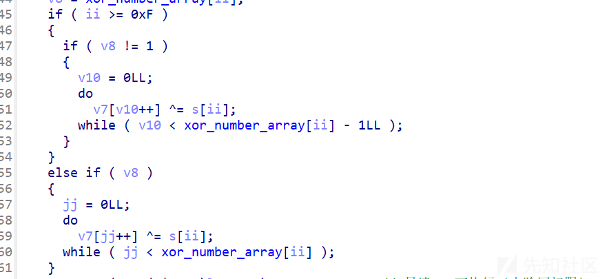
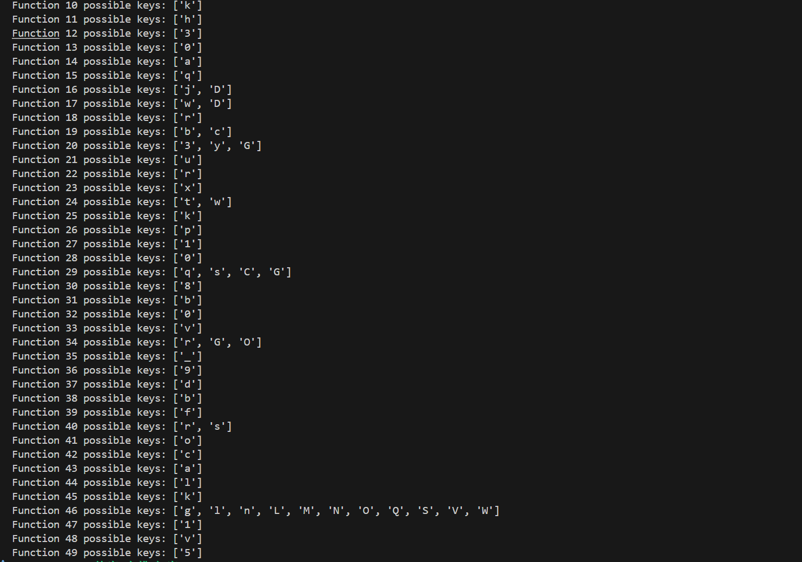
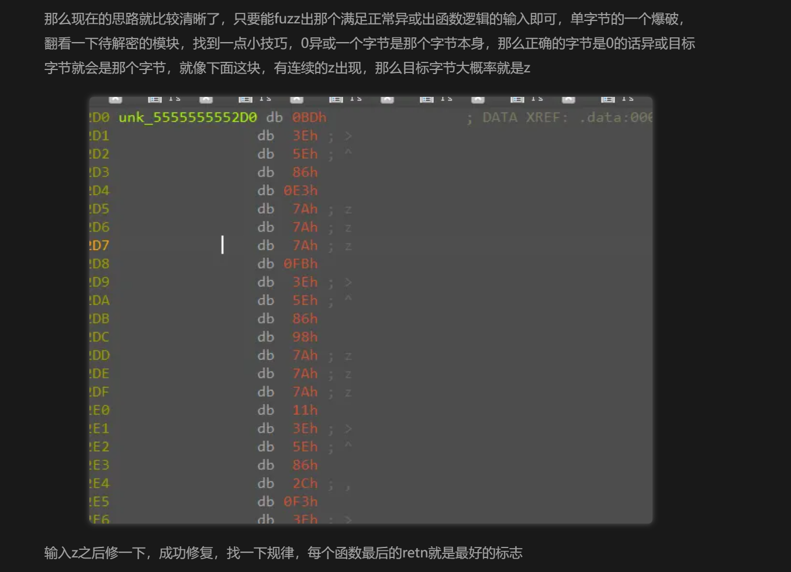

# JQCTF2025 Customize Virtual Machine复现-先知社区

> **来源**: https://xz.aliyun.com/news/18102  
> **文章ID**: 18102

---

# JQCTF2025 Customize Virtual Machine复现

### 逻辑

核心代码：

```
__int64 __fastcall main(int a1, char **a2, char **a3)
{
  unsigned int v3; // ebp
  unsigned __int64 ii; // r14
  _BYTE *v5; // rbp
  char *len1; // rbx
  char *v7; // rax
  int v8; // ecx
  unsigned __int64 jj; // rcx
  unsigned __int64 v10; // rcx
  unsigned int v11; // eax
  unsigned int eiip; // ebp
  char v13; // bl
  int eip_add_len; // ecx
  __int64 v15; // rcx
  __int64 v16; // rcx
  const char *v17; // rdi
  bool v19; // [rsp+3h] [rbp-B5h]
  unsigned int v20; // [rsp+4h] [rbp-B4h]
  __int64 v21; // [rsp+8h] [rbp-B0h]
  __int128 s1[3]; // [rsp+10h] [rbp-A8h] BYREF
  __int16 v23; // [rsp+40h] [rbp-78h]
  char s[104]; // [rsp+50h] [rbp-68h] BYREF

  v3 = 0;
  printf("input:");
  __isoc99_scanf("%50s", s);
  if ( strlen(s) != 50 )
  {
    puts("Wrong. Try Again.");
    return v3;
  }
  v21 = -sysconf(30);
  ii = 0LL;
  v19 = 1;
  v20 = 0;
  while ( 1 )
  {
    v5 = (_BYTE *)(v21 & (unsigned __int64)fun_list[ii]);
    len1 = (char *)(xor_number_array[ii] + fun_list[ii] - v5);
    if ( mprotect(v5, (size_t)len1, 7) == -1 )  // 内存区域 [v5, v5 + v6)
      break;
    v7 = fun_list[ii];
    v8 = xor_number_array[ii];
    if ( ii >= 0xF )
    {
      if ( v8 != 1 )
      {
        v10 = 0LL;
        do
          v7[v10++] ^= s[ii];
        while ( v10 < xor_number_array[ii] - 1LL );
      }
    }
    else if ( v8 )
    {
      jj = 0LL;
      do
        v7[jj++] ^= s[ii];
      while ( jj < xor_number_array[ii] );
    }
    mprotect(v5, (size_t)len1, 5);              // 只读 + 可执行（去除写权限）
    v19 = ii++ < 49;
    if ( ii == 50 )
      goto LABEL_15;
  }
  perror("mprotect failed");
  v20 = 1;
LABEL_15:
  if ( v19 )
    return v20;
  memset(s1, 0, sizeof(s1));
  v23 = 0;
  v11 = 0;
  eiip = 0;
  v13 = 0;
  do                                            // 伪虚拟机执行
  {
    v15 = opcode[eiip];
    if ( v15 == 0x33 )                          // s1[v13++] = v11 输出
    {
      v16 = v13++;
      *((_BYTE *)s1 + v16) = v11;
      goto LABEL_18;
    }
    if ( (_DWORD)v15 != 0x32 )
    {
      v11 = ((__int64 (__fastcall *)(_QWORD))fun_list[v15])(v11);
LABEL_18:
      eip_add_len = 1;                          // // 非立即数指令长度 = 1
      goto LABEL_19;
    }
    v11 = opcode[eiip + 1];                     // v11 = imm 加载常数；
    eip_add_len = 2;
LABEL_19:
    eiip += eip_add_len;
  }
  while ( eiip < 0x1AA );
  if ( bcmp(s1, "Congratulations! Your flag is flag{your_input}!^_^", 0x32uLL) )
    v17 = "Wrong. Try Again.";
  else
    v17 = (const char *)s1;
  puts(v17);
  return v20;
}
```

简要修改了一下函数、变量名

代码逻辑很简单，就是输入长度为50的字符串flag，把flag的每一位与长度也为50的`fun_list`​对应位置的字节数组进行异或，实现SMC功能，解密完后用一个VM来执行opcode以及调用这些函数。

SMC：



提取`fun_list`​数据

```
from  ida_bytes import *
fun_list_addr=0x55FF11D34080
xor_number_array_addr=0x55FF11D34210
xor_number_array = []
fun_add_val=[]
for ea in range(50):
    fun_add_val+=[(get_qword(fun_list_addr+8*ea))]

for i in range(50):
    xor_number_array += [get_dword(xor_number_array_addr+4*i)]

byte_data=[]
for i in range(len(xor_number_array)):
    tmp=[]
    for j in range(xor_number_array[i]):
        tmp+=[get_byte(fun_add_val[i]+j)]
    byte_data += [tmp]
print(f"data={byte_data}")
```

提取的数据是形如

```
data=[[238, 36, 181, 224, 147, 72, 194, 39, 71, 159, 237, 99, 99, 99, 226, 39, 71, 159, 117, 156, 156, 156, 224, 163, 250, 224, 39, 71, 159, 221, 224, 147, 127, 226, 47, 71, 159, 229, 99, 99, 99, 224, 163, 110, 224, 39, 71, 159, 159, 224, 147, 39, 224, 7, 71, 159, 5, 164, 39, 71, 155, 237, 99, 99, 99, 226, 39, 71, 155, 117, 156, 156, 156, 224, 163, 182, 224, 39, 71, 155, 221, 224, 147, 5, 226, 47, 71, 155, 229, 99, 99, 99, 224, 163, 34, 224, 39, 71, 155, 159, 224, 147, 66, 224, 7, 71, 155, 5, 160], [254, 125, 29, 197, 130, 57, 57, 57, 184, 77, 29, 197, 222, 57, 57, 57, 184, 77, 29, 197, 219, 57, 57, 57, 184, 125, 29, 197, 149, 57, 57, 57, 186, 117, 29, 197, 99, 184, 117, 29, 197, 246, 57, 57, 57, 254, 125, 29, 193, 130, 57,]
```

也就是`data[i]`​对应第i个函数，内容就是要参与异或的字节

### 解题

考虑到待解密的都是函数，从函数的特征出发，其汇编代码一定不会出现诸如`"ud2", "hlt", "int3", "retf", "db", 'int1', 'xchg', 'cmpsd', 'lodsb'`​的指令(db也不应该出现)

> 在 **合法且无异常的函数中**，通常不会包含以下指令（或极其罕见）：

|  |  |
| --- | --- |
| 指令 | 原因 |
| `hlt`​ | 中止 CPU，常用于内核或异常终止 |
| `cli`​,`sti`​ | 中断控制，通常内核态指令 |
| `in`​,`out`​,`ins`​,`outs`​ | 端口 IO 操作，只用于驱动程序或内核 |
| `lgdt`​,`lidt`​,`ltr`​,`lmsw`​等 | 修改全局或中断表，仅限系统级代码 |
| `rdmsr`​,`wrmsr`​,`rdtsc`​等 | 访问 CPU 特权寄存器，仅限特定应用 |
| `vm*`​、`svm*`​ | 虚拟化指令，仅虚拟机/Hypervisor |
| `ud2`​ | 故意制造非法指令，常用于崩溃测试或反调试 |
| `lock`​前缀的原子指令（除非是多线程同步函数） |  |

可能会出现：`"push", "mov", "sub", "cmp", "xor", "lea", "imul`​等汇编指令

题目中还说到了flag格式为`0~9、a~z和'_'`​，因此可以进行爆破，然后对拿到的函数字节执行反汇编，通过其包含的汇编指令来筛选是否符合条件。另外，由于指令长度很难确定，最好只看第一条汇编指令是否合法，应该能排除大部分情况

爆破代码：

```
data=[[238, 36, 181, 224, 147, 72, 194, 39, 71, 159, 237, 99, 99, 99, 226, 39, 71, 159, 117, 156, 156, 156, 224, 163, 250, 224, 39, 71, 159, 221, 224, 147, 127, 226, 47, 71, 159, 229, 99, 99, 99, 224, 163, 110, 224, 39, 71, 159, 159, 224, 147, 39, 224, 7, 71, 159, 5, 164, 39, 71, 155, 237, 99, 99, 99, 226, 39, 71, 155, 117, 156, 156, 156, 224, 163, 182, 224, 39, 71, 155, 221, 224, 147, 5, 226, 47, 71, 155, 229, 99, 99, 99, 224, 163, 34, 224, 39, 71, 155, 159, 224, 147, 66, 224, 7, 71, 155, 5, 160], [254, 125, 29, 197, 130, 57, 57, 57, 184, 77, 29, 197, 222, 57, 57, 57, 184, 77, 29, 197, 219, 57, 57, 57, 184, 125, 29, 197, 149, 57, 57, 57, 186, 117, 29, 197, 99, 184, 117, 29, 197, 246, 57, 57, 57, 254, 125, 29, 193, 130, 57, 57, 57, 184, 77, 29, 193, 222, 57, 57, 57, 184, 77, 29, 193, 219, 57, 57, 57, 184, 125, 29, 193, 149, 57, 57, 57, 186, 117, 29, 193, 99, 184, 117, 29, 193, 246, 57, 57, 57, 180, 190, 98, 198, 198, 198, 186, 201, 88, 186, 249, 129, 186, 201, 41, 186, 249, 89, 250], [189, 62, 94, 134, 227, 122, 122, 122, 251, 62, 94, 134, 152, 122, 122, 122, 17, 62, 94, 134, 44, 243, 62, 94, 134, 19, 62, 94, 134, 183, 122, 122, 122, 243, 62, 94, 134, 241, 62, 94, 134, 243, 62, 94, 134, 189, 62, 94, 130, 227, 122, 122, 122, 251, 62, 94, 130, 152, 122, 122, 122, 17, 62, 94, 130, 44, 243, 62, 94, 130, 19, 62, 94, 130, 183, 122, 122, 122, 243, 62, 94, 130, 241, 62, 94, 130, 243, 62, 94, 130, 247, 61, 120, 249, 138, 107, 249, 186, 217, 249, 138, 100, 127, 205, 122, 122, 122, 185], [245, 118, 22, 206, 243, 50, 50, 50, 177, 86, 22, 206, 44, 179, 126, 22, 206, 163, 50, 50, 50, 177, 197, 98, 177, 86, 22, 206, 48, 191, 117, 239, 177, 86, 22, 206, 19, 245, 118, 22, 202, 243, 50, 50, 50, 177, 86, 22, 202, 44, 177, 194, 85, 179, 126, 22, 202, 163, 50, 50, 50, 177, 242, 222, 177, 86, 22, 202, 48, 177, 86, 22, 202, 19, 177, 194, 61, 241], [164, 39, 71, 159, 253, 99, 99, 99, 226, 39, 71, 159, 185, 99, 99, 99, 8, 39, 71, 159, 64, 234, 39, 71, 159, 226, 23, 71, 159, 198, 99, 99, 99, 10, 39, 71, 159, 210, 99, 99, 99, 234, 39, 71, 159, 226, 39, 71, 159, 240, 99, 99, 99, 164, 39, 71, 155, 253, 99, 99, 99, 226, 39, 71, 155, 185, 99, 99, 99, 8, 39, 71, 155, 64, 234, 39, 71, 155, 226, 23, 71, 155, 198, 99, 99, 99, 10, 39, 71, 155, 210, 99, 99, 99, 234, 39, 71, 155, 226, 39, 71, 155, 240, 99, 99, 99, 238, 36, 42, 224, 147, 23, 224, 163, 141, 224, 147, 83, 160], [169, 42, 74, 146, 103, 110, 110, 110, 5, 42, 74, 146, 69, 231, 42, 74, 146, 239, 10, 74, 146, 225, 110, 110, 110, 227, 41, 254, 237, 158, 2, 7, 34, 74, 146, 189, 110, 110, 110, 231, 34, 74, 146, 169, 42, 74, 150, 103, 110, 110, 110, 5, 34, 74, 150, 69, 231, 34, 74, 150, 239, 10, 74, 150, 225, 110, 110, 110, 7, 34, 74, 150, 189, 110, 110, 110, 231, 34, 74, 150, 237, 174, 4, 237, 158, 48, 237, 174, 34, 237, 158, 38, 107, 181, 110, 110, 110, 173], [254, 125, 29, 197, 152, 57, 57, 57, 184, 125, 29, 197, 116, 198, 198, 198, 186, 125, 29, 197, 29, 186, 93, 29, 197, 42, 186, 125, 29, 197, 79, 254, 125, 29, 193, 152, 57, 57, 57, 184, 125, 29, 193, 116, 198, 198, 198, 186, 125, 29, 193, 29, 186, 93, 29, 193, 42, 186, 125, 29, 193, 79, 180, 126, 66, 186, 201, 106, 186, 249, 164, 186, 201, 10, 186, 249, 194, 186, 201, 80, 186, 249, 108, 250], [231, 237, 222, 106, 106, 106, 233, 154, 92, 233, 170, 9, 233, 154, 123, 233, 170, 39, 233, 154, 69, 169], [170, 41, 73, 145, 87, 109, 109, 109, 238, 33, 73, 145, 108, 238, 25, 73, 145, 7, 236, 9, 73, 145, 129, 109, 109, 109, 224, 42, 33, 238, 157, 28, 4, 33, 73, 145, 207, 109, 109, 109, 228, 33, 73, 145, 238, 25, 73, 145, 121, 170, 41, 73, 149, 87, 109, 109, 109, 238, 33, 73, 149, 108, 238, 173, 92, 238, 25, 73, 149, 7, 238, 157, 27, 236, 9, 73, 149, 129, 109, 109, 109, 238, 173, 207, 238, 157, 26, 4, 33, 73, 149, 207, 109, 109, 109, 228, 33, 73, 149, 238, 25, 73, 149, 121, 238, 173, 80, 238, 157, 104, 238, 173, 189, 238, 157, 102, 174], [251, 241, 23, 137, 137, 137, 245, 134, 125, 245, 182, 115, 181], [172, 47, 79, 151, 195, 107, 107, 107, 234, 47, 79, 151, 70, 148, 148, 148, 234, 31, 79, 151, 236, 107, 107, 107, 232, 47, 79, 151, 222, 230, 44, 91, 232, 31, 79, 151, 52, 232, 155, 70, 232, 15, 79, 151, 45, 172, 47, 79, 147, 195, 107, 107, 107, 234, 47, 79, 147, 70, 148, 148, 148, 232, 171, 219, 234, 31, 79, 147, 236, 107, 107, 107, 232, 155, 64, 232, 47, 79, 147, 222, 232, 171, 236, 232, 31, 79, 147, 52, 232, 155, 71, 232, 15, 79, 147, 45, 168], [175, 44, 76, 148, 169, 104, 104, 104, 1, 44, 76, 148, 175, 104, 104, 104, 225, 44, 76, 148, 233, 36, 76, 148, 189, 104, 104, 104, 233, 44, 76, 148, 115, 151, 151, 151, 233, 44, 76, 148, 228, 104, 104, 104, 175, 44, 76, 144, 169, 104, 104, 104, 1, 44, 76, 144, 175, 104, 104, 104, 225, 44, 76, 144, 233, 36, 76, 144, 189, 104, 104, 104, 229, 239, 230, 104, 104, 104, 233, 44, 76, 144, 115, 151, 151, 151, 235, 152, 45, 233, 44, 76, 144, 228, 104, 104, 104, 109, 113, 151, 151, 151, 235, 152, 19, 235, 168, 85, 235, 152, 123, 235, 168, 181, 235, 152, 102, 235, 168, 243, 235, 152, 74, 235, 168, 209, 235, 152, 53, 109, 184, 104, 104, 104, 235, 152, 39, 171], [244, 119, 23, 207, 101, 51, 51, 51, 176, 87, 23, 207, 100, 176, 119, 23, 207, 211, 178, 119, 23, 207, 87, 204, 204, 204, 244, 119, 23, 203, 101, 51, 51, 51, 176, 87, 23, 203, 100, 176, 119, 23, 203, 211, 178, 119, 23, 203, 87, 204, 204, 204, 176, 196, 98, 190, 116, 54, 176, 195, 83, 176, 243, 33, 176, 195, 89, 54, 133, 51, 51, 51, 176, 195, 100, 240], [247, 116, 20, 204, 109, 48, 48, 48, 177, 68, 20, 204, 179, 48, 48, 48, 177, 124, 20, 204, 227, 48, 48, 48, 189, 119, 63, 179, 116, 20, 204, 112, 247, 116, 20, 200, 109, 48, 48, 48, 177, 68, 20, 200, 179, 48, 48, 48, 179, 192, 53, 177, 124, 20, 200, 227, 48, 48, 48, 179, 240, 12, 179, 116, 20, 200, 112, 179, 192, 6, 179, 240, 216, 179, 192, 111, 179, 240, 227, 243], [166, 37, 69, 157, 71, 97, 97, 97, 224, 45, 69, 157, 184, 97, 97, 97, 226, 5, 69, 157, 15, 226, 37, 69, 157, 143, 166, 37, 69, 153, 71, 97, 97, 97, 224, 45, 69, 153, 184, 97, 97, 97, 226, 5, 69, 153, 15, 226, 37, 69, 153, 143, 236, 230, 123, 158, 158, 158, 226, 145, 11, 226, 161, 94, 226, 145, 39, 100, 207, 97, 97, 97, 226, 145, 108, 226, 161, 229, 226, 145, 78, 226, 161, 207, 226, 145, 119, 226, 161, 116, 226, 145, 102, 162], [242, 134, 72, 252, 54, 159, 242, 129, 30, 242, 177, 74, 182, 53, 85, 141, 214, 113, 113, 113, 240, 53, 85, 141, 126, 142, 142, 142, 242, 129, 27, 240, 61, 85, 141, 128, 113, 113, 113, 242, 177, 138, 240, 53, 85, 141, 201, 113, 113, 113, 242, 129, 120, 240, 21, 85, 141, 240, 113, 113, 113, 182, 53, 85, 137, 214, 113, 113, 113, 240, 53, 85, 137, 126, 142, 142, 142, 116, 76, 142, 142, 142, 240, 61, 85, 137, 128, 113, 113, 113, 242, 129, 1, 240, 53, 85, 137, 201, 113, 113, 113, 240, 21, 85, 137, 240, 113, 113, 113, 242, 177, 102, 195], [231, 45, 33, 233, 154, 118, 233, 170, 74, 233, 154, 80, 111, 240, 106, 106, 106, 195], [250, 48, 38, 244, 135, 55, 244, 183, 57, 244, 135, 90, 244, 183, 113, 244, 135, 55, 244, 183, 84, 244, 135, 61, 244, 183, 179, 244, 135, 26, 244, 183, 31, 244, 135, 86, 114, 22, 136, 136, 136, 195], [181, 54, 86, 142, 122, 114, 114, 114, 241, 6, 86, 142, 74, 243, 6, 86, 142, 223, 114, 114, 114, 243, 54, 86, 142, 95, 141, 141, 141, 25, 54, 86, 142, 21, 251, 54, 86, 142, 241, 62, 86, 142, 73, 181, 54, 86, 138, 122, 114, 114, 114, 241, 6, 86, 138, 74, 243, 6, 86, 138, 223, 114, 114, 114, 243, 54, 86, 138, 95, 141, 141, 141, 25, 54, 86, 138, 21, 251, 54, 86, 138, 241, 62, 86, 138, 73, 241, 133, 68, 255, 53, 103, 241, 130, 69, 119, 10, 141, 141, 141, 241, 130, 67, 241, 178, 103, 241, 130, 115, 195], [165, 38, 70, 158, 60, 98, 98, 98, 225, 22, 70, 158, 9, 233, 38, 70, 158, 239, 110, 167, 98, 98, 98, 98, 75, 163, 235, 46, 70, 158, 225, 38, 70, 158, 133, 227, 38, 70, 158, 117, 157, 157, 157, 165, 38, 70, 154, 60, 98, 98, 98, 225, 22, 70, 154, 9, 233, 38, 70, 154, 239, 110, 167, 98, 98, 98, 98, 75, 163, 235, 46, 70, 154, 225, 38, 70, 154, 133, 227, 38, 70, 154, 117, 157, 157, 157, 225, 149, 2, 239, 37, 184, 225, 146, 124, 103, 174, 98, 98, 98, 225, 146, 38, 225, 162, 53, 195], [244, 119, 23, 207, 169, 51, 51, 51, 90, 119, 23, 207, 246, 51, 51, 51, 186, 119, 23, 207, 176, 119, 23, 207, 69, 176, 87, 23, 207, 83, 244, 119, 23, 203, 169, 51, 51, 51, 90, 119, 23, 203, 246, 51, 51, 51, 186, 119, 23, 203, 176, 119, 23, 203, 69, 176, 87, 23, 203, 83, 176, 196, 28, 190, 116, 99, 176, 195, 99, 176, 243, 132, 176, 195, 91, 176, 243, 125, 176, 195, 48, 54, 34, 204, 204, 204, 176, 195, 56, 176, 243, 25, 176, 195, 43, 176, 243, 242, 195], [178, 49, 81, 137, 60, 117, 117, 117, 246, 49, 81, 137, 168, 28, 49, 81, 137, 162, 117, 117, 117, 252, 49, 81, 137, 30, 49, 81, 137, 3, 252, 49, 81, 137, 178, 49, 81, 141, 60, 117, 117, 117, 246, 49, 81, 141, 168, 28, 49, 81, 141, 162, 117, 117, 117, 252, 49, 81, 141, 30, 49, 81, 141, 3, 246, 130, 90, 252, 49, 81, 141, 248, 242, 42, 138, 138, 138, 246, 133, 41, 246, 181, 7, 246, 133, 102, 246, 181, 139, 246, 133, 71, 195], [181, 54, 86, 142, 145, 114, 114, 114, 243, 54, 86, 142, 144, 114, 114, 114, 241, 54, 86, 142, 81, 243, 22, 86, 142, 214, 114, 114, 114, 241, 6, 86, 142, 89, 243, 6, 86, 142, 204, 114, 114, 114, 181, 54, 86, 138, 145, 114, 114, 114, 243, 54, 86, 138, 144, 114, 114, 114, 241, 54, 86, 138, 81, 243, 22, 86, 138, 214, 114, 114, 114, 241, 6, 86, 138, 89, 243, 6, 86, 138, 204, 114, 114, 114, 255, 53, 169, 241, 130, 92, 241, 178, 229, 241, 130, 112, 119, 215, 140, 141, 141, 241, 130, 74, 241, 178, 56, 241, 130, 22, 241, 178, 51, 241, 130, 70, 241, 178, 135, 195], [191, 60, 92, 132, 20, 120, 120, 120, 251, 28, 92, 132, 12, 249, 60, 92, 132, 185, 120, 120, 120, 249, 52, 92, 132, 203, 120, 120, 120, 251, 52, 92, 132, 122, 249, 60, 92, 132, 69, 135, 135, 135, 191, 60, 92, 128, 20, 120, 120, 120, 251, 28, 92, 128, 12, 249, 60, 92, 128, 185, 120, 120, 120, 245, 255, 194, 134, 135, 135, 249, 52, 92, 128, 203, 120, 120, 120, 251, 136, 3, 251, 52, 92, 128, 122, 249, 60, 92, 128, 69, 135, 135, 135, 251, 184, 166, 251, 136, 10, 251, 184, 5, 251, 136, 10, 251, 184, 9, 195], [247, 131, 94, 249, 243, 87, 117, 116, 116, 247, 132, 49, 247, 180, 65, 195], [172, 47, 79, 151, 18, 107, 107, 107, 234, 47, 79, 151, 133, 107, 107, 107, 234, 39, 79, 151, 223, 107, 107, 107, 230, 44, 248, 234, 39, 79, 151, 250, 107, 107, 107, 224, 39, 79, 151, 230, 127, 162, 230, 103, 58, 226, 39, 79, 151, 172, 47, 79, 147, 18, 107, 107, 107, 234, 47, 79, 147, 133, 107, 107, 107, 232, 155, 100, 234, 39, 79, 147, 223, 107, 107, 107, 232, 171, 28, 234, 39, 79, 147, 250, 107, 107, 107, 224, 39, 79, 147, 230, 127, 162, 230, 103, 58, 226, 39, 79, 147, 232, 155, 113, 232, 171, 142, 232, 155, 78, 232, 171, 156, 232, 155, 26, 232, 171, 195, 232, 155, 103, 110, 203, 107, 107, 107, 195], [183, 52, 84, 140, 164, 112, 112, 112, 241, 4, 84, 140, 150, 112, 112, 112, 243, 20, 84, 140, 40, 243, 4, 84, 140, 54, 243, 4, 84, 140, 60, 183, 52, 84, 136, 164, 112, 112, 112, 241, 4, 84, 136, 150, 112, 112, 112, 243, 20, 84, 136, 40, 243, 4, 84, 136, 54, 253, 247, 44, 143, 143, 143, 243, 4, 84, 136, 60, 243, 128, 3, 243, 176, 30, 243, 128, 116, 117, 185, 112, 112, 112, 195], [188, 118, 173, 178, 193, 2, 178, 241, 119, 178, 193, 47, 178, 241, 243, 178, 193, 24, 52, 223, 49, 49, 49, 195], [247, 116, 20, 204, 48, 48, 48, 48, 179, 68, 20, 204, 98, 179, 116, 20, 204, 255, 179, 68, 20, 204, 53, 177, 84, 20, 204, 174, 48, 48, 48, 187, 116, 20, 204, 189, 52, 176, 185, 116, 20, 204, 247, 116, 20, 200, 48, 48, 48, 48, 179, 68, 20, 200, 98, 179, 116, 20, 200, 255, 179, 68, 20, 200, 53, 177, 84, 20, 200, 174, 48, 48, 48, 189, 119, 59, 179, 192, 109, 187, 124, 20, 200, 189, 60, 185, 185, 124, 20, 200, 179, 240, 4, 179, 192, 46, 179, 240, 95, 179, 192, 112, 179, 240, 68, 179, 192, 6, 179, 240, 20, 195], [242, 134, 119, 252, 54, 90, 242, 129, 78, 242, 177, 185, 242, 129, 58, 116, 69, 112, 113, 113, 242, 129, 117, 116, 186, 113, 113, 113, 195], [255, 124, 28, 196, 210, 56, 56, 56, 187, 76, 28, 196, 52, 185, 124, 28, 196, 187, 56, 56, 56, 83, 124, 28, 196, 117, 177, 124, 28, 196, 255, 124, 28, 192, 210, 56, 56, 56, 187, 76, 28, 192, 52, 185, 124, 28, 192, 187, 56, 56, 56, 181, 127, 47, 83, 116, 28, 192, 117, 177, 116, 28, 192, 187, 200, 58, 187, 248, 199, 187, 200, 8, 187, 248, 18, 187, 200, 83, 61, 162, 56, 56, 56, 187, 200, 8, 195], [239, 37, 182, 165, 38, 70, 158, 37, 98, 98, 98, 225, 22, 70, 158, 8, 225, 146, 93, 225, 162, 20, 9, 46, 70, 158, 46, 225, 146, 55, 235, 46, 70, 158, 11, 46, 70, 158, 164, 98, 98, 98, 235, 46, 70, 158, 225, 38, 70, 158, 216, 165, 38, 70, 154, 37, 98, 98, 98, 225, 22, 70, 154, 8, 225, 162, 240, 225, 146, 60, 9, 46, 70, 154, 46, 235, 46, 70, 154, 11, 46, 70, 154, 164, 98, 98, 98, 235, 46, 70, 154, 225, 38, 70, 154, 216, 225, 162, 54, 225, 146, 50, 225, 162, 250, 225, 146, 116, 225, 162, 222, 195], [189, 119, 17, 179, 192, 43, 179, 240, 1, 179, 192, 11, 179, 240, 250, 179, 192, 74, 53, 20, 49, 48, 48, 195], [177, 50, 82, 138, 182, 118, 118, 118, 245, 2, 82, 138, 89, 245, 58, 82, 138, 68, 247, 50, 82, 138, 232, 118, 118, 118, 245, 2, 82, 138, 68, 177, 50, 82, 142, 182, 118, 118, 118, 245, 2, 82, 142, 89, 245, 58, 82, 142, 68, 247, 50, 82, 142, 232, 118, 118, 118, 245, 2, 82, 142, 68, 251, 241, 69, 137, 137, 137, 245, 134, 108, 245, 182, 101, 195], [255, 245, 3, 115, 114, 114, 241, 130, 108, 241, 178, 42, 195], [152, 27, 123, 163, 77, 95, 95, 95, 222, 59, 123, 163, 142, 95, 95, 95, 220, 27, 123, 163, 192, 220, 43, 123, 163, 81, 220, 59, 123, 163, 1, 152, 27, 123, 167, 77, 95, 95, 95, 222, 59, 123, 167, 142, 95, 95, 95, 220, 27, 123, 167, 192, 220, 43, 123, 167, 81, 220, 59, 123, 167, 1, 210, 24, 114, 220, 175, 52, 90, 130, 95, 95, 95, 220, 175, 68, 90, 210, 95, 95, 95, 220, 175, 120, 220, 159, 241, 220, 175, 121, 220, 159, 84, 220, 175, 107, 90, 71, 94, 95, 95, 220, 175, 60, 195], [180, 126, 219, 186, 201, 59, 186, 249, 242, 186, 201, 3, 186, 249, 97, 186, 201, 23, 186, 249, 186, 254, 125, 29, 197, 241, 57, 57, 57, 186, 93, 29, 197, 33, 186, 201, 10, 184, 117, 29, 197, 147, 57, 57, 57, 186, 249, 157, 186, 125, 29, 197, 103, 254, 125, 29, 193, 241, 57, 57, 57, 186, 93, 29, 193, 33, 186, 201, 2, 184, 117, 29, 193, 147, 57, 57, 57, 186, 249, 42, 186, 125, 29, 193, 103, 195], [163, 32, 64, 152, 198, 100, 100, 100, 229, 32, 64, 152, 105, 155, 155, 155, 231, 0, 64, 152, 109, 233, 35, 218, 15, 40, 64, 152, 88, 237, 40, 64, 152, 163, 32, 64, 156, 198, 100, 100, 100, 229, 32, 64, 156, 105, 155, 155, 155, 231, 148, 40, 231, 0, 64, 156, 109, 231, 164, 129, 15, 40, 64, 156, 88, 237, 40, 64, 156, 231, 148, 36, 231, 164, 248, 231, 148, 19, 97, 188, 154, 155, 155, 195], [165, 38, 70, 158, 144, 98, 98, 98, 227, 46, 70, 158, 136, 98, 98, 98, 227, 6, 70, 158, 185, 98, 98, 98, 227, 38, 70, 158, 45, 157, 157, 157, 9, 38, 70, 158, 4, 235, 38, 70, 158, 165, 38, 70, 154, 144, 98, 98, 98, 227, 46, 70, 154, 136, 98, 98, 98, 227, 6, 70, 154, 185, 98, 98, 98, 225, 149, 4, 227, 38, 70, 154, 45, 157, 157, 157, 239, 37, 231, 225, 146, 23, 9, 46, 70, 154, 4, 235, 46, 70, 154, 225, 162, 198, 225, 146, 90, 225, 162, 93, 195], [161, 34, 66, 154, 253, 102, 102, 102, 231, 34, 66, 154, 231, 102, 102, 102, 231, 2, 66, 154, 209, 102, 102, 102, 229, 34, 66, 154, 8, 161, 34, 66, 158, 253, 102, 102, 102, 231, 34, 66, 158, 231, 102, 102, 102, 229, 145, 111, 231, 2, 66, 158, 209, 102, 102, 102, 235, 33, 82, 229, 34, 66, 158, 8, 229, 150, 70, 229, 166, 84, 229, 150, 45, 99, 136, 102, 102, 102, 229, 150, 121, 229, 166, 51, 229, 150, 31, 229, 166, 151, 195], [181, 54, 86, 142, 236, 114, 114, 114, 243, 54, 86, 142, 232, 114, 114, 114, 241, 54, 86, 142, 173, 243, 22, 86, 142, 240, 114, 114, 114, 181, 54, 86, 138, 236, 114, 114, 114, 243, 54, 86, 138, 232, 114, 114, 114, 241, 133, 44, 241, 54, 86, 138, 173, 255, 53, 220, 243, 22, 86, 138, 240, 114, 114, 114, 241, 130, 43, 241, 178, 88, 241, 130, 97, 241, 178, 158, 195], [168, 43, 75, 147, 144, 111, 111, 111, 238, 35, 75, 147, 179, 111, 111, 111, 236, 43, 75, 147, 140, 238, 43, 75, 147, 57, 144, 144, 144, 168, 43, 75, 151, 144, 111, 111, 111, 238, 35, 75, 151, 179, 111, 111, 111, 236, 43, 75, 151, 140, 238, 43, 75, 151, 57, 144, 144, 144, 226, 40, 100, 236, 159, 77, 106, 226, 111, 111, 111, 236, 159, 41, 236, 175, 21, 236, 159, 1, 195], [164, 39, 71, 159, 44, 99, 99, 99, 226, 47, 71, 159, 150, 99, 99, 99, 226, 7, 71, 159, 171, 99, 99, 99, 224, 47, 71, 159, 80, 238, 36, 36, 226, 47, 71, 159, 252, 99, 99, 99, 164, 39, 71, 155, 44, 99, 99, 99, 226, 47, 71, 155, 150, 99, 99, 99, 224, 147, 4, 226, 7, 71, 155, 171, 99, 99, 99, 224, 139, 227, 224, 47, 71, 155, 80, 224, 147, 88, 226, 47, 71, 155, 252, 99, 99, 99, 102, 123, 156, 156, 156, 224, 147, 100, 224, 163, 183, 224, 147, 100, 224, 163, 118, 224, 147, 92, 224, 163, 17, 224, 147, 38, 195], [166, 37, 69, 157, 253, 97, 97, 97, 224, 5, 69, 157, 204, 97, 97, 97, 8, 37, 69, 157, 138, 97, 97, 97, 232, 37, 69, 157, 224, 37, 69, 157, 218, 97, 97, 97, 166, 37, 69, 153, 253, 97, 97, 97, 224, 5, 69, 153, 204, 97, 97, 97, 236, 38, 1, 8, 45, 69, 153, 138, 97, 97, 97, 232, 45, 69, 153, 224, 37, 69, 153, 218, 97, 97, 97, 226, 145, 93, 226, 161, 194, 226, 145, 27, 226, 161, 90, 195], [171, 40, 72, 144, 9, 108, 108, 108, 239, 40, 72, 144, 188, 7, 40, 72, 144, 50, 229, 40, 72, 144, 239, 40, 72, 144, 214, 237, 32, 72, 144, 182, 108, 108, 108, 7, 40, 72, 144, 34, 229, 40, 72, 144, 171, 40, 72, 148, 9, 108, 108, 108, 239, 40, 72, 148, 188, 7, 40, 72, 148, 50, 229, 40, 72, 148, 239, 40, 72, 148, 214, 237, 32, 72, 148, 182, 108, 108, 108, 7, 40, 72, 148, 34, 229, 40, 72, 148, 225, 43, 67, 239, 156, 106, 239, 172, 244, 239, 156, 69, 239, 172, 152, 239, 156, 17, 239, 172, 217, 239, 156, 104, 105, 73, 109, 108, 108, 239, 156, 21, 195], [172, 47, 79, 151, 228, 107, 107, 107, 232, 31, 79, 151, 52, 232, 47, 79, 151, 186, 232, 47, 79, 151, 102, 234, 15, 79, 151, 230, 107, 107, 107, 232, 39, 79, 151, 73, 172, 47, 79, 147, 228, 107, 107, 107, 232, 31, 79, 147, 52, 232, 47, 79, 147, 186, 232, 47, 79, 147, 102, 234, 15, 79, 147, 230, 107, 107, 107, 230, 44, 35, 232, 39, 79, 147, 73, 232, 155, 31, 110, 11, 106, 107, 107, 232, 155, 7, 232, 171, 134, 232, 155, 99, 232, 171, 108, 232, 155, 124, 232, 171, 166, 195], [237, 153, 103, 227, 41, 34, 237, 158, 31, 237, 174, 231, 237, 158, 44, 237, 174, 202, 195], [246, 117, 21, 205, 172, 49, 49, 49, 88, 117, 21, 205, 140, 49, 49, 49, 184, 117, 21, 205, 88, 117, 21, 205, 175, 49, 49, 49, 184, 117, 21, 205, 176, 125, 21, 205, 199, 49, 49, 49, 178, 69, 21, 205, 23, 176, 69, 21, 205, 204, 49, 49, 49, 188, 182, 109, 206, 206, 206, 246, 117, 21, 201, 172, 49, 49, 49, 88, 125, 21, 201, 140, 49, 49, 49, 178, 193, 93, 184, 125, 21, 201, 88, 125, 21, 201, 175, 49, 49, 49, 184, 125, 21, 201, 176, 125, 21, 201, 199, 49, 49, 49, 178, 241, 27, 178, 69, 21, 201, 23, 178, 193, 59, 176, 69, 21, 201, 204, 49, 49, 49, 195], [177, 50, 82, 138, 81, 118, 118, 118, 245, 50, 82, 138, 222, 29, 50, 82, 138, 31, 255, 50, 82, 138, 245, 18, 82, 138, 69, 177, 50, 82, 142, 81, 118, 118, 118, 245, 50, 82, 142, 222, 251, 49, 34, 29, 58, 82, 142, 31, 255, 58, 82, 142, 245, 18, 82, 142, 69, 245, 134, 127, 245, 182, 197, 245, 134, 108, 115, 4, 137, 137, 137, 245, 134, 54, 245, 182, 178, 245, 134, 117, 115, 15, 137, 137, 137, 245, 134, 104, 245, 182, 103, 245, 134, 103, 245, 182, 249, 245, 134, 61, 245, 182, 65, 245, 134, 70, 245, 182, 116, 195], [242, 113, 17, 201, 178, 53, 53, 53, 182, 113, 17, 201, 60, 182, 113, 17, 201, 103, 182, 113, 17, 201, 157, 180, 113, 17, 201, 115, 202, 202, 202, 182, 81, 17, 201, 13, 242, 113, 17, 205, 178, 53, 53, 53, 182, 113, 17, 205, 60, 182, 113, 17, 205, 103, 184, 114, 195, 182, 113, 17, 205, 157, 182, 197, 87, 180, 113, 17, 205, 115, 202, 202, 202, 48, 239, 53, 53, 53, 182, 81, 17, 205, 13, 182, 197, 114, 48, 229, 53, 53, 53, 182, 197, 41, 182, 245, 214, 195]]

from capstone import *
key=[ord(c) for c in "0123456789abcdefghijklmnopqrstuvwxyzABCDEFGHIJKLMNOPQRSTUVWXYZ_"]

def is_valid_dis_data(code: bytes) -> bool:
    try:
        md = Cs(CS_ARCH_X86, CS_MODE_64)
        md.detail = True
        insns = list(md.disasm(code, 0x400000))
        if insns[0].mnemonic not in {"push", "mov", "sub", "cmp", "xor", "lea", "imul", 
            'fild', 'outsb', 'es', 'lea'}:
            return False
        banned = {"ud2", "hlt", "int3", "retf", "db", 'int1', 'xchg', 'cmpsd', 'lodsb', }
        if any(insn.mnemonic in banned for insn in insns):
            return False
        if insns[-1].mnemonic != "ret":
            return False
        return True
    except:
        return False
def brute_force_decrypt(code, output_file="decryption_results.txt"):
    """
    暴力破解加密的汇编代码并保存结果到文件
    
    参数:
        code: 加密的函数数据列表，每个元素是一个字节序列
        output_file: 结果输出文件名
        
    返回:
        包含每个函数可能密钥列表的列表
    """
    result = []
    
    # 打开文件准备写入（追加模式）
    with open(output_file, "a") as f:
        
        for idx, ins in enumerate(code):
            func_header = f"
Function {idx} decryption (Length: {len(ins)} bytes):"
            print(func_header)
            f.write(func_header + "
")
            
            tmp = []
            for i in key:
                # 解密处理
                if idx < 15:
                    decrypted_byte = bytes(byte ^ i for byte in ins)
                else:
                    decrypted_byte = bytes([byte ^ i for byte in ins[:-1]] + [ins[-1]])

                if is_valid_dis_data(decrypted_byte):
                    msg = f"[+] Found key: '{chr(i)}' (Hex: {hex(i)})"
                    print(msg)
                    f.write(msg + "
")
                    
                    # 反汇编并输出结果
                    md = Cs(CS_ARCH_X86, CS_MODE_64)
                    md.detail = True
                    
                    # 写入文件的反汇编结果
                    f.write("Disassembly:
")
                    for instruction in md.disasm(decrypted_byte, 0x55FF11D34080 + idx * 0x100):
                        insn_str = f"0x{instruction.address:x}:\t{instruction.mnemonic}\t{instruction.op_str}"
                        print(insn_str)
                        f.write(insn_str + "
")
                    
                    tmp.append(chr(i))
            
            # 记录当前函数的可能密钥
            if tmp:
                key_summary = f"Possible keys for function {idx}: {', '.join(tmp)}"
                print(key_summary)
                f.write(key_summary + "
")
            else:
                no_key_msg = f"No valid keys found for function {idx}"
                print(no_key_msg)
                f.write(no_key_msg + "
")
                
            result.append(tmp)
    
    return result

if __name__ == "__main__":
    print("Brute force decrypting...")
    result= brute_force_decrypt(data)
    print("Decryption results:")
    for idx, keys in enumerate(result):
        print(f"Function {idx} possible keys: {keys}")
```

具体的反汇编内容存入`decryption_results.txt`​文件并在控制台输出，还输出了`flag[i]`​的可能值



有些可能有多种情况，要对比排除。例如：

```
Function 24 decryption (Length: 16 bytes):
[+] Found key: 't' (Hex: 0x74)
Disassembly:
0x55ff11d35880:	xor	edi, 0x2a
0x55ff11d35883:	lea	eax, [rdi + 0x123]
0x55ff11d35889:	xor	eax, 0x45
0x55ff11d3588c:	add	eax, 0x35
0x55ff11d3588f:	ret	
[+] Found key: 'w' (Hex: 0x77)
Disassembly:
0x55ff11d35880:	xor	ah, 0x29
0x55ff11d35883:	mov	es, word ptr [rax + riz - 0x7ffcfcfe]
0x55ff11d3588a:	add	bl, 0x36
0x55ff11d3588f:	ret	
Possible keys for function 24: t, w
```

很明显选`'t'(0x74)`​

```
flag:
#flag{c9z2cn9jmvkh30aqjwrb3urxtkp10q8b0vr_9dbfrocalkn1v5}
```

注：可能第一个函数解不出来，参考：[JQCTF2025 Customize Virtual Machine Official Writeup - Shino Channel](https://www.sh1no.icu/posts/ec3a8ff/)

前15个函数都是全部解密，后35个都留了最后一个字节没动，容易想到是`ret(0x73)`​，拿这个跟`fun[0]`​的最后一个字节异或出来就是`c`​

### 总结

复现之前完全不知道有`capstone`​库可以用来方便地反汇编，好像`pwntools`​也可以，但是太慢了。

复现是从提取数据、处理数据开始写的脚本，提升了代码编写能力，不能太依赖AI/(ㄒoㄒ)/~~

**Capstone**

> Capstone 反汇编引擎 官网项目主页：<https://github.com/aquynh/capstone>多平台 Windows、\* nix多架构，例如 Arm、Mips 和 x86支持 C/Python 接口

另外还看到一种技巧性更强的解法

参考：[2025第三届京麒CTF挑战赛 writeup by Mini-Venom](https://mp.weixin.qq.com/s?__biz=MzIzMTc1MjExOQ==&mid=2247512884&idx=1&sn=9ed534763d50f8edb65527396c7803a7&chksm=e9de74d42e3f0c7fd6b858768b82826fbb5b748a504b55778bfa8852e4a6a2ea7aae608ae3f1&mpshare=1&scene=23&srcid=0527rLys68M2tJbYVRcltde5&sharer_shareinfo=1b321c3e3bc50defc3bf292f171e4180&sharer_shareinfo_first=1b321c3e3bc50defc3bf292f171e4180#rd)


