# LitCTF2025 re wp&&复现-先知社区

> **来源**: https://xz.aliyun.com/news/18103  
> **文章ID**: 18103

---

## LitCTF2025 wp&&复现

PS：第一次发，前一篇格式和内容没弄好，整理了一下重新发

### easy\_rc4

魔改RC4，直接在异或处下条件断点，动调获取密钥流

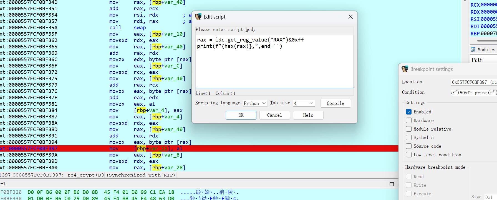

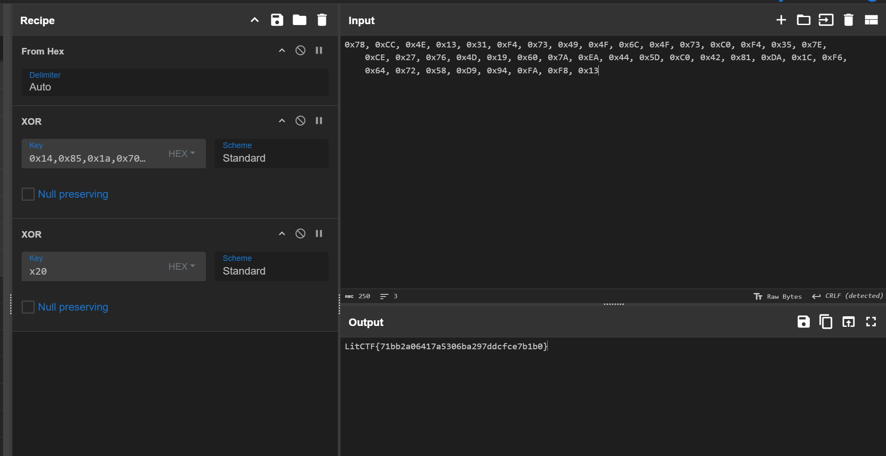

### FeatureExtraction

定位到main

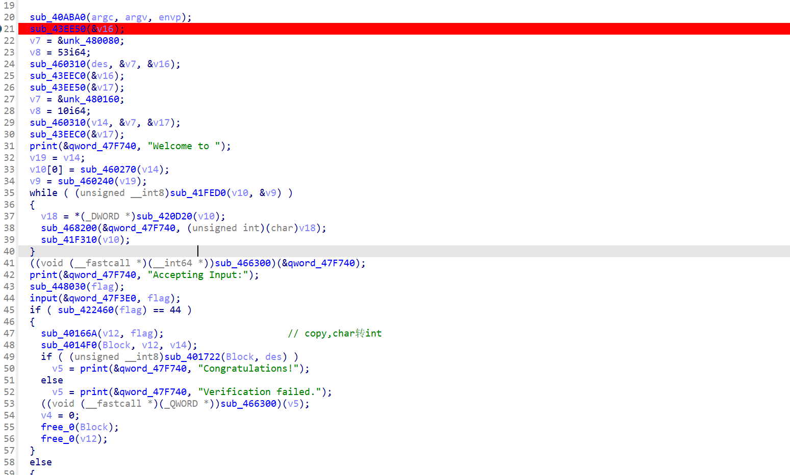

前面都是一些初始化函数以及把输入的char型字符串转成int型数据

关键加密在sub\_401722(Block, des)

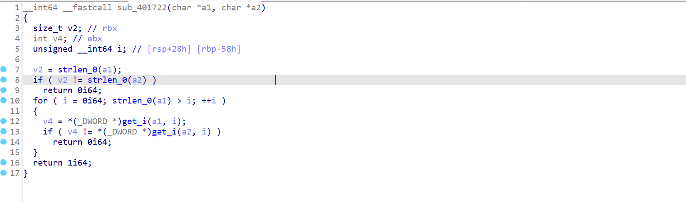

加密逻辑就是

```
unsigned int des[54]={};
 unsigned int flag[44]={};
 for(int i=0;i<44;i++){
     for(int j=0;j<10;j++){
         des[i+j]+=flag[i]*key[j];
     }
 }
```

类似于卷积操作

用numpy解

```
import numpy as np
 
 # -------------------------------
 # 已知常量
 # -------------------------------
 key = np.array([
     0x4C, 0x69, 0x74, 0x43, 0x54, 0x46, 0x32, 
     0x30, 0x32, 0x35
 ], dtype=np.float64)
 
 des = np.array([
     0x00001690,0x00003E58,0x00006FF1,0x000086F0,0x00009D66,
     0x0000AB30,0x0000CA71,0x0000CF29,0x0000E335,0x0000E492,
     0x0000F1FD,0x0000DE80,0x0000D0C8,0x0000C235,0x0000B9B5,
     0x0000B1CF,0x00009E9F,0x00009E86,0x000096B4,0x0000A550,
     0x0000A0D3,0x0000A135,0x000099CA,0x0000ACC0,0x0000BE78,
     0x0000C196,0x0000BC00,0x0000B5C3,0x0000B7F0,0x0000B465,
     0x0000B673,0x0000B71F,0x0000BBE2,0x0000CB4F,0x0000D2AD,
     0x0000DE20,0x0000EC94,0x0000FC30,0x000104B8,0x0000F6EE,
     0x0000EDC9,0x0000E385,0x0000D78B,0x0000DE19,0x0000C94C,
     0x0000AD14,0x00007E88,0x00006BB9,0x00004CC6,0x00003806,
     0x00002DC9,0x00002398,0x000019E1,0x00000000,
 ], dtype=np.float64)
 
 # -------------------------------
 # 解密逻辑（最小二乘法手动实现）
 # -------------------------------
 num_flag = 44
 num_key = len(key)
 num_des = len(des)
 
 # 构造 A 矩阵
 A = np.zeros((num_des, num_flag), dtype=np.float64)
 for i in range(num_flag):
     for j in range(num_key):
         if i + j < num_des:
             A[i + j][i] = key[j]
 
 # 计算正规方程解: x = (AᵗA)^(-1)Aᵗb
 At = A.T
 AtA = np.matmul(At, A)
 Atb = np.matmul(At, des)
 
 # 解线性方程 AtA * x = Atb
 flag_float = np.linalg.solve(AtA, Atb)
 flag = np.round(flag_float).astype(np.uint32)
 
 # -------------------------------
 # 输出结果
 # -------------------------------
 flag_str = ''.join(chr(c) for c in flag)
 print("Recovered flag:")
 print(flag_str)
 
 #LitCTF{1e5a6230-308c-47cf-907c-4bfafdec8296}
```

### eazy\_tea

有些花指令，清理后反编译代码如下：

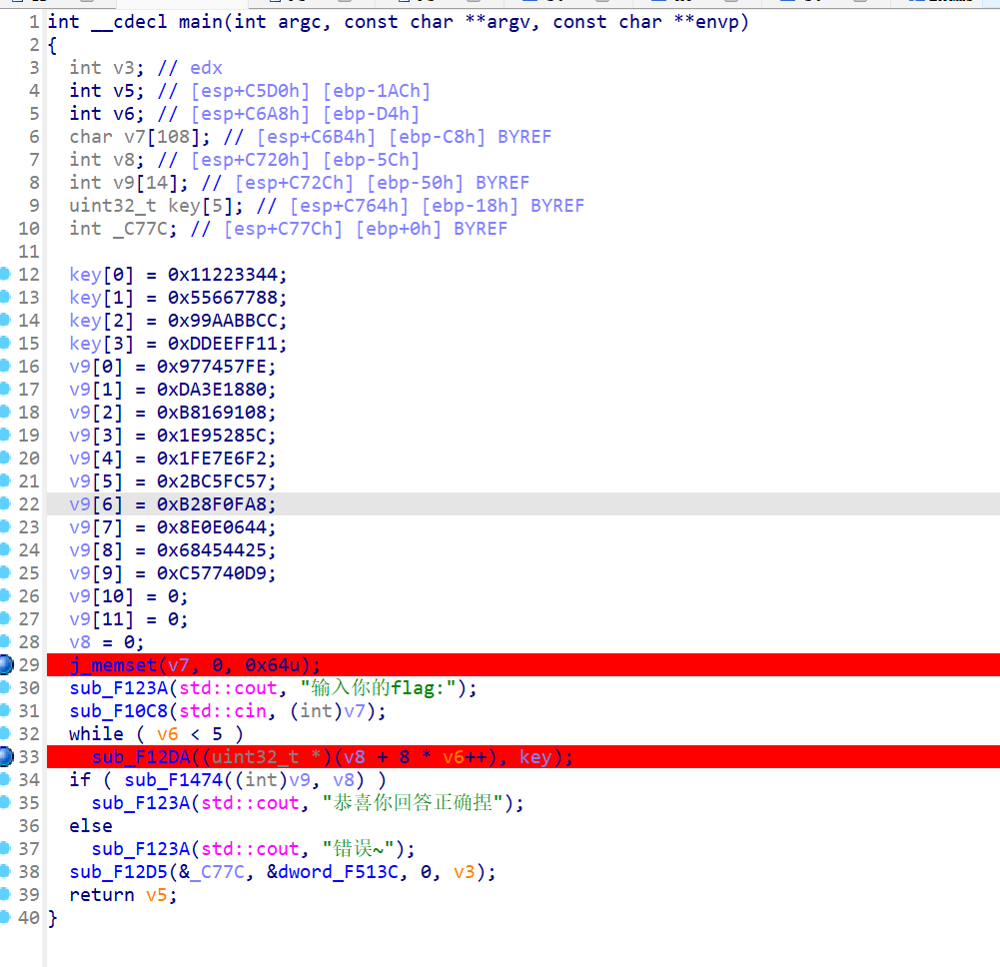

加密逻辑：

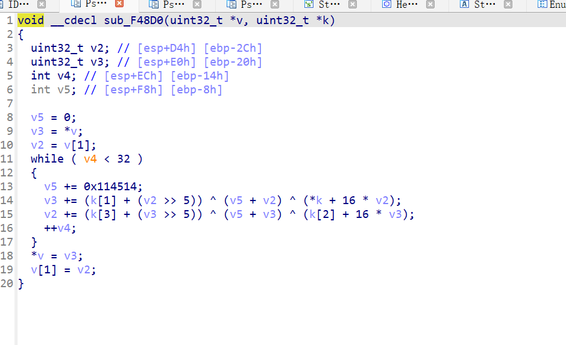

经典TEA，脚本一把梭

```
#include<stdio.h>
 #include<stdint.h>
 void decrypt (uint32_t *v,uint32_t *k){
     uint32_t v0=v[0],v1=v[1];
     uint32_t sum=0x114514*32;
     uint32_t i;//这里的sum是0x9e3779b9*32后截取32位的结果，截取很重要。
     uint32_t delta=0x114514;
     uint32_t k0=k[0],k1=k[1],k2=k[2],k3=k[3];
     for (i=0;i<32;i++){
         v1-=((v0<<4)+k2)^(v0+sum)^((v0>>5)+k3);
         v0-=((v1<<4)+k0)^(v1+sum)^((v1>>5)+k1);
         sum-=delta;
     }
     v[0]=v0;v[1]=v1;
 }
 
 
 int main(){
     uint32_t key[]={
         0x11223344, 0x55667788, 0x99AABBCC, 0xDDEEFF11
         };
     uint32_t v9[10];
     v9[0] = 0x977457FE;
     v9[1] = 0xDA3E1880;
     v9[2] = 0xB8169108;
     v9[3] = 0x1E95285C;
     v9[4] = 0x1FE7E6F2;
     v9[5] = 0x2BC5FC57;
     v9[6] = 0xB28F0FA8;
     v9[7] = 0x8E0E0644;
     v9[8] = 0x68454425;
     v9[9] = 0xC57740D9;
     v9[10] = 0;
     v9[11] = 0;
     for(int i=0;i<12;i+=2){
         decrypt(v9+i,key);
     }
     uint8_t *flag=(uint8_t*)v9;
     for(int i=0;i<48;i++){
         printf("%c",flag[i]);
     }
     return 0;
 }
 //LitCTF{590939df61690383a47ed1bc6ade9d51}
```

补：去花指令

典型的jz和jnz条件跳转，双击loc\_C95069

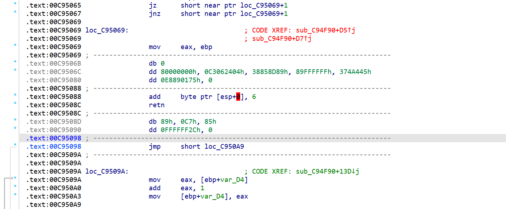

mov eax,ebp处按'd'查看十六进制

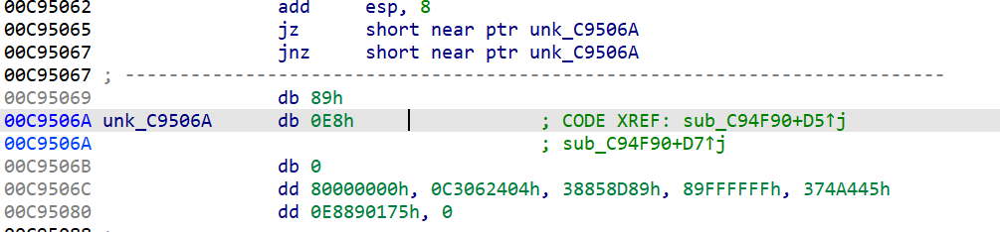

显然程序无论如何都不会执行89h，所以nop掉，另外其实程序就是先执行add esp,8，再执行C9506A处的E8，所以jz和jnz都可以nop掉，然后在E8处按c转汇编代码

如下

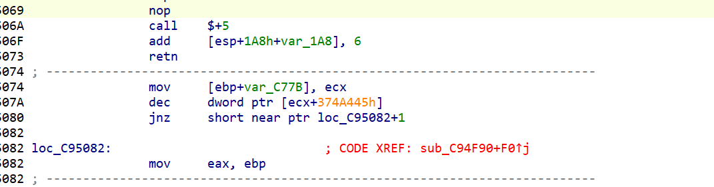

发现ida识别成了call $+5，其实就是call 6F，这里有一种方法很容易过这种花指令，原理是花指令只是用来阻碍逆向分析者的，它对程序的正常执行逻辑不应该造成任何影响。直接上动调

先edit-functions-delete function，方便查看十六进制

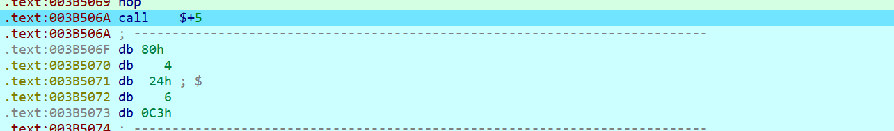

程序执行到这里，然后按f7，观察程序eip的值

这里选yes

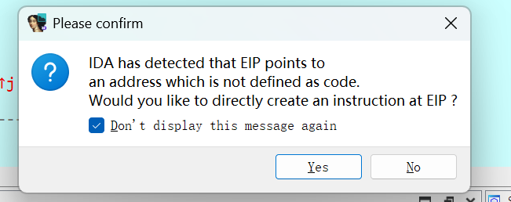

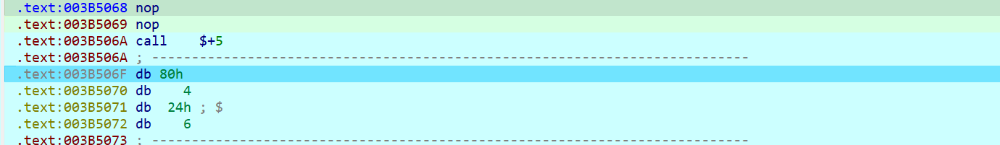

发现要执行003B506F，按c转汇编，继续f7

下一步执行return ，继续。保留

下面jnz直接跟着程序走，看它到哪里

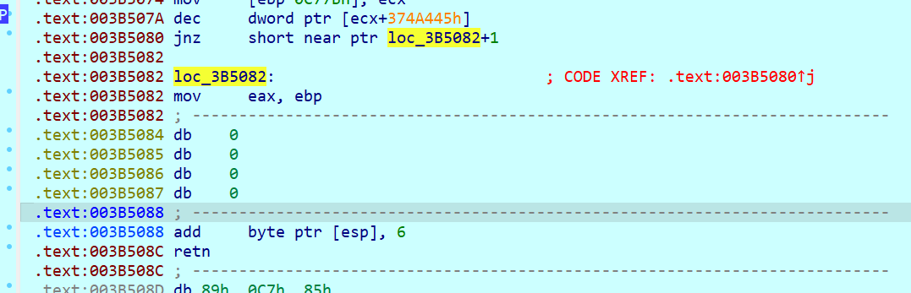

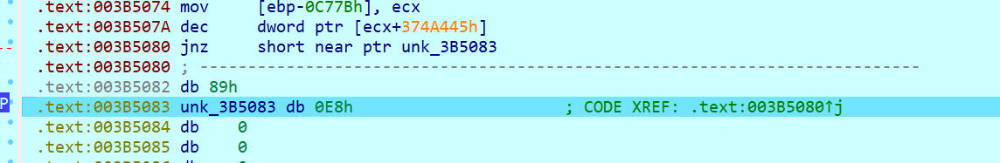

发现是到3B5083，所以前面的没用，nop掉(包括jnz)

又是一个call $+5，做一样的处理

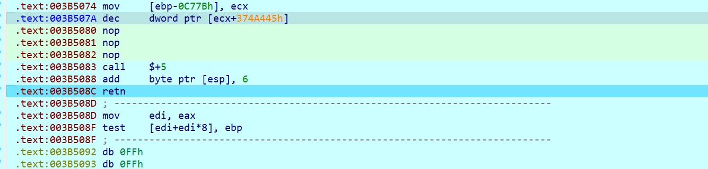

执行到test [edi+edi\*8], ebp时报错，直接nop

最后发现其实是把从最开始jz和jnz到最后的jmp全部nop

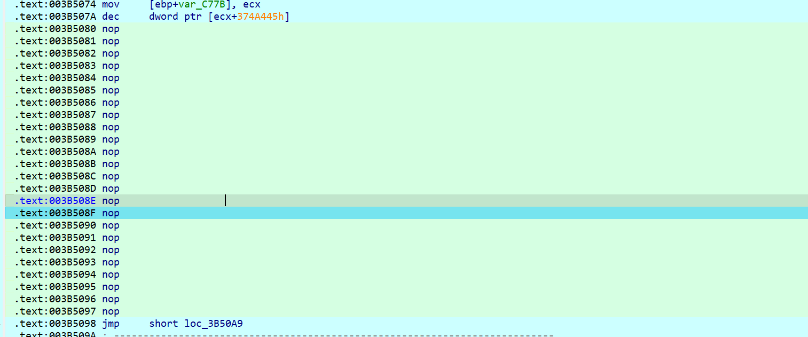

重新构造函数，如最开始的图，基本上没问题

TEA加密函数里面同理，都是一样的花

### pickle

给了一个`challenge.pkl`文件，上网一查才知道是python序列化后的文件

#### **知识点：**

`.pkl` 文件是通过 Python 的 `pickle` **模块** 创建的，用于将 Python 中的对象（如列表、字典、模型、类实例等）**序列化（即转换成二进制格式）后保存到磁盘**，便于之后再反序列化（读取回来）使用。

在很多任务中，我们可能会需要把一些内容存储起来，以备后续利用。如果我们要存储的内容只是一条字符串或是数字，那么我们只需要把它写进文件就行。然而，如果我们需要存储的东西是一个dict、一个list，甚至一个对象：

　　要把这样的dairy实例`today`存放在文件里，日后还要支持随时导入，就是很麻烦的事情了。通行的做法是：通过一套方案，把这个`today` **翻译**成一个字符串，然后把字符串写进文件；读取的时候，通过读文件拿到字符串，然后**翻译**成`dairy`类的一个实例。

　　我们把“对象 - 字符串”的翻译过程称为“序列化”；相应地，把“字符串 - 对象”的过程称为“反序列化” 。需要保存一个对象的时候，就把它序列化变成字符串；需要从字符串中提取一个对象的时候，就把它反序列化。各大语言都有序列化库，而很多时候，**不恰当的反序列化会成为攻击的目标**。在后文我们将深入探讨其利用方式。

```
class dairy():
 date = 20191029
 text = "今天哈尔滨冷死人了QAQ"
 todo = ['大物实验报告', 'CTF题', 'CSAPP作业']

today = dairy()
```

|  |  |
| --- | --- |
| 用途 | 说明 |
| 保存训练好的机器学习模型 | 如使用`scikit-learn`,`XGBoost`等库训练出的模型，保存为`.pkl`文件以便部署。 |
| 缓存计算结果 | 对复杂计算结果进行缓存，避免重复计算。 |
| 传输 Python 对象 | 将复杂结构的对象保存成文件，在另一台机器或会话中读取。 |

* 生成.pkl

```
import pickle

data = {'name': 'chatgpt', 'type': 'AI', 'version': 4.5}

with open('data.pkl', 'wb') as f:
    pickle.dump(data, f)
```

* 读取.pkl

```
import pickle

with open('data.pkl', 'rb') as f:
    data = pickle.load(f)

print(data)  # 输出：{'name': 'chatgpt', 'type': 'AI', 'version': 4.5}
```

* 反序列化.pkl

```
import dill
import dis
with open('file.pkl', 'rb') as f:
    data = dill.load(f)
    dis.dis(data)
print(data)
```

还有一个工具：`pickltools`

`pickletools` 是 Python 自带的一个 **工具模块**，用于对 `.pkl` 文件进行 **反汇编**，以查看它内部的序列化指令，而**不执行反序列化\*\*\*\*过程本身**。

```
import pickletools

with open('file.pkl', 'rb') as f:
    pickletools.dis(f)
```

#### 解题

回到正题

拿`pickletools`反汇编目标文件

```
import pickletools
filename = 'challenge.pickle'

with open(filename, 'rb') as f:
    data = f.read()
pickletools.dis(data)
```

看到如下输出（只截取一部分）

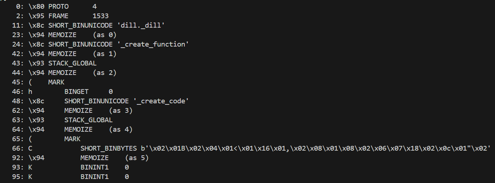

可以看出这是一个通过 `dill` 库保存的对象，且该对象包含一个**自定义函数**或与函数相关的构造

执行反序列化脚本，得到以下结果（只截取一部分）

```
 5           0 RESUME                   0

  6           2 LOAD_GLOBAL              1 (NULL + input)
             14 LOAD_CONST               1 ('input your flag > ')
             16 PRECALL                  1
             20 CALL                     1
             30 LOAD_METHOD              1 (encode)
             52 PRECALL                  0
             56 CALL                     0
             66 STORE_FAST               0 (user_input)

  8          68 BUILD_LIST               0
             70 STORE_FAST               1 (decrypted)

  9          72 LOAD_GLOBAL              5 (NULL + range)
             84 LOAD_GLOBAL              7 (NULL + len)
             96 LOAD_FAST                0 (user_input)
             98 PRECALL                  1
            102 CALL                     1
            112 PRECALL                  1
            116 CALL                     1
            126 GET_ITER
        >>  128 FOR_ITER                34 (to 198)
            130 STORE_FAST               2 (i)

 10         132 LOAD_FAST                0 (user_input)
            134 LOAD_FAST                2 (i)
            136 BINARY_SUBSCR
            146 LOAD_CONST               2 (6)
            148 BINARY_OP               10 (-)
            152 STORE_FAST               3 (b)

 11         154 LOAD_FAST                1 (decrypted)
            156 LOAD_METHOD              4 (append)
            178 LOAD_FAST                3 (b)
            180 PRECALL                  1
            184 CALL                     1
            194 POP_TOP
            196 JUMP_BACKWARD           35 (to 128)

 13     >>  198 BUILD_LIST               0
            200 LOAD_CONST               3 ((85, 84, 174, 227, 132, 190, 207, 142, 77, 24, 235, 236, 231, 213, 138, 153, 60, 29, 241, 241, 237, 208, 144, 222, 115, 16, 242, 239, 231, 165, 157, 224, 56, 104, 242, 128, 250, 211, 150, 225, 63, 29, 242, 169))
            202 LIST_EXTEND              1
            204 STORE_FAST               4 (fflag)

 14         206 BUILD_LIST               0
            208 LOAD_CONST               4 ((19, 55, 192, 222, 202, 254, 186, 190))
            210 LIST_EXTEND              1
            212 STORE_FAST               5 (key_ints)

 16         214 LOAD_CONST               5 (<code object encrypt at 0x000001F093ACEFA0, file "d:\code\PYTHON\IPParser1.py", line 16>)
            216 MAKE_FUNCTION            0
            218 STORE_FAST               6 (encrypt)

 23         220 PUSH_NULL
            222 LOAD_FAST                6 (encrypt)
            224 LOAD_FAST                4 (fflag)
            226 LOAD_FAST                5 (key_ints)
            228 PRECALL                  2
            232 CALL                     2
            242 STORE_FAST               7 (encrypted_flag)

 25         244 LOAD_FAST                1 (decrypted)
            246 LOAD_FAST                7 (encrypted_flag)
            248 COMPARE_OP               2 (==)
            254 POP_JUMP_FORWARD_IF_FALSE    17 (to 290)

 26         256 LOAD_GLOBAL             11 (NULL + print)
            268 LOAD_CONST               6 ('Good job! You made it!')
            270 PRECALL                  1
            274 CALL                     1
            284 POP_TOP
            286 LOAD_CONST               0 (None)
            288 RETURN_VALUE

 28     >>  290 LOAD_GLOBAL             11 (NULL + print)
            302 LOAD_CONST               7 ("Nah, don't give up!")
            304 PRECALL                  1
            308 CALL                     1
            318 POP_TOP
            320 LOAD_CONST               0 (None)
            322 RETURN_VALUE

Disassembly of <code object encrypt at 0x000001F093ACEFA0, file "d:\code\PYTHON\IPParser1.py", line 16>:
 16           0 RESUME                   0

 17           2 BUILD_LIST               0
              4 STORE_FAST               2 (result)

 18           6 LOAD_GLOBAL              1 (NULL + range)
             18 LOAD_GLOBAL              3 (NULL + len)
             30 LOAD_FAST                0 (flag_bytes)
             32 PRECALL                  1
             36 CALL                     1
             46 PRECALL                  1
             50 CALL                     1
             60 GET_ITER
        >>   62 FOR_ITER                56 (to 176)
             64 STORE_FAST               3 (i)

 19          66 LOAD_FAST                0 (flag_bytes)
             68 LOAD_FAST                3 (i)
             70 BINARY_SUBSCR
             80 LOAD_FAST                1 (key)
             82 LOAD_FAST                3 (i)
             84 LOAD_GLOBAL              3 (NULL + len)
             96 LOAD_FAST                1 (key)
             98 PRECALL                  1
            102 CALL                     1
            112 BINARY_OP                6 (%)
            116 BINARY_SUBSCR
            126 BINARY_OP               12 (^)
            130 STORE_FAST               4 (b)

 20         132 LOAD_FAST                2 (result)
            134 LOAD_METHOD              2 (append)
            156 LOAD_FAST                4 (b)
            158 PRECALL                  1
            162 CALL                     1
            172 POP_TOP
            174 JUMP_BACKWARD           57 (to 62)

 21     >>  176 LOAD_FAST                2 (result)
            178 RETURN_VALUE
<function make_challenge.<locals>.check at 0x000001F09349CF40>
```

就纯读汇编，逻辑就是输入的明文逐字符-6再循环异或key值与目标内容比较

解密脚本：

```
encrypted_flag = [
    85, 84, 174, 227, 132, 190, 207, 142, 77, 24, 235, 236, 231, 213, 138, 153, 60, 29, 241, 241, 237, 208, 144, 222, 115, 16, 242, 239, 231, 165, 157, 224, 56, 104, 242, 128, 250, 211, 150, 225, 63, 29, 242, 169
]

key_ints = [19, 55, 192, 222, 202, 254, 186, 190]  # 8字节密钥

flag = []
# 尝试不同的起始位置
flag = []
for i in range(len(encrypted_flag)):
    decrypted = (encrypted_flag[i] ^ key_ints[(i) % len(key_ints)])+6
    flag.append(chr(decrypted))

print(''.join(flag))  # 输出解密后的flag
#LitCTF{6d518316-5075-40ff-873a-d1e8d632e208}
```

‍

### Robbie Wanna Revenge

#### 解法1

先上最快的解法（感觉是非预期了）

拿到文件，是il2cpp编译的游戏，打开用CE附加

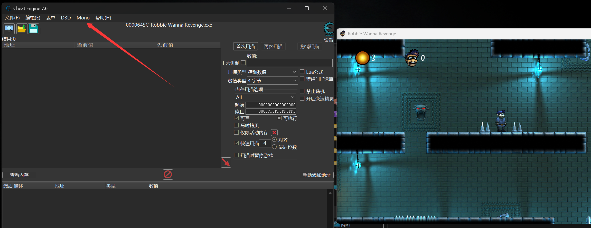

发现可以使用`mono`功能

激活、分析

在`Assembly-CSharp.dll`下找到`GameManager`

`methods`下可以看到`PlayerWon`方法

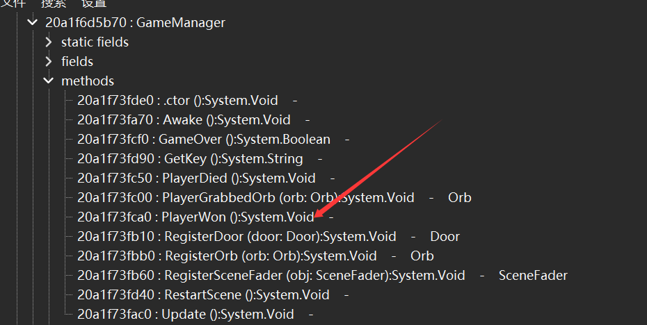

右键、执行、确定，弹flag

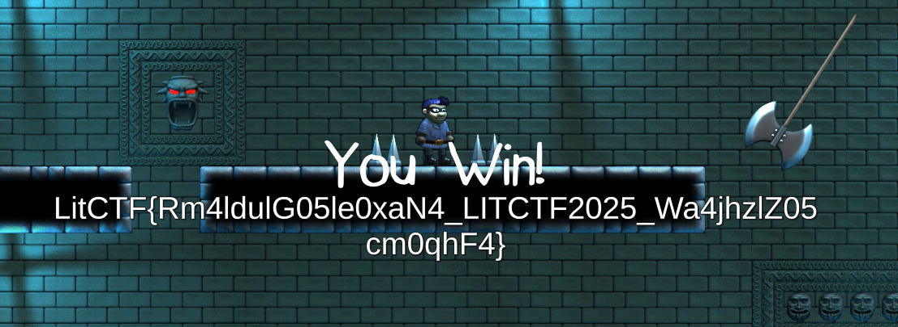

LitCTF{Rm4ldulG05le0xaN4\_LITCTF2025\_Wa4jhzlZ05cm0qhF4}

其实就是CE附加后主动调用了`PlayerWon`方法，而不是等游戏通关后调。

#### 常规解法

参考：[unity引擎基于Windows下的il2cpp逆向初探——以CTF赛题为例-先知社区](https://xz.aliyun.com/news/15811)

下载Il2CppDumper

运行`Il2CppDumper.exe`，分别选择`GameAssembly.dll`和`global-metadata.dat`，但会报错，原因是`GameAssembly.dll`被加壳了

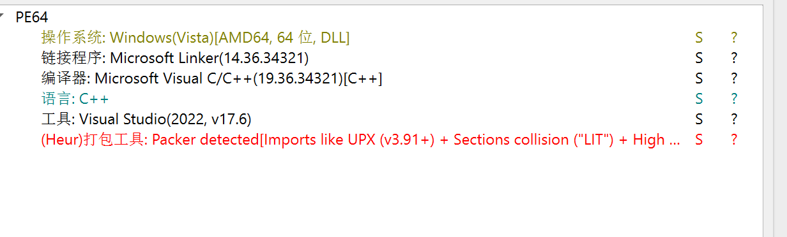

upx脱壳还报错

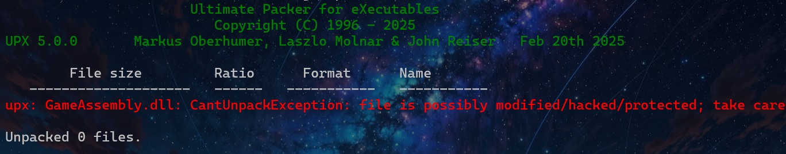

看来是有魔改，010查看，发现UPX标志位被改成了LIT，改回来即可正常脱壳

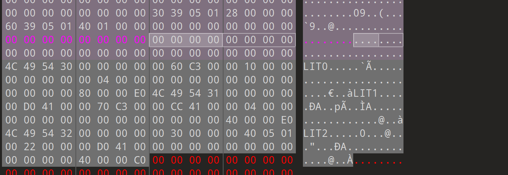

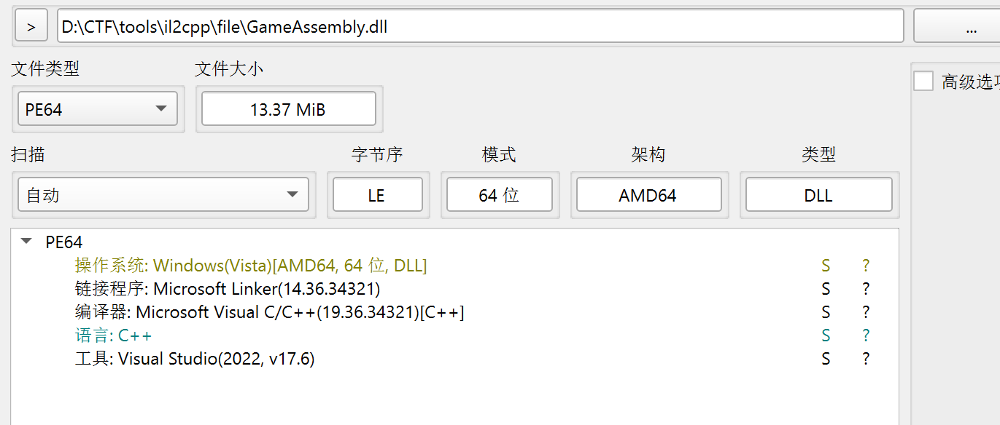

重新拿Il2CppDumper分析，输出Done后把输出的文件放到一个文件夹里

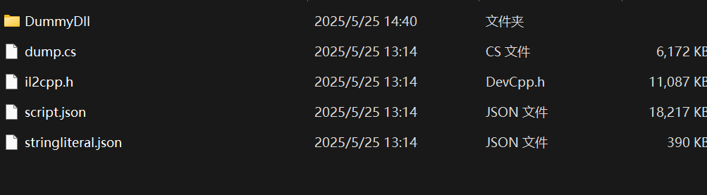

DummyDII文件夹下有`Assembly-CSharp.dll`，dnspy分析可以看到`Cipher方法`

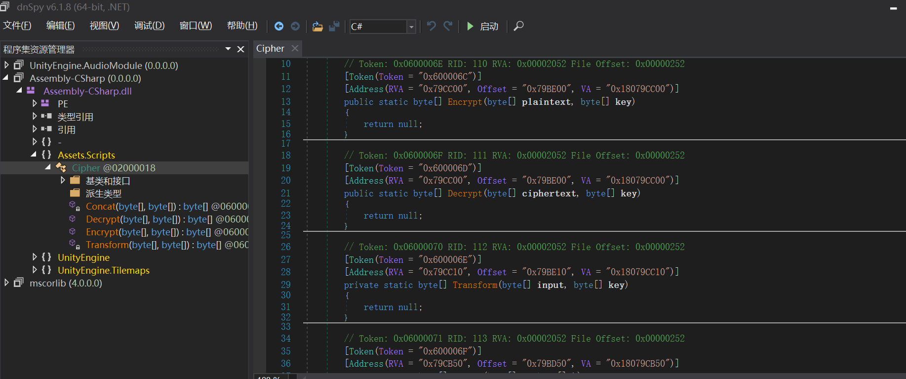

ida分析`GameAssembly.dll`

`alt+f7`执行`ida_with_struct_py3.py`，选择`script.json`，再选`il2cpp.h`，等一会儿ida即可恢复大部分符号

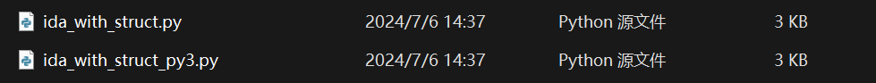

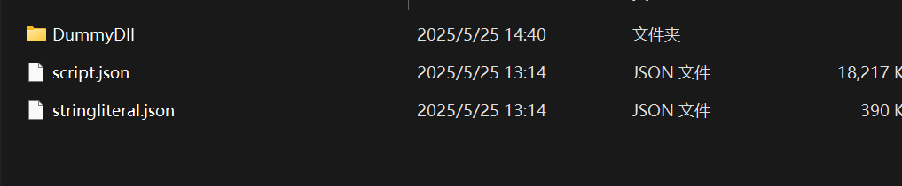

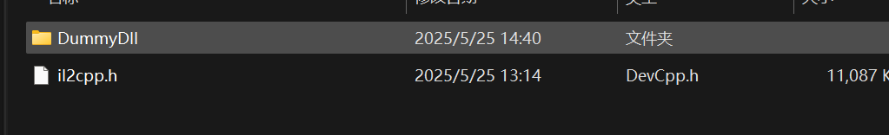

这时再去搜刚在看到的关键方法`Cipher`

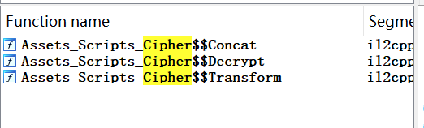

找到核心解密逻辑

```
System_Byte_array *__stdcall Assets_Scripts_Cipher__Decrypt(
        System_Byte_array *ciphertext,
        System_Byte_array *key,
        const MethodInfo *method)
{
  return Assets_Scripts_Cipher__Transform(ciphertext, key, 0i64);
}
System_Byte_array *__stdcall Assets_Scripts_Cipher__Transform(
        System_Byte_array *input,
        System_Byte_array *key,
        const MethodInfo *method)
{
  unsigned __int16 v4; // bx
  __int64 v5; // r13
  __int64 v6; // r8
  System_Byte_array *v7; // rdi
  int v8; // esi
  int32_t v9; // r15d
  __int64 v10; // rdx
  __int64 v11; // r8
  System_Security_Cryptography_HashAlgorithm_o *v12; // r12
  int v13; // r14d
  System_Byte_array *v14; // r9
  int32_t v15; // edi
  __int64 v16; // rdx
  System_Byte_array *Bytes_6446108288; // rdi
  __int64 v18; // r8
  __int64 v19; // r9
  System_Array_o *v20; // rsi
  __int64 v21; // rdx
  __int64 v22; // r8
  __int64 v23; // r9
  unsigned int v24; // eax
  char *v25; // rsi
  __int64 v26; // r14
  System_Security_Cryptography_HashAlgorithm_c *klass; // r10
  uint16_t interface_offsets_count; // dx
  Il2CppRuntimeInterfaceOffsetPair *interfaceOffsets; // r8
  __int64 v30; // rax
  System_ArgumentNullException_o *v32; // rbx
  __int64 v33; // rax
  __int64 v34; // rax
  __int64 v35; // rax
  System_ArgumentNullException_o *v36; // rbx
  char v37[16]; // [rsp+20h] [rbp-10h] BYREF
  unsigned int max_length; // [rsp+30h] [rbp+0h]
  char *v39; // [rsp+38h] [rbp+8h]
  __int64 v40; // [rsp+40h] [rbp+10h]
  __int64 v41; // [rsp+48h] [rbp+18h]
  System_Security_Cryptography_HashAlgorithm_o *v42; // [rsp+50h] [rbp+20h]
  char *v43; // [rsp+58h] [rbp+28h]
  System_Array_o *src; // [rsp+B8h] [rbp+88h]

  src = (System_Array_o *)key;
  if ( !byte_7FFAFA19A696 )
  {
    sub_7FFAF95C15E0(3647i64);
    byte_7FFAFA19A696 = 1;
    key = (System_Byte_array *)src;
  }
  v4 = 0;
  v40 = 0i64;
  v39 = v37;
  v43 = v37;
  if ( !input )
  {
    v32 = (System_ArgumentNullException_o *)sub_7FFAF95575D0(System_ArgumentNullException_TypeInfo, key, method);
    System_ArgumentNullException___ctor_6444969648(v32, StringLiteral_1524, 0i64);
    sub_7FFAF95575E0(v32, 0i64, Method_Assets_Scripts_Cipher_Transform__);
  }
  if ( !key )
  {
    v36 = (System_ArgumentNullException_o *)sub_7FFAF95575D0(System_ArgumentNullException_TypeInfo, 0i64, method);
    System_ArgumentNullException___ctor_6444969648(v36, StringLiteral_228, 0i64);
    sub_7FFAF95575E0(v36, 0i64, Method_Assets_Scripts_Cipher_Transform__);
  }
  max_length = input->max_length;
  v5 = il2cpp_array_new_specific_0(byte___TypeInfo, max_length, method);
  v41 = v5;
  v7 = (System_Byte_array *)il2cpp_array_new_specific_0(byte___TypeInfo, 0i64, v6);
  v8 = 0;
  v9 = 0;
  v12 = (System_Security_Cryptography_HashAlgorithm_o *)System_Security_Cryptography_SHA256__Create(0i64);// 创建 SHA256 对象
  v42 = v12;
  v13 = 0;
  v14 = input;
  while ( v13 < (int)max_length )
  {
    if ( !v7 )
      sub_7FFAF95EBCE0(0i64, v10, v11, v14);
    if ( v8 < SLODWORD(v7->max_length) )
    {
      v24 = v8;
    }
    else
    {
      v15 = v9++;
      if ( (System_BitConverter_TypeInfo->_2.bitflags2 & 2) != 0 && !System_BitConverter_TypeInfo->_2.cctor_finished )
        il2cpp_runtime_class_init_0(System_BitConverter_TypeInfo, v10, v11, v14);
      Bytes_6446108288 = System_BitConverter__GetBytes_6446108288(v15, 0i64);
      if ( !byte_7FFAFA19A697 )
      {
        sub_7FFAF95C15E0(3646i64);
        byte_7FFAFA19A697 = 1;
      }
      if ( !Bytes_6446108288 )
        sub_7FFAF95EBCE0(0i64, v16, v18, v19);
      v20 = (System_Array_o *)il2cpp_array_new_specific_0(
                                byte___TypeInfo,
                                (unsigned int)(LODWORD(Bytes_6446108288->max_length) + LODWORD(src[1].klass)),
                                v18);
      System_Buffer__BlockCopy(src, 0, v20, 0, (int32_t)src[1].klass, 0i64);
      System_Buffer__BlockCopy(
        (System_Array_o *)Bytes_6446108288,
        0,
        v20,
        (int32_t)src[1].klass,
        Bytes_6446108288->max_length,
        0i64);
      if ( !v12 )
        sub_7FFAF95EBCE0(0i64, v21, v22, v23);
      v7 = System_Security_Cryptography_HashAlgorithm__ComputeHash(v12, (System_Byte_array *)v20, 0i64);
      v8 = 0;
      v24 = 0;
      v14 = input;
    }
    if ( (unsigned int)v13 >= LODWORD(v14->max_length) )
    {
      v33 = sub_7FFAF95EA830(v13);
      sub_7FFAF95EBC70(v33, 0i64, 0i64);
    }
    v10 = v8++;
    if ( !v7 )
      sub_7FFAF95EBCE0(0i64, v10, v11, v14);
    if ( v24 >= LODWORD(v7->max_length) )
    {
      v34 = sub_7FFAF95EA830(v13);
      sub_7FFAF95EBC70(v34, 0i64, 0i64);
    }
    if ( !v5 )
      sub_7FFAF95EBCE0(0i64, v10, v11, v14);
    if ( (unsigned int)v13 >= *(_DWORD *)(v5 + 24) )
    {
      v35 = sub_7FFAF95EA830(v13);
      sub_7FFAF95EBC70(v35, 0i64, 0i64);
    }
    *(_BYTE *)(v13 + v5 + 32) = v14->m_Items[v13] ^ v7->m_Items[v10];// 关键异或
    ++v13;
  }
  v25 = v39;
  *(_DWORD *)v39 = 139;
  v26 = v40;
  if ( v12 )
  {
    klass = v12->klass;
    interface_offsets_count = v12->klass->_2.interface_offsets_count;
    if ( interface_offsets_count )
    {
      interfaceOffsets = klass->_1.interfaceOffsets;
      while ( (System_IDisposable_c *)interfaceOffsets[v4].interfaceType != System_IDisposable_TypeInfo )
      {
        if ( ++v4 >= interface_offsets_count )
          goto LABEL_29;
      }
      v30 = (__int64)&klass->vtable + 16 * (unsigned int)interfaceOffsets[v4].offset;
    }
    else
    {
LABEL_29:
      v30 = sub_7FFAF95B6850(v12, System_IDisposable_TypeInfo, 0i64);
    }
    (*(void (__fastcall **)(System_Security_Cryptography_HashAlgorithm_o *, _QWORD))v30)(v12, *(_QWORD *)(v30 + 8));
  }
  if ( *(_DWORD *)v25 != 139 && v26 )
    sub_7FFAF95575E0(v26, 0i64, 0i64);
  return (System_Byte_array *)v5;
}
```

是一个 **基于变换密钥的伪随机流加密器**

利用 `SHA256(key || counter)` 作为伪随机字节流再与input异或即为flag

问题在于找`key`和`input`

当时就卡在这里了，

‍复现时发现可以从通关游戏的角度来做，找到判断角色是否是否死亡的地方

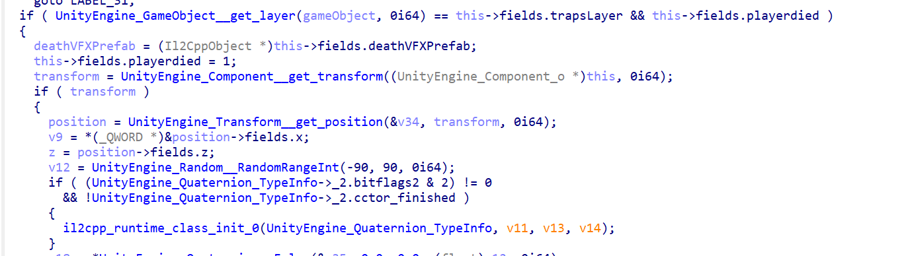

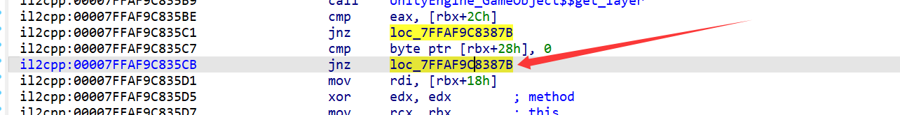

jnz改jz，就能实现无敌挂，然后就是玩游戏通关

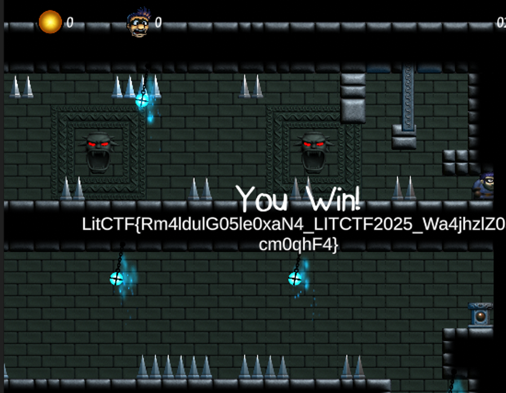

### 总结

* 贴一个比较全面的反序列化脚本

```
import dill
import dis
import types

def extract_strings(obj, result=None):
    if result is None:
        result = set()
    if isinstance(obj, str):
        result.add(obj)
    elif isinstance(obj, dict):
        for k, v in obj.items():
            extract_strings(k, result)
            extract_strings(v, result)
    elif isinstance(obj, (list, tuple, set)):
        for item in obj:
            extract_strings(item, result)
    elif hasattr(obj, '__dict__'):
        for v in vars(obj).values():
            extract_strings(v, result)
    return result

def inspect_function(func):
    print("
===== 🔍 函数反汇编 =====")
    try:
        dis.dis(func)
    except Exception as e:
        print(f"❌ 反汇编失败: {e}")

    if hasattr(func, '__code__'):
        code = func.__code__

        print("
===== 🧠 code 信息 =====")
        print(dis.code_info(code))

        print("
===== 🔢 常量区（co_consts）=====")
        for const in code.co_consts:
            print(f"- {repr(const)}")

        print("
===== 📛 名称区（co_names）=====")
        for name in code.co_names:
            print(f"- {name}")

    if hasattr(func, '__closure__') and func.__closure__:
        print("
===== 📦 闭包变量（__closure__）=====")
        for i, cell in enumerate(func.__closure__):
            try:
                print(f"- Cell[{i}]: {cell.cell_contents!r}")
            except:
                print(f"- Cell[{i}]: <无法访问>")

def analyze_object(obj):
    if callable(obj):
        inspect_function(obj)

    elif isinstance(obj, (dict, list, tuple)):
        print("
===== 📦 加载的是集合类型 (dict/list/tuple) =====")
        print("内容：")
        print(obj)

        extracted = extract_strings(obj)
        if extracted:
            print("
===== 🔍 从集合中提取的字符串 =====")
            for s in extracted:
                print(f"- {s}")

    else:
        print(f"
===== ℹ️ 其他类型对象: {type(obj)} =====")
        print(obj)

    if isinstance(obj, (list, tuple)) and all(isinstance(x, int) for x in obj):
        print("
===== 🧪 疑似字节数组（可能是加密 flag）=====")
        print(obj)
        try:
            potential_bytes = bytes(obj)
            print(f"→ Bytes: {potential_bytes}")
            print(f"→ UTF-8 解码: {potential_bytes.decode('utf-8', errors='ignore')}")
        except Exception as e:
            print(f"❌ 转换为字符串失败: {e}")

def load_and_inspect_dill_file(file_path):
    try:
        with open(file_path, 'rb') as f:
            loaded_object = dill.load(f)
            print(f"✅ 成功加载文件: {file_path}")
            analyze_object(loaded_object)

    except FileNotFoundError:
        print(f"❌ 错误: 文件未找到 '{file_path}'")
    except dill.UnpicklingError as e:
        print(f"❌ 反序列化失败: 文件可能损坏或格式非法。
详情: {e}")
    except Exception as e:
        print(f"❌ 未知错误: {e}")

# 🚀 运行分析
load_and_inspect_dill_file('challenge.pickle')
```

* CE的功能还有待探索
* 游戏逆向有很多种思路，不应只局限于常规解法

‍
