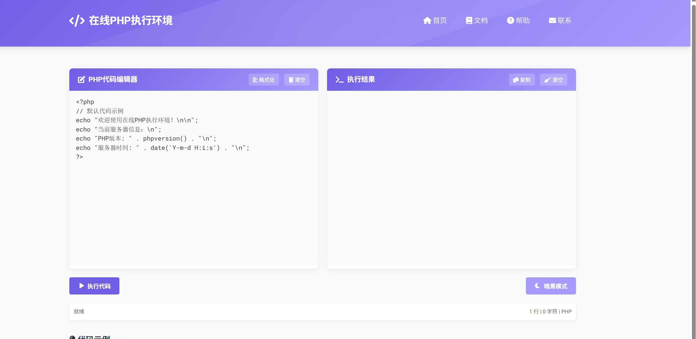
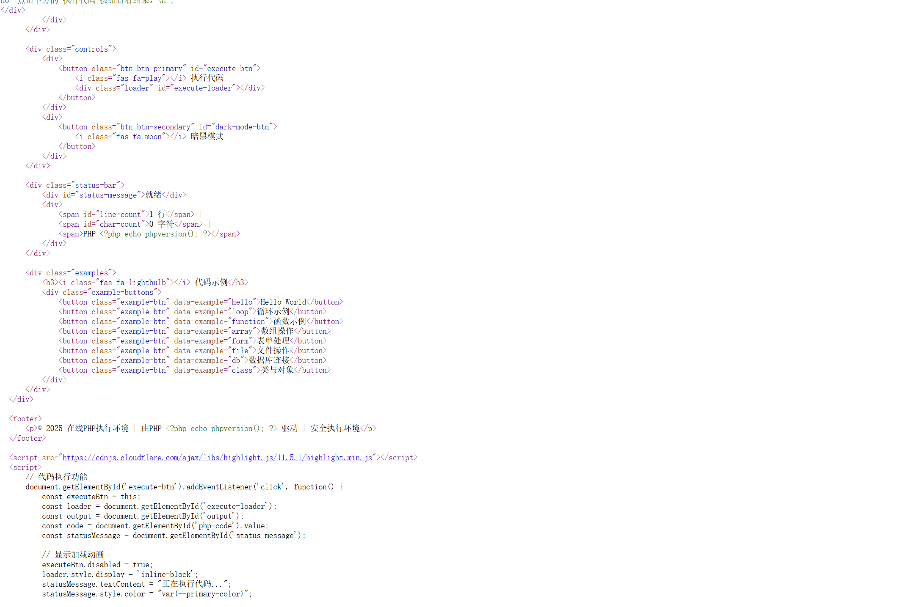
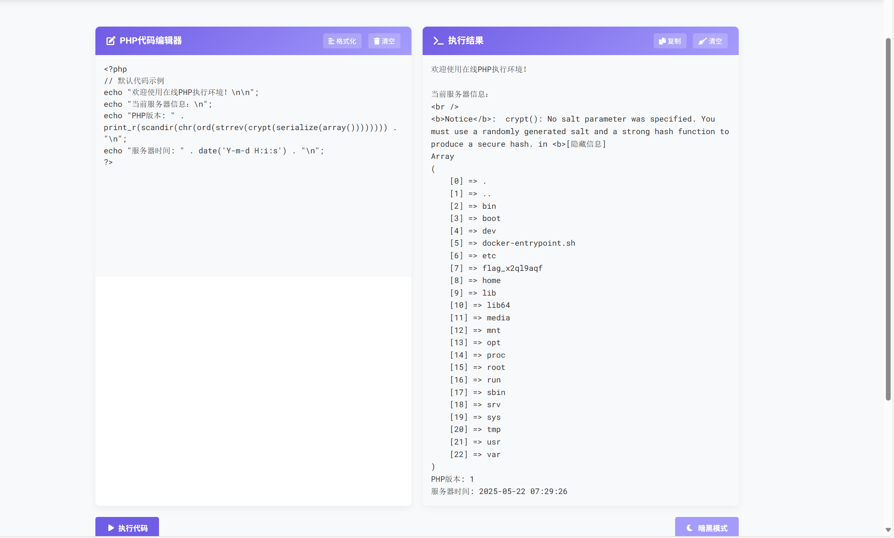
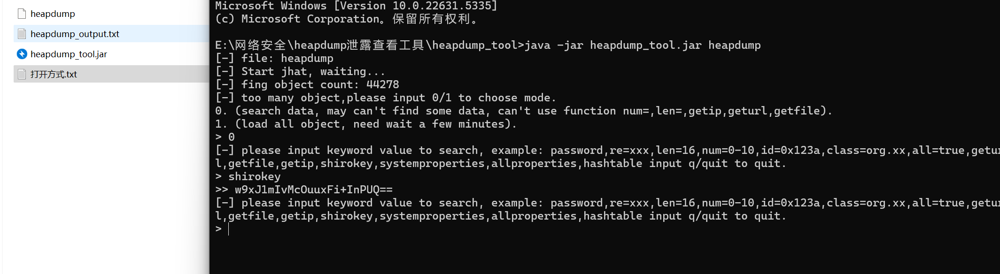
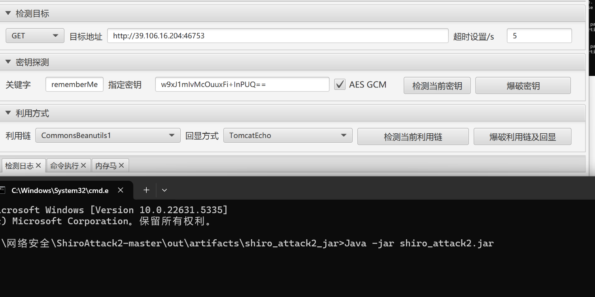

# 第三届京麒杯2025热身赛web-先知社区

> **来源**: https://xz.aliyun.com/news/18125  
> **文章ID**: 18125

---

## Eztest

在phpversion()处修改，可知为rce，多次测试使用无参rce

赌狗函数：

print\_r(scandir(chr(ord(strrev(crypt(serialize(array())))))))

多执行几次就可以得到根目录

​

​

## Ezlogin

知识：**java反序列化**，

**Spring Actuator 未授权：这个知识点可以看看这位师傅的：**[**https://xz.aliyun.com/news/9218**](https://xz.aliyun.com/news/9218)

**​**

本题首先使用扫描工具扫出/actuator/heapdump

得到heapdump文件

知识点：heapdump泄露

注意：下面两个工具都要在java8环境下打开，因为新版java版本有些东西删掉了。

然后下载工具heapdump\_tool：

<https://github.com/wyzxxz/heapdump_tool>

得到shirokey

然后下载工具shiroAttack2工具：

[项目地址:https://gitcode.com/gh\_mirrors/sh/ShiroAttack2](https://gitcode.com/gh_mirrors/sh/ShiroAttack2/?utm_source=artical_gitcode&index=top&type=card&webUrl)

先检测当前密钥，再爆破利用链及回显

然后到命令执行那里执行命令cat /f\*
