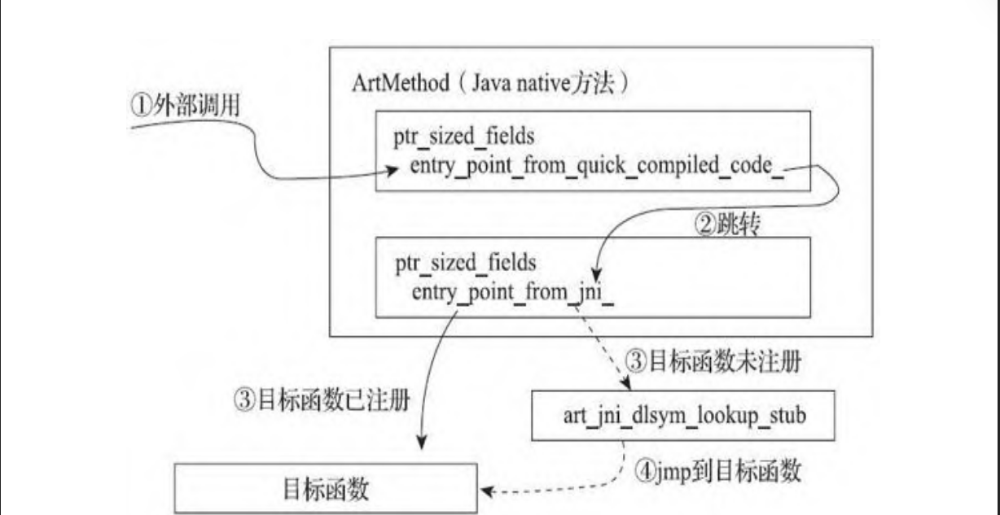

# 追踪Android方法调用1-先知社区

> **来源**: https://xz.aliyun.com/news/18128  
> **文章ID**: 18128

---

## 1. 前言

本文是为了学习如何在 AOSP 源码中插桩，以便 Trace Java 函数和 Native 函数的调用关系。以 Android10.0 为源码，根据《深入理解 Android Java 虚拟机 ART》的指导，分析了 Native 函数注册流程和 Native 函数调用 Java 函数的流程。

## 2. Java 层调用 Native 函数流程

### 2.1 Native 函数注册流程

通过类的加载流程，我们可以清晰的在 `ClassLinker::LoadClass` 中知晓 `ClassLinker::LinkCode` 在解释模式下如何注册函数，

```
static void LinkCode(ClassLinker* class_linker,
                     ArtMethod* method,
                     const OatFile::OatClass* oat_class,
                     uint32_t class_def_method_index) REQUIRES_SHARED(Locks::mutator_lock_) {
  ScopedAssertNoThreadSuspension sants(__FUNCTION__);
  Runtime* const runtime = Runtime::Current();

  // Install entry point from interpreter.
  const void* quick_code = method->GetEntryPointFromQuickCompiledCode();
  bool enter_interpreter = class_linker->ShouldUseInterpreterEntrypoint(method, quick_code);


  if (method->IsStatic() && !method->IsConstructor()) {
    // For static methods excluding the class initializer, install the trampoline.
    // It will be replaced by the proper entry point by ClassLinker::FixupStaticTrampolines
    // after initializing class (see ClassLinker::InitializeClass method).
    method->SetEntryPointFromQuickCompiledCode(GetQuickResolutionStub());
  } else if (quick_code == nullptr && method->IsNative()) {
    method->SetEntryPointFromQuickCompiledCode(GetQuickGenericJniStub());
  } else if (enter_interpreter) {
    // Set entry point from compiled code if there's no code or in interpreter only mode.
    method->SetEntryPointFromQuickCompiledCode(GetQuickToInterpreterBridge());
  }
```

其中包括了静态方法的注册和 Native 方法的注册，如下所示，Native 方法通过 `GetQuickGenericJniStub()` 进行注册，真实调用的方法则是平台相关的汇编代码：`art_quick_generic_jni_trampoline`。

```
extern "C" void art_quick_generic_jni_trampoline(ArtMethod*);
static inline const void* GetQuickGenericJniStub() {
  return reinterpret_cast<const void*>(art_quick_generic_jni_trampoline);
}
```

进入 `art_quick_generic_jni_trampoline`，这里我们以 arm64 为例。如下所示，通过 `artQuickGenericJniTrampoline` 计算 Native 函数所需要的栈空间，准备 Native 函数的参数，然后将 native 函数的地址保存到 x0 寄存器，再通过 `blr xIP0` 执行。

```
ENTRY art_quick_generic_jni_trampoline
    SETUP_SAVE_REFS_AND_ARGS_FRAME_WITH_METHOD_IN_X0

    // This looks the same, but is different: this will be updated to point to the bottom
    // of the frame when the handle scope is inserted.
    mov xFP, sp

    mov xIP0, #5120
    sub sp, sp, xIP0

    // prepare for artQuickGenericJniTrampoline call
    // (Thread*,  SP)
    //    x0      x1   <= C calling convention
    //   xSELF    xFP  <= where they are

    mov x0, xSELF   // Thread*
    mov x1, xFP
    bl artQuickGenericJniTrampoline  // (Thread*, sp)

    // Save the code pointer
    mov xIP0, x0

    // Load parameters from frame into registers.
    // TODO Check with artQuickGenericJniTrampoline.
    //      Also, check again APPCS64 - the stack arguments are interleaved.
    ...
    blr xIP0        // native call.
    ...

END art_quick_generic_jni_trampoline
```

继续跟进 `artQuickGenericJniTrampoline` 函数，如下所示，其会设置 `cookie=JniMethodStart` ，然后将其存储到栈空间上，所以每个 Native 函数执行前都会执行 `JniMethodStart` 函数。相应的结束后，也会执行一个名为 `JniMethodEnd` 函数。

然后通过 `void const* nativeCode = called->GetEntryPointFromJni();` 获取 `nativeCode` 地址，如果其地址为 `art_jni_dlsym_lookup_stub` ，说明此时 Native 函数是第一次调用，还没有被注册过。然后会通过 `artFindNativeMethod` 进行注册。

```
extern "C" TwoWordReturn artQuickGenericJniTrampoline(Thread* self, ArtMethod** sp)

  // Run the visitor and update sp.
  BuildGenericJniFrameVisitor visitor(self,
                                      called->IsStatic(),
                                      critical_native,
                                      shorty,
                                      shorty_len,
                                      &sp);
  {
  uint32_t cookie;
  uint32_t* sp32;
  // Skip calling JniMethodStart for @CriticalNative.
  if (LIKELY(!critical_native)) {
    ...
    } else {
      if (fast_native) {
        cookie = JniMethodFastStart(self);
      } else {
        DCHECK(normal_native);
        cookie = JniMethodStart(self);
      }
    }
    sp32 = reinterpret_cast<uint32_t*>(sp);
    *(sp32 - 1) = cookie;
  }

  // Retrieve the stored native code.
  void const* nativeCode = called->GetEntryPointFromJni();

  // There are two cases for the content of nativeCode:
  // 1) Pointer to the native function.
  // 2) Pointer to the trampoline for native code binding.
  // In the second case, we need to execute the binding and continue with the actual native function
  // pointer.
  DCHECK(nativeCode != nullptr);
  if (nativeCode == GetJniDlsymLookupStub()) {
#if defined(__arm__) || defined(__aarch64__)
    nativeCode = artFindNativeMethod();
}
```

继续跟进 `artFindNativeMethod`，

```
extern "C" const void* artFindNativeMethod() {
  Thread* self = Thread::Current();

  ArtMethod* method = self->GetCurrentMethod(nullptr);
  DCHECK(method != nullptr);

  // Lookup symbol address for method, on failure we'll return null with an exception set,
  // otherwise we return the address of the method we found.
  void* native_code = soa.Vm()->FindCodeForNativeMethod(method);
  if (native_code == nullptr) {
    self->AssertPendingException();
    return nullptr;
  }
  // Register so that future calls don't come here
  return method->RegisterNative(native_code);
}
```

其通过 `FindCodeForNativeMethod` 函数，使用 `dlsym` 对每个加载的 so 进行查找，

```
for (const auto& lib : libraries_) {
  SharedLibrary* const library = lib.second;
  // Use the allocator address for class loader equality to avoid unnecessary weak root decode.
  if (library->GetClassLoaderAllocator() != declaring_class_loader_allocator) {
    // We only search libraries loaded by the appropriate ClassLoader.
    continue;
  }
  // Try the short name then the long name...
  const char* arg_shorty = library->NeedsNativeBridge() ? shorty : nullptr;
  void* fn = library->FindSymbol(jni_short_name, arg_shorty);
  if (fn == nullptr) {
    fn = library->FindSymbol(jni_long_name, arg_shorty);
  }
```

最终通过 `method->RegisterNative(native_code)` 进行注册。

所以，当一个 native 函数被调用过一次后，则不会再发生上述查找过程，即不会进入 `art_jni_dlsym_lookup_stub` ，而是直接进入 `ArtMethod` 对象的机器码然后再跳转到 JNI 机器码的入口点。

### 2.2 Native 函数注册总结

根据《深入理解 Android Java 虚拟机 ART》可知：

> * dex2oat 编译这个 Java native 方法后将会生成一段 机器码。`ArtMethod` 对象的机器码入口地址会指向这段 生成的机器码。这段机器码本身会跳转到这个 `ArtMethod` 对象的 JNI 机器码入口地址。如果这个 JNI 方 法没有注册过(即这个 native 方法还未和 Native 层对应 的函数相关联), 这个 JNI 机器码入口地址是 `art_jni_dlsym_lookup_stub`。否则, JNI 机器码入口地址 指向 Native 层对应的函数。
> * 如果 dex2oat 没有编译过这个 Java native 方法, 则 `ArtMethod` 对象的机器码入口地址为跳转代码 `art_quick_generic_jni_trampoline`。同样, 如果这个 JNI 方 法没有注册过, 则 JNI 机器码入口地址为跳转代码 `art_jni_dlsym_lookup_stub`。否则, JNI 机器码入口地址 指向 Native 层对应的函数。

`art_quick_generic_jni_trampoline` 和 dex2oat 过程中为 native 函数准备参数类似，是一段 native 函数执行前必须经历的机器码。



注：图来自《深入理解 Android Java 虚拟机 ART》

### 2.3 调用 Native 函数

调用 Native 函数，有两种情况：

* native 调用 native
* Java 调用 native

Java 调用 native，我们称发起调用的 Java 函数为 A，被调用的 native 函数为 B。首先 A 会进入 `ArtMethod::Invoke`，如以下代码所示。

```
void ArtMethod::Invoke(Thread* self, uint32_t* args, uint32_t args_size, JValue* result,
                       const char* shorty) {
    ...
    if (UNLIKELY(!runtime->IsStarted() ||
                   (self->IsForceInterpreter() && !IsNative() && !IsProxyMethod() && IsInvokable()) ||
                   Dbg::IsForcedInterpreterNeededForCalling(self, this))) {
        if (IsStatic()) {
          art::interpreter::EnterInterpreterFromInvoke(
              self, this, nullptr, args, result, /*stay_in_interpreter=*/ true);
        } else {
          mirror::Object* receiver =
              reinterpret_cast<StackReference<mirror::Object>*>(&args[0])->AsMirrorPtr();
          art::interpreter::EnterInterpreterFromInvoke(
              self, this, receiver, args + 1, result, /*stay_in_interpreter=*/ true);
        }
    else {
    bool have_quick_code = GetEntryPointFromQuickCompiledCode() != nullptr;
    if (LIKELY(have_quick_code)) {
      if (kLogInvocationStartAndReturn) {
        LOG(INFO) << StringPrintf(
            "Invoking '%s' quick code=%p static=%d", PrettyMethod().c_str(),
            GetEntryPointFromQuickCompiledCode(), static_cast<int>(IsStatic() ? 1 : 0));
      }

      if (!IsStatic()) {
        (*art_quick_invoke_stub)(this, args, args_size, self, result, shorty);
      } else {
        (*art_quick_invoke_static_stub)(this, args, args_size, self, result, shorty);
      }
    } 
  }
}
  
```

（这里我们假设 A 没有被 oat 编译，走的仍然是解释模式）A 会进入 `art::interpreter::EnterInterpreterFromInvoke`，然后经历：

* `Execute(self, accessor, *shadow_frame, JValue(), stay_in_interpreter)`
* `ExecuteMterpImpl(self, accessor.Insns(), &shadow_frame, &result_register)` 或者 `ExecuteSwitchImpl<false, false>(self, accessor, shadow_frame, result_register, false)`
* `MterpInvokexxxx` 或者 `ExecuteSwitchImplCpp 的switch模式：Invoke-xxxx`
* `DoInvoke`
* `Docall`
* `DoCallCommon`

继续跟进 `DoInvoke`，其代码如下，其中参数的 `shadow_frame` 保存了 A 的 `ArtMethod` 对象 和 `B` 的参数，`inst` 和 `inst_data` 代表 B 的 smali 指令。

```
static ALWAYS_INLINE bool DoInvoke(Thread* self,
                                   ShadowFrame& shadow_frame,
                                   const Instruction* inst,
                                   uint16_t inst_data,
                                   JValue* result)
    REQUIRES_SHARED(Locks::mutator_lock_) {
  // B的method_idx
  const uint32_t method_idx = (is_range) ? inst->VRegB_3rc() : inst->VRegB_35c();
  
  // 找到B方法的对象，其存在于A的show_frame
  const uint32_t vregC = (is_range) ? inst->VRegC_3rc() : inst->VRegC_35c();
  // sf_method指向A方法的ArtMethod
  ArtMethod* sf_method = shadow_frame.GetMethod();
  
  ObjPtr<mirror::Object> receiver =
      (type == kStatic) ? nullptr : shadow_frame.GetVRegReference(vregC);
    
  // called_method 指向 B方法的ArtMethod
  ArtMethod* called_method;
  if (is_quick) {
    called_method = receiver->GetClass()->GetEmbeddedVTableEntry(
        /*vtable_idx=*/ method_idx, Runtime::Current()->GetClassLinker()->GetImagePointerSize());
  } else {
    called_method = FindMethodToCall<type, do_access_check>(
        method_idx, resolved_method, &receiver, sf_method, self);
  }

  // Check whether we can use the fast path. The result is cached in the ArtMethod.
  // If the bit is not set, we explicitly recheck all the conditions.
  // If any of the conditions get falsified, it is important to clear the bit.
  bool use_fast_path = false;
  if (is_mterp && self->UseMterp()) {
    use_fast_path = called_method->UseFastInterpreterToInterpreterInvoke();
    if (!use_fast_path) {
      use_fast_path = UseFastInterpreterToInterpreterInvoke(called_method);
      if (use_fast_path) {
        called_method->SetFastInterpreterToInterpreterInvokeFlag();
      }
    }
  }

  if (use_fast_path) {

    const uint16_t number_of_inputs =
        (is_range) ? inst->VRegA_3rc(inst_data) : inst->VRegA_35c(inst_data);
    CodeItemDataAccessor accessor(called_method->DexInstructionData());
    uint32_t num_regs = accessor.RegistersSize();
    DCHECK_EQ(number_of_inputs, accessor.InsSize());
    DCHECK_GE(num_regs, number_of_inputs);
    size_t first_dest_reg = num_regs - number_of_inputs;


    ShadowFrameAllocaUniquePtr shadow_frame_unique_ptr =
        CREATE_SHADOW_FRAME(num_regs, &shadow_frame, called_method, /* dex pc */ 0);
    ShadowFrame* new_shadow_frame = shadow_frame_unique_ptr.get();
    if (is_range) {
      size_t src = vregC;
      for (size_t i = 0, dst = first_dest_reg; i < number_of_inputs; ++i, ++dst, ++src) {
        *new_shadow_frame->GetVRegAddr(dst) = *shadow_frame.GetVRegAddr(src);
        *new_shadow_frame->GetShadowRefAddr(dst) = *shadow_frame.GetShadowRefAddr(src);
      }
    } else {
      uint32_t arg[Instruction::kMaxVarArgRegs];
      inst->GetVarArgs(arg, inst_data);
      for (size_t i = 0, dst = first_dest_reg; i < number_of_inputs; ++i, ++dst) {
        *new_shadow_frame->GetVRegAddr(dst) = *shadow_frame.GetVRegAddr(arg[i]);
        *new_shadow_frame->GetShadowRefAddr(dst) = *shadow_frame.GetShadowRefAddr(arg[i]);
      }
    }
    self->PushShadowFrame(new_shadow_frame);

    while (true) {
      // Mterp does not support all instrumentation/debugging.
      if (!self->UseMterp()) {
        *result =
            ExecuteSwitchImpl<false, false>(self, accessor, *new_shadow_frame, *result, false);
        break;
      }
      if (ExecuteMterpImpl(self, accessor.Insns(), new_shadow_frame, result)) {
        break;
      } else {
        // Mterp didn't like that instruction.  Single-step it with the reference interpreter.
        *result = ExecuteSwitchImpl<false, false>(self, accessor, *new_shadow_frame, *result, true);
        if (new_shadow_frame->GetDexPC() == dex::kDexNoIndex) {
          break;  // Single-stepped a return or an exception not handled locally.
        }
      }
    }
    self->PopShadowFrame();

    return !self->IsExceptionPending();
  }

  return DoCall<is_range, do_access_check>(called_method, self, shadow_frame, inst, inst_data, result);
}
```

当 `use_fast_path = true`，则继续通过 `ExecuteXXXImpl` 执行 B 方法，否则调用 `DoCall`，`Docall` 调用 `DoCallCommon`。所以，当我们对 Docall 以后的函数进行 hook 时，需要确保 `use_fast_path = false`。

`DoCallCommon` 如下所示，`called_method` 代表 B 方法的 `ArtMethod` 对象，`shadow_frame` 属于 A 方法，`arg` 代表 B 方法的参数。该函数通过拷贝的方式创建 B 方法的 `shadow_frame`，然后通过 `PerformCall` 进行调用。

```
template <bool is_range,
          bool do_assignability_check>
static inline bool DoCallCommon(ArtMethod* called_method,
                                Thread* self,
                                ShadowFrame& shadow_frame,
                                JValue* result,
                                uint16_t number_of_inputs,
                                uint32_t (&arg)[Instruction::kMaxVarArgRegs],
                                uint32_t vregC) {

  ...
  CodeItemDataAccessor accessor(called_method->DexInstructionData());
  const bool use_interpreter_entrypoint = !Runtime::Current()->IsStarted() ||
      ClassLinker::ShouldUseInterpreterEntrypoint(
          called_method,
          called_method->GetEntryPointFromQuickCompiledCode());
  // 创建B方法的shadow_frame，将A方法中关于B的参数拷贝到B方法的shadow_frame
  ShadowFrameAllocaUniquePtr shadow_frame_unique_ptr =
      CREATE_SHADOW_FRAME(num_regs, &shadow_frame, called_method, /* dex pc */ 0);
  ShadowFrame* new_shadow_frame = shadow_frame_unique_ptr.get();
  // Initialize new shadow frame by copying the registers from the callee shadow frame.
  if (do_assignability_check) {
    // 带权限检测的拷贝
  } else {
    CopyRegisters<is_range>(shadow_frame,
                            new_shadow_frame,
                            arg,
                            vregC,
                            first_dest_reg,
                            number_of_inputs);
  }

  PerformCall(self,
              accessor,
              shadow_frame.GetMethod(),
              first_dest_reg,
              new_shadow_frame,
              result,
              use_interpreter_entrypoint);


  return !self->IsExceptionPending();
}
```

`PerformCall` 如下所示，当方法 B 通过解释模式执行，则调用 `ArtInterpreterToInterpreterBridge`；当方法 B 是 Native 函数或者被编译过，则通过 `ArtInterpreterToCompiledCodeBridge` 执行。

```
inline void PerformCall(Thread* self,
                        const CodeItemDataAccessor& accessor,
                        ArtMethod* caller_method,
                        const size_t first_dest_reg,
                        ShadowFrame* callee_frame,
                        JValue* result,
                        bool use_interpreter_entrypoint)
    REQUIRES_SHARED(Locks::mutator_lock_) {
  if (LIKELY(Runtime::Current()->IsStarted())) {
    if (use_interpreter_entrypoint) {
      interpreter::ArtInterpreterToInterpreterBridge(self, accessor, callee_frame, result);
    } else {
      interpreter::ArtInterpreterToCompiledCodeBridge(
          self, caller_method, callee_frame, first_dest_reg, result);
    }
  } else {
    interpreter::UnstartedRuntime::Invoke(self, accessor, callee_frame, result, first_dest_reg);
  }
}
```

`ArtInterpreterToInterpreterBridge` 比较简单，继续回到 `Execute`。

`ArtInterpreterToCompiledCodeBridge`，则会回到 `ArtMethod::Invoke`，通过 `art_quick_invoke_stub` 和 `art_quick_invoke_static_stub` 执行。

```
void ArtInterpreterToCompiledCodeBridge(Thread* self,
                                        ArtMethod* caller,
                                        ShadowFrame* shadow_frame,
                                        uint16_t arg_offset,
                                        JValue* result)
    REQUIRES_SHARED(Locks::mutator_lock_) {
  ArtMethod* method = shadow_frame->GetMethod();
  jit::Jit* jit = Runtime::Current()->GetJit();
  if (jit != nullptr && caller != nullptr) {
    jit->NotifyInterpreterToCompiledCodeTransition(self, caller);
  }
  method->Invoke(self, shadow_frame->GetVRegArgs(arg_offset),
                 (shadow_frame->NumberOfVRegs() - arg_offset) * sizeof(uint32_t),
                 result, method->GetInterfaceMethodIfProxy(kRuntimePointerSize)->GetShorty());
}
```

## 3. Native 层调用 Java 层函数流程

以下是两个 JNI 调用 Java 层方法的例子，其中一个是调用返回值为 `static int`，另一个是调用返回值为 `int`。这些 Call 开头的函数最终都会调用 `InvokeWithArgArray` 函数。

```
jclass javaMethodsClass = env->GetObjectClass(thisObj);
jmethodID staticAddMethodId = env->GetStaticMethodID(javaMethodsClass, "staticAdd", "(II)I");
jint staticResult = env->CallStaticIntMethod(javaMethodsClass, staticAddMethodId, param1, param2);

jmethodID instanceMultiplyMethodId = env->GetMethodID(javaMethodsClass, "instanceMultiply", "(II)I");
jint instanceResult = env->CallIntMethod(thisObj, instanceMultiplyMethodId, param3, param4);
env->DeleteLocalRef(javaMethodsClass);
```

以 CallIntMethod 为例，其会调用 `InvokeVirtualOrInterfaceWithVarArgs` 函数。

如下所示，该函数首先通过 `ObjPtr<mirror::Object> receiver = soa.Decode<mirror::Object>(obj)` 获取 Java 对象。

```
JValue InvokeVirtualOrInterfaceWithVarArgs(const ScopedObjectAccessAlreadyRunnable& soa,
                                           jobject obj, jmethodID mid, va_list args) {

  ObjPtr<mirror::Object> receiver = soa.Decode<mirror::Object>(obj);
  ArtMethod* method = FindVirtualMethod(receiver, jni::DecodeArtMethod(mid));
  bool is_string_init = method->GetDeclaringClass()->IsStringClass() && method->IsConstructor();
  if (is_string_init) {
    // Replace calls to String.<init> with equivalent StringFactory call.
    method = WellKnownClasses::StringInitToStringFactory(method);
    receiver = nullptr;
  }
  uint32_t shorty_len = 0;
  const char* shorty =
      method->GetInterfaceMethodIfProxy(kRuntimePointerSize)->GetShorty(&shorty_len);
  JValue result;
  ArgArray arg_array(shorty, shorty_len);
  arg_array.BuildArgArrayFromVarArgs(soa, receiver, args);
  InvokeWithArgArray(soa, method, &arg_array, &result, shorty);
  if (is_string_init) {
    // For string init, remap original receiver to StringFactory result.
    UpdateReference(soa.Self(), obj, result.GetL());
  }
  return result;
}
```

然后通过 `jni::DecodeArtMethod(mid)` 获取 ArtMethod 指针，从以下代码可知，jmethodID 对象其实就是 ArtMethod 对象。

```
ALWAYS_INLINE
static inline ArtMethod* DecodeArtMethod(jmethodID method_id) {
  return reinterpret_cast<ArtMethod*>(method_id);
}
```

然后获取了函数的短签名 `shorty` 和参数 `arag_array`，最后调用 `InvokeWithArgArray(soa, method, &arg_array, &result, shorty);`。

`InvokeWithArgArray` 会调用 `ArtMethod::Invoke`，如下所示，在解释模式下，通过 `art::interpreter::EnterInterpreterFromInvoke` 执行代码；在 quick 模式下，通过 `art_quick_invoke_stub` 和 `art_quick_invoke_static_stub` 执行代码。

```
if (UNLIKELY(!runtime->IsStarted() ||
               (self->IsForceInterpreter() && !IsNative() && !IsProxyMethod() && IsInvokable()) ||
               Dbg::IsForcedInterpreterNeededForCalling(self, this))) {
    if (IsStatic()) {
      art::interpreter::EnterInterpreterFromInvoke(
          self, this, nullptr, args, result, /*stay_in_interpreter=*/ true);
    } else {
      mirror::Object* receiver =
          reinterpret_cast<StackReference<mirror::Object>*>(&args[0])->AsMirrorPtr();
      art::interpreter::EnterInterpreterFromInvoke(
          self, this, receiver, args + 1, result, /*stay_in_interpreter=*/ true);
    }
  } else {
      ...

      if (!IsStatic()) {
        (*art_quick_invoke_stub)(this, args, args_size, self, result, shorty);
      } else {
        (*art_quick_invoke_static_stub)(this, args, args_size, self, result, shorty);
      }
  }
```

继续跟进 `EnterInterpreterFromInvoke`，该函数会调用 `Execute(self, accessor, *shadow_frame, JValue(), stay_in_interpreter);`，需要注意的是，当处于解释模式时，`stay_in_interpreter = true`。

```
if (LIKELY(!method->IsNative())) {
    JValue r = Execute(self, accessor, *shadow_frame, JValue(), stay_in_interpreter);
    if (result != nullptr) {
      *result = r;
    }
} 
```

继续进入 `Execute` 函数，重要代码如下所示，当需要访问权限检测 `AccessChecks()`，即使指定了解释器为 `kMterpImplKind`，也是通过 `ExecuteSwitchImpl` 执行 dex 指令。如果不需要权限检测且 `transaction_active = false`，则使用 `ExecuteMterpImpl` 执行 dex 指令。

```
static inline JValue Execute(
    Thread* self,
    const CodeItemDataAccessor& accessor,
    ShadowFrame& shadow_frame,
    JValue result_register,
    bool stay_in_interpreter = false,
    bool from_deoptimize = false) REQUIRES_SHARED(Locks::mutator_lock_) {

  ...
  ArtMethod* method = shadow_frame.GetMethod();
  ...
  bool transaction_active = Runtime::Current()->IsActiveTransaction();
  if (LIKELY(method->SkipAccessChecks())) {
    // Enter the "without access check" interpreter.
    if (kInterpreterImplKind == kMterpImplKind) {
      if (transaction_active) {
        // No Mterp variant - just use the switch interpreter.
        return ExecuteSwitchImpl<false, true>(self, accessor, shadow_frame, result_register,
                                              false);
      } else if (UNLIKELY(!Runtime::Current()->IsStarted())) {
        return ExecuteSwitchImpl<false, false>(self, accessor, shadow_frame, result_register,
                                               false);
      } else {
        while (true) {
          // Mterp does not support all instrumentation/debugging.
          if (!self->UseMterp()) {
            return ExecuteSwitchImpl<false, false>(self, accessor, shadow_frame, result_register,
                                                   false);
          }
          bool returned = ExecuteMterpImpl(self,
                                           accessor.Insns(),
                                           &shadow_frame,
                                           &result_register);
          if (returned) {
            return result_register;
          } else {
            // Mterp didn't like that instruction.  Single-step it with the reference interpreter.
            result_register = ExecuteSwitchImpl<false, false>(self, accessor, shadow_frame,
                                                              result_register, true);
            if (shadow_frame.GetDexPC() == dex::kDexNoIndex) {
              // Single-stepped a return or an exception not handled locally.  Return to caller.
              return result_register;
            }
          }
        }
      }
    } 
  }
}
```

根据《深入理解 Android Java 虚拟机 ART》，`transaction_active` 与 dex2oat 编译逻辑有关，在完整的虚拟机运行时返回 false。`LIKELY(method->SkipAccessChecks())` 也表明大概率是跳过访问权限检测。结合以下 aosp 源码，默认情况下，Android10 的解释模式走 `ExecuteMterpImpl`。

当然，ART 运行了多种代码执行的模式，例如：假设一个类还没有被编译为 oat 文件，其中一个 Java 函数 A 调用了 Native 函数，则会由解释模式切换到 quick 模式。假设该 Java 函数调用的另一个 Java 函数 B，该函数已经被 JIT 编译了，则也会从解释模式切换到 quick 模式。

```
enum InterpreterImplKind {
  kSwitchImplKind,        // Switch-based interpreter implementation.
  kMterpImplKind          // Assembly interpreter
};

#if ART_USE_CXX_INTERPRETER
static constexpr InterpreterImplKind kInterpreterImplKind = kSwitchImplKind;
#else
static constexpr InterpreterImplKind kInterpreterImplKind = kMterpImplKind;
#endif
```

## 4. 参考

1. 《深入理解 Android Java 虚拟机 ART》
