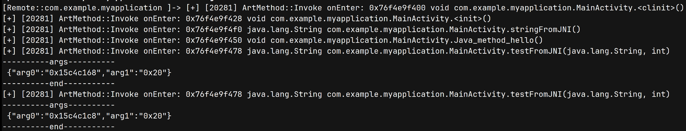
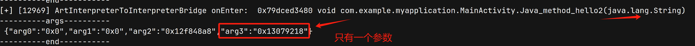
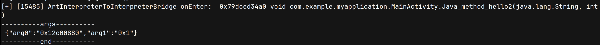
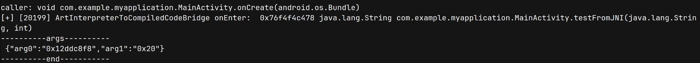
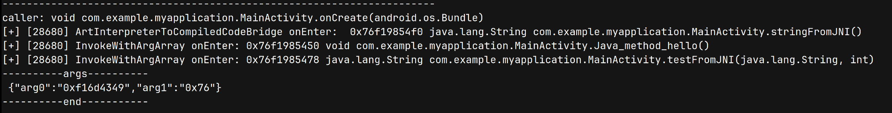
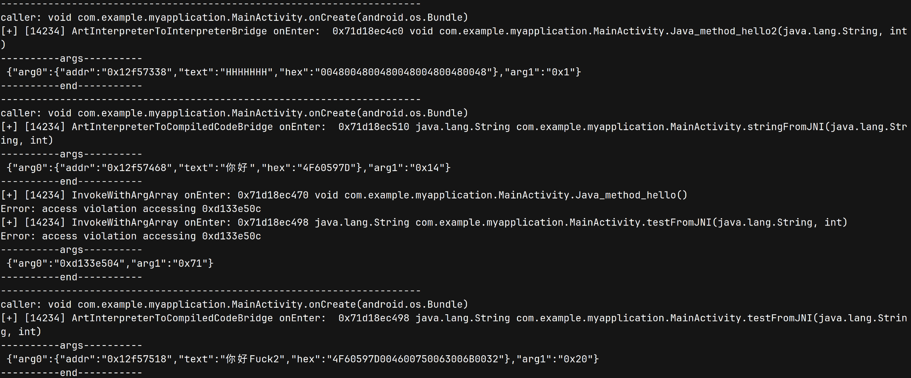

# 追踪Android方法调用2-先知社区

> **来源**: https://xz.aliyun.com/news/18130  
> **文章ID**: 18130

---

## 1. 前言

本文是对《追踪 Android 方法调用 1》所学知识的实践，通过 frida hook `ArtMethod::Invoke`、`ArtInterpreterToInterpreterBridge` 与 `ArtInterpreterToCompiledCodeBridge` 等函数，追踪以下调用关系：

* `Java->Java`
* `Java-JNI`
* `JNI-Java`
* `JNI-JNI`

通过前文的分析可知，无论哪种调用方式，其最终都会进入 `ArtMethod::Invoke` 函数，但对该函数 hook 后，发现其存在一些缺陷。然后我们将目光转向更深入的解释执行逻辑，其中 `DocallCommon` 和 `PerformCall` 都是内联函数，没办法 hook，所以只能选择 `ArtInterpreterToInterpreterBridge` 和 `ArtInterpreterToCompiledCodeBridge`，对这两个函数的 hook，可以解决 `Java-Java`、`Java-JNI` 的 caller 和 callee 关系，但对于 `JNI-xxx` 的方式无能为力，通过搜索资料后，我们发现通过 frida 打印调用栈的方式（比较耗时）和线程的顺序执行方式确认函数的调用关系。

## 2. hook ArtMethod:: Invoke

`ArtMethod::Invoke` 函数签名如下，其中有用的是传入参数：`args`，短签名：`shorty`，通过这两个参数，我们就可以对传入的参数进行解析。

```
void ArtMethod::Invoke(Thread* self, uint32_t* args, uint32_t args_size, JValue* result, const char* shorty)
```

解析参数代码可根据 aosp 源码 `BuildArgArrayFromVarArgs` 函数进行解析：

```
function parse_arg_arrays(arg_arrays: NativePointer, shorty: string) {
  let result:any = {};
  let count = 0
  let j = 0;
  let tmp_shorty = shorty.slice(1);
  for (let i of tmp_shorty) {
    switch (i) {
      case 'Z':
      case 'B':
      case 'C':
      case 'S':
      case 'I':
      case 'F':
      case 'L':
        result[`arg${j}`] = "0x" + arg_arrays.add(count).readU32().toString(16)
        count += 4;
        j += 1;
        break;
      case 'D':
      case 'J':
        result[`arg${j}`] = "0x" + arg_arrays.add(count).readU64().toString(16)
        count += 8
        j += 1;
        break;
      case 'V':
        break;
      default:
        console.log("error shorty:", i);
        break
    }
  }
  return result;
}
```

而 `ArtMethod` 对象本身，则是其第 0 个参数，通过调用 `ArtMethod::PrettyMethod(bool with_signature)` 则可以拿到被调用方法的名称。

```
std::string ArtMethod::PrettyMethod(bool with_signature)
```

通过 ida 反编译 64 位的 libart.so，我们可以用 ts 轻松的写出其调用代码。

```
function find_func(so_name: string, export_name: string, ret_type: any, args_type: any): NativeFunction<NativeFunctionReturnValue, []> | null {
  let addr = Module.findExportByName(so_name, export_name);
  let called_name = null;
  if (addr) {
    called_name = new NativeFunction(addr, ret_type, args_type);
  }
  return called_name;
}
let pretty_method_func: any = find_func("libart.so", "_ZN3art9ArtMethod12PrettyMethodEb", ["pointer", "pointer", "pointer"], ["pointer", "bool"]);
```

由于其返回类型是 `std::string`，根据 [libc++'s implementation of std:: string](https://joellaity.com/2020/01/31/string.html)，可以使用如下代码获取 js 可用的字符串：

```
function readStdString(pointers: NativePointer[]): string | null {
  let str = Memory.alloc(Process.pointerSize * 3);
  str.writePointer(pointers[0]);
  let isTiny = (str.readU8() & 1) === 0;
  if (isTiny) {
    str.add(Process.pointerSize * 1).writePointer(pointers[1]);
    str.add(Process.pointerSize * 2).writePointer(pointers[2]);
    return str.add(1).readUtf8String();
  }
  else {
    return pointers[2].readUtf8String();
  }
}
```

完整的 hook ArtMethod:: Invoke 代码即如下所示：

```
export function hook_ArtMethod_Invoke() {

    let module = Process.findModuleByName("libart.so");
    let symbols = module ? module.enumerateSymbols() : [];
    let addr_artmethod_invoke = null;
    for (let symbol of symbols) {
        if (symbol.name.indexOf("_ZN3art9ArtMethod6InvokeEPNS_6ThreadEPjjPNS_6JValueEPKc") >= 0) {
            addr_artmethod_invoke = symbol.address;
            console.log(addr_artmethod_invoke, symbol.name);
            break;
        }
    }

    if (addr_artmethod_invoke) {
        Interceptor.attach(addr_artmethod_invoke, {
            onEnter: function (args) {
                this.artmethod = args[0];
                this.tid = args[1].add(0x10).readU32();
                this.arg_arrays = args[2];
                this.shorty = args[5].readCString();
                let func_name = readStdString(pretty_method_func(ptr(this.artmethod), 1));
                this.hooked = 0;
                if (func_name?.includes("com.example")) {
                    this.hooked = 1;
                    let artmethod_args = parse_arg_arrays(this.arg_arrays, this.shorty);
                    console.log("[+] [" + this.threadId + "] ArtMethod::Invoke onEnter:", ptr(this.artmethod), func_name);
                    if (Object.keys(artmethod_args).length > 0) {

                        console.log("----------args----------
", JSON.stringify(artmethod_args), "
----------end-----------");
                    }
                }

            },
            onLeave: function (retval) {

            }
        });

    }
}
```

测试代码如下，MainActivity 调用 `stringFromJNI`，`stringFromJNI` 调用 Java 层函数 `Java_method_hello` 和 JNI 函数 `testFromJNI`。

```
// MainActivity.java  
protected void onCreate(Bundle savedInstanceState) {
        super.onCreate(savedInstanceState);

        binding = ActivityMainBinding.inflate(getLayoutInflater());
        setContentView(binding.getRoot());

        // Example of a call to a native method
        Java_method_hello2("HHHHHHH", 1);
        TextView tv = binding.sampleText;
        tv.setText(stringFromJNI());
        tv.setText(testFromJNI("Fuck2", 32));
    }

    /**
     * A native method that is implemented by the 'myapplication' native library,
     * which is packaged with this application.
     */
    public static void Java_method_hello() {
        Log.i("myapplication2", "Java_method_hello: " + "Hello World!!!");
    }
    public void Java_method_hello2(String H, int a) {
        Log.i("myapplication2", "Java_method_hello2: " + H);
    }
    public native String stringFromJNI();
    public static native String testFromJNI(String text, int num);

// native-lib.cpp
extern "C" JNIEXPORT jstring JNICALL
Java_com_example_myapplication_MainActivity_stringFromJNI(
        JNIEnv* env,
        jobject /* this */) {
    std::string hello = "Hello from C++";
    auto m = normal_func();
    jclass mainActivityClass = env->FindClass("com/example/myapplication/MainActivity");
    jmethodID methodId = env->GetStaticMethodID(mainActivityClass, "Java_method_hello", "()V");
    env->CallStaticVoidMethod(mainActivityClass, methodId);
    jmethodID methodId2 = env->GetStaticMethodID(mainActivityClass, "testFromJNI", "(Ljava/lang/String;I)Ljava/lang/String;");
    jstring jstr = env->NewStringUTF("Fuck");
    env->CallStaticObjectMethod(mainActivityClass, methodId2, jstr, 32);
    if(mainActivityClass) {
        env->DeleteLocalRef(mainActivityClass);
        env->DeleteLocalRef(jstr);
    }
    return env->NewStringUTF(hello.c_str());
}

extern "C" JNIEXPORT jstring JNICALL
Java_com_example_myapplication_MainActivity_testFromJNI(
        JNIEnv* env,
        jclass,
        jstring text,
        jint num) {
    std::string hello = "Hello from C++";
    hello += std::string(env->GetStringUTFChars(text, nullptr) + std::to_string(num));
    return env->NewStringUTF(hello.c_str());
}
```



从执行结果来看，hook `ArtMethod::Invoke` 并没有给出 `Java_method_hello2("HHHHHH", 1)` 的调用，与《追踪 Android 方法调用 1》分析一致，在 `Java->Java` 流程中，caller 在调用 callee 时，直接通过 `ArtInterpreterToInterpreterBridge` 回到 `Execute` 执行，而不会走 `ArtMethod::Invoke`。

## 3. 处理 Java 层调用追踪

### 3.1 选择 hook 对象

其次，可以比较清晰的从上图的结果中看出，MainActivity 中发生了哪些函数的调用，但无法知晓 caller。回顾《追踪 Android 方法调用 1》，我们可以使用 `DoCall`、`DoCallCommon`、`PerformCall`、`ArtInterpreterToCompiledCodeBridge`、`ArtInterpreterToInterpreterBridge` 拿到 `Java->JNI` 和 `Java->Java` 的 caller 和 callee。（PS：原理上看，`ExecuteMterpImpl(self, accessor.Insns(), &shadow_frame, &result_register)` 或者 `ExecuteSwitchImpl<false, false>(self, accessor, shadow_frame, result_register, false)` 都可以通过 shadow\_frame，拿到 caller 和 callee。）

但非内联函数，只剩下 `DoCall`，`ArtInterpreterToCompiledCodeBridge`, `ArtInterpreterToInterpreterBridge`，而 `DoCall` 还没有构造 callee\_shadow\_frame，不利于我们获取 callee 的传入参数，所以最终选择只剩下：`ArtInterpreterToInterpreterBridge` 和 `ArtInterpreterToCompiledCodeBridge`，其分别代表 `Java->Java` 和 `Java-JNI`。

```
void ArtInterpreterToInterpreterBridge(Thread* self,
                                       const CodeItemDataAccessor& accessor,
                                       ShadowFrame* shadow_frame,
                                       JValue* result);

void ArtInterpreterToCompiledCodeBridge(Thread* self,
                                        ArtMethod* caller,
                                        ShadowFrame* shadow_frame,
                                        uint16_t arg_offset,
                                        JValue* result);
```

### 3.2 解析 ShadowFrame

ShadowFrame 的内存布局如下：

```
  ShadowFrame* link_;
  ArtMethod* method_;
  JValue* result_register_;
  const uint16_t* dex_pc_ptr_;
  const uint16_t* dex_instructions_;
  LockCountData lock_count_data_; // 占一个指针的size
  const uint32_t number_of_vregs_;
  uint32_t dex_pc_;
  int16_t cached_hotness_countdown_;
  int16_t hotness_countdown_;
  uint32_t frame_flags_;
  uint32_t vregs_[0];
```

其中较为有用的信息是：

* `method_`: 用于获取函数名
* `number_of_vregs_`：虚拟寄存器数量，可以用于获取传入参数
* `vregs_[0]`：虚拟寄存器，实际参数所在

但需要注意的是，**vregs\_不仅包含了我们所需要的参数，还包含了函数局部变量所需的寄存器。我们知道参数实际数量是 CodeItem 中定义的** `ins_size_` **决定，所以** `vregs[number_of_vregs_ - ins_size: number_of_vregs]` **才是实际的参数位置。**



在上文中，通过 `shorty` 解析 `ArgArray` 的参数时，可知 double、long 类型的参数占用 8 个字节，其他的参数占用 4 个字节。所以也需要知道 `shorty` 才方便解析 `vregs_`。

通过 `ArtMethod` 解析 `DexFile` 对象，可以获取到 `shorty`，但对于 frida 来说比较麻烦。所以我们可以选择直接对 `PrettyMethod` 返回的的函数名进行解析。

我们可以通过如下 js 代码获取 shadow\_frame 包含的信息：

```
function parse_shadowframe(shadowframe_ptr: NativePointer) {
    const artmethod_ptr = shadowframe_ptr.add(Process.pointerSize).readPointer();
    const number_of_vregs = shadowframe_ptr.add(Process.pointerSize * 6).readU32();
    const vregs_ = shadowframe_ptr.add(Process.pointerSize * 6 + 16);
    return { "artmethod_ptr": artmethod_ptr, "called_args": vregs_, "number_of_vregs": number_of_vregs };
}
```

再对 `callee_artmethod_name` 进行解析，获取参数数量与 `shorty`。

```
function parse_args_from_method_name(method_name: string) {
    const start = method_name.indexOf("(");
    const end = method_name.indexOf(")");
    const args = method_name.slice(start + 1, end);
    if (args.length == 0) {
        return { "shorty": "V", "args_size": 0 };
    }

    let shorty = "V";
    let args_size = 0;
    for (let key of args.split(",")) {
        key = key.trim().replace("[", "").replace("]", "");
        switch (key) {
            case "int":
                shorty += "I";
                args_size += 1;
                break;
            case "double":
                shorty += "D";
                args_size += 2;
                break;
            case "char":
                shorty += "C";
                args_size += 1;
                break;
            case "boolean":
                shorty += "Z";
                args_size += 1;
                break;
            case "long":
                shorty += "J";
                args_size += 2;
                break;
            case "float":
                shorty += "F";
                args_size += 1;
                break;
            case "short":
                shorty += "S";
                args_size += 1;
                break;
            case "byte":
                shorty += "B";
                args_size += 1;
                break;
            default:
                shorty += "L";
                args_size += 1;
                break;
        }
    }
    return { "shorty": shorty, "args_size": args_size };
}
```

此时便可以获取正确的参数：



### 3.3 hook ArtInterpreterToInterpreterBridge

回过头观察 `ArtInterpreterToInterpreterBridge` 调用，其 `accessor` 和 `callee_frame` 都只有被调用函数的信息。

```
interpreter::ArtInterpreterToInterpreterBridge(self, accessor, callee_frame, result);
```

但回顾上文 `ShadowFrame` 的内存布局，可知其第一个成员指向了 caller\_shadow\_frame。所以我们可以使用如下代码获取 caller 信息：

```
const caller_shadow_frame_ptr = args[2].readPointer();
if (caller_shadow_frame_ptr.toString() != "0x0") {
    const caller_artmethod_ptr = caller_shadow_frame_ptr.add(Process.pointerSize).readPointer();
    console.log("caller:", readStdString(pretty_method_func(caller_artmethod_ptr, 1)))
}
```



### 3.4 hook ArtInterpreterToCompiledCodeBridge

由于 `ArtInterpreterToCompiledCodeBridge` 参数中自带 caller，所以无需再通过 `ShadowFrame->link_` 解析。

```
void ArtInterpreterToCompiledCodeBridge(Thread* self,
                                        ArtMethod* caller,
                                        ShadowFrame* shadow_frame,
                                        uint16_t arg_offset,
                                        JValue* result);
```



## 4. 处理 JNI 层调用追踪

`ArtInterpreterToInterpreterBridge` 和 `ArtInterpreterToCompiledCodeBridge` 无法监测到 JNI 层发起的函数调用。在 `ArtMethod::Invoke` 中其会通过 `art_quick_invoke_stub` 和 `art_quick_invoke_static_stub`，这两个函数也没有参数包含了栈信息。

```
  if (!IsStatic()) {
    (*art_quick_invoke_stub)(this, args, args_size, self, result, shorty);
  } else {
    (*art_quick_invoke_static_stub)(this, args, args_size, self, result, shorty);
  }
```

而 Java 层调用和 JNI 层调用都会执行到 `ArtMethod::Invoke`，为了方便区分 JNI 层发起的调用，我们可以选择在 JNI 层的前一个环节：`InvokeWithArgArray`，其签名如下，我们可以使用上文解析 `ArtMethod::Invoke` 的代码对其进行解析。

```
void InvokeWithArgArray(const ScopedObjectAccessAlreadyRunnable& soa,
                               ArtMethod* method, ArgArray* arg_array, JValue* result,
                               const char* shorty);
export function hook_InvokeWithArgArray(filter: string) {
    let module = Process.findModuleByName("libart.so");
    let symbols = module ? module.enumerateSymbols() : [];
    let addr_ = null;
    for (let symbol of symbols) {
        if (symbol.name.indexOf("InvokeWithArgArray") >= 0) {
            addr_ = symbol.address;
            break;
        }
    }

    if (addr_) {
        Interceptor.attach(addr_, {
            onEnter: function (args) {
                const artmethod_ptr = args[1];
                const tid = args[0].readPointer().add(0x10).readU32()
                const arg_arrays = args[2];
                const shorty: any = args[4].readCString();
                let func_name = readStdString(pretty_method_func(artmethod_ptr, 1));
                if (func_name?.includes(filter)) {
                    this.hooked = 1;
                    let artmethod_args = parse_arg_arrays(arg_arrays, shorty);
                    console.log("[+] [" + tid + "] InvokeWithArgArray onEnter:", artmethod_ptr, func_name);
                    if (Object.keys(artmethod_args).length > 0) {

                        console.log("----------args----------
", JSON.stringify(artmethod_args), "
----------end-----------");
                    }
                    // console.log("
Backtrace infomations: 
" + Thread.backtrace(this.context, Backtracer.ACCURATE).map(DebugSymbol.fromAddress).join("
") + "
");
                }

            },
            onLeave: function (retval) {

            }
        });

    }
}
```


## 5. 读取内存字符串

当参数类型是 `java.lang.String`，则可以将其解析为可读的字符串。根据 `art/runtime/mirror/string.h` 定义，字符串分为 compressed 类型和非 compressed 类型，compressed 是单个字节表示字符，采用 ascii 码编码；非 compressed 是 2 个字节编码，采用 utf16 编码。

```
static constexpr bool kUseStringCompression = true;
enum class StringCompressionFlag : uint32_t {
    kCompressed = 0u,
    kUncompressed = 1u
};

// C++ mirror of java.lang.String
class MANAGED String final : public Object {
 public:

  ALWAYS_INLINE static bool IsCompressed(int32_t count) {
    return GetCompressionFlagFromCount(count) == StringCompressionFlag::kCompressed;
  }

  ALWAYS_INLINE static StringCompressionFlag GetCompressionFlagFromCount(int32_t count) {
    return kUseStringCompression
        ? static_cast<StringCompressionFlag>(static_cast<uint32_t>(count) & 1u)
        : StringCompressionFlag::kUncompressed;
  }

  ALWAYS_INLINE static int32_t GetLengthFromCount(int32_t count) {
    return kUseStringCompression ? static_cast<int32_t>(static_cast<uint32_t>(count) >> 1) : count;
  }


 private:

  // Field order required by test "ValidateFieldOrderOfJavaCppUnionClasses".

  // If string compression is enabled, count_ holds the StringCompressionFlag in the
  // least significant bit and the length in the remaining bits, length = count_ >> 1.
  int32_t count_;

  uint32_t hash_code_;

  // Compression of all-ASCII into 8-bit memory leads to usage one of these fields
  union {
    uint16_t value_[0];
    uint8_t value_compressed_[0];
  };
};
```

所以可以用以下 frida 代码解析内存中的字符串，修改 `parse_arg_arrays` 函数，增加：

```
            case 'L':
                result[`arg${j}`] = "0x" + arg_arrays.add(count).readU32().toString(16)
                if (i === 'L' && long_shorty[j] == "java.lang.String") {
                    // java.lang.String C++ mirror 偏移 16字节
                    try {
                        // 字符串指针
                        const text_ptr = ptr(result[`arg${j}`]).add(0x10);

                        let text = null;
                        // 字符串长度
                        const count_ = ptr(result[`arg${j}`]).add(0x8).readU32();
                        
                        if((count_ & 1) == 0) {
                            // compressed type
                            text = text_ptr.readCString(count_ >> 1);
                        }
                        else {
                            text = text_ptr.readUtf16String(count_ >> 1)
                        }
                        

                        // console.log("count_", count_, hexdump(ptr(result[`arg${j}`])));
                        result[`arg${j}`] = {"addr": result[`arg${j}`], "text": text, "hex": stringToHexCharCode(text)}
                    } catch (error) {
                        console.log(error)
                    }
                    
                }
                count += 4;
                j += 1;
                break;
```



完整的代码：`https://github.com/youncyb/trace_android_call`

## 参考

1. [纯 frida 实现 smali 追踪.md](https://github.com/SeeFlowerX/frida-smali-trace/blob/master/纯frida实现smali追踪.md)
2. [使用 Frida 打印 Java 类函数调用关系](https://bbs.kanxue.com/thread-263189.htm)
3. [libc++'s implementation of std:: string](https://joellaity.com/2020/01/31/string.html)
